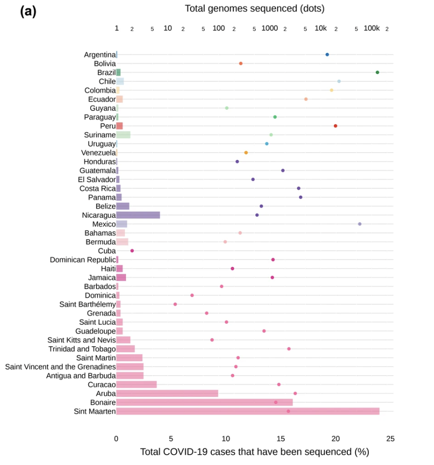

install.packages("distill")

library(distill)

---
title: "Dispersion patterns of SARS-CoV-2 variants Gamma, Lambda and Mu in Latin America and the Caribbean"
description: |
The graph illustrates the total number of genomes sequenced alongside the proportion of sequenced COVID-19 cases.
categories: "2025"
author: Gina Tedesco
date: "`r Sys.Date()`"
output:
  distill::distill_article:
  self_contained: FALSE
  toc: TRUE

---

#The COVID-19 pandemic disproportionately impacted Latin America and the Caribbean (LAC), revealing significant inequalities in health infrastructure and surveillance capacity across the region. In response, the Pan American Health Organization (PAHO) established the COVID-19 Genomic Surveillance Regional Network (COVIGEN) to strengthen genomic sequencing and enable the timely identification of viral variants. From February 2020 to March 2022, this initiative resulted in the sequencing of 126,985 SARS-CoV-2 genomes across 32 LAC countries and territories. Expanding this dataset with genomes from the GISAID database brought the total analyzed to 296,286 genomes from 41 regions, providing a comprehensive view of genomic diversity. The study highlighted disparities in sequencing efforts, ranging from below 0.05% to over 10% of total COVID-19 cases, with countries such as Brazil, Argentina, Colombia, Mexico, and Peru contributing 80% of the sequences. The emergence of regional Variants of Interest (VOIs) like Gamma, Lambda, and Mu emphasized the importance of COVIGEN in tracking viral evolution and guiding public health responses. This analysis further explored the dynamics of variant dissemination by incorporating air traffic data and mobility restrictions to model viral spread patterns, offering insights into the interplay between epidemiology and social behavior during the pandemic.

{width="100%"}

## Getting the Data

#The data for this graph was derived from the SARS-CoV-2 genomic surveillance efforts coordinated through the COVID-19 Genomic Surveillance Regional Network (COVIGEN). From its inception in March 2020 to March 2022, COVIGEN supported the sequencing of 126,985 SARS-CoV-2 genomes from 32 countries and territories in Latin America and the Caribbean (LAC). To create a more comprehensive dataset, these genomes were supplemented with additional sequences and metadata obtained from the EpiCoV database hosted on GISAID, covering the same period and geographic region. This aggregation resulted in a dataset of 296,286 genomes from 41 countries and territories, providing a summarized view of genomic diversity and sequencing efforts across the region. The data was further aggregated by combining geographically proximate countries into broader locations, enabling a summarized representation of viral sequencing and lineage diversity. The data specific to this graph was available in the paper's "Data Availability" section.

## Recreating the Graph
### Required Libraries

- `tidyverse`: unifies workflows by integrating ggplot2 for graphics and dplyr for data manipulation, providing a consistent and intuitive grammar for transforming and visualizing data.
- `dplyr`: allows intuitive manipulation of data, readable operations on datasets through verb-like functions that transform and reshape data in predictable ways.
- `ggtext`: an extension to ggplot2 that enhances text rendering capabilities
- `googlesheets4`: reads and writes Google Sheets directly in R


```{r}
library(tidyverse)
library(dplyr)
library(ggtext)
library(googlesheets4)
```

### Country Order Definition
#This step defines a custom order for the countries in the visualization. The order is crucial for the graph's readability

```{r}
country_order <- c(
  "Argentina", "Bolivia", "Brazil", "Chile", "Colombia", "Ecuador", "Guyana",
  "Paraguay", "Peru", "Suriname", "Uruguay", "Venezuela", "Honduras",
  "Guatemala", "El Salvador", "Costa Rica", "Panama", "Belize", "Nicaragua",
  "Mexico", "Bahamas", "Bermuda", "Cuba", "Dominican Republic", "Haiti",
  "Jamaica", "Barbados", "Dominica", "Saint Barthélemy", "Grenada",
  "Saint Lucia", "Guadeloupe", "Saint Kitts and Nevis", "Trinidad and Tobago",
  "Saint Martin", "Saint Vincent and the Grenadines", "Antigua and Barbuda",
  "Curacao", "Aruba", "Bonaire", "Sint Maarten"
)
```

### Data Loading Preparation
Use read_sheet() to load data from Google Sheets
Convert Country to a factor with a specific order
Remove any rows with missing country data

```{r}
covid_data <- read_sheet("https://docs.google.com/spreadsheets/d/18HUp5w-ncftAzsfPpR9yiIo-IS7ui_QmjGEd0O-LGWk/edit?gid=0#gid=0") %>%
  mutate(
    Country = factor(Country, levels = rev(country_order))
  )
```

### Transformation Function
This function transforms genome counts to a percentage scale, using a logarithmic transformation to handle wide ranges of data.

```{r}
genome_to_pct <- function(x) {
  x_log <- log10(x)
  min_log <- log10(2)  # Minimum genome count
  max_log <- log10(129677)  # Maximum genome count
  scaled_value <- 2.5 + ((x_log - min_log) / (max_log - min_log)) * 19.5
  return(scaled_value)
}
breaks<- c(0.5, 1, 2, 5, 10, 20, 50, 100, 200, 500, 1000, 2000, 5000, 10000, 20000, 50000, 100000)

```

### Plotting the Graph

```{r}
ggplot() +
  # Bars for percentage sequenced
  geom_col(
    data = covid_data,
    aes(x = Prop_sequenced_cases, y = Country, fill = Country),
    alpha = 0.6,  # Match target style
    width = 0.8
  ) +
  # Dots for genome counts
  geom_point(
    data = covid_data,
    aes(x = genome_to_pct(Genomes), y = Country, color = Country),
    size = 1.3
  ) +
  # Adjust x-axis for percentage sequenced
  scale_x_continuous(
    name = "Total COVID-19 cases that have been sequenced (%)",
    limits = c(0, 25),
    breaks = seq(0, 25, 5),
    expand = c(0, 0),
    sec.axis = sec_axis(
      # Transformation function for genome counts
      ~10^((. - 2.5) / 19.5 * (log10(129677) - log10(2)) + log10(2)),
      name = "Total genomes sequenced (dots)",
      # Breaks adjusted to reflect the logarithmic scale starting with 1
      breaks = breaks,
      # Labels following your specified pattern
      labels = c(ifelse(breaks %in% c(1, 10, 100, 1000, 10000, 100000),
                        paste0("<span style='color=black;font-weight:900;font-size:7pt'><b>", ifelse(breaks > 1000, paste0(breaks/1000, 'k'), breaks), "</span>"),
                        paste0("<span style='font-size:6pt'>", str_sub(breaks, 1, 1), "</b></span>"))[-1], "<span style='font-size:6pt'>2</b></span>")

    )) +
  # Custom fill colors for bars
  scale_fill_manual(values = c(
    "Argentina" = "#7F9EB4", "Bolivia" = "#5aae61", "Brazil" = "#107c4c",
    "Chile" = "#D0E7F1", "Colombia" = "#fcdca1", "Ecuador" = "#f7ac91",
    "Guyana" = "#CCE6D0", "Paraguay" = "#5bc686", "Peru" = "#e22629",
    "Suriname" = "#a6e0a6", "Uruguay" = "#AFC6D0", "Venezuela" = "#e5c195",
    "Honduras" = "#a286c9", "Guatemala" = "#7447b7", "El Salvador" = "#7447b7",
    "Costa Rica" = "#7447b7", "Panama" = "#7447b7", "Belize" = "#7447b7",
    "Nicaragua" = "#7447b7", "Mexico" = "#a3a1ed", "Bahamas" = "#FECFD5",
    "Bermuda" = "#FECFD5", "Cuba" = "#FECFD5", "Dominican Republic" = "#f21d92",
    "Haiti" = "#f21d92", "Jamaica" = "#f21d92", "Barbados" = "#ff69a0",
    "Dominica" = "#ff69a0", "Saint Barthélemy" = "#ff69a0", "Grenada" = "#ff69a0",
    "Saint Lucia" = "#ff69a0", "Guadeloupe" = "#ff69a0", "Saint Kitts and Nevis" = "#ff69a0",
    "Trinidad and Tobago" = "#ff69a0", "Saint Martin" = "#ff69a0",
    "Saint Vincent and the Grenadines" = "#ff69a0", "Antigua and Barbuda" = "#ff69a0",
    "Curacao" = "#ff69a0", "Aruba" = "#ff69a0", "Bonaire" = "#ff69a0",
    "Sint Maarten" = "#ff69a0"
  )) +
  # Custom colors for dots
  scale_color_manual(values = c(
    "Argentina" = "#176EA9", "Bolivia" = "#F76F4E", "Brazil" = "#008C3C",
    "Chile" = "#B6D1DA", "Colombia" = "#F6D98E", "Ecuador" = "#FEAE92",
    "Guyana" = "#A8E3B5", "Paraguay" = "#46C383", "Peru" = "#E92721",
    "Suriname" = "#A9E7B4", "Uruguay" = "#3FAFD5", "Venezuela" = "#FB9E1E",
    "Honduras" = "#6E52A8", "Guatemala" = "#6E52A8", "El Salvador" = "#6E52A8",
    "Costa Rica" = "#6E52A8", "Panama" = "#6E52A8", "Belize" = "#6E52A8",
    "Nicaragua" = "#6E52A8", "Mexico" = "#A19AC4", "Bahamas" = "#FDB6BE",
    "Bermuda" = "#FDB6BE", "Cuba" = "#E7298E", "Dominican Republic" = "#E7298E",
    "Haiti" = "#E7298E", "Jamaica" = "#E7298E", "Barbados" = "#FF6CA4",
    "Dominica" = "#FF6CA4", "Saint Barthélemy" = "#FF6CA4", "Grenada" = "#FF6CA4",
    "Saint Lucia" = "#FF6CA4", "Guadeloupe" = "#FF6CA4", "Saint Kitts and Nevis" = "#FF6CA4",
    "Trinidad and Tobago" = "#FF6CA4", "Saint Martin" = "#FF6CA4",
    "Saint Vincent and the Grenadines" = "#FF6CA4", "Antigua and Barbuda" = "#FF6CA4",
    "Curacao" = "#FF6CA4", "Aruba" = "#FF6CA4", "Bonaire" = "#FF6CA4",
    "Sint Maarten" = "#FF6CA4"
  )) +
  labs(y = NULL) +
  theme_minimal() +
  theme(
    panel.grid.major.y = element_line(color = "gray90"),
    panel.grid.major.x = element_blank(),
    panel.grid.minor = element_blank(),
    axis.text.y = element_text(size = 10, hjust = 1),
    axis.text.x = element_text(size = 10),
    axis.text.x.sec = element_text(size = 10),
    axis.text=element_markdown (),
    axis.title.x = element_text(size = 12),
    legend.position = "none",  # No legend
    plot.margin = margin(1, 1, 1, 1, "cm")
  )

```

While this graph is very informative, it is challenging to read. First, there are too many colors associated with the countries that don't suggest any obvious pattern. Since it is a double x-axis graph it's hard to understand where one should begin to interpret the graph.


## Alternative Graph 1
In this version of the graph, I have regrouped the countries by their respective regions: South America, North and Central America, and the Caribbean. Where there was previously too many colors I have now concentrated it to three colors- one for each region. By restructured the countries in this way and in descending order the readers focus should be pulled towards to the "Total COVID-19 cases that have been sequenced (%)" data. This allows a more organized way of interpreting the graph.

### Define New Country order

This step redefines the countries in descending order by "Total COVID-19 cases that have been sequenced (%)"

```{r}
# Define new country order
country_order <- c(
  "Bolivia", "Argentina", "Uruguay", "Venezuela", "Paraguay", "Guyana",
  "Colombia", "Brazil", "Peru", "Ecuador", "Chile", "Suriname",
  "Honduras", "Guatemala", "El Salvador", "Costa Rica", "Panama",
  "Mexico", "Belize", "Nicaragua", "Cuba", "Dominican Republic",
  "Barbados", "Dominica", "Grenada", "Saint Barthélemy", "Guadeloupe",
  "Haiti", "Saint Lucia", "Bahamas", "Jamaica", "Bermuda",
  "Saint Kitts and Nevis", "Trinidad and Tobago", "Saint Martin",
  "Saint Vincent and the Grenadines", "Antigua and Barbuda",
  "Curacao", "Aruba", "Bonaire", "Sint Maarten"
)
```

### Data Loading Preparation

Use read_sheet() to load data from Google Sheets
Convert Country to a factor with a specific order
Remove any rows with missing country data

```{r}
# Read and clean the dataset
covid_data <- read_sheet("https://docs.google.com/spreadsheets/d/18HUp5w-ncftAzsfPpR9yiIo-IS7ui_QmjGEd0O-LGWk/edit?gid=0#gid=0") %>%
  mutate(
    Country = factor(Country, levels = rev(country_order))  # Align with updated country order
  ) %>%
  filter(!is.na(Country))  # Remove rows with NA in Country
```

### Transformation Function

This function transforms genome counts to a percentage scale, using a logarithmic transformation to handle wide ranges of data.

```{r}
genome_to_pct <- function(x) {
  x_log <- log10(x)
  min_log <- log10(2)  # Minimum genome count
  max_log <- log10(129677)  # Maximum genome count
  scaled_value <- 2.5 + ((x_log - min_log) / (max_log - min_log)) * 19.5
  return(scaled_value)
}

# Define breaks
breaks <- c(1, 10, 100, 1000, 10000, 100000)

```

### Plotting the Graph

```{r}
# Plot
ggplot() +
  # Bars for percentage sequenced
  geom_col(
    data = covid_data,
    aes(x = Prop_sequenced_cases, y = Country, fill = Country),
    alpha = 0.6,  # Match target style
    width = 0.8
  ) +
  # Dots for genome counts
  geom_point(
    data = covid_data,
    aes(x = genome_to_pct(Genomes), y = Country, color = Country),
    size = 1.3
  ) +
  # Adjust x-axis for percentage sequenced
  scale_x_continuous(
    name = "Total COVID-19 cases that have been sequenced (%)",
    limits = c(0, 25),
    breaks = seq(0, 25, 5),
    expand = c(0, 0),
    sec.axis = sec_axis(
      trans = ~10^((. - 0) / 25 * (log10(129677) - log10(1)) + log10(1)),
      name = "Total genomes sequenced (dots)",
      breaks = breaks,
      labels = c("1", "10", "100", "1k", "10k", "100k")
    )
  ) +
  # Custom fill colors for bars
  scale_fill_manual(values = c(
    "Argentina" = "#ea874b", "Bolivia" = "#ea874b", "Brazil" = "#ea874b",
    "Chile" = "#ea874b", "Colombia" = "#ea874b", "Ecuador" = "#ea874b",
    "Guyana" = "#ea874b", "Paraguay" = "#ea874b", "Peru" = "#ea874b",
    "Suriname" = "#ea874b", "Uruguay" = "#ea874b", "Venezuela" = "#ea874b",
    "Honduras" = "#a6e0a6", "Guatemala" = "#a6e0a6", "El Salvador" = "#a6e0a6",
    "Costa Rica" = "#a6e0a6", "Panama" = "#a6e0a6", "Belize" = "#a6e0a6",
    "Nicaragua" = "#a6e0a6", "Mexico" = "#a6e0a6", "Bahamas" = "#4b85ea",
    "Bermuda" = "#4b85ea", "Cuba" = "#4b85ea", "Dominican Republic" = "#4b85ea",
    "Haiti" = "#4b85ea", "Jamaica" = "#4b85ea", "Barbados" = "#4b85ea",
    "Dominica" = "#4b85ea", "Saint Barthélemy" = "#4b85ea", "Grenada" = "#4b85ea",
    "Saint Lucia" = "#4b85ea", "Guadeloupe" = "#4b85ea", "Saint Kitts and Nevis" = "#4b85ea",
    "Trinidad and Tobago" = "#4b85ea", "Saint Martin" = "#4b85ea",
    "Saint Vincent and the Grenadines" = "#4b85ea", "Antigua and Barbuda" = "#4b85ea",
    "Curacao" = "#4b85ea", "Aruba" = "#4b85ea", "Bonaire" = "#4b85ea",
    "Sint Maarten" = "#4b85ea"
  )) +
  # Custom colors for dots
  scale_color_manual(values = c(
    "Argentina" = "#a4501e", "Bolivia" = "#a4501e", "Brazil" = "#a4501e",
    "Chile" = "#a4501e", "Colombia" = "#a4501e", "Ecuador" = "#a4501e",
    "Guyana" = "#a4501e", "Paraguay" = "#a4501e", "Peru" = "#a4501e",
    "Suriname" = "#a4501e", "Uruguay" = "#a4501e", "Venezuela" = "#a4501e",
    "Honduras" = "#236a42", "Guatemala" = "#236a42", "El Salvador" = "#236a42",
    "Costa Rica" = "#236a42", "Panama" = "#236a42", "Belize" = "#236a42",
    "Nicaragua" = "#236a42", "Mexico" = "#236a42", "Bahamas" = "#23447a",
    "Bermuda" = "#23447a", "Cuba" = "#23447a", "Dominican Republic" = "#23447a",
    "Haiti" = "#23447a", "Jamaica" = "#23447a", "Barbados" = "#23447a",
    "Dominica" = "#23447a", "Saint Barthélemy" = "#23447a", "Grenada" = "#23447a",
    "Saint Lucia" = "#23447a", "Guadeloupe" = "#23447a", "Saint Kitts and Nevis" = "#23447a",
    "Trinidad and Tobago" = "#23447a", "Saint Martin" = "#23447a",
    "Saint Vincent and the Grenadines" = "#23447a", "Antigua and Barbuda" = "#23447a",
    "Curacao" = "#23447a", "Aruba" = "#23447a", "Bonaire" = "#23447a",
    "Sint Maarten" = "#23447a"
  )) +
  labs(y = NULL) +
  theme_minimal() +
  theme(
    panel.grid.major.y = element_line(color = "gray90"),
    panel.grid.major.x = element_blank(),
    panel.grid.minor = element_blank(),
    axis.text.y = element_text(size = 10, hjust = 1),
    axis.text.x = element_text(size = 10),
    axis.text.x.sec = element_text(size = 10),
    axis.text = element_markdown(),
    axis.title.x = element_text(size = 12),
    legend.position = "none",  # No legend
    plot.margin = margin(1, 1, 1, 1, "cm")
  )

```

## Alternative Graph 2
This second alternative of the graph keeps the countries grouped by their regions and their respective colors from the first alternative graph. However, they are now instead organized by "Total genomes sequenced (dots)" in ascending order. Again the purpose here is to draw the readers focus to the data provided by one of the x-axis, instead of spending time trying to decipher both x-axis at the same time. This allows a more structured way to understand the information being presented.

### Define New Country order

This step redefines the countries in ascending order by "Total genomes sequenced (dots)"

```{r}
# Define new country order
country_order <- c(
  "Brazil", "Chile", "Peru", "Colombia", "Argentina", "Ecuador", "Paraguay",
  "Suriname", "Uruguay", "Venezuela", "Bolivia", "Guyana", "Mexico", "Panama",
  "Costa Rica", "Guatemala", "Belize", "Nicaragua", "El Salvador", "Honduras",
  "Aruba", "Trinidad and Tobago", "Sint Maarten", "Curacao", "Bonaire",
  "Dominican Republic", "Jamaica", "Guadeloupe", "Bahamas", "Saint Martin",
  "Saint Vincent and the Grenadines", "Antigua and Barbuda", "Haiti",
  "Saint Lucia", "Bermuda", "Barbados", "Saint Kitts and Nevis", "Grenada",
  "Dominica", "Saint Barthélemy", "Cuba"
)
```

### Data Loading Preparation
Use read_sheet() to load data from Google Sheets
Convert Country to a factor with a specific order
Remove any rows with missing country data

```{r}
# Read and clean the dataset
covid_data <- read_sheet("https://docs.google.com/spreadsheets/d/18HUp5w-ncftAzsfPpR9yiIo-IS7ui_QmjGEd0O-LGWk/edit?gid=0#gid=0") %>%
  mutate(
    Country = factor(Country, levels = rev(country_order))  # Align with updated country order
  ) %>%
  filter(!is.na(Country))  # Remove rows with NA in Country
```

### Transformation Function
This function transforms genome counts to a percentage scale, using a logarithmic transformation to handle wide ranges of data.

```{r}
genome_to_pct <- function(x) {
  x_log <- log10(x)
  min_log <- log10(2)  # Minimum genome count
  max_log <- log10(129677)  # Maximum genome count
  scaled_value <- 2.5 + ((x_log - min_log) / (max_log - min_log)) * 19.5
  return(scaled_value)
}

# Define breaks
breaks <- c(1, 10, 100, 1000, 10000, 100000)

```

### Plotting the Graph

```{r}
# Plot
ggplot() +
  # Bars for percentage sequenced
  geom_col(
    data = covid_data,
    aes(x = Prop_sequenced_cases, y = Country, fill = Country),
    alpha = 0.6,  # Match target style
    width = 0.8
  ) +
  # Dots for genome counts
  geom_point(
    data = covid_data,
    aes(x = genome_to_pct(Genomes), y = Country, color = Country),
    size = 1.3
  ) +
  # Adjust x-axis for percentage sequenced
  scale_x_continuous(
    name = "Total COVID-19 cases that have been sequenced (%)",
    limits = c(0, 25),
    breaks = seq(0, 25, 5),
    expand = c(0, 0),
    sec.axis = sec_axis(
      trans = ~10^((. - 0) / 25 * (log10(129677) - log10(1)) + log10(1)),
      name = "Total genomes sequenced (dots)",
      breaks = breaks,
      labels = c("1", "10", "100", "1k", "10k", "100k")
    )
  ) +
  # Custom fill colors for bars
  scale_fill_manual(values = c(
    "Brazil" = "#ea874b", "Chile" = "#ea874b", "Peru" = "#ea874b",
    "Colombia" = "#ea874b", "Argentina" = "#ea874b", "Ecuador" = "#ea874b",
    "Paraguay" = "#ea874b", "Suriname" = "#ea874b", "Uruguay" = "#ea874b",
    "Venezuela" = "#ea874b", "Bolivia" = "#ea874b", "Guyana" = "#ea874b",
    "Mexico" = "#a6e0a6", "Panama" = "#a6e0a6", "Costa Rica" = "#a6e0a6",
    "Guatemala" = "#a6e0a6", "Belize" = "#a6e0a6", "Nicaragua" = "#a6e0a6",
    "El Salvador" = "#a6e0a6", "Honduras" = "#a6e0a6", "Aruba" = "#4b85ea",
    "Trinidad and Tobago" = "#4b85ea", "Sint Maarten" = "#4b85ea",
    "Curacao" = "#4b85ea", "Bonaire" = "#4b85ea", "Dominican Republic" = "#4b85ea",
    "Jamaica" = "#4b85ea", "Guadeloupe" = "#4b85ea", "Bahamas" = "#4b85ea",
    "Saint Martin" = "#4b85ea", "Saint Vincent and the Grenadines" = "#4b85ea",
    "Antigua and Barbuda" = "#4b85ea", "Haiti" = "#4b85ea", "Saint Lucia" = "#4b85ea",
    "Bermuda" = "#4b85ea", "Barbados" = "#4b85ea", "Saint Kitts and Nevis" = "#4b85ea",
    "Grenada" = "#4b85ea", "Dominica" = "#4b85ea", "Saint Barthélemy" = "#4b85ea",
    "Cuba" = "#4b85ea"
  )) +
  # Custom colors for dots
  scale_color_manual(values = c(
    "Brazil" = "#a4501e", "Chile" = "#a4501e", "Peru" = "#a4501e",
    "Colombia" = "#a4501e", "Argentina" = "#a4501e", "Ecuador" = "#a4501e",
    "Paraguay" = "#a4501e", "Suriname" = "#a4501e", "Uruguay" = "#a4501e",
    "Venezuela" = "#a4501e", "Bolivia" = "#a4501e", "Guyana" = "#a4501e",
    "Mexico" = "#236a42", "Panama" = "#236a42", "Costa Rica" = "#236a42",
    "Guatemala" = "#236a42", "Belize" = "#236a42", "Nicaragua" = "#236a42",
    "El Salvador" = "#236a42", "Honduras" = "#236a42", "Aruba" = "#23447a",
    "Trinidad and Tobago" = "#23447a", "Sint Maarten" = "#23447a",
    "Curacao" = "#23447a", "Bonaire" = "#23447a", "Dominican Republic" = "#23447a",
    "Jamaica" = "#23447a", "Guadeloupe" = "#23447a", "Bahamas" = "#23447a",
    "Saint Martin" = "#23447a", "Saint Vincent and the Grenadines" = "#23447a",
    "Antigua and Barbuda" = "#23447a", "Haiti" = "#23447a", "Saint Lucia" = "#23447a",
    "Bermuda" = "#23447a", "Barbados" = "#23447a", "Saint Kitts and Nevis" = "#23447a",
    "Grenada" = "#23447a", "Dominica" = "#23447a", "Saint Barthélemy" = "#23447a",
    "Cuba" = "#23447a"
  )) +
  labs(y = NULL) +
  theme_minimal() +
  theme(
    panel.grid.major.y = element_line(color = "gray90"),
    panel.grid.major.x = element_blank(),
    panel.grid.minor = element_blank(),
    axis.text.y = element_text(size = 10, hjust = 1),
    axis.text.x = element_text(size = 10),
    axis.text.x.sec = element_text(size = 10),
    axis.text = element_markdown(),
    axis.title.x = element_text(size = 12),
    legend.position = "none",  # No legend
    plot.margin = margin(1, 1, 1, 1, "cm")
  )

```

## Interactive Graph
#This interactive version of the graph provides a simpler interpretation of the graph. The list of countries is now on the x-axis and the y-axis scaled the "Number of Genomes Sequenced." Since the focus of the paper is on genomes sequenced, it made sense to display this information first. Then when you hover over a countries bar, you get the more specific number for genomes sequenced and the proportion of sequenced cases.

### Required Libraries

```{r}
library(highcharter)
library(dplyr)
library(googlesheets4)
```

### Define New Country order
#This step defines a custom order for the countries in the visualization. The order is crucial for the graph's readability

```{r}
# Define new country order
country_order <- c(
  "Brazil", "Chile", "Peru", "Colombia", "Argentina", "Ecuador", "Paraguay",
  "Suriname", "Uruguay", "Venezuela", "Bolivia", "Guyana", "Mexico", "Panama",
  "Costa Rica", "Guatemala", "Belize", "Nicaragua", "El Salvador", "Honduras",
  "Aruba", "Trinidad and Tobago", "Sint Maarten", "Curacao", "Bonaire",
  "Dominican Republic", "Jamaica", "Guadeloupe", "Bahamas", "Saint Martin",
  "Saint Vincent and the Grenadines", "Antigua and Barbuda", "Haiti",
  "Saint Lucia", "Bermuda", "Barbados", "Saint Kitts and Nevis", "Grenada",
  "Dominica", "Saint Barthélemy", "Cuba"
)
```

### Data Loading Preparation
Use read_sheet() to load data from Google Sheets
Convert Country to a factor with a specific order


```{r}
# Read the dataset
covid_data <- read_sheet("https://docs.google.com/spreadsheets/d/18HUp5w-ncftAzsfPpR9yiIo-IS7ui_QmjGEd0O-LGWk/edit?gid=0#gid=0") %>%
  mutate(Country = factor(Country, levels = country_order)) %>%
  arrange(Country)
```

### Transformation Function
This function transforms genome counts to a percentage scale, using a logarithmic transformation to handle wide ranges of data.

### Define custom colors for bars

```{r}
bar_colors <- c(
  "Brazil" = "#ea874b", "Chile" = "#ea874b", "Peru" = "#ea874b",
  "Colombia" = "#ea874b", "Argentina" = "#ea874b", "Ecuador" = "#ea874b",
  "Paraguay" = "#ea874b", "Suriname" = "#ea874b", "Uruguay" = "#ea874b",
  "Venezuela" = "#ea874b", "Bolivia" = "#ea874b", "Guyana" = "#ea874b",
  "Mexico" = "#a6e0a6", "Panama" = "#a6e0a6", "Costa Rica" = "#a6e0a6",
  "Guatemala" = "#a6e0a6", "Belize" = "#a6e0a6", "Nicaragua" = "#a6e0a6",
  "El Salvador" = "#a6e0a6", "Honduras" = "#a6e0a6", "Aruba" = "#4b85ea",
  "Trinidad and Tobago" = "#4b85ea", "Sint Maarten" = "#4b85ea",
  "Curacao" = "#4b85ea", "Bonaire" = "#4b85ea", "Dominican Republic" = "#4b85ea",
  "Jamaica" = "#4b85ea", "Guadeloupe" = "#4b85ea", "Bahamas" = "#4b85ea",
  "Saint Martin" = "#4b85ea", "Saint Vincent and the Grenadines" = "#4b85ea",
  "Antigua and Barbuda" = "#4b85ea", "Haiti" = "#4b85ea", "Saint Lucia" = "#4b85ea",
  "Bermuda" = "#4b85ea", "Barbados" = "#4b85ea", "Saint Kitts and Nevis" = "#4b85ea",
  "Grenada" = "#4b85ea", "Dominica" = "#4b85ea", "Saint Barthélemy" = "#4b85ea",
  "Cuba" = "#4b85ea"
)

```

# Map colors to data
```{r}
covid_data <- covid_data %>%
  mutate(Color = bar_colors[as.character(Country)])
```

### Plotting the Graph
```{r}
hchart(covid_data, "column", hcaes(x = Country, y = Genomes, color = Color)) %>%
  hc_title(text = "Genomes Sequenced by Country") %>%
  hc_xAxis(
    title = list(text = "Country"),
    categories = country_order,
    gridLineWidth = 0  # Remove vertical grid lines
  ) %>%
  hc_yAxis(
    title = list(text = "Number of Genomes Sequenced"),
    type = "logarithmic",
    gridLineWidth = 1,  # Ensure horizontal lines are visible
    gridLineDashStyle = "Solid"  # Make horizontal lines solid
  ) %>%
  hc_tooltip(
    pointFormat = paste(
      "Genomes sequenced: <b>{point.y}</b><br>",
      "Proportion sequenced cases: <b>{point.Prop_sequenced_cases}%</b>"
    )
  ) %>%
  hc_plotOptions(column = list(
    dataLabels = list(enabled = FALSE),
    showInLegend = FALSE
  )) %>%
  hc_add_theme(hc_theme_flat())

```


