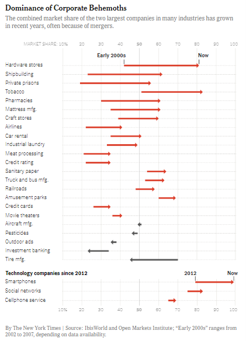

## First step: replicate the graph
### Original graphic source: New York Times

The American newspaper "The New York Times" published in November 2018 an 
opinion article written by columnist David Leonhardt. This journalist explained 
how in recent years monopolies have increased in the United States despite the 
reluctance of many Americans who consider them a threat to market competition 
and individual freedom. This article is accompanied by a graph showing how the 
combined market share has changed for the top two companies in many industries.

***[The Monopolization of America](https://www.nytimes.com/2018/11/25/opinion/monopolies-in-the-us.html?unlocked_article_code=AAAAAAAAAAAAAAAACEIPuonUktbco4hlSVUZBibSRdkhrxqAwv3IxrskgXv_ITPQSDAH0-QYRpWbvUfRYK4pL_0C4wOmfv4Terk-WK41ieZFI01mTwTvqMqKyMUPfS5woo_pAiZrj5-XGLkzrmevP2Xidr5xlePjskrbenCqDPKEqQApJAlipZFgfFmtyCZIkv-DSrgpr4E4ifQxBZl6RiMDZD2IuZTrDRZ4O9aBa3LM-1V8GrEZCXyIw4nqu_9Xex5SCFnGUHt8_W0_jdtZM94XN6r5RAUyt9cDVL2W_2EO8RB4R-XivQ&smid=nytcore-ios-share&referringSource=articleShare)***


```{r echo=FALSE, fig.cap="Source: New York Times", out.width = '50%', fig.align='center'}

```


In this tutorial I will show how to replicate this data visualization step by 
step with R and the package ggplot2.

First we have to load the two basic libraries that we will use throughout the 
tutorial: *tidyverse* and *ggplot2*

```{r}
# Load libraries:
library(tidyverse)
library(ggplot2)
```


### 1. Read and prepare the data

Since the chart's data source was not directly accessible, I created a csv file 
with the data. This file contains data for three different variables: the type 
of industry, the market share in the year 2000, and the current market share. 
Also, since in the original graph the positive and negative increases over time 
in the market share are differentiated, I create a new variable (*increase*) 
with this information.

```{r}

data <- read.csv("data_graph.csv", sep = ";") %>% 
  mutate(increase = market_share_now - market_share_2000,
         increase2 = case_when(increase > 0 ~ "positive",
                              T ~ "negative")) %>%
  group_by(increase2) %>% 
  arrange(desc(increase))
```

Let's see how the data is!

```{r}
glimpse(data)
```

``` {r}
summary(data)
```
### 2. Create the first part of the plot

The chosen graph has two distinct parts. The first one shows the evolution of 
the market share since the early 2000s (2002 to 2007 depending on data 
availability) and the second since 2012. For this reason, I will do the upper 
plot first and then the lower one.

The first step, therefore, is to filter the data to use only those that 
correspond to the industries included in the first graph. Also, I need to create
a new variable that allows me to order the categorical variable *industry* from 
the highest to lowest increase in market share over time (*industry_order*)

``` {r}
upper_plot <- data %>%
  filter(industry != "Smartphones" & industry != "Social networks" 
         & industry != "Cellphone service") %>% 
  mutate(industry_order = fct_reorder(industry, increase)) 
```

#### Coordinates and axes

The graph has Cartesian coordinates, where x is the market share (continuous 
variable ranging from 0 to 100) and y is the type of industry (categorical 
variable with 25 different categories). However, in this graph for each y (for 
each industry) we have to plot two points on the x-axis: the market share in the 
early 2000s and now. But we will see this after in the "Data" section. 

```{r fig.height=7, fig.width=6, fig.align='center'}
upper_plot <- upper_plot %>%
  ggplot() +
  (aes(x = market_share_2000, 
       y = industry_order))

upper_plot
```
Also, we want the x scale to go from 10% to 100% in steps of 10 and to be at the
top of the graph. We achieve all this with the arguments of the 
"scale_x_continuous" function. In the case of the y-axis, we only need to expand 
it slightly at the top to accommodate the labels that need to be entered on the 
chart later. 

```{r fig.height=7, fig.width=6, fig.align='center'}
upper_plot <- upper_plot +
  scale_x_continuous(position = "top", 
                     breaks = c(10, 20, 30, 40, 50, 60, 70, 80, 90, 100),
                     limits = c(10, 100),
                     labels = c("10%", "20", "30", "40", "50", "60", "70", 
                                "80", "90", "100"),
                     name = NULL,
                     expand = c(0,0)) +
  scale_y_discrete(name = NULL, expand = expansion(add = c(0.4, 1.5)))

upper_plot
```
#### Labels

The next step is to put the labels we need: the chart title, the subtitle and 
the tag. For this I use the "labs" function. Later, within the "theme" function, 
I will be able to adjust its characteristics: font size and type, position...

```{r fig.height=7, fig.width=6, fig.align='center'}
upper_plot <- upper_plot +
    labs(title = "Dominance of Corporate Behemoths",
       subtitle = paste0("The combined market share of the two largest companies",
       " in many industries has grown\n",
       "in recent years, often because of mergers."),
       tag = "MARKET SHARE:")

upper_plot
```
#### Theme

**Label settings**

Since the original graphic uses the "Noto Serif" font, the first thing I do is 
download it from [Google Fonts](https://fonts.google.com/noto/specimen/Noto+Serif)
and install it on my computer. Then I use the function "font_add_google" from 
the R package "sysfonts" to be able to use it in the graph. Also, in the R 
markdown chunk you have to put the following: "fig.showtext= TRUE". 

Now with the "theme" function I establish the characteristics of the labels that 
I have created before (font size and color, font family, font face...). With the 
"margin" argument I can set the margins (top, bottom, left and right) of each 
label. For example, I have added a bottom margin to both the title and the subtitle.
Even though the "market share" tag now looks like it's not positioned correctly, 
since it overlaps the x-axis text, later when I add the margins it will look 
fine.

On the other hand, the argument "plot.title.position = "plot" allows both the 
title and the subtitle to start at the top corner of the entire plot and not at 
the beginning of the plot pane. 

```{r fig.height=7, fig.width=6, fig.showtext= TRUE, fig.align='center'}

sysfonts::font_add_google("Noto Serif")

upper_plot <- upper_plot +
    theme(legend.position = "none",
          plot.title = element_text(size = 12, 
                                  face = "bold", 
                                  family = "Noto Serif", 
                                  margin = margin(0, 0, 5, 0)),
          plot.subtitle = element_text(size = 9.5, 
                                     colour = "#636363", 
                                     family = "Noto Serif", 
                                     margin = margin(0, 0, 20, 0)),
          plot.title.position = "plot",
          plot.tag.position = c(0.12, 0.878),
          plot.tag = element_text(size = 8.7, family = "sans", 
                                colour = "#a7a7a7"))
  
upper_plot
```

**Panel grid and panel background**

The next step is to configure the grid and the background panel, also with 
arguments inside the "theme" function. I change the type of line and the color of 
the line with "element_line" function and I set the background of the chart to 
white with "element_rect".

```{r fig.align='center', fig.height=7, fig.width=6, fig.showtext= TRUE, fig.align='center'}

upper_plot <- upper_plot +
    theme(panel.grid.major.y = element_line(linetype = "dotted", 
                                            colour = "#a7a7a7"),
        panel.grid.major.x = element_line(colour = "#c9c9c9"),
        panel.grid.minor = element_blank(),
        panel.background = element_rect(fill = "white"))
        
upper_plot
  
```

**Axis text, axis ticks and margins**

The last step before finishing the theme of the chart is to adjust the ticks of 
each axis (x and y), the titles of the axes and the margins of the chart.

In order to bold the "50" on the x-axis I create a vector inside the function
"element_line", with the argument "linewidth". This type of function is not 
officially supported, so a "warning" appears. However, it works and it's the 
only way I've found to do it.

```{r fig.height=7, fig.width=6, fig.showtext= TRUE, warning=FALSE, fig.align='center'}

upper_plot <- upper_plot +
    theme(axis.ticks.y = element_blank(),
        axis.ticks.x = element_line(colour = "#c9c9c9", 
                                    linewidth = c(0.3, 0.5, 0.5, 0.5, 0.8,
                                                  0.5, 0.5, 0.5, 0.5, 0.4)),
        axis.ticks.length.x = unit(0.2, "cm"),
        axis.text.y = element_text(size = 10, family = "sans", 
                                   hjust = 0, vjust = 0.5),
        axis.text.x = element_text(size = 9, family = "sans", 
                                   colour = "#a7a7a7",
                                   face = c('plain', 'plain', 'plain', 
                                            'plain', 'bold', 'plain', 
                                            'plain', 'plain', 'plain', 'plain')),
        plot.margin = margin(0, 1.7, 0, 0, "cm"))
  
upper_plot
```

#### Data

Now is the time to put the data on the chart. To plot the arrows from the 2000's 
market share data to now I use "geom_segment". In this type of geom you have to 
give it 4 aesthetics (x, xend, y, y-end). In addition, you can configure the type 
of line (an arrow in this case) and the color, which in this graph depends on 
whether the increase is positive or negative (variable *increase2* created 
previously). Then, with the "scale_color_manual" function, the colors associated
with each category of this variable are set. 
Lastly, I've also added a thicker vertical line highlighting the 50, using the 
"geom_vline" function.

```{r fig.height=7, fig.width=6, fig.showtext= TRUE, fig.align='center'}

upper_plot <- upper_plot +
  geom_vline(xintercept = 50, color = "gray", linewidth = 0.8) + 
  geom_segment(aes(x = market_share_2000, 
                   xend = market_share_now, 
                   y = industry_order, 
                   yend = industry_order, 
                   color = increase2), 
               arrow = arrow(length = unit(0.15, "cm"), 
                             type = "closed"), linewidth = 1) +
  scale_color_manual(values = c("#575757", "#DB3B27"))

upper_plot
```

#### Annotations

Finally, to finish the first graph, we must add the two annotations. To do this, 
I have used the "annotate" function, using the x and y arguments to get the 
proper final position within the plot area.

```{r fig.height=7, fig.width=6, fig.showtext= TRUE, fig.align='center'}

upper_plot <- upper_plot +
  annotate("text", x = 34.8, y = 23.9, label = "Early 2000s", 
           size = 3, fontface = "bold") +
  annotate("text", x = 86.2, y = 23.9, label = "Now", 
           size = 3, fontface = "bold") +
  annotate("text", x = 42, y = 23.4, label = "|", 
           size = 3.2, fontface = "bold") +
  annotate("text", x = 84, y = 23.4, label = "|", 
           size = 3.2, fontface = "bold")

upper_plot
```

### 3. Create the second part of the plot

To make the second part of the graphic I have used a very similar code. I have 
filtered the data to keep only the three industries starting in 2012. 
In addition, I have removed the title, put a different subtitle and added a 
caption with the argument "caption" inside the "theme" function.

```{r fig.height=2, fig.width=6, fig.showtext = TRUE, fig.align='center'}
library(grid)

bottom_plot <- data %>%
  filter(industry == "Smartphones" | industry == "Social networks" | 
           industry == "Cellphone service") %>% 
  mutate(industry = case_when(industry %in% c("Cellphone service") ~ 
                                "Cellphone service  ",
                              T ~ industry),
         industry_order = fct_reorder(industry, increase)) %>% 
  ggplot() +
  geom_vline(xintercept = 50, color = "gray", size = 0.8) +
  geom_segment(aes(x = market_share_2000, 
                   xend = market_share_now, 
                   y = industry_order, yend = industry_order, 
                   color = increase2), 
               arrow = arrow(length = unit(0.15, "cm"), 
                             type = "closed"), size = 1) +
  scale_color_manual(values = c("#DB3B27")) +
  scale_x_continuous(position = "bottom", 
                     breaks = c(10, 20, 30, 40, 50, 60, 70, 80, 90, 100),
                     limits = c(10, 100),
                     labels = c("10%", "20", "30", "40", "50", 
                                "60", "70", "80", "90", "100"),
                     name = NULL,
                     expand = c(0, 0)) +
  scale_y_discrete(name = NULL, expand = expansion(add = c(0.2, 0.8))) +
  labs(subtitle = "Technology companies since 2012",
       caption = paste0('By The New York Times | Source: IbisWorld and Open',
       'Markets Institute; "Early 2000s" ranges\n', 'from 2002 to 2007',
       'depending on data availability')) +
  theme(legend.position = "none",
        plot.title.position = "plot",
        plot.subtitle = element_text(size = 9.5, family = "Noto Serif", 
                                     face = "bold", margin = margin(0, 0, 0, 0)),
        plot.caption = element_text(size = 9, colour = "#636363", 
                                    family = "Noto Serif", 
                                    hjust = 0, margin = margin(20, 0, 0, 0)),
        plot.caption.position = "plot",
        panel.grid.major.y = element_line(linetype = "dotted", 
                                          colour = "#a7a7a7"),
        panel.grid.major.x = element_line(colour = "#c9c9c9"),
        panel.grid.minor = element_blank(),
        axis.ticks.y = element_blank(),
        axis.ticks.x = element_line(colour = "#c9c9c9", 
                                    size = c(0.3, 0.5, 0.5, 0.5, 0.8, 
                                             0.5, 0.5, 0.5, 0.5, 0.3)),
        axis.ticks.length.x = unit(0.2, "cm"),
        axis.text.y = element_text(size = 10, family = "sans", 
                                   hjust = 0, vjust = 0.5),
        axis.text.x = element_text(size = 9, family = "sans", 
                                   colour = "#a7a7a7",
                                   face = c('plain', 'plain', 'plain', 
                                            'plain', 'bold',
                                            'plain', 'plain', 'plain', 
                                            'plain', 'plain')),
        panel.background = element_rect(fill = "white"),
        plot.margin = margin(0, 1.7, 0, 0, "cm")) +
  annotation_custom(grob = textGrob(label = "Now", 
                                    gp = gpar(fontsize = 8.5, fontface = "bold", 
                                              fontfamily = "sans")),
                    ymin = 3, xmin = 94.3) +
  annotation_custom(grob = textGrob(label = "2012", 
                                    gp = gpar(fontsize = 8.5, fontface = "bold", 
                                              fontfamily = "sans")),
                    ymin = 3, xmin = 52) 

bottom_plot
```
### 4. Arranging plots

Now I am going to show the two plots created previously to see the replication 
of the graph from the New York Times. To join the two graphics I have used the 
patchwork library, specifying that I want them in a single column, with a space 
between both graphics and with different heights. All this is configured with 
the "plot_layout" function.

```{r fig.height=9, fig.width=6.3, fig.showtext = TRUE, fig.align='center', preview=TRUE}

library(patchwork)

upper_plot + plot_spacer() + bottom_plot +
  plot_layout(ncol = 1,
              heights = c(11.5, 0.35, 1.5))
```
### Limitations of the replication of the graph

The replication of the plot, created with the R package ggplot2, is very close 
to the original plot. There is a detail that I have not been able to replicate 
exactly. In the lower chart annotations ("2012" and "Now") I had to expand the 
y-axis to fit them, as they were above the last *industry* category. Expanding
this axis with the "expand" argument of the "scale_y_discrete" function also 
expanded the grid major x lines. In the original chart, however, these lines do 
not go as far as the x-axis ticks, but intersect at the first category of the 
*industry* variable. For that reason I have also put them closer to the arrow 
than in the original graph and I have not had to put a line joining the arrow 
with the annotation (with the geom_segment function).

## Chart evaluation based on data visualization theory

Given the data the graph represents and the content of the New York Times 
article it is a good graph. This is a chart called a "lollipop chart" which 
consists, in short, of a bar chart in which the bar is a line and the end of the 
line is a point (a triangle in this case since they are arrows). Unlike typical 
bar charts, in this chart the bars (or lines) do not start at the same point on 
the x-axis.

At first glance, the colors and size of the arrows already make clear the 
increase in market share in the vast majority of industries. Positioning on a 
common scale is the most effective visual communication channel together with 
the length, so the choice of this type of representation is a wise one and they 
have used this highest ranked channels for the most relevant information of the 
plot (the change of the market share and the comparison between industries).

In addition, adding the shape of an arrow makes it possible to identify whether 
it is an increase or a decrease in market share. The choice of two colors to 
represent the positive and negative values in the difference between years is 
also very useful as the hue color is a very effective identification channel. It
is true that it is striking that the positive values are represented in red, 
socially related to the negative values. However, this may be related to the 
content of the article, which seeks to highlight this growth in market share (as
opposed to the gray assigned to the negative values) and which, in a way, sees 
this growth as something negative for society. 

Another positive element to highlight is the order of the industries on the 
y-axis, placed from highest to lowest market share growth. The authors of the 
graph have also decided to highlight the line on the x-axis that marks 50% of 
the market share, allowing the observer to identify more quickly which 
industries have reached a market share above this figure. 

As for the titles of the axes, the authors have decided to eliminate the y-axis 
title since it is easy to know from the labels of each industry which variable 
is represented. The x-axis title is also correctly represented, since it is 
placed before the first tick, to which they add the "%" symbol so that the 
reader knows what the scale on which it is measured looks like. As soon as you 
look down at the subtitle, you know that the x-axis measures the market share, 
which starts at 10 and is measured as a percentage.

Finally, the chart has a brief but clear title, which lets the reader know what 
he or she will find in the chart. The subtitle is also very useful because it 
expands on the information given in the title, explaining that the graph 
represents the market share of two large companies. It also gives a brief 
analysis to the reader, saying that this share has grown and that it may be a 
consequence of the mergers. It also adds a second title to help the reader 
understand what the second part of the graph is about and a brief, explanatory 
caption.

## Second step: create a new visualization with the same data

In this section I will explain the process of creating an alternative 
visualization of the New York Times chart with the same data. 

Since the data to be represented contains one categorical variable (with a large 
number of categories) and two continuous variables (ranging from 0 to 100) a bar
chart is a good idea to represent them. However, as I have explained in the 
previous section, the original graph is, *de facto*, a bar chart (with slight 
modifications of the traditional ones). 
At first I thought of making a bar chart in which to represent only the 
difference between the market share of each industry in the early 2000s and now. 
However, I think that relevant information would be lost (where was the market 
share before and now). I also thought about the possibility of making a grouped 
bar chart like [these from R Graph Gallery](https://r-graph-gallery.com/211-basic-grouped-or-stacked-barplot.html), 
representing on the x or y axis each industry, and on the other axis a bar for 
the market share in the 2000's and another for the current market share (each 
with a different color). However, since the data consists of 25 different 
industries (50 bars in total) I thought it would be unattractive and difficult 
to understand.

I finally decided on the option of making a graph of parallel coordinates. 
Normally, in this type of graphs, time series are not represented, but a set of 
variables are placed on the x-axis and a y-axis (a vertical line) is graphed for 
each variable. According to graphic perception theory, this type of graphic 
would be slightly less visually effective than the one created by the New York 
Times. This is because angles are less effective in conveying visual information 
than position on a common scale (as in the original graphic) and length. However, 
I think it's also a good way to represent this data in a different way.

In this case I have represented the variable *industry* on the y axis and on 
the x axis I have made two parallel lines with the data related to the *market* 
*share* of the 2000s and today. Subsequently, I have joined the points between the 
two lines of the x axis with a line. Also, I have set two colors in the 
aesthetics of the segments: green when the increment is positive and red when it 
is negative. In the case of the green ones, I have put a slightly higher alpha 
in those increases that exceed 40% (value in which the average of the increases 
is), in order to highlight them in the graph. I have decided to put these colors 
because we socially associate green with positive or increase and red with 
negative or decrease. 

On the other hand, I have labeled the type of industries that exceed that 40%, 
since labeling all of them was impossible due to overlapping problems. For those
readers who want to expand the information, I have added interactivity in such a
way that if you put the mouse over the lines you can see what type of industry 
it is and the percentage of increase.

Instead of making two graphs to represent the technology industries starting in 
2012, I have decided to include them by highlighting them with a yellow dot and 
a label explaining the difference with the rest of the lines. I thought it 
convenient to do so in order to be able to compare at a glance the percentage of 
current market share of these industries with that of the rest of the industries.

Finally, I have kept the same original title, which I think is concise and 
explicit, and slightly changed the subtitle to highlight information about 
those industries that have grown proportionally the most.

Now I will show the code and the steps to follow to create this new 
visualization!

### Prepare the data

The first step is to prepare the data. For this I have created two different 
data frames. In the first, taking the original dataset, I have created four new 
variables:

1. *perc_increase*, which is the percentage increase in market share between the
two years.

2. *perc_increase_label*, to add a "+" to the previous variable in case the 
value is positive. 

3. *increase2*, with three categories to differentiate positive increases below 
40%, positive increases above 40% and negative.

4. *industry_labels*, keeps the *industry* label only in case the percentage 
increase is greater than 40%.

The second data frame contains the market share data for the three technology 
industries starting in 2012 and an additional column with a 1. This data frame 
will serve to draw the three dots that indicate that these data are slightly 
different from the rest.

```{r}
# First data frame:

alternative_plot_data <- data %>%
  ungroup() %>% 
  mutate(perc_increase = round(increase/market_share_2000*100, 1),
         perc_increase_label = case_when(perc_increase > 0 ~ 
                                           paste0("+", perc_increase),
                       T ~ as.character(perc_increase)),
         increase2 = case_when(perc_increase > mean(perc_increase) ~ 
                                 "high_increase",
                               T ~ increase2),
         industry_labels = case_when(increase2 != "high_increase" ~ "",
                              T ~ industry),
         "Early 2000s" = 1,
         Now = 2) %>% 
  arrange(desc(increase2))

head(alternative_plot_data)
```

```{r}
# Second data frame:

data.frame.points <- data %>%
  ungroup() %>% 
  filter(industry == "Smartphones" | industry == "Social networks" 
         | industry == "Cellphone service") %>% 
  select(market_share_2000, industry) %>% 
  mutate(x = 1)

head(data.frame.points)
```

### Create the static graph

#### Data, coordinates and axes

Parallel coordinate plots can be easily created with the ggplot2 extension 
"ggally", as explained [here](https://r-graph-gallery.com/parallel-plot.html). 
However, in this case I have had to do it with a combination of geom_segment and 
"geom_vline" because the ggally functions don't support interactivity with either 
ggplotly or ggiraph. The function used from the ggiraph package is called 
"geom_segment_interactive".
With "geom_vline" I have created the two vertical and parallel lines where the 
values of the market share in 2012 and currently are represented. 
Subsequently, with the geom_segment function I have created the lines that join 
the values between one date and another.
In the geom_segment aesthetic I have specified that I want the color and alpha 
to be associated with the previously created variable *increase2* that 
differentiates between positive, negative and positive values above 40% 
increment. To set the values of both aesthetics I have used the 
"scale_color_manual" and "scale_alpha_manual" functions.

```{r fig.showtext=TRUE, fig.height=7, fig.width=6, fig.align='center'}

library(ggiraph)
library(grid)
library(ggrepel)
sysfonts::font_add_google("Catamaran", family = "catamaran")

alternative_plot <- alternative_plot_data %>% 
  ggplot() + 
  geom_segment_interactive(aes(x = `Early 2000s`, xend = Now, 
                               y = market_share_2000, yend = market_share_now, 
                               col = increase2,
                               alpha = increase2,
                               tooltip = paste0(industry, " ", 
                                                perc_increase_label, "%"),
                               data_id = industry), 
               size = 0.71, show.legend = F) +
  geom_vline(xintercept = 1, size = 0.5, color = "gray") + 
  geom_vline(xintercept = 2, size = 0.5, color = "gray") +
  scale_color_manual(values = c("#006400", "#d3101e", "#006400")) +
  scale_alpha_manual(values = c(0.9, 0.6, 0.5)) +
  scale_y_continuous(breaks = c(20, 30, 40, 50, 60, 70, 80, 90, 100),
                     limits = c(15, 100),
                     labels = c("20", "30", "40", "50", 
                                "60", "70", "80", "90", "100%"),
                     name = "Market share",
                     expand = c(0,0)) +
  scale_x_discrete(name = "Now", position = "top", 
                   expand = expansion(add = c(0.02, 0.32))) 

alternative_plot

```

#### Theme and labels

With the "labs" function I have created the title, the subtitle, the tag, and 
the caption. I used the "tag" argument to create the "Early 2000s" tag because 
unlike the "annotation" function it allowed me to place it outside the chart 
area without expanding the grid lines. In order to create the parallel label 
"Now" that names the second vertical line, I have used the title of the x axis 
itself.
With the "theme" function I have configured all these labs and I have 
established a very minimalist theme, with dotted grid lines of the y-axis and a 
white background. I also wanted to highlight the "50" of the "y" scale by 
putting it in bold.
To put the industry type labels at the end of each line I have used the 
"geom_label_repel" function, thus making sure that they do not overlap each 
other. With the "direction" argument I have specified that in case of 
overlapping I wanted them to move in the y axis, never in the x axis, in such a 
way that they would be aligned.

```{r fig.showtext=TRUE, fig.height=7, fig.width=6, fig.align='center'}

alternative_plot <- alternative_plot +
  labs(title = "Dominance of Corporate Behemoths",
       subtitle = paste0('The combined market share of the two largest ', 
                         'companies in many industries\n','has grown in recent', 
                         ' years, often more than 40%.'),
       tag = c("Early 2000s", "Now"),
       caption = paste0('By Isabel Molero López | Source: New York Times; "Early 2000s "',
       'ranges from 2002 to 2007.\n', 'Lines that begin with a yellow dot ', 
       'correspond to the data of technology companies since 2012.')) +
  theme(legend.position = "none",
        plot.title = element_text(size = 13.5, face = "bold", family = "catamaran", 
                                  margin = margin(0, 0, 5, 0)),
        plot.subtitle = element_text(size = 11.5, colour = "#636363", 
                                     family = "catamaran", 
                                     margin = margin(0, 0, 30, 0)),
        plot.title.position = "plot",
        plot.tag.position = c(0.11, 0.88),
        plot.tag = element_text(size = 11.5, family = "catamaran", 
                                colour = "#636363", face = "bold"),
        plot.caption = element_text(size = 9.5, colour = "#636363", 
                                    family = "catamaran", 
                                    margin = margin(15, 0, 0, 0),
                                    hjust = 0),
        plot.caption.position = "plot",
        panel.grid.major.y = element_line(linetype = "dotted", 
                                          colour = "#a7a7a7"),
        panel.grid.major.x = element_line(colour = "#c9c9c9"),
        panel.grid.minor = element_blank(),
        axis.ticks.y = element_blank(),
        axis.ticks.x = element_blank(),
        axis.text.y = element_text(size = 10, family = "catamaran", 
                                   hjust = 0.7, vjust = 0.5, 
                                   face = c('plain', 'plain', 'plain', 
                                            'bold', 'plain','plain', 
                                            'plain', 'plain', 'plain')),
        axis.title.x = element_text(hjust = 0.78, margin = margin(0, 0, 20, 0), 
                                    size = 11.5, family = "catamaran", 
                                    colour = "#636363",
                                   face = "bold"),
        axis.title.y = element_text(size = 11, family = "catamaran", 
                                    colour = "#636363", margin = margin(r = 7)),
        axis.title.x.top = element_text(vjust = 7.6),
        panel.background = element_rect(fill = "white"),
        plot.margin = margin(0, 1.7, 0, 0, "cm")) +
     geom_label_repel(aes(x = 2, y = market_share_now, label = industry_labels,
                         segment.alpha = 0),
                    inherit.aes = FALSE, 
                    color = c("#505050"), 
                    alpha = 2, hjust = 1,
                    size = 3.2,
                    force = 0.0016,
                    force_pull = 10,
                    direction = "y",
                    xlim = c(2, NA),
                    label.size = NA,
                    box.padding = 0.002,
                    family = "catamaran")

alternative_plot

```
#### Annotations and other aditional settings

Finally, I have added with the "annotate_interactive" function a label that 
indicates the lines that correspond to the technological industries. Also, I've 
used the "geom_point" function to put a point at the beginning of these lines so 
that the reader can quickly identify them. With the "geom_segment" function I 
have joined the point with the annotation by means of a line. Finally, the 
"geom_hline" function has allowed me to overlay a thicker, black line at 50%, 
thus highlighting industries that have a market share above this value.

```{r fig.showtext=TRUE, fig.height=7, fig.width=6, fig.align='center'}

alternative_plot <- alternative_plot +
  geom_hline(yintercept = 50, size = 0.7, color = "black", linetype = "dotted") +
  geom_segment_interactive(aes(x = 1.01, xend = 1.07,
                   y = 80, yend = 83.5,
                   tooltip = "",
                   data_id = 1),
               size = 0.17,
               color = "#E6B400") +
  geom_point_interactive(data = data.frame.points, 
                         aes(x, market_share_2000,
                             tooltip = paste0(industry, ", since 2012"),
                             data_id = 1),
             colour = "#E6B400") +
  annotate_interactive("text", x = 1.09, y = 84.7, label = "2012", 
                       size = 3.4, color = "#E6B400", 
                       fontface = "bold", family = "catamaran",
                       tooltip = "", data_id = 1) +
  annotate_interactive("text", x = 1.11, y = 88, label = "Technology", 
                       size = 3.1, color = "#E6B400", 
                       fontface = "bold", family = "catamaran", 
                       tooltip = "", data_id = 1) +
  annotate_interactive("text", x = 1.11, y = 86.5, label = "companies", 
                       size = 3.1, color = "#E6B400",
                       fontface = "bold", family = "catamaran",
                       tooltip = "", data_id = 1)

alternative_plot
```

### Add interactivity with the package ggiraph

Interactivity can be added to the graph previously created to expand information. 

In this case I have decided that when placing the mouse over each line the rest 
lower their alpha, in such a way that it stands out. In addition, a label 
appears with the name of the industry that corresponds to that line along with 
the percentage increase or decrease in market share between the different years.

To add interactivity I have used the R package "ggiraph". When making the graph 
itself I have used the geoms from this library (for example, 
"geom_segment_interactive"). Finally, with the "girafe" function the 
interactivity is added to the created graph and with "girafe_options" the 
options are set. For example, I have selected the color and background of the 
labels that appear and the font with "opts_tooltip". With "opts_hover_inv" I 
have set the opacity of the rest of the lines when I pass the mouse over one in 
particular.

Below you can see the final result!

```{r fig.showtext=TRUE, fig.align='center'}

alternative_plot_interactive <- girafe(ggobj = alternative_plot, width_svg = 6, 
                                       height_svg = 7)
alternative_plot_interactive <- girafe_options(x = alternative_plot_interactive,
                    opts_tooltip("background-color:gray;color:white;
                                 font-style:italic;padding:6px;
                                 border-radius:7px;"),
                    opts_hover_inv(css = "opacity:0.1;"),
                    opts_hover(css = "opacity:1;"),
                    opts_sizing(rescale = TRUE, width = 0.75))

alternative_plot_interactive
```
