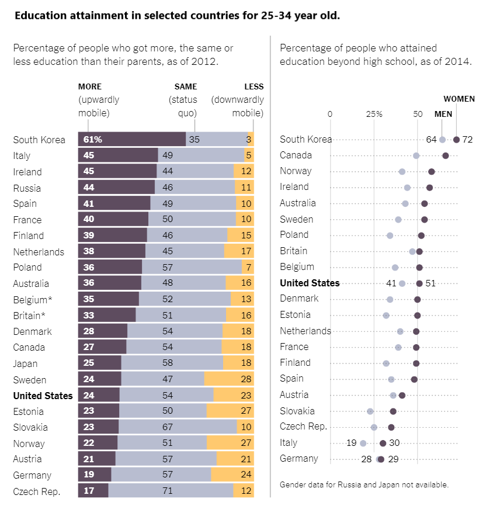

## Introduction

The graph for this project was inspired by a New York Times article about education mobility and gender differences in education. The first part of the article talks about how young students' highest level of education compares to their parents' highest level of education. Students who achieved a higher level than their parents are considered upwardly mobile, those who achieved the same level are considered to have experienced status quo mobility, and those who achieved a lower level are considered downward mobile. The second part of the article examines gender differences in education at a specific level. You can find the full article [here](https://www.nytimes.com/2019/06/07/education/learning/bulletin-board-graduation-guidance.html).


## Graph to replicate (two graphs in one)

The graph that needs to be replicated is actually two graphs in one. The first graph (on the left) shows the differences in education mobility among OECD countries for students aged 25-34. The graph uses a dark purple color for students who achieved a higher education level than their parents, a light grey color for students who achieved the same level, and a yellow color for students who achieved a lower level. The second graph (on the right) shows the difference for the same countries, except for Russia and Japan (for which data is not available), but by country and gender for students who achieved a highest education level higher than high school. The first graph is a stacked percentage bar graph, and the second graph consists of dotted lines and points. Both graphs have annotations to label the categories. At first glance, the graphs do not appear to be complicated. Here is a link to the original graph:

{.external width="100%"}


## Load libraries and read the database

The first step was to load the libraries, in this case I only used two: tidyverse and patchworks. The second step was to read the database which was on a csv file. 


```{r, setup, results="hide"}

library(tidyverse)
library(patchwork)

df <- read_csv("Data_on_intergenerational_mobility.csv")

```


## Adjusting the data

In this part, the data for the first graph is adjusted by erasing rows that are not contained in the graph and pivoting the categories that we are interested into one single column. In this cases, into "Mobility_type" column. After this I created 3 different databases, each one of them containing only one category, this was done in order to arrange the graph in descending order of a specific category inside the "Mobility_type" column. 

```{r}

educ <- df %>%
  drop_na(Downward_Mobility) %>% 
  filter(Country != "Northern Ireland" &
         Country != "England" &
         Country != "Sub-national entities" &
         Country != "Partners" &
         Country != "Average"
  ) %>%
  pivot_longer(cols = ends_with("ility"), 
               names_to = "Mobility_type", 
               values_to = "Mobility_perc") 

df_order <- educ[educ$Mobility_type == "Upward_mobility", ]
df_order2 <- educ[educ$Mobility_type == "Status_quo_Mobility",]
df_order3 <- educ[educ$Mobility_type == "Downward_Mobility",]

```


## First graph

The code for this visual representation can be divided into six parts:

1. Plotting the data as vertical columns ("stack") and arranging it in descending order based on the Upward_mobility category.
2. Changing the theme by removing elements such as axis.ticks, axis.texts, and background.
3. Adding numbers to the graph using geom_text and adjusting their positions and formatting (e.g., adding a percent symbol or adding extra space).
5. Adding a subtitle and adjusting its position and margin to make room for annotations.
6. Adding annotations, including both text annotations and line ("segment") annotations.
7. Adjusting the plot coordinates to make it easier to combine it with the second graph.


```{r}

p = educ %>%
  group_by(Country, Mobility_perc) %>%
  ggplot() +
  aes(Mobility_perc, reorder(Country, Mobility_perc)) +
  geom_col(data = df_order, position = "stack") +
  scale_fill_manual(values = c("#ffc96f", "#b8bdd0", "#5e4c5f")) + 
  geom_col(data = educ[educ$Mobility_type != "Upward_mobility", ], 
           position = "stack") +
  geom_col(aes(fill = Mobility_type)) + 
  labs(y = NULL) +
  theme(legend.position = "none",
        axis.title.x = element_blank(),
        axis.text.x = element_blank(),
        axis.ticks.x = element_blank(),
        axis.ticks.y = element_blank(),
        axis.text.y = element_text(hjust = 0),
        plot.background = element_rect(fill = "white", colour = NA), 
        panel.background = element_rect(fill = "white", colour = NA),
        legend.background = element_rect(fill = "white", colour = NA),
        legend.key = element_rect(fill = "white"))+
  scale_y_discrete(labels = function(x) ifelse(
    x == "United States",expression(bold("United States")),x))+
 geom_text(data = df_order, 
            aes(x=12, label = ifelse(
              Country == "South Korea", paste0(Mobility_perc, "%"), 
              ifelse(
              Country != "South Korea", paste0(Mobility_perc, "    "), 
              Mobility_perc))), 
           size=3,position = position_stack(vjust = 0.5), 
            color = "#ffffff", fontface = "bold") +
  geom_text(data = df_order2, 
            aes(x=150, label = ifelse(
              Country != "South Korea", 
              paste0(Mobility_perc, "       "), Mobility_perc)), size=3,
            position = position_stack(vjust = 0.44)) +
  geom_text(data = df_order3, 
            aes(x=200, label = Mobility_perc), size=3, 
            position = position_stack(vjust = 0.485)) +
  labs(
  subtitle = "\nPercentage of people who got more, the same or\nless education than their parents, as of 2012.") +
  theme(
        plot.title.position = "plot", 
        plot.title = element_text(face = "bold", 
                                  margin=margin(0,0,-20,0)),
        plot.subtitle = element_text(colour = "grey30", size = 10, 
                                     margin=margin(0,0,70,0)),
 axis.text.y = element_text(margin=margin(0,-15,0,0))) +
  annotate("text", x=7.5, y=28, label="MORE",fontface = "bold",size=3) +
   annotate("text", x=8, y=26.7, label="  (upwardly\nmobile)",
            colour = "grey30", size=3) + 
  annotate("segment", x=3, xend=3, y = 23.6, yend = 25.2, 
           color="grey30", alpha = 0.5) +
  annotate("text", x=60, y=28, label="SAME",fontface = "bold",size=3) +
   annotate("text", x=60,  y=26.7, label="(status\n   quo)",
            colour = "grey30", size=3) + 
  annotate("segment", x=66, xend=66, y = 23.6, yend = 25.2, 
           color="grey30", alpha = 0.5) +
  annotate("text", x=97, y=28, yend = 32, label="         LESS",
           fontface = "bold",size=3) +
   annotate("text", x=97,  y=26.7, label="(downardly\n       mobile)",
            colour = "grey30", size=3) + 
  annotate("segment", x=99.9, xend=99.9, y = 23.6, yend = 25.2, 
           color="grey30",alpha = 0.5) +
  coord_cartesian(xlim = c(0, 200), ylim = c(0, 22), clip = "off")
 
  
```


## Adjusting the data for second graph

In this part, the data for the second graph is adjusted by erasing rows that are not contained in the graph and pivoting the categories that we are interested into one single column. In this cases, into "Beyond_Sex" column. After this I created 1 different database, containing only one category, this was done in order to arrange the graph in descending order of that specific category inside the "Beyond_Sex" column, in this case by female. 


```{r}

beyond =  df %>%
  drop_na(Downward_Mobility) %>% 
  filter(Country != "Northern Ireland" &
         Country != "England" &
         Country != "Sub-national entities" &
         Country != "Partners" &
         Country != "Average" &
         Country != "Russia" &
         Country != "Japan"
  ) %>%
  pivot_longer(
    cols= starts_with("Beyond"),
    names_to = "Beyond_Sex",
    values_to = "Beyond_perc"
  ) 


  bey_ordered = beyond %>% 
    filter(Beyond_Sex == "Beyond_highscool_2014_F") %>%
    arrange(desc(Beyond_perc))

```


## Second graph

The code for this visual representation can be divided into seven parts:

1. Plotting the data points using "geom_point" and arranging them in descending order based on the Female category.
2. Changing the theme by removing elements such as axis.ticks, axis.texts, and background.
3. Adding numbers to the graph using geom_text and adjusting their positions and formatting (e.g., adjusting the position of the first numbers to the left and the position of the second numbers to the right).
4. Adding a subtitle and adjusting its position and margin to make room for annotations.
5. Changing the panel.grid composition to include horizontal dotted lines and solid vertical lines with the correct measures and positions.
6. Adding annotations, including both text annotations and line ("segment") annotations.
7. Adjusting the plot coordinates to make it easier to combine it with the second graph.


```{r}
  
p2 = beyond %>%
  ggplot() +
  aes(Beyond_perc, reorder(Country, Beyond_perc)) +
  geom_point(size=3, color = "#5e4c5f", aes(
    color = Beyond_Sex), data = bey_ordered) + 
  geom_point(size=3, color = "#b8bdd0", aes(color = Beyond_Sex), 
             data = beyond[beyond$Beyond_Sex != "Beyond_highscool_2014_F",
                           ]) +
  labs(y=NULL) +
  theme(plot.background = element_rect(fill = "white",colour = NA), 
        panel.background = element_rect(fill = "white",colour = NA),
        legend.background = element_rect(fill = "white",colour = NA),
        legend.key = element_rect(fill = "white"),
        legend.position = "none",
        axis.title.x = element_blank(),
        axis.text.x = element_text(size = 8.5),
        axis.ticks.x = element_blank(),
        axis.ticks.y = element_blank(),
        axis.text.y = element_text(hjust = 0, 
                                   margin=margin(0,-10,0,0))) +
  geom_text(data = subset(bey_ordered, 
                          Country %in% c(
                            "South Korea", "United States", "Italy", "Germany")),
            aes(label = Beyond_perc), nudge_x = 2, nudge_y = 0.1, size=3) +
  geom_text(
    data = subset( beyond[beyond$Beyond_Sex != "Beyond_highscool_2014_F",], 
                           Country %in% c(
                             "South Korea", "United States", "Italy", "Germany")),
            aes(label = Beyond_perc), nudge_x = -2, nudge_y = 0.1, size= 3) +
labs(
  subtitle = "Percentage of people who attained\neducation beyond high scool, as of 2014.",
     caption = "Gender data for Russia and Japan not available.") +
theme(
  plot.caption = element_text(hjust = 0, size = 7.5, color = "grey30", 
                              margin = margin(20,0,0,0)),
  plot.caption.position = "plot",
  panel.grid.major = element_line(color = '#80808066', linetype = 'dotted'),
  panel.grid.major.x = element_line(color = '#80808066', linetype = 'solid'),
  plot.subtitle = element_text(colour = "grey30", size = 10, 
                               margin = margin(-30,0,0,0)),
  plot.title = element_text(colour = "grey30"),
  plot.title.position = "plot",
) +
coord_cartesian(xlim = c(3.3, 71.2),ylim = c(1.3, 22), clip = 'off') +
scale_x_continuous(breaks = c(0, 25, 50), 
                   position = "top", 
                   labels = c("0", expression(paste("25","%", "")),"50"))+
  scale_y_discrete(labels = function(x) ifelse(
    x == "United States",expression(bold("United States")),x)
                                              )+
  annotate("text", x=72, y=25, label="WOMEN",
           fontface = "bold",size=3) +
   annotate("text", x=64, y=23.5, label="MEN",
            fontface = "bold",size=3) +
  annotate("segment", x=64, xend=64, y = 21.3, yend = 22.9, 
           color="grey30", alpha = 0.5) +
  annotate("segment", x=72, xend=72, y = 21.3, yend = 24.4, 
           color="grey30", alpha = 0.5)
  

```


## Merge both graphs into one 

In the final part, I had to merge both graphs into one.This part was the most tricky for me because the dimensions of the plot were different and a lot of editing of the margins, plot_layout had to be done so they merged correctly. I also added a common title as a plot_annotation and a line in the middle just as the original graph. 


```{r, fig.width=12, fig.height=6}

p + p2 + plot_layout(ncol=2,widths=c(6,5)) + 
  annotate("segment", x = -25, xend = -25, y = -15, 
           yend = 30, color = "grey30", alpha = 0.3) +
   plot_annotation(
    title = "Education attainment in selected countries for 25-34 year old.",
    theme = theme(plot.title.position = "plot", 
        plot.title = element_text(face = "bold")
  ))

```


## Alternative Representations

I thought of creating different visual representations to display data. I first tried a tree map, but the values were difficult to read. I then considered using a multi-level circular packing, but this made it difficult to see the relative magnitudes of the values, and there were too many categories because each country was treated as a separate category. As a result, I chose to use the facet_wrap option and split the plot into categories based on the type of mobility for the first plot and sex for the second, with the same y-axis for all categories. I created two separate plots and combined them.


### Graph 1:

To create the first graph of the alternative representation, I followed these steps:

1. I created a labeller argument to change the titles of each facet.
2. I used geom(col) to add the data and arrange it in descending order of Upward_mobility value.
3. I used facet_wrap to separate the data by type of mobility.
4. In the theme function, I removed some elements and adjusted others to achieve the desired aesthetics.
5. I finally added numbers to the graph by using geom_text and adjusting their size. 


```{r, fig.width=12, fig.height=8}

educ_names <- list(
  'Downward_Mobility'="Downward mobile",
  'Upward_mobility'="Upward mobile ",
  'Status_quo_Mobility'=" Status quo mobile"
)


educ_labeller <- function(variable,value){
  return(educ_names[value])
}

a1 = educ %>%
  group_by(Country, Mobility_perc) %>%
  ggplot() +
  aes(Mobility_perc, reorder(Country, Mobility_perc)) +
  geom_col(data = df_order, position = "stack") +
  scale_fill_manual(values = c("#ffc96f", "#b8bdd0", "#5e4c5f")) + 
  geom_col(data = educ[educ$Mobility_type != "Upward_mobility", ], 
           position = "stack") +
  geom_col(aes(fill = Mobility_type)) +
    facet_wrap(~Mobility_type, labeller = educ_labeller )+
  labs(y = NULL) +
  theme(legend.position = "none",
        axis.ticks.y = element_blank(),
        axis.text.y = element_text(hjust = 0),
        axis.title.x = element_blank())+
  scale_y_discrete(labels = function(x) ifelse(
    x == "United States",expression(bold("United States")),x)
                                              )+
 geom_text(data = df_order, 
            aes(x=7, label = ifelse(Country == "South Korea", 
                                    paste0(Mobility_perc, "%"), 
 ifelse(Country != "South Korea", paste0(Mobility_perc, "  "), 
        Mobility_perc))), size=3,position = position_stack(vjust = 0.5), 
            color = "#ffffff", fontface = "bold") +
  geom_text(data = df_order2, 
            aes(x=7, label = ifelse(Country == "South Korea", 
                                    paste0(Mobility_perc, "%"), 
  ifelse(Country != "South Korea", 
         paste0(Mobility_perc, "  "), Mobility_perc))), size=3,
            position = position_stack(vjust = 0.44)) +
  geom_text(data = df_order3, aes(x=7, 
                                  label = ifelse(Country == "South Korea", 
                                    paste0(Mobility_perc, "%"), 
  ifelse(Country != "South Korea", paste0(Mobility_perc, "  "), Mobility_perc))), 
  size=3, position = position_stack(vjust = 0.485)) +
  labs(
    subtitle = "Percentage of people who got more, the same or less education than their parents, as of 2012.") +
  theme(
        plot.subtitle = element_text(colour = "grey30", size = 11, 
                                     margin = margin(0,0,20,0)))+
  scale_x_continuous(breaks = c(0, 20, 40, 60), 
                   labels = c("0%", "20%" ,"40%","60%"))+
theme(
      strip.text.x = element_text(size = 10, 
                                  color = "black", face = "bold"),
      strip.background = element_rect(
        color="black",  size=1, linetype="solid"),
      panel.border = element_rect(
        color = "black", fill = NA, size = 1.5), plot.title.position = "plot")

a1

```


### Graph 2

The Second graph of the alternative representation followed similar steps as the alternative graph 1 with the only difference being that now there are two categories that the facet wrap is done by: Female and Male. 


```{r, fig.width=12, fig.height=8}

educ_names2 <- list(
  "Beyond_highscool_2014_M"="Beyond higschool males",
  'Beyond_highscool_2014_F'="Beyond higschool females"
)


educ_labeller2 <- function(variable,value){
  return(educ_names2[value])
}

a2 = beyond %>%
  group_by(Country, Beyond_perc) %>%
  ggplot() +
  aes(Beyond_perc, reorder(Country, Beyond_perc)) +
  geom_col(data = bey_ordered, position = "stack") +
  scale_fill_manual(values = c("#5e4c5f", "#b8bdd0")) + 
  geom_col(
    data = beyond[beyond$Beyond_Sex != "Beyond_highscool_2014_F", ], 
    position = "stack") +
  geom_col(aes(fill = Beyond_Sex)) +
    facet_wrap(~Beyond_Sex, labeller = educ_labeller2)+
  labs(y = NULL) +
  theme(legend.position = "none",
        axis.ticks.y = element_blank(),
        axis.text.y = element_text(hjust = 0),
        axis.title.x = element_blank())+
  scale_y_discrete(labels = function(x) ifelse(
    x == "United States", expression(bold("United States")),x)
                                              )+
 geom_text(data = bey_ordered, 
            aes(x=7, label = ifelse(Country == "South Korea", 
                                    paste0(Beyond_perc, "%"), 
 ifelse(Country != "South Korea", paste0(Beyond_perc, "  "), 
        Beyond_perc))), size=3,
            position = position_stack(vjust = 0.5), 
            color = "#ffffff", fontface = "bold") +
  geom_text(
    data = beyond[beyond$Beyond_Sex != "Beyond_highscool_2014_F",], 
            aes(x=7, label = ifelse(Country == "South Korea", 
                                    paste0(Beyond_perc, "%"), 
  ifelse(Country != "South Korea", paste0(Beyond_perc, "  "), 
         Beyond_perc))), size=3,position = position_stack(vjust = 0.44)) +
  labs(
    subtitle = "Percentage of people who attained education beyond high scool, as of 2014.") +
  theme(
        plot.subtitle = element_text(
          colour = "grey30", size = 11, 
          margin = margin(0,0,20,0)))+
  scale_x_continuous(breaks = c(0, 20, 40, 60,80), 
                   labels = c("0%", "20%" ,"40%","60%","80%"))+
theme(
      strip.text.x = element_text(size = 10, 
                                  color = "black", face = "bold"),
      strip.background = element_rect(
        color="black",  size=1, linetype="solid"),
      panel.border = element_rect(
        color = "black", fill = NA, size = 1.5),
      plot.title.position = "plot")

a2

```


### Merge them together

In this part the two alternative graphs are merged together specifying the correct width and height so they look nice and adding a general title for both.


```{r, fig.width=12, fig.height=10}

a2 + a1 + plot_layout(ncol=1) +
   plot_annotation(
    title = "Education attainment in selected countries for 25-34 year old.",
    theme = theme(plot.title.position = "plot", 
        plot.title = element_text(face = "bold")
  ))


```


## Conclusion

Replicating these graphs involved some challenges, such as arranging the data in the desired order of the category and adding specific elements to only a few values like axis titles or geom texts. While the rest of the process was relatively straightforward, the most difficult part for me was merging the two graphs together. Determining the correct dimensions, aspect ratios, plot layout, coordinate limits, etc. was challenging. The final result may not have the exact desired dimensions, but it is similar to the original. I chose the facet_wrap option for the alternative representation because, in my opinion, it was a clear and tidy way to view the data, although it may not have been the most complex method I am satified with the end result. 
