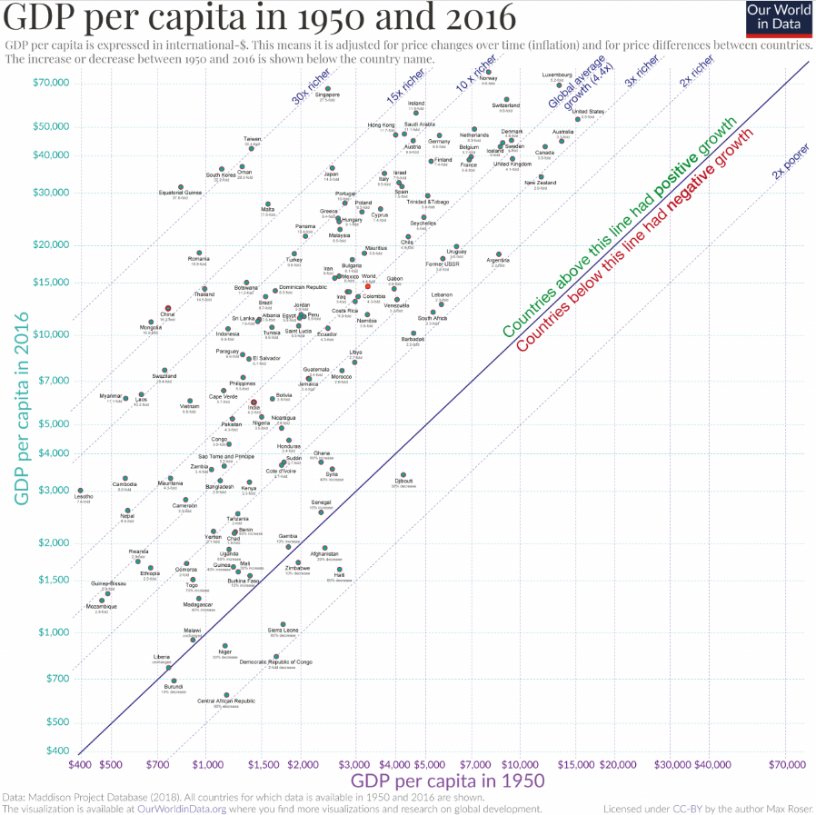

## On the topic of Economics and Country Convergence

Our aim will be to resort to visual tools in R studio and ggplot to study the topic of country economic growth and convergence. Classical Solow-Swan models of growth predict convergence as a function of the deviation of a country from its stationary state (natural level) such that we should expect convergence between LEDC´S and MEDC´s. Our point of departure will be to launch the libraries we will use and to obtain the data from the Maddison Project Database.

Original plot:

[{.external width="100%"}](https://ourworldindata.org/economic-growth)

```{r setup, include=FALSE}
knitr::opts_chunk$set(out.width = "100%",
                      fig.align = "center")
```

```{r}
library(tidyverse)
library(scales)
gdp <- as.data.frame(read_delim("gdp per capita.csv", 
                                delim = ";"))
```


A prior step to develop our plot will be to clean and sort the data to prepare it for our ggplot() operations. We will filter for rows containing data for 1950 and 2016 and reshape the data to have two columns accounting for GDP per capita for each country and for each year. This enables the analyst to depict a different axis for each of the years containing observations on GDP per capita.

```{r}
gdp <- gdp %>% 
  rename(gdp_capita = gdp_per_capita) %>% 
  select(country, year,gdp_capita, ) %>% 
  filter(year %in% c(1950,2016)) %>% 
  pivot_wider(names_from = "year", values_from = gdp_capita) %>% 
  drop_na("1950", "2016") %>% 
  rename(gdp_capita_1950 = "1950", gdp_capita_2016 = "2016")
```

It will be useful for us to categorize our countries in three groups (poor, medium and rich countries) by generating a factor column using the ifelse() command in the following way:

```{r}
gdp <- gdp %>% 
  mutate(type = ifelse(gdp_capita_2016<6000,
                       "poor",
                       ifelse(gdp_capita_2016<40000,
                              "medium",
                              "rich")))
```

It will be convenient for later (at the labelling stage) to generate a new column indicating the amount of growth an economy has undergone.

```{r}
gdp <- gdp %>% 
mutate(fold = round(gdp_capita_2016/gdp_capita_1950,1)) %>%
  mutate(fold = paste(fold,"-fold"))
```

Since we will have many observations for each of the countries (especially for those with middle income), we will filter for a subset of the data by selecting a random sample of middle income countries and then binding the resulting dataframe to the original one:

```{r}
subset <- gdp %>% 
    filter(type == "medium") %>% 
  slice(sample(1:73,35,replace = FALSE))
gdp <- gdp %>% 
    filter(type != "medium") %>% 
    rbind(subset)
```

Now we have everything we need to start depicting our graph! We will call our gdp data and pipe it into the ggplot() function, defining the aesthetics desired. The advantage of having previously pivoted our data is that now we have 2 columns which account for the desired variables to be plotted:

```{r}
plot <- gdp %>% 
  ggplot()+
  aes(gdp_capita_1950,gdp_capita_2016)
plot
```

Now we will add some geometry to our plot. We will choose shape 21 in order to be able to fill the points with a different color from the one we will use for the contouring of it.

```{r}
plot <- plot +
  geom_point(shape = 21,color = "red", size = 1.5, fill = "aquamarine3")
plot
```

Our plot requires a lot of labels inside the graph, both for lines and for points. We will take advantage of geom_text() and add some label to the geometry including a subheading accounting for the amount of growth each economy has undergone. We will later work on our annotations to the diagonal lines.

```{r}
plot <- plot +
geom_text(aes(label = country), size = 1, nudge_y = -0.02)+
    geom_text(aes(label = fold), size = 1, nudge_y = -0.05)
plot
```

It is time to choose appropriately the scales of our plot. A logarithmic scale will we used for both axis and we will have to introduce the dollar symbol to account for the unit of measurement. The breaks have to be manually provided by the analyst to mimic as much as possible the original plot.

```{r}
plot <- plot +
   scale_x_log10(label = label_number(prefix = "$"), 
                 breaks = c(400,500,700,1000,1500,2000,3000,4000,5000,
                            7000,10000,15000,20000,30000,40000,50000,70000))+
   
  scale_y_log10(label = label_number(prefix = "$"),
                breaks = c(400,500,700,1000,1500,2000,3000,4000,5000,
                           7000,10000,15000,20000,30000,40000,70000))
plot
```

To stick with the original plot as much as possible, we will introduce some text in our axis and title (including a subtitle) and use a bold font for the latter.

```{r}
plot <- plot +
  labs(x="GDP per capita in 1950",
       y = "GDP per capita in 2016",
       title = "GDP per capita in 1950 and 2016",
       subtitle = paste0(
         "GDP per capita is expressed in international -$. ",
         "This means that it is adjusted for price changes over ",
         "time (inflation) and for price differences between countries."))
plot
```

There are many informative lines in our plot used to depict the growth rate of a country in comparison to 1950.. We will use the geom_abline() to choose the slope and intercept of each one and change the color to stick to the original plot. The RGB technique will be used to determine the color of interest and the fourth argument of this function refers to the transparency (alpha), which we will set for the diagonal lines. The intercepts with the y-axis have to be transformed by the logarithm.

```{r}
plot <- plot +
geom_abline(slope = 1,intercept = 0, color = "darkblue")+
    geom_abline(slope=1,
                intercept=log10(c(0.5, 2, 3,
                                  4.4, 10, 15, 30)), linetype="dotted",
                color = rgb(0,0,0.5,0.3))
plot
```

In this section we will work on the theme (appearance of the plot). Notice that each of the axis has some specific color associated with it (in accordance with the horizontal and vertical grid lines). In this case, the background lines are faded and we will resort to the RGB mixture of colors providing an alpha for each color. These kind of lines will be chosen as linetype "dotted to achieve the desired dashed effect. The aspect.ratio will be set to 1 inside the theme to ensure that the proportions of the final plot obey the ones of the original graph.

```{r, fig.asp=1}
plot <- plot +
theme(axis.text.x = element_text(colour = "darkorchid3", size = 2.9),
      axis.title.x = element_text(colour = "darkorchid3", size = 9,family = "serif"),
      axis.text.y = element_text(colour = "cyan3", size = 4,family = "serif"),
      axis.title.y = element_text(colour = "cyan3", size = 9, family = "serif"),
      plot.subtitle = element_text(size = 5, colour = rgb(0,0,0,0.6),hjust = 0.4,
                                   vjust = 5,family = "serif"),
      panel.background = element_rect(fill = "white"),
      panel.grid.major.x = element_line(color = rgb(0.6,0.196,0.8,0.4),
                                        linetype = "dotted"),
      panel.grid.major.y = element_line(color = rgb(0,1,1,0.4), linetype = "dotted"),
      plot.title = element_text(size = 14,hjust = -0.2, vjust = 1, family = "serif"),
      aspect.ratio = 1)
plot
```

Coordinates will be kept ass Cartesian but we will employ the use of some limits to mimic the ones from the original plot.

```{r, fig.asp=1}
plot <- plot +
coord_cartesian(xlim = c(400,70000), ylim = c(400,70000))
plot
```

We will now work on the annotations accompanying the vertical lines which will indicate the amount of growth that each of the countries have experienced since 1950, thus, conveying the idea of convergence/divergence among them.

```{r, fig.asp=1}
plot <- plot +
annotate("text", label = "Countries above this line had positive growth",
         color = "darkgreen", x = 22000, y = 25000, angle = 45, size = 2.3,
         family = "serif") +
    annotate("text", label = "Countries below this line had negative growth",
             color = "red", x = 26000, y = 23000, angle = 45, size = 2.3,
             family = "serif")
plot
```

In addition to these annotations, we will add the final text annotations pertaining to the rest of diagonal lines adding a smaller size and accounting them with a different color. The 45 degree angle will be held constant since all lines hold a slope equal to unity but with different intercepts.

```{r, fig.asp=1}
plot<- plot+
  annotate("text", label = "2x poorer", color = rgb(0,0,0.6,1), 
           x = 61000, y = 36000, angle = 45, size = 1.7,family = "serif") +
    annotate("text", label = "2x richer", color = rgb(0,0,0.6,1),
             x = 30000, y = 65000, angle = 45, size = 1.7,family = "serif") +
    annotate("text", label = "3x richer", color = rgb(0,0,0.6,1),
             x = 19000, y = 65000, angle = 45, size = 1.9,family = "serif") +
    annotate("text", label = "Global average \n growth (4.4x)",
             color = rgb(0,0,0.6,1),  x = 11000, y = 63000, angle = 45, 
             size = 1.9,family = "serif") +
    annotate("text", label = "10x richer", color = rgb(0,0,0.6,1),
             x = 5700, y = 67000, angle = 45, size = 1.9,family = "serif") +
    annotate("text", label = "15x richer", color = rgb(0,0,0.6,1),
             x = 4000, y = 68000, angle = 45, size = 1.9,family = "serif") +
    annotate("text", label = "30x richer", color = rgb(0,0,0.6,1),
             x = 2000, y = 68000, angle = 45, size = 1.9,family = "serif")
plot
```

As a final note, we will recall all the problems we encounter on this plot and use this to propose an enhancement:

-   Even with a subset of countries, there is a lot of geometry text overlapping -\> We will improve the labelling
-   It is difficult to account for convergence across countries since all countries are plotted independent of their nature -\> We will distinguish between groups of countries
-   In order to enable the reader extract information on both the country and the level of growth rate, we will provide to distinctive plots such that one contains country labels whereas the other one will resort to quantitative (regression analysis) information
-   Convergence is difficult to observe due to axis selection -\> We will modify the vertical axis to depict growth rate and help the reader check for convergence with ease

## Graph enhancement

We will use the same graph to propose some enhancements or changes in the way the data is presented in an attempt to ease reader´s comprehension. We will reload the data to our Rstudio code:

```{r}
gdp <- as.data.frame(read_delim("gdp per capita.csv", 
                                  delim = ";"))
```

The same technique employed before to clean and prepare our data will be recycled. Recall we are just proposing an improvement of the visualization, an alternative graph will be proposed in the last section of the project. Once again, we categorize our countries into rich, medium and poor:

```{r}
gdp <- gdp %>%
    rename(gdp_capita = gdp_per_capita) %>%
    select(country, year,gdp_capita, ) %>%
    filter(year %in% c(1950,2016)) %>%
    pivot_wider(names_from = "year", values_from = gdp_capita) %>%
    drop_na("1950", "2016") %>%
    rename(gdp_capita_1950 = "1950", gdp_capita_2016 = "2016") %>%
    mutate(type = ifelse(gdp_capita_2016<6000,
                         "Poor",
                         ifelse(gdp_capita_2016<30000,
                                "Medium",
                                "Rich")))
```

The main difference with the first plot is that, this time, we will resort to the inclusion of a new column which will summarize the average annual growth rate that each economy has undergone since 1950.

```{r}
gdp <- gdp %>% 
 mutate(Growth = (((gdp_capita_2016/gdp_capita_1950)^(1/(2016-1950)))-1)*100)%>%
    mutate(type = factor(type, levels = c("Poor",
                                          "Medium",
                                          "Rich")))
```

As we mentioned previously, the plot will be the same but we will just change the way the data is presented, so the random filter to select countries will be preserved:

```{r}
subset <- gdp %>% 
    filter(type == "medium") %>% 
    slice(sample(1:73,35,replace = FALSE))
  gdp <- gdp %>% 
    filter(type != "medium") %>% 
    rbind(subset)
```

We can begin with our enhanced graph! The aesthetics provided now will be set to the gdp per capita in 1950 and the annual growth rate we computed before. We will make use of our geom_label() again but we will omit supplying R with geom_point() this time. The color of the text will be set to white in order to generate a comfortable contrast with the "filling" by type of economy we had established in our aesthetics.

```{r}
library(ggrepel)
plot_1 <-gdp %>%
    ggplot()+
    aes(gdp_capita_1950,Growth, fill = type)+
    geom_label_repel(aes(label = country), size = 2,
                     segment.color = 'transparent', max.overlaps = 40,
                     force = 1, color = "white",
                     show.legend = FALSE)
    plot_1
```

We will add some labels to our axis and set the title to convey the idea that we are working with convergence. The word "conditional" here refers to the fact that we are going one step further and categorizing our data between types of economies and we will finally visualize the concept of "**conditional convergence**" presented in the classical Solow model of growth.

```{r}
plot_1 <- plot_1 +
labs(x="GDP per capita in 1950",
         y = "Average GDP Growth Rate")
plot_1
```

We will provide a continuous y scale with the percentage suffix to make it obvious that we are working with growth rates here. We will also begin by applying a minimal theme to our plot which will be modified later with slight changes.

```{r}
plot_1 <-
plot_1 + theme_minimal()+
    scale_y_continuous(label = label_number(suffix = "%"), n.breaks = 6)
    plot_1
```

We will work on the themes by providing some font in the type of "serif" and eliminating any background grid which may distract the reader. We will not devote much effort into changing the theme appearance because we are just modifying some changes of the original plot, not changing the graph completely. The aspect ratio will be set again to 1 to keep the original proportions.

```{r, fig.asp=1}
plot_1 <- plot_1 +
theme(axis.text.x = element_text( size = 7),
      axis.title.x = element_text( size = 12,family = "serif"),
      axis.text.y = element_text(size = 7,family = "serif"),
      axis.title.y = element_text( size = 12, family = "serif"),
      panel.background = element_rect(fill = "grey"),
      panel.grid = element_blank(),
      plot.title = element_blank(),
      aspect.ratio = 1)
plot_1
```

Finally, let´s change the limits on the plot to make it more readable by modifying the arguments of the coordinate system:

```{r, fig.asp=1}
plot_1 <- plot_1+
  coord_cartesian(xlim = c(0,10000), ylim = c(-2,7))
plot_1
```

Now we will generate the second plot required for our enhancement resorting to a similar analyis as the one depicted above but focusing on the quantitative side. We will append next to plot_1 the corresponding representation of each linear regression accounting for our three country groups. As usual, we will have to read again our data to make from scratch the desirable transformations:

```{r}
gdp <- as.data.frame(read_delim("gdp per capita.csv",
                                  delim = ";"))
```

One again, we will have to split our country in three categories and generate our "Growth" column accounting for the rate of increase of GDP per capita that each economy experiences. Factor levels will be reset to obtain the desired order:

```{r}
gdp <- gdp %>%
    rename(gdp_capita = gdp_per_capita) %>%
    select(country, year,gdp_capita, ) %>%
    filter(year %in% c(1950,2016)) %>%
    pivot_wider(names_from = "year", values_from = gdp_capita) %>%
    drop_na("1950", "2016") %>%
    rename(gdp_capita_1950 = "1950", gdp_capita_2016 = "2016") %>%
    mutate(type = ifelse(gdp_capita_2016<6000,
                         "Poor",
                         ifelse(gdp_capita_2016<30000,
                                "Medium",
                                "Rich"))) %>%
    mutate(Growth = (((gdp_capita_2016/gdp_capita_1950)^(1/(2016-1950)))-1)*100) %>%
    mutate(type = factor(type, levels = c("Poor",
                                          "Medium",
                                          "Rich")))
```

Now we can start depicting the second part of our enhancement graph! The first part will consist of piping our already filtered data into ggplot() and select the appropriate aesthetics in which we will feed our argument "fill" with our country type.

```{r}
plot_2 <-  gdp %>%
    ggplot()+
    aes(gdp_capita_1950,Growth, fill = type)
plot_2
```

Notice that, different to plot_1 in which we mapped a text geometry into the plot to be able to spot each of the countries, our task now is to account for types of countries regardless of their label. Therefore, we will change the geometry to geom_point() and let the point be filled with the type of country while contouring it with a white color:

```{r}
plot_2 <- plot_2 +
geom_point(shape = 21, color = "white", size = 3)
plot_2
```

We will add some labels to the axis (the same that we had for our previous plot):

```{r}
plot_2 <- plot_2 +
 labs(x="GDP per capita in 1950",
         y = "Average GDP Growth Rate")
plot_2
```

Let´s change the label of the vertical axis by adding a percentage symbol to indicate that it is a measure of percentage growth rate. This has been computed as the average annual growth rate, which is the growth rate required for a country to portray year by year (constant) to achieve the final level of GDP per capita:

```{r}
plot_2 <- plot_2+
scale_y_continuous(label = label_number(suffix = "%"), n.breaks = 6)+
  theme_minimal()
plot_2
```

Next, we will change the appearance of our plot by modifying slightly the theme layout. Family "serif" will be chosen for the font in order to mimic the one used in the replication of the original plot and the background will be fill with grey. Panel grid lanes will be removed by setting the corresponding argument into element_blank().

```{r, fig.asp=1.1}
plot_2 <- plot_2 +
theme(axis.text.x = element_text( size = 7),
      axis.title.x = element_text( size = 12,family = "serif"),
      axis.text.y = element_text(size = 7,family = "serif"),
      axis.title.y = element_text( size = 12, family = "serif"),
      panel.background = element_rect(fill = "grey"),
      panel.grid= element_blank(),
      legend.position = "bottom",
      legend.background = element_rect(size = 2),
      aspect.ratio = 1)
plot_2
```

Finally, a linear regression line will be passed through each of the country groups to account for conditional convergence. The negative relationship which can be easily spotted once the line of best fit is included shows that, within groups of similar countries holding similar characteristics (depreciation rates, population growth rates etc.), there is convergence. However, the transition of a country from one group to another one is rarely seen.

```{r, fig.asp=1.1}
plot_2 <- plot_2 +
geom_smooth(method = "lm", size = 1, color = rgb(1,1,1,0.3))
plot_2
```

We will change some limits of this plot to enable the reader focus on the inside and not get distracted with a hughe portion of unused plot:

```{r, fig.asp=1.1}
plot_2 <- plot_2 +
 coord_cartesian(xlim = c(0,15000), ylim = c(-2,7))
plot_2
```

```{r}
library(ggpubr)
enhancement <- ggarrange(plot_1,plot_2,  common.legend = TRUE, legend="bottom")
annotate_figure(enhancement,
                top = text_grob("Gdp per Capita Conditional Convergence",
            color = "red", size = 19))
```

## Alternative representation 1

Now that we have resorted to an enhancement of the original plot in order to provide a measure of within group convergence, we will propose an alternative graphical analysis to show between group divergence. In other words, we will see, for each year, how the distribution of income holds for each of our country groups to highlight the difficulty of an economy of jumping from one group to another one.

We will have to read again the data to start from scratch our alternative plot:

```{r}
gdp <- as.data.frame(read_delim("gdp per capita.csv",
                                  delim = ";"))
```

We will only keep data from 1950 onwards and we will filter for any NA´s present (missing observations). The difference with our previous plots is that we will now use all of our economies (no filter selection) and we will plot, for each year, how income per capita is distributed among our countries (the evolution of distribution of wealth).

```{r}
gdp <- gdp %>%
    select(country,year,gdp_per_capita) %>%
    filter(year>=1950) %>%
    drop_na(gdp_per_capita)
```

We will pivot our data into wide format because we desire a column indicating the GDP per capita and the corresponding year in order to enable the analyst to generate the new column assigning the type of economy (factor).

```{r}
gdp <- gdp %>% 
pivot_wider(names_from = "year",
                values_from = gdp_per_capita,
                names_prefix = "Year") %>%
    mutate(type = ifelse(Year2016<6000,
                         "Poor",
                         ifelse(Year2016<30000,
                                "Medium",
                                "Rich")))
```

Now we will reshape our data back to long format for the sake of our alternative representation. This is a different route we are taking with respect to the original plots, but it will be useful for operating with all years and not just 2 specific ones (as earlier). We separate the pivoted columns to eliminate the unnecesary ones and keep just a year and a gdp per capita column:

```{r}
gdp <- gdp %>% 
pivot_longer(starts_with("Year"),
                 names_to = "Year",
                 values_to = "gdp_per_capita") %>%
    separate(Year, c("Yeard", "Year"), remove = TRUE, sep =4) %>%
    select(-Yeard) %>%
    drop_na(everything())
```

Finally, we will reorder the levels of our factor for a more appealing representation of our faceting and we will generate a new dataframe which contains all information that our original dataset contained with the exception of country type. We do this because we will use both dataframes in our plot to work with the faceting.

```{r}
gdp <- gdp %>%
   mutate(type = factor(type, levels = c("Poor",
                                         "Medium",
                                         "Rich")))
 gdp_2 <-
  gdp %>%
  select(-type)
```

We pipe our gdp dataset into ggplot() and define our desired aesthetics:

```{r}
plot <-
gdp %>%
  ggplot()+
    aes(Year,gdp_per_capita)
plot
```

Now we will add two geometries which correspond, in this case, to lines that account for the distribution of income per capita each year and for each economy. First we do this with the original data frame and then we mimic the code with the filtered dataframe and we add some alpha in order to achieve this effect in which the important segment of the data is being highlighted.

```{r}
plot<-
plot+
geom_line(data = gdp_2, color = rgb(0,1,0,0.3))+
  geom_line(color= rgb(0,1,0,1))
plot
```

Now we facet by type of economy...

```{r}
plot <- plot+
facet_wrap(~factor(type))
plot
```

Let´s add some labels to our plot. We will improve the readings of the axis and set a title to account for the divergence between countries. This is the case because we see that, although we did see within group (conditional) convergence in our enhancement plot, now one observes that, if we treat countries as a whole by groups, there is some divergence taking place.

```{r}
plot <-
  plot+
labs(y = "GDP per capita", x = "Time",
       title = "Between Group Divergence")
plot
```

Once again, we work the scaling of our graph and change the label of the vertical axis to dollars. Timing will only display some years to avoid overlapping and improve readability.

```{r}
plot <- plot +
scale_x_discrete(breaks = c(1950,1960,1970,1980,1990,2000,2010))+
  scale_y_continuous(labels = label_dollar())
plot
```

The final theme will be set now. We begin with a general dark theme and then make some final adjustments. Years in the horizontal axis will be given some angle to enable us to fit more information and the title will be set in the center of our plot. This will be our first proposal for an alternative representation.

```{r}
plot <- plot +
theme_dark()+
  theme(axis.text.x = element_text(size = 10, angle = 90),
        strip.text.x =element_text(face = "bold"),
        plot.title = element_text(hjust = 0.5, size =14))
plot
```

## Alternative representation 2

Our previous plot operated with the distribution of income per capita within groups to be able to compare across our three types of economies (e.g. variance and overal growth). Our second proposal for alternative visualization will focus on the between-group convergence and reinforce the idea of the set of hardships involved in the process of an economy evolving from a lower class to a higher one. We load again our data to start from scratch, as usual:

```{r}
gdp <- as.data.frame(read_delim("gdp per capita.csv",
                                delim = ";"))
```

Next, we will have to perform similar operations we resorted to in previous sections by filtering only those years corresponding to 1950 and 2016 and arranging each country into its corresponding group.

```{r}
gdp <- gdp %>%
  rename(gdp_capita = gdp_per_capita) %>%
  select(country, year,gdp_capita, ) %>%
  filter(year %in% c(1950,2016)) %>%
  pivot_wider(names_from = "year", values_from = gdp_capita) %>%
  drop_na("1950", "2016") %>%
  rename(gdp_capita_1950 = "1950", gdp_capita_2016 = "2016") %>%
  mutate(Class = ifelse(gdp_capita_2016<6000,
                       "Poor",
                       ifelse(gdp_capita_2016<30000,
                              "Medium",
                              "Rich")))
```

The difference with previous plots is that we will now use the overall average annual growth rate from 1950 to 2016 which is the average growth an economy has yearly undergone to achieve their gdp per capita level in 2016. We also attach a measure of the mean average growth for each of our classes to enable the reader to spot the first differences:

```{r}
gdp <- gdp %>%
  mutate(AAGR = ((gdp_capita_2016/gdp_capita_1950)^(1/(2016-1950))-1)*100)
gdp %>%
  group_by(Class) %>%
  summarise(av_AAGR = mean(AAGR))
gdp <- gdp %>%
  filter(Class != "Rich") %>%
  mutate(AAGR_diff = 3.26 - AAGR)
```

We can now start building our plot layer by layer. We pipe in our already filtered data into ggplot() and set the aesthetics such that the horizontal axis accounts for each of the economies and the vertical one measures the growth rate difference between each country and the average one for rich countries. Therefore, high figures for the vertical axis correspond to countries that need to inject a considerable amount of per capita growth rate (annually) in order to catch up with rich economies and viceversa. The argument introduced in geom_bar() will be set to identity because the default for a bar plot is to count th enumber of observations in a column, and we want to plot the column corresponding to the growth rate difference. Notice that we have reordered from lowest to highest to achieve a visually more attractive graph.

```{r}
plot <- gdp %>%
  ggplot()+
  aes(reorder(country,AAGR_diff), AAGR_diff, fill = Class)+
  geom_bar(stat = "identity")
plot
```

Now we will set a void theme for our plot because we want to eliminate any axis text and clean the general appearance (we will work in the themes at the end) and add some labels for the acknowledge the reader with a better understanding of the plot:

```{r}
plot <- plot +
theme_void()+
  labs(title = "The Spiral of convergence",
       subtitle = paste0(
         "Countries contained inside the white circle are already growing ",
         "at the rate of a rich economy"),
       caption = paste0(
         "Countries falling in the dark regions require an additional \n",
         "annual average growth rate to catch up with leading economies"))
plot
```

Now its time to work on the appareance of our graph. The panel grid lines will be removed by setting an element_blank() argument and the aspect ratio will be set so that we can observe a wider spiral in the final graph. The colors chosen for the bar plots are green and purple which contrast among then whereas the background layers will be set in black as a final step:

```{r, fig.asp=0.8}
plot <- plot +
scale_fill_discrete(type = c("purple", "green"))+
  theme(legend.background = element_rect(color = "black"),
        plot.title = element_text(hjust = 0.5, vjust = 3, size =16),
        panel.background = element_rect(fill = "white"),
        panel.grid.major.x = element_blank(),
        panel.grid.major.y = element_blank(),
        aspect.ratio = 0.8,
        plot.subtitle = element_text(size = 9,hjust = 0),
        plot.caption = element_text(size = 9,hjust = 0),
        legend.key = element_rect(color = "white", size = 2),
        legend.key.width = unit(2,"lines"),
        legend.title = element_text(hjust = 0.5))
plot
```

We will have to add some annotations in our plot to point the amount of growth injection each economy needs. These lines and annotations will make more sense once the polar coordinates have been applied. We encourage the reader to come back to these steps after the plot is over to understand how each of our elements gets settled in the final spiral.

```{r, fig.asp=0.8}
plot <- plot +
geom_abline(slope = 0,
            intercept = c(-2,-1,0,1,2,3,4),
            color = rgb(0,0,0,0.3), linetype = "dotted")+
  annotate(geom="text", x=-10,
           y=c(-2,-1,0,1,2,3,4), label=c("-2%","-1%","0%","1%","2%","3%","4%"),
           color="black",size =3,angle = 28)
plot
```

Finally, we have to add some rectangular geometries for different segments of the plot which will be given some alpha (transparency) to account for best to worse layers. These layers mimic the level curves of a three dimensional bowl in which each layer projected in the floor corresponds to a circle. We will see this once we apply our polar coordinates.

```{r, fig.asp=0.8}
plot <- plot +
annotate("rect", ymin = -2, ymax = -1,
         xmin = -10, xmax = 110, fill = "black", alpha = 0.1)+
  annotate("rect", ymin = -1, ymax = 0,
           xmin = -10, xmax = 110, fill = "black", alpha = 0.2)+
  annotate("rect", ymin = 0, ymax = 1,
           xmin = -10, xmax = 110, fill = "black", alpha = 0.3)+
  annotate("rect", ymin = 1, ymax = 2,
           xmin = -10, xmax = 110, fill = "black", alpha = 0.4)+
  annotate("rect", ymin = 2, ymax = 3,
           xmin = -10, xmax = 110, fill = "black", alpha = 0.5)+
  annotate("rect", ymin = 3, ymax = 4,
           xmin = -10, xmax = 110, fill = "black", alpha = 0.6)
plot
```

We can now apply our polar coordinates!

```{r, fig.asp=0.8}
plot <- plot +
coord_polar()
plot
```

The first alternative representation deals with the evolution of the distribution of GDP per capita whereas the second one conveys this information in terms of differences in average growth rates with respect to rich economies. The results arising from the first section of the paper point at the existence of conditional convergence **between** similar economies and we highlight the difficulties an economy faces in jumping from one class to another in the outcome stemming from our alternative plots. 
