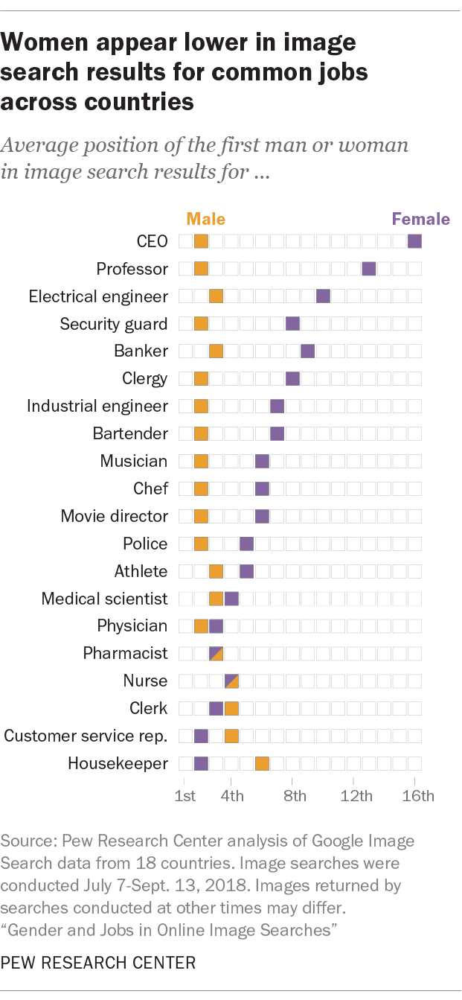

```{r setup, include=FALSE}
knitr::opts_chunk$set(fig.showtext=TRUE, fig.align="center", out.width="100%")
```

# Gender equality on online search of jobs?

[A research conducted by the Pew Research Center on December 2018](https://www.pewresearch.org/social-trends/2018/12/17/gender-and-jobs-in-online-image-searches/) showed that inequalities also exist on online search. They represented the obtained data in several graphs, such as the underrepresentation or overrepresentation of women depending on the profession, with a several gap between the results of the search and the actual proportion of women in each occupation. 

But the graph we are going to replicate on this project is the one that shows the average position obtained by the first male or female depending on the profession. Such graph is the following:

```{r echo=FALSE, fig.cap="Original graph from [Pew Research Center](https://www.pewresearch.org/social-trends/2018/12/17/gender-and-jobs-in-online-image-searches/pl_18-12-10_across_countries/)", out.width="70%", out.extra="class=external"}

```

# Let's start with the replication

```{r}
library(tidyverse)
library(patchwork)
sysfonts::font_add_google("Poppins", family="poppins")
sysfonts::font_add_google("Tinos", family="tinos")
sysfonts::font_add_google("Arimo", family="arimo")
showtext::showtext_auto()
```

After importing (and installing, if necessary) the libraries needed for this project, the next step is to import the data of the plot. Besides the Pew Research Center didn't publish the dataset they used to the article alongside it, it's pretty simple to generate ourselves a dataframe, as they are integers numbers (the position on a search results page) and 20 professions.

```{r}
df <- data.frame(
  Profession = c("CEO", "Professor", "Electrical engineer", "Security guard",
                 "Banker", "Clergy", "Industrial engineer", "Bartender", "Musician",
                 "Chef", "Movie director", "Police", "Athlete", "Medical scientist",
                 "Physician", "Pharmacist", "Nurse", "Clerk", "Customer service rep.",
                 "Housekeeper"),
  Male = c(2, 2, 3, 2, 3, 2, 2, 2, 2, 2, 2, 2, 3, 3, 2, 3, 4, 4, 4, 6),
  Female = c(16, 13, 10, 8, 9, 8, 7, 7, 6, 6, 6, 5, 5, 4, 3, 3, 4, 3, 2, 2)
)
```

As for now, we have the data we want to plot. Let's focus on generating the plot. Following the original graph, the position of the first male/female that appears on a web search of a certain job is plotted as a tile. The tile is `#eb9f2e` if it's a male, `#83669f` if it's a female. 

```{r}
p <- ggplot(df, aes(y=Profession)) + 
  geom_tile(aes(x=Male), fill="#eb9f2e", color = "#eb9f2e", width = 0.35, height = 0.7) + 
  geom_tile(aes(x=Female), fill="#83669f", color = "#83669f", width = 0.35, height =0.7)

p
```

At this time, we have one major issue: we only plotted the female/male tiles, but the original graph has another 14 white tiles (or 15, on Pharmacist and Nurse, where both gender have the same value), as they represent all the possible values.

## Adding tiles

The way of adding the blank tiles that represent all the possible values was tricky. First of all, my intention was trying to generate them automatically with a given R function, but I was not capable of. Instead, I added to the dataset 16 new variables, one per column, that would fit on the x-axis and be the "empty" tiles. In order from 1 to 16, I added the positions that were left. So the entire and final dataframe resulted on the following:

```{r}
df <- df %>%
  mutate(
    position = c(1, 1, 1, 1, 1, 1, 1, 1, 1, 1, 1, 1, 1, 1, 1, 1, 1, 1, 1, 1),
    position2 = c(3, 3, 2, 3, 2, 3, 3, 3, 3, 3, 3, 3, 2, 2, 4, 2, 2, 2, 3, 3),
    position3 = c(4, 4, 4, 4, 4, 4, 4, 4, 4, 4, 4, 4, 4, 5, 5, 4, 3, 5, 5, 4),
    position4 = c(5, 5, 5, 5, 5, 5, 5, 5, 5, 5, 5, 6, 6, 6, 6, 5, 5, 6, 6, 5),
    position5 = c(6, 6, 6, 6, 6, 6, 6, 6, 7, 7, 7, 7, 7, 7, 7, 6, 6, 7, 7, 7),
    position6 = c(7, 7, 7, 7, 7, 7, 8, 8, 8, 8, 8, 8, 8, 8, 8, 7, 7, 8, 8, 8),
    position7 = c(8, 8, 8, 9, 8, 9, 9, 9, 9, 9, 9, 9, 9, 9, 9, 8, 8, 9, 9, 9),
    position8 = c(9, 9, 9, 10, 10, 10, 10, 10, 10, 10, 10, 10, 10, 10, 10, 9, 9, 10, 10, 10),
    position9 = c(10, 10, 11, 11, 11, 11, 11, 11, 11, 11, 11, 11, 11, 11, 11, 10, 10, 11, 11, 11),
    position10 = c(11, 11, 12, 12, 12, 12, 12, 12, 12, 12, 12, 12, 12, 12, 12, 11, 11, 12, 12, 12),
    position11 = c(12, 12, 13, 13, 13, 13, 13, 13, 13, 13, 13, 13, 13, 13, 13, 12, 12, 13, 13, 13),
    position12 = c(13, 14, 14, 14, 14, 14, 14, 14, 14, 14, 14, 14, 14, 14, 14, 13, 13, 14, 14, 14),
    position13 = c(14, 15, 15, 15, 15, 15, 15, 15, 15, 15, 15, 15, 15, 15, 15, 14, 14, 15, 15, 15),
    position14 = c(15, 16, 16, 16, 16, 16, 16, 16, 16, 16, 16, 16, 16, 16, 16, 15, 15, 16, 16, 16),
    position15 = c(NA, NA, NA, NA, NA, NA, NA, NA, NA, NA, NA, NA, NA, NA, NA, 16, 16, NA, NA, NA)
)
```

## Plot again

Done that, the plot should have now all the needed tiles, both of the gender variable and all the possible positions. So we add to the first code we plotted the `geom_tile()` for each new variable we added to the dataset, as the following:

```{r}
p <- ggplot(df, aes(y=Profession)) + 
  geom_tile(aes(x=Male), fill="#eb9f2e", color = "#eb9f2e", width = 0.35, height = 0.7) + 
  geom_tile(aes(x=Female), fill="#83669f", color = "#83669f", width = 0.35, height =0.7) +
  geom_tile(aes(x=position), fill="white", color = "grey", width = 0.35, height = 0.7) +
  geom_tile(aes(x=position2), fill="white", color = "grey", width = 0.35, height = 0.7) +
  geom_tile(aes(x=position3), fill="white", color = "grey", width = 0.35, height = 0.7) +
  geom_tile(aes(x=position4), fill="white", color = "grey", width = 0.35, height = 0.7) +
  geom_tile(aes(x=position5), fill="white", color = "grey", width = 0.35, height = 0.7) +
  geom_tile(aes(x=position6), fill="white", color = "grey", width = 0.35, height = 0.7) +
  geom_tile(aes(x=position7), fill="white", color = "grey", width = 0.35, height = 0.7) +
  geom_tile(aes(x=position8), fill="white", color = "grey", width = 0.35, height = 0.7) +
  geom_tile(aes(x=position9), fill="white", color = "grey", width = 0.35, height = 0.7) +
  geom_tile(aes(x=position10), fill="white", color = "grey", width = 0.35, height = 0.7) +
  geom_tile(aes(x=position11), fill="white", color = "grey", width = 0.35, height = 0.7) +
  geom_tile(aes(x=position12), fill="white", color = "grey", width = 0.35, height = 0.7) +
  geom_tile(aes(x=position13), fill="white", color = "grey", width = 0.35, height = 0.7) +
  geom_tile(aes(x=position14), fill="white", color = "grey", width = 0.35, height = 0.7) +
  geom_tile(aes(x=position15), fill="white", color = "grey", width = 0.35, height = 0.7) 

p
```

## Rearrange y-axis

This graph has the essential parts of the original one. Nonetheless, the order of the y-axis is not the same, besides we created the dataframe following, from top to bottom, the graph of the Pew Research Center. To fix that, we can use the function `scale_y_discrete(limits = rev(df$Profession)`. We also use the `scale_y_discrete()` function to add some space at the top of the grid, as we will needed it for the title and the subtitle:

```{r}
p <- p + scale_fill_manual(values=c(position ="white",
                             Male ="#eb9f2e",
                             Female = "#83669f")) +
  scale_y_discrete(limits = rev(df$Profession), expand = expansion(mult = c(0, 0.1))) 

p
```

## Aesthetic and themes

Now we have a graph that follows the original one in its factor form, but we have to modify the appearance to achieve a replica.

First of all, they removed the axis title of both y and x-axis. Also, the title and the subtitle and the attribution of the plot, and one important thing: the legend. The legend is added to the graph in a particularly way: Male and Female are not together in a traditional box or something like that, as they are on top of the corresponding first tile. So, instead of using `labs` or another related function, we insert "Male" and "Female" as an annotation. With the extra space we gave to the top of the grid, the words are not cut by the space of the subtitle.

```{r}
p <- p + labs(
    x = "",
    y = "",
    title = "Women appear lower in image\nsearch results for common jobs\nacross countries",
    subtitle = "\nAverage position of the first man or woman\nin image search results for ...\n "
  ) +
  annotate("text", x = 2, y = 21, label = "Male", size = 3, color = "#eb9f2e",
           fontface = 2, family = "arimo") +
  annotate("text", x = 16, y = 21, label = "Female", size = 3, color = "#83669f",
           fontface = 2, family = "arimo") 

p
```

The trickiest thing we tended to solve is the tiles of Pharmacist and Nurse, the only ones where Male and Female have the same value. The closest approach was generating an annotation with a rectangle (instead of a triangle, as it was impossible to achieve):

```{r}
p <- p +
  annotate("rect", xmin = 3.05, xmax = 3.2, ymin = 4.725, ymax = 5.3, alpha = 1,
           color = "#eb9f2e", fill = "#eb9f2e") +
  annotate("rect", xmin = 4.05, xmax = 4.2, ymin = 3.725, ymax = 4.3, alpha = 1,
           color = "#eb9f2e", fill = "#eb9f2e") 

p
```

Finally, we adjust the things related to the themes. The grid has to be completely white and without borders, the axis ticks and line disappear and we try to have the same font family as the original one, as well of adjusting on the horizontal axis the title and the subtitle. This results in the final graph.

```{r}
p <- p + theme_light() +
  theme(
  panel.background = element_blank(),
  panel.grid = element_line(size = 0.25, color = "white"),
  axis.ticks = element_blank(),
  axis.line = element_blank(),
  panel.border = element_blank(),
  axis.text = element_text(family = "tinos"),
  axis.text.x = element_blank(),
  plot.title = element_text(face = "bold", family = "arimo", hjust = 0),
  plot.subtitle = element_text(color = "grey", face = "italic", family = "tinos",
                               hjust = 0, vjust = 4),
  plot.caption = element_text(hjust = 0),
  axis.title = element_blank()
)

p
```

## Problems

If we compare the original graph and the replica one, we see three main differences. The first difference is the width of the plot and the distance between the columns of tiles. Through different manners we tried to narrow the grid, but these actions tended to deform the tiles and the graph.

The second difference is located at the tiles of Pharmacist and Nurse, where the original one plotted the tiles half `#eb9f2e` and half `#83669f` with each color in a triangle. The closest approach was generating an annotation with `geom_rect()`, as `geom_polygon()` couldn't be printed in a annotation, besides several tries. 

The third difference is the x-axis. While seemed to be an easy way to modify the breaks of the axis in order to show 1, 4, 8, 12 and 16, at the moment we introduced to the code the `scale_x_discrete(breaks = c(1, 4, 8, 12, 16))` or `scale_x_discrete(limits = c(1,16), breaks = c(1, 4, 8, 12, 16))`, the x-axis disappears and also some data is not plotted correctly. 

### Solving the x-axis

The solution I found to solve the problem with the breaks of the x-axis was to expand the bottom of the graph and introducing the labels as regular text with `anotate`.

```{r, preview=TRUE}
p <- p + expand_limits(y = -1.5) +
  annotate("text", x = 1, y = -.9, label = "1st", size = 3.25, color = "#76777a",
           fontface = 1, family = "tinos") +
  annotate("text", x = 4, y = -.9, label = "4th", size = 3.25, color = "#76777a",
           fontface = 1, family = "tinos") +
  annotate("text", x = 8, y = -.9, label = "8th", size = 3.25, color = "#76777a",
           fontface = 1, family = "tinos") +
  annotate("text", x = 12, y = -.9, label = "12th", size = 3.25, color = "#76777a",
           fontface = 1, family = "tinos") +
  annotate("text", x = 16, y = -.9, label = "16th", size = 3.25, color = "#76777a",
           fontface = 1, family = "tinos") +
  annotate("text", x = 1, y = 0.4, label = "|", size = 2, color = "#76777a",
           fontface = 1, family = "arimo") +
  annotate("text", x = 4, y = 0.4, label = "|", size = 2, color = "#76777a",
           fontface = 1, family = "arimo") +
  annotate("text", x = 8, y = 0.4, label = "|", size = 2, color = "#76777a",
           fontface = 1, family = "arimo") +
  annotate("text", x = 12, y = 0.4, label = "|", size = 2, color = "#76777a",
           fontface = 1, family = "arimo") +
  annotate("text", x = 16, y = 0.4, label = "|", size = 2, color = "#76777a",
           fontface = 1, family = "arimo")
p
```


# Alternative visualization or improvements

When thinking about another ways of plotting the same data while maintaining the essence and the meaning of the graph, the first thing that came to my mind was to plot the searches individually and in a vertically way. The goal is to keep a familiar look and feel to an actual web search engine. The spirit is the same, but instead of tiles, rectangles figures that tend to be similar to the boxes that Google, DuckDuckGo and other search engines use to organize the results.

The first step was to recreate the dataset inverting the position of the tiles, as 1 being 16, 2 being 15 and so on, as we want to plot the first positions on top, instead from bottom to top. We also introduced two empty professions, "Blank", that will help us later in order to clean the view and insert the legend.

```{r}
a_df <- data.frame(
  Profession = c("CEO", "Professor", "Electrical engineer", "Security guard",
                 "Banker", "Blank", "Clergy", "Industrial engineer", "Bartender",
                 "Musician", "Chef", "Movie director", "Police", "Athlete",
                 "Medical scientist", "Physician", "Blank", "Pharmacist", "Nurse",
                 "Clerk", "Customer service rep.", "Housekeeper"),
  Male = c(15, 15, 14, 15, 14, NA, 15, 15, 15, 15, 15, 15, 15, 14, 14, 15, NA, 14, 13, 13, 13, 11),
  Female = c(1, 4, 8, 9, 7, NA,  9, 10, 10, 11, 11, 11, 12, 12, 13, 14, NA, 14, 13, 14, 15, 15),
  position = c(16, 16, 16, 16, 16, NA, 16, 16, 16, 16, 16, 16, 16, 16, 16, 16, NA, 16, 16, 16, 16, 16),
  position2 = c(14, 14, 15, 14, 15, NA, 14, 14, 14, 14, 14, 14, 14, 15, 15, 13, NA, 15, 15, 15, 14, 14),
  position3 = c(13, 13, 13, 13, 13, NA, 13, 13, 13, 13, 13, 13, 13, 13, 12, 12, NA, 13, 14, 12, 12, 13),
  position4 = c(12, 12, 12, 12, 12, NA, 12, 12, 12, 12, 12, 12, 11, 11, 11, 11, NA, 12, 12, 11, 11, 12),
  position5 = c(12, 12, 12, 12, 12, NA, 12, 12, 12, 10, 10, 11, 11, 11, 11, 11, NA, 12, 12, 11, 11, 11),
  position6 = c(11, 11, 11, 11, 11, NA, 11, 9, 9, 9, 9, 9, 9, 9, 9, 9, NA, 11, 11, 9, 9, 9),
  position7 = c(9, 9, 9, 8, 9, NA, 8, 8, 8, 8, 8, 8, 8, 8, 8, 8, NA, 9, 9, 8, 8, 8),
  position8 = c(8, 8, 7, 7, 8, NA, 7, 7, 7, 7, 7, 7, 7, 7, 7, 7, NA, 8, 8, 7, 7, 7),
  position9 = c(7, 7, 6, 6, 6, NA, 6, 6, 6, 6, 6, 6, 6, 6, 6, 6, NA, 7, 7, 6, 6, 6),
  position10 = c(6, 6, 5, 5, 5, NA, 5, 5, 5, 5, 5, 5, 5, 5, 5, 5, NA, 6, 6, 5, 5, 5),
  position11 = c(5, 5, 4, 4, 4, NA, 4, 4, 4, 4, 4, 4, 4, 4, 4, 4, NA, 5, 5, 4, 4, 4),
  position12 = c(4, 3, 3, 3, 3, NA, 3, 3, 3, 3, 3, 3, 3, 3, 3, 3, NA, 4, 4, 3, 3, 3),
  position13 = c(3, 2, 2, 2, 2, NA, 2, 2, 2, 2, 2, 2, 2, 2, 2, 2, NA, 3, 3, 2, 2, 2),
  position14 = c(2, 1, 1, 1, 1, NA, 1, 1, 1, 1, 1, 1, 1, 1, 1, 1, NA, 2, 2, 1, 1, 1),
  position15 = c(NA, NA, NA, NA, NA, NA, NA, NA, NA, NA, NA, NA, NA, NA, NA, NA, NA, 1, 1, NA, NA, NA)
) 
``` 

The next step is to create dataframes for every graph we want to plot (and join at the last steps). As there are 22 positions (twenty professions and two empty columns), we divide them in 2 different dataframes. We use the entire dataframe we've just created and divide it maintaining the positions and adding another column to fix the empty tiles. 

```{r}

f_df <- a_df %>% slice(1:(n()-11)) %>% 
  mutate(position15 = c(10, 10, 10, 10, 10, NA, 10, 11, 11, 10, 10))

fo_df <- a_df %>% slice(12:n()) %>% 
  mutate(position15 = c(10, 10, 10, 10, 10, NA, 10, 10, 10, 10, 10)) %>% 
  mutate(position5 = c(NA, NA, NA, NA, NA, NA, 12, 12, 11, 11, NA)) %>% 
  mutate(position16 = c(1, 1, NA, NA, NA, NA, 1, 1, NA, NA, NA))

```


With the two dataframes, we set the variable `Profession` as a factor and we indicate the order in we want it to be plotted with the `levels` option.


```{r}
f_df$Profession <- factor(f_df$Profession, levels = c(
  "Professor", "CEO", "Electrical engineer", "Banker", "Security guard", "Blank", 
  "Clergy", "Industrial engineer", "Bartender", "Musician", "Chef" ))

p1 <- ggplot(f_df, aes(x = Profession)) + 
  geom_tile(aes(y=Male), fill="#eb9f2e", color = "#eb9f2e", width = 0.7, height = 0.8, size = 1) + 
  geom_tile(aes(y=Female), fill="#83669f", color = "#83669f", width = 0.7, height = 0.8, size = 1) +
  geom_tile(aes(y=position), fill="white", color = "black", width = 0.7, height = 0.8, size = 0.2) +
  geom_tile(aes(y=position2), fill="white", color = "black", width = 0.7, height = 0.8, size = 0.2) +
  geom_tile(aes(y=position3), fill="white", color = "black", width = 0.7, height = 0.8, size = 0.2) +
  geom_tile(aes(y=position4), fill="white", color = "black", width = 0.7, height = 0.8, size = 0.2) +
  geom_tile(aes(y=position5), fill="white", color = "black", width = 0.7, height = 0.8, size = 0.2) +
  geom_tile(aes(y=position6), fill="white", color = "black", width = 0.7, height = 0.8, size = 0.2) +
  geom_tile(aes(y=position7), fill="white", color = "black", width = 0.7, height = 0.8, size = 0.2) +
  geom_tile(aes(y=position8), fill="white", color = "black", width = 0.7, height = 0.8, size = 0.2) +
  geom_tile(aes(y=position9), fill="white", color = "black", width = 0.7, height = 0.8, size = 0.2) +
  geom_tile(aes(y=position10), fill="white", color = "black", width = 0.7, height = 0.8, size = 0.2) +
  geom_tile(aes(y=position11), fill="white", color = "black", width = 0.7, height = 0.8, size = 0.2) +
  geom_tile(aes(y=position12), fill="white", color = "black", width = 0.7, height = 0.8, size = 0.2) +
  geom_tile(aes(y=position13), fill="white", color = "black", width = 0.7, height = 0.8, size = 0.2) +
  geom_tile(aes(y=position14), fill="white", color = "black", width = 0.7, height = 0.8, size = 0.2) +
  geom_tile(aes(y=position15), fill="white", color = "black", width = 0.7, height = 0.8, size = 0.2) +
  scale_fill_manual(values=c(position ="white",
                             Male ="#eb9f2e",
                             Female = "#83669f")) +
  scale_x_discrete(position = "top", guide = guide_axis(n.dodge=2)) +
  annotate("text", x = 6, y = 15, label = "Male", size = 3.5, color = "#eb9f2e",
           fontface = 1, family = "poppins") +
  annotate("text", x = 6, y = 9.05, label = "Female", size = 3.5, color = "#83669f",
           fontface = 1, family = "poppins") +
  annotate("text", x = 0.1, y = 16, label = "1st", size = 3.25, color = "#6d6e71",
           fontface = 1, family = "poppins") +
  annotate("text", x = 0.1, y = 13, label = "4th", size = 3.25, color = "#6d6e71",
           fontface = 1, family = "poppins") +
  annotate("text", x = 0.1, y = 9, label = "8th", size = 3.25, color = "#6d6e71",
           fontface = 1, family = "poppins") +
  annotate("text", x = 0.1, y = 5, label = "12th", size = 3.25, color = "#6d6e71",
           fontface = 1, family = "poppins") +
  annotate("text", x = 0.1, y = 1, label = "16th", size = 3.25, color = "#6d6e71",
           fontface = 1, family = "poppins") +
  annotate("text", x = 0.5, y = 16, label = "—", size = 3.25, color = "#6d6e71",
           fontface = 1, family = "poppins") +
  annotate("text", x = 0.5, y = 13, label = "—", size = 3.25, color = "#6d6e71",
           fontface = 1, family = "poppins") +
  annotate("text", x = 0.5, y = 9, label = "—", size = 3.25, color = "#6d6e71",
           fontface = 1, family = "poppins") +
  annotate("text", x = 0.5, y = 5, label = "—", size = 3.25, color = "#6d6e71",
           fontface = 1, family = "poppins") +
  annotate("text", x = 0.5, y = 1, label = "—", size = 3.25, color = "#6d6e71",
           fontface = 1, family = "poppins") +
  annotate("text", x = 1, y = 17.2, label = "Professor", size = 3.25, color = "black",
           fontface = 1, family = "poppins") +
  annotate("text", x = 2, y = 18.2, label = "CEO", size = 3.25, color = "black",
           fontface = 1, family = "poppins") +
  annotate("text", x = 3, y = 17.2, label = "Electrical eng.", size = 3.25, color = "black",
           fontface = 1, family = "poppins") +
  annotate("text", x = 4, y = 18.2, label = "Banker", size = 3.25, color = "black",
           fontface = 1, family = "poppins") +
  annotate("text", x = 5, y = 17.2, label = "Security guard", size = 3.25, color = "black",
           fontface = 1, family = "poppins") +
  annotate("text", x = 7, y = 17.2, label = "Clergy", size = 3.25, color = "black",
           fontface = 1, family = "poppins") +
  annotate("text", x = 8, y = 18.2, label = "Industrial eng.", size = 3.25, color = "black",
           fontface = 1, family = "poppins") +
  annotate("text", x = 9, y = 17.2, label = "Bartender", size = 3.25, color = "black",
           fontface = 1, family = "poppins") +
  annotate("text", x = 10, y = 18.2, label = "Musician", size = 3.25, color = "black",
           fontface = 1, family = "poppins") +
  annotate("text", x = 11, y = 17.2, label = "Chef", size = 3.25, color = "black",
           fontface = 1, family = "poppins") +
  expand_limits(x = c(-.5, 12.5), y = c(0, 18)) +
labs(
    title = "Women appear lower in image search results\nfor common jobs across countries\n",
    subtitle = "Average position of the first man or woman in image search results for ... "
  ) +
  theme_light() +
  theme(
  panel.background = element_blank(),
  panel.grid = element_line(size = 0.25, color = "white"),
  axis.ticks = element_blank(),
  axis.line = element_blank(),
  axis.text = element_blank(),
  plot.title = element_text(face = "bold", family = "poppins", hjust = 0.5),
  plot.subtitle = element_text(color = "grey", face = "italic", family = "poppins",
                               hjust = .5, vjust = 4),
  plot.caption = element_text(hjust = 0),
  axis.title = element_blank()
)

p1
```

In this case, we also rename the profession "Customer service rep." to "Cust. serv. rep." in order to make the name shorter and avoid overlapping.

```{r}
fo_df[fo_df$Profession == "Customer service rep.", "Profession"] <- "Cust. serv. rep."

fo_df$Profession <- factor(fo_df$Profession, levels = c(
  "Movie director", "Police", "Athlete", "Medical scientist", "Physician",
  "Blank", "Pharmacist", "Nurse", "Clerk", "Cust. serv. rep.", "Housekeeper"))


p2 <- ggplot(fo_df, aes(x = Profession)) + 
  geom_tile(aes(y=Male), fill="#eb9f2e", color = "#eb9f2e", width = 0.7, height = 0.8, size = 1) + 
  geom_tile(aes(y=Female), fill="#83669f", color = "#83669f", width = 0.7, height = 0.8, size = 1) +
  geom_tile(aes(y=position), fill="white", color = "black", width = 0.7, height = 0.8, size = 0.2) +
  geom_tile(aes(y=position2), fill="white", color = "black", width = 0.7, height = 0.8, size = 0.2) +
  geom_tile(aes(y=position3), fill="white", color = "black", width = 0.7, height = 0.8, size = 0.2) +
  geom_tile(aes(y=position4), fill="white", color = "black", width = 0.7, height = 0.8, size = 0.2) +
  geom_tile(aes(y=position5), fill="white", color = "black", width = 0.7, height = 0.8, size = 0.2) +
  geom_tile(aes(y=position6), fill="white", color = "black", width = 0.7, height = 0.8, size = 0.2) +
  geom_tile(aes(y=position7), fill="white", color = "black", width = 0.7, height = 0.8, size = 0.2) +
  geom_tile(aes(y=position8), fill="white", color = "black", width = 0.7, height = 0.8, size = 0.2) +
  geom_tile(aes(y=position9), fill="white", color = "black", width = 0.7, height = 0.8, size = 0.2) +
  geom_tile(aes(y=position10), fill="white", color = "black", width = 0.7, height = 0.8, size = 0.2) +
  geom_tile(aes(y=position11), fill="white", color = "black", width = 0.7, height = 0.8, size = 0.2) +
  geom_tile(aes(y=position12), fill="white", color = "black", width = 0.7, height = 0.8, size = 0.2) +
  geom_tile(aes(y=position13), fill="white", color = "black", width = 0.7, height = 0.8, size = 0.2) +
  geom_tile(aes(y=position14), fill="white", color = "black", width = 0.7, height = 0.8, size = 0.2) +
  geom_tile(aes(y=position15), fill="white", color = "black", width = 0.7, height = 0.8, size = 0.2) +
  geom_tile(aes(y=position16), fill="white", color = "black", width = 0.7, height = 0.8, size = 0.2) +
  scale_fill_manual(values=c(position ="white",
                             Male ="#eb9f2e",
                             Female = "#83669f")) +
  scale_x_discrete(position = "top", guide = guide_axis(n.dodge=2)) +
  annotate("rect", xmin = 7, xmax = 7.35, ymin = 13.6, ymax = 14.4, alpha = 1,
           color = "#eb9f2e", fill = "#eb9f2e") +
  annotate("rect", xmin = 8, xmax = 8.35, ymin = 12.6, ymax = 13.4, alpha = 1,
           color = "#eb9f2e", fill = "#eb9f2e") +
  annotate("text", x = 6, y = 15, label = "Male", size = 3.5, color = "#eb9f2e",
           fontface = 1, family = "poppins") +
  annotate("text", x = 6, y = 14.05, label = "Female", size = 3.5, color = "#83669f",
           fontface = 1, family = "poppins") +
  annotate("text", x = 0.1, y = 16, label = "1st", size = 3.25, color = "#6d6e71",
           fontface = 1, family = "poppins") +
  annotate("text", x = 0.1, y = 13, label = "4th", size = 3.25, color = "#6d6e71",
           fontface = 1, family = "poppins") +
  annotate("text", x = 0.1, y = 9, label = "8th", size = 3.25, color = "#6d6e71",
           fontface = 1, family = "poppins") +
  annotate("text", x = 0.1, y = 5, label = "12th", size = 3.25, color = "#6d6e71",
           fontface = 1, family = "poppins") +
  annotate("text", x = 0.1, y = 1, label = "16th", size = 3.25, color = "#6d6e71",
           fontface = 1, family = "poppins") +
  annotate("text", x = 0.5, y = 16, label = "—", size = 3.25, color = "#6d6e71",
           fontface = 1, family = "poppins") +
  annotate("text", x = 0.5, y = 13, label = "—", size = 3.25, color = "#6d6e71",
           fontface = 1, family = "poppins") +
  annotate("text", x = 0.5, y = 9, label = "—", size = 3.25, color = "#6d6e71",
           fontface = 1, family = "poppins") +
  annotate("text", x = 0.5, y = 5, label = "—", size = 3.25, color = "#6d6e71",
           fontface = 1, family = "poppins") +
  annotate("text", x = 0.5, y = 1, label = "—", size = 3.25, color = "#6d6e71",
           fontface = 1, family = "poppins") +
  annotate("text", x = 1, y = 17.2, label = "Movie director", size = 3.25, color = "black",
           fontface = 1, family = "poppins") +
  annotate("text", x = 2, y = 18.2, label = "Police", size = 3.25, color = "black",
           fontface = 1, family = "poppins") +
  annotate("text", x = 3, y = 17.2, label = "Athlete", size = 3.25, color = "black",
           fontface = 1, family = "poppins") +
  annotate("text", x = 4, y = 18.2, label = "Medical scientist", size = 3.25, color = "black",
           fontface = 1, family = "poppins") +
  annotate("text", x = 5, y = 17.2, label = "Physician", size = 3.25, color = "black",
           fontface = 1, family = "poppins") +
  annotate("text", x = 7, y = 17.2, label = "Pharmacist", size = 3.25, color = "black",
           fontface = 1, family = "poppins") +
  annotate("text", x = 8, y = 18.2, label = "Nurse", size = 3.25, color = "black",
           fontface = 1, family = "poppins") +
  annotate("text", x = 9, y = 17.2, label = "Clerk", size = 3.25, color = "black",
           fontface = 1, family = "poppins") +
  annotate("text", x = 10, y = 18.2, label = "Cust. serv. rep.", size = 3.25, color = "black",
           fontface = 1, family = "poppins") +
  annotate("text", x = 11, y = 17.2, label = "Housekeeper", size = 3.25, color = "black",
           fontface = 1, family = "poppins") +
  expand_limits(x = c(-.5, 12.5), y = c(-.5, 18)) +
  theme_light() +
  theme(
  panel.background = element_blank(),
  panel.grid = element_line(size = 0.25, color = "white"),
  axis.ticks = element_blank(),
  axis.line = element_blank(),
  axis.text = element_blank(),
  plot.title = element_text(face = "bold", family = "poppins", hjust = 0.5),
  plot.subtitle = element_text(color = "grey", face = "italic", family = "poppins",
                               hjust = .5, vjust = 2),
  plot.caption = element_text(hjust = 0),
  axis.title = element_blank()
)

p2
```

## Final alternative visualization

And finally, here we have our alternative visualization, composed by the two previous plots:

```{r, fig.asp=1.5}
p1 / p2
```
