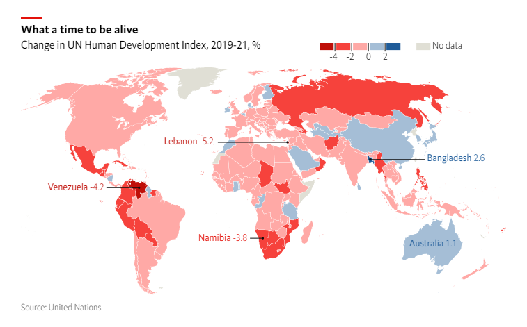

Distill is a publication format for scientific and technical writing, native to the web.

Learn more about using Distill at <https://rstudio.github.io/distill>.

```{r, out.width="90%", fig.align='right'}

```


# Title 1

```{r, include=FALSE}
library(readr)
library(tidyverse)
library(ggthemes)
library(sf)
library(giscoR)
library(extrafont)
library(showtext)
library(sysfonts)
```

```{r}
sysfonts::font_add_google("Open Sans", family = "Open Sans")
sysfonts::font_add_google("News Cycle", family = "News Cycle")

showtext::showtext_auto()
showtext::showtext_opts(dpi=96)
```

```{r}

HDI <- read.csv("https://hdr.undp.org/sites/default/files/2021-22_HDR/HDR21-22_Composite_indices_complete_time_series.csv")

my_data <- HDI %>% select(country, iso3, hdi_2019, hdi_2021) %>% 
  mutate(change = ((hdi_2021/hdi_2019) -1)*100) %>% 
  mutate(change = round(change,1))


#TRYING WITH GISCOR-----
world <- giscoR::gisco_get_countries()
class(world)

hdi_data <- HDI %>% distinct(iso3) %>% as_vector()
nat_data <- world$ISO3_CODE
differ <-as.data.frame(setdiff(hdi_data, nat_data))#no differences in countries


all_data <- st_as_sf(left_join(world, my_data, by = c("ISO3_CODE" = "iso3")))
all_data <- all_data %>% filter(!ISO3_CODE %in% c("ATA", "PYF"))

points <- all_data %>% filter(ISO3_CODE %in% c("LBN", "BGD", "VEN", "NAM"))
countries_center <- st_point_on_surface(points)
australia <- all_data %>% filter(ISO3_CODE == "AUS")
ata <- all_data %>% filter(ISO3_CODE == "ATA")

NonNA_data <- all_data %>% filter(!is.na(change))
NA_data <- all_data %>% filter(is.na(change))
Gibraltar <- NA_data %>% filter(ISO3_CODE == "GIB")


```

```{r}

lebanon <- st_sfc(st_point(c(35.49,33.9)), crs=4326)
lebanon <- st_transform(lebanon, "+proj=robin")
lebanon_end <- st_sfc(st_point(c(-14,33.9)), crs=4326)
lebanon_end <-  st_transform(lebanon_end, "+proj=robin")

namibia <-  st_sfc(st_point(c(17.7,-23)), crs=4326)
namibia <- st_transform(namibia, "+proj=robin")
namibia_end <- st_sfc(st_point(c(8,-23)), crs=4326)
namibia_end <- st_transform(namibia_end, "+proj=robin")

venezuela <-  st_sfc(st_point(c(-65,6.5)), crs=4326)
venezuela <- st_transform(venezuela, "+proj=robin")
venezuela_end <- st_sfc(st_point(c(-85,6.5)), crs=4326)
venezuela_end <- st_transform(venezuela_end, "+proj=robin")

banglad <-  st_sfc(st_point(c(90,23.7)), crs=4326)
banglad <- st_transform(banglad, "+proj=robin")
banglad_end <- st_sfc(st_point(c(130,23.7)), crs=4326)
banglad_end <- st_transform(banglad_end, "+proj=robin")

```


```{r, out.width="100%", fig.pos='center'}

ggplot(data = all_data) +  
  geom_sf(data = Gibraltar, aes(color = ""))+
  scale_color_discrete(guide=guide_bins(
                             axis = FALSE,
                             label = FALSE,
                             title = "No data",
                             title.position = "right",
                             title.vjust = 1,
                             title.hjust = 0,
                             title.theme = element_text(size = 16, 
                                                        color = "grey50"),
                             override.aes = list(color =  "#e0ded4", fill = "#e0ded4"),
                             order = 2, 
                             direction = "horizontal"))+
  geom_sf(aes(fill = change), color = "white", size = 0.1, inherit.aes = FALSE, expand = FALSE) + 
  scale_fill_stepsn(breaks = c(-4,-2,0,2),
                    colors = c("#be0f08", "#f6423c", "#ffa9a6", "#a4bfd6", "#1e5c98"), 
                    na.value = "#e0ded4",
                    guide = guide_colorsteps(even.steps = TRUE, 
                                             order = 1,
                                             ticks = TRUE, 
                                             ticks.colour= "black",
                                             ticks.linewidth = 1,
                                             direction = "horizontal",
                                             title = NULL,
                                             draw.llim = TRUE,
                                             draw.ulim = TRUE,
                                             frame.color = "black",
                                             label.theme = element_text(size= 15))) +
  theme_map()+
  theme(legend.position = c(0.63,0.95),
        legend.key = element_rect(color = "white"),
        legend.key.height = unit(2.1,"mm"),
        legend.key.width = unit(4.7,"mm"),
        legend.margin = margin(0,0,0,0),
        legend.direction = "horizontal",
        legend.box = "horizontal", 
        legend.spacing = unit(4.7,"mm"),
        legend.spacing.y = unit(1,"mm"),
        legend.background = element_blank())+
  labs(title = "What a time to be alive",
       subtitle = "Change in UN Human Development Index, 2019-21, %",
       caption = "Source: United Nations")+
  theme(plot.title = element_text(face="bold", 
                                  family = "Open Sans",
                                  size = 16, 
                                  hjust = 0.14, 
                                  margin = margin(10,0,5,0)),
        plot.title.position = "panel",
        plot.subtitle = element_text(size = 16, 
                                     family = "Open Sans",
                                     hjust = 0.195,
                                     margin = margin(0,0,1,0)),
        plot.caption = element_text(size = 13.5, 
                                    family = "Open Sans",
                                    hjust = 0.14, 
                                    color = "grey50",
                                    margin = margin(0,0,0,0)),
        plot.caption.position = "panel") + 
  geom_sf_text(data = australia, aes(label = paste(NAME_ENGL, "1.1")), 
               size = 4.7, 
               color = "#1e5c98")+
  geom_sf(data = countries_center, size = 0.5) +
  coord_sf(crs = st_crs("+proj=robin")) + #changing to Robinson projection
  annotate("segment", x=lebanon[[1]][1], y=lebanon[[1]][2],
           xend=lebanon_end[[1]][1], yend=lebanon_end[[1]][2], size = 0.5) +
  annotate("text", x=lebanon_end[[1]][1], y=lebanon_end[[1]][2], 
           label = "Lebanon -5.2",
           hjust = 1.05,
           color = "#be0f08",
           size = 4.7) +
  annotate("segment", x=namibia[[1]][1], y=namibia[[1]][2],
           xend=namibia_end[[1]][1], yend=namibia_end[[1]][2], size = 0.5) +
  annotate("text", x=namibia_end[[1]][1], y=namibia_end[[1]][2], 
           label = "Namibia -3.8",
           hjust = 1.05,
           color = "#f6423c",
           size = 4.7)+
  annotate("segment", x=venezuela[[1]][1], y=venezuela[[1]][2],
           xend=venezuela_end[[1]][1], yend=venezuela_end[[1]][2], size = 0.5) +
  annotate("text", x=venezuela_end[[1]][1], y=venezuela_end[[1]][2], 
           label = "Venezuela -4.2",
           hjust = 1.05,
           color = "#be0f08",
           size = 4.7)+
  annotate("segment", x=banglad[[1]][1], y=banglad[[1]][2],
           xend=banglad_end[[1]][1], yend=banglad_end[[1]][2], size = 0.5)+
  annotate("text", x=banglad_end[[1]][1], y=banglad_end[[1]][2], 
           label = "Bangladesh 2.6",
           hjust = -0.05,
           color = "#1e5c98",
           size = 4.7)
```


