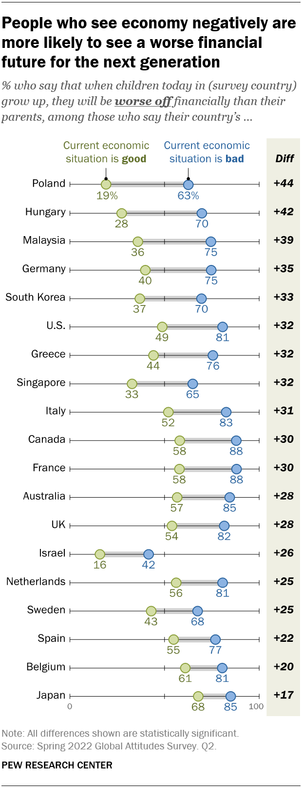

```{r setup, include=FALSE}
knitr::opts_chunk$set(fig.align="center")
```

## Data reading

I load the data, transform it into long format and create a new column that assigns a number to each country to group them into different categories as a preliminary step to the alternative visualisation I will carry out.

```{r}
library(tidyverse)
library(patchwork)

dataviz <- readxl::read_xlsx("data.xlsx")

dataviz_long <- dataviz %>% 
  pivot_longer(cols = c(2,3),
               names_to = "Eco_perception",
               values_to = "Proportion")  %>% 
  mutate(zone = case_when(Country == "Poland" ~ 1,
                          Country == "Hungary" ~ 1,
                          Country == "Germany" ~ 2,
                          Country == "Greece" ~ 3,
                          Country == "Italy" ~ 3,
                          Country == "France" ~ 2,
                          Country == "Netherlands" ~ 2,
                          Country == "Sweden" ~ 2,
                          Country == "Spain" ~ 3,
                          Country == "Belgium" ~ 2,
                          Country == "UK" ~ 4,
                          Country == "U.S." ~ 4,
                          Country == "Canada" ~ 4,
                          Country == "Australia" ~ 4,
                          Country == "Malaysia" ~ 5,
                          Country == "South Korea" ~ 5,
                          Country == "Singapore" ~ 5,
                          Country == "Japan" ~ 5),
         Eco_perception = case_when(Eco_perception == "Eco_good" ~ "Good",
                                    Eco_perception == "Eco_bad" ~ "Bad")) 

country_order <- c("Japan", "Belgium", "Spain", "Sweden", "Netherlands", "Israel", 
                   "UK", "Australia", "France", "Canada", "Italy", "Singapore", "Greece", 
                   "U.S.", "South Korea", "Germany", "Malaysia", "Hungary", "Poland")
```

## Graph replication

Here I replicate, as close as possible, a graph by Pew Research in their 2022 article [*Large shares in many countries are pessimistic about the next generation’s financial future*](https://pewrsr.ch/3AeDg7G). 

```{r echo=FALSE, fig.cap="The original graph by [Pew Research](https://pewrsr.ch/3AeDg7G)", out.width="50%", out.extra="class=external"}

```

Through the graph above, they show the differences between two groups, those who have positive or negative views of the current state of the domestic economy, in different countries, in relation to the economic future that awaits their children. Specifically, it shows how, systematically, the % of individuals who think that their children will have a worse economic situation than their parents is higher among those who think that the economic situation in their country is bad.

This graph, while not overly complicated to replicate, presents some difficulty stemming from the fact that it is actually two graphs in one. The main graph was relatively easy to carry out, except for the legend, which presented a challenge to some degree. To carry out the accompanying one (the table showing the difference between the groups) I had to think a bit out the box. The process of putting them together was the most time-consuming part, mainly because I had no prior knowledge of the library *patchwork* and not much practice in joining graphs. In any case, I consider that the final result has been satisfactory.

In my view, they have chosen an almost perfect graph to tell the story they want to tell, one about differences between groups. Representing each group as a dot and showing their differences in terms of percentage points through horizontal distances (by adding a grey line connecting the dots) makes it easy to observe the degree of these differences **within** the countries. The order in which the countries are shown (according to the differences between groups, in descending order), helps to visualize the differences **between** countries. It also uses color to make it easier for the reader to distinguish between the two groups, although the choice of colors is not ideal from my point of view, an idea I will develop later. 

The graph incorporates a table that allows the differences to be consulted numerically. The appropriateness of this table is debatable, is the information it provides really necessary? The main graph already makes it possible to clearly see the differences within and between countries. In any case, I think that the presentation of this table could be improved, which I will also discuss later.


```{r fig.height=8, fig.width=3.85}

p1 <- dataviz_long %>% 
  ggplot(aes(x = Country, y = Proportion, fill = Eco_perception,
             color = Eco_perception, group = Country, label = Proportion)) +
  geom_line(color = "gray45", size = 1.5, alpha = .2) + 
  geom_point(shape = 21, size = 2.7) +
  geom_text(vjust = 2.5, nudge_x = 0.15, size = 2.9) +
  coord_flip() +
  annotate("text", x = "Poland", y = 19, label = "Current economic",
           size = 2.9, vjust = -3.1, color = "#657032") +
  annotate("text", x = "Poland", y = 19, label = "situation is good",
           size = 2.9, vjust = -1.7, color = "#657032") +
  annotate("text", x = "Poland", y = 63, label = "Current economic",
           size = 2.9, vjust = -3.1, hjust = .3, color = "#326296") +
  annotate("text", x = "Poland", y = 63, label = "situation is bad",
           size = 2.9, vjust = -1.7, hjust = .25,color = "#326296") +
  expand_limits(y = c(0,100),
                x = c(-.1, 20.5)) +
  scale_y_continuous(breaks = c(0,100)) +
  scale_x_discrete(limits = country_order) +
  scale_fill_manual(values = c("#8cb3e6", "#d5ddad")) +
  scale_color_manual(values = c("#326296", "#657032")) +
  labs(x = NULL,
       y = NULL,
       caption = "Note: All differences shown are statistically significant. \nSource: Spring 2022 Global Attitudes Survey. Q2",
       tag = "PEW RESEARCH CENTER") +
  theme(panel.background = element_rect(fill = 'white'),
        panel.grid.major = element_line(color = "gray45", size = .2),
        panel.grid.minor = element_line(color = "gray45", size = .2),
        panel.grid.major.x = element_blank(),
        panel.grid.minor.x = element_blank(),
        legend.position = "none",
        axis.text = element_text(family = "Helvetica", size = 9, color = "gray30"),
        axis.ticks = element_blank(),
        plot.caption.position = "plot",
        plot.caption = element_text(color = "gray55", size = 7.5,
                                    face = "plain", hjust = -0.05, vjust = -3),
        plot.tag.position = c(0.175, -0.03),
        plot.tag = element_text(family = "Helvetica", size = 7.5,
                                face = "bold", hjust = .4, vjust = 1),
        plot.margin = unit(c(.7, .25, 1, .5), "cm"))

p1 

```


```{r fig.height=5.7, fig.width=.7}

p2 <- dataviz %>% 
  ggplot(aes(fct_reorder(Country, Diff), Diff, label = Diff)) +
  geom_point(alpha = 0) +
  coord_flip() + 
  annotate("rect", xmin = 0.5, xmax = 20.5, ymin = 15.5, ymax = 20, fill = "#efefe2") +
  geom_text(label = paste("+",dataviz$Diff), y=17.5, fontface = "bold.italic",
            size = 3, color = "gray30") +
  ylim (15.5,20) +
  expand_limits(x = c(-.1, 20.5)) +
  annotate("text", x = "Poland", y = 17.5, label = "Diff", size = 3,
           vjust = -2.5, fontface = "bold.italic", color = "gray30") +
  theme(panel.background = element_rect(fill = 'white'),
        panel.grid.major = element_blank(),
        panel.grid.minor = element_blank(),
        axis.title = element_blank(),
        axis.text = element_blank(),
        axis.ticks = element_blank(),
        legend.position = "none",
        plot.margin = unit(c(.7, 0.25, 1, 0), "cm"))

p2 
```


```{r fig.height=8, fig.width=3.85}

p1 + p2 + 
  plot_layout(widths = c(1.7, .3)) +
  plot_annotation(title = "People who see economy negatively are \nmore likely to see a worse financial \nfuture for the next generation",
                  subtitle = "% who say that when children today in (survey country) \ngrow up, they will be worse off financially than their \nparents, among those who say their country's...",
                  theme = theme(
                    plot.title = element_text(family = "Helvetica", size = 12.5,
                                              face = "bold", vjust = -3.5),  
                    plot.subtitle = element_text(family = "Times", size = 10.5,
                                                 color = "gray25", face = "italic",
                                                 vjust = -5))) 
  

```

## The same graph made more beautiful

There were a couple of elements related to the presentation and aesthetics of the graph that did not quite convince me: the colors and the background of the table presenting the differences.  

I think red is a more appropriate color to represent groups that have a negative view on something, so I have replaced blue with this color. I have also replaced the green with a brighter green, because the red stood out too much. I have also removed the background of the column that presents the differences and I have chosen to divide this column from the graph using a vertical line, which contributes to a cleaner presentation.


```{r fig.height=8, fig.width=3.85}

p1a <- dataviz_long %>% 
  ggplot(aes(x = Country, y = Proportion, fill = Eco_perception,
             color = Eco_perception, group = Country, label = Proportion)) +
  geom_line(color = "gray45", size = 1.5, alpha = .2) + 
  geom_point(shape = 21, size = 2.7) +
  geom_text(vjust = 2.5, nudge_x = 0.15, size = 2.9) +
  coord_flip() +
  annotate("text", x = "Poland", y = 19, label = "Current economic",
           size = 2.9, vjust = -3.1, color = "#025902") +
  annotate("text", x = "Poland", y = 19, label = "situation is good",
           size = 2.9, vjust = -1.7, color = "#025902") +
  annotate("text", x = "Poland", y = 63, label = "Current economic",
           size = 2.9, vjust = -3.1, hjust = .3, color = "#AB0202") +
  annotate("text", x = "Poland", y = 63, label = "situation is bad",
           size = 2.9, vjust = -1.7, hjust = .25, color = "#AB0202") +
  expand_limits(y = c(0,100),
                x = c(-.1, 20.5)) +
  scale_y_continuous(breaks = c(0,100)) +
  scale_x_discrete(limits = country_order) +
  scale_fill_manual(values = c("#FA8080", "#A7F3A7")) +
  scale_color_manual(values = c("#AB0202", "#025902")) +
  labs(x = NULL,
       y = NULL,
       caption = "Note: All differences shown are statistically significant. \nSource: Spring 2022 Global Attitudes Survey. Q2",
       tag = "PEW RESEARCH CENTER") +
  theme(panel.background = element_rect(fill = 'white'),
        panel.grid.major = element_line(color = "gray45", size = .2),
        panel.grid.minor = element_line(color = "gray45", size = .2),
        panel.grid.major.x = element_blank(),
        panel.grid.minor.x = element_blank(),
        legend.position = "none",
        plot.title = element_text(family = "Helvetica", size = 11.5,
                                  face = "bold", vjust = 3),  
        plot.subtitle = element_text(family = "Times", size = 10,
                                     color = "gray25", face = "italic", vjust = 3),
        axis.text = element_text(family = "Helvetica", size = 9,
                                 color = "gray30"),
        axis.ticks = element_blank(),
        plot.title.position = "plot",
        plot.caption.position = "plot",
        plot.caption = element_text(color = "gray55", size = 7.5,
                                    face = "plain", hjust = -0.05, vjust = -3),
        plot.tag.position = c(0.175, -0.03),
        plot.tag = element_text(family = "Helvetica", size = 7.5,
                                face = "bold", hjust = .43, vjust = 1),
        plot.margin = unit(c(.7, .25, 1, .5), "cm"))

```


```{r fig.height=8, fig.width=3.85}

p2r <- dataviz %>% 
  ggplot(aes(fct_reorder(Country, Diff), Diff, label = Diff)) +
  geom_point(alpha = 0) +
  coord_flip() + 
  geom_text(label = paste("+",dataviz$Diff), y=17.5, fontface = "bold.italic",
            size = 3, color = "gray30") +
  ylim (13,20) +
  expand_limits(x = c(-.1, 20.5)) +
  geom_hline(yintercept = 13.5, size = .3, color = "gray65") +
  annotate("text", x = "Poland", y = 17.5, label = "Diff", size = 3,
           vjust = -2.5, fontface = "bold.italic", color = "gray30") +
  theme(panel.background = element_rect(fill = 'white'),
        panel.grid.major = element_blank(),
        panel.grid.minor = element_blank(),
        axis.title.x = element_blank(),
        axis.title.y =  element_blank(),
        axis.text.x = element_blank(),
        axis.text.y = element_blank(),
        axis.ticks = element_blank(),
        legend.position = "none",
        plot.margin = unit(c(.7, 0.25, 1, 0), "cm"))

```


```{r fig.height=8, fig.width=3.85, preview=TRUE}

graphr <- p1a + p2r + 
  plot_layout(widths = c(1.7, .3)) +
  plot_annotation(title = "People who see economy negatively are \nmore likely to see a worse financial \nfuture for the next generation",
                  subtitle = "% who say that when children today in (survey country) \ngrow up, they will be worse off financially than their \nparents, among those who say their country's...",
                  theme = theme(
                    plot.title = element_text(family = "Helvetica", size = 12.5,
                                              face = "bold", vjust = -3.5),  
                    plot.subtitle = element_text(family = "Times", size = 10.5,
                                                 color = "gray25", face = "italic",
                                                 vjust = -5))) 

graphr

```

## Alternative visualization of the data

The type of graphic Pew Research uses to tell its story is probably the most appropriate. Below I show a proposal that tells a similar story, using a different type of visualization.  

In terms of the story, I thought it relevant to group the countries into different graphs. The criteria I have followed to carry out this grouping is geographic and cultural. I have grouped different European countries according to the region in which they are located; I have also grouped Anglo-Saxon countries and Asian countries. As for the way of visualizing the data, I have chosen to show the differences through the slope of the line. 


```{r}

alt1 <- dataviz_long %>% 
  filter(zone == 1) %>% 
  ggplot(aes(x = Eco_perception, y = Proportion, group = Country, color=Country)) +
  geom_vline(xintercept = "Good", size = .2, color = "grey65") +
  geom_vline(xintercept = "Bad", size = .2, color = "grey65") +
  geom_line(size = .5) +
  geom_point(size = 5) +
  annotate("text", x = "Bad", y = 72.5, label = "HU", size = 5.8,  color = "#1d42ff") +
  annotate("text", x = "Bad", y = 65.5, label = "PL", size = 5.8,  color = "#ed009c") +
  scale_fill_manual(values = c("#1d42ff", "#ed009c")) +
  scale_color_manual(values = c("#1d42ff", "#ed009c")) +
  scale_x_discrete(expand = c(0,0.09),
                   limits = c("Good", "Bad")) +
  scale_y_continuous(limits = c(19, 90.5), breaks = seq(20, 90, by = 10)) +
  labs(subtitle = "Hungary and Poland",
       x = NULL,
       y = NULL) +
  theme(panel.background = element_rect(fill = 'white'),
        panel.grid.major = element_line(color = "gray70", size = .15),
        panel.grid.minor = element_blank(),
        panel.grid.major.x = element_blank(),
        panel.grid.minor.x = element_blank(),
        legend.position = "none",
        plot.subtitle = element_text(family = "Helvetica", size = 23,
                                     color = "gray25", vjust = 3),
        axis.title = element_text(family = "Helvetica", size = 9,
                                  color = "gray30", face = "bold"),
        axis.text = element_text(family = "Helvetica", size = 20, color = "gray30"),
        axis.ticks = element_blank(),
        #plot.title.position = "plot",
        plot.caption.position = "plot",
        plot.caption = element_text(color = "gray 45", size = 7,
                                    face = "plain", hjust = -0.05, vjust = -4),
        plot.tag.position = c(0.175, -0.03),
        plot.tag = element_text(family = "Helvetica", size = 7,
                                face = "bold", hjust = .37, vjust = 2),
        plot.margin = unit(c(1.5, .5, 1.5, 1), "cm"))

alt1


alt2 <- dataviz_long %>% 
  filter(zone == 2) %>% 
  ggplot(aes(x = Eco_perception, y = Proportion, group = Country, color=Country)) +
  geom_vline(xintercept = "Good", size = .2, color = "grey65") +
  geom_vline(xintercept = "Bad", size = .2, color = "grey65") +
  geom_line(size = .5) +
  geom_point(size = 5) +
  annotate("text", x = "Bad", y = 90.5, label = "FR", size = 5.8, color = "#0079b1") +
  annotate("text", x = "Bad", y = 84, label = "BE", size = 5.8, color = "#8a76cb") +
  annotate("text", x = "Bad", y = 78.3, label = "NL", size = 5.8, color = "#e966b0") +
  annotate("text", x = "Bad", y = 72.5, label = "DE", size = 5.8, color = "#ff706a") +
  annotate("text", x = "Bad", y = 65.5, label = "SW", size = 5.8, color = "#ffa600") +
  scale_fill_manual(values = c("#8a76cb", "#0079b1", "#ff706a", "#e966b0", "#ffa600")) +
  scale_color_manual(values = c("#8a76cb", "#0079b1", "#ff706a", "#e966b0", "#ffa600")) +
  scale_x_discrete(expand = c(0,0.09),
                   limits = c("Good", "Bad")) +
  scale_y_continuous(limits = c(19, 90.5), breaks = seq(20, 90, by = 10)) +
  labs(subtitle = "France, Belgium, Netherlands, \nGermany and Sweden",
       x = NULL,
       y = NULL) +
  theme(panel.background = element_rect(fill = 'white'),
        panel.grid.major = element_line(color = "gray70", size = .15),
        panel.grid.minor = element_blank(),
        panel.grid.major.x = element_blank(),
        panel.grid.minor.x = element_blank(),
        legend.position = "none",
        plot.subtitle = element_text(family = "Helvetica", size = 23,
                                     color = "gray25", vjust = 3),
        axis.title = element_text(family = "Helvetica", size = 11,
                                  color = "gray30", face = "bold"),
        axis.text = element_text(family = "Helvetica", size = 20,
                                 color = "gray30"),
        axis.text.y = element_blank(),
        axis.ticks = element_blank(),
        plot.caption.position = "plot",
        plot.caption = element_text(color = "gray 45", size = 9,
                                    face = "plain", hjust = -0.05, vjust = -4),
        plot.tag.position = c(0.175, -0.03),
        plot.tag = element_text(family = "Helvetica", size = 9,
                                face = "bold", hjust = .67, vjust = 1),
        plot.margin = unit(c(1.5, .5, 1.5, .5), "cm"))

alt2


alt3 <- dataviz_long %>% 
  filter(zone == 3) %>% 
  ggplot(aes(x = Eco_perception, y = Proportion, group = Country, color=Country)) +
  geom_vline(xintercept = "Good", size = .2, color = "grey65") +
  geom_vline(xintercept = "Bad", size = .2, color = "grey65") +
  geom_line(size = .5) +
  geom_point(size = 5) +
  annotate("text", x = "Bad", y = 85.5, label = "IT", size = 5.8, color = "#eaa200") +
  annotate("text", x = "Bad", y = 79.5, label = "ES", size = 5.8, color = "#ff5441") +
  annotate("text", x = "Bad", y = 73.5, label = "GR", size = 5.8, color = "#73b600") +
  scale_fill_manual(values = c("#73b600", "#eaa200", "#ff5441")) +
  scale_color_manual(values = c("#73b600", "#eaa200", "#ff5441")) +
  scale_x_discrete(expand = c(0,0.09),
                   limits = c("Good", "Bad")) +
  scale_y_continuous(limits = c(19, 90.5), breaks = seq(20, 90, by = 10)) +
  labs(subtitle = "Italy, Spain and Greece",
       x = NULL,
       y = NULL) +
  theme(panel.background = element_rect(fill = 'white'),
        panel.grid.major = element_line(color = "gray70", size = .15),
        panel.grid.minor = element_blank(),
        panel.grid.major.x = element_blank(),
        panel.grid.minor.x = element_blank(),
        legend.position = "none",
        plot.subtitle = element_text(family = "Helvetica", size = 23,
                                     color = "gray25", vjust = 3),
        axis.title = element_text(family = "Helvetica", size = 11,
                                  color = "gray30", face = "bold"),
        axis.text = element_text(family = "Helvetica", size = 20, color = "gray30"),
        axis.text.y = element_blank(),
        axis.ticks = element_blank(),
        plot.caption.position = "plot",
        plot.caption = element_text(color = "gray 45", size = 9,
                                    face = "plain", hjust = -0.05, vjust = -4),
        plot.tag.position = c(0.175, -0.03),
        plot.tag = element_text(family = "Helvetica", size = 9,
                                face = "bold", hjust = .67, vjust = 1),
        plot.margin = unit(c(1.5, 1, 1.5, .5), "cm"))

alt3


alt4 <- dataviz_long %>% 
  filter(zone == 4) %>% 
  ggplot(aes(x = Eco_perception, y = Proportion, group = Country, color=Country)) +
  geom_vline(xintercept = "Good", size = .2, color = "grey65") +
  geom_vline(xintercept = "Bad", size = .2, color = "grey65") +
  geom_line(size = .5) +
  geom_point(size = 5) +
  annotate("text", x = "Bad", y = 89.5, label = "CAN", size = 5.8, color = "#003f5c") +
  annotate("text", x = "Bad", y = 86.5, label = "AUS", size = 5.8, color = "#775193") +
  annotate("text", x = "Bad", y = 83.5, label = "UK", size = 5.8, color = "#ea5476") +
  annotate("text", x = "Bad", y = 79.5, label = "US", size = 5.8, color = "#ff9f0f") +
  scale_fill_manual(values = c("#775193", "#003f5c", "#ff9f0f", "#ea5476")) +
  scale_color_manual(values = c("#775193", "#003f5c", "#ff9f0f", "#ea5476")) +
  scale_x_discrete(expand = c(0,0.09),
                   limits = c("Good", "Bad")) +
  scale_y_continuous(limits = c(49, 90), breaks = seq(50, 90, by = 10)) +
  labs(subtitle = "Canada, Australia, UK and US",
       x = NULL,
       y = NULL,
       caption = "Note: All differences shown are statistically significant. \nSource: Spring 2022 Global Attitudes Survey. Q2",
       tag = "PEW RESEARCH CENTER") +
  theme(panel.background = element_rect(fill = 'white'),
        panel.grid.major = element_line(color = "gray70", size = .15),
        panel.grid.minor = element_blank(),
        panel.grid.major.x = element_blank(),
        panel.grid.minor.x = element_blank(),
        legend.position = "none",
        plot.subtitle = element_text(family = "Helvetica", size = 23,
                                     color = "gray25", vjust = 3),
        axis.title = element_text(family = "Helvetica", size = 11,
                                  color = "gray30", face = "bold"),
        axis.text = element_text(family = "Helvetica", size = 20, color = "gray30"),
        axis.ticks = element_blank(),
        plot.caption.position = "plot",
        plot.caption = element_text(color = "gray 45", size = 17.5,
                                    face = "plain", hjust = -0.05, vjust = -6),
        plot.tag.position = c(0.175, -0.03),
        plot.tag = element_text(family = "Helvetica", size = 16.5,
                                face = "bold", hjust = .33, vjust = 2.5),
        plot.margin = unit(c(1.5, 1, 1.5, .5), "cm"))

alt4


alt5 <- dataviz_long %>% 
  filter(zone == 5) %>% 
  ggplot(aes(x = Eco_perception, y = Proportion, group = Country, color=Country)) +
  geom_vline(xintercept = "Good", size = .2, color = "grey65") +
  geom_vline(xintercept = "Bad", size = .2, color = "grey65") +
  geom_line(size = .5) +
  geom_point(size = 5) +
  annotate("text", x = "Bad", y = 87, label = "JPN", size = 5.8, color = "#3e015c") +
  annotate("text", x = "Bad", y = 77, label = "MYS", size = 5.8, color = "#be004e") +
  annotate("text", x = "Bad", y = 72, label = "KOR", size = 5.8, color = "#f18000") +
  annotate("text", x = "Bad", y = 67, label = "SGP", size = 5.8, color = "#98c114") +
  scale_fill_manual(values = c("#3e015c", "#be004e", "#98c114", "#f18000")) +
  scale_color_manual(values = c("#3e015c", "#be004e", "#98c114", "#f18000")) +
  scale_x_discrete(expand = c(0,0.09),
                   limits = c("Good", "Bad")) +
  scale_y_continuous(limits = c(33, 88), breaks = seq(35, 85, by = 10)) +
  labs(subtitle = "Japan, Malaysia, South Korea and \nSingapore",
       x = NULL,
       y = NULL) +
  theme(panel.background = element_rect(fill = 'white'),
        panel.grid.major = element_line(color = "gray70", size = .15),
        panel.grid.minor = element_blank(),
        panel.grid.major.x = element_blank(),
        panel.grid.minor.x = element_blank(),
        legend.position = "none",
        plot.subtitle = element_text(family = "Helvetica", size = 23,
                                     color = "gray25", vjust = 3),
        axis.title = element_text(family = "Helvetica", size = 11,
                                  color = "gray30", face = "bold"),
        axis.text = element_text(family = "Helvetica", size = 20, color = "gray30"),
        axis.ticks = element_blank(),
        plot.margin = unit(c(1.5, 1, 1.5, .5), "cm"))

alt5

```


```{r fig.height=20, fig.width=18}
graph_alt <- alt1 + alt2 + alt3 + alt4 + alt5 +
  plot_annotation(title = "People who see economy negatively are more likely to see a worse financial future for the \nnext generation",
                  subtitle = "% who say that when children today in (survey country) grow up, they will be worse off financially than their parents,  \namong those who say their country's economic situation is good or bad",
                  theme = theme(
                    plot.title = element_text(family = "Helvetica", size = 28.5,
                                              face = "bold", vjust = 2, color = "gray20"),  
                    plot.subtitle = element_text(family = "Helvetica", size = 23.5,
                                                 color = "gray20", face = "italic",
                                                 vjust = 0))) 

graph_alt
```

