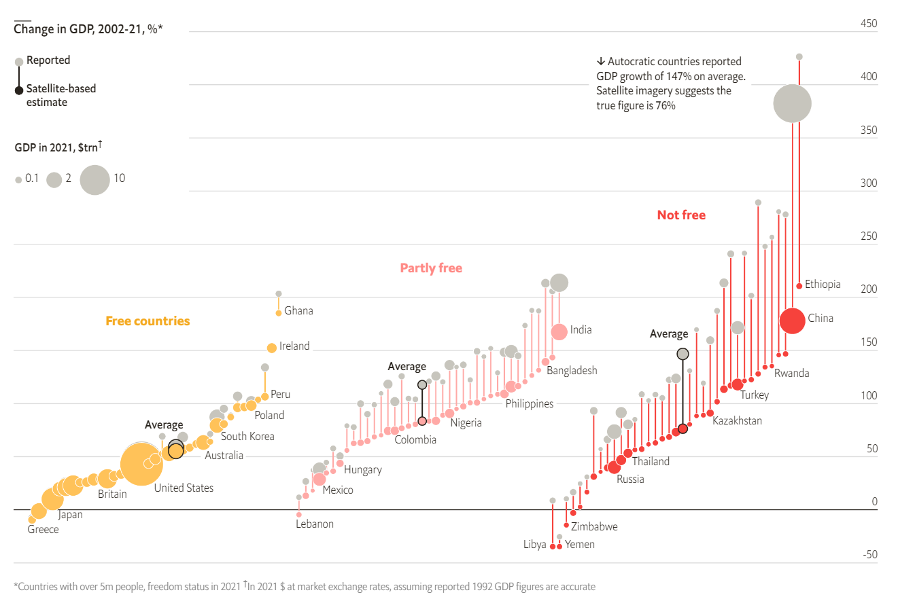

```{r setup, include=FALSE, warning=FALSE}
knitr::opts_chunk$set(warning = FALSE, message = FALSE) 
```

Satellite images of the brightness of the earth, also called nighttime lights data (NTL, from the US Air Force’s Defense Meteorological Satellite Program), have been used as a proxy for economic activity. Luis R. Martínez, professor at the Harris School of Public Policy at the University of Chicago, not only developed a model to calculate the GDP of every country based in the NTL data set, but he also found that countries with less political rights and civil liberties report overestimated GDP. The goal of this article is to rebuild a chart designed by The Economist to show the magnitude of this finding.

{.external width="100%"}

## Data collection

The data includes different records per country: the GDP from World Bank, the GDP estimated based on NTL, and the yearly growth of each one between 2002 and 2021. In addition, it includes the status in the Freedom in the World Index 2021, published by Freedom House, which classifies each country in three categories (Free, Partly Free, and Not Free). Finally, the population is incorporated, because for visualization purposes the chart only shows countries with more than 5 million population. Mr. Martínez provided me the projections of the NTL model, after contacting him by email.

```{r}
library(ggplot2)
library(ggthemes)
library(ggrepel)
library(tidyverse)
library(patchwork)
```
Let's see how the data looks like:

```{r}
DF <- read.csv("economist.csv")

```


|   | Country.Name         |      Year | GDP. growth.LCU.R | GDP.in. 2015.USD.R | GDP.growth. LCU.adjExag.NTL |
|---|----------------------|----------:|------------------:|-------------------:|----------------------------:|
| 1 | Libya                |      2021 |                31 |        60910775962 |                          20 |
| 2 | Yemen, Rep.          |      2021 |                -2 |        33429671860 |                          -2 |
| 3 | Zimbabwe             |      2021 |                 6 |        20562359266 |                           4 |
| 4 | Greece               |      2021 |                 8 |       200827546085 |                           8 |
| 5 | Lebanon              |      2021 |               -11 |        30979755568 |                         -11 |
|   |                      |           |                   |                    |                             |
|   | GDP.in. 2015.USD.NTL | GDP.var.R |       GDP.var.NTL | FIW.Status         |                   Popu.2021 |
|   |          36634943488 |      8.73 |            -34.61 | NF                 |                     6958538 |
|   |          29289246720 |    -25.33 |            -34.58 | NF                 |                    30490639 |
|   |          15954965504 |     10.36 |            -14.36 | NF                 |                    15092171 |
|   |         197563367424 |     -7.88 |             -9.38 | F                  |                    10664568 |
|   |          26433470464 |     11.82 |             -4.59 | PF                 |                     6769151 |

## Visualization assembly

### The grid

The chart emphasizes the importance of the Y-axis, which shows percentage change in GDP. The X-axis doesn't include a new variable. We just order the countries from lowest to highest GDP growth. We add 3 facets that correspond to the categories in the Freedom in the World Index, assigning a color to each one.

```{r fig.align="center"}

c <- ggplot(DF, aes(x = order, y = GDP.var.NTL, xend = order, 
                    yend = GDP.var.R, color = FIW.Status)) +
  facet_wrap(~ factor(FIW.Status, levels = c("F", "PF", "NF")))

c
```
### Data layer

We want to draw a vertical dumbbell chart. As a consequence, we specify two sets of coordinates in the Y-axis, one for the GDP-NTL growth, and the other for the GDP-official growth. In order to connect both points, we add a segment that evidences how big is the distance between them. Then, we create a dumbbell per country.

We scale the size of each point to show the size of the economy, according to the respective methodology. In the beginning, we create a horizontal reference line where Y is equal to 0, below the data points.

```{r fig.align="center"}

c <- c + 
  geom_hline(yintercept = 0, linewidth = 0.25) +
  geom_segment() +
  geom_point(aes(xend = order, y = GDP.var.R, size = GDP.in.2015.USD.R/1e+12), 
             shape = 21, fill = "#C7C5BD", color = "white") +
  geom_point(aes(size = GDP.in.2015.USD.NTL / 1e+12, fill = FIW.Status), 
             shape = 21, color = "white") 

c
```
### Scales

We adjust manually the bubbles colors, according to the freedom categories. However, as we defined a point shape that allows us to specify a border color (# 21), we see that each point has a border color 'white' to facilitate the distinction between countries. 

We adapt the size, to highlight largest economies, but keeping visible the smallest with the help of the range argument. In addition, we define the breaks for the size scale.

The Y-axis has breaks for every 50 percentage points in a range between -50 and 450. Note that this axis is placed on the right. Furthermore, the X-axis needs an extra space for annotations.

```{r fig.align="center"}

c <- c + scale_color_manual(values = c("#FFC259", "#F6423C", "#FFA9A6")) +
  scale_fill_manual(values = c("#FFC259", "#F6423C", "#FFA9A6")) +
  scale_size(range = c(1, 12), breaks = c(0.1, 2, 10), "GDP in 2021, $trn†") + 
  scale_y_continuous(
    position = "right",
    limits = c(-50, 450),
    n.breaks = 10,
    expand = expansion(0)
  ) +
  lims(x = c(0.5, 46)) 

c
```
### Appereance

The Economist's chart has a minimalist and clean design. We use the correspondent theme provided by the "ggthemes" library, as a base. It is required to include many theme adjustments to conclude the design. As an important piece of the visual aspect, we incorporate the "PT Sans" font type to make the chart more light and stylized.


```{r}

sysfonts::font_add_google("PT Sans")
showtext::showtext_auto()
```
We assign a white background, and remove the divisions between facets, as well as its titles, to integrate the canvas. Observe that we reduce the grid linewidth and change its color, to highlight the dumbbells. Now, the bottom line is not a frame of the chart.

```{r out.width="100%"}
c <- c + 
  theme_economist_white() + 
  theme(
    plot.background = element_rect(fill = "white"),
    panel.spacing.x = unit(0, "cm"),
    strip.background = element_rect(fill = "white"), 
    strip.text = element_text(color = "white"), 
    panel.grid = element_line(color = "ligthgray", linewidth = 0.10), 
    axis.line.x.bottom = element_line(color = "gray", linewidth = 0.10),
  )

c
```
We remove the titles from both axis. Besides, we withdraw texts and ticks from X-axis. On the other hand, we move the legends to the top right position, saving a space for the dumbbell legend. Also we change their color to harmonize the chart. Perceive that now the Y-Axis texts are aligned with the horizontal gridlines.

```{r out.width="100%"}
c <- c + theme(
  axis.title.x = element_blank(), 
  axis.title.y = element_blank(), 
  axis.text.y = element_text(vjust = -0.5, color = "#2C2E2E"), 
  axis.text.x = element_blank(),
  axis.ticks.x = element_blank(),
  legend.background = element_rect(fill = "white"),
  legend.position = c(0,0.85),
  legend.direction = "horizontal",
  legend.justification = c(0, 1),
  legend.key = element_rect(fill = "transparent"),
  plot.caption = element_text(hjust = 0, vjust = -1, 
                              color = "#454545", size = 8)
)

c
```
### Legend

We take out the fill and size legends. But most importantly, we adjust the position of the legend title of the size. What's more, we create an additional chart to represent the dumbbell legend. Later, we add it to the main chart as an inset.

```{r fig.align="center"}

c <- c + guides(color = FALSE, fill = FALSE, 
                size = guide_legend(title.position = "top"))

z <- data.frame(
  name = c("Satelite-based\n estimate"),
  x = c(3), y = c(5)
)

v <- data.frame(
  name = c("Reported"),
  x = c(3), y = c(7)
)

pinset <- ggplot(z, aes(x, y)) +
  geom_segment(aes(x=3, xend=3, y=5, yend=7), linewidth=0.5) +
  geom_point(size=2)+
  geom_point(data=v,size=2, color="grey")+
  geom_text(aes(label=name), hjust= -0.1, size=4, lineheight = .5) +
  geom_text(data=v,aes(label=name), hjust= -0.2, size=4) + 
  lims(x = c(2.9, 4), y = c(4.6, 7.3)) +
  ggtitle("Change in GDP, 2002-21, %*", ) +
  theme_void() + 
  theme(
    panel.background = element_rect(fill = "white", color="white"),
    plot.background = element_rect(fill = "white", color="white"),
    panel.border = element_rect(colour = "white", fill=NA),
    plot.title = element_text(face = "bold", hjust = 0.3, size= 12, vjust = 3)
  )

pinset
```
### Annotations

The chart has 4 annotations types:

1. Text labels for a group of countries per category, including largest economies.
2. Categories titles inside of each facet.
3. The average values per category.
4. A brief summary of the average values for autocratic countries.
5. The caption that includes some clarifications about the chart.

We add the labels bringing geom_text() into play, and filtering the data set to keep those countries that we need. Note that we separate the 4 largest economies, because we place them with independent coordinates taking into account its bubble size. In addition, we include category titles.

```{r out.width="100%"}
titles <- data.frame(
  labels = c("Free countries", "Partly free", "Not free"),
  FIW.Status = c("F", "PF", "NF"),
  order = 20,
  GDP.var.NTL = c(175, 225, 275),
  GDP.var.R = c(170, 220, 270)
)

countriestxt <- data.frame(
  labels = c("Japan", "Britain", "United States", "China", "Australia", 
             "Ireland", "India", "Russia", "Mexico", "Peru"),
  FIW.Status = c("F", "F", "F", "NF", "F", "F", "PF", "NF", "PF", "F"),
  order = c(5, 11, 21, 34, 27, 35, 41, 10, 5, 34),
  GDP.var.NTL = c(-6, 11, 25, 175, 56, 144, 159, 27, 17, 112),
  GDP.var.R = c(-6, 11, 25, 175, 56, 144, 159, 27, 17, 112)
  )

c <- c +
   geom_text(data = DF%>% filter(label == 1 & 
          !(Country.Name %in% c("Japan", "Britain","United States", "China",
            "Australia", "Ireland", "India", "Russia", "Mexico", "Peru"))), 
            aes(label = Country.Name), color = "#454545",
            vjust = 1.5, hjust = -0.1, check_overlap = T) +
  geom_text(data= countriestxt, aes(label = labels), color="#454545", hjust=0)+
  geom_text(data = titles, aes(label = labels), fontface = "bold", size=4.5)

c

```
To point out the averages, we draw a set of 3 dumbbells with a black border, and we include a label for them. Observe that we should create independent data frames, for annotations that require a specific location inside the chart. Then, we map these data frames with ggplot components.

```{r out.width="100%"}

av_data <- DF %>% 
  group_by(FIW.Status)  %>%
  summarise(
    av.GDP.var.R = mean(GDP.var.R),
    av.GDP.var.NTL = mean(GDP.var.NTL),
    av.GDP.usd.R = mean(GDP.in.2015.USD.NTL)/1000000000000,
    av.GDP.usd.NTL = mean(GDP.in.2015.USD.NTL)/1000000000000
  )

av_data <- av_data[c(1,3,2),]

average <- data.frame(
  Country.Name = c("Average", "Average", "Average"),
  FIW.Status = c("F", "PF", "NF"),
  GDP.in.2015.USD.NTL = as.vector(av_data$av.GDP.usd.NTL),
  GDP.in.2015.USD.R = as.vector(av_data$av.GDP.usd.R),
  GDP.var.R = as.vector(av_data$av.GDP.var.R),
  GDP.var.NTL = as.vector(av_data$av.GDP.var.NTL),
  order= c(22,19,17),
  colorT = c("grey", "grey", "grey"),
  colorB = c("#FFC259", "#F6423C","#FFA9A6"),
  fill = c("black", "black", "black")
)

avTitles <- data.frame(
  labels = c("Average", "Average", "Average"),
  FIW.Status = c("F", "PF", "NF"),
  order = c(20, 16, 14),
  GDP.var.NTL = c(85, 138, 165),
  GDP.var.R = c(80, 133, 160)
  )

c <- c +
  geom_segment(data = average, aes(x=order, xend=order, y=GDP.var.NTL, 
                                   yend=GDP.var.R), color="black") +
  geom_point(data = average,aes(x=order, y=GDP.var.NTL, 
             size=GDP.in.2015.USD.NTL, fill=FIW.Status), 
             shape=21, color="black") + 
  geom_point(data = average, aes(x=order, y=GDP.var.R, size=GDP.in.2015.USD.R), 
             shape=21, color="black", fill="gray") +
  geom_text(data= avTitles, aes(label= labels), fontface = "bold", 
            size= 3.5, color = "black") 

c
```
The autocratic category summary and the caption are added. We highlight that the summary is incorporated just to one facet. It means that we should specify the level of the factor that we want to use. To conclude, we combine the inset with the "Patchwork" library, specifying the desired position.

```{r out.width="100%", preview=TRUE, layout="l-body-outset"}
sumQuote <- data.frame(
  text = "↓ Autocratic countries reported\nGDP growth of 147% on average.
Satellite imagery suggests the\ntrue figure is 76%",
  FIW.Status = factor("NF", levels = c("F", "PF", "NF")),
  order = 0.5,
  GDP.var.NTL = 420,
  GDP.var.R = 420
)

captiontx <- paste("\n",
  "*Countries with over 5m people, freedom status in 2021",
            "†In 2021 $ at market exchange rates,",
            "assuming reported 1992 GDP figures are accurate", sep=" "
            )

c <- c +
  geom_label(data = sumQuote, aes(label = text), color = "black", 
             size = 3, hjust = 0, vjust = 1, lineheight = .8, fill = "white", 
             label.size = NA, label.padding = unit(0, "cm")) +
  labs(caption = captiontx) + 
  inset_element(pinset, left=0, bottom=0.83, right=0.3, top=1, align_to="full")

c
```
## Alternative

Analyzing the original chart, we can see that it has some advantages. For instance, it allows us to identify each of the 103 countries, or it separates clearly the Freedom categories. Nevertheless, we realize that the X-axis is used to create an order among dumbbells, but it doesn't add more information. Therefore, we propose an alternative visualization that uses this axis to compare GDP values. 

In our chart, the Y-axis shows the officialy reported GDP growth, while the X-axis illustrates the NTL-based estimate of GDP. As a result, we should expect that each country will be located in the intersection line where Y is equal to X. However, the autocratic countries are far away from this line, as their value of the officialy reported GDP.

```{r}

lineAnnotations <- data.frame(
  labels = c("Countries close to this line have official GDP = NTL GDP ", 
             "+50 pp Inflation", "+100 pp Inflation", "+200 pp Inflation"),
  GDP.var.R = c(340, 445,445,445),
  GDP.var.NTL = c(353, 387, 337, 237),
  FIW.Status = c("PF", "PF", "PF", "PF")
  )

Ecountrieslbl <- data.frame(
  labels = c("Japan", "Britain", "United States", "China","Russia", 
             "Turkey", "Mexico", "Philippines", "India"),
  FIW.Status = c("F", "F", "F", "NF","NF", "NF", "PF", "PF", "PF"),
  GDP.var.R = c(-5, 10, 30, 390, 83, 179, 50, 135, 228),
  GDP.var.NTL = c(18, 31, 58, 149, 16, 92, 4, 110, 173)
  )

captiontxt <- paste("\n",
  "*Countries with over 5m people, freedom status in 2021",
            "†In 2021 $ at market exchange rates,",
            "assuming reported 1992 GDP figures are accurate.",
            "'PP' means Percentage Points.",
            sep=" "
            )

DF$FIW.Status <- factor(DF$FIW.Status, levels=c("F", "PF", "NF"))
```

```{r out.width="100%", layout="l-body-outset"}
ggplot(DF, aes(GDP.var.NTL, GDP.var.R, fill= FIW.Status)) + 
  geom_abline(slope = 1, intercept = 0, linetype="dashed") +
  geom_abline(slope = 1, intercept = 50, linetype=2, linewidth=0.1) +
  geom_abline(slope = 1, intercept = 100, linetype=2, linewidth=0.1) +
  geom_abline(slope = 1, intercept = 200, linetype=2, linewidth=0.1) +
  geom_point(aes(size=GDP.in.2015.USD.NTL/1e+12), shape=21, alpha=0.8) + 
  geom_text(data = DF%>% filter(label == 1 & (Country.Name %in% 
            c("Greece", "Australia", "South Korea", "Ghana","Poland", 
              "Ireland", "Yemen, Rep.", "Libya", "Rwanda"))), 
    aes(label = Country.Name), check_overlap = T, hjust = -0.15, vjust=1.3) +
  geom_text(data = Ecountrieslbl, aes(label=labels), hjust=0) + 
  geom_text(data = lineAnnotations[1,], aes(label = labels), angle = 25.8, 
            fontface="bold", color="#44B4C1") +
  geom_text(data = lineAnnotations[2:4,], aes(label = labels), 
            angle = 26, fontface="bold", size = 4) +
  lims(x= c(-50,450)) + 
  scale_size(range = c(1,12), breaks= c(0.1,2,10), "GDP in 2021, $trn†") +
  scale_fill_manual(values=c("#FEC427","#255D91", "#B41D11"), 
    name= "Freedom Status", labels=c("Free", "Partly Free", "Not Free")) + 
  scale_x_continuous(limits=c(-50, 450), n.breaks=10, expand=expansion(0)) +
  scale_y_continuous(limits = c(-50, 450), n.breaks = 10) +
  labs(x= "NTL-estimated GDP", y="Official GDP") + 
  ggtitle("GDP growth, 2002-21, %*", ) +
  labs(caption = captiontxt) +
  theme_minimal()+
  theme(
    panel.background = element_rect(fill= "#F3F0EA"),
    plot.background = element_rect(fill= "#F3F0EA"),
    panel.grid = element_line(linetype = 2),
    panel.grid.major = element_line(size = 0.5, colour = "grey"),
    panel.border = element_rect(color = "#F3F0EA", fill=NA),
    axis.title.y =  element_text(color = "black"), 
    axis.text.y = element_text(color = "black"),
    legend.position=c(1, 0.01),
    legend.justification=c(1, 0),
    legend.background = element_rect(fill="#F3F0EA", color="#F3F0EA"),
    axis.line.x.bottom = element_line(color = "#F3F0EA"),
    axis.line.y.left  = element_line(color = "#F3F0EA"),
    plot.title = element_text(face = "bold", hjust = 0, size= 15, vjust = 3),
    plot.caption = element_text(hjust = 0, color ="#454545", size = 8),
    plot.margin = unit(c(10,5.5,5.5,5.5), 'pt')
  )

```


