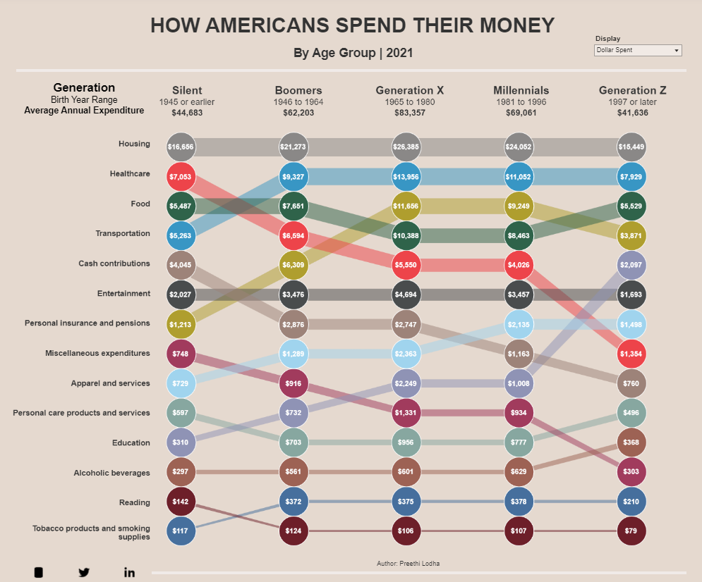
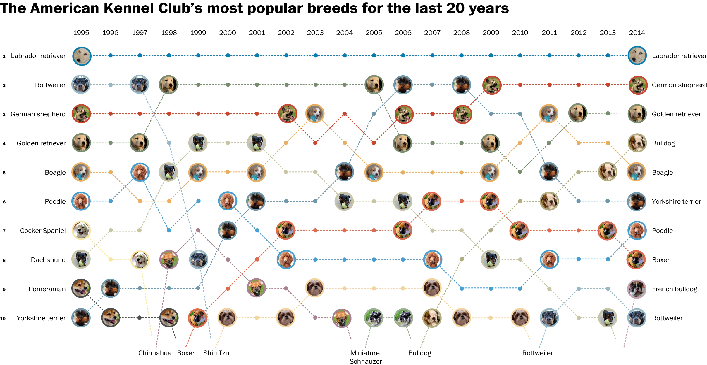
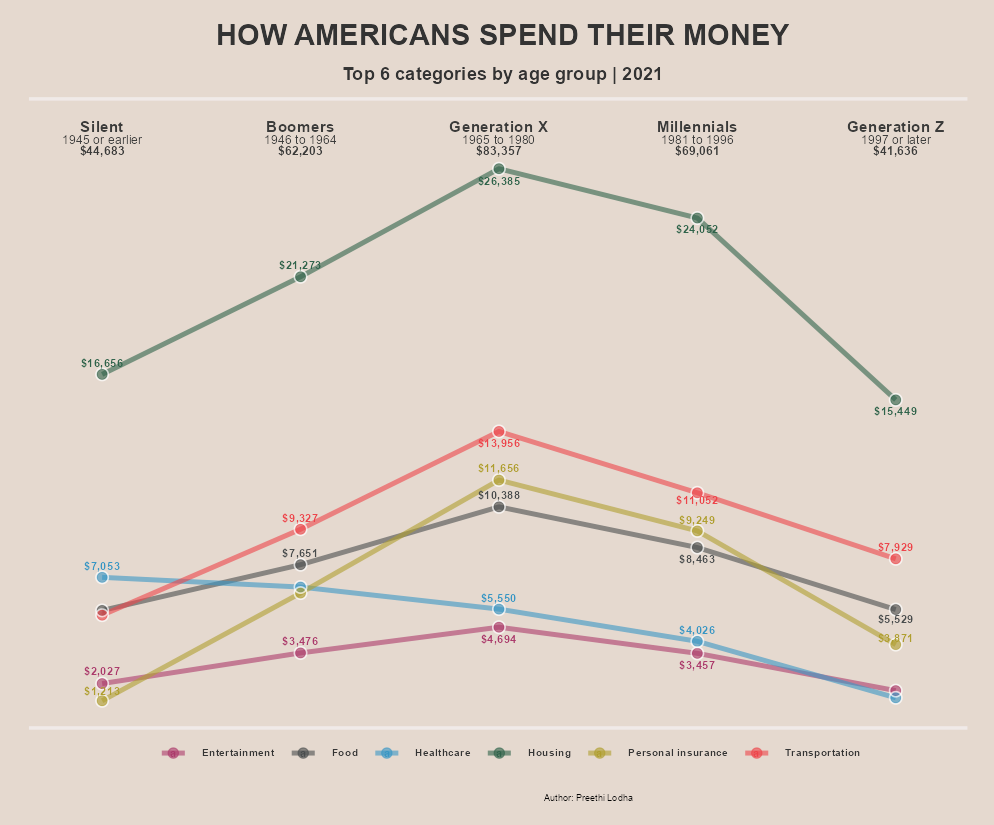
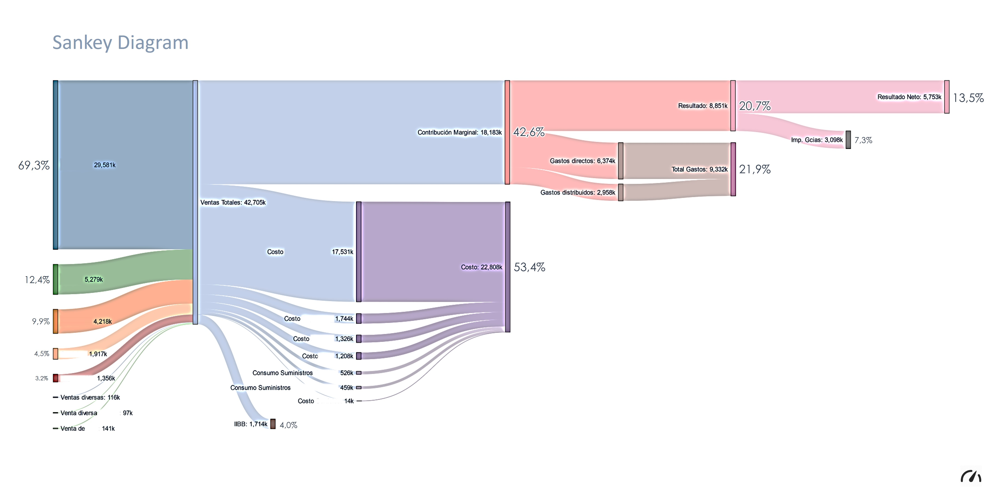
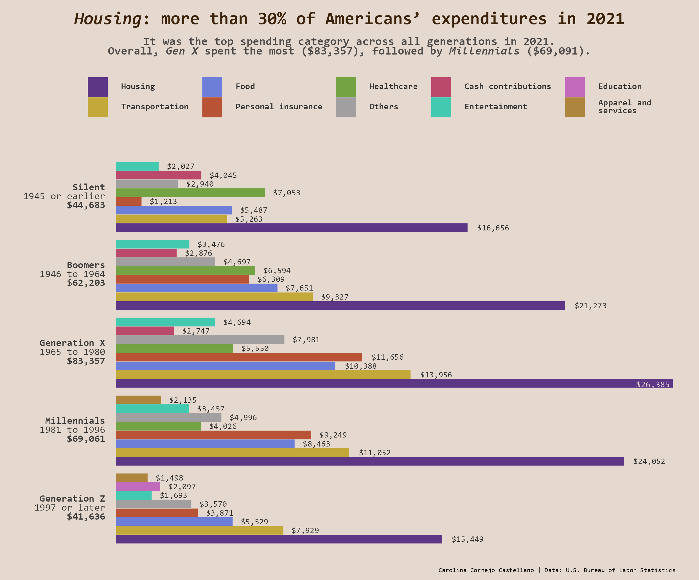
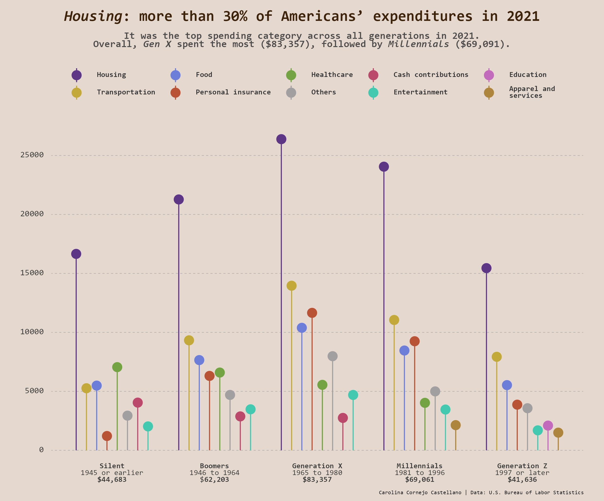
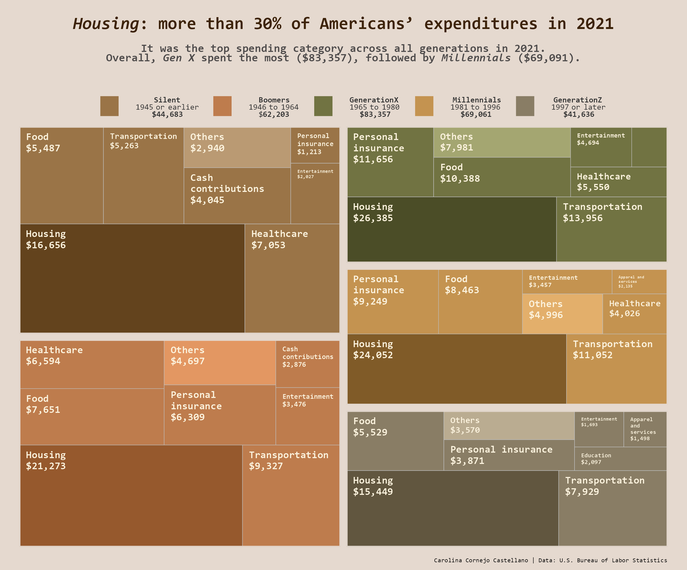

## Introduction
On September 25, 2022, the [_Visual Capitalist_](https://www.visualcapitalist.com/), a digital media focused on generating data-centric visual content, published the article _How Do Americans Spend Their Money, By Generation?_ The author of the visualization is Preethi Lodha, and the author of the article is Carmen Ang. 

This report aims to discuss Preethi Lodha’s [@lodhaHowAmericansSpend2022] graphic in the light of data visualization theory. Thus, some questions that will guide this narrative are: _What information does it intend to show? Does it achieve it? How and through what encodings and channels? What are its strengths and points of improvement?_  Likewise, improvements and alternative visualizations are proposed, which are also not without their own room for improvement. 

## Background 
The article collected data from the 2021 Consumer Expenditure Surveys (CES) from the [U.S. Bureau of Labor Statistics](https://www.bls.gov/cex/tables/calendar-year/mean-item-share-average-standard-error/reference-person-age-generation-2021.pdf). Specifically, the data used for the visualization was that published in PDF format in _Table 2602. Generation of reference person: Annual expenditure means, shares, standard errors, and coefficients of variation_.

The source of the article and the original graphic can be accessed [here](https://www.visualcapitalist.com/cp/how-americans-spend-their-money-2022/). This report was written in December 2022.

## What is it for? Representing how Americans distributed their spending in 2021
First, the context and intentionality must be understood. The graphics must be understandable by themselves, and also in their context.

As for the article on the _Visual Capitalist_ website, it has as newsworthiness —in Spanish journalist jargon we call it "la pepa"— to show the distribution of Americans' spending in 2021. Although the title of the article does not specify that the information is from the previous year —it was written and published in 2022—, but the information is from 2021- this type of generalization or omissions are common in the titles and/or in the headlines of journalistic articles: they are licenses that journalists give themselves to attract the reader's attention. The content of the article clearly specifies the source of information—the PDF—and that it refers to 2021. So it's not a time series, it's just a picture of that moment.

{.external width="100%"}


As for the graphic, the author used Tableau to build a *bump chart* that includes interactive elements when hovering over the dots; but for the purposes of this report, those elements will not be taken into account: only what is seen in the screenshot above is considered. 

<aside>
Note that we use the term *bump chart* because this type of visualization is commonly found with that name on the Internet. However, in the article of the Visual Capitalist they refer to it as a "graph" and in this report we try to call the other visualizations as "graphic", as proposed by @wilkinsonGrammarGraphics2005. 
</aside>

Bump charts are useful for exploring changes in rank over time across different categories. That is, they usually do not show the actual values of the categories —which in this case would be the money spent by each generation for each spending category—, but the positions in the ranking. In this case, the ranking moves of 14 spending categories are shown, based on the birth year range from the _Silent_ generation (the oldest) to _Generation Z_. 

At first glance, this and, in general, all bump charts shows three variables in an easy-to-understand way: category, time and position. That's especially true in cases of graphics where *the only important thing* is the ranking. For example, this image from [The Washington Post](https://www.washingtonpost.com/news/wonk/wp/2015/02/27/americas-favorite-dog-breeds-for-the-past-two-decades-ranked/) from 2015 shows the "favorite" dog breeds, according to the American Kennel Club, where the three important variables are breed of dog, year, and position in the ranking [@bumpAmericaFavoriteDog2021]. 


{.external width="100%"}


However, there is another important piece of information in Preethi Lodha's graph, which is the dollar amount spent by each generation for each expenditure category. This is presented within each point and is undoubtedly important if one wants to know how spending is distributed; however, that oscillation is not displayed with any other visual mark and can be misleading. This point will be discussed later.

## What can be seen here? Encodings, channels and strengths
There are 14 spending categories represented on the Y axis and 5 generations or age ranges showed on the X axis, above the graph and below the title and subtitle, from the _Silent_ generation (the oldest) to the _Generation Z_.

According to @clevelandElementsGraphingData1985, graphs encode data in distinct elements, such as symbols, colors, position, etc. When we study a graphic we perform several mental-visual tasks to extract quantitative information. Some of the basic judgements we perform to decode quantitative information are 1) angle, 2) area, 3) color hue, 4) color saturation, 5) density, 6) length, 7) position along a common scale, 8) position along identical, nonaligned scales, 9) slope, and 10) volume [@clevelandElementsGraphingData1985].

In consideration of this, the information in the bump chart can be extracted by judgements of position along the vertical scale, which represents the spending categories; the color of each line, which represents the categories of expenditure; the position of each point on the X axis, which represents the generation; and the thickness of the lines, which represents the money spent in each category (the thicker the line the more money has been spent). The closeness of the dots stands for the closeness in the ranking positions. The size of the points does not represent anything.

Cleveland also discusses *detection*, which he qualifies as the most fundamental perception issue, because before executing any graphical perception task, we must be able to detect the graphical element [@clevelandElementsGraphingData1985]. Lodha’s bump chart does not show overlaps in the dots, which together with color and position is the most important symbol. The jumps in the ranking are well understood. In broad terms, the graphic is very readable, which is not the same as effective.

### Replication in R
An almost exact replica was created using `ggplot2`, 

The libraries used were as follows:

```{r}
# Import libraries
library(tidyverse) # for data manipulation
library(ggplot2) # for data graphics.
library(ggtext) # provides markdown and HTML text rendering
library(grid) # for adding the two white lines at the top and bottom
```

Then, the data was imported. As mentioned above, the data is only a PDF, so the values had to be transcribed manually. After that, we made some transformations.

```{r}
df <- read_csv("data.csv")
head(df)
```


```{r}
# Pivot longer, add ranks and order chronologically
df <- df %>%
  pivot_longer(-generation, names_to = "variables", values_to = "dollars") %>%
  group_by(generation) %>%
  arrange(generation, desc(dollars)) %>%
  mutate(ranking = row_number())

# Manually renaming
df$generation[df$generation == "silent"] <- "Silent"
df$generation[df$generation == "boomers"] <- "Boomers"
df$generation[df$generation == "gen_X"] <- "Generation X"
df$generation[df$generation == "millennials"] <- "Millennials"
df$generation[df$generation == "gen_Z"] <- "Generation Z"

df$variables[df$variables == "alcohol"] <- 
  "Alcoholic beverages"
df$variables[df$variables == "apparel"] <- 
  "Apparel and services"
df$variables[df$variables == "cash_contributions"] <- 
  "Cash contributions"
df$variables[df$variables == "education"] <- 
  "Education"
df$variables[df$variables == "entertainment"] <- 
  "Entertainment"
df$variables[df$variables == "food"] <- 
  "Food"
df$variables[df$variables == "entertainment"] <- 
  "Entertainment"
df$variables[df$variables == "healthcare"] <- 
  "Healthcare"
df$variables[df$variables == "housing"] <- 
  "Housing"
df$variables[df$variables == "insurance"] <- 
  "Personal insurance and pensions"
df$variables[df$variables == "miscellaneous"] <- 
  "Miscellaneous expenditures"
df$variables[df$variables == "personal_care"] <- 
  "Personal care products and services"
df$variables[df$variables == "reading"] <- 
  "Reading"
df$variables[df$variables == "smoking"] <- 
  "Tobacco products and smoking \n supplies"
df$variables[df$variables == "transportation"] <- 
  "Transportation"
```

```{r}
# Formatting the dollars' column
df$dollars <- format(df$dollars, big.mark=",", trim=TRUE)

df$dollars <- paste0("$", df$dollars)
```

Character vectors were created to 1) sort the generation names chronologically because ggplot2 displayed them in alphabetical order, 2) format them in HTML language that will later be rendered by the `ggtext` package, and 3) to add as _tag_ the description of the X-axis. 

```{r}
x_names_ordered <- c("Silent", 
                     "Boomers", 
                     "Generation X", 
                     "Millennials", 
                     "Generation Z")
```

```{r}
x_names_full = c(
  
  paste("<span style='font-size: 9.55pt'>**Silent**</span>",
        "1945 or earlier",
        "**$44,683**",
        sep = "<br>"),
  
  
  paste("<span style='font-size: 9.55pt'>**Boomers**</span>",
        "1946 to 1964",
        "**$62,203**",
        sep = "<br>"),


  paste("<span style='font-size: 9.55pt'>**Generation X**</span>",
        "1965 to 1980",
        "**$83,357**",
        sep = "<br>"),
  
  
  paste(
    "<span style='font-size: 9.55pt'>**Millennials**</span>",
    "1981 to 1996",
    "**$69,061**",
    sep = "<br>"),
  
  
  paste(
    "<span style='font-size: 9.55pt'>**Generation Z**</span>",
    "1997 or later",
    "**$41,636**",
    sep = "<br>")

                )
```

```{r}
x_lab <- paste(
  "<span style='font-size: 10pt'>**Generation**</span>",
  "Birth Year Range",
  "**Average Annual Expenditure**",
  sep = "<br>"
              )
```

Then the theme was built. We call this theme `theme_bump`. Before that, we saved as objects the codes of the two main colors: the one of the background and the one of the text.

```{r}
# Colors
color_background <- "#e5d9cf"
color_text <- "#333333"
```

The textual elements were changed from `element_text` to `element_markdown` of the `ggtext` package. This allows to use markdown or HTML to design text strings.

```{r}
theme_bump <- function() {

  # Begin construction of the theme
  theme_bw(base_size = 15) +

    # Format background colors
    theme(panel.background = element_rect(
      fill = color_background, 
      color = color_background)) +
    theme(plot.background = element_rect(
      fill = color_background, 
      color = color_background)) +
    theme(panel.border = element_rect(
      color = color_background)) +
    theme(strip.background = element_rect(
      fill = color_background, 
      color = color_background)) +

    # Format the grid
    theme(axis.ticks = element_blank()) +
    theme(panel.grid = element_line(
      colour = color_background)) +

    # Format the legend
    theme(legend.position = "none") +

    # Format de caption
    theme(plot.caption = element_text(
      hjust = 0.6, 
      vjust= 0.1, 
      size = 5.45)) +

    # Format title and axis labels
    theme(plot.title = element_text(
      color = color_text, 
      size = 17.5, 
      face = "bold", 
      hjust = 0.5, 
      margin=margin(0,0,10,0))) +
    theme(plot.subtitle = element_text(
      color = color_text, 
      size = 11, 
      hjust = 0.5, 
      face = "bold", 
      margin=margin(0,0,22,0))) +
    theme(axis.title.x = element_blank()) +
    theme(axis.title.y = element_blank()) +
    theme(axis.text = element_markdown()) +
    theme(axis.text.x = element_markdown()) +
    theme(axis.text.x.top = element_markdown(
      color = "#3b3b3a", 
      family = "Arial Narrow", 
      size=7.5)) +
    theme(axis.text.y = element_blank()) +
    # theme(strip.text = element_text(face = "bold")) +
    theme(plot.tag = element_markdown(
      family = "Arial Narrow", 
      lineheight = 0.1, 
      size = 8)) +
    theme(plot.tag.position = 
            c(0.10, 0.85)) +

    # Plot margins
    theme(plot.margin = 
            unit(c(0.5, 0.4, 0.5, 0.65), "cm")) # top, right, bottom, left
}
```

We then proceeded to build the bump chart. Note that the following chunk must start with `{r fig.width = 8.29, fig.height = 6.88}` to display the replica in the same proportions as the original.
  
```{r fig.width = 8.29, fig.height = 6.88, layout="l-body-outset"}
replica <- ggplot(
  data = df,
  aes(x = generation, 
      y = ranking, 
      group = variables)) +
  # Add the custom theme just designed
   theme_bump() +
  # Add the horizontal lines per generation
     geom_line(aes(color = variables, 
                   alpha = 1, 
                   # Change line thickness accordingly:
                   linewidth = rev(ranking))) + 
  # Add the points. The white ones are for the border  
   geom_point(size = 11.85, 
                color = "white") +
     geom_point(aes(color = variables), 
                size = 11.3) +
     scale_y_reverse(breaks = 1:nrow(df)) +
  # Order and 
     scale_x_discrete(
       limits = x_names_ordered,
       labels = x_names_full,
       position = "top",
       expand = expansion(mult = c(0.356, 0.1))
                    ) +
  # Titles, subtitle, caption and tag 
  labs(
    title = "HOW AMERICANS SPEND THEIR MONEY",
    subtitle = "By Age Group | 2021",
    caption = "Author: Preethi Lodha",
    tag = x_lab
  ) +
  # Add the two horizontal white lines at the top and the bottom
    coord_cartesian(clip = "off") +
      annotation_custom(linesGrob(x = c(0, 0.99), 
                                  y = c(1.11, 1.11), 
                                  gp = gpar(col = "#f0eae8", 
                                            lwd = 2.8, 
                                            lineend = "square"))) +
      annotation_custom(linesGrob(x = c(0, 0.99), 
                                  y = c(-0.05, -0.05), 
                                  gp = gpar(col = "#f0eae8", 
                                            lwd = 2.8, 
                                            lineend = "square"))) +
  # Add the Y axis text     
  geom_text(data = df %>% 
                    filter(generation == "Silent"), 
                  aes(label = variables, 
                      x = 0.72236), 
                  hjust = "outward", 
                  fontface = "bold", 
                  color = "#272727", 
                  size = 2.4) +
  # Add the amount money spent.
      geom_text(data = df, 
                aes(label = dollars), 
                hjust = "center", 
                color = "white", 
                size = 2.25, 
                fontface = "bold") +
      geom_text(data = df, 
                aes(label = dollars), 
                hjust = "center", 
                color = "white", 
                size = 2.253, 
                fontface = "bold") +
      geom_text(data = df, aes(label = dollars), 
                hjust = "center", 
                color = "white", 
                size = 2.257, 
                fontface = "bold") +
  # Add line colors
      scale_color_manual(values = c(
        "#9c6255",
        "#a0d4ee",
        "#9d8379",
        "#8f93b5",
        "#494c4d",
        "#2f634a",
        "#ed444a",
        "#8a8887",
        "#a13b5d",
        "#87a7a0",
        "#af9e2e",
        "#6d1f29",
        "#466f9d",
        "#3896c4"
      )) 
replica
```

To save the plot: 

```{#r}
ggsave("replica.png", 
plot = last_plot(), 
path = "images", 
width = 8.29, 
height = 6.88, 
units = "in", 
dpi = 120)
```

As can be seen below, only the small icons at the bottom left and the interactive box at the top right were not reproduced. Since these are interactive elements in the original dashboard, we did not consider it necessary.

{.external width="100%"}

{width="100%"}


## How can it be improved? Enhancements

From the start, one might question the need to design a graphic to display these data. @tufteVisualDisplayQuantitative2013 points out that “[t]ables usually outperform graphics in reporting on small data sets of 20 numbers or less” and that “[t]he special power of graphs comes in the display of large data sets”. This case is not a large data set: in fact, the source is a PDF. This peculiarity has pros and cons: on the one hand, to represent expenditure by generation and expenditure category, it is unnecessary to perform many transformations; but on the other hand, it limits the options for alternative graphics. 

In terms of features, notwithstanding its goodness, it is noted that this bump chart —and indeed, all of them— give readers the feeling that the difference between each category is about the same because the channels used —width of the lines and distance between them— are the same. Although in this case the thickness of the lines has been manipulated to represent each amount of money, its effect in counteracting that feeling is limited.

Using labels within the circles to show the money spent per category and per generation could have been a wise move, following the postulates of @tufteVisualDisplayQuantitative2013, who points that “[c]lear, detailed and thorough labeling should be used to avoid graphic distortion and ambiguity [...].” But, in this case, such labels add an extra layer of information and if the bump chart represents jumps in ranking, these were already encoded in the position of the dots and the jumps in the lines. Moreover, there are examples that even though spending in a certain category decreases from one generation to the next, its position in the ranking goes up and vice versa: just look at the jump from _Millennials_ to _Generation Z_ in the category _Personal care products and services_; and the jump from _Boomers_ to _Generation X_ in the _Food_ category. Tufte himself would call it “a lying graphic” [@tufteVisualDisplayQuantitative2013].

<blockquote cite="">
“A second defense of the lying graphic is that, although the design itself lies, the actual numbers are printed on the graphic for those picky folks who want to know the correct size of the effects displayed. [...]” [@tufteVisualDisplayQuantitative2013]
</blockquote>

So, if the purpose is to represent the spending distribution of Americans, showing rankings can be misleading. For this reason, the main point of improvement would be to represent spending rather than ranking. This implies to change the type of graph to one where the data items are the money spent and the data attributes are the generation and the category of spending. @tufteVisualDisplayQuantitative2013, in this regard, postulates that “[t]he representation of numbers, as physically measured on the surface of the graph itself, should be directly proportional to the numerical quantities represented” [@tufteVisualDisplayQuantitative2013]. What visual marks would be the most efficient?

In order to continue using lines and dots to represent the data, the proposed enhancements are in a line plot:


{width="100%"}


This is not exempt from problems, both in terms of conception and execution. First, the category with the highest expenditure by far is _Housing_, but the other categories are very close, which caused problems with overlapping labels. That was the driving force behind plotting only the first 6 expenditure categories. Even so, overlapping continued to exist and the `ggrepel` package, which would help to solve it, did not really avoid them; it only helped to eliminate the labels that were too close at the cost of dislocating others. Another problem is that, according to @healyDataVisualizationPractical2018, lines illustrate “connection and common fate in that the lines joining the shapes tend to be read left-to-right as part of a series” [@healyDataVisualizationPractical2018]. He mentions this when explaining Gestalt rules, which are “the strong inferences we make about relationships between visual elements from relatively sparse visual information”. The author emphasizes that line graphs suggest that the underlying variable is continuous and that is not necessarily advantageous for our data, since the X axis contains the generations, but it is not a continuous variable over time.


{.external width="100%"}


One option was to make a Sankey diagram. These visualize flows of quantities through a process and, as an opinion, are more eye-catching. With a Sankey diagram, we would have split the amount spent by each generation in 2021 into 14 categories of data —or fewer, if we also decide to show only the top categories or to group several ones into "Others"—, and each generation would be a breakdown. However, this would give the false sense that the flow of money changes over a period of time and, in stricto sensu, it is not: spending does not change over time: all the data represented is from 2021. What does change is another categorical variable: generation. 

An example of a Sanky diagram from [Wikimedia Commons](https://commons.wikimedia.org/wiki/File:Sankey_Diagram_-_Income_Statement.jpg):

{.external width="100%"}


In addition, in data visualization, clarity should be privileged over the pomposity: @healyDataVisualizationPractical2018 quotes Tufte about graphical excellence, commenting that it “consists of complex ideas communicated with clarity, precision, and efficiency”. Thus, the idea of a Sankey, despite being relatively simple to execute with the `ggsankey` package, was discarded. A cleaner, clearer and closer option to Lodha's original graph is the line plot.

### Designing the enhancements proposal

```{r}
#Libraries, most of them already used in the replica
library(tidyverse)
library(ggplot2)
library(ggtext)
library(grid)
library(ggrepel) # To (try to) avoid label overlappings
```

The following pipes were useful for obtaining a suitable dataframe:

```{r}
df <- read_csv("data.csv") %>% 
  pivot_longer(-generation, 
               names_to = "variables", 
               values_to = "dollars") %>%
  #group_by(generation) %>%
  arrange(desc(dollars))
```

Then, the data was manipulated. Those code chunks will not be showed here as are the same than in the replica (renaming variables using indexing and generating the same character vectors).

```{r include=FALSE}
df$generation[df$generation == "silent"] <- "Silent"
df$generation[df$generation == "boomers"] <- "Boomers"
df$generation[df$generation == "gen_X"] <- "Generation X"
df$generation[df$generation == "millennials"] <- "Millennials"
df$generation[df$generation == "gen_Z"] <- "Generation Z"

df$variables[df$variables == "alcohol"] <- 
  "Alcoholic beverages"
df$variables[df$variables == "apparel"] <- 
  "Apparel and services"
df$variables[df$variables == "cash_contributions"] <- 
  "Cash contributions"
df$variables[df$variables == "education"] <- 
  "Education"
df$variables[df$variables == "entertainment"] <- 
  "Entertainment"
df$variables[df$variables == "food"] <- 
  "Food"
df$variables[df$variables == "entertainment"] <- 
  "Entertainment"
df$variables[df$variables == "healthcare"] <- 
  "Healthcare"
df$variables[df$variables == "housing"] <- 
  "Housing"
df$variables[df$variables == "insurance"] <- 
  "Personal insurance"
df$variables[df$variables == "miscellaneous"] <- 
  "Miscellaneous expenditures"
df$variables[df$variables == "personal_care"] <- 
  "Personal care products and services"
df$variables[df$variables == "reading"] <- 
  "Reading"
df$variables[df$variables == "smoking"] <- 
  "Tobacco products and smoking \n supplies"
df$variables[df$variables == "transportation"] <- 
  "Transportation"


x_names_ordered <- c("Silent", 
                     "Boomers", 
                     "Generation X", 
                     "Millennials", 
                     "Generation Z")


x_names_full = c(
  
  paste("<span style='font-size: 9.55pt'>**Silent**</span>",
        "1945 or earlier",
        "**$44,683**",
        sep = "<br>"),
  
  paste("<span style='font-size: 9.55pt'>**Boomers**</span>",
        "1946 to 1964",
        "**$62,203**",
        sep = "<br>"),

  paste("<span style='font-size: 9.55pt'>**Generation X**</span>",
        "1965 to 1980",
        "**$83,357**",
        sep = "<br>"),
  
  paste(
    "<span style='font-size: 9.55pt'>**Millennials**</span>",
    "1981 to 1996",
    "**$69,061**",
    sep = "<br>"),

  paste(
    "<span style='font-size: 9.55pt'>**Generation Z**</span>",
    "1997 or later",
    "**$41,636**",
    sep = "<br>")
                )


x_lab <- paste(
  "<span style='font-size: 10pt'>**Generation**</span>",
  "Birth Year Range",
  "**Average Annual Expenditure**",
  sep = "<br>"
              )

```

The theme was a bit edited. This new version is called `theme_lines()`.

```{r}
# Colors
color_background <- "#e5d9cf"
color_text <- "#333333"
```


```{r}
theme_lines <- function() {

  theme_bw(base_size = 15) +

    # Background colors
    theme(panel.background = element_rect(
      fill = color_background, 
      color = color_background)) +
    theme(plot.background = element_rect(
      fill = color_background, 
      color = color_background)) +
    theme(panel.border = element_blank()) +
    theme(strip.background = element_rect(
      fill = color_background, 
      color = color_background)) +

    # Grid
    theme(axis.ticks = element_blank()) +
    theme(panel.grid = element_blank()) +

    # Legend
    theme(legend.position = "bottom") +
    theme(legend.background = element_blank()) +
    theme(legend.key = element_rect(
      fill = color_background)) +
    theme(legend.text	= element_markdown(
      color = color_text, 
      size = 6.5, 
      face = "bold")) +
    theme(legend.title = element_blank()) +
    theme(legend.direction = "horizontal") +
    theme(legend.spacing.x = unit(0.3, 'cm')) +
      
    # Caption
    theme(plot.caption = element_text(
      hjust = 0.6, 
      vjust= 0.1, 
      size = 5.45)) +

    # Title and axis labels
    theme(plot.title = element_text(
      color = color_text, 
      size = 17.5, 
      face = "bold", 
      hjust = 0.5, 
      margin=margin(0,0,10,0))) +
    theme(plot.subtitle = element_text(
      color = color_text, 
      size = 11, 
      hjust = 0.5, 
      face = "bold", 
      margin=margin(0,0,22,0))) +
    theme(axis.title.x = element_blank()) +
    theme(axis.title.y = element_blank()) +
    theme(axis.text = element_markdown()) +
    theme(axis.text.x = element_markdown()) +
    theme(axis.text.x.top = element_markdown(
      color = "#3b3b3a", 
      family = "Arial Narrow", 
      size=7.5)) +
    theme(axis.text.y = element_markdown()) +
    # theme(strip.text = element_text(face = "bold")) +
    theme(plot.tag = element_markdown(
      family = "Arial Narrow", 
      lineheight = 0.1, size = 8)) +
    theme(plot.tag.position = 
            c(0.10, 0.85)) +

    # Plot margins
    theme(plot.margin = 
            unit(c(0.5, 0.4, 0.5, 0.65), "cm")) # top, right, bottom, left

}
```

Here, we started the construction of the line plot. Note that each `ggplot2` chunk must start with `{r fig.width = 8.29, fig.height = 6.88}` for it to be displayed with the same proportions of the original bump chart.

```{r fig.width = 8.29, fig.height = 6.88, layout="l-body-outset"}
# Used by the `ggrepel`. Ensures reproducibility of the same labels disposition
set.seed(78)

#Select only the head categories:
df <- 
  subset(df, variables %in% 
           c(head(unique(df$variables)))) 

enhan <- df %>% 
ggplot() +
  aes(x = generation, 
      y =dollars, 
      group = variables, 
      color= variables) + 
 # Add lines
   geom_line(
    alpha = 0.6, 
    linewidth = 1.4) + 
  # Add points and their border:
  geom_point(size = 4, 
           shape = 20, 
           alpha = 0.6) +
  geom_point(size = 3, 
             shape = 1, 
             color="white", 
             alpha = 0.7, 
             stroke = 0.7) +
  # Order the axis x text
  scale_x_discrete(
     limits = x_names_ordered,
     labels = x_names_full,
     position = "top",
     expand = expansion(mult = c(0.09, 0.1))
                  ) +
  scale_y_discrete(
    expand = expansion(mult = c(0.001, 0.001))
                  ) +
  # Title, subtitle and caption. No tag this time.
labs(
  title = "HOW AMERICANS SPEND THEIR MONEY",
  subtitle = "Top 6 categories by age group | 2021",
  caption = "Author: Preethi Lodha"
) +

# Format dollars spent labels
   geom_text_repel(
    aes(label = 
          paste0("$", (format(df$dollars, 
                              big.mark=",", 
                              trim=TRUE))), 
      segment.square  = TRUE,
      segment.inflect = TRUE
    ),
    # Max labels overlappings allowed:
    max.overlaps  = 2, 
    size          = 2.5,
    fontface      = "bold",
    direction     = "y"
    ) +
  guides(colour = guide_legend(nrow = 1)) +
  scale_color_manual(values = c(
                                "#ab3a6b",
                                "#494c4d",
                                "#3896c4",
                                "#2f634a", 
                                "#af9e2e",
                                "#ed444a")) +
  # Add the 2 horizontal white lines
  coord_cartesian(clip = "off") +
      annotation_custom(
        linesGrob(
          x = c(0, 0.99), 
          y = c(1.13, 1.13), 
          gp = gpar(col = "#f0eae8", 
                    lwd = 2.8, 
                    lineend = "square"))) +
      annotation_custom(
        linesGrob(
          x = c(0, 0.99), 
          y = c(-0.05, -0.05), 
          gp = gpar(col = "#f0eae8", 
                    lwd = 2.8, 
                    lineend = "square"))) +
  # Add the custom theme 
  theme_lines()

enhan
```

There are 9 unlabeled data points, according to the warning message of the `ggrepel` package. We save the plot with the following code:

```{#r}
# Save the plot
ggsave("enhancements.png", 
       plot = last_plot(), 
# Edit the following path to save the plot:
       path = "images", 
       width = 8.29, 
       height = 6.88,
       units = "in", 
       dpi = 120) # Resolution
```


## Alternative visualization(s)

An attempt was made to design an alternative graphic—and an alternative to the alternative. These, although better, still have some flaws.

The design of an alternative graph with the same data involved a nonlinear flow. Cleveland explains that data graphing should be an iterative process: “Iteration and experimentation are important for all of data analysis, including graphical data display. Most times when we make a graph it is immediately [sic] clear that some aspect is inadequate and we regraph the data. In many other cases we make a graph, and all is well, but we get an idea for studying the data in a different way with a different graph; one successful graph often suggests another” [@clevelandElementsGraphingData1985]. 

The purposes that the new graph should follow were to make the data stand out and eliminate superfluity [@clevelandElementsGraphingData1985]. Another important point is ease of understanding. @heerCrowdsourcingGraphicalPerception2010 replicated previous studies on graphical perception by evaluating charts that encoded data in different ways. Basically, the best way to represent data is with comparison on a common scale —such as grouped bar charts— and the worst is to show it in areas like treemaps do (these performed even worse than pie charts!) [@heerCrowdsourcingGraphicalPerception2010]. Given this, the theory suggests simplicity, cleanliness and clarity rather than fancy design details and pomposity. In this case, we went for simplicity even in contradiction to Cleveland, who argues that “[t]he important criterion for a graph is not simply how fast we can see a result; rather, it is whether through the use of the graph we can see something that would have been harder to see otherwise [...]” [-@clevelandElementsGraphingData1985]. We believe that it is very important that the graphic shows its main idea at first glance, especially in these days when we have so many visual stimuli on the Internet and they all fight for our attention.

Thus, visual cleanliness is a must, but for those intended for publication in websites such as the _Visual Capitalist_ that target a wide and not necessarily expert audience, it is also a challenge. In addition, there are also studies that suggest that visual embellishment has a positive effect on the comprehension and memorability of graphics [@batemanUsefulJunkEffects2010]. How to balance aesthetic taste and graphical excellence and integrity? We had to achieve all this without creating a chartjunk, as Tufte would call it, and without losing the purpose of the data, of the original bump chart and its context, and with a data that is only a small table.

For these reasons, the safe bet was to develop a grouped bar chart that shows spending categories, generation and amounts in a clear, simple and uncluttered way, but with a custom theme.


{width="100%"}


The underlying cause why it is flipped is mainly to avoid label overlappings, which were the major problem in all the visualizations we tried with this data. A colorblind-friendly color palette was made. Also, the grid was eliminated according to Tufte: "one of the most sedate graphical elements, the grid, should usually be muted or completely suppressed so that its presence is only implicit—lest it compete with the data [...]. Dark grid lines are chartjunk" [@tufteVisualDisplayQuantitative2013]. We do not agree that much with him in that regard, but we must accept that, at least in this case, they are not necessary: that information is already provided by the labels, which Tufte endorses. The choice of font was a personal choice.

This graphic has, however, some flaws: we find that the number of bars make it look bloated even though we reduced their number by including several in the "Others" category. 

Also, the presence of a legend is not bad per sé, but in this case there are still several categories and the audience would have to constantly go back and forth from the legend to the plot to decipher what represents which bar. However, positioning the name of each spending category instead of the name, birth year range and total spent would make it even more bloated. 

As the display of multiple bars seemed a bit cluttered even if, in our opinion, the plot delivers the correct visualization, a similar visualization was made. We considered that a lollipop plot could be an even better option, and is a close relative of bar plots.


{width="100%"}


Clarity was the guideline for this lollipop graphic, too. However, some drawbacks arose: the overlapping labels made us decide to remove any `geom_text` or `geom_label` from our code and, contravening Tufte, plot a grid as an alternative. Only minor grids are shown and we set a number of grids that we felt was not exaggerated. We also it dashed and used a very subtle color so that it does not overload the plot too much. Still, it exists.

Both plots, even if simple, show the expenses per generation more clearly than the bump chart and have visual encodings, according to @heerCrowdsourcingGraphicalPerception2010, capable of being better interpreted than stacked bar charts, bubble charts, pie charts and treemaps, the latter being even less effective than pie charts. This last case caught our attention, as treemaps are quite common in all types of publications and are, in our personal opinion, visually appealing. [See here an example of a treemap published by Le Monde newspaper](https://www.lemonde.fr/economie/article/2022/05/30/le-defi-de-la-sobriete-pour-repondre-a-l-urgence-climatique_6128136_3234.html).

So, we made one, just for comparison (and learning how-to) purposes:

{width="100%"}


As can be seen, the bar plot is simpler and easier to understand than the treemap, as it uses a single visual mark, the bar, to represent the data. That specific visual mark is always of the same width, so the viewer decodes only the height of the bar to interpret the quantity it encodes. For that reason, the proposed bar plot is more effective at conveying the patterns of the data and to compare the values of different categories. 

What cannot be denied about the treemap is that it is visually more attractive, at least to our personal taste. Unfortunately, with this one it is more complicated to interpret the differences in the money spent by each generation in a single category. For example, if there were no money spent labels added, it would be difficult to compare _Generation X_ and _Generation Z_ spending on _Housing_. Besides, it was way more difficult to design. We could have designed one treemap with 5 subgroups —and not 5 invidivual treemaps and then paste them— and the result would have been more or less similar, but without the spaces between each subgroup and with problems to add specific colors for each generation. The code is at the end of this report.

### Designing the bar plot

```{r}
# Libraries
library(tidyverse)
library(ggplot2)
library(ggtext)
library(grid)
library(ggrepel)
library(ggpubr)
```

We first computed the rankings just for the selecting the first categories.

```{r}
df <- 
  read_csv("data.csv") %>%
  pivot_longer(-generation, 
               names_to = "variables", 
               values_to = "dollars") %>%
  group_by(generation) %>%
  arrange(generation, 
          desc(dollars)) %>%
  mutate(ranking = row_number())

# Rename categories lower in the ranking as "Others"
df$variables[df$ranking >= 8] <- "Others"

#Aggregation in order to have all "Others" in the same row
df <- df %>%
  group_by(generation, variables) %>%
  summarise(dollars = sum(dollars))
```

Then, the data was manipulated, and variables renamed.

```{r include=FALSE}
df$generation[df$generation == "silent"] <- "Silent"
df$generation[df$generation == "boomers"] <- "Boomers"
df$generation[df$generation == "gen_X"] <- "Generation X"
df$generation[df$generation == "millennials"] <- "Millennials"
df$generation[df$generation == "gen_Z"] <- "Generation Z"

df$variables[df$variables == "alcohol"] <- 
  "Alcoholic beverages"
df$variables[df$variables == "apparel"] <- 
  "Apparel and<br>services"
df$variables[df$variables == "cash_contributions"] <- 
  "Cash contributions"
df$variables[df$variables == "education"] <- 
  "Education"
df$variables[df$variables == "entertainment"] <- 
  "Entertainment"
df$variables[df$variables == "food"] <- 
  "Food"
df$variables[df$variables == "entertainment"] <- 
  "Entertainment"
df$variables[df$variables == "healthcare"] <- 
  "Healthcare"
df$variables[df$variables == "housing"] <- 
  "Housing"
df$variables[df$variables == "insurance"] <- 
  "Personal insurance"
df$variables[df$variables == "miscellaneous"] <- 
  "Miscellaneous expenditures"
df$variables[df$variables == "personal_care"] <- 
  "Personal care products<br>and services"
df$variables[df$variables == "reading"] <- 
  "Reading"
df$variables[df$variables == "smoking"] <- 
  "Tobacco products and smoking \n supplies"
df$variables[df$variables == "transportation"] <- 
  "Transportation"
```

```{r}
# Format the dollar column

df$dollars2 <- format(df$dollars, big.mark=",", trim=TRUE)

df$dollars2 <- paste0("$",df$dollars2)

```

A character vector for ordering the generations:

```{r}
gen_order <- c(
  "Generation Z",
  "Millennials",
  "Generation X",
  "Boomers",
  "Silent"
      )
```

We used the same colors:

```{r}
# Theme colours
color_background <- "#e5d9cf"
color_text <- "#333333"
```

Later, the custom theme was built. This was called `theme_bar()`.

```{r}

theme_bar <- function() {

  # Begin construction of chart
  theme_bw(base_size = 15) +

    # Format background colors
    theme(panel.background = element_rect(
      fill = color_background, 
      color = color_background)) +
    theme(plot.background = element_rect(
      fill = color_background, 
      color = color_background)) +
    theme(panel.border = element_rect(
      color = color_background)) +
    theme(strip.background = element_rect(
      fill = color_background, 
      color = color_background)) +

    # Format the grid
    theme(axis.ticks = element_blank()) +
    theme(panel.grid = element_blank()) +

    # Format the legend
    theme(legend.position = "top") +
    theme(
       legend.text = element_markdown(
        color = color_text,
        family = "Consolas",
        size = 7.5,
        face = "bold",
        hjust = 0)) + 
    theme(legend.title = element_blank()) +
    theme(legend.background = element_blank()) +
    theme(legend.key = element_blank()) +

    # Format de caption
      theme(plot.caption = element_markdown(
        hjust = 1, 
        family = "Consolas",
        size = 5.5)) +

    # Format title and axis labels
    theme(plot.title = element_markdown(
      color = color_text,
      family = "Consolas",
      size = 17.5, 
      face = "bold", 
      hjust = 0.5,
      margin=margin(4,0.2,4,0.2))) +
    theme(plot.title.position = "plot") +
    theme(plot.subtitle = element_markdown(
      color = color_text,
      family = "Consolas",
      size = 9, 
      hjust = 0.5, 
      face = "bold", 
      margin=margin(4,0.2,4,0.2))) +
    theme(axis.title.x = element_blank()) +
    theme(axis.title.y = element_blank()) +
    theme(axis.text = element_markdown()) +
    theme(axis.text.y = element_markdown(
      color = "#3b3b3a", 
      family = "Consolas", 
      size = 8.5
    )) +
    theme(axis.text.x = element_blank()) +
    # theme(strip.text = element_text(face = "bold")) +
    
    # Plot margins
      theme(plot.margin = 
              unit(c(0.2, 0.7, 0.2, 0.7), "cm")) # top, right, bottom, left
}
```

This is the colorblind friendly palette:

```{r}
#Colorblind friendly palette
colorblind <- c(
                "#5d3686",
                "#c3a939",
                "#6c7ed7",
                "#b95336",
                "#74a344",
                "#a19f9f",
                "#ba496b",
                "#43c9b0",
                "#c26abb",
                "#ae853d"
                )
```

Then the bar plot was designed:

```{r fig.width = 8.29, fig.height = 6.88, layout="l-body-outset"}

tag_house <- "$26,385"

bar <- ggplot(df, aes(
                      fill = reorder(variables, 
                                     desc(dollars)), 
                      y    = dollars,
                      x    = generation)) +
    geom_bar(position  = "dodge", # for groups
             stat      = "identity",
             linewidth = 0.05,
             color     = color_background) +
  # Add dollars' labels
 geom_text(aes(label = dollars2),
            position      = position_dodge(0.9),
            color         = color_text,
            family        = "Consolas",
            #vjust         = 0.5,
            hjust         = -0.3,
            size          = 2.5
            ) +
  # Order of the x Axis text
  scale_x_discrete(
    limits = gen_order,
    labels = c(
       "**Generation Z**<br>1997 or later<br>**$41,636**",
       "**Millennials**<br>1981 to 1996<br>**$69,061**",
       "**Generation X**<br>1965 to 1980<br>**$83,357**",
       "**Boomers**<br>1946 to 1964<br>$**62,203**",
      "**Silent**<br>1945 or earlier<br>**$44,683**"
                )
    ) +
  # To manipulate the width of the graphic:
  scale_y_continuous(
        expand = c(0.005,0), #0.0632
                    ) +
  scale_fill_manual(
    values = colorblind #colorblind-friendly palette
                    ) +
  labs(
    title = 
      paste("<span style='color: #3d2309; font-size: 15pt'>",
            "_Housing_: more than 30% of Americans' expenditures in 2021",
            "</span>",
            sep = ""),
      
    subtitle = 
      paste("<span style='color: #4e4b4b; font-size: 10pt'>",
            "It was the top spending category across all generations in 2021.<br>",
            "Overall, _Gen X_ spent the most ($83,357), followed by _Millennials_ ($69,091).",
            "</span>",
            sep = ""
            ),
    
    caption = "Carolina Cornejo Castellano | Data: U.S. Bureau of Labor Statistics",
   # As one of the bars was too large, we added its label manually as a tag
    tag = tag_house 
       ) +
  theme_bar() +
  theme(
    legend.box.margin = margin(0.2,2,0.2,0.1, unit = "cm"),
    legend.spacing.x = unit(0.4, 'cm'),
    plot.title.position = "plot",
    plot.tag = element_markdown(
      family = "Consolas",
      lineheight = 0.1, 
      size = 7.5,
      color = color_background),
    plot.tag.position = c(0.965, 0.332)) + #horizontal, vertical
  coord_flip() 
  
bar
```

Code for saving the plot:

```{#r}
ggsave("alternative_bar.png", 
       plot = last_plot(),
# Edit the following path to save the plot:
       path = "images", 
       width = 8.29, 
       height = 6.88,   
       units = "in", 
       dpi = 300)
```

### Designing the lollipop plot

The same bar plot theme was used.

```{r}
gen_order <- c(
        "Silent",
       "Boomers",
       "Generation X",
       "Millennials",
       "Generation Z")
```


```{r fig.width = 8.29, fig.height = 6.88, layout="l-body-outset"}
lol <-
ggplot(df)+
    geom_linerange(aes(
      x = generation,
      ymin = 0, 
      ymax = dollars, 
      colour = reorder(variables, desc(dollars))), 
      position = position_dodge(0.8))+
    geom_point(
      aes(
        x = generation,
        y = dollars,
        colour = reorder(variables, desc(dollars)),
      ),
      size = 4,
      position = position_dodge(0.8)
    ) +
    scale_x_discrete(
    limits = gen_order,
    labels = c("**Silent**<br>1945 or earlier<br>**$44,683**",
               "**Boomers**<br>1946 to 1964<br>$**62,203**",
               "**Generation X**<br>1965 to 1980<br>**$83,357**",
               "**Millennials**<br>1981 to 1996<br>**$69,061**",
               "**Generation Z**<br>1997 or later<br>**$41,636**")
               ) +
  scale_y_continuous(
        expand = c(0.03,0),
        n.breaks = 8
        ) +
  scale_color_manual(values = colorblind) +
  labs(
    title = 
      paste("<span style='color: #3d2309; font-size: 15pt'>",
            "_Housing_: more than 30% of Americans' expenditures in 2021",
            "</span>",
            sep = ""),
      
    subtitle = 
      paste("<span style='color: #4e4b4b; font-size: 10pt'>",
            "It was the top spending category across all generations in 2021.<br>",
            "Overall, _Gen X_ spent the most ($83,357), followed by _Millennials_ ($69,091).",
            "</span>",
            sep = ""
            ),
    
    caption = "Carolina Cornejo Castellano | Data: U.S. Bureau of Labor Statistics"
       ) +
  theme_bar() +
    theme(
          legend.box.margin = margin(0.2,1,0.2,0.2, unit = "cm"),
          legend.spacing.x = unit(0.4, 'cm'),
          axis.text.x = element_markdown(
                                        color = "#3b3b3a", 
                                        family = "Consolas", 
                                        size=7.5
                                      ),
          plot.title.position = "plot",
          panel.grid.major.y = element_line(color = "#b0aeae",
                                          linewidth = 0.25,
                                          linetype = "dashed"))
lol
```

The plot was saved with:

```{#r}
ggsave("alternative_lol.png", 
       plot = last_plot(),
# Edit the following path to save the plot:
       path = "images", 
       width = 8.29, 
       height = 6.88,   
       units = "in", 
       dpi = 300)
```


### Designing the treemap

Finally, just for learning and comparison purposes, the treemap code is shown below. As said before, authors do not recommend this kind of visualizations because differences in areas are hard to perceive. Besides, when compared with the bar plot or the lollipop, looks way more bloated and less effective.

```{r}
# Import libraries
library(tidyverse)
library(ggplot2)
library(ggtext)
library(grid)
library(treemapify)
library(patchwork)
library(cowplot)
library(ggpubr)
```

```{r}
# Import data
df <- read_csv("data.csv")

# Data wrangling

df <- df %>%
  pivot_longer(-generation, 
               names_to = "variables", 
               values_to = "dollars") %>%
  group_by(generation) %>%
  arrange(generation, 
          desc(dollars)) %>%
  mutate(ranking = row_number())

df$generation[df$generation == "silent"] <- "Silent"
df$generation[df$generation == "boomers"] <- "Boomers"
df$generation[df$generation == "gen_X"] <- "Generation X"
df$generation[df$generation == "millennials"] <- "Millennials"
df$generation[df$generation == "gen_Z"] <- "Generation Z"

df$variables[df$variables == "alcohol"] <- 
  "Alcoholic beverages"
df$variables[df$variables == "apparel"] <- 
  "Apparel and services"
df$variables[df$variables == "cash_contributions"] <- 
  "Cash contributions"
df$variables[df$variables == "education"] <- 
  "Education"
df$variables[df$variables == "entertainment"] <- 
  "Entertainment"
df$variables[df$variables == "food"] <- "Food"
df$variables[df$variables == "entertainment"] <- 
  "Entertainment"
df$variables[df$variables == "healthcare"] <- 
  "Healthcare"
df$variables[df$variables == "housing"] <- 
  "Housing"
df$variables[df$variables == "insurance"] <- 
  "Personal insurance"
df$variables[df$variables == "miscellaneous"] <- 
  "Miscellaneous expenditures"
df$variables[df$variables == "personal_care"] <- 
  "Personal care products \n and services"
df$variables[df$variables == "reading"] <- 
  "Reading"
df$variables[df$variables == "smoking"] <- 
  "Tobacco products and smoking \n supplies"
df$variables[df$variables == "transportation"] <- 
  "Transportation"


# Categorize observations with a ranking <= 9 as "Others"
df$variables[df$ranking >= 8] <- "Others"

#Aggregation in order to have all "Others" in the same row

df <- df %>%
  group_by(generation, variables) %>%
  summarise(dollars = sum(dollars))

df$ranking <- NULL
```


```{r}

theme_tree <- function() {
  
  # Begin construction of chart
  theme_bw(base_size = 15) +

    # Format background colors
    theme(panel.background = element_rect(
      fill = color_background, 
      color = color_background)) +
    theme(plot.background = element_rect(
      fill = color_background, 
      color = color_background)) +
    theme(panel.border = element_rect(
      color = color_background)) +
    theme(strip.background = element_rect(
      fill = color_background, 
      color = color_background)) +

    # Format the grid
    theme(axis.ticks = element_blank()) +
    theme(panel.grid = element_line(
      colour = color_background)) +

    # Format the legend
    #theme(legend.position = "none") +

    # Format de caption
    theme(plot.caption = element_markdown(
      hjust = 1, 
      family = "Consolas",
      size = 5.5)) +

    # Format title and axis labels
    theme(plot.title = element_markdown(
      color = color_text,
      family = "Consolas",
      size = 17.5, 
      face = "bold", 
      hjust = 0.5, 
      margin=margin(0,0,10,0))) +
    theme(plot.subtitle = element_markdown(
      color = color_text,
      family = "Consolas",
      size = 9, 
      hjust = 0.5, 
      face = "bold", 
      margin=margin(0,0,22,0))) +
    theme(axis.title.x = element_blank()) +
    theme(axis.title.y = element_blank()) +
    theme(axis.text = element_markdown()) +
    theme(axis.text.x = element_markdown()) +
    theme(axis.text.x.top = element_markdown(
      color = "#3b3b3a", 
      family = "Consolas", 
      size=7.5)) +
    theme(axis.text.y = element_blank()) +
    # theme(strip.text = element_text(face = "bold")) +
    theme(plot.tag = element_markdown(
      family = "Consolas",
      lineheight = 0.1, 
      size = 8)) +
    theme(plot.tag.position = c(0.10, 0.85)) +

    # Plot margins
    theme(plot.margin = unit(c(0.5, 0.5, 0.2, 0.5), "cm")) # top, right, bottom, left
}
```

```{r}
# Format the dollars column.
df$dollars2 <- format(df$dollars, big.mark=",", trim=TRUE)

df$dollars2 <- paste0("$",df$dollars2)
```

Designing the 5 treemaps:

```{r}
x <- ggplot(df %>% filter(generation=="Generation X"),
            aes(area = dollars,
                fill = variables,
                label = paste(variables, dollars2, sep = "\n")
                )) +
    geom_treemap(
                layout = "srow",
                 radius = unit(0, "pt")) +
    geom_treemap_text(
                layout = "srow",
                colour = "#fbf2dd",
                size = 9,
                fontface = "bold",
                family = "Consolas",
                min.size = 3,
                reflow = TRUE,
                padding.x = unit(2, "mm"),
                padding.y = unit(2, "mm")) +
    theme_tree() +
    #theme(aspect.ratio=1) +
    theme(legend.position = "none") +
    theme(plot.margin = unit(c(0.1, 0.1, 0.1, 0.1), "cm")) + # top, right, bottom, left
        scale_fill_manual(values=c("#717342",
                              "#717342",
                              "#717342",
                              "#717342",
                              "#4b4d27",
                              "#a4a671",
                              "#717342",
                              "#717342"))

millennials <- ggplot(df %>% filter(generation=="Millennials"),
            aes(area = dollars,
                fill = variables,
                label = paste(variables, dollars2, sep = "\n")
                )) +
    geom_treemap(
                layout = "srow",
                 radius = unit(0, "pt")) +
    geom_treemap_text(
                layout = "srow",
                colour = "#fbf2dd",
                size = 9,
                fontface = "bold",
                family = "Consolas",
                min.size = 3,
                reflow = TRUE,
                padding.x = unit(2, "mm"),
                padding.y = unit(2, "mm")) +
    theme_tree() +
    #theme(aspect.ratio=1) +
    theme(legend.position = "none") +
    theme(plot.margin = unit(c(0.1, 0.1, 0.1, 0.), "cm")) + # top, right, bottom, left
        scale_fill_manual(values=c("#c49350",
                              "#c49350",
                              "#c49350",
                              "#c49350",
                              "#805b28",
                              "#e3af6b",
                              "#c49350",
                              "#c49350"))
                              

boomers <- ggplot(df %>% filter(generation=="Boomers"),
            aes(area = dollars,
                fill = variables,
                label = paste(variables, dollars2, sep = "\n")
                )) +
    geom_treemap(
                layout = "srow",
                 radius = unit(0, "pt")) +
    geom_treemap_text(
                layout = "srow",
                colour = "#fbf2dd",
                size = 9,
                fontface = "bold",
                family = "Consolas",
                min.size = 3,
                reflow = TRUE,
                padding.x = unit(2, "mm"),
                padding.y = unit(2, "mm")) +
    theme_tree() +
    #theme(aspect.ratio=1) +
    theme(legend.position = "none") +
    theme(plot.margin = unit(c(0.1, 0.1, 0.1, 0.1), "cm")) + # top, right, bottom, left        
    scale_fill_manual(values=c("#be7c4d",
                              "#be7c4d",
                              "#be7c4d",
                              "#be7c4d",
                              "#96592d",
                              "#e39762",
                              "#be7c4d",
                              "#be7c4d"))
                              

silent <- ggplot(df %>% filter(generation=="Silent"),
            aes(area = dollars,
                fill = variables,
                label = paste(variables, dollars2, sep = "\n")
                )) +
    geom_treemap(
                layout = "srow",
                 radius = unit(0, "pt")) +
    geom_treemap_text(
                layout = "srow",
                colour = "#fbf2dd",
                size = 9,
                fontface = "bold",
                family = "Consolas",
                min.size = 3,
                reflow = TRUE,
                padding.x = unit(2, "mm"),
                padding.y = unit(2, "mm")) +
    theme_tree() +
    #theme(aspect.ratio=1) +
    theme(legend.position = "none") +
    theme(plot.margin = unit(c(0.1, 0.1, 0.1, 0.1), "cm")) + # top, right, bottom, left
    scale_fill_manual(values=c("#9a7447",
                              "#9a7447",
                              "#9a7447",
                              "#9a7447",
                              "#63431d",
                              "#ba9a73",
                              "#9a7447",
                              "#9a7447"))
                              
z <- ggplot(df %>% filter(generation=="Generation Z"),
            aes(area = dollars,
                fill = variables,
                label = paste(variables, dollars2, sep = "\n")
                )) +
    geom_treemap(
                layout = "srow",
                 radius = unit(0, "pt")) +
    geom_treemap_text(
                layout = "srow",
                colour = "#fbf2dd",
                size = 9,
                fontface = "bold",
                family = "Consolas",
                min.size = 3,
                reflow = TRUE,
                padding.x = unit(2, "mm"),
                padding.y = unit(2, "mm")) +
    theme_tree() +
    #theme(aspect.ratio=1) +
    theme(legend.position = "none") +
    theme(plot.margin = unit(c(0.1, 0.1, 0.1, 0.1), "cm")) + # top, right, bottom, left
      scale_fill_manual(values=c("#897d65",
                              "#897d65",
                              "#897d65",
                              "#897d65",
                              "#61563f",
                              "#baac91",
                              "#897d65",
                              "#897d65"))
                              
```

The treemap was, in fact, five glued treemaps. For that reason, the legend could not be displayed properly, so we made a very simple bar plot containing a legend, and the `get_leyend` function extracted it. Then, we converted it into an `ggplot2` element with the `as_ggplot` function. This procedure allowed us to use the `patchwork` package and paste the 5 treemaps plus the legend. The `ggpubr` and `cowplot` packages were used for these purposes. 

```{r}
# Summarize the spendings per generation
df_summ <- df %>%
    group_by(generation) %>%
    summarise(total_per_generation = sum(dollars))

```

```{r}
gen_order <- c("Silent", 
       "Boomers", 
       "Generation X", 
       "Millennials", 
       "Generation Z")
```


```{r fig.width = 8.29, fig.height = 6.88, layout="l-body-outset"}
# Set custom colors
bar_colors <- c("#9a7447",
                          "#be7c4d",
                          "#717342",
                          "#c49350",
                          "#897d65"
)

bar2 <- ggplot(df_summ) +
  aes(
    x = generation,
    fill = generation,
    weight = total_per_generation) +
  geom_bar() +
  scale_fill_manual(breaks=gen_order, 
                    values = bar_colors,
                    name = "",
                    labels = c("**Silent**<br>1945 or earlier<br>**$44,683**", 
                               "**Boomers**<br>1946 to 1964<br>$**62,203**", 
                               "**Generation X**<br>1965 to 1980<br>**$83,357**", 
                               "**Millennials**<br>1981 to 1996<br>**$69,061**", 
                               "**Generation Z**<br>1997 or later<br>**$41,636**")) +
  scale_x_discrete(
    limits = gen_order) +
  theme_minimal() +
  theme(plot.margin = unit(c(0,0,0,0), "pt")) +
  theme(legend.text = element_markdown(
      color = color_text,
      family = "Consolas",
      size = 7, 
      hjust = 0.5)) + # top, right, bottom, left
  theme(legend.title = element_markdown(
      color = color_text,
      family = "Consolas",
      size = 7, 
      hjust = 0.5)) +
  theme(legend.position = "bottom") +
  theme(legend.spacing.x = unit(0.5, 'cm'))

bar2
```

```{r warning=FALSE}
# Extract the legend
legend_extract <- get_legend(bar2) 
```


```{r}
# Turn the legend into a ggplot2 object
legend <- as_ggplot(legend_extract)
```

Paste all graphics:

```{r fig.width = 8.29, fig.height = 6.88, layout="l-body-outset"}
tree <- legend + ((silent / boomers) | (x / millennials) + z) + 
  plot_layout(
              nrow = 2,
              ncol = 1,
              heights = c(0.5, 6)) +
  plot_annotation(
    title = 
      paste("<span style='color: #3d2309; font-size: 15pt'>",
            "_Housing_: more than 30% of Americans' expenditures in 2021",
            "</span>",
            sep = ""),
    
    subtitle = 
      paste("<span style='color: #4e4b4b; font-size: 10pt'>",
            "It was the top spending category across all generations in 2021.<br>",
            "Overall, _Gen X_ spent the most ($83,357), followed by _Millennials_ ($69,091).",
            "</span>",
            sep = ""
            ),
    
    caption = "Carolina Cornejo Castellano | Data: U.S. Bureau of Labor Statistics",
    theme = theme_tree()
                  )

tree
```

Save plot:

```{#r}
ggsave("alternative_tree.png", 
       plot = last_plot(), 
       path = "images", 
       width = 8.29, 
       height = 6.88, 
       units = "in", 
       dpi = 300)
```


Needless to say, replicating the graphic and proposing new visualizations were very learning exercises. Being able to design better graphics with cleaner and shorter code is still a longer term task.
