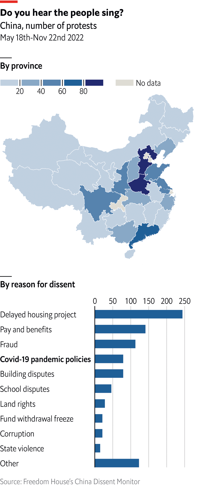

```{r setup, include=FALSE}
knitr::opts_chunk$set(out.width="100%", warning=FALSE)
```

The current social and political environment in China is complex and dynamic. The Land of the Dragon is usually misunderstood by the Western countries whose vision is usually biased or distorted due to all the contradictory narratives hiding international political dynamics of power. Differently to what many people think, protests are very usual in the People's Republic. However, due to the lack of transparency it's not such an easy thing to measure. This is a subject that is worth exploring for those who are interested in gaining a deeper understanding about the controversial economic giant. Studying the trends of the protests in China and the motivations behind them, it is possible to acquire insight about the current state of affairs in the country. Additionally, understanding the role that China's government plays in responding to and facilitating protests can provide further knowledge about the country's current political and social environment.

I will work on the next chart extracted from the article ["How common are protests in China?"](https://www.economist.com/graphic-detail/2022/11/16/how-common-are-protests-in-china) by The Economist, which aims to represent the different demonstrations of discontent in the country. It is made of two charts which assess popular manifestations geographically and depending on the issue. Scores are calculated using the data supplied by the [China Dissent Monitor](https://chinadissent.net/), a webpage owned by the neo-liberal think thank [Freedom House](https://freedomhouse.org/). The data lists one by one all the monitored cases of dissent and different variables including dates, provinces, issues, descriptions, number of participants...

<center>
{.external width=70%} 
</center>

## Step One: Replication of the chart

### Data collection and processing

```{r}
# Load libraries

library(tidyverse)
library(sf)
library(ggtext)
library(patchwork)
```

As it was explained, the data has been obtained from the China Dissent monitor, made by the Freedom House. The second data set is a .shp document that allow us to geospatially reproduce the whole map of china, including cities and provinces. 

```{r}
# Read data

chinacsv <- read_delim("dissent.csv", delim=",", skip=0)
china_map <- st_read("province.shp", quiet=TRUE)
```


To represent the data it's necessary to first merge both data sets. In order to accomplish that it is necessary to create a similar ID code for each of the provinces.

```{r}
chinacsv <- chinacsv %>%
  rename(code = province)

china_map <- china_map %>%
  mutate(code = sub(" Sheng", "", NAME_PINGY)) %>%
  mutate(code = sub("Guangxizhuangzu Zizhiqu", "Guangxi", code)) %>%
  mutate(code = sub("Neimenggu Zizhiqu", "Inner Mongolia", code)) %>%
  mutate(code = sub("Xizang Zizhiqu", "Tibet", code)) %>%
  mutate(code = sub("Xinjiangweiwu'erzu Zizhiqu", "Xinjiang", code)) %>%
  mutate(code = sub("Ningxiahuizu Zizhiqu", "Ningxia", code)) %>%
  filter(NAME_PINGY != "Taiwan Sheng")
```


Before combining both data frames, a few transformations have to be done. First, the "code" column is changed to numeric value and then the "count" function is used to score and group the cases of dissent by province. As a result we have only two columns left related to each object: the province with an ID code assigned to it and the number of cases in each province. 

```{r}
china_dissent <- chinacsv %>%
  select(code) %>% 
  count(code) 
china_dissent
```


It's time to join both data frames using left_join function. We only keep the code representing the provinces and the geospatial information about each of these provinces.

```{r}
join_map_data <- china_map %>% 
  left_join(china_dissent, by="code") %>% 
  select(n, geometry)
```

It is also necessary to modify the data for the second chart. As there are many different variations of each of the issues introduced  in the data set we have to group them in wider categories. For example, to represent the variable "Fraud," we are using "fraud, building quality", "fraud corruption"...etc.

```{r}
x <- c("Others", "Corruption", "State violence", "Fund withdrawal freeze",
       "Land rights", "School disputes", "Building disputes", "Fraud",
       "COVID-19 pandemic policies", "Pay and benefits", "Delayed housing project")

china_data <- chinacsv %>%
  transmute(
    Date = `beginning date`,
    Issue = issue,
    reason_dissent = case_when(
      grepl("^fraud", issue) ~ "Fraud",
      grepl("^delayed", issue) ~ "Delayed housing project",
      grepl("^pay", issue) ~ "Pay and benefits",
      grepl("^COVID-19", issue) ~ "COVID-19 pandemic policies",
      grepl("^school", issue) ~ "School disputes",
      grepl("^building", issue) ~ "Building disputes",
      grepl("^fund", issue) ~ "Fund withdrawal freeze",
      grepl("^land", issue) ~ "Land rights",
      grepl("^state", issue) ~ "State violence",
      grepl("^corruption", issue) ~ "Corruption",
      TRUE ~ "Others"
    )
  )
```


Subsequent changes include creating a new column counting the number of cases for each case of dissent. The column "reason_dissent" is changed into a factor so labels can be ordered when building the plot. It wouldn't be necessary to use factors if the data had just to be ordered alphabetically or in a descendant/ascendant order. However, the original plot locates the "Others" label in last place even though it's not the least frequent variable.

```{r}
china_data_n <- china_data %>% 
  group_by(reason_dissent) %>%
  count() %>%  
  transmute(
      reason_dissent = factor (reason_dissent, levels = x),
      n_cases= n) %>% 
  drop_na()
china_data_n
```


### Building the plot


We start by filling our geom_sf using the values in n, which provides data about the amount of protests by province. We locate the map in the center reducing the background using the "ylim" and "xlim" functions. Borders are changed to white and its thickness can be controlled with "lwd" function.

```{r}
final_map <- join_map_data %>% 
  ggplot() +
    geom_sf(aes(fill=n), color="white",lwd=0.2, )  + 
    coord_sf(ylim=c(-1.7e+06, 2e+06), xlim=(c(-3.3e+06, 2e+06)))
final_map
```


The title and a subtitle are included in this part. We use the R Markdown language to generate two lines in the subtitle. It is a very useful tool in the case it's necessary to change the color, size or type of letter, however in this case that is not required. To use it correctly we must include element markdown in the theme.

```{r}
final_map <- final_map +
  labs(
    fill=quote(bold("By province")),
    title = quote(bold("Do you hear the people sing?")),
    subtitle =("<span style='font-size: 10pt; font-family:Helvetica;'>China, number of protests</font><br>
                <span style='font-size: 9pt; font-family:Helvetica;'> September 1st to December 31th, 2022</font>")
  ) + 
  theme(
    plot.title = element_text(size = 12, family="Calibri", hjust=-0.015),
    plot.subtitle = element_markdown(lineheight=1.5, hjust=-0.01),
  )
final_map
```


Our variable and the scale to represent it is not discrete nor continuous but binned. "Scale_fill_binned" also allow us to change colors and establish breaks for the legend.

```{r}
final_map <- final_map +
    scale_fill_binned(
        breaks = c(20, 40, 60, 80),
        low = "#C7E6FD", high = "#004776", 
        limits=c(0, 100)
    )
final_map
```


The plot is very minimalist so in both charts we are removing the background, the grids and the ticks and text of the axis. Many different features are modified here to change sizes and type of letters, the position of the legend and the title and spacing between different objects. In this case we are not adding the NAs in the legend because we don't have any.

```{r final_map, preview=TRUE}
final_map <- final_map + 
  theme(
    panel.background = element_blank(),
    panel.grid.major = element_blank(),
    legend.direction = "horizontal",
    legend.text = element_text(size=9, family="Helvetica"),
    legend.key.height = unit(0.18, 'cm'),
    legend.key.size = unit(0.6, 'cm'),
    legend.position = c(0.125,0.89),
    legend.title = element_text(size=9, family="Helvetica"),
    axis.text = element_blank(),
    axis.ticks = element_blank(),
    legend.spacing.x = unit(8.0, 'cm')
  ) +
  guides(fill = guide_colorbar(title.position = "top"))
final_map
```


The second plot is an horizontal bar chart which can be build using "geom_col". The x axis represents the number of issues and the y axis each of those issues. 

```{r}
final_plot <- china_data_n %>% 
  ggplot() +
    aes(n_cases, reason_dissent) +
    geom_col(fill="#195B87", width = 0.45)
final_plot
```


In this step title and caption are added and the labels for the y axis are explicitly named to put "COVID-19 pandemic policies" in bold. 

```{r}
final_plot <- final_plot +
  labs(
    x=NULL,
    y=NULL,
    title=quote(bold("By reason for dissent")),
    caption = ("Source: Freedom's House China Dissent Monitor")
    ) +
  scale_y_discrete(labels = c("Others",
                              "State violence",
                              "Corruption",
                              "Fund withdrawal freeze",
                              "Land rights",
                              "School disputes",
                              "Building disputes",
                              expression(bold("COVID-19 pandemic policies")),
                              "Fraud",
                              "Pay and benefits",
                              "Delayed housing project"))
final_plot
```

Following the minimalist aesthetic, the background and the axis ticks are eliminated; word's size, type and colour is modified; and the x axis is placed on top. The "aspect.ratio" function allows us to make the plot longer and fit the previous one. The breaks for the x axis are also made explicit with "scale_x_continuous".

```{r}
final_plot <- final_plot +
  theme(
    plot.title = element_text(size = 9, family="Helvetica"),
    panel.background = element_blank(),
    panel.grid.major.x = element_line(color= "grey"),
    plot.title.position = "plot",
    axis.ticks= element_blank(),
    axis.text.y = element_text(hjust=0, size=8, family="Helvetica", color="black"),
    axis.text.x = element_text(size=8, family="Helvetica", color="black"),
    aspect.ratio = 2.2,
    plot.caption = element_text(hjust = 1.3, size=9, color="grey")
    ) +
  scale_x_continuous(breaks = c(0,50,100,150,200,250), position = "top")
final_plot
```

If we compare this plot with the original one made by The Economist we can realize the data doesn't match accurately. This is because Freedom House eventually updates the data for the graph. It has been attempted to filter earlier dates or reduce the case ID but none of them are giving us the exact same pattern than the one presented. What's more, filtering until November 22nd gives a much more different output in relation to the original chart than in the present case. Doing a general filtering in the data set does not allow us to replicate the chart, it would be necessary to exclude some cases one by one.  However, even though the values are not the exact same, the essential aspects of its visual representation are not really affected and the message is the same. In our case NAs label was not added because all provinces have more than 0 cases.

In order to plot the charts together patchworks deformed too much the final result. In our case we are just placing one chart over the next one and adjusting all parameters correctly make them match. This is the final replication:

```{r echo=FALSE, ref.label=I('final_map')}
```

```{r echo=FALSE}
final_plot
```

### Criticsms to the plot

I think the main message these two charts plotted together are sending is that China's regime is not as robust as we usually think. Western imaginary tends to conceive the pros and cons of their political system taking into account two sides of the same coin: On the one had, their lack of political and individual rights in an autocratic environment is negative, while the absence of popular grievances, open public debates and other democratic procedures allows the country to be more efficient and united in order to achieve common goals and an exponential economic growth. However, this plot tell us that political claims and cases of dissent are much more frequent than we think, and these popular demonstrations are widespread all over the country concerning many different issues. I think this charts perfectly accomplish this purpose.

The original chart, which has been presented at the beginning, was published by The Economist on November 28th. It is an update of a previous plot which contained less data and was exactly the same visually. Besides this, the only change which was made is putting "Covid-19 pandemic policies" in bold, a change that makes sense taking into account the whole article in which this plot is included, where they explain the undergoing situation in the country. Nevertheless, I think the graph is not informative in this context. Visual representation aims to communicate a message by itself regardless of the information beyond the plot. The Economist wanted to express how numerous anti-lockdown protests were being due to the general questioning of zero-Covid strategy, which has resulted to be an absolute failure. Using a barplot does not seem to be useful to show this huge exponential increase of covid-19 protests, and someone who hasn't been aware of this political dynamics would not understand why that concrete label is in bold being the 4th issue in the ranking. 

I will propose a modification taking into account this argumentary.


## Step Two: New visualization of the chart

### Managing data

My first approach consisted on exploring the best way of showing the difference in cases of Covid-19 between the two plots made by The Economist. Filtering the data I could manage to represent the previous plot (the one which was launched by The Economist but is no longer uploaded) and the current update.

```{r}
china_data_filter <- chinacsv %>%
  filter(`Case ID`<669) %>% 
  transmute(
    Issue = issue,
    reason_dissent = case_when(
      grepl("^fraud", issue) ~ "Fraud",
      grepl("^delayed", issue) ~ "Delayed housing project",
      grepl("^pay", issue) ~ "Pay and benefits",
      grepl("^COVID-19", issue) ~ "COVID-19 pandemic policies",
      grepl("^school", issue) ~ "School disputes",
      grepl("^building", issue) ~ "Building disputes",
      grepl("^fund", issue) ~ "Fund withdrawal freeze",
      grepl("^land", issue) ~ "Land rights",
      grepl("^state", issue) ~ "State violence",
      grepl("^corruption", issue) ~ "Corruption",
      TRUE ~ "Others" 
    )
  ) %>% 
  group_by(reason_dissent) %>%
  count() %>%  
  transmute(
        reason_dissent = factor (reason_dissent, levels = x),
        n_cases= n) %>%
  arrange(reason_dissent) %>% 
  drop_na()
```

In this context, the filtered data set and the full one can be merged, each one containing a different amount of cases per issue to be represented.

```{r}
diff_data <- china_data_n %>% 
  full_join (china_data_filter, by = "reason_dissent") %>% 
  transmute(
    reason_dissent,
    before = n_cases.y,
    after = n_cases.x
  )
diff_data
```

### Making an alternative representation: First attempt

Lollipops seem to be a good way to show the differences between both data sets representing at the same time the absolute values as the previous chart did. In this case, I repeated all geoms twice filtering it the second time to give covid-19 protest a different colour.

```{r}
final_plot <- diff_data %>% ggplot() +
  aes(after, reorder(reason_dissent, after, sum)) +
  geom_segment(
              aes(
                xend=before, yend=reason_dissent), 
                color="#195B87", 
                size=0.7) +
  geom_segment(
    aes(xend=before, yend=reason_dissent), 
        color="#B10000", size=1, data = diff_data %>% 
        filter(reason_dissent == "COVID-19 pandemic policies")) +
  geom_point(size=2, color="#195B87") +
  geom_point(aes(before), size=0.7, color="#195B87") +
  geom_point(
    aes(before, reason_dissent), size=1, 
    color="#B10000", data = diff_data %>% 
    filter(reason_dissent == "COVID-19 pandemic policies")) +
  geom_point(
    aes(after, reason_dissent), size=2.3, 
        color="#B10000", data = diff_data %>% 
        filter(reason_dissent == "COVID-19 pandemic policies")) +
  labs(
    y=NULL,
    x=NULL,
    title=quote(bold("By reason for dissent")),
    caption = ("Source: Freedom's House China Dissent Monitor")
    ) +
  scale_x_continuous(position = "top", breaks = c(0,50,100,150,200,250)) +
  theme(plot.title = element_text(size = 11, family="Helvetica"),
        panel.background = element_blank(),
        panel.grid.major.x = element_line(color= "grey"),
        plot.title.position = "plot",
        axis.ticks= element_blank(),
        axis.text.y = element_text(hjust=0, size=9, family="Helvetica", color="black"),
        axis.text.x = element_text(size=9, family="Helvetica", color="black"),
        aspect.ratio = 2.5,
        plot.caption = element_text(hjust = 2, size=7, color="grey")
        )+
  expand_limits(x=0)
final_plot
```


The result of the two charts merged together look like this:

```{r echo=FALSE, ref.label=I('final_map')}
```
```{r echo=FALSE}
final_plot
```

The main problem of this chart is that dates are not shown, but even if they were added it would be quite arbitrary to just represent two dates corresponding to two different releases of The Economist. Also the map above is problematic as the lollipops are representing two absolute values and its difference, but a map can not show all these features and the interpretation can be misleading. What should be added to the map? Only the data concerning the difference? The absolute value of the second date? 

This is why a second attempt was made, representing this time how the cases for each issue change through time and showing at the same time the exponential covid-19 rise of dissent. 


### Managing data II

In this case we calculated the cumulative of the protests depending on the dates and the reason for dissent, so we can represent what's the number of protest each day depending on the issue. As we want to incise in the high number of anti-lock down covid-19 protests we are filtering information after September. Taking a very long time lapse hides this change, so both charts are being filtered.

```{r}
x <- c("COVID-19 pandemic policies", "Delayed housing project", "State violence",
       "Fund withdrawal", "Pay and benefits", "Building disputes",
       "School disputes", "Land rights", "Corruption", "Fraud", "Others")

china_data_n <- china_data %>% 
      group_by(reason_dissent,Date) %>%
      count() %>%
      filter(Date >="2022-09-01") %>% 
      group_by(reason_dissent) %>% 
      mutate(cumulative_n = cumsum(n)) %>% 
      transmute(
          reason_dissent = factor (reason_dissent, levels = x),
          cumulative_n,
          Date)
china_data_n
```

### Making an alternative representation: Second attempt

In this case it was possible to represent this data using a linear chart, but using a stream in a proportional way seemed to be an even better option to show the rise in covid-19 protests. In this context, "geom_stream" from ggstream package was used.

```{r}
final_plot <- ggplot(china_data_n) +
  aes(Date,cumulative_n) +
  ggstream::geom_stream(
      aes(fill=reason_dissent),
      type="proportional")
final_plot
```


In this part we use titles not just in a descriptive way but trying to help interpretation in terms of the centrality we want covid-19 to have. The map chart is very long, so having the legend at the right is not an option if we want both charts to fit well together. Besides, colours seem to be very confusing. 

```{r}
final_plot <- final_plot + labs(
      title=quote(bold("Anti-lockdown protests boost due to zero-Covid strategy")),
      fill=quote(bold("By Issue")),
      caption = ("Source: Freedom's House China Dissent Monitor"),
      y = quote(bold("Percentage of protests")))
final_plot
```


As always, the theme is used to adjust many different things. The most challenging aspect here was to adjust all parameters to make both charts fit, as this one looked better horizontally but has to substitute a vertical one. 

```{r}
cols <- c("#146c9b", "#eacbab", "#d49c4c", "#acdbdb" , "#040404","#9c947c",
          "#ce9f5d", "#498caa", "#546466", "#729499")

final_plot <- final_plot +  theme(
      plot.title = element_text(size = 12, family="Calibri", 
                                margin=margin(0,0,5,0)),
      panel.background = element_blank(),
      plot.margin=unit(c(0,0,0,0),"cm"),
      plot.title.position = "plot",
      axis.text.y = element_text(hjust=0, size=11, family="Helvetica", color="black"),
      axis.text.x = element_text(size=11, 
                                 family="Helvetica", color="black"),
      axis.title.x = element_blank(),
      aspect.ratio = 0.68,
      plot.caption = element_text(hjust = -1.25, size=10, color="grey"),
      legend.text = element_text(size=9, family="Helvetica"),
      legend.key.height = unit(0.27, 'cm'),
      legend.key.width  = unit(0.27, 'cm'),
      legend.key.size = unit(0.9, 'cm'),
      legend.position = "bottom",
      legend.title = element_text(size=9, family="Helvetica"))+
  scale_x_date(date_breaks = "months", date_labels = "%m-%Y", expand = c(0.01, 0))+
  scale_y_continuous(labels= c("0%", "25%", "50%", "75%", "100%"), expand = c(0.10, 0))+
  guides(fill = guide_legend(title.position = "top"))+
  scale_fill_manual(values = cols)
final_plot
```

As we can observe, the map also suffered many modifications to fit well the second chart. I think the final result allows a better comprehension of the data as we have included the dimension of transformation of the data over time. This way it's not just about the different issues and their total frequency but about how the social demands are proportionally changing depending on the matter. In this context, understanding the  recent rise of covid-19 protests is also easier to analyze.

```{r echo=FALSE, ref.label=I('final_map'), fig.align="center"}
```
```{r echo=FALSE, fig.align='center'}
final_plot
```
