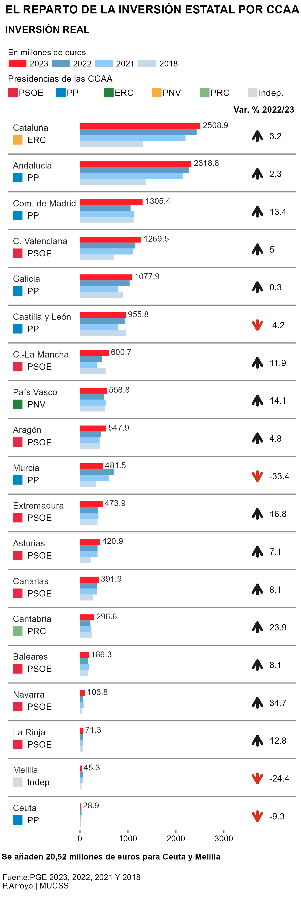

The distribution of state investment by autonomous communities, it is a tricky topic that each year comes to the news. When the State´s budget is published, almost the first thing that each media do is to analyze what are the communities that receive more, and what are the ones that receive less. This could be important, because depending on the needing of support for the governance, more money would go to one community or another.

The point here, is in the differences between Madrid and Catalonia. However, as illustrated here, the budget from Catalonia is closer to Andalusia rather than Madrid. We can see notices of this kind in the national press channel [*"Catalonia and Andalusia lead state investment with almost twice the budget of Madrid and the Valencian Community"*](https://www.rtve.es/noticias/20221006/presupuestos-2023-comunidades/2405230.shtml) or the [*"El Mundo"*](https://www.elmundo.es/economia/2022/10/06/633f1bf0fdddffba108b459c.html) from which I took the graph.

.](ccaa470.jpg){.external width=100%}

## Getting the data

Apparently, the data could be really easy to obtain from an official source, because if you observe this same data from different papers, figures vary a bit. But, as expected with public institutions, the process is really tedious. So, what I did is to obtain the data from the public institution in charge of this figures in Spain, [*La Intervención General de la Administración del Estado*](https://www.igae.pap.hacienda.gob.es/sitios/igae/es-ES/Contabilidad/ContabilidadPublica/CPE/EjecucionPresupuestaria/Paginas/isdistribucioninversion.aspx) with data from 2009 to 2022.

For data about the budget for the next year, 2023, I used another official page which show the information in a visual way, [*Ministerio de Hacienda, epdata*](https://www.epdata.es/datos/inversion-gobierno-comunidades-datos-estadisticas/263).

Once you get the file with the whole datasheet from one specific year, you have to sum the different budget items by communities. It appears spread by different concepts, as a page in an excel book and repeating the process for the four years. Having done that, it is possible to obtain the data in a `.cvs` file format. So, we will see how our data looks like:

```{r, fig.align = "center"}

library(tidyverse)
library(ggplot2)
library(dplyr)
library(ggtext)
library(ggsci)
library(ggforce)
library(glue)
library(systemfonts)
library(cowplot)

sysfonts::font_add_google("Be Vietnam Pro")
showtext::showtext_opts(dpi=300)

data<- read_delim("Clean_Data.csv", delim = ";", col_types = "cnnnn"  )
glimpse(data)

```

It is impossible to observe the whole datasheet. So, with the previous function glimpse(), we can take a quick view of the general structure, in order to observe more or less how it is. But for observing the main measures of central tendency from our data and its evolution through this for years, it would be nice to include the summary () function.

```{r, fig.align = "center"}

summary(data)

```

Once we have our raw data, it is time to start giving format to our variables, in order that they appear specifically how we want them, not as mere values in a table.

```{r, fig.align = "center", out.width = "100%"}

data<-data %>% 
  pivot_longer(c("2018", "2021", "2022", "2023")) %>% 
  mutate(
    Comunidad=as.factor(Comunidad),
    name=as.factor(name),
  )
```

First thing to do is to mutate them as a long format, which is more useful for visualization and statistics approaches. Also, it is important to convert the name of the communities and the name of the year, 2023, 2022, 2021, 2018, as factors. That is the way that we have in R to specify the categories in the representation.

Now, it is possible to say that our data seems to be what it would be expected to start the construction of the graph.

## Building the chart

The plot was selected because it could seem easy to reproduce, and was the first time dealing with this kind of representation on my own. However, it started to get harder and harder to deal with this grouped bar chart, and the small details were really time consuming. But finally, it was possible to come up with a result as could be seen in the following lines:

### Coordinates and axes

I will try to reproduce the graph, step by step, before adding the data and obtaining the whole plot.

```{r, fig.align = "center", out.width = "100%"}

p <- ggplot(data) +
  aes(x=Comunidad, y=value)

p
  
```

With this first chunk of code, the baseline of the plot appears. Based on which, we will be adding information and modifying the different characteristic, in order to satisfy the same specification as in the selected one. However, the names of the communities are all together and it is really difficult to understand. It is a pointless point, so it´s worth it to have a vertical disposition instead of a horizontal one, the categories would be more readable.

As it could be seen in the example, the graph has certain limits for the values of our data. One of the first points that we have to do, is to fix those values within the specific categories. In this case from 0 to 3000 in steps of 500. I decided to expand the limits a bit more than this 3000, because otherwise the label for this 3000 extended passed the axis and we could not see it.

There are also coordinates for the negative part of the graph despite not having negative information for the budgets. That is because we have to extend the lines and add the names of the communities in this part as annotations, otherwise it would be impossible.

A good point to highlight here, and which was really hard to find, is how to set the y axis on both sides. Although it is a simple line of code, it took me a while to find this specific chunk of code, so if some of you need this in the future pay attention at this point, because the rest is more or less the same as in all plots.

```{r, fig.align = "center", out.width = "100%"}
p <- p + scale_y_continuous(
    breaks = c(0, 500, 1000, 1500, 2000, 2500, 3000),
    limits = c(-1500, 3200),
    sec.axis = dup_axis(),
    name = NULL,
    expand = c(0,0)
  ) +
  
  scale_x_discrete(
    name = NULL,
    limits = c("Ceuta", "Melilla", "La Rioja", "Navarra", "Baleares", 
               "Cantabria", "Canarias", "Asturias", "Extremadura", 
               "Murcia", 
               "Aragón", "País Vasco", "Castilla-La Mancha", 
               "Castilla y León", "Galicia", "C. Valenciana", 
               "Com. de Madrid", "Andalucia", "Cataluña"),
    labels = NULL,
    expand = c(0,0)
  )

p
```

A last comment about this previous chunk. The names of the axis have been deleted, because we do not want it to appear in our last graph, but also, we set a specific order for the name of the communities, based on the highest budget for the year 2023.

### Theme

The theme for this project is very easy. As it can be seen, the background of the graph is empty, nothing inside, but for, the lines below the name of each community which separate one community from another. A key point here is that we have established the small tick that appears below each break. Maybe, in this position it is hard to identify, but once we apply for coord_flip() it is more easy to observe.

```{r, fig.align = "center", out.width = "100%"}
p <- p + theme_minimal()+
  
  theme(
    panel.grid = element_blank(),
    axis.ticks.x.top = element_line(
      size = .5, colour = "#696969"), 
    axis.ticks.x.bottom = element_line(
      size = .5, colour = "#696969"),
    plot.background = element_rect(color="#ffffff", fill="#ffffff"),
    plot.margin = margin(5,5,5,5))
    
p
    
```

We have an empty graph, with nothing inside which is the case that we are trying to replicate. However, we need to add the guides, and coord_flip() to see something similar to the original one. So, we will do it.

```{r, fig.height = 12, fig.width = 4, fig.align = "center", out.width = "100%"}

p <- p +  coord_flip(clip = "off", ylim = c(-1500, 3100))+
  geom_segment(
    data = data.frame(x = seq(1.5, 18.5, 1), ymin =-1500, ymax = 3100),
    aes(x = x, xend = x, y = ymin, yend = ymax),
    inherit.aes = FALSE,
    color = "#8e8e8e"
  )

p

```

Instead of having a vertical bar chart which is the usual scenario after applying for these changes, we have a horizontal plot, with nothing inside. The graph is starting to seem similar to the original one. However, it is a kind of graph that by its nature, it is much longer than wider, so we have to change the adjustment of our R.Markdown to obtain what we want.

Notice, that we have changed the specification of the graph, the plot is more or less what we want. Now is the time to add the data and the annotations.

### Annotations

Apparently, this graph does not have any kind of annotation. However, it is a bit misleading and there was no other way to add the name of the communities rather than as an annotation. To do so, what I did is to extend the dimension of the plot past the axis, and once we have that, adding in the negative part the name corresponding to the different communities as annotations.

```{r, fig.height = 12, fig.width = 4, fig.align = "center", out.width = "100%"}

p <- p + annotate("text", x = 19, y = -1400, hjust=0, 
           label = "Cataluña", size = 3, 
           colour = "#262626")+
  annotate("text", x = 18, y = -1400, hjust=0, 
           label = "Andalucia", size = 3,
           colour = "#262626")+
  annotate("text", x = 17, y = -1400, hjust=0,  
           label = "Com. de Madrid", size = 3,
           colour = "#262626")+
  annotate("text", x = 16, y = -1400, hjust=0, 
           label = "C. Valenciana", size = 3,
           colour = "#262626")+
  annotate("text", x = 15, y = -1400, hjust=0,  
           label = "Galicia", size = 3,
           colour = "#262626")+
  annotate("text", x = 14, y = -1400, hjust=0, 
           label = "Castilla y León", size = 3,
           colour = "#262626")+
  annotate("text", x = 13, y = -1400, hjust=0,  
           label = "Castilla-La Mancha", size = 3,
           colour = "#262626")+
  annotate("text", x = 12, y = -1400, hjust=0,  
           label = "País Vasco", size = 3,
           colour = "#262626")+
  annotate("text", x = 11, y = -1400, hjust=0, 
           label = "Aragón", size = 3,
           colour = "#262626")+
  annotate("text", x = 10, y = -1400, hjust=0,  
           label = "Murcia", size = 3,
           colour = "#262626")+
  annotate("text", x = 9, y = -1400, hjust=0, 
           label = "Extremadura", size = 3,
           colour = "#262626")+
  annotate("text", x = 8, y = -1400, hjust=0,  
           label = "Asturias", size = 3,
           colour = "#262626")+
  annotate("text", x = 7, y = -1400, hjust=0, 
           label = "Canarias", size = 3, 
           colour = "#262626")+
  annotate("text", x = 6, y = -1400, hjust=0, 
           label = "Cantabria", size = 3,
           colour = "#262626")+
  annotate("text", x = 5, y = -1400, hjust=0,  
           label = "Baleares", size = 3,
           colour = "#262626")+
  annotate("text", x = 4, y = -1400, hjust=0,  
           label = "Navarra", size = 3,
           colour = "#262626")+
  annotate("text", x = 3, y = -1400, hjust=0,  
           label = "La Rioja", size = 3,
           colour = "#262626")+
  annotate("text", x = 2, y = -1400, hjust=0,  
           label = "Melilla", size = 3,
           colour = "#262626") +
  annotate("text", x = 1, y = -1400, hjust=0,  
           label = "Ceuta", size = 3,
           colour = "#262626")

p

```

### Data

This graph is based on grouped data by an autonomous community. With the name of the different communities and their budget from four different years, that is why in the previous steps it was important to pivot longer the data, and establish the different year and communities as_factor(). So, it is the type of grouped bar chart.

Now, we will add the data to the previous coordinates and axis that we have been preparing, but also we will establish the different colors of the bars.

```{r,  fig.height = 12, fig.width = 4, fig.align = "center", out.width = "100%"}

p <- p + 
  geom_bar(position = "dodge", stat = "identity", width = 0.63) + 
  aes(fill = name) +
  scale_fill_manual(breaks=c("2023","2022","2021", "2018"), 
                    values = c("#ff1e26", "#5f9dc6", 	"#8ccaf9", "#c5daeb"))

p

```

The graph it is closer to our final result. Few things are still left such as a good title, subtitle and caption. But also, we have to establish a good position for the legend which is almost higher than the plot, and this does not make any sense.

### Labs

A key point that it is still missing in this graph are the labs. If we see the graph until this point, we do not know what the graph is about without an appropriate title, it is mandatory to modify it, and also adding the different subtitles and comments.

```{r,  fig.height = 12, fig.width = 4, fig.align = "center", out.width = "100%"}

p <- p + 
  labs(
    title = "EL REPARTO DE LA INVERSIÓN ESTATAL POR CCAA",
    subtitle = "INVERSIÓN REAL \n\n\n",
    caption = "Se añaden 20,52 millones de euros para Ceuta y Melilla \n",
    fill = "En millones de euros")

```

However, when we add all of these things, our plot is completely a mess, because we have added many different things, without the necessary adjustment. So, everything has moved from one place to another and appears to be untidy. Let´s try to solve it! Basically, we will be adjusting almost every position of the element on the plot.

```{r,  fig.height = 12, fig.width = 4, fig.align = "center", out.width = "100%"}

p <- p + 
  theme(
    axis.title.x = element_text(hjust=.5, color="black", 
                                size=10, face = "bold", 
                                margin = margin(10,0,0,0)),
    axis.text = element_text(color="black", 
                             size=8 ),
     axis.text.y = element_text(color="black",
                               size=10),
    plot.title = element_text(hjust=-0, size=11, 
                              color="black",lineheight=.8, face="bold", 
                              margin=margin(0,0,0,0)),
     plot.subtitle = element_text(hjust=0, vjust = 1.2, 
                                  size=9.5, color= "black", 
                                  face = "bold", margin=margin(10,0,10,0)),
    plot.caption = element_text(hjust= -0.05,margin=margin(10,0,0,0), 
                                size=8, color="black", face="bold"),
    plot.title.position = "plot",
    plot.caption.position = "plot"
    ) 
p

```

### Legend

However, we still have the legend in a position that modifies the whole graph, and we have to change that to obtain a real reproduction.

```{r, fig.height = 12, fig.width = 4, fig.align = "center", out.width = "100%"}

p<- p +
  theme(
    legend.direction = "horizontal",
    legend.position = c(0.285, 1.05), 
    legend.margin = margin(0),
    legend.title = element_text(color = "black", size = 8),
    legend.text = element_text(color = "black", size = 8),
    legend.spacing.x = unit(0.09, 'cm'),
    legend.key.size = unit(0.6, "cm"),
    legend.key.height= unit(0.3, 'cm'),
    legend.key.width = unit(0.65, "cm"),
    legend.spacing.y = unit(0.1,'cm')
    ) +
  guides(fill= guide_legend(title.position = "top", title.hjust = 0))
p

```

Once we have done that, the representation is consistent with what we want, because everything is adjusted and aligned, not as in the previous steps, that when you modify something everything changes and you have to start again. But never give up, you will finish doing it!

It is time to introduce the annotation near to the name of each community. I tried to do it at the same time in just one chunk of code, but only the names from 3 different communities and the other disappeared. I do not know the reason well. So that is why I decided to do it step by step although it is longer. Sure, there is a better option.

And also we have to add a little more. Notice that at the bottom of the graph there is more information than just a simple caption, so we have to add also this information. The way that I found better to add this information is by using the ggdraw(), which will be included at the end of the next chunk.

```{r, fig.height = 12, fig.width = 4, fig.align = "center", out.width = "100%"}
p<- p +
  geom_text(
    aes(label= ifelse(value == c("2508.9"), value, NA)), 
    position = position_dodge(0.8),
    hjust = -0.1,
    vjust = 0.75, size = 2.8,
    colour = "#262626"
  ) +
  geom_text(
    aes(label= ifelse(value == c("2318.8"), value, NA)), 
    position = position_dodge(0.8),
    hjust = -0.1,
    vjust = 0.75, size = 2.8,
    colour = "#262626"
  ) +
  geom_text(
    aes(label= ifelse(value == c("1305.4"), value, NA)), 
    position = position_dodge(0.8),
    hjust = -0.1, 
    vjust = 0.75, size = 2.8,
    colour = "#262626"
  ) +
  geom_text(
    aes(label= ifelse(value == c("1269.5"), value, NA)), 
    position = position_dodge(0.8),
    hjust = -0.1,
    vjust = 0.75, size = 2.8,
    colour = "#262626"
  ) +
  geom_text(
    aes(label= ifelse(value == c("1077.9"), value, NA)), 
    position = position_dodge(0.8),
    hjust = -0.1,
    vjust = 0.75, size = 2.8,
    colour = "#262626"
  ) +
  geom_text(
    aes(label= ifelse(value == c("955.8"), value, NA)), 
    position = position_dodge(0.8),
    hjust = -0.1,
    vjust = 0.75, size = 2.8,
    colour = "#262626"
  ) +
  geom_text(
    aes(label= ifelse(value == c("600.7"), value, NA)), 
    position = position_dodge(0.8),
    hjust = -0.1,
    vjust = 0.75, size = 2.8,
    colour = "#262626"
  ) +
  geom_text(
    aes(label= ifelse(value == c("558.8"), value, NA)), 
    position = position_dodge(0.8),
    hjust = -0.1,
    vjust = 0.75, size = 2.8,
    colour = "#262626"
  ) +
  geom_text(
    aes(label= ifelse(value == c("547.9"), value, NA)), 
    position = position_dodge(0.8),
    hjust = -0.1,
    vjust = 0.75, size = 2.8,
    colour = "#262626"
  ) +
  geom_text(
    aes(label= ifelse(value == c("481.5"), value, NA)), 
    position = position_dodge(0.8),
    hjust = -0.1,
    vjust = 0.75, size = 2.8,
    colour = "#262626"
  ) + 
  geom_text(
    aes(label= ifelse(value == c("473.9"), value, NA)), 
    position = position_dodge(0.8),
    hjust = -0.1,
    vjust = 0.75, size = 2.8,
    colour = "#262626"
  )+
  geom_text(
    aes(label= ifelse(value == c("420.9"), value, NA)), 
    position = position_dodge(0.8),
    hjust = -0.1,
    vjust = 0.75, size = 2.8,
    colour = "#262626"
  ) +
  geom_text(
    aes(label= ifelse(value == c("391.9"), value, NA)), 
    position = position_dodge(0.8),
    hjust = -0.1,
    vjust = 0.75, size = 2.8,
    colour = "#262626"
  ) +
  geom_text(
    aes(label= ifelse(value == c("296.6"), value, NA)), 
    position = position_dodge(0.8),
    hjust = -0.1,
    vjust = 0.75, size = 2.8,
    colour = "#262626"
  ) +
  geom_text(
    aes(label= ifelse(value == c("186.3"), value, NA)), 
    position = position_dodge(0.8),
    hjust = - 0.1,
    vjust = 0.75, size = 2.8,
    colour = "#262626"
  ) +
  geom_text(
    aes(label= ifelse(value == c("103.8"), value, NA)), 
    position = position_dodge(0.8),
    hjust = -0.1,
    vjust = 0.75, size = 2.8,
    colour = "#262626"
  ) + 
  geom_text(
    aes(label= ifelse(value == c("71.3"), value, NA)), 
    position = position_dodge(0.8),
    hjust = -0.1,
    vjust = 0.75, size = 2.8,
    colour = "#262626"
  ) + 
  geom_text(
    aes(label= ifelse(value == c("45.3"), value, NA)), 
    position = position_dodge(0.8),
    hjust = -0.1,
    vjust = 0.75, size = 2.8,
    colour = "#262626"
  ) +
  geom_text(
    aes(label= ifelse(value == c("28.9"), value, NA)), 
    position = position_dodge(0.8),
    hjust = -0.1,
    vjust = 0.75, size = 2.8,
    colour = "#262626"
  )

p <- ggdraw(add_sub(p, "Fuente:PGE 2023, 2022, 2021 Y 2018 \nP.Arroyo | MUCSS", 
                    y = 0.8, x = -0.01, hjust = 0, vjust = 0.85, size = 7.8, 
                    color = "black", lineheight = 0.85))

p

```

## Improvements

The plot that I decided to reproduce, was quite complete with almost all the elements that should be included for a good representation, such as: a nice axis with its reference, annotations of different values, a clear legend, nice colors and so on. 
However, as a reader of newspapers I miss an interesting point that all graphs should have, something that draws our attention and keeps us reading the notice. This could be done by introducing some interesting point, or maybe some controversial that keeps readers awake, that is why I decided to do the following graph:


{.external width=100%}

Mainly, I decided to do two thing:

-   Adding the name of the policy party that is in charge of each community.

-   Including the evolution of the budget per community with an ascending or descending arrow.

By doing that, we include some controversial questions that encourage readers to go deeper in the theme. That is because, as said in the introduction, in Spain it is believed by many people that the budget that each community receives depends on sympathy with the central government.

What, surprised me when I was doing this tutorial, is that also the original author of the previous graph, [*Javier Aguirre,*](https://twitter.com/javagured)  has introduced some modifications in line with the ones that I was doing. The idea was the same, but his ones were more visual so I decided to continue my path in that way because it was just a few lines of code and the appearance was better. [*"See news with the final graph"*](https://www.elmundo.es/economia/2022/10/06/633f1bf0fdddffba108b459c.html) This is a good point to remark, that once you get a nice graph, there is always a way to improve it based on the previous one.
I have to point out that I don't like in his definitive graph the inclusion of the top X axis, because there is so much information in the positive part that you will end up missing.


### Code

I want to comment on the key point that I made to modify the whole graph. Also, I know that a good point of improvement is reducing the code to reproduce exactly the same, by for example using sequences that is something that I would like to do in future steps.

Main points to highlight:

-   Extending the limits of the axis passed the data, from -1500 to 4500, to introduce the different elements as annotations.

-   Selecting just one X axis for reference instead of dup_axis(), in order not to overload the plot.

-   Compute the percentage variation and add the different elements as annotations in this new axis.

Nevertheless, I include the whole chunk of code, knowing as I said before that there is enough space to do it in fewer lines, but the first step is a nice way of starting.

```{r,  fig.height = 12, fig.width = 4, fig.align = "center", out.width = "100%"}

### Coordinates and axes
t <- ggplot(data) +
  aes(x=Comunidad, y=value)

t <- t + scale_y_continuous(
  breaks = c(0, 1000, 2000, 3000),
  #sec.axis = dup_axis(),
  name = NULL,
  expand = c(0,0)
) +
  scale_x_discrete(
    name = NULL,
    limits = c("Ceuta", "Melilla", "La Rioja", "Navarra", 
               "Baleares", "Cantabria", "Canarias", "Asturias", 
               "Extremadura", "Murcia", "Aragón", "País Vasco", 
               "Castilla-La Mancha", "Castilla y León", "Galicia", 
               "C. Valenciana", "Com. de Madrid", "Andalucia", "Cataluña"),
    labels = NULL,
    expand = c(0,0)
  )

### Theme
t <- t + theme_minimal()+
  theme(
    panel.grid = element_blank(),
    axis.ticks.x.top = element_line(
      size = .5, colour = "#696969"), 
    axis.ticks.x.bottom = element_line(
      size = .5, colour = "#696969"),
    plot.background = element_rect(color="#ffffff", fill="#ffffff"),
    plot.margin = margin(5,5,5,5))

t <- t +  coord_flip(clip = "off", ylim = c(-1500, 4500))+
  geom_segment(
    data = data.frame(x = seq(1.5, 18.5, 1), ymin =-1500, ymax = 4500),
    aes(x = x, xend = x, y = ymin, yend = ymax),
    inherit.aes = FALSE,
    color = "#8e8e8e"
  )

### Annotations for the left name of the communities
t <- t + annotate("text", x = 19.2, y = -1400, hjust=0, 
                  label = "Cataluña", size = 3, 
                  colour = "#262626")+
  annotate("text", x = 18.2, y = -1400, hjust=0, 
           label = "Andalucia", size = 3,
           colour = "#262626")+
  annotate("text", x = 17.2, y = -1400, hjust=0,  
           label = "Com. de Madrid", size = 3,
           colour = "#262626")+
  annotate("text", x = 16.2, y = -1400, hjust=0, 
           label = "C. Valenciana", size = 3,
           colour = "#262626")+
  annotate("text", x = 15.2, y = -1400, hjust=0,  
           label = "Galicia", size = 3,
           colour = "#262626")+
  annotate("text", x = 14.2, y = -1400, hjust=0, 
           label = "Castilla y León", size = 3,
           colour = "#262626")+
  annotate("text", x = 13.2, y = -1400, hjust=0,  
           label = "C.-La Mancha", size = 3,
           colour = "#262626")+
  annotate("text", x = 12.2, y = -1400, hjust=0,  
           label = "País Vasco", size = 3,
           colour = "#262626")+
  annotate("text", x = 11.2, y = -1400, hjust=0, 
           label = "Aragón", size = 3,
           colour = "#262626")+
  annotate("text", x = 10.2, y = -1400, hjust=0,  
           label = "Murcia", size = 3,
           colour = "#262626")+
  annotate("text", x = 9.2, y = -1400, hjust=0, 
           label = "Extremadura", size = 3,
           colour = "#262626")+
  annotate("text", x = 8.2, y = -1400, hjust=0,  
           label = "Asturias", size = 3,
           colour = "#262626")+
  annotate("text", x = 7.2, y = -1400, hjust=0, 
           label = "Canarias", size = 3, 
           colour = "#262626")+
  annotate("text", x = 6.2, y = -1400, hjust=0, 
           label = "Cantabria", size = 3,
           colour = "#262626")+
  annotate("text", x = 5.2, y = -1400, hjust=0,  
           label = "Baleares", size = 3,
           colour = "#262626")+
  annotate("text", x = 4.2, y = -1400, hjust=0,  
           label = "Navarra", size = 3,
           colour = "#262626")+
  annotate("text", x = 3.2, y = -1400, hjust=0,  
           label = "La Rioja", size = 3,
           colour = "#262626")+
  annotate("text", x = 2.2, y = -1400, hjust=0,  
           label = "Melilla", size = 3,
           colour = "#262626") +
  annotate("text", x = 1.2, y = -1400, hjust=0,  
           label = "Ceuta", size = 3,
           colour = "#262626")

##Annotations for adding the different boxes based on the party in charge of each community
t<- t + annotate(geom = "rect", xmin = 19, xmax = 18.75,
                 ymin = -1400, ymax = -1200, fill = "#f3af44", alpha = 1) + #Cataluña
  annotate(geom = "rect", xmin = 18, xmax = 17.75, #Andalucia
           ymin = -1400, ymax = -1200, fill = "#0086c5", alpha = 1) +
  annotate(geom = "rect", xmin = 17, xmax = 16.75, #Com.Mad
           ymin = -1400, ymax = -1200, fill = "#0086c5", alpha = 1) +
  annotate(geom = "rect", xmin = 16, xmax = 15.75, #C.Valenciana
           ymin = -1400, ymax = -1200, fill = "#e52b43", alpha = 1) + 
  annotate(geom = "rect", xmin = 15, xmax = 14.75, #Galicia
           ymin = -1400, ymax = -1200, fill = "#0086c5", alpha = 1) +
  annotate(geom = "rect", xmin = 14, xmax = 13.75, #CyL
           ymin = -1400, ymax = -1200, fill = "#0086c5", alpha = 1) +
  annotate(geom = "rect", xmin = 13, xmax = 12.75, #C.Mancha
           ymin = -1400, ymax = -1200, fill = "#e52b43", alpha = 1) +
  annotate(geom = "rect", xmin = 12, xmax = 11.75, #País Vasco
           ymin = -1400, ymax = -1200, fill = "#22823a", alpha = 1) +
  annotate(geom = "rect", xmin = 11, xmax = 10.75, #Aragon
           ymin = -1400, ymax = -1200, fill = "#e52b43", alpha = 1) +
  annotate(geom = "rect", xmin = 10, xmax = 9.75, #Murcia
           ymin = -1400, ymax = -1200, fill = "#0086c5", alpha = 1) +
  annotate(geom = "rect", xmin = 9, xmax = 8.75, #Extremadura
           ymin = -1400, ymax = -1200, fill = "#e52b43", alpha = 1) +
  annotate(geom = "rect", xmin = 8, xmax = 7.75, #Asturias
           ymin = -1400, ymax = -1200, fill = "#e52b43", alpha = 1) +
  annotate(geom = "rect", xmin = 7, xmax = 6.75, #Canarias
           ymin = -1400, ymax = -1200, fill = "#e52b43", alpha = 1) +
  annotate(geom = "rect", xmin = 6, xmax = 5.75, #Cantabria
           ymin = -1400, ymax = -1200, fill = "#81b881", alpha = 1) +
  annotate(geom = "rect", xmin = 5, xmax = 4.75, #Baleares
           ymin = -1400, ymax = -1200, fill = "#e52b43", alpha = 1) +
  annotate(geom = "rect", xmin = 4, xmax = 3.75, #Navarra
           ymin = -1400, ymax = -1200, fill = "#e52b43", alpha = 1) +
  annotate(geom = "rect", xmin = 3, xmax = 2.75, #Rioja
           ymin = -1400, ymax = -1200, fill = "#e52b43", alpha = 1) +
  annotate(geom = "rect", xmin = 2, xmax = 1.75, #Melilla
           ymin = -1400, ymax = -1200, fill = "#d9d9d9", alpha = 1) +
  annotate(geom = "rect", xmin = 1, xmax = 0.75, #Ceuta
           ymin = -1400, ymax = -1200, fill = "#0086c5", alpha = 1)

###Annotation for the ascendent/descent arrow based on the budget.
t<- t + geom_segment(
  x = 18.85, y = 3700,
  xend = 19.1, yend = 3700,
  lineend = "round", 
  linejoin = "round",
  size = 1, 
  arrow = arrow(length = unit(0.3, "cm")),
  colour = "#1d1d1b" 
) +
  geom_segment(
    x = 17.85, y = 3700,
    xend = 18.1, yend = 3700,
    lineend = "round", 
    linejoin = "round",
    size = 1, 
    arrow = arrow(length = unit(0.3, "cm")),
    colour = "#1d1d1b" 
  ) +
  geom_segment(
    x = 16.85, y = 3700,
    xend = 17.1, yend = 3700,
    lineend = "round", 
    linejoin = "round",
    size = 1, 
    arrow = arrow(length = unit(0.3, "cm")),
    colour = "#1d1d1b" 
  ) +
  geom_segment(
    x = 15.85 , y = 3700,
    xend = 16.1, yend = 3700,
    lineend = "round", 
    linejoin = "round",
    size = 1, 
    arrow = arrow(length = unit(0.3, "cm")),
    colour = "#1d1d1b" 
  ) +
  geom_segment(
    x = 14.85 , y = 3700,
    xend = 15.1, yend = 3700,
    lineend = "round", 
    linejoin = "round",
    size = 1, 
    arrow = arrow(length = unit(0.3, "cm")),
    colour = "#1d1d1b" 
  ) + 
  geom_segment(
    x = 14.1 , y = 3700,
    xend = 13.85, yend = 3700,
    lineend = "round", 
    linejoin = "round",
    size = 1, 
    arrow = arrow(length = unit(0.3, "cm")),
    colour = "#dc3221" 
  ) +
  geom_segment(
    x = 12.85 , y = 3700,
    xend = 13.1, yend = 3700,
    lineend = "round", 
    linejoin = "round",
    size = 1, 
    arrow = arrow(length = unit(0.3, "cm")),
    colour = "#1d1d1b" 
  ) +
  geom_segment(
    x = 11.85 , y = 3700,
    xend = 12.1, yend = 3700,
    lineend = "round", 
    linejoin = "round",
    size = 1, 
    arrow = arrow(length = unit(0.3, "cm")),
    colour = "#1d1d1b" 
  ) +
  geom_segment(
    x = 10.85 , y = 3700,
    xend = 11.1, yend = 3700,
    lineend = "round", 
    linejoin = "round",
    size = 1, 
    arrow = arrow(length = unit(0.3, "cm")),
    colour = "#1d1d1b" 
  ) +
  geom_segment(
    x = 10.1 , y = 3700,
    xend = 9.85, yend = 3700,
    lineend = "round", 
    linejoin = "round",
    size = 1, 
    arrow = arrow(length = unit(0.3, "cm")),
    colour = "#dc3221" 
  ) +
  geom_segment(
    x = 8.85 , y = 3700,
    xend = 9.1, yend = 3700,
    lineend = "round", 
    linejoin = "round",
    size = 1, 
    arrow = arrow(length = unit(0.3, "cm")),
    colour = "#1d1d1b" 
  ) +
  geom_segment(
    x = 7.85 , y = 3700,
    xend = 8.1, yend = 3700,
    lineend = "round", 
    linejoin = "round",
    size = 1, 
    arrow = arrow(length = unit(0.3, "cm")),
    colour = "#1d1d1b" 
  ) +
  geom_segment(
    x = 6.85 , y = 3700,
    xend = 7.1, yend = 3700,
    lineend = "round", 
    linejoin = "round",
    size = 1, 
    arrow = arrow(length = unit(0.3, "cm")),
    colour = "#1d1d1b" 
  ) +
  geom_segment(
    x = 5.85 , y = 3700,
    xend = 6.1, yend = 3700,
    lineend = "round", 
    linejoin = "round",
    size = 1, 
    arrow = arrow(length = unit(0.3, "cm")),
    colour = "#1d1d1b" 
  ) +
  geom_segment(
    x = 4.85 , y = 3700,
    xend = 5.1, yend = 3700,
    lineend = "round", 
    linejoin = "round",
    size = 1, 
    arrow = arrow(length = unit(0.3, "cm")),
    colour = "#1d1d1b" 
  ) +
  geom_segment(
    x = 3.85 , y = 3700,
    xend = 4.1, yend = 3700,
    lineend = "round", 
    linejoin = "round",
    size = 1, 
    arrow = arrow(length = unit(0.3, "cm")),
    colour = "#1d1d1b" 
  ) +
  geom_segment(
    x = 2.85 , y = 3700,
    xend = 3.1, yend = 3700,
    lineend = "round", 
    linejoin = "round",
    size = 1, 
    arrow = arrow(length = unit(0.3, "cm")),
    colour = "#1d1d1b" 
  ) +
  geom_segment(
    x = 2.1, y = 3700,
    xend = 1.85, yend = 3700,
    lineend = "round", 
    linejoin = "round",
    size = 1, 
    arrow = arrow(length = unit(0.3, "cm")),
    colour = "#dc3221" 
  ) +
  geom_segment(
    x = 1.1 , y = 3700,
    xend = 0.85, yend = 3700,
    lineend = "round", 
    linejoin = "round",
    size = 1, 
    arrow = arrow(length = unit(0.3, "cm")),
    colour = "#dc3221" 
  )

### Annotation fot the variations in the GDP.

t<- t + annotate(geom = "text", x = 18.975, y = 3950,
                 label = "3.2", hjust = 0, size = 3) + #Cataluña
  annotate(geom = "text", x = 17.975, y = 3950,
           label = "2.3", hjust = 0, size = 3) +
  annotate(geom = "text", x = 16.975, y = 3950,
           label = "13.4", hjust = 0, size = 3) + #Madrid
  annotate(geom = "text", x = 15.975, y = 3950,
           label = "5", hjust = 0, size = 3) +
  annotate(geom = "text", x = 14.975, y = 3950,
           label = "0.3", hjust = 0, size = 3) +
  annotate(geom = "text", x = 13.975, y = 3950,
           label = "-4.2", hjust = 0, size = 3) + #CyL
  annotate(geom = "text", x = 12.975, y = 3950,
           label = "11.9", hjust = 0, size = 3) +
  annotate(geom = "text", x = 11.975, y = 3950,
           label = "14.1", hjust = 0, size = 3) +
  annotate(geom = "text", x = 10.975, y = 3950,
           label = "4.8", hjust = 0, size = 3) +
  annotate(geom = "text", x = 9.975, y = 3950,
           label = "-33.4", hjust = 0, size = 3) + #Murcia
  annotate(geom = "text", x = 8.975, y = 3950,
           label = "16.8", hjust = 0, size = 3) +
  annotate(geom = "text", x = 7.975, y = 3950,
           label = "7.1", hjust = 0, size = 3) +
  annotate(geom = "text", x = 6.975, y = 3950,
           label = "8.1", hjust = 0, size = 3) +
  annotate(geom = "text", x = 5.975, y = 3950,
           label = "23.9", hjust = 0, size = 3) +
  annotate(geom = "text", x = 4.975, y = 3950,
           label = "8.1", hjust = 0, size = 3) +
  annotate(geom = "text", x = 3.975, y = 3950,
           label = "34.7", hjust = 0, size = 3) +
  annotate(geom = "text", x = 2.975, y = 3950,
           label = "12.8", hjust = 0, size = 3) +
  annotate(geom = "text", x = 1.975, y = 3950,
           label = "-24.4", hjust = 0, size = 3) +
  annotate(geom = "text", x = 0.975, y = 3950,
           label = "-9.3", hjust = 0, size = 3) 


##Anotation for adding the different text of the party in charge!

t<- t + annotate(geom = "text", x = 18.875, y = -1100,
                 label = "ERC", hjust = 0, size = 3) +
  annotate(geom = "text", x = 17.875, y = -1100,
           label = "PP", hjust = 0, size = 3) +
  annotate(geom = "text", x = 16.875, y = -1100,
           label = "PP", hjust = 0, size = 3) +
  annotate(geom = "text", x = 15.875, y = -1100,
           label = "PSOE", hjust = 0, size = 3) +
  annotate(geom = "text", x = 14.875, y = -1100,
           label = "PP", hjust = 0, size = 3) +
  annotate(geom = "text", x = 13.875, y = -1100,
           label = "PP", hjust = 0, size = 3) +
  annotate(geom = "text", x = 12.875, y = -1100,
           label = "PSOE", hjust = 0, size = 3) + 
  annotate(geom = "text", x = 11.875, y = -1100,
           label = "PNV", hjust = 0, size = 3) +
  annotate(geom = "text", x = 10.875, y = -1100,
           label = "PSOE", hjust = 0, size = 3) +
  annotate(geom = "text", x = 9.875, y = -1100,
           label = "PP", hjust = 0, size = 3) +
  annotate(geom = "text", x = 8.875, y = -1100,
           label = "PSOE", hjust = 0, size = 3) +
  annotate(geom = "text", x = 7.875, y = -1100,
           label = "PSOE", hjust = 0, size = 3) +
  annotate(geom = "text", x = 6.875, y = -1100,
           label = "PSOE", hjust = 0, size = 3) +
  annotate(geom = "text", x = 5.875, y = -1100,
           label = "PRC", hjust = 0, size = 3) + ##Cantabria
  annotate(geom = "text", x = 4.875, y = -1100,
           label = "PSOE", hjust = 0, size = 3) +
  annotate(geom = "text", x = 3.875, y = -1100,
           label = "PSOE", hjust = 0, size = 3) +
  annotate(geom = "text", x = 2.875, y = -1100,
           label = "PSOE", hjust = 0, size = 3) +
  annotate(geom = "text", x = 1.875, y = -1100,
           label = "Indep", hjust = 0, size = 3) +
  annotate(geom = "text", x = 0.875, y = -1100,
           label = "PP", hjust = 0, size = 3) 


##Anottation for the tittle of this column
t<- t + annotate(geom = "text", x = 19.68, y = 3200,
                 label = "Var. % 2022/23", hjust = 0, size = 3, fontface = "bold")

### Adding the data
t <- t + 
  geom_bar(position = "dodge", stat = "identity", width = 0.63) + 
  aes(fill = name) +
  scale_fill_manual(breaks=c("2023","2022","2021", "2018"), 
                    values = c("#ff1e26", "#5f9dc6", 	"#8ccaf9", "#c5daeb"))

### Labs
t <- t + 
  labs(
    title = "EL REPARTO DE LA INVERSIÓN ESTATAL POR CCAA",
    subtitle = "INVERSIÓN REAL \n\n\n",
    caption = "Se añaden 20,52 millones de euros para Ceuta y Melilla \n",
    fill = "En millones de euros")

t <- t + 
  theme(
    axis.title.x = element_text(hjust=.5, color="black", 
                                size=10, face = "bold", 
                                margin = margin(10,0,0,0)),
    axis.text = element_text(color="black", 
                             size=8 ),
    axis.text.y = element_text(color="black",
                               size=10),
    plot.title = element_text(hjust=-0, size=11, 
                              color="black",lineheight=.8, 
                              face="bold", margin=margin(0,0,0,0)),
    plot.subtitle = element_text(hjust=0, vjust = 1.2, 
                                 size=9.5, color= "black", 
                                 face = "bold", margin=margin(10,0,10,0)),
    plot.caption = element_text(hjust= -0.05,margin=margin(10,0,0,0), 
                                size=8, color="black", face="bold"),
    plot.title.position = "plot",
    plot.caption.position = "plot"
  ) 

###Anotations for the homemade guide about the different policies parties.

t<- t + annotate(geom = "text", x = 20.5, y = -1500,
                 label = "Presidencias de las CCAA", hjust = 0, size = 3) +
  annotate(geom = "rect", xmin = 20.25, xmax = 20,
           ymin = -1500, ymax = -1300, fill = "#e52b43", alpha = 1) +#Color PSOE
  annotate(geom = "rect", xmin = 20.25, xmax = 20,
           ymin = -500, ymax = -300, fill = "#0086c5", alpha = 1) + #Color PP
  annotate(geom = "rect", xmin = 20.25, xmax = 20,
           ymin = 500, ymax = 700, fill = "#f3af44", alpha = 1)+ #Color ERC
  annotate(geom = "rect", xmin = 20.25, xmax = 20,
           ymin = 1500, ymax = 1700, fill = "#22823a", alpha = 1)+ #Color PNV
  annotate(geom = "rect", xmin = 20.25, xmax = 20,
           ymin = 2500, ymax = 2700, fill = "#81b881", alpha = 1)+ #Color PRC
  annotate(geom = "rect", xmin = 20.25, xmax = 20,
           ymin = 3500, ymax = 3700, fill = "#d9d9d9", alpha = 1)+ #Color Indep.
  annotate(geom = "text", x = 20.125, y = -1275,
           label = "PSOE", hjust = 0, size = 3) +
  annotate(geom = "text", x = 20.125, y = -275,
           label = "PP", hjust = 0, size = 3)+
  annotate(geom = "text", x = 20.125, y = 725,
           label = "ERC", hjust = 0, size = 3)+
  annotate(geom = "text", x = 20.125, y = 1725,
           label = "PNV", hjust = 0, size = 3)+
  annotate(geom = "text", x = 20.125, y = 2725,
           label = "PRC", hjust = 0, size = 3)+
  annotate(geom = "text", x = 20.125, y = 3725,
           label = "Indep.", hjust = 0, size = 3)

### Legend
t<- t +
  theme(
    legend.direction = "horizontal",
    legend.position = c(0.295, 1.027), 
    legend.margin = margin(0),
    legend.title = element_text(color = "black", size = 8),
    legend.text = element_text(color = "black", size = 8),
    legend.spacing.x = unit(0.09, 'cm'),
    legend.key.size = unit(0.6, "cm"),
    legend.key.height= unit(0.3, 'cm'),
    legend.key.width = unit(0.65, "cm"),
    legend.spacing.y = unit(0.1,'cm')
  ) +
  guides(fill= guide_legend(title.position = "top", title.hjust = 0))

t<- t +
  geom_text(
    aes(label= ifelse(value == c("2508.9"), value, NA)), 
    position = position_dodge(0.8),
    hjust = -0.1,
    vjust = 0.75, size = 2.8,
    colour = "#262626"
  ) +
  geom_text(
    aes(label= ifelse(value == c("2318.8"), value, NA)), 
    position = position_dodge(0.8),
    hjust = -0.1,
    vjust = 0.75, size = 2.8,
    colour = "#262626"
  ) +
  geom_text(
    aes(label= ifelse(value == c("1305.4"), value, NA)), 
    position = position_dodge(0.8),
    hjust = -0.1, 
    vjust = 0.75, size = 2.8,
    colour = "#262626"
  ) +
  geom_text(
    aes(label= ifelse(value == c("1269.5"), value, NA)), 
    position = position_dodge(0.8),
    hjust = -0.1,
    vjust = 0.75, size = 2.8,
    colour = "#262626"
  ) +
  geom_text(
    aes(label= ifelse(value == c("1077.9"), value, NA)), 
    position = position_dodge(0.8),
    hjust = -0.1,
    vjust = 0.75, size = 2.8,
    colour = "#262626"
  ) +
  geom_text(
    aes(label= ifelse(value == c("955.8"), value, NA)), 
    position = position_dodge(0.8),
    hjust = -0.1,
    vjust = 0.75, size = 2.8,
    colour = "#262626"
  ) +
  geom_text(
    aes(label= ifelse(value == c("600.7"), value, NA)), 
    position = position_dodge(0.8),
    hjust = -0.1,
    vjust = 0.75, size = 2.8,
    colour = "#262626"
  ) +
  geom_text(
    aes(label= ifelse(value == c("558.8"), value, NA)), 
    position = position_dodge(0.8),
    hjust = -0.1,
    vjust = 0.75, size = 2.8,
    colour = "#262626"
  ) +
  geom_text(
    aes(label= ifelse(value == c("547.9"), value, NA)), 
    position = position_dodge(0.8),
    hjust = -0.1,
    vjust = 0.75, size = 2.8,
    colour = "#262626"
  ) +
  geom_text(
    aes(label= ifelse(value == c("481.5"), value, NA)), 
    position = position_dodge(0.8),
    hjust = -0.1,
    vjust = 0.75, size = 2.8,
    colour = "#262626"
  ) + 
  geom_text(
    aes(label= ifelse(value == c("473.9"), value, NA)), 
    position = position_dodge(0.8),
    hjust = -0.1,
    vjust = 0.75, size = 2.8,
    colour = "#262626"
  )+
  geom_text(
    aes(label= ifelse(value == c("420.9"), value, NA)), 
    position = position_dodge(0.8),
    hjust = -0.1,
    vjust = 0.75, size = 2.8,
    colour = "#262626"
  ) +
  geom_text(
    aes(label= ifelse(value == c("391.9"), value, NA)), 
    position = position_dodge(0.8),
    hjust = -0.1,
    vjust = 0.75, size = 2.8,
    colour = "#262626"
  ) +
  geom_text(
    aes(label= ifelse(value == c("296.6"), value, NA)), 
    position = position_dodge(0.8),
    hjust = -0.1,
    vjust = 0.75, size = 2.8,
    colour = "#262626"
  ) +
  geom_text(
    aes(label= ifelse(value == c("186.3"), value, NA)), 
    position = position_dodge(0.8),
    hjust = - 0.1,
    vjust = 0.75, size = 2.8,
    colour = "#262626"
  ) +
  geom_text(
    aes(label= ifelse(value == c("103.8"), value, NA)), 
    position = position_dodge(0.8),
    hjust = -0.1,
    vjust = 0.75, size = 2.8,
    colour = "#262626"
  ) + 
  geom_text(
    aes(label= ifelse(value == c("71.3"), value, NA)), 
    position = position_dodge(0.8),
    hjust = -0.1,
    vjust = 0.75, size = 2.8,
    colour = "#262626"
  ) + 
  geom_text(
    aes(label= ifelse(value == c("45.3"), value, NA)), 
    position = position_dodge(0.8),
    hjust = -0.1,
    vjust = 0.75, size = 2.8,
    colour = "#262626"
  ) +
  geom_text(
    aes(label= ifelse(value == c("28.9"), value, NA)), 
    position = position_dodge(0.8),
    hjust = -0.1,
    vjust = 0.75, size = 2.8,
    colour = "#262626"
  )

t <- ggdraw(add_sub(t, "Fuente:PGE 2023, 2022, 2021 Y 2018 \nP.Arroyo | MUCSS", 
                    y = 0.8, x = -0.01, hjust = 0, vjust = 0.85, size = 7.8, 
                    color = "black", lineheight = 0.85))
t
```

## Conclusion

Once I completed the whole project, I have to say that it is a challenging process. You will be dealing with new tools that we have never seen before although they are really useful. 
You will realize that after many hours of work, those things that in the first lesson sound like double Dutch to us, little by little everything starts to make sense. So, enjoy the process because this wonderful world of ***Data Visualization*** has many things to discover.
