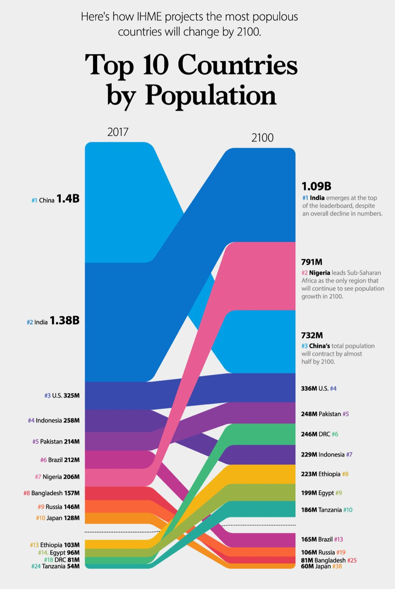

```{r setup, include=FALSE}
knitr::opts_chunk$set(fig.showtext=TRUE, out.width="100%")
```

First of all, the libraries required for plotting the graph need to be loaded, or if necessary install the packages. 

```{r}
#Libraries needed
library(tidyverse)
library(ggplot2)
library(ggalluvial)
library(showtext)
library(ggtext)
```

## Graph to replicate

{.external width="100%"}

This graph was made by Vollset SE, Goren E, Yuan W. in Fertility, mortality, migration, and population scenarios for 195 countries and territories from 2017 to 2100: a forecasting analysis for the Global Burden of Disease Study. The Lancet 2020. Published online July 14.It shows the ranking by population of the countries in two years 2017 and 2100. Besides it gives some brief insights of the three main populous countries in 2100. It is remarkable that the ranking is from 1 to 10, but 4 other countries are added (the ones which are expected to have huge growth in 20100). 

## Dataframe
As the source of the graph doesn´t provide us with the dataframe we need to create it, since all the data are in the graph is easy to do it, as it follows:

```{r}
#Create my database:
df <- read.csv("database.csv")

group_colors <- c(China = "#009ee5", India = "#0973cb", U.S = "#384aae",
                Indonesia = "#603c9c", Pakistan = "#893e9b", Brazil ="#be388f", 
                Nigeria = "#e75c93", Bangladesh = "#e53e48", Russia = "#f96439",
                Japan = "#f78c24", VIRTUAL = "#FFFFFF", Ethiopia = "#f5b314",
                Egypt = "#98b245", DRC ="#40b87b", Tanzania = "#25a99b")
```


## Graph outline
We prepare the outline of the graph, removing the axes, legend and everything that is not the lines. The lines are matched to the population, that is the reason why their width is variable. We match also the lines to the specific color of each country. We code that first line in order to use Constantia font. One of the most important facts of these lines is that the y limits are really big since they match the population, so we need to take this into account.

```{r, fig.width=8, fig.asp=1.4}
#Needed to use "Constantia" Font
#windowsFonts("Constantia" = windowsFont("Constantia"))
font_add(family = "Constantia", regular = "constan.ttf")
showtext_auto()

#Schema of the graph, data and geoms
p <- ggplot(df) +
  aes(x, y, alluvium=group, fill=group) +
  geom_alluvium(decreasing=FALSE, alpha=1, width=30, show.legend = FALSE) +
  scale_fill_manual(values = group_colors) +
  theme(legend.position = "none")+
  xlim(min(df$x) - 43, max(df$x) + 43) + 
  ylim(min(df$y) - 0.1e9, max(df$y) + 3.7e9) +
  theme_void()
p
```

## Plotting the graph: annotations, text and labels

The legend in this plot is substituted by side annotations in the right and the left with the value of the population and the ranking, a part from the country. We manually set their position, using horizontal and vertical adjustments (notice that the y axis is really big and we need to use very large numbers). As only one part of the text is modified (with bold, color or size) we use html annotation to do this. 

```{r, fig.width=8, fig.asp=1.4, preview=TRUE}
#Plotting completely the graph
p +
  geom_curve(x = 2003, y = 0.40e9, xend = 2114, yend = 0.5e9, linetype="dashed",
             color = "black", size = 0.5, angle = 20, curvature = 0) +
  #adding labels and text
  labs(title = "Here's how IHME projects the most populous \n countries will change by 2100.",
       subtitle = "Top 10 Countries \n by Population") +
  theme(text = element_text(family = "Constantia"),
        plot.subtitle = element_text(hjust = 0.5, size = 35, face = "bold"),  # Center subtitle
        plot.title = element_text(hjust = 0.5, size = 16)) +
  annotate("text", x=2025, y = max(df$y) + 3.65e9, label = "2017", size = 4) +
  annotate("text", x=2090, y = max(df$y) + 3.65e9, label = "2100", size = 4) +
  annotate("richtext", x=1988, y = 4.10e9, label = paste0(
    "<span style='color: #009ee5; '>#1</span> China ",
    "<span style='font-size: 20px '><b>1.4B</b></span>"),
    fill = NA, label.color = NA)+
  annotate("richtext", x=1988, y = 2.75e9, label = paste0(
    "<span style='color: #0973cb; '>#2</span> India ",
    "<span style='font-size: 20px '><b>1.38B</b></span>"), 
    fill = NA, label.color = NA)+
  annotate("richtext", x=1992, y = 1.90e9, label = paste0(
    "<span style='color: #384aae;font-size: 10px '>#3</span> ",
    "<span style='font-size: 10px '> U.S.<b>325M</b></span>"), 
    fill = NA, label.color = NA) +
  annotate("richtext", x=1989, y = 1.65e9, label = paste0(
    "<span style='color: #603c9c;font-size: 10px '>#4</span> ",
    "<span style='font-size: 10px '> Indonesia <b>258M</b></span>"), 
    fill = NA, label.color = NA) +
  annotate("richtext", x=1989, y = 1.40e9, label = paste0(
    "<span style='color: #893e9b;font-size: 10px '>#5</span> ",
    "<span style='font-size: 10px '> Pakistan <b>214M</b></span>"), 
    fill = NA, label.color = NA) +
  annotate("richtext", x=1991, y = 1.20e9, label = paste0(
    "<span style='color: #be388f;font-size: 10px '>#6</span> ",
    "<span style='font-size: 10px '> Brazil <b>212M</b></span>"), 
    fill = NA, label.color = NA) +
  annotate("richtext", x=1991, y = 1e9, label = paste0(
    "<span style='color: #e75c93;font-size: 10px '>#7</span> ",
    "<span style='font-size: 10px '> Nigeria <b>206M</b></span>"), 
    fill = NA, label.color = NA) +
  annotate("richtext", x=1988, y = 0.80e9, label = paste0(
    "<span style='color: #e53e48;font-size: 10px '>#8</span> ",
    "<span style='font-size: 10px '> Bangladesh <b>157M</b></span>"), 
    fill = NA, label.color = NA) +
  annotate("richtext", x=1990, y = 0.65e9, label = paste0(
    "<span style='color: #f96439;font-size: 10px '>#9</span> ",
    "<span style='font-size: 10px '> Russia <b>146M</b></span>"), 
    fill = NA, label.color = NA) +
  annotate("richtext", x=1989, y = 0.50e9, label = paste0(
    "<span style='color: #f78c24;font-size: 10px '>#10</span> ",
    "<span style='font-size: 10px '> Japan <b>128M</b></span>"), 
    fill = NA, label.color = NA) +
  annotate("richtext", x=1989, y = 0.30e9, label = paste0(
    "<span style='color: #f5b314;font-size: 10px '>#13</span> ",
    "<span style='font-size: 10px '> Ethiopia <b>103M</b></span>"), 
    fill = NA, label.color = NA) +
  annotate("richtext", x=1991, y = 0.20e9, label = paste0(
    "<span style='color: #98b245;font-size: 10px '>#14</span> ",
    "<span style='font-size: 10px '> Egypt <b>96M</b> </span>"), 
    fill = NA, label.color = NA) +
  annotate("richtext", x=1991, y = 0.10e9, label = paste0(
    "<span style='color: #40b87b;font-size: 10px '>#18</span> ",
    "<span style='font-size: 10px '> DRC <b>81M</b></span>"), 
    fill = NA, label.color = NA) +
  annotate("richtext", x=1989, y = 0, label = paste0(
    "<span style='color: #25a99b;font-size: 10px '>#24</span> ",
    "<span style='font-size: 10px '> Tanzania <b>54M</b></span>"), 
    fill = NA, label.color = NA) +
  annotate("richtext", x=2122, y = 45e8,
           label = "<span style='font-size: 14px'><b>1.09B</b></span>",
           fill = NA, label.color = NA) +
  annotate("richtext", x=2133, y = 42e8, label = paste0(
    "<span style='text-align: left; font-size: 10px'>",
    "<span style='color: #009ee5;'>#1 </span><b>India</b> ",
    "emerges at the top<br>of the leaderboard, despite<br>",
    "an overall decline in numbers.</span>"), 
    fill = NA, label.color = NA) +
  annotate("richtext", x=2121, y = 36.5e8,
           label = "<span style='font-size: 14px'><b>791M</b></span>", 
           fill = NA, label.color = NA) +
  annotate("richtext", x=2133.5, y = 33e8, label = paste0(
    "<span style='text-align: left; font-size: 10px'>",
    "<span style='color: #e75c93;'>#2 </span><b>Nigeria</b> ",
    "leads Sub-Saharan<br>Africa as the only region that<br>",
    "will continue to see population<br>growth in 2100.</span>"), 
    fill = NA, label.color = NA) +
  annotate("richtext", x=2121, y = 28e8,
           label = "<span style='font-size: 14px'><b>732M</b></span>", 
           fill = NA, label.color = NA) +
  annotate("richtext", x=2132, y = 25e8, label = paste0(
    "<span style='text-align: left; font-size: 10px'>",
    "<span style='color: #384aae;'>#3 </span><b>China's</b> ",
    "total population<br>will contract by almost<br>half by 2100.</span>"), 
    fill = NA, label.color = NA) +
  annotate("richtext", x=2124.5, y = 20.7e8, label = paste0(
    "<span style='font-size: 10px '><span><b>336M</b></span> ",
    "U.S. <span style='color: #384aae;'>#4</span></span>"), 
    fill = NA, label.color = NA) +
  annotate("richtext", x=2127, y = 18.2e8, label = paste0(
    "<span style='font-size: 10px '><span><b>248M</b></span> ",
    "Pakistan <span style='color: #893e9b;'>#5</span></span>"), 
           fill = NA, label.color = NA) +
  annotate("richtext", x=2124, y = 15.7e8, label = paste0(
    "<span style='font-size: 10px '><span><b>246M</b></span> ",
    "DRC <span style='color: #40b87b;'>#6</span></span>"), 
    fill = NA, label.color = NA) +
  annotate("richtext", x=2127, y = 13.2e8, label = paste0(
    "<span style='font-size: 10px '><span><b>229M</b></span> ",
    "Indonesia <span style='color: #603c9c;'>#7</span></span>"), 
    fill = NA, label.color = NA) +
  annotate("richtext", x=2126.5, y = 11e8, label = paste0(
    "<span style='font-size: 10px '><span><b>223M</b></span> ",
    "Ethiopia <span style='color: #f5b314;'>#8</span></span>"), 
    fill = NA, label.color = NA) +
  annotate("richtext", x=2125, y = 8.8e8, label = paste0(
    "<span style='font-size: 10px '><span><b>199M</b></span> ",
    "Egypt <span style='color: #98b245;'>#9</span></span>"), 
    fill = NA, label.color = NA) +
  annotate("richtext", x=2127.5, y = 6.8e8, label = paste0(
    "<span style='font-size: 10px '><span><b>186M</b></span> ",
    "Tanzania <span style='color: #25a99b;'>#10</span></span>"), 
    fill = NA, label.color = NA) +
  annotate("richtext", x=2125.5, y = 3.6e8, label = paste0(
    "<span style='font-size: 10px '><span><b>165M</b></span> ",
    "Brazil <span style='color: #be388f;'>#13</span></span>"), 
    fill = NA, label.color = NA) +
  annotate("richtext", x=2126, y = 2.28e8, label = paste0(
    "<span style='font-size: 10px '><span><b>106M</b></span> ",
    "Russia <span style='color: #f96439;'>#19</span></span>"), 
    fill = NA, label.color = NA) +
  annotate("richtext", x=2128, y = 10e7, label = paste0(
    "<span style='font-size: 10px '><span><b>81M</b></span> ",
    "Bangladesh <span style='color: #e53e48;'>#25</span></span>"), 
    fill = NA, label.color = NA) +
  annotate("richtext", x=2124.5, y = 5e4, label = paste0(
    "<span style='font-size: 10px '><span><b>60M</b></span> ",
    "Japan <span style='color: #f78c24;'>#38</span></span>"), 
    fill = NA, label.color = NA)
```

## Alternative graph: plotting the graph

The alternative graph is a diverging lollipop chart showing the percentage change in the population of the countries shown between 2017 and 2100. It clearly shows the difference in population from one year to the next and, moreover, how the general trend is one of population decline. 

This alternative visualisation is based on the fact that the main idea of the graph is not to show the ranking of countries in terms of population, but rather to visualise the evolution of the population between these years (2017 and 2100).  About the data we are going to use (created in the dataframe section) we must say that these are values formed from those of the previous graph, with the amount of population of 2100 and 2017 the percentage variation is calculated and from there the graph begins.

```{r}
#Create the dataset
df <- read.csv("database_alternative.csv")

# Reorder the rows of the data frame based on the variation values and establish categories
df <- df[order(df$variation), ]
df$pos_neg <- ifelse(df$variation < 0, "negative", "positive")
```

```{r, fig.width=12, fig.asp=0.6}
#Create the plot

ggplot(df, aes(x = country1, y = variation, color = group_colors)) + #basic plot
  geom_hline(yintercept = 0, color = "red", linetype = "solid", size = 2) + #to remark the 0
  geom_segment(aes(x = country1, xend = country1, y = 0, yend = variation, color = pos_neg), size = 1) + 
  geom_point(size = 8.25, shape = 21, aes(fill = pos_neg, color = pos_neg)) +
  geom_text(aes(label = variation), color = "black", hjust = 0.5, vjust = 0.5,
            size= 2, fontface = "bold.italic")+
  coord_flip() + #to change axis position
  theme(legend.position = "none",
        plot.background = element_blank(),
        panel.background = element_blank()) +
  #Adding labels and text
  labs(x= "Country") +
  labs(y = "Variation (%)") +
  labs(title = "Percentage Change in Population between 2017 and 2100", size = 20) +
  labs(subtitle = "Top 10 Countries by Population in 2017 and 2100 respectively.", size = 10) +
  annotate("text", x = 9, y = 246,
           label = "Ranking 2017 vs. 2100", fontface = "bold.italic") +
  annotate("text", x = 8, y = 246,
           label = "1. China 1.4B       1. India 1.09B",
           size = 3, fontface ="italic") +
  annotate("text", x = 7.25, y = 246,
           label = "2. India 1.38B       2. Nigeria 791M",
           size = 3, fontface ="italic") +
  annotate("text", x = 6.5, y = 250,
           label = "3. U.S. 325M        3. China 732M ",
           size = 3, fontface ="italic") +
  annotate("text", x = 6.15, y = 250,
           label = "- - - - - - - - - - - - - - -") +
  annotate("text", x = 5.7, y = 250,
           label = "8. Bangladesh 157M         8. Ethiopia 223M",
           size = 3, fontface = "italic") +
  annotate("text", x = 4.95, y = 248,
           label = "9. Russia 146M            9. Egypt 199M",
           size = 3, fontface ="italic") +
  annotate("text", x = 4.20, y = 250,
           label = "10. Japan 128M         10. Tanzania 186M",
           size = 3, fontface ="italic")
```
