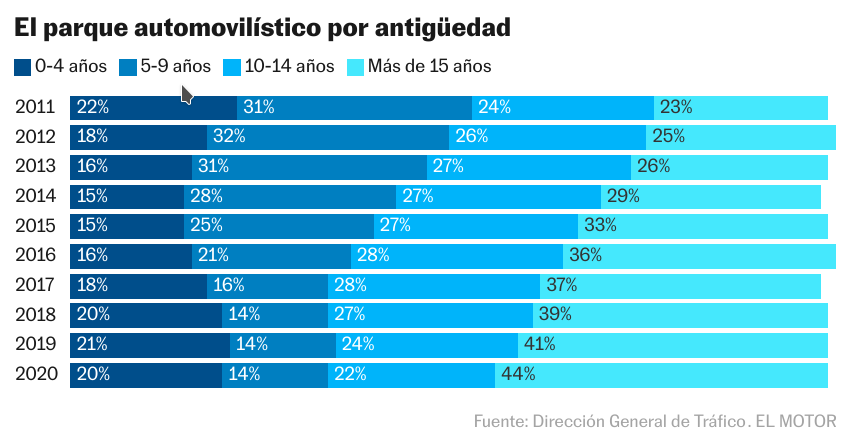

```{r setup, include=FALSE}
knitr::opts_chunk$set(out.width="100%")
```


## Loading libraries and letter type

```{r}

library(tidyverse)
library(ggplot2)
library(ggiraph)
library(showtext)
library(ggfittext)
library(dplyr)
library(patchwork)

font_add_google("Encode Sans", family = "encodesans")
font_add_google("Chivo", family = "chivo mono")
showtext_auto()

```

This graph is from an [online newspaper article](https://motor.elpais.com/actualidad/cuales-son-los-coches-que-mas-matan-en-espana/) from "El Motor" (El País).
The author talks about the higher mortality rate when older cars are involved in
the accident.

{.external width="100%"}

## Getting the data 

The data is not openly available, we should have a look at the source mentioned 
in the plot: Traffic General Direction. In this case, data needs to be 
transformed into percentages and organized in a dataframe manually.

```{r}

data <- data.frame(Año = c(2011, 2012, 2013, 2014, 2015, 2016, 2017, 2018, 2019,
                           2020),
                   "0-4 años" = c("22%", "18%", "16%", "15%", "15%", "16%", 
                                  "18%", "20%", "21%", "20%"),
                   "5-9 años" = c("31%", "32%", "31%", "28%", "25%", "21%", 
                                  "16%", "14%", "14%", "14%"),
                   "10-14 años" = c("24%", "26%", "27%", "27%", "27%", "28%", 
                                    "28%", "27%", "24%", "22%"),
                   "Más de 15 años" = c("23%", "25%", "26%", "29%", "33%", 
                                        "36%", "37%", "39%", "41%", "44%"),
                   check.names = FALSE)

mygraph <- data %>% pivot_longer(-"Año", 
                                 names_to = "Antigüedad",
                                 values_to = "Valor") 

mygraph <- mygraph %>%  mutate(Año = as.factor(Año),
                               Antigüedad = as.factor(Antigüedad),
                               Valor = as.numeric(str_sub(mygraph$Valor, 1, 2)))

mygraph <- mygraph %>% mutate(Año = fct_reorder(Año, desc(Año)),
                              Antigüedad = fct_relevel(Antigüedad, 
                                                       "Más de 15 años", 
                                                       "10-14 años", "5-9 años", 
                                                       "0-4 años"))

```

## Building the chart

### Coordinates and axes

Here we set x and y variables. We introduce "Antigüedad" to differentiate 
segments in the bar according to age of the vehicles.

```{r}

p <- mygraph %>% ggplot(aes(x=Año, y=Valor, fill=Antigüedad)) +
        geom_bar(stat="identity")

p

```

Assigning colour to each level of "Antigüedad" and flip coordinates.

```{r}

p <- p + scale_fill_manual(values=c(rgb(0.43, 0.89, 0.99), rgb(0, 0.66, 0.91), 
                                    rgb(0.02, 0.4, 0.67), rgb(0, 0.2, 0.53))) + 
         coord_flip()

p

```

### Labels and theme

Now, we label the plot, remove both axis labels and background, and organize the 
legend.

```{r}

p <- p + labs(title = "El parque automovilístico por antigüedad",
              caption = "Fuente: Dirección General de Tráfico. EL MOTOR") +
         theme(plot.title = element_text(family = "encodesans", face = "bold",
                                         size = 22),
               plot.title.position = "plot",
               plot.caption = element_text(family = "encodesans", 
                                           color = "gray", hjust = 1, 
                                           size = 14,
                                           margin = margin(20,0,0,0)),
               axis.title.x = element_blank(),
               axis.text.x = element_blank(),
               axis.ticks.x = element_blank(),
               axis.title.y = element_blank(),
               axis.text.y = element_text(family = "chivo mono", size = 20),
               axis.ticks.y = element_blank(),
               legend.position = "top",
               legend.title = element_blank(),
               legend.justification = c(-0.36,1),
               legend.text = element_text(family = "encodesans", size = 18),
               legend.key.size = unit(0.7, "cm"), 
               panel.grid.major = element_blank(),
               panel.grid.minor = element_blank(),
               panel.background = element_blank()
         ) +
         scale_x_discrete(expand = c(0,0)) + 
         scale_y_discrete(expand = c(0,0)) + 
         guides(fill = guide_legend(reverse=TRUE))

p

```

Once we have the basic structure of the plot, it is time to introduce labels 
inside each segment of the bars. This is the most tricky part, as we have to 
bear in mind several aspects:

1. To put labels inside each segment of the bars we should use geom_bar_text(). 
It is similar to geom_text() and it is contained in library(ggfittext).
2. At the time when presenting this work (January 2023) ggfittext package is in  
"maturing" lifecycle, this means that some functions are in an experimental 
phase and may suffer changes and updates.
3. In this particular case, there was not specific documentation for dealing 
with independent label color changes inside bars. So, I assigned default colors 
for "Antigüedad" and then changed them manually relating "Values" with the 
different levels of "Antigüedad".
4. geom_bar_text has a contrast option (TRUE or FALSE) which gives black or 
white color to the label based on its background. The problem that I had was 
that R assigned white labels only for the two darker blues in our plot, leaving 
"10-14 años" with black number labels.  

```{r, preview=TRUE}

p <- p + geom_bar_text(aes(label = paste0(`Valor`, "%"), colour = Antigüedad),
                           position = "stack", 
                           reflow = TRUE, 
                           place = "left",
                           family = "chivo mono",
                           size = 20) + 
         scale_colour_manual(values = c(`0-4 años` = "White", 
                                        `5-9 años` = "White", 
                                        `10-14 años` = "White", 
                                        `Más de 15 años` = "Black"), 
                             guide = "none")

p

```

## Final step: creating an interaction

To make the graph interactive I have used the package ggiraph(). Because it is 
very recent and there is not much documentation and users' feedback, it has some 
functions that are difficult to use or are not extended a lot.

The idea that ggiraph proposes is to redefine ggplot functions with the suffix 
_interactive. At the same time, key data has to be provided inside each function 
in order to ggiraph make the interaction. With this mechanism, ggiraph 
identifies which parts of the plot have to interact and adds this movement to 
the plot.

Particularly for this graph, I find the presence f interactivity very important. 
The way that information inside bars is plotted does not allow to see clearly
increases or decreases of percentages all along years (in the case of the two
central columns: "5-9 años" and "10 -14 años"). Interactivity allows the reader
to select individually these segments and makes them more easy to read.

```{r}

interactive <- ggplot(mygraph, aes(Año, Valor, fill = Antigüedad, 
                                   data_id = Antigüedad)) +
  geom_bar_interactive(stat = "identity", aes(`data-id`= Antigüedad), 
                       extra_interactive_params = "data-id") +
  scale_fill_manual_interactive(extra_interactive_params = "data-id",
                                 `data-id`= unique(mygraph$Antigüedad),
                                 values=c(rgb(0.43, 0.89, 0.99), 
                                          rgb(0, 0.66, 0.91), 
                                          rgb(0.02, 0.4, 0.67), 
                                          rgb(0, 0.2, 0.53)),
                                 guide = guide_legend_interactive(reverse=TRUE),
                                 data_id = function(breaks) as.character(breaks)) +
  coord_flip() + 
  labs(title = "El parque automovilístico por antigüedad",
       caption = "Fuente: Dirección General de Tráfico. EL MOTOR") +
  theme(plot.title = element_text(family = "encodesans", 
        face = "bold", 
        size = 22),
        plot.title.position = "plot",
        plot.caption = element_text(family = "encodesans", 
          color = "darkgray",
          face = "bold",
          size = 14,
          hjust = 1,
          margin = margin(20,0,0,0)), 
        axis.title.x = element_blank(),
        axis.text.x = element_blank(),
        axis.ticks.x = element_blank(),
        axis.title.y = element_blank(),
        axis.text.y = element_text(family = "chivo mono", size = 20), 
        axis.ticks.y = element_blank(),
        legend.position = "top",
        legend.title = element_blank(),
        legend.justification = c(-0.36,1),
        legend.text = element_text(family = "encodesans", size = 18), 
        legend.key.size = unit(0.7, "cm"), 
        panel.grid.major = element_blank(),
        panel.grid.minor = element_blank(),
        panel.background = element_blank()) +
  scale_x_discrete(expand = c(0,0)) + 
  scale_y_discrete(expand = c(0,0)) +
  guides(guide_legend_interactive(reverse=TRUE)) +
  geom_bar_text(aes(label = paste0(`Valor`, "%"),
                    colour = Antigüedad),
                    position = "stack", 
                    reflow = TRUE, 
                    place = "left",
                    family = "chivo mono",
                    size = 20) + # cambiar tipo de letra
  scale_colour_manual(values = c(`0-4 años` = "White", `5-9 años` = "White", 
                                 `10-14 años` = "White", 
                                 `Más de 15 años` = "Black"), guide = "none")

final <- girafe(ggobj = interactive,
                width_svg = 10, 
                height_svg = 6,
                options = list(
            opts_hover(css = girafe_css("stroke-width: 1; opacity: 1;")),
            opts_hover_key(css = girafe_css("stroke-width: 1; opacity: 0.6;")),
            opts_hover_inv(css = girafe_css("stroke-width: 1; opacity: 0.1;"))
               ))

final

```


## Alternative graph

The original graph has some aspects to improve that can be solved with another
type of graph. Especially, I am trying to improve readability of data and 
information organisation. 

The original graph has some problems that need to be solved. First, and most 
important, is the data itself used. As it can be visually appreciated, there are 
several bars which are longer, and others fall short. This is due to a fail in
the rounding of data: 2012 and 2016 account for 101%, and 2014 and 2017 only
reach 99%.

So, first step is to recalculate data, adjusting roundings properly. I have also
taken the opportunity to translate it into English.

```{r}

alternative <- data.frame(Year = 
               as.factor(c("2011", "2011", "2011", "2011", "2012", "2012", 
                    "2012", "2012", "2013", "2013", "2013", "2013", "2014", 
                    "2014", "2014", "2014", "2015", "2015", "2015", "2015", 
                    "2016", "2016", "2016", "2016", "2017", "2017", "2017", 
                    "2017", "2018", "2018", "2018", "2018", "2019", "2019", 
                    "2019", "2019", "2020", "2020", "2020", "2020")), 
                          Antiquity = 
               as.factor(c("0-4 years", "5-9 years", "10-14 years", 
                    "More than 15 years", "0-4 years", "5-9 years", 
                    "10-14 years", "More than 15 years", "0-4 years", 
                    "5-9 years", "10-14 years", "More than 15 years", 
                    "0-4 years", "5-9 years", "10-14 years", 
                    "More than 15 years", "0-4 years", "5-9 years", 
                    "10-14 years", "More than 15 years", "0-4 years", 
                    "5-9 years", "10-14 years", "More than 15 years", 
                    "0-4 years", "5-9 years", "10-14 years", 
                    "More than 15 years", "0-4 years", "5-9 years", 
                    "10-14 years", "More than 15 years", "0-4 years", 
                    "5-9 years", "10-14 years", "More than 15 years", 
                    "0-4 years", "5-9 years", "10-14 years", 
                    "More than 15 years")),
                           Value = c(22, 31, 24, 23, 18, 32, 26, 24, 16, 31, 27, 
                                     26, 15, 28, 27, 30, 15, 25, 27, 33, 16, 20,
                                     28, 36, 19, 16, 28, 37, 20, 14, 27, 39, 21, 
                                     14, 24, 41, 20, 14, 22, 44))

```


Then, I decided to make an alternative that allowed the reader to see the
changes all along years, which was one of the objectives that were expressed in
the news from where the original graph was taken. For this reason, firstly, I 
decided to make a simple line graph. I changed axis, so that years are shown in
the x axis and the reader can see clearly the tendency that all age groups are
following. In addition, I assigned darker colors to older age groups, instead of
what the original graph shows (going from dark to bright).

```{r, fig.showtext=TRUE}

fullgraph <- alternative %>% mutate(Antiquity = fct_relevel(Antiquity, 
                                                      "0-4 years", 
                                                      "5-9 years", 
                                                      "10-14 years", 
                                                      "More than 15 years")) %>% 
  ggplot(aes(x = Year, y = Value, group = Antiquity, color = Antiquity)) +
  geom_line(linewidth= 1.2) + 
  labs(title = "Car park by age in Spain") +
  theme_minimal() +
  theme(
    plot.title.position = "plot",
    plot.title = element_text(face = "bold"),
    legend.position = c(0.25, 0.87),
    legend.title = element_blank(),
    legend.margin = margin(c(0,8,5,5), "pt"), 
    axis.title.x = element_blank(),
    axis.ticks.x = element_blank(),
    axis.text.x = element_text(face = "bold"),
    axis.title.y = element_blank(),
    axis.text.y = element_text(face = "bold"), 
    axis.ticks.y = element_blank(),
    legend.background = element_rect(fill = "white")) +
  scale_y_continuous(labels = function(x) paste0(x, "%"), limits = c(0, 50)) +
  scale_color_manual(values=c(rgb(0.43, 0.89, 0.99), rgb(0, 0.66, 0.91), 
                              rgb(0.02, 0.4, 0.67), rgb(0, 0.2, 0.53))) +
  scale_x_discrete(expand = c(0.01, 0.05)) +
  guides(color=guide_legend(nrow=2, byrow=TRUE))

fullgraph

```

I also created facets to plot individually each group of age, in order for 
the reader to have an individual view of each of the age segments. 

```{r, fig.showtext=TRUE}

alternative2 <- alternative %>% mutate(Antiquity2 = Antiquity)

facetsalternative <- alternative %>% ggplot(aes(x = Year, 
                                                y = Value, 
                                                group = 1)) +
  geom_line(data = alternative2 %>% select(-Antiquity), aes(group = Antiquity2), 
            color = rgb(1, 0.65, 0.31), size = 0.7, alpha = 0.3) +
  ylim(0,50) +
  geom_line(aes(color = Antiquity),  size = 1.2) +
  theme(
    axis.title.x = element_blank(),
    axis.text.x = element_text(face = "bold"),
    axis.title.y = element_blank(),
    axis.text.y = element_text(face = "bold"),
    axis.ticks = element_blank(),
    panel.background = element_blank(),
    panel.grid.major = element_line(color = rgb(0.97, 0.97, 0.97)),
    panel.grid.minor = element_line(color = rgb(0.97, 0.97, 0.97)),
    legend.position = "none"
  ) +
  scale_y_continuous(labels = function(x) paste0(x, "%"), limits = c(0, 50)) +
  scale_x_discrete(expand = c(0.04, 0.04)) +
  scale_color_manual(values=c(rgb(0.43, 0.89, 0.99), rgb(0, 0.66, 0.91), 
                              rgb(0.02, 0.4, 0.67), rgb(0, 0.2, 0.53))) +
  facet_wrap(~factor(Antiquity, levels = c("0-4 years", "5-9 years", 
                                          "10-14 years", "More than 15 years")))

facetsalternative

```

With patchwork it is easy to join both graphs together.

```{r, fig.showtext=TRUE, fig.height=10}

definitive_alternative <- fullgraph / facetsalternative

definitive_alternative

```

