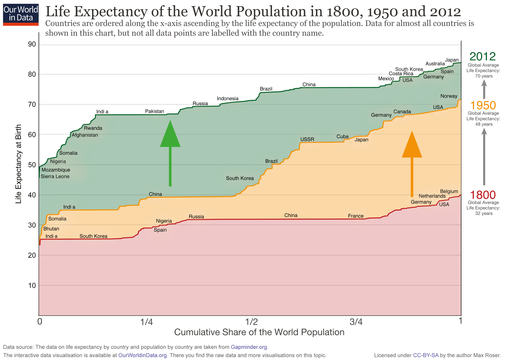

Across the world, people are leaving longer. In 1800, the average global life expectancy was 32 years. Nevertheless, by 2012 this figure had more than doubled, reaching 70 years. But when and where has this improvement in life expectancy occurred?

In order to understand such worldwide increase in longevity, we can look at the "Life Expectancy of the World Population in 1800, 1950 and 2012" chart, sourced from Our World in Data. Using information on population and life expectancy at birth from Gapminder.org, the mentioned chart shows how living standards have increased over the long run through the visualization of life expectancy evolution over the world.

{.external}

Accordingly, this post aims to replicate the provided chart, as well as to propose potential enhancements and alternatives.

## Getting and preparing the data

```{r}
library(ggplot2)
library(ggthemes)
library(ggrepel)
library(tidyverse)
library(patchwork)
library(readxl)
library(ggstream)
library(ggtext)

```

### Obtaining the data

All information used in the chart is obtained from Gapminder.org. The data consist of population and life expectancy observations, both by country and by year. Since the raw data sets contain information that will not be needed for our project, just data on life expectancy at birth, population, year and country is selected.

```{r}

pop_data <- read.csv(file = "Pop_country.csv", sep = ";") |> 
  select("Country", "Year", "Population") 

life_data <- read.csv("LifeExpect.csv", sep = ";") |> 
  select("Country", "Year", "LifeExpectAtBirth")


```

### Data transformation

Now, both life expectancy and population information can be joined by country and year into a single data set. The plot only displays information for 1800, 1950 and 2012, therefore, data are filtered according to the mentioned years.

Since the x-axis of the original plot represents the cumulative share of the world population, where countries are ordered by ascending life expectancy, some transformations are needed to compute it. This way, data are ordered by increasing life expectancy for each of the years and subsequently the cumulative share of the world population is computed.

```{r}

dataset <- inner_join(pop_data, life_data, by = c("Country", "Year")) |> 
  filter(Year %in% c("1800", "1950", "2012")) |> 
  mutate(Year = factor(Year, levels = c(2012, 1950, 1800))) |>
  drop_na() |> 
  arrange(Year, LifeExpectAtBirth) |>
  group_by(Year) |> 
  mutate(share = cumsum((as.numeric(Population)))/ sum(as.numeric(Population))) |> 
  mutate(share = round(share, digits = 5))
```

### Adjusting country data

In order to align the countries names of the data set with the way they are displayed in the labels of the plot, we need to apply some specific transformations.

```{r}

dataset <- dataset |> 
  mutate(Country = ifelse( Country == "Russia" & Year =="1950", "URSS", Country))|>
  mutate(Country = ifelse( Country == "United States", "USA", Country)) 

```

One particularity of the original plot is that for each of the years displayed, a different group of countries is highlighted. Therefore, specific lists containing the groups of countries to be labelled are created for each of the three years.

```{r}


list_2012 <- c("Sierra Leone", "Mozambique", "Nigeria", "Somalia", "Afghanistan",
               "Rwanda", "India", "Pakistan", "Russia", "Indonesia", "Brazil",
               "China", "Mexico", "Costa Rica", "South Korea", "USA", "Australia",
               "Germany", "Spain", "Japan") 

list_1950 <- c("Bhutan", "Somalia", "India", "China","South Korea", "Brazil",
               "URSS", "Cuba", "Japan", "Germany", "Canada", "USA", "Norway") 

list_1800 <- c("India", "South Korea", "Nigeria", "Spain", "Russia", "China",
               "France", "Germany", "Netherlands", "Belgium", "USA") 

```

In line with the lists above, an additional column is included in the data set to indicate whether the country should be labelled or not.

```{r}

dataset <- dataset |> 
  mutate(label = 
           ifelse( (Country %in% list_2012 & Year == "2012") | 
                   (Country %in% list_1950 & Year == "1950") | 
                   (Country %in% list_1800 & Year == "1800"), "Yes", "No")) 

```

### Preliminary adjustments

Before starting to build the graph, we can work on some preliminary steps, that will be applied not only to the replication chart, but also to the enhanced and alternative versions, which will allow us to keep the code cleaner. This way, we create several character vectors containing the caption and the right side notes to be included later in the plot.

```{r}

subtitle_text <-str_wrap(
      "Countries are ordered along the x-axis ascending by the life expectancy of the population. Data for almost all countries is shown in this chart, but not all data points are labelled with the country name.", 
      width =124)
caption_text = paste(
  "Data Source: The data on life expectancy by country and population are taken from Gapminder.org.",
  "The interactive data viusalization is available at OurWolrdData.org. There you find the raw data and more viusalizations on this topic.                                                          Licensed under CC-BY-SA by the author Max Roser.", 
  sep="\n")

caption_2012 <- paste(" Global Average", "Life Expectancy:", "      70 years", sep= "\n") 

caption_1950 <- paste(" Global Average", "Life Expectancy:", "      48 years", sep= "\n") 

caption_1800 <- paste(" Global Average", "Life Expectancy:", "      32 years", sep= "\n")  

```

After these steps, our data set is ready in order to start with the creation of the plot.

## Create Graph

### Initial elements

To begin, the chart is plotted using geom_line() and geom_area(), enabling the representation of life expectancy in stacked areas for each of the years. To match the plot with the original graph's palette, two vectors are created, one containing the specific colors to fulfill the areas, and other to draw the lines.

To adjust the scale of the plot and stick as much as possible to the shape of the original plot, breaks in the axes are manually introduced along with th axis labels. However, later on, we will need to include some annotations in the right side of the plot. Therefore, the x-limits are set beyond 1 to create additional space.

```{r fig.height = 5, fig.width = 7, fig.align = "center", fig.showtext = TRUE}

area_color <- c("#84A98C", "#FFD399","#FFCAD3") 
line_color <- c("#238B45", "#ff6900", "#99000d") 

plot <- 
  ggplot(dataset, 
         aes(x = share, y = LifeExpectAtBirth,
             label= as.factor(Year), 
             color = as.factor(Year))) +
  geom_line() +
  geom_area(aes(fill = as.factor(Year)), 
            position = position_dodge(width = 0), 
            alpha = 0.8) +
  scale_fill_manual(values = area_color) +
  scale_color_manual(values = line_color) +
  scale_x_continuous(
    breaks = c(0.0, 0.25, 0.5, 0.75, 1), 
    labels = c("0", "1/4", "1/2", "3/4", "1"),
    expand = c(0, 0),
    limits = c(0, 1.1)) +
  scale_y_continuous(
    breaks = seq(0, 90, by = 10), 
    labels = c("","10","20", "30", "40", "50", "60", "70", "80", "90"),
    expand=c(0,0),
    limits = c(0, 95)) +
  guides(color = FALSE, fill = FALSE)

plot  

```

### Managing labels

Our next step is to include the labels of the countries for each year along the x-axis. To achieve this, we consider the subset formed by those countries with "Yes" in the label column.

Since the plot involves a large number of labels inside the graph, geom_text_repel() is used to adjust the position of the countries and minimize overlap. Another advantage is that it allows for constraining the labels within specified limits, avoiding them from extending beyond the graph.

```{r fig.height = 5, fig.width = 7, fig.align = "center"}

plot <- 
  plot + 
  geom_text_repel(data = subset(dataset, label == "Yes"), aes(label = Country),
                  xlim = c(0, 1),
                  nudge_y = 0.05,  
                  max.overlaps = 10, 
                  colour = "black",
                  size = 2, 
                  segment.size = 0, 
                  segment.color = NA) 
  

plot
```

### Appearance adjustments

We proceed by adding the corresponding title, subtitle and caption to the plot, as well as adjusting the graph appearance, where the font used is "Playfair Display", downloadable from Google Fonts.

```{r fig.height = 5, fig.width = 7, fig.align = "center", fig.showtext = TRUE}

sysfonts::font_add_google("Playfair Display") 

plot <- plot +
   labs(
    title = "Life Expectancy of the World population in 1800, 1950 and 2012",
    subtitle = subtitle_text,
    caption = caption_text,
    x = "Cumulative Share of the World Population",
    y = "Life Expectancy At Birth")


```

Until now, the panel grid extended beyond our chart due to the larger x-limits we have set. To address this, the grid is removed and the background is set transparent, since, later on, we will manually add horizontal segments specifically adjusted to the established. Accordingly, we just include a vertical black line to represent the y-axis.

```{r fig.height = 5, fig.width = 7, fig.align = "center", fig.showtext = TRUE}


plot <- plot + 
  theme(
    axis.line.y = element_line(colour = "black", linewidth = 0.05),  
    axis.line.x = element_blank(),
    plot.background = element_rect(fill = "white"),
    panel.background = element_rect(fill  = "white"),
    panel.grid.major.y = element_blank(),
    panel.grid.minor.y = element_blank(),
    panel.grid.major.x = element_blank(),
    panel.grid.minor.x = element_blank(),
    axis.ticks = element_blank(),
    plot.title = element_text(size = 15, family = "Playfair Display", margin = margin(b=-2, t = -1), vjust = 2.6),
    plot.subtitle = element_text(size = 8, family = "Playfair Display", lineheight = 1, color = "#525252"),
    plot.caption = element_text(size = 5, hjust = 0, vjust = -1, color = "#525252",lineheight = 0.8),
    plot.caption.position = "plot",
    axis.title.x = element_text(size = 10, margin = margin(t = 5)),
    axis.title.y = element_text(size = 8, margin = margin(r = 8), vjust = 0.05),
    axis.text.x = element_text(size = 9, color = "black"), 
    axis.text.y = element_text(size = 6, color = "black"),
    plot.margin= margin(t = 10, r = 3, b = 10, l = 6))


plot


```

### Annotations, background segments and arrows

The last step is to work on the annotations, the background grid and the arrows.

Once the background of the plot has been removed, independent segments are manually included in the background as a substitute of the grid in order to stick to the aesthetics of the original graph.

```{r fig.height = 5, fig.width = 7, fig.align = "center", fig.showtext = TRUE}


#include background lines

plot <- plot +
  annotate("segment", x=1, xend = 1, y=0, yend=93,  
           color = "black",linewidth = 0.05, alpha= 1) +
  annotate("segment", x=0, xend = 1, y=10, yend=10, 
           color = "#969696",linewidth = 0.001, alpha= 0.4) +
  annotate("segment", x=0, xend = 1, y=20, yend=20, 
           color = "#969696", linewidth = 0.001, alpha= 0.4)+
  annotate("segment",x=0, xend = 1, y=30, yend=30, 
           color = "#969696", linewidth = 0.001, alpha= 0.4) +
  annotate("segment", x=0, xend = 1, y=40, yend=40, 
           color = "#666666", linewidth = 0.002, alpha= 0.4) +
  annotate("segment", x=0, xend = 1, y=50, yend=50, 
           color = "#969696", linewidth = 0.001, alpha= 0.4) +
  annotate("segment", x=0, xend = 1, y=60, yend=60, 
           color = "#969696", linewidth = 0.001, alpha= 0.4) +
  annotate("segment", x=0, xend = 1, y=70, yend=70, 
           color = "#969696", linewidth = 0.001, alpha= 0.4)+
  annotate("segment", x=0, xend = 1, y=80, yend=80, 
           color = "#969696", linewidth = 0.001, alpha= 0.4) +
  annotate("segment", x=0, xend = 1, y=90, yend=90, 
           color = "#969696", linewidth = 0.001, alpha= 0.4)+
  annotate("segment", x=0, xend = 1, y=0, yend=0, 
           color = "black", linewidth = 0.05, alpha= 1)


```

Now we include the right margin notes specifying the global average life expectancy and the corresponding year.

```{r fig.height = 5, fig.width = 7, fig.align = "center", fig.showtext = TRUE}

note_2012 <- paste(" Global Average", "Life Expectancy:", 
                   "      70 years", sep= "\n") 

note_1950 <- paste(" Global Average", "Life Expectancy:", 
                   "      48 years", sep= "\n") 

note_1800 <- paste(" Global Average", "Life Expectancy:", 
                   "      32 years", sep= "\n")  

plot <- plot +
  annotate("text", x = 1.018, y = 86,
           label = "2012",
           hjust=0,
           size=5,
           color="#005824") +
    annotate("text", x = 1.013, y = 81,
           label = caption_2012,
           hjust=0,
           size=1.5,
           lineheight=1,
           color="#525252") +
   annotate("text", x = 1.018, y = 67,
           label = "1950",
           hjust=0,
           size=5,
           color="#ffa600") +
  annotate("text", x = 1.013, y = 62,
           label = caption_1950,
           hjust=0,
           size=1.5,
           lineheight=1,
           color="#525252") +
   annotate("text", x = 1.018, y = 40,
           label = "1800",
           hjust=0,
           size=5,
           color="#99000d") +
  annotate("text", x = 1.013, y = 35,
           label = caption_1800,
           hjust=0,
           size=1.5,
           lineheight=1,
           color="#525252")
```

Lastly, geom_segment() is used to include the two big arrows inside the graph, as well as the two arrows between the notes of the right margin.

```{r fig.height = 5, fig.width = 7, fig.align = "center", fig.showtext = TRUE, preview=TRUE}

plot <-
  plot +
  geom_segment(x = 1.05, y = 70,
             xend = 1.05, yend = 77, 
             linewidth = 0.6,
             color = "#737373", 
             arrow=arrow(type = "closed", angle = 22, length= unit(0.2, "cm"))) +
  geom_segment(x = 1.052, y = 43,
               xend = 1.052, yend = 58, linewidth = 0.6,
               color = "#737373", 
               arrow=arrow(type = "closed", angle = 22, length= unit(0.2, "cm"))) +
  geom_segment(x = 0.9, y = 41,
               xend = 0.9, yend = 61,linewidth = 1.4,
               color = "#e68600",
               arrow=arrow(type = "closed", angle = 22, length= unit(0.9, "cm"))) +
  geom_segment(x = 0.3, y = 44,
               xend = 0.3, yend = 64,linewidth = 1.4,
               color = "#38B200", 
               arrow=arrow(type = "closed", angle = 22, length= unit(0.9, "cm"))) 

plot


```

## Enhancement and alternative graphs

### Enhanced graph

One of the inconsistencies I found in the original graph is that the setting of the labels does not follow a fixed criterion, since different groups of countries are labelled for each of the years – some countries appear in the three different years, while other just appear once. Consequently, my first proposal in an enhanced plot based on the replication of the original plus an additional small modification, in which the same group of countries is highlighted in each line, which makes the plot more coherent

To achieve this, a common list for the three countries is created, which subsequently will be used to subset the data when using geom_text_repel. The remaining code is kept as in the replication section.

```{r fig.height = 5, fig.width = 7, fig.align = "center", fig.showtext = TRUE}

list_improved <- c("Mozambique", "Nigeria", "Pakistan", "India", "USA", "Spain",
                   "China", "Mexico", "Brazil", "Cuba", "Japan", "Belgium", "Norway")

dataset <- dataset |> 
  mutate(label_improved = 
           ifelse((Country %in% list_improved), "Yes", "No")) 


plot2 <- 
  ggplot(dataset, 
         aes(x = share, y = LifeExpectAtBirth,
             label= as.factor(Year), 
             color = as.factor(Year))) +
  geom_line() +
  geom_area(
    aes(fill = as.factor(Year)), 
    position = position_dodge(width = 0), 
    alpha = 0.9
    ) +  
  geom_text_repel(
    data = subset(dataset, label_improved == "Yes"),
    aes(label = Country), 
    xlim = c(0, 1),
                  nudge_x = 0.01,  
                  max.overlaps = 10, 
                  colour = "black",
                  size = 2, 
                  segment.size = 0, 
                  segment.color = NA) +
  guides(color = FALSE, fill = FALSE) +
  scale_fill_manual(values = area_color) +
  scale_color_manual(values = line_color) +
  scale_x_continuous(
    breaks = c(0.0, 0.25, 0.5, 0.75, 1), 
    labels = c("0", "1/4", "1/2", "3/4", "1"),
    expand = c(0, 0),
    limits = c(0, 1.1)
   )+
  scale_y_continuous(
    breaks = seq(0, 90, by = 10), 
    labels = c("","10","20", "30", "40", "50", "60", "70", "80", "90"),
    expand=c(0,0),
    limits = c(0, 95)) +
   labs(
    title = "Life Expectancy of the World population in 1800, 1950 and 2012",
    subtitle = subtitle_text,
    caption = caption_text,
    x = "Cumulative Share of the World Population",
    y = "Life Expectancy At Birth") +
  theme(
    axis.line.y = element_line(colour = "black", linewidth = 0.05),  
    axis.line.x = element_blank(),
    plot.background = element_rect(fill = "white"),
    panel.background = element_rect(fill  = "white"),
    panel.grid.major.y = element_blank(),
    panel.grid.minor.y = element_blank(),
    panel.grid.major.x = element_blank(),
    panel.grid.minor.x = element_blank(),
    axis.ticks = element_blank(),
    plot.title = element_text(size = 16, family = "Playfair Display", margin = margin(b=-2, t = -1), vjust = 2.6),
    plot.subtitle = element_text(size = 8, family = "Playfair Display", lineheight = 1, color = "#525252"),
    plot.caption = element_text(size = 5, hjust = 0, vjust = -1, color = "#525252",lineheight = 0.8),
    plot.caption.position = "plot",
    axis.title.x = element_text(size = 10, margin = margin(t = 5)),
    axis.title.y = element_text(size = 8, margin = margin(r = 8), vjust = 0.05),
    axis.text.x = element_text(size = 9, color = "black"), 
    axis.text.y = element_text(size = 6, color = "black"),
    plot.margin= margin(t = 10, r = 3, b = 10, l = 3)) 

plot2 <- plot2 +
  annotate("segment", x=1, xend = 1, y=0, yend=93,  
           color = "black",linewidth = 0.05, alpha= 1) +
  annotate("segment", x=0, xend = 1, y=10, yend=10, 
           color = "#969696",linewidth = 0.001, alpha= 0.4) +
  annotate("segment", x=0, xend = 1, y=20, yend=20, 
           color = "#969696", linewidth = 0.001, alpha= 0.4)+
  annotate("segment",x=0, xend = 1, y=30, yend=30, 
           color = "#969696", linewidth = 0.001, alpha= 0.4) +
  annotate("segment", x=0, xend = 1, y=40, yend=40, 
           color = "#666666", linewidth = 0.002, alpha= 0.4) +
  annotate("segment", x=0, xend = 1, y=50, yend=50, 
           color = "#969696", linewidth = 0.001, alpha= 0.4) +
  annotate("segment", x=0, xend = 1, y=60, yend=60, 
           color = "#969696", linewidth = 0.001, alpha= 0.4) +
  annotate("segment", x=0, xend = 1, y=70, yend=70, 
           color = "#969696", linewidth = 0.001, alpha= 0.4)+
  annotate("segment", x=0, xend = 1, y=80, yend=80, 
           color = "#969696", linewidth = 0.001, alpha= 0.4) +
  annotate("segment", x=0, xend = 1, y=90, yend=90, 
           color = "#969696", linewidth = 0.001, alpha= 0.4)+
   annotate("segment", x=0, xend = 1, y=0, yend=0, 
           color = "black", linewidth = 0.05, alpha= 1)

plot2 <- plot2 +
 annotate("text", x = 1.018, y = 86,
           label = "2012",
           hjust=0,
           size=5,
           color="#005824") +
    annotate("text", x = 1.013, y = 81,
           label = caption_2012,
           hjust=0,
           size=1.5,
           lineheight=1,
           color="#525252") +
   annotate("text", x = 1.018, y = 67,
           label = "1950",
           hjust=0,
           size=5,
           color="#ffa600") +
  annotate("text", x = 1.013, y = 62,
           label = caption_1950,
           hjust=0,
           size=1.5,
           lineheight=1,
           color="#525252") +
   annotate("text", x = 1.018, y = 40,
           label = "1800",
           hjust=0,
           size=5,
           color="#99000d") +
  annotate("text", x = 1.013, y = 35,
           label = caption_1800,
           hjust=0,
           size=1.5,
           lineheight=1,
           color="#525252") 

plot2 <- plot2 +

  geom_segment(x = 1.046, y = 70,
             xend = 1.046, yend = 77, 
             linewidth = 0.6,
             color = "#737373", 
             arrow=arrow(type = "closed", angle = 22, length= unit(0.2, "cm"))) +
  geom_segment(x = 1.046, y = 43,
               xend = 1.046, yend = 58, linewidth = 0.6,
               color = "#737373", 
               arrow=arrow(type = "closed", angle = 22, length= unit(0.2, "cm"))) +
  geom_segment(x = 0.9, y = 41,
               xend = 0.9, yend = 61,linewidth = 1.4,
               color = "#e68600",
               arrow=arrow(type = "closed", angle = 22, length= unit(0.9, "cm"))) +
  geom_segment(x = 0.3, y = 44,
               xend = 0.3, yend = 64,linewidth = 1.4,
               color = "#38B200", 
               arrow=arrow(type = "closed", angle = 22, length= unit(0.9, "cm"))) 

plot2


```

### Alternative graph

The alternative proposed is an entirely new plot that represents the same information from another perspective. This new proposal aims to make the plot simpler, making it more understandable.

Additionally, information regarding the world region to which each country belongs is included, providing a more comprehensive plot and allowing the identification of potential patterns between areas. Also, with this kind of chart, by observing the slopes, we can observe the level of inequality across countries for each year in terms of living standards and life expectancy. For instance, in 1950, we observe a steep slope, meaning that there was a high inequality between countries, despite life expectancy levels were higher than in 1800.

In order to create the proposal, the chart is plotted using geom_jitter() along with faced_grid(), therefore, an independent subplot is displayed for each of the years, where countries are represented by the data points.

```{r fig.height = 5, fig.width = 8, fig.align = "center", fig.showtext = TRUE}

colors_faced <- c("orange", "#7570b3","#7fc97f", "#43a2ca")

data_regions <- read.csv(file = "Geographies.csv", sep = ";") |> 
  select("name", "four_regions")

data <- full_join(dataset, data_regions, by = c("Country"="name")) |> 
  drop_na() |> 
  mutate(Year_f = factor(Year, levels = c("1800", "1950", "2012")))

unique_regions <- unique(data$four_regions)

plot3 <-
  ggplot(
    data, 
    aes(x=share,y=LifeExpectAtBirth, 
        color = as.factor(four_regions), 
        group = Year_f)
    ) +
  geom_jitter(
    data= data,
    position = position_jitter(width = 0.3), 
    alpha = 0.8
    ) +
  scale_color_manual(values = colors_faced)  +
  facet_grid(~Year_f) 

```

By using geom \_smooth(), a curve is added to the data points, whose slope serves as an indicator of he inequality in terms of life expectancy across countries.

```{r fig.height = 5, fig.width = 8, fig.align = "center", fig.showtext = TRUE}

plot3 <- plot3 + geom_smooth(method = "lm", se = TRUE, 
              formula = y ~ x, 
              color = "darkgrey",linewidth = 0.001, linetype = "dashed") 

plot3
```

Now, we work on the scale adjustments and set the appearance setting.

```{r fig.height = 5, fig.width = 8, fig.align = "center", fig.showtext = TRUE}

plot3 <- plot3 +
  scale_x_continuous(
    breaks = c(0, 0.25, 0.5, 0.75, 1),
    labels = c("0", "1/4", "1/2", "3/4", "1"),
    expand = c(0, 0),
    limits = c(0, 1))+
  scale_y_continuous(
    breaks = seq(0, 100, by = 20),
    labels = c("","20","40", "60", "80", "100"),
    expand=c(0,0),
    limits = c(0, 100)) +
  labs(
    title = "Life Expectancy of the World population in 1800, 1950 and 2012",
    subtitle = "Countries are ordered along the x-axis ascending by the life expectancy of the population.",
    caption = "Data Source: The data on life expectancy by country and population are taken from Gapminder.org.",
    x = "Cumulative Share of the World Population",
    y = "Life Expectancy At Birth") +
  theme(
    plot.background = element_rect(fill = "transparent"),
    panel.background = element_rect(fill  = "#F0F0F0"),
    strip.text.x = element_text(size = 10, face = "bold"),
    panel.grid.major.x = element_line(color = "white", linewidth = 0.0000001),
    panel.grid.minor.y = element_blank(),
    panel.grid.minor.x = element_blank(),
    panel.grid.major.y = element_line(color = "white", linewidth = 0.0000001),
    plot.title = element_text(size = 14, family = "Playfair Display", margin = margin(b=-2, t = -1), vjust = 2.6),
    plot.subtitle = element_text(size = 8, family = "Playfair Display", lineheight = 0.5, color = "#525252"),
    plot.caption = element_text(size = 6, hjust = 0, vjust = -0.5, color = "#737373"),
    plot.caption.position = "plot",
    axis.title.x = element_text(size = 10, margin = margin(t = 10)),
    axis.title.y = element_text(size = 10, margin = margin(r = 8)),
    panel.spacing = unit(0.5, "cm"),
    legend.text=element_text(size=8,family = "Playfair Display"),
    legend.position = "right",
    legend.title = element_blank(),
    legend.key = element_blank(),
    legend.key.height = unit(0.5, "cm"),
    plot.margin= margin(t = 10, r = 10, b = 10, l = 5))


plot3
```

Finally, following the same procedure as in the previous graphs, we create an specific list containing the countries to be highlighted and subsequently, such information is included in a new column in the data set, that will allows us to create a subset when applying geom_text_repel().

```{r fig.height = 5, fig.width = 8, fig.align = "center", fig.showtext = TRUE}

list_alternative <- c("Mozambique", "India", "Pakistan", "USA", "Spain", "China", "Mexico", "Brazil", "Cuba")

data <- data |> 
  mutate(label_alternative = 
           ifelse((Country %in% list_alternative), "Yes", "No"))

plot3 <- plot3 +
   geom_text_repel(
     data = subset(data, label_alternative == "Yes"), 
     aes(label = Country), 
     xlim = c(0, 1),max.overlaps = 50,
     nudge_y = 0.05, nudge_x = -0.01, 
     colour = "black",size = 2, 
     segment.size = 0, 
     segment.color = NA)  
plot3
```

The final step is to include the annotations indicating the average global life expectancy for each of the years. In order to place the notes inside each of the subplots, a data frame is created, in which the position along the y- and x-axis is specified. Subsequently, geom_text() is used to include such notes in our final plot.

```{r fig.height = 5, fig.width = 8, fig.align = "center", fig.showtext = TRUE}


data_text <- data.frame(
  Year_f = c(1800, 1950, 2012),
  label = c(caption_1800, caption_1950, caption_2012),
  x  = c(0.35, 0.35, 0.35),
  y = c(92, 92, 92))


plot3 <- plot3 +
  geom_text(
    data = data_text,
    aes(x = x, y = y,label = label), lineheight = 1,
    hjust = 0, size = 2, color = "black")


plot3
```
