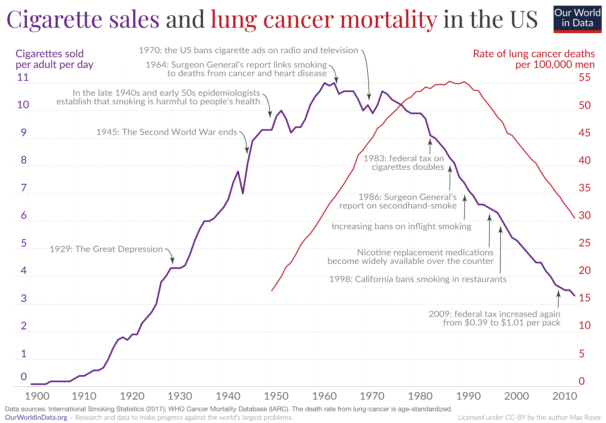

## Introduction and Motivation

The selected chart from Our World in Data explains the relationship that may exist between daily cigarette sales per adult and the lung cancer death rate per 100,000 men in the United States.

The consumption of cigarettes significantly increased in wealthy countries, including the United States, in the early 20th century. Similarly, lung cancer trends closely mirror those of smoking, although with a delay. We can observe how, from the second half of the 20th century, possibly reaching its peak, until now, the daily sales of cigarettes and the lung cancer death rate attributed to smoking have significantly decreased. Finally, the choice of this chart was driven by my concern for global health, aiming to investigate risk factors that significantly impact health and may even cause the death of millions of people.

{.external}

## Replication work

### Load the main files

```{r}
csv_file <- read.csv("sales-of-cigarettes-per-adult-per-day.csv")
csv_file2 <- read.csv("lung-cancer-deaths-per-100000-by-sex-1950-2002.csv")

```

### Load the libraries

```{r}
library(dplyr)
library(ggplot2)
library(ggtext)

```

### Data Generating Process

In order to carry out the replication process, I will clean the two databases, taking into account numerous variables such as entity (in this case, the country is the United States), year (ranging from 1900 to 2017), sales_cig (representing daily cigarette sales per adult), and age_males_death (indicating the rate of deaths in men attributed to lung cancer).

```{r}
sales <- data.frame(csv_file[1:2767, 1:4]) # Data Frame (rectangular data structures)
sales_daily <- sales |> filter(Entity == "United States") |> 
  rename(sales_cig = Sales.of.cigarettes.per.adult.per.day..International.Smoking.Statistics..2017..,
         entity = Entity, year = Year) |> 
  select(entity, year, sales_cig)

cancer <- data.frame(csv_file2[1:4572, 1:5])
cancer_deaths <- cancer |> filter(Entity == "United States") |> 
  rename(age_males_death = age.standardized_death_rate_per_100k_male,
         entity = Entity, year = Year) |> 
  select(entity, year, age_males_death)

```

### Setting the individual axes, coordinates and scales

```{r}
p <- ggplot(sales_daily) +
  aes(year, sales_cig)
p

q <- ggplot(cancer_deaths) +
  aes(year, age_males_death)
q

```

### Performing simple linear graphs

With ggplot, we can create a line chart using the sales_daily database, plotting the year on the x-axis and sales_cig on the y-axis, without any explanatory legend. The same approach is applied to ages_males_death using the cancer_deaths database.

```{r}
p <- ggplot(sales_daily) +
  aes(year, sales_cig) +
  geom_line(aes(color = "#800080")) +
  theme(legend.position = "none")
p

q <- ggplot(cancer_deaths) +
  aes(year, age_males_death) +
  geom_line(aes(color = "#CC0000")) +
  theme(legend.position = "none")
q

```

### Establishing the axes, coordinates and scales

```{r fig.height=6.5, fig.width=7}
cross_chart <- ggplot() +
  theme_minimal() +
  coord_cartesian(clip = "off") +
  scale_x_continuous(
    expand = c(0, 0), limits = c(1900, 2015), breaks = seq(1900, 2010, by = 10)) +
  theme(axis.text.y = element_blank(),
        axis.text.y.right = element_blank()) +
  annotate(
    "text",
    x = -Inf, y = 0,
    label = "0",
    vjust = -0.5, hjust = 0, size = 6,
  ) +
  annotate(
    "text",
    x = -Inf, y = 1,
    label = "1",
    vjust = -0.5, hjust = 0, size = 6,
  ) +
  annotate(
    "text",
    x = -Inf, y = 2,
    label = "2",
    vjust = -0.5, hjust = 0, size = 6,
  ) +
  annotate(
    "text",
    x = -Inf, y = 3,
    label = "3",
    vjust = -0.5, hjust = 0, size = 6,
  ) +
  annotate(
    "text",
    x = -Inf, y = 4,
    label = "4",
    vjust = -0.5, hjust = 0, size = 6,
  ) +
  annotate(
    "text",
    x = -Inf, y = 5,
    label = "5",
    vjust = -0.5, hjust = 0, size = 6,
  ) +
  annotate(
    "text",
    x = -Inf, y = 6,
    label = "6",
    vjust = -0.5, hjust = 0, size = 6,
  ) +
  annotate(
    "text",
    x = -Inf, y = 7,
    label = "7",
    vjust = -0.5, hjust = 0, size = 6,
  ) +
  annotate(
    "text",
    x = -Inf, y = 8,
    label = "8",
    vjust = -0.5, hjust = 0, size = 6,
  ) +
  annotate(
    "text",
    x = -Inf, y = 9,
    label = "9",
    vjust = -0.5, hjust = 0, size = 6,
  ) +
  annotate(
    "text",
    x = -Inf, y = 10,
    label = "10",
    vjust = -0.5, hjust = 0, size = 6,
  ) +
  annotate(
    "text",
    x = -Inf, y = 11,
    label = "11",
    vjust = -0.5, hjust = 0, size = 6,
  ) +
  annotate(
    "text",
    x = Inf, y = 0,
    label = "0",
    vjust = -0.5, hjust = 1, size = 6,
  ) +
  annotate(
    "text",
    x = Inf, y = 1,
    label = "5",
    vjust = -0.5, hjust = 1, size = 6,
  ) +
  annotate(
    "text",
    x = Inf, y = 2,
    label = "10",
    vjust = -0.5, hjust = 1, size = 6,
  ) +
  annotate(
    "text",
    x = Inf, y = 3,
    label = "15",
    vjust = -0.5, hjust = 1, size = 6,
  ) +
  annotate(
    "text",
    x = Inf, y = 4,
    label = "20",
    vjust = -0.5, hjust = 1, size = 6,
  ) +
  annotate(
    "text",
    x = Inf, y = 5,
    label = "25",
    vjust = -0.5, hjust = 1, size = 6,
  ) +
  annotate(
    "text",
    x = Inf, y = 6,
    label = "30",
    vjust = -0.5, hjust = 1, size = 6,
  ) +
  annotate(
    "text",
    x = Inf, y = 7,
    label = "35",
    vjust = -0.5, hjust = 1, size = 6,
  ) +
  annotate(
    "text",
    x = Inf, y = 8,
    label = "40",
    vjust = -0.5, hjust = 1, size = 6,
  ) +
  annotate(
    "text",
    x = Inf, y = 9,
    label = "45",
    vjust = -0.5, hjust = 1, size = 6,
  ) +
  annotate(
    "text",
    x = Inf, y = 10,
    label = "50",
    vjust = -0.5, hjust = 1, size = 6,
  ) +
  annotate(
    "text",
    x = Inf, y = 11,
    label = "55",
    vjust = -0.5, hjust = 1, size = 6
  )
cross_chart

```

### Rescaling of age_males_death variable

```{r}
new_min <- 19.56
new_max <- 55
age_males_death <- cancer_deaths$age_males_death
old_min <- min(age_males_death)
old_max <- max(age_males_death)
age_males_death <- (((age_males_death-old_min) / (old_max - old_min))
                    * (new_max - new_min)) + new_min
cancer_deaths$age_males_death <- age_males_death

```

### Intersecting charts and filtering the data

To overlay the line charts, we scale them by dividing the maximum value of sales_cig and age_males_death. As we can observe, there is a small peak in the raw data, specifically in the series representing cigarette sales, indicating that the authors who generated this graph likely underwent some standardization process to address it.

```{r}
scale <- max(sales_daily$sales_cig)/
  max(cancer_deaths$age_males_death)

cancer_deaths <- cancer_deaths |> 
  mutate(age_males_death = if_else(year >= 2016, NA, age_males_death))

cross_chart <- ggplot() +
  geom_line(
    data = sales_daily,
    aes(x = year, y = sales_cig, color = "Sales of Cigarettes"),
    size = 1
  ) +
  geom_line(
    data = cancer_deaths,
    aes(x = year, y = age_males_death * scale, color = "Cancer Deaths"),
    size = 1
  ) +
  labs(
    title = "Cigarette sales and lung cancer mortality in the US",
    x = "Year",
    y = "Cigarettes sold per adult per day"
  ) +
  scale_color_manual(
    values = c("Sales of Cigarettes" = "#800080", 
               "Cancer Deaths" = "#CC0000")
  ) +
  scale_y_continuous(
    sec.axis = sec_axis(
      ~./scale,
      breaks = seq(0, 55, by = 5),
      name = "Rate of lung cancer deaths per 100,000 men",
      labels = scales::number_format()
    ),
    breaks = seq(min(0), max(11), by = 1)
  ) +
  theme_minimal() +
  theme(legend.position = "none")
cross_chart

```

### Selecting the suitable font style

```{r}
sysfonts::font_add_google("Playfair Display", family="font_title")
sysfonts::font_add_google("Lato", family="font_y_axis")
showtext::showtext_auto()

```

### Modifying the appearance of the axes by altering the color and size of their titles

To change the color of specific words in the title, we use the command span style, followed by theme(plot.title = element_markdown). To eliminate the distance between the first value on the x-axis and the origin, I use scale_x_continuous(expand = c(0, 0)). This setting removes the padding or expansion on the x-axis. Additionally, theme_minimal() is employed to eliminate non-essential elements in the plot, creating a clean and simple design. The breaks command is used to display numbers on each axis at intervals of 1, 5, or 10. Sec_axis is employed to align the second y-axis (on the right) to a scale that approximates the first y-axis (on the left). Finally, annotate is used to place the axis titles at the top left and top right.

```{r fig.height=6, fig.width=9}
cross_chart <- ggplot() +
  geom_line(
    data = sales_daily,
    aes(x = year, y = sales_cig, color = "Sales of Cigarettes"),
    size = 1
  ) +
  geom_line(
    data = cancer_deaths,
    aes(x = year, y = age_males_death * scale, 
        color = "Cancer Deaths"),
    size = 1
  ) +
  labs(
    title = "<span style='color:#800080'>Cigarette sales</span> <span style='color:black'>and</span> <span style='color:#CC0000'>lung cancer mortality</span> <span style='color:black'>in the US</span>",
    x = "",
    y = "",
    caption = "Data sources: International Smoking Statistics (2017): WHO Cancer Mortality Database (IARC). The death rate from lung-cancer is age-standardized."
  ) +
  scale_color_manual(
    values = c("Sales of Cigarettes" = "#800080", 
               "Cancer Deaths" = "#CC0000")
  ) +
  scale_y_continuous(
    sec.axis = sec_axis(
      ~./scale,
      breaks = seq(0, 55, by = 5),
      name = "",
      labels = scales::number_format()
    ),
    breaks = seq(min(0), max(11), by = 1)
  ) +
  scale_x_continuous(
    expand = c(0, 0),
    limits = c(1900, 2018),
    breaks = seq(1900, 2010, by = 10)
  ) +
  theme_minimal() +
  theme(
    legend.position = "none",
    plot.title = element_text(
      color = "#800080",
      hjust = 0,
      size = 40,
      margin = margin(l = -20),
      family = "font_title"
    ),
    plot.margin = margin(t = 10, r = 10, b = 10, l = 20, 
                         unit = "pt"),
    axis.text.x = element_text(size = 15, hjust = 0.25, 
                               family = "font_y_axis"),
    axis.text.y = element_blank(),
    axis.text.y.right = element_blank(),
    plot.caption = element_text(
      size = 12,
      hjust = 0,
      color = "#5b5b5b",
      margin = margin(l = -20),
      family = "font_y_axis"
    )
  ) +
  annotate(
    "text",
    x = Inf,
    y = 12.5,
    label = "Rate of lung cancer deaths\nper 100,000 men",
    vjust = 1,
    hjust = 1,
    size = 6,
    color = "#CC0000",
    lineheight = 0.75,
    family = "font_y_axis"
  ) +
  annotate(
    "text",
    x = -Inf, 
    y = 12.5,
    label = "Cigarettes sold\nper adult per day",
    vjust = 1,
    hjust = 0.17,
    size = 6, 
    color = "#800080", 
    lineheight = 0.75,
    family = "font_y_axis"
  ) + coord_cartesian(clip = "off") +
  annotate(
    "text",
    x = -Inf, y = 0,
    label = "0",
    vjust = -0.5, hjust = 1, size = 6, color = "#800080", 
    family = "font_y_axis"
  ) +
  annotate(
    "text",
    x = -Inf, y = 1,
    label = "1",
    vjust = -0.5, hjust = 1, size = 6, color = "#800080", 
    family = "font_y_axis"
  ) +
  annotate(
    "text",
    x = -Inf, y = 2,
    label = "2",
    vjust = -0.5, hjust = 1, size = 6, color = "#800080", 
    family = "font_y_axis"
  ) +
  annotate(
    "text",
    x = -Inf, y = 3,
    label = "3",
    vjust = -0.5, hjust = 1, size = 6, color = "#800080", 
    family = "font_y_axis"
  ) +
  annotate(
    "text",
    x = -Inf, y = 4,
    label = "4",
    vjust = -0.5, hjust = 1, size = 6, color = "#800080", 
    family = "font_y_axis"
  ) +
  annotate(
    "text",
    x = -Inf, y = 5,
    label = "5",
    vjust = -0.5, hjust = 1, size = 6, color = "#800080", 
    family = "font_y_axis"
  ) +
  annotate(
    "text",
    x = -Inf, y = 6,
    label = "6",
    vjust = -0.5, hjust = 1, size = 6, color = "#800080", 
    family = "font_y_axis"
  ) +
  annotate(
    "text",
    x = -Inf, y = 7,
    label = "7",
    vjust = -0.5, hjust = 1, size = 6, color = "#800080", 
    family = "font_y_axis"
  ) +
  annotate(
    "text",
    x = -Inf, y = 8,
    label = "8",
    vjust = -0.5, hjust = 1, size = 6, color = "#800080", 
    family = "font_y_axis"
  ) +
  annotate(
    "text",
    x = -Inf, y = 9,
    label = "9",
    vjust = -0.5, hjust = 1, size = 6, color = "#800080", 
    family = "font_y_axis"
  ) +
  annotate(
    "text",
    x = -Inf, y = 10,
    label = "10",
    vjust = -0.5, hjust = 1, size = 6, color = "#800080", 
    family = "font_y_axis"
  ) +
  annotate(
    "text",
    x = -Inf, y = 11,
    label = "11",
    vjust = -0.5, hjust = 1, size = 6, color = "#800080", 
    family = "font_y_axis"
  ) +
  annotate(
    "text",
    x = Inf, y = 0,
    label = "0",
    vjust = -0.5, hjust = 1, size = 6, color = "#CC0000", 
    family = "font_y_axis"
  ) +
  annotate(
    "text",
    x = Inf, y = 1,
    label = "5",
    vjust = -0.5, hjust = 1, size = 6, color = "#CC0000", 
    family = "font_y_axis"
  ) +
  annotate(
    "text",
    x = Inf, y = 2,
    label = "10",
    vjust = -0.5, hjust = 1, size = 6, color = "#CC0000", 
    family = "font_y_axis"
  ) +
  annotate(
    "text",
    x = Inf, y = 3,
    label = "15",
    vjust = -0.5, hjust = 1, size = 6, color = "#CC0000", 
    family = "font_y_axis"
  ) +
  annotate(
    "text",
    x = Inf, y = 4,
    label = "20",
    vjust = -0.5, hjust = 1, size = 6, color = "#CC0000", 
    family = "font_y_axis"
  ) +
  annotate(
    "text",
    x = Inf, y = 5,
    label = "25",
    vjust = -0.5, hjust = 1, size = 6, color = "#CC0000", 
    family = "font_y_axis"
  ) +
  annotate(
    "text",
    x = Inf, y = 6,
    label = "30",
    vjust = -0.5, hjust = 1, size = 6, color = "#CC0000", 
    family = "font_y_axis"
  ) +
  annotate(
    "text",
    x = Inf, y = 7,
    label = "35",
    vjust = -0.5, hjust = 1, size = 6, color = "#CC0000", 
    family = "font_y_axis"
  ) +
  annotate(
    "text",
    x = Inf, y = 8,
    label = "40",
    vjust = -0.5, hjust = 1, size = 6, color = "#CC0000", 
    family = "font_y_axis"
  ) +
  annotate(
    "text",
    x = Inf, y = 9,
    label = "45",
    vjust = -0.5, hjust = 1, size = 6, color = "#CC0000", 
    family = "font_y_axis"
  ) +
  annotate(
    "text",
    x = Inf, y = 10,
    label = "50",
    vjust = -0.5, hjust = 1, size = 6, color = "#CC0000", 
    family = "font_y_axis"
  ) +
  annotate(
    "text",
    x = Inf, y = 11,
    label = "55",
    vjust = -0.5, hjust = 1, size = 6, color = "#CC0000", 
    family = "font_y_axis"
  )
cross_chart + theme(plot.title = element_markdown())

```

### Incorporating annotations on the most relevant dates

Annotations are included using annotate("text"), and arrows are added with annotate("curve" or "segment"), depending on the shape of the arrow. The arrow command is used to specify the dimension and type of the arrowhead, in this case, it is a closed arrow. Finally, lineheight is used to determine the spacing between lines.

```{r fig.height=6, fig.width=9, preview=TRUE}
cross_chart + theme(plot.title = element_markdown()) +
  annotate(
    "curve",
    x = 1926.5, xend = 1929,
    y = 5, yend = 4.4,
    curvature = -0.2,
    arrow = arrow(
      type = "closed",
      length = unit(0.015, "npc"),
      angle = 20
    )
  ) +
  annotate(
    "text",
    x = 1926, y = 5,
    hjust = 1,
    label = "1929: The Great Depression",
    color = "#5b5b5b",
    size = 5,
    family = "font_y_axis"
  ) +
  annotate(
    "curve",
    x = 1941.5, xend = 1944.5,
    y = 9.2, yend = 8.2,
    curvature = -0.2,
    arrow = arrow(
      type = "closed",
      length = unit(0.015, "npc"),
      angle = 20
    )
  ) +
  annotate(
    "text",
    x=1941, y=9.2,
    hjust=1,
    label ="1945: The Second World War ends",
    color ="#5b5b5b",
    size = 5,
    family = "font_y_axis"
  ) +
  annotate(
    "curve",
    x= 1946.5, xend = 1949,
    y=10.6, yend= 9.6,
    curvature = -0.2,
    arrow = arrow(
     type = "closed",
     length = unit(0.015, "npc"),
     angle = 20
   )
  ) +
  annotate(
    "text",
    x=1946, y=10.5,
    hjust=1,
    label ="In the late 1940s and early 50s epidemiologists\n establish that smoking is harmful to people's health",
    color ="#5b5b5b",
    size = 5,
    lineheight = 0.75,
    family = "font_y_axis"
  ) +
  annotate(
    "curve",
    x= 1960.5, xend = 1964,
    y=11.65, yend= 10.9,
    curvature = -0.5,
    arrow = arrow(
     type = "closed",
     length = unit(0.015, "npc"),
     angle = 20
   )
  ) +
  annotate(
    "text",
    x=1960, y=11.5,
    hjust=1,
    label ="1964: Surgeon General's report links smoking\n to deaths from cancer and heart disease",
    color ="#5b5b5b",
    size = 5,
    lineheight = 0.75,
    family = "font_y_axis"
  ) +
  annotate(
    "curve",
    x= 1968.5, xend = 1970,
    y=12.2, yend= 10.3,
    curvature = -0.2,
    arrow = arrow(
     type = "closed",
     length = unit(0.015, "npc"),
     angle = 20
   )
  ) +
  annotate(
    "text",
    x=1968, y=12.2,
    hjust=1,
    label ="1970: the US bans cigarette ads on radio and television",
    color ="#5b5b5b",
    size = 5,
    family = "font_y_axis"
  ) +
  annotate(
    "segment",
    x= 1983, xend = 1983,
    y=8.35, yend= 9,
    arrow = arrow(
     type = "closed",
     length = unit(0.015, "npc"),
     angle = 20
   )
  ) +
  annotate(
    "text",
    x=1983, y=8.3,
    hjust=0.9, vjust=1,
    label ="1983: federal tax on\n cigarettes doubles",
    color ="#5b5b5b",
    size = 5,
    lineheight = 0.75,
    family = "font_y_axis"
  ) +
  annotate(
    "segment",
    x= 1986, xend = 1986,
    y=7.05, yend= 8.4,
    arrow = arrow(
      type = "closed",
      length = unit(0.015, "npc"),
      angle = 20
   )
  ) +
  annotate(
    "text",
    x=1986, y=7.0,
    hjust=0.97, vjust=1,
    label ="1986: Surgeon General's\n report on secondhamd-smoke",
    color ="#5b5b5b",
    size = 5,
    lineheight = 0.75,
    family = "font_y_axis"
  ) +
  annotate(
    "segment",
    x= 1991, xend = 1991,
    y=6.05, yend= 6.9,
    arrow = arrow(
      type = "closed",
      length = unit(0.015, "npc"),
      angle = 20
   )
  ) +
  annotate(
    "text",
    x=1991, y=6,
    hjust=0.97, vjust=1,
    label ="Increasing bans on inflight smoking",
    color ="#5b5b5b",
    size = 5,
    family = "font_y_axis"
  ) +
  annotate(
    "segment",
    x= 1995, xend = 1995,
    y=5.05, yend= 6.3,
    arrow = arrow(
      type = "closed",
      length = unit(0.015, "npc"),
      angle = 20
   )
  ) +
  annotate(
    "text",
    x=1995, y=5,
    hjust=0.97, vjust=1,
    label ="Nicotine replacement medications\n become widely available over the counter",
    color ="#5b5b5b",
    size = 5,
    lineheight = 0.75,
    family = "font_y_axis"
  ) +
  annotate(
    "segment",
    x= 1998, xend = 1998,
    y=4.05, yend= 5.8,
    arrow = arrow(
      type = "closed",
      length = unit(0.015, "npc"),
      angle = 20
   )
  ) +
  annotate(
    "text",
    x=1998, y=4,
    hjust=0.97, vjust=1,
    label ="1998: California bans smoking in restaurants",
    color ="#5b5b5b",
    size = 5,
    family = "font_y_axis"
  ) +
  annotate(
    "segment",
    x= 2009, xend = 2009,
    y=2.8, yend= 3.5,
    arrow = arrow(
      type = "closed",
      length = unit(0.015, "npc"),
      angle = 20
   )
  ) +
  annotate(
    "text",
    x=2009, y=2.75,
    hjust=0.97, vjust=1,
    label ="2009: federal tax increased again\n from $0.39 to $1.01 per pack",
    color ="#5b5b5b",
    size = 5,
    lineheight = 0.75,
    family = "font_y_axis"
  )

```

## Enhancement Chart

As an improvement to the chart or an alternative visualization of these data, I have created a Correlation Connected Scatter to display the correlation between both series. As we can observe, it addresses the major issue we had previously, as all milestones are now marked on the same series, allowing us to attribute the effects correctly. This is achieved visually with the viridis color scale.

```{r fig.height=6, fig.width=9}
merged_data <- merge(sales_daily, cancer_deaths, 
                     by = c("entity", "year"))

min(merged_data$sales_cig)
max(merged_data$sales_cig)
min(merged_data$age_males_death)
max(merged_data$age_males_death)

viridis_color <- viridisLite::viridis(5)

enhanc_chart <- ggplot(merged_data) +
  aes(sales_cig, age_males_death, color = year) +
  scale_color_viridis_c() +
  geom_path(
    arrow=arrow(
    angle=15, type="closed",
    length=unit(0.1, "inches"))) +
  geom_label(
    data = subset(merged_data,
                  year %in% c(1929, 1945, 1949, 1964,
                              1970, 1983, 1986, 1992,
                              1995, 1998, 2009)), 
    aes(label = as.character(year)), 
    family = "font_y_axis") +
  coord_cartesian(clip = "off") +
  theme_minimal() +
  theme(legend.position=c(0, 1),
        legend.justification=c(0, 1)) +
  labs(
    title = "Correlation between Cigarette sales and Lung cancer mortality in the US",
    x = "Cigarettes sold\nper adult per day",
    y = "Rate of lung cancer deaths\nper 100,000 men") +
  scale_x_continuous(breaks = seq(3, 11, by = 1)) +
  scale_y_continuous(breaks = seq(20, 55, by = 5)) +
  theme(legend.position = "none",
        plot.title = element_text(hjust = 0,
                                  size = 30,
                                  family = "font_title"),
        plot.margin = margin(t = 10, 
                             r = 20, 
                             b = 10,
                             l = 20,
                             unit = "pt"),
        axis.text.x = element_text(size = 20,
                                   color = "black"),
        axis.text.y = element_text(size = 20, 
                                   color = "black"),
        axis.title.x = element_text(size = 20, 
                                    family = "font_y_axis"),
        axis.title.y = element_text(size = 20,
                                    family = "font_y_axis")) 
enhanc_chart

```

Adding the milestones in the same series:

```{r fig.height=6, fig.width=9}
enhanc_chart +
  geom_rect(
    aes(xmin = 8.5, xmax = 10.78, ymin = 32.5, ymax = 35),
    fill = "transparent", color = viridis_color[2], size = 0.5
  ) +
  annotate(
    "text", x = 8.55, y = 33.75,
    label = "Surgeon General's report links smoking\nto deaths from cancer and heart disease",
    color = viridis_color[2], size = 5, hjust = 0, lineheight = 0.75,
    family = "font_y_axis"
  ) +
  geom_rect(
    aes(xmin = 8.5, xmax = 10, ymin = 42.4, ymax = 44.9),
    fill = "transparent", color = viridis_color[2], size = 0.5
  ) +
  annotate(
    "text", x = 8.55, y = 43.65,
    label = "The US bans cigarette ads\non radio and television",
    color = viridis_color[2], size = 5, hjust = 0, lineheight = 0.75,
    family = "font_y_axis"
  ) +
  geom_rect(
    aes(xmin = 8.9, xmax = 10, ymin = 54.3, ymax = 56.8),
    fill = "transparent", color = viridis_color[3], size = 0.5
  ) +
  annotate(
    "text", x = 8.95, y = 55.55,
    label = "Federal tax on\ncigarettes doubles",
    color = viridis_color[3], size = 5, hjust = 0, lineheight = 0.75,
    family = "font_y_axis"
  ) +
  geom_rect(
    aes(xmin = 7.35, xmax = 8.8, ymin = 50.5, ymax = 53),
    fill = "transparent", color = viridis_color[3], size = 0.5
  ) +
  annotate(
    "text", x = 7.4, y = 51.75,
    label = "Surgeon General's report\non secondhand smoke",
    color = viridis_color[3], size = 5, hjust = 0, lineheight = 0.75,
    family = "font_y_axis"
  ) +
  geom_rect(
    aes(xmin = 5.85, xmax = 7, ymin = 53.7, ymax = 56.2),
    fill = "transparent", color = viridis_color[4], size = 0.5
  ) +
  annotate(
    "text", x = 5.9, y = 54.95,
    label = "Increasing bans\non inflight smoking",
    color = viridis_color[4], size = 5, hjust = 0, lineheight = 0.75,
    family = "font_y_axis"
  ) +
  geom_rect(
    aes(xmin = 3.95, xmax = 6.35, ymin = 49.55, ymax = 52.05),
    fill = "transparent", color = viridis_color[4], size = 0.5
  ) +
  annotate(
    "text", x = 4, y = 50.8,
    label = "Nicotine replacement medications\nbecome widely available over the counter",
    color = viridis_color[4], size = 5, hjust = 0, lineheight = 0.75,
    family = "font_y_axis"
  ) +
  geom_rect(
    aes(xmin = 5.9, xmax = 7.3, ymin = 44.75, ymax = 47.25),
    fill = "transparent", color = viridis_color[4], size = 0.5
  ) +
  annotate(
    "text", x = 5.95, y = 46,
    label = "California bans smoking\nin restaurants",
    color = viridis_color[4], size = 5, hjust = 0, lineheight = 0.75,
    family = "font_y_axis"
  ) +
  geom_rect(
    aes(xmin = 3.65, xmax = 5.35, ymin = 33.7, ymax = 36.2),
    fill = "transparent", color = viridis_color[5], size = 0.5
  ) +
  annotate(
    "text", x = 3.7, y = 34.95,
    label = "Federal tax increased again\nfrom $0.39 to $1.01 per pack",
    color = "#DAA520", size = 5, hjust = 0, lineheight = 0.75, 
    family = "font_y_axis"
  )
```

Furthermore, it is easier to observe in this graph that there is a strong positive correlation between daily cigarette sales and deaths attributed to lung cancer in the United States. The arrows start moving upward to the right and then downward to the left, indicating a positive correlation. In addition, the alignment and clear direction of the arrows suggest a strong correlation.

To sum up, it is evident that both the death rate and daily cigarette sales have decreased significantly from the second half of the 20th century to the present. For instance, we transitioned from approximately 9.1 daily cigarettes sold with a 53.61% lung cancer death rate in men in 1983 to 3.7 daily cigarettes sold with a 36.85% lung cancer death rate in men in 2009.
