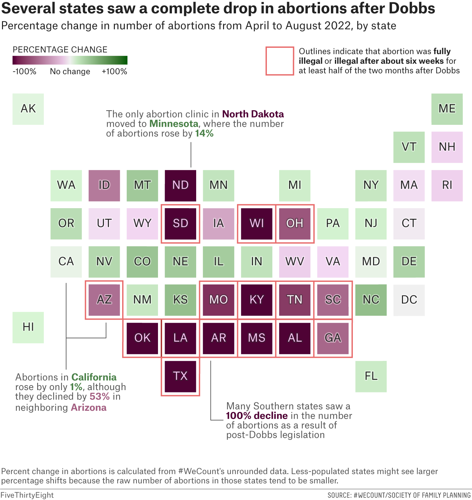

```{r setup, include=FALSE}
knitr::opts_chunk$set(out.width="100%", fig.align="center")
```

## Context

The right to have an abortion was protected in the U.S. after the Roe v. Wade(1973) 
decision, taken by the U.S. Supreme Court. This decision ruled that the Constitution 
protected the right to have an abortion. In 2022, the Supreme Court took another 
decision (Dobbs v. Jackson Women's Health Organization, popularly known as Dobbs), 
which overruled Roe v. Wade. 

This decision gave the power to the states to decide individually about the regulation 
of the right to have an abortion. This caused a drop in abortion in Republican states 
in which abortion became fully, or almost fully illegal. 

This project replicates a graph from FiveThirtyEight which shows the changes in 
abortion data after Dobbs:

{width="100%" .external}

After this replication, we try to add information about the public opinion 
on Roe v. Wade for the different states. This way we can see if the decisions of 
the different governments pair with the opinion of the population.

## Preparing the data

First, we prepare a data frame in which we mark the position of each state, 
the name abreviation and the corresponding value of change in abortions.


```{r}
df <- data.frame(
  x = c(1, 8, 6, 3, 2, 4, 11, 11, 11, 10, 9, 1, 6, 3, 6, 7, 5, 7, 5, 11, 10, 
        12, 8, 6, 6, 7, 4, 10, 5, 5, 12, 10, 4, 3, 10, 8, 4, 2, 9, 12, 9, 
        5, 8, 5, 3, 9, 11, 2, 7, 8, 4),
  y = c(8, 2, 2, 3, 4, 4, 5, 3, 4, 1, 2, 2, 5, 6, 4, 4, 3, 3, 2, 6, 4, 8, 
        6, 6, 3, 2, 6, 3, 6, 4, 7, 5, 3, 4, 6, 5, 2, 5, 5, 6, 3, 5, 3, 1, 5, 
        4, 7, 6, 5, 4, 5),
  state = c("AK", "AL", "AR", "AZ", "CA", "CO", "CT", "DC", "DE", "FL", "GA", 
            "HI", "IA", "ID", "IL", "IN", "KS", "KY", "LA", "MA", "MD", "ME", 
            "MI", "MN", "MO", "MS", "MT", "NC", "ND", "NE", "NH", "NJ", "NM", 
            "NV", "NY", "OH", "OK", "OR", "PA", "RI", "SC", "SD", "TN", "TX", 
            "UT", "VA", "VT", "WA", "WI", "WV", "WY"),
  state.color = c("black", "#BE8DB7", "#BE8DB7", "black", "black", 
                  "black", "black", "black", "black", "black", 
                  "black", "black", "black", "black", "black",
                  "black", "black", "#BE8DB7", "#BE8DB7", "black",
                  "black", "black", "black", "black", "white",
                  "#BE8DB7", "black", "black", "#BE8DB7", "black",
                  "black", "black", "black", "black", "black",
                  "white", "#BE8DB7", "black", "black", "black",
                  "black", "#BE8DB7", "white", "#BE8DB7", "black",
                  "black", "black", "black","#BE8DB7", "black", "black"),
  value = c(2, -100, -100, -53, 1, 33, -1, 0, 24, 10, -57, 4, -27, -48, 28,
           15, 36, -100, -100, -3, 1, 18, 8, 14, -83, -100, 30, 37, -100, 30,
           -6, 7, 12, 21, 12, -65, -100, 18, 6, -7, -56, -100, -78, -100, -3,
           -4, 16, 5, -100, -8, -5))

```

## Replication

### Colors and legend

First, we create a base for the graph, using geom_tile to draw the states. We also
try the PRGn palette, since it looked similar to the color palette used by
FiveThirtyEight.

```{r, fig.width=8, fig.height=6}
library(ggplot2)
ggplot(df) +
  aes(x, y, fill=value) +
  geom_tile(color="white", linewidth=2) +
  geom_text(aes(label=state, color=state.color), size=6) +
  coord_fixed() +
  scale_fill_distiller(type="div", palette="PRGn") +
  scale_color_identity() +
  theme_void()
```
We realised that the color pallete didn't followed a normal "distribution". In 
order to perfectly match the colors, we took certain values, and assign them to
the colors showed in the original graph for those states.

```{r, fig.width=8, fig.height=6}
q <- ggplot(df) +
  aes(x, y, fill=value) +
  geom_tile(color="white", linewidth=2) +
  geom_text(aes(label=state, color=state.color), size=5) +
  coord_fixed() +
  scale_fill_gradientn(colors = c("#4A0B35","#7D3F62", "#92597A",
                                  "#AB7D99", "#CBA8C2", "#E8D0E9",
                                  "#F0F0F0", "#DBF2D5", "#C1DCB8", 
                                  "#B4D2AB", "#A9C89E", "#9CBD8F",
                                  "#7EA370", "#2B5F1D"),
                       breaks = c(-100, -78, -65, -48, -27, -8, 0, 5, 18, 
                                  24, 30, 37, 50, 100),
                       limits = c(-100, 100)) +
  scale_color_identity() + 
  theme_void()
q
```

We change the position and direction of the legend, which consits on a color bar.

```{r, fig.width=8, fig.height=6}
q <- q + guides(fill = guide_colorbar(title = "PERCENT CHANGE",
                                 title.position = "top",
                                 title.theme = element_text(size = 10,
                                                            family = "Helvetica"),
                                 #title.hjust = 0.5,
                                 #title.vjust = 0.5,
                                 label = FALSE,
                                 barheight = 0.7,
                                 barwidth = 9,
                                 #nbin = 100,
                                 ticks = FALSE,
                                 direction = "horizontal")) +
  theme(legend.position = c(0.13, 1))
q
```

### Text

We add the title, subtitle and caption of the graph.

```{r, fig.width=10, fig.height=9}
q <- q + labs(
  title = "Several states saw a complete drop in abortions after Dobbs",
  subtitle = "Percentage change in number of abortions from April to August 2022, by state",
  caption = paste0("Percent change in abortions is calculated from #WeCount's unrounded data.", 
                  "\nLess-populated states might see larger",
                  "percentage shifts because the raw number of abortions in", 
                  "those states tend to be smaller.")
) +
  theme(plot.title = element_text(size = 18, color = "#222222", face = "bold", 
                                  family = "Helvetica", hjust = 0.1, vjust = 3)) +
  theme(plot.subtitle = element_text(size = 14, color = "#222222", face = NULL, 
                                     family = "Helvetica", hjust = 0.1, vjust = 3)) +
  theme(plot.caption = element_text(size = 10, color = "#999999", face = NULL, 
                                    family = "Helvetica", hjust = 0, vjust = 0.1)) +
  ylim(0, 9) +
  theme(legend.position = c(0.13, 0.97))

q

```

### Annotations

We begin with the square annotations, which surround some states.

```{r, fig.width=11, fig.height=11}
# Base
q <- q + annotate("rect", xmin = 6.5, xmax = 7.5, ymin = 8.65, ymax = 9.65, 
                  alpha = 0, color = "#D8726F") + ylim(0, 10)

# SD
q <- q + annotate("rect", xmin = 4.5, xmax = 5.5, ymin = 4.5, ymax = 5.5, 
                  alpha = 0, color = "#D8726F")

# WI
q <- q + annotate("rect", xmin = 6.5, xmax = 7.5, ymin = 4.5, ymax = 5.5, 
                  alpha = 0, color = "#D8726F")

# OH
q <- q + annotate("rect", xmin = 7.5, xmax = 8.5, ymin = 4.5, ymax = 5.5, 
                  alpha = 0, color = "#D8726F")

# KY
q <- q + annotate("rect", xmin = 6.5, xmax = 7.5, ymin = 2.5, ymax = 3.5, 
                  alpha = 0, color = "#D8726F")

# MO
q <- q + annotate("rect", xmin = 5.5, xmax = 6.5, ymin = 2.5, ymax = 3.5, 
                  alpha = 0, color = "#D8726F")

# TN
q <- q + annotate("rect", xmin = 7.5, xmax = 8.5, ymin = 2.5, ymax = 3.5, 
                  alpha = 0, color = "#D8726F")

# SC
q <- q + annotate("rect", xmin = 8.5, xmax = 9.5, ymin = 2.5, ymax = 3.5, 
                  alpha = 0, color = "#D8726F")

# AZ
q <- q + annotate("rect", xmin = 2.5, xmax = 3.5, ymin = 2.5, ymax = 3.5, 
                  alpha = 0, color = "#D8726F")

# OK
q <- q + annotate("rect", xmin = 3.5, xmax = 4.5, ymin = 1.5, ymax = 2.5, 
                  alpha = 0, color = "#D8726F")

# LA
q <- q + annotate("rect", xmin = 4.5, xmax = 5.5, ymin = 1.5, ymax = 2.5, 
                  alpha = 0, color = "#D8726F")

# AR
q <- q + annotate("rect", xmin = 5.5, xmax = 6.5, ymin = 1.5, ymax = 2.5, 
                  alpha = 0, color = "#D8726F")

# MS
q <- q + annotate("rect", xmin = 6.5, xmax = 7.5, ymin = 1.5, ymax = 2.5, 
                  alpha = 0, color = "#D8726F")

# AL
q <- q + annotate("rect", xmin = 7.5, xmax = 8.5, ymin = 1.5, ymax = 2.5, 
                  alpha = 0, color = "#D8726F")

# GA
q <- q + annotate("rect", xmin = 8.5, xmax = 9.5, ymin = 1.5, ymax = 2.5, 
                  alpha = 0, color = "#D8726F")

# TX
q <- q + annotate("rect", xmin = 4.5, xmax = 5.5, ymin = 0.5, ymax = 1.5, 
                  alpha = 0, color = "#D8726F")

q
```

Next, line annotations which point out information about some states.

```{r, fig.width=10, fig.height=10}
## Lines ##
# CA
q <- q + annotate("segment", x = 2, xend = 2, y = 3.5, yend = 1, color = "black")

# AZ
q <- q + annotate("segment", x = 3, xend = 3, y = 2.5, yend = 2, color = "black")

# CA&AZ
q <- q + annotate("segment", x = 2, xend = 3, y = 2, yend = 2, color = "black")

# ND
q <- q + annotate("segment", x = 5.3, xend = 5.3, y = 6.5, yend = 7.1, color = "black")

# AR
# AR1
q <- q + annotate("segment", x = 6, xend = 6, y = 1.5, yend = -0.2, color = "black") + ylim(-0.5, 10)
# AR2
q <- q + annotate("segment", x = 6, xend = 6.3, y = -0.2, yend = -0.2, color = "black")

q
```

Lastly, we will do text annotations, which are "on the other side" of the line
annotations. We also add the values for the legend.

```{r, fig.width=14, fig.height=13}
# Base square
library(ggtext)

q <- q + annotate(geom = "richtext", x = 7.5, y = 9.15, 
                  label = "Outlines indicate that abortion was **fully**
                  <br>**illegal** or **illegal after about six weeks** for
                  <br>at least half of the two months after Dobbs", 
                  size = 5, fill = NA, label.color = NA, hjust = 0, color = "#555555", 
                  family = "Helvetica")

# ND

q <- q + annotate(geom = "richtext", x = 2.6, y = 7.7,
             label = "The only abortion clinic in 
             <span style = 'color:#480A34'>**North Dakota**</span>
             <br> moved to <span style = 'color:#567F4D'>**Minnesota**</span>, 
             where the number<br>of abortions rose by 
             <span style = 'color:#567F4D'>**14%**",
             size = 5, fill = NA, label.color = NA, hjust = 0, color = "#555555", 
             family = "Helvetica")

# CA & AZ

q <- q + annotate(geom = "richtext", x = 0.5, y = 0.25,
             label = "Abortions in <span style = 'color:#567F4D'>**California**</span>
             <br>rose by only <span style = 'color:#567F4D'>**1%**</span>, although
             <br>they declined by <span style = 'color:#99607E'>**53%**</span> in
             <br>neighboring <span style = 'color:#99607E'>**Arizona**",
             size = 5, fill = NA, label.color = NA, hjust = 0, color = "#555555", 
             family = "Helvetica")

# AR

q <- q + annotate(geom = "richtext", x = 6.4, y = -0.4,
             label = "Many Southern states saw a<
             br><span style = 'color:#480A34'>**100% decline**</span> in the number
             <br>of abortions as a result of<br>post-Dobbs legislation",
             size = 5, fill = NA, label.color = NA, hjust = 0, color = "#555555", 
             family = "Helvetica") +
  xlim(-0.5, 13.5) + ylim(-0.7, 9.7)

# Legend
q <- q + annotate(geom = "richtext", x = -0.25, y = 9.6,
             label = "-100%",
             size = 3, fill = NA, label.color = NA, hjust = 0) 

q <- q + annotate(geom = "richtext", x = 0.35, y = 9.6,
             label = "No change",
             size = 3, fill = NA, label.color = NA, hjust = 0)

q <- q + annotate(geom = "richtext", x = 1.3, y = 9.6,
             label = "+100%",
             size = 3, fill = NA, label.color = NA, hjust = 0) 

q
```

## Enhancement

We create a new dataframe, which contains new positions for the states. We do this
to separate them, so they don't share the lines outside the states. This way we will
be able to add the information.

```{r}
df <- data.frame(
  x = c(1, 10.1, 7.5, 3.6, 2.3, 4.9, 14, 14, 14, 12.7, 11.4, 
        1, 7.5, 3.6, 7.5, 8.8, 6.2, 8.8, 6.2, 14, 12.7, 15.3, 
        10.1, 7.5, 7.5, 8.8, 4.9, 12.7, 6.2, 6.2, 15.3, 12.7, 4.9, 
        3.6, 12.7, 10.1, 4.9, 2.3, 11.4, 15.3, 11.4, 6.2, 10.1, 6.2, 
        3.6, 11.4, 14, 2.3, 8.8, 10.1, 4.9),
  y = c(10.1, 2.3, 2.3, 3.6, 4.9, 4.9, 6.2, 3.6, 4.9, 1, 2.3, 
        2.3, 6.2, 7.5, 4.9, 4.9, 3.6, 3.6, 2.3, 7.5, 4.9, 10.1, 
        7.5, 7.5, 3.6, 2.3, 7.5, 3.6, 7.5, 4.9, 8.8, 6.2, 3.6, 
        4.9, 7.5, 6.2, 2.3, 6.2, 6.2, 7.5, 3.6, 6.2, 3.6, 1, 
        6.2, 4.9, 8.8, 7.5, 6.2, 4.9, 6.2),
  state = c("AK", "AL", "AR", "AZ", "CA", "CO", "CT", "DC", "DE", "FL", "GA", 
            "HI", "IA", "ID", "IL", "IN", "KS", "KY", "LA", "MA", "MD", "ME", 
            "MI", "MN", "MO", "MS", "MT", "NC", "ND", "NE", "NH", "NJ", "NM", 
            "NV", "NY", "OH", "OK", "OR", "PA", "RI", "SC", "SD", "TN", "TX", 
            "UT", "VA", "VT", "WA", "WI", "WV", "WY"),
  state.color = c("black", "white", "white", "black", "black", 
                  "black", "black", "black", "black", "black", 
                  "black", "black", "black", "black", "black",
                  "black", "black", "white", "white", "black",
                  "black", "black", "black", "black", "white",
                  "white", "black", "black", "white", "black",
                  "black", "black", "black", "black", "black",
                  "white", "white", "black", "black", "black",
                  "black", "white", "white", "white", "black",
                  "black", "black", "black","white", "black", "black"),
  value = c(2, -100, -100, -53, 1, 33, -1, 0, 24, 10, -57, 4, -27, -48, 28,
           15, 36, -100, -100, -3, 1, 18, 8, 14, -83, -100, 30, 37, -100, 30,
           -6, 7, 12, 21, 12, -65, -100, 18, 6, -7, -56, -100, -78, -100, -3,
           -4, 16, 5, -100, -8, -5))
```

### Base

We create a new base, with a black background. We do this because if we do an
"honest" color gradient, a lot of the states will be close to white. We also add a
new color pallete.

```{r, fig.width=10, fig.height=8}
library(ggdark)
q <- ggplot(df) +
  aes(x, y, fill=value) +
  geom_tile(color="black", linewidth=6) +
  geom_text(aes(label=state, color=state.color), size=6) +
  coord_fixed() +
  scale_fill_gradientn(colors = c("#9b2226","#F0F0F0", "#3a5a40"),
                       breaks = c(-100, 0, 100),
                       limits = c(-100, 100)) +
  scale_color_identity() +
  theme_void() +
  dark_theme_minimal() +
  theme(axis.text = element_blank(),
        axis.ticks = element_blank(),
        axis.title = element_blank(),
        panel.background = element_blank(),
        panel.grid = element_blank())
  

q
```

### Squares

We begin with the squares that will sorround each state. This way, we can give to each
of them an alpha value which represent the support of the population to overturning
Roe v. Wade.

```{r, fig.width=10, fig.height=8}

# AK

q <- q + 
  annotate("segment", x = 0.43, xend = 0.43, y = 9.53, yend = 10.67, 
           color = "#7DB4DE", size = 1, alpha = 0.739) +
  annotate("segment", x = 0.43, xend = 1.57, y = 9.53, yend = 9.53, 
           color = "#7DB4DE", size = 1, alpha = 0.739) +
  annotate("segment", x = 1.57, xend = 1.57, y = 9.53, yend = 10.67, 
           color = "#7DB4DE", size = 1, alpha = 0.739) +
  annotate("segment", x = 0.43, xend = 1.57, y = 10.67, yend = 10.67, 
           color = "#7DB4DE", size = 1, alpha = 0.739)

# HI

q <- q + 
  annotate("segment", x = 0.43, xend = 0.43, y = 1.73, yend = 2.87, 
           color = "#7DB4DE", size = 1, alpha = 0.435) +
  annotate("segment", x = 0.43, xend = 1.57, y = 1.73, yend = 1.73, 
           color = "#7DB4DE", size = 1, alpha = 0.435) +
  annotate("segment", x = 1.57, xend = 1.57, y = 1.73, yend = 2.87, 
           color = "#7DB4DE", size = 1, alpha = 0.435) +
  annotate("segment", x = 0.43, xend = 1.57, y = 2.87, yend = 2.87, 
           color = "#7DB4DE", size = 1, alpha = 0.435)

# WA

q <- q + 
  annotate("segment", x = 1.73, xend = 1.73, y = 6.93, yend = 8.07, 
           color = "#7DB4DE", size = 1, alpha = 0) +
  annotate("segment", x = 1.73, xend = 2.87, y = 6.93, yend = 6.93, 
           color = "#7DB4DE", size = 1, alpha = 0) +
  annotate("segment", x = 2.87, xend = 2.87, y = 6.93, yend = 8.07, 
           color = "#7DB4DE", size = 1, alpha = 0) +
  annotate("segment", x = 1.73, xend = 2.87, y = 8.07, yend = 8.07, 
           color = "#7DB4DE", size = 1, alpha = 0)

# OR

q <- q + 
  annotate("segment", x = 1.73, xend = 1.73, y = 5.63, yend = 6.77, 
           color = "#7DB4DE", size = 1, alpha = 0.304) +
  annotate("segment", x = 1.73, xend = 2.87, y = 5.63, yend = 5.63, 
           color = "#7DB4DE", size = 1, alpha = 0.304) +
  annotate("segment", x = 2.87, xend = 2.87, y = 5.63, yend = 6.77, 
           color = "#7DB4DE", size = 1, alpha = 0.304) +
  annotate("segment", x = 1.73, xend = 2.87, y = 6.77, yend = 6.77, 
           color = "#7DB4DE", size = 1, alpha = 0.304)

# CA

q <- q + 
  annotate("segment", x = 1.73, xend = 1.73, y = 4.33, yend = 5.47, 
           color = "#7DB4DE", size = 1, alpha = 0.261) +
  annotate("segment", x = 1.73, xend = 2.87, y = 4.33, yend = 4.33, 
           color = "#7DB4DE", size = 1, alpha = 0.261) +
  annotate("segment", x = 2.87, xend = 2.87, y = 4.33, yend = 5.47, 
           color = "#7DB4DE", size = 1, alpha = 0.261) +
  annotate("segment", x = 1.73, xend = 2.87, y = 5.47, yend = 5.47, 
           color = "#7DB4DE", size = 1, alpha = 0.261)

# ID

q <- q + 
  annotate("segment", x = 3.03, xend = 3.03, y = 6.93, yend = 8.07, 
           color = "#7DB4DE", size = 1, alpha = 0.565) +
  annotate("segment", x = 3.03, xend = 4.17, y = 6.93, yend = 6.93, 
           color = "#7DB4DE", size = 1, alpha = 0.565) +
  annotate("segment", x = 4.17, xend = 4.17, y = 6.93, yend = 8.07, 
           color = "#7DB4DE", size = 1, alpha = 0.565) +
  annotate("segment", x = 3.03, xend = 4.17, y = 8.07, yend = 8.07, 
           color = "#7DB4DE", size = 1, alpha = 0.565)

# UT

q <- q + 
  annotate("segment", x = 3.03, xend = 3.03, y = 5.63, yend = 6.77, 
           color = "#7DB4DE", size = 1, alpha = 0.739) +
  annotate("segment", x = 3.03, xend = 4.17, y = 5.63, yend = 5.63, 
           color = "#7DB4DE", size = 1, alpha = 0.739) +
  annotate("segment", x = 4.17, xend = 4.17, y = 5.63, yend = 6.77, 
           color = "#7DB4DE", size = 1, alpha = 0.739) +
  annotate("segment", x = 3.03, xend = 4.17, y = 6.77, yend = 6.77, 
           color = "#7DB4DE", size = 1, alpha = 0.739)

# NV

q <- q + 
  annotate("segment", x = 3.03, xend = 3.03, y = 4.33, yend = 5.47, 
           color = "#7DB4DE", size = 1, alpha = 0.304) +
  annotate("segment", x = 3.03, xend = 4.17, y = 4.33, yend = 4.33, 
           color = "#7DB4DE", size = 1, alpha = 0.304) +
  annotate("segment", x = 4.17, xend = 4.17, y = 4.33, yend = 5.47, 
           color = "#7DB4DE", size = 1, alpha = 0.304) +
  annotate("segment", x = 3.03, xend = 4.17, y = 5.47, yend = 5.47, 
           color = "#7DB4DE", size = 1, alpha = 0.304)

# AZ

q <- q + 
  annotate("segment", x = 3.03, xend = 3.03, y = 3.03, yend = 4.17, 
           color = "#7DB4DE", size = 1, alpha = 0.522) +
  annotate("segment", x = 3.03, xend = 4.17, y = 3.03, yend = 3.03, 
           color = "#7DB4DE", size = 1, alpha = 0.522) +
  annotate("segment", x = 4.17, xend = 4.17, y = 3.03, yend = 4.17, 
           color = "#7DB4DE", size = 1, alpha = 0.522) +
  annotate("segment", x = 3.03, xend = 4.17, y = 4.17, yend = 4.17, 
           color = "#7DB4DE", size = 1, alpha = 0.522)

# MT

q <- q + 
  annotate("segment", x = 4.33, xend = 4.33, y = 6.93, yend = 8.07, 
           color = "#7DB4DE", size = 1, alpha = 0.565) +
  annotate("segment", x = 4.33, xend = 5.46, y = 6.93, yend = 6.93, 
           color = "#7DB4DE", size = 1, alpha = 0.565) +
  annotate("segment", x = 5.46, xend = 5.46, y = 6.93, yend = 8.07, 
           color = "#7DB4DE", size = 1, alpha = 0.565) +
  annotate("segment", x = 4.33, xend = 5.46, y = 8.07, yend = 8.07, 
           color = "#7DB4DE", size = 1, alpha = 0.565)

# WY

q <- q + 
  annotate("segment", x = 4.33, xend = 4.33, y = 5.63, yend = 6.77, 
           color = "#7DB4DE", size = 1, alpha = 0.870) +
  annotate("segment", x = 4.33, xend = 5.46, y = 5.63, yend = 5.63, 
           color = "#7DB4DE", size = 1, alpha = 0.870) +
  annotate("segment", x = 5.46, xend = 5.46, y = 5.63, yend = 6.77, 
           color = "#7DB4DE", size = 1, alpha = 0.870) +
  annotate("segment", x = 4.33, xend = 5.46, y = 6.77, yend = 6.77, 
           color = "#7DB4DE", size = 1, alpha = 0.870)

# CO

q <- q + 
  annotate("segment", x = 4.33, xend = 4.33, y = 4.33, yend = 5.46, 
           color = "#7DB4DE", size = 1, alpha = 0.478) +
  annotate("segment", x = 4.33, xend = 5.46, y = 4.33, yend = 4.33, 
           color = "#7DB4DE", size = 1, alpha = 0.478) +
  annotate("segment", x = 5.46, xend = 5.46, y = 4.33, yend = 5.46, 
           color = "#7DB4DE", size = 1, alpha = 0.478) +
  annotate("segment", x = 4.33, xend = 5.46, y = 5.46, yend = 5.46, 
           color = "#7DB4DE", size = 1, alpha = 0.478)

# NM

q <- q + 
  annotate("segment", x = 4.33, xend = 4.33, y = 3.03, yend = 4.17, 
           color = "#7DB4DE", size = 1, alpha = 0.522) +
  annotate("segment", x = 4.33, xend = 5.46, y = 3.03, yend = 3.03, 
           color = "#7DB4DE", size = 1, alpha = 0.522) +
  annotate("segment", x = 5.46, xend = 5.46, y = 3.03, yend = 4.17, 
           color = "#7DB4DE", size = 1, alpha = 0.522) +
  annotate("segment", x = 4.33, xend = 5.46, y = 4.17, yend = 4.17, 
           color = "#7DB4DE", size = 1, alpha = 0.522)

# OK

q <- q + 
  annotate("segment", x = 4.33, xend = 4.33, y = 1.73, yend = 2.87, 
           color = "#7DB4DE", size = 1, alpha = 0.783) +
  annotate("segment", x = 4.33, xend = 5.46, y = 1.73, yend = 1.73, 
           color = "#7DB4DE", size = 1, alpha = 0.783) +
  annotate("segment", x = 5.46, xend = 5.46, y = 1.73, yend = 2.87, 
           color = "#7DB4DE", size = 1, alpha = 0.783) +
  annotate("segment", x = 4.33, xend = 5.46, y = 2.87, yend = 2.87, 
           color = "#7DB4DE", size = 1, alpha = 0.783)

# ND

q <- q + 
  annotate("segment", x = 5.63, xend = 5.63, y = 6.93, yend = 8.07, 
           color = "#7DB4DE", size = 1, alpha = 0.435) +
  annotate("segment", x = 5.63, xend = 6.77, y = 6.93, yend = 6.93, 
           color = "#7DB4DE", size = 1, alpha = 0.435) +
  annotate("segment", x = 6.77, xend = 6.77, y = 6.93, yend = 8.07, 
           color = "#7DB4DE", size = 1, alpha = 0.435) +
  annotate("segment", x = 5.63, xend = 6.77, y = 8.07, yend = 8.07, 
           color = "#7DB4DE", size = 1, alpha = 0.435)

# SD

q <- q + 
  annotate("segment", x = 5.63, xend = 5.63, y = 5.63, yend = 6.77, 
           color = "#7DB4DE", size = 1, alpha = 0.391) +
  annotate("segment", x = 5.63, xend = 6.77, y = 5.63, yend = 5.63, 
           color = "#7DB4DE", size = 1, alpha = 0.391) +
  annotate("segment", x = 6.77, xend = 6.77, y = 5.63, yend = 6.77, 
           color = "#7DB4DE", size = 1, alpha = 0.391) +
  annotate("segment", x = 5.63, xend = 6.77, y = 6.77, yend = 6.77, 
           color = "#7DB4DE", size = 1, alpha = 0.391)

# NE

q <- q + 
  annotate("segment", x = 5.63, xend = 5.63, y = 4.33, yend = 5.47, 
           color = "#7DB4DE", size = 1, alpha = 0.783) +
  annotate("segment", x = 5.63, xend = 6.77, y = 4.33, yend = 4.33, 
           color = "#7DB4DE", size = 1, alpha = 0.783) +
  annotate("segment", x = 6.77, xend = 6.77, y = 4.33, yend = 5.47, 
           color = "#7DB4DE", size = 1, alpha = 0.783) +
  annotate("segment", x = 5.63, xend = 6.77, y = 5.47, yend = 5.47, 
           color = "#7DB4DE", size = 1, alpha = 0.783)

# KS

q <- q + 
  annotate("segment", x = 5.63, xend = 5.63, y = 3.03, yend = 4.17, 
           color = "#7DB4DE", size = 1, alpha = 0.522) +
  annotate("segment", x = 5.63, xend = 6.77, y = 3.03, yend = 3.03, 
           color = "#7DB4DE", size = 1, alpha = 0.522) +
  annotate("segment", x = 6.77, xend = 6.77, y = 3.03, yend = 4.17, 
           color = "#7DB4DE", size = 1, alpha = 0.522) +
  annotate("segment", x = 5.63, xend = 6.77, y = 4.17, yend = 4.17, 
           color = "#7DB4DE", size = 1, alpha = 0.522)

# LA

q <- q + 
  annotate("segment", x = 5.63, xend = 5.63, y = 1.73, yend = 2.87, 
           color = "#7DB4DE", size = 1, alpha = 0.696) +
  annotate("segment", x = 5.63, xend = 6.77, y = 1.73, yend = 1.73, 
           color = "#7DB4DE", size = 1, alpha = 0.696) +
  annotate("segment", x = 6.77, xend = 6.77, y = 1.73, yend = 2.87, 
           color = "#7DB4DE", size = 1, alpha = 0.696) +
  annotate("segment", x = 5.63, xend = 6.77, y = 2.87, yend = 2.87, 
           color = "#7DB4DE", size = 1, alpha = 0.696)

# TX

q <- q + 
  annotate("segment", x = 5.63, xend = 5.63, y = 0.43, yend = 1.57, 
           color = "#7DB4DE", size = 1, alpha = 0.609) +
  annotate("segment", x = 5.63, xend = 6.77, y = 0.43, yend = 0.43, 
           color = "#7DB4DE", size = 1, alpha = 0.609) +
  annotate("segment", x = 6.77, xend = 6.77, y = 0.43, yend = 1.57, 
           color = "#7DB4DE", size = 1, alpha = 0.609) +
  annotate("segment", x = 5.63, xend = 6.77, y = 1.57, yend = 1.57, 
           color = "#7DB4DE", size = 1, alpha = 0.609)

# MN

q <- q + 
  annotate("segment", x = 6.93, xend = 6.93, y = 6.93, yend = 8.07, 
           color = "#7DB4DE", size = 1, alpha = 0.174) +
  annotate("segment", x = 6.93, xend = 8.07, y = 6.93, yend = 6.93, 
           color = "#7DB4DE", size = 1, alpha = 0.174) +
  annotate("segment", x = 8.07, xend = 8.07, y = 6.93, yend = 8.07, 
           color = "#7DB4DE", size = 1, alpha = 0.174) +
  annotate("segment", x = 6.93, xend = 8.07, y = 8.07, yend = 8.07, 
           color = "#7DB4DE", size = 1, alpha = 0.174)

# IA

q <- q + 
  annotate("segment", x = 6.93, xend = 6.93, y = 5.63, yend = 6.77,
           color = "#7DB4DE", size = 1, alpha = 0.261) +
  annotate("segment", x = 6.93, xend = 8.07, y = 5.63, yend = 5.63, 
           color = "#7DB4DE", size = 1, alpha = 0.261) +
  annotate("segment", x = 8.07, xend = 8.07, y = 5.63, yend = 6.77, 
           color = "#7DB4DE", size = 1, alpha = 0.261) +
  annotate("segment", x = 6.93, xend = 8.07, y = 6.77, yend = 6.77, 
           color = "#7DB4DE", size = 1, alpha = 0.261)

# IL

q <- q + 
  annotate("segment", x = 6.93, xend = 6.93, y = 4.33, yend = 5.47, 
           color = "#7DB4DE", size = 1, alpha = 0.348) +
  annotate("segment", x = 6.93, xend = 8.07, y = 4.33, yend = 4.33, 
           color = "#7DB4DE", size = 1, alpha = 0.348) +
  annotate("segment", x = 8.07, xend = 8.07, y = 4.33, yend = 5.47, 
           color = "#7DB4DE", size = 1, alpha = 0.348) +
  annotate("segment", x = 6.93, xend = 8.07, y = 5.47, yend = 5.47, 
           color = "#7DB4DE", size = 1, alpha = 0.348)

# MO

q <- q + 
  annotate("segment", x = 6.93, xend = 6.93, y = 3.03, yend = 4.17, 
           color = "#7DB4DE", size = 1, alpha = 0.609) +
  annotate("segment", x = 6.93, xend = 8.06, y = 3.03, yend = 3.03, 
           color = "#7DB4DE", size = 1, alpha = 0.609) +
  annotate("segment", x = 8.06, xend = 8.06, y = 3.03, yend = 4.17, 
           color = "#7DB4DE", size = 1, alpha = 0.609) +
  annotate("segment", x = 6.93, xend = 8.06, y = 4.17, yend = 4.17, 
           color = "#7DB4DE", size = 1, alpha = 0.609)

# AR

q <- q + 
  annotate("segment", x = 6.93, xend = 6.93, y = 1.73, yend = 2.87, 
           color = "#7DB4DE", size = 1, alpha = 1) +
  annotate("segment", x = 6.93, xend = 8.06, y = 1.73, yend = 1.73, 
           color = "#7DB4DE", size = 1, alpha = 1) +
  annotate("segment", x = 8.06, xend = 8.06, y = 1.73, yend = 2.87, 
           color = "#7DB4DE", size = 1, alpha = 1) +
  annotate("segment", x = 6.93, xend = 8.06, y = 2.87, yend = 2.87, 
           color = "#7DB4DE", size = 1, alpha = 1)

# WI

q <- q + 
  annotate("segment", x = 8.23, xend = 8.23, y = 5.63, yend = 6.77, 
           color = "#7DB4DE", size = 1, alpha = 0.348) +
  annotate("segment", x = 8.23, xend = 9.37, y = 5.63, yend = 5.63, 
           color = "#7DB4DE", size = 1, alpha = 0.348) +
  annotate("segment", x = 9.37, xend = 9.37, y = 5.63, yend = 6.77, 
           color = "#7DB4DE", size = 1, alpha = 0.348) +
  annotate("segment", x = 8.23, xend = 9.37, y = 6.77, yend = 6.77, 
           color = "#7DB4DE", size = 1, alpha = 0.348)

# IN

q <- q + 
  annotate("segment", x = 8.23, xend = 8.23, y = 4.33, yend = 5.47, 
           color = "#7DB4DE", size = 1, alpha = 0.696) +
  annotate("segment", x = 8.23, xend = 9.37, y = 4.33, yend = 4.33, 
           color = "#7DB4DE", size = 1, alpha = 0.696) +
  annotate("segment", x = 9.37, xend = 9.37, y = 4.33, yend = 5.47, 
           color = "#7DB4DE", size = 1, alpha = 0.696) +
  annotate("segment", x = 8.23, xend = 9.37, y = 5.47, yend = 5.47, 
           color = "#7DB4DE", size = 1, alpha = 0.696)

# KY

q <- q + 
  annotate("segment", x = 8.23, xend = 8.23, y = 3.03, yend = 4.17, 
           color = "#7DB4DE", size = 1, alpha = 0.739) +
  annotate("segment", x = 8.23, xend = 9.37, y = 3.03, yend = 3.03, 
           color = "#7DB4DE", size = 1, alpha = 0.739) +
  annotate("segment", x = 9.37, xend = 9.37, y = 3.03, yend = 4.17, 
           color = "#7DB4DE", size = 1, alpha = 0.739) +
  annotate("segment", x = 8.23, xend = 9.37, y = 4.17, yend = 4.17, 
           color = "#7DB4DE", size = 1, alpha = 0.739)

# MS

q <- q + 
  annotate("segment", x = 8.23, xend = 8.23, y = 1.73, yend = 2.87, 
           color = "#7DB4DE", size = 1, alpha = 0.652) +
  annotate("segment", x = 8.23, xend = 9.37, y = 1.73, yend = 1.73, 
           color = "#7DB4DE", size = 1, alpha = 0.652) +
  annotate("segment", x = 9.37, xend = 9.37, y = 1.73, yend = 2.87, 
           color = "#7DB4DE", size = 1, alpha = 0.652) +
  annotate("segment", x = 8.23, xend = 9.37, y = 2.87, yend = 2.87, 
           color = "#7DB4DE", size = 1, alpha = 0.652)

# MI

q <- q + 
  annotate("segment", x = 9.53, xend = 9.53, y = 6.93, yend = 8.07, 
           color = "#7DB4DE", size = 1, alpha = 0.348) +
  annotate("segment", x = 9.53, xend = 10.67, y = 6.93, yend = 6.93, 
           color = "#7DB4DE", size = 1, alpha = 0.348) +
  annotate("segment", x = 10.67, xend = 10.67, y = 6.93, yend = 8.07, 
           color = "#7DB4DE", size = 1, alpha = 0.348) +
  annotate("segment", x = 9.53, xend = 10.67, y = 8.07, yend = 8.07, 
           color = "#7DB4DE", size = 1, alpha = 0.348)

# OH

q <- q + 
  annotate("segment", x = 9.53, xend = 9.53, y = 5.63, yend = 6.77, 
           color = "#7DB4DE", size = 1, alpha = 0.435) +
  annotate("segment", x = 9.53, xend = 10.67, y = 5.63, yend = 5.63, 
           color = "#7DB4DE", size = 1, alpha = 0.435) +
  annotate("segment", x = 10.67, xend = 10.67, y = 5.63, yend = 6.77, 
           color = "#7DB4DE", size = 1, alpha = 0.435) +
  annotate("segment", x = 9.53, xend = 10.67, y = 6.77, yend = 6.77, 
           color = "#7DB4DE", size = 1, alpha = 0.435)

# WV

q <- q + 
  annotate("segment", x = 9.53, xend = 9.53, y = 4.33, yend = 5.47, 
           color = "#7DB4DE", size = 1, alpha = 0.739) +
  annotate("segment", x = 9.53, xend = 10.67, y = 4.33, yend = 4.33, 
           color = "#7DB4DE", size = 1, alpha = 0.739) +
  annotate("segment", x = 10.67, xend = 10.67, y = 4.33, yend = 5.47, 
           color = "#7DB4DE", size = 1, alpha = 0.739) +
  annotate("segment", x = 9.53, xend = 10.67, y = 5.47, yend = 5.47, 
           color = "#7DB4DE", size = 1, alpha = 0.739)

# TN

q <- q + 
  annotate("segment", x = 9.53, xend = 9.53, y = 3.03, yend = 4.17, 
           color = "#7DB4DE", size = 1, alpha = 0.652) +
  annotate("segment", x = 9.53, xend = 10.67, y = 3.03, yend = 3.03, 
           color = "#7DB4DE", size = 1, alpha = 0.652) +
  annotate("segment", x = 10.67, xend = 10.67, y = 3.03, yend = 4.17, 
           color = "#7DB4DE", size = 1, alpha = 0.652) +
  annotate("segment", x = 9.53, xend = 10.67, y = 4.17, yend = 4.17, 
           color = "#7DB4DE", size = 1, alpha = 0.652)

# AL

q <- q + 
  annotate("segment", x = 9.53, xend = 9.53, y = 1.73, yend = 2.87, 
           color = "#7DB4DE", size = 1, alpha = 0.522) +
  annotate("segment", x = 9.53, xend = 10.67, y = 1.73, yend = 1.73, 
           color = "#7DB4DE", size = 1, alpha = 0.522) +
  annotate("segment", x = 10.67, xend = 10.67, y = 1.73, yend = 2.87,
           color = "#7DB4DE", size = 1, alpha = 0.522) +
  annotate("segment", x = 9.53, xend = 10.67, y = 2.87, yend = 2.87, 
           color = "#7DB4DE", size = 1, alpha = 0.522)

# PA

q <- q + 
  annotate("segment", x = 10.83, xend = 10.83, y = 5.63, yend = 6.77, 
           color = "#7DB4DE", size = 1, alpha = 0.478) +
  annotate("segment", x = 10.83, xend = 11.97, y = 5.63, yend = 5.63, 
           color = "#7DB4DE", size = 1, alpha = 0.478) +
  annotate("segment", x = 11.97, xend = 11.97, y = 5.63, yend = 6.77, 
           color = "#7DB4DE", size = 1, alpha = 0.478) +
  annotate("segment", x = 10.83, xend = 11.97, y = 6.77, yend = 6.77, 
           color = "#7DB4DE", size = 1, alpha = 0.478)

# VA

q <- q + 
  annotate("segment", x = 10.83, xend = 10.83, y = 4.33, yend = 5.47, 
           color = "#7DB4DE", size = 1, alpha = 0.130) +
  annotate("segment", x = 10.83, xend = 11.97, y = 4.33, yend = 4.33, 
           color = "#7DB4DE", size = 1, alpha = 0.130) +
  annotate("segment", x = 11.97, xend = 11.97, y = 4.33, yend = 5.47, 
           color = "#7DB4DE", size = 1, alpha = 0.130) +
  annotate("segment", x = 10.83, xend = 11.97, y = 5.47, yend = 5.47, 
           color = "#7DB4DE", size = 1, alpha = 0.130)

# SC

q <- q + 
  annotate("segment", x = 10.83, xend = 10.83, y = 3.03, yend = 4.17, 
           color = "#7DB4DE", size = 1, alpha = 0.435) +
  annotate("segment", x = 10.83, xend = 11.97, y = 3.03, yend = 3.03, 
           color = "#7DB4DE", size = 1, alpha = 0.435) +
  annotate("segment", x = 11.97, xend = 11.97, y = 3.03, yend = 4.17, 
           color = "#7DB4DE", size = 1, alpha = 0.435) +
  annotate("segment", x = 10.83, xend = 11.97, y = 4.17, yend = 4.17, 
           color = "#7DB4DE", size = 1, alpha = 0.435)


# GA

q <- q + 
  annotate("segment", x = 10.83, xend = 10.83, y = 1.73, yend = 2.87, 
           color = "#7DB4DE", size = 1, alpha = 0.478) +
  annotate("segment", x = 10.83, xend = 11.97, y = 1.73, yend = 1.73, 
           color = "#7DB4DE", size = 1, alpha = 0.478) +
  annotate("segment", x = 11.97, xend = 11.97, y = 1.73, yend = 2.87, 
           color = "#7DB4DE", size = 1, alpha = 0.478) +
  annotate("segment", x = 10.83, xend = 11.97, y = 2.87, yend = 2.87, 
           color = "#7DB4DE", size = 1, alpha = 0.478)

# NY

q <- q + 
  annotate("segment", x = 12.13, xend = 12.13, y = 6.93, yend = 8.07, 
           color = "#7DB4DE", size = 1, alpha = 0.174) +
  annotate("segment", x = 12.13, xend = 13.27, y = 6.93, yend = 6.93, 
           color = "#7DB4DE", size = 1, alpha = 0.174) +
  annotate("segment", x = 13.27, xend = 13.27, y = 6.93, yend = 8.07, 
           color = "#7DB4DE", size = 1, alpha = 0.174) +
  annotate("segment", x = 12.13, xend = 13.27, y = 8.07, yend = 8.07, 
           color = "#7DB4DE", size = 1, alpha = 0.174)

# NJ

q <- q + 
  annotate("segment", x = 12.13, xend = 12.13, y = 5.63, yend = 6.77, 
           color = "#7DB4DE", size = 1, alpha = 0.174) +
  annotate("segment", x = 12.13, xend = 13.27, y = 5.63, yend = 5.63, 
           color = "#7DB4DE", size = 1, alpha = 0.174) +
  annotate("segment", x = 13.27, xend = 13.27, y = 5.63, yend = 6.77, 
           color = "#7DB4DE", size = 1, alpha = 0.174) +
  annotate("segment", x = 12.13, xend = 13.27, y = 6.77, yend = 6.77, 
           color = "#7DB4DE", size = 1, alpha = 0.174)

# MD

q <- q + 
  annotate("segment", x = 12.13, xend = 12.13, y = 4.33, yend = 5.47, 
           color = "#7DB4DE", size = 1, alpha = 0) +
  annotate("segment", x = 12.13, xend = 13.27, y = 4.33, yend = 4.33, 
           color = "#7DB4DE", size = 1, alpha = 0) +
  annotate("segment", x = 13.27, xend = 13.27, y = 4.33, yend = 5.47, 
           color = "#7DB4DE", size = 1, alpha = 0) +
  annotate("segment", x = 12.13, xend = 13.27, y = 5.47, yend = 5.47, 
           color = "#7DB4DE", size = 1, alpha = 0)

# NC

q <- q + 
  annotate("segment", x = 12.13, xend = 12.13, y = 3.03, yend = 4.17, 
           color = "#7DB4DE", size = 1, alpha = 0.348) +
  annotate("segment", x = 12.13, xend = 13.27, y = 3.03, yend = 3.03, 
           color = "#7DB4DE", size = 1, alpha = 0.348) +
  annotate("segment", x = 13.27, xend = 13.27, y = 3.03, yend = 4.17, 
           color = "#7DB4DE", size = 1, alpha = 0.348) +
  annotate("segment", x = 12.13, xend = 13.27, y = 4.17, yend = 4.17, 
           color = "#7DB4DE", size = 1, alpha = 0.348)

# FL

q <- q + 
  annotate("segment", x = 12.13, xend = 12.13, y = 0.43, yend = 1.57, 
           color = "#7DB4DE", size = 1, alpha = 0.391) +
  annotate("segment", x = 12.13, xend = 13.27, y = 0.43, yend = 0.43, 
           color = "#7DB4DE", size = 1, alpha = 0.391) +
  annotate("segment", x = 13.27, xend = 13.27, y = 0.43, yend = 1.57, 
           color = "#7DB4DE", size = 1, alpha = 0.391) +
  annotate("segment", x = 12.13, xend = 13.27, y = 1.57, yend = 1.57, 
           color = "#7DB4DE", size = 1, alpha = 0.391)

# VT

q <- q + 
  annotate("segment", x = 13.43, xend = 13.43, y = 8.23, yend = 9.37, 
           color = "#7DB4DE", size = 1, alpha = 0.217) +
  annotate("segment", x = 13.43, xend = 14.57, y = 8.23, yend = 8.23, 
           color = "#7DB4DE", size = 1, alpha = 0.217) +
  annotate("segment", x = 14.57, xend = 14.57, y = 8.23, yend = 9.37, 
           color = "#7DB4DE", size = 1, alpha = 0.217) +
  annotate("segment", x = 13.43, xend = 14.57, y = 9.37, yend = 9.37, 
           color = "#7DB4DE", size = 1, alpha = 0.217)

# MA

q <- q + 
  annotate("segment", x = 13.43, xend = 13.43, y = 6.93, yend = 8.07, 
           color = "#7DB4DE", size = 1, alpha = 0.043) +
  annotate("segment", x = 13.43, xend = 14.57, y = 6.93, yend = 6.93, 
           color = "#7DB4DE", size = 1, alpha = 0.043) +
  annotate("segment", x = 14.57, xend = 14.57, y = 6.93, yend = 8.07, 
           color = "#7DB4DE", size = 1, alpha = 0.043) +
  annotate("segment", x = 13.43, xend = 14.57, y = 8.07, yend = 8.07, 
           color = "#7DB4DE", size = 1, alpha = 0.043)

# CT

q <- q + 
  annotate("segment", x = 13.43, xend = 13.43, y = 5.63, yend = 6.77, 
           color = "#7DB4DE", size = 1, alpha = 0.043) +
  annotate("segment", x = 13.43, xend = 14.57, y = 5.63, yend = 5.63, 
           color = "#7DB4DE", size = 1, alpha = 0.043) +
  annotate("segment", x = 14.57, xend = 14.57, y = 5.63, yend = 6.77, 
           color = "#7DB4DE", size = 1, alpha = 0.043) +
  annotate("segment", x = 13.43, xend = 14.57, y = 6.77, yend = 6.77, 
           color = "#7DB4DE", size = 1, alpha = 0.043)

# DE

q <- q + 
  annotate("segment", x = 13.43, xend = 13.43, y = 4.33, yend = 5.47, 
           color = "#7DB4DE", size = 1, alpha = 0.087) +
  annotate("segment", x = 13.43, xend = 14.57, y = 4.33, yend = 4.33, 
           color = "#7DB4DE", size = 1, alpha = 0.087) +
  annotate("segment", x = 14.57, xend = 14.57, y = 4.33, yend = 5.47, 
           color = "#7DB4DE", size = 1, alpha = 0.087) +
  annotate("segment", x = 13.43, xend = 14.57, y = 5.47, yend = 5.47, 
           color = "#7DB4DE", size = 1, alpha = 0.087)

# DC

q <- q + 
  annotate("segment", x = 13.43, xend = 13.43, y = 3.03, yend = 4.17, 
           color = "#7DB4DE", size = 1, alpha = 0) +
  annotate("segment", x = 13.43, xend = 14.57, y = 3.03, yend = 3.03, 
           color = "#7DB4DE", size = 1, alpha = 0) +
  annotate("segment", x = 14.57, xend = 14.57, y = 3.03, yend = 4.17, 
           color = "#7DB4DE", size = 1, alpha = 0) +
  annotate("segment", x = 13.43, xend = 14.57, y = 4.17, yend = 4.17, 
           color = "#7DB4DE", size = 1, alpha = 0)

# ME

q <- q + 
  annotate("segment", x = 14.73, xend = 14.73, y = 9.53, yend = 10.67, 
           color = "#7DB4DE", size = 1, alpha = 0.043) +
  annotate("segment", x = 14.73, xend = 15.87, y = 9.53, yend = 9.53, 
           color = "#7DB4DE", size = 1, alpha = 0.043) +
  annotate("segment", x = 15.87, xend = 15.87, y = 9.53, yend = 10.67,
           color = "#7DB4DE", size = 1, alpha = 0.043) +
  annotate("segment", x = 14.73, xend = 15.87, y = 10.67, yend = 10.67, 
           color = "#7DB4DE", size = 1, alpha = 0.043)

# NH

q <- q + 
  annotate("segment", x = 14.73, xend = 14.73, y = 8.23, yend = 9.37, 
           color = "#7DB4DE", size = 1, alpha = 0.304) +
  annotate("segment", x = 14.73, xend = 15.87, y = 8.23, yend = 8.23, 
           color = "#7DB4DE", size = 1, alpha = 0.304) +
  annotate("segment", x = 15.87, xend = 15.87, y = 8.23, yend = 9.37, 
           color = "#7DB4DE", size = 1, alpha = 0.304) +
  annotate("segment", x = 14.73, xend = 15.87, y = 9.37, yend = 9.37, 
           color = "#7DB4DE", size = 1, alpha = 0.304)

# RI

q <- q + 
  annotate("segment", x = 14.73, xend = 14.73, y = 6.93, yend = 8.07, 
           color = "#7DB4DE", size = 1, alpha = 0.217) +
  annotate("segment", x = 14.73, xend = 15.87, y = 6.93, yend = 6.93, 
           color = "#7DB4DE", size = 1, alpha = 0.217) +
  annotate("segment", x = 15.87, xend = 15.87, y = 6.93, yend = 8.07, 
           color = "#7DB4DE", size = 1, alpha = 0.217) +
  annotate("segment", x = 14.73, xend = 15.87, y = 8.07, yend = 8.07, 
           color = "#7DB4DE", size = 1, alpha = 0.217)

q

```
### Text

We add a new title and complete the caption with information about the new data.

```{r, fig.width=10, fig.height=9}
q <- q + labs(
  title = "Relation between the drop in abortion after Dobbs and the public opinion",
  caption = paste0("Percent change in abortions is calculated from #WeCount's unrounded data.",
                  "\nData on opinion about overturning Roe v. Wade extracted from the ",
                  "PRRI American Values Atlas.")
) +
  theme(plot.title = element_text(size = 15, color = "white", face = "bold", 
                                  family = "Helvetica", hjust = 0.1, vjust = 0)) +
  theme(plot.subtitle = element_text(size = 14, color = "white", face = NULL, 
                                     family = "Helvetica", hjust = 0.8, vjust = 0)) +
  theme(plot.caption = element_text(size = 10, color = "white", face = NULL, 
                                    family = "Helvetica", hjust = 0, vjust = 2))

q
```
### Annotations

We add the line and text annotations with information about the states and the 
public opinion of each state

```{r, fig.width=12, fig.height=11}
# ANNOTATION 1: ND AND MN

# ND
q <- q + annotate("segment", x = 6.5, xend = 6.5, y = 8.07, yend = 9, 
                  color = "white")

q <- q + annotate(geom = "richtext", x = 3.8, y = 9.7,
                  label = "The only abortion clinic in 
                  <span style = 'color:#9B2226'>**North Dakota**</span>
                  <br> moved to <span style = 'color:#D5DAD5'>**Minnesota**</span>, 
                  where the number<br>of abortions rose by 
                  <span style = 'color:#D5DAD5'>**14%**",
                  size = 5, fill = NA, label.color = NA, hjust = 0, 
                  color = "white")

# ANNOTATION 2: CA AND AZ

# TX
q <- q + annotate("segment", x = 3.6, xend = 5.6, y = 1, yend = 1, 
                  color = "white")

# OK Vrt
q <- q + annotate("segment", x = 3.6, xend = 3.6, y = 2.3, yend = 0.2, 
                  color = "white")

# OK Hzt
q <- q + annotate("segment", x = 3.6, xend = 4.3, y = 2.3, yend = 2.3, 
                  color = "white")

# TX&OK

q <- q + annotate(geom = "richtext", x = 1.5, y = -0.6,
             label = "The states in which abortion 
             <br> dropped to <span style = 'color:#9B2226'>**0**</span> also showed 
             <br> the strongest support to <br> overturning 
             <span style = 'color:#7DB4DE'>**Roe v. Wade**",
             size = 5, fill = NA, label.color = NA, hjust = 0, 
             color = "white") 

# ANNOTATION 3: AR

# AR
# AR1
q <- q + annotate("segment", x = 7.5, xend = 7.5, 
                  y = 1.65, yend = -0.5)
# AR2
q <- q + annotate("segment", x = 7.5, xend = 7.9, 
                  y = -0.5, yend = -0.5)

# AR

q <- q + annotate(geom = "richtext", x = 8, y = -0.7,
                  label = "<span style = 'color:#9B2226'>**Arkansas**</span> 
                  is the state in which<br>more people are in favor of
                  <br>overturning Roe v. Wade:<span style = 'color:#7DB4DE'> **48%**",
                  size = 5, fill = NA, label.color = NA, hjust = 0,
                  color = "white") 
q

```

### Legends

We start withe the first legend, which represent the colors for the filling of the
states.

```{r, fig.width=12, fig.height=11}
q <- q + guides(fill = guide_colorbar(#title = "PERCENT CHANGE",
                                      #title.position = "top",
                                      #title.theme = element_text(size = 10,
                                                                 #family = "Helvetica"),
                                      #title.hjust = 0.5,
                                      #title.vjust = 0.5,
                                      label = FALSE,
                                      barheight = 0.7,
                                      barwidth = 11,
                                      #nbin = 100,
                                      ticks = FALSE,
                                      direction = "horizontal", )) +
  theme(legend.position = c(0.28, 0.915),
        legend.title = element_blank()) + ylim(-1.3, 12) +
  annotate(geom = "richtext", x = 2.8, y = 12, 
                  label = "Percent change in abortions <br> from April to August of 2022", 
                  size = 4, fill = NA, label.color = NA, hjust = 0, 
                  family = "Helvetica", color = "white") +
  annotate(geom = "richtext", x = 2.8, y = 11.1, 
                  label = "-100%", 
                  size = 3, fill = NA, label.color = NA, hjust = 0, 
                  family = "Helvetica", color = "white") +
  annotate(geom = "richtext", x = 3.9, y = 11.1, 
                  label = "No change", 
                  size = 3, fill = NA, label.color = NA, hjust = 0, 
                  family = "Helvetica", color = "white") +
  annotate(geom = "richtext", x = 5.4, y = 11.1, 
                  label = "+100%", 
                  size = 3, fill = NA, label.color = NA, hjust = 0, 
                  family = "Helvetica", color = "white") 
q

```

The second legend explains the squares that sorround the states.

```{r, fig.width=12, fig.height=11, preview = TRUE}

q <- q + 
 annotate(geom = "richtext", x = 9.5, y = 12, 
                  label = "Percent of population who 
                  <br>would like Roe v. Wade overturned", 
                  size = 4, fill = NA, label.color = NA, hjust = 0, 
          family = "Helvetica", color = "white") +
  annotate("rect", xmin = 9.55, xmax = 9.85, ymin = 11.3, 
           ymax = 11.6, alpha = 0, fill = "#7DB4DE") +
  annotate("rect", xmin = 9.86, xmax = 10.16, ymin = 11.3, 
           ymax = 11.6, alpha = 0.1, fill = "#7DB4DE") +
  annotate("rect", xmin = 10.17, xmax = 10.47, ymin = 11.3, 
           ymax = 11.6, alpha = 0.2, fill = "#7DB4DE") +
  annotate("rect", xmin = 10.48, xmax = 10.78, ymin = 11.3, 
           ymax = 11.6, alpha = 0.3, fill = "#7DB4DE") +
  annotate("rect", xmin = 10.79, xmax = 11.09, ymin = 11.3, 
           ymax = 11.6, alpha = 0.4, fill = "#7DB4DE") +
  annotate("rect", xmin = 11.10, xmax = 11.40, ymin = 11.3, 
           ymax = 11.6, alpha = 0.5, fill = "#7DB4DE") +
  annotate("rect", xmin = 11.41, xmax = 11.71, ymin = 11.3, 
           ymax = 11.6, alpha = 0.6, fill = "#7DB4DE") +
  annotate("rect", xmin = 11.72, xmax = 12.02, ymin = 11.3, 
           ymax = 11.6, alpha = 0.7, fill = "#7DB4DE") +
  annotate("rect", xmin = 12.03, xmax = 12.33, ymin = 11.3, 
           ymax = 11.6, alpha = 0.8, fill = "#7DB4DE") +
  annotate("rect", xmin = 12.34, xmax = 12.64, ymin = 11.3, 
           ymax = 11.6, alpha = 0.9, fill = "#7DB4DE") +
  annotate("rect", xmin = 12.65, xmax = 12.95, ymin = 11.3, 
           ymax = 11.6, alpha = 1, fill = "#7DB4DE") +
  annotate(geom = "richtext", x = 9.5, y = 11.1, 
                  label = "25%", 
                  size = 3, fill = NA, label.color = NA, 
           hjust = 0, family = "Helvetica", color = "white") +
  annotate(geom = "richtext", x = 11.07, y = 11.1, 
                  label = "36%", 
                  size = 3, fill = NA, label.color = NA, 
           hjust = 0, family = "Helvetica", color = "white") +
  annotate(geom = "richtext", x = 12.64, y = 11.1, 
                  label = "48%", 
                  size = 3, fill = NA, label.color = NA, 
            hjust = 0, family = "Helvetica", color = "white")
  
q

```
