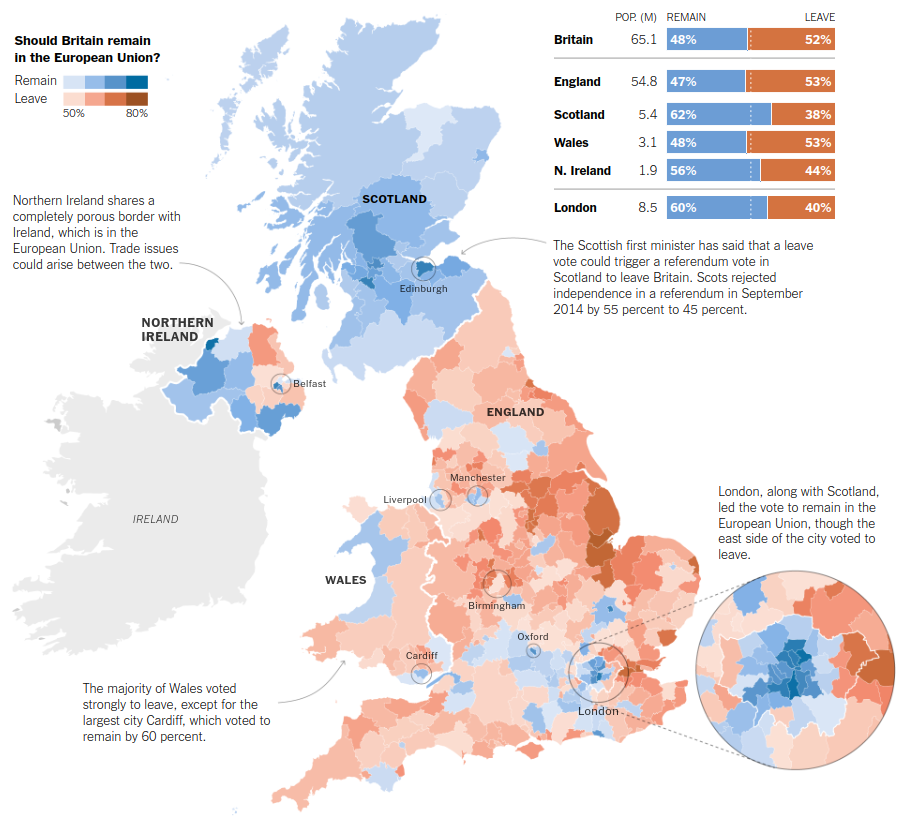

```{r setup, include=FALSE}
knitr::opts_chunk$set(out.width="100%", fig.align="center", fig.showtext=TRUE)
```

## Introduction

The article from The New York Times, published on June 25, 2016, delves into the aftermath of the Brexit referendum, portraying it as a momentous and uncertain chapter in Britain's storied history. The piece captures the prevailing sentiments of shock and uncertainty following the unexpected decision to leave the European Union, as the country grapples with the potential economic, political, and social consequences.

It reflects on the intricate challenges ahead, including the renegotiation of trade agreements, potential shifts in global influence, and the implications for the European Union itself. Through interviews with citizens, politicians, and analysts, the article captures the diverse reactions and apprehensions within the UK and abroad, emphasizing the profound impact of the referendum on the nation's trajectory and its place in the broader European context.

Link to [article](https://www.nytimes.com/2016/06/25/world/europe/brexit-european-union-uncertain-chapter-in-britains-storied-history.html)

### The original graph

The original graph can be found on the [New York Times](https://www.nytimes.com/interactive/2016/06/24/world/europe/how-britain-voted-brexit-referendum.html) graph repository and uses maps and charts to illustrate the voting patterns across various regions, highlighting stark divisions between areas that voted to remain in the European Union and those that opted to leave and providing a detailed breakdown of the results of the Brexit referendum in the United Kingdom.

{width="100%" .external}

## Getting the data right

### Packages

```{r}
library(readr)
library(dplyr)
library(glue)
library(scales)
library(sf)
library(ggforce)
library(patchwork)
library(ggplot2)
library(cowplot)
library(maps)
library(ggnewscale)
library(ggtext)
library(RColorBrewer)
library(mapproj)
```

We should also set here our own working directory

### Loading and fixing the data

The data is not precisely easily accessible (or at least not all of it) so I recommend downloading it from Github.

```{r, results='hide'}
# csv data for the UK
referendum <- read_csv("EU-referendum-result-data.csv")

# shapefiles
uk_shp <- read_sf("maps/uk_constituencies_2016.shp")
ireland_shp <- read_sf("maps/IRL_adm1.shp")

# check the geometries to how many divisions they have
length(st_geometry(uk_shp))
length(st_geometry(ireland_shp))

```

After loading the data many variables that were meaningless for creating the graph were eliminated. Once that was done, certain variables were renamed so that the area name and area code were the same in both shapefiles for the UK and Ireland, aligned their coordinate systems so that they matched (at EPSG:4326) and merged the shapefiles altogether and also with the main dataset with all the information.

```{r, results='hide'}
# eliminate meaningless columns of the shp: 
uk_shp$ID <- NULL
ireland_shp$ID_0 <- NULL
ireland_shp$ISO <- NULL
ireland_shp$NAME_0 <- NULL
ireland_shp$TYPE_1 <- NULL
ireland_shp$ENGTYPE_1 <- NULL
ireland_shp$NL_NAME_1 <- NULL
ireland_shp$VARNAME_1 <- NULL

# rename variables
names(ireland_shp)[names(ireland_shp) == "NAME_1"] <- "area_name"
names(ireland_shp)[names(ireland_shp) == "ID_1"] <- "area_code"

referendum <- referendum |> 
  rename(area_code = Area_Code)

# transform and align the coordinate systems
uk_shp <- st_transform(uk_shp, crs = st_crs("EPSG:4326"))
ireland_shp <- st_transform(ireland_shp, crs = st_crs("EPSG:4326"))

#check their coordinates systems
print(st_crs(uk_shp))
print(st_crs(ireland_shp))

#Merge shapefiles
uk_shp1 <- rbind(uk_shp, ireland_shp)

#Merge with dataset
brexit_data <- left_join(uk_shp1, referendum, by = "area_code")

```

Also, I **manually filled the referendum data** (remain, leave and turnout percentages) for the districts of Northern Ireland with the information made available by the [BBC](https://www.bbc.com/news/uk-politics-36616028).

```{r}
#West Tyrone
brexit_data$Pct_Turnout[18] <- 61.8
brexit_data$Remain[18] <- 26765
brexit_data$Leave[18] <- 13274
brexit_data$Pct_Remain[18] <- 66.8
brexit_data$Pct_Leave[18] <- 33.2

#Upper Bann
brexit_data$Pct_Turnout[17] <- 63.8
brexit_data$Remain[17] <- 24550
brexit_data$Leave[17] <- 27262
brexit_data$Pct_Remain[17] <- 47.4
brexit_data$Pct_Leave[17] <- 52.6

#Strangford
brexit_data$Pct_Turnout[16] <- 64.5
brexit_data$Remain[16] <- 18727
brexit_data$Leave[16] <- 23383
brexit_data$Pct_Remain[16] <- 44.5
brexit_data$Pct_Leave[16] <- 55.5

#South Down
brexit_data$Pct_Turnout[15] <- 62.4
brexit_data$Remain[15] <- 32076
brexit_data$Leave[15] <- 15625
brexit_data$Pct_Remain[15] <- 67.2
brexit_data$Pct_Leave[15] <- 32.8

#South Antrim
brexit_data$Pct_Turnout[14] <- 63.4
brexit_data$Remain[14] <- 21498
brexit_data$Leave[14] <- 22055
brexit_data$Pct_Remain[14] <- 49.4
brexit_data$Pct_Leave[14] <- 50.6

#North Down
brexit_data$Pct_Turnout[13] <- 67.7
brexit_data$Remain[13] <- 23131
brexit_data$Leave[13] <- 21046
brexit_data$Pct_Remain[13] <- 52.4
brexit_data$Pct_Leave[13] <- 47.6

#North Antrim
brexit_data$Pct_Turnout[12] <- 64.9
brexit_data$Remain[12] <- 18782
brexit_data$Leave[12] <- 30938
brexit_data$Pct_Remain[12] <- 37.8
brexit_data$Pct_Leave[12] <- 62.2

#Newry and Armagh
brexit_data$Pct_Turnout[11] <- 63.7
brexit_data$Remain[11] <- 31963
brexit_data$Leave[11] <- 18659
brexit_data$Pct_Remain[11] <- 62.9
brexit_data$Pct_Leave[11] <- 37.1

#Mid Ulster
brexit_data$Pct_Turnout[10] <- 61.7
brexit_data$Remain[10] <- 25612
brexit_data$Leave[10] <- 16799
brexit_data$Pct_Remain[10] <- 60.4
brexit_data$Pct_Leave[10] <- 39.6

#Lagan Valley
brexit_data$Pct_Turnout[9] <- 66.6
brexit_data$Remain[9] <- 22710
brexit_data$Leave[9] <- 25704
brexit_data$Pct_Remain[9] <- 46.9
brexit_data$Pct_Leave[9] <- 53.1

#Foyle
brexit_data$Pct_Turnout[8] <- 57.4
brexit_data$Remain[8] <- 32064
brexit_data$Leave[8] <- 8905
brexit_data$Pct_Remain[8] <- 78.3
brexit_data$Pct_Leave[8] <- 21.7

#Fermanagh and South Tyrone
brexit_data$Pct_Turnout[7] <- 67.9
brexit_data$Remain[7] <- 28200
brexit_data$Leave[7] <- 19958
brexit_data$Pct_Remain[7] <- 58.6
brexit_data$Pct_Leave[7] <- 41.4

#East Londonderry
brexit_data$Pct_Turnout[6] <- 69.9
brexit_data$Remain[6] <- 21098
brexit_data$Leave[6] <- 19455
brexit_data$Pct_Remain[6] <- 52.0
brexit_data$Pct_Leave[6] <- 48.0

#East Antrim
brexit_data$Pct_Turnout[5] <- 65.2
brexit_data$Remain[5] <- 18616
brexit_data$Leave[5] <- 22929
brexit_data$Pct_Remain[5] <- 44.8
brexit_data$Pct_Leave[5] <- 55.2

#Belfast West
brexit_data$Pct_Turnout[4] <- 48.9
brexit_data$Remain[4] <- 23099
brexit_data$Leave[4] <- 8092
brexit_data$Pct_Remain[4] <- 74.1
brexit_data$Pct_Leave[4] <- 25.9

#Belfast South
brexit_data$Pct_Turnout[3] <- 67.6
brexit_data$Remain[3] <- 30960
brexit_data$Leave[3] <- 13596
brexit_data$Pct_Remain[3] <- 69.5
brexit_data$Pct_Leave[3] <- 30.5

#Belfast North
brexit_data$Pct_Turnout[2] <- 57.5
brexit_data$Remain[2] <- 20128
brexit_data$Leave[2] <- 19844
brexit_data$Pct_Remain[2] <- 50.4
brexit_data$Pct_Leave[2] <- 49.6

#Belfast East
brexit_data$Pct_Turnout[1] <- 66.5
brexit_data$Remain[1] <- 20728
brexit_data$Leave[1] <- 21918
brexit_data$Pct_Remain[1] <- 48.6
brexit_data$Pct_Leave[1] <- 51.4

brexit_data$Region_Code <- NULL
brexit_data$Region <- NULL
brexit_data$id <- NULL
brexit_data$Area <- NULL
```

## Replication

### Creating two scales

Since our map is based on two scales (Leave and Remain) with their own legends and positive graduated systems (percentage vote ranging from 1 to 100), we need to **separate our dataset into two datasets**.

In order to do so first we have to classify our data according to which option won (got majority) in each district. For that we need to create a column that classifies each observation as "Leave" or "Remain". Then create the different datasets given the classifier just created.

```{r}
# Making a winner column
brexit_data <- mutate(brexit_data, winner = if_else(Pct_Remain > Pct_Leave, "Remain", "Leave"))

#Add ireland as Pct_leave to plot it gray 
brexit_data$winner[399:424] <- "Leave"

# Creating two different data frames
leave_df <- brexit_data[brexit_data$winner == "Leave",]
remain_df <- brexit_data[brexit_data$winner == "Remain",]
```

On top of that, in the code all of the observations of Ireland were classified as "Leave". This is just to later be able to plot Ireland as a gray area so that the whole Island is displayed for geographical reference. As a result this displays the whole island of Ireland, the part corresponding to Northern Ireland with the corresponding colours for Leave and Remain in each district and the rest of the island in gray.

### Setting fonts for the map

Following this, it sets the base graphics parameter **`par(family = "Times")`** to specify the "Times" font family. The script proceeds to add fonts from Google Fonts using the **`font_add_google`** function from both the "Lora" and "DM Serif Display" font families. These are the fonts that will be used in the final map (I decided to choose those fonts instead of the ones in the original map as I liked better these).

Finally, it activates font rendering with the **`showtext_auto()`** function from the "showtext" package, allowing the specified fonts to be used in subsequent graphical output. Overall, these lines of code ensure that the desired fonts are installed, imported, and configured for use in R graphics.

```{r, results='hide'}
#Add fonts
sysfonts::font_add_google("Lora", family="Lora")
sysfonts::font_add_google("DM Serif Display", family="DM Serif Display")
showtext::showtext_auto()
```

### Creating tags for the map

Before plotting the map it is also necessary to prepare some of the tags that will be displayed on the map (or at least the ones that are attached geographically to it).

In this part of the code, two data frames related to the Brexit referendum **`leave_df`** and **`remain_df`** are manipulated together with a newly created data frame named **`country_tag`** that has the exact coordinates of where each of the tag is to be placed.

For both **`leave_df`** and **`remain_df`**, it is added a new column named **`country`** based on a conditional logic using the **`case_when`** function. This logic assigns country names ("England," "Northern Ireland," "Wales," or "Scotland") to each row in the data frames based on the first letter of the **`area_code`** column.

Additionally, the code reorders the columns to have the newly created **`country`** column as the first column. The final section of the code creates a new data frame, **`country_tag`**, containing information about the latitude and longitude of specific countries. In simpler terms, this chunk prepares and organizes data by assigning countries to rows based on their area codes and creates a separate data frame with geographical information.

```{r}
leave_df <- leave_df |> 
  mutate(country = case_when(
    substr(area_code, 1, 1) == "E" ~ "England",
    substr(area_code, 1, 1) == "N" ~ "Northern Ireland",
    substr(area_code, 1, 1) == "W" ~ "Wales",
    substr(area_code, 1, 1) == "S" ~ "Scotland",
    TRUE ~ NA_character_
  )) 
leave_df <- leave_df |> 
  select(country, everything())

remain_df <- remain_df |> 
  mutate(country = case_when(
    substr(area_code, 1, 1) == "E" ~ "England",
    substr(area_code, 1, 1) == "N" ~ "Northern Ireland",
    substr(area_code, 1, 1) == "W" ~ "Wales",
    substr(area_code, 1, 1) == "S" ~ "Scotland",
    TRUE ~ NA_character_
  )) 
remain_df <- remain_df |> 
  select(country, everything())

#Dataframe of tags (locations on the map)
country_tag <- data.frame(
  country = c("Scotland", "England", "Wales", "Nothern \nIreland"),
latitude = c(56.999651, 54.383331, 52.000, 55.360043), 
longitude = c(-4.809075, -1.866667, -4.933, -7.707558)
)
```

### Creating the base plot (map)

The following R code constructs a **thematic map** using the **`ggplot2`** package in R. The map visualizes the results of the E.U. Referendum in Britain, specifically focusing on the percentage of votes for remaining ("Remain") and leaving ("Leave") the European Union across different regions. Here's a detailed breakdown of the code:

1.  **Base Plot Setup:** The **`ggplot()`** function initializes the plot, and two separate layers are added for the "Remain" and "Leave" data frames using **`geom_sf`**. This function is specifically designed for creating visualizations with spatial data, where each observation in the dataset represents a geographic feature such as a point, line, or polygon. The **`aes`** argument within it specifies the variables (**`Pct_Remain`** or **`Pct_Leave`** respectively) to map to the fill color aesthetic. Remain is plotted with a blue scale and Leave with a scale of reds.

2.  **Color Scales:** **`scale_fill_stepsn`** is used to define color scales for "Remain" and "Leave" percentages. Colors are specified, breaks are set (starting at 50 and ending at 80, which covers the variability of the tunover data), and labels are assigned. The color gradients represent different levels of support, and breaks indicate specific percentage points. Also inside this command the legends are customised for each scale.

3.  **Legend customization**: the **`guide_colorsteps()`** function is utilized to customize the appearance of the legend associated with data. The configuration ensures **`even steps`** in the color scale (uniform distribution of colors across the scale), includes **`ticks`** on the legend with specified color and width, orients the legend horizontally, and provides a clear **`title`** ("Remain"). Additionally, lines are drawn at the lower and upper limits of the color scale, and the frame of the legend is set to black. The size of **`text labels`** within the legend is adjusted to 8 for optimal readability.

4.  **Adding a New Fill Scale:** The **`new_scale_fill()`** command is introduced to reset the fill scale specifically for the subsequent **`geom_sf`** layer that deals with "Leave" data. This is done to separate the color scales for "Remain" and "Leave," allowing independent customization of color gradients, breaks, labels, and other scale-related properties.

5.  **Text Annotations:** **`geom_text`** is employed to add labels to the map. The **`country_tag`** data frame provides coordinates (longitude and latitude) for text placement, and labels are drawn using the specified font ("Lora"). Country names are bold and sized appropriately.

6.  **Themes and Formatting:** The appearance of the map is controlled through various **`theme`** options. **`theme_minimal()`** provides a clean background, and additional adjustments are made for titles, legends, axis labels, grid lines, and font styles. The adjustments include setting the size of the legend title to 9, positioning the plot title to the left with a vertical justification of 0.5, and making the title bold. The legend is positioned at coordinates (0.15, 0.85) within the plot. The text across the plot is set to a specified font family ("DM Serif Display") and a size of 15. Various elements such as axis text, titles, ticks, and grid lines are removed for a cleaner and more minimalistic design. The legend is oriented horizontally, placed in a vertical box on the right, and justified to the right. The key size of the legend is set to a unit of 0.4 cm, and text within the legend is adjusted to a size of 6. The spacing between legend items along the y-axis is set to zero.

7.  **Final Plot Object:** The final plot object is stored in the variable **`map`**.

The map effectively visualizes the voting patterns in the E.U. Referendum, distinguishing between regions that voted to remain or leave. The use of color gradients, text annotations, and a clear legend enhances the interpretability of the map.

```{r, fig.asp=1.15}

map <- ggplot() +
  geom_sf(data = remain_df,
          aes(fill = Pct_Remain),
          colour = "white",
          lwd = 0.1) +
  scale_fill_stepsn(
    colors = c("lightskyblue1", "steelblue1", "dodgerblue", "dodgerblue4"),
    breaks = c(50, 60, 70, 80),
    labels = c("", "", "", ""),
    limits = c(50, 90),
    name = "Remain", 
    guide = guide_colorsteps(
      even.steps = TRUE,
      order = 1,
      ticks = TRUE,
      ticks.colour = "black",
      ticks.linewidth = 0.5,
      direction = "horizontal",
      title = "Remain",
      draw.llim = TRUE,
      draw.ulim = TRUE,
      frame.color = "black",
      label.theme = element_text(size = 8))) +
  new_scale_fill() +
  geom_sf(data = leave_df,
          aes(fill = Pct_Leave),
          colour = "white",
          lwd = 0.1) +
  scale_fill_stepsn(
    colors = c("bisque", "lightsalmon", "orangered", "red3"),
    breaks = c(50, 60, 70, 80),
    labels = c("50%", "", "", "80%"),
    limits = c(50, 90),
    name = "Leave",
    na.value = "gray87", 
    guide = guide_colorsteps(
      even.steps = TRUE,
      order = 1,
      ticks = TRUE,
      ticks.colour = "black",
      ticks.linewidth = 0.5,
      direction = "horizontal",
      title = "Leave",
      draw.llim = TRUE,
      draw.ulim = TRUE,
      frame.color = "black",
      label.theme = element_text(size = 8))) +
  geom_text(data = country_tag,
            aes(x = longitude, y = latitude, label = country),
            color = "black",
            size = 2.5, fontface = "bold",
            family = "Lora") +
  theme_minimal() +
  labs(title =                           "How Britain Voted in the E.U. Referendum",
       x = NULL, 
       y = NULL, 
       fill = "Should Britain remain in the European Union?") +
  theme(legend.title = element_text(size = 9),
        plot.title = element_text(hjust = 0, vjust = 0.5, face = "bold"),
        legend.position = c(0.15, 0.85),
        text = element_text(family = "DM Serif Display",  size = 15),
        axis.text = element_blank(),
        axis.title = element_blank(),
        axis.ticks = element_blank(),
        panel.grid.major = element_blank(),
        panel.grid.minor = element_blank(),
        legend.direction = "horizontal",
        legend.box = "vertical",
        legend.box.just = "right",
        legend.key.size = unit(0.4, "cm"), 
        legend.text = element_text(size = 6),
        legend.spacing.y = unit(0, "cm"))
map

```

As an extra point the coordinates of the map are expanded so that other plots can be added later in the design of the final plot

```{r, fig.asp=1.15}
# Expand coordinates of map

expanded_xmin <- -11.653038
expanded_xmax <- 4.382762
expanded_ymin <- 49.41625
expanded_ymax <- 61.529979

# Modify coord_sf() to include expanded limits
map <- map +
  coord_sf(xlim = c(expanded_xmin, expanded_xmax),
           ylim = c(expanded_ymin, expanded_ymax))

print(map)

```

### Adding tags to the map

The code below seeks to generate a map visual using ggplot2, with additional annotations for selected cities. The **`cities`** **data frame** specifies the names, latitudes, and longitudes of several cities in the United Kingdom. Then, the "new" map (updated version of the previous one) is created by adding circles representing cities to the existing map (**`map`**). Each circle has a radius of 0.2 units, outlined in gray, and the city names are displayed at specified positions around their respective circles. The **`geom_text`** function is used to add city labels, adjusting the vertical and horizontal justification as well as font style and color for each city.

```{r, fig.asp=1.15}
#Cities annotations & coordinates
cities <- data.frame(
  city = c("London", "Manchester", "Cardiff", "Birmingham", "Edinburgh", "Liverpool", "Oxford", "Belfast"),
  latitude = c(51.509865, 53.4794, 51.4861, 52.479876, 55.9410, 53.3549, 51.750051, 54.5930),
  longitude = c(-0.118092, -2.2437, -3.1801, -1.9058, -3.29181, -3.0104, -1.25386, -5.9381))

#MAP + tags/circles
map1 <- map+
  geom_circle(data = cities,
              aes(x0 = longitude, y0 = latitude, r=0.2),  
              stat= "circle",color = "gray48" , fill = NA, 
              size = 0.2)+ 
  geom_text(data = cities[c(2, 3, 4, 7), ], aes(x = longitude, y = latitude, label = city),
            vjust = -2.5, size = 1.5, fontface = "bold", color = "gray24") +
  geom_text(data = cities[c(1, 5), ], aes(x = longitude, y = latitude, label = city),
            vjust = 3.6 , size = 1.5, fontface = "bold", color = "gray24") +
  geom_text(data = cities[6,], aes(x = longitude, y = latitude, label = city),
            hjust = 1.3, size = 1.5, fontface = "bold", color = "gray24") +
  geom_text(data = cities[8,], aes(x = longitude, y = latitude, label = city),
            hjust = -0.5, size = 1.5, fontface = "bold", color = "gray24") +
  theme(aspect.ratio = 1.15)
map1
```

The resulting map (**`map1`**) provides a visual representation of the geographical locations of these cities, enhancing the overall information conveyed by the map. Additionally, the **`theme`** function adjusts the aspect ratio of the map for better visual aesthetics.

### London close-up

In this chunk a zoomed-in version of a map is created using ggplot2. The **`locations`** data frame contains geographical coordinates (longitude and latitude) defining bounding boxes for several cities. The **`location`** variable specifies the city for which the user wants to generate a zoomed map. In the code, it's set to "London," but users can change it to other cities from the list. The code then extracts the longitude and latitude ranges (**`xlim`** and **`ylim`**) for the specified city from the **`locations`** data frame.

```{r}
# Locations dataframe with coordenates 
locations <- data.frame(
  rbind(
    c("London", -0.58913, 0.3520155, 51.2318741, 51.7167602),
    c("Manchester", -2.4034, -2.0937, 53.3794, 53.5501),
    c("Cardiff", -3.3124, -3.0971, 51.4461, 51.5521),
    c("Birmingham", -2.0450, -1.6958, 52.3538, 52.5578),
    c("Edinburgh", -3.3278, -3.0481, 55.8910, 55.9880),
    c("Liverpool", -3.0917, -2.8125, 53.3321, 53.4586),
    c("Oxford", -1.2994, -1.1280, 51.7149, 51.7984),
    c("Belfast", -5.9959, -5.8481, 54.6430, 51.5400)
  ),stringsAsFactors = F)

location <- "London" # Change the location as needed

# Extract xlim and ylim values directly from the locations data frame
xlim <- as.numeric(locations[locations[, 1] == location, c(2, 3)])
ylim <- as.numeric(locations[locations[, 1] == location, c(4, 5)])

```

With this now the extraction of the map is plotted and stored:

```{r}
zoomed_map1 <- map +
  theme(legend.position = "none", plot.title = element_blank(),
        panel.border = element_rect(color = "black", fill = NA, size = 1)) +
  coord_sf(xlim = c(xlim[1], xlim[2]), ylim = c(ylim[1], ylim[2]), crs = 4326) +
  theme(aspect.ratio = 1)
zoomed_map1
```

The resulting **`zoomed_map1`** is generated by adjusting the original map (**`map`**) with additional themes and coordinates. The adjustments include removing the legend, hiding the plot title, adding a black border to the map, and setting the aspect ratio to maintain the correct proportions. The **`coord_sf`** function is used to set the limits for the x and y axes based on the extracted ranges for the chosen city. The resulting map (**`zoomed_map1`**) provides a closer look at the specified city by zooming in on its geographical coordinates.

### Remain-Leave bar plot

After having ready the base map we need to start creating the adjacent plots. This code generates a bar plot using ggplot2 in R to visualize the results of the Brexit referendum in different regions of the United Kingdom. The data frame **`df`** contains information about the population, "Remain" votes, and "Leave" votes for regions such as Britain, England, London, Scotland, Wales, and Northern Ireland. The factor levels of the "Region" variable are reordered for better visualization.

```{r}
# Create new data frame with the data
df <- data.frame(Region = c("Britain", "England", "London", "Scotland", "Wales", "N. Ireland", " "),
                 Pop_M = c(64.1, 53.0, 8.5, 5.3, 3.0, 1.8, NA),
                 Remain = c(48, 47, 60, 62, 47, 56, NA),
                 Leave = c(52, 53, 40, 38, 53, 44, NA))

# Reorder levels of factor
df$Region <- factor(df$Region, levels = c("London", "N. Ireland", "Wales", "Scotland", "England", "Britain", " "), ordered = is.ordered(df$Region))

```

Again, once the data is ready, it just needs to be plotted. The **`bar_plot`** is created by reshaping the data using the **`gather`** function to represent the "Remain" and "Leave" votes as separate bars for each region. The resulting plot shows a stacked bar chart where each region is divided into "Remain" and "Leave" segments. The code also includes text annotations for specific regions, emphasizing the vote percentages in key areas such as Northern Ireland, Scotland, and London.

The plot is then flipped horizontally (**`coord_flip()`**) for simulating the one in the reference graph (which is a horizontal plot), and custom themes and color scales are applied to enhance the visual representation. The plot includes two sets of text annotations within the stacked bars, highlighting regions like "N. Ireland," "Scotland," and "London" with specific vertical adjustments. Additional annotations label "REMAIN" and "LEAVE," while the plot is customized with a minimal theme, flipped coordinates, color-filled bars for "Remain" and "Leave," removal of grid lines, and a dashed horizontal line at 50% for reference, indicating the threshold between "Remain" and "Leave" outcomes.

```{r}
#plot bar plot
bar_plot <- df |> 
  select(Region, Remain, Leave)  |> 
  tidyr::gather(key, VoteCount, -Region) |> 
  ggplot(aes(x = Region, y = VoteCount, fill = key)) +
  geom_bar(stat = "identity") +
  geom_text(aes(label = ifelse(Region %in% c("N. Ireland", "Scotland", "London"), paste0(VoteCount, "%"), "")),
            position = position_stack(vjust = c(0.4, 0.47)),
            color = "white", fontface = "bold", size = 2) +
  geom_text(aes(label = ifelse(Region %in% c("England", "Wales", "Britain"), paste0(VoteCount, "%"), "")),
            position = position_stack(vjust = c(0.5, 0.6)),
            color = "white", fontface = "bold", size = 2) +
  annotate("text", x=6.7, y= 12, label = "REMAIN",  size = 2)+
  annotate("text", x=6.7, y= 90, label = "LEAVE", size = 2)+
  labs(title = "",
       x = "", y = "") +
  theme_minimal() +
  coord_flip() +
  scale_fill_manual(values = c("Remain" = "dodgerblue4", "Leave" = "red3"))+
  theme(legend.position = "none",
        panel.grid.major = element_blank(),
        panel.grid.minor = element_blank(),
        axis.text.x = element_blank(),
        axis.text.y = element_text(face = "bold", color = "black", size = 6, hjust = 0, family = "Lora"))+
  geom_hline(yintercept = 50, linetype = "dashed", color = "white", size=0.2)
bar_plot
```

### London zoom-up lines

To make this plot closer to the reference plot dashed lines need to be added and connected to the zoomed-up map. he coordinates for the starting and ending points of each line are specified in the origin1, end1, origin2, and end2 vectors. They were manually chosen using a [web](https://www.findlatitudeandlongitude.com/l/Killybegs++++IRELAND/1242856/) that displays the coordenates of any point you might choose on a map.

**Two data frames**, line1 and line2, were then created to represent the coordinates of each line. The **code builds on an existing map** (map1) and uses the geom_segment function to add two dashed line segments to the map. The aesthetics define the starting and ending points of each segment using the x and y coordinates from the respective data frames. The color is set to "grey38," the linetype to "dashed," and the size to 0.13, resulting in two visually distinct dashed lines representing the specified segments.

```{r, fig.asp=1.15}
#LINE 1
origin1 <- c(-0.090525, 51.757161)
end1 <- c(1.904604, 52.578733)

#LINE2
origin2 <- c(-0.100525, 51.240399)
end2 <- c(1.904604, 50.999038)

line1 <- data.frame(x = c(origin1[1], end1[1]), y = c(origin1[2], end1[2]))
line2 <- data.frame(x = c(origin2[1], end2[1]), y = c(origin2[2], end2[2]))

map2 <- map1 +
  geom_segment(data = line1,
               aes(x = x[1], y = y[1], xend = x[2], yend = y[2]),
               color = "grey38", linetype = "dashed", size = 0.13) +
  geom_segment(data = line2,
               aes(x = x[1], y = y[1], xend = x[2], yend = y[2]),
               color = "grey38", linetype = "dashed", size = 0.13)
map2

```

The resulting map, map2, displays the original map with the added line segments.

### Putting everything together

In order to put everything together the coordinates (xmin, xmax, ymin, ymax) are specified to determine the placement of the zoomed map within the combined plot, focusing on a specific region. Similarly, coordinates (xmin1, xmax1, ymin1, ymax1) are specified for the placement of the bar plot. The annotation_custom function is then used to add each individual plot as a custom annotation to the main map (map2).

```{r}
# Specify coordinates for the zoomed map
xmin <- 1.5
xmax <- 4.5
ymin <- 50.5
ymax <- 53

#specify coordinates for the bar plot
xmin1 <- -2
xmax1 <- 5.5
ymin1 <- 55.5
ymax1 <- 60.5
```

The first **annotation_custom** call adds the zoomed map (zoomed_map1) to the specified region of the main map (map2). The second annotation_custom call adds the bar plot (bar_plot) to another specified region. The resulting plot, plot_w\_addins, displays both the zoomed map and the bar plot in a single composite view. This approach allows for the juxtaposition of different visualizations within the same plot, providing a comprehensive overview of spatial and categorical information.

```{r, fig.asp=1.15}
# Combine the maps into one
combined_map <- annotation_custom(grob = ggplotGrob(zoomed_map1), 
                                xmin = xmin, xmax = xmax, 
                                ymin = ymin, ymax = ymax)

combined_bar <- annotation_custom(grob = ggplotGrob(bar_plot), 
                                  xmin = xmin1, xmax = xmax1, 
                                  ymin = ymin1, ymax = ymax1)


# Create combination of all plots
plot_w_addins <- map2 + combined_map + combined_bar
plot_w_addins
```

### Final annotations

Finally, the big text annotations need to be added on top of everything else.

First, geographical points and annotation texts related to specific regions are defined. Each set of points represents a geographic area (e.g., Scotland, London, Ireland, Wales), and the associated **annotation_text** provides information or context about that region in relation to the Brexit referendum

```{r}
#Scotland
point1 <- c(-0.666206, 55.598766)
point2 <- c(-2.456146, 56.080442)
point3 <- c(-0.59, 55.152745)
annotation_text1 <- "The Scottish first minister has said that a leave\nvote could trigger a referendum vote in\nScotland to leave Britain. Scots rejected\nindependence in a referendum in September\n2014 by 55 percent to 45 percent."

#London

point4 <- c(1.930838, 53.06749)
annotation_text2 <- "London, along with Scotland,\nled the vote to remain in the\nEuropean Union, though the\neast side of the city voted to\nleave."

#Ireland
point5 <- c(-7.84579, 55.970628)
point6 <- c(-6.506151, 55.300913)
point7 <- c(-11.220845, 56.260588)
annotation_text3 <- "Northern Ireland shares a\ncompletely porous border with\nIreland, which is in the\nEuropean Union. Trade issues\ncould arise between the two."

#Wales
point8 <- c(-5.517893, 50.843996)
point9 <- c(-4.524143, 51.599867)
point10 <- c(-9.527097, 50.85646)
annotation_text4 <- "The majority of Wales voted\nstrongly to leave, except for the\nlargest city Cardiff, which voted to\nremain by 60 percent."
```

Overall, this code helps position annotations on a map to provide additional information about key regions and their stances during the Brexit referendum.

At last the final plot with the annotations:

The code uses **`geom_curve`** to draw curved arrows between specific points, creating visual connections on the map. The arrows are labeled with text annotations, conveying additional information about each region's significance in the context of the Brexit referendum.

The annotations are positioned strategically using **`annotate("text")`** along with specified coordinates for clarity. Additionally, the overall appearance of the plot is fine-tuned by adjusting the theme to minimize unnecessary elements, such as axis ticks and grid lines, and enhancing the overall aesthetics.

```{r, fig.asp=1.15, preview=TRUE}

#final plot
plot_w_addins+
  geom_curve(aes(x = point1[1], y = point1[2], xend = point2[1], yend = point2[2]),
             curvature = 0.3,  # Adjust curvature as needed
             arrow = arrow(length = unit(0.05, "cm")),  # Add an arrow at the end
             color = "gray51") +
  geom_curve(aes(x = point5[1], y = point5[2], xend = point6[1], yend = point6[2]),
             curvature = -0.3,  # Adjust curvature as needed
             arrow = arrow(length = unit(0.05, "cm")),  # Add an arrow at the end
             color = "gray51") +
  geom_curve(aes(x = point8[1], y = point8[2], xend = point9[1], yend = point9[2]),
             curvature = 0.3,  # Adjust curvature as needed
             arrow = arrow(length = unit(0.05, "cm")),  # Add an arrow at the end
             color = "gray51") +
  annotate("text", x = point3[1], y = point3[2],
           label = annotation_text1, size = 1.7, color = "black", family = "Lora", hjust = 0) +
  annotate("text", x = point4[1], y = point4[2],
           label = annotation_text2, size = 1.7, color = "black", family = "Lora", hjust = 0) +
  annotate("text", x = point7[1], y = point7[2],
           label = annotation_text3, size = 1.7, color = "black", family = "Lora", hjust = 0) +
  annotate("text", x = point10[1], y = point10[2],
           label = annotation_text4, size = 1.7, color = "black", family = "Lora", hjust = 0) +
  theme_minimal()+
  theme(legend.title = element_text(size = 9),
        plot.title = element_text(hjust = 0, vjust = 0.5, face = "bold"),
        legend.position = c(0.15, 0.85),
        text = element_text(family = "DM Serif Display",  size = 15),
        axis.text = element_blank(),
        axis.title = element_blank(),
        axis.ticks = element_blank(),
        panel.grid.major = element_blank(),
        panel.grid.minor = element_blank(),
        legend.direction = "horizontal",
        legend.box = "vertical",
        legend.box.just = "right",
        legend.key.size = unit(0.4, "cm"), 
        legend.text = element_text(size = 6),
        legend.spacing.y = unit(0, "cm"))

```

The **`legend.position`** parameter determines the location of the legend, placing it slightly to the right and towards the top of the plot. The **`text`** parameter specifies the font family as "DM Serif Display" with a font size of 15, ensuring a consistent and aesthetically pleasing text style throughout the plot. Additionally, various elements such as axis labels, titles, ticks, and grid lines are removed using **`element_blank()`**, contributing to a clean and uncluttered layout.

The legend is configured to be horizontal (**`legend.direction`**), and its box is styled to be vertical with justification to the right (**`legend.box`** and **`legend.box.just`**). Further customization includes adjusting the size of legend keys (**`legend.key.size`**), text size within the legend (**`legend.text`**), and eliminating vertical spacing between legend items (**`legend.spacing.y`**). Collectively, these theme settings enhance the plot's readability, maintain a coherent design, and prioritize the display of essential information.

### Limitations

Some key limitations of this graph are the legend and the zoomed-up map. In the original map the legend was created with another program and with R this is the closest I could manage to get after making a few adjustments. Regarding the zoomed up map I tried different methods like buffer or [ggmapinset](https://cidm-ph.github.io/ggmapinset/), but given the structure of my data and layers I was not able to make the zoomed-up map round.

## Is there an alternative way?

The remaining library that would be needed:

```{r}
library(htmltools)
library(leaflet)
library(sf)
library(sp)
```

The data should be loaded again and the data for Northern Ireland should be manually loaded again just like for the previous map:

```{r}
#csv
referendum <- read_csv("EU-referendum-result-data.csv")
#UK shapefile
uk_shp <- read_sf("maps/uk_constituencies_2016.shp")

#modifications for merging
referendum <- referendum |> 
  rename(area_code = Area_Code)

#merge
brexit_data <- left_join(uk_shp, referendum, by = "area_code")

#West Tyrone ...
#brexit_data$Pct_Turnout[18] <- 61.8
#brexit_data$Remain[18] <- 26765
#...
```

Then the cleaned data should be reprojected into WGS84

```{r}
#Reproject data to WGS84
brexit_data <- st_transform(brexit_data, 4326)
```

Subsequently, the **`brexit_data`** dataframe is being modified with a new variable called **`margin`**. This variable is calculated as the absolute difference between the columns **`Pct_Remain`** and **`Pct_Leave`**. The **`mutate`** function from the **`dplyr`** package is used to create this new column.

Then, the **`range`** function is applied to the **`margin`** variable within the **`brexit_data`** dataframe. The **`range`** function returns the minimum and maximum values of a numeric vector. In this context, it calculates the minimum and maximum values of the **`margin`** variable. The **`na.rm = TRUE`** argument is included to exclude any missing values (NA) when determining the range.

```{r}
#min_max values
brexit_data <- mutate(brexit_data, margin = abs(Pct_Remain - Pct_Leave))
min_max_values <- range(brexit_data$margin, na.rm = TRUE)

```

After that is done a colour palette for the plotted map must be created. This colour palette will take the lightest colour for the smallest number of the margin between votes.

```{r}
#colour palette 

leave_palette <- colorNumeric(palette = "Reds", domain=c(min_max_values[1], min_max_values[2]))
remain_palette <- colorNumeric(palette = "Blues", 
                               domain=c(min_max_values[1], min_max_values[[2]]))

```

This code is creating two color palettes, **`leave_palette`** and **`remain_palette`**, for visualizing the margin between "Pct_Remain" and "Pct_Leave" in a graphical representation. The **`colorNumeric`** function is used from the **`leaflet`** package, and it allows for the creation of a color palette based on a numeric range.

The **`palette`** argument specifies the color scheme, with "Reds" for **`leave_palette`** and "Blues" for **`remain_palette`**. The **`domain`** argument sets the range of values for which colors will be assigned. In this case, the range is determined by **`min_max_values[1]`** (minimum) and **`min_max_values[2]`** (maximum), which were calculated in the previous code block as the minimum and maximum values of the absolute margin between "Pct_Remain" and "Pct_Leave". The color palettes will be used later for mapping and visualizing the data, with lighter colors representing smaller margins and darker colors representing larger margins.

For this visualization, **two different dataframes are needed**, so they are created in the same way as in the previous plot:

```{r}
# Making a winner column
brexit_data <- mutate(brexit_data, winner = if_else(Pct_Remain > Pct_Leave, "Remain", "Leave"))

#Creating two different data frames
leave_df <- brexit_data[brexit_data$winner == "Leave",]
remain_df <- brexit_data[brexit_data$winner == "Remain",]

```

Also, in order to have popups for each district to be used in conjunction with the leaflet map, they have to be previously set:

This chunk is creating HTML-formatted popups for map markers in a geographic visualization. The popups provide information about the voting results for different areas, particularly focusing on the "Leave" and "Remain" campaigns in the context of the Brexit referendum.

```{r}
#Create a popup

leave_popup <- glue("<strong>{leave_df$area_name} AREA</strong><br />
                    <strong>winner: Leave</strong><br />
                    Leave: {scales::comma(leave_df$Pct_Leave, accuracy = 1)}<br />
                    Remain: {scales::comma(leave_df$Pct_Remain, accuracy = 1)}<br />
                    Margin: {scales::comma(leave_df$margin, accuracy = 1)}")  %>%   
  lapply(htmltools::HTML)
remain_popup <- glue("<strong>{remain_df$area_name} AREA</strong><br />
                      <strong>winner: Remain</strong><br />
                      Remain: {scales::comma(remain_df$Remain, accuracy = 1)}<br />
                      Leave: {scales::comma(remain_df$Leave, accuracy = 1)}<br />
                      Margin: {scales::comma(remain_df$margin, accuracy = 1)}")  %>%   
  lapply(htmltools::HTML)

```

For the "leave_popup," the information includes the area name, the winning campaign ("Leave"), the percentage of votes for "Leave," the percentage of votes for "Remain," and the margin between the two. The **`glue`** function is used to dynamically insert values from the **`leave_df`** dataframe into an HTML template. The **`lapply`** function is then applied to convert the resulting string into an HTML object.

Similarly, for the "remain_popup," the information includes the area name, the winning campaign ("Remain"), the percentage of votes for "Remain," the percentage of votes for "Leave," and the margin between the two. The **`glue`** function is again utilized to create an HTML-formatted string, and **`lapply`** converts it into an HTML object.

**Lastly, the background for the map is set and the map is plotted:**

```{r}
#Set the background of the map

leaflet() %>%
  addProviderTiles("CartoDB.Positron")
```

This code above uses the **`leaflet`** R package to create an interactive map, and it sets the background map tiles to be provided by CartoDB with a Positron theme. The **`leaflet()`** function initializes a new leaflet map, and **`addProviderTiles("CartoDB.Positron")`** adds the specified map tiles from CartoDB's Positron theme as the background to the leaflet map. This provides a clean and visually appealing base map for further layers and data visualization on the leaflet map.

```{r}
#Then we overlay the data

leaflet() %>%
  addProviderTiles("CartoDB.Positron") %>%
  addPolygons(
    data = leave_df,
    fillColor = ~leave_palette(leave_df$margin),
    label = leave_popup,
    stroke = TRUE,
    smoothFactor = 0.2,
    fillOpacity = 0.8,
    color = "#666",
    weight = 1
  ) %>%
  addPolygons(
    data = remain_df,
    fillColor = ~remain_palette(remain_df$margin),
    label = remain_popup,
    stroke = TRUE,
    smoothFactor = 0.2,
    fillOpacity = 0.8,
    color = "#666",
    weight = 1
  )

```

The previous code just overlays a map on a cartographic base layer using CartoDB's Positron tiles.

The **`addPolygons`** function is then used to overlay polygons on the map, representing geographical areas. Two sets of polygons are added to the map, corresponding to the **`leave_df`** and **`remain_df`** datasets, each with specific styling. The **`fillColor`** parameter is set dynamically using color palettes (**`leave_palette`** and **`remain_palette`**) based on the margin values in each dataset. This creates a choropleth map where different shades of color represent different margins between Leave and Remain votes in each geographic area.

Additionally, the **`label`** parameter is used to create pop-up labels for each polygon, displaying relevant information such as the area name, the winning side (Leave or Remain), individual vote percentages, and the margin. The map is designed to be interactive, allowing users to explore the data by hovering over each area and viewing the associated information. The **`stroke`**, **`smoothFactor`**, **`fillOpacity`**, **`color`**, and **`weight`** parameters are set to control the appearance of the polygons, ensuring a visually informative and aesthetically pleasing map.

And with this we have an **`alternative interactive map`** to visualize the data!!
