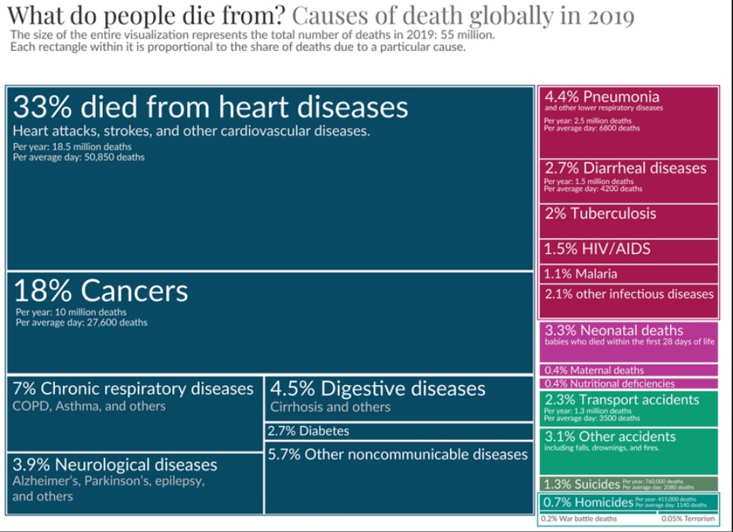

## Introduction and libraries

In order to make this chart, we need tidyverse to tidy the data, ggplot2
to make the graph, and treemapify to helps us to improve our treemap.

```{r}

library(tidyverse)
library(ggplot2)
library(treemapify)

```

## Original Graph

We found out this plot in the section of Terrorism in Our World in Data
but Terrorism and War battle deaths were the most insignificant cause of
deaths. This graph was published in Our World in data and the author is
Max Roser.

The data was collected by IHME global Burden of Disease and Global
Terrorism Database. This database contain data about causes of deaths
from 1970 to 2021. Nevertheless, this graph just represents data
collected in 2019, which is the previous year before the covid-19
pandemic. 2020 and 2021 are not a significant year if you want to study
the evolution of the causes of deaths because they were significantly
affected by the pandemic.

{.external}

## Replication of the graph


```{r}

Tree_terror <- read.csv("pruebacsv.csv")

```

After running the read.cvs, I had to make the tidy data of this
database.

At first, there were more illnesses than needed so I had to aggregate
them all in a new columns with their proper names. For this task, I had
to search and determine the most suitable column for each illness.

```{r}

Q <- Tree_terror |>
  drop_na() |> 
  mutate(Digestive_diseases = Digestive.diseases + Cirrhosis.and.other.chronic.liver.diseases,
         Neurological_deseases = Alzheimer.s.disease.and.other.dementias + Parkinson.s.disease,
         Other_noncommunicable_diseases = Chronic.kidney.disease + Drug.use.disorders + Alcohol.use.disorders, 
         Nutricional_deficiencies = Nutritional.deficiencies + Protein.energy.malnutrition,
         Other_infectious_diseases = Meningitis + Acute.hepatitis,
         Other_accidents = Drowning + Fire..heat..and.hot.substances + Exposure.to.forces.of.nature +Environmental.heat.and.cold.exposure,
         Homicides = Interpersonal.violence + Poisonings)|> 
  filter(Year == 2019, Entity == "World") |> 
  select(-Digestive.diseases, 
        -Cirrhosis.and.other.chronic.liver.diseases, 
        -Alzheimer.s.disease.and.other.dementias, 
        -Parkinson.s.disease,
        -Chronic.kidney.disease,
        -Drug.use.disorders,
        -Alcohol.use.disorders,
        -Nutritional.deficiencies, 
        -Protein.energy.malnutrition,
        -Meningitis,
        -Acute.hepatitis,
        -Drowning,
        -Fire..heat..and.hot.substances,
        -Exposure.to.forces.of.nature ,
        -Environmental.heat.and.cold.exposure,
        -Interpersonal.violence,
        -Poisonings,
        -Code,
        -Year,
        -Entity)  |> 
  pivot_longer(cols = "Malaria":"Homicides", 
               names_to = "Causes", 
               values_to = "Num_of_deaths")


```

To make this a treemap, all illnesses must be within a group. To
aggregate them I decided to create a new column(clasificación) and use a
case_when when they were classified as Infectious disease, Suicides and
so on.

In this way, you can create groups(type of illness) and subgroups(which
are the illnesses themselves).

```{r}
Q <-  Q |> 
    mutate(
    clasificación = case_when(
      Causes %in% c("Cardiovascular.diseases", "Neoplasms", "Chronic.respiratory.diseases", "Digestive_diseases", "Neurological_deseases", "Diabetes.mellitus", "Other_noncommunicable_diseases") ~ "Noncommunicable Diseases",
      Causes %in% c("Lower.respiratory.infections", "Diarrheal.diseases", "Tuberculosis", "HIV.AIDS", "Malaria", "Other_infectious_diseases") ~ "Infectious Diseases",
      Causes %in% c("Neonatal.disorders", "Maternal.disorders", "Nutricional_deficiencies") ~ "Maternity Deaths",
      Causes %in% c("Road.injuries", "Other_accidents") ~ "Transport Accidents",
      Causes %in% c("Self.harm") ~ "Suicides",
      Causes %in% c("Homicides", "Conflict.and.terrorism") ~ "Homicides",
      TRUE ~ "Other"
    )
  )


```

When you finish with tidy and create groups and subgroups, now it is
time for ggplot(geom_treemap).

```{r}

Q <-ggplot(Q, 
            aes(area = Num_of_deaths, fill = clasificación, subgroup = clasificación, label = Causes)) + 
  geom_treemap() +
  geom_treemap_subgroup_border() +
  theme(legend.position = "none", plot.title = ggtext::element_markdown(),
        axis.title = element_blank(), 
        axis.text = element_blank(), 
        axis.ticks = element_blank(), 
        axis.line = element_blank()) +
  labs(title = "**What do people die from?** Causes of death globally in 2019",
       subtitle = "The size of the entire visualization represents the total number of deaths in 2019: 55 million.
Each rectangle within it is proportional to the share of deaths due to a particular cause",
       caption = "Data source: IHME Global Burden of Disease and Global Terrorism Database") +
  scale_fill_manual(values = c("Noncommunicable Diseases" = "#084964", 
                                "Infectious Diseases" = "#a4184d", 
                                "Maternity Deaths" = "#b73695", 
                                "Transport Accidents" = "#0f9d76", 
                                "Suicides" = "#5b8464", 
                                "Homicides" = "#008e84"))
Q
```

### Annotate

I used annotate to write the name of the principle causes of deaths.
But, you have to be cautious because when you use annotate you will
write on the chart, and everything you write it can overlap with other
boxes. Therefore, the box will remain static even though you because

```{r, preview=TRUE}
#If you do anotate and the name are too long, it will overlap

Q <- Q +
   annotate(geom = "text", x = 0.0, y = 1, colour = "white", label = "Cancer") +
   annotate(geom = "text", x = 0.1, y = 0.4, colour = "white", label = "Cardiovascular diseases") +
   annotate(geom = "text", x = 0.42, y = 0.75, colour = "white", label = "Digestive diseases") +
   annotate(geom = "text", x = 0.39, y = 1, colour = "white", label = "Neurological")+
   annotate(geom = "text", x = 0.71, y = 1, colour = "white", label = "Diabetes") +
   annotate(geom = "text", x = 0.85, y = 1, colour = "white", label = "Suicide") +
   annotate(geom = "text", x = 0.87, y = 0.87, colour = "white", label = "Road Injuries")+
   annotate(geom = "text", x = 0.90, y = 0.77, colour = "white",size = 3.2, label = "Neonatal disorders") +
   annotate(geom = "text", x = 0.84, y = 0.60, colour = "white", label = "Malaria") +
   annotate(geom = "text", x = 0.87, y = 0.5, colour = "white", label = "Tuberculosis") +
   annotate(geom = "text", x = 0.85, y = 0.35, colour = "white", label = "Diarrheal")+
   annotate(geom = "text", x = 0.89, y = 0.13, colour = "white", label = "Lower infections") +
   annotate(geom = "text", x = 0.1, y = 0.4, colour = "white", label = "Cardiovascular diseases") +
   annotate(geom = "text", x = 1, y = 1, colour = "white", size = 3, label = "Homicides ") 
Q

```

## Final Replication

```{r}
Q
```

### Limitations

There are 2 main limitations in this chart.

First, the shape of this graph was made by r and I cannot change it into
the shape I want to replicate.

Second, because i cannot replicate the shape of the graph, the names and
explanations within the box cannot be replicated because of the length
and annotation properties.

## Enhancement

For the improvement, I have created a geom_col to visualize all deaths
causes by violence. This is a better plot to study terrorism and its
impact to the total deaths.

Infections, non-communicable disease, fire and so on, on the whole are
unintentional causes. But suicide, terrorism and homicide are
intentional so they have different variables to take into account and
should be studied apart from the rest.

We can see African, European, Americas, South-east Asia, and western
Pacific region to compare the three different violent causes per capita.
Thus, we can compare per capita the proportion of each cause by their
population.

To create this chart, I have just saved the data(regions,number of
people that were affected and the population of those regions). Then, we
had to adjust the name of the column after the gather function. If we do
not do it, we will see in the legend Conflict.and.terrorism instead of
Conflict and terrorism. Finally, we use ggplot for the violent cause per
capita.

```{r}
data <- data.frame(
Region = c("African Region (WHO)", "European Region (WHO)", "Region of
the Americas (WHO)", "South-East Asia Region (WHO)", "Western Pacific
Region (WHO)"),
Homicides = c(98527, 51451, 177179, 61714, 63379),
Conflict.and.terrorism = c(9519, 565, 32, 1880, 421),
Suicide = c(69367, 137266, 94784, 230453, 184918),
Population = c(1292124691, 342597698, 585172586, 655000000, 1900000000)
)


datos_long <- gather(data, key = "Causes", value = "Cantidad", -Region,
-Population)

#We have to adjust the name of the column after the gather function
datos_long$Causes <- ifelse(datos_long$Causes == 
                            "Conflict.and.terrorism", "Conflict and terrorism",    datos_long$Causes)


ggplot(datos_long, 
       aes(x = Cantidad / Population * 100, y = Region, fill = Causes)) +
       geom_col(position = "dodge") +
       labs(title = "Causes of violent death per capita",
       x = "Violent deaths per capita") +
       theme_bw() +
       theme(panel.background = element_rect(fill = "white"),
             axis.text.y = element_text(angle = 0, hjust = 1),
             axis.title.y = element_blank()) + 
       scale_fill_manual(values = 
                           c("Homicides" = "green", 
                             "Conflict and terrorism" = "yellow", 
                             "Suicide" = "brown"))

```

The main finding of this plot is that, even thought you just compare
violent causes, terrorism is not as important as we might have thought.

I do not want to undermine the position of the victims that terrorism
has caused. I just point out that following this plot, yourself and your
neighborgs are more dangerous than a terrorist even though terrorism has
a critical impact on social media.

To sum up, public policies should take more into account preventing
suicide and homicides, at least, as much as they do with terrorism.

