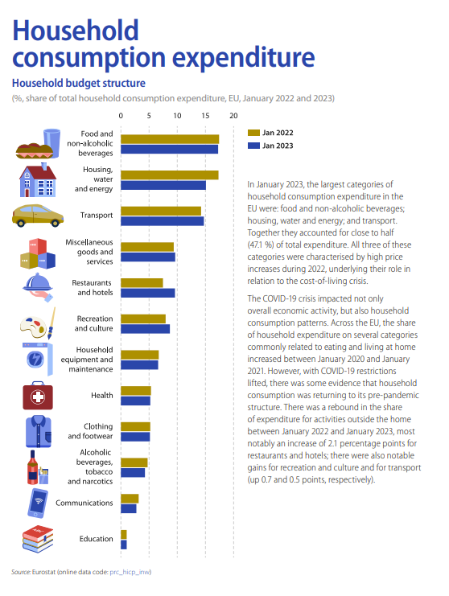

```{r setup, include=FALSE}
knitr::opts_chunk$set(out.width="100%", fig.align="center") 
```

## Introduction

Eurostat provided comprehensive statistical indicators and data visualisations on key figures on the overall economic situation of the Europe Union in 2023 in the sixth edition of Key figures on Europe. One interesting graph was about the household consumption spending in which the author demonstrated the difference in choices in spending of European households between 2022 and 2023. The author also detailed the changes in spending behaviours since the pandemic of COVID-19 in 2020.

Eurostat also provides the source of the data and we will use it to replicate the graph in this project. Later, an alternative graph will be presented as a suggestion for improving the original graph.

Here is the original graph:

{.external}

## Collecting and processing data

### Loading packages

```{r}
library(readr)
library(tidyverse)
library(ggplot2)
library(ggtext)
library(extrafont)
library(sysfonts)
library(showtext)
library(ggimage)
library(patchwork)
```

### Getting the data

Like previously said, Eurostat includes a link in the graph to find the [source data](https://ec.europa.eu/eurostat/databrowser/bookmark/f30337fc-6fd2-41dc-86ef-18d3fdd54952?lang=en). It is possible to include more data from other years as well as from specific countries.

```{r}
data <- read_csv("EU_data.csv.gz")
```

The data file only included coded names for the categories so we will need to create a new column with the names similarly to the graph. The guidelines for the names according to the coded names are also provided by Eurostat ([link](https://ec.europa.eu/eurostat/cache/metadata/en/prc_hicp_esms.htm). We will also add a percent column for more ease to work with as the original data column (OBS_VALUE) is on the scale of 1000. Finally, we only need the data from year 2022 and 2023 so we will filter the data accordingly and select the necessary columns to build the graph.

### Transforming data

```{r}
dataset <- data %>% 
  select(coicop, TIME_PERIOD, OBS_VALUE) %>% 
  mutate(coicop_name = case_when(
    coicop == "CP00" ~ "All-items HICP",
    coicop == "CP01" ~ "Food and non-alcoholic beverages",
    coicop == "CP02" ~ "Alcoholic beverages, tobacco and narcotics",
    coicop == "CP03" ~ "Clothing and footwear",
    coicop == "CP04" ~ "Housing, water and energy", #change to fit the graph
    coicop == "CP05" ~ "Household equipment and maintenance", #Change to fit the graph
    coicop == "CP06" ~ "Health",
    coicop == "CP07" ~ "Transport",
    coicop == "CP08" ~ "Communications",
    coicop == "CP09" ~ "Recreation and culture",
    coicop == "CP10" ~ "Education", 
    coicop == "CP11" ~ "Restaurants and hotels",
    coicop == "CP12" ~ "Miscellaneous goods and services"
    ),
    percent = OBS_VALUE / 1000 * 100) %>% 
  filter((!coicop %in% c("CP00")) & between(TIME_PERIOD, 2022, 2023)) %>% 
  select(coicop, coicop_name, TIME_PERIOD, percent)
```

## Replicating the plot

### Building the basic elements

Now we already have the data set ready, we will start reproducing the graph, first by the basic elements (bar chart, correct axes' positions and scales, and theme). We need to customise the labels on the y axis so that we would not have to rewrite the names on the data set. The colors of the bars also need to be manually picked, this can be done by using a third party web application to identify the color and then simply plug them into manual scale in ggplot (scale_fill_manual).

```{r fig.width = 7, fig.height = 8.5}
p_main <- ggplot(dataset, aes(x = percent,y = reorder(coicop_name, percent))) +
  geom_col(position = position_dodge2(reverse = TRUE), aes(fill = as.character(TIME_PERIOD)), width = 0.6) +
  #Axes and scales
  scale_x_continuous(name = NULL, limits = c(0,20), breaks = seq(0,20,5), position = "top") +
  scale_fill_manual(values = c("#ad9000", "#2a46aa"), labels = c("Jan 2022", "Jan 2023")) +
  #Theme
  theme(#Background and grid line
        panel.background = element_rect(fill = "white"),
        panel.grid.major.x = element_line(
          colour = "grey", 
          linetype = "dashed", 
          size = 0.3),
        plot.margin = margin(0,185,5,10),
        #Axes
        axis.ticks.x = element_blank(),
        axis.ticks.y = element_blank(),
        #Legend 
        legend.title = element_blank(),
        legend.position = c(1.3, 0.97),
        legend.key.height = unit(0.68, "char"),
        legend.key.width = unit(1.25, "char"),
        legend.spacing.y = unit(0.3, "char")
        ) +
  guides(fill = guide_legend(byrow = TRUE)) #helps spacing elements in legend

#Y axis labels
labels <- c(
  "Food and\nnon-alcoholic\nbeverages",
  "Housing,\nwater\nand energy",
  "Transport",
  "Miscellaneous\ngoods and\nservices",
  "Restaurants\nand hotels",
  "Recreation\nand culture",
  "Household\nequipment and\nmaintenance",
  "Health",
  "Clothing\nand footwear",
  "Alcoholic\nbeverages,\ntobacco\nand narcotics",
  "Communications",
  "Education"
) %>% rev()


p_main <- p_main + scale_y_discrete(name = NULL,labels = labels) 

p_main
```

It is noted that in this project, we are replicating the original graph by building 2 separate graphs then later patch them together to achieve a similar look to the original graph. This is because using graphic icons (on the axis label) is not native to ggplot2. Additionally, there was no package that could directly attach the illustrations exactly in the manner of the original graph. Therefore, we will manually create a graph that only has a vector of the icons then attach it to the graph we just created above to achieve the same effect of the original graph.

First we will complete replicating the first part of the graph by adding the annotation text on the right side of the plot.

```{r fig.width = 7, fig.height = 8.5}
caption_text <- "In January 2023, the largest categories of
household consumption expenditure in the
EU were: food and non-alcoholic beverages;
housing, water and energy; and transport.
Together they accounted for close to half
(47.1 %) of total expenditure. All three of these
categories were characterised by high price
increases during 2022, underlying their role in
relation to the cost-of-living crisis.\n
The COVID-19 crisis impacted not only
overall economic activity, but also household
consumption patterns. Across the EU, the share
of household expenditure on several categories
commonly related to eating and living at home
increased between January 2020 and January
2021. However, with COVID-19 restrictions
lifted, there was some evidence that household
consumption was returning to its pre-pandemic
structure. There was a rebound in the share
of expenditure for activities outside the home
between January 2022 and January 2023, most
notably an increase of 2.1 percentage points for
restaurants and hotels; there were also notable
gains for recreation and culture and for transport
(up 0.7 and 0.5 points, respectively)."

p_main <- p_main +
  labs(tag = caption_text) +
  coord_cartesian(clip = "off") +
  theme(plot.tag.position = c(1.060, 0.51),
        plot.tag = element_text(hjust = 0, 
                                size = 9,
                                colour = "grey50", 
                                lineheight = 1.25)) 
p_main
```

Now we already have all the elements of the main part of the original graph, we can adjust the text so that it looks like the original one. The original graph used an Adobe font, which is also not openly available, therefore we will use another font from Google fonts that closely resembles it (Open Sans).

```{r fig.width = 7, fig.height = 8.5}
#Fonts
font_add_google("Open Sans", family="opensans")
showtext_auto()
font <- "opensans"

p_main <- p_main +
  theme(
    legend.text = element_text(vjust = 0.5, margin = margin(0,0,0,-3), face = "bold", 
                               size = 9, family = font),
    plot.tag = element_text(family = font),
    axis.text.y = element_text(margin = margin(0,0,0,-22),vjust = 0.4, 
                               family = font, size = 9, lineheight = 1.02),
    axis.text.x = element_text(family = font, size = 9)
  )

p_main
```

### Building icon graph (second graph)

We now create the second part of the graph which is the icons. To do this, we would first need to cut out the icons manually from the original graph and process them into appropriate file type (e.g. png). This can be done by using different third-party applications (such as Photoshop, Illustrator, Affinity Designer, etc.). We then use ggimage to turn the pictures into usable R object and plot them on a ggplot graph. We also need to remove all other elements (i.e. axis, grid, text, background, etc.) to have a singular graphic vector of the icons.

```{r fig.width = 7, fig.height = 8.5}
#Add images path
dataset <- dataset %>% 
  mutate(path = case_when(
    coicop == "CP01" ~ "images/Food@2x.png",
    coicop == "CP02" ~ "images/Alcoholic@2x.png",
    coicop == "CP03" ~ "images/Clothing@2x.png",
    coicop == "CP04" ~ "images/Housing@2x.png",
    coicop == "CP05" ~ "images/Householdequip@2x.png",
    coicop == "CP06" ~ "images/Health@2x.png",
    coicop == "CP07" ~ "images/Transport@2x.png",
    coicop == "CP08" ~ "images/Communications@2x.png",
    coicop == "CP09" ~ "images/Recreation@2x.png",
    coicop == "CP10" ~ "images/Education@2x.png", 
    coicop == "CP11" ~ "images/Restaurant@2x.png",
    coicop == "CP12" ~ "images/Miscellaneous@2x.png"
  ))

p_icon <- ggplot(dataset, aes(x = percent,y = reorder(coicop_name, percent))) +
  geom_image(aes(image = path, x = 0), size=.12) +
  theme(
    axis.text = element_blank(),
    panel.grid = element_blank(),
    axis.ticks = element_blank(),
    panel.background = element_blank()
  ) + 
  labs(x = NULL, y = NULL, fill = NULL)

p_icon
```

### Patching things up...

Having 2 parts of the graph created, we now only need to merge them together to create a unified graph. Using patchwork package, we can adjust the size of the 2 graphs so that they look similar to the original graph. We also need to add the title and subtitle, along with the source of the data at the foot of the plot. Since the original graph has a second subtitle with a different color (which is also not native to ggplot2), we will write it as an html element using ggtext package.

```{r fig.width = 7, fig.height = 9, preview=TRUE, fig.showtext=TRUE, out}
caption_source = "Source: Eurostat (online data code: <span style = 'color:#2a46aa'>prc_hicp_inw</span>)"

p_replicated <- wrap_plots(list(p_icon, p_main), widths = c(8,16)) &
  plot_annotation(
    title = "Household<br>consumption expenditure",
    subtitle = "<span><b>Household budget structure<b></span><br>
    <span style = 'font-size: 10pt; color:#878586'>
    (%,share of total household consumption expenditure, EU, January 2022 and 2023)
    </span>",
    caption = caption_source,
    theme = theme(
      plot.margin = margin(15,50,15,15),
      plot.title = element_markdown(
        colour = "#2a46aa", 
        size = 27,  
        family = font,
        face = "bold",
        lineheight = 0.8),
      plot.subtitle = element_markdown(
        colour = "#2a46aa", size = 13,
        family = font, lineheight = 1.3),
    #caption / source
    plot.caption.position = "plot",
    plot.caption = element_markdown(
      hjust = 0, 
      size = 8, 
      colour = "#878586")
    )
  )
p_replicated
```

## Alternative graph

The graph from Eurostat is fairly simple to understand and the visualisation issues are minimal. The text on the right of the graph is a little lengthy and quite misses the point of creating a graph (putting words and data into graphs and charts for quick understanding). The icons used also make the graph less reproducible and consequently less apt for sharing or scaling. We will consider these issues and make an alternative graph that presents the same information but is potentially better for interpretation.

### Loading libraries

```{r}
library(scales)
library(ggstance)
library(fontawesome) #For icons in table in second plot
library(gt) #For creating nice tables
library(gtExtras) #For icons in gt
library(emojifont) #For easy plotting fontawesome
```

### Font

```{r}
font_add_google("Montserrat", family="montserrat")
showtext_auto()
font <- "montserrat"
```

We are using a google font for easy access and reproducibility. Montserrat also looks modern and easy to read.

### Load and transform data

```{r}
data <- read_csv("custom_data.csv")
data <- data %>% 
  select(coicop, geo, TIME_PERIOD, OBS_VALUE)

eu <- data %>% filter(geo == "EU27_2020" & coicop != "CP00" & TIME_PERIOD >= 2015) %>%
  mutate(coicop_name = case_when(
    coicop == "CP01" ~ "Food and non-alcoholic beverages",
    coicop == "CP02" ~ "Alcoholic beverages, tobacco and narcotics",
    coicop == "CP03" ~ "Clothing and footwear",
    coicop == "CP04" ~ "Housing, water and energy", #change to fit the graph
    coicop == "CP05" ~ "Household equipment and maintenance", #Change to fit the graph
    coicop == "CP06" ~ "Health",
    coicop == "CP07" ~ "Transport",
    coicop == "CP08" ~ "Communications",
    coicop == "CP09" ~ "Recreation and culture",
    coicop == "CP10" ~ "Education", 
    coicop == "CP11" ~ "Restaurants and hotels",
    coicop == "CP12" ~ "Miscellaneous goods and services"
    ),
    percent = OBS_VALUE / 10) %>% 
  select(coicop, coicop_name, TIME_PERIOD, percent) %>% 
  rename(year = TIME_PERIOD) %>% 
  group_by(coicop) %>% 
  mutate(
    change = percent - lag(percent)
  ) %>% ungroup()
```

We need to pull out more data from Eurostat so that we have the data from the previous years to turn the long text into a graph. The data transformation process is the same. Since we are turning the text into a graph, we will have to create 2 separate plots then patch them up together to create a whole graph.

### Building the graph

We start by building the background for the first graph (alternative version of the main plot in the original graph). We are keeping some elements of the original graph (vertical dashed-lines for grid-line, x-axis label on the top, etc.) so it does not look too different from the original but rather an enhancement based on the original graph.

Also, the original graph's x-axis labels might be a bit unclear so we will put a '%' sign next to the number so the graph is easier to read.

#### Main plot background

```{r}
bg <- ggplot(eu, aes(y = reorder(coicop_name, percent), x = percent)) +
  scale_x_continuous(limits = c(0,20),breaks = c(0,5,10,15,20), position = "top",
                     labels = function(x) paste0(x, "%")) +
  labs(subtitle = "Share of total household consumption expenditure, European Union") +
  theme(
    panel.grid.major.y = element_blank(),
    panel.grid.major.x = element_line(colour = "grey",linetype = "dashed"),
    panel.background = element_blank(),
    axis.ticks = element_blank(),
    axis.title = element_blank(),
    axis.text = element_text(size = 12),
    plot.title.position = "plot",
    plot.subtitle = element_text(family = font, colour = "grey60", 
                                   size = 16 ,face = "bold")
  ) 
bg
```

#### Main Plot

Now, we can plot the data onto the graph. I believe using 2 circles on the graph instead of the bar chart can deliver the same information but at the same time uses less space and has a more modern, sleek look that the old bar chart.

```{r}
#Data for plot
y2223 <- eu %>% filter(year >= 2022)
#Colours
p_color = "blue"
```

```{r}
p_main <- bg +
  geom_point(data = y2223,
             aes(percent, 
                 reorder(coicop_name,percent), 
                 shape = as.factor(year)),
             size = 5,
             colour = p_color) +
  scale_shape_manual(values = c(1, 19)) +
  theme(
    plot.margin = margin(10,10,10,10),
    legend.position = "top",
    legend.justification = "right",
    legend.title = element_blank(),
    legend.key = element_blank(),
    legend.text = element_text(size = 12, family = "montserrat"),
    legend.direction = "horizontal",
    axis.text = element_text(family = "montserrat"),
    axis.text.y = element_text(colour = p_color, size = 13) 
  )
p_main
```

### Second plot

For the second plot, the message of the annotation text from the original graph is about the changes of the household spending categories since the incident of COVID-19. After the virus spread had subdued and curfew and restrictions had been lifted, people seemed to resume to normal activities (going to restaurant, travelling, etc.). Instead of writing in text, I thought that we can turn it into a table like graph that shows the trend of the spending compared to the previous year (up or down). With this, we can sort of see the story of how life unfolded after COVID-19 for each category.

```{r}
#Dataframe for second plot
p2_df <- eu %>% filter(year >= 2020) %>% 
  mutate(icon = if_else(change < 0, "fa-angle-down", "fa-angle-up"))

# Icon size
icon_size <- 8
y_label_pos <- filter(p2_df, year == 2023) %>% arrange(desc(percent)) %>% pull(coicop_name) %>% rev()

p2 <- ggplot(p2_df, aes(x = year, y = factor(coicop_name, levels = factors))) +
  scale_x_discrete(limits = c(2020, 2021, 2022, 2023),position = "top") +
  geom_text(data = filter(p2_df, year == 2020),
            aes(x = 2020, y = coicop_name, label = fontawesome(icon), color = icon),
            family = "fontawesome-webfont",
            size = icon_size)+
  geom_text(data = filter(p2_df, year == 2021),
            aes(x = 2021, y = coicop_name, label = fontawesome(icon), color = icon),
            family = "fontawesome-webfont",
            size = icon_size) +
  geom_text(data = filter(p2_df, year == 2022),
            aes(x = 2022, y = coicop_name, label = fontawesome(icon), color = icon),
            family = "fontawesome-webfont",
            size = icon_size) +
  geom_text(data = filter(p2_df, year == 2023),
            aes(x = 2023, y = reorder(coicop_name, percent), label = fontawesome(icon), color = icon),
            family = "fontawesome-webfont",
            size = icon_size) +
  scale_colour_manual(values = c("red", "blue")) +
  scale_y_discrete(limits = y_label_pos) +
  theme(
    panel.grid.major.y = element_blank(),
    panel.grid.major.x = element_blank(),
    panel.background = element_blank(),
    axis.ticks = element_blank(),
    axis.title = element_blank(),
    axis.text = element_text(size = 12, family = font, face = "bold"),
    axis.text.y = element_blank(),
    legend.position = "none"
  ) 
p2
```

### Final result

```{r layout = "l-page", fig.dim = c(12,8), fig.showtext = TRUE}
wrap_plots(list(p_main, p2), widths = c(17,6.5)) & 
  plot_annotation(
    title = "Household Consumption Expenditure",
    theme = theme(
      plot.title = element_text(size = 26, family = font, 
                                colour = "blue", face = "bold")
    )
  )
```
