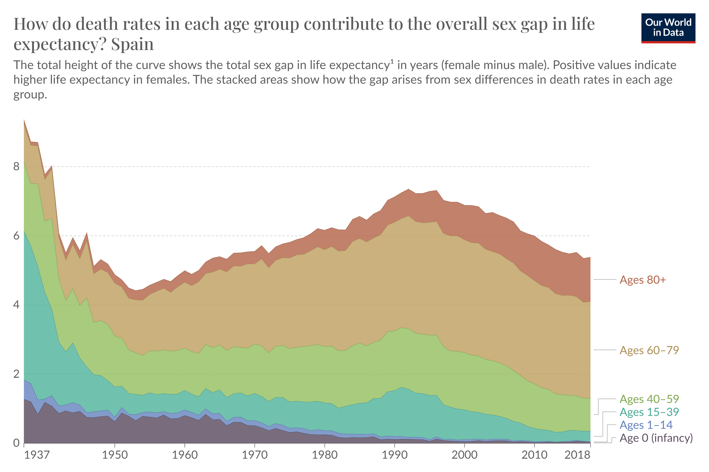

```{r setup, include=FALSE}
knitr::opts_chunk$set(out.width="100%", fig.align="center", fig.showtext=TRUE)
```

It is known that women usually have a higher life expectancy and live longer than men. However, this life expectancy gap isn't homogeneous and it varies significantly through different age groups. The original graph I replicated and enhances for this project shows how each age group contributes to the overall sex gap in life expectancy in Spain, from years 1908 to 2018.

{.external}

These are the packages I used for this project.

```{r}
library(tidyverse)
library(patchwork)
```

## Getting the data ready

First, I had to import the data. It was available for download on the source website and it was very easy to find. The data were complete and it was the same used for the original graph.

```{r}

lifex <- read.csv("lifeexpectancy.csv")

```

Then I had to tidy up the data in order to be able to use it. I had to rename the age group columns to make it shorter and more manageable, as well as pivoting them. The database included date for many countries, so I had to filter it to work only with the data from Spain.

```{r}
#Rename columns

lifex_r <-
  lifex |> 
  rename(
    "Age 0 (infancy)" = Contribution.to.sex.gap.in.life.expectancy..years....Age_group..0,
    
    "Ages 1-14" = Contribution.to.sex.gap.in.life.expectancy..years....Age_group..1.14,
    
    "Ages 15-39" = Contribution.to.sex.gap.in.life.expectancy..years....Age_group..15.39, 
    
    "Ages 40-59" = Contribution.to.sex.gap.in.life.expectancy..years....Age_group..40.59,
    
    "Ages 60-79" = Contribution.to.sex.gap.in.life.expectancy..years....Age_group..60.79,
    
    "Ages 80+" = Contribution.to.sex.gap.in.life.expectancy..years....Age_group..80.) 

#Tidy the data

tidy_lifex_r <- 
  lifex_r |>
  pivot_longer(cols = "Ages 80+":last_col(),
               names_to = "Age_group",
               values_to = "Contribution_to_gap")

#Spain data

spain <- 
  tidy_lifex_r |> 
  filter(Entity == "Spain" & Contribution_to_gap >= 0) |> 
  mutate(Age_group = fct_rev(Age_group)) #Change order of groups to replicate the original

```

### Working on the legend positioning of the plot

Before getting to work with the visualization, I created some variables regarding the positioning of the legend labels. I wanted to calculate the middle point of the areas to make each label appear just in the middle, even if then I had to make some adjustments.

```{r}
ylegend_80 <- 
  spain |> 
  filter(Age_group == "Ages 80+", Year == 2018) |> 
  pull(Contribution_to_gap)

ylegend_60 <- 
  spain |> 
  filter(Age_group == "Ages 60-79", Year == 2018) |> 
  pull(Contribution_to_gap)

ylegend_40 <- 
  spain |> 
  filter(Age_group == "Ages 40-59", Year == 2018) |> 
  pull(Contribution_to_gap)

ylegend_15 <- 
  spain |> 
  filter(Age_group == "Ages 15-39", Year == 2018) |> 
  pull(Contribution_to_gap)

ylegend_1 <- 
  spain |> 
  filter(Age_group == "Ages 1-14", Year == 2018) |> 
  pull(Contribution_to_gap)

ylegend_0 <- 
  spain |> 
  filter(Age_group == "Age 0 (infancy)", Year == 2018) |> 
  pull(Contribution_to_gap)

ylegend_0_final <- ylegend_0/2
ylegend_1_final <- ylegend_1/2 + ylegend_0
ylegend_15_final <- ylegend_15/2 + ylegend_0 + ylegend_1
ylegend_40_final <- ylegend_40/2 + ylegend_0 + ylegend_1 + ylegend_15
ylegend_60_final <- ylegend_60/2 + ylegend_0 + ylegend_1 + ylegend_15 + ylegend_40
ylegend_80_final <- ylegend_80/2 + ylegend_0 + ylegend_1 + ylegend_15 + ylegend_40 + ylegend_60
```

## Creating the plot

### Initial form and axis

To begin, we define the x and y axis data by using the *Year* and *Contribution to gap* columns. As for the scales, we establish the limits for both axes and set the breaks accordingly. On the y-axis, we introduce breaks every two years of contribution to the gender gap in life expectancy. On the x-axis, we set a maximum limit extending beyond 2018, the last year of available data, reaching up to 2045. This provides additional space on the right side for including the legend. Lastly, using the *coord_cartesian(expand = FALSE)* function and its corresponding argument we manage to start the plot directly at the axis, eliminating a small margin.

```{r}
#Basic form

p <- ggplot(spain) +
    aes(Year, Contribution_to_gap) +
  
#Scales and size
  scale_y_continuous(limits=c(0, 9.5), breaks=c(0, 2, 4, 6, 8)) +
  scale_x_continuous(limits=c(1908, 2045), breaks=c(1908, 1920, 1940, 1960, 1980, 2000, 2018), 
                     labels=c(1908, 1920, 1940, 1960, 1980, 2000, 2018)) +
  coord_cartesian(expand = FALSE)

p
```

### Theme, title and labels

The theme needs to resemble closer the original graph, so we use *theme_classic* and adjust the font size. Now it's the time to edit the color of the axis lines as well as the ticks, their length and the family font of the text and its color.

We also create the text for the title and subtitle, adjust its font, color and position.

```{r}
sysfonts::font_add_google("Playfair Display", family="playfair_display")

 p <- p +

#Colors of axis, axis text, title
  theme_classic(base_size=14) +
  theme(
    legend.position="none", #remove legend
    axis.line = element_blank(), #axis lines, colors
      axis.ticks.x = element_line(color = "darkgray"), 
      axis.ticks.length = unit(0.15, "cm"),
      axis.ticks.y = element_blank(),
      axis.text.x = element_text(color = "#6C6C6C", family = "playfair_display"),
      axis.text.y = element_text(color = "#6C6C6C", family = "playfair_display")) + 
    labs(x = "", y= "", 
        
          title = "How do death rates in each age group contribute to the overall sex gap in life\nexpectancy? Spain", 
         
         subtitle = "The height of the curve shows the gap in life expectancy in years (female minus male). Positive values indicate higher\nlife expectancy in females. The stacked areas show how the gap arises from sex differences in death rates in each age\ngroup.") +
  
    theme(
        axis.title.y = element_text(size = 11, family = "playfair_display", color = "#5B5B5B", margin = margin(r=10)),

      plot.title = element_text(size = 14, family = "playfair_display", color = "#5B5B5B"),
      
      plot.subtitle = element_text(size = 9, family = "playfair_display", color = "#5B5B5B"),
      
      plot.title.position = "plot",
      
      plot.margin = margin(10, 0, 0, 10))

p

```

### Background lines

Now to finish setting up the plot by adding the background lines present on the original graph that help read the y values of the data. We use *geom_segment* and use the same values as the ones for the breaks in the y-axis. We adjust the type and color of the lines.

```{r}
p <- p +
  
#Background lines
    geom_segment(data = data.frame(y = c(0, 2, 4, 6, 8), yend = c(0, 2, 4, 6, 8), x = 1908, xend = 2018),
    aes(x = x, xend = xend, y = y, yend = yend),
    linetype = "dashed", color = "lightgray") 

p
```

### Stacked areas

Finally we can represent our data using *geom_area* to create stacked areas of each age group's contribution to the sex gap. We specify that we want the areas color to be defined by the different age group categories. We manually define the colors for each area and stablish details like a bit of transparency with *alpha* and the width of the exterior line of the areas.

```{r}
p <- p +

#Areas
  geom_area(aes(fill = Age_group, color = Age_group), alpha = 0.8, linewidth = 0.3) +
  scale_fill_manual(values = c("Ages 80+" = "#B26257", 
                               "Ages 60-79" = "#BE9053", 
                               "Ages 40-59" = "#82A954", 
                               "Ages 15-39" = "#49A892", 
                               "Ages 1-14" = "#6281BC", 
                               "Age 0 (infancy)" = "#58495D"))
p
```

Even though whis is looking quite good, the exterior lines don't match exactly the color they should have. To fix that we create a new *scale_color_manual* function in which we define a very similar although different color for the exterior lines of the areas.

```{r}
 p <- p +
  
    scale_color_manual(values = c("Ages 80+" = "#BF6B60", 
                               "Ages 60-79" = "#BE9053", 
                              "Ages 40-59" = "#8AAD61", 
                               "Ages 15-39" = "#62A685", 
                               "Ages 1-14" = "#657EAD", 
                               "Age 0 (infancy)" = "#5F5D75"))
p
```

### Legend

Now we will create the text for the legend. Instead of using any legend function in ggplot2, we create it manually using annotate since it should have a very specific position and characteristics. We add text for each age group and use our previously created legend position variables to place it. We have to adjust the placement manually to make it perfect, as well as editing the font and color for each label.

```{r}
p <- p +

#Legend 
   annotate("text", x = 2026, y = (ylegend_80_final-0.15), hjust = 0, vjust = 0,
            label = "Ages 80+", family = "playfair_display", size = 3, color = "#B26257") +
  
  annotate("text", x = 2026, y = (ylegend_60_final-0.15), hjust = 0, vjust = 0,
           label = "Ages 60-79", family = "playfair_display", size = 3, color = "#BE9053") +
  
  annotate("text", x = 2026, y = (ylegend_40_final+0.9), hjust = 0, vjust = 0,
           label = "Ages 40-59", family = "playfair_display", size = 3, color = "#8AAD61") +
  
  annotate("text", x = 2026, y = (ylegend_15_final+1), hjust = 0, vjust = 0,
           label = "Ages 15_39", family = "playfair_display", size = 3, color = "#62A685") +
  
  annotate("text", x = 2026, y = (ylegend_1_final+0.6), hjust = 0, vjust = 0,
           label = "Ages 1-14", family = "playfair_display", size = 3, color = "#657EAD") +
  
  annotate("text", x = 2026, y = (ylegend_0_final+0.1), hjust = 0, vjust = 0,
           label = "Age 0 (infancy)", family = "playfair_display", size = 3, color = "#5F5D75") 

p

```

Lastly, we have to replicate the lines connecting the legend labels with the areas. To achieve this we use *geom_segment*, the previously crafted position variables, and adjust their length and color. For the last age group labels we have to create three different lines that connect to each other given the reduced space left due to their small area size that don't allow use to use just a straight line.

```{r}

p <- p +
  
#Lines of the legend
  #Red line
  geom_segment(data = data.frame(y = ylegend_80_final, yend = ylegend_80_final, x = 2019, xend = 2025),
    aes(x = x, xend = xend, y = y, yend = yend), color = "darkgray") +
  
  #Orange line
  geom_segment(data = data.frame(y = ylegend_60_final, yend = ylegend_60_final, x = 2019, xend = 2025),
    aes(x = x, xend = xend, y = y, yend = yend), color = "darkgray") +

  #Green line
    geom_segment(data = data.frame(y = ylegend_40_final, yend = ylegend_40_final, x = 2019, xend = 2021),
    aes(x = x, xend = xend, y = y, yend = yend), color = "darkgray") +

geom_segment(data = data.frame(y = ylegend_40_final+1, yend = ylegend_40_final+1, x = 2021, xend = 2025),
    aes(x = x, xend = xend, y = y, yend = yend), color = "darkgray") +
  
    geom_segment(data = data.frame(y = ylegend_40_final, yend = ylegend_40_final+1, x = 2021, xend = 2021),
    aes(x = x, xend = xend, y = y, yend = yend), color = "darkgray") +

  #Teal line
    geom_segment(data = data.frame(y = ylegend_15_final, yend = ylegend_15_final, x = 2019, xend = 2022),
    aes(x = x, xend = xend, y = y, yend = yend), color = "darkgray") +

geom_segment(data = data.frame(y = ylegend_15_final+1.1, yend = ylegend_15_final+1.1, x = 2022, xend = 2025),
    aes(x = x, xend = xend, y = y, yend = yend), color = "darkgray") +
  
    geom_segment(data = data.frame(y = ylegend_15_final, yend = ylegend_15_final+1.1, x = 2022, xend = 2022),
    aes(x = x, xend = xend, y = y, yend = yend), color = "darkgray") +
  
  #Blue line
      geom_segment(data = data.frame(y = ylegend_1_final, yend = ylegend_1_final, x = 2019, xend = 2023),
    aes(x = x, xend = xend, y = y, yend = yend), color = "darkgray") +

geom_segment(data = data.frame(y = ylegend_1_final+0.7, yend = ylegend_1_final+0.7, x = 2023, xend = 2025),
    aes(x = x, xend = xend, y = y, yend = yend), color = "darkgray") +
  
    geom_segment(data = data.frame(y = ylegend_1_final, yend = ylegend_1_final+0.7, x = 2023, xend = 2023),
    aes(x = x, xend = xend, y = y, yend = yend), color = "darkgray") +
  
  #Violet line
      geom_segment(data = data.frame(y = ylegend_1_final, yend = ylegend_1_final, x = 2019, xend = 2024),
    aes(x = x, xend = xend, y = y, yend = yend), color = "darkgray") +

geom_segment(data = data.frame(y = ylegend_1_final+0.2, yend = ylegend_1_final+0.2, x = 2024, xend = 2025),
    aes(x = x, xend = xend, y = y, yend = yend), color = "darkgray") +
  
    geom_segment(data = data.frame(y = ylegend_1_final, yend = ylegend_1_final+0.2, x = 2024, xend = 2024),
    aes(x = x, xend = xend, y = y, yend = yend), color = "darkgray")
  

```

### Final replicated plot

```{r, preview=TRUE}
p

```

## Plot enhacement

### Original graph pros & cons

The original graph is quite good, being simple enough to communicate data withouth being too confusing. It's visually well depurated, with harmonized colors, fonts and object and place placement. However, even if it's easy to see the big picture, the main issue is that the age groups information gets lost and it's harder to understand.

### First enhacement graph

For this first enhacement I decided to change a few things:

-   Adding a **yellow color** in the areas to avoid having three different blue hues
-   Adding a **title to the y-axis** to make it more understandable
-   Changing the **legend** to make it more visible
-   Adding important **historical event marks** to add context to the data

```{r}

#Improvements
p <- ggplot(spain) +
    aes(Year, Contribution_to_gap) +
  
#Scales and size
  scale_y_continuous(limits=c(0, 11), breaks=c(0, 2, 4, 6, 8)) +
  scale_x_continuous(limits=c(1908, 2018), breaks=c(1908, 1920, 1940, 1960, 1980, 2000, 2018), 
                     labels=c(1908, 1920, 1940, 1960, 1980, 2000, 2018)) +
  coord_cartesian(expand = FALSE) +
  
#Colors of axis, axis text, title
  #ENHACEMENT - NEW LEGEND
  theme_classic(base_size=14) +
  theme(
    legend.position="right", 
    legend.title = element_blank(),
    legend.text = element_text(size = 9, family = "playfair_display", color = "#5B5B5B"),
    legend.key.size = unit(0.4, "cm"), 
    legend.key.width = unit(0.5, 'cm'),
    axis.line = element_blank(), #axis lines, colors
      axis.ticks.x = element_line(color = "darkgray"), 
      axis.ticks.length = unit(0.15, "cm"),
      axis.ticks.y = element_blank(),
      axis.text.x = element_text(color = "#6C6C6C", family = "playfair_display"),
      axis.text.y = element_text(color = "#6C6C6C", family = "playfair_display"),
      axis.title.y = element_text(color = "#6C6C6C", family = "playfair_display", size = 12, margin = margin(r = 10))) +
    labs(x = "", y= "Sex gap years", #ENHACEMENT - Y-AXIS TITLE
          title = "How do death rates in each age group contribute to the overall sex gap in life\nexpectancy? Spain", 
         
         subtitle = "The height of the curve shows the gap in life expectancy in years (female minus male). Positive values indicate higher\nlife expectancy in females. The stacked areas show how the gap arises from sex differences in death rates in each age\ngroup.") +
    theme(
      plot.title = element_text(size = 14, family = "playfair_display", color = "#5B5B5B"),
      plot.subtitle = element_text(size = 9, family = "playfair_display", color = "#5B5B5B", hjust= 0),
      plot.title.position = "plot") +
  
#Background lines
    geom_segment(data = data.frame(y = c(0, 2, 4, 6, 8), yend = c(0, 2, 4, 6, 8), x = 1908, xend = 2018),
    aes(x = x, xend = xend, y = y, yend = yend),
    linetype = "dashed", color = "lightgray") +
  
#Areas
  geom_area(aes(fill = Age_group, color = Age_group), alpha = 0.8, linewidth = 0.3) +
  scale_fill_manual(values = c("Ages 80+" = "#B26257", 
                               "Ages 60-79" = "#BE9053", 
                               "Ages 40-59" = "#BEBA54", #ENHACEMENT - YELLOW COLOR
                               "Ages 15-39" = "#82A954", 
                               "Ages 1-14" = "#6281BC", 
                               "Age 0 (infancy)" = "#58495D")) +
  
    scale_color_manual(values = c("Ages 80+" = "#BF6B60", 
                               "Ages 60-79" = "#BE9053", 
                               "Ages 40-59" = "#BEBA54", 
                               "Ages 15-39" = "#8AAD61", 
                               "Ages 1-14" = "#657EAD", 
                               "Age 0 (infancy)" = "#5F5D75")) +

#ENHACEMENT - EVENT MARKS
    geom_segment(aes(x = 1936, xend=1936, y=0, yend = 10), color = "#5B5B5B", linetype = "dotted") +
  annotate("text", x=1936, y=10.5, color="#5B5B5B", vjust=0, size=3, label="CIVIL WAR") +
  annotate("text", x=1936, y=10.10, color="#5B5B5B", vjust=0, size=3, label="◆") +
       geom_segment(aes(x = 1918, xend = 1918, y = 0, yend = 10), color = "#5B5B5B", linetype = "dotted") +
  annotate("text", x=1918, y=10.5, color="#5B5B5B", vjust=0, size=3, label="SPANISH FLU") +
    annotate("text", x=1918, y=10.10, color="#5B5B5B", vjust=0, size=3, label="◆") +
       geom_segment(aes(x = 1981, xend = 1981, y = 0, yend = 10), color = "#5B5B5B", linetype = "dotted") +
  annotate("text", x=1981, y=10.5, color="#5B5B5B", vjust=0, size=3, label="AIDS CRISIS") +
    annotate("text", x=1981, y=10.10, color="#5B5B5B", vjust=0, size=3, label="◆")

p
```

This graph now looks better and is easier to read. However, it doesn't solve the main issue we stated earlier, since it's still hard to read the contribution per each age group.

### Second enhacement graph

Looking to solve this issue, I decided to make facets emphasizing the information of the age groups. I decided to fix the scale to see each facet proportionally to the total. I kept the event marks to keep this historical context.

```{r}
facets <- ggplot(spain) +
    aes(Year, Contribution_to_gap) +
    facet_wrap(Age_group ~ .) + #ENHACEMENT - FACETS
  
#Scales and size
  scale_y_continuous(limits=c(0, 4.5), breaks=(4)) +
  scale_x_continuous(limits=c(1908, 2018), breaks=c(1908, 1930, 1960, 1990, 2018), 
                     labels=c(1908, 1930, 1960, 1990, 2018)) +
  coord_cartesian(expand = FALSE) +

#Colors of axis, axis text, title
  theme_classic(base_size=11) +
  theme(
    strip.text = element_text(size = 10, family = "playfair_display", color="#5B5B5B", face= "bold"),
    strip.background = element_blank(),
    legend.position = "null", 
    axis.line = element_line(color = "gray"),
    axis.ticks.x = element_line(color = "darkgray"), 
    axis.ticks.length = unit(0.15, "cm"),
    axis.ticks.y = element_blank(),
    axis.text.x = element_text(color = "#6C6C6C", family = "playfair_display"),
    axis.text.y = element_text(color = "#6C6C6C", family = "playfair_display"),
    panel.spacing.x = unit(2, "lines")) + 
    labs(x = "", y= "", 
          title = "How do death rates in each age group contribute to the overall sex gap in life\nexpectancy? Spain", 
          subtitle = "The height of the curve shows the gap in life expectancy in years (female minus male). Positive values indicate higher\nlife expectancy in females. The stacked areas show how the gap arises from sex differences in death rates in each age\ngroup.") +
    theme(
      plot.title = element_text(size = 14, family = "playfair_display", color = "#5B5B5B"),
      plot.subtitle = element_text(size = 9, family = "playfair_display", color = "#5B5B5B", hjust= 0),
      plot.title.position = "plot",
      plot.margin = margin(0.5, 1, 0, 0.5, "cm")) +

#Background lines
    geom_segment(data = data.frame(y = 4, yend = 4, x = 1908, xend = 2018),
    aes(x = x, xend = xend, y = y, yend = yend),
    linetype = "dashed", color = "lightgray") +

#Areas
  geom_area(aes(fill = Age_group, color = Age_group), alpha = 0.8, linewidth = 0.3) +
  scale_fill_manual(values = c("Ages 80+" = "#B26257", 
                               "Ages 60-79" = "#BE9053", 
                               "Ages 40-59" = "#BEBA54", 
                               "Ages 15-39" = "#82A954", 
                               "Ages 1-14" = "#6281BC", 
                               "Age 0 (infancy)" = "#58495D")) +
  
    scale_color_manual(values = c("Ages 80+" = "#BF6B60", 
                               "Ages 60-79" = "#BE9053", 
                               "Ages 40-59" = "#BEBA54", 
                               "Ages 15-39" = "#8AAD61", 
                               "Ages 1-14" = "#657EAD", 
                               "Age 0 (infancy)" = "#5F5D75")) +
  
      geom_segment(aes(x = 1936, xend=1936, y=0, yend = 4.5), color = "darkgrey", linetype = "dotted") +
       geom_segment(aes(x = 1918, xend = 1918, y = 0, yend = 4.5), color = "darkgrey", linetype = "dotted") +
       geom_segment(aes(x = 1981, xend = 1981, y = 0, yend = 4.5), color = "darkgrey", linetype = "dotted") 

facets
```

This make the information of the age groups very easy to read and understand its different tendencies. However, this plot now loses the information of the big picture.

### Final enhacement

To solve this, I decided to combine both plots using the R package *patchwork*. I merged both of them together and made a few adjustment until I got the final enhaced graph. This solves the issue of not being able to clearly distinguish trends within each age group, in addition to providing a clearer picture with the combined chart, observing the overall evolution of the life expectancy sex gap. Furthermore, the issue of the legend is resolved by having facets that allow us to understand the meaning of each color in the areas.

```{r, echo=FALSE, results='hide'}

#Adjusting the facets plot
facets2 <-
  ggplot(spain) +
    aes(Year, Contribution_to_gap) +
    facet_wrap(Age_group ~ .) +
  
#Scales and size
  scale_y_continuous(limits=c(0, 4.5), breaks=(4)) +
  scale_x_continuous(limits=c(1908, 2018), breaks=c(1908, 1930, 1960, 1990, 2018), labels=c(1908, 1930, 1960, 1990, 2018)) +
  coord_cartesian(expand = FALSE) +

#Colors of axis, axis text, title
  theme_classic(base_size=11) +
  theme(
    strip.text = element_text(size = 10, family = "playfair_display", color="#5B5B5B", face= "bold"),
    strip.background = element_blank(),
    legend.position = "null", 
    axis.line = element_line(color = "gray"),
    axis.ticks.x = element_line(color = "darkgray"), 
    axis.ticks.length = unit(0.15, "cm"),
    axis.ticks.y = element_blank(),
    axis.text.x = element_text(color = "#6C6C6C", family = "playfair_display"),
    axis.text.y = element_text(color = "#6C6C6C", family = "playfair_display"),
    axis.title.y = element_text(color = "#6C6C6C", family = "playfair_display", size = 12, margin = margin(r = 10)),
    panel.spacing.x = unit(2, "lines")) +
  
    labs(x = "", y= "Sex gap years") +
    theme(
      plot.title = element_text(size = 14, family = "playfair_display", color = "#5B5B5B"),
      plot.subtitle = element_text(size = 9, family = "playfair_display", color = "#5B5B5B", hjust= 0),
      plot.title.position = "plot",
      plot.margin = margin(0, 1, 0, 0.5, "cm")) +

#Background lines
    geom_segment(data = data.frame(y = 4, yend = 4, x = 1908, xend = 2018),
    aes(x = x, xend = xend, y = y, yend = yend),
    linetype = "dashed", color = "lightgray") +

#Areas
  geom_area(aes(fill = Age_group, color = Age_group), alpha = 0.8, linewidth = 0.3) +
  scale_fill_manual(values = c("Ages 80+" = "#B26257", 
                               "Ages 60-79" = "#BE9053", 
                               "Ages 40-59" = "#BEBA54", 
                               "Ages 15-39" = "#82A954", 
                               "Ages 1-14" = "#6281BC", 
                               "Age 0 (infancy)" = "#58495D")) +
  
    scale_color_manual(values = c("Ages 80+" = "#BF6B60", 
                               "Ages 60-79" = "#BE9053", 
                               "Ages 40-59" = "#BEBA54", 
                               "Ages 15-39" = "#8AAD61", 
                               "Ages 1-14" = "#657EAD", 
                               "Age 0 (infancy)" = "#5F5D75")) +
  
      geom_segment(aes(x = 1936, xend=1936, y=0, yend = 4.5), color = "darkgrey", linetype = "dotted") +
       geom_segment(aes(x = 1918, xend = 1918, y = 0, yend = 4.5), color = "darkgrey", linetype = "dotted") +
       geom_segment(aes(x = 1981, xend = 1981, y = 0, yend = 4.5), color = "darkgrey", linetype = "dotted") 

#-------------------------------------------------------

#Adjusting the first enhacement plot
p2 <-ggplot(spain) +
    aes(Year, Contribution_to_gap) +
  
#Scales and size
  scale_y_continuous(limits=c(0, 12), breaks=c(0, 2, 4, 6, 8)) +
  scale_x_continuous(limits=c(1908, 2018), breaks=c(1908, 1920, 1940, 1960, 1980, 2000, 2018), labels=c(1908, 1920, 1940, 1960, 1980, 2000, 2018)) +
  coord_cartesian(expand = FALSE) +

#Colors of axis, axis text, title
  theme_classic(base_size=14) +
  theme(
    legend.position="null", 
    legend.title = element_blank(),
    legend.text = element_text(size = 9, family = "playfair_display", color = "#5B5B5B"),
    legend.key.size = unit(0.4, "cm"), 
    legend.key.width = unit(0.5, 'cm'),
    axis.line = element_blank(), #axis lines, colors
      axis.ticks.x = element_line(color = "darkgray"), 
      axis.ticks.length = unit(0.15, "cm"),
      axis.ticks.y = element_blank(),
      axis.text.x = element_text(color = "#6C6C6C", family = "playfair_display"),
      axis.text.y = element_text(color = "#6C6C6C", family = "playfair_display")) + #big margin on right to legend
    labs(x = "", y= "", 
          title = "How do death rates in each age group contribute to the overall sex gap in life\nexpectancy? Spain", 
         subtitle = "The height of the curve shows the gap in life expectancy in years (female minus male). Positive values indicate higher\nlife expectancy in females. The stacked areas show how the gap arises from sex differences in death rates in each age\ngroup.") +
    theme(
      plot.title = element_text(size = 14, family = "playfair_display", color = "#5B5B5B"),
      
      plot.subtitle = element_text(size = 9, family = "playfair_display", color = "#5B5B5B", hjust= 0),
      
      plot.title.position = "plot") +
#Background lines
    geom_segment(data = data.frame(y = c(0, 2, 4, 6, 8), yend = c(0, 2, 4, 6, 8), x = 1908, xend = 2018),
    aes(x = x, xend = xend, y = y, yend = yend),
    linetype = "dashed", color = "lightgray") +
#Areas
  geom_area(aes(fill = Age_group, color = Age_group), alpha = 0.8, linewidth = 0.3) +
  scale_fill_manual(values = c("Ages 80+" = "#B26257", 
                               "Ages 60-79" = "#BE9053", 
                               "Ages 40-59" = "#BEBA54", 
                               "Ages 15-39" = "#82A954", 
                               "Ages 1-14" = "#6281BC", 
                               "Age 0 (infancy)" = "#58495D")) +
  
    scale_color_manual(values = c("Ages 80+" = "#BF6B60", 
                               "Ages 60-79" = "#BE9053", 
                               "Ages 40-59" = "#BEBA54", 
                               "Ages 15-39" = "#8AAD61", 
                               "Ages 1-14" = "#657EAD", 
                               "Age 0 (infancy)" = "#5F5D75")) +
#Event marks
    geom_segment(aes(x = 1936, xend=1936, y=0, yend = 10), color = "#5B5B5B", linetype = "dotted") +
  annotate("text", x=1936, y=11, color="#5B5B5B", vjust=0, size=3, label="CIVIL WAR") +
  annotate("text", x=1936, y=10.10, color="#5B5B5B", vjust=0, size=3, label="◆") +
  
       geom_segment(aes(x = 1918, xend = 1918, y = 0, yend = 10), color = "#5B5B5B", linetype = "dotted") +
  annotate("text", x=1918, y=11, color="#5B5B5B", vjust=0, size=3, label="SPANISH FLU") +
    annotate("text", x=1918, y=10.10, color="#5B5B5B", vjust=0, size=3, label="◆") +
  
       geom_segment(aes(x = 1981, xend = 1981, y = 0, yend = 10), color = "#5B5B5B", linetype = "dotted") +
  annotate("text", x=1981, y=11, color="#5B5B5B", vjust=0, size=3, label="AIDS CRISIS") +
    annotate("text", x=1981, y=10.10, color="#5B5B5B", vjust=0, size=3, label="◆")

```

```{r, fig.height=7, fig.width=7}

p2/facets2
```

Thanks for reading!
