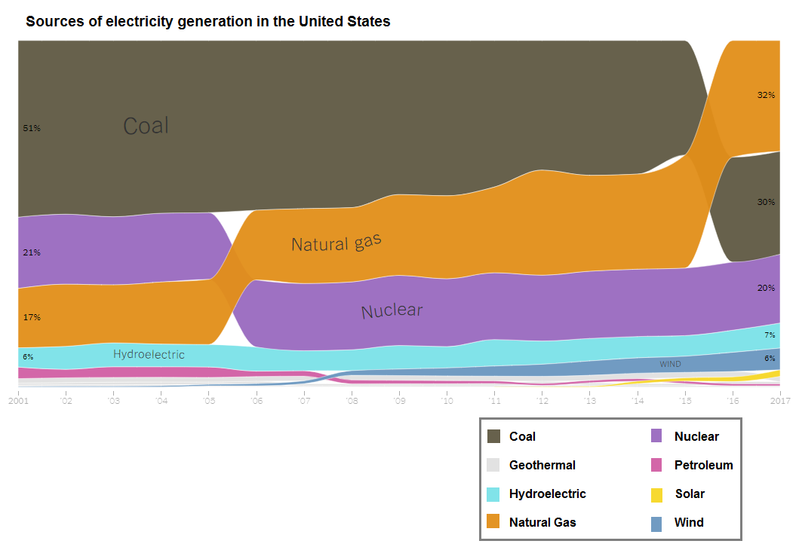

```{r setup, include=FALSE}
knitr::opts_chunk$set(out.width="100%", fig.align="center")
```

## Packages and libraries

```{r}
library(readxl)
library(tidyverse)
# remotes::install_github("davidsjoberg/ggsankey")
library(ggsankey)
```

## Original graph

```{r, echo=FALSE, fig.cap="Original graph", out.extra="class=external"}

```

The presented graphical representation delineates the evolution of electricity generation sources in the United States across the span of 16 years, from 2001 to 2017, encompassing data from all 50 states. You can find the data from this link: https://www.eia.gov/totalenergy/ 

Traditionally, over the 16-year period under scrutiny, coal, nuclear, and natural gas have consistently constituted the primary resources for electricity generation in the U.S. A comprehensive analysis, as outlined in the accompanying article, suggests that the relative rankings of these sources have undergone minimal alteration over 17 years for 13 states. Contrarily, in the remaining 37 states, both the proportions of electricity generated and the hierarchical ordering of different sources exhibit discernible changes. Consequently, the points of intersection or crossovers in the graph predominantly stem from the dynamic shifts observed in these 37 states.

## Data Processing

```{r}
data <- read_excel("Net_generation_United_States_all_sectors_annual.xls")


data <- data |> separate("Year,petroleum liquids thousand megawatthours,coal thousand megawatthours,natural gas thousand megawatthours,nuclear thousand megawatthours,conventional hydroelectric thousand megawatthours,wind thousand megawatthours,all solar thousand megawatthours,geothermal thousand megawatthours",
                         into=c("year", "Petroleum", "Coal", "Natural Gas", "Nuclear", "Hydroelectric", "Wind", "Solar", "Geothermal"), sep=",")

data <- data[-c(22),]
data <- data[-c(1,2,3,4),]

data$Petroleum <- as.numeric(data$Petroleum)
data$Coal <- as.numeric(data$Coal)
data$"Natural Gas" <- as.numeric(data$"Natural Gas")
data$Nuclear <- as.numeric(data$Nuclear)
data$Hydroelectric <- as.numeric(data$Hydroelectric)
data$Wind <- as.numeric(data$Wind)
data$Solar <- as.numeric(data$Solar)
data$Geothermal <- as.numeric(data$Geothermal)

data[is.na(data)] <- 0 #to calculate the proportion, NA should be replaced by 0

year <- rep(2001:2017, by = 1) #creating year variable
year <- as.matrix(year)

x <- data |> select(-year)
x <- as.matrix(x)
x =  prop.table(x, margin = 1)
x <- cbind(x, year)

x <- as.data.frame(x) #change the matix to data.frame 
x <- relocate(x, "V9", .before = "Petroleum")
x <- x |>  rename(c(year = V9))
x$year <- sort(x$year, decreasing = TRUE)

k <- pivot_longer(x, !year, names_to = "energy", values_to = "percent")
k <- k |> mutate(percentage = percent * 100)
```

This is the code that I used for the replication of the original graph.
I'll explain some challenges that I have been faced using some codes below. 

## Replication

```{r}
color <- c("Coal" = "#67614c", "Geothermal" = "#e2e2e2", "Hydroelectric" = "#81e3e9",
           "Natural Gas" = "#e39424", "Nuclear" = "#9e71c2", "Petroleum" = "#d366a8",
           "Solar" = "#f7d930", "Wind" = "#719bc2")

ggplot(k, aes(x = year,
              node = energy,
              fill = energy,
              value = percentage)) +
  geom_sankey_bump(space = 0, type = "alluvial", color = "transparent", smooth = 13, alpha = 0.93) +
  theme_sankey_bump(base_size = 7)  +
  labs(x = NULL, y = NULL,
       title = "Change of electricity generation sources in the United States") +
  scale_x_continuous(breaks = c(2001, 2002, 2003, 2004, 2005, 2006, 2007, 2008,
                                2009, 2010, 2011, 2012, 2013, 2014, 2015, 2016, 2017),
                     labels = c("2001", "'02", "'03", "'04", "'05", "'06", "'07", "'08", "'09",
                                "'10", "'11", "'12", "'13", "'14", "'15", "'16", "2017")) +
  scale_y_continuous(labels = NULL) +
  theme_bw() + coord_cartesian(expand = FALSE) +
  theme(legend.position = c(0.8,-0.4), legend.title = element_blank(),
        legend.direction = "horizontal",
        legend.key.size = unit(c(0.35,0.35), "cm"),
        plot.title = element_text(size = 9, face = "bold"),
        legend.background = element_rect(color = "black"),
        legend.text = element_text(face = "bold", family = "Noto Sans KR", size = 7),
        plot.margin = unit(c(1,1,4,1), "cm"),
        legend.spacing.x = unit(0.2, 'cm')) +
  scale_fill_manual(values = color) +
  guides(fill = guide_legend(nrow = 4)) +
  annotate("text", x = 2003, y = 75, label = "Coal", size = 5, color = "#302d21", family = "Source Sans 3") +
  annotate("text", x = 2006.5, y = 40, label = "Natural gas", size = 4, color = "#302d21", family = "Source Sans 3") +
  annotate("text", x = 2007.5, y = 20, label = "Nuclear", size = 4, color = "#302d21", family = "Source Sans 3") +
  annotate("text", x = 2003, y = 7, label = "Hydroelectric", size = 3, color = "#302d21", family = "Source Sans 3") +
  annotate("text", x = 2015.3, y = 5.3, label = "WIND", size = 1.9, color = "#302d21", family = "Source Sans 3") +
  annotate("text", x = 2001.3, y = 70, label = "51%", size = 2, color = "#302d21", family = "Source Sans 3") +
  annotate("text", x = 2001.3, y = 40, label = "21%", size = 2, color = "#302d21", family = "Source Sans 3") +
  annotate("text", x = 2001.3, y = 19, label = "17%", size = 2, color = "#302d21", family = "Source Sans 3") +
  annotate("text", x = 2001.3, y = 6, label = "6%", size = 2, color = "#302d21", family = "Source Sans 3") +
  annotate("text", x = 2016.7, y = 85, label = "32%", size = 2, color = "#302d21", family = "Source Sans 3") +
  annotate("text", x = 2016.7, y = 52, label = "30%", size = 2, color = "#302d21", family = "Source Sans 3") +
  annotate("text", x = 2016.7, y = 28, label = "20%", size = 2, color = "#302d21", family = "Source Sans 3") +
  annotate("text", x = 2016.7, y = 13, label = "7%", size = 2, color = "#302d21", family = "Source Sans 3") +
  annotate("text", x = 2016.7, y = 6, label = "6%", size = 2, color = "#302d21", family = "Source Sans 3")
```

Code below is a fundamental structure of my graph replication. 

I put node, fill, and value to ggplot function and it constructs nodes for different sources of electricity generation and fills it by each color of sources. Moreover, as I put the percentage into the value, the magnitude of node is specified.

Then, geom_sankey_bump() is used to execute the basic ggplot code into geom_sankey graph format. With this function, I was able to smooth the graph and the type is specified as alluvial. 


```{r}
k |> ggplot(aes(x = year,
              node = energy,
              fill = energy,
              value = percentage)) +
  geom_sankey_bump(space = 0, type = "alluvial", color = "transparent", smooth = 13, alpha = 0.93) +
  scale_fill_manual(values = color)
```

Because in the original graph, there is no background space except for the generated graph, I used theme_sankey_bump() function to adjust the base size of the graph.

```{r, preview=TRUE}
k |> ggplot(aes(x = year,
              node = energy,
              fill = energy,
              value = percentage)) +
  geom_sankey_bump(space = 0, type = "alluvial", color = "transparent", smooth = 13, alpha = 0.93) +
  theme_sankey_bump(base_size = 7) +
  scale_fill_manual(values = color)
```

## Enhancement

```{r}
new_plot <- k |> 
ggplot(aes(x=year, y=energy, fill=percentage)) +
  geom_tile(col = "white") +
  coord_equal() +
  scale_fill_gradient(low="white", high="blue") +
  theme_minimal(base_size = 12) +
  theme(
    panel.grid.minor = element_blank(),
    plot.title = element_text(size = 11, face = "bold"),
    legend.title = element_text(size = 11)
  ) + labs(
    x = NULL,
    y = NULL,
    title = "Change of electricity generation sources in the United States",
    fill = "Percentage"
  ) + coord_cartesian(expand = FALSE) +
  scale_x_continuous(breaks = c(2001, 2002, 2003, 2004, 2005, 2006, 2007, 2008,
                                2009, 2010, 2011, 2012, 2013, 2014, 2015, 2016, 2017),
                     labels = c("2001", "'02", "'03", "'04", "'05", "'06", "'07",
                                "'08", "'09", "'10", "'11", "'12", "'13", "'14",
                                "'15", "'16", "2017")) 

plotly::ggplotly(new_plot)

  
```

In the pursuit of data visualization enhancement, I employed the ggplot2 package in R, leveraging the versatile geom_tile() function. This particular function facilitates the systematic examination of individual observations arranged by rows and tiles, offering an intuitive approach to data analysis. To further refine the visual representation, the coord_equal() function was utilized, contributing to the generation of tiles that appear more as squares than rectangles. This adjustment enhances the overall visual organization of the graph.

In the realm of color aesthetics, the scale_fill_gradient() function played a pivotal role in orchestrating a gradient color scheme. By specifying "white" as the lower end and "blue" as the higher end of the gradient, the color spectrum effectively denotes the range of values within the dataset. The strategic arrangement of colors, transitioning from white for the lowest values to blue for the highest values, imparts a visual cue where darker hues correspond to higher values and lighter hues signify lower values. This gradient color mapping enhances the interpretability of the graph, fostering a more intuitive understanding of the underlying data.

As a final touch, the ggplotly() function was employed to impart interactivity to the graph. This transformation elevates the visual experience by allowing users to dynamically explore and interact with the plotted data.

