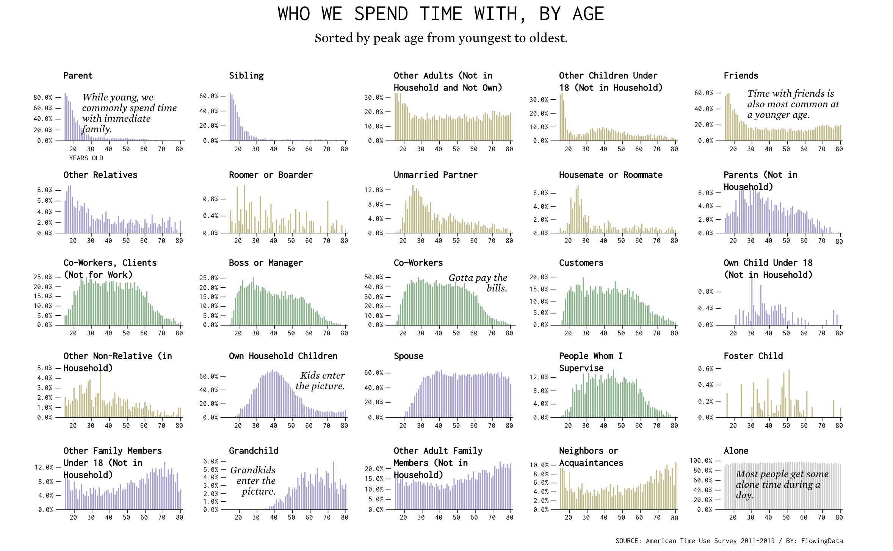
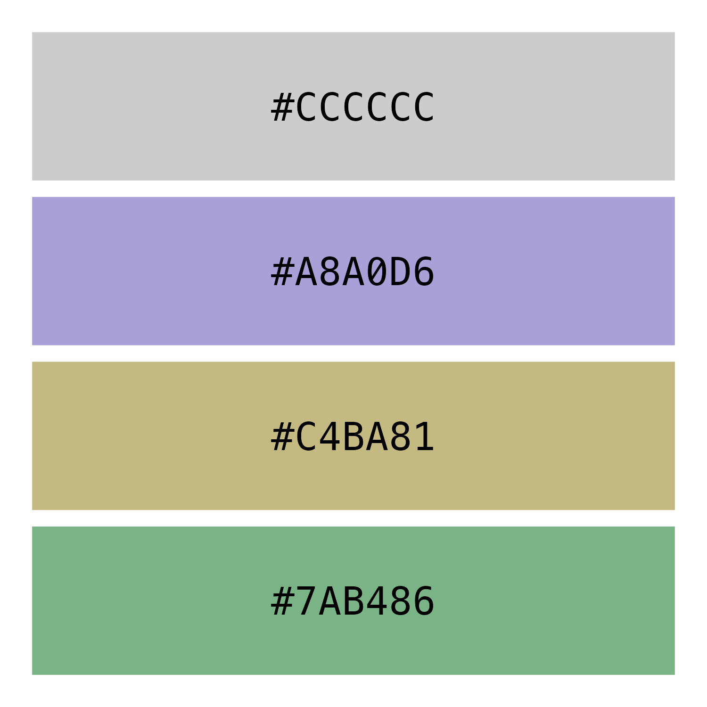
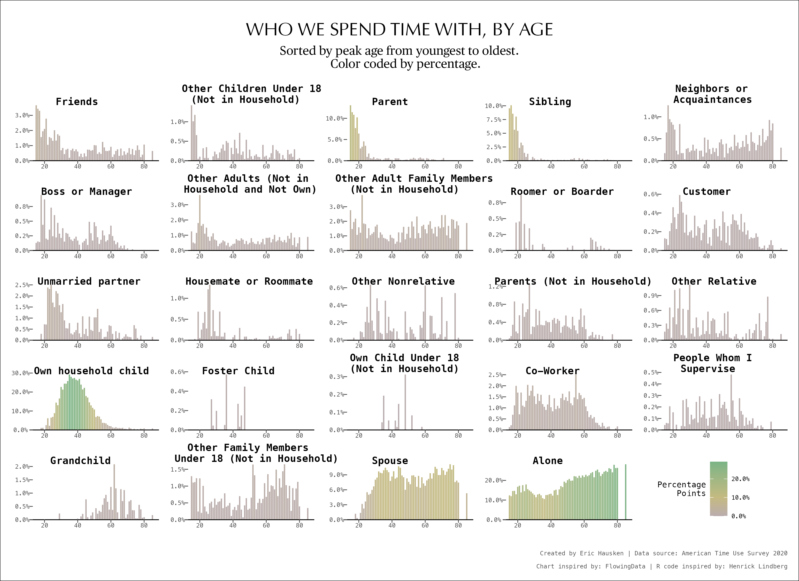

```{r setup, include=FALSE}
knitr::opts_chunk$set(out.width="100%", fig.align="center")
```

```{r load-libraries}
library(tidyverse)
```

## Original chart

I found this chart in an article called ["Who We Spend Time with as We Get Older"](https://flowingdata.com/2022/04/22/changing-who-we-spend-time-with-as-we-get-older/){.uri} by Nathan Yau. This article includes data from the American Time Use Survey from 2011 to 2019. Yau did not include 2020 data because they did not include a couple months due to the COVID-19 pandemic. 

The chart in **Figure 1** stood out because it had a lot of information broken down in static small multiples. The X-axis measures the age, from 15 to 80 years old, of the survey respondents. The Y-axis measures the percentage of respondents for each age group who spent time with the person titled in each bar chart. While the X-axis is fixed, the Y-axis is free so you cannot compare one chart to another. 

The point of the chart is to compare the distributions by age. The facets are sorted by peak age from youngest to oldest, meaning that "Parent" has a peak at minimum age. Meanwhile, the peak for "Neighbors or Acquaintances" is at the maximum age of 80, which is why its bar chart is positioned at the bottom right corner. 

Comparing the different charts, I noticed that the work-related facets-- including co-workers, clients, managers, and customers-- have similar distributions and peak around late 20s. The other work-related person, "Person Whom I Supervise," peaks later but maintains a similar distribution. 

```{r echo=FALSE, fig.cap="Source: FlowingData", layout = 'l-body-outset', fig.align='center', out.extra="class=external"}

```

## Replication

### Collecting the data

The most difficult aspect of putting together the plot was collecting and transforming the data. Instead of using the website that Nathan Yau linked in the article, I went to the [U.S. Bureau of Labor Statistics](https://www.bls.gov/tus/) website, which has all the data for the American Time Use Survey. 

After combining three datasets downloaded from the BLS.gov site using `tidyverse` joins and transformations ^[R code inspired by: Henrick Lindberg], I exported the data to a csv file. You can see an overview of the data below. 

```{r load-data}
data <- read_csv("data.csv")

data$whofct <- forcats::fct_reorder(
  .f = data$who, data$Y, min
  ) 

glimpse(data)
```

### Color theme of the plot 

To obtain the colors for the plot, I uploaded the screenshot of the plot to an online color generator. These are the codes for the four colors in the original article.

```{r color-theme}
colors <- c("#CCCCCC", "#A8A0D6", "#C4BA81", "#7AB486" )
```

```{r echo=FALSE, fig.cap="Color Theme", out.width = '50%', fig.align='center'}
color_table <- tibble(
  x = 1:4,
  y = c(1, 1, 1, 1),
  c = colors
)

color_theme <- color_table |> 
  ggplot(aes(rev(x), y, fill = factor(x), label = colors )) +
  geom_col() +
  geom_text(aes(y = .5), size = 7, family = "Menlo") +
  scale_fill_manual(values = colors, guide = "none") +
  theme_void() +
  coord_flip()

ggsave(filename = "Color_theme.png", 
       plot = color_theme, 
       width = unit(5, "in"), 
       height = unit(5, "in") 
)


```

### Building the chart 

First step was to set up the `ggplot` with the right coordinates and axes. 

```{r step-1, out.width = '50%', fig.align='center'}
plt <- data |> 
  ggplot(aes(x = TEAGE, y = p, fill = category))
plt
```

Second step was to incorporate the small multiples using `facet_wrap` and rename the axes. 

The code `scales = "free"` removes the restriction that all the axes are on the same scale. You can see that the Y-axis has a different scale for each facet. Since the range of the X-axis (variable `TEAGE`) in the data goes from 15 to 80 for all the facets (`whofct`), this code does not affect the X-axis's scale. 

```{r step-2, out.width = '80%', fig.align='center'}
plt <- plt +
  facet_wrap(
    ~ whofct , scales = "free", ncol = 5, 
  )

plt
```

Third step was to add the `geom_col`.

```{r step-3}
plt <- plt + 
  geom_col(
    width = .8, 
  ) +
  geom_hline(yintercept = 0, linewidth = .4)
  
plt
```

### Formatting the theme 

I used `theme_void()` to remove all the formatting. 

```{r step-4.1}
plt <- plt +
  theme_void() 
```


The chunk below shows the various formatting code to set the theme. I tried to set the font to be as close to the orignal chart as possible using the available fonts in the system. 

**Font**

 - Axis text, facet title, caption -> "Menlo"
 - Title -> "Optima"
 - Subtitle -> "Publico Text"

Note that `strip.clip = "off"` is used to allow the facet titles to go beyond the strict border of the "strip background." I also added `vjust = -.2` to the facet settings so that the titles would be aligned slightly below the strip background and onto the chart, as does the original chart. 

```{r step-4.2}
plt <- plt +
  theme(
    
    # axis settings
    axis.text = element_text(
      family = "Menlo", 
      size = 6, 
      color = "gray30"
      ),
    axis.ticks = element_line(
      color = "gray30"
      ),
    axis.ticks.length = unit(-1.0, "mm"),
    
    # set spacing and margins
    panel.spacing.x = unit(4, "mm"),
    panel.spacing.y = unit(1, "mm"),
    plot.margin = margin(4, 4, 4, 4, "mm"),
    plot.title.position = "plot",
    
    # strip/facet placement and format
    strip.text = element_text(
      family = "Menlo", 
      hjust = 0.3, 
      vjust = -.2,  
      size = 10, 
      face = "bold"
      ),
    strip.clip = "off", 
    
    #  background color
    plot.background = element_rect(fill = "white"), 
    
    # remove legend
    legend.position = "none",
    
    # format title, subtitle, and caption
    plot.title = element_text(
      family = "Optima", 
      size = 18, 
      hjust = 0.5, 
      margin = margin(4,4,1,4, "mm")
    ), 
    plot.subtitle = element_text(
      size = 12, 
      margin = margin(1,4,4,4, "mm"), 
      family = "Publico Text", 
      hjust = 0.5
      ),
    plot.caption = element_text(
      family = "Menlo", 
      color = "gray30", 
      size = 6, 
      margin = margin(8,0,0,0, unit = "mm"))
  )

plt
```

### Annotations

I created a table for the annotations with the `X` and `Y` coordinates, the facet title (`whofct`) and category, the label text, and the horizontal justification.

```{r annotatations, echo=FALSE, layout = 'l-body-outset'}
annotations <- tribble(~x, ~y, ~whofct, ~label, ~category, ~hj,
                       20, .3, "Alone", "Most people get some alone\ntime during a day.", "Alone", 0,
                       20, .04, "Grandchild", "Grandkids\n\tenter the\n\t\tpicture.", "Family", 0,
                       60, .3, "Own household child", "Kids enter\n\tthe picture.", "Family", 0,
                       85, .04, "Co-Worker", "Gotta pay\nthe bills.", "Work", 1,
                       85, .18, "Parent", "While young, we commonly\nspend time with\nimmediate family.", "Family", 1,
                       85, .07, "Friends", "Time with friends\nis also most common\nat a younger age.", "Friend", 1
)

knitr::kable(annotations, format = "html", 
             caption = "`annotations`")
```

I made the `whofct` variable a factor so that it is consistent with the same variable of the main dataset. 

```{r }
annotations$whofct <- factor(annotations$whofct)
```


I added annotations using `geom_text` and set the color scale to the variable `colors` using `scale_fill_manual(...)`.

```{r step-5}
plt <- plt +
  aes() +
  geom_text(data = annotations, 
            aes(x = x, y = y, label = label), 
            color = "gray10",
            size = 3,
            family = "Publico Text",
            fontface = "italic",
            hjust = annotations$hj, 
            vjust = 1
  ) +
  scale_y_continuous(
    label = scales::label_percent(accuracy = .1)
  ) +
  scale_fill_manual(
    values = colors 
  ) +
  labs(
    
    # TITLES 
    title = "WHO WE SPEND TIME WITH, BY AGE",
    subtitle = "Sorted by peak age from youngest to oldest.",
    caption = "Created by Eric Hausken | Data source: American Time Use Survey 2020\n
    Chart inspired by: FlowingData",
    x = "YEARS OLD"
    ) 
  
```

### Saved chart

Finally, I saved the chart using `ggsave()` to a .png with width and height of 11 and 8 inches. 

```{r save-1}
ggsave(filename = "Replication_plot.png", 
       plot = plt, 
       width = unit(11, "in"), 
       height = unit(8, "in"))
```

```{r knitr-1, echo=FALSE, fig.cap="Replication", layout = 'l-page', preview =TRUE, fig.align='center'}

knitr::include_graphics("Replication_plot.png")
```

## Enhanced version

For the enhanced version, I replaced the color scheme to represent the magnitude of each column in percentage points. Instead of `fill = category`, the code now shows `fill = p`. 

```{r create-plt-2}
plt_2 <- data |> 
  ggplot(aes(x = TEAGE, y = p, fill = p)) 
```


```{r same-stuff, echo=FALSE}
plt_2 <- plt_2 +
  geom_col(width = .8) +
  geom_hline(yintercept = 0, linewidth = .4) +
  
  # facet wrap
  facet_wrap(
    ~ whofct , scales = "free", ncol = 5, 
  ) +
  
  theme_void() +
  
  theme(
    
    # axis settings
    axis.text = element_text(
      family = "Menlo", size = 6, color = "gray30"),
    axis.ticks = element_line(color = "gray30"),
    axis.ticks.length = unit(-1.0, "mm"),
    
    # spacing
    panel.spacing.x = unit(4, "mm"),
    plot.margin = margin(4, 4, 4, 4, "mm"), 
    panel.spacing.y = unit(1, "mm"),
    
    # strip/facet placement and text
    strip.text = element_text(
      family = "Menlo", hjust = 0.3, vjust = -.2,  
      size = 10, face = "bold"),
    strip.clip = "off", 
    
    #  colors 
    plot.background = element_rect(fill = "white"), 
    
    # plot titles 
    plot.title = element_text(
      family = "Optima", size = 18, 
      hjust = 0.5, margin = margin(4,4,1,4, "mm")
    ), 
    plot.title.position = "plot", 
    plot.subtitle = element_text(
      size = 12, margin = margin(1,4,4,4, "mm"), 
      family = "Publico Text", hjust = 0.5),
    plot.caption = element_text(
      family = "Menlo", color = "gray30", size = 6, 
      margin = margin(8,0,0,0, unit = "mm"))
    
  ) +
  scale_y_continuous(
    label = scales::label_percent(accuracy = .1),
  ) 
```


Most of the theme and code is the same for the enhanced version. The differences are in the color scale and legend. Here is the code for those enhancements. 

```{r add-new-stuff}
plt_2 <- plt_2 +
  labs(
    
    # TITLES 
    title = "WHO WE SPEND TIME WITH, BY AGE",
    subtitle = "Sorted by peak age from youngest to oldest.
    Color coded by percentage of age group that spent time with this person.",
    caption = "Created by Eric Hausken | Data source: American Time Use Survey 2020\n
    Chart inspired by: FlowingData") +
  
  theme(
    
    # legend format
    legend.position = c(.95, 0.08),
    legend.justification = 1,
    legend.direction = "vertical",
    legend.title = element_text(size = 8, family = "Menlo"),
    legend.text = element_text(size = 6, family = "Menlo" ),
    legend.title.align = 1,
    legend.key.height = unit(.15, "in"),
    ) +
  
  # color scale for columns and legend
  scale_fill_gradient2(
    low = colors[1], 
    mid = colors[3], 
    high = colors[4], 
    midpoint = .1,
    guide = guide_colorbar(
    title.position = "left",
    title = "Percentage\nof Age Group"),
    labels = c("0.0%", "20.0%", "40.0%", "60.0%"),
    breaks = c(0, .2, .4, .6)
  )  
```

### Saved chart

Once again, I saved it to a .png file with dimensions 11x8 inches. 

``` {r save-2}
ggsave(filename = "Enhanced_version_plot.png", 
       plot = plt_2, 
       width = unit(11, "in"), 
       height = unit(8, "in"))
```

```{r knitr-2, echo=FALSE, fig.cap="Enhanced version", layout = 'l-page', fig.align='center'}
 
```
