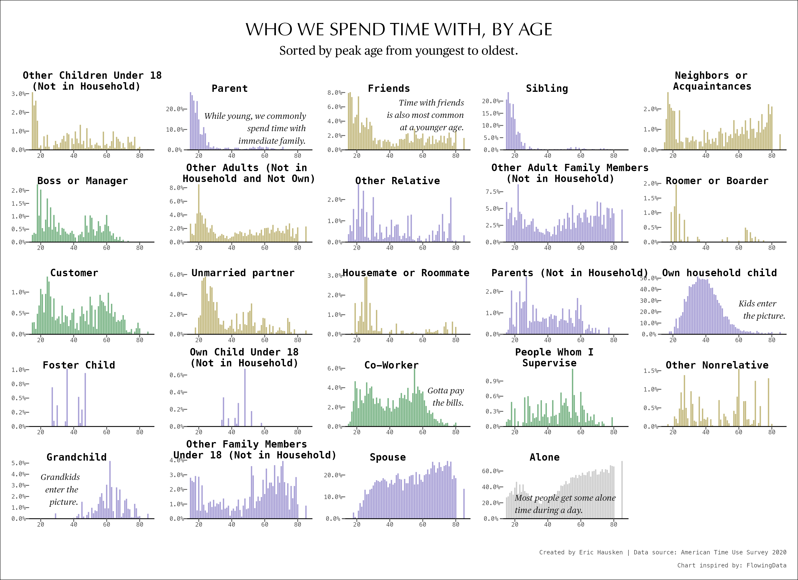
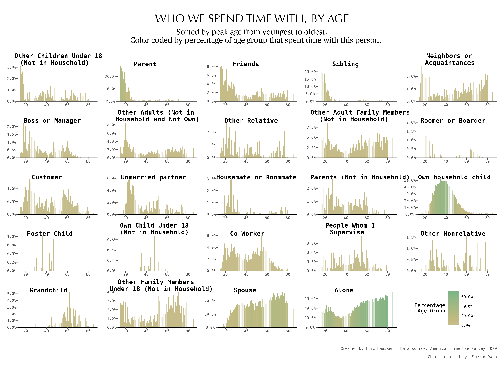

```{r setup, include=FALSE}
knitr::opts_chunk$set(out.width="100%", fig.align="center")

library(tidyverse)
```

## Original chart 
```{r echo=FALSE, fig.cap="Source: FlowingData", out.width = '100%', fig.align='center'}
knitr::include_graphics("Screenshot.png")
```


## Replication

```{r load-data}
data <- read_csv("data.csv")

data$whofct <- forcats::fct_reorder(
  .f = data$who, data$Y, min
  ) 

glimpse(data)
```

### Color theme of the plot

To obtain the colors for the plot, I uploaded the screenshot of the plot to an online color generator. These are the codes for the four colors in the original article. 

```{r set-color-theme}
colors <- c("#CCCCCC", "#A8A0D6", "#C4BA81", "#7AB486" )
```

``` {r echo=FALSE, fig.cap="Color Theme", out.width = '50%', fig.align='center'}
color_table <- tibble(
  x = 1:4,
  y = c(1, 1, 1, 1),
  c = colors
)

color_theme <- color_table |> 
  ggplot(aes(rev(x), y, fill = factor(x), label = colors )) +
  geom_col() +
  geom_text(aes(y = .5), size = 7, family = "Menlo") +
  scale_fill_manual(values = colors, guide = "none") +
  theme_void() +
  coord_flip()

ggsave(filename = "Color_theme.png", 
       plot = color_theme, 
       width = unit(5, "in"), 
       height = unit(5, "in") 
)

knitr::include_graphics("Color_theme.png")
```

```{r create-annotatations, echo=FALSE }
annotations <- tribble(~x, ~y, ~whofct, ~label, ~category,
                       20, .15, "Alone", "Most people get some alone\ntime during a day.", "Alone",
                       20, .017, "Grandchild", "Grandkids\n\tenter the\n\t\tpicture", "Family", 
                       60, .2, "Own household child", "Kids enter\nthe picture", "Family", 
                       60, .02, "Co-Worker", "Gotta pay the\nbills.", "Work",
                       25, .1, "Parent", "While young, we commonly\nspend time with\nimmediate family.", "Family",
                       20, .03, "Friends", "Time with friends is also\nmost common at a younger age.", "Friend"
)

annotations$whofct <- factor(annotations$whofct)
```


```{r replication-plot}
plt <- data |> 
  ggplot(aes(x = TEAGE, y = p, fill = category)) +
  geom_col(
    width = .8, 
  ) +
  geom_hline(yintercept = 0, linewidth = .4) +
  
  # geom text 
  geom_text(data = annotations, 
            aes(x = x, y = y, label = label), 
            color = "gray10",
            size = 3,
            family = "Publico Text",
            fontface = "italic",
            hjust = 0, 
            vjust = 1
  ) +
  
  # facet wrap
  facet_wrap(
    ~ whofct , scales = "free", ncol = 5, 
  ) +
  
  theme_void() +
  labs(
    
    # TITLES 
    title = "WHO WE SPEND TIME WITH, BY AGE",
    subtitle = "Percentage of people, at each age, 
    spending time with this person on survey day in 2020, 
    excluding March and April",
    caption = "Created by Eric Hausken | Data source: American Time Use Survey 2020\n
    Chart inspired by: FlowingData | R code inspired by: Henrick Lindberg") +
  
  theme(
    
    # axis settings
    axis.text = element_text(
      family = "Menlo", size = 6, color = "gray30"
      ),
    axis.ticks = element_line(
      color = "gray30"
      ),
    axis.ticks.length = unit(-1.0, "mm"),
    
    # spacing
    panel.spacing.x = unit(4, "mm"),
    plot.margin = margin(4, 4, 4, 4, "mm"), 
    panel.spacing.y = unit(1, "mm"),
    
    # strip/facet placement and text
    strip.text = element_text(
      family = "Menlo", hjust = 0.3, vjust = -.2,  
      size = 10, face = "bold"),
    strip.clip = "off", 
    
    #  colors 
    plot.background = element_rect(fill = "white"), 
    legend.position = "none",
    
    
    # plot titles 
    plot.title = element_text(
      family = "Optima", size = 18, 
      hjust = 0.5, margin = margin(4,4,1,4, "mm")
    ), 
    plot.title.position = "plot", 
    plot.subtitle = element_text(
      size = 12, margin = margin(1,4,4,4, "mm"), 
      family = "Publico Text", hjust = 0.5),
    plot.caption = element_text(
      family = "Menlo", color = "gray30", 
      size = 6, margin = margin(8,0,0,0, unit = "mm"))
    
  ) +
  scale_y_continuous(
    label = scales::label_percent(accuracy = .1)
  ) +
  scale_fill_manual(
    values = colors 
  )
```


```
ggsave(filename = "Replication_plot.png", 
       plot = plt, 
       width = unit(11, "in"), 
       height = unit(8, "in") 
)
```

```{r echo=FALSE, fig.cap="Replication", out.width = '100%', fig.align='center'}



```

## Enhanced version

```{r enhanced-plot}
plt_2 <- data |> 
  ggplot(
      aes(x = TEAGE, y = p, fill = p)) +
      geom_col(width = .8, 
  ) +
  
  geom_hline(yintercept = 0, linewidth = .4) +
  
  # facet wrap
  facet_wrap(
    ~ whofct , scales = "free", ncol = 5, 
  ) +
  
  theme_void() +
  labs(
    
    # TITLES 
    title = "WHO WE SPEND TIME WITH, BY AGE",
    subtitle = "Percentage of people, at each age, 
    spending time with this person on survey day in 2020, 
    excluding March and April",
    caption = "Created by Eric Hausken | Data source: American Time Use Survey 2020\n
    Chart inspired by: FlowingData | R code inspired by: Henrick Lindberg") +
  
  theme(
    
    # axis settings
    axis.text = element_text(
      family = "Menlo", size = 6, color = "gray30"),
    axis.ticks = element_line(color = "gray30"),
    axis.ticks.length = unit(-1.0, "mm"),
    
    # spacing
    panel.spacing.x = unit(4, "mm"),
    plot.margin = margin(4, 4, 4, 4, "mm"), 
    panel.spacing.y = unit(1, "mm"),
    
    # strip/facet placement and text
    strip.text = element_text(
      family = "Menlo", hjust = 0.3, vjust = -.2,  
      size = 10, face = "bold"),
    strip.clip = "off", 
    
    #  colors 
    plot.background = element_rect(fill = "white"), 
    legend.position = "none",
    
    
    # plot titles 
    plot.title = element_text(
      family = "Optima", size = 18, 
      hjust = 0.5, margin = margin(4,4,1,4, "mm")
    ), 
    plot.title.position = "plot", 
    plot.subtitle = element_text(
      size = 12, margin = margin(1,4,4,4, "mm"), 
      family = "Publico Text", hjust = 0.5),
    plot.caption = element_text(
      family = "Menlo", color = "gray30", size = 6, 
      margin = margin(8,0,0,0, unit = "mm"))
    
  ) +
  scale_y_continuous(
    label = scales::label_percent(accuracy = .1)
  ) +
  scale_fill_gradient2(
    low = colors[2], mid = colors[3], high = colors[4], 
    midpoint = .1
  )

ggsave(filename = "Enhanced_version_plot.png", 
       plot = plt_2, 
       width = unit(11, "in"), 
       height = unit(8, "in") )
```

```{r echo=FALSE, fig.cap="Enhanced version", out.width = '100%', fig.align='center'}



```


