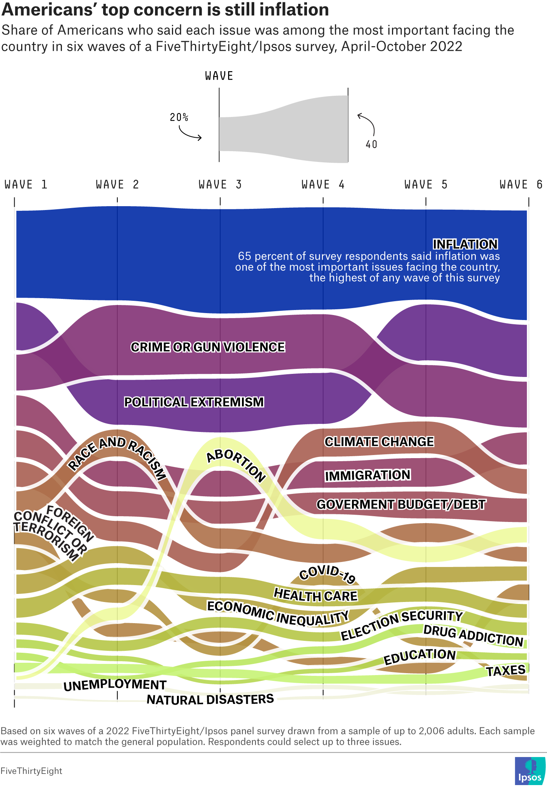

## Introduction

Anticipating the 2022 midterm American elections, *FiveThirtyEight*
undertook a survey to unveil the primary concerns of Americans and their
potential influence on voting decisions.

The forthcoming graph encapsulates the central issues articulated by
2,000 surveyed Americans from April to October 2022. It aims to shed
light on the central aspects of the investigation into the factors
influencing American decision-making in the crucial weeks before the
elections.

The principal aim of this project is to accurately replicate the
initially mentioned graph. Subsequently, upon completion of the
replication, the intention is to propose an alternative representation
for the same set of data by creating another graph.

## Original graph

As mentioned earlier, the original graph depicts the evolution in
Americans' perception of key concerns from April to October 2022. To
illustrate this, an alluvial chart is created by *FiveThirtyEight*,
showcasing the progression of this perception across the 6 waves, with
inflation emerging as the primary perceived issue in each of them. For
this, they rely on the results obtained from the *FiveThirtyEight/Ipsos*
poll, specifically addressing question three of the survey. In this
question, a set of categories- represented in the graph- are proposed,
and respondents were required to choose three as their primary concerns.

{width="100%" .external}

## Graphic replication

### Load libraries and read the database

The initial step in replicating the graph is to load the necessary
libraries for its creation.

```{r}

library(tidyverse)
library(ggalluvial)
library(shadowtext)

df <- readxl::read_excel("potser.xlsx")

```

### Data cleaning and filtering

In order to closely replicate the original graph, it is necessary to
conduct **filtering** and **recodification** of certain categories and
elements.

Initially, we filter out the categories related to "*other*" and "*none
of these*" to ensure they are not represented.

```{r}

filtered_data <- df %>%
  filter(Categoría != "None of these" & Categoría != "Other")

```

On the other hand, a recoding process is implemented for the original
names of the so-called "waves," signifying different time periods. These
names are abbreviated as follows: W1, W2, W3, W4, W5, and W6. The same
procedure is applied to rename certain categories to match those in the
original graph.

```{r}

# Waves

filtered_data$Waves <- recode(filtered_data$Waves,
                                "W1" = "WAVE 1",
                                "W2" = "WAVE 2",
                                "W3" = "WAVE 3",
                                "W4" = "WAVE 4",
                                "W5" = "WAVE 5",
                                "W6" = "WAVE 6")

# Categories 

filtered_data$Categoría <- recode(filtered_data$Categoría,
  "Inflation or increasing costs" = "Inflation",
  "Political extremism or polarization"= "Political extremism",
  "Government budget and debt" = "Government budget/debt",
  "Election security or fraud" = "Election security",
  "Opioid or drug addiction" = "Drug addiction",
  "COVID-19/ coronavirus" = "COVID-19")


```

Finally, the diverse categories were arranged to ensure that when
creating the graph, they appear in the same order as in the original.

```{r}

desired_order <- c ("Inflation", "Political extremism", "Crime or gun violence",
                    "Immigration", "Climate change", "Government budget/debt",
                    "Abortion", "Race and racism", "Economic inequality",
                    "Foreign conflicts or terrorism", "Healthcare",
                    "Election security", "Taxes", "Education", "Drug addiction",
                    "COVID-19", "Unemployment", "Natural disasters")

filtered_data$Categoría <- factor(filtered_data$Categoría, levels = desired_order)


```

### Creation of the plot

For the creation of the alluvial diagram, the **ggplot2** package and
its various extensions were utilized.

The initial step involved configuring the graph with ggplot, specifying
the dataset to be used. The aesthetics (aes) of the graph were defined,
with the X-axis representing the different "waves," the Y-axis
representing the associated values (Valores), and color and alluvium
(flows in the graph) being determined by the concern category
(Categoría).

The application of **geom_alluvium** was employed to generate the
alluvial layers of the graph, with various attributes such as
transparency (alpha), color, and line size separating different
categories being specified.

Furthermore, **scale_x_discrete** was used to configure the X-axis, and
s**cale_fill_manual** was applied to assign specific colors, derived
from the original graph, to each concern category.

Ultimately, the title and subtitle of the graph were added, accompanied
by additional adjustments to customize elements such as axis titles,
text, margins, and grid lines. The use of coord_cartesian facilitated
the adjustment of X-axis limits to ensure proper data visualization.

```{r, fig.width=5, fig.height=8}

plot <- ggplot(filtered_data) +
  aes(x = Waves, y = Valores, fill = Categoría, alluvium = Categoría) +
  geom_alluvium(decreasing = FALSE, show.legend = FALSE, alpha = 0.95, colour = "white", size = 1.9) +
  scale_x_discrete(position = "top") +
  scale_fill_manual(values = c("#1a40af", "#743f96", "#8f4683", "#9e5276",
                               "#b16f63", "#a9606b", "#e7ea98", "#b67f5c",
                               "#bdad53", "#ba8f57", "#bdbd54", "#bdcc59",
                               "#ccf483", "#b7d051", "#c1e86f", "#bc9e54",
                               "#f2f3e0", "#f2f3e0")) +
  labs(
    title = "Americans' top concern is still inflation",
    subtitle = "Share of Americans who said each issue was among the most important facing the\n country in six waves of a FiveThirtyEight/Ipsos survey, April-October 2022"
  ) +
  theme_minimal() +
  theme(
    axis.title.x.top = element_blank(),
    axis.title.y = element_blank(),
    axis.text.x = element_blank(),
    axis.ticks.x = element_blank(),
    axis.text.x.top = element_text(angle = 0, hjust = 0.5, vjust = 0.5, size = 9, family = "Agency FB", face= "bold"),
    axis.text.y = element_blank(),
    axis.ticks.y = element_blank(),
    plot.margin = unit(c(1, 1, 1, 1), "lines"),
    panel.grid.major.x = element_line(color = "black", size = 0.07),
    panel.grid.minor.x = element_line(color = "black", size = 0.07),
    plot.title = element_text(family = "Hansplatz Grotesk Bold", size = 13,
                              face = "bold", hjust = 0, margin = margin(b = 10, unit = "pt")), 
    plot.subtitle = element_text(family = "Hansplatz Grotesk Bold", size = 9,
                                 face = "plain", hjust = 0,
                                 margin = margin(t = 0, r = 0, b = 20, l = 0, unit = "pt"))
  ) +
  coord_cartesian(xlim = c(NA, NA), expand = FALSE)

plot

```

### Annotations

Finally, **ggannotate** was employed for the annotations of each
category in the graph, utilizing "*shadowText*" for the shading of each
annotation. Adjustments were made to the font type, size, color, as well
as inclination.

```{r, fig.width=5, fig.height=8, previeww=TRUE}

 plot <- plot + annotate ("shadowText", x= 5.4, y=250, label= paste("INFLATION"),
                          family= "Franklin Gothic Medium", size= 3.5,
                          color= "black", bg.color= "white", bg.r= 0.08)
 
 

 plot <- plot + annotate (geom= "text", x= 5.8, y= 236,
                          label = paste ("65 percent of survey respondents said inflation was",
                                         "one of the most important issues facing the country,",
                                         "the highest of any wave of this survey", sep = "\n"),
                          family = "Franklin Gothic Medium", size= 2.7,colour= "white", hjust=1)
 
 

 plot <- plot+ annotate ("shadowText", x= 3.03547189834111, y= 191.940039688379,
                         label= paste ("CRIME OR GUN VIOLENCE"),
                         family= "Franklin Gothic Medium", size= 3.5,
                         color= "black", bg.color= "white", bg.r= 0.08 )
 
 

 plot <- plot+annotate ( "shadowText", x= 2.7681052384344, y = 159.126290409273,
                         label =paste ("POLITICAL EXTREMISM"), 
                        family= "Franklin Gothic Medium", size= 3.5,
                        color= "black", bg.color= "white", bg.r= 0.08 )
 
 

 plot <- plot+annotate ( "shadowText", x=4.49832172596228, y = 139.615412459535,
                         label = paste ("CLIMATE CHANGE"),
                         family= "Franklin Gothic Medium", size=  3.5, 
                         color= "black", bg.color= "white", bg.r= 0.08 )
 
 

 plot <- plot+ annotate ( "shadowText",x = 4.50788283594673, y = 121.878250687045,
                          label = paste ("IMMIGRATION"),
                          family= "Franklin Gothic Medium", size= 3.5,
                          color= "black", bg.color= "white", bg.r= 0.08 )
 
 

 plot <- plot+ annotate ("shadowText", x= 4.77559391551139, y = 103.02794700318,
                         label = paste ("GOVERMENT BUDGET/DEBT"),
                         family= "Franklin Gothic Medium", size= 3.5,
                         color= "black", bg.color= "white", bg.r= 0.08)
 
 

 plot <- plot+ annotate ("shadowText", x= 3.03040079654389, y = 130.400910778853,
                         label = paste("ABORTION"), family= "Franklin Gothic Medium",
                         size= 3.5, color= "black", bg.color= "white", bg.r= 0.08)
 
 

 plot <- plot+ annotate ("shadowText", x= 3.40547189834111, y = 80.7433528761925,
                         label= paste("RACE AND RACISM"),
                         family= "Franklin Gothic Medium", size= 3.5, angle=-6L,
                         color= "black", bg.color= "white", bg.r= 0.08)
 
 

 plot <- plot+ annotate ("shadowText", x= 1.50466965260073, y = 97.2508436873157,
                         label= paste("FOREIGN"), family= "Franklin Gothic Medium",
                         size= 3.5,angle= -35L, color= "black", bg.color= "white", bg.r= 0.08)
 
 

 plot <- plot+ annotate ("shadowText", x= 1.42134402562677, y = 90.9367782109428,
                         label = paste ("CONFLICT OR "),
                         family="Franklin Gothic Medium", size= 3.5, angle= -35L,
                         vjust = 0.25, color= "black", bg.color= "white", bg.r= 0.08)
 
 

 plot <- plot+ annotate ("shadowText", x= 1.35965944508192, y = 87.1183131338777,
                         label = paste ("TERRORISM"), family= "Franklin Gothic Medium",
                         size= 3.5,angle= -35L, color= "black", bg.color= "white", bg.r= 0.08)
 
 

 plot<- plot+ annotate ("shadowText", x= 3.97289956683296, y = 40.1741646222174,
                        label = paste ("COVID-19"), family= "Franklin Gothic Medium",
                        size= 3.5, color= "black", bg.color= "white", bg.r= 0.08)
 
 

 plot<- plot+ annotate ("shadowText",x = 3.9202178680187, y = 52.7033197743356,
                        label = paste("HEALTHCARE"), family= "Franklin Gothic Medium",
                        size= 3.5, color= "black", bg.color= "white", bg.r= 0.08)
 
 

 plot<- plot+ annotate ("shadowText", x=  4.46963839600892, y = 64.1996250727836,
                        label = paste ("ECONOMIC INEQUALITY"),
                        family= "Franklin Gothic Medium", size= 3.5, color= "black",
                        bg.color= "white", bg.r= 0.08)
 
 

 plot<- plot+ annotate ("shadowText", x= 1.7800952657120652, y = 27.3196877943721,
                        label = paste ("ELECTION SECURITY"),
                        family= "Franklin Gothic Medium", size= 3.3, angle= -7L,
                        color= "black", bg.color= "white", bg.r= 0.08)
 
 

 plot <- plot+ annotate ("shadowText", x =5.35770595205863, y = 26.8394405136272,
                         label = paste ("DRUG ADDICTION"),family= "Franklin Gothic Medium",
                         size= 3.5, angle= -5L, color= "black", bg.color= "white", bg.r= 0.08)
 
 

 plot <- plot+ annotate ("shadowText", x = 5.10049440802788, y = 21.6345688058513,
                         label = paste ("EDUCATION"),family= "Franklin Gothic Medium",
                         size= 3.5, color= "black", bg.color= "white", bg.r= 0.08)
 
 

 plot <- plot+ annotate ("shadowText", x = 5.75082486420105, y = 12.8789224437039,
                         label = paste ("TAXES"), family= "Franklin Gothic Medium",
                         size= 3.5, color= "black", bg.color= "white", bg.r= 0.08)
 
 

 plot <- plot+ annotate ("shadowText", x = 1.98660111783731, y = 4.08708463768002,
                         label = paste ("UNEMPLOYMENT"),
                         family = "Franklin Gothic Medium", size = 3.3,
                         color= "black",bg.color= "white", bg.r= 0.08)
 
 
 plot <- plot+ annotate ("shadowText",x= 4.10927846574883, y = 2.98728980567533,
                         label = paste ("NATURAL DISASTERS"),
                         family= "Franklin Gothic Medium", size= 3.3,
                         color= "black", bg.color= "white", bg.r= 0.08)
 
 
 plot

```

## Graphic alternative

As an alternative visualization to maintain the objective of depicting
the evolution of Americans' perceptions regarding their top concerns
across the six waves, I find the heatmap to be a highly effective
choice. This approach facilitates the observation of trend developments
and patterns, allowing for comparisons between different categories.
Additionally, the representation of values through varied color
gradients enhances the intuitive depiction of intensity for each
category.

To accomplish this, the same pre-cleaned database (filtered_data) used
in replicating the graph was employed. The only modification made was
changing the order of the categories.

```{r}

order_heatmap <- filtered_data |>
  group_by(Categoría) |>
  summarise(Tendencia = sum(Valores)) |>
  arrange(Tendencia) |>
  pull(Categoría)


filtered_data$Categoría <- factor(filtered_data$Categoría, levels = order_heatmap)

```

In this manner, the **ggplot2** library is employed to create a
*heatmap* that visualizes the evolution of Americans' primary concerns
over six periods (waves) between April and October 2022.

The subsequent step revolves around constructing the graph itself.
Utilizing ggplot, the heatmap is crafted, where waves are positioned on
the X-axis, categories (Categoría) on the Y-axis, and values are
represented through colors. Similarly, the heat.colors palette is
employed, featuring 10 distinct shades, aiming to accentuate diverse
changes and enhance visual perception. To associate warmer colors with
higher values, the "*rev"* function is used, thereby reversing the
order. Furthermore, the graph's title is specified, and theme
adjustments are applied to enhance readability and overall presentation.

This approach delivers a clear and effective visual representation of
the evolution of Americans' top concerns over time.

```{r, fig.width=5, fig.height=8}


heatmap <-ggplot(filtered_data, aes(x = Waves, y = Categoría, fill = Valores)) +
  geom_tile(color = "white") +
  scale_fill_gradientn(colours = rev(heat.colors(10))) +
  labs(
    title = "Americans' top concern's. April-October 2022",
    subtitle = "Share of Americans most important issues perception in six waves, April-October 2022", 
    fill = NULL
  ) +
  theme_minimal() +
  theme(
    axis.text.x = element_text(angle = 90, vjust = 0.5),
    axis.title.x = element_blank(),
    axis.title.y = element_blank(),
    legend.title = element_blank(),
    plot.title = element_text(family= "Franklin Gothic Medium",hjust = 1, size = 15,
                              margin = margin(b = 5, l = 10, unit = "pt")), 
    plot.subtitle = element_text(family = "Hansplatz Grotesk Bold", size = 9,
                                 face = "plain", hjust = 0.75,
                                 margin = margin(t = 0, r = 0, b = 20, l = 10, unit = "pt")),
    plot.margin = margin(t = 10, r = 10, b = 10, l = 10, unit = "pt") 
    )

 heatmap

```
