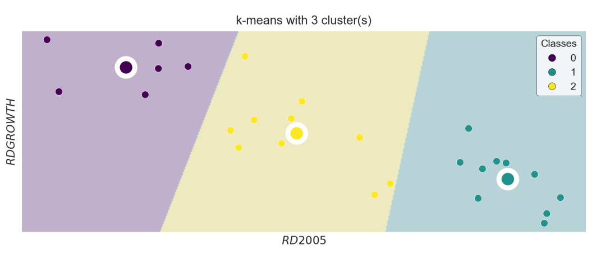
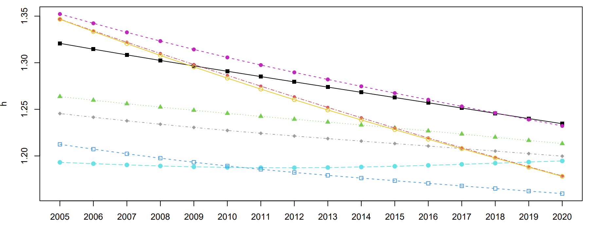

```{r setup, include=FALSE}
knitr::opts_chunk$set(out.width="100%", fig.align="center")
```

## Introduction

These project is divided in two parts following the idea of convergence clubs, the first part focuses on applying KMeans algorithm following the data that formal Beta-convergence uses, and the second part will be regarding the methodology proposed by Phillips and Sul to study the existence of Convergence Clubs.

The project does not focuses on how KMeans and ClubConvergence methodologies work but rather how we could replicate the graphs that different libraries show the results and its respective improvement or alternative representation.

## Data

The data used comes from the [eurostat](https://ec.europa.eu/eurostat/databrowser/view/rd_e_gerdtot/default/table?lang=en) database, and is the Research and Development spending per capita of European countries from 2005-200. In which for the KMeans representation we have the base value of 2005, and the growth in percentage terms in that range. For the case of club convergence we used the annual values of each country.

```{r}

library(ggplot2)
library(tidyverse)

#kmeans dataframe
kmeans <- data.frame(
  RD2005 = c(6.275703, 2.624669, 4.833102, 6.847262, 6.518114, 
             4.338597, 6.201928, 4.655863, 5.461711, 6.358016, 
             4.283587, 5.596568, 3.475067, 3.845883, 6.930886, 
             4.417635, 4.213608, 6.395762, 6.600143, 3.591818, 
             4.739701, 2.727853, 5.331268, 3.589059, 6.952059, 
             7.070979),
  Growth = c(0.92375108, 1.69681154, 1.16036030, 0.52391288, 
             0.63775027, 1.55277085, 0.62851413, 0.79388677, 
             0.34673183, 0.31490307, 0.75596008, 0.44273349, 
             1.21811383, 1.46337410, 0.09846755, 0.99757606, 
             0.90737537, 0.57252347, 0.62278834, 1.66619833, 
             1.01064686, 1.24432410, 0.84397491, 1.44594353, 
             0.18259257, 0.32154540),
  Classes = c(1, 0, 2, 1, 1, 2, 1, 2, 2, 1, 2, 2, 0, 0, 1, 
              2, 2, 1, 1, 0, 2, 0, 2, 0, 1, 1)
)

kmeans$Classes <- factor(kmeans$Classes)

#Club Convergence Club 1 dataframe
RD_c1 <- data.frame(
  country = rep(c("Austria", "Belgium", "Denmark", 
                  "Finland", "Germany", "Luxembourg", 
                  "Netherlands", "Sweden"), each = 16),
  year = rep(2005:2020, times = 8),
  value = c(
    1.2636954, 1.2597917, 1.2560107, 1.2523861, 
    1.2489316, 1.2456249, 1.2424396, 1.2393501, 
    1.2362968, 1.2332214, 1.2300758, 1.2268392, 
    1.2234943, 1.2200762, 1.216634, 1.2132162,
    1.1931131, 1.1917045, 1.1903862, 1.1892365, 
    1.1883264, 1.1876866, 1.1873416, 1.1873075, 
    1.1875762, 1.1881236, 1.188915, 1.1899046, 
    1.1910207, 1.1922126, 1.1934391, 1.1946641,
    1.3207855, 1.3145264, 1.3084158, 1.3024538, 
    1.2966115, 1.2908368, 1.285117, 1.2794547, 
    1.2738372, 1.2682436, 1.2626524, 1.2570401, 
    1.2513862, 1.2457252, 1.2401036, 1.2345612,
    1.3467373, 1.3342167, 1.3219579, 1.3099375, 
    1.2981126, 1.2864238, 1.2748457, 1.2633862, 
    1.2520707, 1.2409227, 1.2299724, 1.2192528, 
    1.2087581, 1.1984812, 1.188409, 1.1785213,
    1.2454659, 1.2415035, 1.2376704, 1.234019, 
    1.2305783, 1.2273345, 1.2242728, 1.2213699, 
    1.2185924, 1.2159016, 1.2132533, 1.2106106, 
    1.2079341, 1.20522, 1.2024912, 1.19978,
    1.3466198, 1.3334351, 1.3205158, 1.307873, 
    1.2955232, 1.2834622, 1.271719, 1.260325, 
    1.249302, 1.2386057, 1.2281681, 1.2179158, 
    1.2077794, 1.1977508, 1.1878533, 1.1781052,
    1.2124217, 1.2072734, 1.2023008, 1.1975962, 
    1.1932373, 1.1892418, 1.1856002, 1.1822699, 
    1.179186, 1.1762552, 1.1734111, 1.1706133, 
    1.1678222, 1.1650372, 1.1622778, 1.1595588,
    1.3522649, 1.3423129, 1.3326128, 1.3232417, 
    1.314261, 1.3056945, 1.2975129, 1.2896621, 
    1.282073, 1.2746767, 1.2674274, 1.2602729, 
    1.2531619, 1.2460934, 1.2391038, 1.2322215
  )
)


```


## Methodology

### KMeans

There are several algorithms for clustering, but the standard one is the Hartigan-Wong algorithm in which the total variance of the individuals within a cluster is defined as the sum of the squared Euclidean distances between the elements and the corresponding centroid.  

The centroid of each group is the center of the group that corresponds to the mean value of each individual in that cluster.

The clustering algorithm follows the following processes:

* The algorithm randomly places $k$ centroids in the data as initial centroids. And then, each individual $x_i$ is assigned to the nearest centroid using the Euclidean distance.
	
* The next step is to calculate the average value of each cluster that becomes the new centroid and the individuals $x_i$ are reassigned to the new centroids $μ_k$.

* The previous step is repeated until the centroids do not change, thus achieving that the total variation of individuals within a cluster is the minimum possible. 


### Club Convergence  

For the analysis of convergence clubs, we will apply the methodology developed by Phillips and Sul (2007) through Stata program and RStudio of [Du (2017)](https://journals.sagepub.com/doi/pdf/10.1177/1536867X1801700407). This methodology allows us to study the existence of convergence clubs without having to separate our data sample into subgroups through several variables in common. 
Due to the word count limit, the mathematical development cannot be presented. However, for details, you can follow the work of Phillips and Sul (2007, 2009) and Du (2017). However, the following t-regression model will be the one studied in the present work:
The following t regression model developed by Phillips and Sul (2007) is used:
$$log⁡(H_1/H_t )-2log⁡{log⁡(t)}=a+blog⁡(t)+ε_t for t=[rT],[rT]+1,…,T";  " r>0 $$
In which, if there is convergence $H_i$ will be 0 and, therefore $log⁡(H_1/H_t)$ will tend to infinity. For this to occur $b$ has to be greater than or equal to zero, in case it is negative the hypothesis of absolute convergence would be rejected and we would proceed to analyze if there are convergence clubs.
For convergence clubs, Phillips and Sul (2007) developed an algorithm to identify the various clubs that might be in a sample. 


The following process represents how this algorithm works:

1. *Cross-section classification*: The different countries are ordered in decreasing order, i.e., from highest to lowest, taking into account the values of the last period.

2. *Club formation*: We start by forming groups from the country with the highest value in the last period. Then we look for the first k such that when we do the log $t$ regression test statistic, we are left with $t_k$ being greater than -1.65. This is done for the first two countries, and in case it is not satisfied, it is performed for the second and third countries, and so on until a pair of countries is found that does satisfy the test. In case there is no pair of countries, i.e., there is no $k$ that meets this requirement, there would be no convergence subgroups in our data sample.

3. *Screening of individuals to create convergence clubs*: In the event that in the club formation, we have encountered a pair, we proceed to perform the same test by adding countries in the order we previously classified. When the criterion is no longer met, we would have our first club.
	
4. *Recursion and stopping rule*: A subgroup is made with the individuals that have not been screened in the previous step. The log $t$ regression test is performed and if it is greater than -1.65, another group is formed. Otherwise, the three previous steps would be performed with this subgroup.


## KMeans

### Original graph

The original graph represents the R&D spending per capita growth from 2005 to 2020, and the base value in 2005 in an scatter plot with three different background areas colored representing the different classes obtained using the kmeans algorithm for these two features. The graph was done by myself in python using mathplotlib and the kmeans algorithm to obtain the graph.


{width="100%"}


### Replication 

The first thing we have to do to replicate this graph is to do a simple *scatterplot* in which we have to plot the points twice, one with the color of the "class" and another point in the same place but a little bit wider in a white color.

This first step is pretty straight forward as we only have to graph the points of each country, and then we have to plot the centroids manually with the same idea of plotting the point twice to give a wider border to each point.

Then, the next step is to put the legend inside the graph rather than outside. Although there are still some minor changes that we should focus before plotting the colored areas indicating each different class such as removing the grid lines among other things.

```{r, fig.height=5, fig.width=12}

ggplot(kmeans) +
  geom_point(aes(x = RD2005, y = Growth), color = "white", 
             size = 7, shape = 16) +
  geom_point(aes(x = RD2005, y = Growth, color = Classes), 
             size = 6, shape = 16) +
  geom_point(x = 3.3, y = 1.5, size = 18, color = "white", shape = 16) +
  geom_point(x = 3.3, y = 1.5, size = 12, color = "#440154", shape = 16) +
  geom_point(x = 4.8, y = 0.9, size = 18, color = "white", shape = 16) +
  geom_point(x = 4.8, y = 0.9, size = 12, color = "#fde725", shape = 16) +
  geom_point(x = 6.6, y = 0.45, size = 18, color = "white", shape = 16) +
  geom_point(x = 6.6, y = 0.45, size = 12, color = "#21918c", shape = 16) +
  scale_color_manual(values = c(
    "0" = "#440154",
    "1" = "#21918c", 
    "2" = "#fde725")) +
  labs(x = "RD2005", y = "Growth") + 
  theme(
    legend.position = c(.95, .95),
    legend.justification = c("right", "top"),
    legend.box.just = "right",
    legend.margin = margin(6, 6, 6, 6)
    )

```

The complicated part while replicating the plot is how we create the background which is composed of three different colored areas representing each class the countries are part of.

We will use the **geom_polygon()** to color these areas,  and for that matter we have to create three temporary dataframes as we can observe in the code that shows which points it will cross the polygon before coloring the area of the shape.

Then, in this part we have also removed all the information that is not shown in the original graph such as the axis ticks and improving the legend to match the original graph.

```{r, fig.height=8, fig.width=17,  preview=TRUE}
violet <- data.frame(x = c(2.1, 2.1, 3.2, 4.3), y = c(2, -1, -1, 2))
yellow <- data.frame(x = c(3.2, 4.3, 6.3, 5.5, 3.5), y = c(-1, 2, 2, -1, -1))
blue  <- data.frame(x = c(6.1, 5.3, 8, 8), y = c(2, -1, -1, 2))


ggplot(kmeans) +
scale_y_continuous(breaks = c(0.2, 0.4, 0.6, 0.8, 1.0, 1.2, 1.4, 1.6), 
                   minor_breaks = NULL) +
scale_x_continuous(breaks = c(3, 4, 5, 6, 7), minor_breaks = NULL) +  
theme(axis.title = element_text(face ="italic", size=15)) +
theme(
  legend.position = c(0.99, 0.99),
  legend.justification = c("right", "top"),
  legend.box.just = "right",
  legend.margin = margin(11, 5, 5,11),
  legend.spacing.x = unit(0.8, "cm"), 
  legend.text = element_text(size = 16),
  legend.title = element_text(size = 15),
  legend.background = element_rect(fill = "#f0f6f7", size = 0.3, 
                                   color ="gray")) +
guides(color = guide_legend(override.aes = list(size = 8))) +
ggtitle("k-means with 3 cluster(s)") +
theme(plot.title = element_text(hjust = 0.5, size=17)) +
theme(legend.spacing.x = unit(0.5, 'cm')) +
theme(legend.text.align = 0.5) +
theme(
  axis.line = element_blank(),      
  axis.text = element_blank(),     
  axis.ticks = element_blank(),      
  panel.grid.major = element_blank(),  
  panel.grid.minor = element_blank()) +
theme(axis.title = element_text(face ="italic", size=14, color = "black")) +
labs(y = "RDGROWTH", x="RD2005") +
coord_cartesian(xlim = c(min(kmeans$RD2005), max(kmeans$RD2005)), 
                ylim = c(min(kmeans$Growth), max(kmeans$Growth))) +
geom_polygon(aes(x = x, y = y), data = violet, fill = "#c1b0cb") +
geom_polygon(aes(x = x, y = y), data = yellow, fill = "#eee9bf") +
geom_polygon(aes(x = x, y = y), data = blue, fill = "#b8d3d8") +
geom_point(aes(x = RD2005, y = Growth), color = "white", size = 7, shape = 16) +
geom_point(aes(x = RD2005, y = Growth, color = Classes), size = 6, shape = 16) +
geom_point(x = 3.3, y = 1.5, size = 18, color = "white", shape = 16) +
geom_point(x = 3.3, y = 1.5, size = 10, color = "#440154", shape = 16) +
geom_point(x = 4.8, y = 0.9, size = 18, color = "white", shape = 16) +
geom_point(x = 4.8, y = 0.9, size = 10, color = "#fde725", shape = 16)+
geom_point(x = 6.6, y = 0.52, size = 18, color = "white", shape = 16) +
geom_point(x = 6.6, y = 0.52, size = 10, color = "#21918c", shape = 16)+
scale_color_manual(values = c(
    "0" = "#440154",
    "1" = "#21918c", 
    "2" = "#fde725"))
```

### Alternative

One of the main problems that this graph has is that first the colored background may confuse readers thinking that a country different from the original set of countries falls into certain color it would be part of that class, although how kmeans work it would not be exactly like that, for that matter although in the original graph and its replication the colored area makes the graph more enhancing it may confuse the reader.

Another problem is that the graph does not give so much information as there is no axis ticks, we do not fully know which is the range of the R&D spending and its unit measure. Although a better version of the replication would be the first step shown above one alternative is to represent the scatter plot using a facet_wrap to differentiate better between the classes.

To complicate the graph I decided to color the facet label to match the color of the class. Although there is a library called *ggh4x*, that allows us to do this thing easily, there is another way using *geom_rect()* which is better explained [here](https://stackoverflow.com/questions/70841252/how-to-specify-different-background-colors-for-each-facet-label-in-ggplot2).

In order to do this, we have to create a dataset that contains a column with all the facet names, in this case the different classes we have for the countries. Followed by another column that contains the labels we have for each class. We then specify the color using *scale_fill_manual()* and it is important that we use *coord_cartesian()* for two reasons:

1) To cut the panel area in the plot to only contain the points so the panel does not change to accomodate the geom_rect.

2) To turn clipping off, so layers outside the panel can be seen.

And finally, it is important to turn strip.background to transparent so we can see the color of each box.


```{r, fig.height=6, fig.width=12}
temp_df <- data.frame(
  Classes = c(0,1,2),
  var_color = c("Class 0", "Class 1", "Class 2"))

ggplot(kmeans) + 
  geom_rect(
    data = temp_df,
    aes(
      xmin = -Inf, xmax = Inf,
      ymin = 2.1, ymax = 2.6,     
      fill = var_color, alpha = 0.4
    )
  ) +     
  coord_cartesian(clip = "off", ylim = c(0, 2))  + 
  geom_point(aes(x = RD2005, y = Growth, color = factor(Classes)), size = 5) +  
  scale_color_manual(values = c(
    "0" = "#440154",
    "1" = "#21918c", 
    "2" = "#fde725"
  )) + 
  facet_wrap(~ factor(Classes, labels = c("Class 0", "Class 1", "Class 2")), 
             ncol = 1 ) +
  scale_fill_manual(
    values = c("Class 0" = "#440154", "Class 1" = "#21918c", 
               "Class 2" = "#fde725")) +
  theme_bw() +
  theme(
    strip.background = element_rect(fill = NA),
    strip.text = element_text(size = 12, face = "bold"),
    legend.position = "none",
    axis.text.x = element_text(color = "black", size = 12),
    axis.text.y = element_text(color = "black", size = 12),
    axis.title.x = element_text(color = "black", size = 14),
    axis.title.y = element_text(color = "black", size = 14),
    axis.ticks = element_line(color = "black")
  ) +   
  labs(
    title = "Kmeans with 3 cluster(s)",
    x = "log(RD2005percapita)",
    y = "Growth(%)",
    subtitle = "European clusters in terms of R&D spending",
    caption = "Kmeans algorithm has been applied to EU countries in terms of 
the log of the R&D spending per capita and its respective growth from 2005-2020"
  ) 
```


## Club Convergence

### Original graph

The original graph is a representation of the countries of the three different clubs obtained and a fourth graph that takes into account the average of each club. The graph has been done using the [ClubConvergence](https://cran.r-project.org/web/packages/ConvergenceClubs/ConvergenceClubs.pdf) package in R in which the four graphs are shown in the same figure using only one line of code to get the result once the clubs were calculated.

For that matter as the four graphs are exactly the same only changing the club representing I will only replicate one of the clubs in order to show a better alternative to represent a club visually. Although the way to replicate the exact figure would be creating four graphs, one for each club and another one with the average of each club and then using patchwork to create the figure.
{width="100%"}

### Replication

The graph is pretty simple to replicate it only takes time to assign each color, shape and type of line to each country. 

The point shape options in ggplot are the ones we can observe in the following picture:

 ](pointshape.png){width="100%"}

And the line shape options in ggplot are the ones we can observe in the following picture:
 ](lineshape.png){width="100%"}


The following scheme of colors, shapes and linetype for each country is assigned using this code:

```{r}
country_colors <- c(
  "Austria" = "#61d04f",
  "Belgium" = "#28e2e5",
  "Denmark" = "#080404",
  "Finland" = "#df536b",
  "Germany" = "#9e9e9e",
  "Luxembourg" = "#f5c710",
  "Netherlands" = "#2297e6",
  "Sweden" = "#cd0bbc"
)

country_shapes <- c(
  "Austria" = 17,
  "Belgium" = 16,
  "Denmark" = 15,
  "Finland" = 16,
  "Germany" = 18,
  "Luxembourg" = 1,
  "Netherlands" = 0,
  "Sweden" = 16
)


country_linetypes <- c(
  "Austria" = "dotted",
  "Belgium" = "longdash",
  "Denmark" = "solid",
  "Finland" = "dotdash",
  "Germany" = "dotdash",
  "Luxembourg" = "solid",
  "Netherlands" = "dashed",
  "Sweden" = "dashed"
)
```

To replicate the graph is really straightforward as we only have two represent the lines and points using *geom_line()* and *geom_point* respectively, assign the line types, shape types and colors for each country.

```{r, fig.height=3, fig.width=9}
ggplot(RD_c1, aes(x = year, y = value, color = country, shape = country, 
                  linetype = country)) +
  geom_line() +
  geom_point(size = 2) +
  theme_bw() +
  scale_x_continuous(breaks = RD_c1$year, labels = RD_c1$year) +
  scale_y_continuous(breaks = c(1.20, 1.25, 1.30, 1.35)) +
  theme(panel.grid.major = element_blank(), panel.grid.minor = element_blank(), 
        axis.title.x = element_blank()) +
  ylab("h") +
  scale_color_manual(values = country_colors) +
  scale_shape_manual(values = country_shapes) +
  scale_linetype_manual(values = country_linetypes)+ 
  theme(legend.position = "none") +
  theme(panel.border = element_rect(colour = "black", fill=NA, size=0.7),
        axis.text.y = element_text(angle = 90, colour = "black"),
        axis.title.y=element_text(colour="black"),
        axis.text.x = element_text(colour = "black")
        )
```

### Alternative

One of the main issues with the graph is that there is no legend and we do not know which is country is which although it would just deleting *theme(legend.position = "none")* from the previous code, although a better alternative would be representing the graph using *facet_wrap* and *gghighlight* mainly.


```{r, fig.asp=1}
library(gghighlight)

ggplot(RD_c1) +
  geom_line(aes(x=year, y=value, color=country, linetype = country)) +
  geom_point(aes(x=year, y=value, color = country, shape = country)) +
    gghighlight(use_direct_label = FALSE,
              unhighlighted_params = list(colour = alpha("grey85", 0.5), 
                                          shape=1, linetype = "solid")) +
  theme_bw() +
  scale_x_continuous(breaks = seq(min(RD_c1$year), max(RD_c1$year), by = 5)) +  
  scale_y_continuous(breaks = c(1.20, 1.25, 1.30, 1.35)) +
  theme(
    panel.grid.major = element_blank(),
    panel.grid.minor = element_blank(),
    axis.title.x = element_blank(),
    axis.text.x = element_text(size = 8)  
  ) +
  ylab("h") +
  scale_color_manual(values = country_colors) +
  scale_shape_manual(values = country_shapes) +
  scale_linetype_manual(values = country_linetypes) +
  facet_wrap(~country, scales = "fixed") +  # Facet by country
  theme(legend.position = "none")+
  theme(
    axis.text = element_text(color="black", size=7),
    strip.text.x = element_text(face="bold"),
    plot.background = element_rect(color="#F4F5F1", fill="#F4F5F1"),
    legend.position = "none",
    legend.title = element_text(face="bold")
  ) + theme(strip.background = element_blank(),
             panel.spacing=unit(1,"lines"))
```

