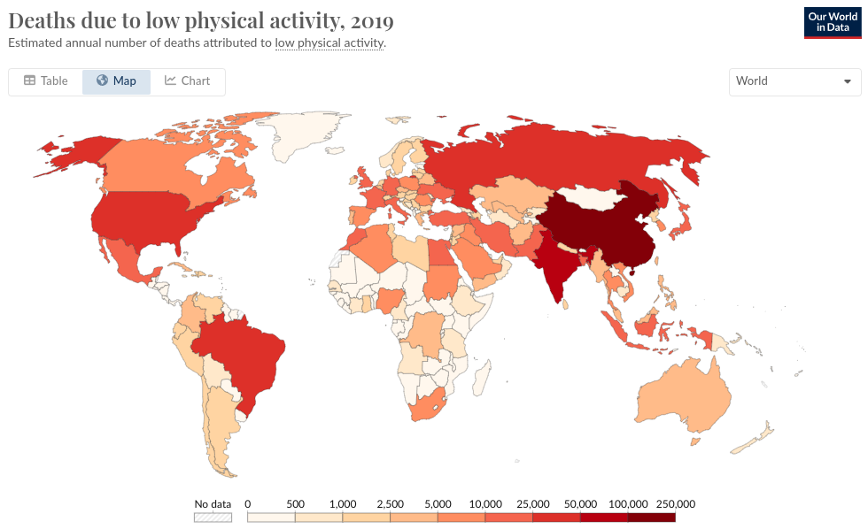

## Original graph

The original graph can be found following [this link](https://ourworldindata.org/grapher/deaths-due-to-low-physical-activity?time=latest&country=Eastern+Mediterranean+Region+%28WHO%29~Scotland~SRB~GNQ~TTO~SWZ~UKR~PHL~ATG).

{.external}

## The data

### Deaths due to low physical activity

```{r initialization}
# Libraries used

library(tidyverse)
library(arules)
library(sf) 
library(rnaturalearth)  
library(ggtext)  
library(ggiraph)
library(ggrepel)
library(kableExtra) 
library(gt)
library(gtExtras)
library(ggpp)
```

Fortunately, the data used to create this graph was already available on Our Word In Data and can be downloaded in a CSV format. This dataset was originally published by the Institute of Health Metrics and Evaluation, an American research institute in the area of global health statistics. It consists of the number of deaths attributed to low physical activity per country per year. As the data is already available, I will not make use of the `{owidR}` package that enable to load OWID data in R. Let's import the dataset.

```{r load dataset}

data <- read_csv(file = "Final_Project_Dataset.csv")  

```

The dataset is already tidy data, and is ready to be used.

### World's population data

In order to facilitate the modifications that we would like to do to the original graph later, we need to add a new column to the dataset with the population of the countries. To do so, we need a dataset of the total population of these countries from 1990 to 2019. One can be found one via [another chart created by Our World In Data](https://ourworldindata.org/population-growth#interactive-charts-on-population-growth).

We need to filter the data to only keep the data from 1990 to 2019. Also, the `population` dataset contains the total population per continent. These rows are easy to spot, they have missing values as country codes.

```{r load population dataset , tidy=TRUE}

population <- read_csv(file = "Population_per_country_per_year.csv")  

population <- 
  population |>   
  filter(Year >= 1990 & Year <= 2019) |>    
  drop_na(Code)

```

Now that we have the `population` dataset containing the total population of countries between 1990 and 2019, we can create a new dataset that joins the `data` tibble and the `population` tibble and that contains a column with the total population of each country for each year.

```{r join both datasets}

data <- 
  inner_join(data, population, 
             by = c('Code'='Code', 'Year'='Year', 'Entity'='Entity')) |>
# Let's rename the columns for better readability
  rename(c(
    Deaths = `Deaths that are from all causes attributed to low physical activity, in both sexes aged all ages`,
    Population = `Population (historical estimates)`
           )
         )

```

We are almost done. As we can see on the original Our World in Data graph, the color attributed to each country is assigned on the basis of the range of number of deaths due to low activity in the country for a given year. Therefore, we need to discretize this variable in 9 different ranges, as the color scale used by OWID contains 9 ranges. After searching on the Web, I found that such an operation could be performed thanks to the `{arules}` package, using the `discretize()` function.

```{r discretize data}

library(arules)  

# We define a vector that contains the values of the edges of each range used in the color scale of the original graph.

breaks_map <- c(0, 500, 1000, 2500, 5000, 10000, 25000, 50000, 100000, 250000)
data <-   
  data |> 
  mutate(Deaths_disc = discretize(Deaths, method = 'fixed', breaks = breaks_map),
         .after = Deaths) 

```

### World data

To plot a map of the deaths due to low physical activity, we obviously need a map. To build this map, we need data as longitudes and latitudes of the countries worldwide. We will use the `{sf}` package to represent visally the geographic data (which are polygons) and the `{rnaturalearth}` to obtain this data.

First, we use the `ne_countries()` function from the `rnaturalearth` package. This function contains predownloaded vector maps for the world's countries. We also want to make our world data a `sf` object, so that we can use the `sf` package in the future. The latter can be done by providing the argument `returnclass = 'sf'` (the default).

```{r load world data}

library(sf) 
library(rnaturalearth)  

world <- ne_countries()

```

### Final dataset

We know need to join the `world` dataset and the `data` dataset to create the dataset that will be used to project the world map in ggplot2 and display the number of deaths due to low physical activity at the same time.

```{r join world data with data}

data <-
  world |>
  left_join(data, by = c('adm0_a3' = 'Code'))

```

Finally, let's clean up our `data` dataset a bit so that R may have less difficulty to run the code that we will write to create the graph. Indeed, there are a vast majority of columns that we are not going to be using to display the data of interest with ggplot. The only columns that we need are :

-   `geometry`, which is used by `geom_sf()` to plot the shapes of the countries.

-   `Entity`: the name of the country

-   `continent`

-   `subregion`

-   `Year`

-   `Deaths`

-   `Deaths_disc`

-   `Population`

```{r cleaning up the data}

data <-
  data |>
  select(Entity,
         continent,         
         subregion,          
         Year,          
         Deaths,          
         Deaths_disc,          
         Population,          
         geometry)  

```

On a visual standpoint, the OWID graph doesn't show Antartica, so we can remove the data linked to it in our dataset. Lastly, there are many islands that might pop on our graph. The simplest solution is to clear our `data` dataset from some of these islands, which seem to be Polynesia.

```{r erase Antartica and Polynesia}

data <-   
  data |>   
  filter(continent != 'Antarctica') |>    
  filter(subregion != 'Polynesia')

```

## Main chart

### Creating the world map

The first thing we need to do is to create a projection of the world. As mentioned earlier, we will use the `{sf}` package, particularly the `geom_sf()` geom that enables to easily visualize `sf` objects. One of the advantage of this geom is that it is smart enough to understand the geometry type to draw according to the dataset we provide it.

```{r eval=TRUE}

p <-    
  data |>    
  ggplot() +   
  geom_sf()  

p

```

At this point, we have generated an empty map of the world. One thing we can notice is that the projection (meaning the way a 3D object, the world, is represented in 2D) used by default by `geom_sf()` is not exactly the same as the one used by Our World In Data. It seems that the latter is a "Robinson" projection. We can use the `coord_sf()` function to change our projection to a Robinson one.

```{r eval=TRUE}

p <-    
  p +   
  coord_sf(crs = "+proj=robin")  

p

```

### Adding the text elements

Let's add:

-   The title: "Deaths due to low physical activity, 2019",

-   The subtitle: "Estimated annual number of deaths attributed to low physical activity",

-   And the caption "**Data source:** IHME, Global Burden of Disease (2019) -- Learn more about this data

    [OurWorldInData.org/causes-of-death](https://ourworldindata.org/causes-of-death) \| [CC BY](https://creativecommons.org/licenses/by/4.0/)"

After going further, it appeared that the caption was more easily handled if we divided it in two parts: a caption and a tag. Note that for the moment, the tag position is clearly not good, as well as the size of its text, which will both be addressed when setting the theme. For convenience until then, let's comment the tag.

```{r eval=TRUE}

plot_title <- "Deaths due to low physical activity, 2019" 
plot_subtitle <- "Estimated annual number of deaths attributed to low physical activity."
plot_caption <- "Data source: IHME, Global Burden of Disease (2019) - Learn more about this data" 
plot_tag <- "OurWorldInData.org/causes-of-death | CC BY"  
```

```{r eval=TRUE}
p <-   
  p +  
  labs(title = plot_title,        
       subtitle = plot_subtitle,        
       caption = plot_caption        
       #tag = plot_tag        
       )  

p

```

### Theme

One thing that we notice is that the OWID graph has a clean white background, without any displayed meridian. As the meridians are already colored in white, adding a `theme_classic()` should give us the look we are looking for. But we also want to get rid of the longitude axis. Then, the most appropriate theme to use is the `theme_void()`.

```{r eval=TRUE}

p <- 
  p +
  theme_void()

```

Also the caption of the OWID plot has to be moved on the left, the size of the font has to be modified so that the subtitle and caption are smaller, and the title bigger. Finally, the font of the title can be switched to something approximating the Times New Roman font. Unfortunately, we were unable to use the latter font (which remains the biggest mystery of my year 2023 as it's the most basic font ever), so we needed to get an equivalent from the Google Font, the Merriweather font.

We can also de-comment the tag, and set its size and position in the `theme()`. After unsuccessfully trying several positions for the tag, such as 'bottom', and 'bottomleft', it appeared that the easiest solution was to manually set its position using `plot.tag.position = 'bottom'` (which gets the tag under the caption but in the center of the plot), and the `margin` argument of `plot.tag = element_text()`.

```{r eval=TRUE}

sysfonts::font_add_google('Merriweather', family = 'merriweather') 
showtext::showtext_auto()

```

```{r eval=TRUE}
p <-   
  data |>   
  ggplot() +   
  geom_sf() +   
  coord_sf(crs = '+proj=robin') +   
  labs(title = plot_title,        
       subtitle = plot_subtitle,        
       caption = plot_caption,        
       tag = plot_tag) + # adding the tag   
  theme_void() +   
  theme(plot.title = element_text(family = 'merriweather', size = 15),         
        plot.caption = element_text(hjust = 0),         
        plot.tag.position = 'bottom',         
        plot.tag = element_text(size = 10, # customizing tag's size and position
                                margin = margin(l = -340)))  

p

```

### Adding the data

So far, we have a chart that has some common appearance traits shared with the Our World in Data graph. We can now add the information we want to display, focusing on a single year: 2019.

The first step is to filter the data to obtain only the data from 2019. Then, we can add an aesthetic to the `geom_sf()` geom to display the number of `Deaths` from low physical activity around the world. Since we want to color the map according to this variable, we will use the `fill` aesthetic.

```{r eval=TRUE}

p <-    
  data |>
  filter(Year == 2019) |> # filtering by year   
  ggplot() +   
  geom_sf(aes(fill = Deaths_disc)) +   
  coord_sf(crs = '+proj=robin') +   
  labs(title = plot_title,        
       subtitle = plot_subtitle,        
       caption = plot_caption,        
       tag = plot_tag) +   
  theme_void() +   
  theme(plot.title = element_text(family = 'merriweather', size = 15),   
        plot.caption = element_text(hjust = 0),
        plot.tag.position = 'bottom',
        plot.tag = element_text(size = 10,    
                                margin = margin(l = -340)))

p

```

### Adjustments

One striking difference with the original plot is the legend. We need to move the legend to the bottom of the chart and change the color palette. We need to change the legend key into a color bar. This can be done by using a "[Discretized colourbar guide](https://ggplot2.tidyverse.org/reference/guide_coloursteps.html)": the `guide_colorsteps()` guide. Within this guide, the "YlorRd" palette seems exactly the one that was used by Our Word In Data for their map.

```{r eval=TRUE}

p <-    
  data |>   
  filter(Year == 2019) |>   
  ggplot() +   
  geom_sf(aes(fill = Deaths_disc)) +   
  coord_sf(crs = '+proj=robin') +   
  labs(title = plot_title,        
       subtitle = plot_subtitle,        
       caption = plot_caption,        
       tag = plot_tag) +   
  theme_void() +
  theme(
    plot.title = element_text(
      family = 'merriweather',
      size = 15),
    plot.caption = element_text(
      hjust = 0),
    plot.tag.position = 'bottom',         
    plot.tag = element_text(
      size = 10,                                  
      margin = margin(l = -340)),
    legend.position = 'bottom', # moving the legend around           
    legend.title = element_blank()) +   
  scale_fill_brewer(palette = 'YlOrRd',
                    guide = guide_coloursteps( # Modifying the default legend guide
                      ticks = TRUE,  
                      barwidth = 25,  
                      barheight = 0.5, 
                      frame.colour = 'black',  
                      frame.linewidth = 0.01,      
                      ticks.colour = 'black',   
                      ticks.linewidth = 0.01) 
                    )   

p

```

Our plot starts looking a bit similar to the OWID one. Let's move the legend's labels on top of the legend, and display the limits of the legend. I thought that the first operation could be done by modifying the `legend.text` in the `theme()` function, but it seems not possible. Therefore, we can play on the `margin` argument of the `element_text()` function in the `theme()` to move the legend's label around.\
The limits are ruled by an argument of the previously used `guide_colorsteps()`: `show.limits`.

```{r eval=TRUE}

p <-    
  data |>   
  filter(Year == 2019) |>    
  ggplot() +  
  geom_sf(
    aes(fill = Deaths_disc)) +
  coord_sf(crs = '+proj=robin') +
  labs(title = plot_title,
       subtitle = plot_subtitle,
       caption = plot_caption,
       tag = plot_tag) +   
  theme_void() +
  theme(
    plot.title = element_text(
      family = 'merriweather',
      size = 15),
    plot.caption = element_text(
      hjust = 0),
    plot.tag.position = 'bottom',         
    plot.tag = element_text(
      size = 10,
      margin = margin(l = -340)),
    legend.position = 'bottom',
    legend.title = element_blank(),
    legend.text = element_text(           
      margin = margin(t = -22) # adjusting the position of legend's labels
      )
    ) +   
  scale_fill_brewer(palette = 'YlOrRd',
                    guide = guide_coloursteps(  
                      show.limits = TRUE, # adding the scale limits to the legend
                      ticks = TRUE,      
                      barwidth = 25,                       
                      barheight = 0.5,                       
                      frame.colour = 'black',
                      frame.linewidth = 0.01,                       
                      ticks.colour = 'black',
                      ticks.linewidth = 0.01)
                    )   

p

```

Now the caption is slightly overriding the legend. We couldn't fix it in the `theme()` by specifying a `vjust` argument to `plot.caption`, so rather decided to add a `\n` at the beginning of the caption to create an empty line.

```{r eval=TRUE}

# We added a newline character at the beginning of the string to create space over the caption
plot_caption <- "\nData source: IHME, Global Burden of Disease (2019) - Learn more about this data" 
```

```{r eval=TRUE}
p 
```

Some adjustments also need to be done:

-   The borders of the polygons projected by `geom_sf()` seem to be a bit thicker than on our original OWID graph.

-   Many islands remain on the graph, giving it a messier look than the original one.

-   The title, subtitle, caption and tag need to be spaced a bit from the border of the graph.

For the first two issues, it seems that the solution could lie in the fact that the resolution/definition of the geometry variable used to project polygons on the graph and thus create a world map, is too high. I tried to use the `st_simplify()` function from the `sf` package but wasn't able to then map my data. However, a much simpler way to do so worked well, by just lowering the `scale` of the `ne_countries()` function. This results in less details in the geometry variable, and thus, a less messy visual appearance. Of course, this option is not the optimal one in terms of precision, but it seems that Our World In Data opted for displaying the data for not all countries and island worldwide.

The 3rd issue can easily be solved with some little modifications of the `theme()` by passing a `hjust` argument to `plot.title = element_text()` and so on for the subtitle and caption.

The look is a lot cleaner, with softer edges. Let's then try to :

-   Space the title, subtitle, caption, and tag a bit from the left of the plot. This can be achieved by playing on the `hjust` (`margin` for the tag) argument of each of these `element_text()` in the `theme()`.

-   Get the title bold, the caption at the same size as the subtitle, the size of the tag a bit lower than the caption. To do so, we will add `face` and `size` arguments to `element_text()` in the `theme()`.

-   Get the "Data source" string in the caption bold. For this, we will modify the plot_caption variable, load the `{ggtext}` library, and set `plot.caption` to `ggtext::element_markdown`.

Finally, the color of the text is not black in the original plot, but this color: #5b5b5b.

```{r eval=TRUE}

# Recap of the data processing with the modification on the ne_countries() function

data <- read_csv(file = "Final_Project_Dataset.csv")  

population <- read_csv(file = "Population_per_country_per_year.csv")  

population <- 
  population |>
  filter(Year >= 1990 & Year <= 2019) |>
  drop_na(Code)  

data <-
  inner_join(
    data, 
    population, 
    by=c('Code'='Code', 'Year'='Year', 'Entity'='Entity')) |>
  rename(c(Deaths = `Deaths that are from all causes attributed to low physical activity, in both sexes aged all ages`,
           Population = `Population (historical estimates)`))

breaks_map <- c(0, 500, 1000, 2500, 5000, 10000, 25000, 50000, 100000, 250000)  

data <-
  data |> 
  mutate(Deaths_disc = discretize(
      Deaths, 
      method = 'fixed', 
      breaks = breaks_map),          
    .after = Deaths)  

world <- 
  ne_countries(   
    scale = 'small', # setting the value of the scale from "large" to "small"   
    returnclass = 'sf'
    )  

data <-
  world |>    
  left_join(data, 
            by = c('adm0_a3' = 'Code'))   

data <-  
  data |>
  select(Entity,          
         continent,          
         subregion,          
         Year,          
         Deaths,          
         Deaths_disc,          
         Population,          
         geometry)  

data <-
  data |>
  filter(continent != 'Antarctica') |>    
  filter(subregion != 'Polynesia')

```

```{r eval=TRUE, preview=TRUE}

# The plot, with these changes

library(ggtext)  

plot_caption <- "\n**Data source**: IHME, Global Burden of Disease (2019) - Learn more about this data"  

p <-
  data |>
  filter(Year == 2019) |>    
  ggplot() +   
  geom_sf(
    aes(fill = Deaths_disc)
    ) +   
  coord_sf(crs = '+proj=robin') +
  labs(
    title = plot_title,        
    subtitle = plot_subtitle,        
    caption = plot_caption,        
    tag = plot_tag
    ) +   
  theme_void() +   
  theme(
    
    # We add more space to the title, subtitle, caption and tag, using hjust, vjust, and margin. 
    # We also play on the size of these text elements.
    plot.title = element_text(
      family = 'merriweather',                                    
      color = '#5b5b5b', # We add the grey color for text elements (modif 1)
      face = 'bold',
      size = 23,                                   
      hjust = 0.08,
      margin = margin(t = -10)
      ),
    
    plot.subtitle = element_text(
      color = '#5b5b5b', # grey color added
      hjust = 0.1,                                     
      size = 18),
    
    plot.caption = ggtext::element_markdown(
      color = '#5b5b5b', # grey color added
      hjust = 0.1,
      size = 18,
      margin = margin(t = 20)
      ),       
    
    plot.tag.position = 'bottom',     
    
    plot.tag = element_text(
      color = '#5b5b5b', # grey color added
      size = 16,                                  
      vjust = -1,
      margin = margin(l = -280)
      ),          
    legend.position = 'bottom',
    legend.title = element_blank(),         
    legend.text = element_text(
      size = 20,         
      margin = margin(t = -22)
      )
    ) +   
  
  # No change in the scale
  scale_fill_brewer(
    palette = 'YlOrRd',
    guide = guide_coloursteps(                        
      show.limits = TRUE,
      ticks = TRUE,            
      barwidth = 25,           
      barheight = 0.5,        
      frame.colour = 'black', 
      frame.linewidth = 0.01,    
      ticks.colour = 'black', 
      ticks.linewidth = 0.01)
    ) 

p 
```

### Interactive version of the plot

Exactly as in the **gapminder** project, one of the point of the graph is to get it display an evolution over time. So far, we've been plotting the data only for year 2019, but it would be nice to create a more interactive plot, just as the original Our World In Data graph, that enables the user to filter the data by year and continent. Unfortunately for me, the integration of `geom_sf()` into the `plotly` library is not optimal, rendering a plot that is dynamic, but looks awful, with quite all of the modifications to the `theme()` not taken into account.

A solution that I found was to use the `{ggiraph}` package to make the plot interactive. The filtering function seems requiring some features to create interfaces that ggplot cannot provide, such as integrating the plot in a Shiny application. Therefore, we will give up this last feature.

The ggiraph package is very easy to use and works the following way :

-   We make the geoms interactive by appending the "\_interactive" to them.

-   We provide two aesthetics: `tooltip`, and `data_id`.\
    `tooltip` enables to specify which variable needs to be displayed in the tooltip generated by the package.\
    On the other hand, `data_id` enables to indicate the variables that will be linked to visual effects, that we can define with CSS code paired with the argument `options` of the `girafe()` function.

-   We create a new and interactive graph by passing our plot to the `girafe()` function.

#### `{ggiraph}` version of the map plot

```{r eval=FALSE}

library(ggiraph)  

p_girafe <-    
  data |>
  filter(Year == 2019) |>    
  ggplot() +   
  geom_sf_interactive( # Switching geom_sf to its ggiraph version       
    aes(
      fill = Deaths_disc,        
      tooltip = sprintf("%s: %.3f", Entity, Deaths)  # Enables to get a tooltip when hovering over the countries with name and percentage of death       
      )
    ) +   
  coord_sf(crs = "+proj=robin") +
  labs(
    title = plot_title,        
    subtitle = plot_subtitle,        
    caption = plot_caption,        
    tag = plot_tag
    ) +   
  theme_void() +   
  theme(
    plot.title = element_text(
      family = "merriweather",                                    
      color = "#5b5b5b",
      face = "bold",
      size = 15,                                  
      hjust = 0.1,                                   
      margin = margin(t = -10)
      ),
    plot.subtitle = element_text(
      color = "#5b5b5b",
      hjust = 0.11,                                      
      size = 11
      ),         
    plot.caption = ggtext::element_markdown(
      color = "#5b5b5b",
      hjust = 0.11,
      size = 11,                                                 
      margin = margin(t = 20)
      ),          
    plot.tag.position = "bottom",
    plot.tag = element_text(
      color = "#5b5b5b",
      size = 10,                                  
      vjust = -1,                                 
      margin = margin(l = -301)
      ),
    legend.position = "bottom",
    legend.title = element_blank(),         
    legend.text = element_text(           
      margin = margin(t = -22)          
      )
    ) +
  scale_fill_brewer(
    palette = "YlOrRd",
    guide = guide_coloursteps(                        
      show.limits = TRUE,                        
      ticks = TRUE,                       
      barwidth = 25,                       
      barheight = 0.5,                       
      frame.colour = "black",
      frame.linewidth = 0.01,                       
      ticks.colour = "black",
      ticks.linewidth = 0.01
      )
    )  

girafe(ggobj = p_girafe)

```

Yay it works ! A few things need to be modifed. "A few".

#### Adjustments

First, the position of the plot in the panel is not good. After a few iterations, I noticed that this was just a matter of playing on the margins already existing in our ggplot. Similarly, other `theme()` elements need to be adjusted.

However, one drawback of the `{ggiraph}` package is that, without really knowing why:

-   It sizes the theme elements in a differently than the original plot, which requires a lot of micro-adjustment.

-   It seems that its integration to the different types of rendering such as Quarto Presentations or html also requires a lot of these micro-adjustments.

```{r eval=FALSE}

# Micro adjustments of size, margin arguments, nothing mindblowing here
p_girafe <-
  data |>
  filter(Year == 2019) |>    
  ggplot() +   
  geom_sf_interactive(
    aes(        
      fill = Deaths_disc,        
      tooltip = sprintf("%s: %.0f", Entity, round(Deaths)) # btw, this was copied from the ggiraph documentation       
      )
    ) +    
  coord_sf(crs = "+proj=robin") +
  labs(
    title = plot_title,        
    subtitle = plot_subtitle,        
    caption = plot_caption,
    tag = plot_tag
    ) +   
  theme_void() +
  theme(
    plot.title = element_text(
      family = "merriweather",
      color = "#5b5b5b",
      face = "bold",                                   
      size = 12,                                   
      hjust = 0.1,                                   
      ),          
    plot.subtitle = element_text(
      color = "#5b5b5b",
      hjust = 0.1,                                      
      size = 8),
    plot.caption = ggtext::element_markdown(
      color = "#5b5b5b",
      hjust = 0.11,                                                 
      size = 8,
      margin = margin(t = 20)
      ),
    plot.tag.position = "bottom",
    plot.tag = element_text(
      color = "#5b5b5b",                                 
      size = 7,
      vjust = -1,
      margin = margin(l = -261)
      ),          
    legend.position = "bottom",
    legend.title = element_blank(),         
    legend.text = element_text(           
      hjust = 0.8,           
      size = 8,           
      margin = margin(t = -22)         
      )
    ) +   
  scale_fill_brewer(
    palette = "YlOrRd",
    guide = guide_coloursteps_interactive(
      show.limits = TRUE,                        
      ticks = TRUE,                       
      barwidth = 25,            
      barheight = 0.5,          
      frame.colour = "black",    
      frame.linewidth = 0.1,      
      ticks.colour = "black",
      ticks.linewidth = 0.1)
    )  

girafe(ggobj = p_girafe)

```

Here are some improvements that we can still do:

-   Give the tooltip a better appearance and make them display the absolute number of deaths due to low physical activity.\
    This interactivity with the plot will be created by adding an `options` in the `girafe()` function.

-   This require to create a CSS declarations for the style we want for the elements that are hovered, and pass these declarations to the `css` argument of the `hover_opt()` functions and functions related. These functions enable us to tailor the effects of hovering parts of the graph with our mouse. For sake of efficiency and because of my lack of knowledge in CSS, the declarations are generated by AI and adjusted if needed.

Note: After knitting, I end up with a location of the graph in the panel that is really not good. The aspect of the plot in R Studio is not how it will be rendered. I think I may have used an argument in a way that it is not purposed to, but I couldn't figure it out.

```{r tooltip customization, eval=FALSE}

# A " ' " symbol for the country "Cote d'Ivoire" was producing errors in ggiraph (God Bless French subtleties)  

data <-
  data |>
  mutate(Entity = if_else(Entity == "Cote d'Ivoire", "Cote d Ivoire", Entity))

# Defining the style of the tooltip  
tooltip_css <- "background-color: rgba(245, 245, 245, 1); 
                color: #000000; 
                font-family: 'Arial', sans-serif;
                font-size: 11px; 
                border-radius: 4px;
                border: 1px solid #d9d9d9; 
                padding: 8px;"  

p_map_girafe <-
  data |>
  filter(Year == 2019) |>    
  ggplot() +   
  geom_sf_interactive(
    aes(        
      fill = Deaths_disc,        
      tooltip = paste0("<b>", Entity,"</b>", "\nNumber of Deaths: ", round(Deaths)),
      data_id = Entity)
    ) +   
  coord_sf(crs = "+proj=robin") +
  labs(
    title = plot_title,        
    subtitle = plot_subtitle,        
    caption = plot_caption,       
    tag = plot_tag
    ) +   
  theme_void() +   
  theme(
    plot.title = element_text(
      family = "merriweather",
      color = "#5b5b5b",
      face = "bold",
      size = 12,                                   
      hjust = 0.1,  
      ), 
    plot.subtitle = element_text(
      color = "#5b5b5b",
      hjust = 0.1,                                      
      size = 8
      ),         
    plot.caption = ggtext::element_markdown(
      color = "#5b5b5b",
      hjust = 0.1,                                                 
      size = 8,                                                 
      margin = margin(t = 20)
      ),
    plot.tag.position = "bottom",
    plot.tag = element_text(
      color = "#5b5b5b",
      size = 7,
      vjust = -1,
      margin = margin(l = -292)
      ),          
    legend.position = "bottom",
    legend.title = element_blank(),         
    legend.text = element_text(         
      size = 8,
      margin = margin(t = -22)          
      )
    ) +   
  scale_fill_brewer(     
    palette = "YlOrRd",     
    guide = guide_coloursteps(       
      show.limits = TRUE,        
      ticks = TRUE,       
      barwidth = 25,
      barheight = 0.4,       
      frame.colour = "black",
      frame.linewidth = 0.1,       
      ticks.colour = "black",    
      ticks.linewidth = 0.1)
    )  

# * Lowering the opacity of all the non-hovered elements 
## * Defining borders around the hovered elements

girafe(ggobj = p_map_girafe,        
       options = list(          
         opts_hover_inv(css = "opacity:0.7;"), # *          
         opts_hover(css = "stroke-width:1.2;stroke:black;"), # **          
         opts_tooltip(css = tooltip_css)
         )
       )  
```

At this stage, I think my map is complete.

## The line graph

A second graph is joined to the map, in a new tab, that contributes to make this Our World In Data plot so complete. It shows the evolution of the number of deaths due to low physical activity year after year between 1990 and 2019. Since we already have the dataset, we can create a line plot. It has to be noted we are not plotting the entire dataset, as you could access it on the original graph.

If fact, one of the cool features that it has is that it provides a filter that enables you to select which countries you want to see on the graph. This greatly facilitates the comparison of evolutions between countries. However, I couldn't find ways to provide this feature other than placing the graph into a Shiny Application. Since I really don't know anything about Shiny, I'll focus on a graph of the 10 countries with most Deaths by year.

### Coordinate and axes

Unlike the map, this type of graph has axis. These axes have:

-   No label

-   Incrementation of 5 years (for x axis) and 5000 deaths (for y axis)

-   Starting points at the origin of the coordinate system

The plot also has horizontal lines for each 5000 deaths. We had to add also a `geom_vline()` because without it, the x-axis was disappearing.

```{r eval=TRUE}

p_line <-    
  data |>    
  ggplot(aes
         (x = Year, 
           y = Deaths)
         ) +
  geom_vline(xintercept = 0) +
  geom_hline(
    yintercept = seq(from = 20000, to = 140000, by = 20000),              
    linetype = 'dashed', 
    color = '#dddddd'
    ) +
  coord_cartesian(
    xlim = c(1990, 2019), 
    ylim = c(0, 140000)
    ) +
  scale_x_continuous(
    breaks = c(1990, 1995, 2000, 2005, 2010, 2015, 2019), 
    expand = expansion(mult = c(0, 0.1))
    ) +   
  scale_y_continuous(
    breaks = seq(from = 0, to = 140000, by = 20000),
    expand = expansion(mult = c(0, 0.1))
    )  

p_line

```

### Theme and labs

Let's now add some elements of `theme` to the plot, according to the original graph:

-   The y axis is removed, as well as the ticks,

-   We have no titles for both x and y axes,

-   The values displayed along the axes are colored in the same grey as the title, subtitle, caption, and tag of the map,

-   The background is removed, which can be easily done with a `theme_classic()`

```{r eval=TRUE}

p_line <-
  data |>
  ggplot(aes(
    x = Year, 
    y = Deaths)
    ) +    
  geom_vline(xintercept = 0) +
  geom_hline(yintercept = seq(from = 20000, to = 140000, by = 20000),        
             linetype = 'dashed',
             color = '#dddddd'
             ) +    
  coord_cartesian(
    xlim = c(1990, 2019),
    ylim = c(0, 140000)
    ) +   
  scale_x_continuous(
    breaks = c(1990, 1995, 2000, 2005, 2010, 2015, 2019),
    expand = expansion(mult = c(0, 0.1))
    ) +   
  scale_y_continuous(
    breaks = seq(from = 0, to = 140000, by = 20000),
    expand = expansion(mult = c(0, 0.1))
    ) +
  theme_classic() +
  theme(
    axis.line.y = element_blank(),         
    axis.ticks.y = element_blank(),
    axis.title = element_blank(),
    axis.text = element_text(           
      size = 13,
      color = "#5b5b5b"         
      )
    )  

p_line

```

Now, we can add the labs, which are almost the same as on our map.

```{r eval=TRUE}

p_line <-
  data |>
  ggplot(aes(
    x = Year, 
    y = Deaths)
    ) +
  geom_vline(xintercept = 0) +
  geom_hline(
    yintercept = seq(from = 20000, to = 140000, by = 20000),              
    linetype = 'dashed',
    color = '#dddddd'
    ) +
  coord_cartesian(
    xlim = c(1990, 2019),
    ylim = c(0, 140000)
    ) +
  scale_x_continuous(
    breaks = c(1990, 1995, 2000, 2005, 2010, 2015, 2019),
    expand = expansion(mult = c(0, 0.1))
    ) +
  scale_y_continuous(breaks = seq(from = 0, to = 140000, by = 20000),
                     expand = expansion(mult = c(0, 0.1))
                     ) +
  # Copy and paste the labs from our map   
  labs(
    title = plot_title,        
    subtitle = plot_subtitle,        
    caption = plot_caption,        
    tag = plot_tag
    ) +   
  theme_classic() +
  theme(
    axis.line.y = element_blank(),         
    axis.ticks.y = element_blank(),
    axis.title = element_blank(),
    axis.text = element_text(           
      size = 13,
      color = "#5b5b5b"),
    # Copy paste the theme elements associated to the labs from the map
    plot.title = element_text(
      family = 'merriweather',                                    
      color = '#5b5b5b',
      face = 'bold',
      size = 15,                                   
      hjust = -0.18, # Adjusted                                 
      margin = margin(t = 10) # Adjusted
      ),         
    plot.subtitle = element_text(
      color = '#5b5b5b',
      hjust = -0.205, # Adjusted                                       
      size = 11,
      margin = margin(t = 5) # Added
      ), 
    plot.caption = ggtext::element_markdown(
      color = '#5b5b5b',
      hjust = -0.280, # Adjusted
      size = 11,
      margin = margin(t = 20)
      ),          
    plot.tag.position = 'bottom',
    plot.tag = element_text(
      color = '#5b5b5b',
      size = 10,
      vjust = -1,                                 
      margin = margin(b = 10, # Added
                      l = -320) # Adjusted
      )          
    )   

p_line

```

### Adding the data

The aesthetic we want to get is `color`, with each color representing a country, so we map `Entity` to color. However, since there are more than 150 countries in our `data` dataset, the best option that we have for the moment is to filter our data with certain countries. For instance, we can get the 10 countries with most deaths in 2019.

Also, the original plot has a second geom, that is `geom_point()` so let's add it.

```{r eval=TRUE}

# Defining a vector of the 10 countries with most Deaths in 2019
top10_countries_2019 <-
  data |> 
  filter(Year == 2019) |> 
  slice_max(order_by = Deaths, n = 10) |> 
  select(Entity) |> 
  st_drop_geometry() |> 
  as_vector()

p_line <-
  data |>  
  filter(Entity %in% top10_countries_2019) |> # Now, our data is filtered
  ggplot(aes(
    x = Year, 
    y = Deaths)
    ) +  
  # Adding the points layer to the plot
  geom_point(
    aes(color = Entity),
    show.legend = FALSE,
    size = 0.7
    ) +   
  geom_line(
    aes(color = Entity),
    show.legend = FALSE
    ) +
  geom_vline(xintercept = 0) +
  geom_hline(
    yintercept = seq(from = 20000, to = 140000, by = 20000),
    linetype = 'dashed',    
    color = '#dddddd'
    ) +
  coord_cartesian(
    xlim = c(1990, 2019),
    ylim = c(0, 140000)
    ) +   
  scale_x_continuous(
    breaks = c(1990, 1995, 2000, 2005, 2010, 2015, 2019),
    expand = expansion(mult = c(0, 0.1))
    ) +   
  scale_y_continuous(
    breaks = seq(from = 0, to = 140000, by = 20000),
    expand = expansion(mult = c(0, 0.1))
    ) +
  labs(
    title = plot_title,        
    subtitle = plot_subtitle,        
    caption = plot_caption,        
    tag = plot_tag
    ) +   
  theme_classic() +
  theme(
    axis.line.y = element_blank(),         
    axis.ticks.y = element_blank(),         
    axis.title = element_blank(),
    axis.text = element_text(           
      size = 13,
      color = "#5b5b5b"
      ),
    plot.title = element_text(
      family = 'merriweather',
      color = '#5b5b5b',
      face = 'bold',
      size = 25,
      hjust = 0,                                    
      margin = margin(t = 10)
      ),          
    plot.subtitle = element_text(
      color = '#5b5b5b',
      hjust = 0,                                       
      size = 16,
      margin = margin(t = 5)
      ),         
    plot.caption = ggtext::element_markdown(
      color = '#5b5b5b',
      hjust = 0,                                                  
      size = 16,                                                 
      margin = margin(t = 20)
      ),          
    plot.tag.position = 'bottom',
    plot.tag = element_text(
      color = '#5b5b5b',
      size = 15,                                  
      vjust = -1,
      margin = margin(b = 10,
                      l = -270)
      )
    )   

p_line
  
```

### Annotations

We can add the annotations thanks to the `{ggrepel}` package. To be honest, I had a lot of struggle to find the good balance between the size of the annotation, the segments and the alignment of the annotations. At this stage, it was mostly a matter of iterations playing on the arguments of the `geom_text_repel()` function.

```{r eval=TRUE}

library(ggrepel) 

p_line <-   
  data |>  
  filter(Entity %in% top10_countries_2019) |> 
  ggplot(aes(
    x = Year, 
    y = Deaths)
    ) +
  geom_point(
    aes(color = Entity),
    show.legend = FALSE,
    size = 0.7
    ) +   
  geom_line(
    aes(color = Entity),
    show.legend = FALSE
    ) +   
  geom_vline(xintercept = 0) +
  geom_hline(yintercept = seq(from = 20000, to = 140000, by = 20000),  
             linetype = 'dashed',
             color = '#dddddd'
             ) +    
  coord_cartesian(
    xlim = c(1990, 2019), 
    ylim = c(0, 140000)
    ) +   
  scale_x_continuous(
    breaks = c(1990, 1995, 2000, 2005, 2010, 2015, 2019),
    expand = expansion(mult = c(0, 0.2))
    ) +   
  scale_y_continuous(
    breaks = seq(from = 0, to = 140000, by = 20000),               
    expand = expansion(mult = c(0, 0.1))
    ) +   
  labs(
    title = plot_title,        
    subtitle = plot_subtitle,        
    caption = plot_caption,        
    tag = plot_tag
    ) +   
  theme_classic() +   
  theme(
    axis.line.y = element_blank(),
    axis.ticks.y = element_blank(),
    axis.title = element_blank(),
    axis.text = element_text(           
      size = 13,
      color = "#5b5b5b"
      ),
    plot.title = element_text(
      family = 'merriweather',                                    
      color = '#5b5b5b',
      face = 'bold',
      size = 25,                                   
      hjust = 0,                                    
      margin = margin(t = 10)
      ),
    plot.subtitle = element_text(
      color = '#5b5b5b',
      hjust = 0,                                       
      size = 16,
      margin = margin(t = 5)
      ),
    plot.caption = ggtext::element_markdown(
      color = '#5b5b5b',
      hjust = 0,                                                  
      size = 16,                                                 
      margin = margin(t = 20)
      ),
    plot.tag.position = 'bottom',
    plot.tag = element_text(
      color = '#5b5b5b',
      size = 15,                                  
      vjust = -1,                                 
      margin = margin(b = 10,
                      l = -255))
    ) +
  
  # Adding the different annotations       
  geom_text_repel(aes(
    label = Entity,                           
    color = Entity,                           
    segment.shape = 0
    ),
    show.legend = FALSE,
    data = data |>
      filter(Year == 2019 & Entity %in% top10_countries_2019),
    size = 4,                           
    force = 0.5,                           
    position = position_nudge_to(x = 2021),
    direction = "y",
    hjust = 0,
    segment.curvature = -0.0000001,
    segment.linetype = 'dotted'
    )   

p_line

```

This is **my final line graph**.\
Now, let's try to apply what we learned about `{ggiraph}` here.

### `{ggiraph}` version of the line plot

The `{ggiraph}` version follows the same logic as the map we previously created. We're therefore appending "\_interactive" to the `geom_line()` and to the `geom_point()` geoms.

```{r eval=FALSE}

p_line_girafe <-
  data |>  
  filter(Entity %in% top10_countries_2019) |>   
  ggplot(aes(
    x = Year, 
    y = Deaths)
    ) +   
  # Making the line interactive   
  geom_point_interactive(
    aes(
      color = Entity,     
      tooltip = paste0(Year, " ", Deaths),     
      data_id = Year
      ),
    show.legend = FALSE,     
    size = 0.7
    ) +    
  # Making the points interactive   
  geom_line_interactive(
    aes(   
      color = Entity,     
      tooltip = Deaths,     
      data_id = Year
      ),
    show.legend = FALSE) +
  geom_vline(xintercept = 0) +
  geom_hline(
    yintercept = seq(from = 20000, to = 140000, by = 20000),
    linetype = 'dashed',
    color = '#dddddd'
    ) +
  coord_cartesian(
    xlim = c(1990, 2019),
    ylim = c(0, 140000)
    ) +   
  scale_x_continuous(
    breaks = c(1990, 1995, 2000, 2005, 2010, 2015, 2019),
    expand = expansion(mult = c(0, 0.2))
    ) +
  scale_y_continuous(
    breaks = seq(from = 0, to = 140000, by = 20000),
    expand = expansion(mult = c(0, 0.1))
    ) +
  labs(
    title = plot_title,        
    subtitle = plot_subtitle,
    caption = plot_caption,        
    tag = plot_tag
    ) +
  theme_classic() +
  theme(axis.line.y = element_blank(),         
        axis.ticks.y = element_blank(),
        axis.title = element_blank(),         
        axis.text = element_text(           
          size = 13,   
          color = "#5b5b5b"
          ),         
        plot.title = element_text(
          family = 'merriweather',                                    
          color = '#5b5b5b',
          face = 'bold',
          size = 15,                                   
          hjust = -0.18,                                    
          margin = margin(t = 10)
          ),          
        plot.subtitle = element_text(
          color = '#5b5b5b',
          hjust = -0.205,                                       
          size = 11,
          margin = margin(t = 5)
          ),
        plot.caption = ggtext::element_markdown(
          color = '#5b5b5b',
          hjust = -0.280,                                                  
          size = 11,
          margin = margin(t = 20)
          ),
        plot.tag.position = 'bottom',
        plot.tag = element_text(
          color = '#5b5b5b',
          size = 10,
          vjust = -1,
          margin = margin(b = 10,                                           
                          l = -320))
        ) +
  geom_text_repel(
    aes(
      label = Entity,
      color = Entity,                           
      segment.shape   = 0
      ),
    show.legend = FALSE,                       
    data = data |>                          
      filter(Year == 2019 & Entity %in% top10_countries_2019),
    size = 3,
    force = 0.5, 
    position = position_nudge_to(x = 2021),
    direction = "y",
    hjust = 0,                          
    segment.curvature = -0.0000001
    )   

girafe(ggobj = p_line_girafe)

```

### Adjustments

We can notice that the lines are displaying the number of deaths due to low physical activity for year 1990 (which is not what we want), and that even if the points display the year and number of deaths, they are super hard to hover over with the mouse. A cool feature that has been included on the OWID graph is that when you hover your mouse over the graph, a table is displayed with the following information :

-   The year that corresponds to the position of your mouse on the graph,

-   The unit of what is measured (deaths),

-   The legend followed by the number of deaths of each country for this specific year.

I actually don't know if I can include the legend, but it seems to me that I read something in the `{ggiraph}` documentation about possibilty to make tables pop on your graph interactively, so let's give it a try.

Edit: I actually found a great tutorial to do so: <https://uncharteddata.netlify.app/posts/2022-09-30-interactive-tooltip-tables/>

#### Create the table for the tooltip

We first need to create a summary table of the pieces of information we want to display in our tooltip. We can do so by extracting the following columns from our `data` dataset: `Entity`, `Year`, `Deaths`. It is advised to use the `{kableExtra}` package to do so.

```{r eval=FALSE}
library(kableExtra) 

# This code chunk is not run, it shows the process followed to build the function
# that creates these tables for all rows of the dataset.

tooltip_table <-    
  data |>  
  filter(Entity %in% top10_countries_2019) |>    
  select(Entity, Year, Deaths) |> 
  st_drop_geometry() |> 
  kbl(row.names = FALSE)

```

#### Creating a table for each observation

If we pass the newly created table to our `tooltip` aesthetic in the line graph, each tooltip will show the whole table. To only show the table part that correspond to the `Year` we are hovering with the mouse, the author of the tutorial suggests to create a new column in `data` that will contain a sub-table for each Year. To do so, he creates a function that loops trough each row and create the corresponding table.

Note: I find it genius, especially because I would have never thought about crafting a function to assign a table to each row. Well, I didn't even know it was possible, but I still wouldn't have thought about it.

```{r eval=FALSE}

#Not run, process

make_table <- 
  function(year){
    data |>
      filter(Entity %in% top10_countries_2019) |>   
      filter(Year == year) |>    
      select(Entity, Year, Deaths) |>    
      st_drop_geometry() |>  # Only way I found to remove the geometry column
      kbl(row.names = FALSE)  
  }

```

This function is intended to create a table from the `data` dataset according to the specified year parameter. However, expecting that my computer is going to go crazy if we do so with the more than 5000 rows of the dataset, we can apply it to only the top 10 countries used until now in our line graph. To apply this function to each row, we can use the `map()` function from the `{purrr}` library. I purposefully don't run these code chunk because creating a table for every single line in very heavy on my computer and takes forever. I will therefore only run the final function and "tooltip_table" variable.

```{r eval=FALSE}

tooltip_table <-    
  data |>
  filter(Entity %in% top10_countries_2019) |>
  mutate(tooltip_table = purrr::map(Year, make_table)) |>
  select(Entity, Year, Deaths, tooltip_table)

```

#### Customizing the table shown by the tooltip

To do so, the author advises to modify the style of the table directly in the function that created them, the `make_table()` function. Also, it seems that a good appearance can be achieved by using the `{gt}` and `{gtExtras}` packages. We will start from the styling of the author and try to customize it.

```{r eval=FALSE}

make_table <- 
  function(year){
    data |>
      filter(Entity %in% top10_countries_2019) |>
      filter(Year == year) |>    
      select(Entity, Deaths) |>    
      sf::st_drop_geometry() |>
      gt() |>
      gt::fmt_number(columns = Deaths, decimals = 0) |>
      # adjust column widths   
      gt::cols_width(everything() ~ px(120)) |>
      # apply the nytimes theme from {gtExtras}   
      gtExtras::gt_theme_nytimes() |>
      # add a title and subtitle to the table   
      # in the original graph, the title is the Year we are hovering with the mouse   
      gt::tab_header(title = year, subtitle = "in deaths") |>
      # get HTML content of table   
      gt::as_raw_html() 
  }

```

IT WORKS. Let's add some new adjustments:

-   We want to make the tables a little smaller, which can be modified in the function `make_table()` that create the tables.

-   Let's also reproduce the kind of animation that makes the user see the tables that corresponds to the year her mouse is hovering over. I couldn't find how to reproduce it exactly, so let's opt for creating vertical reference lines with `geom_vline_interactive()`, and make them transparent thanks to the `alpha` argument. We will make these lines sufficiently wide to reproduce the effect of the OWID graph, which is that whenever the user hovers the graph, a table appears.

-   Add an effect that does the following: when hovering over the name of a country, the lines of the other countries get lower opacity, as on the original OWID graph. This can be done by providing a `data_id` aesthetic to `geom_point_interactive`, `geom_line_interactive` and `geom_text_repel_interactive`, and adding a first a `opt_hover()` and `opts_hover_inv()` similar to the one on the map we previously created.

-   Tweaking the style of our tooltip tables a bit.

```{r eval=TRUE}

library(gt)
library(gtExtras)

make_table <- function(year){     
    data |>     
    slice_max(n = 10, order_by = Deaths, by = Year) |>     
    filter(Year == year) |>
    select(Entity, Deaths) |>
    sf::st_drop_geometry() |>     
    drop_na() |>
    gt() |>
    gt::fmt_number(columns = Deaths, decimals = 0) |>
    # Adding the Arial font     
    opt_table_font(font = "Arial") |>
    # making the Deaths column bold     
    tab_style(       
      style =  cell_text(weight = "bold"),
      locations = cells_body(columns = Deaths)
    ) |>
    # lowering column widths and row height
    gt::tab_options(data_row.padding = px(4)) |>
    gt::cols_width(everything() ~ px(100)) |>
    # Modifying the font size     
    gt::tab_options(
      table.font.size = 11,
      heading.background.color = "lightgrey"
    ) |>
    gt::tab_header(title = year,                    
                   subtitle = "in deaths"
    ) |>
    gt::as_raw_html()   
}

```

```{r eval=FALSE}

tooltip_table <-    
  data |>
  slice_max(n = 10, order_by = Deaths, by = Year) |>   
  mutate(table = purrr::map(Year, make_table)) |>
  select(Entity, Year, Deaths, table)  

p_line_girafe <-
  tooltip_table |>  
  drop_na() |>
  ggplot(aes(
    x = Year, 
    y = Deaths)
    ) +    
  geom_point_interactive(aes(      
    color = Entity,     
    data_id = Entity),
    show.legend = FALSE, 
    size = 0.45
  ) +
  geom_line_interactive(aes(     
    color = Entity,     
    data_id = Entity),
    show.legend = FALSE,
    size = 0.3) +   
  # Adding the vertical reference lines that, when hovered will display the tables with data for the corresponding year.   
  geom_vline_interactive(aes(
    xintercept = Year,
    tooltip = table),
    alpha = 0,                          
    size = 4.75) +
  geom_hline(
    yintercept = seq(from = 20000, to = 140000, by = 20000),
    linetype = 'dotted',
    color = '#dddddd'
  ) +
  coord_cartesian(
    xlim = c(1990, 2019),
    ylim = c(0, 140000),
    clip = 'off'
  ) +
  scale_x_continuous(breaks = c(1990, 1995, 2000, 2005, 2010, 2015, 2019)) +
  scale_y_continuous(
    breaks = seq(from = 0, to = 140000, by = 20000),                      
    expand = expansion(mult = c(0, 0.1))
  ) +
  labs(
    title = plot_title,        
    subtitle = plot_subtitle,        
    caption = plot_caption,        
    tag = plot_tag
  ) +
  theme_classic() +
  theme(
    axis.line.y = element_blank(),
    axis.ticks.y = element_blank(),
    axis.title = element_blank(),
    axis.text = element_text(           
      size = 9.5,
      color = "#5b5b5b"
    ),
    axis.line = element_line(linewidth = 0.2),
    plot.margin = 
      margin(r = 60,
             b = 10
      ),
    plot.title = element_text(
      family = 'merriweather',
      color = '#5b5b5b',
      face = 'bold',
      size = 13,                                    
      hjust = 0,                                    
      margin = margin(t = 0)
    ),
    plot.subtitle = element_text(
      color = '#5b5b5b',
      hjust = 0,                                      
      size = 9,
      margin = margin(t = 5)
    ),
    plot.caption = ggtext::element_markdown(
      color = '#5b5b5b',
      hjust = 0,                                                  
      size = 9,                                                  
      margin = margin(t = 10)
    ),
    plot.tag.position = 'bottom',
    plot.tag = element_text(
      color = '#5b5b5b',       
      size = 8,
      vjust = -1,
      margin = margin(l = -173)
    ) 
  ) +
  geom_text_repel_interactive(aes(
      label = Entity,                       
      color = Entity,                       
      segment.shape   = 0,
      data_id = Entity),
    show.legend = FALSE,
    data = data |>
      filter(Year == 2019) |>
      slice_max(n = 10, order_by = Deaths),
    size = 2.5,                    
    force = 0.5,
    position = position_nudge_to(x = 2022),   
    direction = "y",                  
    hjust = 0,       
    segment.curvature = -0.0000001,    
    segment.size = 0.1,                   
    xlim = c(NA, Inf)                 
  )   

girafe(ggobj = p_line_girafe,        
       options = list(          
         opts_hover(css = "color:;"),          
         opts_hover_inv(css = "opacity:0.15;")
       )
)

```

I know that these elements might not be the core of the Data Viz projects, but I am still super proud of having explored the `{ggiraph}` package that much, and to have replicated a feature that I thought it would be impossible to make.

## Alternative graphs

To be honest, I find that the original Our World In Data graph is very complete, especially because it consists of two graphs that enables us to compare very easily countries between each other thanks to the map, but also take a look at the evolution through the years, and even compare evolutions thanks to the line graph.

However, all the data that is displayed by these graphs are absolute numbers. We now that China is the country with most deaths due to low physical activity in 2019, but China is also the country with the most deaths all causes combined, because China is of course the most populated country in the world. Therefore, it seemed to me that these absolute values failed to convey the information we want to extract from the graphs, which might be something like: "Which country best meet physical activity standards in the world?" for instance.

Therefore, the alternative graphs proposed are replicates of the original, but showing the data as percentages of the population that died from low physical activity.

### The data

Thanks to the `Population` column that we added during the first process of the data to replicate the original graph, we just need to add a `Percentage` column to the 'data' dataset (for sake of clarity, we'll create a second dataset for the alternative graphs, called `data_alt` and to discretize the Percentage variable for the alternative map.

Also, based on an advice of Iñaki, I chose to multiply by 1000 the percentages since they are very small, to enables a better visualization of the numbers, and to better compare them between each other.

```{r eval=TRUE}

data_alt <-    
  data |> 
  mutate(
    Percentage = round((Deaths/Population)*100*1000, digits = 3),
    .after = Deaths_disc
    ) |>  # the round() function is used for simpler visualization of the legend later.   
  mutate(
    Percentage_disc = discretize(Percentage, method = 'frequency', breaks = 9)
    )
```

### Alternative map

#### Static version

The only change is therefore that we are using the `data_alt` dataset. We also have to modify the subtitle to precise that the numbers are not actual percentages, but thousandths of percentage.

```{r eval=TRUE}

plot_subtitle_alt <- "Estimated annual thousandth of percentage of the populations with deaths attributed to low physical activity." 
```

```{r eval=FALSE}
p_map_alt <-    
  # Using data_alt instead of data   
  data_alt |>   
  drop_na() |>
  filter(Year == 2019) |>
  ggplot() +   
  # Using the column 'Percentage_disc' instead of 'Deaths"  
  geom_sf(aes(fill = Percentage_disc)) +   
  coord_sf(crs = '+proj=robin') +
  labs(
    title = plot_title,        
    subtitle = plot_subtitle_alt,        
    caption = plot_caption,        
    tag = plot_tag
    ) +
  theme_void() +
  theme(plot.title =
          element_text(
            family = 'merriweather',                                    
            color = '#5b5b5b',
            face = 'bold',
            size = 20,
            hjust = 0.125,                                   
            margin = margin(t = -10)
            ),
        plot.subtitle = 
          element_text(
            color = '#5b5b5b',
            hjust = 0.42,
            size = 16
            ),         
        plot.caption = ggtext::element_markdown(
          color = '#5b5b5b',
          hjust = 0.2,
          size = 16,
          margin = margin(t = 20)
          ),
        plot.tag.position = 'bottom',
        plot.tag = element_text(
          color = '#5b5b5b',
          size = 15,
          vjust = -1,
          margin = margin(l = -248)
          ),
        legend.position = 'bottom',
        legend.title = element_blank(),
        legend.text = element_text(           
          margin = margin(t = -22)
          )
        ) +
  scale_fill_brewer(palette = 'YlOrRd',
                    guide = guide_coloursteps(                        
                      show.limits = TRUE,                        
                      ticks = TRUE,
                      barwidth = 25,
                      barheight = 0.5,                       
                      frame.colour = 'black',
                      frame.linewidth = 0.01,                       
                      ticks.colour = 'black',
                      ticks.linewidth = 0.01)
                    ) 

p_map_alt

```

#### Interactive version

```{r eval=FALSE}

# Still a ' symbol for the country "Cote d'Ivoire" causing errors in ggiraph 
data_alt <-
  data_alt |>
  mutate(Entity = if_else(Entity == "Cote d'Ivoire", "Cote d Ivoire", Entity))

tooltip_css <- "background-color: rgba(245, 245, 245, 1);
                color: #000000; font-family: 'Arial', sans-serif;
                font-size: 11px;
                border-radius: 4px;
                border: 1px solid #d9d9d9;
                padding: 8px;"

p_map_alt_girafe <-   
  data_alt |>
  filter(Year == 2019) |>
  ggplot() +   
  geom_sf_interactive(aes(        
    fill = Percentage_disc,        
    tooltip = 
      paste0(sprintf("<b>%s</b>: %.2f", Entity, Percentage), "\nNumber of Deaths: ", round(Deaths)),
    data_id = Entity
  )) +
  coord_sf(crs = "+proj=robin") +
  labs(title = plot_title,        
       subtitle = plot_subtitle_alt,        
       caption = plot_caption,        
       tag = plot_tag
  ) +
  theme_void() +
  theme(
    plot.title = element_text(
      family = "merriweather",
      color = "#5b5b5b",
      face = "bold",
      size = 12,    
      hjust = 0.12                                   
    ),
    #margin modified         
    plot.subtitle = element_text(
      color = "#5b5b5b",
      hjust = 0.32,                                      
      size = 8
      ),
    plot.caption = ggtext::element_markdown(
      color = "#5b5b5b",
      hjust = 0.14,                                                 
      size = 8,                                                 
      margin = margin(t = 20)
    ),
    plot.tag.position = "bottom",
    plot.tag = element_text(
      color = "#5b5b5b",
      size = 7,  
      vjust = -1,
      margin = margin(l = -278)
    ),          
    legend.position = "bottom",
    legend.title = element_blank(),
    legend.text = element_text(           
      size = 8,
      margin = margin(t = -22)
    )
  ) +
  scale_fill_brewer_interactive(
    palette = "YlOrRd",
    # making the legend interactive
    guide = guide_coloursteps_interactive(                        
      show.limits = TRUE,                       
      ticks = TRUE,
      barwidth = 25,
      barheight = 0.4,
      frame.colour = "black",                       
      frame.linewidth = 0.1,                       
      ticks.colour = "black",
      ticks.linewidth = 0.1)   
  ) 

girafe(ggobj = p_map_alt_girafe,        
       options = list(          
         opts_hover_inv(css = "opacity:0.7;"),          
         opts_hover(css = "stroke-width:1.2;stroke:black;"),          
         opts_tooltip(css = tooltip_css        
         )
       )
)


```

### Alternative line graph

#### Static version

In order to stay consistent with the first graph, I decided to plot the same countries as on the first replicate to have a comparison between the absolute numbers and percentage trends.

```{r eval=TRUE}

# Countries that have the highest percentage of Deaths in 2019  

countries_top10 <-
  data_alt |>
  filter(Year == 2019) |>    
  slice_max(n = 10, with_ties = FALSE, order_by = Deaths) |>
  select(Entity) |>
  sf::st_drop_geometry() |>
  as_vector()  

p_line_alt <-    
  # We use the same filtering process to get the same data as on the first line graph  
  data_alt |>
  filter(Entity %in% countries_top10) |>  
  # Switching from the "Deaths" column to the "Percentage" one
  ggplot(aes(
    x = Year,
    y = Percentage)
  ) +
  geom_point(aes(
    color = Entity),
    show.legend = FALSE,     
    size = 0.7
  ) +
  geom_line(
    aes(color = Entity),      
    show.legend = FALSE
  ) +   
  geom_vline(xintercept = 0) +
    # The reference lines will not be the same. As the max percentages between the countries plotted are around 4 units, let's set a horizontal reference line each 1   
  geom_hline(
    yintercept = seq(from = 0, to = 40, by = 10),
    linetype = 'dashed',            
    color = '#dddddd'
  ) +
  # The ylim will also not be the same   
  coord_cartesian(
    xlim = c(1990, 2019),
    ylim = c(0, 40),
    clip = 'off'
  ) +   
  scale_x_continuous(breaks = c(1990, 1995, 2000, 2005, 2010, 2015, 2019)) + # expand removed
  scale_y_continuous(breaks = seq(from = 0, to = 40, by = 10), # Also Adjusted
                     expand = expansion(mult = c(0, 0.1)
                     )
  ) +
  labs(
    title = plot_title,        
    subtitle = plot_subtitle,        
    caption = plot_caption,        
    tag = plot_tag
  ) +   
  theme_classic() +
  theme(
    axis.line.y = element_blank(),
    axis.ticks.y = element_blank(),
    axis.title = element_blank(),
    axis.text = element_text(           
      size = 13,           
      color = "#5b5b5b"
    ),
    plot.margin = margin(r = 60), # Added
    plot.title = element_text(family = 'merriweather',
                              color = '#5b5b5b',                                   
                              face = 'bold',
                              size = 15,
                              hjust = 0,                                    
                              margin = margin(t = 10)
    ),
    plot.subtitle = element_text(
      color = '#5b5b5b',
      hjust = 0,                                       
      size = 11,
      margin = margin(t = 5)
    ),
    plot.caption = ggtext::element_markdown(
      color = '#5b5b5b',
      hjust = 0,                                                  
      size = 11,
      margin = margin(t = 20)
    ),
    plot.tag.position = 'bottom',
    plot.tag = element_text(
      color = '#5b5b5b',                                
      size = 10,
      vjust = -1,
      margin = margin(b = 10,
                      l = -320)
    )         
  ) +
  geom_text_repel(
    aes(
      label = Entity,                       
      color = Entity,                       
      segment.shape   = 0
    ),
    show.legend = FALSE,                       
    data = data_alt |>
      filter(Year == 2019 & Entity %in% countries_top10),
    #slice_max(n = 10, order_by = Deaths),
    size = 2.5, # Adjusted
    force = 0.5,                       
    position = position_nudge_to(x = 2022),
    direction = "y",
    hjust = 0,
    segment.curvature = -0.0000001,                       
    segment.size = 0.1, # Making segments thiner
    xlim = c(NA, Inf) # Added to enable labels to past the boundaries of the plot
  )

p_line_alt

```

The line graph is now a bit messier since the values for mortality due to low physical activity are actually quite close between countries. It seems to me that putting all these lines into a Slope chart might be clearer.

#### Slope charts

I still had the problem of having to choose which countries to plot. As I can't replicate the filter function of the OWID graph, I made compromises. To me, the evolution is what we seek and the reason why we have the data available from 1990. Therefore, I chose to answer both following questions:

-   What is the evolution of the countries that had the highest deaths-due-to-low-physical-activity rate in the past ?

-   On the other hand, what evolution led the countries that have the highest rates today, to this situation ?

Answering this means plotting on the one hand the 10 countries that had the highest percentages in 1990 and on the other hand, those who had the highest rates in 2019.

```{r eval=TRUE}

countries_top_percentage_2019 <-
  data_alt |>
  filter(Year == 2019) |>
  slice_max(n = 10, with_ties = FALSE, order_by = Percentage) |>    
  select(Entity) |>    
  sf::st_drop_geometry() |>
  as_vector()  

countries_top_percentage_1990 <-
  data_alt |>
  filter(Year == 1990) |>    
  slice_max(n = 10, with_ties = FALSE, order_by = Percentage) |>  
  select(Entity) |>    
  sf::st_drop_geometry() |>
  as_vector()

# Slope graph of the countries which had the highest death rates in 1990.
p_slope_1990 <-    
  data_alt |>
  filter(Entity %in% countries_top_percentage_1990, Year == 1990 | Year == 2019) |>
  ggplot(
    aes(
      x = Year, 
      y = Percentage)
  ) +
  geom_point(
    aes(color = Entity),
    show.legend = FALSE) +
  geom_line(
    aes(color = Entity),
    show.legend = FALSE) +
  coord_cartesian(
    xlim = c(1975, 2034),
    ylim = c(10, 60),
    clip = 'off'
  ) +     
  scale_x_continuous(breaks = c(1990, 2019)) +     
  scale_y_continuous(
    breaks = seq(from = 10, to = 60, by = 10),
    expand = expansion(mult = c(0, 0.1))
  ) +
  labs(
    title = "The 10 countries with most deaths from low physical activity in 1990",
    subtitle = plot_subtitle_alt,        
    caption = plot_caption,        
    tag = plot_tag
    ) +
  theme_classic() +   
  theme(
    axis.line.y = element_blank(),
    axis.line.x = element_line(
      linetype = 'dashed',
      color = '#dddddd'
    ),
    axis.ticks.y = element_blank(),
    axis.title = element_blank(),
    axis.text = element_text(
      size = 15,
      color = "#5b5b5b"
    ),         
    plot.margin = margin(r = 50,
                         l = 50),
    plot.title = element_text(
      family = 'merriweather',
      color = '#5b5b5b',
      face = 'bold',
      size = 18,
      hjust = 0,                                    
      margin = margin(t = 20)
    ),
    plot.subtitle = element_text(
      color = '#5b5b5b',  
      hjust = 0,
      size = 14,
      margin = margin(t = 5)
    ),
    plot.caption = ggtext::element_markdown(
      color = '#5b5b5b',
      hjust = 0,                                                  
      size = 14,                                                 
      margin = margin(t = 10)
    ),          
    plot.tag.position = 'bottom',
    plot.tag = element_text(
      color = '#5b5b5b',
      size = 13,
      vjust = -1,
      margin = margin(b = 10,                                             
                      l = -215)
    )         
  ) +
  geom_text_repel(
    aes(
      label = paste0(round(Percentage,1), " ",Entity),                       
      color = Entity),
    data = data_alt |>
      filter(Year == 2019) |>                        
      filter(Entity %in% countries_top_percentage_1990),                       
    show.legend = FALSE,
    direction = 'y',
    nudge_x = 5.5,                       
    size = 5,
    hjust = 0,
    segment.alpha = 1,                      
    segment.linetype = 'dotted'                      
  ) +
  geom_text_repel(
    aes(
      label = paste0(Entity, " ", round(Percentage,1)),
      color = Entity),
    data = data_alt |>
      filter(Year == 1990) |>
      filter(Entity %in% countries_top_percentage_1990),
    show.legend = FALSE,                      
    direction = 'y',
    nudge_x = -5.5,                       
    size = 5,
    hjust = 1,
    segment.alpha = 1,
    segment.linetype = 'dotted'                     
  ) +     
  geom_vline(xintercept = 0) +
  geom_hline(
    yintercept = seq(from = 10, to = 60, by = 10),
    linetype = 'dashed',
    color = '#dddddd'
  )

# Slope graph of the countries which had the highest death rates in 2019.
p_slope_2019 <-    
  data_alt |>      
  filter(Entity %in% countries_top_percentage_2019, Year == 1990 | Year == 2019) |>  
  ggplot(aes(
    x = Year, 
    y = Percentage)
  ) +
  geom_point(
    aes(color = Entity),
    show.legend = FALSE
    ) +  
  geom_line(
    aes(color = Entity),
    show.legend = FALSE
  ) +
  coord_cartesian(
    xlim = c(1975, 2034),
    ylim = c(10, 60),
    clip = 'off'
  ) +
  scale_x_continuous(breaks = c(1990, 2019)) +
  scale_y_continuous(
    breaks = seq(from = 0, to = 60, by = 10),
    expand = expansion(mult = c(0, 0.1))
  ) +
  labs(
    title = "The 10 countries with most deaths from low physical activity in 2019",        
    subtitle = plot_subtitle_alt,        
    caption = plot_caption,        
    tag = plot_tag
  ) +
  theme_classic() +   
  theme(
    axis.line.y = element_blank(),         
    axis.line.x = element_line(
      linetype = 'dashed',
      color = '#dddddd'
    ),         
    axis.ticks.y = element_blank(),
    axis.title = element_blank(),         
    axis.text = element_text(           
      size = 15,
      color = "#5b5b5b"
    ),
    plot.margin = margin(r = 50,                              
                         l = 50), # Adjusted for making the slope plot thinner
    plot.title = element_text(
      family = 'merriweather',
      color = '#5b5b5b',
      face = 'bold',
      size = 18,
      hjust = 0,                                    
      margin = margin(t = 20)
    ),
    plot.subtitle = element_text(
      color = '#5b5b5b',                                      
      hjust = 0,                                       
      size = 14,
      margin = margin(t = 5)
    ),
    plot.caption = ggtext::element_markdown(
      color = '#5b5b5b',
      hjust = 0,                                                  
      size = 14,                                                 
      margin = margin(t = 10)
    ),
    plot.tag.position = 'bottom',
    plot.tag = element_text(
      color = '#5b5b5b',
      size = 13,
      vjust = -1,
      margin = margin(b = 10,
                      l = -215)
    )         
  ) +
  geom_text_repel(
    aes(
      label = paste0(round(Percentage,1), " ",Entity),
      color = Entity),
    data = data_alt |>  
      filter(Year == 2019) |>
      filter(Entity %in% countries_top_percentage_2019),                       
    show.legend = FALSE,                       
    direction = 'y',
    nudge_x = 5.5,                       
    size = 5,
    hjust = 0,
    segment.alpha = 1,
    segment.linetype = 'dotted'                      
  ) +
  geom_text_repel(
    aes(
      label = paste0(Entity, " ", round(Percentage,1)),
      color = Entity),
    data = data_alt |>
      filter(Year == 1990) |>
      filter(Entity %in% countries_top_percentage_2019),                       
    show.legend = FALSE,                      
    direction = 'y',
    nudge_x = -5.5,                       
    size = 5,
    hjust = 1,
    segment.alpha = 1,
    segment.linetype = 'dotted'                     
  ) +     
  geom_vline(xintercept = 0) +
  geom_hline(yintercept = seq(from = 10, to = 60, by = 10),
             linetype = 'dashed',
             color = '#dddddd'
  )   

```

I think this slope chart conveys the evolution of the mortality due to low physical activity a bit better than the line graph. To make it even clearer, I'd like to make the countries which have a downward slope blue and the ones which have an upward slope red. To do this, I'll define a vector that will contain the color palette and manually add the assign each color to the countries.

In the beginning, I wanted to use `pivot_wider()` to create a column 1990 and a column 2019 that contained the Percentages of each country for these years, then use `mutate()` to create a new column equals to 2019 - 1990, and then `pivot_longer()` on both 1990 and 2019 columns to get back tidy data. However, when using the `pivot_wider()` function on the\
`data_alt` data set, I repetedly got the error message "Object Year can't be found" and couldn't get the solution to this issue.

Therefore, I manually pointed the upward slopes and the downward ones, and crafted the vector in a specific order to align the blue colors with downward slopes and the red ones to the upward ones.

An improvement that I could still do: tailor the shade of the color to the slope of the line.

```{r eval=TRUE}

color_palette_1990 <- 
  c(   
    '#FF0000',   
    '#001EE0',
    '#FF3C00',
    '#0021F5',
    '#0A2BFF',   
    '#1F3DFF',
    '#334EFF',  
    '#FF531F',
    '#4760FF',
    '#FF6333' 
  )  

color_palette_2019 <- 
  c(   
    '#FF0000',
    '#FF2800',
    '#FF3C00',
    '#FF4F00',
    '#FF5900',
    '#FF6300',
    '#FF7600',
    '#FF8300',
    '#FF9000',
    '#FF9D00' 
  )

p_slope_1990 <-   
  p_slope_1990 +
  scale_color_manual(
    breaks = countries_top_percentage_1990,                      
    values = color_palette_1990,                      
    labels = countries_top_percentage_1990
  )  

p_slope_2019 <-
  p_slope_2019 +
  scale_color_manual(
    breaks = countries_top_percentage_2019,                      
    values = color_palette_2019,
    labels = countries_top_percentage_2019
  )  

p_slope_1990 
p_slope_2019  
```

## Project takeaways and what I learned

This project was the best of the semester to be honest. It was the best because of how far it required us to push our newly acquired skills in {`ggplot}`. Actually, I really did not expect it to be that exciting. This excitment of exploring and failing then testing and finally succeeding can be seen with capital "IT WORKS" that I could have included a loooot more often in this article.

More seriously, at the end of the day, it might be one of the learning project that I found the most meaningful. Shoutout to Iñaki for enabling us to end the semester with much higher skills in Data.

My advices (For what they're worth)

-   Dig deep in documentations, everyone say it, teachers say it. Okay now I understand.\
    I'm currently learning Python, and having discovered the importance of understanding what's in a library and how it works it so powerful.

-   Start veeeeery soon. Unlike other projects, this one is given on the very first day of class, and that's a huge chance to take the time to do a cool project that is interesting and valuable in my opinion Word of a dude who started in end of November and made the pull request 30 minutes before the deadline.

-   Margins are a nightmare to render. A nightmare. They never end up where I expect them to be. I guess I'm just using them poorly lol

-   Include a pie chart in your project. Be braver than us ahahaha
