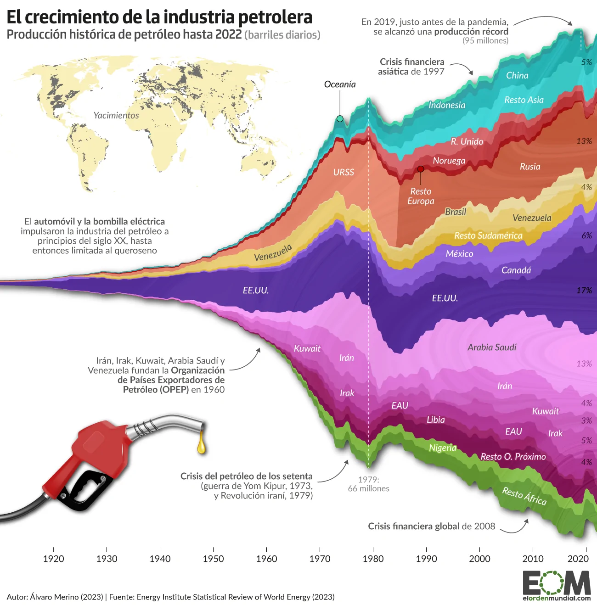

# Introduction

On September 28, 2023, El Orden Mundial, a digital independent media focused on high-quality and in-depth international analysis, published the article [*¿Cerca del peak oil? Así ha crecido la producción de petróleo en el último siglo*](https://elordenmundial.com/mapas-y-graficos/peak-oil-asi-ha-crecido-produccion-petroleo-ultimo-siglo/), which would translate as *Approaching Peak Oil? This is how oil production has grown in the last century*. The author of the visualization and the article is Álvaro Merino.

This report aims to discuss this graphic considering some issues, such as the information it intends to show, the general characteristics and strengths of this type of graphic, the necessary steps to built a replica using R and some points of improvements, proposing a couple of graph alternatives.

# Reflecting on the original visualization

A stream graph is a type of stacked area chart. It represents the evolution of a numeric variable (Y axis) following another numeric value (X axis), for several groups with different colors. Areas are usually displayed around a central axis, and edges are rounded to give a flowing and organic shape. These graphs are good to study the relative proportions of the whole, but they are bad to study the evolution of each individual group.

For the current case, and as the title of the visualization suggests, the author was interested in analyzing the overall distribution of the different countries within the whole context of oil producer countries, rather than the detailed changes of each specific country. However, although this can be seen in the original plot below, it becomes way more clear when analyzing the final replication. We will delve further into this in the corresponding section.

Finally, we would like to highlight some positive and negative aspects of the original plot. Regarding the positives, the chosen format is quite striking and appropriate for representing the intended information. The color grouping, not only by country but also changing the shade by region, facilitates the assimilation of the data.

However, concerning the areas for improvement that we took into account when selecting this graph for the final project, we primarily emphasize the amount of text that appeared, as it hindered the readability of the graph. Likewise, the reservoir map was too small and could have appeared as a separate graph to complement it, as it also lacks a country-wise division for easier interpretation. This graph was not included in the replication because we did not have the data for it and we were not able to find it. Finally, the percentages at the end of the represented streams were not very clear regarding what they represented (whether they referred to the total for that year or the overall total).



```{r}
# Loading libraries
library(readxl)
library(tidyverse)
library(ggplot2)
library(ggstream)
library(dplyr)
library(ggtext)
library(ggrepel)
library(showtext)
library(sysfonts)
library(diagram)
library(grid)
library(plotrix)
```

# Cleaning the data

The article collected data from the [Statistical Review of World Energy](https://www.energyinst.org/statistical-review/resources-and-data-downloads) from the Energy Institute. Specifically, the data used for the replication was that published in XSLX panel format in *Consolidated Dataset - Panel Format*. Therefore, we started by uploading the data base, deleting unnecessary columns and NAs from the main variable (oilprod_kbd):

```{r}
data <-  read_xlsx(path = "Panel format.xlsx", sheet = 1, range = "A1:M7212")

data <- data |>
  select(-c(OPEC:CIS))

panel <- data |> 
  filter(!is.na(oilprod_kbd)) 
```

Then, we organized the countries. First, a vector including the countries that needed to appear explicitly in our graph was created, which was also used to create a new data frame where all these countries appeared. We then filtered the original database to select the undesired countries and aggregated them by region. This approach allowed us to assign the name of the region to the aggregated data. Finally, we merged the two data frames into a new one, panel_c.

```{r}
countries <- c("Australia", "China", "Indonesia", "Norway", "Russian Federation", 
               "USSR", "United Kingdom", "Brazil", "Venezuela", "Mexico", 
               "Canada", "US", "Saudi Arabia", "Iran", "Kuwait", "Iraq", "Libya", 
               "United Arab Emirates", "Nigeria", "Other Africa", 
               "Other Asia Pacific", "Other CIS", "Other Caribbean", 
               "Other Eastern Africa", "Other Europe", "Other Middle Africa", 
               "Other Middle East", "Other Northern Africa", 
               "Other S. & Cent. America", "Other South America", 
               "Other Western Africa")

# Filtering data by country of interest
panel_a <-  panel |>
  group_by(Region, Country) |> 
  filter(Country %in% countries) |> 
  mutate(Region = if_else(Country == "Australia", "Oceania", Region)) |> 
  select(-c(pop, ISO3166_alpha3, ISO3166_numeric, SubRegion, oilprod_mt)) 

  
# Filtering data by countries that are not of our interest and aggregating them 
panel_b <- panel |> 
  filter(!Country %in% countries) |> 
  group_by(Year, Region) |> 
  summarise(oilprod_kbd = sum(oilprod_kbd), .groups = 'drop') |> 
  mutate(Country = Region) |> 
  select(Country, everything()) |>
  filter(!is.na(Region)) |> 
  arrange(Country) 

# Combining both data frames into a new one
panel_c <- bind_rows(panel_a, panel_b)
```

Once panel_c was generated, we moved on to refining the regional variables. To achieve this, we first named six different vectors after the main regions, which included the countries from panel_b (it is worth remembering that these countries were labeled according to the region they belonged to, rather than their individual country names). Next, we created individual data frames for each region. In these, we aggregated the oil production by year, presenting them as "Other -said continent-" in the resulting data frame. Finally, a new data frame, panel_d, was formed by merging all the individual region data frames.

```{r}
# Vectors for main regions
asia <- c("Asia Pacific", "Other Asia Pacific")
africa <-  c("Africa", "Other Africa", "Other Eastern Africa", "Other Middle Africa", 
             "Other Northern Africa", "Other Western Africa")
middle_east <-  c("Middle East", "Other Middle East")
europe <- c("Europe", "Other Europe")
america <- c("Other Caribbean", "Other S. & Cent. America", "Other South America", 
             "S. and Cent. America")
cis <- c("CIS", "Other CIS")


# Data frame for each region
asia <- panel_c |>
  filter(Country %in% asia) |> 
  group_by(Year, Country) |> 
  mutate(Country = if_else(Country %in% asia, "Other Asia", Country)) |> 
  arrange(Year) |> 
  summarise(oilprod_kbd = sum(oilprod_kbd), .groups = 'drop')

africa <- panel_c |>
  filter(Country %in% africa) |> 
  group_by(Year, Country) |> 
  mutate(Country = if_else(Country %in% africa, "Other Africa", Country)) |> 
  arrange(Year) |> 
  summarise(oilprod_kbd = sum(oilprod_kbd), .groups = 'drop')

middle_east <- panel_c |>
  filter(Country %in% middle_east) |> 
  group_by(Year, Country) |> 
  mutate(Country = if_else(Country %in% middle_east, "Other Middle East", Country)) |> 
  arrange(Year) |> 
  summarise(oilprod_kbd = sum(oilprod_kbd), .groups = 'drop')

europe <- panel_c |>
  filter(Country %in% europe) |> 
  group_by(Year, Country) |> 
  mutate(Country = if_else(Country %in% europe, "Other Europe", Country)) |> 
  arrange(Year) |> 
  summarise(oilprod_kbd = sum(oilprod_kbd), .groups = 'drop')

america <- panel_c |>
  filter(Country %in% america) |> 
  group_by(Year, Country) |> 
  mutate(Country = if_else(Country %in% america, "Other South America", Country)) |> 
  arrange(Year) |> 
  summarise(oilprod_kbd = sum(oilprod_kbd), .groups = 'drop')

cis <- panel_c |>
  filter(Country %in% cis) |> 
  group_by(Year, Country) |> 
  mutate(Country = if_else(Country %in% cis, "Other CIS", Country)) |> 
  arrange(Year) |> 
  summarise(oilprod_kbd = sum(oilprod_kbd), .groups = 'drop')

# Data frame merging the region ones 
panel_d <-  bind_rows(asia, africa, middle_east, europe, america, cis)

panel_d <- panel_d |> 
  mutate(Region = Country) |> 
  select(Country, Year, Region, everything())
```

The final data frame was formed by combining panel_d and panel_a. Some name adjustments were implemented to streamline the existing data, and the variables Region and Country were organized in the order observed in the original graph.

```{r}
# Final data frame 
panel_f <- bind_rows(panel_d, panel_a)

panel_f <- panel_f |> 
  filter(!is.na(Region)) |> 
  mutate(Region = if_else(Region == "Other Europe", "Europe", Region)) |> 
  mutate(Region = if_else(Region == "Other Asia", "Asia", Region)) |> 
  mutate(Region = if_else(Region == "Asia Pacific", "Asia", Region)) |> 
  mutate(Region = if_else(Region == "Other Middle East", "Middle East",
                          Region)) |> 
  mutate(Region = if_else(Region == "Other Africa", "Africa", Region)) |> 
  mutate(Region = if_else(Region == "Other South America", "S. & Cent. America",
                          Region)) |>   
  mutate(Region = if_else(Region == "Other CIS", "CIS", Region)) |> 
  arrange(Region, Country) 

# To determine the desired order of appearance for the regions in the graph
panel_f$Region <- factor(panel_f$Region, levels = c("Oceania", "Asia", "Europe", 
                                                    "CIS", "S. & Cent. America",
                                                    "North America", "Middle East",
                                                    "Africa"))

panel_f$Country <- factor(panel_f$Country, levels = c("Australia", "Indonesia", 
                                                      "China", "Other Asia", 
                                                      "United Kingdom", "Norway", 
                                                      "Other Europe", "USSR", 
                                                      "Russian Federation", 
                                                      "Other CIS", "Brazil", 
                                                      "Venezuela",
                                                      "Other South America", 
                                                      "Mexico", "Canada", "US",
                                                      "Saudi Arabia", "Iran",
                                                      "Kuwait", "Iraq", 
                                                      "United Arab Emirates", 
                                                      "Other Middle East", "Libya", 
                                                      "Nigeria", "Other Africa"))

panel_f <- 
  panel_f |> 
  arrange(Country, Region)
```

Panel_f was the data frame ultimately used for creating a replica of the graph. However, we encountered certain challenges with the data, such as dealing with missing data from 1900 to 1965 and the distribution peculiarities of Russia, which consisted of two distinct observation groups (USSR and Russian Federation). These impacted the representation of the data. In section "Addressing some issues", after presenting the definitive graph replication, we discuss the proposed adjustments and the reasons they were ultimately discarded.

# **Graph replication**

We began by defining certain aesthetic aspects and later combined them all using ggplot. First, we proceeded to define those related to colors, scales, axes, background, key and other lines in the graph.

```{r}
# Colors
mycolors <-  c("#08e7a7","#33a4a1", "#2bb8b9", "#6ad3d0", "#d86a6f", "#be3e44", 
               "#a60400", "#e78b71", "#ca664a", "#b1583f", "#e9daa1", "#e6cc75",
               "#dab330", "#9263e1", "#7546be", "#4f2991", "#e997e8", "#e079db",
               "#d168c7",  "#c453b0", "#ad358d", "#9a2366", "#89c257", "#68a03f", 
               "#59882c") 

colors <- scale_fill_manual(values = mycolors)

# Scales
scale <- c(scale_x_continuous(name = NULL, limits = c(1961, 2022), 
                              breaks = seq(from = 1970, to = 2020, by = 10), 
                              expand = expansion(0)), 
           scale_y_continuous(name = NULL, labels = NULL, position = "right",
                              expand = expansion(add = c(5000, 5500)))) 

# Axes 
axes <- theme(axis.line.y = element_blank(), axis.ticks.y = element_blank()) 

ticks <- theme(axis.ticks.x = element_line(color = "gray40"), 
               axis.ticks.length.x = unit(0.15, "cm"))

# Background and key
theme <- theme(panel.grid.major = element_blank(), 
               panel.grid.minor = element_blank(),
               legend.position = "none", 
               plot.caption = element_text(hjust = 0, color = "gray20"))

# Arrows and lines
arrows <- c(geom_curve(aes(x = 2013, y = 52000, xend = 2019, yend = 52000), 
                       colour = "grey40",
                       arrow = arrow(length = unit(0.01, "npc"), type = "open"),
                       curvature = -0.3, linewidth = 0.01),
            geom_curve(aes(x = 1994, y = 44000, xend = 1997, yend = 38000), 
                       colour = "grey40",
                       arrow = arrow(length = unit(0.01, "npc"), type = "open"),
                       curvature = -0.3, linewidth = 0.01),
            geom_curve(aes(x = 2003, y = -48500, xend = 2008, yend = -46000), 
                       colour = "grey40", 
                       arrow = arrow(length = unit(0.01, "npc"), type = "open"),
                       curvature = 0.3, linewidth = 0.01), 
            geom_curve(aes(x = 1973, y = -46000, xend = 1977, yend = -43000), 
                       colour = "grey40", 
                       arrow = arrow(length = unit(0.01, "npc"), type = "open"),
                       curvature = 0.3, linewidth = 0.01),
            geom_segment(aes(x = 1973, y = 38500, xend = 1973, yend = 36000),
                         color = "#08e7a7", 
                         linewidth = 0.2),
            geom_segment(aes(x = 1990, y = 19500, xend = 1990, yend = 24200),
                         color = "#a60400", 
                         linewidth = 0.3),
            geom_segment(aes(x = 1987, y = -28200, xend = 1987, yend = -39700),
                         color = "#9a2366", 
                         linewidth = 0.2),
            geom_vline(xintercept = c(1979, 2019), 
                      linetype = "dashed",
                      color = "white", 
                      linewidth = 0.2))
```

Then, we worked with the aesthetics involving text, such as annotation, labels, titles and subtitles.

```{r}
# Text font
sysfonts::font_add_google("Fira Sans Condensed", family = "sans-serif")
sysfonts::font_add_google("Fira Sans", family = "sans-serif")
showtext::showtext_auto()

font_add_google("Fira Sans Condensed")
font_add_google("Fira Sans")

# Labels
subtitle <- expression(paste(bold("Producción histórica de petróleo hasta 2022"), 
                             " (barriles diarios)"))

labels <-  labs(title = "El crecimiento de la industria petrolera", 
                subtitle = subtitle,
                caption = "\n \n Autora: Sara Herranz (2023). Fuente: Energy Institute Statistical Review of World Energy (2023)") 

labelstheme <- theme(plot.title = element_text(family = "Fira Sans Condensed", 
                                               size = 14, 
                                               face = "bold"),
                     plot.subtitle = element_text(family = "Fira Sans Condensed", 
                                                  size = 9.5, 
                                                  color = "gray10", face = "bold"), 
                     plot.caption = element_text(family = "Fira Sans Condensed"))

# Percentage annotations
  # First, we compute the percentages
panel_per <- panel_f |> 
  filter(Year == "2022") |> 
  mutate(percent = round((oilprod_kbd/(sum(oilprod_kbd)))*100)) |> 
  filter(percent > 2) |> 
  arrange(Country, Region) 

  # Second, we create the annotations
percent_annotations <- 
  c(annotate("text", x = 2020, y = 46500, size = 3,  label = paste("4%"), 
             color = "grey20", family = "Fira Sans", fontface = "italic"), 
    annotate("text", x = 2020, y = 28000, size = 3,  label = paste("12%"), 
             color = "grey20", family = "Fira Sans", fontface = "italic"), 
    annotate("text", x = 2020, y = 17500, size = 3,  label = paste("3%"), 
             color = "grey20", family = "Fira Sans", fontface = "italic"), 
    annotate("text", x = 2020, y = 14000, size = 3,  label = paste("3%"), 
             color = "grey20", family = "Fira Sans", fontface = "italic"), 
    annotate("text", x = 2020, y = 6000, size = 3,  label = paste("6%"), 
             color = "grey6", family = "Fira Sans", fontface = "italic"), 
    annotate("text", x = 2020, y = -4000, size = 3,  label = paste("19%"), 
             color = "grey2", family = "Fira Sans", fontface = "italic"), 
    annotate("text", x = 2020, y = -17500, size = 3,  label = paste("13%"), 
             color = "grey20", family = "Fira Sans", fontface = "italic"), 
    annotate("text", x = 2020, y = -25000, size = 3,  label = paste("4%"), 
             color = "grey20", family = "Fira Sans", fontface = "italic"), 
    annotate("text", x = 2020, y = -28400, size = 3,  label = paste("3%"), 
             color = "grey20", family = "Fira Sans", fontface = "italic"), 
    annotate("text", x = 2020, y = -32000, size = 3,  label = paste("5%"), 
             color = "grey20", family = "Fira Sans", fontface = "italic"), 
    annotate("text", x = 2020, y = -36000, size = 3,  label = paste("4%"), 
             color = "grey6",  family = "Fira Sans", fontface = "italic"), 
    annotate("text", x = 2020, y = -39500, size = 3,  label = paste("3%"), 
             color = "grey6", family = "Fira Sans", fontface = "italic"), 
    annotate("text", x = 2020, y = -47500, size = 3,  label = paste("5%"), 
             color = "grey6", family = "Fira Sans", fontface = "italic"))

# Text annotations
text_annotations <-  
  c(annotate("text", x = 2012, y = 51000,  hjust = 1, vjust = 0.5, size = 3, 
             label = paste("En 2019, justo antes de la pandemia,\n se alcanzó una producción récord\n (95 millones)"), 
             color = "grey10", family = "Fira Sans"),
    annotate("text", x = 1993, y = 44000,  hjust = 1, vjust = 0.5, size = 3, 
             label = paste("Crisis financiera\nasiática de 1997"), 
             color = "grey10", family = "Fira Sans"),
    annotate("text", x = 1972, y = -45000,  hjust = 1, vjust = 0.5, size = 3, 
             label = paste("Crisis del petróleo\nde los 70 (guerra de\nYom Kipur, 1973,\nRev. iraní, 1979)"), 
             color = "grey10", family = "Fira Sans"),
    annotate("text", x = 1979, y = 45000,  hjust = 0.5, vjust = 0.5, size = 2.5, 
             label = paste("1979:\n 66 millones"), 
             color = "grey40", family = "Fira Sans"),
    annotate("text", x = 2002, y = -48500,  hjust = 1, vjust = 0.5, size = 3, 
             label = paste("Crisis financiera global de 2008"), 
             color = "grey10", family = "Fira Sans"))

# Country labels
country_annotations <- 
  c(annotate("text", x = 1971, y = 40000, size = 3, label = paste("Oceanía"), 
             color = "grey10", family = "Fira Sans", fontface = "italic"),
    annotate("text", x = 2011, y = 42000, size = 3, label = paste("China"), 
            color = "white", family = "Fira Sans", fontface = "italic"), 
    annotate("text", x = 2000, y = 35500, size = 3, label = paste("Indonesia"), 
             color = "white", family = "Fira Sans", fontface = "italic"),
    annotate("text", x = 2010, y = 38000, size = 3, label = paste("Resto Asia"), 
             color = "white", family = "Fira Sans", srt = 10, fontface = "italic"), 
    annotate("text", x = 1995, y = 27300, size = 3, label = paste("R. Unido"), 
             color = "white", family = "Fira Sans", fontface = "italic"),
    annotate("text", x = 1995, y = 24500, size = 3, label = paste("Noruega"), 
             color = "white", family = "Fira Sans", fontface = "italic"),
    annotate("text", x = 1990, y = 18000, size = 3, label = paste("Resto Europa"), 
             color = "white", family = "Fira Sans", fontface = "italic"),
    annotate("text", x = 1974, y = 17000, size = 3, label = paste("URSS"), 
             color = "white", family = "Fira Sans", fontface = "italic"),
    annotate("text", x = 2010, y = 23000, size = 3, label = paste("Rusia"), 
             color = "white", family = "Fira Sans", fontface = "italic"), 
    annotate("text", x = 2008, y = 13000, size = 3, label = paste("Resto CIS"),
             color = "white", family = "Fira Sans", fontface = "italic"),
    annotate("text", x = 2011, y = 10700, size = 3, label = paste("Brasil"), 
             color = "#6f4e37", family = "Fira Sans", fontface = "italic", srt = 15),
    annotate("text", x = 2005, y = 8100, size = 3, label = paste("Venezuela"), 
             color = "#6f4e37", family = "Fira Sans", fontface = "italic"),
    annotate("text", x = 1998, y = 4900, size = 3, label = paste("México"), 
             color = "white", family = "Fira Sans", fontface = "italic"),
    annotate("text", x = 2008, y = 1500, size = 3, label = paste("Canadá"), 
             color = "white", family = "Fira Sans", fontface = "italic"),
    annotate("text", x = 1996, y = -3300, size = 3, label = paste("EE.UU."), 
             color = "white", family = "Fira Sans", fontface = "italic"),
    annotate("text", x = 2005, y = -13500, size = 3, label = paste("Arabia Saudi"), 
             color = "#9a2366", family = "Fira Sans", fontface = "italic"),
    annotate("text", x = 1999, y = -19000, size = 3, label = paste("Irán"), 
             color = "white", family = "Fira Sans", fontface = "italic"),
    annotate("text", x = 2010, y = -25000, size = 3, label = paste("Kuwait"), 
             color = "white", family = "Fira Sans", srt = -10, fontface = "italic"),
    annotate("text", x = 1988, y = -24300, size = 3, label = paste("Irak"), 
             color = "white", family = "Fira Sans", fontface = "italic"),
    annotate("text", x = 2005, y = -29300, size = 3, label = paste("EAU"), 
             color = "white", family = "Fira Sans", fontface = "italic"),  
    annotate("text", x = 1990, y = -41000, size = 3, label = paste("Resto O. Próximo"), 
             color = "grey10", family = "Fira Sans", fontface = "italic"),
    annotate("text", x = 1993, y = -30400, size = 3, label = paste("Nigeria"), 
             color = "white", family = "Fira Sans", fontface = "italic"),
    annotate("text", x = 2006, y = -34400, size = 3, label = paste("Libia"), 
             color = "white", family = "Fira Sans", fontface = "italic"),
    annotate("text", x = 2008, y = -40800, size = 3, label = paste("Resto África"), 
             color = "white", family = "Fira Sans", fontface = "italic"))
```

The final version of the plot included these aesthetics. As mentioned earlier, what it represents is how the different proportions of each country relate to each other, rather than examining the specific changes of each group. Thus, the sense of flowing, curvy appearance and smooth transition is evident in this visualization.

It is also important to note that some changes were made to the data because we considered them essential. Firstly, 'Other CIS' was added to the data, and Libya was repositioned. In the original graph, Libya was included among the countries in the Middle East region, but we deemed it more appropriate to relocate it to Africa, as it is geographically situated there. On the other hand, 'Other South America' is not represented, even though it has sufficient data to be included.

```{r, fig.showtext=TRUE, fig.asp=1}
plot <- ggplot(data = panel_f) +
  aes(x = Year, y = oilprod_kbd, fill = Country) +
  geom_stream(type = "mirror", 
              bw = 0.56, 
              true_range = "max_x") + 
  colors + scale + axes + theme_minimal() + ticks +
  labels + labelstheme + percent_annotations + 
  text_annotations + country_annotations + theme + arrows 

plot
```

## Addressing some issues

As seen in the previous graph and mentioned before, we encountered certain challenges with the data, such as handling missing data from 1900 to 1965 and addressing the distribution peculiarities of Russia, which consisted of two distinct observation groups (USSR and Russian Federation). We tried to fix this issues and, in both cases, some aesthetics are missing as we solely aimed to observe how the data was distributed.

### 1. Dealing with missing data

Regarding the first issue, following Professor Iñaki's suggestion, we included a 0 in the "oilprod_kbd" variable for the year 1910 in each country.

```{r}
rows <- tibble(Country = c("Australia", "Indonesia", "China", "Other Asia", 
                           "United Kingdom", "Norway", "Other Europe", "USSR",
                           "Russian Federation", "Other CIS",  "Brazil", 
                           "Venezuela", "Other America", "Mexico", "Canada", 
                           "US", "Saudi Arabia", "Iran", "Kuwait", "Iraq", 
                           "United Arab Emirates", "Other Middle East", "Libya", 
                           "Nigeria", "Other Africa"),
                 Year = 1910,
                 Region = c("Oceania", "Asia", "Asia", "Asia", "Europe", "Europe",
                            "Europe", "CIS", "CIS", "CIS", "S. & Cent. America", 
                            "S. & Cent. America", "S. & Cent. America", 
                            "North America", "North America", "North America",
                            "Middle East", "Middle East", "Middle East",
                            "Middle East", "Middle East", "Middle East", "Africa", 
                            "Africa", "Africa"), 
                 oilprod_kbd = 0)

panel_g <- rbind(panel_f, rows) 

panel_g <- panel_g |> 
  arrange(Country, Year)

# Adjusting the scale to fit the new data
scale1 <- c(scale_x_continuous(name = NULL, limits = c(1910, 2022), 
                              breaks = seq(from = 1920, to = 2020, by = 10), 
                              expand = expansion(0)),
            scale_y_continuous(name = NULL, labels = NULL,
                               expand = expansion(add = c(5000, 5500)))) 

lines <-  geom_vline(xintercept = c(1979, 2019), linetype = "dashed", 
                     color = "white", 
                     size = 0.2)
```

Once the new data frame was set, we defined some adjustments to fit the new data. However, as can be seen in the graph below, the resulting data distribution does not yield the expected outcome, so we decided to discard it.

```{r, fig.showtext=TRUE, fig.asp=1}
plot2 <- ggplot(data = panel_g) +
  aes(x = Year, y = oilprod_kbd, fill = Country) +
  geom_stream(type = "mirror", 
              bw = 0.56, 
              true_range = "max_x") + 
  colors + scale1 + axes + theme_minimal() + ticks +
  labels + labelstheme + theme + lines

plot2
```

### 2. USSR and Russian Federation

The USSR and Russian Federation observations concerned us for two reasons. Firstly, despite having data only until 1984 for the USSR, the characteristics of geom_stream extended the data in the opposite direction to the existing data, distorting the data distribution. On the other hand, we wanted to compare the number of barrels produced (oilprod_kbd) for the US and USSR/Russian Federation in different years, given that in the original graph, the thickness of these streams appeared similar. Upon filtering the data, we were able to verify that the data distributions were similar, despite the graphical representation showing significant differences.

Thus, concerning the data from the USSR and the Russian Federation, we aimed to combine the observations of both countries into a single entity to examine how it influenced the data or whether the distribution resembled that of the original graph. Therefore, we recoded the observations of the USSR so that all of them appeared as the Russian Federation.

```{r}
# Running some tests to compare USSR and US
test <- panel_f |> 
  filter(Country == c("USSR", "US")) |> 
  group_by(Year) 


# Merging USSR and Russian Federation into one observation
panel_h <- 
  panel_f |> 
  arrange(Country, Region) |> 
  mutate(Country = if_else(Country == "USSR", "Russian Federation", Country))
```

Once the new data frame was established, we made some adjustments to accommodate the new data. However, as can be seen in the graph below, the distribution of the resulting data does not yield the expected outcome. Therefore, we decided to discard it.

```{r, fig.showtext=TRUE, fig.asp=1}
mycolors2 <-  c("#08e7a7","#33a4a1", "#2bb8b9", "#6ad3d0", "#d86a6f", "#be3e44", 
                "#a60400", "#e78b71", "#b1583f", "#e9daa1", "#e6cc75", "#dab330",
                "#9263e1", "#7546be", "#4f2991", "#e997e8", "#e079db", "#d168c7",
                "#c453b0", "#ad358d", "#9a2366", "#89c257", "#68a03f", "#59882c") 

colors2 <- scale_fill_manual(values = mycolors2)


plot3 <- ggplot(data = panel_h) +
  aes(x = Year, y = oilprod_kbd, fill = Country) +
  geom_stream(type = "mirror", 
    bw = 0.56, 
    true_range = "max_x") + 
  colors2 + labels + scale + axes +
  theme_minimal() +  theme + labelstheme + ticks 

plot3
```

## 

# Alternative visualizations

To carry out the proposal for alternative visualizations, we took into consideration the original author's objective, which was to depict the historical evolution of oil production for the entire oil industry. However, we also aimed to shift the focus to clearly visualize the regional and country-specific contributions. Both aspects were more apparent in the original stream graph. However, they were not as evident in the replication we conducted because the stream graph is useful for gaining a general understanding of the whole structure without getting bogged down by intricate details of each part's evolution, but not so much for depicting the individual contributions.

Therefore, in order to keep the intention of the original author, we decided to make an alternative representation using a stacked area chart, and also to combine it with faceting techniques. On one hand, faceting generates small multiples each showing a different subset of the data. It is a powerful tool for exploratory data analysis: one can rapidly compare patterns in different parts of the data and see whether they are the same or different.

On the other hand, similarly to the stream graph, a stacked area chart displays the evolution of the value of several groups on the same graphic. The values of each group are displayed on top of each other, allowing to check the evolution of both the total of a numeric variable and the importance of each group. Thus, as it can be seen in the graph below, it is easier to observe variations in the contribution of each category. Additionally, the mentioned appearance resembles better the original graph, although it does not have the mirror aesthetic, since the original visualization not only displays the evolution of all the countries, but also the changes in the individual categories.

Since the data used for the final replication had separate observations for USSR and the Russian Federation, we kept that same data frame for this enhancement. Consequently and because of the fact that this kind of graph stacks areas on top of the previous ones, there is a gap in 1985 in the representation of both observations. We also modified some aesthetics, for instance, reducing the amount of text displayed to avoid overloading the graph.

```{r, fig.showtext=TRUE, fig.asp=1}

# Labels
subtitle2 <- expression(paste(bold("Historical oil production up to 2022 "), 
                             "(barrels per day)"))

labels2 <-  labs(title = "The growth of the oil industry", subtitle = subtitle2,
                caption = "\n \n Author: Sara Herranz (2023). Reference: Energy Institute Statistical Review of World Energy (2023)") 

# Text_annotations
text_annotations2 <-  
  c(annotate("text", x = 2018, y = 98300,  hjust = 0.5, vjust = 0.5, size = 2.5, 
             label = paste("2019:\n record production\n (95 million)"), 
             color = "grey40", family = "Fira Sans"),
      annotate("text", x = 1979, y = 68200,  hjust = 0.5, vjust = 0.5, size = 2.5, 
             label = paste("1979:\n 66 millions"), 
             color = "grey40", family = "Fira Sans"))

# Country labels
country_annotations2 <- 
  c(annotate("text", x = 1971, y = 60000, size = 3, label = paste("Oceania"), 
             color = "#08e7a7", family = "Fira Sans", fontface = "italic"),
    annotate("text", x = 2006, y = 77000, size = 3, label = paste("China"), 
            color = "white", family = "Fira Sans", srt = 3, fontface = "italic"), 
    annotate("text", x = 2006, y = 83000, size = 3, label = paste("Indonesia"), 
             color = "#33a4a1", family = "Fira Sans", fontface = "italic"),
    annotate("text", x = 2006, y = 74000, size = 3, label = paste("Other Asia"), 
             color = "white", family = "Fira Sans", srt = 7, fontface = "italic"), 
    annotate("text", x = 2001, y = 63300, size = 3, label = paste("UK"), 
             color = "white", family = "Fira Sans", fontface = "italic"),
    annotate("text", x = 2001, y = 61000, size = 3, label = paste("Norway"), 
             color = "white", family = "Fira Sans", fontface = "italic"),
    annotate("text", x = 1998, y = 53000, size = 3, label = paste("Other Europe"), 
             color = "white", family = "Fira Sans", fontface = "italic"),
    annotate("text", x = 1977, y = 48000, size = 3, label = paste("USSR"), 
             color = "white", family = "Fira Sans", fontface = "italic"),
    annotate("text", x = 1990, y = 46000, size = 3, label = paste("Russia"), 
             color = "white", family = "Fira Sans", fontface = "italic"), 
    annotate("text", x = 2010, y = 65000, size = 3, label = paste("Other CIS"),
             color = "white", family = "Fira Sans", fontface = "italic"),
    annotate("text", x = 2006, y = 54000, size = 3, label = paste("Brazil"), 
             color = "#6f4e37", family = "Fira Sans", fontface = "italic", srt = 9),
    annotate("text", x = 2006, y = 51000, size = 3, srt = 9, 
             label = paste("Venezuela"), 
             color = "#6f4e37", family = "Fira Sans", fontface = "italic"),
    annotate("text", x = 1984, y = 30500, size = 3, label = paste("México"), 
             color = "white", family = "Fira Sans", fontface = "italic"),
    annotate("text", x = 1984, y = 28000, size = 3, label = paste("Canada"), 
             color = "white", family = "Fira Sans", fontface = "italic"),
    annotate("text", x = 1984, y = 23000, size = 3, label = paste("US"), 
             color = "white", family = "Fira Sans", fontface = "italic"),
    annotate("text", x = 2015, y = 31000, size = 3, label = paste("Saudi Arabia"), 
             color = "white", family = "Fira Sans", fontface = "italic"),
    annotate("text", x = 2016, y = 24800, size = 3, label = paste("Iran"), 
             color = "white", family = "Fira Sans", fontface = "italic"),
    annotate("text", x = 2016, y = 21000, size = 3, label = paste("Kuwait"), 
             color = "white", family = "Fira Sans", srt = 5, fontface = "italic"),
    annotate("text", x = 2016, y = 17000, size = 3, label = paste("Iraq"), 
             color = "white", family = "Fira Sans", fontface = "italic"),
    annotate("text", x = 2016, y = 13000, size = 3, label = paste("UAE"), 
             color = "white", family = "Fira Sans", fontface = "italic"),  
    annotate("text", x = 2016, y = 9800, size = 3, label = paste("Other M. East"), 
             color = "white", family = "Fira Sans", fontface = "italic"),
    annotate("text", x = 1998, y = 7100, size = 3, label = paste("Nigeria"), 
             color = "white", family = "Fira Sans", fontface = "italic"),
    annotate("text", x = 2001, y = 5500, size = 3, label = paste("Lybia"), 
             color = "white", family = "Fira Sans", fontface = "italic"),
    annotate("text", x = 2000, y = 2300, size = 3, label = paste("Other Africa"), 
             color = "white", family = "Fira Sans", fontface = "italic"))

arrows2 <- c(geom_curve(aes(x = 1974, y = 55000, xend = 1971, yend = 58000), 
                       colour = "#08e7a7",
                       arrow = arrow(length = unit(0.01, "npc"), type = "open"),
                       curvature = -0.3, linewidth = 0.01),
            geom_curve(aes(x = 2004, y = 77000, xend = 2004, yend = 81000), 
                       colour = "#33a4a1",
                       arrow = arrow(length = unit(0.01, "npc"), type = "open"),
                       curvature = -0.3, linewidth = 0.01),
            geom_curve(aes(x = 2002, y = 58700, xend = 2001, yend = 55100), 
                       colour = "#a60400", 
                       arrow = arrow(length = unit(0.01, "npc"), type = "open"),
                       curvature = -0.3, linewidth = 0.01),
            geom_curve(aes(x = 2012, y = 60000, xend = 2010, yend = 63500), 
                       colour = "#b1583f", 
                       arrow = arrow(length = unit(0.01, "npc"), type = "open"),
                       curvature = -0.3, linewidth = 0.01))


# Geom_area: USSR and Russian Federation
enhan1 <- ggplot(data = panel_f) +
  aes(x = Year, y = oilprod_kbd, fill = Country) +
  geom_area() +
  geom_vline(xintercept = c(1979, 2019), 
    linetype = "dashed", 
    color = "white", 
    size = 0.2) + 
  colors + labels2 + scale + axes +
  theme_minimal() +  theme + labelstheme + ticks +
  text_annotations2 + country_annotations2 + arrows2

enhan1
```

For the faceting, we opted for facet_wrap paired with an area chart, since it is useful when dealing with a single variable having many levels and there is a desire to arrange the plots more efficiently in terms of space. To adjust the data, we computed the total production by region to arrange the facets accordingly. Following that, we made some adjustments to the scales and then proceeded to plot the graph.

```{r}
# Creating new data frame ordering the data by the total oil production per region, 
  # in an ascending order
h <- panel_f |> 
  group_by(Region) |> 
  mutate(toil = sum(oilprod_kbd)) |>
  ungroup() |> 
  arrange(toil)

h$Region <- factor(h$Region, levels = c("Oceania", "Europe", "S. & Cent. America", 
                                        "Asia", "Africa", "CIS", "North America",
                                        "Middle East"))

# Adjusting the scale of the plot
scale3 <- c(scale_x_continuous(name = NULL, limits = c(1965, 2022), 
                               breaks = seq(from = 1975, to = 2020, by = 15), 
                               expand = expansion(0), position = "bottom"),
            scale_y_continuous(name = NULL, 
                               position = "left")) 
```

```{r, fig.showtext=TRUE, fig.asp=1}
# Plotting the data
enhan2 <- ggplot(data = h) +
  aes(x = Year, y = oilprod_kbd, fill = Country) +
  geom_area(show.legend = FALSE) +
  facet_wrap(facets = h$Region,
             nrow = 4,
             ncol = 2) + 
  colors + scale3 + axes + 
  theme_minimal() + labels2 + labelstheme + ticks + theme

enhan2

# I don't know if I should use "scales = "free_y"", bc instead of giving the same scale for all the graphs and allowing comparisons, it presents different scales that allow to see the individual evolution of oil production for each region. I still need to think about this. 
```
