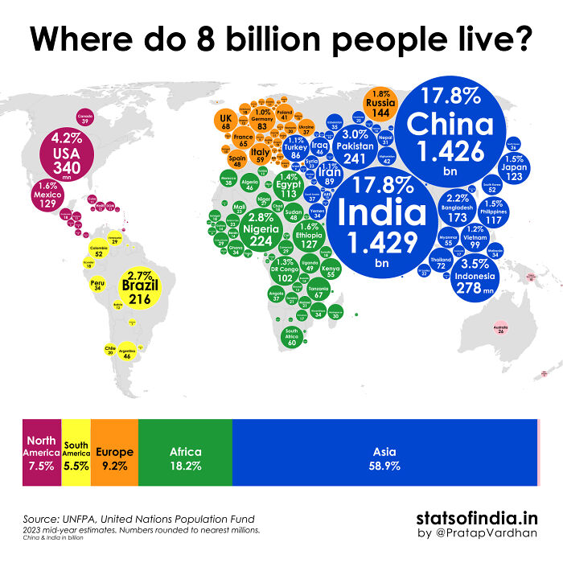

```{r setup, include=FALSE}
library(showtext)
knitr::opts_chunk$set(out.width="100%", fig.showtext = TRUE, fig.dpi = 150)
```

## Introduction

When I was thinking about this project, I ran directly into this map:

The first thing I thought was: *wow! A graph were my 3 disciplines merge together: sociology, international relations and, now, programming!*. So I decided to use it for this project, replicate it and then improve it. This is a map that was published in the social media Reddit, where we can see how the world population is distributed by countries: those with the bigger circles represent a bigger proportion of the world population and vice versa. 

{.external width="100%"}

## Replica

First of all, I have created the data base "population_data", where I have recorded every single country in the world, their respective populations, continents, latitude, longitude and the percentage of the world population their own population represents. This has been a key part of the project not only because it made it easier to fit the circles later on, but because there were **no data bases online with all these data**, and also because in the original map, some countries were not shown or taken into consideration. Even in my replica, I have wanted to show as many countries as possible as an initial improvement. 


```{r}
population_data <- read.csv("population_data.csv")
```


```{r}
head(population_data)
```
I also had to create a new data base, a very simple one, called population_by_continent. In this data base, I have only the name of the continent and the percentage (normal and scaled) that each continent´s population represent worldly.

```{r}
library(xfun)
library(dplyr)
library(forcats)
population_by_continent <- population_data |> group_by(continent) |> 
  summarize(total_population = sum(circle_size)) |> 
  mutate(percentage = total_population / sum(total_population)*100,
         continent = fct_reorder(continent, -percentage))
```

```{r}
head(population_by_continent)
```

Let´s go with the replica itself! Now that I have all the data I may need, I will explain step by step how I have created the map.

First of all, let´s load all the packages I needed: 

```{r}
library(ggplot2)
library(sf)
library(ggrepel)
library(cowplot)
library(permute)
library(plotly)
library(patchwork)
library(extrafont)
```

Now, I changed some of the data in population_data. Originally I had thought that the best option was to divide America in 3 parts, instead of the 2 proposed by the original map: North America, Central America and South America. Nevertheless, Central America represented a very small percentage of the population as was barely visible. Also, it induced some problems in order to create the replica. Finally, I decided to change all Central America countries to South America ones because Central America *is not considered a continent*, while some authors say that South America is itself a continent. 

```{r}
population_data <- population_data |> 
  mutate(continent = case_when(
    continent == "Central America" ~ "South America",
    TRUE ~ continent
  ))
```

I had written incorrectly South America in some of the countries, because I created the data base manually, so I had to fix it:

```{r}
population_data <- population_data |> 
  mutate(continent = case_when(continent == "South Amrica" ~ "South America", TRUE ~ continent))

population_by_continent <- population_by_continent |> 
  mutate(continent = case_when(continent == "Central America" ~ "South America", TRUE ~ continent))
```

Here, I started to design the map itself, not only the data that was going to be shown in it. First of all, I created a new variable inside of population_data, circle_size and circle_sized_adjusted, where I designed the desirable size of the circles in general, but also of the "big 5" specifically. These 5 countries, China, India, USA, Brazil and Nigeria, were **not** proportional in the original map. They were much bigger than other countries´ circles, even when those countries´ percentage of the world population was not that much smaller. Because of this, I designed these circles as circle_size_adjusted, so that every circle is bigger than in the original variable, circle_size (where every size was directly proportional to the percentage of the population), so that every country´s circle was augmented 60 times, while the big 5 had their circles augmented 150 times.

```{r}
population_data <- population_data |> 
  mutate(circle_size = as.numeric(circle_size))

population_data <- population_data |> 
  mutate(circle_size_adjusted = case_when(
    country %in% c("China", "India", "USA", "Brazil", "Nigeria") ~ circle_size * 150,
    TRUE ~ circle_size * 60
  ))

```

After a couple of first trials, I decided that **not every country should be included as a label in the map**. In the original map they were not, and this makes sense in order to keep some... Well, some order :). So I chose the most visible countries from the original map and created the vector countries_labelled, which collects the countries that would get a label. It is important to note that **every country has a different circle**, but not all of them are labelled. 

```{r}
countries_labelled <- c(
  "Canada", "United States", "Mexico", "Cuba", "Guatemala", "Haiti", "Dominican Republic", 
  "Colombia", "Venezuela", "Ecuador", "Peru", "Bolivia", "Brazil", "Uruguay", 
  "Paraguay", "Argentina", "Chile", "United Kingdom", "Greenland", "Spain", 
  "Portugal", "France", "Italy", "Germany", "Poland", "Ukraine", "Turkey", 
  "Iraq", "Syria", "Pakistan", "Iran", "Russia", "China", "India", "Bangladesh", 
  "Vietnam", "Indonesia", "Philippines", "Japan", "Australia", "Nigeria", 
  "Morocco", "Algeria", "Congo, Dem. Rep.", "Ethiopia", "Egypt", 
  "Tanzania", "Kenya", "South Africa", "Russian Federation")
```

I faced some problems with Kenya, that was not considered as Africa in the original data base; and also with the new variable, circle_size_adjusted, that was not considered as numeric data. I fixed both problems in this chunk:

```{r}
population_data <- population_data |>
  mutate(circle_size_adjusted = as.numeric(circle_size_adjusted))
population_data <- population_data |>
  mutate(continent = ifelse(country == "Kenya", "Africa", continent))
```

Then I grouped the data by continent and created the variable of percentage_scaled. This would be used in order to create the legend bar. 

```{r}
population_by_continent <- population_data |>
  group_by(continent) |>
  summarize(percentage = sum(percentage)) |>
  mutate(percentage_scaled = percentage * 1.5)
```

Also in order to create the legend bar, I created the data base population_by_continent_summarized. I built this new data base by using population_by_continent and its new variable, percentage_scaled. What I did here was to create two variables inside population_by_continent_summmarized: cumulative and label_position. The most important one out of these two is label_position, which has allowed me to situate the labels in the legend bar correctly. The idea is that the whole bar is a vector, and each label must be situated in position that results from substracting from the whole vector (cumulative, that represents all the continent data) half of the value of percentage_scaled.

```{r}
population_by_continent_summarized <- population_by_continent |>
  arrange(percentage_scaled) |>
  mutate(
    cumulative = cumsum(percentage_scaled),
    label_position = cumulative - percentage_scaled / 2
  ) |> mutate(continent = factor(continent, levels = continent))
```

Now, I could finally create the legend_bar, which is the first step in the creation of the replica. And, once I had the legend bar, I could create the replica map itself:

```{r, fig.width = 30, fig.height = 20, preview=TRUE}
# Creation of the legend bar:

legend_bar <- ggplot(population_by_continent_summarized) +
  aes(x = 1, y = percentage_scaled, fill = reorder(continent, -percentage_scaled)) +
  geom_bar(stat = "identity", width = 2, color = "black") +
  geom_text(
    aes(
      label = ifelse(continent == "Oceania", "",
                     paste0(continent, ":", round(percentage_scaled, 1), "%")),
      size = percentage_scaled
    ),
    color = "white",
    fontface = "bold",
    family = "Arial",
    position = position_stack(vjust = 0.5)
  ) +
  scale_size_continuous(range = c(0.5, 20)) +
  coord_flip() +
  scale_fill_manual(
    values = c( 
      "Asia" = "#00a3e0", "Africa" = "#009639", "Europe" = "#FF9E1B",
      "North America" = "#aa0061", "South America" = "#F7EA48", 
      "Oceania" = "pink"
    ),
    name = "Continent"
  ) +
  labs(x = NULL, y = NULL) +
  theme_minimal() +
  theme(
    axis.text = element_blank(),
    axis.ticks = element_blank(),
    panel.grid = element_blank(),
    legend.position = "none",
    plot.margin = margin(0, 0, 0, 0),
    legend.title = element_text(family = "Arial", face = "bold", size = 16),
    legend.text = element_text(family = "Arial", size = 12)
  )

# Creation of the replica


map <- ggplot() +
  borders("world", colour = "gray95", fill = "gray95") +
  geom_sf(fill = "white", color = "gray80") +
      coord_sf(crs = "+proj=robin") +
  geom_point(
    data = population_data,
    aes(x = adjusted_long, y = adjusted_lat,
        size = circle_size_adjusted, fill = continent),
    alpha = 1,
    shape = 21,
    color = "black",
    stroke = 1.2
  ) +
  geom_label(
    data = population_data |> filter(country %in% countries_labelled),
    aes(x = adjusted_long, y = adjusted_lat,
        label = paste0(country, "\n", round(percentage, 1), "%"),
        size = ifelse(country %in% c("India", "China"), 20, 6)),
    fontface = "bold", family = "Arial", color = "black", fill = NA, label.size = 0) +
  scale_size_identity() +
  scale_size_continuous(range = c(5, 95), name = "Population(%)") +
  scale_fill_manual(
    values = c( "Asia" = "#00a3e0", "Africa" = "#009639", "Europe" = "#FF9E1B",
      "North America" = "#aa0061", "South America" = "#F7EA48", "Oceania" = "pink"),
    name = "Continent"
  ) +
  labs(
    title = "Where do 8 billion people live?",
    x = NULL,
    y = NULL
  ) +
  theme_minimal() +
  theme(
    plot.title = element_text(size = 80, face = "bold", hjust = 0.5),
    legend.position = "none",
    legend.title = element_text(size = 50, face = "bold", family = "Arial"),
    legend.text = element_text(size = 15, family = "Arial")
  )

final_plot <- map / legend_bar + plot_layout(heights = c(0.85, 0.15))

final_plot

```


## Improvement

Now, which were the main problems in the original map? In my opinion, the main problem was that the information gets diluted in the whole map. If the idea is to inform people of which countries represent the biggest percentages of population in the world, it is not important to know where the country is, mainly what´s its population, how big their proportion of the world population is compared to that of other countries, and in which continent they can be found (so we can know which continent is the most populated). So I have decided to create a **treemap** where you will be able to see all of this information. In this case you will be able to see the total population of each country, not the proportion of the world population they represent, since that information is already provided by the size of their square in the treemap.

```{r, fig.width = 30, fig.height = 25}
library(ggplot2)
library(treemapify)
library(treemapify)
library(extrafont)

population_data$continent[population_data$continent == "Central America"] <- "South America"

treemap <- ggplot(data = population_data,
       aes(area = population, fill = continent,
           label = paste0(country, "\n", round(population / 1e6, 1), "M"))) +
  geom_treemap(color = "black", size = 1) +
  geom_treemap_text(fontface = "bold", color = "white", place = "center", grow = TRUE) +
  scale_fill_manual(values = c(
    "Africa" = "#FF5733",
    "Asia" = "#3498DB",
    "Europe" = "#2ECC71",
    "North America" = "#9B59B6",
    "South America" = "#F1C40F",
    "Oceania" = "pink"
  )) +
  theme_minimal() +
  labs(title = "Where do 8 billion people live?",
       subtitle = "Population distribution by country and continent",
       fill = "Continent") +
  theme(plot.title = element_text(size = 50, face = "bold", hjust = 0.5),
        plot.subtitle = element_text(size = 30, hjust = 0.5),
        legend.title = element_text(size = 35),
        legend.text = element_text(size = 35))

treemap
```


