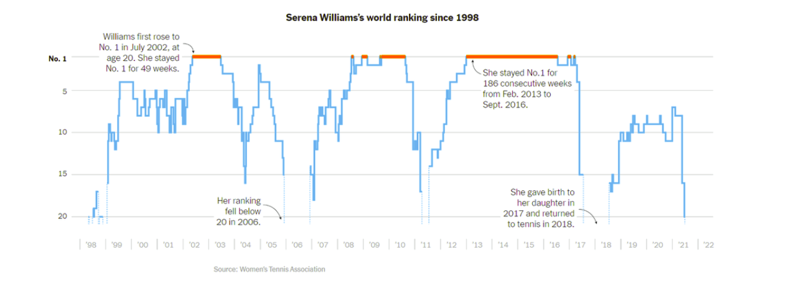

```{r setup, include=FALSE}
knitr::opts_chunk$set(out.width="100%", fig.align="center", fig.showtext = TRUE)
```

This post details my process of replicating a chart that visualizes Serena Williams's world tennis ranking from 1998 to 2022. The original chart was published by The New York Times, and you can view it [here.](https://www.nytimes.com/2022/09/08/learning/whats-going-on-in-this-graph-sept-14-2022.html)


Below is the original chart for reference:




## Original Chart

The chart displays Serena Williams's fluctuating WTA (Women's Tennis Association) rankings throughout her career. 
there are some relevant features such as a reverse y-axis that ranks her at the top with "No. 1" and descends to "20.". Also, the color orange in the line indicates periods when she held the No. 1 ranking. Finally there are some text annotations summarizing key moments in her career, such as her initial rise to No. 1, her return after childbirth, and her record-breaking 186 consecutive weeks at No. 1.

I selected this graph for its explanatory power and simplicity, making it easy to interpret even for readers unfamiliar with tennis. Moreover, as a lifelong tennis fan, I have a personal connection to the topic.

## Replication of the graph

### Libraries and Data Preparation

For this project, I primarily used the tidyverse package in R for data manipulation and visualization. Obtaining the dataset was challenging, as the official WTA website does not provide comprehensive rankings data. Fortunately, I discovered a GitHub repository by Jeff Sackmann that contained historical WTA rankings. However, the data was divided by decades (90s, 00s, 10s, and 20s) and included all players.

To prepare the data, I joined the four tables into a single dataset (wta_data). After identifying Serena Williams's player ID (200033), I filtered the data to create the final dataset (serena_data) for the analysis.

```{r} 
library(tidyverse)

# Reading the data
wta90s <- as_tibble(read.csv("C:/Users/diegu/Downloads/wta_rankings_90s.csv"))
wta00s <- as_tibble(read.csv("C:/Users/diegu/Downloads/wta_rankings_00s.csv"))
wta10s <- as_tibble(read.csv("C:/Users/diegu/Downloads/wta_rankings_10s.csv"))
wta20s <- as_tibble(read.csv("C:/Users/diegu/Downloads/wta_rankings_20s.csv"))

wta_data <- rbind(wta90s, wta00s, wta10s, wta20s)

serena_data <- wta_data |>
  filter(player == 200033) |> 
  select(ranking_date, rank) |>
  mutate(ranking_date = as.Date(as.character(ranking_date), "%Y%m%d"))

```


### Adding an extra color for the number one ranking

To replicate the orange line segments indicating Serena's No. 1 status, I created a line_color column based on specific date ranges. I had to select the specific weeks when Serena was number 1 so when the line goes through those periods of time, the color turns orange and blue in any other cases.

```{r} 
serena_data <- serena_data |>
  mutate(line_color = ifelse(ranking_date >= as.Date("2002-04-24") &
                               ranking_date <= as.Date("2003-05-15") |
                               ranking_date >= as.Date("2008-06-20") &
                               ranking_date <= as.Date("2008-07-13") |
                               ranking_date >= as.Date("2008-11-30") &
                               ranking_date <= as.Date("2009-01-20") |
                               ranking_date >= as.Date("2009-08-15") &
                               ranking_date <= as.Date("2010-07-15") |
                               ranking_date >= as.Date("2012-12-15") &
                               ranking_date <= as.Date("2016-06-15") |
                               ranking_date >= as.Date("2016-11-10") &
                               ranking_date <= as.Date("2016-12-25")|
                               ranking_date >= as.Date("2017-02-02") &
                               ranking_date <= as.Date("2017-02-15")|
                               ranking_date >= as.Date("2009-07-27") &
                               ranking_date <= as.Date("2009-08-01"),
                             "#FF851B", "#3093CF"))

```


## Creating the Plot

### Setting the Aesthetics

The plot uses ggplot2 to map the x-axis to ranking_date and the y-axis to rank. The y-axis is reversed to emphasize the "No. 1" rank, displaying values from 1 to 20 in intervals of 5, as shown in the original plot. The x-axis spans from 01/01/1998 to 31/12/2022, corresponding to the timeline of Serena’s career, ending in the year of her retirement.


```{r, layout = "1-body-outset", fig.width= 10, fig.height= 4} 

ggplot(serena_data, aes(x = ranking_date, y = rank)) +
  geom_line(color = serena_data$line_color,
            size = ifelse(serena_data$line_color == "#FF851B", 1.5, 1)) +
  scale_y_reverse(limits = c(20, 1),
                  breaks = c(1, 5, 10, 15, 20),
                  labels = c("No. 1" = expression(bold("No. 1")), "5", "10", "15", "20")) +
  scale_x_date(
    limits = c(as.Date("1998-01-01"), as.Date("2022-12-31")),
    breaks = seq(as.Date("1998-01-01"), as.Date("2022-01-01"), by = "1 year"),
    date_labels = "          |  '%y"
  )
```


To match the style of the original chart, I used theme_minimal and customized grid lines and axis labels.

```{r, layout = "1-body-outset", fig.width= 10, fig.height= 4} 

ggplot(serena_data, aes(x = ranking_date, y = rank)) +
  geom_line(color = serena_data$line_color,
            size = ifelse(serena_data$line_color == "#EE6A24", 1.5, 1)) +
  scale_y_reverse(limits = c(20, 1),
                  breaks = c(1, 5, 10, 15, 20),
                  labels = c("No. 1" = expression(bold("No. 1")), "5", "10", "15", "20")) +
  scale_x_date(
    limits = c(as.Date("1998-01-01"), as.Date("2022-12-31")),
    breaks = seq(as.Date("1998-01-01"), as.Date("2022-01-01"), by = "1 year"),
    date_labels = "          |  '%y"
  ) +
  theme_minimal(base_size = 10) +
  theme(
    axis.text.x = element_text(color = "grey"),
    plot.title = element_text(hjust = 0.5, face = "bold"),
    axis.title.y = element_blank(),
    axis.text.y = element_text(hjust = 1, color = "black"),
    panel.grid.major.x = element_blank(),
    panel.grid.minor.x = element_blank())
```

### Annotations and Titles

Annotations provide context to key moments in Serena's career. I included the four comments from the original graph. Additionally, I added the title to the plot. Here's how I implemented these changes:


```{r, layout = "1-body-outset", fig.width= 10, fig.height= 4} 
ggplot(serena_data, aes(x = ranking_date, y = rank)) +
  geom_line(color = serena_data$line_color,
            size = ifelse(serena_data$line_color == "#EE6A24", 1.5, 1)) +
  scale_y_reverse(limits = c(20, 1),
                  breaks = c(1, 5, 10, 15, 20),
                  labels = c("No. 1" = expression(bold("No. 1")), "5", "10", "15", "20"))+
  scale_x_date(
    limits = c(as.Date("1998-01-01"), as.Date("2022-12-31")),
    breaks = seq(as.Date("1998-01-01"), as.Date("2022-01-01"), by = "1 year"),
    date_labels = "          |  '%y"
  ) +
  labs(
    title = "Serena Williams's world ranking since 1998",
    x = "",
    y = ""
  ) +
  theme_minimal(base_size = 10) +
  theme(
    axis.text.x = element_text(color = "grey"),
    plot.title = element_text(hjust = 0.5, face = "bold", size = 9),
    axis.title.y = element_blank(),
    axis.text.y = element_text(hjust = 1, color = "black"),
    panel.grid.major.x = element_blank(),
    panel.grid.minor.x = element_blank()) +
  annotate("text", x = as.Date("2001-10-01"), y = 1.8,
           label = "Williams first rose to\nNo. 1 in July 2002, at\nage 20. She stayed\nNo. 1 for 49 weeks.",
           size = 2.5, hjust = 1) +
  annotate("text", x = as.Date("2005-02-01"), y = 18,
           label = "Her ranking\nfell below\n20 in 2006.",
           size = 2.5, hjust = 1) +
  annotate("text", x = as.Date("2013-07-01"), y = 4,
           label = "She stayed No.1 for\n186 consecutive weeks\nfrom Feb. 2013 to\nSept. 2016.",
           size = 2.5, hjust = 0) +
  annotate("text", x = as.Date("2017-02-01"), y = 18,
           label = "She gave birth to\nher daughter in\n2017 and returned\nto tennis in 2018.",
           size = 2.5, hjust = 1)
```

### Last Adjustments

Finally, the arrows, dotted lines, and source were added to the chart. Both the arrows and dotted lines were created using the annotate function. The source is placed at the bottom of the chart, as in the original. Although I did not obtain the data directly from the WTA, I aimed to replicate the original plot as closely as possible.


```{r, layout = "1-body-outset", fig.width= 10, fig.height= 4} 

ggplot(serena_data, aes(x = ranking_date, y = rank)) +
  geom_line(color = serena_data$line_color,
            size = ifelse(serena_data$line_color == "#EE6A24", 1.5, 1)) +
  scale_y_reverse(limits = c(20, 1),
                  breaks = c(1, 5, 10, 15, 20),
                  labels = c("No. 1" = expression(bold("No. 1")), "5", "10", "15", "20"))+
  scale_x_date(
    limits = c(as.Date("1998-01-01"), as.Date("2022-12-31")),
    breaks = seq(as.Date("1998-01-01"), as.Date("2022-01-01"), by = "1 year"),
    date_labels = "         |  '%y"
  ) +
  labs(
    title = "Serena Williams's world ranking since 1998",
    x = "",
    y = ""
  ) +
  theme_minimal(base_size = 11) +
  theme(
    axis.text.x = element_text(color = "grey"),
    plot.title = element_text(hjust = 0.5, face = "bold", size = 9),
    axis.title.y = element_blank(),
    axis.text.y = element_text(hjust = 1, color = "black"),
    panel.grid.major.x = element_blank(),
    panel.grid.minor.x = element_blank()) +
  annotate("text", x = as.Date("2001-10-01"), y = 1.8,
           label = "Williams first rose to\nNo. 1 in July 2002, at\nage 20. She stayed\nNo. 1 for 49 weeks.",
           size = 2.5, hjust = 1) +
  annotate("text", x = as.Date("2005-03-01"), y = 18,
           label = "Her ranking\nfell below\n20 in 2006.",
           size = 2.5, hjust = 1) +
  annotate("text", x = as.Date("2013-07-01"), y = 4,
           label = "She stayed No.1 for\n186 consecutive weeks\nfrom Feb. 2013 to\nSept. 2016.",
           size = 2.5, hjust = 0) +
  annotate("text", x = as.Date("2017-04-01"), y = 18,
           label = "She gave birth to\nher daughter in\n2017 and returned\nto tennis in 2018.",
           size = 2.5, hjust = 1) +
  annotate("segment", x = as.Date("1999-03-25"), xend = as.Date("1999-03-25"), y = 15, yend = 20,
           linetype = "dotted", color = "#3093CF", size = 0.7) +
  annotate("segment", x = as.Date("1998-11-07"), xend = as.Date("1998-11-07"), y = 17, yend = 20,
           linetype = "dotted", color = "#3093CF", size = 0.7) +
  annotate("segment", x = as.Date("2006-01-25"), xend = as.Date("2006-01-25"), y = 15, yend = 20,
           linetype = "dotted", color = "#3093CF", size = 0.7) +
  annotate("segment", x = as.Date("2007-01-25"), xend = as.Date("2007-01-25"), y = 15, yend = 20,
           linetype = "dotted", color = "#3093CF", size = 0.7) +
  annotate("segment", x = as.Date("2011-05-20"), xend = as.Date("2011-05-20"), y = 17, yend = 20,
           linetype = "dotted", color = "#3093CF", size = 0.7) +
  annotate("segment", x = as.Date("2011-10-01"), xend = as.Date("2011-10-01"), y = 14, yend = 20,
           linetype = "dotted", color = "#3093CF", size = 0.7) +
  annotate("segment", x = as.Date("2017-09-01"), xend = as.Date("2017-09-01"), y = 15, yend = 20,
           linetype = "dotted", color = "#3093CF", size = 0.7) +
  annotate("segment", x = as.Date("2018-09-01"), xend = as.Date("2018-09-01"), y = 16, yend = 20,
           linetype = "dotted", color = "#3093CF", size = 0.7) +
  annotate("curve", x = as.Date("2002-01-01"), y = 1, xend = as.Date("2002-06-01"), yend = 1,
           curvature = 0,
           arrow = arrow(length = unit(0.1, "cm"), type = "closed"),
           color = "black",
           size = 0.4) +

  annotate("curve", x = as.Date("2005-05-01"), y = 18, xend = as.Date("2006-01-01"), yend = 20,
           curvature = -0.3,
           arrow = arrow(length = unit(0.1, "cm"), type = "closed"),
           color = "black",
           size = 0.4) +

  annotate("curve", x = as.Date("2017-07-01"), y = 18, xend = as.Date("2018-04-01"), yend = 20,
           curvature = -0.3,
           arrow = arrow(length = unit(0.1, "cm"), type = "closed"),
           color = "black",
           size = 0.4) +

  annotate("curve", x = as.Date("2013-07-01"), y = 2, xend = as.Date("2013-04-01"), yend = 1.2,
           curvature = -0.3,
           arrow = arrow(length = unit(0.1, "cm"), type = "closed"),
           color = "black",
           size = 0.4) +
  labs(caption = "Source: Women's Tennis Association") +
  theme(
    plot.caption = element_text(hjust = 0.34, size = 7, color = "grey"),
    plot.caption.position = "plot"
  )
```


## Improvements

The graph is straightforward and clearly illustrates the player’s career trajectory. While showing a player’s ranking is insightful, I thought it would be more interesting to include the titles she won throughout her career. This addition allows for a deeper analysis of why her ranking dropped on certain occasions and on which surface she played more comfortably, winning the most titles.

I could not include all tournaments, as the final table would have been too large. Instead, I chose to focus on the four most important tennis tournaments: the Grand Slams. These events award the most points to players, making them a reliable indicator of a player’s ranking.

I renamed the previous graph to "serena_ranking_plot" and removed the original source to attach the new graph at the bottom. Additionally, I used theme(plot.margin) to reduce the margins and improve the layout.

```{r, layout = "1-body-outset", fig.width= 10, fig.height= 7}

serena_ranking_plot <- ggplot(serena_data, aes(x = ranking_date, y = rank)) +
  geom_line(color = serena_data$line_color,
            size = ifelse(serena_data$line_color == "#EE6A24", 1.5, 1)) +
  scale_y_reverse(limits = c(20, 1),
                  breaks = c(1, 5, 10, 15, 20),
                  labels = c("No. 1" = expression(bold("No. 1")), "5", "10", "15", "20"))+
  scale_x_date(
    limits = c(as.Date("1998-01-01"), as.Date("2022-12-31")),
    breaks = seq(as.Date("1998-01-01"), as.Date("2022-01-01"), by = "1 year"),
    date_labels = "        |  '%y"
  ) +
  labs(
    title = "Serena Williams's world ranking and Grand Slam tournaments",
    x = "",
    y = ""
  ) +
  theme_minimal(base_size = 12) +
  theme(
    axis.text.x = element_text(color = "grey"),
    plot.title = element_text(hjust = 0.5, face = "bold", size = 9),
    axis.title.y = element_blank(),
    axis.text.y = element_text(hjust = 1, color = "black"),
    panel.grid.major.x = element_blank(),
    panel.grid.minor.x = element_blank()) +
  annotate("text", x = as.Date("2001-10-01"), y = 1.8,
           label = "Williams first rose to\nNo. 1 in July 2002, at\nage 20. She stayed\nNo. 1 for 49 weeks.",
           size = 2.5, hjust = 1) +
  annotate("text", x = as.Date("2005-03-01"), y = 18,
           label = "Her ranking\nfell below\n20 in 2006.",
           size = 2.5, hjust = 1) +
  annotate("text", x = as.Date("2013-07-01"), y = 4,
           label = "She stayed No.1 for\n186 consecutive weeks\nfrom Feb. 2013 to\nSept. 2016.",
           size = 2.5, hjust = 0) +
  annotate("text", x = as.Date("2017-04-01"), y = 18,
           label = "She gave birth to\nher daughter in\n2017 and returned\nto tennis in 2018.",
           size = 2.5, hjust = 1) +
  annotate("segment", x = as.Date("1999-03-25"), xend = as.Date("1999-03-25"), y = 15, yend = 20,
           linetype = "dotted", color = "#3093CF", size = 0.7) +
  annotate("segment", x = as.Date("1998-11-07"), xend = as.Date("1998-11-07"), y = 17, yend = 20,
           linetype = "dotted", color = "#3093CF", size = 0.7) +
  annotate("segment", x = as.Date("2006-01-25"), xend = as.Date("2006-01-25"), y = 15, yend = 20,
           linetype = "dotted", color = "#3093CF", size = 0.7) +
  annotate("segment", x = as.Date("2007-01-25"), xend = as.Date("2007-01-25"), y = 15, yend = 20,
           linetype = "dotted", color = "#3093CF", size = 0.7) +
  annotate("segment", x = as.Date("2011-05-20"), xend = as.Date("2011-05-20"), y = 17, yend = 20,
           linetype = "dotted", color = "#3093CF", size = 0.7) +
  annotate("segment", x = as.Date("2011-10-01"), xend = as.Date("2011-10-01"), y = 14, yend = 20,
           linetype = "dotted", color = "#3093CF", size = 0.7) +
  annotate("segment", x = as.Date("2017-09-01"), xend = as.Date("2017-09-01"), y = 15, yend = 20,
           linetype = "dotted", color = "#3093CF", size = 0.7) +
  annotate("segment", x = as.Date("2018-09-01"), xend = as.Date("2018-09-01"), y = 16, yend = 20,
           linetype = "dotted", color = "#3093CF", size = 0.7) +
  annotate("curve", x = as.Date("2002-01-01"), y = 1, xend = as.Date("2002-06-01"), yend = 1,
           curvature = 0,
           arrow = arrow(length = unit(0.1, "cm"), type = "closed"),
           color = "black",
           size = 0.4) +

  annotate("curve", x = as.Date("2005-05-01"), y = 18, xend = as.Date("2006-01-01"), yend = 20,
           curvature = -0.3,
           arrow = arrow(length = unit(0.1, "cm"), type = "closed"),
           color = "black",
           size = 0.4) +

  annotate("curve", x = as.Date("2017-07-01"), y = 18, xend = as.Date("2018-04-01"), yend = 20,
           curvature = -0.3,
           arrow = arrow(length = unit(0.1, "cm"), type = "closed"),
           color = "black",
           size = 0.4) +

  annotate("curve", x = as.Date("2013-07-01"), y = 2, xend = as.Date("2013-04-01"), yend = 1.2,
           curvature = -0.3,
           arrow = arrow(length = unit(0.1, "cm"), type = "closed"),
           color = "black",
           size = 0.4) + 
  theme(plot.margin = margin(5, 0, 0, 0))
```


The data for the tournaments was collected from [this website](https://en.wikipedia.org/wiki/Serena_Williams_career_statistics), but it was incomplete. I had to create an Excel file and complete the table with all the years and tournaments she played in.

The libraries used for the improvements were patchwork (to join the two tables) and readxl (to read the Excel file).

After cleaning the data and selecting relevant columns, I created the plot, assigning the color orange to tournaments she won, grey to those she did not play, and blue to those she played but did not win. I also adjusted the margins using theme(plot.margin).

Lastly, I joined both graphs, adjusting the heights so that the years matched in both tables.


```{r, layout = "1-body-outset", fig.width= 12, fig.height= 7}

library(patchwork)
library(readxl)
serena_slams <- read_xlsx("C:/Users/diegu/Desktop/Master in Computational Social Sciences/data visualization/replicate plot/dataviz/_projects/2024/100452420/SerenaWilliams_slams_data.xlsx")

serena_slams <- serena_slams |> 
  mutate(tournament = 
           str_replace(
             Tournament,"^(US Open|French Open|Wimbledon|Australian Open).*", "\\1")) |> 
  select(Result, Year, tournament)

serena_slams_plot <- ggplot(serena_slams, aes(x = Year, y = tournament, fill = factor(Result))) +
  geom_tile(color = "black")+
  scale_fill_manual(values = c("Won" ="orange", "Did not play" = "grey", "Played" = "#63B8FF"))+
  labs(fill = "Year") +
  theme_minimal()+             
  coord_fixed() +
  theme(plot.margin = margin(0, 0, 5, 0),
        axis.title.y = element_blank(), 
        axis.text.x = element_blank(), 
        axis.title.x = element_blank(),
        axis.ticks = element_blank())


serena_ranking_plot/serena_slams_plot + 
  plot_layout(heights = c(2, 1)) 

```


## Difficulties encountered


The source data was not available due to WTA restrictions, so I had to search for it on GitHub. The main challenge was that the datasets were divided by decades, so I had to import four separate datasets (90s, 00s, 10s, and 20s) and then join the tables.

Finding the player ID (200033) was also tricky, but thankfully it was mentioned by the GitHub user.

Another challenge was determining the line colors (orange and blue). I had to create an additional column to specify the color: orange for when Serena was ranked number one, and blue for when she was not.

Joining the two plots and ensuring they aligned closely was time-consuming. I spent considerable time adjusting the margins to ensure that both charts were joined seamlessly and that the years matched properly.


