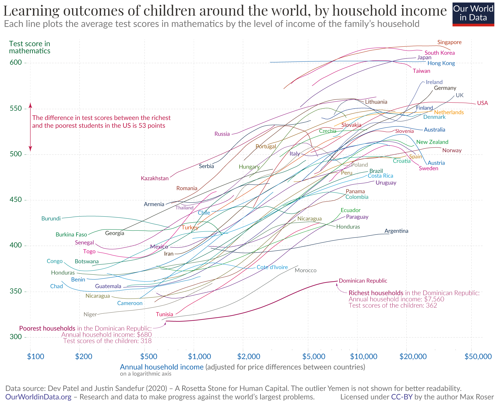

```{r setup, include=FALSE}
knitr::opts_chunk$set(echo = TRUE)
```

## Introduction

International statistics, such as the United Nations' Human Development Index, tend to prioritise school attendance rates over actual learning outcomes.
It is imperative to assess both the quantity (years of schooling) and the quality (actual learning achievements) in order to provide a realistic evaluation of the performance of education systems.
An essential indicator for evaluating the quality of education is the analysis of test scores.
While these should not be the sole focus of education, they reveal critical inequalities and help identify problematic systems.
The graph entitled "Learning outcomes of children around the world, by household income" illustrates the relationship between household income (on the x-axis, logarithmically scaled) and children's mathematics test scores (on the y-axis) in different countries.
It draws attention to the existence of inequalities between and within countries.
The upward-sloping lines indicate that in the majority of countries, test scores improve as household income increases.In countries with a lower standard of living, such as Morocco, the majority of students perform less well than the most economically disadvantaged students in Brazil.
Even the most affluent students in Brazil do not attain the same level of performance as the most disadvantaged students in countries such as Finland, South Korea, and the Netherlands.
A key insight is that differences between countries are often greater than those within countries, even in economically unequal nations such as the United States.
For instance, in the US, the performance gap between the richest and poorest students is 53 points.
Nevertheless, students from poorer countries fall far below this level overall, regardless of their household income.

Notation: As the original data was available in Strata format, the author of the study (not the author of the graph) was kind enough to provide me with the finished CSV file. However, this data differs from that in the graph, which is why there are differences in the presentation that I could not avoid. 

## Original Graph

{.external width="100%"}


### Libraries

```{r}
library(readr)
library(tidyverse)
library(dplyr)
library(ggplot2)
library(ggrepel)
library(plotly)
library(ggtext)
library(grid)
```

### Data cleaning and transformation

The data is exported from the CSV file in RStudio as a data frame.
Subsequently, an association is established between the country codes (code) and the complete country names (country_name).
As only the codes are stored in the learning curve table, it is necessary to have the assignment for the purpose of the visualization.

```{r}

learningcurve <- read.csv("data/learningcurve.csv")

country_names <- data.frame(
  ccode = c(  "ARG", "ARM", "AUS", "AUT", "BEN", "BWA", "BRA", "BFA", "BDI", "CMR", 
              "TCD", "CHL", "COL", "COG", "CRI", "CIV", "CZE", "DNK", "DOM", "ECU", 
              "FIN", "GEO", "DEU", "GTM", "HKG", "HND", "HRV","HUN", "IRN", "IRL", "ITA", 
              "JPN", "KAZ", "LTU", "MEX", "MAR", "NLD", "NZL", "NIC", "NER", "NOR", 
              "PAN", "PRY", "PER", "POL", "PRT", "ROU", "RUS", "SWE", "SEN", "SRB", 
              "SGP", "SVK", "SVN", "KOR", "ESP", "TWN", "THA", "TGO", "TUN", "TUR", 
              "GBR", "URY", "USA"),
  country_name = c("Argentina", "Armenia", "Australia", "Austria", "Benin", "Botswana", "Brazil",
                   "Burkina Faso","Burundi", "Cameroon", "Chad", "Chile", "Colombia", "Congo", 
                   "Costa Rica", "Côte d’Ivoire","Croatia","Czechia", "Denmark", "Dominican Republic",
                   "Ecuador", "Finland", "Georgia", "Germany", "Guatemala", "Hong Kong", "Honduras",
                   "Hungary", "Iran", "Ireland", "Italy", "Japan", "Kazakhstan", "Lithuania", 
                   "Mexico", "Morocco", "Netherlands", "New Zealand", "Nicaragua", "Niger", 
                   "Norway", "Panama", "Paraguay", "Peru", "Poland", "Portugal", "Romania", 
                   "Russia", "Sweden", "Senegal", "Serbia", "Singapore", "Slovakia", "Slovenia",
                   "South Korea", "Spain","Taiwan", "Thailand", "Togo", "Tunisia", "Turkey", 
                   "United Kingdom", "Uruguay", "United States")
)

```

The data is subjected to a filtration process at the level of the query.
In the initial stage of the process, only those countries from the Learningcurve table that have been previously saved in the 'country_name' data frame are transferred.
It should be noted that not all countries are represented in the final visualization.
For subsequent processing, only the columns designated as 'logincome', 'masterimss' and 'Code' are transferred.
Subsequently, a left join is performed in order to link the columns from Learningcurve with the full country names.
The column designated as 'logincome' is transformed into the actual income value and labelled 'income_actual'.
Ultimately, any rows containing Nas or exhibiting negative income values are excluded.
The final result is a data frame, designated "all_results," which contains comprehensive information regarding income, test results, and country names.

```{r}
all_results <- learningcurve |> 
  filter(ccode %in% country_names$ccode) |> 
  select(logincome, mastertimss, ccode) |> 
  left_join(country_names, by = c("ccode" = "ccode")) |> 
  mutate(
    income_actual = exp(logincome),
    country = country_name
  ) |> 
  filter(!is.na(logincome) & !is.na(mastertimss) & logincome > 0)

```

The aes() function is used to specify which variables are used for the X-axis (income_actual), Y-axis (mastertimss), and the colours of the lines (country).The X-axis represents the actual household income, which has been transformed into a logarithmic scale using scale_x_log10(). This transformation effectively handles the wide range of income values, with predefined breaks (100, 200, 500) and labels formatted as currency using the scales::label_dollar() function.The Y-axis displays the mathematical test scores (mastertimss), ranging from 300 to 600, as defined by scale_y_continuous(). The axis also includes 50-point.
The LOESS smoothing method is applied using geom_smooth() with span = 0.6, which balances detail and smoothness.The lines are plotted with a width of 0.3.The legend is intentionally removed (legend.position = "none") to avoid clutter.Annotations are added using annotate at the top of the plot, labelling it with "Test score in mathematics." 
The theme is defined with theme_minimal(), and there are a few customisations:
- The plot title and subtitle are centered using hjust = 0.5 and styled with element_text().
- The axis titles and tick labels are customized in terms of size, font (Arial), and color (steelblue4 for the X-axis and darkgreen for the Y-axis).
- The panel gridlines use dashed and dotted lines (linetype = "dashed" and linetype = "dotted")
-The caption is styled using element_markdown()The colour scheme for countries is specified using a custom palette in the country_colors variable (not included in this code snippet but applied via scale_color_manual()). 

```{r graph}
graph <- ggplot(all_results, aes(x = income_actual, y = mastertimss, color = country)) +
  geom_smooth(method = "loess", se = FALSE, span = 0.6, size = 0.3) +

  scale_x_log10(
    breaks = c(100, 200, 500, 1000, 2000, 5000, 10000, 20000, 50000),
    labels = scales::label_dollar(accuracy = 1)
  ) +
  scale_y_continuous(breaks = seq(300, 600, by = 50), limits = c(300, 600)) +
  coord_cartesian(xlim = c(100, 50000)) +
  theme_minimal() +
  theme(
    legend.position = "none",
    plot.title = element_text(size = 24, family = "Arial", face = "bold", hjust = 0.5),
    plot.subtitle = element_text(size = 16, family = "Arial", hjust = 0.5, color = "gray50"),
    axis.title.x = element_text(size = 12, family = "Arial", color = "steelblue4"),
    axis.title.y = element_text(size = 12, family = "Arial", color = "darkgreen"),
    axis.text.x = element_text(size = 10, family = "Arial", color = "steelblue4"),
    axis.text.y = element_text(size = 10, family = "Arial", color = "darkgreen"),
    panel.grid.major = element_line(linetype = "dashed"),
    panel.grid.minor = element_line(linetype = "dotted"),
    plot.caption = element_markdown(size = 10, family = "Arial", hjust = 0, color = "gray50")
  ) +
  annotate("text", x = 100, y = 600, label = "Test score in\nmathematics", 
           angle = 0, color = "darkgreen", size = 4, family = "Arial")

```


In this section, we commence the process of identifying the points at which the corresponding country labels will be positioned.
Given that some countries are situated at the commencement of their respective lines, while others are located at the conclusion of said lines, it is necessary to make the requisite adjustments.
The data is initially grouped by country.
The lowest and highest incomes and test scores are determined for each country using the 'start_income'/'end_income' and 'start_score'/'end_score' variables, respectively, in order to establish the points for each country.
The Loess function is employed to generate the smooth lines, which are created through a local regression.
The lines are calculated as smooth estimates of the MasterTIMSS data set, based on the actual income data.
The countries identified by the 'if-else' query are all those whose labels should be positioned at the beginning of the line.The remaining cases are automatically assigned to the end of the line.
In some instances, the distance between the labels and the corresponding countries was excessive, necessitating manual adjustments to the position of the labels.
In the case of specific countries (e.g. Colombia, Germany), the positions for the labels (label_x, label_y) have been overwritten. Ultimately, the resulting data frame, designated as "line_points," encompasses the income and test results for each country, along with the designated label position.

```{r}
line_points <- all_results |> 
  group_by(country) |> 
  summarize(
    start_income = min(income_actual),
    end_income = max(income_actual),
    start_score = predict(loess(mastertimss ~ income_actual, data = cur_data(), span = 0.6), 
                          newdata = data.frame(income_actual = min(income_actual))),
    end_score = predict(loess(mastertimss ~ income_actual, data = cur_data(), span = 0.6), 
                        newdata = data.frame(income_actual = max(income_actual)))
  ) |> 
  mutate(
    label_position = ifelse(country %in% c("Russia", "Portugal", "Serbia","Hungary","Italy","Romania","Armenia","Thailand","Burundi","Chile","Iran","Togo","Gerogia","Mexico","Turkey","Congo","Botswana","Senegal","Niger","Burkina Faso","Chad","Benin","Honduras","Guatemala","Nicaragua","Cameroon","Tunisia", "Kazakhstan"), "start", "end"),
    label_x = ifelse(label_position == "start", start_income, end_income),
    label_y = ifelse(label_position == "start", start_score, end_score)
  ) |> 
  mutate(
    label_x = case_when(
      country == "Colombia" ~ 22000,  
      country == "Denmark" ~ 18000,          
      country == "Argentina" ~ 30000,
      country == "Germany" ~ 17500,
      country == "Peru" ~ 18000,
      country == "Guatemala" ~ 1500,
      country == "Paraguay" ~ 15000,
      TRUE ~ label_x                      
    ),
    label_y = case_when(
      country == "Colombia" ~ 400,   
      country == "Denmark" ~ 370,          
      country == "Argentina" ~ 450,
      country == "Germany" ~ 370, 
      country == "Peru" ~ 360,
      country == "Guatemala" ~ 530,
      country == "Paraguay" ~ 400,
      TRUE ~ label_y                      
    )
  )
```

```{r plot, fig.width=13, fig.height=9}
plot <- ggplot(all_results, aes(x = income_actual, y = mastertimss, color = country)) +
  geom_smooth(method = "loess", se = FALSE, span = 0.6, size = 0.3) +
  geom_text_repel(data = line_points, aes(x = label_x, y = label_y, label = country), size = 3) +
  # Scales and aesthetics
  scale_x_log10(
    breaks = c(100, 200, 500, 1000, 2000, 5000, 10000, 20000, 50000),
    labels = scales::label_dollar(accuracy = 1)
  ) +
  scale_y_continuous(breaks = seq(300, 600, by = 50), limits = c(300, 600)) +
  coord_cartesian(xlim = c(100, 50000)) +
  
  # Theme
  theme_minimal() +
  theme(
    legend.position = "none",
    plot.title = element_text(size = 24, family = "Arial", face = "bold", hjust = 0.5),
    plot.subtitle = element_text(size = 16, family = "Arial", hjust = 0.5, color = "gray50"),
    axis.title.x = element_text(size = 12, family = "Arial", color = "steelblue4"),
    axis.title.y = element_text(size = 12, family = "Arial", color = "darkgreen"),
    axis.text.x = element_text(size = 10, family = "Arial", color = "steelblue4"),
    axis.text.y = element_text(size = 10, family = "Arial", color = "darkgreen"),
    panel.grid.major = element_line(linetype = "dashed"),
    panel.grid.minor = element_line(linetype = "dotted"),
    plot.caption = element_markdown(size = 10, family = "Arial", hjust = 0, color = "gray50")
  ) +
  annotate("text", x = 100, y = 600, label = "Test score in\nmathematics", 
           angle = 0, color = "darkgreen", size = 4, family = "Arial")
plot
```

To keep the colors as close as possible to the original, each color is selected and assigned individually for the graph.

```{r}
country_colors <- c(
  "Argentina" = "#081F4E", "Armenia" = "#092255","Australia" = "#3F69BE",
  "Austria" = "#759EEF", "Benin" = "#799DE5", "Botswana" = "#248B63",
  "Brazil" = "#1E9667", "Burkina Faso" = "#1CA63C", "Burundi" = "#1CA687",
  "Cameroon" = "#29C2E7", "Chad" = "#138AD0", "Chile" = "#1A97E2",
  "Colombia" = "#19D6AB", "Congo" = "#19D6D0", "Costa Rica" = "#5DC4DB",
  "Côte d’Ivoire" = "#4BCAE7","Croatia"="#28D29D" ,"Czechia" = "#31AC39",
  "Denmark" = "#47ABBF", "Dominican Republic" = "#890F4C", "Ecuador" = "#30C11C", 
  "Finland" = "#1735A0","Georgia" = "#363A48", "Germany" = "#2B2D34",
  "Guatemala" = "#6016DD", "Hong Kong" = "#157ED3", "Honduras" = "#097A35",
  "Hungary" = "#0E9141","Iran" = "#4D341C", "Ireland" = "#5A77D6", "Italy" = "#6927AD",
  "Japan" = "#6D1AC4", "Kazakhstan" = "#AF106E", "Lithuania" = "#755322",
  "Mexico" = "#7E3379", "Morocco" = "#AAAAAA", "Netherlands" = "#FF9D3C",
  "New Zealand" = "#4AC444", "Nicaragua" = "#A5B360", "Niger" = "#C2C4B9",
  "Norway" = "#8F120B", "Panama" = "#61140F", "Paraguay" = "#7F24A4",
  "Peru" = "#A68A49", "Poland" = "#B5AFA1", "Portugal" = "#B07D04",
  "Romania" = "#A03002", "Russia" = "#97217D", "Sweden" = "#CA227B",
  "Senegal" = "#A02B8B", "Serbia" = "#0D2752", "Singapore" = "#9F2110",
  "Slovakia" = "#B22815", "Slovenia" = "#C30C41", "South Korea" = "#DB1DC5",
  "Spain" = "#C89024", "Taiwan" = "#CD23A2", "Thailand" = "#A157AA",
  "Togo" = "#D92398", "Tunisia" = "#EA2965", "Turkey" = "#DF7B35",
  "United Kingdom" = "#8C8B9B", "Uruguay" = "#652A83", "United States" = "#C1153E"
)
```


```{r graph2, fig.width=13, fig.height=9}
graph2 <- plot +
  scale_color_manual(values = country_colors)
graph2
```

The query creates a graphic object that positions the logo in the top right-hand corner of the plot, with a size that is fixed relative to the plot. This is the logo of ‘Our World in Data’.

```{r}
image_grob <- rasterGrob(
  png::readPNG("data/Our_World_in_Data_logo.png"),
  x = 0.997, y = 0.992,  
  hjust = 1, vjust = 1, 
  width = unit(0.07, "npc"),  
  height = unit(0.07, "npc") 
)

```


To recreate the annotation: 
A vertical double arrow is drawn using the annotate(‘segment’) function. The lines start and end at the x-coordinate 100 (x = 100, xend = 100) and are located on the Y-axis between 503-550. To add two points to the arrow, ‘ends=’Both’ is set. The arrowheads are closed (filled in) with type = ‘closed’. The length of the arrow is 0.2 cm (length = unit(0.2, ‘cm’)) The colour and thickness of the line is set to red and 0.3. A text is added to the arrow. The text describes the difference between the test scores of the richest and poorest students in the USA (53 points). The position of the text is x = 190, y = 530. 

```{r, eval=FALSE}

annotate("segment", x = 100, xend = 100, y = 503, yend = 550, 
           arrow = arrow(ends = "both", type = "closed", length = unit(0.2, "cm")), 
           color = "#C71845", size = 0.3) +
  annotate("text", x = 190, y = 530, 
           label = "The difference in test scores between the richest\nand the poorest students in the US is 53 Points", 
           color = "#C71845", size = 3, fontface = "plain")

```


To recreate the arrows: 
The arrows at the bottom of the graph are created using the geom_curve() function. X and Y values determine the start and end points of the arrows. Curvature is used to determine the ‘curvature’ of the arrows. A positive value indicates an upward curvature and a negative value indicates a downward curvature. As with the arrow before, the length, thickness and type can be changed manually until the arrow looks like the original. 

```{r, eval=FALSE}

  geom_curve(aes(x = 500, y = 318, xend = 500, yend = 340),   
             curvature = 0.2, arrow = arrow(length = unit(0.15, "cm"), type = "closed"), 
             color = "#890F4C", size = 0.3, lineend = "round") +
  geom_curve(aes(x = 7500, y = 340, xend = 7500, yend = 362),  
             curvature = -0.2, arrow = arrow(length = unit(0.15, "cm"), type = "closed"), 
             color = "#890F4C", size = 0.3, lineend = "round") 

```

Recreate Labels: 

```{r, eval=FALSE}
labs(
    title = "Learning outcomes of children around the world, by household income",
    subtitle = "Each line plots the average test scores in mathematics by the level of income of the family's household",
    x = "Annual household income (adjusted for price differences between countries)\non a logarithmic axis",
    y = "",
    color = "Country", 
    caption = "<span style='color:gray;'>Data source: Dev Patel and Justin Sandefur (2020) - A Rosetta Stone for Human Capital. The outlier Yemen is not shown for better readability.<br>
    <span style='color:steelblue4;'>OurWorldInData.org</span> - Research and data to make progress against the world's largest problem.<span style='color:steelblue4;'>&nbsp;&nbsp;&nbsp;Licensed under CC-BY</span> by the author Max Roser</span>"
  ) 

```

And if you put all the steps together, you get the reconstructed graph:

```{r graph3, fig.width=14, fig.height=10, preview=TRUE}
graph3 <- graph2 +
  # US Annotation
  annotate("segment", x = 100, xend = 100, y = 503, yend = 550, 
           arrow = arrow(ends = "both", type = "closed", length = unit(0.2, "cm")), 
           color = "#C71845", size = 0.3) +
  annotate("text", x = 190, y = 530, 
           label = "The difference in test scores between the richest\nand the poorest students in the US is 53 Points", 
           color = "#C71845", size = 3, fontface = "plain") +
  
  # Dominican Republic Arrows: Both arrows curve upward
  geom_curve(aes(x = 500, y = 318, xend = 500, yend = 340),   
             curvature = 0.2, arrow = arrow(length = unit(0.15, "cm"), type = "closed"), 
             color = "#890F4C", size = 0.3, lineend = "round") +
  geom_curve(aes(x = 7500, y = 340, xend = 7500, yend = 362),  
             curvature = -0.2, arrow = arrow(length = unit(0.15, "cm"), type = "closed"), 
             color = "#890F4C", size = 0.3, lineend = "round") +
  
  # Text annotations for Dominican Republic
  annotate("text", x = 200, y = 300, 
           label = "Poorest households in the Dominican Republic:\nAnnual household income: $680\nTest scores of the children: 318", 
           color = "#890F4C", size = 3, fontface = "plain", hjust = 0) +
  annotate("text", x = 8000, y = 320, 
           label = "Richest households in the Dominican Republic:\nAnnual household income: $7,560\nTest scores of the children: 362", 
           color = "#890F4C", size = 3, fontface = "plain", hjust = 0) +
  
  # Labels
  labs(
    title = "Learning outcomes of children around the world, by household income",
    subtitle = "Each line plots the average test scores in mathematics by the level of income of the family's household",
    x = "Annual household income (adjusted for price differences between countries)\non a logarithmic axis",
    y = "",
    color = "Country", 
    caption = "<span style='color:gray;'>Data source: Dev Patel and Justin Sandefur (2020) - A Rosetta Stone for Human Capital. The outlier Yemen is not shown for better readability.<br>
    <span style='color:steelblue4;'>OurWorldInData.org</span> - Research and data to make progress against the world's largest problem.<span style='color:steelblue4;'>&nbsp;&nbsp;&nbsp;Licensed under CC-BY</span> by the author Max Roser</span>"
  )
graph3

```


## Improved Graph

The original visualization is well chosen as it allows the author to demonstrate both the similarities and differences between and within countries, which is important in order to clearly convey the message of the graphic.However, the visualization also has weaknesses: due to the large number of lines, the visualization sometimes appears overloaded, especially in the middle income range, which can result in lines overlapping and the chart appearing confusing at first glance.
Furthermore, the repeated use of colors for certain lines, a phenomenon that is unavoidable given the large number of countries represented, complicates the assignment of lines to specific countries.Notwithstanding these limitations, it is this author's opinion that no alternative visualization exists that would more effectively convey the intended message.The following section will present the various approaches that have been trialled in an effort to optimize the presentation.

### 1) Interactive Graph

This query generates an interactive visualization that illustrates the correlation between household income and the mathematics test scores of children across the globe.
Firstly, the variables 'income_actual' (representing actual income) and 'mastertimss' (representing maths test scores) are positioned on the axes.
The colours and countries remain unchanged, and the original code is utilised.
The addition of titles and axis labels is achieved through the utilisation of the labs() function.
Subsequently, the plot is transformed into an interactive format through the utilisation of the ggplotly() function.
This conversion permits users to magnify or reduce the scale of the graph and select specific data points to obtain more detailed information.

```{r interactive_plot, fig.width=10, fig.height=7}

interactive_plot <- ggplot(all_results, aes(x = income_actual, y = mastertimss, color = country)) +
  geom_smooth(method = "loess", se = FALSE, span = 0.6, size = 0.3) +
  scale_color_manual(values = country_colors) +  
  labs(
    title = "Learning outcomes of children around the world, by household income",
    subtitle = "Each line plots the average test scores in mathematics by the level of 
    income of the family's household",
    x = "Annual household income (adjusted for price differences between countries)",
    y = "Test score in mathematics",
    color = "Country"
  ) +
  theme_minimal()

ggplotly(interactive_plot)

```

#### Discussion:

The interactivity facilitates the viewing and comparison of individual countries, while the visualisation enables the determination of exact scores for each income by simply moving the cursor over the respective line.Despite these advantages, the chart remains cluttered due to the large number of data points, with most countries overlapping, which complicates the clear extraction of information.
The absence of contextual cues, such as arrows and annotations, that were present in the original static chart, further complicates the effective conveyance of key information.

### 2) Analysis of learning outcomes by income class with color differentiation

The learning curve data has been filtered to include only those countries present in the country_names dataset.
The relevant variables, namely logincome, mastertimss, ccode and classification, are selected for further analysis.
The classification column is defined as a factor and arranged in a specific order, as follows: The income categories are defined as follows: low income, lower-middle income, upper-middle income, and high income.
The process of removing distinct and duplicate rows ensures that each value of logincome is represented only once, thereby reducing the overall volume of data.

```{r, echo=FALSE}
all_results <- learningcurve |> 
  filter(ccode %in% country_names$ccode) |> 
  select(logincome, mastertimss, ccode, classification) |> 
  left_join(country_names, by = c("ccode" = "ccode")) |> 
  mutate(
    income_actual = exp(logincome),
    country = country_name
  ) |> 
  filter(!is.na(logincome) & !is.na(mastertimss) & logincome > 0)

all_results$classification <- factor(
  all_results$classification,
  levels = c("Low income", "Lower middle income", "Upper middle income", "High income")
)

all_results <- all_results |> 
  distinct(logincome, .keep_all = TRUE)
```

Subsequently, the axes (income_actual for the x-axis and mastertimss for the y-axis), colour (based on the income category classification), and labels (country names) are defined.
The grey points displayed on the graph are generated using geom_jitter and are based on the all_results dataset.
The grey points represent the entire dataset without income categorisation.
Subsequently, geom_point adds coloured points, which are mapped to their respective income categories.
Facet_grid creates separate plots for each income category, with independent axis scaling.
The use of the labs function enables the title, subtitle and axis labels to be set in a manner that provides a clear explanation of the purpose and content of the plot.
The guides function allows the size of the coloured points in the legend to be optimised, thus enhancing their visibility.Faceting by income categories (low, middle, high income) permits a comprehensive comparison between these groups, while the grey points represent the overall data independently of the income categorisation.

```{r p1, fig.width=12, fig.height=9}
p1 <- ggplot(all_results, 
             aes(income_actual, mastertimss, color = classification, label = country)) + 
  geom_jitter(data = transform(all_results, classification = NULL), 
              colour = "#DCD7D8", width = 0.01, height = 0.01) +  
  geom_point(alpha = 0.7) +  
  scale_color_manual(values = c("#CC79A7", "#56B4E9","#E69F00", "#F0E442")) +
  facet_grid(~classification, scales = "free") + 
  theme_bw() + 
  labs(
    title = "Learning Outcomes of Children Worldwide by Household Income and Income Categories",
    subtitle = "Class country",
    x = "Annual household income (adjusted for price differences between countries)",
    y = "Test score in mathematics"
  ) +
  scale_x_log10(breaks = c(100, 200, 500, 1000, 2000, 5000, 10000, 20000, 50000)) +  
  scale_y_continuous(limits = c(300, 600)) +  
  theme(
    text = element_text(size = 8),
    legend.position = "none",
    plot.title = element_markdown(face = "bold", hjust = 0.5),
    plot.subtitle = element_markdown(face = "bold", hjust = 0.5),
    axis.title.x  = element_markdown(),
    axis.title.y = element_markdown(),
    plot.caption = element_markdown(face = "bold", hjust = 0.1)
  ) +
  guides(color = guide_legend(override.aes = list(size = 3)))
p1
```

#### Discussion:

The visualization provides a clear breakdown into income categories, thus facilitating the identification of differences between these categories.
The grey dots in the background provide supplementary context by mapping the entire data set, while the colored dots focus on specific categories.
The logarithmic scaling of the x-axis is instrumental in the visualization of substantial disparities in income without the distortion of extreme values.
The visualisation's minimalist and clear design is effective in its emphasis on the key elements.
However, the visualization does exhibit certain deficiencies.
In categories with a high number of data points, such as 'Upper middle income' and 'High income', there is a considerable amount of overlap, which hinders the clear recognition of patterns or differences.
The labelling of the x-axis is dense, which can make interpretation difficult due to the logarithmic scaling.
Additionally, the absence of annotations or highlighting to accentuate significant trends or outliers hinders the discernment of key messages.
Furthermore, the potential exists for the creation of additional differentiations within the income categories, for example by continent, in order to provide insights that are specific to a regional context.
Despite the reduction in the number of income values, the density of points remains substantial.
It is recommended that this point density be reduced further, a measure which would considerably enhance the readability of the text.

### 3) Learning outcomes worldwide: point spread with coloured continents and income categories as facets

The data is initially processed as outlined in the preceding graph.
The relevant countries are selected, the data is cleaned, and the 'Classification' column is defined as a factor.
However, an additional column is incorporated that manually allocates each country to a continent, thereby enabling regional analyses.

```{r}

country_names <- data.frame(
  ccode = c("ARG", "ARM", "AUS", "AUT", "BEN", "BWA", "BRA", "BFA", "BDI", "CMR", 
            "TCD", "CHL", "COL", "COG", "CRI", "CIV", "CZE", "DNK", "DOM", "ECU", 
            "FIN", "GEO", "DEU", "GTM", "HKG", "HND", "HRV", "HUN", "IRN", "IRL", "ITA", 
            "JPN", "KAZ", "LTU", "MEX", "MAR", "NLD", "NZL", "NIC", "NER", "NOR", 
            "PAN", "PRY", "PER", "POL", "PRT", "ROU", "RUS", "SWE", "SEN", "SRB", 
            "SGP", "SVK", "SVN", "KOR", "ESP", "TWN", "THA", "TGO", "TUN", "TUR", 
            "GBR", "URY", "USA"),
  country_name = c("Argentina", "Armenia", "Australia", "Austria", "Benin", "Botswana", 
                   "Brazil", "Burkina Faso","Burundi", "Cameroon", "Chad", "Chile", "Colombia", "Congo", 
                   "Costa Rica", "Côte d’Ivoire","Croatia","Czechia", "Denmark", "Dominican Republic", 
                   "Ecuador", "Finland", "Georgia", "Germany", "Guatemala", "Hong Kong", "Honduras", 
                   "Hungary", "Iran", "Ireland", "Italy", "Japan", "Kazakhstan", "Lithuania", "Mexico", 
                   "Morocco", "Netherlands", "New Zealand", "Nicaragua", "Niger", "Norway", "Panama", 
                   "Paraguay", "Peru", "Poland", "Portugal", "Romania", "Russia", "Sweden", "Senegal",
                   "Serbia", "Singapore", "Slovakia", "Slovenia", "South Korea", "Spain","Taiwan", 
                   "Thailand", "Togo", "Tunisia", "Turkey", "United Kingdom", "Uruguay", "United States")
)
country_names$continent <- c(
  "South America", "Asia", "Oceania", "Europe", "Africa", "Africa", "South America", "Africa", "Africa", 
  "Africa", "Africa", "South America", "South America", "Africa", "North America", "Africa",
  "Europe", "Europe", "North America", "South America",  "Europe", "Asia", "Europe", "North America", 
  "Asia", "North America", "Europe", "Europe", "Asia", "Europe", "Europe", "Asia", "Asia", "Europe", 
  "North America", "Africa", "Europe", "Oceania", "North America", "Africa", "Europe", "North America",
  "South America", "South America", "Europe", "Europe", "Europe", "Europe", "Europe", "Africa", "Europe", 
  "Asia", "Europe", "Europe", "Asia", "Europe", "Asia", "Asia", "Africa", "Africa", "Europe", 
  "Europe", "South America", "North America"
)
```

```{r}
all_results <- learningcurve |> 
  filter(ccode %in% country_names$ccode) |> 
  select(logincome, mastertimss, ccode, classification) |> 
  left_join(country_names, by = c("ccode" = "ccode")) |> 
  mutate(
    income_actual = exp(logincome),
    country = country_name
  ) |> 
  filter(!is.na(logincome) & !is.na(mastertimss) & logincome > 0)

all_results$classification <- factor(
  all_results$classification,
  levels = c("Low income", "Lower middle income", "Upper middle income", "High income")
)

all_results <- all_results |> 
  distinct(logincome, .keep_all = TRUE)
```

The actual household income (income_actual) is displayed on the x-axis in logarithmic scale in order to facilitate the visualisation of the substantial disparities in income.
The Y-axis displays the students' maths test scores (mastertimss).
Each data point is assigned a colour according to the continent of the corresponding country, thereby highlighting regional disparities.
The points in the graph are represented by two layers.
The first layer comprises grey background points, generated using the geom_jitter function.
These points are displayed in grey (colour = '#DCD7D8') and show all countries, regardless of their continental affiliation.
The jitter effect introduces a slight randomness (width = 0.01, height = 0.01) to reduce overlaps and separate the dots from each other.
Conversely, the coloured foreground points, created with geom_point, are displayed in a different manner.
These points are semi-transparent (alpha = 0.5) and colour-coded by continent.
These points are distinguished from the grey background points by their transparency (alpha = 0.5) and serve to highlight the specific data points for each continent.
To structure the data according to income categories, the visualisation is faceted into columns using facet_grid.
Each column thereby represents an income category (classification), including low income, lower middle income, upper middle income and high income.
Within each category, the X and Y axes are scaled independently (scales = 'free'), which enhances the clarity of the distribution of the data within the individual categories.
Finally, the legibility of the legend is optimised by enlarging the displayed points with guides.
This enhances the legibility of the colours and their corresponding assignment to the continents.
The amalgamation of these elements culminates in a visually appealing and meticulously structured presentation, unveiling both global and regional disparities in test values and household incomes.

```{r p2, fig.width=12, fig.height=9}

p2 <- ggplot(all_results, 
             aes(income_actual, mastertimss, color = continent, label = country)) + 
  geom_jitter(data = transform(all_results, continent = NULL), 
              colour = "#DCD7D8", width = 0.01, height = 0.01) +  
  geom_point(alpha = 0.5) + 
  scale_color_manual(values = c("Africa" = "#FF5733", 
                                "Asia" = "#33FF57", 
                                "Europe" = "#3357FF", 
                                "North America" = "#FFD133",
                                "South America" = "#8A33FF", 
                                "Oceania" = "#33FFF7")) +  
  facet_grid(~classification, scales = "free") +  
  theme_bw() + 
  labs(
    title = "Learning Outcomes of Children Worldwide by Household Income and Continent",
    subtitle = "Class country",
    x = "Annual household income (adjusted for price differences between countries)",
    y = "Test score in mathematics",
    color = "Continent"
  ) +
  scale_x_log10(breaks = c(100, 200, 500, 1000, 2000, 5000, 10000, 20000, 50000)) +  
  scale_y_continuous(limits = c(300, 600)) +  
  theme(
    text = element_text(size = 8),
    legend.position = "right",  # Verschiebe Legende nach rechts
    plot.title = element_markdown(face = "bold", hjust = 0.5),
    plot.subtitle = element_markdown(face = "bold", hjust = 0.5),
    axis.title.x  = element_markdown(),
    axis.title.y = element_markdown(),
    plot.caption = element_markdown(face = "bold", hjust = 0.1)
  ) +
  guides(color = guide_legend(override.aes = list(size = 3)))
p2

```

#### Discussion:

The visualization shows well that there are clear differences between the income categories.
It shows that higher incomes tend to be associated with higher maths test scores.
The colour coding by continent also makes it possible to identify regional patterns, such as the dominance of Africa in the low income category.
Nevertheless, the message remains rather superficial: No in-depth analysis possible:The presentation allows the data to be explored, but does not make specific patterns or outliers visible.
This makes it difficult to draw clear conclusions or formulate specific regional or global messages.
Lack of focus: Visualization does not provide a clear answer to a specific question or hypothesis.
It is more suitable for exploratory purposes, but the core message remains unclear.

### 4) Income categories and continents: scatter plot of maths test scores

The visualization facilitates a clear comparison between these dimensions by dividing them into income categories and continents.
The utilization of color coding for the representation of continents serves to facilitate the identification of regional disparities.
The employment of a logarithmic x-axis ensures the lucid presentation of income distribution.
The presence of grey dots in the background serves to provide additional context, illustrating the entirety of the data set, while colored dots focus on specific continents.

```{r}
country_names <- data.frame(
  ccode = c("ARG", "ARM", "AUS", "AUT", "BEN", "BWA", "BRA", "BFA", "BDI", "CMR", 
            "TCD", "CHL", "COL", "COG", "CRI", "CIV", "CZE", "DNK", "DOM", "ECU", 
            "FIN", "GEO", "DEU", "GTM", "HKG", "HND", "HRV", "HUN", "IRN", "IRL", "ITA", 
            "JPN", "KAZ", "LTU", "MEX", "MAR", "NLD", "NZL", "NIC", "NER", "NOR", 
            "PAN", "PRY", "PER", "POL", "PRT", "ROU", "RUS", "SWE", "SEN", "SRB", 
            "SGP", "SVK", "SVN", "KOR", "ESP", "TWN", "THA", "TGO", "TUN", "TUR", 
            "GBR", "URY", "USA"),
  country_name = c("Argentina", "Armenia", "Australia", "Austria", "Benin", "Botswana", "Brazil", "Burkina Faso","Burundi", "Cameroon", "Chad", "Chile", "Colombia", "Congo", "Costa Rica", "Côte d’Ivoire","Croatia","Czechia", "Denmark", "Dominican Republic", "Ecuador", "Finland", "Georgia", "Germany", "Guatemala", "Hong Kong", "Honduras", "Hungary", "Iran", "Ireland", "Italy", "Japan", "Kazakhstan", "Lithuania", "Mexico", "Morocco", "Netherlands", "New Zealand", "Nicaragua", "Niger", "Norway", "Panama", "Paraguay", "Peru", "Poland", "Portugal", "Romania", "Russia", "Sweden", "Senegal", "Serbia", "Singapore", "Slovakia", "Slovenia", "South Korea", "Spain","Taiwan", "Thailand", "Togo", "Tunisia", "Turkey", "United Kingdom", "Uruguay", "United States")
)
country_names$continent <- c(
  "South America", "Asia", "Oceania", "Europe", "Africa", "Africa", "South America", "Africa", "Africa", "Africa", 
  "Africa", "South America", "South America", "Africa", "North America", "Africa", "Europe", "Europe", "North America", "South America", 
  "Europe", "Asia", "Europe", "North America", "Asia", "North America", "Europe", "Europe", "Asia", "Europe", "Europe", 
  "Asia", "Asia", "Europe", "North America", "Africa", "Europe", "Oceania", "North America", "Africa", "Europe", 
  "North America", "South America", "South America", "Europe", "Europe", "Europe", "Europe", "Europe", "Africa", "Europe", 
  "Asia", "Europe", "Europe", "Asia", "Europe", "Asia", "Asia", "Africa", "Africa", "Europe", 
  "Europe", "South America", "North America"
)


all_results <- learningcurve |> 
  filter(ccode %in% country_names$ccode) |> 
  select(logincome, mastertimss, ccode, classification) |> 
  left_join(country_names, by = c("ccode" = "ccode")) |> 
  mutate(
    income_actual = exp(logincome),
    country = country_name
  ) |> 
  filter(!is.na(logincome) & !is.na(mastertimss) & logincome > 0)

all_results$classification <- factor(
  all_results$classification,
  levels = c("Low income", "Lower middle income", "Upper middle income", "High income")
)

all_results <- all_results |> 
  distinct(logincome, .keep_all = TRUE)
```

The plot shows the actual household income (income_actual) on the logarithmically scaled x-axis to better visualise large differences in income.
The Y-axis shows the maths test scores (mastertimss), which represent the performance of students in the different income categories.
Each data point is colour coded by income category (classification), which allows for quick visual differentiation.
The grey background points are displayed with geom_jitter and show the overall distribution of all countries regardless of their income category.
To reduce overlaps, the points are shifted slightly at random (jitter), with a small shift in width and height (width = 0.01, height = 0.01).
These points are kept in grey (colour = ‘#DCD7D8’) to clarify the context but not to distract from the main data points.The foreground points drawn with geom_point are semi-transparent (alpha = 0.5) and colour coded according to income categories.
The colours are specifically defined: Blue (#5A77D6) for one category, light blue (#56B4E9) for another, red (#D55E00) and yellow (#F0E442) for other categories.
This coding makes it possible to quickly recognise differences between the income categories visually.
The visualisation is faceted into rows and columns using facet_grid.
The rows represent the continents, while the columns represent the income categories (classification).
Each facet has independent X- and Y-axis scales (scales = ‘free’), which makes the distribution of data within each category and continent more visible.
The text elements have been adapted to improve readability and clarity.
Titles and subtitles are centred (hjust = 0.5) and highlighted (face = ‘bold’), while the axis titles and ticks are displayed in a smaller font size (size = 8) to save space and focus on the data.
Overall, the plot enables a detailed analysis of the maths test values in relation to household income, income categories and continents.

```{r p3, fig.width=12, fig.height=9}
p3 <- ggplot(all_results, 
             aes(income_actual, mastertimss, color = classification, label = country)) + 
  geom_jitter(data = transform(all_results, classification = NULL), 
              colour = "#DCD7D8", width = 0.01, height = 0.01) +  
  geom_point(alpha = 0.5) +  
  scale_color_manual(values = c("#5A77D6", "#56B4E9","#D55E00", "#F0E442")) +
  facet_grid(continent ~ classification, scales = "free") +  
  theme_bw() + 
  labs(
    title = "Learning Outcomes of Children Worldwide by Household Income and Income Categories",
    subtitle = "Class country",
    x = "Annual household income (adjusted for price differences between countries)",
    y = "Test score in mathematics"
  ) +
  scale_x_log10(breaks = c(100, 200, 500, 1000, 2000, 5000, 10000, 20000, 50000)) +  
  scale_y_continuous(limits = c(300, 600)) +  
  theme(
    text = element_text(size = 8),
    legend.position = "none",
    plot.title = element_markdown(face = "bold", hjust = 0.5),
    plot.subtitle = element_markdown(face = "bold", hjust = 0.5),
    axis.title.x  = element_markdown(),
    axis.title.y = element_markdown(),
    plot.caption = element_markdown(face = "bold", hjust = 0.1)
  ) +
  guides(color = guide_legend(override.aes = list(size = 3)))

p3
```

#### Discussion:

The visualisation shows that maths test scores tend to increase with rising household income, particularly in the higher income categories (upper middle income and high income).
The continents are shown separately, which makes it possible to recognise regional differences.
For example, it is clear that Africa is mainly represented in the lower income categories, while North America and Europe dominate the higher categories.
However, the message remains relatively general.
No specific patterns or outliers are highlighted that would be decisive for a deeper analysis.
The faceting is helpful to understand the data structure, but at the same time makes it difficult to identify global trends as the data is spread across many small plots.

### 5) Visualization of Test Scores vs. Income: Continental Color Grouping

The data is processed in a manner consistent with the preceding queries.
The countries are filtered from the original data, and the country names are added.
Subsequently, the initial and concluding points for the labels are determined.
The Loess function is employed once more, as was the case in the original graph.
The countries are then grouped by continent and colour coded: Each continent is assigned a unique colour palette, which is then applied during the visualisation process.
The final plot illustrates linear trends for each country, thereby demonstrating the relationship between income and test scores, with countries clearly designated with labels and colours.
The objective is to accentuate the disparities between continents and to reduce the colour palette to achieve a more lucid visualization.

```{r}
all_results <- learningcurve %>%
  filter(ccode %in% country_names$ccode) %>%
  select(logincome, mastertimss, ccode) %>%
  left_join(country_names, by = c("ccode" = "ccode")) %>%
  mutate(
    income_actual = exp(logincome),
    country = country_name
  ) %>%
  filter(!is.na(logincome) & !is.na(mastertimss) & logincome > 0)

line_points <- all_results %>%
  group_by(country) %>%
  summarize(
    start_income = min(income_actual),
    end_income = max(income_actual),
    start_score = predict(loess(mastertimss ~ income_actual, data = cur_data(), span = 0.6), 
                          newdata = data.frame(income_actual = min(income_actual))),
    end_score = predict(loess(mastertimss ~ income_actual, data = cur_data(), span = 0.6), 
                        newdata = data.frame(income_actual = max(income_actual)))
  ) %>%
  mutate(
    label_position = ifelse(country %in% c("Russia", "Portugal", "Serbia","Hungary","Italy","Romania","Armenia","Thailand","Burundi","Chile","Iran","Togo","Gerogia","Mexico","Turkey","Congo","Botswana","Senegal","Niger","Burkina Faso","Chad","Benin","Honduras","Guatemala","Nicaragua","Cameroon","Tunisia", "Kazakhstan"), "start", "end"),
    label_x = ifelse(label_position == "start", start_income, end_income),
    label_y = ifelse(label_position == "start", start_score, end_score)
  ) %>%
  mutate(
    label_x = case_when(
      country == "Colombia" ~ 22000,  
      country == "Denmark" ~ 18000,          
      country == "Argentina" ~ 30000,
      country == "Germany" ~ 17500,
      country == "Peru" ~ 18000,
      country == "Guatemala" ~ 1500,
      country == "Paraguay" ~ 15000,
      TRUE ~ label_x                      
    ),
    label_y = case_when(
      country == "Colombia" ~ 400,   
      country == "Denmark" ~ 370,          
      country == "Argentina" ~ 450,
      country == "Germany" ~ 370, 
      country == "Peru" ~ 360,
      country == "Guatemala" ~ 530,
      country == "Paraguay" ~ 400,
      TRUE ~ label_y                      
    )
  )
```

The only step that differs from the original graph is the colour assignment.
Here the colours are manually assigned to the continent.
The colors in the country_colors list represent the continents of the respective countries: South America = yellow Asia = green Oceania = purple Europe = red Africa = blue North and Central America = orange

```{r}
country_colors <- c(
  "Argentina" = "#F9E79F",
  "Brazil" = "#F9E79F",
  "Chile" = "#F9E79F",
  "Colombia" = "#F9E79F",
  "Ecuador" = "#F9E79F",
  "Paraguay" = "#F9E79F",
  "Peru" = "#F9E79F",
  "Uruguay" = "#F9E79F",

  "Armenia" = "#229954",
  "Hong Kong" = "#229954",
  "Iran" = "#229954",
  "Japan" = "#229954",
  "Kazakhstan" = "#229954",
  "Singapore" = "#229954",
  "South Korea" = "#229954",
  "Taiwan" = "#229954",
  "Thailand" = "#229954",
  "Georgia" = "#229954",

  "Australia" = "#7D3C98", "New Zealand" = "#6C3483",

  "Austria" = "#E74C3C",
  "Croatia" = "#E74C3C",
  "Czechia" = "#E74C3C",
  "Denmark" = "#E74C3C",
  "Finland" = "#E74C3C",
  "Germany" = "#E74C3C",
  "Hungary" = "#E74C3C",
  "Ireland" = "#E74C3C",
  "Italy" = "#E74C3C",
  "Lithuania" = "#E74C3C",
  "Netherlands" = "#E74C3C",
  "Norway" = "#E74C3C",
  "Poland" = "#E74C3C",
  "Portugal" = "#E74C3C",
  "Romania" = "#E74C3C",
  "Russia" = "#E74C3C",
  "Serbia" = "#E74C3C",
  "Slovakia" = "#E74C3C",
  "Slovenia" = "#E74C3C",
  "Spain" = "#E74C3C",
  "Sweden" = "#E74C3C",
  "United Kingdom" = "#E74C3C",
 
  "Benin" = "#3498DB",
  "Botswana" = "#3498DB",
  "Burkina Faso" = "#3498DB",
  "Burundi" = "#3498DB",
  "Cameroon" = "#3498DB",
  "Chad" = "#3498DB",
  "Congo" = "#3498DB",
  "Côte d’Ivoire" = "#3498DB",
  "Morocco" = "#3498DB",
  "Niger" = "#3498DB",
  "Senegal" = "#3498DB",
  "Togo" = "#3498DB",
  "Tunisia" = "#3498DB",
  
  "Costa Rica" = "#E67E22", 
  "Dominican Republic" = "#E67E22",
  "Guatemala" = "#E67E22", 
  "Honduras" = "#E67E22", 
  "Mexico" = "#E67E22",
  "Nicaragua" = "#E67E22", 
  "Panama" = "#E67E22", 
  "United States" = "#E67E22"
)
```

```{r p4, fig.width=13, fig.height=9}
p4 <- ggplot(all_results, aes(x = income_actual, y = mastertimss, color = country)) +
  geom_smooth(method = "loess", se = FALSE, span = 0.6, size = 0.4) +
  scale_color_manual(values = country_colors) +
  geom_text_repel(data = line_points, aes(x = label_x, y = label_y, label = country), size = 3) +

  # Scales and aesthetics
  scale_x_log10(
    breaks = c(100, 200, 500, 1000, 2000, 5000, 10000, 20000, 50000),
    labels = scales::label_dollar(accuracy = 1)
  ) +
  scale_y_continuous(breaks = seq(300, 600, by = 50), limits = c(300, 600)) +
  coord_cartesian(xlim = c(100, 50000)) +
  
  # Labels
  labs(
    title = "Learning outcomes of children around the world, by household income",
    subtitle = "Each line plots the average test scores in mathematics by the level of income of the family's household",
    x = "Annual household income (adjusted for price differences between countries)\non a logarithmic axis",
    y = "",
    color = "Country", 
    caption = "<span style='color:gray;'>Data source: Dev Patel and Justin Sandefur (2020) - A Rosetta Stone for Human Capital. The outlier Yemen is not shown for better readability.<br>
    <span style='color:darkblue;'>OurWorldInData.org</span> - Research and data to make progress against the world's largest problem.<span style='color:darkblue;'>&nbsp;&nbsp;&nbsp;Licensed under CC-BY</span> by the author Max Roser</span>"
  ) +
  
  # Theme
  theme_minimal() +
  theme(
    legend.position = "none",
    plot.title = element_text(size = 24, face = "bold", hjust = 0.5),
    plot.subtitle = element_text(size = 16, hjust = 0.5),
    axis.title.x = element_text(color = "steelblue4", size = 12),
    axis.title.y = element_text(color = "darkgreen", size = 12),
    axis.text.x = element_text(color = "steelblue4", size = 10),
    axis.text.y = element_text(color = "darkgreen", size = 10),
    panel.grid.major = element_line(linetype = "dashed"),
    panel.grid.minor = element_line(linetype = "dotted"),
    plot.caption = element_markdown(size = 10, hjust = 0, color = "gray50")
  ) +
  annotate("text", x = 100, y = 600, label = "Test score in\nmathematics", angle = 0, color = "darkgreen", size = 4)
p4

```

#### Discussion

Despite the discernible patterns exhibited by the colour coding, such as the tendency of blue colours to be associated with lower test scores and income, and green or orange colours to be associated with higher values, the chart remains perplexing in its overall presentation.
It is not possible to derive clear statements about differences between the continents.
The convergence of lines, particularly within the middle income range, further complicates the interpretation of the chart.
Furthermore, a challenge arises in the comparison of countries within a specific continent.
The absence of interactive elements or annotations further exacerbates the challenge of interpreting the data.

#### References

Max Roser (2022) - “Millions of children learn only very little.
How can the world provide a better education to the next generation?”
Published online at OurWorldinData.org.
Retrieved from: '<https://ourworldindata.org/better-learning>' [Online Resource]
