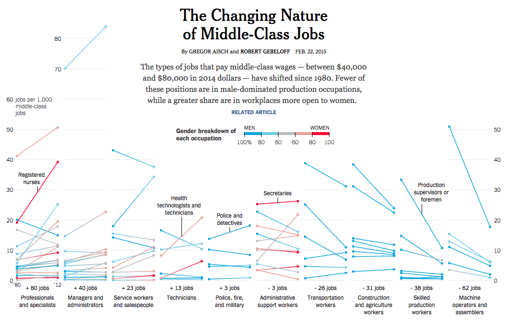

## Introduction

The chart from The New York Times examines the shifting landscape of middle-class jobs, defined as positions paying between $40,000 and $80,000 in 2014 dollars, and how these changes have impacted the workforce since 1980. Over a span of 30 years, the analysis by a team of reporters and data journalists revealed a significant transformation in the types of jobs offering middle-class wages. Notably, there has been a decline in male-dominated production occupations, traditionally associated with manufacturing and physical labor. At the same time, a growing share of middle-class positions has emerged in workplaces that are more inclusive and accessible to women, such as healthcare, education, and administrative roles.

This shift reflects broader societal changes, including advancements in technology, globalization, and evolving cultural norms about gender roles in the workforce. As part of a comprehensive series on the American middle class, the data highlights that women have been the primary beneficiaries of these shifts, gaining increased access to stable, well-paying jobs that were previously less available to them. 

{.external}

## Replication work

### Load the main files
```{r}
#| echo: true
library(tidyverse)
library(ggplot2)
library(dplyr)
library(ggthemes)
library(patchwork)
library(grid)
library(gridExtra)
library(openxlsx)
library(readxl)
library(cowplot)
library(readxl)
library(extrafont)
library(showtext)
```

The chart is made up of 10 individual graphs, each illustrating changes in employment within a specific sector over time. To construct the final visualization, I first modeled and created each graph separately, ensuring that each accurately depicted the employment trends for its respective sector. Once the individual graphs were completed, I combined them into a cohesive and comprehensive chart using faceting.

### Insert the data 

I was unable to access an existing online dataset, so I had to recreate the data myself. Fortunately, a detailed description was available on the same page of the article, and using that information, I was able to create an Excel file containing all the necessary details to produce the chart.

```{r} 
data1 <- read_excel("C:/Users/marco/OneDrive/Desktop/Data Visualization - I sem/Project - The changing nature of middle-class job/Changing nature of middle class.xlsx")

data2 <- read_excel("C:/Users/marco/OneDrive/Desktop/Data Visualization - I sem/Project - The changing nature of middle-class job/Changing nature of middle class.xlsx", sheet = "Managers and administrators")

data3 <- read_excel("C:/Users/marco/OneDrive/Desktop/Data Visualization - I sem/Project - The changing nature of middle-class job/Changing nature of middle class.xlsx", sheet = "Service workers and salespeople")

data4 <- read_excel("C:/Users/marco/OneDrive/Desktop/Data Visualization - I sem/Project - The changing nature of middle-class job/Changing nature of middle class.xlsx", sheet = "Technicians")

data5 <- read_excel("C:/Users/marco/OneDrive/Desktop/Data Visualization - I sem/Project - The changing nature of middle-class job/Changing nature of middle class.xlsx", sheet = "Police, fire and military")

data6 <- read_excel("C:/Users/marco/OneDrive/Desktop/Data Visualization - I sem/Project - The changing nature of middle-class job/Changing nature of middle class.xlsx", sheet = "Administrative support workers")

data7 <- read_excel("C:/Users/marco/OneDrive/Desktop/Data Visualization - I sem/Project - The changing nature of middle-class job/Changing nature of middle class.xlsx", sheet = "Transportation workers")

data8 <- read_excel("C:/Users/marco/OneDrive/Desktop/Data Visualization - I sem/Project - The changing nature of middle-class job/Changing nature of middle class.xlsx", sheet = "Construction and agricolture ")

data9 <- read_excel("C:/Users/marco/OneDrive/Desktop/Data Visualization - I sem/Project - The changing nature of middle-class job/Changing nature of middle class.xlsx", sheet = "Skilled production workers")

data10 <- read_excel("C:/Users/marco/OneDrive/Desktop/Data Visualization - I sem/Project - The changing nature of middle-class job/Changing nature of middle class.xlsx", sheet = "Machine operators and assembler")

```

### Create the loop for the color gradient transition between the points 

In my opinion, the most interesting aspect of the chart is the gradient color shift within the lines that make up the visualization. This color change represents the percentage shift in the workforce composition for a specific job by gender-blue indicates 100% male employment, red represents 100% female employment, and intermediate colors reflect varying percentages, culminating in a neutral gray where gender parity is achieved.
To implement this effect, it is necessary to create a loop that interpolates the colors along the lines, ensuring a smooth gradient transition between points. 

```{r}
#| echo: true
# Tranform the data in Gender column in factor to create the interpolation for the color gradient 
data1$Gender <- as.factor(data1$Gender)
data2$Gender <- as.factor(data2$Gender)
data3$Gender <- as.factor(data3$Gender)
data4$Gender <- as.factor(data4$Gender)
data5$Gender <- as.factor(data5$Gender)
data6$Gender <- as.factor(data6$Gender)
data7$Gender <- as.factor(data7$Gender)
data8$Gender <- as.factor(data8$Gender)
data9$Gender <- as.factor(data9$Gender)
data10$Gender <- as.factor(data10$Gender)

# Loop for the colors of the lines 
interpolate_lines <- function(data) {
  data %>%
    group_by(Jobs) %>%
    # Ensure there are at least 2 unique points and no missing values
    filter(n_distinct(Years) > 1 & !is.na(Years) & !is.na(Employed) & !is.na(Gender)) %>%
    summarise(
      interpolated_data = list(
        data.frame(
          Years = seq(min(Years), max(Years), length.out = 100),  # Smooth grid for Years
          Employed = approx(Years, Employed, xout = seq(min(Years), max(Years), length.out = 100))$y,
          Gender = approx(Years, Gender, xout = seq(min(Years), max(Years), length.out = 100))$y
        )
      )
    ) %>%
    unnest(cols = c(interpolated_data))  # Expand nested data into rows
}
```


### First graph
#### Initial plot set-up 

In the initial plot setup, I added light gray horizontal grid lines for reference and used geom_line() to plot smooth gradient lines representing employment trends for each job category, with colors mapped to gender proportions. I overlaid the original data points with geom_point() for clarity and defined a gradient color scale from red (100% female) to blue (100% male), with gray indicating gender parity. This step establishes the foundation for the visualization.

```{r}
#| echo: true
interp_data1 <- interpolate_lines(data1)

plot1_step1 <- ggplot() +
  geom_hline(yintercept = seq(0, 60, 10), color = "lightgray", linewidth = 0.3) +
  # Add smooth gradient lines for each job
  geom_line(data = interp_data1, aes(x = Years, y = Employed, group = Jobs, color = as.numeric(Gender)), linewidth = 1.2) +
  # Add original points for reference
  geom_point(data = data1, aes(x = Years, y = Employed, color = as.numeric(Gender)), size = 3) +
  # Define gradient color scale for Gender
  scale_color_gradientn(colors = c("red", "pink", "grey", "#8cdde3", "#2e86c1"), name = "Gender")
```

#### Axes Customization and annotation

Using annotate("text"), I added a label for "Registered nurses," positioning it near the corresponding data point to replicate the original annotation. I used annotate("segment") to draw a connecting line between the label and the data point, mirroring the style of the original chart.

The axes were adjusted with scale_x_continuous() and scale_y_continuous() for improved readability. The x-axis was formatted to display the key years 1980 and 2012 with shortened labels ("'80" and "'12"), while the y-axis was set with breaks at intervals of 10 and limited to a range of 0 to 90. The y-axis labels were tailored to show numeric values up to 60, leaving the upper range visually open. At least I added a descriptive label to the x-axis using labs() to provide context.

```{r}
#| echo: true
plot1_step2 <- plot1_step1 +
  annotate("text", x = 1998, y = 40, label = "Registered\nnurses", 
           size = 4, color = "black", fontface = "plain", hjust = 0.5) +
  annotate("segment", x = 1998, xend = 1998, y = 30, yend = 38, 
           color = "black", linewidth = 0.8) +
  # Customize axes
  scale_x_continuous(breaks = c(1980, 2012), labels = c("'80", "'12")) +
  scale_y_continuous(
    breaks = seq(0, 80, 10), 
    limits = c(0, 90), 
    labels = c("0", "10", "20", "30", "40", "50", "60", "", "")
  ) +
  labs(x = "+ 80 jobs\nProfessionals\nand specialists\n")
```

#### Theme

 I applied a clean and minimal aesthetic to the chart using theme_minimal(). This theme simplifies the overall design by removing unnecessary visual elements, allowing the data to stand out more clearly.

To further refine the appearance, I customized specific elements using the theme() function. I removed major grid lines on the x-axis and y-axis, as well as all minor grid lines, to reduce clutter. The legend was hidden with legend.position = "blank" since it was not needed for this chart.

I adjusted the y-axis text to be clear and legible by setting its size and color, while the x-axis text was styled with a slight margin adjustment for better alignment.

```{r}
plot1 <- plot1_step2 +
  theme_minimal() +
  theme(
    panel.grid.major.x = element_blank(),
    panel.grid.minor = element_blank(),
    panel.grid.major.y = element_blank(),
    legend.position = "blank",
    axis.text.y = element_text(size = 10, color = "black"),
    axis.text.x = element_text(margin = margin(t = -8), size = 10, color = "black"),
    axis.title.y = element_blank(),
    axis.title = element_text(size = 12)
  ) 

print(plot1)
```


Distill is a publication format for scientific and technical writing, native to the web.

Learn more about using Distill at <https://rstudio.github.io/distill>.


