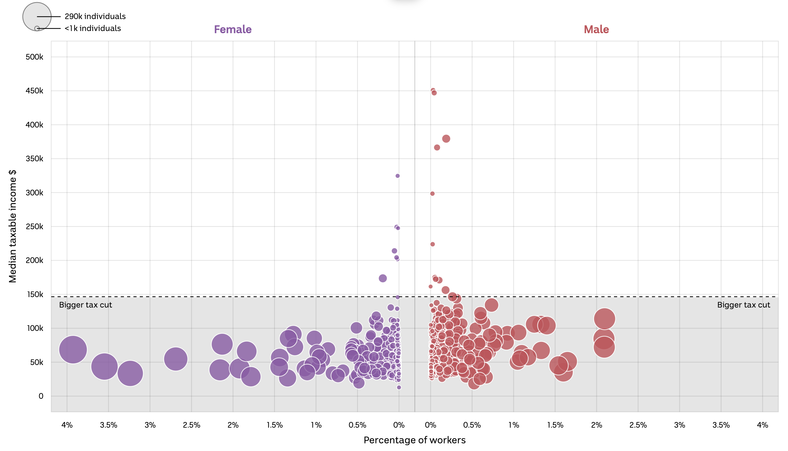

## About the graph

I have recreated the following graph from [this February 2024 article by ABC news Australia](https://www.abc.net.au/news/2024-02-02/biggest-winners-and-losers-of-revised-stage-3-tax-cuts/103415830).

```{r original-plot, echo=FALSE, fig.cap="Original graph from ABC article", out.extra="class=external"}

```

The graph shows the median income of Australians by occupation compared to who would benefit from proposed tax changes. The graph highlights those who will benefit under the changes and those who will be worse off. To distinguish the two groups, the authors use a horizontal line from the y-axis at the benefit cutoff point, \$146,486, and background shading.

The purpose of the graph is to highlight that most people are expected to be better off under the changes. Instead of estimating the number of people in raw terms that would benefit, the plot uses disagregated tax data by occupation and gender to display which groups are better and worse off.

The graph is effective because you can easily conclude that the majority of people will be better off under the changes, regardless of sex or occupation. The use of a linear y-axis to show income is effective in isolating the very high income occupations which are outliers to the data. It creates a white space which contrasts against the concentrated grouping of occupations below the cutoff point.

## Setup

Load packages, set global and local parameters, and read in our dataset.

### Load required packages

The packages are for data cleaning, graph generation, adding themes and organising subplots into the final graph.

```{r packages, message=FALSE, warning=FALSE}

library(tidyverse)
library(readxl)
library(patchwork)
library(grid)
library(magick)
library(ggbeeswarm)
library(cowplot)
library(showtext) # most similar font found but couldn't match exact
sysfonts::font_add_google("Hind", family="hind")
showtext_auto()
library(geomtextpath)

```

```{r parameters, include=FALSE}
knitr::opts_chunk$set(echo = TRUE, 
                      fig.align="center", 
                      fig.showtext=TRUE)
```

### Load data 

Now we load the data from the `data.gov.au` page. The data comes from Table 15B of the 2020-21 Australian Tax Office individual statistics.

This is some of the most granular tax data available. This choice of data allows the authors to create a graph with these dimensions:

-   Occupation

-   Number of employees in the occupation (shown as % of total employees on the x-axis)

-   Median income of each occupation

-   Splits by gender

```{r raw_data}
## if reading from web
# library(httr)
# url <- "https://data.gov.au/data/dataset/07b51b39-254a-4177-8b4c-497f17eddb80/resource/1535c9eb-8385-41af-ae65-f71b2be77d6d/download/ts21individual15occupationsex.xlsx"
# response <- GET(url)
# file_path <- tempfile(fileext = ".xlsx")
# writeBin(content(response, "raw"), file_path)
# 
# data <- read_excel(file_path,
#                    sheet="Table 15B",
#                    skip=1) # Initial clean step to remove unused row


data <- read_excel("ts21individual15occupationsex.xlsx",
                   sheet = "Table 15B",
                   skip = 1)
head(data, 5)

```

*Important data consideration:* The original graph was published in February 2024, the ATO then revised the data in March 2024 (as seen on the data updated row of the metadata online). This has led to some variation between figures in our graph and in the actual graph I will recreate. So I am not able to create a 100% like for like replication. Spot checks have been completed and the occupation and number of employee figures appear the same. There appears to be more revisions to some median income figures however the changes are minor overall.

### Set parameters

Define parameters that are used multiple times through the recreation. This saves us writing them out multiple times, including the income cutoff point and colours.

```{r define_parameters}

benefit_cut <- 146486 # Those below $146,486 benefit from the redesigned plan
options(scipen = 999) 


# colour for female purple; HEX = #a175b4 or RGB rgba(161,117,180,255)
colour_fem <- "#a175b4"
# colour for male blue; HEX = #ca555d or RGB rgba(202,85,93,255)
colour_male <- "#ca555d"

```

## Data cleaning

First, remove unused columns, clean column names and also filter rows to only have the groups by gender we are interested in (remove totals).

```{r basic-data-cleaning}

clean_data <- data |>
  rename("occupation" = "Occupation - unit group1",
         "sex" = "Sex4",
         "count" = "Individuals\r\nno.",
         "income" = "Median taxable income2,5\r\n$") |>
  select(occupation, sex, count, income) |>
  filter(sex %in% c("Female", "Male"))

```

Second, create the additional variable required, which is % of total workers in that occupation. I also create a negative income % variable for females, this is used to create the mirrored graphs by gender in later stages.

```{r add-proportion-workers-var}


clean_data <- clean_data |>
  group_by(sex) |>
  mutate(prop_workers_sex = count/sum(count), # create proportion of workers variable
         income_display = ifelse(sex=="Female", -prop_workers_sex, prop_workers_sex))|> # create negative female proportion variable
  ungroup() |> 
  filter(occupation != "0000 Occupation blank") # remove unused occupation

```

The authors make their calculations of total % of workers including the "0000 Occupation blank" variable, but then remove it from all of the visualisations.

### Basic plotting to check variable functionality

Now, to check all the required variables are available, I create a very basic version of the graph to check our data completeness. Some parameters for axis are included for comparison purposes.

```{r test-plot}

basic_test_plot <- clean_data |>
  filter(occupation != "0000 Occupation blank") |>
  ggplot(aes(x=income_display, y=income, size=count ,color=sex))+
  geom_point(alpha=0.8)+
  
  # now add split around the y axis and change the x axis to be equal, plus change the axix units
  scale_x_continuous(name = "Percentage of workers",
                     breaks= c(-0.04, -0.035, -0.03, -0.025, -0.02, -0.015, -0.01, -0.005,
                               0,
                               0.005, 0.01, 0.015, 0.02, 0.025, 0.03, 0.035, 0.04),
                     minor_breaks = NULL,
                     limits = c(-0.04, 0.04),
                     labels = function(x) abs(x) %>% scales::percent())+ # apply absolute vals
  
  scale_y_continuous(name = "Median taxable income ($)",
                     breaks = c(0, 50000, 100000, 150000, 200000, 250000,
                                300000, 350000, 400000, 450000, 500000),
                     minor_breaks = NULL,
                     limits = c(0,500000),
                     labels = scales::label_number(suffix="k", scale = 1e-3)) +
  theme_minimal()

basic_test_plot

```

The initial plotting shows that I have all required variables for our graph.

*Challenge detected:*

There is one one major problem in the basic replication. <u>There are two X=0 values on the original graph with a gap without data to divide the male and female data. </u> I need to replicate this gap and double y-axis aesthetic for the replication too.

There is no option to do this manually within one ggplot. Instead, I will create two separate graphs (for male and female) that are manually positioned together with `patchwork` to create the mirrored effect. This mirrored presentation also means we have to create two positive X-axis graphs, however the X-axis are going in opposite directions.

This is a source of repetition in the next few steps to create almost identical but symmetrical plots.

## Replication

Primarily because I cannot impute the gap around x=0, individual graphs by gender are created. To start, I split the data by gender to work with on each graph.

```{r data-bysex}
data_male <- clean_data |> filter(sex == "Male")
data_female <- clean_data |> filter(sex == "Female")

```

### Create male plot

First, create the basic male plot, these are all positive values and easier to work with.

```{r basic_maleplot}
plot_male <- data_male |>
  filter(occupation != "0000 Occupation blank") |>
  arrange(occupation) |> # this matches the layering of plot points 
  ggplot(aes(x=income_display, y=income, size = prop_workers_sex))+
  
  annotate("rect", xmin = -Inf, xmax = Inf, ymin = -Inf, ymax = benefit_cut,
           fill = "grey", alpha = 0.5) +  # add a background box for the benefit area
  geom_point(color = "white", 
             fill = colour_male, 
             shape = 21, # circle with different fill and border
             alpha = 0.85,
             position = "identity")+

  geom_hline(yintercept = benefit_cut, linetype = 'dashed')+ # add cutoff line 

  annotate("text", x=0.04, y=135000, # add label for cutoff line
           label = "Bigger tax cut",
           size = 3.3,
           hjust = 0.85,
           family = "hind")+
  
  labs(y="Median taxable income $",
       x="Percentage of workers") # include both of these so the labels combine with female site in patchwork join. 

plot_male

```

#### Specify male plot axis and theme settings

Now, I update some of the presentation and layout of the male graph. This includes things such as updating the x and y axis scales, manipulating the size of the plot points, setting limits and updating different theme settings.

```{r specify-maleplot2}

plot_male2 <- plot_male +
  
  # set x-axis, percentages will only show decimil point if non-zero. 
  scale_x_continuous(n.breaks= 9,
                     minor_breaks = NULL,
                     limits = c(0, 0.04),
                #     labels = function(x) abs(x) %>% scales::percent()+
                     labels = function(x) {paste0((x) * 100, "%")})+ 
  
    # specify y-axis conditions 
  scale_y_continuous(n.breaks = 11,
                     minor_breaks = NULL,
                     limits = c(0,500000),
                     labels = scales::label_number(suffix="k", scale = 1e-3))+

  # set scale size for plot points (manual for consistency with female plot)
  scale_size(range = c(1,10),
             breaks=c(1000, 290000),
             labels = c("<1000 individuals", "290k individuals"))+

  labs(title = "Male") + # add title, then add details below for title colour and position
  
  theme(
    # update title, position and color
    plot.title = element_text(hjust = 0.5,
                                  color = colour_male,
                                  size = 14,
                                  family = "sans", # closest font but not perfect
                                  face = "bold"), 
    
    # update x axis positions and conditions
      axis.ticks.x = element_blank(),
      axis.title.x = element_text(size = 12, family = "hind", 
                                  margin = margin(t = 10)), # no X-axis label 
      axis.text.x = element_text(size = 10, family = "hind",
                                 margin = margin(t = 10)), # X-axis values, move values off axis a little

    # y axis conditions
    axis.ticks.y = element_blank(), #remove the x and y axis labels and tick marks
    axis.title.y = element_blank(),
    axis.text.y = element_blank(), # remove y axis labels to join upto female graph
        
    # general conditions 
    plot.margin = unit(c(0.5, 0.5, 0.5, -0.1), "cm"),   #move the graph -0.1cm to the left so it is touching the female graph when they combine in grid.arrange
    legend.position = "none", # remove legend


    # Other visualisation conditions
    panel.background = element_rect(fill = "white"),
    panel.border = element_rect(color = "grey",
                                fill = NA,
                                size = 0.5),
    panel.grid = element_line(color = "grey",
                              size = 0.2,
                              linetype = 1),
    axis.line.y.left = element_blank()) # Ensure left border removed to match up with Female graph


plot_male2
```

### Create basic female plot

This is similar to the initial male plot development. All of the conditions around borders, shading and axis have to be identical, so the two plots can be combined and give the impression of being a single plot.

```{r basic_femaleplot}

### now replicate with female, minor changes
plot_female <- data_female |>
  filter(occupation != "0000 Occupation blank") |>
  arrange(occupation) |> #same as male, order appearance of plots 
  ggplot(aes(x=income_display, y=income, size=prop_workers_sex))+
  annotate("rect", xmin = -Inf, xmax = Inf, ymin = -Inf, ymax = benefit_cut,
           fill = "grey", alpha = 0.5) +  # add a background box in for colouring the line under cutoff
  geom_point(color = "white", fill = colour_fem, shape = 21, alpha = 0.85)+
  geom_hline(yintercept = benefit_cut, linetype = 'dashed') +
  
    annotate("text", x=-0.04, y=135000, 
         label = "Bigger tax cut",
         size = 3.3,
         hjust = 0.15,
         family = "hind")+
  
  labs(y="Median taxable income $",
       x="Percentage of workers")

plot_female


```

#### Specify female plot axis and theme settings

Now I refine the left hand side plot. It is very similar to the male updates, where we add in the scale and conditions. This plot is a positive axis left of the y-axis. To create this effect, negative values are used, but their absolute values are displayed on the x-axis.

```{r specify-female-plot2}

plot_female2 <- plot_female +
  
  # update labels to percentage, but this will only show the decimal point if it is non-zero
  # need to apply absolute vals first for label, otherwise it gives an error as the scales function returns a vector of characters for the label
  scale_x_continuous(n.breaks= 9,
                     minor_breaks = NULL,
                     limits = c(-0.04, 0), 
                     labels = function(x) {paste0(abs(x) * 100, "%")})+ 
  
  scale_y_continuous(n.breaks = 11,
                     minor_breaks = NULL,
                     limits = c(0,500000),
                     labels = scales::label_number(suffix="k", scale = 1e-3)) +
  
  labs(title = "Female") + # add title, then add details below for title colour and posiiton
  
  scale_size(breaks=c(1000, 290000),
             labels = c("<1000 individuals", "290k individuals"),
             range = c(1, 14))+
  
  theme(
        # title conditions, colour
        plot.title = element_text(hjust = 0.5,
                                  color = colour_fem,
                                  size = 14,
                                  family = "sans",
                                  face = "bold"), 
        
        # update x axis positions and conditions
      axis.ticks.x = element_blank(),
      axis.title.x = element_text(size = 12, family = "hind", 
                                  margin = margin(t = 10)), # move X-axis label 
      axis.text.x = element_text(size = 10, family = "hind",
                                 margin = margin(t = 10)), # X-axis values, move values off axis a little


        # y-axis conditions and position, incl move further away from axis with margin
        axis.title.y = element_text(size = 12, family = "hind", 
                                    margin = margin(r=10)), # Y-axis label
        axis.text.y = element_text(size = 10, family = "hind", 
                                   margin = margin(r=10)), # Y-axis values 
        axis.ticks.y = element_blank(), #remove the x and y axis labels and tick marks

        
        # general conditions
        plot.margin = unit(c(0.5, 0, 0.5, 0.5), "cm"),
        legend.position = "none", # Adjust left margin to overlap slightly


        # create border and update function for female graph - remov the right border
        panel.background = element_rect(fill = "white"),
        panel.border = element_rect(color = "grey",
                                    fill = NA,
                                    size = 0.5),
        panel.grid = element_line(color = "grey",
                                  size = 0.2,
                                  linetype = 1),
        
        axis.line.y.right = element_blank()) # Ensure right border is removed
          

plot_female2


```

### Initial combining of plots

Here, I test the join of the plots using patchwork. As our plot axis and design are built to be very similar, they do join together well. The key settings that create the impression of a single plot are:

-   Use plot margin to remove gaps where the graphs will be joined (i.e. right y-axis for female graph and left hand y-axis for male plot)

-   For the female plot, we adjust the plot margin to be zero on the right hand side `plot_margin = unit(c(0.5, 0, 0.5, 0.5), "cm")`

-   For males, we remove the left margin and actually make it negative to allow for the overlapping, `plot.margin = unit(c(0.5, 0.5, 0.5, -0.1), "cm")`

-   The final gap removal is through setting the right hand axis tick marks to zero. Even though there is no data on the male y axis, R still leaves space for the tick marks. We remove this gap too with `axis.ticks.length.y = unit(0, "pt"))` in our combination.

```{r first-combined-plot, layout="l-body-outset"}

# First test -Combine the plots without space between them and with one legend
combined_plot <- plot_female2 + plot_male2 +
  plot_layout(ncol = 2, widths = c(6,6), 
              guides = "collect",
              axis_titles = "collect") + # to join the two x-axis labels into one
  theme(panel.background = element_rect(fill = "white"),
        panel.border = element_rect(color = "grey",
                                fill = NA,
                                size = 0.5),
        panel.grid = element_line(color = "grey",
                                  size = 0.2,
                                  linetype = 1),
        #axis.title.x = element_text(size = 16, family = "roboto", margin = margin(t = 10)),
        axis.ticks.length.y = unit(0, "pt")) # to remove the axis gaps on the Male y-axis


combined_plot

```

This is getting closer to a nice replication of the original. There is one major piece missing however, the legend.

### Create the legend for the plot

One of the biggest challenges for the replication has been the legend. The legend uses concentric circles that are outside of the plot area, have different colours to the actual plot and use specific call out labels.

Because of these issues, I have built the legend manually then used `inset_element` to position it with the other plots. The legend is created as a grob, saved as an image and then called back and sized and positioned. Sizing and positioning within the two other plots has been a big challenge.

```{r develop-legend, size='30%'}

# Create data for concentric circles
circle_data <- function(radius, npoints=100) {
  angles <- seq(0, 2*pi, length.out = npoints)
  data.frame(
    x = radius * cos(angles),
    y = radius * sin(angles)
  )
}

# Create concentric circles data
circlesmall <- circle_data(0.7)
circlebig <- circle_data(3)

# Plot concentric circles with grey fill
concentric_plot <- ggplot() +
  geom_polygon(data = circlebig, aes(x = x, y = y), fill = "grey90", color = "black") +
  geom_polygon(data = circlesmall, aes(x = x, y = y - 2.3), fill = "grey90", color = "black")+
  lims(x=c(-3,20))+
  
  annotate("segment", # line for <1k label
           x=0, xend = 6,
           y=-2.3, yend = -2.3,
           size=1.5)+
  annotate("segment", 
           x = 0, xend = 6, 
         y = 0, yend = 0,
         size=1.5)+
  annotate("text", x = 6.5, y = -2.3, label = "<1k individuals", size = 14, hjust = 0)+
  annotate("text", x = 6.5, y = 0, label = "290k individuals", size = 14, hjust = 0)+
  coord_fixed()+
  theme_void()

concentric_plot
```

We now save the plot created above as a .png to preserve our sizing ratios. If we overlay the raw grob, it distorts when joined to the plots. Commented allow to allow direct reading from the git folder 

```{r save-legendpng, message = FALSE}
png(file="legend_test1.png",
width=600, height=250)
concentric_plot
dev.off()

```

Now we read in the image and adjust and paste on our graph with inset_element.

```{r read-image}
img_path <- "legend_test1.png"
img <- magick::image_read(img_path)
# Trim the image to remove unnecessary whitespace 
img_trimmed <- magick::image_trim(img)
# Make the white background transparent 
img_transparent <- magick::image_transparent(img_trimmed, "white")

img_grob <- rasterGrob(as.raster(img_transparent), interpolate = TRUE)


```

## Final replication

To include the legend, I re-build our combined plot with the order of 1) set female plot, 2) join on legend and position, and 3) join onto the male plot as above. The plot is layered in this way because of issues when trying to combined the to initial plots then add on the legend. When creating the combined plot first, the legend would obscure parts of the female plot. With this layering, the inset_element does not disturb the female plot.

This is the final version of the replication!

```{r final-legend-joinplot,layout="l-body-outset", fig.width=12, fig.height=8, preview=TRUE}

final_plot <- 
  # first layer of female plot
  plot_female2 +
  
  # use inset_element to include our legend and position appropriately 
  inset_element(img_grob,
                              left=0.4,
                              bottom=1.01,
                              right=0,
                              top=0.955,
                              align_to="full",
                              on_top = FALSE,
                              clip=FALSE) +
  
  # add in our male plot with patchwork too
  plot_male2 +
  
  # set the join conditions for patchwork again. These are the same as our first combined plot attempt
  plot_layout(ncol = 2, widths = c(6,6),
              guides = "collect",
              axis_titles = "collect") + # to join the two x-axis labels into one
  theme(panel.background = element_rect(fill = "white"),
        panel.border = element_rect(color = "lightgrey",
                                fill = NA,
                                size = 0.5),
        panel.grid = element_line(color = "lightgrey",
                                  size = 0.2,
                                  linetype = 1),
        axis.ticks.length.y = unit(0, "pt")) # to remove the axis gaps on the Male y-axis

final_plot
```

### Compare to the original

```{r plot_compare, echo=FALSE, layout="l-body-outset"}

```

## Alternative plots

Here I have created alternatives of the original plot. The focus of the alternatives is conveying the message that *most people will be better off under the tax changes*. To do this, I attempted to make more simple plots with fewer dimensions. Three alternative plots have been created:

-   A violin plot, to better represent the volume of occupations that will benefit at their medium income level

-   A beeswarm plot, to show a plot that still uses bubbles for occupation data, but is more clean with less overlap and a categorical x-axis (sex) instead of the initial continuous X-axis (% of workers).

-   A line plot using information on taxable income percentiles to estimate the proportion of people that will benefit rather than occupation numbers.

With each, I have tried to include different presentation characteristics such as relabeling the text to help the reader take away key messages, however I tried to include elements from the initital plot I liked, such as the shading and colouring.

One of the changes I use in the alternatives is having income on a log scale. Even though the original plot uses white space effectively to show the disparity of incomes by occupation, we will use the log scale to highlight the majority of occupations are in the benefit area.

```{r create_improvdata}
# create a new data to work with for improvements
improv <- clean_data

improv <- improv |>
  mutate(benefit = ifelse(income <= benefit_cut, TRUE, FALSE))

```

### Violin plot

In this plot, we will only drop one dimension; number of workers by occupation. In the original plot, this % of workers shown twice, as the size of circles and the x-axis. However, neither add much value because the overall message is that most occupations are better off.

In this violin plot, the volume of occupations is still represented by the width of the violin. It could be considered a limitation that each occupation is weighted equally here, but individual occupations are hard to distinguish in the original, so we don't lose any meaning here.

```{r violin}
# Create the violin plot
improv |>
  filter(occupation != "0000 Occupation blank") |>
  ggplot(aes(x=sex, y=income, fill = sex))+
  annotate("rect", xmin = -Inf, xmax = Inf, ymin = 0, ymax = benefit_cut,
           fill = "green", alpha = 0.1)+  # add a background box in for colouring the pos area
  annotate("rect", xmin = -Inf, xmax = Inf, ymin = benefit_cut, ymax = Inf,
           fill = "red", alpha = 0.1)+  # add a background box in for colouring the neg area
  geom_violin(trim=TRUE)+
  scale_fill_manual(values = c("Female" = colour_fem, "Male" = colour_male), name = "sex") +
  labs(title = "Will you be better off under the new tax changes?",
       caption = "Each occupation weighted equally, number of employees is not factored in.\n Log scale for income used.",
       y = "Median income ($)",
       x = "") +
  theme_minimal()+ 
  geom_hline(yintercept = benefit_cut, color = "black", linetype = "dashed") + # Cutoff line
  annotate("text", 
           x = c(0.65,0.65), 
           y = c(125000,170000),
           label = c("Better off", "Worse off") ,
           color="black",
           size=4,
           face = "sans",
           fontface="bold")+
  
    ## adding label with annotate and geom_label to point to plots
  annotate("segment", y = 20000, yend = 50000,
           x = 1.5, xend = 1,
           colour = "black", size=0.75, alpha=0.5,
           linetype = "dotted")+
    annotate("segment", y = 20000, yend = 50000,
           x = 1.5, xend = 2,
           colour = "black", size=0.75, alpha=0.5,
           linetype = "dotted")+

  geom_label(aes(x = 1.5, y = 20000, 
                 label = "Nearly every occupation will benefit\n at the median income level "), fill = "lightyellow", 
             color = "black", size = 3, fontface = "bold")+

  
#  scale_y_continuous(labels = scales::label_number(suffix="k", scale = 1e-3))+
  scale_y_log10(labels = scales::label_number(suffix="k", scale = 1e-3),
                n.breaks=6)+
  theme(legend.position = "none")

```

### Beeswarm graph

To try and update the individual to a plot that also uses one individual plot point for each occupation, I have created a beeswarm graph. I have also re-included the number of workers as the size of the plot points here. This is to try and reduce data loss from the original plot. However only those with over 1000 workers are included to reduce clutter and overlapping, which I don't like in the original plot around the two y-axes.

Further, I have updated the labels with arrows to draw the readers attention and added in other potentially relevant information.

Finally, I have included the overall median income by gender (`male = $59,415 female = $44,547`). Overlaying aggregate statistics allows the reader to compare between groups. While it is clear that both male and female median incomes are well under the cutoff, trends by sex are hard to identify in the original plot. This provides an easy overall comparion.

```{r besswarm}

improv_small <- improv |>
  filter(occupation != "0000 Occupation blank",
         count > 1000)
male_med <- 59415
fem_med <- 44547
####### BEESWARM GRAPH

# Basic beeswarm plot in ggplot2
ggplot(improv_small, aes(x = sex,
                         y = income,
                         colour = sex,
                         size=prop_workers_sex,
                         )) +
  annotate("rect", xmin = -Inf, xmax = Inf, ymin = 0, ymax = benefit_cut,
           fill = "grey", alpha = 0.2)+  # add a background box in for colouring the pos area

  geom_quasirandom()+
  labs(title = "Most people will be better off under the tax bracket changes",
       caption = "Only includes occupations with over 1000 workers by gender",
       x = element_blank(),
       y = "Median income $")+
  scale_color_manual(values = c("Female" = colour_fem, "Male" = colour_male), name = "sex") +
  theme_minimal()+ 
  theme(axis.text.x = element_text(size = 14))+
  
  # add cutoff line and label
  geom_hline(yintercept = benefit_cut, color = "black", linetype = "dashed") + # Cutoff line
  annotate("text", x=0.6, y=135000, # add label for cutoff line
           label = paste0("Cutoff: $",benefit_cut),
           size = 3.3,
           hjust = 0.35,
           family = "sans")+
  
  # add labels for the median income by gender
  geom_labelsegment(aes(x=0.6, xend=1.4, y=fem_med, yend=fem_med,
                    label = "Median = $44,547"), fill = "lightyellow", size=3,
                    inherit.aes = FALSE)+

  geom_labelsegment(aes(x=1.6, xend=2.4, y=male_med, yend=male_med,
                    label = "Median = $59,415"), fill = "lightyellow",size = 3,
                    inherit.aes = FALSE)+
  
  # add directional arrows and labels for axis
    annotate(
    "textsegment",
    x = 0.5, xend = 0.5, yend = benefit_cut-25000, y = 25000,
    label = "Better off", size=3, 
    angle = 180,
    arrow = arrow(length = unit(0.05, "inches"), type="closed", 
                  ends = "first"))+ 
  
    annotate(
    "textsegment",
    x = 0.5, xend = 0.5, y = benefit_cut + 20000, yend = 480000,
    label = "Worse off", size=3, 
    arrow = arrow(length = unit(0.05, "inches"), type="closed"))+

  scale_y_log10(labels = scales::label_number(suffix="k", scale = 1e-3))+
  theme(legend.position = "none")
```

### Additional option - using percentile data

The primary purpose of this data is to show that most people are better off under the changes rather than worse off. The ideal plot to convey the message would be showing a ridge or density plot of each individual's income level and have that compared to the benefit cutoff line. We cannot access data this granular. But using slightly different data, we can try to convey this message more clearly.

By incorporating slightly different tax data, we can view individual tax data by median taxable income, gender and percentile of income. This data is available in table 16B of the individual tax statistics, where our original data is from 15B.

First, we read in the new data table and do basic cleaning:

```{r read_percentiledata}
### read in table 16B first
    # url <- "https://data.gov.au/data/dataset/07b51b39-254a-4177-8b4c-497f17eddb80/resource/d902104e-a9c1-4d14-8d21-f4538bda037a/download/ts21individual16percentiledistributionontaxableincomebysex.xlsx"
    # response <- GET(url)
    # file_path <- tempfile(fileext = ".xlsx")
    # writeBin(content(response, "raw"), file_path)
    # 
    # data <- read_excel(file_path,
    #                    sheet="Table 16B",
    #                    skip=1)
    # 
    # percentile_counts <- read_excel(file_path,
    #            sheet="Table 16A",
    #            skip=1)

#read from file:
data <- read_excel("ts21individual16percentiledistributionontaxableincomebysex.xlsx",
                   sheet="Table 16B",
                   skip=1)

percentile_counts <- read_excel("ts21individual16percentiledistributionontaxableincomebysex.xlsx",
           sheet="Table 16A",
           skip=1)

data <- data |>
  filter(Statistic3 == "Median") |>
  rename("Range" = "Ranged Taxable Income",
         "Income" = "Taxable income or loss \r\n$") |>
  select(Percentile, Sex, Range, Income)

percentile_counts <- percentile_counts |>
  rename("Count" = "Individuals \r\nno.",
         "Range" = "Ranged Taxable Income") |>
  select(Percentile, Range, Sex, Count)

# join on the number of workers
data <- data |>
  left_join(percentile_counts, by = c("Percentile", "Range", "Sex"))

data$benefit <- ifelse(data$Income<benefit_cut, TRUE, FALSE)

# create actual % value to show the distribution of male and female
data <- data |>
  group_by(Sex) |>
  arrange(Percentile) |>
  mutate(prop_Sex = Count/sum(Count)*100,
         cumul_count = cumsum(Count),
         total = sum(Count),
         new_ntile = cumul_count / total * 100)
head(data)

```

We then create a graph of log income compared to the median income at each percentile

```{r log-plot-ntile, warning=FALSE}

data |>
  ggplot(aes(y=Income, x=new_ntile, colour = Sex))+
  
  annotate("rect", xmin = -Inf, xmax = Inf, ymin = 0, ymax = benefit_cut,
         fill = "grey", alpha = 0.5) +  # add a background box in for colouring the

  geom_line(size=2, show.legend = FALSE) +
  
  labs(title = "Most people benefit from the income tax changes",
       caption = "Note: Log scale used for income",
       y = "Median income ($)",
       x = "Proportion of workers (%)")+
  
  theme_minimal_grid()+
  theme(axis.ticks.x=element_blank(),
      axis.ticks.y=element_blank(),
      axis.title.x = element_text(size = 12), # reduce y and x axis label size 
      axis.title.y = element_text(size = 12)) + # Adjust y-axis label 

  # create a log scale on the y-axis
  scale_y_log10(n.breaks =5, 
                labels = scales::label_number(suffix="k", scale = 1e-3))+
  
  scale_x_continuous(breaks = c(50,100), 
                     expand = c(0,0.5))+ #to avoid x-axis label cutoff
  
  scale_colour_manual(values = c("Female" = colour_fem, "Male" = colour_male), name = "Sex") +

  geom_hline(yintercept = benefit_cut, colour="black", linetype="dashed")+
  
  ## adding female labels with geom_curve and geom_label
  annotate("segment", y = 40000, yend = benefit_cut,
           x = 85, xend = 95,
           colour = colour_fem, size=0.75, alpha=1,
           linetype = "dotted")+

  geom_label(aes(x = 80, y = 42000, 
                 label = "Better for 95% \n of females"), fill = "lightyellow", 
             color = colour_fem, size = 3, fontface = "bold")+

  
  ## adding male labels with annotate and geom_label
  annotate("segment", y = 300000, yend = benefit_cut,
           x = 75, xend = 88,
           colour = colour_male, size=0.75, alpha=1,
           linetype = "dotted")+

  geom_label(aes(x = 70, y = 320000, 
                 label = "Better for 88% \n of males"), fill = "lightyellow", 
             color = colour_male, size = 3, fontface = "bold")+

  # create manual coloured text labels for clea
  annotate("text",
           y=75000, x= 40,
           label = "Male",
           color=colour_male,
           face = "sans", fontface = "bold",
           size = 4)+
  annotate("text",
           y=40000, x= 41,
           label = "Female",
           color=colour_fem,
           face = "sans", fontface = "bold",
           size = 4)+
  
  # create label for cutoff point and arrow 
  annotate("text",
           y=300000, x= 30,
           label = "Everyone earning under $146,486\n per year will be better off",
           color="black",
           size = 4)+
   geom_curve(aes(x = 15, y = 270000, xend = 13, yend = benefit_cut),
                  colour = "black",
              arrow = arrow(length = unit(0.03, "npc")))

```

From this graph, a better estimate of the impacted population can be made. This proportion of people measure is more tangible than the count of occupations by size. I have included this as the final option as it is the one that allows the reader most quickly realise they are likely to benefit.
