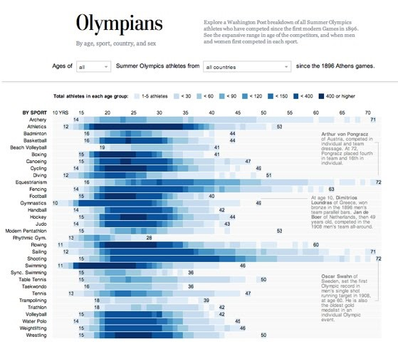

```{r setup, include=FALSE}
knitr::opts_chunk$set(out.width="100%", fig.align="center")
```

## Original Graph

The graph titled "Olympians" was published in 2012 by The Washington Post as part of an interactive feature exploring the history of Summer Olympic athletes since the first modern Games in 1896. The visualization aims to break down athlete participation by sport and age group, offering a comprehensive view of how athlete demographics vary across different disciplines, highlighting patterns and outliers in Olympic history.

The visualization organizes sports along the vertical axis, ranging from Archery to Wrestling, while the horizontal axis represents age groups, starting from 10–15 years and increasing gradually. The color gradient is used to indicate the density of athletes within each age group for a specific sport: darker blue shades represent higher participation, while lighter shades indicate smaller numbers. 


```{r, fig.width=4, fig.height=6, out.width="100%", fig.cap="Original Graph", out.extra="class=external"}
#| echo: false


```

One of the most notable strengths of the graph is its ability to present a large amount of information in a  really compact space, as we can observe up to 32 sports in this relatively small plot. It also gives us a clear and comprehensive view of how age range varies across different disciplines, making it an excellent tool for spotting patterns at a glance. For example, we can quickly identify that sports like Gymnastics and Swimming are dominated by younger athletes, with the majority falling into the 10–20 age range, while sports like Equestrian and Shooting feature older competitors, often in their 40s or beyond.

While the graph effectively captures the overall age range of athletes across different sports, it presents several limitations. For instance, the visualization does not include key statistical measures, such as means or medians, which would provide a clearer understanding of central tendencies within each discipline. Moreover, identifying where the majority of athletes are clustered is not straightforward. This issue is particularly evident in sports with smaller datasets, such as taekwondo, triathlon, and rhythmic gymnastics, and even in sports with larger datasets, trends are difficult to discern, reducing the graph's ability to highlight meaningful patterns.


## Graph Replication

### Downloading libraries

The first step in replicating the graphic was to load the required libraries. These libraries provide essential tools for our data manipulation and visualization.

```{r}
library(tidyverse)
library(ggplot2)
library(dplyr)
library(gplots)
library(ggtext)
library(ggdist)
library(glue)
library(patchwork)
library(paletteer)
library(showtext)
library(extrafont)
```


### Cleaning data

The original dataset, sourced from Kaggle, contains a wealth of detailed information about Olympic athletes, including their names, sports, birth years, ages, genders, nationalities, weights, and heights among others. This extensive dataset encompasses all athletes who have competed in the Olympic Games from 1896 to 2016. For the replication, we began by uploading the dataset, removing unnecessary columns and handling missing values from the main variable:

```{r}
olympics3 <- read_csv("athlete_events1.csv")
```


```{r}
data <- olympics3 |> 
  select(Age, Sport) |> 
  drop_na(Age)

```

Once the dataset was loaded, we observed that it contained a significantly larger number of sports than those present in the original graph. To address this, we applied a filter using the filter function from the tidyverse package, ensuring that only the sports featured in the original graph were retained in the dataset.

```{r}
data_filtered <- data |> 
  filter(Sport=="Archery" | Sport=="Athletics" | Sport=="Badminton" | Sport=="Basketball" |
           Sport=="Beach Volleyball"| Sport=="Boxing"|Sport=="Canooing"|
           Sport=="Cycling"|Sport=="Diving"|Sport=="Equestrianism"|
           Sport=="Fencing"|Sport=="Football"|Sport=="Artistic Gymnsatics"|
           Sport=="Handball"|Sport=="Hockey"|Sport=="Judo"|
           Sport=="Modern Pentathlon"|Sport=="Rhythmic Gymnastics"|Sport=="Rowing"|
           Sport=="Sailing"|Sport=="Shooting"|Sport=="Swimming"|
           Sport=="Table Tenis"|Sport=="Taekwondo"|Sport=="Tennis"|Sport=="Trampoling"|
           Sport=="Triathlon"|Sport=="Volleyball"|Sport=="Water Polo"|Sport=="Weightlifting"|
           Sport=="Wrestling"|Sport=="Table Tennis"|Sport=="Canoeing"|Sport=="Volleyball"|
           Sport=="Gymnastics"|Sport=="Synchronized Swimming"| Sport=="Trampolining")
```

To analyze the distribution of athletes by age and sport, we first needed to count how many athletes of each age participated in each sport. To do this, we used the count() function, which allowed us to create a dataset showing the count of athletes of a specific age in each sport. After obtaining these counts, we then categorized the data. This was accomplished using the case_when() function, which allowed us to group the results into the same categories as those in the original visualization.

```{r}
data_counts <- data_filtered |> 
  count(Sport, Age) |>         
  rename(Count = n) 

data_counts <- data_counts %>%
  mutate(grouped_count = case_when((Count>=1) & (Count<5) ~ "1-5",
         (Count>=5) & (Count<30) ~ "<30",
         (Count>=30) & (Count<60) ~ "<60",
         (Count>=60) & (Count<90) ~ "<90",
         (Count>=90) & (Count<120) ~ "<120", 
         (Count>=120) & (Count<150) ~ "<150",
         (Count>=150) & (Count<400) ~ "<400",
         (Count>=400) ~ "400 or higher"))

data_counts$Age <- as.numeric (data_counts$Age)
```

Next, we renamed the sports to match the terminology used in the original graph, as "Rhythmic Gymnastics" and "Synchronized Swimming" were written differently. Following this, we ordered the sports alphabetically, from A to Z, in accordance with the structure of the original graph.

```{r}
#Rythmic gymnastics into Rythimc Gym.

data_counts <- data_counts |> 
  mutate(Sport = ifelse(Sport == "Rhythmic Gymnastics", "Rhythmic Gym.", Sport))

# Synchronized Swimming into Sync. Swimming

data_counts <- data_counts |> 
  mutate(Sport = ifelse(Sport == "Synchronized Swimming", "Sync. Swimming", Sport))

#Ordering sports alphabetically

data_counts <- data_counts |> 
  arrange(Sport) |> 
  mutate(Sport = factor(Sport, levels = rev(sort(unique(Sport)))))
```

Finally, we create a new table using summarise to calculate the minimum and maximum ages for each sport in order to be able to add this information more easily to the graph later. Afterward, we merged this table with the original one using left_join.

```{r}
age_extremes <- data_counts |> 
  group_by(Sport) |> 
  summarise(min_age = min(Age, na.rm = TRUE), 
            max_age = max(Age, na.rm = TRUE)) |> 
  ungroup() 

data_counts <- data_counts |> 
  left_join(age_extremes, by = "Sport")

```

### Building the Graph

Once the dataset was cleaned and prepared, we moved on to the process of replicating the graph. To ensure the final output closely resembled the original, we began by downloading the necessary resources, particularly the fonts used in the visualization.

#### Fonts

In order to replicate the font styles of the original graph, we focused on matching all the fonts displayed, which we identified through The Washington Post's design system page. This resource provides details on the fonts they use, including their size, weight, and height specifications for articles: https://build.washingtonpost.com/foundations/typography. 

We were able to recover all the required fonts, except for the title font, Postoni, which is a paid font. As an alternative, we chose Playfair Display, a similar font.

To implement these fonts in the graph, we used the showtext package, which allows for text rendering using fonts downloaded from Google Fonts, such as Libre Franklin, the font selected for annotations. We used Playfair Display for the title, subtitle, and caption, while Roboto was chosen for the numbers indicating the maximum and minimum ages of athletes in each sport.

```{r}

font_add_google("Libre Franklin", "franklin")
showtext_auto() 
font_add_google("Roboto", "roboto")      
font_add_google("Playfair Display", "playfair")

```

#### Theme

I believe that the most important and complex part of creating the graph was defining the theme. This particular graph is highly intricate, containing numerous elements and details that must be precisely arranged. As a result, I had to carefully adjust not only the annotations but also the axis titles, legend titles, legend colors, spacing between the elements, text sizes, and more. Once the theme was successfully applied, it immediately brought the graph closer to its final design, demonstrating just how crucial the theme is in shaping its overall aesthetic and coherence. This is why the graph appears so similar to the original from the very beginning, as in this final version the theme is applied since the first steps.

Some of the functions that help achieve this level of precision include starting with theme_minimal(base_size = 7) to establish a minimalist base with small text. The primary and secondary grids are removed using element_blank(), and panel.background sets a light gray background (gray97) with no borders (color = NA). The axis texts are customized in black, with adjusted sizes and very specific margins to replicate the original design. The legend is configured with legend.position to place it at the top of the graph, and legend.justification to fine-tune its exact position. The legend texts are personalized using legend.title and legend.text, with small sizes and precise margins. Additionally, legend.key.size reduces the size of the legend keys to 0.1 cm, creating a more compact design. 

Proportions also played a crucial role in accurately representing this graph. For every version of the graph, the specification {r, fig.width=4, fig.height=6, out.width="100%"} was added to each chunk, ensuring consistent sizing across all iterations. Additionally, coord_fixed(ratio=1.5) was used to adjust the aspect ratio between the X and Y axes. This ratio means that 1 unit on the Y-axis corresponds to 1.5 units on the X-axis, resulting in a Y-axis that appears more elongated and less compact than the X-axis. This adjustments were crucial for achieving the correct visual proportions and ensuring that the graph closely aligned with the original design.


```{r}

theme <- theme_minimal(base_size = 7) +
  theme(
    panel.grid.major = element_blank(),
    panel.grid.minor = element_blank(),
    panel.background = element_rect(fill = "gray97", color = NA),
    axis.text.x = element_text(color = "black", angle = 0, hjust = 0.7, size = 7),
    axis.text.y = element_text(color = "black", size = 7.3, margin = margin(r = 3)),
    plot.title = element_text(family = "playfair", size = 25, face = "bold", hjust = 0.05, vjust = 0, color = "black"),
    plot.subtitle = element_text(family = "roboto", size = 8, face = "bold", color = "gray60", hjust = 0.05, vjust = -5, margin = margin(b = 15)),
    plot.caption = element_text(
      family = "playfair", size = 7.5, hjust = 0, vjust = 285, margin = margin(t = 0, l= 100), color = "gray60", lineheight = 0.5
    ),
    legend.position = "top",
    legend.justification = c(0,1.2),
    legend.title = element_text(size = 7.5, face = "bold"),
    legend.text = element_text(size = 7, margin = margin(l = 1, r = 0)),
    plot.caption.position = "panel",
    legend.key.size = unit(0.1, "cm"),
    axis.title.x = element_blank(),
    axis.title.y = element_text(
      size = 6.5,
      angle = 0,
      hjust = -24,
      vjust = 1.035,
      face = "bold"),
    plot.margin = margin(t = 20, r = 20, b = 20, l = 0))


```

#### Graph

Once the theme was defined, we proceeded to create the base of the graph using the geom_tile function, which generates a mosaic plot. The aes(x = Age, y = Sport, fill = grouped_count) function maps ages to the X-axis, sports to the Y-axis, and the group size to the color of the tiles.  To refine the color palette, we applied the scale_fill_manual function, carefully selecting the colors using the online tool imagecolorpicker.com.

The limits argument ensures that the legend displays the categories in a specific order, from "1-5" to "400 or higher", while the labels argument customizes the labels in the legend to clearly describe the range of athletes in each group. Additionally, we set a clear title for the legend using the name parameter and arranged the legend in a single row with guide_legend(nrow = 1).

```{r}
p <- ggplot(data_counts, aes(x = Age, y = Sport, fill = grouped_count)) + 
  geom_tile(size = 0) +
  scale_fill_manual(
    values = c(
      "1-5" = "#ddeaf9",
      "<30" = "#c4dbf1",
      "<60" = "#9fcae2",
      "<90" = "#6cadd4",
      "<120" = "#4193c3",
      "<150" = "#2372b5",
      "<400" = "#08519d",
      "400 or higher" = "#083069"
    ), 
    labels = c(
      "1-5" = "1-5 athletes",
      "<30" = "<30",
      "<60" = "<60",
      "<90" = "<90",
      "<120" = "<120",
      "<150" = "<150",
      "<400" = "<400",
      "400 or higher" = "400 or higher"
    ),
    limits = c("1-5", "<30", "<60", "<90", "<120", "<150", "<400", "400 or higher"),
    name = "Total athletes in each age group:",
    guide = guide_legend(nrow = 1)
  ) + theme +
  coord_fixed(ratio = 1.5)

p

```

Next, we customized the graph's axes. For the X-axis, we used scale_x_continuous to position it at the top of the graph. This function also defines a range between 10 and 73, sets tick marks at intervals of 5, and customizes the labels to display "10YRS" only for the value 10, while showing the other values as standard numbers. For the Y-axis, we applied scale_y_discrete to remove unnecessary space before and after the categories (using expand = c(0, 0)), ensuring that the graph elements fit directly within the drawing area. After adjusting the axes, we added the title, subtitle, and caption (which will appear as the description in the top-right corner of the graph) using the labs function.

```{r, fig.width=4, fig.height=3.7}
p <- p + 
  scale_x_continuous(
    position = "top",
    limits = c(10, 73),
    breaks = seq(10, 70, by = 5),
    labels = function(x) ifelse(x == 10, "10YRS", as.character(x))
  ) +
  scale_y_discrete(expand = c(0, 0)) +
  labs(
    title = "Olympians",
    subtitle = "By age, sport, country, and sex",
    y = "BY SPORT",
    caption = "Explore a Washington Post breakdown of all Summer Olympics\n athletes who have competed since the first modern Games in 1896.\n See the expansive rang in age of the competitors, and when men\n and women first competed in each sport."
    )  
  

p
```
In the next step, we used the geom_hline() function to add a white line to the graph, separating the sport categories. We position the line just below each category by converting the values of the Sport variable to numeric format and adjusting them by 0.5. 

```{r, fig.width=4, fig.height=3.7}

p <- p +
  geom_hline(
    aes(yintercept = as.numeric(Sport) - 0.5),
    color = "white",
    size = 0.3
  )

p
```
Next, we added the maximum and minimum age for each sport by using the variables max_age and min_age, which we created earlier. These values are then displayed on the graph using geom_text(), positioning the text labels accordingly.

```{r, fig.width=4, fig.height=3.7}

p <- p + geom_text(
    aes(x = min_age, y = Sport, label = min_age),
    size = 2.5,
    hjust = 1.1,
    color = "gray40",
    family = "roboto"
  ) +
  geom_text(
    aes(x = max_age, y = Sport, label = max_age),
    size = 2.5,
    hjust = -0.1,
    color = "gray40",
    family = "roboto")

p
```

Finally, we add the annotations and the lines that connect the data points to these annotations. To create the L-shaped arrows, we combine two geom_segment() functions, one vertical and one horizontal, and position them on the plot to form this shape. Next, we add the three annotations visible in the graph using annotate(), specifying the exact location within the plot, as well as the size, color, font, and line spacing (with lineheight).

```{r, fig.width=4, fig.height=3.7, preview=TRUE}

p <- p + 
  geom_segment(
    aes(x = 72.5, xend = 73, y = 29 , yend = 29),  
    color = "gray60", size = 0.04
  ) +
  geom_segment(
    aes(x = 73, xend = 73, y = 24, yend = 29),  
    color = "gray60", size = 0.04
  ) +
annotate(
  "text",
  x = 62, y = 28,
  label = "Arthur von Pongracz\nof Austria, competed in\nindividual and team\ndressage. At 72\nPongracz placed fourth\nin team and 16th in\nindividual.",
  hjust = 0,
  size = 2.1,
  color = "gray30", 
  family = "franklin",
  lineheight = 0.5) +
  geom_segment(
    aes(x = 50, xend = 59, y = 20.5, yend = 20.5),
    color = "gray60", size = 0.04
  ) +
  annotate(
    "text",
    x = 60, y = 18.5, 
    label = "At age 10, Dimitrios \nLoundras of Greece, won\nbronze in the 1896 men's\nteam parallel bars. Jan de\nBoer of Netherlands, then 49\nyears old, competed in the\n1908 men's team all-around.",
    hjust = 0,
    size = 2.1,
    color = "gray30",
    family = "franklin",
    lineheight = 0.5) +
  geom_segment(
    aes(x = 72.5, xend = 73, y = 6, yend = 6),  
    color = "gray60", size = 0.04
  ) +
  geom_segment(
    aes(x = 73, xend = 73, y = 6, yend = 11),  
    color = "gray60", size = 0.04
  ) +
  annotate(
    "text",
    x = 62, y = 6,  
    label = "Oscar Swahn of\nSweden, set the first\nOlympic record in\nmen's single shot\nrunning target in 1908,\nat age 60. He is also\nthe oldest gold\nmedalist in an\nindividual Olympic\nevent.",
    hjust = 0,
    size = 2.1,
    color = "gray30",
    family = "franklin",
    lineheight = 0.5
  ) 

p
```
With all adjustments and customizations in place, we now have the final version of the replicated graph, which closely mirrors the original in both design and structure. While this concludes the replication process, the next step will involve creating an alternative graph that enhances the original design and offers new insights.

## Alternative Graph

Building on the replication, the alternative version was developed to address some of the limitations of the original visualization. This new graph aims to provide a more detailed and accurate representation of the data by including important statistical measures, such as the mean and median, and enhancing the depiction of distributions. To achieve this, we decided to create a ridgeline plot with an additional inner plot as a legend to improve interpretability and clarity.

We began by cleaning the data once again, with some adjustments to the order of sports based on more meaningful criteria. We decided to arrange the sports according to the median age of athletes in each sport. This approach allowed us to clearly identify which sports accommodate a broader range of ages and which are more concentrated with younger athletes. To achieve this, we used the reorder() function, specifying FUN = median to sort the sports by median age, and -Age to ensure they were ordered from the youngest to the oldest.

```{r, fig.asp= 1.5, fig.height=13}

olympics3 <- read_csv("athlete_events1.csv")

olympics <- olympics3 |> 
  select(Age, Sport) |> 
  drop_na(Age, Sport)

olympics <- olympics |> 
  filter(Sport=="Archery" | Sport=="Athletics" | Sport=="Badminton" | Sport=="Basketball" |
           Sport=="Beach Volleyball"| Sport=="Boxing"|Sport=="Canooing"|
           Sport=="Cycling"|Sport=="Diving"|Sport=="Equestrianism"|
           Sport=="Fencing"|Sport=="Football"|Sport=="Artistic Gymnsatics"|
           Sport=="Handball"|Sport=="Hockey"|Sport=="Judo"|
           Sport=="Modern Pentathlon"|Sport=="Rhythmic Gymnastics"|Sport=="Rowing"|
           Sport=="Sailing"|Sport=="Shooting"|Sport=="Swimming"|
           Sport=="Table Tenis"|Sport=="Taekwondo"|Sport=="Tennis"|Sport=="Trampoling"|
           Sport=="Triathlon"|Sport=="Volleyball"|Sport=="Water Polo"|Sport=="Weightlifting"|
           Sport=="Wrestling"|Sport=="Table Tennis"|Sport=="Canoeing"|Sport=="Volleyball"|
           Sport=="Gymnastics"|Sport=="Synchronized Swimming"| Sport=="Trampolining")

olympics$Age <- as.numeric (olympics$Age)

#Rythmic gymnastics into Rythimc Gym.

olympics <- olympics|> 
  mutate(Sport = ifelse(Sport == "Rhythmic Gymnastics", "Rhythmic Gym.", Sport))

# Synchronized Swimming into Sync. Swimming

olympics <- olympics |> 
  mutate(Sport = ifelse(Sport == "Synchronized Swimming", "Sync. Swimming", Sport))

#To order the y axes by the median

olympics <- olympics |> 
  mutate(Sport = reorder(Sport, -Age, FUN = median, na.rm = TRUE))

```


Next, and continuing with the data preparation for the alternative graph, we generated additional variables that will be useful for creating the graph. To identify outliers, we calculated the IQR for each sport to determine the lower and upper boundaries. We then filtered out any values falling outside these limits and merged this information back into the main dataset. This step will be useful when overlaying the outliers on the main plot using geom_point(). Additionally, we calculated and stored the median age for each sport within the dataset, which allowed us to add a dashed line to the plot, facilitating easier comparisons between sports.

```{r}

#Calculate the outliers
outliers <- olympics |> 
  group_by(Sport) |> 
  summarise(
    Q1 = quantile(Age, 0.25, na.rm = TRUE),
    Q3 = quantile(Age, 0.75, na.rm = TRUE),
    IQR = Q3 - Q1
  ) |> 
  mutate(
    lower_limit = Q1 - 3 * IQR,
    upper_limit = Q3 + 3 * IQR
  ) |> 
  select(Sport, lower_limit, upper_limit)

# Join the outliers to the dataset
olympics_outliers <- olympics |> 
  left_join(outliers, by = "Sport") |> 
  mutate(is_outlier = Age < lower_limit | Age > upper_limit) |> 
  filter(is_outlier)  

#Create the median age

median_age <- median(olympics3$Age, na.rm = TRUE)

```

After reprocessing the data, we moved on to creating the graph, starting with the base without the legend. To achieve this, we designed a ridgeline plot using stat_halfeye() and stat_interval() from the ggdist package, which provided a clear view of the distribution of ages across sports. The median age was marked with stat_summary(), and the average age was indicated through an annotation. Additionally, we added a dashed line to mark the median age and used geom_point() to highlight the outliers with the new variables created earlier. Customizations like flipping the coordinates, adjusting axis breaks, and using a similar color scheme as the original graphic helped refine the presentation, making it visually appealing and easy to interpret.

```{r, fig.width = 9, fig.height= 22}
  
p <- ggplot(olympics, aes(Sport, Age)) +
  stat_halfeye(fill_type = "segments", alpha = 0.8, scale = 0.9) +
  stat_interval() +
  stat_summary(geom = "point", fun = median, color = "black", size = 3) +
  annotate("text", x = 33, y = 0, label = "(\U00F8 age)",
           family = "franklin", size = 6.5, hjust = 0.5) +
  stat_summary(
    aes(y = Age),
    geom = "text",
    fun.data = function(x) {
      data.frame(
        y = 0,
        label = sprintf("(%s)", scales::number(mean(ifelse(x > 0, x, NA), na.rm = TRUE), accuracy = 0.1)))},
    family = "franklin", size = 6
  ) +
  geom_hline(yintercept = median_age, col = "black", lty = "dashed") +
  annotate("text", x = 33.3, y = 25, label = "Median age",
           family = "franklin", size = 8, hjust = 0) +
  geom_point(data = olympics_outliers, aes(x = Sport, y = Age),
             size = 1, shape = 19) + 
  scale_y_continuous(breaks = seq(10, 70, by = 10)) +
  scale_x_discrete(expand = c(0, 0)) +
  scale_color_manual(values = c("#e7e5cc", "#9fcae2", "#08519d")) +
  coord_flip(ylim = c(0, 80), xlim = c(0, 33.5), expand = TRUE) +
  guides(col = "none") +
  labs(
    title = "OLYMPICS",
    subtitle = "by age and sport",
    x = NULL,
    y = NULL) +
  theme_minimal() +
  theme(
    panel.grid = element_blank(),
    panel.grid.major.x = element_line(linewidth = 0.1, color = "grey75"),
    plot.title = element_text(family = "Georgia", size = 45, margin = margin (b = 5)),
    plot.title.position = "plot",
    plot.subtitle = element_textbox_simple(size = 40, family = "Georgia", color = "gray40", margin = margin (b = 20)),
    plot.caption.position = "plot",
    axis.text.y = element_text(hjust = 1, family = "franklin", size = 25, color = "black", face = "bold"),
    axis.text.x = element_text(size = 25, family = "franklin", margin = margin(r = 0), color = "black"),
    plot.margin = margin(4, 17, 4, 4))

p

```

To create the legend, we constructed a separate plot focused on a specific sport—volleyball in this case. In this plot, we used annotate() to label specific age ranges, such as the 50%, 80%, and 95% percentiles of ages, as well as to highlight the median and overall age distribution. To make the annotations more intuitive and visually connected to the relevant features on the plot, we employed geom_curve(), which draws curved arrows pointing directly to each annotation.

```{r}
df_for_legend <- olympics |>  
  filter(Sport == "Volleyball") 

p_legend <- df_for_legend |>  
  ggplot(aes(Sport, Age)) +
  stat_halfeye(fill_type = "segments", alpha = 0.8, scale = 0.6) +  
  stat_interval() +
  stat_summary(geom = "point", fun = median, size = 3) +
  annotate(
    "text",
    x = c(0.65, 0.65, 0.65, 1.34, 1.6),
    y = c(21 , 29, 36, 27, 33),
    label = c("50% of ages\nfall within this range", "80% of ages", 
              "95% of ages", "Median", "Distribution\n of ages"),
    fill = NA, family = "Arial", size = 5.8, vjust = 1, lineheight = 0.5  
  ) +
  geom_curve(
    data = data.frame(
      x = c(0.7, 0.7, 0.7, 1.225, 1.4),
      xend = c(0.98, 0.98, 0.98, 1.02, 1.5),
      y = c(24, 30, 33, 26, 28),
      yend = c(24, 30, 33, 25, 30)),
    aes(x = x, xend = xend, y = y, yend = yend),
    stat = "unique", curvature = 0.2, size = 0.6, color = "grey12",
    arrow = arrow(angle = 20, length = unit(1, "mm"))
  ) +
  scale_color_manual(values = c("#e7e5cc", "#9fcae2", "#08519d")) +
  coord_flip(expand = TRUE) +
  guides(color = "none") +
    theme_void() +
  theme(plot.background = element_rect(color = "black", fill = "grey95"),
        plot.margin = margin(t = -0.5, r = 0, b = 0, l = 0, unit = "cm"))

p_legend
```

Finally, we combined the original plot with the plot legend by using inset_element():

```{r, fig.width = 9, fig.height= 22}
p + 
  inset_element(p_legend, 
                left = 0.58, 
                right = 1, 
                top = 0.95, 
                bottom = 0.85)
```

This alternative graph provides a more detailed and clearer view of where most athletes are concentrated, thanks to the enhanced distribution representation.  By highlighting key statistical measures, such as the mean and median, and comparing them to the overall mean across all Olympic disciplines, it provides a deeper understanding of how each sport deviates from the general trend. 

In conclusion, this article has walked through the process of replicating and then improving an Olympic athletes’ age distribution graph. This exercise highlights not only the importance of thoughtful data visualization but also the intrinsic complexity of the process. What might seem like a simple graph often requires significant effort to align every element precisely as intended. This process also demonstrates how iterative improvements not only refine the visual representation but can greatly enhance both interpretability and usefulness.
