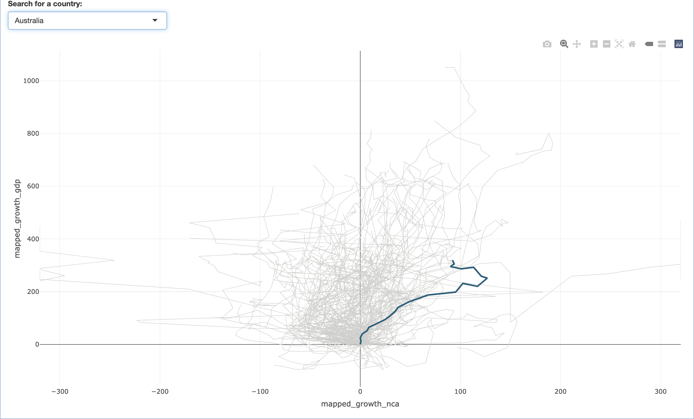
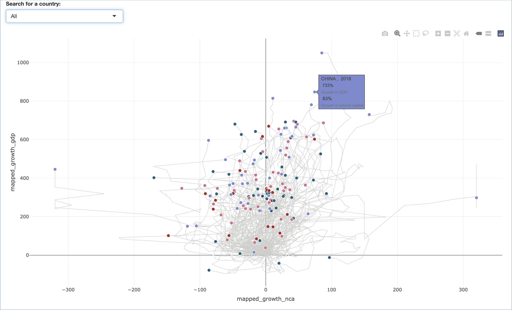
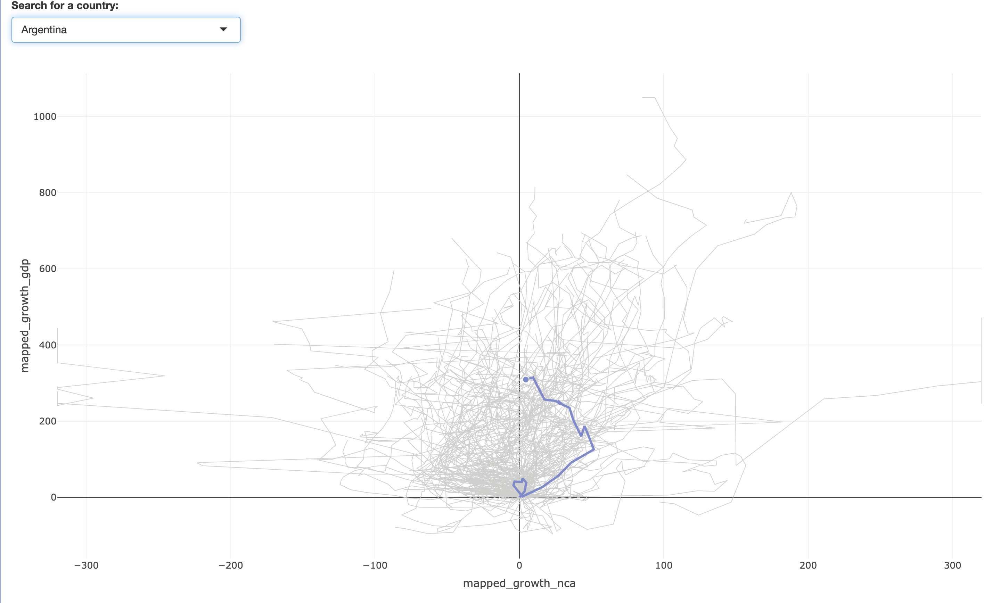
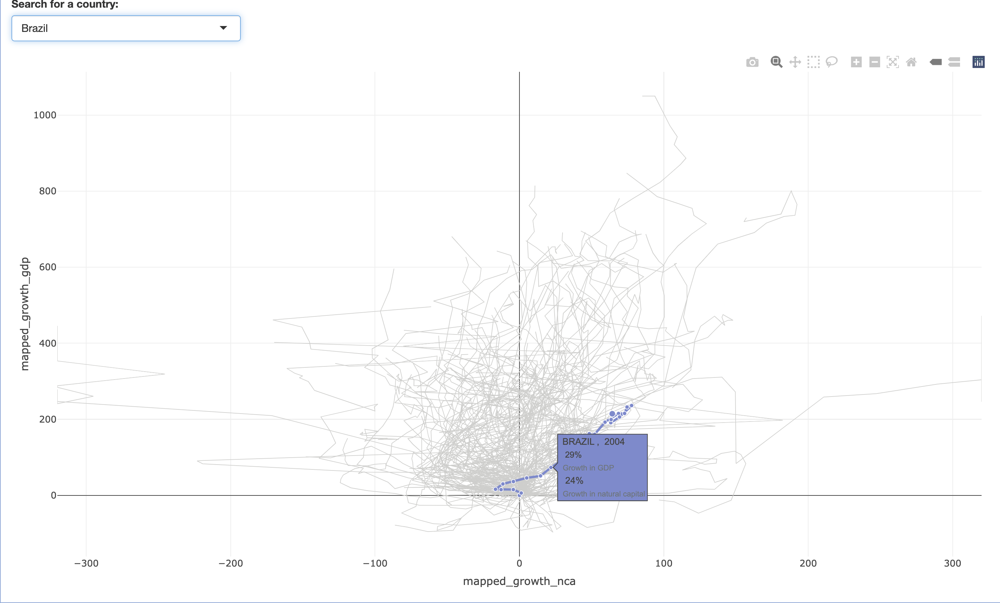
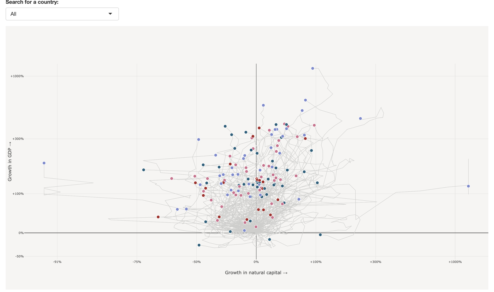
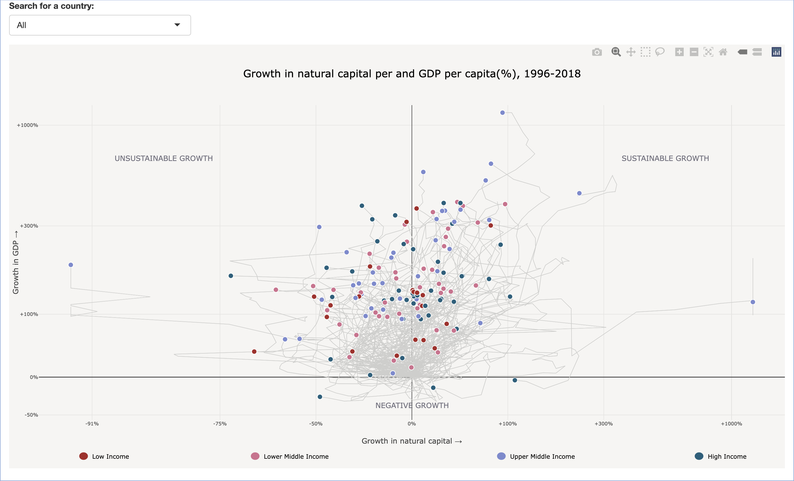
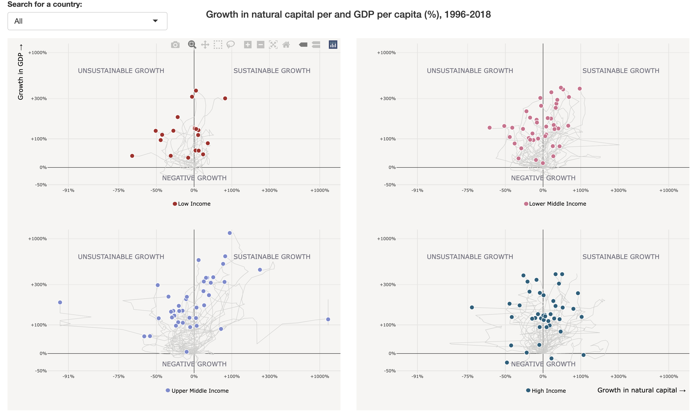

```{r setup, include=FALSE}
knitr::opts_chunk$set(echo = TRUE, fig.showtext = TRUE, 
                      fig.dpi = 150)
```

## Introduction
### Background
Sustainable development refers to maintaining economic growth and living standards without depleting natural resources or harming the environment, such as through pollution or poor waste management. The World Bank’s Sustainable Development Goal 12.2 aims to achieve sustainable management and efficient use of natural resources by 2030.

Countries that rely heavily on non-renewable resources, such as oil, natural gas, and coal, for income often struggle to achieve long-term sustainability, as their economies face challenges once these resources are depleted. In contrast, nations that utilize renewable resources, such as sustainable forestry and fisheries, along with clean energy sources like wind and solar power, are more likely to sustain growth and environmental balance.

One way to assess economic sustainability is by examining whether a country’s Gross Domestic Product (GDP) depends on natural resource consumption. So, have countries truly moved toward sustainable development over the past few decades?

### Original graph 
](images/world_bank1.png){.external width="100%"}

I chose this chart because it comes from the World Bank's Sustainable Development Goal (SDG) 12 report—"Responsible Consumption and Production"—which visually illustrates the relationship between economic growth and changes in natural capital across countries from 1996 to 2018. The x-axis represents growth in natural capital (%), while the y-axis represents growth in GDP (%).

The chart highlights three main areas. The unsustainable growth zone in the upper left shows countries with high GDP growth but a decline in natural capital, indicating reliance on resource consumption. The sustainable growth zone in the upper right represents countries where both GDP and natural capital grow, reflecting sustainable development. Finally, the negative growth zone below the x-axis highlights countries experiencing a decline in GDP, regardless of changes in natural capital.

Using colors to distinguish income levels, the chart provides a clear and comparative view of global sustainability trends. It serves as a valuable reference for assessing whether countries are moving toward sustainable development.

](images/world_bank2.png){.external width="100%"}

In fact, this is a dynamic interactive chart. When the mouse hovers over a country's 2018 data point, the entire path for that country is highlighted, showcasing its performance across different years. Other data points for the country also appear along the path. For example, as shown in the chart, hovering over Vietnam's 2018 data point reveals a GDP growth rate of 452% and a natural capital growth rate of 97%. Additionally, users can move the mouse to any data point along the path to view specific indicators for that year in real time, providing valuable insights into the relationship between economic and environmental development.

## Working with Datasets
### Libraries and dataset
```{r}
library(dplyr)
library(plotly)
library(tibble)
library(tidyverse)
library(ggplot2)
library(readr)
library(shiny)
```
In this project, I first loaded the following R packages using library() to support data processing and visualization tasks.

It is worth noting that the interactive charts in this project primarily rely on tools such as Shiny and Plotly to achieve dynamic effects. However, since this project is presented in R Markdown format, the interactive features cannot be directly displayed in a static document. Therefore, I will provide relevant links in later presentations to allow further exploration and interaction with the dynamic visualizations.

```{r}
goal_12 <- read_delim(file = "goal12.cwon.csv", delim = ";", col_names = TRUE)
head(goal_12)
```
Next, I imported the required data. I assigned the data to the variable goal_12 and loaded it from the specified file. I used a semicolon to split the data into columns, with the first row being used as column names. Finally, I stored the data in tibble format for easier handling.

### Merging dataset with income levels
```{r}
income_level <- tibble(
  countryname = c(
    "Albania", "United Arab Emirates", "Argentina",
    "Armenia", "Australia", "Austria",
    "Azerbaijan", "Burundi", "Belgium",
    "Benin", "Burkina Faso", "Bangladesh",
    "Bulgaria", "Bahrain", "Bosnia and Herzegovina",
    "Belarus", "Belize", "Bolivia",
    "Brazil", "Botswana", "Central African Republic",
    "Canada", "Switzerland", "Chile",
    "China", "Côte d'Ivoire", "Cameroon",
    "Dem. Rep. Congo", "Congo", "Colombia",
    "Comoros", "Costa Rica", "Czech Republic",
    "Germany", "Djibouti", "Denmark",
    "Dominican Republic", "Ecuador", "Egypt",
    "Spain", "Estonia", "Ethiopia",
    "Finland", "France", "Gabon",
    "United Kingdom", "Georgia", "Ghana",
    "Guinea", "The Gambia", "Greece",
    "Guatemala", "Guyana", "High income",
    "Honduras", "Croatia", "Haiti",
    "Hungary", "Indonesia", "India",
    "Ireland", "Iran", "Iraq",
    "Iceland", "Italy", "Jamaica",
    "Jordan", "Japan", "Kazakhstan",
    "Kenya", "Kyrgyz Republic", "Cambodia",
    "Korea", "Kuwait", "Lao PDR",
    "Lebanon", "Liberia", "Low income",
    "Sri Lanka", "Lower middle income", "Lesotho",
    "Lithuania", "Luxembourg", "Latvia",
    "Morocco", "Moldova", "Madagascar",
    "Maldives", "Mexico", "North Macedonia",
    "Mali", "Malta", "Mongolia",
    "Mozambique", "Mauritania", "Mauritius",
    "Malawi", "Malaysia", "Namibia",
    "Niger", "Nigeria", "Nicaragua",
    "Netherlands", "Norway", "Nepal",
    "Oman", "Pakistan", "Panama",
    "Peru", "Philippines", "Papua New Guinea",
    "Poland", "Portugal", "Paraguay",
    "West Bank and Gaza", "Qatar", "Romania",
    "Russia", "Rwanda", "Saudi Arabia",
    "Senegal", "Singapore", "Solomon Islands",
    "Sierra Leone", "El Salvador", "Suriname",
    "Slovak Republic", "Slovenia", "Sweden",
    "Eswatini", "Chad", "Togo",
    "Thailand", "Tajikistan", "Turkmenistan",
    "Trinidad and Tobago", "Tunisia", "Turkey",
    "Tanzania", "Uganda", "Ukraine",
    "Upper middle income", "Uruguay", "United States",
    "Venezuela", "Vietnam", "Yemen",
    "South Africa", "Zambia", "Zimbabwe"),
  income_level = c(
    "Upper Middle Income", "High Income", "Upper Middle Income",
    "Upper Middle Income", "High Income", "High Income",
    "Upper Middle Income", "Low Income", "High Income",
    "Low Income", "Low Income", "Lower Middle Income",
    "Upper Middle Income", "High Income", "Upper Middle Income",
    "Upper Middle Income", "Upper Middle Income", "Lower Middle Income",
    "Upper Middle Income", "Upper Middle Income", "Low Income",
    "High Income", "High Income", "Upper Middle Income",
    "Upper Middle Income", "Lower Middle Income", "Lower Middle Income",
    "Low Income", "Lower Middle Income", "Upper Middle Income",
    "Lower Middle Income", "Upper Middle Income", "High Income",
    "High Income", "Lower Middle Income", "High Income",
    "Upper Middle Income", "Upper Middle Income", "Lower Middle Income",
    "High Income", "High Income", "Low Income",
    "High Income", "High Income", "Upper Middle Income",
    "High Income", "Upper Middle Income", "Lower Middle Income",
    "Low Income", "Low Income", "High Income",
    "Upper Middle Income", "Upper Middle Income", "High Income",
    "Lower Middle Income", "High Income", "Lower Middle Income",
    "High Income", "Lower Middle Income", "Lower Middle Income",
    "High Income", "Lower Middle Income", "Upper Middle Income",
    "High Income", "High Income", "Upper Middle Income",
    "Upper Middle Income", "High Income", "Upper Middle Income",
    "Lower Middle Income", "Lower Middle Income", "Lower Middle Income",
    "High Income", "High Income", "Lower Middle Income",
    "Lower Middle Income", "Low Income", "Low Income",
    "Lower Middle Income", "Lower Middle Income", "Lower Middle Income",
    "High Income", "High Income", "High Income",
    "Lower Middle Income", "Upper Middle Income", "Low Income",
    "Upper Middle Income", "Upper Middle Income", "Upper Middle Income",
    "Low Income", "High Income", "Lower Middle Income",
    "Low Income", "Lower Middle Income", "Upper Middle Income",
    "Low Income", "Upper Middle Income", "Upper Middle Income",
    "Low Income", "Lower Middle Income", "Lower Middle Income",
    "High Income", "High Income", "Lower Middle Income",
    "High Income", "Lower Middle Income", "High Income",
    "Upper Middle Income", "Lower Middle Income", "Lower Middle Income",
    "High Income", "High Income", "Upper Middle Income",
    "Lower Middle Income", "High Income", "High Income",
    "Upper Middle Income", "Low Income", "High Income",
    "Lower Middle Income", "High Income", "Lower Middle Income",
    "Low Income", "Lower Middle Income", "Upper Middle Income",
    "High Income", "High Income", "High Income",
    "Lower Middle Income", "Low Income", "Low Income",
    "Upper Middle Income", "Lower Middle Income", "Upper Middle Income",
    "High Income", "Lower Middle Income", "Upper Middle Income",
    "Lower Middle Income", "Low Income", "Lower Middle Income",
    "Upper Middle Income", "High Income", "High Income",
    "Lower Middle Income", "Lower Middle Income", "Low Income",
    "Upper Middle Income", "Low Income", "Lower Middle Income"
  ))
income_level
```
In the original data, I noticed that there was no column representing the income level of each country. However, income level is crucial for my project as it will be used to categorize data points, highlight paths, and more. Therefore, I manually created a new dataset named income_level, which includes the columns "countryname" and "income_level", with each country's income level corresponding accordingly.

```{r}
goal_12 <- goal_12 |>
  left_join(income_level, by = "countryname")
head(goal_12) |> 
  select(countryname, income_level, everything())
```
After labeling the corresponding income level for each country, I used left_join() to merge the original dataset with the income_level dataset. As a result, the goal_12 dataframe now contains all the original columns, and for each row, it adds the corresponding income_level column based on the countryname.

### Mapping data points 
```{r}
new_breaks_x <- c(-91, -75, -50, 0, 100, 300, 1000)
new_mapped_x <- c(-300, -180, -90, 0, 90, 180, 300)
```
In the mapping process, I created two vectors for x-axis: new_breaks_x and new_mapped_x, which are used to segment the original data into specific intervals and map these intervals to a new range. The reason for doing this is that when using the original data for visualization, we found that the chart display wasn't ideal, likely because the range of the data was either too large or too small, causing some data points to appear very crowded or unclear in the chart. Specifically, new_breaks_x defines the segmentation points of the original data, which are divided into different intervals based on the characteristics of the data, while new_mapped_x is the new range we want to map these intervals to.

```{r}
custom_map_x <- function(value) {
  if (value < min(new_breaks_x)) {
    mapped <- new_mapped_x[1] - 20
  } else if (value > max(new_breaks_x)) {
    mapped <- new_mapped_x[length(new_mapped_x)] + 20
  } else {
    mapped <- approx(x = new_breaks_x, y = new_mapped_x, xout = value, rule = 2)$y
  }
  return(mapped)
}
```
Next, I created the custom_map_x function, which maps the input raw data value value to a new range. First, if value is smaller than the minimum breakpoint, it will be mapped to the new range's minimum value with an offset subtracted; if value is larger than the maximum breakpoint, it will be mapped to the new range's maximum value with an offset added. If value falls within the middle breakpoints, linear interpolation is used to calculate the corresponding mapped value. This way, the range of the original data is adjusted to a more suitable interval, improving the display of the data in visualization.

```{r}
goal_12 <- goal_12 |>
  mutate(mapped_growth_nca = purrr::map_dbl(growth_nca, custom_map_x))
head(goal_12) |> select(countryname, mapped_growth_nca, income_level, everything())
```
The purpose of this code is to transform each value in the growth_nca column of the goal_12 dataframe using the previously defined custom_map_x function, and store the transformed results in a new column called mapped_growth_nca. In this way, we adjust the original data values to a more suitable range, making them easier for subsequent analysis and visualization.

```{r}
new_breaks_y <- c(-45, 0, 100, 300, 1000)
new_mapped_y <- c(-150, 0, 250, 600, 1000)

custom_map_y <- function(value) {
  if (value < min(new_breaks_y)) {
    mapped <- new_mapped_y[1] - 20
  } else if (value > max(new_breaks_y)) {
    mapped <- new_mapped_y[length(new_mapped_y)] + 50
  } else {
    mapped <- approx(x = new_breaks_y, y = new_mapped_y, xout = value, rule = 2)$y
  }
  return(mapped)
}

goal_12 <- goal_12 |>
  mutate(
    mapped_growth_gdp = purrr::map_dbl(growth_gdp, custom_map_y))

head(goal_12) |> select(countryname, mapped_growth_gdp, mapped_growth_nca, income_level, everything())
```
Similarly, I performed a similar operation for the y-axis mapping. I created the new_breaks_y and new_mapped_y vectors to define the segmentation and mapping rules for the original and target data. Then, I defined the custom_map_y function to map each value in the growth_gdp column, ensuring that the values are adjusted to the new range. Finally, using mutate() and purrr::map_dbl(), I stored the mapped values in a new column called mapped_growth_gdp.

## Graph Replication
### Shiny UI for the graph
```{r}
ui <- fluidPage(
  fluidRow(
    column(
      width = 12,
      selectInput("selected_country",
                  "Search for a country:",
                  choices = c("All", unique(goal_12$countryname)),
                  selected = "All",
                  selectize = TRUE))),
  fluidRow(
    column(
      width = 12,
      plotlyOutput("filtered_plot", height = "700px"))))
```
After organizing my data, I used it to create the graph. To achieve this, I used Shiny because it helped me build an interactive web application that allowed users to select and view different data according to their needs. First, I created the user interface (UI) using Shiny, which was divided into two parts: the first part was a dropdown menu (selectInput), which allowed users to select the country they wanted to view, with the option to choose "All" or a specific country from the dataset; the second part was a graph area (plotlyOutput), used to display the country path filtered by the selected country, with the graph's height set to 700 pixels. The entire page layout was controlled using fluidRow and column.

However, unfortunately, R Markdown cannot directly display the interactive graph created with Shiny. Therefore, at the end of this section, I will provide a link to the Shiny app so that everyone can view my graph replication.

### Shiny server for the graph
```{r}
server <- function(input, output, session) {
  output$filtered_plot <- renderPlotly({
    selected_country <- input$selected_country
    filtered_data <- if (selected_country == "All") {
      goal_12} 
    else {
      goal_12 |> filter(countryname == selected_country)
    }
    #Codes for creating the graph content
  })
}
```
In a Shiny application, the core function of the server part is to handle user input and dynamically update the output content on the page based on that input. My code follows this process by filtering data and generating corresponding charts based on the country selected by the user. When the user selects a country from the dropdown menu, Shiny automatically captures this choice and updates the chart display accordingly.

First, the line output\$filtered_plot <- renderPlotly({}) specifies that a Plotly chart will be rendered in output$filtered_plot, ensuring that whenever the user input changes, Shiny will regenerate and update the chart display. This allows the chart to respond in real-time to the user's actions.

Next, the line selected_country <- input\$selected_country retrieves the country selected by the user from the dropdown menu in the UI and stores it in the selected_country variable. input\$selected_country is an object automatically provided by Shiny, reflecting the user's selection in real-time.

Then, the line filtered_data <- if (selected_country == "All") { goal_12 } else { goal_12 |> filter(countryname == selected_country) } filters the data based on the user's selection using a conditional statement. If the user selects "All", filtered_data will include all the data from the goal_12 dataset. If the user selects a specific country, the filter() function will filter the data by the country's name, ensuring that only that country's data is displayed. Thus, filtered_data will dynamically change based on the user's choice; if "All" is selected, all countries' data will be shown; if a specific country is selected, only that country's data will be displayed.

It is important to note that in the server part, we must create and return a chart object (this part is indicated in the code by the # comment). This is because only by returning a valid chart object will Shiny be able to display the chart in the UI. Without returning the chart object, even if the data is correctly filtered, the chart will not be rendered.

### Building the graph 
```{r}
p <- ggplot(goal_12) +
  scale_y_continuous(
    breaks = c(0, 200, 400, 600, 800, 1000),
    limits = c(-125, 1100)
  ) +
  scale_x_continuous(
    breaks = c(-300, -200, -100, 0, 100, 200, 300),
    limits = c(-300, 300)
  ) +
  theme_minimal() +
  theme(
    panel.grid.major = element_line(color = "#cececc"), 
    panel.grid.minor = element_blank(),                 
    panel.background = element_rect(fill = "white", color = NA), 
    plot.background = element_rect(fill = "white", color = NA)   
  )
p
```
First, I used ggplot2 to create the framework of this graph. I explicitly defined the y and x axis tick marks and ranges using scale_y_continuous and scale_x_continuous, ensuring that the visualization covered the necessary data range. Then, I applied theme_minimal to establish a clean and professional white background theme, and further customized the appearance using theme. For example, I set the major grid lines to a light gray color and removed the minor grid lines, among other adjustments.

```{r}
fig <- ggplotly(p)
```
Since my graph is an interactive dynamic plot, where the data needs to support features like zooming and hovering to display detailed information, I used ggplotly to convert the static plot generated by ggplot into an interactive Plotly chart.

```{r}
    fig <- fig |>
      add_trace(
        data = goal_12,
        x = ~mapped_growth_nca,
        y = ~mapped_growth_gdp,
        type = 'scatter',
        mode = 'lines',
        line = list(color = "#cececc", width = 0.8),
        showlegend = FALSE,
        split = ~countryname,
        hoverinfo = 'none'
      )
 fig
```
After converting the ggplot graph into a Plotly chart, I used add_trace() to add a scatter line plot to the chart. The x-axis represents the growth in natural capital (mapped_growth_nca), and the y-axis represents the growth in GDP (mapped_growth_gdp). By setting type = 'scatter' and mode = 'lines', I connected the data points with lines to form a line chart. The line color is set to gray (#cececc), the line width is 0.8, and the legend is not displayed (showlegend = FALSE). Additionally, the chart is split by country data (split = ~countryname), but no hover information is shown (hoverinfo = 'none'). With this code, I successfully added a line chart to display the relationship between the growth in natural capital and GDP growth for different countries.

     fig <- fig |>
       add_trace(
        data = filtered_data,
        x = ~mapped_growth_nca,
        y = ~mapped_growth_gdp,
        type = 'scatter',
        mode = 'lines',
        line = list(
          color = ~case_when(
            selected_country == "All" ~ "#cececc",
            income_level == "Low Income" ~ "#aa2626",
            income_level == "Lower Middle Income" ~ "#d36f8e",
            income_level == "Upper Middle Income" ~ "#7b8ad0",
            income_level == "High Income" ~ "#1a607d",
            TRUE ~ "#cececc"
          ),
          width = ~case_when(
            selected_country == "All" ~ 0.75,
            TRUE ~ 3
          )
        ),
        split = ~countryname,
        hoverinfo = 'none',
        showlegend = FALSE
      )

Next, I added a new line chart to the previous plot. By setting type = 'scatter' and mode = 'lines', I connected the data points into a line. The color and width of the line change depending on the selected country or income level. For example, when "All" is selected, the line color is gray with a width of 0.75; when a specific income level is chosen, the line color adjusts according to the income level. As shown in the graph, when Australia is selected, the line color corresponds to the dark blue of Australia's income level. Additionally, the chart is split by country data, but hover info and the legend are not displayed.

     fig <- fig |>
       add_trace(
         data = filtered_data |>  filter(year == 2018),
         x = ~mapped_growth_nca,
         y = ~mapped_growth_gdp,
         type = 'scatter',
         mode = 'markers',
         marker = list(
           size = 8.5,
           color = ~case_when(
             selected_country == "All" ~ case_when(
               income_level == "Low Income" ~ "#aa2626",
               income_level == "Lower Middle Income" ~ "#d36f8e",
               income_level == "Upper Middle Income" ~ "#7b8ad0",
               income_level == "High Income" ~ "#1a607d",
               TRUE ~ "grey"
             ),
               income_level == "Low Income" ~ "#aa2626",
               income_level == "Lower Middle Income" ~ "#d36f8e",
               income_level == "Upper Middle Income" ~ "#7b8ad0",
               income_level == "High Income" ~ "#1a607d",
               TRUE ~ "grey"
            ),
            line = list(color = "white", width = 1)
           ),
          text = ~paste(
           "<span style='font-size:12px;'>", toupper(countryname), ", ", year, "</span><br>",
          "<span style='font-size:11px;'>", sprintf("%.0f%%", growth_gdp), "</span><br>",
          "<span style='color:#6c757d; font-size:10px;'>Growth in GDP</span><br>",
          "<span style='font-size:12px;'>", sprintf("%.0f%%", growth_nca), "</span><br>",
          "<span style='color:#6c757d; font-size:10px;'>Growth in natural capital</span>"
           ),
          hoverinfo = 'text',
          showlegend = FALSE)

Above, I have built the paths for the countries. Next, I constructed the data points for each country. I added data points for the growth in natural capital and GDP for each country in 2018 to the chart. The color of each data point is differentiated based on income level, with low-income countries in red, high-income countries in dark blue, and other income levels in different colors. When the user hovers over a data point, the country name, year, and corresponding growth percentage are displayed.


Additionally, I used a conditional expression color = ~case_when(...) to assign a color to each data point. When the user selects "All countries," the 2018 data points for each country are colored according to their income level. However, when a specific country is selected (for example, Argentina in the chart), the data point for Argentina will be displayed in purple (the color corresponding to "Upper Middle Income"), and the data for other countries will be hidden. 

     fig <- fig |>
      add_trace(
        data = filtered_data |>  filter(year != 2018),
        x = ~mapped_growth_nca,
        y = ~mapped_growth_gdp,
        type = 'scatter',
        mode = 'markers',
        marker = list(
          size = 5.5,
          color = ~case_when(
            selected_country == "All" ~ "rgba(255, 255, 255, 0)",
            income_level == "Low Income" ~ "#aa2626",
            income_level == "Lower Middle Income" ~ "#d36f8e",
            income_level == "Upper Middle Income" ~ "#7b8ad0",
            income_level == "High Income" ~ "#1a607d",
            TRUE ~ "grey"
          ),
          line = list(color = "white", width = 0.8)
        ),
        text = ~case_when(
          selected_country == "All" ~ "",
          TRUE ~ paste(
            "<span style='font-size:12px;'>", toupper(countryname), ", ", year, "</span><br>",
            "<span style='font-size:11px;'>", sprintf("%.0f%%", growth_gdp), "</span><br>",
            "<span style='color:#6c757d; font-size:10px;'>Growth in GDP</span><br>",
            "<span style='font-size:12px;'>", sprintf("%.0f%%", growth_nca), "</span><br>",
            "<span style='color:#6c757d; font-size:10px;'>Growth in natural capital</span>")),
        hoverinfo = 'text', showlegend = FALSE,
        visible = ~ifelse(selected_country == "All", "legendonly", "visible"))
      
  
And then, I also constructed the data points for the years other than 2018. So I continued to use the conditional expression color = ~case_when(...) to assign colors to each data point. This conditional expression works by assigning different colors to the data points based on various conditions. If the user selects "All" (all countries), the color of the data points becomes transparent, and the user can only see the data points for each country in 2018. If a specific country is selected (e.g., Brazil in the chart), the color of the data points is determined by the income level. In this case, Brazil is classified as an upper-middle-income country, so its path and data points are displayed in purple. If none of the conditions are met, the data points are filled with the default color, grey. Other parts of the code handle the size of the data points, line style, and the information displayed when the user hovers over the data points.

     fig <- fig |>
      layout(
        plot_bgcolor = "#f6f5f3", paper_bgcolor = "#f6f5f3",
        xaxis = list(
          title = list(
            text = "Growth in natural capital →",
            font = list(size = 12), standoff = 20),
          tickvals = new_mapped_x,
          ticktext = c("-91%", "-75%", "-50%", "0%", "+100%", "+300%","+1000%"),
          range = c(min(new_mapped_x) - 50, max(new_mapped_x) + 50),
          showline = FALSE, zeroline = TRUE,
          tickangle = 0, tickfont = list(size = 8)),
        yaxis = list(
          title = list(
            text = "Growth in GDP →", font = list(size = 12)),
          tickvals = new_mapped_y,
          ticktext = c("-50%", "0%", "+100%", "+300%", "+1000%"),
          range = c(min(new_mapped_y) - 20, max(new_mapped_y) + 80),
          showline = FALSE, zeroline = TRUE,
          tickfont = list(size = 8)),
        hoverlabel = list(
          bgcolor = "white", font = list(color = "black"),
          align = "left"),
        margin = list(t = -10,b = -10,l = 0,r = 0))
  

So far, I have completed the construction of the paths and data points for all the countries. Now, I have reached the final step in creating the chart — setting up the chart layout. In this part of the code, I customized the layout of the chart, adjusting various aesthetic elements to improve its appearance and readability. The background color of the plot and paper is set to a light beige. The x-axis and y-axis labels display the growth in natural capital and GDP, respectively. Additionally, the tick marks on the axes are set to show specific values, such as "-91%", "-75%", and others, reflecting different growth rates.

For the x-axis, I used the new_mapped_x values to set the tick positions, while for the y-axis, the tick positions are determined by the new_mapped_y values. I also slightly adjusted the axis range to ensure the data points are well-spaced and fully visible. The axis lines are hidden (showline = FALSE), but the zero lines remain visible (zeroline = TRUE).

The hover labels have a white background, black font color, and left-aligned text to ensure the information is clearly visible when users hover over a data point. Finally, I slightly reduced the margins of the chart, setting t = -10, b = -10, l = 0, and r = 0 to make the chart more compact and fit the available space.

    fig <- fig |>
       layout(     
        shapes = list(
          list(
            type = "circle", xref = "paper", yref = "paper",
            x0 = 0.055, y0 = -0.125, x1 = 0.065, y1 = -0.105,
            fillcolor = "#aa2626", line = list(color = "#aa2626")),
          list(
            type = "circle", xref = "paper", yref = "paper",
            x0 = 0.285, y0 = -0.125, x1 = 0.295, y1 = -0.105,
            fillcolor = "#d36f8e", line = list(color = "#d36f8e")),
          list(
            type = "circle", xref = "paper", yref = "paper",
            x0 = 0.615, y0 = -0.125, x1 = 0.625, y1 = -0.105,
            fillcolor = "#7b8ad0", line = list(color = "#7b8ad0")),
          list(
            type = "circle", xref = "paper", yref = "paper",
            x0 = 0.88, y0 = -0.125, x1 = 0.89, y1 = -0.105,
            fillcolor = "#1a607d", line = list(color = "#1a607d"))),
        annotations = list(
          list(
            x = 0.07, y = -0.13,
            text = "Low Income", showarrow = FALSE,
            font = list(size = 10, color = "black", weight = "bold"),
            xref = "paper", yref = "paper"),
          list(
            x = 0.3, y = -0.13,
            text = "Lower Middle Income", showarrow = FALSE,
            font = list(size = 10, color = "black", weight = "bold"),
            xref = "paper", yref = "paper"),
          list(
            x = 0.72, y = -0.13,
            text = "Upper Middle Income", showarrow = FALSE,
            font = list(size = 10, color = "black", weight = "bold"),
            xref = "paper", yref = "paper"),
          list(
            x = 0.95, y = -0.13,
            text = "High Income", showarrow = FALSE,
            font = list(size = 10, color = "black", weight = "bold"),
            xref = "paper", yref = "paper"),
          list(
            x = 0.5, y = 1.125,
      text = "Growth in natural capital per and GDP per capita(%), 1996-2018",
            showarrow = FALSE,
            font = list(size = 17, color = "black", weight = "bold"),
            xref = "paper", yref = "paper"),
          list(
            x = 0.1, y = 0.85,
            text = "UNSUSTAINABLE GROWTH",
            showarrow = FALSE,
            font = list(size = 12, color = "#706f7d", weight = "bold"),
            xref = "paper", yref = "paper"),
          list(
            x = 0.9, y = 0.85,
            text = "SUSTAINABLE GROWTH",
            showarrow = FALSE,
            font = list(size = 12, color = "#706f7d", weight = "bold"),
            xref = "paper", yref = "paper"),
          list(
            x = 0.5, y = 0.028,
            text = "NEGATIVE GROWTH", showarrow = FALSE,
            font = list(size = 12, color = "#706f7d", weight = "bold"),
            xref = "paper", yref = "paper")))

  
In this part of the code, I continued to add shapes and annotations to the chart layout. First, using shapes, I added four circular markers to the chart, each representing a different income level. These circles are positioned and sized relative to the chart's paper coordinate system by setting xref and yref to "paper," and the fill and border colors of each circle correspond to the income level.

Then, using annotations, I added several labels at different positions on the chart to indicate income level categories. Each annotation is placed in the paper coordinate system using xref and yref, and the text is styled with font to define the font, color, and weight. The annotations include labels for low income, lower middle income, upper middle income, and high income.

As in the original chart, the top and bottom of the chart also have text labels indicating "SUSTAINABLE GROWTH" and "UNSUSTAINABLE GROWTH" to clearly highlight the meaning of different areas. Additionally, the text "NEGATIVE GROWTH" is added at the bottom.

### Graph replication
Here is my Graph replication. You can click the link to explore the interactive chart in more detail: [Graph replication](https://jacklynlin.shinyapps.io/app_old/).

## Graph Improvement
In discussions with the professor, we agreed that the original graph, which displayed data from all countries in a single chart, became too cluttered with paths and data points, resulting in a visually chaotic presentation. Therefore, I have decided to make improvements and optimizations to the graph. I plan to filter the data based on income level, placing countries with different income levels into separate graphs. This approach is to make each graph more concise and clear, allowing users to more easily compare the growth trends of countries with different income levels. At the same time, the dataset content remains consistent with the replicate graph. Therefore, I focused on showcasing the improved parts, specifically the UI and server aspects.

### Improved Graph UI in Shiny
```{r}
ui <- fluidPage(
  fluidRow(
    column(
      width = 12,
      h2(
        "Growth in natural capital per and GDP per capita (%), 1996-2018",
        style = "text-align: center; margin-bottom: -50px; font-size: 18px;"))),
  fluidRow(
    column(
      width = 12,
      selectInput("selected_country",
                  "Search for a country:",
                  choices = c("All", unique(goal_12$countryname)),
                  selected = "All",
                  selectize = TRUE))),
  fluidRow(
    column(
      width = 6, plotlyOutput("low_income_plot", height = "350px")),
    column(
      width = 6, plotlyOutput("lower_middle_income_plot", height = "350px"))),
  fluidRow(
    column(
      width = 6, plotlyOutput("upper_middle_income_plot", height = "350px")),
    column(
      width = 6, plotlyOutput("high_income_plot", height = "350px"))))
```
In the UI section of the Shiny application, I created a main title (h2), which is "Growth in natural capital and GDP per capita (%), 1996-2018". The second part retains the dropdown menu (selectInput) from the replicate graph, allowing users to select a country from the goal_12 dataset. The third and fourth parts are divided into two rows, each containing two chart outputs. These rows are organized using fluidRow and column to ensure the layout adapts to different screen sizes. Each column contains a plotlyOutput, which will display interactive charts for different income levels: low income, lower middle income, upper middle income, and high income. The height of each chart is set to 350 pixels.

### Improved Graph server in Shiny
```{r}
server <- function(input, output, session) {
  render_income_plot <- function(income_level_filter, income_level_name) {
    renderPlotly({
      selected_country <- input$selected_country
      filtered_data <- goal_12 |> filter(income_level == income_level_filter)
      if (selected_country != "All") {
        filtered_data <- filtered_data |> filter(countryname == selected_country)}
      #Codes for creating the replicate graph content
    })}
  output$low_income_plot <- render_income_plot("Low Income", "Low Income")
  output$lower_middle_income_plot <- render_income_plot(
    "Lower Middle Income", "Lower Middle Income")
  output$upper_middle_income_plot <- render_income_plot(
    "Upper Middle Income", "Upper Middle Income")
  output$high_income_plot <- render_income_plot("High Income", "High Income")
}
```
In this code, a function named render_income_plot is first defined. This function takes two parameters: income_level_filter and income_level_name. The income_level_filter is used to specify the income level of the data to be filtered (e.g., "Low Income", "Upper Middle Income"), while income_level_name is used for naming or labeling the charts. The purpose of this function is to filter the data based on income level and generate the corresponding interactive chart.

Next, inside the function, renderPlotly is used to render a Plotly chart. First, the selected country selected_country is obtained. If the user selects "All", all countries' data will be displayed. Otherwise, the filter() function is used to further filter the data based on the selected country. This way, by selecting different income levels and countries, the user can view the corresponding chart.

In the latter part of the code, I use the render_income_plot function to filter the data based on income levels and generate a separate chart for each income level. By doing this, countries with low income, lower middle income, upper middle income, and high income are displayed in separate charts, making each chart clearer and avoiding the overcrowding of information.

### Building the improved graph         
Now we have reached the "building the improved graph" stage. All the paths and data points added are consistent with the code from the replicate graph. Here, I will focus on explaining the changes in the layout.

    shapes <- list()
      if (income_level_filter == "Low Income") {
        shapes <- list(
          list(
            type = "circle", 
            xref = "paper", yref = "paper",
            x0 = 0.429, y0 = -0.127, x1 = 0.44, y1 = -0.107,
            fillcolor = "#aa2626", line = list(color = "#aa2626")))}
      else if (income_level_filter == "Lower Middle Income") {
        shapes <- list(
          list(
            type = "circle", xref = "paper", yref = "paper",
            x0 = 0.437, y0 = -0.127, x1 = 0.448, y1 = -0.107,
            fillcolor = "#d36f8e", line = list(color = "#d36f8e")))}
      else if (income_level_filter == "Upper Middle Income") {
        shapes <- list(
          list(
            type = "circle", xref = "paper", yref = "paper",
            x0 = 0.405, y0 = -0.13, x1 = 0.416, y1 = -0.11,
            fillcolor = "#7b8ad0", line = list(color = "#7b8ad0")))}
      else if (income_level_filter == "High Income") {
        shapes <- list(
          list(
            type = "circle", xref = "paper", yref = "paper",
            x0 = 0.444, y0 = -0.13, x1 = 0.455, y1 = -0.11,
            fillcolor = "#1a607d", line = list(color = "#1a607d")))}
The main purpose of this code is to customize the visual appearance of the chart by adding different shapes for each income level, providing a visual cue to help distinguish between different income groups. The shapes variable is initially set as an empty list, and then, based on the value of income_level_filter, different circles are added to the chart layout. For "Low Income", a red circle is added at a specified location on the chart. For "Lower Middle Income", a light pink circle is added. For "Upper Middle Income", a light blue circle is placed, and for "High Income", a dark blue circle is added. Each shape is positioned on the chart using a set of coordinates (x0, y0, x1, y1). The fillcolor property sets the circle's fill color, and the line property specifies the circle's border color.

      fig <- fig |>
        layout( 
        shapes = shapes,
          annotations = list(
            list(
              x = -0.11, y = 1,
              text = if (income_level_filter == "Low Income")
                "Growth in GDP →" else "",
              showarrow = FALSE,
              font = list(size = 12, color = "black", weight = "bold"),
              xref = "paper", yref = "paper",
              textangle = -90),
            list(
              x = 0.99, y = -0.15,
              text = if (income_level_filter == "High Income")
                "Growth in natural capital →" else "",
              showarrow = FALSE,
              font = list(size = 12, color = "black", weight = "bold"),
              xref = "paper", yref = "paper"),
            list(
                x = 0.5, y = -0.145,
                text = if (income_level_filter == "Low Income")
                  "Low Income" else "",
                showarrow = FALSE,
                font = list(size = 10, color = "black", weight = "bold"),
                xref = "paper", yref = "paper"),
             list(
                x = 0.55, y = -0.145,
                text = if (income_level_filter == "Lower Middle Income")
                  "Lower Middle Income" else "",
                showarrow = FALSE,
                font = list(size = 10, color = "black", weight = "bold"),
                xref = "paper", yref = "paper"),
             list(
                x = 0.52, y = -0.15,
                text = if (income_level_filter == "Upper Middle Income")
                  "Upper Middle Income" else "",
                showarrow = FALSE,
                font = list(size = 10, color = "black", weight = "bold"),
                xref = "paper", yref = "paper"),
             list(
                x = 0.52, y = -0.15,
                text = if (income_level_filter == "High Income")
                "High Income" else "",
                showarrow = FALSE,
                font = list(size = 10, color = "black", weight = "bold"),
                xref = "paper", yref = "paper")))
 
This code adds shapes and annotations to the chart based on different income levels. Specifically, it first uses shapes = shapes to add the previously defined circles (which vary in color and position depending on the income level) to the chart. Then, it uses annotations to add text labels to different areas of the chart to better explain the content.

For the annotations, the code first uses an if statement to check the income level condition and adds the corresponding text labels to specific positions on the chart. For example, for the low-income group, when income_level_filter == "Low Income", the chart will display the labels "Growth in GDP →" and "Low Income". For the high-income group, when income_level_filter == "High Income", it will display the labels "Growth in natural capital →" and "High Income".

Each annotation's position is specified using xref = "paper" and yref = "paper", meaning that all annotations and shapes are positioned relative to the paper's coordinate system. The font, size, and color of the text are also defined to be clear and readable.

### Final improved graph
Finally, I have provided the link for you to explore the final improved graph:
[final improved graph](https://jacklynlin.shinyapps.io/final_project/).

