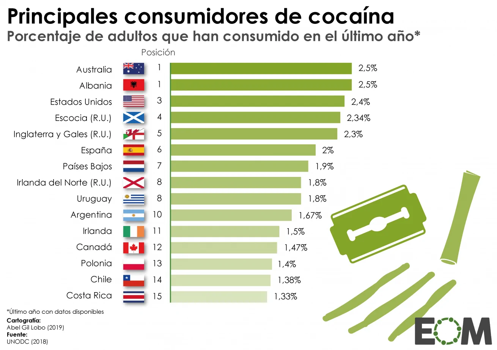

```{r setup, include=FALSE}
knitr::opts_chunk$set(out.width="100%", fig.align="center")
```

This is a chart created by the team at El Orden Mundial, the original plot that I want to reproduce:

{.external width="100%"}


## First Steps

First I load the libraries that I will need to make the plot:

```{r}
library(ggplot2)
library(sf)
library(tibble)
library(grid)
library(png)
library(ggtext)
library(tidyverse)
library(showtext)
library(extrafont)
library(flagon)
library(ggrepel)
library(patchwork)
library(magick)
library(ggstream)
library(scales)  
```

Now, I can start with the data I need to make the graph. In the original plot from El Orden Mundial there is one papers where they extract the information. These are: UNODC (2018): World Drug Report 2018: opioid crisis, prescription drug abuse expands; cocaine and opium hit record highs.

### Data

Unfortunately, I couldn't find an available database with this data. I found in UNODC page other databases with the information of cocaine use, but none of them coincide with the consumption percentage of 2018 presented in the plot. 

Due to this, I will try to make my own database with the information in order to make the representation later.

```{r}
# Data I need: Country, Position, and Consume Percentage.

cocaine_data <- tibble(
  Posición = c(1, 1, 3, 4, 5, 6, 7, 8, 8, 10, 11, 12, 13, 14, 15),
  País = c("Australia", "Albania", "Estados Unidos", "Escocia (R.U.)", "Inglaterra y Gales (R.U.)",
              "España", "Países Bajos", "Irlanda del Norte (R.U.)", "Uruguay", "Argentina",
              "Irlanda", "Canadá", "Polonia", "Chile", "Costa Rica"),
  `Porcentaje de consumo (%)` = c(2.5, 2.5, 2.4, 2.34, 2.3, 2.0, 1.9, 1.8, 1.8, 1.67, 
                                   1.5, 1.47, 1.4, 1.38, 1.33)
)


#I do this to order the countries in the graph
cocaine_data$País <- factor(cocaine_data$País, levels = rev(cocaine_data$País))

```


Now, I am going to choose the font I am going to use for the text in the plot.

```{r, fig.width= 7.5, fig.height= 6}

font_add_google("Mulish", "mulish")

showtext_auto()

```

I needed to change the original font as it wasn't open-source. I selected a font from Google Fonts that is slightly similar, ensuring the visual appearance aligns with the authentic bar plot. 

## Replica
### 1. Bar plot

Now, I can start with the plot. I am going to do this by layers, I consider it will make the code more readable and organized, ensuring each part of the plot is built in a modular way.


The first step regarding to the graph creation is to restrict the length and height of the graph, for this I introduce <```{r, fig.width= 8.5, fig.height= 6}>

```{r, fig.width= 8.5, fig.height= 6}

barchart_coc1 <- ggplot(cocaine_data, aes(x = País, 
                                         y = `Porcentaje de consumo (%)`,
                                         fill = `Porcentaje de consumo (%)`), 
                        family = "mulish", font.main = 2) +
  # Create bar chart with identity stat (values directly from data)
  geom_bar(stat = "identity", width = 0.7) +
  # Flip to make a horizontal bar chart
  coord_flip() +  
  # Add a vertical line on the axis Y 
  geom_segment(aes(x = 0.65, xend = 15.35, y = 0, yend = 0), 
               color = "#498f3d", 
               linewidth = 0.8) +
  # Add positions of the countries next to the  Y axis
  geom_text(aes(label = Posición, y = -0.12), 
            hjust = 1, 
            color = "#0A0A0A", 
            size = 4.3, family = "mulish", font.main = 2) +
  # Add consumption percentages at the end of each bar
  geom_text(aes(label = paste0(gsub("\\.", ",", 
                                    formatC(`Porcentaje de consumo (%)`, 
                                            format = "f", digits = 2, drop0trailing = TRUE)), "%"), 
                y = `Porcentaje de consumo (%)`), 
            hjust = -0.4, 
            vjust = 0.38,
            color = "#0A0A0A", 
            size = 4.25, 
            family = "mulish", font.main = 2) +
  # Adjust the expansion of the y-axis to give more space at the edges
  scale_y_continuous(expand = expansion(add = c(0.6, 1.5))) +
  # Extend the x-axis limits slightly to make space for annotations
  expand_limits(x = 16.4) +
  # Add a label for the "Position" column
  annotate(geom = "text", label = "Position",
           x = 15.85, y = -0.15, size = 4.4, vjust = 0, 
           color = "#353939", family = "mulish") + 
  # Use a color gradient to fill the bars (low to high values)
  scale_fill_gradient(low = "#c0cd94", high = "#84a528") +
  # Add titles, subtitles, and captions
  labs(title = "Principales consumidores de cocaína", 
       subtitle = "Porcentaje de adultos que han consumido en el último año*", 
       caption = paste0(
         "Último año con datos disponibles*<br>",
         "**Cartografía:**<br>",
         "Abel Gil Lobo (2019)<br>", 
         "**Fuente:**<br>",
         "UNODC (2018)"),
       y = "Consumption Percentage (%)", 
       x = NULL) +
  # Apply a minimal theme for the plot
  theme_minimal() +
  theme(
    # Remove x-axis title, text, and ticks
    axis.title.x = element_blank(),
    axis.title.y = element_blank(),
    axis.text.x = element_blank(),
    axis.ticks.x = element_blank(),
    panel.grid = element_blank(),
    axis.text.y = element_text(size = 13, family = "mulish", color = "#0A0A0A"), 
    # Remove the grid lines
    panel.grid.major = element_blank(),
    # Hide the legend
    legend.position = "none",
    # Adjust plot margins
    plot.margin = margin(t = 0, r = 5, b = 1, l= 2), 
    # Remove panel and plot backgrounds
    panel.background = element_blank(), 
    plot.background = element_blank(),
    # Style the caption with markdown support
    plot.caption = element_markdown(hjust = 0, vjust = 1, face = "plain", 
                                    size = 8, family = "mulish", margin = margin(t = 0, r = 0, b = 0, l = 11)),
    # Style the title and subtitle with specific positions and sizes
    plot.title = element_text(hjust = 0.07, vjust = 0, 
                              size = 29, family = "mulish"),# Adjust bottom margin for title
    plot.subtitle = element_text(hjust = 0.12, vjust = 0, 
                                 size = 22, color = "#353939", family = "mulish"),# Adjust bottom margin for subtitle
    # Position title and subtitle within the plot panel
    plot.title.position = "plot",
    plot.subtitle.position = "plot"
  )

barchart_coc1
```


### 2. Flags

Now I can continue with the flags, which have been one of the main challenges. First, it was difficult to find the right package for this task. Second, the issue was with the images themselves, as I initially had to download them, which added to the complexity.

Finally, I decided to use a package that I have downloaded from Github, called [flagon](https://github.com/coolbutuseless/flagon).

But there is also a particularity, some of the flags of the original plot are not in this package (because these are from regions inside a country), so I needed to download in the project file.


```{r, fig.width= 8.5, fig.height= 6}
# Read PNG images for flags
Australia <- readPNG(flagon::flags("au"))
Albania <- readPNG(flagon::flags("al"))
Estados_Unidos <- readPNG(flagon::flags("us"))
Escocia <- readPNG(flagon::flags("gb-sct"))
Inglaterra <- readPNG("wls_eng.png")
España <-  readPNG(flagon::flags("es"))
Paises_Bajos <- readPNG(flagon::flags("nl"))
Irlanda_norte <- readPNG(flagon::flags("gb-nir"))
Uruguay <- readPNG(flagon::flags("uy"))
Argentina <- readPNG(flagon::flags("ar"))
Irlanda <- readPNG(flagon::flags("ie"))
Canada <- readPNG(flagon::flags("ca"))
Polonia <- readPNG(flagon::flags("pl"))
Chile <- readPNG(flagon::flags("cl"))
CostaRica <- readPNG(flagon::flags("cr"))

#Add flags to the bar chart using `annotation_raster`
flag_plot <- barchart_coc1 +
  annotation_raster(CostaRica, xmin = 0.6, xmax = 1.3, ymin = -0.62, ymax = -0.34) +  
  annotation_raster(Chile, xmin = 1.6, xmax = 2.3, ymin = -0.62, ymax = -0.34) +  
  annotation_raster(Polonia, xmin = 2.6, xmax = 3.3, ymin = -0.62, ymax = -0.34) +  
  annotation_raster(Canada, xmin = 3.6, xmax = 4.3, ymin = -0.62, ymax = -0.34) +  
  annotation_raster(Argentina, xmin = 5.6, xmax = 6.3, ymin = -0.62, ymax = -0.34) +  
  annotation_raster(Irlanda, xmin = 4.6, xmax = 5.3, ymin = -0.62, ymax = -0.34) + 
  annotation_raster(Irlanda_norte, xmin = 7.6, xmax = 8.3, ymin = -0.62, ymax = -0.34) +  
  annotation_raster(Uruguay, xmin = 6.6, xmax = 7.3, ymin = -0.62, ymax = -0.34) +  
  annotation_raster(Paises_Bajos, xmin = 8.6, xmax = 9.3, ymin = -0.62, ymax = -0.34) + 
  annotation_raster(España, xmin = 9.6, xmax = 10.3, ymin = -0.62, ymax = -0.34) + 
  annotation_raster(Inglaterra, xmin = 10.6, xmax = 11.3, ymin = -0.62, ymax = -0.34) +  
  annotation_raster(Escocia, xmin = 11.6, xmax = 12.3, ymin = -0.62, ymax = -0.34) +  
  annotation_raster(Estados_Unidos, xmin = 12.6, xmax = 13.3, ymin = -0.62, ymax = -0.34) +  
  annotation_raster(Albania, xmin = 13.6, xmax = 14.3, ymin = -0.62, ymax = -0.34) + 
  annotation_raster(Australia, xmin = 14.6, xmax = 15.3, ymin = -0.62, ymax = -0.34)  


#Now, we can display the final plot with flags
flag_plot

```


As we can see, one problem I encountered was with the quality of the flags in the graph. Despite using the annotation_raster() function to add them, the quality of the flags appeared quite poor.
For the shades that has the authentic graph, I tried to introduce grey rectangles on the back of the flags but it wasn't a good option. Also I tried to edit the images of the packages but then when I tried to introduce those flags in the graph they disappeared. 

### 3. Logos

The next step is to introduce the logos. These original figures were difficult to find, so I decided to made a screenshot of the original plot and introduce the pictures with patchwork package. 

```{r, fig.width= 8.5, fig.height= 6, preview = TRUE}

# Read the PNG images for the logos
logo1 <- readPNG("eom.png")
logo2 <- readPNG("cuch.png")  

#Convert images into raster objects to be used in the plot
logo1_grob <- rasterGrob(logo1, interpolate = TRUE)  #Convert the first logo into a graphical object
logo2_grob <- rasterGrob(logo2, interpolate = TRUE)  #Convert the second logo into a graphical object

#Combine the bar chart with flags and logos
plot_logo <- flag_plot + 
  # Add Logo 1 in the topright corner
  inset_element(
    logo1_grob,
    left = 0.62, bottom = -0.12, right = 1.02, top = 0.17,  #Position for top-right corner
    align_to = "panel",  # Align the position to the panel dimensions
    on_top = TRUE  # Ensure the logo appears on top of the plot
  ) +
  # Add Logo 2 in the bottomright corner
  inset_element(
    logo2_grob,
    left = 0.62, bottom = 0.12, right = 1.02, top = 0.56,  #Position for bottom-right corner
    align_to = "panel",  
    on_top = FALSE  
  )

#The final plot
plot_logo
```

### Critique of the original chart

1. Although it is titled Main Cocaine Consumers, all the observations are countries except for Scotland, England and Wales, and Northern Ireland. Two issues can be identified here: first, while these territories are divided, England and Wales are kept together, meaning these observations do not correspond to an administrative area of the United Kingdom. Second, I believe these observations should have been grouped into a single one, United Kingdom, to allow for a better comparison.

2. It’s important to acknowledge that this is a sensitive topic, as it touches on drug consumption, which involves complex social, economic, and cultural factors. Additionally, gathering reliable data on cocaine use poses significant challenges. Drug use is often under reported due to stigma, illegality, and variations in how surveys or studies are conducted across different regions or countries.


This previous part have been my replica to the graph. As you can see, there are some differences. First, there are some adjustment issues, such as with the size of the figures, text, and positioning. I’ve tried to make it as similar as possible, but there are still some aspects that could be improved. Second, the flag images, as in the original, the quality of these is much higher than what I’ve managed to achieve, as well as the shading behind them.


## Improvements

Considering the points mentioned, I can now move forward with improving the graph. Despite the challenges, I believe the original graph is a strong representation of the data. It effectively conveys the information in a clear and straightforward manner. The simplicity of the design makes it easy to understand, and the choice of a bar plot is particularly appropriate for visualizing this type of comparative data.

### 1. Bar plot
#### Aesthetics

First, I will proceed to address some aesthetic aspects that, in my opinion, will improve the overall quality of the graphic:

1.Aligning positions: Adjusting the positioning number to ensure they are visually balanced and aligned properly.

2.Axis line: Modifying the line on the axis to make it more distinct will help to clarify the data's structure and improve the overall clarity of the graph.

```{r, fig.width= 8.5, fig.height= 6}


# Create the bar chart with reordered countries and custom aesthetics
# Reorder countries by consumption percentage
upgrade <- ggplot(cocaine_data, aes(x = reorder(País, `Porcentaje de consumo (%)`),
                                    y = `Porcentaje de consumo (%)`,
                                    fill = `Porcentaje de consumo (%)`), 
                  family = "mulish", font.main = 2) +
  # Add horizontal bars for each country
  geom_bar(stat = "identity", width = 0.7) +
  # Flip the axes for a horizontal bar chart
  coord_flip() +  
  # Add a horizontal line at y = 0 to connect the starting points of the bars
  geom_segment(aes(x = 0.6, xend = 15.4, y = 0, yend = 0), 
               color = "black", #Change the color from the original one
               linewidth = 0.8) +
  # Add the ranking positions to the left of the y-axis
  geom_text(aes(label = Posición, y = -0.2), 
            hjust = 0.5,  #Adjust text horizontally
            color = "#0A0A0A",  #Text color
            size = 4.3, family = "mulish", font.main = 2) +
  # Add the percentage of consumption at the end of each bar
  geom_text(aes(label = paste0(gsub("\\.", ",", formatC(
    `Porcentaje de consumo (%)`, format = "f", digits = 2, drop0trailing = TRUE)), "%"), 
                y = `Porcentaje de consumo (%)`), 
            hjust = -0.4,  #Adjust the text placement horizontally
            vjust = 0.38,  #Adjust the text placement vertically
            color = "#0A0A0A", 
            size = 4, 
            family = "mulish", font.main = 2) +
  # Adjust the expansion of the y-axis
  scale_y_continuous(expand = expansion(add = c(0.6, 1.5))) +
  # Add additional space for the x-axis limits
  expand_limits(x = 17) +
  # Add a label for the "Position" column
  annotate(geom = "text", label = "Posición",
           x = 15.8, y = -0.2, size = 4, vjust = 0, 
           color = "#353939", family = "mulish") + 
  # Set a gradient color scale for the bars
  scale_fill_gradient(low = "#c0cd94", high = "#84a528") +
  # Add plot labels
  labs(title = "Principales consumidores de cocaína",  
       subtitle = "Porcentaje de adultos que han consumido en el último año*", 
       caption = paste0(  
         "Último  año con datos disponibles*<br>",
         "**Cartografía:**<br>",
         "Abel Gil Lobo (2019)<br>", 
         "**Fuente:**<br>",
         "UNODC (2018)"),
       y = "Porcentaje de consumo (%)",  # Y-axis label
       x = NULL) +  # No label for the x-axis
  # Customize the overall theme
  theme_minimal() +
  theme(
    axis.title.x = element_blank(),  # Remove x-axis title
    axis.title.y = element_blank(),  # Remove y-axis title
    axis.text.x = element_blank(),  # Remove x-axis text
    axis.ticks.x = element_blank(),  # Remove x-axis ticks
    panel.grid = element_blank(),  #Remove grid lines
    axis.text.y = element_text(size = 13, family = "mulish", color = "#0A0A0A"), 
    panel.grid.major = element_blank(),  # Remove major grid lines
    legend.position = "none",  #Hide legend
    plot.margin = margin(t = 0, r = 5, b = 1, l= 2),  # Adjust plot margins
    panel.background = element_blank(),  # Set panel background to blank
    plot.background = element_blank(),  #Set overall plot background to blank
    # Style for the plot caption
    plot.caption = element_markdown(hjust = 0, vjust = 1, face = "plain", 
                                    size = 8, family = "mulish",
                                    margin = margin(t = 0, r = 0, b = 0, l = 11)),
    #Style for the main title
    plot.title = element_text(hjust = 0.07, vjust = 0, size = 29, 
                              family = "mulish"),  
    #Style for the subtitle
    plot.subtitle = element_text(hjust = 0.12, vjust = 0, size = 22, 
                                 color = "#353939", family = "mulish"),
    # Position the title and subtitle within the panel
    plot.title.position = "plot",
    plot.subtitle.position = "plot"
  )

# Display the improvements
upgrade

```

#### New info

My aim is to make the graph more informative, so I decided to introduce the continent information in the graph.Therefore, I introduce the Continent values in a new variable.

```{r, fig.width= 8.5, fig.height= 6}

#Introduce the variable
cocaine_data$Continente <- c("Oceanía","Europa","América","Europa","Europa",
                             "Europa","Europa","Europa","América","América",
                             "Europa","América","Europa","América","América")

#I convert it to a factor for the legend:
cocaine_data$Continente <- factor(cocaine_data$Continente, 
                                  levels = c("Oceanía", "Europa", "América")) 


# Create the bar chart with countries and color by continent
upgrade_color <- ggplot(cocaine_data, aes(x = País, 
                                   y = `Porcentaje de consumo (%)`,
                                   fill = Continente), family = "mulish", font.main = 2) +
  geom_bar(stat = "identity", width = 0.7) +
  coord_flip() +  # To rotate the chart
  # Vertical line on the y-axis, connecting the start of the bars
  geom_segment(aes(x = 0.6, xend = 15.4, y = 0, yend = 0), 
               color = "black", 
               linewidth = 0.8) +
  # Add positions next to the Y axis
  geom_text(aes(label = Posición, y = -0.2), 
            hjust = 0.5, 
            color = "#0A0A0A", 
            size = 4.3, family = "mulish", font.main = 2) +
  # Add consumption percentages at the end of each bar
  geom_text(aes(label = paste0(gsub("\\.", ",", formatC(
    `Porcentaje de consumo (%)`, format = "f", digits = 2, drop0trailing = TRUE)), "%"), 
                y = `Porcentaje de consumo (%)`), 
            hjust = -0.4, 
            vjust = 0.38,
            color = "#0A0A0A", 
            size = 4.25, 
            family = "mulish", font.main = 2) +
    # Adjust the expansion of the Y axis
 scale_y_continuous(expand = expansion(add = c(0.6, 1.5))) +
  expand_limits(x = 16.4)  +
  annotate(geom = "text", label = "Position",
           x = 15.85, y = -0.2, size = 4.4, vjust = 0, color = "#353939", family = "mulish") + 
   # Add a manual color palette for the variable Continent
  scale_fill_manual(values = c("Oceanía" = "#2C3E50", 
                               "Europa" = "#FFA500", 
                               "América" = "#84a528")) +
  labs(title = "Top Cocaine Consumers", 
       subtitle = "Percentage of adults who have consumed in the last year*", 
       caption = paste0(
         "Latest available year*<br>",
         "**Cartography:**<br>",
         "Abel Gil Lobo (2019)<br>", 
         "**Source:**<br>",
         "UNODC (2018)"),
       y = "Percentage of consumption (%)", 
       x = NULL) +
  theme_minimal() +
  theme(
    axis.title.x = element_blank(),
    axis.title.y = element_blank(),
    axis.text.x = element_blank(),
    axis.ticks.x = element_blank(),
    panel.grid = element_blank(),
    axis.text.y = element_text(margin = margin(r = 1.7), size = 12.8, family = "mulish", color = "#0A0A0A"), 
    panel.grid.major = element_blank(),
    legend.position = c(0.9, 0.88),
    plot.margin = margin(t = 0, r = 5, b = 1, l= 2), 
    panel.background = element_blank(), 
    plot.background = element_blank(),
    plot.caption = element_markdown(hjust = 0, vjust = 1, face = "plain", size = 8, family = "mulish", margin = margin(t = 0, r = 0, b = 0, l = 11)),
    plot.title = element_text(hjust = 0.07, vjust = 0, size = 29, family = "mulish"),  # Adjust bottom margin of the title
    plot.subtitle = element_text(hjust = 0.12, vjust = 0, size = 22, color = "#353939", family = "mulish"),  # Adjust bottom margin of the subtitle
    plot.title.position = "plot",  # Title inside the panel
    plot.subtitle.position = "plot"  # Subtitle inside the panel
  )


upgrade_color
  
```

With these aesthetic improvements, the graph now allows us to visually capture more information. Each bar is assigned a different color representing a continent: blue for Oceania, yellow for Europe, and green for the Americas, as indicated in the legend at the top right. 

This color coding reveals that, while the top consumer is from Oceania, the majority of the remaining consumers are from Europe and America. Notably, most of these countries and regions are developed nations.

### 2. Flags

Now that I have modified the aesthetics of the graph, I can proceed with the steps I followed in the replication process. 

```{r, fig.width= 8.5, fig.height= 6}
#Add flags to the bar chart:
upgrade_flag <- upgrade_color +
  # I Position the flags on the chart maintaining original coordinates
  annotation_raster(CostaRica, xmin = 0.6, xmax = 1.3, ymin = -0.66, ymax = -0.38) +  
  annotation_raster(Chile, xmin = 1.6, xmax = 2.3, ymin = -0.66, ymax = -0.38) +  
  annotation_raster(Polonia, xmin = 2.6, xmax = 3.3, ymin = -0.66, ymax = -0.38) +  
  annotation_raster(Canada, xmin = 3.6, xmax = 4.3, ymin = -0.66, ymax = -0.38) +  
  annotation_raster(Argentina, xmin = 5.6, xmax = 6.3, ymin = -0.66, ymax = -0.38) + 
  annotation_raster(Irlanda, xmin = 4.6, xmax = 5.3, ymin = -0.66, ymax = -0.38) + 
  annotation_raster(Irlanda_norte, xmin = 7.6, xmax = 8.3, ymin = -0.66, ymax = -0.38) +  
  annotation_raster(Uruguay, xmin = 6.6, xmax = 7.3, ymin = -0.646, ymax = -0.38) +  
  annotation_raster(Paises_Bajos, xmin = 8.6, xmax = 9.3, ymin = -0.66, ymax = -0.38) +  
  annotation_raster(España, xmin = 9.6, xmax = 10.3, ymin = -0.66, ymax = -0.38) + 
  annotation_raster(Inglaterra, xmin = 10.6, xmax = 11.3, ymin = -0.66, ymax = -0.38) +  
  annotation_raster(Escocia, xmin = 11.6, xmax = 12.3, ymin = -0.66, ymax = -0.38) +  
  annotation_raster(Estados_Unidos, xmin = 12.6, xmax = 13.3, ymin = -0.66, ymax = -0.38) +  
  annotation_raster(Albania, xmin = 13.6, xmax = 14.3, ymin = -0.66, ymax = -0.38) + 
  annotation_raster(Australia, xmin = 14.6, xmax = 15.3, ymin = -0.66, ymax = -0.38)  

#Display the chart with flags positioned
upgrade_flag

```
I followed the previous steps, so the problems of quality remain here. 

### 3. Logos

Finally, I reintroduce the logos as in the original graph:

```{r, fig.width= 8.5, fig.height= 6}

#Combine the flag chart with logos
final_upgrade <- upgrade_flag + 
  #Add Logo 1 (top-right position)
  inset_element(
    logo1_grob,
    left = 0.62, bottom = -0.12, right = 1.02, top = 0.17, # Top-right corner position
    align_to = "panel",
    on_top = TRUE
  ) +
  #Add Logo 2 (bottom-right position)
  inset_element(
    logo2_grob,
    left = 0.62, bottom = 0.12, right = 1.02, top = 0.56, # Bottom-right corner position
    align_to = "panel",
    on_top = FALSE
  )


final_upgrade

```


This has been the improvement to my graph. With enhancements in its visual appearance and the inclusion of data from the continents, I believe the graph now provides more information. However, the issue is that, given the quality of the original graph and the available data, the scope for improvement was limited.

## Alternative

Therefore, I believe two approaches could be considered with this type of data. First, creating a graph that reflects the evolution of cocaine consumption, and second, categorizing countries based on their status. I have decided on three categories: producer, transition, and consumer countries.

For the purpose of creating an alternative visualization, I am going to invent some data about the evolution of cocaine consumption in these countries. My aim is to group the countries into three categories: producer, transition, and consumer countries.


```{r}
# I am going to generate random values for with the range of [0.92, 3.5]
set.seed(123)  
serie_1 <- runif(15, min = 0.92, max = 3.5)  
serie_2 <- runif(15, min = 0.92, max = 3.5)
serie_3 <- runif(15, min = 0.92, max = 3.5)

# Now I need to unify:
serie_completa <- c(serie_1, serie_2, serie_3,
                    2.5, 2.5, 2.4, 2.34, 2.3, 2.0, 1.9, 1.8, 1.8, 1.67, 
                    1.5, 1.47, 1.4, 1.38, 1.33)


#Create a tibble with the previous information
data_countries <- tibble::tibble(
  País = c("Australia", "Albania", "Estados Unidos", "Escocia (R.U.)", "Inglaterra y Gales (R.U.)", "España", 
           "Países Bajos", "Irlanda del Norte (R.U.)", "Uruguay", "Argentina", "Irlanda", "Canadá", "Polonia", 
           "Chile", "Costa Rica", "Australia", "Albania", "Estados Unidos", "Escocia (R.U.)", 
           "Inglaterra y Gales (R.U.)", "España", "Países Bajos", "Irlanda del Norte (R.U.)", "Uruguay", 
           "Argentina", "Irlanda", "Canadá", "Polonia", "Chile", "Costa Rica", "Australia", "Albania", 
           "Estados Unidos", "Escocia (R.U.)", "Inglaterra y Gales (R.U.)", "España", "Países Bajos", 
           "Irlanda del Norte (R.U.)", "Uruguay", "Argentina", "Irlanda", "Canadá", "Polonia", "Chile", 
           "Costa Rica", "Australia", "Albania", "Estados Unidos", "Escocia (R.U.)", "Inglaterra y Gales (R.U.)", 
           "España", "Países Bajos", "Irlanda del Norte (R.U.)", "Uruguay", "Argentina", "Irlanda", "Canadá", 
           "Polonia", "Chile", "Costa Rica"),
  `Porcentaje de consumo` = serie_completa,
  Año = rep(c(1988, 1998, 2008, 2018), each = 15)  
)

# Now, I create the varibale status:
data_countries <- data_countries %>%
  mutate(País = case_when(
    País %in% c("Escocia (R.U.)", "Inglaterra y Gales (R.U.)", "Irlanda del Norte (R.U.)") ~ "Reino Unido",
    TRUE ~ País
  )) %>%
  group_by(País, Año) %>%
  summarise(`Porcentaje de consumo` = mean(`Porcentaje de consumo`), .groups = 'drop') %>%
  ungroup() %>% 
  mutate(estatus = case_when(
    País %in% c("Albania", "Argentina", "Costa Rica") ~ "Productor",
    País %in% c("España", "Uruguay", "Países Bajos") ~ "Transición",
    TRUE ~ "Consumidor"
  )) 
#Join the values of Escocia, Inglaterra, Gales e Irlanda del Norte to create Reino Unido, and I have calculated the mean.

data_countries


```
I must mention that since the consumption data has been generated randomly, the evolution may seem strange. However, I preferred to do it this way to represent the variations, without considering how it might turn out.


First, I will also maintain the size of the graph to ensure consistency and comparability with the previous one. Similarly, I will keep the font used in the replica because it is similar and I believe it enhances readability. I will also include the images of the tubes and lines.

To complete this exercise, I will present different visualization styles or attempts I have made:

### First Attempt

In the first attempt, I aim to represent the evolution by country.


```{r,  fig.width= 8.5, fig.height= 6}

# Plot showing the trend of cocaine consumption by country over time
ggplot(data_countries) +
  aes(x = Año, 
      y = `Porcentaje de consumo`, 
      color = País) +  #Color by country
  geom_line(linewidth = 0.75) +  #Thicker lines for clarity
  ggrepel::geom_text_repel(
    data = data_countries %>%
      group_by(País) %>%
      filter(Año == max(Año)),  # Labels only for the most recent year
    aes(label = País), 
    hjust = -0.1,
    size = 3.5,
    direction = "y",  #Avoid label overlaps
    nudge_x = 1.5,  #Move labels to the right
    segment.color = "grey70", 
    segment.size = 0.3
  ) +
  scale_x_continuous(
    breaks = c(1988, 1998, 2008, 2018),  # Set x axis breaks
    labels = c("1988", "1998", "2008", "2018")  #x axis labels
  ) +
  scale_y_continuous(
    breaks = c(0.5, 1, 1.5, 2, 2.5, 3, 3.5, 4),  #Set y axis breaks
    labels = c(0.5, 1, 1.5, 2, 2.5, 3, 3.5, 4)  # y axis labels
  ) +
  expand_limits(x = 2022, y = 4) +  #Expand axis limits
  labs(
    title = "Evolución del Consumo de Cocaína",
    subtitle = "Porcentaje de adultos que han consumido cocaína",
    caption = "*¡Los datos han sido generados de forma aleatoria!*"
  ) +
  theme_minimal() +  # Minimal theme
  theme(
    legend.position = "none",  # Hide legend
    axis.title.x = element_text(size = 14, family = "mulish"), 
    axis.title.y = element_text(size = 14, family = "mulish"),
    plot.title = element_text(hjust = 0, vjust = 1, size = 27, family = "mulish"),
    plot.subtitle = element_text(hjust = 0, vjust = 0, size = 24, family = "mulish", colour = "#4D5154"),
    plot.caption = element_markdown(size = 9, family = "mulish"),
    plot.margin = unit(c(1, 2, 1, 1), "cm")  
  )


```
As we can see, although the graph represents our objective, it is somewhat difficult to read. Adding the grey lines for annotating the country names has made it slightly easier to follow. However, despite the graph conveying the idea I want to express, I believe the visualization is not very clear. 
Therefore, I consider it important to explore other ways of visualizing the data to make it more readable and visually appealing.

### Second Attempt

Now, I will try placing the country labels at the beginning as well, to see if this approach makes the graph easier to read. Another idea that occurred to me is to include the country names both at the beginning, next to the y-axis, and at the end.
In this attempt, I will also add the logos to simulate a finalized graph.

```{r,fig.width= 8.5, fig.height= 6}

#First I am going to charge the logos
logo3 <- readPNG("tur.png")
logo3_grob <- rasterGrob(logo3, interpolate = TRUE)
logo4 <- readPNG("tur1.png")
logo4_grob <- rasterGrob(logo4, interpolate = TRUE)
logo5 <- readPNG("ray.png")
logo5_grob <- rasterGrob(logo5, interpolate = TRUE)

# Updating the country name "Estados Unidos" to "EEUU" for better fit on the plot
data_countries <- data_countries %>%
  mutate(etiqueta = if_else(País == "Estados Unidos", "EEUU", País))

#Plot:
ggplot(data_countries) +
  aes(x = Año, 
      y = `Porcentaje de consumo`, 
      color = País) +  #Plot by country
  geom_line(linewidth = 0.75) +  # Increase the line width
  # Labels at the beginning of the line (first year)
  ggrepel::geom_text_repel(
    data = data_countries %>%
      group_by(País) %>%
      filter(Año == min(Año)),  # Filter data for labels at the start
    aes(label = etiqueta), 
    size = 3.5,
    direction = "y",  #Adjust direction to avoid overlap
    nudge_x = -1.9,   #Move labels to the left
    segment.color = "grey70",  #Line color connecting the labels
    segment.size = 0.3
  ) +
  ggrepel::geom_text_repel(
    data = data_countries %>%
      group_by(País) %>%
      filter(Año == max(Año)),  #Filter only the last year
    aes(label = etiqueta), 
    hjust = -0.1,
    size = 3.5,
    direction = "y",  #Adjust direction to avoid overlap
    nudge_x = 1.5,      #Move labels to the right
    segment.color = "grey70",  #  Add lines connecting the labels to the points
    segment.size = 0.3
  ) +
  scale_x_continuous(
    breaks = c(1988, 1998, 2008, 2018),  #Set breaks at specific years
    labels = c("1988", "1998", "2008", "2018")  #Labels for the years
  ) +
  scale_y_continuous(breaks = c(0.5, 1, 1.5, 2, 2.5, 3, 3.5, 4),
                     labels = c(0.5, 1, 1.5, 2, 2.5, 3, 3.5, 4)) +
  expand_limits(x = 2022, y = 4) +
  labs(title = "Evolución del Consumo de Cocaína",
       subtitle = "Porcentaje adultos consumidores",
       caption = "*¡Los datos han sido generados de forma aleatoria!*") +
  theme_minimal() +  
  theme(legend.position = "none",
        axis.title.x = element_text(size = 14, family = "mulish"),  # Set the x-axis title size
        axis.title.y = element_text(size = 14, family = "mulish"),
        axis.text.y = element_text(size = 12, face = "bold"),
        plot.title = element_text(hjust = 0, vjust = 1, size = 27, family = "mulish"),
        plot.subtitle = element_text(hjust = 0, vjust = 0, size = 24, family = "mulish", colour = "#4D5154"),
        plot.caption = element_markdown(size = 9, family = "mulish"),
        plot.margin = unit(c(1, 2, 1, 1), "cm")) +
  #Adding logos to the plot
  inset_element(
    logo3_grob,
    left = 0.82, bottom = 1, right = 1.35, top = 1.25,  #Position at the upper right
    align_to = "panel",
    on_top = TRUE
  ) +
  inset_element(
    logo4_grob,
    left = -0.16, bottom = 1, right = 0, top = 1.25, #Position at the upper-left
    align_to = "panel",
    on_top = TRUE
  ) +
  inset_element(
    logo5_grob,
    left = 0.79, bottom = 1, right = 0.95, top = 1.25, #Another position at the upper-right
    align_to = "panel",
    on_top = TRUE)

  


 
```

In this way, the evolution of consumption can be followed much more clearly, although the presence of 13 countries still makes the graph somewhat difficult to read, as there are many lines crossing each other.

### Third Attempt

Next, I will attempt the same representation as before but grouping the countries based on their status values: producers, consumers, and transition countries.


```{r, fig.width= 8.5, fig.height= 6} 

#Colors for each status (Producer, Consumer, Transition)
color_palette <- c(
  "Productor" = "#0072B2",  #Strong blue for Producer
  "Consumidor" = "#D55E00",  #Strong red for Consumer
  "Transición" = "#009E73"   #Bright green for Transition
)

ggplot(data_countries) +
  aes(x = Año, 
      y = `Porcentaje de consumo`, 
      group = País, 
      color = estatus) +  # Use 'estatus' for coloring based on category
  geom_line(linewidth = 0.75) +  #Lines for each country
  #Labels at the start of the line (first year)
  ggrepel::geom_text_repel(
    data = data_countries %>%
      group_by(País) %>%
      filter(Año == min(Año)),  #Filter data for labels at the start
    aes(label = etiqueta), 
    size = 3.5,
    direction = "y",  #Adjust direction to avoid overlap
    nudge_x = -1.9,   #ove labels to the left
    segment.color = "grey70",  # Line color connecting the labels
    segment.size = 0.3
  ) +
  # Labels at the end of the line (last year)
  ggrepel::geom_text_repel(
    data = data_countries %>%
      group_by(País) %>%
      filter(Año == max(Año)),  #Filter only the last year
    aes(label = etiqueta), 
    hjust = -0.1,
    size = 3.5,
    direction = "y",  # Adjust direction to avoid overlap
    nudge_x = 1.5,    #Move labels to the right
    segment.color = "grey70",  #Add lines connecting the labels to the points
    segment.size = 0.3
  ) +
  scale_x_continuous(
    breaks = c(1988, 1998, 2008, 2018),
    labels = c("1988", "1998", "2008", "2018")
  ) +
  scale_y_continuous(breaks = seq(0.5, 4, 0.5)) +
  expand_limits(x = 2022, y = 4) +
  labs(
    title = "Evolución del Consumo de Cocaína",
    subtitle = "Porcentaje de adultos consumidores",
    caption = "*¡Los datos han sido generados de forma aleatoria!*",
    color = "ESTATUS"
  ) +
  scale_color_manual(values = color_palette) +  #assign colors
  theme_minimal() +
  theme(
    legend.position = c(0.85, 0.85),  # Legend position within the plot (relative coordinates)
    legend.title = element_text(size = 12),  # Size of the legend title
    legend.text = element_text(size = 10),  # Size of the legend text
    axis.title.x = element_text(size = 14, family = "mulish"),
    axis.title.y = element_text(size = 14, family = "mulish"),
    axis.text.y = element_text(size = 12, face = "bold"),  # Y-axis values in bold and size 12
    plot.title = element_text(hjust = 0, vjust = 1, size = 27, family = "mulish"),
    plot.subtitle = element_text(hjust = 0, vjust = 0, size = 24, family = "mulish", colour = "#4D5154"),
    plot.caption = element_markdown(size = 9, family = "mulish"),
    plot.margin = unit(c(1, 2, 1, 1), "cm")  # Add margins (top, right, bottom, left)
  ) +
  # Adding logos to the plot
inset_element(
    logo3_grob,
    left = 0.82, bottom = 1, right = 1.35, top = 1.25,  #Position at the upper right
    align_to = "panel",
    on_top = TRUE
  ) +
  inset_element(
    logo4_grob,
    left = -0.16, bottom = 1, right = 0, top = 1.25, #Position at the upper-left
    align_to = "panel",
    on_top = TRUE
  ) +
  inset_element(
    logo5_grob,
    left = 0.79, bottom = 1, right = 0.95, top = 1.25, #Another position at the upper-right
    align_to = "panel",
    on_top = TRUE)


```

Regarding this graph, although I have represented the information I initially wanted, I believe that reducing 13 countries to 3 colors still hinders clear readability.

### Fourth Attempt

Therefore, a solution to the problem could be to create 3 separate graphs using facet wrap, as this would help avoid having too many countries in a single grid.

```{r, fig.width= 8.5, fig.height= 6} 

# Crear el gráfico con facet_wrap y colores según estatus
ggplot(data_countries) +
  aes(x = Año, 
      y = `Porcentaje de consumo`, 
      group = País,
      color = estatus) +  
  geom_line(linewidth = 0.75) +  
  ggrepel::geom_text_repel(
    data = data_countries %>%
      group_by(País, estatus) %>%
      filter(Año == max(Año)),  
    aes(label = País), 
    size = 3.5,
    nudge_x = 1.5,  
    segment.color = "grey70",
    segment.size = 0.3
  ) +
  scale_x_continuous(
    breaks = c(1988, 1998, 2008, 2018),
    labels = c("1988", "1998", "2008", "2018")
  ) +
  scale_y_continuous(
    breaks = seq(0.5, 4, 0.5),
    labels = seq(0.5, 4, 0.5)
  ) +
  scale_color_manual(values = color_palette) +  
  expand_limits(x = 2022, y = 4) +
  facet_wrap(~estatus, ncol = 1, scales = "free_y") +  
  theme_minimal() +
  theme(
    legend.position = "none",  
    axis.title.x = element_text(size = 14, family = "mulish"),
    axis.title.y = element_text(size = 14, family = "mulish"),
    plot.title = element_text(hjust = 0, vjust = 1, size = 27, family = "mulish"),
    plot.subtitle = element_text(hjust = 0, vjust = 0, size = 24, family = "mulish", colour = "#4D5154"),
    plot.caption = element_markdown(size = 9, family = "mulish"),
    strip.text = element_text(size = 15, family = "mulish", face = "bold"),
    plot.margin = unit(c(1, 2, 1, 1), "cm")
  )


```

Since the Consumer category contains the most countries, this could make the graph less readable. To address this issue, I will split this category into two: European Consumers and Non-European Consumers. This way, the data will be more organized and easier to interpret, ensuring clearer visibility for each group.

### Fifth Attempt

```{r, fig.width= 8.5, fig.height= 6}

#First, odify the data:
data_countries <- data_countries %>%
  mutate(estatus_modificado = case_when(
    estatus == "Consumidor" & País %in% c("Reino Unido", "Irlanda", "Polonia") ~ "Consumidores Europeos",
    estatus == "Consumidor" & País %in% c("Estados Unidos", "Australia", "Canadá", "Chile") ~ "Consumidores No Europeos",
    estatus == "Productor" ~ "Países Productores",
    estatus == "Transición" ~ "Países Transitorios",
    TRUE ~ estatus  
  ))

#Colors for each estatus:
color_palette <- c(
  "Países Productores" = "#0072B2",       
  "Países Transitorios" = "#009E73",      
  "Consumidores Europeos" = "#D55E00",  
  "Consumidores No Europeos" = "#CC79A7"   
)


#PLOT
grafico_facet <- ggplot(data_countries) +
  aes(x = Año, 
      y = `Porcentaje de consumo`, 
      group = País,
      color = estatus_modificado) + 
  geom_line(linewidth = 0.75) + 
    ggrepel::geom_text_repel(
    data = data_countries %>%
      group_by(País) %>%
      filter(Año == min(Año)),  
    aes(label = etiqueta), 
    size = 3.5,
    direction = "y",  
    nudge_x = -2.1,   
    segment.color = "grey70",  
    segment.size = 0.3
  ) + # Líneas de los países
  ggrepel::geom_text_repel(
    data = data_countries %>%
      group_by(País, estatus_modificado) %>%
      filter(Año == max(Año)),  
    aes(label = etiqueta), 
    hjust = -0.1,
    size = 3.5,
    direction = "y",  
    nudge_x = 0.7,      
    segment.color = "grey70",  
    segment.size = 0.3
  ) +
  scale_x_continuous(
    breaks = c(1988, 1998, 2008, 2018),
    labels = c("1988", "1998", "2008", "2018")
  ) +
  scale_y_continuous(
    breaks = seq(0.5, 4, 1),
    labels = seq(0.5, 4, 1)
  ) +
  scale_color_manual(values = color_palette) +  # Assign colors by estatus modificado
  expand_limits(x = 2022, y = 4) +
  facet_wrap(~estatus_modificado, ncol = 1, scales = "free_y") +  #New panel for estatus modificado
  labs(
    title = "Evolución del Consumo de Cocaína",
    subtitle = "Porcentaje de adultos consumidores según el estatus",
    caption = "*¡Los datos han sido generados de forma aleatoria!*"
  ) +
  theme_minimal() +
  theme(
    legend.position = "none",  
    axis.title.x = element_text(size = 14, family = "mulish"),
    axis.title.y = element_text(size = 14, family = "mulish"),
    plot.title = element_text(hjust = 0, vjust = 1, size = 27, family = "mulish"),
    plot.subtitle = element_text(hjust = 0, vjust = 0, size = 24, family = "mulish", colour = "#4D5154"),
    plot.caption = element_markdown(size = 9, family = "mulish"),
    strip.text = element_text(size = 15, family = "mulish", face = "bold"),  
    plot.margin = unit(c(1, 2, 1, 1), "cm")
  ) +
inset_element(
    logo3_grob,
    left = 0.82, bottom = 1, right = 1.35, top = 1.25,  #Position at the upper right
    align_to = "panel",
    on_top = TRUE
  ) +
  inset_element(
    logo4_grob,
    left = -0.16, bottom = 1, right = 0, top = 1.25, #Position at the upper-left
    align_to = "panel",
    on_top = TRUE
  ) +
  inset_element(
    logo5_grob,
    left = 0.79, bottom = 1, right = 0.95, top = 1.25, #Another position at the upper-right
    align_to = "panel",
    on_top = TRUE)


grafico_facet    
```

I believe this graph is much more readable and makes it easier to compare the patterns across the different categories. By separating the countries into smaller, more focused groups, the data becomes less cluttered and more accessible, allowing for clearer insights. 

To conclude, I would like to reflect on the graphs I have created. From my point of view, if I could only choose one, my choice would be the second graph, as I believe it is the most aesthetically pleasing. Its design stands out and conveys the intended message effectively.

However, I also recognize that this graph may be challenging to read, as it requires focus to follow the progression of the lines accurately. This could make it less accessible for some viewers, especially when attempting to interpret complex patterns quickly.

On the other hand, the final graph allows for a clearer comparison of countries within the same category. It simplifies the visualization by grouping similar nations, making trends within each group more evident. However, comparing countries across different categories becomes more challenging with this layout. This trade-off highlights the difficulty of balancing clarity and comparability in visualizations, as the ideal choice often depends on the specific context and the audience's needs.

