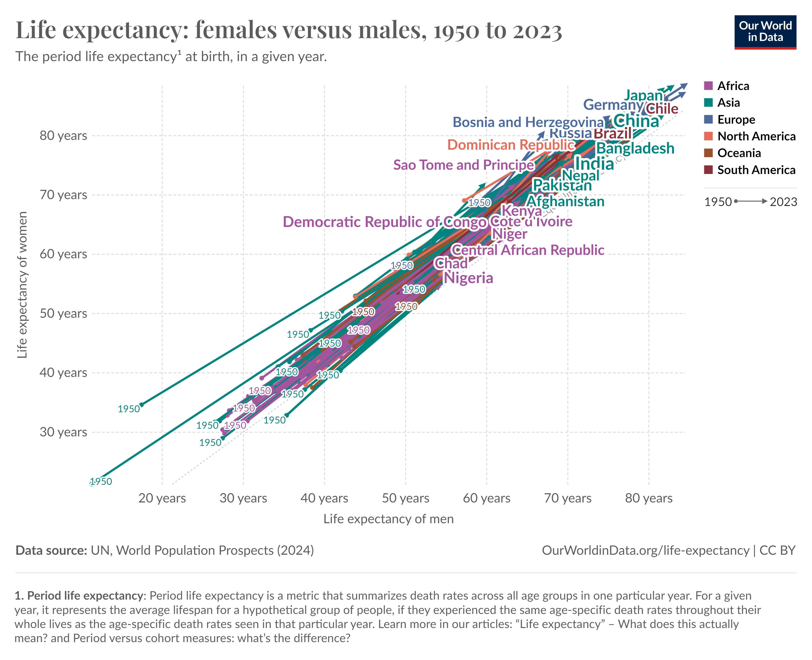

## Introduction

This chart compares the life expectancy of women and men at birth. The horizontal axis represents men's life expectancy, while the vertical axis represents women's life expectancy. All countries lie above the diagonal line, indicating that women live longer than men in every country. The countries are color-coded by continent, and the changes from 1950 to 2023 are shown. In 1950, life expectancy was lower worldwide, but by 2023, significant increases are observed in many countries. In countries like Japan and Germany, life expectancy is notably high, whereas it is much lower in countries like Chad and Nigeria.

{.external width="100%"}

## Replication

First, I loaded the `life_exp.csv` file, which contains life expectancy data, into my project. I included the necessary libraries (`tidyverse`, etc.) for analysis and visualization. Then, I transformed the data into a data frame (`data.df`) by selecting the first 17,538 rows and the first 9 columns. This way, I made the data more manageable for analysis and visualization purposes.[@owid-why-do-women-live-longer-than-men][@owid-why-do-women-live-longer-than-men]

```{r cars}

library(tidyverse)
library(cowplot)
library(grid)
library(gridExtra)

life_exp <- read.csv(file="life_exp.csv")
data.df <-data.frame(life_exp[1:17538,1:9])
 
```

### Data Cleaning Processes

```{r}

new_data <- data.df %>%
  rename(
    Country = Entity,
    Year = Year,
    LifeExp_Female = `Life.expectancy...Sex..female...Age..0...Variant..estimates`,
    LifeExp_Male = `Life.expectancy...Sex..male...Age..0...Variant..estimates`
  ) %>%
  select(Country, Year, LifeExp_Female, LifeExp_Male, Continent) %>%  
  filter(!is.na(LifeExp_Female) & !is.na(LifeExp_Male))

filtered_data <- new_data |> 
  filter(Year == 1950 | Year == 2023)

arrows_data <- filtered_data %>%
  filter(Year %in% c(1950, 2023)) %>%
  group_by(Country, Continent) %>%
  summarize(
    Start_LifeExp_Male = LifeExp_Male[Year == 1950],
    Start_LifeExp_Female = LifeExp_Female[Year == 1950],
    End_LifeExp_Male = LifeExp_Male[Year == 2023],
    End_LifeExp_Female = LifeExp_Female[Year == 2023],
    .groups = "drop"
  )


key_countries <- c("Nigeria", "Japan", "India", "Germany", "Brazil", "Chile",
                   "Chad","Pakistan","Nepal","Afghanistan","Kenya",
                   "Sao Tome and Principe","Democratic Republic of Congo",
                   "Central African Republic","Niger","Côte d’Ivoire",
                   "Bangladesh","Dominican Republic","Bosnia and Herzegovina",
                   "Russia","China", "North Korea","South Korea")


arrows_data <- arrows_data %>%
  mutate(
    Label = ifelse(Country %in% key_countries, Country, NA),
    Label_X = (Start_LifeExp_Male + End_LifeExp_Male) / 2,   
    Label_Y = (Start_LifeExp_Female + End_LifeExp_Female) / 2 
  )


```

1.  **Data Rearrangement and Filtering**:

    -   I created a new data frame (`new_data`) by renaming columns in `data.df` and selecting only the necessary ones.

    -   These columns include: Country, Year , Female life expectancy, Male life expectancy, and Continent .

    -   Rows with missing values in the female and male life expectancy columns were filtered out.

2.  **Filtering for 1950 and 2023**:

    -   I filtered the data to include only the years 1950 and 2023, creating a new data frame called `filtered_data`.

3.  **Calculating Start and End Life Expectancy**:

    -   In the `arrows_data` data frame, I summarized the male and female life expectancy for each country in 1950 (start) and 2023 (end).

    -   This was done by grouping the data by country and continent.

4.  **Identifying Key Countries**:

    -   I created a list of key countries (`key_countries`) to highlight specific countries that are significant for the visualization.

5.  **Positioning Labels**:

    -   I added a `Label` column to the `arrows_data` data frame to label the key countries.

    -   To position these labels in the visualization, I calculated the midpoint of the start and end values for male and female life expectancy, storing them in the `Label_X` and `Label_Y` columns.

### Building the Graph

```{r}
base_plot <- ggplot(arrows_data, 
                    aes(x = Start_LifeExp_Male, y = Start_LifeExp_Female, 
                        color = Continent, group = Country))+ 
  geom_segment(
    aes(xend = End_LifeExp_Male, yend = End_LifeExp_Female),
    arrow = arrow(type = "closed", length = unit(0.2, "cm")),
    linewidth = 0.8, alpha = 0.7,
    show.legend = FALSE
  )

print(base_plot)
```

I used this code to visualize the changes in life expectancy between males and females in different countries. Using the `ggplot()` function, I created the base plot, placing the starting life expectancy for males on the x-axis and for females on the y-axis. For each country, I draw arrows that connect the starting values to the ending values, representing the change in life expectancy. I use different colors to distinguish continents and group the data by country.

With the `geom_segment()` function, I design the arrows: they have closed tips, a length of 0.2 cm, a line thickness of 0.8, and 70% transparency. I also ensured that the arrows do not appear in the legend by setting `show.legend = FALSE`. Finally, I used `print(base_plot)` to render the plot.

```{r}

base_plot <- ggplot(arrows_data,
                    aes(x = Start_LifeExp_Male, y = Start_LifeExp_Female, 
                        color = Continent, group = Country)) +
  geom_segment(
    aes(xend = End_LifeExp_Male, yend = End_LifeExp_Female),
    arrow = arrow(type = "closed", length = unit(0.2, "cm")),
    size = 0.8, alpha = 0.7,
    show.legend = FALSE
  ) +
   geom_point(data = subset(arrows_data, Continent %in% c(
     "Africa", "Asia", "Europe", "North America", "Oceania", "South America")), 
              size = 2, alpha = 0.8, show.legend = TRUE)

base_plot
```

Additionally, I added points for countries in Africa, Asia, Europe, North America, Oceania, and South America, representing their starting values. These points are sized at 2 units, have 80% transparency, and are included in the plot’s legend.

```{r}
base_plot <- ggplot(arrows_data, 
                    aes(x = Start_LifeExp_Male, y = Start_LifeExp_Female, 
                        color = Continent, group = Country)) +
  geom_segment(
    aes(xend = End_LifeExp_Male, yend = End_LifeExp_Female),
    arrow = arrow(type = "closed", length = unit(0.2, "cm")),
    size = 0.8, alpha = 0.7,
    show.legend = FALSE
  ) +
   geom_point(data = subset(arrows_data, Continent %in% c(
     "Africa", "Asia", "Europe", "North America", "Oceania", "South America")), 
              size = 2, alpha = 0.8, show.legend = TRUE) +
  geom_text(data = subset(arrows_data, Country %in% Label), 
            aes(label = "1950"),
    size = 3,
    vjust = -0.2,
    hjust = 0.5,
    show.legend = FALSE
  ) +  geom_text(
    data = subset(arrows_data,  !is.na(Label)),
    aes(x =Label_X , y = Label_Y, label = Label),
    size = 5,
    color = "white",  
    hjust = 0.5, vjust = -0.5, show.legend = F
  )+ geom_text(
    data = subset(arrows_data, !is.na(Label)),
    aes(x = Label_X, y = Label_Y, label = Label),
    size = 4, show.legend = F,
    hjust = 0.5, vjust = -0.5
  )  +
  scale_color_manual(
    values = c(
      "Africa" = "#a2559c", 
      "Asia" = "#00847e", 
      "Europe" = "#4c6a9c",
      "North America" = "#e56e5a",
      "Oceania" = "#9a5129",
      "South America" = "#883039"
    )
  )

print(base_plot)

```

For the labels, I added the "1950" label for countries that are included in the `Label` list using `geom_text()`. The label is placed near the starting value with a size of 3 and is vertically adjusted slightly above the point (`vjust = -0.2`), and horizontally centered (`hjust = 0.5`). The legend for these labels was not shown (`show.legend = FALSE`).

For countries with `Label` values, I add additional labels using two `geom_text()` calls:

1.  The first label was white with a size of 5, positioned based on `Label_X` and `Label_Y`, with the text vertically aligned slightly above the point (`vjust = -0.5`), and horizontally centered (`hjust = 0.5`).

2.  The second label was smaller, with a size of 4, and is also aligned above the point with the same horizontal alignment.

I also used `scale_color_manual()` to assign specific colors to each continent:

-   **Africa:** `#a2559c`

-   **Asia:** `#00847e`

-   **Europe:** `#4c6a9c`

-   **North America:** `#e56e5a`

-   **Oceania:** `#9a5129`

-   **South America:** `#883039`

Finally, I used `print(base_plot)` to display the plot with all the elements added.

```{r}
base_plot <- ggplot(arrows_data, 
                    aes(x = Start_LifeExp_Male, y = Start_LifeExp_Female, 
                        color = Continent, group = Country)) +
  geom_segment(
    aes(xend = End_LifeExp_Male, yend = End_LifeExp_Female),
    arrow = arrow(type = "closed", length = unit(0.2, "cm")),
    size = 0.8, alpha = 0.7,
    show.legend = FALSE
  ) +
   geom_point(data = subset(arrows_data, Continent %in% c(
     "Africa", "Asia", "Europe", "North America", "Oceania", "South America")), 
              size = 2, alpha = 0.8, show.legend = TRUE) +
  geom_text(data = subset(arrows_data, Country %in% Label), 
            aes(label = "1950"),
    size = 3,
    vjust = -0.2,
    hjust = 0.5,
    show.legend = FALSE
  ) +  geom_text(
    data = subset(arrows_data,  !is.na(Label)),
    aes(x =Label_X , y = Label_Y, label = Label),
    size = 5,
    color = "white",  
    hjust = 0.5, vjust = -0.5, show.legend = F
  ) +
  geom_text(
    data = subset(arrows_data, !is.na(Label)),
    aes(x = Label_X, y = Label_Y, label = Label),
    size = 4, show.legend = F,
    hjust = 0.5, vjust = -0.5
  )  +
  scale_color_manual(
    values = c(
      "Africa" = "#a2559c", 
      "Asia" = "#00847e", 
      "Europe" = "#4c6a9c",
      "North America" = "#e56e5a",
      "Oceania" = "#9a5129",
      "South America" = "#883039"
    )
  ) + 
    scale_x_continuous(
    name = "Life expectancy of men",
    breaks = seq(20, 80, 10),
    labels = paste0(seq(20, 80, 10), " years")
  )+ 
  scale_y_continuous(
    name = "Life expectancy of women",
    breaks = seq(20, 80, 10),
    labels = paste0(seq(20, 80, 10), " years")
  )+
  labs(
    title = "Life expectancy: females versus males, 1950 to 2023",
    subtitle = "The period life expectancy at birth, in a given year.",
    caption = "Data source: UN, World Population Prospects (2024)               OurWorldInData.org/life-expectancy|CC BY"
  )+ theme_minimal() +
  theme(
    panel.background = element_rect(fill = "white", color = NA),
    panel.grid.major = element_line(color = "grey90"),
    panel.grid.minor = element_blank(),
    axis.ticks = element_blank(),
    plot.title = element_text(size = 15, face = "plain", hjust = 0, color = "black"),
    plot.subtitle = element_text(size = 8, face = "plain", hjust = 0, color = "black"),
    plot.title.position = "plot",
    axis.title = element_text(size = 8, color = "black"),
    axis.text = element_text(size = 8, color = "black"),
    plot.caption = element_text(size = 8, hjust = 0, color = "grey30"),
    legend.title = element_blank(),
    legend.text = element_text(family = "sans",size = 10),
    legend.position = "right",
    plot.margin = margin(t=20, r=20, b=40, l=20)
  ) +
  guides(
    color = guide_legend( 
        override.aes = list(shape = 15, size = 3)
    )
  )


print(base_plot)
```

I used this code to customize the axis labels, titles, subtitles, gridlines, theme settings, and color guides for the plot. First, with the `scale_x_continuous()` function, I added the label "Life expectancy of men" to the x-axis and divide the range from 20 to 80 into intervals of 10 years. Similarly, with the `scale_y_continuous()` function, I added the label "Life expectancy of women" to the y-axis and define the labels with similar intervals. Then, using the `labs()` function, I added the title, subtitle, and data source. The title is "Life expectancy: females versus males, 1950 to 2023", and the subtitle is "The period life expectancy at birth, in a given year." The data source is stated as "Data source: UN, World Population Prospects (2024) OurWorldInData.org/life-expectancy\|CC BY". I applied the `theme_minimal()` function to give the plot a clean look and customize theme elements. I setted the background of the plot area to white, adjust the major gridlines to a grey color, and remove the minor gridlines. I removed axis ticks, and customize the titles, labels, and caption. The plot title was adjusted in terms of size, font, and position. The axis titles and texts were made black and set to a specific size. The caption was aligned to the left and colored grey. I removed the legend title, customize the font, and position the legend on the right. Finally, using the `guides()` function, I adjusted the legend symbols to be squares and set their size to 3. After making all these customizations, I displayed the plot with the `print(base_plot)` function.

```{r, preview=TRUE}
base_plot <- ggplot(arrows_data, 
                    aes(x = Start_LifeExp_Male, y = Start_LifeExp_Female, 
                        color = Continent, group = Country)) +
  geom_segment(
    aes(xend = End_LifeExp_Male, yend = End_LifeExp_Female),
    arrow = arrow(type = "closed", length = unit(0.2, "cm")),
    size = 0.8, alpha = 0.7,
    show.legend = FALSE
  ) +
   geom_point(data = subset(arrows_data, Continent %in% c(
     "Africa", "Asia", "Europe", "North America", "Oceania", "South America")), 
              size = 2, alpha = 0.8, show.legend = TRUE) +
  geom_text(data = subset(arrows_data, Country %in% Label), 
            aes(label = "1950"),
    size = 3,
    vjust = -0.2,
    hjust = 0.5,
    show.legend = FALSE
  ) +  geom_text(
    data = subset(arrows_data,  !is.na(Label)),
    aes(x =Label_X , y = Label_Y, label = Label),
    size = 5,
    color = "white",  
    hjust = 0.5, vjust = -0.5, show.legend = F
  ) +
  geom_text(
    data = subset(arrows_data, !is.na(Label)),
    aes(x = Label_X, y = Label_Y, label = Label),
    size = 4, show.legend = F,
    hjust = 0.5, vjust = -0.5
  )  +
  scale_color_manual(
    values = c(
      "Africa" = "#a2559c", 
      "Asia" = "#00847e", 
      "Europe" = "#4c6a9c",
      "North America" = "#e56e5a",
      "Oceania" = "#9a5129",
      "South America" = "#883039"
    )
  ) + 
    scale_x_continuous(
    name = "Life expectancy of men",
    breaks = seq(20, 80, 10),
    labels = paste0(seq(20, 80, 10), " years")
  )+ 
  scale_y_continuous(
    name = "Life expectancy of women",
    breaks = seq(20, 80, 10),
    labels = paste0(seq(20, 80, 10), " years")
  )+
  labs(
    title = "Life expectancy: females versus males, 1950 to 2023",
    subtitle = "The period life expectancy at birth, in a given year.",
    caption = "Data source: UN, World Population Prospects (2024)               OurWorldInData.org/life-expectancy|CC BY"
  ) +
  theme_minimal() +
  theme(
    panel.background = element_rect(fill = "white", color = NA),
    panel.grid.major = element_line(color = "grey90"),
    panel.grid.minor = element_blank(),
    axis.ticks = element_blank(),
    plot.title = element_text(size = 15, face = "plain", hjust = 0, color = "black"),
    plot.subtitle = element_text(size = 8, face = "plain", hjust = 0, color = "black"),
    plot.title.position = "plot",
    axis.title = element_text(size = 8, color = "black"),
    axis.text = element_text(size = 8, color = "black"),
    plot.caption = element_text(size = 8, hjust = 0, color = "grey30"),
    legend.title = element_blank(),
    legend.text = element_text(family = "sans",size = 10),
    legend.position = "right",
    plot.margin = margin(t=20, r=20, b=40, l=20)
  ) +
  guides(
    color = guide_legend( 
        override.aes = list(shape = 15, size = 3)
    )
  )

line_and_year <- grobTree(
  linesGrob(x = unit(c(0.2, 0.8), "npc"), y = unit(3, "npc"), gp = gpar(col = "black", lwd = 1.5, alpha =0.5)), # Line
  textGrob("1950 -> 2023", x = 0.5, y = 2.8, gp = gpar(fontsize = 8, col = "black")))

legend_with_text <- arrangeGrob(
  grobs = list(
    get_legend(base_plot +theme(legend.position = "right")),
    line_and_year
  ),
  ncol = 1,
  heights = c(10, 1.5)
)

legend_with_text <- arrangeGrob(
  grobs = list(
    get_legend(base_plot +theme(legend.position = "right")),
    line_and_year
  ),
  ncol = 1,
  heights = c(10, 1.5)
)

final_plot <- grid.arrange(
  base_plot + theme(legend.position = "none"),
  legend_with_text,
  ncol = 2,
  widths = c(4, 1)
)


line_grob <- linesGrob(
  x = unit(c(0,1), "npc"),  
  y = unit(0.1, "npc"),           
  gp = gpar(col = "black", lwd = 1, alpha= 0.5)  
)

title_caption_grob <- ggdraw(final_plot) +
  draw_label(
    "1. Period life expectancy: Period life expectancy is a metric that summarizes death rates across all age groups in one particular year.\nFor a given year, it represents the average lifespan for a hypothetical group of people if they experienced the same age-specific death rates throughout their whole lives as in that particular year.\nLearn more in our articles: 'Life expectancy' – What does this actually mean? and 'Period versus cohort measures: what's the difference?'",
    x = 0.01, y = 0.03, hjust = 0, vjust = 0, color = "grey30", size = 6, lineheight = 1.1
  ) +
  draw_grob(line_grob, x = 0.5, y = 0.10, width = 1, height = 0.01)


logo_grob <- rasterGrob(png::readPNG("logo.png"), interpolate = TRUE)

final_with_logo <- ggdraw(title_caption_grob) +
  draw_grob(logo_grob, x = 0.99, y = 0.99, width = 0.08, height = 0.07, hjust = 1, vjust = 1)

print(final_with_logo)


```

I used this code to combine several graphical elements and create a final plot. First, I drew a horizontal line with the label "1950 -› 2023" positioned above it to represent the time span. Then, I extracted the legend from the base plot and placed it vertically, adding the year information below it. I placed the base plot, without the legend, next to the legend and year, creating a two-column layout. I added a horizontal line at the bottom of the plot, followed by an explanatory caption about period life expectancy. This caption explained how period life expectancy is calculated and referred to additional articles for further reading. Finally, I added a logo to the top-right corner of the final plot, completing the visual. The logo and caption, along with the main plot and legend, were combined into one comprehensive visual output.

## Developing the Graph

### Data Cleaning Processes

```{r}

gdp_data <-read_delim("gdp.csv", show_col_types = FALSE)

colnames(gdp_data) <- c("Country", "Year", "Item", "GDP_Billion_USD")

merged_data <- left_join(new_data, gdp_data, by = c("Country", "Year"))

merged_data <- merged_data |> 
  drop_na()


arrow_data_Gdp <- merged_data %>%
  filter(Year %in% c(1970, 2022)) %>%
  group_by(Country) %>%
  reframe(
    GDP_2022 = GDP_Billion_USD[Year == 2022],
    LifeExp_Female_1970 = LifeExp_Female[Year == 1970],
    LifeExp_Male_1970 = LifeExp_Male[Year == 1970],
    LifeExp_Female_2022 = LifeExp_Female[Year == 2022],
    LifeExp_Male_2022 = LifeExp_Male[Year == 2022],
    Continent = unique(Continent)
  )

arrow_data_Gdp <- merged_data %>%
  filter(Year %in% c(1970, 2022)) %>%
  group_by(Country) %>%
  drop_na() |> 
  reframe(
    GDP_1970 = GDP_Billion_USD[Year == 1970],
    GDP_2022 = GDP_Billion_USD[Year == 2022],
    GDP_Change = GDP_2022 - GDP_1970,  # GDP farkını hesapla
    LifeExp_Female_1970 = LifeExp_Female[Year == 1970],
    LifeExp_Male_1970 = LifeExp_Male[Year == 1970],
    LifeExp_Female_2022 = LifeExp_Female[Year == 2022],
    LifeExp_Male_2022 = LifeExp_Male[Year == 2022],
    Continent = unique(Continent)
  ) %>%
  drop_na()

arrow_data_Gdp <- arrow_data_Gdp |> 
  mutate(
    GDP_Category = case_when(
      GDP_Change < 1000 ~ "Low GDP (<1K)",
      GDP_Change >= 1000 & GDP_Change < 10000 ~ "Mid GDP (1K-10K)",
      GDP_Change >= 10000 & GDP_Change < 50000 ~ "High GDP (10K-50K)",
      GDP_Change >= 50000 ~ "Very High GDP (>50K)"
    )
  )


arrow_data_Gdp <- arrow_data_Gdp%>%
  mutate(
    LabelX_GDP = (LifeExp_Female_1970+ LifeExp_Female_2022) / 2,    
    LabelY_GDP = (LifeExp_Male_1970 + LifeExp_Male_2022) / 2 
  )


```

I wrote this code to process and prepare a dataset that combines GDP and life expectancy data for analysis and visualization. First, I loaded the GDP data from a CSV file and renamed the columns for clarity: `Country`, `Year`, `Item`, and `GDP_Billion_USD`. Then, I merged the GDP data with an existing dataset, aligning the entries by country and year. To ensure consistency, I cleaned the merged dataset by removing rows with missing values. Next, I focused on the years 1970 and 2022 to analyze trends over this significant time span. I grouped the data by country and extracted key metrics, including GDP for 2022, life expectancy for females and males in both years, and each country’s continent information. I also performed a more detailed transformation by calculating GDP for 1970 and 2022, along with the change over time (`GDP_Change`). This transformation retained the life expectancy data for both genders and ensured that continent information was preserved. To enhance the dataset’s interpretability, I categorized countries based on their GDP change into groups such as "Low GDP (\<1K)", "Mid GDP (1K-10K)", "High GDP (10K-50K)", and "Very High GDP (\>50K)". These categories made it easier to compare economic growth across countries. Finally, I added two labeling columns to assist with visualizations. `LabelX_GDP` represents the average female life expectancy between 1970 and 2022, while `LabelY_GDP` reflects the same for males. These labels provide anchor points for creating meaningful visual plots. By integrating economic and demographic data, I successfully prepared a comprehensive dataset ready for detailed analysis and impactful visualizations.

### Building the Graph

```{r}

arrow_data_Gdp$GDP_Category <- factor(
  arrow_data_Gdp$GDP_Category,
  levels = c("Low GDP (<1K)", "Mid GDP (1K-10K)", "High GDP (10K-50K)", "Very High GDP (>50K)")
)

gdp_lifeexp_plot <- ggplot(arrow_data_Gdp, 
                           aes(x = LabelX_GDP, 
                               y = LabelY_GDP, 
                               size = GDP_Change,
                               color = Continent)) +
  geom_point(alpha = 0.7) +  
  scale_size_continuous(
    range = c(2, 5),  
    breaks = c(50000, 100000, 150000, 200000),  
    labels = c("50K", "100K", "150K", "200K"),  
    name = "GDP (Billion USD)"
  ) +
  scale_x_continuous(
    breaks = seq(30, 100, 20), 
    name = "Life Expectancy of Men"
  ) +
  scale_y_continuous(
    breaks = seq(30, 100, 20),  
    name = "Life Expectancy of Women"
  ) +
  scale_color_manual(values = c(
    "Africa" = "#E41A1C", 
    "Asia" = "#377EB8", 
    "Europe" = "#4DAF4A", 
    "North America" = "#984EA3", 
    "Oceania" = "#FF7F00", 
    "South America" = "#A65628"
  ), name = "Continent"
  ) + guides(
    size = guide_legend(
      override.aes = list(color = c("dark blue"))))+
    
  facet_wrap(~ GDP_Category, scales = "fixed", labeller = "label_both", ncol = 2) + 
  labs(
    title = "Life Expectancy Comparison"
  ) +
  theme_minimal(base_size = 10) +
  theme(
    legend.position = "right",  
    legend.title = element_text(size = 8),
    legend.text = element_text(size = 8)
  )

print(gdp_lifeexp_plot)


```

I wrote this code to create a detailed graph that compares life expectancy for men and women across different GDP categories and continents. Using the `arrow_data_Gdp` data set, I aimed to visualize the relationships between these variables in a clear and engaging way. First, I converted the `GDP_Category` column into a factor with a specific order to ensure the categoriese Low GDP (\<1K)", "Mid GDP (1K-10K)", "High GDP (10K-50K)", and "Very High GDP (\>50K)appear consistently in the plot. For the base plot, I used `LabelX_GDP` (average life expectancy of men) on the x-axis and `LabelY_GDP` (average life expectancy of women) on the y-axis. The size of the points represents GDP change (`GDP_Change`), while their colors indicate different continents. To make the plot visually appealing, I added semi-transparent points with an alpha value of 0.7, ensuring overlapping points remain distinguishable. I also scaled the point sizes from 2 to 5, labeling GDP changes in billions. For the axes, I set tick marks every 20 units within a range of 30 to 100, labeling them as "Life Expectancy of Men" and "Life Expectancy of Women" to make the plot easy to interpret. I manually assigned colors to each continent for better visual distinction, ensuring that the differences between regions are immediately noticeable. Then, I faceted the plot by `GDP_Category`, arranging it in a two-column layout so each category has its own space, making it easier to compare patterns within and across GDP groups. I customized the legend make the size labels more intuitive and even added an override for the default color settings in the size legend to improve clarity. To keep the design clean, I used the `theme_minimal` style, repositioned the legend to the right, and adjusted the font sizes for both the legend title and text. I also added a title, "Life Expectancy Comparison," to give the plot more context. Finally, I printed the plot, which effectively shows how GDP changes relate to life expectancy for men and women across different continents and GDP categories. This visualization pulls together all these elements into a cohesive and visually engaging way to present complex relationships in the data.
