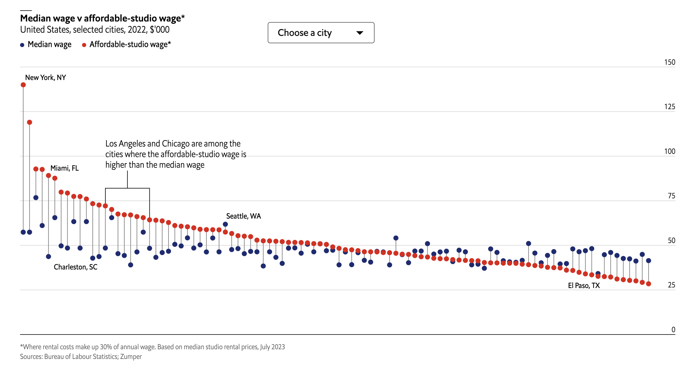

This double lollipop graph below, [originally published by The Economist in 2023](https://www.economist.com/graphic-detail/2023/08/04/our-carrie-bradshaw-index-where-americans-can-afford-to-live-solo), compares the median wage to the affordable studio wage across cities in the United States. It highlights the growing housing affordability crisis and reveals where single renters face the greatest financial challenges. My objective is to recreate this graph as closely as possible using R, and then to propose an alternative visualization.

```{r, echo=FALSE, out.width='100%', out.extra="class=external", fig.cap="The Economist, 2023"}

```

## Replication

```{r}
#| message: false

library(ggplot2)   # Create plots
library(showtext)  # Custom fonts
library(sysfonts)  # Manage fonts
library(readr)     # Read data
library(ggiraph)   # Add tooltips
library(shiny)     # Build interactive web applications (used for dropdown list)
library(rvest)     # Web scraping and extracting data from HTML
library(dplyr)     # General data manipulation
library(stringr)   # String manipulation and cleaning
library(maps)      # Plot basic map outlines
library(sf)        # Handle spatial data (maps)
library(leaflet)   # Create interactive maps
library(scales)    # Format tooltips with commas for better readability
```

### Data

The data to create this graph is not publicly available for download, but I was able to [recreate the dataset](https://drive.google.com/file/d/1gb_THi4IvGiD-ow-DiUVmhMt0aWX0ifb/view?usp=sharing) from the information included in the original graph. Since I recreated the dataset to include the exact information in the original graph, I did not need to clean the data.

```{r}
data <- read_csv("wage_vs_housing_econ.csv")
```

### Basic plot structure

To begin, I created the lollipops for each city, and a black, horizontal line where the y-intercept = 0.

```{r}
my_graph <- ggplot(data, aes(x = reorder(City, -Affordable_Rent_Wage))) +
  geom_segment(aes(xend = City, 
                   y = Affordable_Rent_Wage / 1000, 
                   yend = Average_Wage / 1000),
               color = "#5e5e5e", linewidth = 0.2) +
  geom_point(aes(y = Average_Wage / 1000, color = "Median wage"), size = 1.3) +
  geom_point(aes(y = Affordable_Rent_Wage / 1000, color = "Affordable-studio wage*"), size = 1.3) +
  geom_hline(yintercept = 0, color = "black", linewidth = 0.25) 
my_graph
```

### Legend and labels

Next, I manually defined the y-axis labels. Formatting the y-axis labels to match the original graph was particularly challenging, as they needed to sit above the axis lines while remaining right-justified. To achieve this, I first created custom labels with precise spacing to ensure proper right alignment. Adjusting the label position over the bars will be addressed later as part of the theme customization.

```{r}
my_graph <- my_graph +
  scale_y_continuous(
    name = NULL, 
    position = "right", 
    limits = c(0, 150), 
    expand = expansion(mult = c(0.02, 0.025)),
    breaks = seq(0, 150, by = 25),
    labels = c("    0", "  25", "  50", "  75", "100", "125", "150")) + 
  scale_x_discrete(
      expand = expansion(mult = c(0.01, 0.05)
    )
  )
my_graph
```

Next, I modified the legend. This included defining custom dot sizes and colors and ensuring labels were in the correct order to replicate the original graph.

```{r}
my_graph <- my_graph +
  scale_color_manual(
    name = NULL, 
    values = c("Median wage" = "#1b2b73", "Affordable-studio wage*" = "#e3130b"),
    breaks = c("Median wage", "Affordable-studio wage*"), 
    guide = guide_legend(
      override.aes = list(size = 1.3), 
      direction = "horizontal", 
      title.position = "top", 
      label.position = "right" 
    )
  ) 
my_graph
```

Then I added a title, subtitle, and footer to my graph. At this stage, my graph contained all the essential elements. The next step was refining the theme to closely match the original.

```{r}
my_graph <- my_graph +
  labs(
    title = "Median wage v affordable-studio wage*",
    subtitle = "United States, selected cities, 2022, $'000",
    x = NULL, # Remove x-axis label for cities
    caption = "*Where rental costs make up 30% of annual wage. Based on median studio rental prices, July 2023\nSources: Bureau of Labour Statistics; Zumper"
  )
my_graph
```

### Theme

The Economist has their own proprietary font that I could not access, so I instead chose to use a Google font that would allow others to replicate my graph. I opted for "Roboto Condensed," a similar sans-serif font with a range of weights. My original graph uses three different font weights for the title, subtitle, and legend. Since `font_add_google` only provides plain and bold styles by default, I loaded the font three times, specifying a different weight each time. This allowed me to call the appropriate font weight in my theme for each element.

```{r}
font_add_google(name = "Roboto Condensed", family = "Roboto Condensed Regular", regular.wt = 400)
font_add_google(name = "Roboto Condensed", family = "Roboto Condensed Bold", regular.wt = 700)
font_add_google(name = "Roboto Condensed", family = "Roboto Condensed Light", regular.wt = 300)
showtext_auto()
```

I customized my graph's theme by removing unnecessary elements like x-axis text and grid lines. As I mentioned earlier, I also adjusted the y-axis text for size and alignment. I then specified font weights, sizes, and spacing for the title, subtitle, and caption. Finally, I positioned the legend at the top in a horizontal layout and fine-tuned the margins to closely replicate the overall design and layout.

```{r}
my_graph <- my_graph +
  theme_minimal(base_family = "Roboto Condensed Regular") +  
  theme(
    axis.text.x = element_blank(),  
    axis.ticks.x = element_blank(), 
    panel.grid.major.x = element_blank(), 
    panel.grid.minor = element_blank(),   
    axis.text.y.right = element_text(size = 7, vjust = -0.5, hjust = -5.5), 
    plot.title = element_text(size = 9.5, family = "Roboto Condensed Bold", margin = margin(b = 3)), 
    plot.subtitle = element_text(size = 8.5, family = "Roboto Condensed Light", margin = margin(b = 10)), 
    plot.caption = element_text(hjust = 0, size = 6, color = "#808080", margin = margin(b = -10)), 
    plot.caption.position = "plot", 
    plot.margin = margin(t = 17, r = -5, b = 10, l= 10), 
    legend.position = "top", 
    legend.direction = "horizontal", 
    legend.justification = "left", 
    legend.margin = margin(-5, 0, 0, 0), 
    legend.text = element_text(size = 7), 
    legend.key.size = unit(0, 'cm') 
  )
my_graph
```

### Annotations

The last step was to add in the annotations using `annotate().` I started by adding the annotations for the five selected cities in the original graph.

```{r}
my_graph <- my_graph +
 annotate("text", x = which(data$City == "New York, NY"), y = 144, label = "New York, NY", 
           size = 2.2, hjust = 0, family = "Roboto Condensed Regular") +
  annotate("text", x = which(data$City == "Miami, FL"), y = 94, label = "Miami, FL", 
           size = 2.2, hjust = -0.1, vjust = 1, family = "Roboto Condensed Regular") +
  annotate("text", x = which(data$City == "Charleston, SC"), y = 38, label = "Charleston, SC", 
           size = 2.2, hjust = 0.9, family = "Roboto Condensed Regular") +
  annotate("text", x = which(data$City == "Seattle, WA"), y = 66, label = "Seattle, WA", 
           size = 2.2, hjust = 0, family = "Roboto Condensed Regular") +
  annotate("text", x = which(data$City == "El Paso, TX"), y = 28, label = "El Paso, TX", 
           size = 2.2, hjust = 0.95, family = "Roboto Condensed Regular") 
my_graph
```

Finally, I added the fork structure connecting Los Angeles and Chicago, as well as the annotation text to complete my static replication.

```{r, preview = TRUE}
my_graph <- my_graph +
# Fine-tuned annotation for accurate spacing and alignment
  annotate("text", x = which(data$City == "Los Angeles, CA"), y = 102, 
           label = "Los Angeles and Chicago are among the\ncities where the affordable-studio wage is\nhigher than the median wage", 
           hjust = 0, size = 2.5, family = "Roboto Condensed Regular") +
  
  # Top line of fork
  annotate("segment", x = which(data$City == "Nashville, TN") + 0.5, 
           xend = which(data$City == "Nashville, TN") + 0.5, 
           y = 82, yend = 91, color = "black", linewidth = 0.2) +  
  
  # Horizontal fork line
  annotate("segment", x = which(data$City == "Los Angeles, CA"), 
           xend = which(data$City == "Chicago, IL"), 
           y = 82, yend = 82, color = "black", linewidth = 0.2) +
  
  # Vertical lines of the fork
  annotate("segment", x = which(data$City == "Los Angeles, CA"), 
           xend = which(data$City == "Los Angeles, CA"), 
           y = 73, yend = 82, color = "black", linewidth = 0.25) +  
  annotate("segment", x = which(data$City == "Chicago, IL"), 
           xend = which(data$City == "Chicago, IL"), 
           y = 65, yend = 82, color = "black", linewidth = 0.2)
my_graph
```

## Interaction

The original graph from *The Economist* had two interactive elements: a dropdown selector and hover-over tooltips. I believe both are essential to my graph, as the tooltips are useful for exploration, while the dropdown selector is quicker for users who have a specific city in mind. Therefore, I aimed to replicate both.

I chose to use `ggiraph` for the tooltips because it allowed me to match the format and styling of *The Economist*’s original tooltips and integrates seamlessly with my existing ggplot. Since I wanted to use `ggiraph`, I also needed Shiny to implement the dropdown selector and bring both interactive elements together in the graph.

I was able to keep the titles, legend, axis labels, and theme from the original graph, but needed to make a few changes as shown below.

### Shiny app framework

First, I needed to set up the app's layout with a dropdown menu to select a city, space to display the interactive chart, and the basic setup needed to make the chart update based on user choices.

```{r, eval=FALSE}
ui <- fluidPage(
  tags$head(
    # Add Roboto Condensed from Google Fonts
    tags$link(rel = "stylesheet", 
         href = "https://fonts.googleapis.com/css?family=Roboto+Condensed:400,700")
  ),
  div(selectInput(
    "selected_city", 
    "Choose a city:", 
    choices = c("All", sort(unique(data$City))), 
    selected = "All", 
    width = "600px")
  ),
  girafeOutput("interactive_plot", height = "500px")
)

server <- function(input, output, session) {
  output$interactive_plot <- renderGirafe({

# All the code for my graph will go in here
  })
}

# This line will run the app
shinyApp(ui = ui, server = server)
```

### Tooltips

Then I used `ggiraph` to create tooltips that show details about each city. I used CSS styling to ensure the colors and bolding replicated the tooltips in *The Economist's* version of the graph.

```{r, eval=FALSE}
# Add tooltip text
data$tooltip <- with(data, paste0(
   "<b>", City, "</b><br>",
   "The <b><span style='color:#e3130b;'>affordable rent wage</span></b> is $",
   Affordable_Rent_Wage, ",<br>",
   "which is <b>$", abs(Difference), " ",
    ifelse(Difference < 0, "more than", "less than"),
    "</b> the <b><span style='color:#1b2b73;'>median wage</span></b>."
))

# Render the interactive plot with tooltips
girafe(
  ggobj = interactive_plot,
  options = list(
    opts_hover(css = "opacity: 1; stroke-width: 2px;"),
    opts_selection(css = "opacity: 0.2;"),
    opts_tooltip(css = "background-color: white; color: black; border: 1px solid black; 
padding: 5px; border-radius: 5px; font-family: 'Roboto Condensed', sans-serif; font-size: 14px;")
  )
)
```

### Dropdown selector rules

I also created a dropdown selection rule that uses two sets of colors—bold colors to highlight the selected city and lighter colors to dim unselected cities. The `geom_segment_interactive` function draws lines connecting the affordable rent wage and median wage for each city, while `geom_point_interactive` plots individual data points with the assigned colors and tooltips that appear on hover.

```{r, eval=FALSE}
# Define colors
dark_blue <- "#1b2b73"
dark_red <- "#e3130b"
dark_gray <- "#808080"
lighter_blue <- "#c7d2f1"
lighter_red <- "#fdd4d2"
light_gray <- "#d3d3d3"

# Adjust colors based on selection
data$dot_color_median <- ifelse(
  input$selected_city == "All" | data$City == input$selected_city, dark_blue, lighter_blue
)
data$dot_color_affordable <- ifelse(
  input$selected_city == "All" | data$City == input$selected_city, dark_red, lighter_red
)
data$line_color <- ifelse(
  input$selected_city == "All" | data$City == input$selected_city, dark_gray, light_gray
)

# Build the interactive plot
interactive_plot <- ggplot(data, aes(x = reorder(City, -Affordable_Rent_Wage))) +
  geom_segment_interactive(aes(
    xend = City, 
    y = Affordable_Rent_Wage / 1000, 
    yend = Average_Wage / 1000,
    tooltip = tooltip,
    data_id = City
  ), color = data$line_color, linewidth = 0.2) +
  
  geom_point_interactive(aes(
    y = Average_Wage / 1000,
    tooltip = tooltip,
    data_id = City
  ), color = data$dot_color_median, size = 1.3) +
  
  geom_point_interactive(aes(
    y = Affordable_Rent_Wage / 1000,
    tooltip = tooltip,
    data_id = City
  ), color = data$dot_color_affordable, size = 1.3)
```

Although the Shiny App altered the original formatting slightly, we are left with an [interactive graph](https://isabelmonge.shinyapps.io/shinyapp/) that closely replicated the functionality of The Economist's version.

```{r, echo=FALSE, out.width='100%'}
library(htmltools)

tags$video(
  src = "Shiny_App_Demo.mov",
  type = "video/quicktime",
  width = "600",
  controls = NA
)
```

## Alternative vizualization

For my alternative visualization, I wanted to add to the story of my original graph by showing trends in rent affordability based on city size and location. For this reason, I chose to create an interactive map.

When creating my interactive map, I first considered using `ggplotly` or `ggiraph` because they both integrate well with `ggplot2`. However, `ggplotly` didn’t allow multiple legends, which I needed, and I wasn't able to customize the tooltips the way I wanted. `ggiraph` had good tooltip options but wasn’t built for maps, so its zoom feature didn’t work well, which was an essential functionality given that I have overlapping cities in multiple regions.

Therefore, I chose `leaflet` to create my map. It has smooth zooming, supports multiple legends, and makes tooltips easy to customize. Since I had already started learning some basic CSS for my Shiny app, `leaflet` was simple to use and was the best choice for my project.

### Data joining

I started by joining the preexisting dataset from the Economist with a [new dataset](https://en.wikipedia.org/wiki/List_of_United_States_cities_by_population) that included population data and geographic coordinates for each city.

```{r}
#| warning: false

# Download the population and coordinates data, and clean text strings
pop_and_coordinates <- read_html("https://en.wikipedia.org/wiki/List_of_United_States_cities_by_population") |>
  html_node("table.wikitable.sortable.static-row-numbers.sticky-header-multi") |>
  html_table() |>
  select(City = `City`, State = `ST`, Population = `2023estimate`, Coordinates = `Location`) |> 
  mutate(
    City = str_remove_all(City, "\\[.*?\\]"),
    City = paste(City, State, sep = ", "),                  
    Population = as.numeric(str_remove_all(Population, ",")),
    Coordinates = str_extract(Coordinates, "^[^/]+"
  )
)

# Merge the datasets
merged_data <- left_join(data, pop_and_coordinates, by = "City")

# There were a few cities missing, so I will add them manually
merged_data <- merged_data |>
  mutate(
    Population = case_when(
      City == "Arlington, VA" ~ 238643,
      City == "Asheville, NC" ~ 94589,
      City == "Phoenix, AZ" ~ 1608139,
      City == "Winston Salem, NC" ~ 249545,
      City == "New York, NY" ~ 8467513,
      TRUE ~ Population 
    ),
    Coordinates = case_when(
      City == "Arlington, VA" ~ "38.8797°N 77.1075°W",
      City == "Asheville, NC" ~ "35.5951°N 82.5515°W",
      City == "Phoenix, AZ" ~ "33.4484°N 112.0740°W",
      City == "Winston Salem, NC" ~ "36.0999°N 80.2442°W",
      City == "New York, NY" ~ "40.7128°N 74.0060°W",
      TRUE ~ Coordinates 
  )
)
```

### Data cleaning

Next, I cleaned the data by converting the latitude and longitude data to numeric and eliminating unnecessary character strings. I then capped "Difference" values at ±\$50k because a few cities had extremely high values, which made the colors of all other cities less prominent when plotting. Finally, I created the tooltip as a new column in my dataset, so I could call it later when building the graph.

```{r}
# Clean latitude and longitude data to prepare for plotting
merged_data <- merged_data |>
  mutate(
    Latitude = as.numeric(sub("°.*", "", Coordinates)),
    Longitude = as.numeric(sub(".*[°N|°S|°E|°W]\\s(-?\\d+\\.?\\d*).*", "\\1", Coordinates)),
    Alpha = pmin(1, abs(Difference) / max(abs(Difference), na.rm = TRUE
    )
  )
)

# Apply capping for cities exceeding ±$50k
merged_data <- merged_data |>
  mutate(
    CappedDifference = ifelse(Difference > 50000, 50000, ifelse(Difference < -50000, -50000, Difference)) 
  )

#Adding the tooltip to the dataset
merged_data <- merged_data |>
  mutate(
    Tooltip = paste0(
      "<div style='font-family: Arial, sans-serif; font-size: 12px;'>",
      "<b style='color:black;'>", City, "</b><br>",
      "Population: ", comma(Population), "<br>",
      "The affordable rent wage is $", comma(Affordable_Rent_Wage), ",<br>",
      "which is <b style='color:black;'>$", comma(abs(Difference)), " ",
      ifelse(Difference < 0, "<b style='color:#e3130b;'>more than </b>", 
      "<b style='color:#1b2b73;'>less than </b>"),
      "</b>the median wage.",
      "</div>"
    )
  )
```

### Basic map structure

To begin creating my new graph, I first used the `maps()` and `sf()` packages to load a US Map, and then added state boundaries.

```{r}
#| warning: false

# Load US Map with Accurate Projection
us_map_sf <- st_as_sf(map("state", plot = FALSE, fill = TRUE))

# Initialize Map with Basic Settings
my_map <- leaflet(merged_data) |>
  setView(
    lng = -96.5,    
    lat = 37.8,     
    zoom = 3        
  ) |>
  addProviderTiles(providers$CartoDB.PositronNoLabels)

# Add State Boundaries
my_map <- my_map |>
  addPolygons(
    data = us_map_sf,
    fillColor = "gray90",  
    color = "black",       
    weight = 0.5
  )
my_map
```

### Legend and labels

I added a title, subtitle, and two legends - one for the size and another for the color of each city. I used `addLegend()` for the affordability gap because `leaflet` supports color scale legends, but I used `addLegendCustom()` for population size since `leaflet` doesn’t support custom marker shapes or sizes.

```{r}
# Add title and subtitle
my_map <- my_map |>
  addControl(
    "<div style='font-family: Arial, sans-serif; text-align: center;'>
      <h3 style='margin: 0;'>Where Housing Costs Outpace Wages</h3>
      <p style='margin: 0; font-size: 12px;'>U.S. Cities by Affordability and Size, 2022</p>
    </div>",
    position = "topright"
  )

# Define color palette
color_palette <- colorNumeric(
  palette = c("#e3130b", "#FFFFFF", "#1b2b73"), 
  domain = c(-50000, 50000)
)

# Add affordability gap legend
my_map <- my_map |>
  addLegend(
    position = "bottomright",
    pal = color_palette,
    values = c(-50000, 50000), 
    title = "Affordability<br>Gap (USD)",
    labFormat = function(type, cuts, p) {
      labels <- c("-50k", "", "0k", "", "+50k")
      return(labels)
    },
    opacity = 1
  )

# Add custom population legend
addLegendCustom <- function(map, title, labels, sizes, position) {
  legendHTML <- paste0(
    "<div style='font-family: Arial, sans-serif; text-align: center;'>",
    "<b>", title, "</b><br>",
    paste0(
      "<div style='display: inline-block; width: ", sizes, "px; height: ", sizes, 
      "px; border-radius: 50%; border: 1px solid black; background-color: gray; margin: 5px;'></div>",
      labels, "<br>", collapse = ""
    ),
    "</div>"
  )
  my_map |> addControl(html = legendHTML, position = position)
}

my_map <- addLegendCustom(
  map = map,
  title = "Population<br>(Millions)",
  labels = c("1M", "2M", "3M+"),
  sizes = c(15, 25, 35), 
  position = "bottomleft"
)
my_map
```

### City markers

Finally, I defined the sizes for each city, plotted them on the map using their geographic coordinates, and incorporated the previously specified colors and tooltips to complete the map.

```{r}
# Add city circles
my_map <- my_map |>
  addCircleMarkers(
    lng = ~jitter(-merged_data$Longitude, factor = 5),  
    lat = ~jitter(merged_data$Latitude, factor = 15), 
    # Jitter points slightly to minimize overlap
    radius = ~pmin((Population / 1e6 * 4) + 6, 25),         
    color = "black",                                        
    weight = 1,                                            
    fillColor = ~color_palette(CappedDifference),           
    fillOpacity = 1,                                        
    popup = ~Tooltip                                        
  )
my_map
```
