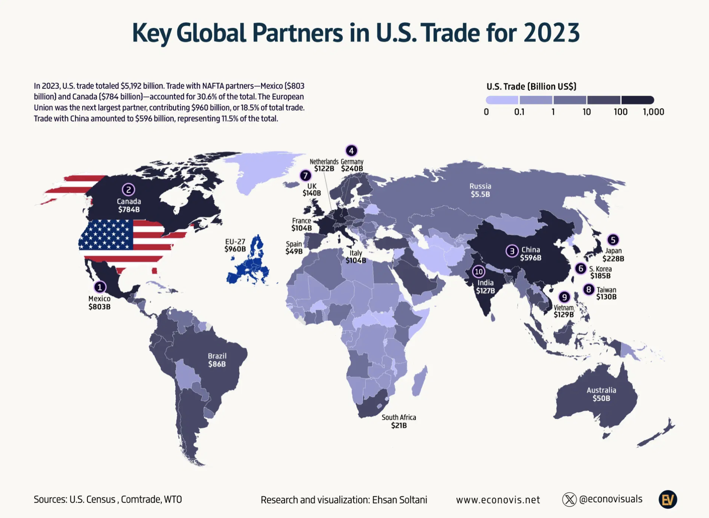

```{r setup, include=FALSE}
knitr::opts_chunk$set(echo = TRUE, fig.width= 14, fig.height= 8, 
                      fig.align='center')
```

## Introduction

The U.S. totaled over $5.1 trillion in trade for the year 2023. This is a truly
staggering amount and it poses the interesting question, which the major trade 
partners are. By looking at trade through this visualization we can also see
how our world today is globalized and connected, even in times of rising global
tensions.

The original visualization can be found following this link https://www.voronoiapp.com/economy/-Top-Global-Trading-Partners-of-the-US-in-2023-2172).

{.external}

## The Visualization
### The Data
#### Getting the data and downloading the packages

First we are going to start by loading the packages. For the Flagon package we
have to take a little detour, since it is not available through the regular 
R function. Therefore, we will download and load it at a later step.

```{r , message=FALSE}
library(ggplot2) 
library(rnaturalearth) 
library(showtext) 
library(sysfonts) 
library(readxl) 
library(dplyr) 
library(ggpattern) 
library(devtools) 
library(patchwork) 
library(ggtext) 
```

Luckily, the data for this visualization was available and only had to be 
downloaded and then transformed to be imported into R. The original data source
is cited as comtrade, U.S. Census and WTO.

```{r }
trade_data <- read_excel("Data Final Project.xlsx")
```

The dataset is already tidy data and is ready to be used for our visualization.
The *raw* trade data which we have imported before now has to be modified to fit 
the trade categories displayed in our visualization and later it will be 
merged with our main world dataset. 

You might wonder why they are split in these specific categories. The reason
is, that later on when we create the legend we can't use a straight forward 
approach and will need to become a bit creative. More about this will follow
once we reach the legend.

```{r}
trade_data <- trade_data %>%
  mutate(trade_category = case_when(
    `U.S. Trade (Billion US$)` < 0.1 ~ "0",
    `U.S. Trade (Billion US$)` < 1 ~ "0.1", 
    `U.S. Trade (Billion US$)` < 10 ~ "1",
    `U.S. Trade (Billion US$)` < 100 ~ "10",
    `U.S. Trade (Billion US$)` < 1000 ~ "100",
    TRUE ~ "1000"))
```
### The map

#### Creating the basic plot
The next step will be to focus on the actual world map. For this we take 
advantage of the rnaturalearth package which provides us with a comprehensive
dataset about the world. We will also need to perform a few modifications to 
better fit the original plot. As you will also notice, we filter the United 
States out of the dataset. This is because the United States are filled with 
the US Flag and therefore we need to exclude it momentarily from our base 
dataset to be able to do this modification later. 

As mentioned earlier, we will now in the same step merge our trade data with the 
world data we have created so we get our base dataset to then start with our
plot. Lastly we also define the colours used in the visualization. They have 
been obtained by using an online tool to get the colour codes from any colour 
you provide it. 

Additionally we also need to download the font. Using an online tool we were
able to determine the font as "montserrat". Luckily it is also available as a
free download and we can use it for our visualization.

```{r}
world <- ne_countries()

excluded_countries <- c("French Southern and Antarctic Lands","Antarctica",
                        "Falkland Islands / Malvinas")

#removing the excluded countries and the United States
world <- world %>% 
  filter(!name_long %in% excluded_countries) %>% 
  filter(!name_long %in%  "United States")

#incorporate the trade data into to world dataset
world <- left_join(world, trade_data, by = c("name_long" = "Country"))

#defining the colours used for the map
colors <- c("#bdbcfe", "#9494cd", "#6d6f9c", "#49476a", "#21213c")

font_add_google("Montserrat", "montserrat")
showtext_auto()

```

Now we have everything ready to actually create the first draft of our 
visualization. There is still a long way to go but we can plot the first 
draft with the help of the ggplot2 package to see the map with the exclusions 
and the colours for the trade data. 

```{r}
X <- ggplot(data = world) +
  geom_sf(aes(fill = as.character(trade_category)), 
          color = "#faf8f4", 
          linewidth = 0.05) +
  coord_sf(crs = "+proj=robin") +
  scale_fill_manual(values = colors)

X
```

After having created our first plot we will continue enhancing it and 
getting it closer to the original one. The first thing that comes to mind, apart
from the legend, are the gridlines present in the plot and the background.

We can start to fix one of two problems easily by adding the following lines of 
code to our ggplot. In the same step we will also go ahead and add the title and 
subtitle to our plot. To make the title and subtitle look right, we also 
adjust the font corresponding to the original visualization. By defining this
in our theme, it will automatically be adjusted for all text elements.

```{r}
X <- X + theme_void() +
  labs(title = "Key Global Partners in U.S. Trade for 2023", 
       subtitle = paste("In 2023, U.S. trade totaled $5,192 billion. ",
                        "Trade with NAFTA partnes-Mexico ($803\nbillion ",
                        "and Canada ($784 billion)-accounted for 30.6% of the ",
                        "total. The European\nUnion was the next largest ",
                        "partner, contribution $986 billion, or 18.5% of total",
                        " trade.\nTrade with China amounted to $596 billion, ",
                        "representing 11.5% of the total.", sep = "")) +
  
  #now the theme is being modified to replicate the title and subtitle from the
  #original plot and in the same step we also adjust the background
  theme(plot.title = element_text(hjust = 0.5, 
                                  size = 18, 
                                  face = "bold", 
                                  colour = "#042f4a"),
        plot.background = element_rect(fill = "#faf8f4"),
        plot.subtitle = element_text(hjust = 0.05,
                                     vjust = -1),
        text = element_text(family = "montserrat"))
  
X
```

Now it already looks much more familiar. Let's not focus on the details like
positioning and font size yet, but we will look at the more important things 
like the legend. First of all we need to turn the legend and make it horizontal
and position it somewhat in the top right corner. We also need to fix the labels
and get rid of the NA category. 

In order to get the labels of the scale to their correct position, there were
some tricks needed. By default the labels would be centered under each category
and by moving them to the left or right they wouldn't center, since they
all have a different length.

On a side note: If you look closely and compare the visualization and the 
original one, you will note a difference in the colourization of Libya. 
In the original plot the categorization of Libya does not correspond with the
reported trade value from the dataset. 

```{r, warning=FALSE, message=FALSE}
X <- X + theme(legend.direction = "horizontal",
        legend.position = c(0.82, 0.99),
        legend.title = element_text(size = 14, 
                                    face = "bold", 
                                    color = "#030001"),
        legend.text = element_text(size = 12, 
                                   color = "#030001"),
        legend.margin = margin(t = 0, r = 0, b = 0, l = 0),
        panel.margin = margin(t = 50, r = 50, b = 50, l = 50)) +
  
  scale_fill_manual(values = colors, name = "U.S. Trade (Billion US$)",
                    breaks = c("0", "0.1", "1", "10", "100", "1000"),
                    labels = c("   0  ",
                               " 0.1  ", 
                               "    1 ", 
                               "  10  ", 
                               "100   ",
                               "1'000")) +
  
  guides(fill = guide_legend(
    title.position = "top",
    title.hjust = 0,
    label.position = "bottom",
    label.hjust = -1,
    label.vjust = 0.5,
    keywidth = unit(1.5, "cm"),
    keyheight = unit(0.4, "cm")))

X
```

#### The flag
After creating the basic map, we can start adding the details. Most 
notably, the flag is still missing. For this we are going to use the flagon 
package to get the image of the flag and the spData package for the isolated
U.S. mainland and Alaska multipolygon. The flagon package is not available to 
be downloaded through the regular R function, therefore we must take a slightly
different approach and download it directly from Github.

For Alaska it took a bit of a trial and error process, to figure out the 
appropriate scale parameter, so that we get the portion of the flag we were
looking for.

```{r, message=FALSE}

usa <- spData::us_states |> sf::st_union()
alaska <- spData::alaska


install_github("coolbutuseless/flagon")
library(flagon)
flag <- flags("US", filetype = "png")

X1 <- X +
  geom_sf_pattern(data = usa, 
                  pattern = 'image',
                  pattern_filename = flag,
                  pattern_type = "expand",
                  color = NA) +
  geom_sf_pattern(data = alaska, 
                  pattern = 'image', 
                  pattern_filename = flag,
                  pattern_type = "none", 
                  pattern_scale= 0.3, 
                  pattern_gravity = "southwest",
                  color = NA)+
  coord_sf(crs = "+proj=robin")


```
#### The EU-27 subplot

Having fitted the flag we now continue by creating the EU-27 subplot.
First we had to define a new vector with the EU-27 countries from the original
plot. After this, the world dataset is filtered so only the EU-27 countries 
remain and we can create the new plot. After that we then only have to set the
borders so we don't get the islands in the Atlantic.

```{r}
EU_27 <- c("Austria", "Belgium", "Bulgaria", "Croatia", "Cyprus", 
           "Czech Republic", "Denmark", "Estonia", "Finland", "France", 
           "Germany", "Greece", "Hungary", "Ireland", "Italy", "Latvia", 
           "Lithuania", "Luxembourg", "Malta", "Netherlands", "Poland", 
           "Portugal", "Romania", "Slovakia", "Slovenia", "Spain", "Sweden")

world_EU <- world %>% 
  filter(name_long %in% EU_27)

EU <- ggplot(data = world_EU) +
  geom_sf(fill = "#01339a", 
          color = "#faf8f4", 
          linewidth = 0.25) +
  
  #setting the limits of the plot to cut off the Atlantic islands
  coord_sf(xlim = c(-20,40), 
           ylim = c(35,70)) +
  coord_sf(crs = "+proj=longlat") +
  theme_void()


```

#### Adding them together

To finalize the map of our plot we add the EU-27 plot to the main plot. There
is a package called ggpatchwork for this, which allows us to position it and
scale it accordingly. This will now yield our final map which only needs 
the annotations to make it complete.

```{r}
M <- X1 + inset_element(EU, left = 0.13, bottom = 0.4, right = 0.63, 
                       top = 0.725)

M
```

#### Annotations

To finalize our plot we now need to add all the annotations. This step is a bit
tedious, since every annotation has to be added manually. Additionally to this,
certain elements of the annotation have to be somewhat "constructed", like the
background of the numbers corresponding to the countries.

To simplify the process of finding the correct font size and
being able to adjust it across all annotations efficiently, the font size is 
defined by a variable. Since the annotations are hierarchical, we can layer 
shapes and texts on top of each other. This allowed the creation of the circles
whit a number on top. There is also the instance of Germany and the Netherlands, 
where this feature of layering has been taken further advantage of. For these 
two annotations, the background has been filled with the colour of the main 
background, so we can cover up some small islands there. These were not able to 
be filtered out, since their geometrical information is stored in the 
same variable as the data for the mainland.

For the legend we also use some tricks. By default R does not allow the 
creation of legends with rounded edges. To bypass this restriction, we will 
create a geom and lay it over the edges of the rectangular legend to create
the illusion of a rounded edge.

Additionaly, we used a special form of annotation, taking full advantage of the
ggtext package. As you can see, certain annotations are performed using the 
richtext geom parameter, which gives us a lot of options to then modify the 
text. Only with this we were able to define custom breaks and also make
certain parts of the annotation bold without any other restrictions.

```{r}
font_size <- 3

X2 <- X1 +
  geom_point(x = -9700000, y = 2100000, 
             size = 6.5, stroke = 1, shape = 21,
             color = "violet", fill = "black") +
  annotate("text", x = -9700000, y = 2100000, 
           label = "1", color = "white") +
  annotate("richtext", x = -9700000, y = 1400000,
           label = "Mexico<br><b>$803B</b>",
           size = font_size,
           lineheight = 0.8,
           fill = NA,
           label.color = NA) +
  
  geom_point(x = -8200000 , y = 5800000 + 700000, 
             size = 6.5, stroke = 1, shape = 21,
             color = "violet", fill = "black") +
  annotate("text", x = -8200000 , y = 5800000 + 700000, 
           label = "2", color = "white") +
  annotate("richtext", x= -8200000, y = 5800000,
           label = "Canada<br><b>$784B</b>",
           size = font_size,
           lineheight = 0.8,
           fill = NA,
           label.color = NA,
           color = "white") +
  
  geom_point(x = 9100000 -800000, y = 3700000 + 180000, 
             size = 6.5, stroke = 1, shape = 21,
             color = "violet", fill = "black") +
  annotate("text", x = 9100000 - 800000, y = 3700000 + 180000, 
           label = "3", color = "white") +
  annotate("richtext", x= 9100000, y = 3700000,
           label = "China<br><b>$596B</b>",
           size = font_size,
           lineheight = 0.8,
           fill = NA,
           label.color = NA,
           color = "white") +
  
  annotate("richtext", x= 1690000, y = 7800000,
           label = "Germany<br><b>$240B</b>",
           size = font_size,
           lineheight = 0.8,
           fill = "#faf8f4",
           label.color = NA) +
  geom_point(x = 1680000, y = 7800000 + 700000, 
             size = 6.5, stroke = 1, shape = 21,
             color = "violet", fill = "black") +
  annotate("text", x = 1680000, y = 7800000 + 700000, 
           label = "4", color = "white") +
  
  geom_point(x = 13000000, y = 3900000 + 700000, 
             size = 6.5, stroke = 1, shape = 21,
             color = "violet", fill = "black") +
  annotate("text", x = 13000000, y = 3900000 + 700000, 
           label = "5", color = "white") +
  annotate("richtext", x= 13000000, y = 3900000,
           label = "Japan<br><b>$228B</b>",
           size = font_size,
           lineheight = 0.8,
           fill = NA,
           label.color = NA) +
  
  geom_point(x = 12600000 -1000000, y = 3000000 + 180000, 
             size = 6.5, stroke = 1, shape = 21,
             color = "violet", fill = "black") +
  annotate("text", x = 12600000 -1000000, y = 3000000 + 180000, 
           label = "6", color = "white") +
  annotate("richtext", x= 12600000, y = 3000000,
           label = "S.Korea<br><b>$185B</b>",
           size = font_size,
           lineheight = 0.8,
           fill = NA,
           label.color = NA) +
  
  annotate("richtext", x= 70000, y = 7800000,
           label = "Netherlands<br><b>$122B</b>",
           size = font_size,
           lineheight = 0.8,
           fill = "#faf8f4",
           label.color = NA) +
  
  geom_point(x = -300000 -370000, y = 6550000 + 600000, 
             size = 6.5, stroke = 1, shape = 21,
             color = "violet", fill = "black") +
  annotate("text", x = -300000 -370000, y = 6550000 + 600000, 
           label = "7", color = "white") +
  annotate("richtext", x= -300000, y = 6550000,
           label = "UK<br><b>$140B</b>",
           size = font_size,
           lineheight = 0.8,
           fill = NA,
           label.color = NA) +
  
  geom_point(x = 12200000 -900000, y = 2350000 + 180000, 
             size = 6.5, stroke = 1, shape = 21,
             color = "violet", fill = "black") +
  annotate("text", x = 12200000 -900000, y = 2350000 + 180000, 
           label = "8", color = "white") +
  annotate("richtext", x= 12200000, y = 2350000,
           label = "Taiwan<br><b>$130B</b>",
           size = font_size,
           lineheight = 0.8,
           fill = NA,
           label.color = NA) +
  
  geom_point(x = 10750000 , y = 1500000 + 700000, 
             size = 6.5, stroke = 1, shape = 21,
             color = "violet", fill = "black") +
  annotate("text", x = 10750000 , y = 1500000 + 700000, 
           label = "9", color = "white") +
  annotate("richtext", x= 10750000, y = 1500000,
           label = "Vietnam<br><b>$129B</b>",
           size = font_size,
           lineheight = 0.8,
           fill = NA,
           label.color = NA) +
  
  geom_point(x = 7450000 -390000, y = 2400000 + 400000, 
             size = 6.5, stroke = 1, shape = 21,
             color = "violet", fill = "black") +
  annotate("text", x = 7450000 -390000, y = 2400000 + 400000, 
           label = "10", color = "white") +
  annotate("richtext", x= 7450000, y = 2200000,
           label = "India<br><b>$127B</b>",
           size = font_size,
           lineheight = 0.8,
           fill = NA,
           label.color = NA,
           color = "white") +
  
  annotate("richtext", x= 7300000, y = 6500000,
           label = "Russia<br><b>$5.5B</b>",
           size = font_size,
           lineheight = 0.8,
           fill = NA,
           label.color = NA,
           color = "white") +
  
   
  annotate("richtext", x= -4000000, y = 4000000,
           label = "EU-27<br><b>$960B</b>",
           size = font_size,
           lineheight = 0.8,
           fill = NA,
           label.color = NA) +
  
  annotate("richtext", x= -4800000, y = -850000,
           label = "Brazil<br><b>$86B</b>",
           size = font_size,
           lineheight = 0.8,
           fill = NA,
           label.color = NA,
           color = "white") +
  
  annotate("richtext", x= 3250000, y = -4000000,
           label = "South Africa<br><b>$21B</b>",
           size = font_size,
           lineheight = 0.8,
           fill = NA,
           label.color = NA) +
  
  annotate("richtext", x= 12500000, y = -2500000,
           label = "Australia<br><b>$50B</b>",
           size = font_size,
           lineheight = 0.8,
           fill = NA,
           label.color = NA,
           color = "white") +
  
  annotate("richtext", x= -900000, y = 5000000,
           label = "France<br><b>$104B</b>",
           size = font_size,
           lineheight = 0.8,
           fill = NA,
           label.color = NA) +
  
  annotate("richtext", x= -1400000, y = 4250000,
           label = "Spain<br><b>$49B</b>",
           size = font_size,
           lineheight = 0.8,
           fill = NA,
           label.color = NA) +
  
  annotate("richtext", x= 1500000, y = 3500000,
           label = "Italy<br><b>$104B</b>",
           size = font_size,
           lineheight = 0.8,
           fill = NA,
           label.color = NA) +
  
  geom_point(x = 7500000, y = 9029500, 
             size = 4.6,
             color = "#bdbcfe") +
  geom_point(x = 16100000, y = 9029500, 
             size = 4.6,
             color = "#21213c") +
  
  annotate("text", label = "1,000",
             x = 16300000, y = 8400000,
             family = "montserrat",
             size = 4.24)
  
```    

### The final replication

Now that we have added all the annotations to the plot, adjusted the legend
as well as created our EU subplot, we can bring everything together and 
present the final visualization


```{r, preview = TRUE}           

M <- X2 + inset_element(EU, left = 0.13, bottom = 0.4, right = 0.63, 
                       top = 0.725)

M

```
## The Improvement 

Let's look at an idea on how to improve the visualization. One thing which 
always seemed a bit intriguing whilst looking at the map was, that the 
categorization makes many countries look the same, or very close to each other, 
even though their trade levels are vastly different. With the improved version 
this issue should be resolved. 

### Adjusting the scales

First we want to get rid of the categorization of the trade data. The visual 
difference from a $2 billion and a $595 billion country is just too small, and 
for countries like India and China ($127 billion vs. $595 billion) it is even 
non existent.

Since we still have to deal with a vast array of different trade levels we will
keep the idea of a logarithmic scale, but this time we will make it continuous
and not discrete as in the case before. For this we will need an additional 
package, so we can define the scales in a better way.

To further enhance the readability, the plotting of the dataset has been 
modified, so that we only take values from 0.025 to 800 in to account. 
This means, that the values below and above these two barriers are going to be
plotted as values on the border.


```{r}

library(scales)

A <- ggplot(data = world) +
  geom_sf(aes(fill = world$`U.S. Trade (Billion US$)`), 
          color = "#faf8f4", 
          linewidth = 0.05,
          show.legend = TRUE) +
  coord_sf(crs = "+proj=robin") +
  
  labs(title = "Key Global Partners in U.S. Trade for 2023", 
       subtitle = paste("In 2023, U.S. trade totaled $5,192 billion. ",
                        "Trade with NAFTA partnes-Mexico ($803\nbillion ",
                        "and Canada ($784 billion)-accounted for 30.6% of the ",
                        "total. The European\nUnion was the next largest ",
                        "partner, contribution $986 billion, or 18.5% of total",
                        " trade.\nTrade with China amounted to $596 billion, ",
                        "representing 11.5% of the total.", sep = "")) +
  
  scale_fill_gradient(name = "U.S. Trade (Billion US$)",
                      low = "#E4DFF0",
                      high = "#240083",
                      trans = "log",
                      breaks = c(0.1,50,800),
                      labels = c("0.1","50","800"),
                      limits = c(0.025,800),
                      oob = scales::squish,
                      
                      guide = guide_colorbar(
                        title.position = "top",
                        title.hjust = 0.5,
                        label.position = "bottom",
                        barwidth = unit(5,"cm"),
                        barheight = unit(0.5,"cm")
                      )) +  

  
  theme_void() +
  theme(plot.title = element_text(hjust = 0.5,
                                  size = 18,
                                  face = "bold",
                                  colour = "#042f4a"),
        plot.subtitle = element_text(hjust = 0.05,
                                     vjust = -1),
        plot.background = element_rect(fill = "#faf8f4"),
        legend.direction = "horizontal",
        legend.position = c(0.82,0.98)) 
  
```

After these adjustments in the code, the rest of it will be very similar to the
former code. Therefore we will add all the annotations and the U.S. Flag. One of
the differences is, that we don't need to make all the manual adjustments to
the legend.

```{r}
  
#adding the annotations
font_size <- 3
  
  A1 <- A +
  geom_point(x = -9700000, y = 2100000, 
             size = 6.5, stroke = 1, shape = 21,
             color = "violet", fill = "black") +
  annotate("text", x = -9700000, y = 2100000, 
           label = "1", color = "white") +
  annotate("richtext", x = -9700000, y = 1400000,
           label = "Mexico<br><b>$803B</b>",
           size = font_size,
           lineheight = 0.8,
           fill = NA,
           label.color = NA) +
  
  geom_point(x = -8200000 , y = 5800000 + 700000, 
             size = 6.5, stroke = 1, shape = 21,
             color = "violet", fill = "black") +
  annotate("text", x = -8200000 , y = 5800000 + 700000, 
           label = "2", color = "white") +
  annotate("richtext", x= -8200000, y = 5800000,
           label = "Canada<br><b>$784B</b>",
           size = font_size,
           lineheight = 0.8,
           fill = NA,
           label.color = NA,
           color = "white") +
  
  geom_point(x = 9100000 -800000, y = 3700000 + 180000, 
             size = 6.5, stroke = 1, shape = 21,
             color = "violet", fill = "black") +
  annotate("text", x = 9100000 - 800000, y = 3700000 + 180000, 
           label = "3", color = "white") +
  annotate("richtext", x= 9100000, y = 3700000,
           label = "China<br><b>$596B</b>",
           size = font_size,
           lineheight = 0.8,
           fill = NA,
           label.color = NA,
           color = "white") +
  
  annotate("richtext", x= 1690000, y = 7800000,
           label = "Germany<br><b>$240B</b>",
           size = font_size,
           lineheight = 0.8,
           fill = "#faf8f4",
           label.color = NA) +
  geom_point(x = 1680000, y = 7800000 + 700000, 
             size = 6.5, stroke = 1, shape = 21,
             color = "violet", fill = "black") +
  annotate("text", x = 1680000, y = 7800000 + 700000, 
           label = "4", color = "white") +
  
  geom_point(x = 13000000, y = 3900000 + 700000, 
             size = 6.5, stroke = 1, shape = 21,
             color = "violet", fill = "black") +
  annotate("text", x = 13000000, y = 3900000 + 700000, 
           label = "5", color = "white") +
  annotate("richtext", x= 13000000, y = 3900000,
           label = "Japan<br><b>$228B</b>",
           size = font_size,
           lineheight = 0.8,
           fill = NA,
           label.color = NA) +
  
  geom_point(x = 12600000 -1000000, y = 3000000 + 180000, 
             size = 6.5, stroke = 1, shape = 21,
             color = "violet", fill = "black") +
  annotate("text", x = 12600000 -1000000, y = 3000000 + 180000, 
           label = "6", color = "white") +
  annotate("richtext", x= 12600000, y = 3000000,
           label = "S.Korea<br><b>$185B</b>",
           size = font_size,
           lineheight = 0.8,
           fill = NA,
           label.color = NA) +
  
  annotate("richtext", x= 70000, y = 7800000,
           label = "Netherlands<br><b>$122B</b>",
           size = font_size,
           lineheight = 0.8,
           fill = "#faf8f4",
           label.color = NA) +
  
  geom_point(x = -300000 -370000, y = 6550000 + 600000, 
             size = 6.5, stroke = 1, shape = 21,
             color = "violet", fill = "black") +
  annotate("text", x = -300000 -370000, y = 6550000 + 600000, 
           label = "7", color = "white") +
  annotate("richtext", x= -300000, y = 6550000,
           label = "UK<br><b>$140B</b>",
           size = font_size,
           lineheight = 0.8,
           fill = NA,
           label.color = NA) +
  
  geom_point(x = 12200000 -900000, y = 2350000 + 180000, 
             size = 6.5, stroke = 1, shape = 21,
             color = "violet", fill = "black") +
  annotate("text", x = 12200000 -900000, y = 2350000 + 180000, 
           label = "8", color = "white") +
  annotate("richtext", x= 12200000, y = 2350000,
           label = "Taiwan<br><b>$130B</b>",
           size = font_size,
           lineheight = 0.8,
           fill = NA,
           label.color = NA) +
  
  geom_point(x = 10750000 , y = 1500000 + 700000, 
             size = 6.5, stroke = 1, shape = 21,
             color = "violet", fill = "black") +
  annotate("text", x = 10750000 , y = 1500000 + 700000, 
           label = "9", color = "white") +
  annotate("richtext", x= 10750000, y = 1500000,
           label = "Vietnam<br><b>$129B</b>",
           size = font_size,
           lineheight = 0.8,
           fill = NA,
           label.color = NA) +
  
  geom_point(x = 7450000 -390000, y = 2400000 + 400000, 
             size = 6.5, stroke = 1, shape = 21,
             color = "violet", fill = "black") +
  annotate("text", x = 7450000 -390000, y = 2400000 + 400000, 
           label = "10", color = "white") +
  annotate("richtext", x= 7450000, y = 2200000,
           label = "India<br><b>$127B</b>",
           size = font_size,
           lineheight = 0.8,
           fill = NA,
           label.color = NA,
           color = "white") +
  
  annotate("richtext", x= 7300000, y = 6500000,
           label = "Russia<br><b>$5.5B</b>",
           size = font_size,
           lineheight = 0.8,
           fill = NA,
           label.color = NA,
           color = "white") +
  
  
  annotate("richtext", x= -4000000, y = 4000000,
           label = "EU-27<br><b>$960B</b>",
           size = font_size,
           lineheight = 0.8,
           fill = NA,
           label.color = NA) +
  
  annotate("richtext", x= -4800000, y = -850000,
           label = "Brazil<br><b>$86B</b>",
           size = font_size,
           lineheight = 0.8,
           fill = NA,
           label.color = NA,
           color = "white") +
  
  annotate("richtext", x= 3250000, y = -4000000,
           label = "South Africa<br><b>$21B</b>",
           size = font_size,
           lineheight = 0.8,
           fill = NA,
           label.color = NA) +
  
  annotate("richtext", x= 12500000, y = -2500000,
           label = "Australia<br><b>$50B</b>",
           size = font_size,
           lineheight = 0.8,
           fill = NA,
           label.color = NA,
           color = "white") +
  
  annotate("richtext", x= -900000, y = 5000000,
           label = "France<br><b>$104B</b>",
           size = font_size,
           lineheight = 0.8,
           fill = NA,
           label.color = NA) +
  
  annotate("richtext", x= -1400000, y = 4250000,
           label = "Spain<br><b>$49B</b>",
           size = font_size,
           lineheight = 0.8,
           fill = NA,
           label.color = NA) +
  
  annotate("richtext", x= 1500000, y = 3500000,
           label = "Italy<br><b>$104B</b>",
           size = font_size,
           lineheight = 0.8,
           fill = NA,
           label.color = NA)


#adding the U.S. Flag
usa <- spData::us_states |> sf::st_union()
alaska <- spData::alaska


A1 <- A1 +
  geom_sf_pattern(data = usa, 
                  pattern = 'image',
                  pattern_filename = flag,
                  pattern_type = "expand",
                  color = NA) +
  geom_sf_pattern(data = alaska, 
                  pattern = 'image', 
                  pattern_filename = flag,
                  pattern_type = "none", 
                  pattern_scale= 0.3, 
                  pattern_gravity = "southwest",
                  color = NA)+
  coord_sf(crs = "+proj=robin")  
  
  
 
#adding the EU plot 
EU1 <- ggplot(data = world_EU) +
  geom_sf(fill = "#240083", 
          color = "#faf8f4", 
          linewidth = 0.25) +
  coord_sf(xlim = c(-20,40), 
           ylim = c(35,70)) +
  coord_sf(crs = "+proj=longlat") +
  theme_void()
```

Now that we have added all the key elements from before again, we are just left
with joining the main plot and the EU subplot. This is done easily again
with the same function from the patchwork package. 


```{r}
Im <- A1 + inset_element(EU1, left = 0.13, bottom = 0.4, right = 0.63, 
                        top = 0.725)
Im

```

#### Limitations

One thing that differs from both the replication and the improved version is, 
that the footnotes from the original visualization are not included. This has 
been done on purpose, since they don't provide any benefit or information 
regarding the visualization. In the improved version the new scale is a 
continuous logarithmic scale, that allowed us to visualize a dataset with 
values ranging from 0.0001 to 960. This therefore comes at a small price of the 
legend breaks not being evenly spaced. An idea could be, to disproportionately 
stretch the legend to make the breaks more evenly spaced. Currently this is not 
possible in R, it is also questionable if it would even generate any benefit or
make the legend harder to read. 

Another limitation of this visualization is, that we do not see how the trade
is structured. We only see that the U.S. trades with Mexico, but we don't know
if they import more or export more. For a further project this could be an 
interesting and challenging idea, to incorporate this additional information
in to the visualization.
