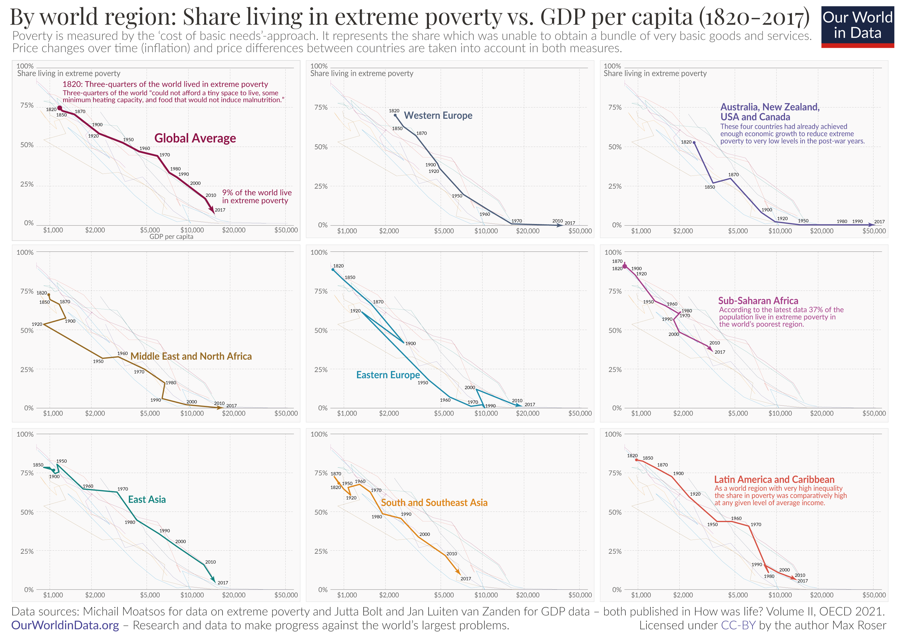

```{r setup, include=FALSE}
knitr::opts_chunk$set(echo = TRUE, fig.showtext = TRUE)
```

## On Extreme poverty and GDP

[When asked](https://www.gapminder.org/questions/gms1-3/) if the world's population living in extreme poverty has halved, stayed the same, or double in the last 20 years, about two thirds of respondents will say it has doubled – when, in fact, it has more than halved, which only one in in every ten person will guess. The misconception stems out our dichotomous perception of the social classes between rich and poor, all the while an overwhelming majority of people live in between those two extremes. The inaccurate negative understanding of this economic asymmetry brings us to two key points: firstly, we *believe that everything everywhere is becoming worse* which leads to, secondly, *diverting our attention away from the actual trends* at hand.

[OurWorldinData](https://ourworldindata.org/extreme-poverty-in-brief#article-citation) takes a closer look at the current developments in poverty. Particularly, they are interested in highlighting the necessity to differentiate between people living in poverty, and people living in *extreme poverty*, i.e. living on less than 2.15\$ a day, as without this distinction we would not understand the crucial differences and trends in living standards within impoverished people. In the graph below we can observe how with this metric relates to the GDP of a country. Tackling out previously mentioned key points, we see the important share of wealth that has propelled many world regions out of extreme poverty in the last 200 years, and at the same time recognize which world regions have disproportionate percentages of extreme poverty in comparison to other regions. While it takes just a bit to understand the underlying relationship that OurWorldinData seeks to visualize, the point is that economic growth implies poverty decline, and stagnated economies imply higher poverty rates.

.](Growth-and-poverty-since-1820.png){.external width="100%"}

Hence, to quote Max Roser, the author of this graph and corresponding article, "what needs explanation is not poverty, but prosperity." I find this point particularly intriguing, and will refer back to it in my proposal for the graph improvement. However, first let us take a look at the replication of the original

## Before we start...

### Library and fonts

To replicate the graph, the below packages and font families were used. The fonts were retrieved, for free, from Google Fonts. The libraries are commented within the chunks they started being used.

```{r library}

library(readxl) 
library(tidyverse) 
library(dplyr) 
library(ggplot2)
library(forcats)
library(ggtext)
library(grid)

# dowload fonts
sysfonts::font_add_google("Playfair Display", family = "playfair display")
sysfonts::font_add_google("Lato", family = "lato")
sysfonts::font_add_google("Lato", family = "lato_light", regular.wt=300)

# activate fonts to use them with ggplot 
showtext::showtext_auto()
```

### Retrieving and tidying the data

While OurWorldinData does normally provide a direct link to download the data used in their graphs, this specific one did not have such an option. While there is a newer, [updated version](https://ourworldindata.org/grapher/the-share-of-people-living-in-extreme-poverty-vs-gdp-per-capita) of the graph, I decided to email directly the creator, Max Roser, who indicated me to the [research done by the Organisation for Economic Co-operation and Development OECD](https://www.oecd.org/en/publications/how-was-life-volume-ii_3d96efc5-en/full-report/component-14.html#chapter-d1e59754). It used to be that the tables with the information about extreme poverty and GDP trends were easily accessible, but now one has to scan the whole article and find the tables like a needle in a hay stack.

```{r data reading}
# library(readxl)
gdp <- read_xlsx(path = "GDP world.xlsx")

poverty <- read_xlsx(path = "poverty world.xlsx")

```

We have two data sets: gdp, 21 observations (years from 1820-2016 in arbitrary increases) over 10 variables (YEAR + country regions), and poverty, with 13 observations (years from 1820-2016 in arbitrary increases) over 9 variables (YEAR + country regions). We will go over the differences below, when we clean the data. First, we will make it tidy adhering to the idea one variable should be stored in one column. Hence, as the column names represet regions, we `pivot_longer` to create in both data sets a new columns where the region and the metric (GDP or extreme poverty index) is indicated. Finally, we `full_join` the data sets together and make GDP a numerical variable without spaces. We obtain a tibble with 221 observations over 4 variables: YEAR, region, GDP and poverty.

```{r combine GDP and poverty}
# library(tidyverse) 
# library(dplyr) 

# gdp
gdp <- gdp |> 
  pivot_longer(
    cols = -YEAR,        
    names_to = "region",  
    values_to = "GDP"      
  )

# poverty
poverty <- poverty |> 
  pivot_longer(
    cols = -YEAR,          
    names_to = "region",  
    values_to = "poverty"  
  )

# combine
world <- gdp |> 
  full_join(poverty, by = c("YEAR", "region")) |> 
  mutate(GDP = str_remove_all(GDP, pattern = "\\s")) |> 
  mutate(GDP = as.numeric(GDP)) 

world
```

### Cleaning the data

Cleaning the data posed itself as a tedious task due to various challenges. Firstly, as mentioned, the data sets differentiated each other by 8 observations and 1 variable. This is due to GDP having information (observations) during more years and having an extra region, "World," that represents the global average.

The first, and easier task, was to **clean the regions names**, as some had been spelled differently in the different data set ("Latin America and Ca[rr]{.underline}ibean" vs "Latin America and Cari[bb]{.underline}ean" and "South and Southeast Asia" vs "South and Southeast Asia**)**").

In hindsight, the simplest solution would have been to clean the names before merging the data sets. However, as one does learn from their mistakes, I have left my creative, but extremely unnecessarily complicated approach to the task at hand. The idea was to extract the data that contained the wrong names into a "phantom data set", clean the names, merge the poverty and GDP information, and the re-join that phantom data set into the original data set.

```{r data cleaning}
# check name disparities
unique(world$region)

# clean South and Southeast Asia

# create new data set 
clean_southeast <- world |>
  filter(region %in% c("South and Southeast Asia", "South and Southeast Asia)")) |>
  mutate(region = "South and Southeast Asia") |>
  group_by(YEAR, region = "South and Southeast Asia") |>

  # select the first non-missing GDP or poverty value
  summarise(
    GDP = first(na.omit(GDP)),
    poverty = first(na.omit(poverty)),
    .groups = "drop"
  )

# remove the region from the original dataset 
world <- world |> 
  filter(!region %in% c("South and Southeast Asia", 
                          "South and Southeast Asia)"))

clean_world <- bind_rows(world, clean_southeast)

world <- clean_world

# clean Latin America and Caribbean

clean_latin <- world |>
  filter(region %in% c("Latin America and Carribean", "Latin America and Caribbean")) |>
  mutate(region = "Latin America and Caribbean") |>
  group_by(YEAR, region = "Latin America and Caribbean") |>
  summarise(
    GDP = first(na.omit(GDP)),
    poverty = first(na.omit(poverty)),
    .groups = "drop"
  )

world <- world |> 
  filter(!region %in% c("Latin America and Carribean", 
                        "Latin America and Caribbean"))

clean_world <- bind_rows(world, clean_latin)
world <- clean_world
```

The second, also easy, task was to **rename** the "Western Offshoots" as our goal regions "Australia, New Zealand, USA and Canada" and World as "Global Average." This was not strictly necessary as the annotations of the regions in the final graph will be done manually, but it did improve clarity during the replication process.

```{r recoding names}
# recode names 

world <- world |> 
  mutate(region = recode(region,
                         "Western Offshoots" = 
                           "Australia, New Zealand, USA and Canada"), 
         region = recode(region, "World" = "Global Average"))
```

Finally, the last, and most time-consuming step in the cleaning process was **supplementing the data**. The hardship with this step was not its execution per se, but figuring out which data to use for the supplementation. The original article that provided the excel tables about the world GDP and poverty trends also included tables with information about 25 countries in both these metrics. Therefore, different questions arose: does GDP need supplementation, as it already has some information for its "Global Average" region? Is the supplementation done with the means of the observations out of 25 countries? Or with the means of the observations of the countries already grouped in regions? Or maybe a mix of both? These questions were answered by trial and error, as OurWorldinData had given me no information thereof nor was there any to find in the original source. Hence, I tried different approaches and looked at its impact in later stages of the replication process. It seemed to me that [the mean of the world regions had been used for supplementing the observations both for poverty and GDP]{.underline}, while excluding the already existing GDP information for the calculation of the average of the regions.

```{r data supplementing}
# calculate means for GDP and poverty by YEAR, excluding "World"
world_mean <- world |> 
  filter(region != "Global Average") |> 
  group_by(YEAR) |> 
  summarise( # create means in new columns 
    avg_poverty = mean(poverty, na.rm = TRUE), 
    avg_gdp = mean(GDP, na.rm = TRUE), 
    .groups = "drop"
  )

# supplementing "Global Average" region
world_supplemented <- world |> 
  left_join(world_mean, by = "YEAR") |> 
  mutate( # add means if they are missing (important for GDP!)
    poverty = if_else(
      region == "Global Average" & is.na(poverty), 
      avg_poverty, 
      poverty),
    GDP = if_else(
      region == "Global Average" & is.na(GDP), 
      avg_gdp, 
      GDP)
  ) |> 
  select(-avg_poverty, -avg_gdp)  # remove temporary average columns

world <- world_supplemented

world |>
  filter(region == "Global Average")
```

There are still some years of the poverty index that have no information, these correspond to the years that existed in the GDP data set but not in the poverty data set.

## Replicating the original graph

The replication process consisted in roughly approximating my way towards the indications of the original graph, and then fine tuning details as possible and necessary. It involved:

-   Basic starting point: facet_wrap by region and rough approximation
-   Dimensions: second starting point
-   Axes skeleton and custom grid
-   Titles
-   Annotations
-   Logo

### Starting point: facet_wrap by region and rough approximation

To understand how the data behaves the first step is to create **simple line graphs** with `geom_path` that are separated by regions through `facet_wrap`. Even though small, this step was crucial as originally my intention had been to create a graph of one region to understand the dimensions of the individual graphs and then replicate it for all 9 regions in order to have more control over fine details. However, it was more practical to actually create the skeletons of all graphs at the same time, and at the end add the details to the totality of the facet_wrap.

This basic graph incorporates GDP in the x axis, poverty in the y axis and region into the colors in the `aesthetic` options. We use a `Log scale` for GDP, as in the original the x axis is not divided in equal spaces, and a `continuous scale` for the y axis, which already incorporates percentages in the labels.

```{r basic line graph}
# library(ggplot2)
plot_basic <- ggplot(world) +
  aes(x = GDP, y = poverty, color = region) + 
  scale_x_log10(labels = scales::comma) +  # log scale for GDP
  scale_y_continuous(labels = scales::percent_format(scale = 1)) +  # percentage for poverty
  geom_path() +
  facet_wrap(~ region)

plot_basic
```

From this basic facet_wrap we can see that we are not done with the processing of the data.[^1] The lines of each region do not follow the total **pattern of the original graph**. After trial and error I found out that the problem was in how `geom_path` worked with missing values. The solution is to exclude all `NAs` even though we might be losing information on GDP.

[^1]: Reality check! The reason why I decided to include this final processing of the data in the replication process and not the data cleaning process is due to the importance I attribute to the active replication process in showing me, and me figuring out during it, what the problems were with the data. The *replication process is not a straightforward task, but it involves a lot of back and forth*, which I believe is important to pay attention to.

```{r exclude NAs}
data_filtered <- world |>
  filter(!is.na(poverty) & !is.na(GDP)) 
```

We also include now the **background lines** of each of the panels. For this, we duplicate the data set and create a second variable of region, "`region2`", deleting the original one.

```{r duplicate data set}
data_filtered_2 <- data_filtered |> 
  mutate(region2 = region, region = NULL) 
```

The lines will be inserted with `geom_path` indicating our new data set, its x and y axis, and colours, and including a lower alpha to make them appear in the background.

In addition, we can order the **regions** by `factoring` them so that they appear as in the original graph, and create a `colour scheme data set`. The colours were matched by using the colour eyedropper tool of Google docs.

```{r regions order and colour}
# library(forcats)

# order countries
data_filtered <- data_filtered |>
  mutate(region = fct_relevel(region,
    "Global Average",
    "Western Europe",
    "Australia, New Zealand, USA and Canada",
    "Middle East and North Africa",
    "Eastern Europe",
    "Sub-Saharan Africa",
    "East Asia",
    "South and Southeast Asia",
    "Latin America and Caribbean"
  ))

# create colour scheme
colour_scheme <- c("Global Average" = "#840037",
                   "Western Europe" = "#203558",
                   "Australia, New Zealand, USA and Canada" = "#3f3386",
                   "Middle East and North Africa" = "#845100",
                   "Eastern Europe" = "#057ea1",
                   "Sub-Saharan Africa" = "#951c73",
                   "East Asia" = "#30918d",
                   "South and Southeast Asia" = "#e0902f",
                   "Latin America and Caribbean" = "#d54c3f")
```

Finally, we also **start to approximate the** **theme** by taking away the legends, labs and individual graph titles as in the original graph, and including a minimal theme to provide us with a background similar to the original one.

```{r initial graph}
plot_initial <- ggplot(data_filtered) +
  aes(x = GDP, y = poverty, color = region) + 
  scale_x_log10(labels = scales::comma) +  
  scale_y_continuous(labels = scales::percent_format(scale = 1)) +
  
  # colour of lines 
  scale_color_manual(values = colour_scheme) + 
  
  # background lines
  geom_path(data = data_filtered_2,
            aes(x = GDP, y = poverty, 
                group = region2, 
                color = region2), 
            alpha = 0.2) +
  
  geom_path() +
  facet_wrap(~ region) +
  
  # theme: removing legend, x and y labs, titles
  theme_minimal() + 
  theme(
    legend.position = "none", 
    strip.text = element_blank(),
    axis.title = element_blank())

plot_initial
```

### Dimensions: second starting point[^2]

[^2]: Reality check! I call this the second starting point as if it is done nearer the end of the replication, while the code would be correct, the time that will need to be invested in changing the exact coordinates, widths, lengths, etc of the different functions *will have the effect of making the replication process seem like going back to square one*. Hence, instead of taking double the time, I recommend setting the dimensions early on!

Before continuing with the actual replication, it is important that we take a moment to note the importance of **dimensions** for the final output. For the recreating of this tutorial, now would be a good time to decide your dimensions: the proportional width and height, as well as the quality of the final figure.

When choosing dpi its important to consider that the higher the dpi, the smaller the picture and thus the bigger the sizes for e.g. annotations.

The dimensions I originally chose for a full screen presentations included dpi (dots per inch) = 300, but for the purposes of this post dpi = 150 is enough. Still, the changes for higher dpi dimensions are included in the commends of the graph. 

The dimensions for this post are: 

`{r, layout="l-body-outset", fig.width = 8, fig.height = 5.8, fig.dpi = 150}`

### Axes skeleton and custom grid

Having done an initial version of the graph and chosen our dimensions, we set out now to come closer to the details of the original. We **adjust the x and y scales** to match the original `breaks`, set the minor_breaks to NULL and adjust the `labels` of the guides, \$ and no decimal mark for the x scale and % for the y scale.

The original graph's x axis `limits` does not start at 0 or end at the 50000 break, but rather starts and ends a bit later. Thus, we set the scales within facet_wrap free and manually determine the limits within each scale. The x axis limits apparently start at 800 (which is the minimum value of the GDP values) and seem to end at somewhere around 57000 (trial and error considering the logarithmic scale).

<aside>Explanation: even though we have set the scales free for all panels as a group in the `facet_wrap`, we have also pre-defined the scales for all panels individually in `scale_x_log10` and `scale_y_continuous`.</aside>


```{r axes skeleton, layout="l-body-outset",  fig.width = 8, fig.height = 5.8, fig.dpi = 150}
plot_axes <- ggplot(data_filtered) +
  aes(x = GDP, y = poverty, color = region) + 

  # x axis: breaks + guide details ($, .) + limits 
  scale_x_log10(breaks = c(1000, 2000, 5000, 10000, 20000, 50000),
                minor_breaks = NULL,
                labels = scales::label_number(
                  big.mark = ".",prefix = "$", decimal.mark = "none"),
                limits = c(800, 57000) 
                ) + 
  
  # y axis: breaks + guide details (%) + limits 
  scale_y_continuous(breaks = c(0, 25, 50, 75, 100),
                     minor_breaks = NULL,
                     labels = scales::percent_format(scale = 1),
                     limits = c(0, 100)
                     ) +

  scale_color_manual(values = colour_scheme) + 
  geom_path(data = data_filtered_2,
            aes(x = GDP, y = poverty, 
                group = region2, 
                color = region2), 
            alpha = 0.2, 
            linewidth = 0.25) + # adjusted for new parameter
  geom_path(linewidth = 0.35) + # adjusted for new parameter
  
  # free scales
  facet_wrap(~ region, scales = "free") +
  
  theme_minimal() + 
  theme(
    legend.position = "none", 
    strip.text = element_blank(),
    axis.title = element_blank(), 
    )

plot_axes
```

With correct axis scales we can now create **custom grid lines** with `geom_segment` to recreate the appearance, type and colour of the original ones. It would be an option to instead change the specifications in `panel.grid.major` within the `theme`. However `geom_segment` gives us more flexibility as not all y axis grid lines are of the same type in the original graph. Specifically, we want the first and last line, at 0% and 100%, of the y axis to be solid instead of dashed. Note that we also remove ggplot's default grid lines in the theme section.

<aside>Caution! Because we are currently layering two plots on top of each other, the custom grid lines appear on top of our geom_path lines due to the order of commands.</aside>

```{r axes custom grid, layout="l-body-outset",  fig.width = 8, fig.height = 5.8, fig.dpi = 150}
 
plot_grid <- plot_axes +
  
  # x axis grid lines (vertical lines)
  geom_segment(aes(x = 1000, xend = 1000, y = 0, yend = 100), 
                     linetype = "21", linewidth = 0.30, color = "#ebebeb") +
  geom_segment(aes(x = 2000, xend = 2000, y = 0, yend = 100), 
               linetype = "21", linewidth = 0.30, color = "#ebebeb") +
  geom_segment(aes(x = 5000, xend = 5000, y = 0, yend = 100),
               linetype = "21", linewidth = 0.30, color = "#ebebeb") +
  geom_segment(aes(x = 10000, xend = 10000, y = 0, yend = 100), 
               linetype = "21", linewidth = 0.30, color = "#ebebeb") +
  geom_segment(aes(x = 20000, xend = 20000, y = 0, yend = 100), 
               linetype = "21", linewidth = 0.30, color = "#ebebeb") +
  geom_segment(aes(x = 50000, xend = 50000, y = 0, yend = 100), 
               linetype = "21", linewidth = 0.30, color = "#ebebeb") +

  # y axis grid lines (horizontal lines): 
  geom_segment(aes(x = 800, xend = 57000, y = 0, yend = 0), 
               linetype = "solid", linewidth = 0.22, color = "#aeaeae") + 
  geom_segment(aes(x = 800, xend = 57000, y = 25, yend = 25), 
               linetype = "21", linewidth = 0.30, color = "#ebebeb") +
  geom_segment(aes(x = 800, xend = 57000, y = 50, yend = 50), 
               linetype = "21", linewidth = 0.30, color = "#ebebeb") +
  geom_segment(aes(x = 800, xend = 57000, y = 75, yend = 75), 
               linetype = "21", linewidth = 0.30, color = "#ebebeb") +
  geom_segment(aes(x = 800, xend = 57000, y = 100, yend = 100), 
               linetype = "solid", linewidth = 0.22, color = "#aeaeae") +

  theme(
    legend.position = "none", 
    strip.text = element_blank(),
    axis.title = element_blank(), 
    
    # removing ggplot's default grid lines 
    panel.grid.major = element_blank(),
    )

plot_grid
```

### Theme

The next step is to **replicate with exactitude the theme** of the panels of the original graph. For this, we change the background of the panels, expand the panels scales so that the have space for the guides' labels and at the same time move the guides' labels within the panels, adjust the between-panel spacing and set the family, colour and size of our labels.

In this step we set different `hjust` for the x axis guides as the "50000" in the original graph is slightly to the left. This makes ggplot plot the text bolder, which we take into consideration by setting its colour lighter than from the guides of the y axis.

```{r theme, layout="l-body-outset",  fig.width = 8, fig.height = 5.8, fig.dpi = 150}
plot_theme <- ggplot(data_filtered) +
  aes(x = GDP, y = poverty, color = region) +
  geom_segment(aes(x = 1000, xend = 1000, y = 0, yend = 100), 
                     linetype = "21", linewidth = 0.30, color = "#ebebeb") +
  geom_segment(aes(x = 2000, xend = 2000, y = 0, yend = 100), 
               linetype = "21", linewidth = 0.30, color = "#ebebeb") +
  geom_segment(aes(x = 5000, xend = 5000, y = 0, yend = 100),
               linetype = "21", linewidth = 0.30, color = "#ebebeb") +
  geom_segment(aes(x = 10000, xend = 10000, y = 0, yend = 100), 
               linetype = "21", linewidth = 0.30, color = "#ebebeb") +
  geom_segment(aes(x = 20000, xend = 20000, y = 0, yend = 100), 
               linetype = "21", linewidth = 0.30, color = "#ebebeb") +
  geom_segment(aes(x = 50000, xend = 50000, y = 0, yend = 100), 
               linetype = "21", linewidth = 0.30, color = "#ebebeb") +
  geom_segment(aes(x = 800, xend = 57000, y = 0, yend = 0), 
               linetype = "solid", linewidth = 0.22, color = "#aeaeae") + 
  geom_segment(aes(x = 800, xend = 57000, y = 25, yend = 25), 
               linetype = "21", linewidth = 0.30, color = "#ebebeb") +
  geom_segment(aes(x = 800, xend = 57000, y = 50, yend = 50), 
               linetype = "21", linewidth = 0.30, color = "#ebebeb") +
  geom_segment(aes(x = 800, xend = 57000, y = 75, yend = 75), 
               linetype = "21", linewidth = 0.30, color = "#ebebeb") +
  geom_segment(aes(x = 800, xend = 57000, y = 100, yend = 100), 
               linetype = "solid", linewidth = 0.22, color = "#aeaeae") +
  
  
  scale_x_log10(breaks = c(1000, 2000, 5000, 10000, 20000, 50000),
                minor_breaks = NULL,
                labels = scales::label_number(
                  big.mark = ".",prefix = "$", decimal.mark = "none"),
                limits = c(800, 57000), 
                
                # expanding panels: width
                expand = expansion(add = c(0.17, 0.05))
                ) + 
  
  scale_y_continuous(breaks = c(0, 25, 50, 75, 100),
                     minor_breaks = NULL,
                     labels = scales::percent_format(scale = 1), 
                     limits = c(0, 100),
                     
                     # expanding panels: height
                     expand = expansion(mult = c(0.08, 0.04))
                     ) +

  scale_color_manual(values = colour_scheme) + 
  geom_path(data = data_filtered_2,
            aes(x = GDP, y = poverty, 
                group = region2, 
                color = region2), 
            alpha = 0.2, 
            linewidth = 0.20) + 
  geom_path(linewidth = 0.35) + 
  facet_wrap(~ region, scales = "free") +
  theme_minimal() + 
  theme(
    legend.position = "none", 
    strip.text = element_blank(),
    axis.title = element_blank(), 
    
    # axes guides theme 
    axis.text.x = element_text(
      family = "lato", colour = "#939292", size = 4.5, #dpi= 300 => 26.5 
      hjust = c(0.4, 0.4, 0.4, 0.4, 0.4, 0.6), margin = margin(t = -9)), #dpi = 300 => 10
    axis.text.y = element_text(
      family = "lato", colour = "#676767", size = 4.5, #dpi = 300 => 26.5
      vjust = 0.5, margin = margin(r = -17)), #dpi = 300 => 16

    # panel theme 
    panel.background = element_rect(fill = "#faf9f9"), 
    panel.border = element_rect(fill = NA, color = "#efefef"), 
    
    # adjust between-panel spacing
    panel.spacing.x = unit(0.43, "lines"), #dpi = 300 => 0.45
    panel.spacing.y = unit(0.43, "lines"), #dpi = 300 => 0.6
    
    panel.grid.major = element_blank()
    ) 

plot_theme
```

### Titles

Followingly, we include the **title, subtitle, data sources (caption) and the license information**, taking into consideration their different fonts, sizes and colours, i.e. their individual themes. Take into consideration that the "-" appear in R as the length -, even when they are actually of length – or —.

```{r titles, layout="l-body-outset",  fig.width = 8, fig.height = 5.8, fig.dpi = 150}
# library(ggtext)

# text labels
graph_title <- "By world region: Share living in extreme poverty vs. GDP per capita (1820-2017)"

graph_subtitle <- paste(c(
  "Poverty is measured by the 'cost of basic needs'-approach. It represents the",
  "share which was unable to obtain a bundle of very basic goods and",
  "services.\nPrice changes over time (inflation) and price differences between",
  "countries are taken into account in both measures."
  ), collapse=" ")

graph_caption <- paste(c(
  "Data sources:  Michail Moatsos for data on extreme poverty and Jutta Bolt and",
  "Jan Luiten van Zanden for GDP data – both published in How was life? Volume II,",
  "OECD 2021.<br><span style = 'font-family:lato; color:#403c94;'>OurWorldinData.org</span>",
  "– Research and data to make progress against the world's largest problems."
  ), collapse=" ")

graph_license <- "Licensed under <span style = 'color:#403c94;'>CC-BY</span> by the author Max Roser"


plot_titles <- plot_theme + 
  
  # labels
  labs(title = graph_title, 
       subtitle = graph_subtitle,
       caption = graph_caption,
       tag = graph_license) +
  
  # theme 
  theme(plot.title = element_text(family = "playfair display",
                                  color = "#191612",
                                  size = 14.7, #dpi = 300 => 91.5
                                  hjust = 0, 
                                  margin= margin(b = 2, l = -4)),
        plot.title.position = "plot",
        plot.subtitle = element_text(family = "lato_light",
                                     color = "#515151",
                                     size = 8, #8 #dpi = 300 => 51
                                     hjust = 0, 
                                     lineheight = 0.9, #dpi = 300 => 0.14
                                     margin= margin(b = 4, l = -1.8)),
        plot.caption = element_markdown(family = "lato_light",
                                        color = "#191612",
                                        size = 7.7, #dpi = 300 => 48
                                        hjust = 0, 
                                        lineheight = 1.2, #dpi = 300 => 0.19
                                        margin= margin(t = 8, l = -1.8)
                                        ),
        plot.caption.position = "plot",
        plot.tag = element_markdown(family = "lato_light",
                                color = "#191612",
                                size = 7.8, #dpi = 300 => 49
                                hjust = 1),
        plot.tag.position = c(0.993,0.010)) + 
  coord_cartesian(clip = "off")

plot_titles

```

### Annotations and Descriptions

Finally, we insert the **annotations and descriptions** into the individual regions' panels. This task was a bit tiresome due to the sheer number of individual annotations that needed to be done, and as they are not standardized (e.g. all regions names in one corner), each annotation needed its own coordinates. It is important that this is our last step as it heavily relies on the exact coordinates for each annotation position. We use `geom_text` and not `annotate` because annotate does not allow us to filter which panel to annotate in, instead always conducting the command in all faceted graphs.

```{r, layout="l-body-outset",  fig.width = 8, fig.height = 5.8, fig.dpi = 150}
plot_final <- plot_titles +
  
  # years by region path 
  geom_text(
    aes(label = YEAR), 
    color = "black", 
    family = "lato",
    size = 1, #dpi = 300 => 6.8
    hjust = 0,
    nudge_x = 0.03,
    check_overlap = TRUE
    ) +
  
  # annotations 3 upper plots 
  geom_text(
    data = data_filtered |>  filter (region %in% c("Global Average", "Western Europe", 
                                                   "Australia, New Zealand, USA and Canada")), 
    aes(x = 800, y = 94, 
        label = "Share living in extreme poverty"), 
    family = "lato", 
    colour = "#939292", 
    size = 1.7, #dpi = 300 => 11
    hjust = 0.19,  
    vjust = -0.1 #0  
  ) +
  
  # annotations and descriptions by region
  geom_text(
    data = data_filtered |> filter(region == "Global Average"),
    aes(x = 5700, y = 53, label = region),
    family = "lato", 
    colour = "#840037",
    size = 2.8, #dpi = 300 => 18.5  
    hjust = 0, 
    vjust = 0
    ) +
  
  geom_text(
    data = data_filtered |> filter(region == "Global Average"),
    aes(x = 1300, y = 88, 
        label = "1820: Three-quarters of the world 
        lived in extreme poverty"
        ),
    family = "lato_light",
    colour = "#840037",
    size = 1.8,  #dpi = 300 => 11
    hjust = 0, 
    vjust = 0
    ) +
  
    geom_text(
    data = data_filtered |> filter(region == "Global Average"),
    aes(x = 1300, y = 78, 
        label = "Three-quarters of the world \"could not affort a tiny space to live, 
        some\nminimum heating capacity, and food that would not induce malnutrition.\""
        ),
    family = "lato_light",
    colour = "#840037",
    size = 1.6, #dpi = 300 => 10  
    hjust = 0, 
    vjust = 0, 
    lineheight = 0.8 #dpi = 300 => 0.14
    ) +
  
      geom_text(
    data = data_filtered |> filter(region == "Global Average"),
    aes(x = 18000, y = 15, 
        label = "9% of the world live\nin extreme poverty"
        ),
    family = "lato_light",
    colour = "#840037",
    size = 1.8, #dpi = 300 => 11  
    hjust = 0, 
    vjust = 0, 
    lineheight = 0.8 #dpi = 300 => 0.14
    ) +
  
  geom_text(
    data = data_filtered |> filter(region == "Western Europe"),
    aes(x = 2900, y = 68, label = region),
    family = "lato",
    colour = "#203558", 
    size = 2.1, #dpi = 300 => 14 
    hjust = 0, 
    vjust = 0
    ) +
  
  geom_text(
    data = data_filtered |> filter(region == "Australia, New Zealand, USA and Canada"),
    aes(x = 4000, y = 66, label = "Australia, New Zealand,\nUSA and Canada"),
    family = "lato",
    colour = "#3f3386", 
    size = 2.1, #dpi = 300 => 14 
    hjust = 0, 
    vjust = 0, 
    lineheight = 0.8 #dpi = 300 => 0.14
    ) +
  
    geom_text(
    data = data_filtered |> filter(region == "Australia, New Zealand, USA and Canada"),
    aes(x = 4000, y = 52, 
        label = "These four countries had already achieved\nenough 
        economic growth to reduce extreme\npoverty to very low levels 
        in the post-war years."
        ),
    family = "lato_light",
    colour = "#3f3386", 
    size = 1.6, #dpi = 300 => 10
    hjust = 0, 
    vjust = 0, 
    lineheight = 0.8 #dpi = 300 => 0.14
    ) +
geom_text(
    data = data_filtered |> filter(region == "Middle East and North Africa"),
    aes(x = 4000, y = 33, label = region),
    family = "lato",
    colour = "#845100", 
    size = 2.1, #dpi = 300 => 14 
    hjust = 0, 
    vjust = 0
    ) +
  
  geom_text(
    data = data_filtered |> filter(region == "Eastern Europe"),
    aes(x = 1230, y = 19, label = region),
    family = "lato",
    colour = "#057ea1", 
    size = 2.1, #dpi = 300 => 14 
    hjust = 0, 
    vjust = 0
    ) +
  
  geom_text(
    data = data_filtered |> filter(region == "Sub-Saharan Africa"),
    aes(x = 3750, y = 66, label = region),
    family = "lato",
    colour = "#951c73", 
    size = 2.1, #dpi = 300 => 14 
    hjust = 0, 
    vjust = 0
    ) +  
  
  geom_text(
    data = data_filtered |> filter(region == "Sub-Saharan Africa"),
    aes(x = 3800, y = 52, 
        label = "According to the lastest data 37% of the\npopulation 
        live in extreme poverty in\nthe world's poorest region."
        ),
    family = "lato_light",
    colour = "#951c73", 
    size = 1.6, #dpi = 300 => 10
    hjust = 0, 
    vjust = 0, 
    lineheight = 0.8 #dpi = 300 => 0.14
    ) +
  
  geom_text(
    data = data_filtered |> filter(region == "East Asia"),
    aes(x = 3900, y = 55, label = region),
    family = "lato",
    colour = "#30918d", 
    size = 2.1, #dpi = 300 => 14 
    hjust = 0, 
    vjust = 0
    ) +
  
  geom_text(
    data = data_filtered |> filter(region == "South and Southeast Asia"),
    aes(x = 1850, y = 54, label = region),
    family = "lato",
    colour = "#e0902f", 
    size = 2.1, #dpi = 300 => 14 
    hjust = 0, 
    vjust = 0
    ) +

  geom_text(
    data = data_filtered |> filter(region == "Latin America and Caribbean"),
    aes(x = 3600, y = 68, label = region),
    family = "lato",
    colour = "#d54c3f", 
    size = 2.1, #dpi = 300 => 14 
    hjust = 0, 
    vjust = 0
    ) +
  
  geom_text(data = data_filtered |> filter(region == "Latin America and Caribbean"),
    aes(x = 3600, y =54, 
        label = "As a world region with very high inequality\nthe 
        share in poverty was comparatively high\nat any given level of 
        average income."
        ),
    family = "lato_light",
    colour = "#d54c3f", 
    size = 1.6, #dpi = 300 => 10
    hjust = 0, 
    vjust = 0, 
    lineheight = 0.8 #dpi = 300 => 0.14
    ) 

plot_final  

```

### Logo

While our code for the graph is completed as it is, we can include the [**OurWorldinData logo**](https://upload.wikimedia.org/wikipedia/commons/thumb/4/44/Our_World_in_Data_logo.png/330px-Our_World_in_Data_logo.png) with a simple trick. We manually overlay the image of the logo on top of the figure of the replicated graph we have created. We can do this with the `grid package` by indicating where the logo will appear relative to the final figure, and then drawing the logo on top of the plot.

```{r logo, preview = TRUE, layout="l-body-outset",  fig.width = 8, fig.height = 5.8, fig.dpi = 150}
# library(grid)

image_grob <- rasterGrob(png::readPNG("Our_World_in_Data_logo.png"),
                         x = 0.997, y = 0.992,  
                         hjust = 1, vjust = 1, 
                         width = unit(0.082, "npc")) 

# new plotting canvas
replication <- grid.newpage() + # plot graph
  grid.draw(ggplotGrob(plot_final)) + # overlay logo
  grid.draw(image_grob)

```

## Comparison

Here the result of our replication (right) compared to the original graph:

::: {style="display: flex; justify-content: space-between;margin-left: -50%; margin-right: -50%;"}
::: {style="width: 50.5%;"}
Original

```{r original graph, echo=FALSE, out.width='100%'}

```
:::

::: {style="width: 49.5%;"}
Replication

```{r replication, echo=FALSE, layout="l-body-outset",  fig.width = 8, fig.height = 5.8, fig.dpi = 150}

grid.newpage()    
grid.draw(ggplotGrob(plot_final))  
grid.draw(image_grob)
```
:::
:::

### Limitations

While we are able to almost fully replicate the original graph, some small issues escape us:

-   The annotations font is fatter than the original one. I tried with different variations of the font Lato (e.g. lato light), but nothing comes closer to the original.
-   The years annotations following the regions' line path are not exactly in the same positions as the original.
-   The original graphs' foreground regions' line paths are actually small arrows, while the background line paths are normal lines. We could use geom_arrow for the foreground lines, but it does not have the same arguments that geom_path. Due to our dimensions we have to specify some arguments like linewidth for the lines to replicate the original ones, hence, we loose the arrows.

### Lessons

The most important takeaway's from this exercise for me are the knowledge I have gained about the expansion and limits arguments, how much the dimensions can affect the final product and to keep that in mind from the beginning, and how the order of commands impact the display of the plot.

------------------------------------------------------------------------

## Improvement Possibilities

### The original graph


::: {style="display: flex; align-items: flex-start; gap: 15px; overflow: hidden;"}
```{=html}

```
<p>The original graph portrays the relationship between the share living in extreme poverty and the GDP per capita in 8 world regions and the global average between the years 1817 and 2017.</p>
:::

The original graphs' **strengths** include its clear comparison between the world regions wealth and poverty trends, which highlight the significant variation between regions, and its historical perspective, which provides some context for the global and regional progress. Visually, the regional facets and colouring contribute to their acute distinction and provide clarity and readability.

Still, we find improvement possibilities.

Firstly, visually, 9 facets are overstimulating and hard to read all together. Scaling back the information between the graphs can help better understand them. The colours, while pretty, do not actually provide additional help in reading between the graphs. The background lines are faint, so that one can not actually compare a region with a different one, also because one keeps forgetting which colour belongs to which region.

Content-wise, the graph fails to tell a story, which is the improvement I would like to propose. The original graph displays the decline of extreme poverty oversimplified in relation to GDP per capita, while ignoring a larger issue at stake: how the individual regions, and their economic classifications, play into each others rise and fall. While we can compare world regions, I would like to propose to compare the Global South to the Global North, in order to take a better look at their interplay of GDP per capita and extreme poverty, and augment the historical perspective the original graph hinted on. The power games that we can display reflect the global political dynamics, and might make us come closer to Max Roser's proposition: "**What needs explanation is not poverty, but prosperity".**

This change in narrative clarity will allow us to improve visual readability, as grouping by Global South and Global North with distinct colour schemes will allow for clearer comparisons, firstly identifying regional disparities as well as global trends with GDP per capita and extreme poverty, and secondly, between the trends of GDP per capita and extreme poverty themselves.

## The bare naked story

To try to access this side of the story on global economic development and extreme poverty we can create a simple streamgraph that however manages to make strong visual point of the inverse relationship between poverty and GDP.

For that, we use the [streamgraph package of hrbrmstr's github](https://github.com/hrbrmstr/streamgraph), which at the time of the creation of this article is at version 0.9.0 online, but the changes registred in the github are only until 0.8.1 (i.e. I am unsure if there are new functions apart from the ones I use here). Also, not all of the functions work all of the time, as the package is still being worked at.

```{r}
library(streamgraph)
packageVersion("streamgraph") # use latest version (0.9.0. for this article) 
```

Firstly, we create a second data set for our streamgraphs, in which we factor our regions depending on their inclusion of Global North or Global South[^3], adding as well a prefix and a divided colour-blind friendly colour palette (South = blues/greens, North = reds, Global = white) to sort them visually in the graph.

[^3]: Based on [Wikipedia's article on Global South and North](https://en.wikipedia.org/wiki/Global_North_and_Global_South), which is based on the UN's trade and development classification of [Groups of economies](https://unctadstat.unctad.org/EN/Classifications.html).

### Processing of the data

```{r,  fig.height = 3}
data_impr_sg <- data_filtered

# update levels to reflect Global South/North distinction
data_impr_sg$region_ordered <- 
  factor(data_impr_sg$region,
  levels = rev(c(
             # Global North
             "Australia, New Zealand, USA and Canada", 
             "Western Europe",
             "Eastern Europe",
             
             # Middle
             "Global Average", 
             
             # Global South
             "Middle East and North Africa",            
             "Latin America and Caribbean", 
             "East Asia",
             "South and Southeast Asia",
             "Sub-Saharan Africa"))) 

# add prefix for deterministic sorting 
data_impr_sg$region_prefix <- 
  recode(data_impr_sg$region_ordered,
             "Australia, New Zealand, USA and Canada" = "1. Australia, New Zealand, USA and Canada",
             "Western Europe" =                  "1. Western Europe",
             "Eastern Europe" =                  "1. Eastern Europe",
             "Global Average" =                  "2. Global Average",
             "Middle East and North Africa" =    "3. Middle East and North Africa",
             "Latin America and Caribbean" =     "3. Latin America and Caribbean",
             "East Asia" =                       "3. East Asia",
             "South and Southeast Asia" =        "3. South and Southeast Asia",
             "Sub-Saharan Africa" =              "3. Sub-Saharan Africa"
)

# update color palette to align with prefixed names: colours to remain distinct but grouped appropriately
cb_colors <- c("dodgerblue4", 
               "#E69F00", 
               "#56B4E9", 
               "#009E73", 
               "#F0E442", 
               "red", 
               "black", 
               "#D55E00", 
               "#B9E77C")

cb_colors_ordered <- c(
  "1. Australia, New Zealand, USA and Canada" = "#D55E00",
  "1. Western Europe" = "red",
  "1. Eastern Europe" = "#E69F00",
  "2. Global Average" = "white",
  "3. Middle East and North Africa" = "aquamarine2",
  "3. Latin America and Caribbean" = "#B9E77C",
  "3. East Asia" = "#56B4E9",
  "3. South and Southeast Asia" = "#009E73",
  "3. Sub-Saharan Africa" = "dodgerblue4"
)
```

### Creating our graph

With the available arguments of the package, we can generate two streamgraphs for GDP per capita and extreme poverty individually, set as our x variable a timeline, add a title, our set custom colours for Global South and Global North regions with an anchored Global Average in the middle, and make the plot interactive.

```{r}
sg_poverty <- streamgraph(
  data_impr_sg, 
  key = "region_prefix", 
  value = "poverty", 
  date = "YEAR", 
  interactive=TRUE) %>%
  sg_axis_x(tick_interval = 50) %>% # simplifying x axis
  sg_fill_manual(cb_colors_ordered) %>% # new color palette
  sg_legend(show = TRUE, label = "Regions") %>% # legend for regions
  sg_title(title = "Extreme Poverty") # %>% 
  # sg_annotate at time of publishing not working => ads text anotations
  # sg_annotate(label = "Global Average", x = "", y = "460", 
              # color = "black", size = 16) %>% 
  # sg_annotate(label = "\"Global North\"", x = "0.05", y = "600", 
              # color = "black", size = 20) %>% 
  # sg_annotate(label = "\"Global South\"", x = "0.05", y = "100", 
              # color = "black", size = 20) # %>% 
  # sg_add_marker currently not working => ads a vertical line 
  # sg_add_marker(x = 1900, label = "1900", stroke_width = 0.5,
  # stroke = "#7f7f7f", space = 5, y = 0, color = "#7f7f7f",
  # size = 12, anchor = "start")

sg_gdp <- streamgraph(
  data_impr_sg, 
  key="region_prefix", 
  value="GDP", 
  date="YEAR", 
  interactive = TRUE) %>%
  sg_axis_x(tick_interval = 50) %>%
  sg_fill_manual(cb_colors_ordered) %>%
  sg_legend(show = TRUE, label = "GDP") %>% 
  sg_title(title = "GDP per capita") # %>% 
  # sg_annotate(label = "Global Average", x = "1850", y = "62000", 
              # color = "black", size = 16) %>%
  # sg_annotate(label = "Global North", x = "1850", y = "160000", 
              # color = "black", size = 20) %>% 
  # sg_annotate(label = "Global South", x = "1850", y = "100", 
              # color = "black", size = 20) # %>% 
  # sg_add_marker(x = 1900, label = "1900", stroke_width = 0.5,
  # stroke = "#7f7f7f", space = 5, y = 0, color = "#7f7f7f",
  # size = 12, anchor = "start")
```

```{r, fig.height = 2, fig.width = 4, echo = FALSE}
sg_poverty
sg_gdp
```

While simple, the streamgraph allows us to see a story with clarity. While the growth of GDP per capita and the decline of extreme poverty are clearly related, we get to appreciate also the persistence of extreme poverty in the Global South as well as the disproportionate "growth" of GDP per capita in the Global North.

## Bare naked story, but with jewellery

Even though the simplicity of the graph enhances the storytelling aspect, there are some key features that make a graph comprehensible without the need of explanations:

-   We aim to add proper titleling, with subtitles explaining the different regions and indicating their colour and a caption for additional information and source indication.
-   We take away the y axis indications, as it has has different values for each graph and is difficult to read, while not adding clarification to the story.
-   We add vertical date markers, for the milestone years where the Global South's or the Global North's extreme poverty line fell below 10%, as well as a marker for the Global Average.

To include these features and combine the streamgraphs into a single figure, we modify our plotting approach. First, we continue plotting the streamgraphs with `streamgraph`, which generates an interactive HTML based visualisation. Then, we layer our desired elements by embedding the visualisation into a custom layout using HTML and CSS. In particular the `htmltools`package is put into action.

First we find out the milestone years were extreme poverty dropped below 10% on average for the Global South and Global North.

```{r}
library(htmltools)

# grouping by regions 
data_impr_sg <- data_impr_sg |> 
  mutate(
    group = case_when(
      region %in% c("Western Europe", "Eastern Europe", "Australia, New Zealand, USA and Canada") ~ "Global North",
      region %in% c("East Asia", "Middle East and North Africa", "Sub-Saharan Africa", 
                    "South and Southeast Asia", "Latin America and Caribbean") ~ "Global South",
      TRUE ~ "Global Average"
    )
  )

data_impr_sg |> 
  filter(poverty < 10) |> 
  group_by(group) |> 
  summarise(earliest_year = min(YEAR),
            latest_year = max(YEAR), 
            mean_year = mean(YEAR),
            .groups = "drop")

```

With this information we create the graph:

```{r}
# streamgraphs 
sg2_poverty <- streamgraph(
  data_impr_sg, 
  key = "region_prefix", 
  value = "poverty", 
  date = "YEAR") %>%
  sg_axis_x(tick_interval = 50) %>% 
  sg_axis_y(tick_count = 0) %>%
  sg_fill_manual(cb_colors_ordered) %>% 
  sg_title(title = "Extreme Poverty") 

sg2_gdp <- streamgraph(
  data_impr_sg, 
  key="region_prefix", 
  value="GDP", 
  date="YEAR") %>%
  sg_axis_x(tick_interval = 50) %>%
  sg_axis_y(tick_count = 0) %>%
  sg_fill_manual(cb_colors_ordered) %>%
  sg_title(title = "GDP per capita") 

# HTML layering and combination 
streamgraph_layout <- tags$div(
  style = "position: relative; text-align: center; font-family:Arial, sans-serif; margin: 20px;",
  
  # titling 
  tags$h2("Extreme Poverty and GDP per capita comparison between Global South and Global North",
          style = "font-size: 24px; font-weight: bold;"),
  tags$h3(
    HTML("World region data available for
          <span style='color:#D55E00;'>Australia, New Zealand, USA and Canada</span>, 
          <span style='color:#e69f00;'>Western Europe</span>, 
          <span style='color:#ff0000;'>Eastern Europe</span>, 
          <span style='color:#000000;'>Global Average</span> (in white), 
          <span style='color:#56b4e9;'>Middle East and North Africa</span>, 
          <span style='color:#b9e77c;'>Latin America and Caribbean</span>, 
          <span style='color:#76eec6;'>East Asia</span>, 
          <span style='color:#009e73;'>South and Southeast Asia</span>, 
          <span style='color:#104e8b;'>Sub-Saharan Africa</span>."), 
    style = "font-size: 14px;"
  ),
  
  # poverty streamgraph (top)
  tags$div(
    style = "position: relative; width: 100%; margin-bottom: 20px;",
    
    # vertical dashed lines and annotations at 1975 and 2002
    tags$div(
      style = "position: absolute; top: 0; height: 100%; width: 1px; background-color: #eb9797; 
               border-left: 2px dashed #eb9797; left: 78%; z-index: 1;" # 1975
    ),
    tags$div(
      style = "position: absolute; top: 0; height: 100%; width: 1px; background-color: #30918d; 
               border-left: 2px dashed #30918d; left: 90%; z-index: 1;" #2002
    ),
    
    # plot
    tags$div(
      sg2_poverty,
      style = "position: relative; z-index: 2; width: 100%;"
    )
  ),
  
  # GDP streamgraph (bottom)
  tags$div(
    style = "position: relative; width: 100%; margin-top: 20px;",
    
      tags$div(
      style = "position: absolute; top: 0; height: 100%; width: 1px; background-color: #eb9797; 
               border-left: 2px dashed #eb9797; left: 78%; z-index: 1;" # 1975
    ),
    tags$div(
      style = "position: absolute; top: 0; height: 100%; width: 1px; background-color: #30918d; 
               border-left: 2px dashed #30918d; left: 90%; z-index: 1;" #2002
    ),
    
    # plot 
    tags$div(
      sg2_gdp,
      style = "position: relative; z-index: 2; width: 100%;"
    )
  ),
  
  # line explanations
  tags$h3(
    HTML("The 
        <span style='color:#eb9797;'>red line</span>
        marks 1975, when the Global North was on average below the 10% extreme poverty line, <br/> the 
        <span style='color:#30918d;'>blue line</span>
        marks 2002, when the Global South was on average below the 10% extreme poverty line."),
    style = "font-size: 10px;"
    ),
  
  # caption
  tags$hr(),
  tags$p(
    tags$span("Data source: "),
    tags$a(
      "How was life? Volume II, OECD, 2021", 
      href = "https://www.oecd.org/en/publications/how-was-life-volume-ii_3d96efc5-en/full-report/component-14.html#chapter-d1e59754", 
      target = "_blank", # opens the link in a new tab
      style = "color: gray; text-decoration: underline;"
      ),
    style = "font-size: 12px; color: gray;"
  )
)

# rendering
browsable(streamgraph_layout)


```

## GG plot it
For conveniance, We can do the same work in ggplot. for this, we prepare the data in long format, facet and add our custom features. While we lose the style of the streamgraph, we gain the workability of ggplot.  

```{r, fig.height = 6.5}

# combine Poverty and GDP into one dataset
data_impr_gg <- data_impr_sg |> 
  filter(!is.na(region_ordered)) |> 
  pivot_longer(cols = c("poverty", "GDP"), 
               names_to = "metric", 
               values_to = "value") |> 
  mutate(metric = recode(metric,
                         "GDP" = "GDP per capita",
                         "poverty" = "Extreme Poverty"))

# titling
graph_title <- paste(c("Extreme Poverty and GDP per capita,\ncomparison between", 
                       "Global South and Global North"
                       ), collapse=" ")

graph_subtitle <- paste(c(
  "<span style='text-indent: 0; margin-left: 0;'>World region data available for",
  "<span style='color:#D55E00;'>Australia, New Zealand, USA and Canada</span>,",
  "<span style='color:#e69f00;'>Western Europe</span>,<br>",
  "<span style='text-indent: 0; margin-left: 0;'><span style='color:#ff0000;'>Eastern Europe</span>,",
  "<span style='color:#000000;'>Global Average</span> (in white),",
  "<span style='color:#56b4e9;'>Middle East and North Africa</span>,<br>", 
  "<span style='text-indent: 0; margin-left: 0;'><span style='color:#b9e77c;'>Latin America and Caribbean</span>,",
  "<span style='color:#76eec6;'>East Asia</span>,", 
  "<span style='color:#009e73;'>South and Southeast Asia</span> and<br>",
  "<span style='text-indent: 0; margin-left: 0; color:#104e8b;'>Sub-Saharan Africa</span>."
), collapse = " ")

graph_caption <- paste(c("<span style='text-indent: 0; margin-left: 0;'>The",  
        "<span style='color:#eb9797;'>pink line</span> marks 1975,", 
        "when the Global North was on average below the 10% extreme poverty line, <br>",
        "<span style='text-indent: 0; margin-left: 0;'>the <span style='color:#30918d;'>blue line</span>
        marks 2002,", 
        "when the Global South was on average below the 10% extreme poverty line."), collapse = " ")

graph_tag <- paste("Data source: How was life? Volume II, OECD, 2021")

# visuals
sysfonts::font_add_google("Lora", family = "lora")

legend <- data.frame(
  region = c("Sub-Saharan Africa",
             "South and Southeast Asia", 
             "East Asia", 
             "Latin America and Caribbean", 
             "Middle East and North Africa", 
             "Global Average", 
             "Eastern Europe", 
             "Western Europe", 
             "Australia, New Zealand, USA and Canada"))

# plot
ggplot(data_impr_gg, aes(x = YEAR, y = value, fill = region_prefix)) +
  geom_area() +
  facet_wrap(~ metric, ncol = 1, scales = "free_y") +
  geom_vline(xintercept = 1975, linetype = "dashed", colour = "#eb9797") + 
  geom_vline(xintercept = 2002, linetype = "dashed", colour = "#30918d") + 
  scale_fill_manual(values = cb_colors_ordered, labels = legend$region) +
  labs(title = graph_title, 
       subtitle = graph_subtitle,
       caption = graph_caption,
       tag = graph_tag,
       x = "Year",
       y = NULL
       ) +
  guides(fill = guide_legend(nrow = 3, ncol = 3)) +
  theme_minimal() +
  theme(
    strip.text = element_text(family = "lora", 
                              face = "italic", 
                              colour = "#939292", 
                              hjust = 0.55, 
                              margin = margin(b = -7)), 
    plot.title = element_text(family = "playfair display", 
                              size = 16, 
                              margin = margin(b = 12)), 
    plot.title.position = "plot",
    plot.subtitle = element_markdown(family = "lora", 
                                     size = 10,
                                     lineheight = 1.3,
                                     margin = margin(b = 12)
                                     ), 
    plot.caption = element_markdown(family = "lora", 
                                    colour = "black",
                                    size = 9.7, 
                                    hjust = 0, 
                                    lineheight = 1.3,
                                    margin = margin(t = 12)
                                    ),
    plot.caption.position = "panel",        
    plot.tag = element_text(family = "lora",
                            colour = "#939292",
                            size = 8, 
                            hjust = 1, 
                            vjust = 1, 
                            margin = margin (t = 12)
                            ),
    plot.tag.position = c(1,0), 
    legend.title = element_blank(), 
    legend.text = element_text(family = "lora"),
    legend.background = element_rect(fill = NULL, colour = "#888888", linetype = "dotted"),
    legend.key.size = unit(0.5, "lines"),
    legend.spacing.x = unit(0.2, "cm"),
    legend.position = "bottom", 
    axis.title = element_blank(),
    axis.text.x = element_text(family = "lora", colour = "#939292"),
    axis.text.y = element_blank(), 
    panel.spacing.y = unit(1, "lines"), 
    panel.grid.minor = element_blank(), 
    plot.margin = margin(b = 19)
  ) +
  coord_cartesian(clip = "off") 

```


In summary, this article has delved into the process of replicating and improving a graph which delt with the issues of extreme poverty and income per capita. We have seen that what initially seems like a straightforward chart often demands substantial effort to fine-tune each detail, as well as the critical role of intentional data visualisation. The alternative visualisations have illustrates how refining the graph through iterations can significantly change the narrative portrayed and change the course of focus and interpretation.
