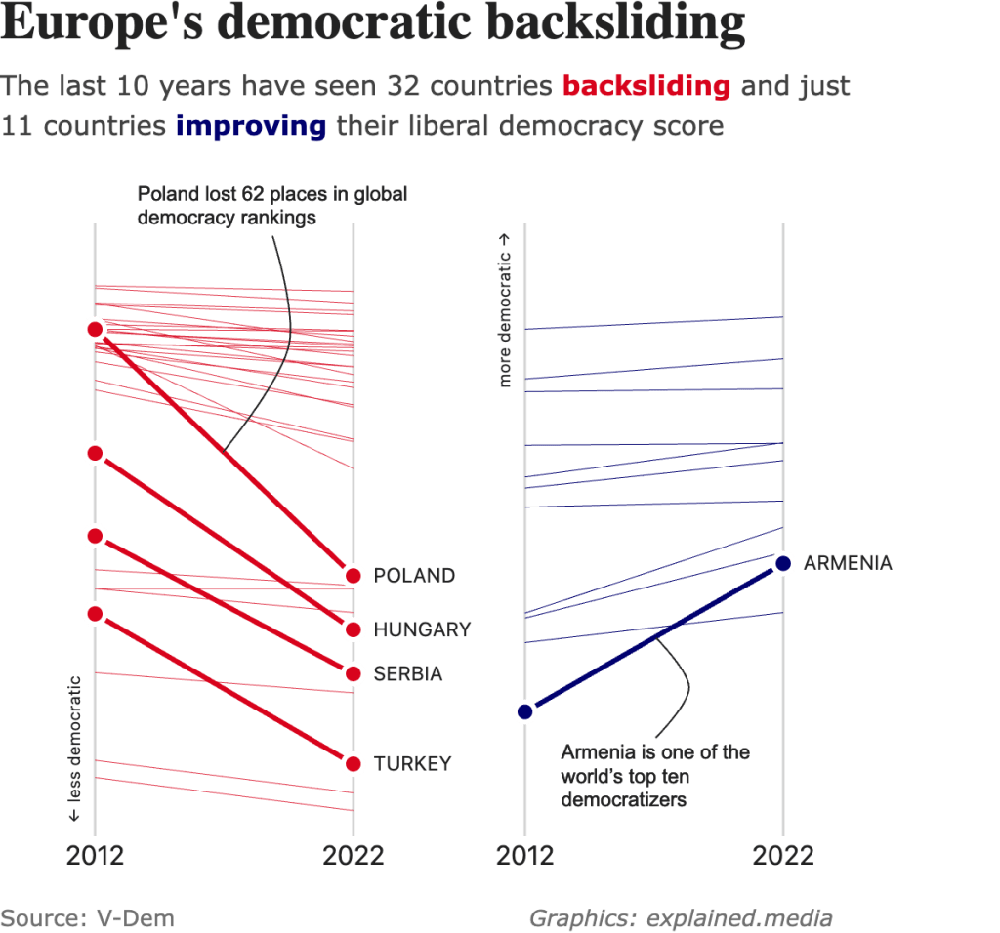

```{r setup, include=FALSE}
knitr::opts_chunk$set(echo = TRUE, fig.align="center", fig.showtext=TRUE) 
```

```{r}

#set approppiate figure dimensions
#if you have doubts either go to the example article or use the distill guide

library(tidyverse)
library(vdemdata)
library(ggplot2)
library(grid)
library(gridtext)
library(patchwork)

full_df23 <- read_rds(file="V-Dem-CY-Full+Others-v13.rds")
#retrieved from https://www.v-dem.net/data/dataset-archive/
#remember to change file path when moving file


#Selecting only relevant data
df23 <- full_df23 |> 
  select(c("country_name", "country_text_id", "e_regiongeo", "year", "v2x_libdem")) |> 
  filter(year==2012 | year==2022) |> 
  filter(e_regiongeo %in% 1:4) #For more info: vdemdata::var_info("e_regiongeo") ==> 1=Western Europe, 2=Northern Europe, 3=Souther Europe, 4=Eastern Europe

df23 <- full_df23 |> 
  select(c("country_name", "country_text_id", "e_regiongeo", "year", "v2x_libdem")) |> 
  filter(year==2012 | year==2022) |> 
  filter(country_text_id %in% c("TUR", "ARM", "GEO")) |> 
  bind_rows(df23) |>
  arrange(country_name) |> 
  mutate(country_name=toupper(country_name))


#Creating column difference
df23 <- df23 |> 
  pivot_wider(names_from = "year", values_from = "v2x_libdem", names_prefix = "year_") |>
  mutate(difference = year_2022 - year_2012) |> 
  pivot_longer(cols=c("year_2012","year_2022"), names_to = "year", values_to = "v2x_libdem", names_prefix = "year_") 


#Creating two separate df
df_backsliding <- df23 |> 
  filter(difference<0)
df_improving <- df23 |> 
  filter(difference>0)

```


```{r, preview=TRUE, fig.height=6.9, fig.width=6.9, dpi=500}
sysfonts::font_add_google("Noto Serif", family="noto_serif",
                          regular.wt = 700, bold.wt = 900)
#Title is in noto serif

sysfonts::font_add_google("Noto Sans Display", family="noto_sans",
                          regular.wt = 500, bold.wt = 700)
#Annotation and years as well

sysfonts::font_add_google("Poppins", family="poppins",
                          regular.wt = 500, bold.wt = 700)
#For subtitle and geom_text and axis title


general_back <- ggplot(df_backsliding) +
  aes(x=year, y=v2x_libdem) +
  #Plotting all the lines
  geom_line(aes(group = country_name), 
            linewidth = 0.5, 
            colour = "#db051d", 
            alpha = 0.5) +
  #Highlighting relevant countries
  geom_line(data = df_backsliding %>% 
              filter(country_text_id %in% c("POL", "HUN", "SRB", "TUR")),
            aes(group = country_name), 
            color = "#db051d", 
            linewidth = 1.5) +
  geom_point(data = df_backsliding %>% 
               filter(country_text_id %in% c("POL", "HUN", "SRB", "TUR")),
             shape = 21, 
             size = 3.5, 
             colour = "white", 
             fill = "#db051d", 
             stroke= 2) +
  #Showing countries' names for filtered countries
  geom_text(data = df_backsliding %>% 
              filter(country_text_id %in% c("POL", "HUN", "SRB", "TUR") 
                     & year == 2022),
            aes(label = country_name), 
            nudge_x = 0.1,
            hjust = 0,
            size = 10,
            size.unit = "pt",
            colour = "#242424",
            family = "poppins") +
  #Annotating for Poland
  annotation_custom(grob = textGrob(
    label ="Poland lost 62 places in global\ndemocracy rankings",
    x = unit(0.1, "npc"),
    y = unit(1, "npc"),
    just = c("left", "bottom"),
    gp = gpar(colour = "#242424",
              fontsize = 9.5, 
              fontfamily = "noto_sans",
              lineheight = 1))) +
  geom_curve(x = 1.68, y = 1, xend = 1.5, yend = 0.63,
             curvature = -0.4,
             colour = "#242424",
             linewidth = 0.5) +
  #Setting appropriate axis
  scale_y_continuous(breaks = NULL,
                     limits = c(0.03,0.97), 
                     name= "\u2190 less democratic") + 
  scale_x_discrete(limits = c("2012", "2022"),
                   expand = expansion(mult = c(0.05,0.65)), 
                   name=NULL) +
  #Modifying theme
  theme_minimal() +
  theme(panel.background = element_rect(fill = "transparent", 
                                        colour = NA),
        plot.background = element_rect(fill = "transparent", 
                                       colour = NA),
        plot.margin = unit(c(4, 0, 1.5, 1.5), "cm"),
        axis.title.y = element_text(colour = "black", 
                                    face = "bold",
                                    size = 8,
                                    #family = "noto_sans",
                                    hjust = 0.03,
                                    margin = margin(t = 0, r = 0, b = 0, l = 0, 
                                                    unit="pt")),
        axis.text.x = element_text(colour = "#242424",
                                   size = 12,
                                   family = "noto_sans",
                                   margin = margin(t = 2, r = 0, b = 0, l = 0, 
                                                   unit="pt")),
        panel.grid.major.x = element_line(colour = "grey")) +
  coord_fixed(ratio = 7/3, clip="off")


general_improv <- ggplot(df_improving)+
  aes(x=year, y=v2x_libdem) +
  geom_line(aes(group = country_name), 
            linewidth = 0.5, 
            colour = "#04046e", 
            alpha = 0.5) +
  geom_line(data = df_improving %>% filter(country_text_id %in% c("ARM")),
            aes(group = country_name), 
            color = "#04046e", 
            linewidth = 1.5) +
  geom_point(data = df_improving %>% filter(country_text_id %in% c("ARM")),
             shape = 21, 
             size = 3.5, 
             colour = "white", 
             fill = "#04046e", 
             stroke= 2) +
  geom_text(data = df_improving %>% filter(country_text_id %in% c("ARM") 
                                           & year == 2022),
            aes(label = country_name), 
            nudge_x = 0.1,
            hjust = 0,
            size = 10,
            size.unit = "pt",
            colour = "#242424",
            family = "poppins") + 
  annotation_custom(grob = textGrob(
    label = "Armenia is one of the\nworld's top ten\ndemocratizers",
    x = unit(0.1, "npc"), 
    y = unit(0.1, "npc"),
    just = c("left", "center"),
    gp = gpar(colour = "#242424",
              fontsize = 9.5, 
              fontfamily = "noto_sans",
              lineheight = 1)))+
  geom_curve(x = 1.5, y = 0.15, xend = 1.5, yend = 0.32,
             curvature = 0.7, colour = "#242424", linewidth = 0.5)+
  scale_y_continuous(breaks = NULL, 
                     limits = c(0.03,0.97), 
                     name= "more democratic \u2192") + 
  scale_x_discrete(limits = c("2012", "2022"),
                   expand = expansion(mult = c(0.05,0.9)), 
                   name=NULL) +
  theme_minimal() +
  theme(panel.background = element_rect(fill = "transparent", colour = NA),
        plot.background = element_rect(fill = "transparent", colour = NA),
        plot.margin = unit(c(4, 0, 1.5, 0), "cm"), 
        axis.title.y = element_text(colour = "black", 
                                    face = "bold",
                                    size = 8,
                                    #family = "noto_sans",
                                    hjust = 0.97,
                                    margin = margin(t = 0, r = 0, b = 0, l = 0, 
                                                    unit="pt")),
        axis.text.x = element_text(colour = "#242424",
                                   size = 12,
                                   family = "noto_sans",
                                   margin = margin(t = 2, r = 0, b = 0, l = 0, 
                                                   unit="pt")),
        panel.grid.major.x = element_line(colour="grey")) +
  coord_fixed(ratio = 7/3, clip="off")


#To put together graphs and add titles
general <- general_back + general_improv


# Create text grobs for the title, subtitle and caption
title_grob <- grid::textGrob(
  label = "Europe's democratic backsliding",
  x = 0, y = 1, 
  just = c("left","top"),
  gp = gpar(col = "#242424",
            fontsize = 21, 
            fontface = "bold", 
            fontfamily = "noto_serif"))

subtitle_grob <- gridtext::richtext_grob(
  text = "The last 10 years have seen 32 countries 
  **<span style='color:#db051d;'>backsliding</span>** 
  and just<br> 11 countries 
  **<span style='color:#04046e;'>improving</span>** 
  their liberal democracy score",
  x = 0, y = 1,
  hjust = 0, vjust = 1,
  gp = gpar(col = "#444444",
            fontsize = 13, 
            fontfamily = "poppins",
            lineheight = 1.5))

caption_grob <- grid::textGrob(
  label = "Source: V-Dem",
  x = 0, y = 0,
  just = c("left","center"),
  gp = gpar(col = "#707070",
            fontsize = 11,
            fontfamily = "poppins"))

caption2_grob <- grid::textGrob(
  label = "Graphics: explained.media",
  x = 0, y = 0,
  just = c("left","center"),
  gp = gpar(col = "#707070",
            fontsize = 11,
            fontface = "italic",
            fontfamily = "poppins"))


# Add them with inset elements
general + 
  inset_element(title_grob, 
                left = -1, 
                right = 1, 
                bottom = 0.85, 
                top = 0.975, 
                align_to = "full", 
                on_top= FALSE) +
  inset_element(subtitle_grob, 
                left = -1, 
                right = 1, 
                bottom = 0.85, 
                top = 0.9, 
                align_to = "full", 
                on_top = FALSE) +
  inset_element(caption_grob,
                left = -1,
                right = 0,
                bottom = 0.04,
                top = 0.09,
                align_to = "full", 
                on_top = FALSE) +
  inset_element(caption2_grob,
                left = 0.05, 
                right = 1,
                bottom = 0.04,
                top = 0.09,
                align_to = "full", 
                on_top = FALSE) +
  plot_annotation(theme = 
                    theme(plot.background = element_rect(fill="transparent",
                                                         colour = NA)))

```


{.external width="100%"}


```{r, dpi=500, fig.width=7, fig.height=9}

# Prepare the data
df_lollipop <- df23 |> 
  pivot_wider(names_from = year, 
              values_from = v2x_libdem, 
              names_prefix = "v2x_libdem") |> 
  arrange(desc(v2x_libdem2022))

# Plot the horizontal lollipop chart
improvements <- ggplot(df_lollipop) +
  geom_segment(aes(x = reorder(country_name, v2x_libdem2022),
                   xend = reorder(country_name, v2x_libdem2022),
                   y = v2x_libdem2012, 
                   yend = v2x_libdem2022,
                   colour = ifelse(difference <=0, "#db051d", "#04046e")),
               arrow = arrow(length = unit(0.01, "npc"))) +
  #Other adjustments (TO BE MODIFIED)
  scale_color_identity() +
  labs(caption = "Source: V-Dem Dataset") +
  scale_y_continuous(breaks = c(0,0.25,0.5,0.75,1), 
                     limits = c(0,1),
                     expand = expansion(add = 0),
                     name = "more democratic \u2192") +
  # Flip the chart horizontally
  coord_flip() +
  # Theme adjustments (TO BE MODIFIED)
  theme_minimal() +
  theme(legend.position = "none",
        axis.text.y = element_text(size = 8),
        axis.title.y = element_blank(),
        axis.text.x = element_text(size = 8),
        axis.title.x = element_text(size = 12),
        plot.margin = unit(c(3, 0, 0, 0), "cm"))


title_grob_plot2 <- grid::textGrob(
  label = "Change in Liberal Democracy Scores (2012 \u2192 2022)",
  x = 0, y = 1, 
  just = c("left","top"),
  gp = gpar(col = "#242424",
            fontsize = 19, 
            fontface = "bold", 
            fontfamily = "noto_serif"))

subtitle_grob_plot2 <- gridtext::richtext_grob(
  text = "Is there a democratic backsliding in Europe?<br>
  Most of the countries are now 
  **<span style='color:#db051d;'>less democratic</span>** 
  than they were 10 years ago.<br>
  Only a few countries are 
  **<span style='color:#04046e;'>more democratic</span>** 
  now than 10 years ago.",
  x = 0, y = 1,
  hjust = 0, vjust = 1,
  gp = gpar(col = "#444444",
            fontsize = 12, 
            fontfamily = "poppins",
            lineheight = 1.5))

improvements +
  inset_element(title_grob_plot2, 
                left = 0, 
                right = 1, 
                bottom = 0.95, 
                top = 1, 
                align_to = "full", 
                on_top= FALSE) +
  inset_element(subtitle_grob_plot2, 
                left = 0, 
                right = 1, 
                bottom = 0.85, 
                top = 0.95, 
                align_to = "full", 
                on_top = FALSE)
  

```
