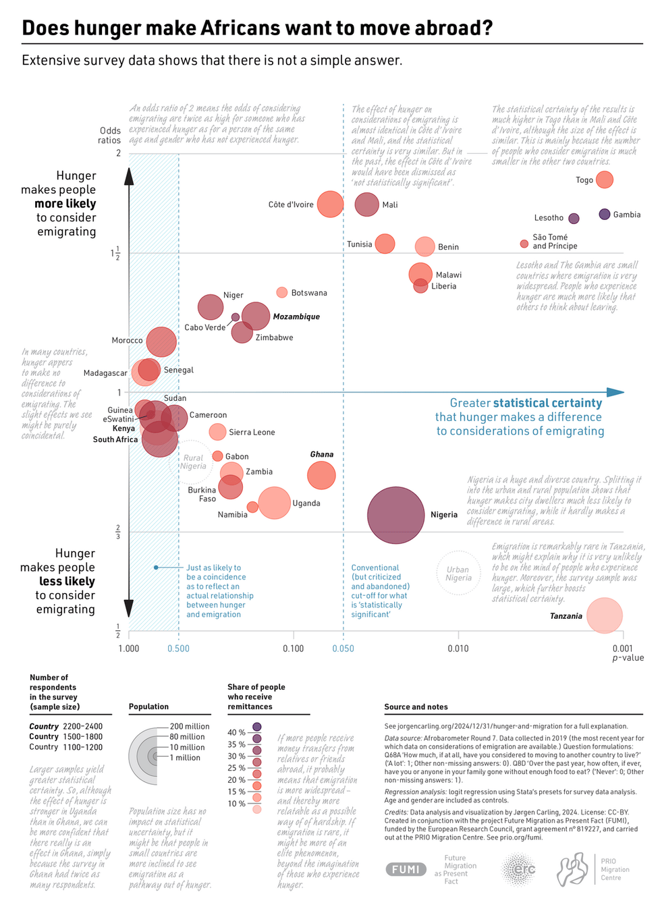
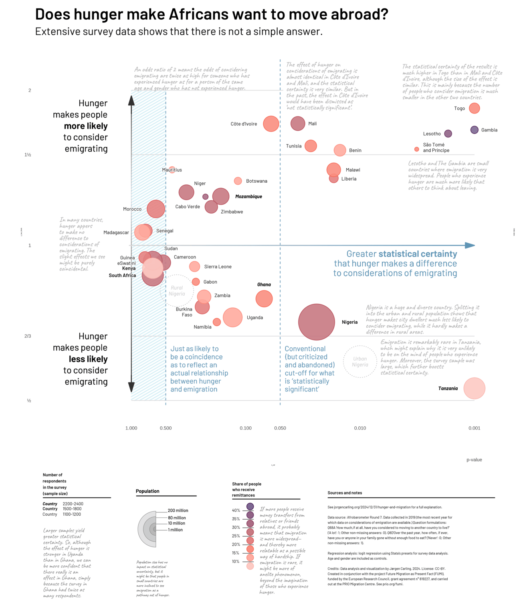
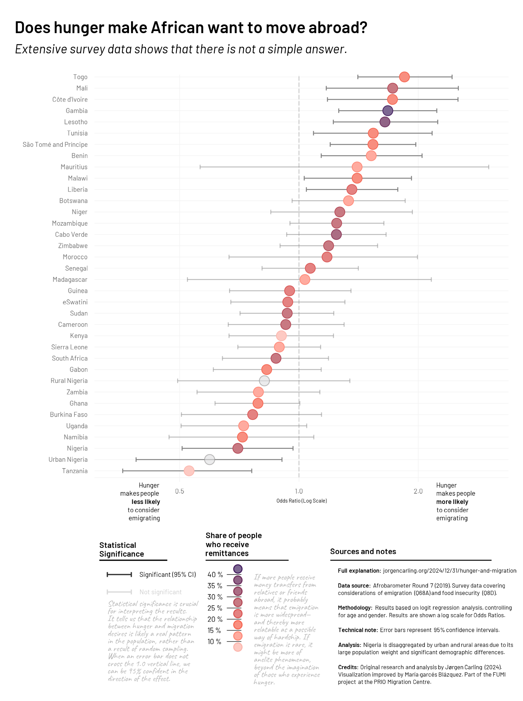

```{r include=FALSE, initial-setting}
knitr::opts_chunk$set(
  out.width = "100%", 
  fig.align = "center", 
  fig.showtext = TRUE,
  eval = FALSE
)
```

## Introduction

The relationship between food scarcity and the desire to leave one's
home country is a complex phenomenon across the African continent.
Understanding whether hunger acts as a primary "**push factor**" for
migration requires a deep dive into socioeconomic data and statistical
modeling.

Using extensive survey data from **Afrobarometer**, we analyzed how
experiencing hunger affects the likelihood of citizens considering
emigration. To quantify this, we utilized Logit Regression models,
adjusting for individual-level variables such as age, gender, and
education. The core of our analysis relies on **Odds Ratios** (OR):

-   An **OR \> 1** indicates that hunger increases the likelihood of
    wanting to emigrate.

-   An **OR \< 1** suggests that hunger actually correlates with a lower
    desire to move.

In the following chart, we visualize these results across multiple
African nations. Each point represents a country, where its vertical
position indicates the strength of the relationship (**Odds Ratio**) and
its horizontal position represents **Statistical Certainty (P-value)**.
Note that the horizontal axis is plotted on a **logarithmic scale** to
better distinguish between highly significant results (close to 0 on the
left) and those that lack statistical confidence (on the right).

Furthermore, we have incorporated a third dimension: **Remittances**. By
color-coding countries based on the percentage of GDP they receive from
citizens abroad, we can explore if a national culture of migration
influences the individual's response to food insecurity.

{.external width="100%"}

## Replica

First, in order to create our graph, we load both the **libraries**
needed.

```{r load-libraries}
library(tidyverse)
library(scales)
library(ggforce)
library(ggpattern)
library(shadowtext)
library(ggtext)
library(haven)
library(broom)
library(logistf)
library(survey) 
library(grid)
library(patchwork)
```

In this stage, we import the results generated from the **logit
regression models**. These data points contain the estimated
coefficients for each country, specifically the **Odds Ratios** and
their corresponding **P-values**. This step is crucial as it bridges the
raw survey data from Afrobarometer with the statistical evidence needed
to visualize the relationship between food insecurity and migration
intentions.

```{r results-regression}
source("results.R")
```

### Creating the color of remittances

To explore the influence of external financial flows on migration
intent, we categorize countries based on their **Remittance-to-GDP
ratio**. This process involves creating discrete intervals that allow us
to map complex numerical data onto a clear visual scale.

By defining specific color palettes for both the **fill** and **border**
of our data points, we ensure that the final visualization is not only
aesthetically pleasing but also functionally intuitive. The gradient
reflects the intensity of remittance dependency, helping to highlight
patterns between economic support and food-related migration drivers.

```{r remittances-levels}
# Defining hierarchical levels for remittance groups
remittance_groups_levels <- c("> 40%", "35-40%", "30-35%", "25-30%", "20-25%", 
                              "15-20%", "10-15%", "< 10%")

# Transforming raw data into ordered categorical groups
data_graph <- full_results %>%
  mutate(
    Remittance_Group = case_when(
      Remittances > 40 ~ "> 40%",
      Remittances > 35 & Remittances <= 40 ~ "35-40%",
      Remittances > 30 & Remittances <= 35 ~ "30-35%",
      Remittances > 25 & Remittances <= 30 ~ "25-30%",
      Remittances > 20 & Remittances <= 25 ~ "20-25%",
      Remittances > 15 & Remittances <= 20 ~ "15-20%",
      Remittances > 10 & Remittances <= 15 ~ "10-15%",
      Remittances <= 10 ~ "< 10%",
      TRUE ~ "NA"),
    Remittance_Group = factor(Remittance_Group, levels = remittance_groups_levels))
    
# Color palette for point filling (Fill)
remittance_colors <- c(
  "> 40%" = "#7D6892",
  "35-40%" = "#906386",
  "30-35%" = "#AB6D84",
  "25-30%" = "#C87982",
  "20-25%" = "#E48281",
  "15-20%" = "#F88E7F",
  "10-15%" = "#FFAB9F",
  "< 10%" = "#FDCAC3")

# Color palette for point outlines (Border)
border_colors <- c(
  "> 40%" = "#421C5E",
  "35-40%" = "#6B2E5D",
  "30-35%" = "#8C3757",
  "25-30%" = "#B54B58",
  "20-25%" = "#DA5856",
  "15-20%" = "#F66652",
  "10-15%" = "#FF8978",
  "< 10%" = "#FCB6AD")
```

### Refining Data Coordinates for Visual Fidelity

To ensure our visualization accurately mirrors the original chart's
layout and maintain high legibility, we perform a targeted data
manipulation. This step involves micro-adjusting specific **P-values**
and **Odds Ratios** for several countries.

These manual adjustments are necessary to prevent overlapping data
points and to account for the specific logarithmic scaling and
coordinate mapping used in the original Afrobarometer publication. By
fine-tuning these positions, we enhance the "cleanliness" of the scatter
plot without compromising the underlying statistical relationships being
depicted.

```{r visual-fidelity}
# Fine-tuning point locations to match the original chart's layout
data_manipulated <- data_graph %>%
  mutate(
    P_Value = case_when(
      Country == "São Tomé and Príncipe" ~ 0.0032,
      Country == "Lesotho" ~ 0.0017, 
      Country == "Nigeria" ~ 0.024,
      Country == "Liberia" ~ 0.017,
      Country == "Malawi" ~ 0.017,
      Country == "Benin" ~ 0.015,
      Country == "Tunisia" ~ 0.027,
      Country == "Mali" ~ 0.035,
      Country == "Côte d'Ivoire" ~ 0.06,
      Country == "Ghana" ~ 0.069,
      Country == "Uganda" ~ 0.13,
      Country == "Namibia" ~ 0.179,
      Country == "Botswana" ~ 0.117,
      Country == "Morocco" ~ 0.61,
      Country == "Niger" ~ 0.33,
      Country == "Cabo Verde" ~ 0.225,
      Country == "Zimbabwe" ~ 0.2,
      Country == "Mozambique" ~ 0.165,
      Country == "Gabon" ~ 0.273,
      Country == "Sierra Leone" ~ 0.28,
      Country == "Zambia" ~ 0.231,
      Country == "Burkina Faso" ~ 0.24,
      Country == "Urban Nigeria" ~ 0.01,
      Country == "Madagascar" ~ 0.8,
      Country == "Senegal" ~ 0.75,
      Country == "Rural Nigeria" ~ 0.4,
      Country == "Cameroon" ~ 0.53,
      Country == "South Africa" ~ 0.65,
      Country == "eSwatini" ~ 0.705,
      Country == "Sudan" ~ 0.65,
      Country == "Kenya" ~ 0.65,
      TRUE ~ P_Value
    ),
    OR = case_when(
      Country == "Nigeria" ~ 0.71,
      Country == "Gabon" ~ 0.85,
      Country == "Zambia" ~ 0.795,
      Country == "Sierra Leone" ~ 0.91,
      Country == "Benin" ~ 1.53,
      Country == "Liberia" ~ 1.35,
      Country == "Tunisia" ~ 1.56,
      Country == "Madagascar" ~ 1.06,
      Country == "Burkina Faso" ~ 0.76,
      Country == "Namibia" ~ 0.71,
      Country == "Rural Nigeria" ~ 0.817,
      TRUE ~ OR
    )
  )
```

### Customizing Label Placement and Alignment

Standard automated labeling in R often leads to overlaps, especially
when dealing with a high density of data points on a logarithmic scale.
To achieve a professional finish that mirrors the original publication,
we implement a **manual coordinate calibration** for each country name.

In this step, we adjust the `x` and `y` positions of the labels and
introduce **multi-line string formatting** (using `\n`) for countries
with longer names. Furthermore, we define custom **horizontal and
vertical alignments** (`h_align` and `v_align`) to ensure that text is
perfectly positioned relative to its corresponding data point,
maintaining readability even in the most crowded areas of the chart.

```{r label-positions}
# Creating manual label offsets
label_positions <- data_manipulated %>% 
  select(Country, P_Value, OR) %>% 
  mutate(label_x = P_Value, label_y = OR) %>%
  mutate(
    label_x = case_when(
      Country == "Nigeria" ~ 0.0123, Country == "Tanzania" ~ 0.0017,           
      Country == "Gambia" ~ 0.00074, Country == "Togo" ~ 0.00135,    
      Country == "Lesotho" ~ 0.00235, Country == "São Tomé and Príncipe" ~ 0.00281,   
      Country == "Benin" ~ 0.011, Country == "Côte d'Ivoire" ~ 0.104,
      Country == "Tunisia" ~ 0.038, Country == "Liberia" ~ 0.0125,
      Country == "Mali" ~ 0.026, Country == "Malawi" ~ 0.0115,
      Country == "Botswana" ~ 0.08, Country == "Mozambique" ~ 0.094,
      Country == "Zimbabwe" ~ 0.132, Country == "Niger" ~ 0.25,
      Country == "Morocco" ~ 0.98, Country == "Madagascar" ~ 1.35,
      Country == "Senegal" ~ 0.51, Country == "Sudan" ~ 0.45,
      Country == "Cameroon" ~ 0.34, Country == "Sierra Leone" ~ 0.175,   
      Country == "Gabon" ~ 0.2039, Country == "Zambia" ~ 0.16,
      Country == "Ghana" ~ 0.069, Country == "Uganda" ~ 0.083,
      Country == "Burkina Faso" ~ 0.295, Country == "Namibia" ~ 0.238,
      Country == "Kenya" ~ 1.05, Country == "South Africa" ~ 1.2,
      Country == "Guinea" ~ 1.08, Country == "eSwatini" ~ 1.1,
      Country == "Cabo Verde" ~ 0.322,      
      TRUE ~ label_x
    ),
    label_y = case_when(
      Country == "Nigeria" ~ 0.71, Country == "Tanzania" ~ 0.528,    
      Country == "Gambia" ~ 1.676, Country == "Togo" ~ 1.846,    
      Country == "Lesotho" ~ 1.648, Country == "São Tomé and Príncipe" ~ 1.537, 
      Country == "Niger" ~ 1.32, Country == "Zimbabwe" ~ 1.163,
      Country == "Sudan" ~ 0.987, Country == "Ghana" ~ 0.84,
      Country == "Burkina Faso" ~ 0.743, Country == "Namibia" ~ 0.695,
      Country == "Cameroon" ~ 0.95, Country == "Zambia" ~ 0.8,
      Country == "eSwatini" ~ 0.924, Country == "Cabo Verde" ~ 1.19,      
      TRUE ~ label_y
    )
  )
```

### Typography and Visual Hierarchy

In this section, we define the typographic styles for the country labels
to create a clear **visual hierarchy**. The styling is not merely
aesthetic but serves as a secondary layer of data encoding:

-   **Sample Size Representation**: Countries with larger respondent
    pools (above 2,200) are assigned a **bold-italic** style, while
    medium-sized samples are **bolded**. This draws the reader's eye
    toward the most statistically robust results.

-   **Sub-national Distinction**: We use **italics** specifically for
    "Urban Nigeria" and "Rural Nigeria" to indicate that these are
    sub-divisions of a single national dataset, distinguishing them from
    the standard country-level points.

To implement this hierarchy, we first map the font styles to our dataset
and then register the required **Barlow** and **Caveat** font families.

```{r typography}
data_manipulated <- data_manipulated %>%
  mutate(text_style = case_when(
      Country %in% c("Urban Nigeria", "Rural Nigeria") ~ "italic", 
      Respondents > 2200 ~ "bold.italic", 
      Respondents >= 1500 & Respondents <= 2200 ~ "bold", 
      TRUE ~ "plain"
    ))

label_positions <- label_positions %>%
  left_join(data_manipulated %>% select(Country, text_style), by = "Country") %>%
  mutate(text_style = replace_na(text_style, "plain")) # Seguridad

sysfonts::font_add_google("Barlow", family = "Barlow")
sysfonts::font_add_google("Caveat", family = "Caveat")
showtext::showtext_auto()
```

Label aesthetics continue here, now, to ensure the labels are perfectly
legible, we apply final adjustments to the text strings and their
spatial anchors. This involves splitting long country names into
**multiple lines** using the newline character (`\n`) and manually
setting **horizontal (`h_align`)** and **vertical (`v_align`)**
alignment values. These specific parameters prevent text from
overlapping with data points or other labels, ensuring a professional
and polished visual output.

```{r two-lines-labels}
# Splitting long country names for better spatial distribution
label_positions <- label_positions %>%
  mutate(
    Country = case_when(
      Country == "São Tomé and Príncipe" ~ "São Tomé\nand Príncipe",
      Country == "Urban Nigeria" ~ "Urban\nNigeria",
      Country == "Rural Nigeria" ~ "Rural\nNigeria",
      Country == "Burkina Faso" ~ "Burkina\nFaso",
      TRUE ~ Country
    )
  )

# Manually assigning alignment anchors (0 = Left/Bottom, 1 = Right/Top)
label_positions$h_align <- 0.5
label_positions$h_align[grepl("Sao Tomé|Príncipe", label_positions$Country)] <- 0
label_positions$h_align[grepl("Burkina|Faso", label_positions$Country)] <- 1

label_positions$v_align <- 0.5
label_positions$v_align[grepl("Sao Tomé|Príncipe", label_positions$Country)] <- 0.3
label_positions$v_align[grepl("Liberia", label_positions$Country)] <- 0.63
```

### Data Segmentation for Layered Visualization

To achieve precise control over the visual elements of our chart, we
split the main dataset into two specialized subsets. This segmentation
allows us to apply different aesthetic rules to national-level data
versus sub-national groups:

-   **National Dataset**: Contains the primary data points for most
    countries, using standard centered alignments.

-   **Sub-national Dataset**: Specifically isolates "Urban" and "Rural"
    Nigeria. This allows us to apply unique multiline labeling and
    specific positioning to these points, highlighting the internal
    demographic contrast within the same country.

By filtering these groups into separate objects, we can layer them
independently within `ggplot2`, ensuring that labels and points do not
overlap and that the visual hierarchy remains intact.

```{r splitting-data}
# Creating the primary national dataset
data_countries_m <- data_manipulated |>
  filter(!Country %in% c("Urban Nigeria", "Rural Nigeria")) |>
    mutate(
    h_align = 0.5,
    v_align = 0.5)

# Creating the sub-national dataset for Nigeria  
data_subgroups_m <- data_manipulated |>
  filter(Country %in% c("Urban Nigeria", "Rural Nigeria")) |>
  mutate(
    label_x = P_Value,
    label_y = OR,
    h_align = 0.5,
    v_align = 0.5,
    Country_label = case_when(
      Country == "Urban Nigeria" ~ "Urban\nNigeria",
      Country == "Rural Nigeria" ~ "Rural\nNigeria"))

# Filtering label positions to exclude specific subgroups
label_positions_countries <- label_positions %>%
  filter(!Country %in% c("Urban Nigeria", "Rural Nigeria", "Urban\nNigeria", "Rural\nNigeria"))
```

### Defining Chart Aesthetics and Constants

Before rendering the final visualization, we establish a set of
aesthetic constants and structural parameters. These settings ensure
visual consistency across the plot:

-   **Color Scheme**: We define specific hex codes for the vertical
    divider, the shaded background areas, and the highlight zones.

-   **Coordinate Scales**: We set the breaks for the logarithmic x-axis
    to ensure the P-values are easily interpretable.

-   **Targeted Highlighting**: A specific list of countries is
    identified to receive a distinct background shading, helping to
    visually separate results with lower statistical significance from
    the rest of the dataset.

Moreover, we map our previously defined remittance levels and color
palettes to final variables. This simplifies the syntax in the
subsequent plotting code, ensuring that the **border colors** and
**remittance groups** are correctly linked. This organized approach
makes the code more modular and easier to maintain.

```{r colors-constants}
# Defining hex colors for structural elements
color_vertical <- "#75A3BF"
color_background_shade <- "#DDDEDF"
color_highlight_shade <- "#D7F0F5"

# Setting geometric and scale constants
y_two_thirds <- 2/3
x_breaks <- c(1.000, 0.500, 0.100, 0.010, 0.001)

# List of countries that will receive a shaded background for visual grouping
countries_with_background <- c("Morocco", "Madagascar", "Senegal", "Sudan", "Guinea", "eSwatini", "Kenya", "South Africa")

# Assigning simplified aliases for plotting clarity
remittance_groups <- remittance_groups_levels
border_palette <- border_colors
```

### Axis Gradient Construction

To enhance the visual communication of statistical significance, we
generate a dataset specifically for the horizontal axis. Instead of a
solid line, we create a **logarithmic gradient** composed of 100 small
segments.

By calculating these segments on a log scale, we can map a smooth color
transition that flows from the least significant results (right) to the
most significant results (left). This aesthetic choice mirrors high-end
editorial data visualizations, guiding the viewer's eye across the
mathematical spectrum of the chart.

```{r axisx-gradient}
x_inicio <- 1.05
x_fin <- 0.001
y_constante <- 1
num_segmentos <- 100 

gradient_line_data <- data.frame(
  index = seq(0, 1, length.out = num_segmentos)
) %>%
  mutate(
    x_start = 10^(log10(x_inicio) + index * (log10(x_fin) - log10(x_inicio))),
    x_end = 10^(log10(x_inicio) + (index + 1/num_segmentos) * (log10(x_fin) - log10(x_inicio)))
  ) %>%
  mutate(x_end = pmin(x_end, x_fin)) %>% 
  mutate(y_val = y_constante) %>%
  filter(index < 1) 
```

Similar to the horizontal axis, we construct a segmented dataset for the
**vertical axis**. This line represents the threshold of the Odds Ratio.
By dividing the line into 100 segments, we can apply a color gradient
that transitions from the bottom to the top of the chart.

We calculate a `mid_point` variable to ensure the color transition is
centered around the horizontal baseline, providing a visual anchor that
distinguishes between increased and decreased odds of emigration.

```{r axisy-gradient}
y_inicio <- 0.52
y_fin <- 1.95
x_constante <- 1

num_segmentos <- 100

vertical_axis_data <- data.frame(
  index = seq(0, 1, length.out = num_segmentos)
) %>%
  mutate(
    y_start = y_inicio + index * (y_fin - y_inicio),
    y_end = y_inicio + (index + 1/num_segmentos) * (y_fin - y_inicio)
  ) %>%
  mutate(y_end = pmin(y_end, y_fin)) %>%
  mutate(mid_point = abs(index - 0.5)) %>% 
  mutate(x_val = x_constante) %>%
  filter(index < 1)
```

### First Visualization Construction

Finally, we assemble the first part of the visualization. The code is
structured in layers to ensure that structural elements like the
**significance zones** and **reference lines** are placed behind the
data points. We use a logarithmic transformation for both axes to
represent the statistical nature of the data accurately.

The chart includes several custom features:

-   **Blue Striped Zone**: Highlights the area where results are not
    statistically significant (p \> 0.05).

-   **Custom Arrows**: Gradient-colored arrows represent the direction
    of statistical significance and the magnitude of the Odds Ratio.

-   **Segmented Labels**: Using `geom_shadowtext` to ensure country
    names are readable against the background and other data points.

```{r, fig.width=8.7, fig.height=6.667}
p <- ggplot(data_countries_m, aes(x = P_Value, y = OR)) +
  
  # 1. Coordinate Scales
  scale_x_continuous(
    breaks = c(1, 0.5, 0.1, 0.05, 0.01, 0.001), 
    labels = c("1.000", "0.500", "0.100", "0.050", "0.010", "0.001\np-value"),
    trans = c("log10", "reverse")
  ) +
  scale_y_continuous(
    breaks = c(0.5, 0.667, 1, 1.5, 2),
    labels = c("\u00BD", "2/3", "1", "1\u00BD", "2"),
    trans = c("log10"),
    sec.axis = sec_axis(~., name = "Odds ratios", breaks = NULL, labels = NULL)
  ) +

  # 2.1. Blue Striped Non-Significant Zone
  geom_rect_pattern(
    aes(xmin = 0.5, xmax = 1.0, ymin = 0.5, ymax = 2.0),
    fill = "white", pattern = 'stripe', pattern_colour = "#D6EFF5",
    pattern_density = 0.00001, pattern_spacing = 0.0065,      
    colour = "transparent", inherit.aes = FALSE
  ) +

  # 2.2. Horizontal Reference Lines (Y=0.5, Y=1.5, Y=2/3)  
  geom_segment(aes(x = 1.0, y = 0.5, xend = 0.001, yend = 0.5), 
               colour = color_background_shade, linewidth = 0.33) +
  geom_segment(aes(x = 1.0, y = 1.5, xend = 0.001, yend = 1.5),
               colour = color_background_shade, linewidth = 0.33) +
  geom_segment(aes(x = 1.0, y = y_two_thirds, xend = 0.001, yend = y_two_thirds),
               colour = color_background_shade, linewidth = 0.33) + 
  geom_segment(aes(x = 1.0, y = 2, xend = 0.047, yend = 2),
               colour = color_background_shade, linewidth = 0.33) + 

  # 2.3. Vertical Cut-off Lines (X=0.5 and X=0.05)  
  geom_segment(aes(x = 0.5, y = 0.49, xend = 0.5, yend = 2.0),
               linetype = "dashed", colour = color_vertical, linewidth = 0.33) +   
  geom_segment(aes(x = 0.05, y = 0.49, xend = 0.05, yend = 2.3),
               linetype = "dashed", colour = color_vertical, linewidth = 0.33) +
  
  # 2.4. Gradient Axis Components
  geom_segment(data = vertical_axis_data,
               aes(x = x_val, y = y_start, xend = x_val, yend = y_end,
                   alpha = mid_point), colour = "#343132", 
               linewidth = 0.5, inherit.aes = FALSE) +
  scale_alpha_continuous(range = c(0.1, 1), guide = "none") +
  
  # Y-Axis Arrows
  geom_segment(aes(x = 1, y = 1.8, xend = 1, yend = 1.95), 
               colour = "#343132", linewidth = 0.5,
               arrow = arrow(angle = 17, length = unit(0.4, "cm"), 
                             ends = "last", type = "closed")) +
  geom_segment(aes(x = 1, y = 0.56, xend = 1, yend = 0.52), 
               colour = "#343132", linewidth = 0.5,
               arrow = arrow(angle = 17, length = unit(0.4, "cm"), 
                             ends = "last", type = "closed")) +
  
  # X-Axis Gradient Arrow
  geom_segment(data = gradient_line_data,
               aes(x = x_start, y = y_val, xend = x_end, yend = y_val,
                   colour = index), linewidth = 0.5,
               arrow = arrow(angle = 17, length = unit(0.4, "cm"),
                             ends = "last", type = "closed"), 
               inherit.aes = FALSE) +

# 3.1. National Data Points
{
    lapply(remittance_groups, function(group) {
      data_grp <- data_countries_m %>% filter(Remittance_Group == group)
      geom_point(data = data_grp, aes(size = Population, fill = Remittance_Group),
                 shape = 21, colour = border_palette[group], 
                 alpha = 0.9, show.legend = FALSE)
    })
  } +
  
# 3.2. Sub-national Data Layer (Nigeria)
  geom_ellipse(data = data_subgroups_m,
               aes(x0 = P_Value, y0 = OR, a = Population / 580000,
                   b = Population / 2750000, angle = 0),
               linetype = "dotted", colour = "#C1C2C4", fill = NA, 
               linewidth = 0.3) +
  
  # 4. Labeling with background shadows for readability
  geom_shadowtext(data = label_positions_countries, 
                  aes(x = label_x, y = label_y, label = Country, 
                      fontface = text_style, hjust = h_align, vjust = v_align),
                  bg.color = "white", bg.r = 0.15, color = "black",
                  lineheight = 0.15, family = "Barlow", size = 13,            
                  show.legend = FALSE) +
  
  geom_shadowtext(data = data_subgroups_m, 
                  aes(x = label_x, y = label_y, label = Country_label, 
                      fontface = text_style, hjust = h_align, vjust = v_align),
                  bg.color = "white", bg.r = 0.15, color = "#C1C2C4",
                  lineheight = 0.15, family = "Barlow", size = 14,            
                  show.legend = FALSE) +

  # 5. Aesthetic Scales
  scale_fill_manual(values = remittance_colors) +
  scale_colour_gradient(low = "#D7D8D9", high = "#6195B5", guide = "none") +
  scale_size_continuous(range = c(2, 20)) +

  # 6. Global Theme
  theme_minimal() +
  theme(panel.grid = element_blank())
```

### Editorial Annotations

To transform the statistical chart into a narrative visualization, we
add layers of **rich text annotations**. These notes provide crucial
context, such as explaining the real-world meaning of an Odds Ratio and
highlighting specific national cases like Tanzania or Nigeria.

We use the `ggtext` package's `geom_richtext` to allow for HTML styling
(like **bolding**) within the annotations. Finally, we apply a clean,
minimal theme, removing standard grid lines to focus the reader's
attention on the data points and the editorial insights.

```{r texts-around}
text_1 <- "An odds ratio of 2 means the odds of considering<br>emigrating are
twice as high for someone who has<br>experienced hunger as for a person of the
same<br>age and gender who has not experienced hunger."

text_2 <- "The effect of hunger on<br>considerations of emigrating is<br>almost
identical in Côte d'Ivoire<br>and Mali, and the statistical<br>certainty is very
similar. But in<br>the past, the effect in Côte d'Ivoire<br>would have been
dismissed as<br>'not statistically significant'."

text_3 <- "The statistical certainty of the results is<br>much higher in Togo
than in Mali and Côte<br>d'Ivoire, although the size of the effect is<br>similar.
This is mainly because the number<br>of people who consider emigration is
much<br>smaller in the other two countries."

text_4 <- "Lesotho and The Gambia are small<br>countries where emigration is
very<br>widespread. People who experience<br>hunger are much more likely
that<br>others to think about leaving."

text_5 <- "Greater <b>statistical certainty</b><br>that hunger makes a
difference<br>to considerations of emigrating"
  
text_6 <- "Nigeria is a huge and diverse country. Splitting it<br>into the urban
and rural population shows that<br>hunger makes city dwellers much less likely
to<br>consider emigrating, while it hardly makes a<br>difference in rural areas."
  
text_7 <- "Emigration is remarkably rare in Tanzania,<br>whch might explain why
it is very unlikely<br>to be on the mind of people who experience<br>hunger.
Moreover, the survey sample was<br>large, which further boosts<br>statistical
certainty." 

text_8 <- "Conventional<br>(but criticized<br>and abandoned)<br>cut-off for
what<br>is 'statistically<br>significant'"

text_9 <- "Just as likely to<br>be a coincidence<br>as to reflect an<br>actual
relationship<br>between hunger<br>and emigration"

text_10 <- "In many countries,<br>hunger appers<br>to make no<br>difference
to<br>considerations of<br>emigrating. The<br>slight effects we see<br>might be
purely<br>coincidental."
```

### Graph with surronding text

To move beyond a standard scatter plot, we utilize the `ggtext` package.
The function **`geom_richtext()`** is essential here because it allows
us to render HTML and Markdown. This is what enables the use of tags
like `<br>` for line breaks and `<b>` for bolding specific words within
the annotations, creating a sophisticated typographic flow.

Additionally, we use **`coord_cartesian(clip = "off")`**. By default,
ggplot2 cuts off any element (like labels or lines) that extends outside
the plot area. By turning "clipping" off, we allow our annotations and
axis arrows to breathe and occupy the margins, which is a common
technique in high-end data journalism to maximize the use of white
space.

```{r, fig.width=8.7, fig.height=6.67}
p_main <- p +
  
# Title and subtitle
  labs(
    title = "Does hunger make Africans want to move abroad?",
    subtitle = "Extensive survey data shows that there is not a simple answer.") +
  
  # Texts
  geom_richtext(
    aes(x = 1.5, y = 1.7, 
        label = "Hunger<br>makes people<br><b>more likely</b><br>to
        consider<br>emigrating"),
    hjust = 1, vjust = 0.5,
    size = 24, lineheight = 0.2,
    fill = NA, color = "black", label.color = NA,
    family = "Barlow") +
  
  geom_richtext(
    aes(x = 1.5, y = 0.6, 
        label = "Hunger<br>makes people<br><b>less likely</b><br>to
        consider<br>emigrating"),
    hjust = 1, vjust = 0.5,
    size = 24, lineheight = 0.2,
    fill = NA, color = "black", label.color = NA,
    family = "Barlow") +
  
    geom_richtext(
    aes(x = 4.5, y = 1.15), 
    label = text_10,
    hjust = 0,            
    vjust = 1,             
    size = 18,            
    lineheight = 0.05,
    fill = NA, 
    label.color = NA,
    color = "gray70",      
    family = "Caveat") +
  
  geom_richtext(
    aes(x = 1, y = 2.25), 
    label = text_1,
    hjust = 0,            
    vjust = 1,             
    size = 18,            
    lineheight = 0.05,
    fill = NA, 
    label.color = NA,
    color = "gray70",      
    family = "Caveat") +
  
  geom_richtext(
    aes(x = 0.0465, y = 2.3),
    label = text_2,
    hjust = 0,             
    vjust = 1,            
    size = 18,            
    lineheight = 0.05,
    fill = NA, 
    label.color = NA,
    color = "gray70",     
    family = "Caveat") +
  
  geom_richtext(
    aes(x = 0.0045, y = 2.28),
    label = text_3,
    hjust = 0,            
    vjust = 1,            
    size = 18,          
    lineheight = 0.05,
    fill = NA, 
    label.color = NA,
    color = "gray70", 
    family = "Caveat") +
  
  geom_richtext(
    aes(x = 0.004, y = 1.48),
    label = text_4,
    hjust = 0,            
    vjust = 1,         
    size = 18,          
    lineheight = 0.05,
    fill = NA, 
    label.color = NA,
    color = "gray70",     
    family = "Caveat") +
  
  geom_richtext(
    aes(x = 0.00132, y = 0.853),
    label = text_5,
    hjust = 1,
    vjust = 0,
    size = 24,
    lineheight = 0.17,
    fill = NA, 
    label.color = NA,
    color = "#6195B5",
    family = "Barlow") +
  
  geom_richtext(
    aes(x = 0.0094, y = 0.66),
    label = text_6,
    hjust = 0,
    vjust = 0,
    size = 18,
    lineheight = 0.05,
    fill = NA, 
    label.color = NA,
    color = "gray70",
    family = "Caveat") +
  
  geom_richtext(
    aes(x = 0.007, y = 0.55),
    label = text_7,
    hjust = 0,
    vjust = 0,
    size = 18,
    lineheight = 0.05,
    fill = NA, 
    label.color = NA,
    color = "gray70",
    family = "Caveat") +
  
  geom_richtext(
    aes(x = 0.048, y = 0.51),
    label = text_8,
    hjust = 0,
    vjust = 0,
    size = 19,
    lineheight = 0.18,
    fill = NA, 
    label.color = NA,
    color = "#6195B5",
    family = "Barlow") +
  
    geom_richtext(
    aes(x = 0.48, y = 0.51),
    label = text_9,
    hjust = 0,
    vjust = 0,
    size = 19,
    lineheight = 0.18,
    fill = NA, 
    label.color = NA,
    color = "#6195B5",
    family = "Barlow") +

  coord_cartesian(clip = "off") +
  theme(
    plot.margin = margin(t = 5, r = 20, b = 5, l = 40, unit = "pt"),
    plot.title = element_text(size = 120, face = "bold", family = "Barlow"),
    plot.subtitle = element_text(size = 80, family = "Barlow"),
    axis.line = element_blank(),
    axis.ticks = element_blank(),
    panel.grid = element_blank(),
    axis.text.x = element_text(size = 35, margin = margin(t = -20, unit = "pt")),
    axis.text.y = element_text(size = 35, margin = margin(r = -20, unit = "pt")),
  guides(
    fill = "none",  
    size = "none", 
    colour = "none"))
```

### Creating the legends

While our graphic already displays the core findings, the **bottom
panel** of our infographic serves as the "decoding key." Instead of
relying on standard, automatically generated legends, we build custom
visual components to ensure they match the original illustration.

This legend system is divided into four strategic modules:

1.  **Remittance Intensity**: A vertical scale that maps colors to the
    share of people that declare receiving remittances, providing a
    cross-national economic context.

2.  **Sample Size and Statistical Confidence**: A guide explaining how
    font styles (bold, italic) relate to the number of respondents.

3.  **Population Scaling**: A custom semi-circle legend that allows the
    reader to estimate country sizes at a glance.

4.  **Academic Sourcing and Notes**: A dedicated space for transparency,
    detailing the data origins, survey questions, and credits.

To achieve this layout, we use the `patchwork` package to combine these
independent plots with the main chart, ensuring that all typographic and
color elements remain perfectly synchronized across the entire document.

#### Remittances

In this chunk, we manually construct the legend using a dedicated
dataframe. Key steps include:

-   **Coordinate Mapping**: We define precise `y` positions for each
    categorical level to ensure equal vertical spacing.

-   **Identity Scales**: By using `scale_fill_identity()` and
    `scale_color_identity()`, we tell R to use the hex codes stored
    directly in our dataframe, maintaining a perfect match with the
    country bubbles in the main chart.

-   **Visual Separators**: We add small horizontal segments between
    categories to enhance scannability.

-   **Contextual Commentary**: We use the handwritten-style **Caveat**
    font to add a brief sociological explanation of why remittances
    matter in the context of food insecurity and migration.

```{r, fig.width=1.73, fig.height=2.5}
library(dplyr)
library(stringr)

# 1. DATAFRAME FOR THE LEGEND
remittance_data <- data.frame(
  percent = remittance_groups_levels,
  y = length(remittance_groups_levels):1)

remittance_data <- remittance_data %>%
  mutate(
    fill_color = remittance_colors[percent], 
    border_color = border_colors[percent]) %>%
  mutate(
    fill_color = as.character(fill_color),
    border_color = as.character(border_color))

remittance_groups_levels <- c("> 40%", "35-40%", "30-35%", "25-30%", "20-25%", 
                               "15-20%", "10-15%", "< 10%")

## SETTING AESTHETICS OF THE LEGEND
y_step <- 0.31
num_items <- length(remittance_groups_levels)

remittance_data <- data.frame(
  percent_raw = remittance_groups_levels,
  y = seq(from = num_items * y_step, 
          to = y_step, 
          by = -y_step)) %>%
  mutate(
  percent_label = case_when(
    percent_raw == "> 40%" ~ "40%",
    percent_raw == "35-40%" ~ "35%",
    percent_raw == "30-35%" ~ "30%",
    percent_raw == "25-30%" ~ "25%",
    percent_raw == "20-25%" ~ "20%",
    percent_raw == "15-20%" ~ "15%",
    percent_raw == "10-15%" ~ "10%",
    TRUE ~ NA_character_)) %>%
  mutate(
    fill_color = remittance_colors[percent_raw], 
    border_color = border_colors[percent_raw]) %>%
  mutate(
    fill_color = as.character(fill_color),
    border_color = as.character(border_color))

line_data <- data.frame(
  y = seq(from = (num_items - 1) * y_step + y_step / 2, 
          to = y_step * 1.5,                             
          by = -y_step))

explanatory_text <- "If more people receive\nmoney transfers from\nrelatives or
friends\nabroad, it probably\nmeans that emigration\nis more widespread—\nand
thereby more\nrelatable as a possible\nway of hardship. If\nemigration is rare,
it\nmight be more of\nanelite phenomenon,\nbeyond the imagination\nof those who
experience\nhunger."

# CREATION GRAPH

p_legend_remittance <- ggplot() +
  
  # Separator segments
  geom_segment(data = line_data, aes(x = 0.193, y = y + 0.6, xend = 0.35,
                                     yend = y + 0.6), linewidth = 0.2,
               color = "black", inherit.aes = FALSE) +
  
  # Legend points
  geom_point(data = remittance_data, aes(x = 0.3, y = y+0.6, fill = fill_color,
                                         color = border_color), shape = 21,
             size = 3.5, linewidth = 0.5) + 
  
  geom_text(data = remittance_data, aes(x = 0.05, y = y + 0.46,
                                        label = percent_label), hjust = 0,
            size = 11, family = "Barlow") +
  
  # Title
  geom_text(aes(x = 0.05, y = 3.8, label = "Share of people\nwho
                receive\nremittances"), 
            vjust= 0.7, hjust = 0, lineheight = 0.18, fontface = "bold",
            size = 11, family = "Barlow") +
  
  geom_segment(aes(x = 0.05, y = 3.35, xend = 1, yend = 3.35), vjust = 0,
               linewidth = 0.4, color = "black") + 
  
  # Descriptive sidebar
  geom_text(aes(x = 0.43, y = 1.8, label = explanatory_text), 
            hjust = 0, vjust = 0.6, lineheight = 0.13, fontface= "plain",
            size = 16, color = "gray50", family = "Caveat") +

  # Structure
  scale_fill_identity() + 
  scale_color_identity() + 
  
  coord_cartesian(
    xlim = c(0, 1.2), 
    ylim = c(0, 4.2), 
    clip = "off") +
  
theme_void() + 
  theme(
    plot.margin = margin(0.0, 0, 0, 0, unit = "cm"),
    plot.title = element_text(margin = margin(0, 0, 0, 0, unit = "pt")))
```

#### Country Label

The next module explains the relationship between **sample size and
typographic encoding**. In this section, we provide a key for the reader
to understand that the different font weights used for the country names
in the scatter plot are not merely decorative but represent the
statistical robustness of the data.

In this chunk, we define a legend for the **number of respondents**. We
use three distinct `fontface` settings:

-   **Bold Italic**: Highest sample sizes (2200-2400), representing the
    greatest statistical certainty.

-   **Bold**: Mid-range sample sizes (1500-1800).

-   **Plain**: Standard sample sizes (1100-1200).

By layering multiple `geom_text` calls at specific `y` coordinates, we
create a structured list that functions as a manual legend. An
accompanying sidebar provides a comparative example (Uganda vs. Ghana)
to explain why a larger sample size improves confidence in the results.

```{r, fig.width=1.73, fig.height=2.5}
# 1. Defining explanatory text
text_label <- "Larger samples yield\ngreater statistical\ncertainty. So,
although\nthe effect of hunger is\nstronger in Uganda\nthan in Ghana, we can\nbe
more confident that\nthere really is an\neffect in Ghana, simply\nbecause the
survey in\nGhana had twice as\nmany respondents."

# 2. Building the respondents legend plot
p_respondents <- ggplot() +
geom_text(aes(x = 0.05, y = 4.05, label = "Number of\nrespondents\nin the
              survey\n(sample size)"), 
          vjust = 0.7, hjust = 0, lineheight = 0.2, fontface = "bold", size = 11,
          family = "Barlow") +
  
  # Separator Line
geom_segment(aes(x = 0.05, y = 3.4, xend = 1, yend = 3.4), 
             linewidth = 0.4, color = "black") +

  # Typographic samples (Font face mapping)
  geom_text(aes(x = 0.05, y = 3.2, label = "Country"), 
          vjust = 0.7, hjust = 0, lineheight = 0.2, fontface = "bold.italic",
          size = 11, family = "Barlow") +
    geom_text(aes(x = 0.05, y = 3.02, label = "Country"), 
          vjust = 0.7, hjust = 0, lineheight = 0.2, fontface = "bold",
          size = 11, family = "Barlow") +
      geom_text(aes(x = 0.05, y = 2.82, label = "Country"), 
          vjust = 0.7, hjust = 0, lineheight = 0.2, fontface = "plain",
          size = 11, family = "Barlow") +
  
  # Sample size numeric labels
      geom_text(aes(x = 0.33, y = 3.2, label = "2200-2400"), 
          vjust = 0.7, hjust = 0, lineheight = 0.2, fontface = "plain",
          size = 11, family = "Barlow") +
  
      geom_text(aes(x = 0.33, y = 3.02, label = "1500-1800"), 
          vjust = 0.7, hjust = 0, lineheight = 0.2, fontface = "plain",
          size = 11, family = "Barlow") +
  
       geom_text(aes(x = 0.33, y = 2.82, label = "1100-1200"), 
          vjust = 0.7, hjust = 0, lineheight = 0.2, fontface = "plain",
          size = 11, family = "Barlow") +
  
  # Side explanatory annotation 
  geom_text(aes(x = 0.05, y = 3.3, label = text_label), 
            hjust = 0, vjust = 1.4, lineheight = 0.13, fontface= "plain",
            size = 16, color = "gray50", family = "Caveat") +
  
scale_fill_identity() + 
scale_color_identity() + 
coord_cartesian(
  xlim = c(0, 1.2), 
  ylim = c(0, 4.2),
  clip = "off") +
theme_void() + 
theme(
  plot.margin = margin(0.0, 0, 0, 0, unit = "cm"),
  plot.title = element_text(margin = margin(0, 0, 0, 0, unit = "pt")))
```

#### Country Size

The third module of the footer panel addresses **Population Scaling**.
In the main scatter plot, the size of each bubble corresponds to the
country's population. To help the reader calibrate this scale, we
implement a custom-built **semi-circle legend**.

Unlike standard legends, this component is created by calculating
trigonometric paths to draw concentric semi-circles. This design is
space-efficient and follows high-end data journalism aesthetics.

-   **Trigonometric Mapping**: We use a sequence of angles (theta) to
    generate the coordinates for each semi-circle, which are then
    rendered using `geom_polygon`.

-   **Scale Synchronization**: The `scale_factor` is carefully
    calibrated to match the `range` used in the main plot’s
    `scale_size_continuous`, ensuring the visual representation is
    accurate.

-   **Neutral Palette**: We use a monochromatic gray scale for the
    legend to avoid visual competition with the remittance color coding.

```{r, fig.width=1.73, fig.height=2.5}
# 1. Defining the scaling parameters and explanatory notes
scale_factor <- 0.1385
explanatory_text_size <- "Population size has no\nimpact on
statistical\nuncertainty, but it\nmight be that people in\nsmall countries
are\nmore inclined to see\nemigration as a\npathway out of hunger."

x_lim <- c(-1.5, 1.2)
y_lim <- c(0, 4.2)

# 2. Generating the semi-circle geometry
radios <- c(4.3, 3, 1.5, 0.6)
offset_x <- -0.85
offset_y <- 2.24

# 3. setting colors_semi_circles
colors_semi_circles <- c(
  "0.6"   = "#A9A9AB",
  "1.5"  = "#B7B8B9",
  "3"  = "#CACBCC",
  "4.3" = "#E2E2E3"
)

# 4. Semicircles
datos <- do.call(rbind, lapply(radios, function(r) {
  theta <- seq(-pi/2, pi/2, length.out = 300)
  data.frame(
    x = offset_x - (r * scale_factor) * cos(theta),
    y = offset_y + (r * scale_factor) * sin(theta),
    r = factor(r, levels = radios)
  )
}))
  
# 5. Plotting the custom legend
p_legend_size <- ggplot(datos, aes(x, y, group = r, fill = r)) +
  geom_polygon(color = "#8F8D8E", linewidth = 0.2) +
  
    geom_text(
    aes(x = -1.5, y = 3.5, label = "Population"),
    hjust = 0, fontface = "bold", family = "Barlow", size = 13
  ) +
  
  geom_segment(aes(x = -1.5, y = 3.34, xend = 0.5, yend = 3.34), 
             linewidth = 0.4, color = "black") +
  
  geom_segment(aes(x = -0.85, y = 2.798, xend = -0.47, yend = 2.798), 
             linewidth = 0.22, color = "#8F8D8E") +
  
  geom_text(aes(x = -0.45, y = 2.88, label = "200 million"), 
          vjust = 0.7, hjust = 0, lineheight = 0.2, fontface = "plain",
          size = 11, family = "Barlow") +
  
  geom_segment(aes(x = -0.85, y = 2.621, xend = -0.47, yend = 2.621), 
             linewidth = 0.22, color = "#8F8D8E") +
  
  geom_text(aes(x = -0.445, y = 2.636, label = "80 million"), 
          vjust = 0.7, hjust = 0, lineheight = 0.2, fontface = "plain",
          size = 11, family = "Barlow") +
  
  geom_segment(aes(x = -0.85, y = 2.412, xend = -0.47, yend = 2.412), 
             linewidth = 0.22, color = "#8F8D8E") +
  
  geom_text(aes(x = -0.445, y = 2.46, label = "10 million"), 
          vjust = 0.7, hjust = 0, lineheight = 0.2, fontface = "plain",
          size = 11, family = "Barlow") +
  
  geom_segment(aes(x = -0.85, y = 2.206, xend = -0.47, yend = 2.206), 
             linewidth = 0.22, color = "#8F8D8E") +
  
  geom_text(aes(x = -0.445, y = 2.24, label = "1 million"), 
          vjust = 0.7, hjust = 0, lineheight = 0.2, fontface = "plain",
          size = 11, family = "Barlow") +
  
  geom_text(
    aes(x = -1.5, y = 1.2, label = explanatory_text_size),
    hjust = 0, vjust = 1, lineheight = 0.15, 
    fontface = "italic", size = 11, color = "gray50", family = "Caveat"
  ) +
  
  scale_fill_manual(values = colors_semi_circles) +
  coord_equal(
    xlim = x_lim,
    ylim = y_lim,
    expand = FALSE
  ) +
  theme_void() +
  theme(legend.position = "none")
```

#### Sources

The final component of our infographic footer is the **Sources and
Notes** section. Transparency in data journalism is vital, especially
when dealing with statistical models like logit regressions and
sensitive survey data regarding food insecurity and migration.

This module provides the necessary academic and technical context for
the entire visualization. It details the **Afrobarometer Round 7**
origin, the specific survey question IDs (Q68A and Q8D), and the
regression controls used (age and gender).

By creating this as a separate `ggplot` object, we can treat the
metadata as a design element, ensuring that long strings of text are
wrapped and positioned to balance the visual weight of the other three
legend modules.

```{r, fig.width=3.51, fig.height=2.5}
# 1. Defining the technical and academic metadata
text_sources <- "See jorgencarling.org/2024/12/31/hunger-and-migration for a full
explanation.\n\nData source: Afrobarometer Round 7. Data collected in 2019 (the
most recent year for\nwhich data on considerations of emigration are available.)
Question formulations:\nQ68A 'How much,if at all, have you considered to moving
to another country to live?'\n('A lot': 1; Other non-missing answers: 0).
Q8A'Over the past year, how often, if ever,\nhave you or anyone in your family
gone without enough food to eat? ('Never': 0; Other\nnon-missing answers:
1).\n\nRegression analysis: logit regression using Stata's presets for survey
data analysis.\nAge and gender are included as controls.\n\nCredits: Data
analysis and visualization by Jørgen Carling, 2024. License: CC-BY.\nCreated in
conjunction with the project Future Migration as Present Fact (FUMI),\nfunded by
the European Research Council, grant agreement n° 819227, and carried\nout at
the PRIO Migration Centre. See prio.org/fumi."

# 2. Building the sources plot
p_sources <- ggplot() +

  # Section Title
  geom_text(aes(x = 0, y = 3.6, label = "Sources and notes"), 
          vjust = 0.7, hjust = 0, lineheight = 0.2, fontface = "bold", size = 11, family = "Barlow") +
  
  # Structural Separator
  geom_segment(aes(x = 0, y = 3.4, xend = 1.15, yend = 3.4), 
             linewidth = 0.4, color = "black") + 
  
  # Metadata Body
  geom_text(aes(x = 0, y = 3.1, label = text_sources),
          vjust = 1, 
          hjust = 0, lineheight = 0.2, fontface = "plain", size = 9, family = "Barlow") +
  
scale_fill_identity() + 
scale_color_identity() + 
coord_cartesian(
  xlim = c(0, 1.2), 
  ylim = c(0, 4.2),
  clip = "off") +
theme_void() + 
theme(
  plot.margin = margin(0.0, 0, 0, 0, unit = "cm"),
  plot.title = element_text(margin = margin(0, 0, 0, 0, unit = "pt")))
```

### Combination and final replication graph

To conclude the replciation, we assemble the individual components into
a single, high-resolution infographic. This is achieved using the
**`patchwork`** package, which provides an intuitive syntax for
combining multiple `ggplot` objects into complex layouts.

The assembly follows a hierarchical structure:

-   **The Bottom Row**: We first group the four legend modules
    (`p_respondents`, `p_legend_size`, `p_legend_remittance`, and
    `p_sources`) using the `|` operator. We use
    `plot_layout(widths = ...)` to manually define the horizontal space
    each module occupies, ensuring the source notes have enough width
    for readability.

-   **The Vertical Stack**: Using the `/` operator, we place the main
    scatter plot (`p_combined`) on top of the newly created bottom row.
    We set a `heights` ratio of **3:1** to give the data visualization
    the prominence it deserves while keeping the legends accessible.

-   **Unified Styling**: The `&` operator is used to apply theme
    adjustments (like margins) across all sub-plots simultaneously,
    ensuring a perfectly aligned and professional border for the final
    output.

```{r, fig.width=8.7, fig.height=10, preview=TRUE}
# 1. Adjusting margins for the main chart to align with the footer
p_combined <- p_main + theme(
    plot.margin = margin(t = 5, r = 5, b = 5, l = 20) # Aumentar 'l' (izquierda)
)

# 2. Assembling the footer row
bottom_row_final <- (p_respondents | p_legend_size | p_legend_remittance | p_sources) +
  plot_layout(widths = c(
    1.73,
    1.73,
    1.73,  
    3.51     
  )) +
  theme(
    panel.spacing = unit(0, "pt"))

# 3. Final vertical composition (Main Chart / Footer)
final_plot <- p_combined / bottom_row_final

# 4. Final layout scaling and annotation theme
final_plot <- final_plot +
  plot_layout(heights = c(3, 1)) +
  plot_annotation(theme = theme(plot.margin = margin(t = 5, r = 5, b = 5, l = 5)) & 
  theme(plot.margin = margin(t = 5, r = 5, b = 5, l = 5)))
```

{.external width="100%"}

## Enhancing Visual Clarity in Complex Survey Data

The original visualization provided a foundational look at the
relationship between hunger and migration. However, to transform it into
a publication-ready "Forest Plot," several strategic design improvements
were implemented to reduce cognitive load and enhance interpretability.

#### 1. Reducing Visual Noise and Redundancy

-   **Removal of Population Weighting:** The previous version included a
    variable related to population size that added unnecessary
    complexity. By removing this dimension, the focus shifts entirely to
    the **Odds Ratios (OR)** and their statistical significance, which
    are the primary drivers of the research question.

-   **Cleaner Background:** Using a minimal theme with light gridlines
    ensures that the data points (the markers) are the focal point, not
    the coordinate system.

#### 2. Implementation of a Standardized Forest Plot

-   **Logarithmic Scaling:** The x-axis now utilizes a log scale. This
    is statistically superior for Odds Ratios because it treats "less
    likely" and "more likely" effects symmetrically around the 1.0 null
    line.

-   **Country Identification:** By reordering countries based on their
    coefficients and providing a clear vertical layout, the reader can
    instantly recognize which nations show the strongest correlations
    without visual scanning fatigue.

#### 3. Precision and Uncertainty (Error Bars)

-   **95% Confidence Intervals:** Every point is accompanied by explicit
    error bars.

-   **Visual Encoding of Significance:** A dual-tone system was
    introduced. Results that are statistically significant are
    highlighted in a darker, "high-ink" shade, while non-significant
    results (those crossing the 1.0 line) are rendered in a lighter
    shade. This allows the viewer to filter out "statistical noise" at a
    glance.

#### 4. Contextual Nuance: The Case of Nigeria

-   **Disaggregation:** Nigeria is presented separately for urban and
    rural areas. Given its massive demographic weight and the sharp
    internal differences in migration drivers, this disaggregation
    prevents a misleading "national average" and provides a more honest
    representation of the data.

#### 5. Integrated Annotations and Legends

-   **Self-Explanatory Design:** Instead of relying on a separate
    caption, the legend is integrated into the layout. This includes a
    technical explanation of the Odds Ratios and the "Share of people
    receiving remittances" (represented by color intensity), making the
    graphic a standalone piece of scientific communication.

### Charging the required data

As in the replication, we have all results prepared in this other R
document, that contains country with its results for the coefficients as
their confidence intervals.

```{r}
source("alternative_results.R")
```

### Adjustments for the graph

In this stage, we focus on **data restructuring** to optimize the visual
hierarchy of the forest plot:

-   **Logical Reordering:** Countries are no longer listed
    alphabetically. Instead, they are reordered by their **Odds Ratio
    (OR)** values. This allows the reader to immediately distinguish the
    gradient of hunger's impact across the continent, from the strongest
    to the weakest correlations.

-   **Aesthetic Categorization:** We transformed the continuous
    remittance data into discrete groups. This categorization is
    essential for the color-coded legend, helping to identify patterns
    between external financial support (remittances) and migration
    desires more clearly.

-   **Semantic Labeling:** We defined rich-text labels
    (`text_more_likely` and `text_less_likely`) to provide clear,
    intuitive anchors at the ends of the X-axis. This guides the
    reader’s interpretation of the statistical coefficients without
    requiring deep prior knowledge of log-scale Odds Ratios.

```{r}
# 1. Data preparation and remittance group assignment
alt_data_plot <- alt_data_graph %>%
  mutate(
    Remittance_Group = case_when(
      alt_Remittances > 40 ~ "> 40%",
      alt_Remittances > 35 & alt_Remittances <= 40 ~ "35-40%",
      alt_Remittances > 30 & alt_Remittances <= 35 ~ "30-35%",
      alt_Remittances > 25 & alt_Remittances <= 30 ~ "25-30%",
      alt_Remittances > 20 & alt_Remittances <= 25 ~ "20-25%",
      alt_Remittances > 15 & alt_Remittances <= 20 ~ "15-20%",
      alt_Remittances > 10 & alt_Remittances <= 15 ~ "10-15%",
      alt_Remittances <= 10 ~ "< 10%",
      TRUE ~ "NA"
    ),
    # Ensure factor levels follow a logical descending order for the legend
    Remittance_Group = factor(Remittance_Group,
                              levels = remittance_groups_levels),
    # Reorder countries based on the Odds Ratio (OR) value to create the
    # forest plot structure
    Country = reorder(Country, alt_OR)
  )

# Define descriptive HTML-formatted labels for the plot's X-axis extremes
text_more_likely <- "Hunger<br>makes people<br><b>more likely</b><br>to
consider<br>emigrating"
text_less_likely <- "Hunger<br>makes people<br><b>less likely</b><br>to
consider<br>emigrating"
```

### Creation of the main visualization

This chunk represents the core of the visual redesign, where the "Forest
Plot" is meticulously constructed to prioritize statistical clarity:

-   **Log-Scale Symmetry:** By using `scale_x_log10`, we ensure that an
    Odds Ratio of 0.5 (half as likely) is visually equidistant from the
    null line (1.0) as an OR of 2.0 (twice as likely). This prevents the
    visual bias common in linear scales where large values appear more
    significant than small ones.

-   **Significance Highlighting:** We implemented a "de-emphasis"
    strategy. Results that cross the 1.0 threshold (not statistically
    significant) are rendered with higher transparency and lighter
    colors. This allows the significant "real world" effects to pop out,
    reducing the time required to interpret the findings.

-   **Nigeria Disaggregation:** Urban and Rural Nigeria are plotted with
    neutral gray tones. This stylistic choice acknowledges their unique
    status as sub-national data points while preventing their specific
    data from overwhelming the color-coded "National" results.

-   **Minimalist Tufte-style Theme:** We removed unnecessary borders and
    heavy gridlines. The use of the "Barlow" typeface and clean `gray95`
    lines follows the principle of maximizing the **data-to-ink ratio**,
    ensuring every element on the screen serves a purpose.

```{r, fig.width = 5, fig.height= 5}

alt_p_forest <- ggplot(alt_data_plot, aes(x = alt_OR, y = Country)) +
  # Baseline (OR = 1): Represents the null hypothesis (no effect)
  geom_vline(xintercept = 1, linetype = "longdash", color = "gray70",
             linewidth = 0.2) +
  
  # Error Bars: Differentiate significance using transparency (alpha) and color
  geom_errorbarh(aes(xmin = alt_CI_Lower, xmax = alt_CI_Upper, 
                     alpha = alt_is_significant,
                     color = alt_is_significant),
                 height = 0.4, linewidth = 0.3) +
  
  # Manual scales for error bars
  scale_color_manual(values = c("Statistically Significant" = "gray20", 
                                "Not Significant" = "gray85"), 
                     guide = "none") +
  
  scale_alpha_manual(values = c("Statistically Significant" = 1, 
                                "Not Significant" = 0.5), 
                     guide = "none") +
  
  geom_point(data = filter(alt_data_plot, !Country %in% c("Urban Nigeria",
                                                          "Rural Nigeria")),
             aes(fill = Remittance_Group, color = Remittance_Group),
             shape = 21, size = 3, stroke = 0.35) +
  
  geom_point(data = filter(alt_data_plot, Country %in% c("Urban Nigeria",
                                                         "Rural Nigeria")),
             fill = "#DDDEDF", color = "#8F8D8E", 
             shape = 21, size = 3, stroke = 0.4, alpha = 0.6) +

  # Axis and Scale configuration
  scale_fill_manual(values = remittance_colors) +
  scale_color_manual(values = border_colors) +
  scale_x_log10(limits = c(0.34, 3.03), breaks = c(0.5, 1, 2),
                labels = c("0.5", "1.0", "2.0")) +
  
  # Titles and removing automatic legends
  labs(title = "Does hunger make African want to move abroad?",
       subtitle = "Extensive survey data shows that there is not a
       simple answer.",
       x = "Odds Ratio (Log Scale)", y = "") +
  
  scale_y_discrete(expand = expansion(add = c(0.8, 0.2))) +
  
  
  # Theme Configuration
  theme_minimal() +
  theme(
    # Text Alignment: Left-align title and subtitle
  plot.title = element_text(size = 35, face = "bold", hjust = 0),
  plot.subtitle = element_text(
    size = 27, 
    face = "italic", 
   hjust = 0, 
   margin = margin(b = 13)
  ),
  
  # Alignment with the plot edge (not just the panel)
  plot.title.position = "plot",
    text = element_text(family = "Barlow"),
    axis.text.y = element_text(size = 14, face = "plain", color = "gray40"),
    axis.text.x = element_text(size = 14, family = "Barlow", color = "gray40"),
    panel.grid.major.y = element_line(linewidth = 0.17, color = "gray95"), 
    panel.grid.major.x = element_line(linewidth = 0.17, color = "gray95"), 
    panel.grid.minor = element_blank(), 
    axis.line.x = element_line(color = "gray95", linewidth = 0.17),
    axis.ticks.x = element_line(color = "gray95", linewidth = 0.17),
    axis.ticks.length.x = unit(3, "pt"),
    axis.text.x.top = element_text(margin = margin(t = 1)),
    legend.position = "none",
    plot.margin = margin(t = 12, r = 12, b = 12, l = 12)
  ) +
  coord_cartesian(clip = "off")
```

### Adding the additional text

Here, we add the additional explanatory texts to enhance comprehension,
but not as much as text the original graph in order to avoid visual
noise.

```{r}
alt_main <- alt_p_forest +
  scale_y_discrete(expand = expansion(add = c(0.6, 0.2))) +
  annotate(
    geom = "richtext",        
    x = 0.46, 
    y = 0.4,                 
    label = text_less_likely, 
    family = "Barlow", 
    size = 5,
    lineheight = 0.4,
    color = "black", 
    fill = NA,                
    label.color = NA,         
    vjust = 1,
    hjust = 1
  ) +
    annotate(
    geom = "richtext",        
    x = 2.16, 
    y = 0.4,                 
    label = text_more_likely, 
    family = "Barlow", 
    size = 5,
    lineheight = 0.4,
    color = "black", 
    fill = NA,                
    label.color = NA,         
    vjust = 1,
    hjust = 0
  ) +
  theme (
    plot.margin = margin(t = 12, r = 12, b = 20, l = 12)
  )
```

### Legend creation

Since standard automatic legends often lack the necessary detail for
complex social science data, we built custom, modular legends to provide
deep context and transparency.

#### Remittances

We will use the same legend setting for remittances as colors are
conserved, it is only needed adjusting for size.

```{r, fig.width=1.2, fig.height=1.7}
# 1. DATAFRAME FOR THE LEGEND
remittance_data <- data.frame(
  percent = remittance_groups_levels,
  y = length(remittance_groups_levels):1)

remittance_data <- remittance_data %>%
  mutate(
    fill_color = remittance_colors[percent], 
    border_color = border_colors[percent]) %>%
  mutate(
    fill_color = as.character(fill_color),
    border_color = as.character(border_color))

remittance_groups_levels <- c("> 40%", "35-40%", "30-35%", "25-30%", "20-25%", 
                               "15-20%", "10-15%", "< 10%")

## SETTING AESTHETICS OF THE LEGEND
y_step <- 0.32
num_items <- length(remittance_groups_levels)

remittance_data <- data.frame(
  percent_raw = remittance_groups_levels,
  y = seq(from = num_items * y_step, 
          to = y_step, 
          by = -y_step)) %>%
  mutate(
  percent_label = case_when(
    percent_raw == "> 40%" ~ "40 %",
    percent_raw == "35-40%" ~ "35 %",
    percent_raw == "30-35%" ~ "30 %",
    percent_raw == "25-30%" ~ "25 %",
    percent_raw == "20-25%" ~ "20 %",
    percent_raw == "15-20%" ~ "15 %",
    percent_raw == "10-15%" ~ "10 %",
    TRUE ~ NA_character_)) %>%
  mutate(
    fill_color = remittance_colors[percent_raw], 
    border_color = border_colors[percent_raw]) %>%
  mutate(
    fill_color = as.character(fill_color),
    border_color = as.character(border_color))

line_data <- data.frame(
  y = seq(from = (num_items - 1) * y_step + y_step / 2, 
          to = y_step * 1.5,                             
          by = -y_step))

explanatory_text <- "If more people receive\nmoney transfers from\nrelatives or
friends\nabroad, it probably\nmeans that emigration\nis more widespread—\nand
thereby more\nrelatable as a possible\nway of hardship. If\nemigration is rare,
it\nmight be more of\nanelite phenomenon,\nbeyond the imagination\nof those who
experience\nhunger."


# CREATION GRAPH

p_legend_remittance_alt <- ggplot() +
  geom_segment(data = line_data, aes(x = 0.23, y = y + 0.6, xend = 0.388,
                                     yend = y + 0.6),
               linewidth = 0.16, color = "black", inherit.aes = FALSE) +
  geom_point(data = remittance_data, aes(x = 0.35, y = y+0.6, fill = fill_color,
                                         color = border_color),
             shape = 21, size = 2.35, linewidth = 0.05) + 
  
  geom_text(data = remittance_data, aes(x = 0.02, y = y + 0.44,
                                        label = percent_label),
            hjust = 0, size = 5.5, family = "Barlow") +
  
  geom_text(aes(x = 0, y = 4, label = "Share of people\nwho receive\nremittances"), 
            vjust= 0.7, hjust = 0, lineheight = 0.3, fontface = "bold",
            size = 6, family = "Barlow") +
  
  geom_segment(aes(x = 0, y = 3.41, xend = 0.9, yend = 3.41), vjust = 0,
               linewidth = 0.3, color = "black") + 
   
  geom_text(aes(x = 0.52, y = 1.75, label = explanatory_text), 
            hjust = 0, vjust = 0.6, lineheight = 0.24, fontface= "plain",
            size = 6.3, color = "gray70", family = "Caveat") +

  scale_fill_identity() + 
  scale_color_identity() + 
  
  coord_cartesian(
    xlim = c(0, 1.2), 
    ylim = c(0, 4.2), 
    clip = "off") +
  
theme_void() + 
  theme(
    plot.background = element_rect(fill = "white", color = NA),
  panel.background = element_rect(fill = "white", color = NA),
    plot.margin = margin(0.0, 0, 0, 0, unit = "cm"),
    plot.title = element_text(margin = margin(0, 0, 0, 0, unit = "pt")))
```

#### Sources

This component ensures full transparency regarding data origins and
methodological constraints.

```{r, fig.width=2.15, fig.height=1.7, dpi=500}
text_sources_alt <- "<b>Full explanation:</b>
jorgencarling.org/2024/12/31/hunger-and-migration<br><br><b>Data source:</b>
Afrobarometer Round 7 (2019). Survey data covering<br> considerations of
emigration (Q68A) and food insecurity (Q8D).<br><br><b>Methodology:</b> Results
based on logit regression analysis, controlling<br> for age and gender. Results
are shown a log scale for Odds Ratios.<br><br><b>Technical note:</b> Error bars
represent 95% confidence intervals.<br><br><b>Analysis:</b> Nigeria is
disaggregated by urban and rural areas due to its<br>large population weight and
significant demographic differences.<br><br><b>Credits:</b> Original research
and analysis by Jørgen Carling (2024).<br> Visualization improved by María
Garcés Blázquez. Part of the FUMI<br> project at the PRIO Migration Centre."

p_sources_alt <- ggplot() +

# 1. Título de la Sección
geom_text(aes(x = 0, y = 3.7, label = "Sources and notes"), 
          vjust = 0.7, hjust = 0, lineheight = 0.2, fontface = "bold", size = 6,
          family = "Barlow") +
  
# 2. Línea de Separación
geom_segment(aes(x = 0, y = 3.41, xend = 1.9, yend = 3.41), 
             linewidth = 0.3, color = "black") + 
  
# 3. Texto de Fuentes y Notas
geom_textbox(aes(x = 0, y = 3.4, label = text_sources_alt), 
             vjust = 1, 
             hjust = 0, 
             halign = 0,          
             lineheight = 0.4,    
             size = 4.5,          
             family = "Barlow",
             box.color = NA,      
             fill = NA,           
             width = unit(12, "cm") 
) +
  
scale_fill_identity() + 
scale_color_identity() + 
coord_cartesian(
  xlim = c(0, 2), 
  ylim = c(0, 4.2),
  clip = "off") +
theme_void() + 
theme(
  plot.background = element_rect(fill = "white", color = NA),
  panel.background = element_rect(fill = "white", color = NA),
  plot.margin = margin(0.0, 0, 0, 0, unit = "cm"),
  plot.title = element_text(margin = margin(0, 0, 0, 0, unit = "pt")))
```

#### Error bars

This block teaches the user how to read the uncertainty and significance
represented in the forest plot.

```{r, fig.width=1.2, fig.height=1.7}
explanatory_text_sig <- "Statistical significance is crucial\nfor interpreting
the results.\nIt tells us that the relationship\nbetween hunger and
migration\ndesires is likely a real pattern\nin the population, rather
than\na result of random sampling.\nWhen an error bar does not\ncross the 1.0
vertical line, we\ncan be 95% confident in the\ndirection of the effect."

p_error_bar <- ggplot() +
  annotate("text", x = 0, y = 3.8, label = "Statistical\nSignificance", 
           vjust = 0.7, hjust = 0, lineheight = 0.3, fontface = "bold", 
           size = 6, family = "Barlow") +
  geom_segment(aes(x = 0, y = 3.41, xend = 0.85, yend = 3.41), 
               linewidth = 0.4, color = "black") +
  geom_segment(aes(x = 0.1, y = 3, xend = 0.4, yend = 3), 
               color = "gray20", linewidth = 0.4) +
  geom_segment(aes(x = 0.1, y = 2.93, xend = 0.1, yend = 3.07),
               color = "gray20", linewidth = 0.4) +
  geom_segment(aes(x = 0.4, y = 2.93, xend = 0.4, yend = 3.07),
               color = "gray20", linewidth = 0.4) +
  annotate("text", x = 0.5, y = 3, label = "Significant (95% CI)", 
           hjust = 0, size = 5, family = "Barlow") +
  geom_segment(aes(x = 0.1, y = 2.5, xend = 0.4, yend = 2.5), 
               color = "gray85", linewidth = 0.4) +
    geom_segment(aes(x = 0.1, y = 2.43, xend = 0.1, yend = 2.57),
               color = "gray85", linewidth = 0.4) +
  geom_segment(aes(x = 0.4, y = 2.43, xend = 0.4, yend = 2.57),
               color = "gray85", linewidth = 0.4) +
  annotate("text", x = 0.5, y = 2.5, label = "Not significant", 
           hjust = 0, size = 5, family = "Barlow", color = "gray80") +
  annotate("text", x = 0.1, y = 1.1, label = explanatory_text_sig, 
           hjust = 0, vjust = 0.5, lineheight = 0.24, fontface = "plain", 
           size = 6.3, color = "gray70", family = "Caveat") +
  coord_cartesian(xlim = c(0, 1.2), ylim = c(0, 4.2), clip = "off") +
  theme_void() +
  theme(plot.background = element_rect(fill = "white", color = NA),
        plot.margin = margin(t = 0, r = 0, b = 0, l = 0))
```

### Combination main graph and replication

This final stage uses the `patchwork` library to merge the primary
forest plot with the modular legend components into a single, cohesive
scientific visualization.

-   **Modular Row Integration:** The three legend components
    (`p_error_bar`, `p_legend_remittance_alt`, and `p_sources_alt`) are
    combined into a single horizontal row. We use specific `widths`
    (1.2, 1.5, and 2.3) to provide more horizontal space for the
    text-heavy "Sources" block, preventing the information from feeling
    cramped.

-   **Controlled Spacing:** By applying
    `panel.spacing = unit(0.5, "cm")` with the `&` operator, we ensure a
    consistent and clean "gutter" between the different legend sections.
    This visual separation helps the reader distinguish between
    statistical methodology, data mapping, and general notes.

-   **Vertical Hierarchy:** The `/` operator stacks the main chart on
    top of the legends. We assigned a `heights` ratio of `5:2`,
    prioritizing the forest plot while ensuring the bottom section is
    large enough to be easily readable without distracting from the main
    results.

-   **Canvas Optimization:** The final `plot_annotation` sets a generous
    right margin. This is a strategic "safety zone" that
    prevents the long descriptive text of the sources from being clipped
    during the rendering process, ensuring a professional finish for web
    or print publication.

```{r, fig.width=5, fig.height=6.7}

p_combined_alt <- alt_main + theme(
    plot.margin = margin(t = 5, r = 5, b = 15, l = 5)
)

library(patchwork)

bottom_row_final_alt <- (p_error_bar | p_legend_remittance_alt | p_sources_alt) +
  plot_layout(widths = c(1.3, 1.5, 2.3)) &
  theme(
    plot.margin = margin(0, 0, 0, 0) 
  )

final_plot_alt <- p_combined_alt / bottom_row_final_alt

final_plot_alt <- final_plot_alt +
  plot_layout(heights = c(5, 2)) +
  plot_annotation(theme = theme(
    plot.margin = margin(t = 10, r = 5, b = 10, l = 5),
    plot.background = element_rect(fill = "white", color = NA)
  ))
```

{.external width="100%"}


## Conclusions

### 1. Statistical Findings: A Contextual Relationship

The analysis confirms that hunger is not a uniform driver of migration.
While it acts as a strong "push factor" in countries like **The Gambia**
or **Lesotho**, its effect is negligible or reversed in others like
**Tanzania**. The inclusion of **remittances** suggests that a national
culture of migration and external financial support often makes
emigration a more viable response to food insecurity.

### 2. Technical Replication: Precision and Micro-design

Replicating the original visualization was a graphic engineering
challenge that demanded meticulous attention to details that often go
unnoticed:

-   **Legend Composition:** The original legend was not an automatic
    `ggplot2` element but a complex design piece. To replicate it, we
    had to create **four independent small plots** (mini-graphs) that
    were then carefully integrated into the main canvas. This allowed us
    to represent custom size and color scales exactly as in the source.

-   **Readability through Shadows:** We implemented `geom_shadowtext` to
    add subtle white halos to the country labels. This ensured text
    legibility even when overlapping with grid lines or dense data
    points.

-   **Axis Color Gradients:** The axes were not treated as simple lines,
    but as **color-gradient segments**. We manually calculated dozens of
    individual segments to replicate the chromatic transition that
    guides the eye toward areas of higher or lower statistical
    significance.

-   **Manual Calibration:** Achieving an editorial-grade finish required
    manual coordinate adjustment for almost every label, proving that
    high visual fidelity requires direct intervention beyond default
    software parameters.

### 3. Enhancements: Clarity Through De-noising

The improved "Forest Plot" version offers several advantages over the
original scatter plot:

-   **Reduced Cognitive Load:** By removing population weighting and
    focusing on the **Odds Ratio (OR)**, the primary research question
    becomes the focal point.

-   **Visual Integrity:** The dual-tone system (dark vs. light gray)
    immediately separates statistically significant results from noise,
    allowing for a "filtering" effect at a glance.

-   **Symmetry and Scale:** The standardized log-scale provides a more
    honest comparison between "more likely" and "less likely" outcomes,
    ensuring statistical rigor is matched by visual clarity.

### Final Reflection

This project demonstrates that effective data communication is a balance
between **reproducibility** and **design**. While the replication taught
us how to handle complex layouts, the enhancement showed that "less is
more": by simplifying the aesthetics and prioritizing uncertainty, we
provide a more accessible and honest answer to the impact of hunger on
African migration.
