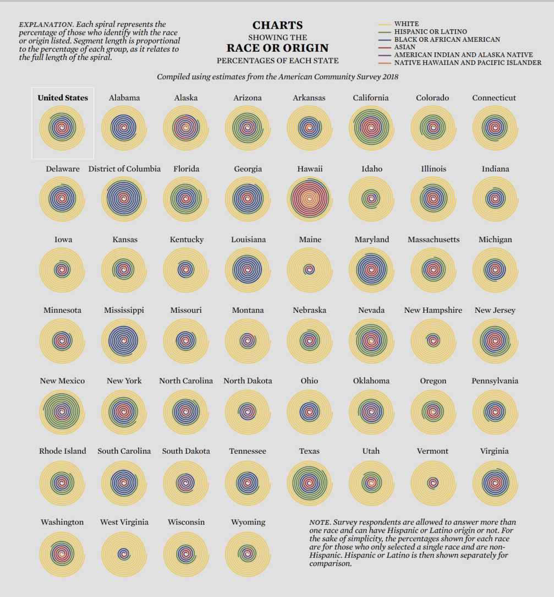

## Original Graph

{.external width=100%}

I selected this visualization because it is immediately visually engaging and draws the viewer’s attention. The spiral design, use of color, and repetition across states make the graphic stand out. 

At first glance, the chart appears rich and informative, encouraging the reader to look at individual states and notice differences in racial and ethnic composition. This makes it a good example of a visualization that succeeds in attracting attention.

However, once the viewer tries to extract precise information or compare states, the design becomes harder to interpret. The spiral format makes it difficult to compare proportions across states or across racial groups, as there is no clear common baseline and multiple visual cues must be interpreted simultaneously.

For this reason, I chose this graph as a candidate for replication and improvement: it is visually compelling, but its aesthetic appeal partially comes at the expense of clarity and comparability. The redesign focuses on preserving engagement while improving interpretability.


## Replication

```{r setup}
library(tidyverse)
library(patchwork)
library(ggtext)
library(lubridate)
library(cowplot)
library(grid)
```

```{r load-data}
# Loading the preprocessed data files
data_main <- read.csv(file = "data_main.csv")
data_main2 <- read.csv(file = "data_main2.csv")

# Combine both datasets (they represent different geographic regions)
data_main_completo <- bind_rows(data_main, data_main2)

# Use full dataset (sample_frac = 1 means 100% of data, during the building phase I used just a sample)
set.seed(40)  
data_sample <- data_main_completo |> 
  sample_frac(1)
```

```{r recode_races}
# Race/Ethnicity Recoding
# The Census uses complex race coding. This section simplifies it to 6 categories:
# 1. WHITE (non-Hispanic)
# 2. HISPANIC OR LATINO (any race)
# 3. BLACK OR AFRICAN AMERICAN (non-Hispanic)
# 4. ASIAN (non-Hispanic)
# 5. AMERICAN INDIAN AND ALASKA NATIVE (non-Hispanic)
# 6. NATIVE HAWAIIAN AND PACIFIC ISLANDER (non-Hispanic)

data_sample <- data_sample |> 
  mutate(
    race_final = case_when(
      hispanic != 1 ~ 2,           # If Hispanic, code as 2 regardless of race
      race == 1 ~ 1,              # White
      race == 2 ~ 3,              # Black / African American
      race == 6 ~ 4,              # Asian
      race %in% c(3, 4, 5) ~ 5,   # American Indian / Alaska Native
      race == 7 ~ 6,              # Native Hawaiian & Pacific Islander
      .default = NA_real_
    ), 
    race_final = factor(
      race_final,
      levels = c(1, 2, 3, 4, 5, 6),
      labels = c(
        "WHITE",
        "HISPANIC OR LATINO",
        "BLACK OR AFRICAN AMERICAN",
        "ASIAN",
        "AMERICAN INDIAN AND ALASKA NATIVE",
        "NATIVE HAWAIIAN AND PACIFIC ISLANDER"
      )
    )
  )

# Filter to include only:
# - Valid race classifications (not NA)
# - People who selected only one race (race_total_groups < 2)
# This matches the original methodology
data_sample <- data_sample |> 
  filter(!is.na(race_final) & !is.na(race_total_groups) & race_total_groups < 2)
```

```{r keeping-some-states}
# Keeping 50 States + DC
# Filter to include only the 51 entities shown in the original chart
# Note: Code 3, 7, 14, 43, 52 don't exist in Census state codes
# Puerto Rico (72) is excluded

data_sample <- data_sample |> 
  filter(state %in% c(1, 2, 4, 5, 6, 8, 9, 10, 11, 12, 13, 15, 16, 17, 18, 19, 
                      20, 21, 22, 23, 24, 25, 26, 27, 28, 29, 30, 31, 32, 33, 
                      34, 35, 36, 37, 38, 39, 40, 41, 42, 44, 45, 46, 47, 48, 
                      49, 50, 51, 53, 54, 55, 56))

# State codes to full names
state_names <- c(
  "0" = "United States",
  "1" = "Alabama", "2" = "Alaska", "4" = "Arizona", "5" = "Arkansas",
  "6" = "California", "8" = "Colorado", "9" = "Connecticut", "10" = "Delaware",
  "11" = "District of Columbia", "12" = "Florida", "13" = "Georgia",
  "15" = "Hawaii", "16" = "Idaho", "17" = "Illinois", "18" = "Indiana",
  "19" = "Iowa", "20" = "Kansas", "21" = "Kentucky", "22" = "Louisiana",
  "23" = "Maine", "24" = "Maryland", "25" = "Massachusetts", "26" = "Michigan",
  "27" = "Minnesota", "28" = "Mississippi", "29" = "Missouri", "30" = "Montana",
  "31" = "Nebraska", "32" = "Nevada", "33" = "New Hampshire", "34" = "New Jersey",
  "35" = "New Mexico", "36" = "New York", "37" = "North Carolina", "38" = "North Dakota",
  "39" = "Ohio", "40" = "Oklahoma", "41" = "Oregon", "42" = "Pennsylvania",
  "44" = "Rhode Island", "45" = "South Carolina", "46" = "South Dakota",
  "47" = "Tennessee", "48" = "Texas", "49" = "Utah", "50" = "Vermont",
  "51" = "Virginia", "53" = "Washington", "54" = "West Virginia",
  "55" = "Wisconsin", "56" = "Wyoming"
)
```

```{r calculate-proportions}
# Calculating National Proportions
# Calculate the percentage of each race/ethnicity nationally
# This will be used for the overall "United States" spiral

race_prop <- data_sample |> 
  group_by(race_final) |> 
  summarise(count = n()) |> 
  mutate(
    prop = count / sum(count),           # Calculate proportion
    cum_prop = cumsum(prop),             # Cumulative proportion (for spiral segments)
    start = lag(cum_prop, default = 0)   # Starting point of each segment
  )

# Quick visualization of national proportions (bar chart)
geom_col_race <- ggplot(race_prop) + 
  aes(x = race_final, y = prop) +
  geom_col()
geom_col_race
```

```{r create-spiral}
# Creating the Spiral Geometry
# The spiral is defined mathematically as an Archimedean spiral: r = a + b*θ
# where:
# - a = 5 (initial radius)
# - b = 1 (spacing between spiral turns)
# - θ (theta) ranges from 0 to 24π (12 complete rotations)

a <- 5
b <- 1
theta <- seq(0, 24*pi, 0.01)  # Small step (0.01) creates smooth spiral
theta <- rev(theta)            # Reverse to spiral inward
r <- a + b*theta              # Calculate radius at each angle

# Convert polar coordinates (r, θ) to Cartesian coordinates (x, y)
spiral <- data.frame(x = r*cos(theta), y = r*sin(theta))

# Test visualization: plot the basic spiral structure
max_r <- max(r)
spiral_graph <- ggplot(spiral, aes(x, y)) +
  geom_point(col = '#eac964', size = 1) +
  coord_fixed(xlim = c(-max_r, max_r), ylim = c(-max_r, max_r))
spiral_graph
```

```{r map-data-to-spiral}
# Mapping Data to Spiral
# Assign each point on the spiral to a race/ethnicity category
# based on cumulative proportions

spiral_applied_df <- spiral |> 
  mutate(
    position = row_number()/n(),  # Normalize position (0 to 1)
    # Assign race category based on which segment the position falls into
    race_final = cut(
      position, 
      breaks = c(race_prop$start, 1),  # Use cumulative proportions as breaks
      labels = race_prop$race_final,    # Label with race names
      include.lowest = TRUE
    )
  )

# Visualize the colored spiral
spiral_graph_applied <- ggplot(spiral_applied_df, 
                               aes(x, y, color = race_final)) + 
  geom_point(size = 1.5) +
  coord_fixed(xlim = c(-max_r, max_r), ylim = c(-max_r, max_r))
spiral_graph_applied
```

```{r define-colors}
# Defining Color Palette
# Custom colors matching the original visualization's aesthetic

race_colors <- c(
  "WHITE" = "#ddc56c",                                # Tan/beige
  "HISPANIC OR LATINO" = "#62743c",                   # Olive green
  "BLACK OR AFRICAN AMERICAN" = "#515da1",            # Dark blue
  "ASIAN" = "#833e3d",                                # Brick red
  "AMERICAN INDIAN AND ALASKA NATIVE" = "#7b5a8e",    # Purple
  "NATIVE HAWAIIAN AND PACIFIC ISLANDER" = "#dd824a"  # Orange
)

# Apply color palette and add continuous path (not just points)
spiral_graph_applied <- spiral_graph_applied +
  scale_color_manual(values = race_colors) +
  geom_path(linewidth = 1)  # Connect points to create smooth spiral

spiral_graph_applied
```

```{r create-all-state-spirals}
# Creating Spirals for All States
# Step 1: Calculate proportions for the overall US
race_prop_usa <- data_sample |> 
  group_by(race_final) |> 
  summarise(count = n(), .groups = "drop") |> 
  mutate(
    prop = count / sum(count),
    cum_prop = cumsum(prop), 
    start = lag(cum_prop, default = 0),
    state = 0  # Assign code 0 to represent "United States"
  )

# Step 2: Calculate proportions for each individual state
race_prop_by_state <- data_sample |> 
  group_by(state, race_final) |> 
  summarise(count = n(), .groups = "drop") |> 
  group_by(state) |> 
  mutate(
    prop = count / sum(count),
    cum_prop = cumsum(prop), 
    start = lag(cum_prop, default = 0)
  )

# Step 3: Combine US and state-level data
race_prop_completo <- bind_rows(race_prop_usa, race_prop_by_state)

# Step 4: Create a spiral for each state
# This uses the same spiral geometry but colors each segment according to
# that state's racial composition
spiral_all_states <- race_prop_completo |> 
  group_by(state) |> 
  reframe(
    spiral |> 
      mutate(
        position = row_number()/n(),
        race_final = cut(
          position, 
          breaks = c(start, 1), 
          labels = race_final, 
          include.lowest = TRUE
        )
      )
  ) |>
  mutate(state_name = state_names[as.character(state)])

# Step 5: Ensure "United States" appears first in facets
spiral_all_states <- spiral_all_states |>
  mutate(state_name = factor(state_name, 
                             levels = c("United States", 
                                        sort(setdiff(unique(state_name), "United States")))))

# Create base multi-panel spiral plot
spiral_graph_multi <- ggplot(spiral_all_states, aes(x, y, color = race_final)) + 
  geom_point(size = 0.5) +
  scale_color_manual(values = race_colors) +
  coord_fixed() +
  facet_wrap(~state_name, ncol = 8, nrow = 7)  # 8 columns × 7 rows = 56 panels

# Add white border around "United States" panel to highlight it
spiral_graph_multi <- spiral_graph_multi +
  geom_rect(
    data = spiral_all_states |>
      filter(state_name == "United States"),
    aes(xmin = -Inf, xmax = Inf, ymin = -Inf, ymax = Inf),
    fill = NA,
    color = "white",
    linewidth = 0.7,
    inherit.aes = FALSE
  ) +
  theme(
    strip.text = element_text(
      size = 11,
      family = "serif",
      face = "bold"        
    ),
    plot.background = element_rect(fill = "grey90", color = NA)  
  )

spiral_graph_multi
```

```{r build-layout-components}
# Building Final Layout Components

# 1. MAIN PLOT: The 52 spirals with minimal styling
main_plot <- spiral_graph_multi +
  geom_path(aes(group = state_name), linewidth = 0.35, alpha = 0.9) +
  theme_minimal() +
  theme(
    plot.title = element_blank(),
    axis.text = element_blank(),
    axis.title = element_blank(),
    axis.ticks = element_blank(),
    panel.grid = element_blank(),
    plot.background = element_rect(fill = "grey90", color = NA),
    panel.background = element_rect(fill = "grey90", color = NA),
    strip.text = element_text(
      size = 11, 
      family = "serif", 
      face = "plain", 
      margin = margin(b = 3, t = 2)
    ),
    legend.position = "none",
    panel.spacing = unit(0.4, "lines"),
    plot.margin = margin(0, 5, 5, 5)
  )

# 2. LEGEND: Extract legend from the plot
legend_plot <- spiral_graph_multi +
  theme_minimal() +
  theme(
    legend.position = "right",
    legend.title = element_blank(),
    legend.text = element_text(
      size = 8, 
      family = "serif", 
      lineheight = 1.2
    ),
    legend.key.size = unit(0.35, "cm"),
    legend.spacing.y = unit(0.2, "cm"),
    legend.background = element_rect(fill = "grey90", color = NA),
    plot.background = element_rect(fill = "grey90", color = NA),
    legend.box.background = element_rect(fill = "grey90", color = NA)
  ) +
  guides(color = guide_legend(
    override.aes = list(
      size = 3.5,
      shape = 16,
      alpha = 1
    )
  ))

legend <- get_legend(legend_plot)

# 3. TITLE: Multi-line title with bold emphasis on key words
title_plot <- ggplot() +
  theme_void() +
  coord_cartesian(xlim = c(0, 1), ylim = c(0, 1), clip = "off") +
  theme(
    plot.background = element_rect(fill = "grey90", color = NA),
    plot.margin = margin(0, 0, 0, 0)
  ) +
  # First line: CHARTS (bold)
  annotate(
    "text",
    x = 0.5, y = 0.70,
    label = "CHARTS",
    family = "serif",
    fontface = "bold",
    size = 6,
    hjust = 0.5,
    vjust = 1
  ) +
  # Second line: SHOWING THE (plain)
  annotate(
    "text",
    x = 0.5, y = 0.50,
    label = "SHOWING THE",
    family = "serif",
    fontface = "plain",
    size = 6,
    hjust = 0.5,
    vjust = 1
  ) +
  # Third line: RACE OR ORIGIN (bold)
  annotate(
    "text",
    x = 0.5, y = 0.30,
    label = "RACE OR ORIGIN",
    family = "serif",
    fontface = "bold",
    size = 6,
    hjust = 0.5,
    vjust = 1
  ) +
  # Fourth line: PERCENTAGES OF EACH STATE (plain)
  annotate(
    "text",
    x = 0.5, y = 0.10,
    label = "PERCENTAGES OF EACH STATE",
    family = "serif",
    fontface = "plain",
    size = 6,
    hjust = 0.5,
    vjust = 1
  )

# 4. SUBTITLE: Data source information
subtitle_plot <- ggplot() +
  theme_void() +
  coord_cartesian(xlim = c(0, 1), ylim = c(0, 1), clip = "off") +
  theme(
    plot.background = element_rect(fill = "grey90", color = NA),
    plot.margin = margin(0, 0, 0, 0)
  ) +
  annotate(
    "text", 
    x = 0.5, y = 0.5,
    label = "Compiled using estimates from the American Community Survey 2018", 
    family = "serif",
    fontface = "italic",
    size = 3.5,
    hjust = 0.5,
    vjust = 0.5
  )

# 5. EXPLANATION: Methodology note (left side)
explanation_plot <- ggplot() +
  theme_void() +
  theme(
    plot.background = element_rect(fill = "grey90", color = NA), 
    plot.margin = margin(5, 5, 5, 5)
  ) +
  coord_cartesian(xlim = c(-0.2, 1.2), ylim = c(0, 1), clip = "off") +  
  annotate(
    "text", 
    x = -0.15, y = 0.5,    
    label = "EXPLANATION. Each spiral represents the\npercentage of those who identify with the race\nor origin listed. Segment length is proportional\nto the percentage of each group, as it relates to\nthe full length of the spiral.",
    family = "serif", 
    size = 3.5,
    hjust = 0,
    vjust = 0.5,
    lineheight = 1.1, 
    fontface = "italic"
  )

# 6. NOTE: Clarification about race/ethnicity categories
note_text <- "NOTE. Survey respondents are allowed to answer more than\none race and can have Hispanic or Latino origin or not. For\nthe sake of simplicity, the percentages shown for each race\nare for those who only selected a single race and are non-\nHispanic. Hispanic or Latino is then shown separately for\ncomparison."
```

```{r assemble-final-layout}
# Assembling Final Layout

# Extract legend as a separate element
legend_grob <- get_legend(legend_plot)
legend_only_plot <- ggdraw() + draw_grob(legend_grob) +
  theme(plot.background = element_rect(fill = "grey90", color = NA))

# Top row: Explanation | Title | Legend (proportions 2:4:2)
top_row <- explanation_plot + title_plot + legend_only_plot + 
  plot_layout(widths = c(2, 4, 2)) +
  plot_annotation(theme = theme(
    plot.background = element_rect(fill = "grey90", color = NA),
    plot.margin = margin(0, 0, 0, 0)
  ))

# Create grey spacer elements for visual separation
grey_spacer <- wrap_elements(
  full = rectGrob(height = unit(0.1, "cm"), gp = gpar(fill = "grey90", col = NA))
)

# Second row: Spacer | Subtitle | Spacer (same proportions as top row)
second_row <- grey_spacer + subtitle_plot + grey_spacer +
  plot_layout(widths = c(2, 4, 2)) &
  theme(plot.background = element_rect(fill = "grey90", color = NA))

# Combine all rows: Title row / Subtitle row / Main spirals
# Heights: 0.1 (title), 0.01 (subtitle), 1 (main content)
final_plot <- top_row / second_row / main_plot +
  plot_layout(heights = c(0.1, 0.01, 1))

# Add the NOTE text using ggdraw (allows precise positioning)
final_plot_2 <- ggdraw(final_plot) +
  draw_text(
    note_text,
    x = 0.6,       # Horizontal position (60% from left)
    y = 0.08,      # Vertical position (8% from bottom)
    hjust = 0,     # Left-aligned
    vjust = 0,     # Bottom-aligned
    fontface = "italic",
    size = 10,
    family = "serif",
    color = "black"
  ) +
  theme(plot.background = element_rect(fill = "grey90", color = NA))
```

```{r final-spiral-visualization, fig.width=11, fig.height=14, dpi=200, preview=TRUE}
final_plot_2
```

## Improvement

```{r clear-environment}
rm(list = ls())
```

```{r setup-improvement}
# Loading Required Libraries
library(tidyverse)  # includes ggplot2, dplyr, tidyr
library(patchwork)
library(viridis)
```

```{r load-data-improvement}
# Load and prepare data (same as before)
data_main <- read.csv(file = "data_main.csv")
data_main2 <- read.csv(file = "data_main2.csv")
data_main_completo <- bind_rows(data_main, data_main2)

set.seed(40)
data_sample <- data_main_completo |> 
  sample_frac(1)
```

```{r recoding-race-improvement}
# Recode race/ethnicity (same as before)
data_sample <- data_sample |> 
  mutate(
    race_final = case_when(
      hispanic != 1 ~ 2, 
      race == 1 ~ 1,              
      race == 2 ~ 3,              
      race == 6 ~ 4,              
      race %in% c(3, 4, 5) ~ 5,   
      race == 7 ~ 6,              
      .default = NA_real_
    ), race_final = factor(
      race_final,
      levels = c(1, 2, 3, 4, 5, 6),
      labels = c(
        "WHITE",
        "HISPANIC OR LATINO",
        "BLACK OR AFRICAN AMERICAN",
        "ASIAN",
        "AMERICAN INDIAN AND ALASKA NATIVE",
        "NATIVE HAWAIIAN AND PACIFIC ISLANDER"
      )
    )
  )

data_sample <- data_sample |> 
  filter(!is.na(race_final) & !is.na(race_total_groups) & race_total_groups < 2)

# Use same color palette for consistency
race_colors <- c(
  "WHITE" = "#ddc56c",
  "HISPANIC OR LATINO" = "#62743c",
  "BLACK OR AFRICAN AMERICAN" = "#515da1",
  "ASIAN" = "#833e3d",
  "AMERICAN INDIAN AND ALASKA NATIVE" = "#7b5a8e",
  "NATIVE HAWAIIAN AND PACIFIC ISLANDER" = "#dd824a"
)

# Filter to same states
data_sample <- data_sample |> 
  filter(state %in% c(1, 2, 4, 5, 6, 8, 9, 10, 11, 12, 13, 15, 16, 17, 18, 19, 
                      20, 21, 22, 23, 24, 25, 26, 27, 28, 29, 30, 31, 32, 33, 
                      34, 35, 36, 37, 38, 39, 40, 41, 42, 44, 45, 46, 47, 48, 
                      49, 50, 51, 53, 54, 55, 56))

# Use state abbreviations instead of full names for clarity
state_names <- c(
  "0" = "US",
  "1" = "AL", "2" = "AK", "4" = "AZ", "5" = "AR",
  "6" = "CA", "8" = "CO", "9" = "CT", "10" = "DE",
  "11" = "DC", "12" = "FL", "13" = "GA",
  "15" = "HI", "16" = "ID", "17" = "IL", "18" = "IN",
  "19" = "IA", "20" = "KS", "21" = "KY", "22" = "LA",
  "23" = "ME", "24" = "MD", "25" = "MA", "26" = "MI",
  "27" = "MN", "28" = "MS", "29" = "MO", "30" = "MT",
  "31" = "NE", "32" = "NV", "33" = "NH", "34" = "NJ",
  "35" = "NM", "36" = "NY", "37" = "NC", "38" = "ND",
  "39" = "OH", "40" = "OK", "41" = "OR", "42" = "PA",
  "44" = "RI", "45" = "SC", "46" = "SD", "47" = "TN",
  "48" = "TX", "49" = "UT", "50" = "VT", "51" = "VA",
  "53" = "WA", "54" = "WV", "55" = "WI", "56" = "WY"
)
```

```{r prepare-circular-data}
# Data Preparation for Circular Bar Charts
# Calculate percentage of each race/ethnicity within each state
race_by_state <- data_sample |>
  group_by(state, race_final) |>
  summarise(count = n(), .groups = "drop") |>
  group_by(state) |>
  mutate(
    total = sum(count),
    percentage = (count / total) * 100  # Convert to percentage
  ) |>
  ungroup() |>
  mutate(state_name = state_names[as.character(state)])
```

```{r creating-main-circular}
# Main Circular Bar Chart: All States Combined
state_list <- unique(race_by_state$state_name)
n_states <- length(state_list)

# Prepare data with unique ID for each state
main_data <- race_by_state |>
  arrange(state_name, race_final) |>
  group_by(state_name) |>
  mutate(id = cur_group_id()) |>  # Assign unique ID to each state
  ungroup()

# Calculate label positioning for state names
label_data_main <- main_data |>
  group_by(state_name, id) |>
  summarise(total = sum(percentage), .groups = "drop") |>
  mutate(
    # Calculate angle for each label based on position in circle
    angle = 90 - 360 * (id - 0.5) / n_states,
    # Flip labels on left side for readability
    hjust = ifelse(angle < -90, 1, 0),
    angle = ifelse(angle < -90, angle + 180, angle)
  )

# Create main circular bar chart
main_circular <- ggplot(main_data, aes(x = as.factor(id), y = percentage, fill = race_final)) +
  # Stacked bars for each state
  geom_bar(stat = "identity", alpha = 0.85, color = "white", linewidth = 0.3) +
  scale_fill_manual(values = race_colors) +
  
  # Add reference grid lines at 25%, 50%, 75%, 100%
  geom_segment(aes(x = 0, y = 25, xend = n_states, yend = 25), 
               colour = "grey80", alpha = 0.5, linewidth = 0.3) +
  geom_segment(aes(x = 0, y = 50, xend = n_states, yend = 50), 
               colour = "grey80", alpha = 0.5, linewidth = 0.3) +
  geom_segment(aes(x = 0, y = 75, xend = n_states, yend = 75), 
               colour = "grey80", alpha = 0.5, linewidth = 0.3) +
  geom_segment(aes(x = 0, y = 100, xend = n_states, yend = 100), 
               colour = "grey80", alpha = 0.5, linewidth = 0.3) +
  
  # Add percentage labels for grid lines
  annotate("text", x = 0, y = c(25, 50, 75, 100), 
           label = c("25%", "50%", "75%", "100%"),
           color = "grey40", size = 3.5, fontface = "bold") +
  
  # Add state abbreviations around the circle
  geom_text(data = label_data_main, 
            aes(x = id, y = total + 8, label = state_name, 
                angle = angle, hjust = hjust),
            color = "black", size = 3, fontface = "bold", 
            inherit.aes = FALSE) +
  
  ylim(-30, 120) +  # Extend limits to accommodate labels
  coord_polar(start = 0) +  # Convert to circular/polar coordinates
  theme_minimal() +
  theme(
    legend.position = c(1, 0),  # Bottom-right corner
    legend.justification = c(1, 0),   
    legend.title = element_blank(),
    legend.text = element_text(size = 8, family = "serif"),
    legend.key.size = unit(0.5, "cm"),
    legend.background = element_rect(fill = "white", color = "grey80", linewidth = 0.3),
    legend.margin = margin(3, 3, 3, 3),
    axis.text = element_blank(),
    axis.title = element_blank(),
    panel.grid = element_blank(),
    plot.title = element_text(size = 16, hjust = 0.5, face = "bold", family = "serif"),
    plot.margin = margin(10, 10, 10, 10)
  ) +
  guides(fill = guide_legend(ncol = 1)) +
  labs(title = "CHARTS SHOWING THE RACE OR ORIGIN PERCENTAGES OF EACH STATE")
```

```{r creating-category-plot-function}
# Individual Circular Charts: One per Race/Ethnicity Category
# Function to create a circular bar chart for a specific race/ethnicity
# Shows only the top 10 states for that category
create_category_plot <- function(category_name, color) {
  # Filter and sort to get top 10 states for this category
  category_data <- race_by_state |>
    filter(race_final == category_name) |>
    arrange(desc(percentage)) |>
    slice_head(n = 10) |>  # Keep only top 10
    mutate(id = row_number())
  
  n_bars <- nrow(category_data)
  
  # Adjust y-axis limit based on maximum percentage
  max_percentage <- max(category_data$percentage)
  y_limit <- ceiling(max_percentage / 10) * 10 + 10  # Round up to nearest 10
  
  # Calculate label positioning
  label_data <- category_data |>
    mutate(
      angle = 90 - 360 * (id - 0.5) / n_bars,
      hjust = ifelse(angle < -90, 1, 0),
      angle = ifelse(angle < -90, angle + 180, angle)
    )
  
  # Build plot
  p <- ggplot(category_data, aes(x = as.factor(id), y = percentage)) +
    geom_bar(stat = "identity", fill = color, alpha = 0.85, 
             color = "grey95", linewidth = 0.4)
  
  # Add reference lines only if within the y-axis range
  if(y_limit >= 25) {
    p <- p + geom_segment(aes(x = 0, y = 25, xend = n_bars, yend = 25), 
                          colour = "grey85", alpha = 0.6, linewidth = 0.3)
  }
  if(y_limit >= 50) {
    p <- p + geom_segment(aes(x = 0, y = 50, xend = n_bars, yend = 50), 
                          colour = "grey85", alpha = 0.6, linewidth = 0.3)
  }
  if(y_limit >= 75) {
    p <- p + geom_segment(aes(x = 0, y = 75, xend = n_bars, yend = 75), 
                          colour = "grey85", alpha = 0.6, linewidth = 0.3)
  }
  
  # Add percentage labels only for existing reference lines
  ref_labels <- c()
  ref_values <- c()
  if(y_limit >= 25) { ref_labels <- c(ref_labels, "25%"); ref_values <- c(ref_values, 25) }
  if(y_limit >= 50) { ref_labels <- c(ref_labels, "50%"); ref_values <- c(ref_values, 50) }
  if(y_limit >= 75) { ref_labels <- c(ref_labels, "75%"); ref_values <- c(ref_values, 75) }
  
  if(length(ref_values) > 0) {
    p <- p + annotate("text", x = 0, y = ref_values, 
                      label = ref_labels,
                      color = "grey50", size = 3, fontface = "bold")
  }
  
  # Add state labels
  p <- p +
    geom_text(data = label_data, 
              aes(x = id, y = percentage + 8, label = state_name, 
                  angle = angle, hjust = hjust),
              color = "black", size = 3, fontface = "bold", inherit.aes = FALSE) +
    
    ylim(-15, y_limit + 5) +  # Adjust limits to reduce whitespace
    coord_polar(start = 0) +
    theme_minimal() +
    theme(
      legend.position = "none",
      axis.text = element_blank(),
      axis.title = element_blank(),
      panel.grid = element_blank(),
      plot.title = element_blank(),
      plot.margin = margin(2, 2, 2, 2)
    )
  
  return(p)
}
```

```{r creating-individual-plots}
# Create individual circular charts for each race/ethnicity
white_plot <- create_category_plot("WHITE", race_colors["WHITE"])
hispanic_plot <- create_category_plot("HISPANIC OR LATINO", race_colors["HISPANIC OR LATINO"])
black_plot <- create_category_plot("BLACK OR AFRICAN AMERICAN", race_colors["BLACK OR AFRICAN AMERICAN"])
asian_plot <- create_category_plot("ASIAN", race_colors["ASIAN"])
native_plot <- create_category_plot("AMERICAN INDIAN AND ALASKA NATIVE", race_colors["AMERICAN INDIAN AND ALASKA NATIVE"])
pacific_plot <- create_category_plot("NATIVE HAWAIIAN AND PACIFIC ISLANDER", race_colors["NATIVE HAWAIIAN AND PACIFIC ISLANDER"])
```

```{r creating-layout-elements}
# Final Layout Assembly
# Arrange individual charts in a 3×2 grid
detail_grid <- (white_plot + hispanic_plot) / 
  (black_plot + asian_plot) /
  (native_plot + pacific_plot) +
  plot_layout(heights = c(1, 1, 1))

# Create subtitle elements as separate plots
subtitle_left <- ggplot() +
  theme_void() +
  coord_cartesian(xlim = c(0, 1), ylim = c(0, 1)) +
  annotate("text", x = 0.5, y = 0.5, 
           label = "Overall composition by state",
           size = 5, family = "serif", color = "grey20", fontface = "italic") +
  theme(
    plot.background = element_rect(fill = "white", color = NA),
    plot.margin = margin(5, 5, 10, 5)
  )

subtitle_right <- ggplot() +
  theme_void() +
  coord_cartesian(xlim = c(0, 1), ylim = c(0, 1)) +
  annotate("text", x = 0.5, y = 0.5, 
           label = "Top 10 states with each most predominant race",
           size = 5, family = "serif", color = "grey20", fontface = "italic") +
  theme(
    plot.background = element_rect(fill = "white", color = NA),
    plot.margin = margin(5, 5, 10, 5)
  )

# Main title
title_main <- ggplot() +
  theme_void() +
  coord_cartesian(xlim = c(0, 1), ylim = c(0, 1)) +
  annotate("text", x = 0.5, y = 0.5, 
           label = "CHARTS SHOWING THE RACE OR ORIGIN PERCENTAGES OF EACH STATE",
           size = 7, family = "serif", fontface = "bold") +
  theme(
    plot.background = element_rect(fill = "white", color = NA),
    plot.margin = margin(15, 5, 10, 5)
  )

# Combine subtitles with their respective sections
left_section <- subtitle_left / main_circular + plot_layout(heights = c(0.5, 10))
right_section <- subtitle_right / detail_grid + plot_layout(heights = c(0.5, 10))

# Final combined layout
# Left side (2 units wide): Overall composition
# Right side (5 units wide): Top 10 states for each category
final_layout_sidebyside <- 
  title_main / 
  (left_section | right_section) +
  plot_layout(heights = c(1, 20), widths = c(2, 5))
```

```{r final-circular-visualization, fig.width=22, fig.height=12, dpi=300}
final_layout_sidebyside
```
