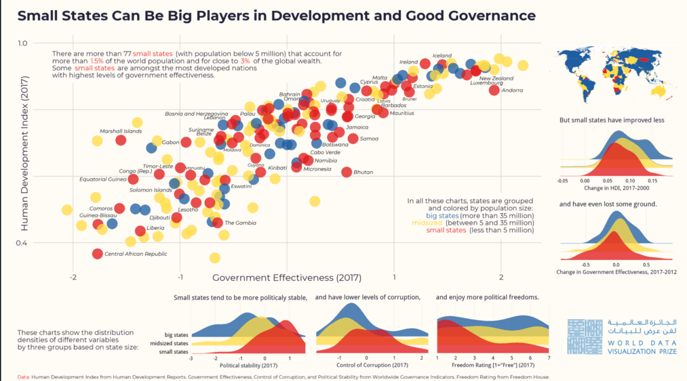
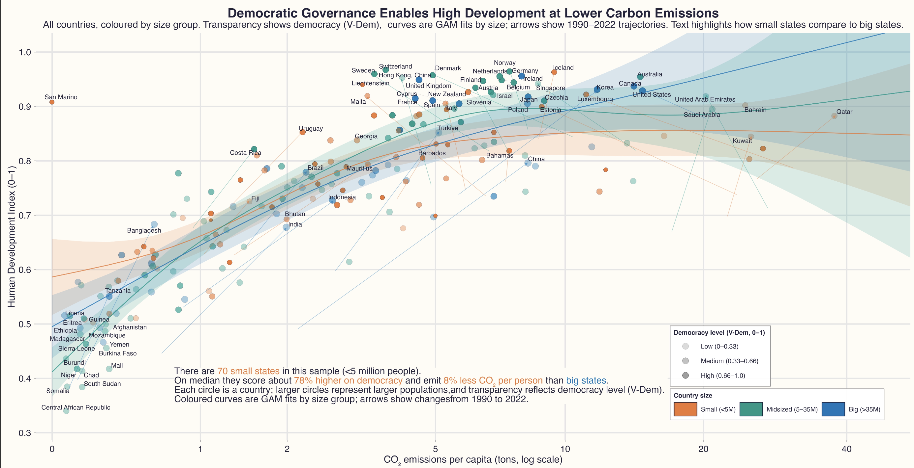

# Introduction

This project replicates the multi-panel visualization “Small States Can Be Big Players in Development and Good Governance”, originally produced for the World Data Visualization Prize. The original figure combines several international datasets to show how countries differ in human development, governance quality, political stability, corruption, and democratic freedoms, depending on their population size.

The aim here is twofold. First, to recreate the graphic as faithfully as possible using only R and openly available data. Second, to build a fully transparent and reproducible workflow that covers the entire pipeline: data retrieval, cleaning, transformation, visualization, and final layout. The final figure is generated entirely from scratch using tidyverse tools, ggplot2, sf, and related packages. Every element—scatterplot, ridge-density panels, world map, annotation blocks, and the overall layout—is constructed through a structured sequence of steps designed to balance precision, clarity, and readability.

{width="662" height="452"}\

## Motivation

Small states hold a distinctive place in global development debates. Although they account for only a small share of the world’s population, many of them achieve high levels of human development and maintain effective, stable institutions. Island nations and microstates often score strongly on governance and democratic indicators, challenging the intuition that size naturally confers an advantage in state capacity or development outcomes.

The original visualization captures this idea by placing several indicators side by side and grouping countries by population size. It shows that small states frequently appear among the best performers on governance and democracy, while also revealing differences in how far various groups have progressed over time. Replicating this figure offers a concrete exercise in computational social science. It requires handling heterogeneous data sources, making careful choices about visual encoding, and thinking critically about how design decisions shape interpretation. The analysis is descriptive rather than causal, but it illustrates how empirical patterns become more visible when multiple dimensions of development are presented in a coherent visual narrative.

## Data sources and data collection

All data used in this replication come from public, well-documented sources and are retrieved programmatically within R. This approach ensures that anyone with access to the script can obtain the same inputs and follow the same steps to arrive at the final graphic.

The main economic and governance indicators are taken from the World Bank’s World Development Indicators and Worldwide Governance Indicators. Using the wbstats package, the script downloads government effectiveness, political stability, control of corruption, GDP in purchasing-power-parity terms, GDP per capita, unemployment, and total population. The key years are 2007, 2012, and 2017, chosen to match the timing structure implied in the original figure. Human development scores come from the United Nations Development Programme’s Human Development Index time series. The project extracts HDI values for 2000 and 2017, which are then used to compute the change in HDI over that period. This change is later displayed in one of the ridge-density plots and helps capture long-term development trajectories.

Democratic freedoms are measured with the Liberal Democracy Index from the Varieties of Democracy (V-Dem) project. The dataset is accessed via the vdemdata package, which provides a harmonised version of the annual V-Dem release. The replication focuses on values for 2017 to keep the time frame consistent across the governance and democracy indicators. Once retrieved, these datasets are merged using standard ISO-3 country codes. Each country is assigned to one of three population-based categories based on its 2017 population: small states have fewer than five million inhabitants, midsized states have between five and thirty-five million, and big states exceed thirty-five million. This classification mirrors the original visualization and provides a consistent backbone for colouring, labelling, and grouping across all panels. Because all data collection and merging are handled inside the R script, the final figure is fully reproducible and grounded in verifiable, up-to-date sources.\

##### Libraries & Options

```{r  LIBRARIES & OPTIONS}
#| echo: FALSE 
library(tidyverse)
library(janitor)
library(wbstats)
library(countrycode)
library(scales)
library(ggridges)
library(showtext)
library(sysfonts)
library(vdemdata)
library(sf)
library(rnaturalearth)
library(cowplot)
library(ggtext)
library(ggrepel)   
library(magick)

options(timeout = 300)

```

##### Fonts & Colors

```{r FONTS & COLORS}

font_add_google("Montserrat", "Montserrat")
showtext_auto()
showtext_opts(dpi = 96)

base_font <- "sans"   

# Exact colours  as in the original Figure 

col1  <- rgb(225, 25, 27,  alpha = 255, maxColorValue = 255)  # red
col2  <- rgb(30,  93, 160, alpha = 255, maxColorValue = 255)  # blue
col3  <- rgb(255, 220, 69, alpha = 255, maxColorValue = 255)  # yellow
col1a <- rgb(225, 25, 27,  alpha = 195, maxColorValue = 255)
col2a <- rgb(30,  93, 160, alpha = 195, maxColorValue = 255)
col3a <- rgb(255, 220, 69, alpha = 195, maxColorValue = 255)
col3b <- rgb(248, 202, 8,  alpha = 255, maxColorValue = 255)

bg.col     <- rgb(255, 251, 245, maxColorValue = 255)
dark.color <- rgb(35, 35, 58, maxColorValue = 255)

size_colors       <- c("small" = col1, "medium" = col3, "big" = col2)
size_colors_alpha <- c("small" = col1a, "medium" = col3a, "big" = col2a)
order_size        <- c("small", "medium", "big")

```

##### Helper

```{r HELPER: FETCH WORLD BANK DATA}

fetch_wb <- function(indicators, years = c(2007, 2012, 2017)) {
  map_dfr(indicators, ~{
    wb_data(
      indicator   = .x,
      country     = "all",
      start_date  = min(years),
      end_date    = max(years),
      return_wide = TRUE
    ) |>
      clean_names()
  }) |>
    group_by(iso2c, iso3c, country, date) |>
    summarise(
      across(where(is.numeric), ~ first(na.omit(.x))),
      .groups = "drop"
    ) |>
    mutate(date = as.integer(date)) |>
    filter(date %in% years)
}

```

##### Economic Data

```{r   ECONOMIC DATA}

options(timeout = 300)
econ_all <- fetch_wb(c("NY.GDP.MKTP.PP.KD", "SP.POP.TOTL","NY.GDP.PCAP.PP.KD", "SL.UEM.TOTL.ZS"))

d.econ17 <- econ_all |>
  select(
    iso2c, iso3c, country, date,
    ny_gdp_mktp_pp_kd, sp_pop_totl, ny_gdp_pcap_pp_kd, sl_uem_totl_zs
  ) |>
  pivot_wider(
    names_from  = date,
    values_from = -c(iso2c, iso3c, country, date),
    names_sep   = "_"
  ) |>
  mutate(
    gdp    = ny_gdp_mktp_pp_kd_2017,
    popul  = sp_pop_totl_2017,
    gdp.pc = ny_gdp_pcap_pp_kd_2017
  ) |>
  select(iso2c, iso3c, country, gdp, popul, gdp.pc)

```

##### Governance Data

```{r   GOVERNANCE DATA}

gov_all <- fetch_wb(c("CC.EST", "GE.EST", "PV.EST", "RL.EST", "RQ.EST", "VA.EST"))

d.gov17 <- gov_all |>
  filter(!is.na(iso2c)) |>
  select(iso2c, iso3c, country, date,
         cc_est, ge_est, pv_est, rl_est, rq_est, va_est) |>
  pivot_wider(
    names_from  = date,
    values_from = -c(iso2c, iso3c, country, date),
    names_sep   = "_"
  ) |>
  mutate(
    corupt     = cc_est_2017,
    govef      = ge_est_2017,
    polviol    = pv_est_2017,
    govef.c.12 = ge_est_2017 - ge_est_2012
  )

```

##### HDI Data

```{r   HDI DATA}

d.hdi <- read_csv(
  "https://hdr.undp.org/sites/default/files/2021-22_HDR/HDR21-22_Composite_indices_complete_time_series.csv",
  show_col_types = FALSE
) |>
  select(
    iso3c    = iso3,
    hdi.00   = hdi_2000,
    hdi.2017 = hdi_2017
  )
```

##### V-Dem Data

```{r   V-DEM DATA }

freedom_data <- vdem |>
  filter(year == 2017) |>
  transmute(
    iso3c   = country_text_id,
    freedom = v2x_libdem
  )

```

## Data Preparation and Cleaning

Once the raw indicators are downloaded, the next step is to turn them into a single, well-structured dataset that can support all parts of the visualization. Although the underlying sources are high-quality, they differ in naming conventions, formats, and coverage, so a careful cleaning process is essential.

The preparation begins by standardising country identifiers. All datasets are converted to ISO-3 country codes, which serve as the common key across the World Bank, UNDP, and V-Dem records. This step avoids common problems caused by alternative country names or older naming conventions. Some labels are also adjusted manually to reflect the style used in the original figure, for example renaming “Gambia, The” to “The Gambia” and replacing “Congo, Rep.” with “Congo (Rep.)”. These edits ensure consistency between the final labels in the scatterplot and the original visualization.

After harmonising identifiers, the datasets are merged into one frame. Economic variables provide 2017 population and GDP measures, as well as the governance indicators for that year. The HDI table contributes values for 2000 and 2017, allowing the calculation of long-term change in human development. Similarly, the governance series offer values for 2012 and 2017, which are used to compute recent change in government effectiveness.

At this stage, the population-based groups defined earlier are encoded in the data as both numeric factors and descriptive labels such as “small states”, “midsized states”, and “big states”. These labels later appear on the ridge plots and help structure the legend and text.

Finally, the dataset is filtered to remove incomplete or problematic cases. Countries with missing HDI values, non-standard codes, or incomplete governance data are excluded to keep the final visualizations interpretable and comparable. The cleaned, merged dataset—referred to in the code as w1—contains all the variables required for the scatterplot, ridge panels, and world map. With this unified structure in place, the rest of the visualization can be built straightforwardly on top of it.

##### Size Groups

```{r  size groups}
w <- d.econ17 |>
  transmute(
    iso3c, country, pop = popul,
    size = cut(
      pop / 1e6,
      breaks = c(0, 5, 35, Inf),
      labels = order_size   # "small", "medium", "big"
    ),
    size = factor(size, levels = order_size)
  )

w |>
  count(size) |>
  mutate(pct = scales::percent(n / sum(n))) |>
  print()

```

##### Merge Everything -\> w1

```{r  merge everything -> w1}
w1 <- w |>
  left_join(select(d.gov17, -country), by = "iso3c") |>
  left_join(select(d.hdi, iso3c, hdi.00, hdi.2017), by = "iso3c") |>
  left_join(freedom_data, by = "iso3c") |>
  filter(nchar(iso2c) == 2, !is.na(hdi.2017)) |>
  mutate(
    size3 = factor(
      size,
      levels = order_size,
      labels = c("small states", "midsized states", "big states")
    ),
    hdi.c.0017 = hdi.2017 - hdi.00,
    country = recode(
      country,
      "Gambia, The"              = "The Gambia",
      "United Arab Emirates"     = "UAE",
      "Central African Republic" = "CAR",
      "Czech Republic"           = "Czechia",
      "United States"            = "USA",
      "Micronesia, Fed. Sts."    = "Micronesia",
      "Congo, Rep."              = "Congo (Rep.)"
    )
  )

```

## Visual Design and Aesthetic Choices

A key objective of the project is to reproduce the distinctive visual character of the original figure, not just its statistical content. Achieving this requires a deliberate design system, covering fonts, colours, background, spacing, and annotation style.

The colour palette is central to that system. Small, midsized, and big states are distinguished using a red–yellow–blue scheme, with both solid and semi-transparent versions of each colour. These shades are not chosen arbitrarily; they are matched to the original design using explicit RGB values. Semi-transparent colours are especially important for the ridge-density plots and the scatterplot, where overlapping elements need to remain visible without overwhelming the viewer. By defining the palette manually and applying it consistently, the figure ensures that colour always carries the same meaning across panels.

Typography reinforces the design. Using showtext and sysfonts, the script imports the Montserrat font family, which closely resembles the modern, geometric typeface used in the original graphic. The background is set to a light cream tone rather than the default grey, giving the figure a warm, print-like appearance. Text is drawn in a dark blue-grey, which provides strong contrast and good legibility against the light background.

A custom ggplot theme governs overall layout. Minor gridlines are removed to reduce visual noise, while major gridlines remain to help orient the reader. Axis titles are enlarged and bolded so they remain readable even when the final figure is scaled to fit a page. Styled annotation blocks above and beside the scatterplot use ggtext to allow inline formatting, including coloured words that highlight key terms such as “small states”.

Every colour, font, and spacing decision is encoded directly in the script. This not only helps match the look and feel of the original figure, but also ensures that the design is stable across machines and renders. The result is a visual style that is coherent, recognisable, and tightly linked to the narrative of the figure

##### Custom Theme

```{r   CUSTOM THEME}

theme_small_states <- function() {
  theme_minimal(base_family = base_font, base_size = 11) %+replace%
    theme(
      plot.background  = element_rect(fill = bg.col, colour = NA),
      panel.background = element_rect(fill = bg.col, colour = NA),
      panel.grid.minor = element_blank(),
      text             = element_text(colour = dark.color),

      plot.title = element_text(
        size   = rel(5),
        face   = "bold",
        hjust  = 0.5,
        margin = margin(b = 4)
      ),
      plot.subtitle = ggtext::element_markdown(
        size       = rel(4),
        lineheight = 1.3,
        hjust      = 0,
        margin     = margin(b = 8)
      ),
      plot.caption = ggtext::element_markdown(
        size       = rel(2),
        hjust      = 0,
        lineheight = 1.1,
        margin     = margin(t = 12)
      ),

      # updated axis titles
      axis.title.x = element_text(
        size   = 60,
        family = base_font,
        face   = "bold",
        hjust  = 0.5,
        margin = margin(t = 16)
      ),
      axis.title.y = element_text(
        size   = 60,
        family = base_font,
        face   = "bold",
        angle  = 90,
        vjust  = 0.5,
        margin = margin(r = 16)
      ),

      axis.text       = element_text(size = rel(3.0)),
      legend.position = "none"
    )
}


```

##### Text Blocks (Scatte+ Bottom Strip)

```{r  TEXT BLOCKS (SCATTER + BOTTOM STRIP)}

bottom_left_html <- paste0(
  "These charts show the distribution densities <br>of different",
  "variables by three groups <br> based on state size:"
)

data_caption_html <- paste0(
  "<span style='color:", col1, ";'>Data:</span> ",
  "Human Development Index from Human Development Reports. ",
  "Government Effectiveness, Control of Corruption, and Political Stability ",
  "from Worldwide Governance Indicators. ",
  "Freedom Rating from Freedom House."
)

legend_html <- paste0(
  "In all these charts, states are grouped <br> and colored by population size:",
  "<span style='color:", col2,  ";'><br>big states</span> (more than 35 million)",
  "<span style='color:", col3b, ";'><br>midsized</span> (between 5 and 35 million)",
  "<span style='color:", col1,  ";'><br>small states</span> (less than 5 million)"
)

subtitle_panel_html <- paste0(
  "There are more than <span style='color:", col1, ";'>77 small states</span> ",
  "(with population below 5 million) that account for<br>",
  "more than <span style='color:", col1, ";'>1.5%</span> of the world population ",
  "and for close to <span style='color:", col1, ";'>3%</span> of the global wealth.<br>",
  "Some <span style='color:", col1, ";'>small states</span> are amongst the most developed nations ",
  "<br>with highest levels of government effectiveness."
)
```

## The Main Scatter Plot: Governance and Human Development

The scatter plot comparing government effectiveness and the Human Development Index in 2017 is the focal point of the figure. It distills the core message into a simple visual: small states, despite their modest populations, often achieve high levels of both institutional quality and human development.

To recreate this plot, the analysis keeps the axis ranges and scaling consistent with the original. This preserves the shape of the cloud of points and ensures that the visual boundaries match what viewers would see in the reference graphic. Country bubbles are drawn intentionally large, reflecting the bold style of the original and making it easy to distinguish the three population groups by colour.

Because many countries cluster in similar regions of the plot, a small amount of jitter is applied to both axes. The jitter is carefully controlled: it separates overlapping points just enough to make them visible, but not so much that it misrepresents the underlying data or alters the apparent relationships. This helps to manage overplotting while maintaining the integrity of the visual patterns.

An important characteristic of the original figure is the extensive use of country labels, especially among small states. The replication follows this approach by labelling all small states and a selection of other countries that are either highlighted in the original or analytically interesting. The ggrepel package is used to automatically adjust label positions, reducing collisions and preserving legibility. Crucially, labels and points share the same jitter, so each name remains aligned with its corresponding bubble even in dense regions.

The panel also includes two text elements that allow it to stand alone: a short explanatory paragraph at the top, and a compact legend-like block on the right that explains the population thresholds and colour scheme. Together with the bubble cloud and labels, these elements clearly communicate the central insight: small states can, and often do, perform as well as or better than larger countries in terms of governance and human development.

##### Main Scatter Panel

```{r  Main scatter panel}

w1_plot <- w1 |>
  filter(
    !is.na(govef),
    !is.na(hdi.2017),
    govef    >= -2.2, govef    <= 2.2,
    hdi.2017 >= 0.34, hdi.2017 <= 1.02
  )

# one shared jitter object for points *and* labels
jitter_pos <- position_jitter(
  width  = 0.03,  # gentle x jitter
  height = 0.003, # very small y jitter (keeps HDI truthful)
  seed   = 42
)

# original hand-picked labels
label_47 <- c(
  "CAR", "Comoros", "Guinea-Bissau", "Djibouti", "Liberia", "Lesotho", "The Gambia",
  "Equatorial Guinea", "Congo (Rep.)", "Solomon Islands", "Timor-Leste", "Vanuatu",
  "Marshall Islands", "Gabon", "Eswatini", "Micronesia", "Cabo Verde", "Namibia",
  "Botswana", "Guyana", "Kiribati", "Bhutan", "Samoa", "Jamaica", "Suriname",
  "Belize", "Moldova", "Dominica", "Lebanon", "Bosnia and Herzegovina",
  "Palau", "Oman", "Uruguay", "Croatia", "Cyprus", "Latvia", "Barbados",
  "Malta", "Mauritius", "Brunei", "Georgia", "Estonia", "Ireland", "Iceland",
  "Luxembourg", "New Zealand", "Andorra"
)

# extra labels: all small states + top midsized by HDI
small_names <- w1_plot |>
  filter(size == "small") |>
  pull(country)

top_mid_names <- w1_plot |>
  filter(size == "medium") |>
  slice_max(hdi.2017, n = 0) |>   # change n if you want more / fewer midsized
  pull(country)

labels_all <- union(label_47, c(small_names, top_mid_names))

label_data <- w1_plot |>
  filter(country %in% labels_all)

p_scatter <- ggplot(w1_plot, aes(x = govef, y = hdi.2017)) +
  # grid lines
  geom_vline(xintercept = seq(-2, 2, 1), colour = "grey80", linewidth = 0.5) +
  geom_hline(yintercept = seq(0.4, 1, 0.2), colour = "grey80", linewidth = 0.5) +

  # points: big, coloured by size (small/medium/big)
  geom_point(
    aes(fill = size, colour = size),
    shape    = 21,
    size     = 22,   
    stroke   = 1.1,
    alpha    = 0.85,
    position = jitter_pos
  ) +
  scale_fill_manual(values = size_colors_alpha) +
  scale_color_manual(values = size_colors) +

  # labels: same jitter so they stay attached to bubbles
  ggrepel::geom_text_repel(
    data          = label_data,
    aes(label = country),
    size          = 6.7,
    fontface      = "italic",
    max.overlaps  = Inf,
    box.padding   = 0.45,
    point.padding = 0.3,
    force         = 1.2,
    seed          = 23,
    segment.color = NA,
    position      = jitter_pos
  ) +

  # axes
  scale_x_continuous(
    name   = "Government Effectiveness (2017)",
    breaks = seq(-2, 2, 1),
    labels = c("-2", "-1", "", "1", "2"),
    limits = c(-2.2, 2.2),
    expand = c(0, 0)
  ) +
  scale_y_continuous(
    name   = "Human Development Index (2017)",
    breaks = seq(0.4, 1, 0.2),
    labels = c("0.4", "", "", "1.0"),
    limits = c(0.34, 1.02),
    expand = c(0, 0)
  ) +

  # in-panel paragraph
  annotate(
    "richtext",
    x = -2.2,
    y = 0.975,
    label  = subtitle_panel_html,
    hjust  = 0, vjust = 1,
    family = base_font,
    size   = 11.2,
    color  = dark.color,
    fill   = bg.col,
    label.color   = NA,
    label.r       = unit(0, "pt"),
    label.padding = unit(0, "pt"),
    lineheight    = 1.1
  ) +

  # legend block
  annotate(
    "richtext",
    x = 1.70,
    y = 0.45,
    label  = legend_html,
    hjust  = 0.5, vjust = 0.5,
    family = base_font,
    size   = 11,
    fill   = bg.col,
    label.color   = NA,
    label.r       = unit(3, "pt"),
    label.padding = unit(4, "pt"),
    color         = dark.color,
    lineheight    = 1.1
  ) +

  labs(
    title = "Small States Can Be Big Players in Development and Good Governance"
  ) +
  coord_cartesian(clip = "off") +
  theme_small_states() +
  theme(
    plot.margin  = margin(18, 24, 42, 16),
    plot.subtitle = element_blank()
  )


```

## {width="700" height="420"} The Ridge Plots: Distributions Across State-Size Groups

To complement the country-level perspective of the scatter plot, the figure includes five ridge-density panels. These plots shift the focus from individual countries to the distributions of key indicators within each population group.

Three ridge plots show 2017 distributions of political stability, control of corruption, and democratic freedoms. The remaining two display changes over time: one captures the change in HDI between 2000 and 2017, and the other shows the change in government effectiveness between 2012 and 2017. Presenting these variables as overlapping density ridges allows the viewer to compare not just average levels, but also how values are spread within each group.

The y-axis categories—small, midsized, and big states—appear in the same order on every ridge plot. This consistent ordering, combined with re-used colours and labels, makes it easy to scan across panels and see how the distributions differ. Semi-transparent fills and sharp outlines help distinguish the groups without making the plots look crowded. Titles are centred and bold, and the axis labels beneath each ridge clarify exactly which indicator is being shown.

The patterns that emerge from these panels reinforce and nuance the story told by the scatterplot. Small states tend to concentrate at more favourable values for political stability and corruption, and they often have higher scores on the Liberal Democracy Index. At the same time, the change plots reveal that recent improvements in HDI and government effectiveness have not been uniformly stronger for small states. Many already-high performers have seen more modest gains, suggesting that their advantages reflect earlier progress as much as recent trends. The ridge plots therefore add depth to the analysis by showing that performance and change do not always align in simple ways.

##### Ridge Plots (No Legends)

```{r   RIDGE PLOTS (NO LEGENDS)}

make_ridge <- function(data, var, title, xlab, show_y = FALSE) {
  ggplot(data |> filter(!is.na({{ var }})),
         aes(x = {{ var }}, y = size3, fill = size3, colour = size3)) +
    geom_density_ridges(scale = 4) +
    scale_fill_manual(values = c("small states"    = col1a,
                                 "midsized states" = col3a,
                                 "big states"      = col2a)) +
    scale_color_manual(values = c("small states"    = col1,
                                  "midsized states" = col3,
                                  "big states"      = col2)) +
    scale_x_continuous(expand = c(0.01, 0)) +
    scale_y_discrete(expand = c(0.01, 0)) +
    labs(title = title, x = xlab, y = NULL) +
    theme_ridges(font_size = 20, grid = TRUE, font_family = base_font) +
    theme(
      legend.position = "none",
      plot.margin = unit(c(0.1, 0.4, 0.1, 0.4), "lines"),
      
      # ridge titles 
      plot.title  = element_text(
        colour = dark.color,
        size   = 14,
        face   = "bold",
        hjust  = 0.5
      ),
      
      plot.background = element_rect(fill = bg.col, colour = dark.color),
      
      # y labels: big / midsized / small states
      axis.text.y = if (show_y) {
        element_text(
          size  = 16,             
          face  = "italic",
          family= base_font,
          hjust = 0.5    # a bit more centered against ridges
        )
      } else {
        element_blank()
      },
      
      axis.ticks.y  = element_blank(),
      axis.title.y  = element_blank(),
      
      # x-axis titles under each ridge
      axis.title.x  = element_text(
        colour = dark.color,
        size   = 20,              
        hjust  = 0.5,
        vjust  = .60,                # nudge away from axis a bit
        family = base_font
      ),
      axis.text.x   = element_text(size = 12)
    ) +
    coord_cartesian(ylim = c(1, 7), clip = "off")
}

p_pol <- make_ridge(
  w1, polviol,
  "Small states tend to be more politically stable",
  "Political stability (2017)",
  show_y = TRUE
)
p_pol


p_cor <- make_ridge(
  w1, corupt,
  "and have lower levels of corruption",
  "Control of Corruption (2017)"
)

p_cor

p_free <- make_ridge(
  w1, freedom,
  "and enjoy more democratic freedoms",
  "Liberal Democracy Index (2017)"
)

p_free

p_hdi <- make_ridge(
  w1, hdi.c.0017,
  "But small states have improved less",
  "Change in HDI, 2017–2000"
)

p_hdi

p_gov <- make_ridge(
  w1, govef.c.12,
  "and have even lost some ground",
  "Change in Government Effectiveness, 2017–2012"
)
p_gov
```

## The World Map: Geographic Patterns of State Size

The world map on the right-hand side of the top section introduces a spatial dimension to the figure. It shows where small, midsized, and big states are located, allowing the viewer to place the abstract relationships from the scatter and ridge plots into a geographic context.

The map uses a Robinson projection, which offers a visually balanced representation of the globe and avoids extreme distortions near the poles. This choice is particularly helpful for highlighting regions with many small states, such as the Caribbean, the Pacific, and the Indian Ocean. Using data from the rnaturalearth package, each country polygon is joined with its population-based size classification and shaded accordingly. States for which classification is not available appear in white, rather than being forced into an arbitrary group.

The design of the map is intentionally minimalist. There are no axes, legends, or additional overlays. Instead, it relies on the same colour scheme used elsewhere in the figure, so viewers can immediately recognise which areas are populated by small, midsized, or big states. The map’s role is not to provide new numerical information, but to show that these categories are widely spread across regions and not confined to one part of the world.

Several broad patterns become clear at a glance. Small states tend to cluster in island regions and along coastal areas. Midsized states are more evenly distributed across continents, while big states are heavily concentrated in parts of Africa, Asia, and the Americas. These spatial patterns underscore that population size is not neatly aligned with geography or level of development, reinforcing the argument that small states form a diverse and globally dispersed group.

##### World Map Panel

```{r  WORLD MAP PANEL}

world_sf <- rnaturalearth::ne_countries(
  scale       = "medium",
  returnclass = "sf"
) |>
  mutate(iso3c = iso_a3) |>
  left_join(select(w, iso3c, size), by = "iso3c") |>
  st_transform(crs = "+proj=robin +ellps=WGS84")

p_map <- ggplot(world_sf) +
  geom_sf(aes(fill = size), colour = "grey82", linewidth = 0.1) +
  scale_fill_manual(values = size_colors, na.value = "white") +
  theme_void() +
  theme(
    plot.background  = element_rect(fill = bg.col, colour = NA),
    panel.background = element_rect(fill = bg.col, colour = NA),
    legend.position  = "none",
    plot.margin      = margin(0.1, 0.1, -2, 0.1)  # tiny negative bottom margin
  )
p_map
```

##### Text Panels for Bottom Section

```{r  TEXT PANELS FOR BOTTOM SECTION}

p_bottom_left_text <- ggplot() +
  xlim(0, 1) + ylim(0, 1) +
  theme_void() +
  annotate(
    "richtext",
    x = 0, y = 0.4,
    label  = bottom_left_html,
    hjust  = 0, vjust = 0.5,
    family = base_font,
    size   = 10,
    color  = dark.color,
    fill   = bg.col,
    label.color   = NA,
    label.r       = unit(0, "pt"),
    label.padding = unit(0, "pt"),
    lineheight    = 1.0
  )

p_bottom_data_caption <- ggplot() +
  xlim(0, 1) + ylim(0, 1) +
  theme_void() +
  annotate(
    "richtext",
    x = 0, y = 0.5,
    label  = data_caption_html,
    hjust  = 0, vjust = 0.5,
    family = base_font,
    size   = 7.6,
    color  = dark.color,
    fill   = bg.col,
    label.color   = NA,
    label.r       = unit(0, "pt"),
    label.padding = unit(0, "pt"),
    lineheight    = 1.05
  )
```

## Assembling the Composite Figure

The final figure is not a single plot but a composite of multiple visual components. Assembling these into a coherent layout is itself an important part of the replication.

Using functions from cowplot, the scatter plot, world map, ridge-density panels, and annotation blocks are combined into a structured grid. The top row contains the scatter plot on the left and a vertical column on the right that houses the world map and two ridge plots. This arrangement mirrors the original design and keeps the main relationship between governance and human development at the centre of attention, with supporting context to the side.

The lower section of the figure hosts the remaining ridge plots, together with an explanatory text block and a concise data caption. The relative widths and heights of each row and column are tuned so that no panel dominates the others and the viewer’s eye naturally flows from the main scatter plot to the distributions and then to the map and explanatory notes.

Consistent background colours and text styling are applied across all panels. At the very end, the saved image is passed through magick to add a clean border, giving the figure a polished appearance suitable for presentation or print. Because the layout is generated entirely within R, the composition can be modified or extended simply by changing the code, without any manual editing of images.

##### Combine Panels with CowPlot

```{r   COMBINE PANELS WITH COWPLOT}

bottom_row_main <- plot_grid(
  p_bottom_left_text,
  p_pol, p_cor, p_free,
  ncol = 5,
  rel_widths = c(1.3, 1.4, 1.4, 1.4)
)

bottom_row <- plot_grid(
  bottom_row_main,
  p_bottom_data_caption,
  ncol = 1,
  rel_heights = c(4, 1)
)

right_col <- plot_grid(
  p_map, p_hdi, p_gov,
  ncol        = 1,
  rel_heights = c(1, 1, 1)  
)
top_section <- plot_grid(
  p_scatter, right_col,
  ncol = 2,
  rel_widths = c(4, 1)
)

final_plot <- plot_grid(
  top_section, bottom_row,
  ncol = 1,
  rel_heights = c(4, 1.3)
)

```

##### {width="699" height="451"} Save

```{r 14. SAVE }

ggsave(
  "figure_small_states.png",
  final_plot,
  width  = 42,
  height = 26,
  units  = "in",
  dpi    = 96,
  bg     = bg.col
)

img        <- image_read("figure_small_states.png")
img_border <- image_border(img, "white", "20x20")
image_write(img_border, "figure_small_states.png", quality = 100)
```

## Conclusion and Reflections

This project brings together several strands of computational social science: systematic data collection, reproducible workflows, careful data preparation, and thoughtful visual design. Rebuilding the “Small States Can Be Big Players in Development and Good Governance” figure required more than copying its appearance. It meant reconstructing its logic, from data sources and indicator definitions to grouping rules and layout choices.

Substantively, the replicated visualization reinforces the idea that small states often occupy a surprisingly strong position in global development. Many of them combine high human development with effective, stable, and democratic institutions. At the same time, the distribution and change plots show that progress has been uneven and that some of these advantages reflect earlier gains rather than rapid recent improvements. The multi-panel design encourages readers to think about state performance in a more nuanced way, linking levels and trajectories, outcomes and geography.

Methodologically, the project illustrates the value of open data and scripted analysis. Every transformation—from the first API call to the final composite plot—is recorded in the code, making the results easy to reproduce, critique, or adapt. The experience also highlights how much design matters: clear colour schemes, consistent typography, and sensible layout decisions are essential for turning complex data into an accessible story.

Taken together, the replication demonstrates how data, code, and visualization can work together to produce insights about the global distribution of development and governance. It shows that careful replication is not simply an exercise in copying, but a way to deepen understanding of both the underlying phenomena and the tools used to study them.

# Extended Analysis: Democratic Governance, Human Development and Low-Carbon Development (1990–2022)

The second part of this report presents an expanded and substantially updated version of the original replication. While the first section reproduced the visual design and data choices of the World Data Visualization Prize entry, this new version builds a broader empirical foundation, strengthens the statistical modelling, and incorporates a much wider temporal range. The goal is to evaluate how democratic governance, carbon emissions and human development interact over time, and to examine whether small states remain distinctive once richer data and more flexible methods are introduced.

The extended version replaces the static HDI and governance datasets with continuously updated sources. Human development is now obtained directly from the UNDP Human Development Data API, which provides consistent country-year series from 1990 to 2022. Carbon emissions come from the official Our World in Data repository, which includes both total emissions and per-capita measures. Democracy is measured using the V-Dem v14 Liberal Democracy Index, a large improvement over the single governance measures used previously, and governance quality is drawn from the World Governance Indicators series. Population data continue to come from the World Bank, but are now used to classify states more transparently into small, midsized and big groups based on their most recent population. Countries below five million residents are treated as “small states”, those between five and thirty-five million as “midsized”, and those above thirty-five million as “big”. These classifications remain stable over time and are used consistently across modelling and visualisation.

Instead of analysing a single cross-section, the new version uses the full 1990–2022 period to construct two snapshots for every country: a baseline early-2000s value and the latest available value. From these, it is possible to derive meaningful changes in human development, emissions and democracy. Pairing these changes produces absolute and relative measures of “decoupling”—that is, whether development has risen while emissions have fallen, and whether the growth in HDI has outpaced the growth in CO₂ per capita. These measures reveal which states have managed to achieve genuine sustainability improvements over the past three decades, and how small states compare to larger ones.

The central methodological improvement is the use of a generalised additive model (GAM) rather than a linear specification. A single straight line between HDI and the logarithm of CO₂ per capita hides important non-linearities: wealthy countries often become more efficient at higher levels of development, while low-income countries vary widely in emissions pathways. By estimating separate smooth functions for small, midsized and big states, the GAM allows the relationship between development and emissions to differ across groups. Model comparison shows that the GAM fits the data markedly better than a linear model, with lower AIC and higher explained variance. This approach offers a more faithful representation of cross-national heterogeneity and strengthens the substantive interpretation of the results.

The new visual design reflects these methodological choices. The main scatterplot now overlays GAM curves and 95% confidence ribbons for each size category, adds labelled trajectory arrows showing how specific countries moved between 1990 and 2022, and uses both colour and transparency to communicate multiple dimensions simultaneously: colour represents population size, transparency reflects democracy levels, and point size represents population magnitude. The map panel has been rewritten to include microstates that cannot be represented using polygons; instead, these states appear as proportional points, ensuring they are not visually erased. Three distribution panels present the cross-sectional densities of democracy, CO₂ emissions and HDI across size groups, making it easier to compare overall differences rather than relying solely on scatterplot impressions. An efficiency panel shows both absolute emissions and a robust measure of “HDI per unit CO₂”, which highlights how states convert emissions into development outcomes.

Each of these additions is intended not only to update the data, but also to provide a more complete account of what distinguishes small states within the global landscape of development and sustainability. When longer time-series, richer democracy measures and more flexible modelling are incorporated, the basic narrative from the original replication still holds: small states tend to be more democratic and less carbon-intensive than large states, even after three decades of global change. What the extended analysis adds is a higher-resolution understanding of why this occurs. Many small states maintain stable or improving democracy while simultaneously improving their development–emissions balance. Midsized states often emerge as the most “efficient” developers in terms of HDI per unit CO₂, whereas big states show much greater dispersion and include both high-emission energy exporters and major developing economies.

The extended version therefore stands as a comprehensive update to the original replication. It incorporates new data sources, a more robust modelling strategy, an explicit treatment of temporal change, and a refined visual grammar that supports a deeper and more accurate interpretation of global sustainability trajectories. The accompanying master script, presented in full below, executes the entire workflow from raw data retrieval to final multi-panel layout.

```{r Libraries & Options}
#| echo: FALSE 


suppressPackageStartupMessages({
  # Core
  library(tidyverse)
  library(janitor)
  
  # Data access
  library(httr2)
  library(jsonlite)
  library(WDI)
  library(vdemdata)
  
  # Spatial
  library(sf)
  library(rnaturalearth)
  library(rnaturalearthdata)
  
  # Visualisation
  library(scales)
  library(ggrepel)
  library(ggtext)
  library(ggridges)
  library(patchwork)
  library(cowplot)
  
  # Modelling
  library(mgcv)
  library(broom)
  
  # Parallel
  library(furrr)
  
  # Utilities
  library(countrycode)
  library(glue)
  library(magick)
})

```

##### Visual Configuration

```{r Visual configuration }
col_small <- "#EE7733"  # Paul Tol – orange
col_mid   <- "#009988"  # teal
col_big   <- "#0077BB"  # blue
bg_col    <- "#FFFBF5"  # warm off-white
dark_col  <- "#23233A"  # dark text
ocean_col <- "#F7FAFC"  # light blue for ocean

size_colors <- c(small = col_small, midsized = col_mid, big = col_big)
order_size  <- c("small", "midsized", "big")

base_font  <- "sans"
title_size <- 40

YEAR_START <- 1990
YEAR_END   <- 2022
BASE_YEAR  <- 2000

SMALL_POP <- 5e6   # under 5M = small
MID_POP   <- 35e6  # 5–35M = midsized

DENSITY_ADJ <- 1.2
DENS_ALPHA  <- 0.65

# HDR API 
HDR_API_KEY <- "HDR-fZ9iELU5pGPCjNEqQ4leuNbBAKHiDheO"
BATCH_SIZE  <- 40

set.seed(123)


```

##### Helper Functions

```{r HELPER FUNCTIONS}

safe_request <- function(url,
                         params      = list(),
                         max_retries = 3,
                         cache_file  = NULL) {
  # Optional: use cached result if available
  if (!is.null(cache_file) && file.exists(cache_file)) {
    return(readRDS(cache_file))
  }
  
  result <- NULL
  
  for (i in seq_len(max_retries)) {
    result <- tryCatch(
      {
        req <- httr2::request(url)
        
        if (length(params)) {
          # expand named list of query params into ... for req_url_query()
          req <- do.call(httr2::req_url_query, c(list(req), params))
        }
        
        resp <- req |>
          httr2::req_retry(max_tries = 3) |>
          httr2::req_timeout(30) |>
          httr2::req_perform()
        
        httr2::resp_body_json(resp, simplifyVector = TRUE)
      },
      error = function(e) {
        if (i == max_retries) {
          stop(glue::glue(
           "safe_request() failed after {max_retries} attempts: {e$message}"
          ))
        }
        Sys.sleep(2^i)
        NULL
      }
    )
    
    if (!is.null(result)) break
  }
  
  if (!is.null(cache_file) && !is.null(result)) {
    saveRDS(result, cache_file)
  }
  
  result
}

chunk_vector <- function(x, size = 40L) {
  split(x, ceiling(seq_along(x) / size))
}

audit_join <- function(left_df, right_df, by, join_name = "join") {
  dplyr::left_join(left_df, right_df, by = by)
}


theme_uc3m <- function(grid = TRUE, base_size = 42) {
  ggplot2::theme_minimal(base_family = base_font, base_size = base_size) %+replace%
    ggplot2::theme(
      plot.background  = ggplot2::element_rect(fill = bg_col, color = NA),
      panel.background = ggplot2::element_rect(fill = bg_col, color = NA),
      text             = ggplot2::element_text(color = dark_col),
      
      plot.title = ggplot2::element_text(
        size       = title_size,
        face       = "bold",
        margin     = ggplot2::margin(b = 6),
        lineheight = 1.3
      ),
      plot.subtitle = ggplot2::element_text(
        size       = base_size + 1,
        margin     = ggplot2::margin(b = 8),
        lineheight = 1.3
      ),
      plot.caption = ggplot2::element_text(
        size       = base_size - 1,
        hjust      = 0,
        margin     = ggplot2::margin(t = 8),
        lineheight = 1.3,
        color      = scales::alpha(dark_col, 0.7)
      ),
      
      # background grid lines thicker
      panel.grid.major = if (grid) {
        ggplot2::element_line(color = "grey86", linewidth = 1)
      } else {
        ggplot2::element_blank()
      },
      panel.grid.minor = ggplot2::element_blank(),
      
      #axis titles + tick labels
      axis.title = ggplot2::element_text(size = base_size + 8),
      axis.text  = ggplot2::element_text(size = base_size + 6),
      
      axis.ticks = ggplot2::element_line(color = "grey70", linewidth = 1),
      axis.ticks.length = grid::unit(6, "pt"),
      
      legend.position = "none",
      plot.margin     = ggplot2::margin(12, 12, 12, 12)
    )
}

```

##### Metadata

```{r METADATA}

metadata <- list(
  fetch_timestamp = Sys.time(),
  r_version       = R.version.string,
  year_range      = c(YEAR_START, YEAR_END),
  errors          = list()
)

```

#### Data Loding

```{r}

#  HDI from HDRO API

hdr_base_url    <- "https://hdrdata.org/api"
cache_countries <- "data/cache/hdr_countries.rds"

countries_raw <- safe_request(
  paste0(hdr_base_url, "/Metadata/Countries"),
  list(apikey = HDR_API_KEY),
  cache_file = cache_countries
)

countries <- as_tibble(countries_raw) |>
  transmute(iso3 = code, country_name_hdr = name) |>
  filter(str_detect(iso3, "^[A-Z]{3}$"))


years_string    <- paste(YEAR_START:YEAR_END, collapse = ",")
country_batches <- chunk_vector(countries$iso3, BATCH_SIZE)


plan(multisession, workers = 4)
hdi_data_list <- future_map(
  country_batches,
  function(batch) {
    safe_request(
      paste0(hdr_base_url, "/CompositeIndices/query"),
      list(
        apikey              = HDR_API_KEY,
        countryOrAggregation = paste(batch, collapse = ","),
        year                = years_string,
        indicator           = "hdi"
      )
    )
  },
  .progress = TRUE,
  .options  = furrr_options(seed = TRUE)
)
plan(sequential)

hdi_data <- bind_rows(map(hdi_data_list, as_tibble)) |>
  clean_names()

hdi_clean <- hdi_data |>
  separate(
    country,
    into   = c("iso3", "country_from_series"),
    sep    = "\\s-\\s",
    remove = FALSE,
    fill   = "right",
    extra  = "merge"
  ) |>
  mutate(
    iso3       = str_trim(iso3),
    year       = as.integer(year),
    hdi        = suppressWarnings(as.numeric(value)),
    hdi_source = "HDRO_API"
  ) |>
  filter(
    str_detect(iso3, "^[A-Z]{3}$"),
    !is.na(year),
    !is.na(hdi),
    between(hdi, 0, 1)
  ) |>
  select(iso3, year, hdi, hdi_source)


metadata$hdi_fetch <- list(
  n_countries    = n_distinct(hdi_clean$iso3),
  n_observations = nrow(hdi_clean),
  year_range     = range(hdi_clean$year)
)

# CO2 from Our World in Data 

co2_url   <- "https://raw.githubusercontent.com/owid/co2-data/master/owid-co2-data.csv"
cache_co2 <- "data/cache/owid_co2.rds"

co2_data <- tryCatch(
  {
    use_cache <- file.exists(cache_co2) &&
      difftime(Sys.time(), file.info(cache_co2)$mtime, units = "hours") < 24
    
    if (use_cache) {
      readRDS(cache_co2)
    } else {
      data <- readr::read_csv(co2_url, show_col_types = FALSE, progress = FALSE)
      saveRDS(data, cache_co2)
      data
    }
  },
  error = function(e) {
    metadata$errors$co2_fetch <- e$message
    
    if (file.exists(cache_co2)) {
      readRDS(cache_co2)
    } else {
      stop("CO₂ data unavailable and no cache exists")
    }
  }
)

co2_clean <- co2_data |>
  transmute(
    iso3           = iso_code,
    year           = as.integer(year),
    co2_per_capita = suppressWarnings(as.numeric(co2_per_capita)),
    co2_total      = suppressWarnings(as.numeric(co2))
  ) |>
  filter(
    str_detect(iso3, "^[A-Z]{3}$"),
    between(year, YEAR_START, YEAR_END)
  )

metadata$co2_fetch <- list(
  source_url      = co2_url,
  n_observations  = nrow(co2_clean),
  cache_age_hours = difftime(Sys.time(), file.info(cache_co2)$mtime, units = "hours")
)


# Population from World Bank WDI 

cache_pop <- "data/cache/wdi_population.rds"

pop_data <- tryCatch(
  {
    use_cache <- file.exists(cache_pop) &&
      difftime(Sys.time(), file.info(cache_pop)$mtime, units = "days") < 7
    
    if (use_cache) {
      readRDS(cache_pop)
    } else {
      data <- WDI(
        country   = "all",
        indicator = "SP.POP.TOTL",
        start     = YEAR_START,
        end       = YEAR_END,
        extra     = FALSE
      )
      saveRDS(data, cache_pop)
      data
    }
  },
  error = function(e) {
    metadata$errors$wdi_fetch <- e$message
    
    if (file.exists(cache_pop)) {
      readRDS(cache_pop)
    } else {
      stop("Population data unavailable and no cache exists")
    }
  }
)

pop_clean <- pop_data |>
  clean_names() |>
  transmute(
    iso2       = iso2c,
    iso3       = countrycode(iso2, "iso2c", "iso3c", warn = FALSE),
    year       = as.integer(year),
    population = suppressWarnings(as.numeric(sp_pop_totl))
  ) |>
  filter(!is.na(iso3), !is.na(population), population > 0)

metadata$population_fetch <- list(
  n_observations = nrow(pop_clean),
  indicator      = "SP.POP.TOTL"
)

#V-Dem democracy 

vdem_data <- vdem

vdem_clean <- vdem_data |>
  filter(year >= YEAR_START, year <= YEAR_END) |>
  transmute(
    iso3           = str_to_upper(country_text_id),
    country_vdem   = country_name,
    year           = as.integer(year),
    freedom        = v2x_libdem,
    electoral_dem  = v2x_polyarchy,
    civil_liberties = v2x_civlib
  ) |>
  filter(
    !is.na(iso3),
    str_detect(iso3, "^[A-Z]{3}$")
  )

metadata$vdem_fetch <- list(
  n_observations = nrow(vdem_clean),
  n_countries    = n_distinct(vdem_clean$iso3),
  year_range     = range(vdem_clean$year)
)

# World Governance Indicators 

cache_gov <- "data/cache/wdi_governance.rds"
gov_indicators <- c("CC.EST", "GE.EST", "PV.EST", "RL.EST", "RQ.EST", "VA.EST")

gov_data <- tryCatch(
  {
    use_cache <- file.exists(cache_gov) &&
      difftime(Sys.time(), file.info(cache_gov)$mtime, units = "days") < 7
    
    if (use_cache) {
      readRDS(cache_gov)
    } else {
      data <- WDI(
        country   = "all",
        indicator = gov_indicators,
        start     = YEAR_START,
        end       = YEAR_END,
        extra     = FALSE
      )
      saveRDS(data, cache_gov)
      data
    }
  },
  error = function(e) {
    metadata$errors$governance_fetch <- e$message
    
    if (file.exists(cache_gov)) {
      readRDS(cache_gov)
    } else {
      stop("Governance data unavailable and no cache exists")
    }
  }
)

gov_clean <- gov_data |>
  clean_names() |>
  transmute(
    iso2  = iso2c,
    iso3  = countrycode(iso2, "iso2c", "iso3c", warn = FALSE),
    year  = as.integer(year),
    control_corruption   = cc_est,
    govt_effectiveness   = ge_est,
    political_stability  = pv_est,
    rule_of_law          = rl_est,
    regulatory_quality   = rq_est,
    voice_accountability = va_est
  ) |>
  filter(!is.na(iso3))

metadata$governance_fetch <- list(
  n_observations = nrow(gov_clean),
  n_countries    = n_distinct(gov_clean$iso3),
  indicators     = length(gov_indicators)
)


```

##### Data Integration & Deriver Variables

```{r DATA INTEGRATION & DERIVED VARIABLES}

df <- audit_join(
  hdi_clean,
  co2_clean,
  by        = c("iso3", "year"),
  join_name = "HDI + CO₂"
)

df <- audit_join(
  df,
  pop_clean |> select(iso3, year, population),
  by        = c("iso3", "year"),
  join_name = "Add population"
)

df <- audit_join(
  df,
  vdem_clean |> select(iso3, year, freedom, electoral_dem, civil_liberties),
  by        = c("iso3", "year"),
  join_name = "Add V-Dem"
)

df <- audit_join(
  df,
  gov_clean |> select(
    iso3, year,
    control_corruption, govt_effectiveness,
    political_stability, rule_of_law
  ),
  by        = c("iso3", "year"),
  join_name = "Add governance"
)

df <- audit_join(
  df,
  countries |> rename(country = country_name_hdr),
  by        = "iso3",
  join_name = "Add country names"
)

df <- df |>
  mutate(
    co2_per_capita = coalesce(co2_per_capita, co2_total / population),
    co2_per_capita = pmax(co2_per_capita, 0, na.rm = TRUE),
    co2pc_log1p    = log1p(co2_per_capita),
    hdi_per_co2    = hdi / pmax(co2_per_capita, .Machine$double.eps),
    democracy_level = case_when(
      is.na(freedom)      ~ NA_character_,
      freedom >= 0.75     ~ "Highly Democratic",
      freedom >= 0.50     ~ "Partly Democratic",
      freedom >= 0.25     ~ "Hybrid Regime",
      TRUE                ~ "Autocratic"
    ),
    democracy_level = factor(
      democracy_level,
      levels = c("Highly Democratic", "Partly Democratic", "Hybrid Regime", "Autocratic")
    ),
    is_democratic = freedom >= 0.5
  ) |>
  distinct(iso3, year, .keep_all = TRUE)


```

##### Size Groups, Snapshots & Decoupling

```{r SIZE GROUPS, SNAPSHOTS & DECOUPLING}

#  Size groups 

pop_latest <- df |>
  filter(!is.na(population)) |>
  group_by(iso3) |>
  filter(year == max(year)) |>
  ungroup() |>
  transmute(
    iso3,
    pop_latest = population,
    size_group = case_when(
      pop_latest <  SMALL_POP ~ "small",
      pop_latest <= MID_POP   ~ "midsized",
      TRUE                    ~ "big"
    ),
    size_group = factor(size_group, levels = order_size)
  ) |>
  distinct(iso3, .keep_all = TRUE)

df <- df |>
  left_join(pop_latest |> select(iso3, size_group, pop_latest), by = "iso3")

pop_latest |>
  count(size_group) |>
  mutate(pct = percent(n / sum(n), 0.1)) |>
  print()

# Latest snapshot

df_latest <- df |>
  filter(!is.na(hdi), !is.na(co2_per_capita), !is.na(population)) |>
  group_by(iso3) |>
  filter(year == max(year)) |>
  ungroup() |>
  transmute(
    iso3,
    country,
    size_group,
    hdi_source,
    year_latest        = year,
    hdi_latest         = hdi,
    co2pc_latest       = co2_per_capita,
    co2log_latest      = co2pc_log1p,
    pop_latest         = population,
    hdi_per_co2_latest = hdi_per_co2,
    freedom_latest     = freedom,
    democracy_level_latest = democracy_level,
    is_democratic_latest   = is_democratic,
    govt_effectiveness_latest  = govt_effectiveness,
    control_corruption_latest  = control_corruption,
    political_stability_latest = political_stability
  ) |>
  distinct(iso3, .keep_all = TRUE)

# Baseline snapshot 

df_base <- df |>
  filter(year >= BASE_YEAR, !is.na(hdi), !is.na(co2_per_capita)) |>
  group_by(iso3) |>
  filter(year == min(year)) |>
  ungroup() |>
  transmute(
    iso3,
    year_base   = year,
    hdi_base    = hdi,
    co2pc_base  = co2_per_capita,
    freedom_base = freedom
  ) |>
  distinct(iso3, .keep_all = TRUE)

# Deltas & decoupling 

df_delta <- inner_join(df_latest, df_base, by = "iso3") |>
  mutate(
    d_hdi        = hdi_latest - hdi_base,
    d_co2pc      = co2pc_latest - co2pc_base,
    d_freedom    = freedom_latest - freedom_base,
    years_elapsed = year_latest - year_base,
    abs_decouple  = d_hdi > 0 & d_co2pc < 0,
    rel_decouple  = (hdi_latest / pmax(hdi_base, .Machine$double.eps)) >
      (co2pc_latest / pmax(co2pc_base, .Machine$double.eps))
  )

decouple_summary <- df_delta |>
  filter(!is.na(size_group)) |>
  group_by(size_group) |>
  summarise(
    n            = n(),
    n_decouple   = sum(abs_decouple, na.rm = TRUE),
    pct_decouple = percent(mean(abs_decouple, na.rm = TRUE), 0.1),
    rel_decouple = percent(mean(rel_decouple, na.rm = TRUE), 0.1),
    .groups      = "drop"
  )

print(decouple_summary)


```

##### Modeling (LM, GAM, GROUP TESTS, NARRATIVE STATS)

```{r MODELLING (LM, GAM, GROUP TESTS, NARRATIVE STATS)}

#  Modelling dataset 

df_model <- df_latest |>
  filter(
    !is.na(hdi_latest),
    !is.na(co2log_latest),
    is.finite(co2log_latest),
    between(hdi_latest, 0.30, 1.00),
    !is.na(size_group)
  )

# Descriptive stats for narrative

freedom_by_size <- df_model |>
  filter(!is.na(freedom_latest)) |>
  group_by(size_group) |>
  summarise(
    n              = n(),
    median_freedom = median(freedom_latest, na.rm = TRUE),
    mean_freedom   = mean(freedom_latest, na.rm = TRUE),
    sd_freedom     = sd(freedom_latest, na.rm = TRUE),
    .groups        = "drop"
  )

co2_by_size <- df_model |>
  group_by(size_group) |>
  summarise(
    n          = n(),
    median_co2 = median(co2pc_latest, na.rm = TRUE),
    mean_co2   = mean(co2pc_latest, na.rm = TRUE),
    sd_co2     = sd(co2pc_latest, na.rm = TRUE),
    .groups    = "drop"
  )

# small vs big, assuming order_size c("small","midsized","big")

freedom_diff_pct <- (
  (freedom_by_size$median_freedom[freedom_by_size$size_group == "small"] -
     freedom_by_size$median_freedom[freedom_by_size$size_group == "big"]) /
    freedom_by_size$median_freedom[freedom_by_size$size_group == "big"]
) * 100

co2_diff_pct <- (
  (co2_by_size$median_co2[co2_by_size$size_group == "big"] -
     co2_by_size$median_co2[co2_by_size$size_group == "small"]) /
    co2_by_size$median_co2[co2_by_size$size_group == "big"]
) * 100

# Correlation democracy–CO2

cor_overall <- cor.test(
  df_model$freedom_latest,
  df_model$co2pc_latest,
  method = "pearson",
  use    = "complete.obs"
)

cor_by_size <- df_model |>
  filter(!is.na(freedom_latest), !is.na(co2pc_latest)) |>
  group_by(size_group) |>
  summarise(
    n           = n(),
    correlation = cor(freedom_latest, co2pc_latest, use = "complete.obs"),
    .groups     = "drop"
  )

# LM & GAM

model_lm  <- lm(hdi_latest ~ co2log_latest, data = df_model)
lm_glance <- broom::glance(model_lm)

model_gam <- mgcv::gam(
  hdi_latest ~ s(co2log_latest, by = size_group, k = 6) + size_group,
  data   = df_model,
  method = "REML"
)

gam_summary <- summary(model_gam)

gam_rsq <- gam_summary$r.sq
gam_dev <- gam_summary$dev.expl

aic_lm  <- AIC(model_lm)
aic_gam <- AIC(model_gam)

# Prediction grid (for GAM curves)

pred_grid <- expand_grid(
  co2log_latest = seq(
    min(df_model$co2log_latest, na.rm = TRUE),
    max(df_model$co2log_latest, na.rm = TRUE),
    length.out = 200
  ),
  size_group = factor(c("small", "midsized", "big"), levels = order_size)
)

gam_pred <- predict(
  model_gam,
  newdata = pred_grid,
  se.fit  = TRUE,
  type    = "response"
)

pred_grid <- pred_grid |>
  mutate(
    hdi_pred = gam_pred$fit,
    hdi_se   = gam_pred$se.fit,
    hdi_lwr  = hdi_pred - 1.96 * hdi_se,
    hdi_upr  = hdi_pred + 1.96 * hdi_se
  )

pred_grid_clean <- pred_grid |>
  filter(!is.na(hdi_pred), !is.na(hdi_lwr), !is.na(hdi_upr))

# Group differences (freedom, CO₂, efficiency)

kw_freedom <- kruskal.test(freedom_latest ~ size_group, data = df_model)
kw_co2     <- kruskal.test(co2pc_latest   ~ size_group, data = df_model)

# unified efficiency data for tests + plots
eff_data <- df_model |>
  filter(
    !is.na(hdi_per_co2_latest),
    is.finite(hdi_per_co2_latest),
    co2pc_latest > 0.1,
    hdi_per_co2_latest > 0,
    hdi_per_co2_latest < 10
  )

eff_q <- quantile(eff_data$hdi_per_co2_latest, c(0.02, 0.98), na.rm = TRUE)

eff_data <- eff_data |>
  mutate(
    hdi_eff_robust = scales::squish(hdi_per_co2_latest, range = eff_q)
  )

kw_eff <- kruskal.test(hdi_eff_robust ~ size_group, data = eff_data)

# Medians for visuals 

medians_latest <- df_model |>
  group_by(size_group) |>
  summarise(
    median_freedom  = median(freedom_latest,  na.rm = TRUE),
    median_co2      = median(co2log_latest,   na.rm = TRUE),
    median_co2_raw  = median(co2pc_latest,    na.rm = TRUE),
    median_hdi      = median(hdi_latest,      na.rm = TRUE),
    .groups         = "drop"
  )

medians_eff <- eff_data |>
  group_by(size_group) |>
  summarise(
    median_eff = median(hdi_eff_robust, na.rm = TRUE),
    .groups    = "drop"
  )

medians_delta <- df_delta |>
  filter(!is.na(size_group)) |>
  group_by(size_group) |>
  summarise(
    median_d_hdi     = median(d_hdi,      na.rm = TRUE),
    median_d_co2     = median(d_co2pc,    na.rm = TRUE),
    median_d_freedom = median(d_freedom,  na.rm = TRUE),
    .groups          = "drop"
  )

# Trajectories (1990 -> 2022) 

trajectory_countries <- c(
  # Major emitters / big economies
  "USA", "CHN", "IND",
  
  # High-income fossil exporters
  "QAT", "ARE", "KWT", "SAU",
  
  # High-HDI small / midsized in Europe & Asia
  "NOR", "ISL", "SWE", "DNK",
  "LUX", "SGP", "HKG", "MLT",
  
  # Benchmark small democracies / reformers
  "CRI", "NZL", "URY",
  
  # Extra small / micro states 
  "MUS",  # Mauritius
  "FJI",  # Fiji
  "CYP",  # Cyprus
  "GEO",  # Georgia
  "BRB",  # Barbados
  "BHS",  # Bahamas
  "BTN",  # Bhutan
  "EST",  # Estonia
  
  # Large emerging economies
  "BRA", "IDN", "TUR", "KOR",
  
  # Large low-income
  "ETH", "BGD", "TZA"
)

trajectory_data <- df |>
  filter(
    iso3 %in% trajectory_countries,
    year %in% c(1990, 2022),
    !is.na(hdi),
    !is.na(co2pc_log1p)
  ) |>
  group_by(iso3) |>
  filter(n() == 2) |>
  arrange(iso3, year) |>
  ungroup() |>
  select(iso3, country, year, hdi, co2pc_log1p, size_group)

trajectory_arrows <- trajectory_data |>
  group_by(iso3) |>
  summarise(
    country    = first(country),
    size_group = first(size_group),
    x_start    = first(co2pc_log1p),
    y_start    = first(hdi),
    x_end      = last(co2pc_log1p),
    y_end      = last(hdi),
    .groups    = "drop"
  ) |>
  filter(
    abs(x_end - x_start) > 0.1 |
      abs(y_end - y_start) > 0.02
  )

# Jitter & point size for scatter 

set.seed(123)
df_model <- df_model |>
  mutate(
    co2log_jit     = co2log_latest + rnorm(n(), 0, 0.003),
    hdi_jit        = hdi_latest    + rnorm(n(), 0, 0.002),
    point_size_var = log(pmax(pop_latest, 1))
  )

# Narrative stats bundle
model_results <- list(
  model_lm          = model_lm,
  model_gam         = model_gam,
  pred_grid         = pred_grid_clean,
  trajectory_arrows = trajectory_arrows,
  freedom_by_size   = freedom_by_size,
  co2_by_size       = co2_by_size,
  decouple_summary  = decouple_summary,
  medians_latest    = medians_latest,
  medians_delta     = medians_delta,
  medians_eff       = medians_eff,
  eff_data          = eff_data,
  cor_overall       = cor_overall,
  cor_by_size       = cor_by_size,
  kw_freedom        = kw_freedom,
  kw_co2            = kw_co2,
  kw_eff            = kw_eff,
  narrative_stats   = list(
    freedom_diff_pct = round(freedom_diff_pct, 1),
    co2_diff_pct     = round(co2_diff_pct, 1),
    gam_rsq          = round(gam_rsq, 3),
    aic_improvement  = round(aic_lm - aic_gam, 1)
  )
)

saveRDS(model_results, "data/cache/model_results.rds")

```

##### Visualisation

```{r VISUALIZATION}

# Helper factor for ridge ordering (big → midsized → small on y-axis)

df_model <- df_model |>
  dplyr::mutate(
    size_ridge = dplyr::case_when(
      size_group == "small"    ~ "small states",
      size_group == "midsized" ~ "midsized states",
      size_group == "big"      ~ "big states",
      TRUE                     ~ NA_character_
    ),
    size_ridge = factor(
      size_ridge,
      levels = c("big states", "midsized states", "small states")
    )
  )

#  Shared scales (theme_uc3m is defined before)

co2_vals  <- c(0, 1, 2, 5, 10, 20, 40)
co2_ticks <- log1p(co2_vals)

size_scale <- ggplot2::scale_size_continuous(range = c(5, 10), guide = "none")


# Text blocks (bottom-left + main panel A annotation)


bottom_left_html <- glue::glue(
  "These panels show how democracy,CO2 emissions<br>",
  "and human development are distributed across<br>",
  "three population-size groups:<br>",
  "<span style='color:{col_small};'>small states</span> ",
  "(&lt;{SMALL_POP/1e6} million people),<br>",
  "<span style='color:{col_mid};'>midsized states</span> ",
  "({SMALL_POP/1e6}–{MID_POP/1e6} million),<br>",
  "and <span style='color:{col_big};'>big states</span> ",
  "(&gt;{MID_POP/1e6} million).<br>",
  "Higher curves indicate that more countries in each<br>",
  "group have values in that part of the distribution."
)

panelA_html <- glue::glue(
  "There are <span style='color:{col_small}; font-weight:600;'>",
  "{sum(df_latest$size_group == 'small', na.rm = TRUE)} small states</span> ",
  "in this sample (&lt;{SMALL_POP/1e6} million people).<br>",
  "On median they score about <span style='color:{col_small}; font-weight:600;'>",
  "{round(freedom_diff_pct, 0)}% higher on democracy</span> ","and emit <span style='color:{col_small}; font-weight:600;'>",
  "{round(co2_diff_pct, 0)}% less CO\u2082 per person</span> ",
  "than <span style='color:{col_big};'>big states</span>.<br>",
  "Each circle is a country; larger circles represent larger populations,",
  "and transparency reflects democracy level (V-Dem).<br>",
  "Coloured curves are GAM fits by size group; arrows show changes","from 1990 to 2022."
)


#  Labelled countries for Panel A


outlier_iso3_manual <- c(
  # Major emitters / big economies
  "USA", "CHN", "IND",
  
  # High-income fossil exporters
  "QAT", "ARE", "KWT", "SAU",
  
  # High-HDI small / midsized in Europe & Asia
  "NOR", "ISL", "SWE", "DNK",
  "LUX", "SGP", "HKG", "MLT",
  
  # Benchmark small democracies / reformers
  "CRI", "NZL", "URY",
  
  # Extra small / micro states (mostly islands)
  "MUS",  # Mauritius
  "FJI",  # Fiji
  "CYP",  # Cyprus
  "GEO",  # Georgia
  "BRB",  # Barbados
  "BHS",  # Bahamas
  "BTN",  # Bhutan
  "EST",  # Estonia
  
  # Large emerging economies
  "BRA", "IDN", "TUR", "KOR",
  
  # Large low-income
  "ETH", "BGD", "TZA"
)


auto_high_hdi <- df_model |>
  dplyr::arrange(dplyr::desc(hdi_latest)) |>
  dplyr::slice_head(n = 35) |>
  dplyr::pull(iso3)

auto_low_hdi <- df_model |>
  dplyr::arrange(hdi_latest) |>
  dplyr::slice_head(n = 30) |>
  dplyr::pull(iso3)

auto_high_co2 <- df_model |>
  dplyr::arrange(dplyr::desc(co2pc_latest)) |>
  dplyr::slice_head(n = 30) |>
  dplyr::pull(iso3)

auto_high_eff <- df_model |>
  dplyr::mutate(hdi_per_co2_tmp = hdi_latest / (co2pc_latest + 0.01)) |>
  dplyr::arrange(dplyr::desc(hdi_per_co2_tmp)) |>
  dplyr::slice_head(n = 20) |>
  dplyr::pull(iso3)

label_iso3 <- c(
  outlier_iso3_manual,
  auto_high_hdi,
  auto_low_hdi,
  auto_high_co2,
  auto_high_eff
) |> unique()

if (length(label_iso3) < 70) {
  extra_iso3 <- df_model |>
    dplyr::filter(!iso3 %in% label_iso3) |>
    dplyr::arrange(dplyr::desc(point_size_var)) |>
    dplyr::slice_head(n = 70 - length(label_iso3)) |>
    dplyr::pull(iso3)
  label_iso3 <- c(label_iso3, extra_iso3)
}

if (length(label_iso3) > 70) {
  label_iso3 <- label_iso3[1:70]
}

lab_df <- df_model |>
  dplyr::semi_join(tibble::tibble(iso3 = label_iso3), by = "iso3") |>
  dplyr::mutate(
    country = dplyr::if_else(
      stringr::str_detect(country, "\\("),
      stringr::str_remove(country, "\\s*\\(.*\\)"),
      country
    )
  )

df_model <- df_model |>
  dplyr::mutate(
    freedom_band = cut(
      freedom_latest,
      breaks = c(-Inf, 0.33, 0.66, Inf),
      labels = c(
        "Low (0–0.33)",
        "Medium (0.33–0.66)",
        "High (0.66–1.0)"
      ),
      right          = TRUE,
      ordered_result = TRUE
    )
  )


```

```{r  World map (right-column top panel)}

sf::sf_use_s2(TRUE)

world <- rnaturalearth::ne_countries(scale = "medium", returnclass = "sf") |>
  dplyr::filter(admin != "Antarctica") |>
  janitor::clean_names()

world_fixed <- world |>
  dplyr::mutate(
    iso3_join = dplyr::case_when(
      admin == "France" & iso_a3 == "-99" ~ "FRA",
      admin == "Norway"                    ~ "NOR",
      iso_a3 == "-99"                      ~ NA_character_,
      TRUE                                 ~ iso_a3
    )
  )

df_map_join <- df_model |>
  dplyr::select(iso3, country, size_group) |>
  dplyr::distinct()

map_data <- world_fixed |>
  dplyr::left_join(df_map_join, by = c("iso3_join" = "iso3"))

rob_crs  <- sf::st_crs("+proj=robin")
map_proj <- map_data |>
  sf::st_transform(rob_crs)

tiny_iso <- c(
  "MCO", "SMR", "AND", "LIE", "LUX",
  "SGP", "BRN", "BHR", "MDV", "MLT", "VAT"
)

tiny_pts <- map_proj |>
  dplyr::filter(iso3_join %in% tiny_iso) |>
  dplyr::mutate(centroid = sf::st_point_on_surface(geometry)) |>
  sf::st_set_geometry("centroid")

map_panel <- ggplot2::ggplot() +
  ggplot2::geom_sf(
    data   = map_proj,
    ggplot2::aes(fill = size_group),
    color     = "grey85",
    linewidth = 0.20
  ) +
  ggplot2::geom_sf(
    data   = tiny_pts,
    ggplot2::aes(fill = size_group),
    shape  = 21,
    size   = 1.8,
    color  = "grey30",
    stroke = 0.2
  ) +
  ggplot2::scale_fill_manual(
    values   = size_colors,
    breaks   = order_size,
    na.value = "grey92",
    guide    = "none"
  ) +
  ggplot2::coord_sf(crs = rob_crs, clip = "on") +
  ggplot2::labs(title = "Countries Grouped by Population Size") +
  ggplot2::theme_void() +
  ggplot2::theme(
    plot.background  = ggplot2::element_rect(fill = bg_col,    color = NA),
    panel.background = ggplot2::element_rect(fill = ocean_col, color = NA),
    plot.title       = ggplot2::element_text(
      size   = 22,
      face   = "bold",
      color  = dark_col,
      family = base_font,
      hjust  = 0.5,
      margin = ggplot2::margin(t = 4, b = 4)
    )
  )


```

###### Panel A – main scatter: HDI vs CO2 (log)

```{r  PANEL A – main scatter: HDI vs CO2 (log)}

co2_min <- 0
co2_max <- 60
co2_seq <- seq(co2_min, co2_max, length.out = 400)

pred_grid <- tidyr::expand_grid(
  co2pc_latest = co2_seq,
  size_group   = factor(c("small", "midsized", "big"),
                        levels = c("small", "midsized", "big"))
) |>
  dplyr::mutate(co2log_latest = log1p(co2pc_latest))

gam_pred <- predict(
  model_gam,
  newdata = pred_grid,
  se.fit  = TRUE,
  type    = "response"
)

pred_grid_clean <- pred_grid |>
  dplyr::mutate(
    hdi_pred = gam_pred$fit,
    hdi_se   = gam_pred$se.fit,
    hdi_lwr  = hdi_pred - 1.96 * hdi_se,
    hdi_upr  = hdi_pred + 1.96 * hdi_se
  ) |>
  dplyr::filter(!is.na(hdi_pred), !is.na(hdi_lwr), !is.na(hdi_upr))

ref_x <- co2_ticks
ref_y <- seq(0.30, 1.00, by = 0.10)

figA <- ggplot2::ggplot(df_model, ggplot2::aes(x = co2log_jit, y = hdi_jit)) +
  ggplot2::geom_vline(
    xintercept = ref_x,
    colour     = "grey90",
    linewidth  = 2
  ) +
  ggplot2::geom_hline(
    yintercept = ref_y,
    colour     = "grey90",
    linewidth  = 2
  ) +
  ggplot2::annotate(
    "richtext",
    x = log1p(0.77),
    y = 0.42,
    label  = panelA_html,
    hjust  = 0,
    vjust  = 1,
    family = base_font,
    size   = 10.2,
    color  = dark_col,
    fill   = bg_col,
    label.color   = NA,
    label.r       = grid::unit(0, "pt"),
    label.padding = grid::unit(0, "pt"),
    lineheight    = 1
  ) +
  ggplot2::geom_point(
    ggplot2::aes(
      fill  = size_group,
      alpha = freedom_band,
      size  = point_size_var
    ),
    shape  = 21,
    color  = dark_col,
    stroke = 0.3
  ) +
  ggplot2::geom_ribbon(
    data = pred_grid_clean,
    ggplot2::aes(x = co2log_latest, ymin = hdi_lwr, ymax = hdi_upr, fill = size_group),
    alpha       = 0.16,
    inherit.aes = FALSE
  ) +
  ggplot2::geom_line(
    data = pred_grid_clean,
    ggplot2::aes(x = co2log_latest, y = hdi_pred, color = size_group),
    linewidth   = 1.2,
    alpha       = 0.8,
    inherit.aes = FALSE
  ) +
  ggplot2::geom_segment(
    data = trajectory_arrows,
    ggplot2::aes(
      x    = x_start,
      y    = y_start,
      xend = x_end,
      yend = y_end,
      color = size_group
    ),
    arrow       = grid::arrow(length = grid::unit(2.5, "mm"), type = "closed"),
    alpha       = 0.38,
    linewidth   = 0.7,
    inherit.aes = FALSE
  ) +
  ggrepel::geom_text_repel(
    data               = lab_df,
    ggplot2::aes(x = co2log_latest, y = hdi_latest, label = country),
    size               = 7,
    color              = dark_col,
    family             = base_font,
    max.overlaps       = 250,
    box.padding        = 0.35,
    point.padding      = 0.30,
    min.segment.length = 0.05,
    segment.color      = "grey60",
    segment.size       = 0.20,
    segment.alpha      = 0.7,
    force              = 1.6,
    force_pull         = 0.5,
    seed               = 123
  ) +
  ggplot2::scale_fill_manual(
    values = size_colors,
    breaks = order_size,
    name   = "Country size",
    labels = c("Small (<5M)", "Midsized (5–35M)", "Big (>35M)")
  ) +
  ggplot2::scale_color_manual(values = size_colors, guide = "none") +
  ggplot2::scale_alpha_manual(
    name   = "Democracy level (V-Dem, 0–1)",
    values = c(
      "Low (0–0.33)"       = 0.35,
      "Medium (0.33–0.66)" = 0.60,
      "High (0.66–1.0)"    = 0.95
    ),
    na.translate = FALSE, 
    guide = ggplot2::guide_legend(
      order        = 1,
      override.aes = list(
        shape  = 21,
        size   = 9,
        fill   = "grey60",
        colour = "grey30",
        stroke = 0.4
      )
    )
  ) +
  size_scale +
  ggplot2::scale_x_continuous(
    name   = "CO₂ emissions per capita (tons, log scale)",
    breaks = co2_ticks,
    labels = co2_vals,
    expand = ggplot2::expansion(mult = c(0.02, 0.08))
  ) +
  ggplot2::scale_y_continuous(
    name   = "Human Development Index (0–1)",
    breaks = ref_y,
    expand = ggplot2::expansion(mult = c(0.02, 0.05))
  ) +
  ggplot2::coord_cartesian(
    xlim = log1p(c(0, 40)),
    ylim = c(0.30, 1.00)
  ) +
  ggplot2::labs(
    title = "Democratic Governance Enables High Development at Lower Carbon Emissions",
  subtitle = "All countries, coloured by size group. Transparency shows democracy (V-Dem), 
    curves are GAM fits by size; arrows show 1990–2022 trajectories. 
  Text highlights how small states compare to big states."
  ) +
  theme_uc3m(grid = FALSE, base_size = 22) +
  ggplot2::guides(
    fill = ggplot2::guide_legend(
      order        = 2,
      nrow         = 1,
      override.aes = list(
        shape  = 21,
        size   = 8,
        stroke = 0.3,
        colour = dark_col,
        alpha  = 1
      )
    )
  ) +
  ggplot2::theme(
    legend.position      = c(0.97, 0.05),
    legend.justification = c(1, 0),
    legend.direction     = "vertical",
    legend.box           = "vertical",
    legend.key.height = grid::unit(16, "mm"),
    legend.key.width  = grid::unit(26, "mm"),
    legend.spacing.y  = grid::unit(8, "pt"),
    legend.background = ggplot2::element_rect(
      fill      = scales::alpha("white", 0.92),
      colour    = "grey60",
      linewidth = 1
    ),
    legend.text  = ggplot2::element_text(size = 20, hjust = 0),
    legend.title = ggplot2::element_text(face = "bold", size = 20, hjust = 0),
    plot.margin   = ggplot2::margin(12, 12, 12, 12),
    plot.subtitle = ggtext::element_markdown(
      size       = 30,
      lineheight = 1,
      margin     = ggplot2::margin(b = 10)
    )
  )


```

{width="724" height="423"}\
\
\

```{r Helper for log1p CO2 axis labels }
if (!exists("label_log1p_tons")) {
  label_log1p_tons <- function(x) {
    vals <- exp(x) - 1
    vals[vals < 0] <- 0
    scales::number(vals, accuracy = 0.1, big.mark = ",")
  }
}
```

###### Panels B–D: ridge plots for freedom, CO2, HDI

```{r PANELS B–D: ridge plots for freedom, CO2, HDI}

# Panel B – Democracy (freedom_latest)
figB <- df_model |>
  dplyr::filter(
    !is.na(size_ridge),
    is.finite(freedom_latest)
  ) |>
  ggplot2::ggplot(
    ggplot2::aes(x = freedom_latest, y = size_ridge, fill = size_ridge)
  ) +
  ggridges::geom_density_ridges(
    scale     = 0.9,
    alpha     = 0.7,
    color     = "white",
    linewidth = 1
  ) +
  ggplot2::geom_vline(
    data        = medians_latest,
    ggplot2::aes(
      xintercept = median_freedom,
      color      = factor(size_group, levels = c("small", "midsized", "big"))
    ),
    linetype    = "dashed",
    linewidth   = 0.7,
    alpha       = 0.8,
    show.legend = FALSE
  ) +
  ggplot2::scale_fill_manual(
    values = c(
      "small states"    = col_small,
      "midsized states" = col_mid,
      "big states"      = col_big
    ),
    guide = "none"
  ) +
  ggplot2::scale_color_manual(values = size_colors, guide = "none") +
  ggplot2::scale_x_continuous(
    name   = "V-Dem Liberal Democracy Index (0–1)",
    breaks = seq(0, 1, 0.2),
    expand = ggplot2::expansion(mult = c(0.02, 0.02))
  ) +
  ggplot2::scale_y_discrete(
    expand = ggplot2::expansion(mult = c(0.05, 0.25))
  ) +
  ggplot2::labs(
    title = glue::glue(
      "Small States Are {round(model_results$narrative_stats$freedom_diff_pct, 0)}% More Democratic"
    ),
    subtitle = glue::glue(
      "Median: Small = {round(medians_latest$median_freedom[medians_latest$size_group=='small'], 3)}, ",
      "Mid = {round(medians_latest$median_freedom[medians_latest$size_group=='midsized'], 3)}, ",
      "Big = {round(medians_latest$median_freedom[medians_latest$size_group=='big'], 3)}"
    )
  ) +
  theme_uc3m(grid = FALSE, base_size = 22) +
  ggplot2::theme(
    plot.title    = ggplot2::element_text(size = 22, face = "bold"),
    plot.subtitle = ggplot2::element_text(size = 20),
    axis.title.y  = ggplot2::element_blank(),
    axis.text.y   = ggplot2::element_text(
      size  = 24,
      face  = "italic",
      hjust = 0.5
    ),
    axis.ticks.y  = ggplot2::element_blank(),
    plot.margin   = ggplot2::margin(6, 6, 6, 6)
  )

# Panel C – CO2 (log)
figC <- df_model |>
  dplyr::filter(
    !is.na(size_ridge),
    is.finite(co2log_latest)
  ) |>
  ggplot2::ggplot(
    ggplot2::aes(x = co2log_latest, y = size_ridge, fill = size_ridge)
  ) +
  ggridges::geom_density_ridges(
    scale     = 0.9,
    alpha     = 0.7,
    color     = "white",
    linewidth = 1
  ) +
  ggplot2::geom_vline(
    data        = medians_latest,
    ggplot2::aes(
      xintercept = median_co2,
      color      = factor(size_group, levels = c("small", "midsized", "big"))
    ),
    linetype    = "dashed",
    linewidth   = 0.7,
    alpha       = 0.8,
    show.legend = FALSE
  ) +
  ggplot2::scale_fill_manual(
    values = c(
      "small states"    = col_small,
      "midsized states" = col_mid,
      "big states"      = col_big
    ),
    guide = "none"
  ) +
  ggplot2::scale_color_manual(values = size_colors, guide = "none") +
  ggplot2::scale_x_continuous(
    name   = "CO₂ per capita (tons, log scale)",
    breaks = co2_ticks,
    labels = label_log1p_tons,
    expand = ggplot2::expansion(mult = c(0.02, 0.02))
  ) +
  ggplot2::scale_y_discrete(
    expand = ggplot2::expansion(mult = c(0.05, 0.25))
  ) +
  ggplot2::labs(
    title = glue::glue(
      "Small States Emit {round(model_results$narrative_stats$co2_diff_pct, 0)}% Less CO₂ Per Capita"
    ),
    subtitle = glue::glue(
      "Median: Small = {round(medians_latest$median_co2_raw[medians_latest$size_group=='small'], 2)} tons, ",
      "Mid = {round(medians_latest$median_co2_raw[medians_latest$size_group=='midsized'], 2)} tons, ",
      "Big = {round(medians_latest$median_co2_raw[medians_latest$size_group=='big'], 2)} tons"
    )
  ) +
  theme_uc3m(grid = FALSE, base_size = 22) +
  ggplot2::theme(
    plot.title    = ggplot2::element_text(size = 22, face = "bold"),
    plot.subtitle = ggplot2::element_text(size = 20),
    axis.title.y  = ggplot2::element_blank(),
    axis.text.y   = ggplot2::element_blank(),
    axis.ticks.y  = ggplot2::element_blank(),
    plot.margin   = ggplot2::margin(6, 6, 6, 6)
  )

# Panel D – HDI
figD <- df_model |>
  dplyr::filter(
    !is.na(size_ridge),
    is.finite(hdi_latest)
  ) |>
  ggplot2::ggplot(
    ggplot2::aes(x = hdi_latest, y = size_ridge, fill = size_ridge)
  ) +
  ggridges::geom_density_ridges(
    scale     = 0.9,
    alpha     = 0.7,
    color     = "white",
    linewidth = 1
  ) +
  ggplot2::geom_vline(
    data        = medians_latest,
    ggplot2::aes(
      xintercept = median_hdi,
      color      = factor(size_group, levels = c("small", "midsized", "big"))
    ),
    linetype    = "dashed",
    linewidth   = 0.7,
    alpha       = 0.8,
    show.legend = FALSE
  ) +
  ggplot2::scale_fill_manual(
    values = c(
      "small states"    = col_small,
      "midsized states" = col_mid,
      "big states"      = col_big
    ),
    guide = "none"
  ) +
  ggplot2::scale_color_manual(values = size_colors, guide = "none") +
  ggplot2::scale_x_continuous(
    name   = "Human Development Index (0–1)",
    breaks = seq(0.3, 1.0, 0.1),
    expand = ggplot2::expansion(mult = c(0.02, 0.02))
  ) +
  ggplot2::scale_y_discrete(
    expand = ggplot2::expansion(mult = c(0.05, 0.25))
  ) +
  ggplot2::labs(
    title = "HDI Varies Within All Size Groups",
    subtitle = glue::glue(
      "Median: Small = {round(medians_latest$median_hdi[medians_latest$size_group=='small'], 3)}, ",
      "Mid = {round(medians_latest$median_hdi[medians_latest$size_group=='midsized'], 3)}, ",
      "Big = {round(medians_latest$median_hdi[medians_latest$size_group=='big'], 3)}"
    )
  ) +
  theme_uc3m(grid = FALSE, base_size = 22) +
  ggplot2::theme(
    plot.title    = ggplot2::element_text(size = 22, face = "bold"),
    plot.subtitle = ggplot2::element_text(size = 20),
    axis.title.y  = ggplot2::element_blank(),
    axis.text.y   = ggplot2::element_blank(),
    axis.ticks.y  = ggplot2::element_blank(),
    plot.margin   = ggplot2::margin(6, 6, 6, 6)
  )


```

###### Panel E – efficiency pair (CO2 absolute & HDI/CO2)

```{r PANEL E – efficiency pair (CO₂ absolute & HDI/CO₂)}

eff_data <- df_model |>
  dplyr::filter(
    !is.na(size_group),
    !is.na(hdi_per_co2_latest),
    is.finite(hdi_per_co2_latest),
    is.finite(co2pc_latest),
    co2pc_latest > 0.1,
    hdi_per_co2_latest > 0,
    hdi_per_co2_latest < 10
  )

eff_q <- stats::quantile(
  eff_data$hdi_per_co2_latest,
  c(0.02, 0.98),
  na.rm = TRUE
)

eff_data <- eff_data |>
  dplyr::mutate(
    hdi_eff_robust = scales::squish(hdi_per_co2_latest, range = eff_q)
  )

medians_eff <- eff_data |>
  dplyr::group_by(size_group) |>
  dplyr::summarise(
    median_eff = stats::median(hdi_eff_robust, na.rm = TRUE),
    .groups    = "drop"
  )

# Left efficiency panel – absolute CO2
figE_left <- df_model |>
  dplyr::filter(
    !is.na(size_group),
    is.finite(co2pc_latest)
  ) |>
  ggplot2::ggplot(
    ggplot2::aes(x = co2pc_latest, y = size_group, fill = size_group)
  ) +
  ggridges::geom_density_ridges(
    scale     = 0.9,
    alpha     = 0.7,
    color     = "white",
    linewidth = 1
  ) +
  ggplot2::geom_vline(
    data        = medians_latest,
    ggplot2::aes(xintercept = median_co2_raw, color = size_group),
    linetype    = "dashed",
    linewidth   = 0.7,
    alpha       = 0.8,
    show.legend = FALSE
  ) +
  ggplot2::scale_fill_manual(values = size_colors, guide = "none") +
  ggplot2::scale_color_manual(values = size_colors, guide = "none") +
  ggplot2::scale_x_continuous(
    name   = "CO₂ per capita (tons)",
    breaks = seq(0, 20, 5),
    expand = ggplot2::expansion(mult = c(0.02, 0.02))
  ) +
  ggplot2::scale_y_discrete(
    expand = ggplot2::expansion(mult = c(0.05, 0.25))
  ) +
  ggplot2::coord_cartesian(xlim = c(0, 20)) +
  ggplot2::labs(
    title    = "Small States Have the Lowest Absolute Emissions",
    subtitle = "Good for the planet"
  ) +
  theme_uc3m(grid = FALSE, base_size = 22) +
  ggplot2::theme(
    plot.title    = ggplot2::element_text(size = 22, face = "bold"),
    plot.subtitle = ggplot2::element_text(size = 20, color = col_small, face = "bold"),
    axis.title.y  = ggplot2::element_blank(),
    axis.text.y   = ggplot2::element_blank(),
    axis.ticks.y  = ggplot2::element_blank(),
    plot.margin   = ggplot2::margin(6, 3, 6, 6)
  )

# Right efficiency panel – HDI per CO2
figE_right <- eff_data |>
  dplyr::filter(is.finite(hdi_eff_robust)) |>
  ggplot2::ggplot(
    ggplot2::aes(x = hdi_eff_robust, y = size_group, fill = size_group)
  ) +
  ggridges::geom_density_ridges(
    scale     = 0.9,
    alpha     = 0.7,
    color     = "white",
    linewidth = 1
  ) +
  ggplot2::geom_vline(
    data        = medians_eff,
    ggplot2::aes(xintercept = median_eff, color = size_group),
    linetype    = "dashed",
    linewidth   = 0.7,
    alpha       = 0.8,
    show.legend = FALSE
  ) +
  ggplot2::scale_fill_manual(values = size_colors, guide = "none") +
  ggplot2::scale_color_manual(values = size_colors, guide = "none") +
  ggplot2::scale_x_continuous(
    name   = "HDI per unit CO₂ (efficiency)",
    breaks = seq(0, 2, 0.5),
    expand = ggplot2::expansion(mult = c(0.02, 0.02))
  ) +
  ggplot2::scale_y_discrete(
    expand = ggplot2::expansion(mult = c(0.05, 0.25))
  ) +
  ggplot2::labs(
    title    = "Midsized States Have the Highest Efficiency",
    subtitle = "Most HDI per unit CO₂"
  ) +
  theme_uc3m(grid = FALSE, base_size = 22) +
  ggplot2::theme(
    plot.title    = ggplot2::element_text(size = 22, face = "bold"),
    plot.subtitle = ggplot2::element_text(size = 20, color = col_mid, face = "bold"),
    axis.title.y  = ggplot2::element_blank(),
    axis.text.y   = ggplot2::element_blank(),
    axis.ticks.y  = ggplot2::element_blank(),
    plot.margin   = ggplot2::margin(6, 6, 6, 3)
  )
```

```{r Bottom text panel (left)}

p_bottom_left_text <- ggplot2::ggplot() +
  ggplot2::xlim(0, 1) + ggplot2::ylim(0, 1) +
  ggplot2::theme_void() +
  ggplot2::annotate(
    "richtext",
    x = 0, y = 0.4,
    label  = bottom_left_html,
    hjust  = 0, vjust = 0.5,
    family = base_font,
    size   = 8.2,
    color  = dark_col,
    fill   = bg_col,
    label.color   = NA,
    label.r       = grid::unit(0, "pt"),
    label.padding = grid::unit(0, "pt"),
    lineheight    = 1
  )
```

#####   Save panels and Assemble Layout   {width="723" height="421"}

```{r Save panels and assemble layout}


all_panels <- list(
  map        = map_panel,
  figA       = figA,
  figB       = figB,
  figC       = figC,
  figD       = figD,
  figE_left  = figE_left,
  figE_right = figE_right
)

saveRDS(all_panels, "data/cache/all_panels.rds")

drop_leg <- ggplot2::theme(legend.position = "none")

map_panel_final  <- map_panel  + drop_leg
figA_final       <- figA       # keep legend on main scatter
figB_final       <- figB + drop_leg
figC_final       <- figC + drop_leg
figD_final       <- figD + drop_leg
figE_left_final  <- figE_left  + drop_leg
figE_right_final <- figE_right + drop_leg

right_column <- cowplot::plot_grid(
  map_panel_final,
  figE_left_final,
  figE_right_final,
  ncol        = 1,
  rel_heights = c(0.90, 0.90, 0.90)
)

bottom_row <- cowplot::plot_grid(
  p_bottom_left_text,
  figB_final,
  figC_final,
  figD_final,
  ncol       = 5,
  rel_widths = c(2 , 2.8, 2.8, 2.8 )
)

top_section <- cowplot::plot_grid(
  figA_final,
  right_column,
  ncol       = 2,
  rel_widths = c(4, 1)
)

global_caption <- glue::glue(
  "Data: UNDP (HDI); Our World in Data (CO2); World Bank (Population); V-Dem v14 (Democracy). ",
  "Coverage: {YEAR_START}\u2013{YEAR_END}, {dplyr::n_distinct(df$iso3)} countries. ",
  "Model: GAM (R\u00b2 = {round(gam_rsq, 3)}, \u0394AIC
  {round(model_results$narrative_stats$aic_improvement, 1)} vs linear). ",
  "Size groups: Small <{SMALL_POP/1e6}M (n = {sum(df_latest$size_group=='small',    na.rm=TRUE)}); ",
  "Midsized {SMALL_POP/1e6}\u2013{MID_POP/1e6}M (n =
  {sum(df_latest$size_group=='midsized', na.rm=TRUE)}); ",
  "Big >{MID_POP/1e6}M (n = {sum(df_latest$size_group=='big', na.rm=TRUE)})."
)

final_figure <- (top_section / bottom_row) +
  patchwork::plot_layout(heights = c(4, 1.2)) +
  patchwork::plot_annotation(
    caption = global_caption,
    theme = ggplot2::theme(
      plot.background  = ggplot2::element_rect(fill = bg_col, color = NA),
      panel.background = ggplot2::element_rect(fill = bg_col, color = NA),
      plot.caption     = ggplot2::element_text(
        size       = 18,          
        family     = base_font,
        color      = dark_col,
        hjust      = 0,
        vjust      = 0,
        margin     = ggplot2::margin(t = 16, b = 10, l = 14, r = 14),
        lineheight = 2
      ),
      plot.margin = ggplot2::margin(10, 10, 10, 10)
    )
  )

# 
ggplot2::ggsave(
  filename = "outputs/figures/democracy_lowcarbon_development.png",
  plot     = final_figure,
  width    = 49.3,
  height   = 27,
  dpi      = 96,
  bg       = bg_col
)


img <- magick::image_read("outputs/figures/democracy_lowcarbon_development.png")

img_border <- magick::image_border(
  img,
  color    = "white",
  geometry = "20x20"
)

magick::image_write(
  img_border,
  path    = "outputs/figures/democracy_lowcarbon_development.png",
  quality = 100
)

```

*\
References:*\
\
*World Bank. (2024). World Development Indicators; Worldwide Governance Indicators. <https://data.worldbank.org/>*

*United Nations Development Programme. (2022). Human Development Index: Time series 1990–2021. <https://hdr.undp.org/>*

*Coppedge, M., Gerring, J., Knutsen, C. H., Lindberg, S. I., Teorell, J., Altman, D., … Ziblatt, D. (2023). Varieties of Democracy (V-Dem) Dataset v12. V-Dem Institute. <https://www.v-dem.net/>*

*\*Natural Earth. (2023). Admin 0 – Countries. <https://www.naturalearthdata.com/>*

*Wickham, H., Averick, M., Bryan, J., Chang, W., D’Agostino McGowan, L., François, R., … Yutani, H. (2019). Welcome to the tidyverse. Journal of Open Source Software, 4(43), 1686. <https://doi.org/10.21105/joss.01686>*

*Wilke, C. O. (2023). ggridges: Ridgeline plots in R [R package]. <https://cran.r-project.org/package=ggridges>*

*Pedersen, T. L. (2024). ggrepel: Automatically position non-overlapping text labels [R package]. <https://cran.r-project.org/package=ggrepel>*

*Pebesma, E. (2018). Simple features for R: Standardized support for spatial vector data. R Journal, 10(1), 439–446.  <https://journal.r-project.org/articles/RJ-2018-009/>*\
\
\
\
Distill is a publication format for scientific and technical writing, native to the web.

Learn more about using Distill at <https://rstudio.github.io/distill>.
