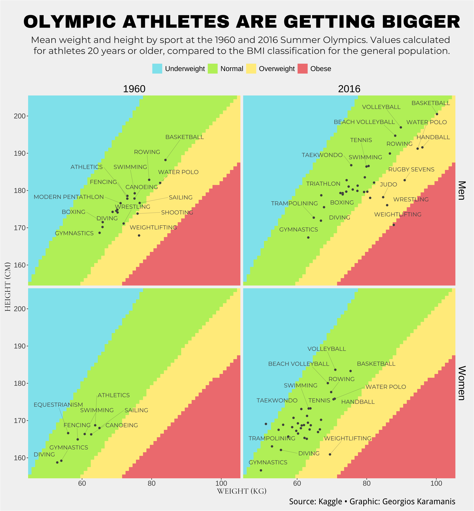
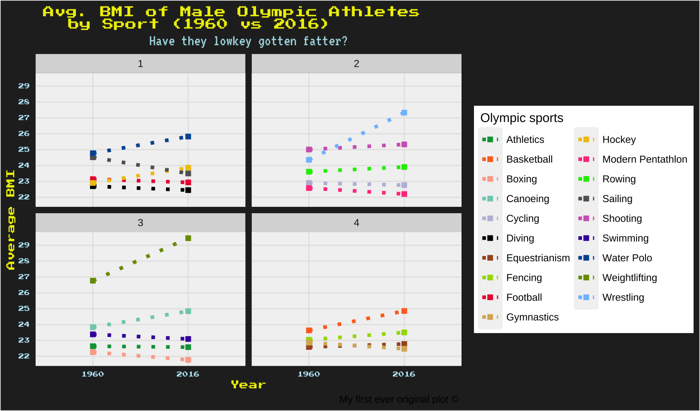

## Original Chart

The Olympic Games have long been a platform to showcase the pinnacle of human performance and athleticism. Over the years, the physical features of athletes competing in these prestigious events have transformed significantly. [This chart](https://www.visualcapitalist.com/cp/charted-olympic-athletes-getting-bigger/) from Visual Capitalist displays the evolution of Olympic athletes' sizes, illustrating trends in height and weight across sports and genders. It utilises BMI categories to place various sports to capture changes over time.

There are several reasons as to why I picked this plot. At first sight, it attracts attention with its coloured tiles, and it looks well-organised with the facets and labeled data points. Getting above such features with a brand new design seemed challenging - and I liked the idea.

Second, after careful exploration, I noticed that there was something wrong with the representation of sports: some sports were not present in the 1960 Summer Olympic games, however they were displayed it the facets that demonstrate 2016 games, which was precisely the moment that gave me the idea that this work was in fact not perfect. 

To not spoil all the fun by revealing the ideas, let's proceed to data cleaning and adjusting section.


{width="100%"}
**Olympic graph. Source:** [Visual Capitalist](https://www.visualcapitalist.com/) 


## Packages and fonts

<div class="layout-chunk" data-layout="l-body">
<div class="sourceCode"><pre class="sourceCode r"><code class="sourceCode r"><span><span class='co'># For replication graph</span></span>
<span></span>
<span><span class='kw'><a href='https://rdrr.io/r/base/library.html'>library</a></span><span class='op'>(</span><span class='va'><a href='https://tidyverse.tidyverse.org'>tidyverse</a></span><span class='op'>)</span></span>
<span><span class='kw'><a href='https://rdrr.io/r/base/library.html'>library</a></span><span class='op'>(</span><span class='va'><a href='https://readr.tidyverse.org'>readr</a></span><span class='op'>)</span></span>
<span><span class='kw'><a href='https://rdrr.io/r/base/library.html'>library</a></span><span class='op'>(</span><span class='va'><a href='https://ggplot2.tidyverse.org'>ggplot2</a></span><span class='op'>)</span></span>
<span><span class='kw'><a href='https://rdrr.io/r/base/library.html'>library</a></span><span class='op'>(</span><span class='va'><a href='https://dplyr.tidyverse.org'>dplyr</a></span><span class='op'>)</span></span>
<span><span class='kw'><a href='https://rdrr.io/r/base/library.html'>library</a></span><span class='op'>(</span><span class='va'><a href='https://ggrepel.slowkow.com/'>ggrepel</a></span><span class='op'>)</span></span>
<span><span class='kw'><a href='https://rdrr.io/r/base/library.html'>library</a></span><span class='op'>(</span><span class='va'><a href='https://github.com/wch/extrafont'>extrafont</a></span><span class='op'>)</span></span>
<span><span class='kw'><a href='https://rdrr.io/r/base/library.html'>library</a></span><span class='op'>(</span><span class='va'><a href='https://github.com/yixuan/showtext'>showtext</a></span><span class='op'>)</span></span>
<span><span class='kw'><a href='https://rdrr.io/r/base/library.html'>library</a></span><span class='op'>(</span><span class='va'><a href='https://github.com/yixuan/sysfonts'>sysfonts</a></span><span class='op'>)</span></span>
<span></span>
<span><span class='co'># Extras - For alternative plot</span></span>
<span></span>
<span><span class='kw'><a href='https://rdrr.io/r/base/library.html'>library</a></span><span class='op'>(</span><span class='va'>grid</span><span class='op'>)</span></span>
<span><span class='kw'><a href='https://rdrr.io/r/base/library.html'>library</a></span><span class='op'>(</span><span class='va'><a href='https://wilkelab.org/ggtext/'>ggtext</a></span><span class='op'>)</span></span>
<span><span class='kw'><a href='https://rdrr.io/r/base/library.html'>library</a></span><span class='op'>(</span><span class='va'>gridExtra</span><span class='op'>)</span></span>
<span></span>
<span></span>
<span><span class='co'># Fonts for the replication plot </span></span>
<span></span>
<span><span class='fu'><a href='https://rdrr.io/pkg/sysfonts/man/font_add_google.html'>font_add_google</a></span><span class='op'>(</span><span class='st'>"Crimson Pro"</span>, <span class='st'>"crimson-pro"</span><span class='op'>)</span></span>
<span><span class='fu'><a href='https://rdrr.io/pkg/sysfonts/man/font_add_google.html'>font_add_google</a></span><span class='op'>(</span><span class='st'>"Outfit"</span>, <span class='st'>"outfit"</span><span class='op'>)</span></span>
<span><span class='fu'><a href='https://rdrr.io/pkg/sysfonts/man/font_add_google.html'>font_add_google</a></span><span class='op'>(</span><span class='st'>"Cormorant Garamond"</span>, <span class='st'>"cormorant-garamond"</span><span class='op'>)</span></span>
<span><span class='fu'><a href='https://rdrr.io/pkg/sysfonts/man/font_add_google.html'>font_add_google</a></span><span class='op'>(</span><span class='st'>"Montserrat"</span>, <span class='st'>"Montserrat"</span><span class='op'>)</span></span>
<span><span class='fu'><a href='https://rdrr.io/pkg/sysfonts/man/font_add_google.html'>font_add_google</a></span><span class='op'>(</span><span class='st'>"Archivo Black"</span>, <span class='st'>"ArchivoBlack"</span><span class='op'>)</span></span>
<span><span class='fu'><a href='https://rdrr.io/pkg/sysfonts/man/font_add_google.html'>font_add_google</a></span><span class='op'>(</span><span class='st'>"Piazzolla"</span>, <span class='st'>"PiazzollaExtraLight"</span><span class='op'>)</span></span>
<span></span>
<span><span class='co'># Fonts for the improved plot</span></span>
<span></span>
<span><span class='fu'><a href='https://rdrr.io/pkg/sysfonts/man/font_add_google.html'>font_add_google</a></span><span class='op'>(</span><span class='st'>"Press Start 2P"</span>, <span class='st'>"press-start"</span><span class='op'>)</span></span>
<span><span class='fu'><a href='https://rdrr.io/pkg/sysfonts/man/font_add_google.html'>font_add_google</a></span><span class='op'>(</span><span class='st'>"VT323"</span>, <span class='st'>"vt323"</span><span class='op'>)</span> </span>
<span><span class='fu'><a href='https://rdrr.io/pkg/sysfonts/man/font_add_google.html'>font_add_google</a></span><span class='op'>(</span><span class='st'>"DotGothic16"</span>, <span class='st'>"dotgothic16"</span><span class='op'>)</span></span>
<span></span>
<span><span class='fu'><a href='https://rdrr.io/pkg/showtext/man/showtext_auto.html'>showtext_auto</a></span><span class='op'>(</span><span class='op'>)</span></span></code></pre></div>

</div>


The data set displays personal records of Olympic athletes.

The original plot focuses on athletes who are at least 20 years old and competed in 1960 and 2016 Summer Olympic games. Taking into account their height and weight values, it then calculates BMI values of athletes and categorise them.

In so doing, it creates four different facets and coloured tiles in each one of them. Obviously, each colour tile represents a BMI category.

The four facets are designed to represent 1960 and 2016 Summer Olympic games, and male and female athletes.

## Replication 

### Working with the data

Reading the dataset

<div class="layout-chunk" data-layout="l-body">
<div class="sourceCode"><pre class="sourceCode r"><code class="sourceCode r"><span><span class='va'>data_main</span> <span class='op'>&lt;-</span> <span class='fu'><a href='https://readr.tidyverse.org/reference/read_delim.html'>read_csv</a></span><span class='op'>(</span><span class='st'>"athlete_events.csv"</span><span class='op'>)</span></span></code></pre></div>

</div>


As we will only need the sports branches, Olympic game's year information and the name, gender, and the BMI values of the athletes, I get rid of everything else.

<div class="layout-chunk" data-layout="l-body">
<div class="sourceCode"><pre class="sourceCode r"><code class="sourceCode r"><span><span class='va'>olympics_tidy</span> <span class='op'>&lt;-</span> <span class='va'>data_main</span> <span class='op'>|&gt;</span> </span>
<span>  <span class='fu'><a href='https://dplyr.tidyverse.org/reference/filter.html'>filter</a></span><span class='op'>(</span><span class='va'>Age</span> <span class='op'>&gt;=</span> <span class='fl'>20</span>, <span class='va'>Year</span> <span class='op'><a href='https://rdrr.io/r/base/match.html'>%in%</a></span> <span class='fu'><a href='https://rdrr.io/r/base/c.html'>c</a></span><span class='op'>(</span><span class='fl'>2016</span>, <span class='fl'>1960</span><span class='op'>)</span>, <span class='va'>Season</span> <span class='op'>==</span> <span class='st'>"Summer"</span><span class='op'>)</span> <span class='op'>|&gt;</span> </span>
<span>  <span class='fu'><a href='https://dplyr.tidyverse.org/reference/select.html'>select</a></span><span class='op'>(</span><span class='op'>-</span><span class='fu'><a href='https://rdrr.io/r/base/c.html'>c</a></span><span class='op'>(</span><span class='va'>Team</span>, <span class='va'>Games</span>, <span class='va'>NOC</span>, <span class='va'>City</span>, <span class='va'>Event</span>, <span class='va'>Medal</span><span class='op'>)</span><span class='op'>)</span> <span class='op'>|&gt;</span> </span>
<span>  <span class='fu'><a href='https://dplyr.tidyverse.org/reference/distinct.html'>distinct</a></span><span class='op'>(</span><span class='va'>Name</span>, .keep_all <span class='op'>=</span> <span class='cn'>TRUE</span><span class='op'>)</span></span></code></pre></div>

</div>


Some athletes have no height or weight (or either) info. This is just to have an idea of what's going on.

<div class="layout-chunk" data-layout="l-body">
<div class="sourceCode"><pre class="sourceCode r"><code class="sourceCode r"><span><span class='va'>missing_values</span> <span class='op'>&lt;-</span> <span class='va'>olympics_tidy</span> <span class='op'>|&gt;</span> </span>
<span>  <span class='fu'><a href='https://dplyr.tidyverse.org/reference/summarise.html'>summarize</a></span><span class='op'>(</span></span>
<span>    missing_height <span class='op'>=</span> <span class='fu'><a href='https://rdrr.io/r/base/sum.html'>sum</a></span><span class='op'>(</span><span class='fu'><a href='https://rdrr.io/r/base/NA.html'>is.na</a></span><span class='op'>(</span><span class='va'>Height</span><span class='op'>)</span><span class='op'>)</span>,</span>
<span>    missing_weight <span class='op'>=</span> <span class='fu'><a href='https://rdrr.io/r/base/sum.html'>sum</a></span><span class='op'>(</span><span class='fu'><a href='https://rdrr.io/r/base/NA.html'>is.na</a></span><span class='op'>(</span><span class='va'>Weight</span><span class='op'>)</span><span class='op'>)</span></span>
<span>  <span class='op'>)</span></span>
<span></span>
<span><span class='va'>missing_values</span></span></code></pre></div>

```
# A tibble: 1 × 2
  missing_height missing_weight
           <int>          <int>
1            255            326
```

</div>


I want to create a BMI variable for future use, as BMIs will be the main concern of this study.


<div class="layout-chunk" data-layout="l-body">
<div class="sourceCode"><pre class="sourceCode r"><code class="sourceCode r"><span><span class='va'>olympics_tidy</span> <span class='op'>&lt;-</span></span>
<span>  <span class='va'>olympics_tidy</span> <span class='op'>|&gt;</span> </span>
<span>  <span class='fu'><a href='https://dplyr.tidyverse.org/reference/mutate.html'>mutate</a></span><span class='op'>(</span>BMI <span class='op'>=</span> <span class='va'>Weight</span> <span class='op'>/</span> <span class='op'>(</span><span class='va'>Height</span> <span class='op'>/</span> <span class='fl'>100</span><span class='op'>)</span><span class='op'>^</span><span class='fl'>2</span><span class='op'>)</span></span></code></pre></div>

</div>


Now let's acquire the means for height, weight, and BMI values for different branches, across genders and for the two Olympic games.

<div class="layout-chunk" data-layout="l-body">
<div class="sourceCode"><pre class="sourceCode r"><code class="sourceCode r"><span><span class='va'>olympics_tidy</span> <span class='op'>&lt;-</span> <span class='va'>olympics_tidy</span> <span class='op'>|&gt;</span> </span>
<span>  <span class='fu'><a href='https://dplyr.tidyverse.org/reference/summarise.html'>summarise</a></span><span class='op'>(</span></span>
<span>    height_mean <span class='op'>=</span> <span class='fu'><a href='https://rdrr.io/r/base/mean.html'>mean</a></span><span class='op'>(</span><span class='va'>Height</span>, na.rm <span class='op'>=</span> <span class='cn'>TRUE</span><span class='op'>)</span>, </span>
<span>    weight_mean <span class='op'>=</span> <span class='fu'><a href='https://rdrr.io/r/base/mean.html'>mean</a></span><span class='op'>(</span><span class='va'>Weight</span>, na.rm <span class='op'>=</span> <span class='cn'>TRUE</span><span class='op'>)</span>,</span>
<span>    BMI_mean <span class='op'>=</span> <span class='fu'><a href='https://rdrr.io/r/base/mean.html'>mean</a></span><span class='op'>(</span><span class='va'>BMI</span>, na.rm <span class='op'>=</span> <span class='cn'>TRUE</span><span class='op'>)</span>,</span>
<span>    .by <span class='op'>=</span> <span class='fu'><a href='https://rdrr.io/r/base/c.html'>c</a></span><span class='op'>(</span><span class='st'>"Sport"</span>, <span class='st'>"Sex"</span>, <span class='st'>"Year"</span><span class='op'>)</span><span class='op'>)</span></span></code></pre></div>

</div>


Recoding 'Sex' for better readability. 


<div class="layout-chunk" data-layout="l-body">
<div class="sourceCode"><pre class="sourceCode r"><code class="sourceCode r"><span><span class='va'>olympics_tidy</span> <span class='op'>&lt;-</span> <span class='va'>olympics_tidy</span> <span class='op'>|&gt;</span> </span>
<span>  <span class='fu'><a href='https://dplyr.tidyverse.org/reference/mutate.html'>mutate</a></span><span class='op'>(</span>Sex <span class='op'>=</span> <span class='fu'><a href='https://dplyr.tidyverse.org/reference/recode.html'>recode</a></span><span class='op'>(</span><span class='va'>Sex</span>, `M` <span class='op'>=</span> <span class='st'>"Men"</span>, `F` <span class='op'>=</span> <span class='st'>"Women"</span><span class='op'>)</span><span class='op'>)</span></span></code></pre></div>

</div>


Although the values range from 30 to 170 for weight and from 143 to 218 for height, the graph seems to omit some observations and use different ranges. 

After a careful and (highly) manual measurement, I decided that for weight the range would be from 45 to 105, and for height it would be 155 and 205.

This can be observed in the original graph.

Since I'll be viusalising 'Gender' and changes in 'Height', 'Weight', I will be using facets.
Let's organise the data taking into account the new value ranges indicated above, and then proceed to labeling BMI ranges.

To do that, I first reframe my data set indicating new ranges for Height and Weight values.

Following this, I create a new variable named 'BMI Label', which will store BMI categories and their values. Then, this variable will help create tiles for each BMI category.

Using 'ordered = TRUE', I ensure the logical order between 'Underweight', 'Normal', 'Overweight', and 'Obese' categories.

<div class="layout-chunk" data-layout="l-body">
<div class="sourceCode"><pre class="sourceCode r"><code class="sourceCode r"><span><span class='va'>olympics_reframed</span> <span class='op'>&lt;-</span> <span class='fu'><a href='https://tidyr.tidyverse.org/reference/expand.html'>crossing</a></span><span class='op'>(</span></span>
<span>  Height <span class='op'>=</span> <span class='fl'>155</span><span class='op'>:</span><span class='fl'>205</span>,</span>
<span>  Weight <span class='op'>=</span> <span class='fl'>45</span><span class='op'>:</span><span class='fl'>105</span>,</span>
<span>  Sex <span class='op'>=</span> <span class='fu'><a href='https://rdrr.io/r/base/c.html'>c</a></span><span class='op'>(</span><span class='st'>"Men"</span>, <span class='st'>"Women"</span><span class='op'>)</span>,</span>
<span>  Year <span class='op'>=</span> <span class='fu'><a href='https://rdrr.io/r/base/c.html'>c</a></span><span class='op'>(</span><span class='fl'>1960</span>, <span class='fl'>2016</span><span class='op'>)</span></span>
<span><span class='op'>)</span> <span class='op'>|&gt;</span> </span>
<span>  <span class='fu'><a href='https://dplyr.tidyverse.org/reference/mutate.html'>mutate</a></span><span class='op'>(</span></span>
<span>    BMI <span class='op'>=</span> <span class='va'>Weight</span> <span class='op'>/</span> <span class='op'>(</span><span class='va'>Height</span> <span class='op'>/</span> <span class='fl'>100</span><span class='op'>)</span><span class='op'>^</span><span class='fl'>2</span>,</span>
<span>    `BMI Label` <span class='op'>=</span> <span class='fu'><a href='https://rdrr.io/r/base/factor.html'>factor</a></span><span class='op'>(</span><span class='fu'><a href='https://dplyr.tidyverse.org/reference/case_when.html'>case_when</a></span><span class='op'>(</span></span>
<span>      <span class='va'>BMI</span> <span class='op'>&lt;=</span> <span class='fl'>18.5</span> <span class='op'>~</span> <span class='st'>"Underweight"</span>,    </span>
<span>      <span class='va'>BMI</span> <span class='op'>&gt;</span> <span class='fl'>18.5</span> <span class='op'>&amp;</span> <span class='va'>BMI</span> <span class='op'>&lt;=</span> <span class='fl'>24.9</span> <span class='op'>~</span> <span class='st'>"Normal"</span>,  </span>
<span>      <span class='va'>BMI</span> <span class='op'>&gt;</span> <span class='fl'>24.9</span> <span class='op'>&amp;</span> <span class='va'>BMI</span> <span class='op'>&lt;=</span> <span class='fl'>29.9</span> <span class='op'>~</span> <span class='st'>"Overweight"</span>, </span>
<span>      <span class='va'>BMI</span> <span class='op'>&gt;</span> <span class='fl'>29.9</span> <span class='op'>~</span> <span class='st'>"Obese"</span></span>
<span>    <span class='op'>)</span>, </span>
<span>    levels <span class='op'>=</span> <span class='fu'><a href='https://rdrr.io/r/base/c.html'>c</a></span><span class='op'>(</span><span class='st'>"Underweight"</span>, <span class='st'>"Normal"</span>, <span class='st'>"Overweight"</span>, <span class='st'>"Obese"</span><span class='op'>)</span>, </span>
<span>    ordered <span class='op'>=</span> <span class='cn'>TRUE</span><span class='op'>)</span></span>
<span>  <span class='op'>)</span></span></code></pre></div>

</div>


### Plotting

Let's begin with stating x any y axes. I will use 'weight_mean' and 'height_mean' from 'olympics_tidy' data set. 

Next, 'geom_tile' will enable me to create tiles based on BMI categories that I have indicated in 'BMI Label' column in 'olympics_reframed'. 

I have used a separate data set called 'olympics_reframed' for my own ease. All these information could probably work out together in a single data set. 

The filling of the tiles will be automatic. I will be changing it in the next step.

<div class="layout-chunk" data-layout="l-body">
<div class="sourceCode"><pre class="sourceCode r"><code class="sourceCode r"><span><span class='va'>final_graph</span> <span class='op'>&lt;-</span> <span class='fu'><a href='https://ggplot2.tidyverse.org/reference/ggplot.html'>ggplot</a></span><span class='op'>(</span><span class='va'>olympics_tidy</span><span class='op'>)</span> <span class='op'>+</span></span>
<span>  <span class='fu'><a href='https://ggplot2.tidyverse.org/reference/aes.html'>aes</a></span><span class='op'>(</span><span class='va'>weight_mean</span>, <span class='va'>height_mean</span><span class='op'>)</span> <span class='op'>+</span></span>
<span>  <span class='fu'><a href='https://ggplot2.tidyverse.org/reference/geom_tile.html'>geom_tile</a></span><span class='op'>(</span>data <span class='op'>=</span> <span class='va'>olympics_reframed</span>, <span class='fu'><a href='https://ggplot2.tidyverse.org/reference/aes.html'>aes</a></span><span class='op'>(</span>x <span class='op'>=</span> <span class='va'>Weight</span>, y <span class='op'>=</span> <span class='va'>Height</span>, fill <span class='op'>=</span> <span class='va'>`BMI Label`</span><span class='op'>)</span><span class='op'>)</span></span>
<span></span>
<span><span class='va'>final_graph</span></span></code></pre></div>


</div>


Here, I enhance the appearance of my existing graph by customizing the fill colours for different BMI categories. I use scale_fill_manual() to manually set specific colours for each category, such as "Underweight," "Normal," "Overweight," and "Obese," assigning colours as close as possible to the original plot.

I also adjust the legend with setting 'guides()' to NULL in order to remove the title.

<div class="layout-chunk" data-layout="l-body">
<div class="sourceCode"><pre class="sourceCode r"><code class="sourceCode r"><span><span class='va'>final_graph</span> <span class='op'>&lt;-</span></span>
<span>  <span class='va'>final_graph</span> <span class='op'>+</span></span>
<span>  <span class='fu'><a href='https://ggplot2.tidyverse.org/reference/scale_manual.html'>scale_fill_manual</a></span><span class='op'>(</span>values <span class='op'>=</span> <span class='fu'><a href='https://rdrr.io/r/base/c.html'>c</a></span><span class='op'>(</span></span>
<span>    <span class='st'>"Underweight"</span> <span class='op'>=</span> <span class='st'>"cadetblue2"</span>,</span>
<span>    <span class='st'>"Normal"</span> <span class='op'>=</span> <span class='st'>"darkolivegreen2"</span>,</span>
<span>    <span class='st'>"Overweight"</span> <span class='op'>=</span> <span class='st'>"lightgoldenrod1"</span>,</span>
<span>    <span class='st'>"Obese"</span> <span class='op'>=</span> <span class='st'>"lightcoral"</span><span class='op'>)</span><span class='op'>)</span> <span class='op'>+</span></span>
<span>  <span class='fu'><a href='https://ggplot2.tidyverse.org/reference/guides.html'>guides</a></span><span class='op'>(</span>fill <span class='op'>=</span> <span class='fu'><a href='https://ggplot2.tidyverse.org/reference/guide_legend.html'>guide_legend</a></span><span class='op'>(</span>title <span class='op'>=</span> <span class='cn'>NULL</span><span class='op'>)</span><span class='op'>)</span></span>
<span></span>
<span><span class='va'>final_graph</span></span></code></pre></div>


</div>


It's time to set the title and subtitle for of the plot and add axes titles. Lastly, I add the caption at the bottom right of the original plot indicating the source of data.

<div class="layout-chunk" data-layout="l-body">
<div class="sourceCode"><pre class="sourceCode r"><code class="sourceCode r"><span><span class='va'>final_graph</span> <span class='op'>&lt;-</span></span>
<span>  <span class='va'>final_graph</span> <span class='op'>+</span></span>
<span>  <span class='fu'><a href='https://ggplot2.tidyverse.org/reference/labs.html'>labs</a></span><span class='op'>(</span></span>
<span>    x <span class='op'>=</span> <span class='st'>"WEIGHT (KG)"</span>,</span>
<span>    y <span class='op'>=</span> <span class='st'>"HEIGHT (CM)"</span>,</span>
<span>    title <span class='op'>=</span> <span class='st'>"OLYMPIC ATHLETES ARE GETTING BIGGER"</span>,</span>
<span>    subtitle <span class='op'>=</span> <span class='st'>"Mean weight and height by sport at the 1960 and 2016 Summer Olympics. Values calculated \nfor athletes 20 years or older, compared to the BMI classification for the general population."</span>,</span>
<span>    caption <span class='op'>=</span> <span class='st'>"Source: Kaggle • Graphic: Georgios Karamanis"</span></span>
<span>  <span class='op'>)</span> </span>
<span><span class='va'>final_graph</span></span></code></pre></div>


</div>


No party without our good old friends: data points! Using geom_point, I invite them to the party.

<div class="layout-chunk" data-layout="l-body">
<div class="sourceCode"><pre class="sourceCode r"><code class="sourceCode r"><span><span class='va'>final_graph</span> <span class='op'>&lt;-</span></span>
<span>  <span class='va'>final_graph</span> <span class='op'>+</span></span>
<span>  <span class='fu'><a href='https://ggplot2.tidyverse.org/reference/geom_point.html'>geom_point</a></span><span class='op'>(</span><span class='op'>)</span></span>
<span></span>
<span><span class='va'>final_graph</span></span></code></pre></div>


</div>


Since I will be comparing 1960 and 2016 Summer Olympics while displaying BMI values based on gender, I will need 4 different facets. 

The 'Sex' variable has two values (Men and Women), and the 'Year' variable only has 1960 and 2016. Therefore, four facets. 

Lastly, I tell R to not add extra space to x and y axes using coord_cartesian(expand = FALSE).

<div class="layout-chunk" data-layout="l-body">
<div class="sourceCode"><pre class="sourceCode r"><code class="sourceCode r"><span><span class='va'>final_graph</span> <span class='op'>&lt;-</span></span>
<span>  <span class='va'>final_graph</span> <span class='op'>+</span></span>
<span>  <span class='fu'><a href='https://ggplot2.tidyverse.org/reference/facet_grid.html'>facet_grid</a></span><span class='op'>(</span><span class='va'>Sex</span> <span class='op'>~</span> <span class='va'>Year</span><span class='op'>)</span> <span class='op'>+</span></span>
<span>  <span class='fu'><a href='https://ggplot2.tidyverse.org/reference/coord_cartesian.html'>coord_cartesian</a></span><span class='op'>(</span>expand <span class='op'>=</span> <span class='cn'>FALSE</span><span class='op'>)</span> </span>
<span></span>
<span><span class='va'>final_graph</span></span></code></pre></div>


</div>


In the original plot, the legend is located at the top, right below the subtitle. First I relocate it on the top and ensure that it is centered. Then, I place it in a horizontal way. Lastly, I ensure that the legend key sizes somewhat match to that of original plot.

<div class="layout-chunk" data-layout="l-body">
<div class="sourceCode"><pre class="sourceCode r"><code class="sourceCode r"><span><span class='va'>final_graph</span> <span class='op'>&lt;-</span></span>
<span>  <span class='va'>final_graph</span> <span class='op'>+</span></span>
<span>  <span class='fu'><a href='https://ggplot2.tidyverse.org/reference/theme.html'>theme</a></span><span class='op'>(</span></span>
<span>    legend.position <span class='op'>=</span> <span class='st'>"top"</span>,           </span>
<span>    legend.justification <span class='op'>=</span> <span class='st'>"center"</span>,     </span>
<span>    legend.direction <span class='op'>=</span> <span class='st'>"horizontal"</span>,</span>
<span>    legend.key.size <span class='op'>=</span> <span class='fu'><a href='https://rdrr.io/r/grid/unit.html'>unit</a></span><span class='op'>(</span><span class='fl'>0.7</span>, <span class='st'>"cm"</span><span class='op'>)</span></span>
<span>    <span class='op'>)</span></span>
<span></span>
<span><span class='va'>final_graph</span></span></code></pre></div>


</div>

Using strip.text, I ensure the colour for texts in the strips and match their size to the original plot.

Using plot.title and plot.subtitle, I set sizes, alignments, and margins of the title and subtitle. For the title, I use 'ArchivoBlack', and for the subtitle, I use 'Montserrat' (both from Google fonts). 

After setting the margins of the plot and the caption that is at the bottom right, I move to indicating sizes for the legend, x and y axes (for both axis texts and axis titles). 

For axis titles, I use 'cormorant-garamond' from Google fonts.

Lastly, I change the background colour for facet strips and set the colour for outer borders to = NA. This way, it will look as if I have no borders for the strips.


<div class="layout-chunk" data-layout="l-body">
<div class="sourceCode"><pre class="sourceCode r"><code class="sourceCode r"><span><span class='va'>final_graph</span> <span class='op'>&lt;-</span></span>
<span>  <span class='va'>final_graph</span> <span class='op'>+</span></span>
<span>  <span class='fu'><a href='https://ggplot2.tidyverse.org/reference/theme.html'>theme</a></span><span class='op'>(</span></span>
<span>    strip.text <span class='op'>=</span> <span class='fu'><a href='https://ggplot2.tidyverse.org/reference/element.html'>element_text</a></span><span class='op'>(</span>color <span class='op'>=</span> <span class='st'>"black"</span>, size <span class='op'>=</span> <span class='fl'>20</span><span class='op'>)</span>,</span>
<span>    plot.title <span class='op'>=</span> <span class='fu'><a href='https://ggplot2.tidyverse.org/reference/element.html'>element_text</a></span><span class='op'>(</span>size <span class='op'>=</span> <span class='fl'>36</span>, hjust <span class='op'>=</span> <span class='fl'>0.5</span>, family <span class='op'>=</span> <span class='st'>"ArchivoBlack"</span>,</span>
<span>                              margin <span class='op'>=</span> <span class='fu'><a href='https://ggplot2.tidyverse.org/reference/element.html'>margin</a></span><span class='op'>(</span>t <span class='op'>=</span> <span class='fl'>10</span>, b <span class='op'>=</span> <span class='fl'>5</span>, l <span class='op'>=</span> <span class='fl'>15</span>, r <span class='op'>=</span> <span class='fl'>15</span><span class='op'>)</span><span class='op'>)</span>,</span>
<span>    plot.subtitle <span class='op'>=</span> <span class='fu'><a href='https://ggplot2.tidyverse.org/reference/element.html'>element_text</a></span><span class='op'>(</span>size <span class='op'>=</span> <span class='fl'>18</span>, hjust <span class='op'>=</span> <span class='fl'>0.5</span>, family <span class='op'>=</span> <span class='st'>"Montserrat"</span>,</span>
<span>                                 face <span class='op'>=</span> <span class='st'>"plain"</span>, lineheight <span class='op'>=</span> <span class='fl'>1</span>, margin <span class='op'>=</span> <span class='fu'><a href='https://ggplot2.tidyverse.org/reference/element.html'>margin</a></span><span class='op'>(</span>t <span class='op'>=</span> <span class='fl'>5</span>, b <span class='op'>=</span> <span class='fl'>10</span>, l <span class='op'>=</span> <span class='fl'>15</span>, r <span class='op'>=</span> <span class='fl'>15</span><span class='op'>)</span>, color <span class='op'>=</span> <span class='st'>"grey15"</span><span class='op'>)</span>,</span>
<span>    plot.margin <span class='op'>=</span> <span class='fu'><a href='https://ggplot2.tidyverse.org/reference/element.html'>margin</a></span><span class='op'>(</span><span class='fl'>20</span>, <span class='fl'>10</span>, <span class='fl'>10</span>, <span class='fl'>10</span><span class='op'>)</span>,</span>
<span>    plot.caption <span class='op'>=</span> <span class='fu'><a href='https://ggplot2.tidyverse.org/reference/element.html'>element_text</a></span><span class='op'>(</span>size <span class='op'>=</span> <span class='fl'>16</span>, hjust <span class='op'>=</span> <span class='fl'>1</span>, lineheight <span class='op'>=</span> <span class='fl'>1.2</span><span class='op'>)</span>,</span>
<span>    legend.text <span class='op'>=</span> <span class='fu'><a href='https://ggplot2.tidyverse.org/reference/element.html'>element_text</a></span><span class='op'>(</span>size <span class='op'>=</span> <span class='fl'>14</span><span class='op'>)</span>,  </span>
<span>    axis.text.x <span class='op'>=</span> <span class='fu'><a href='https://ggplot2.tidyverse.org/reference/element.html'>element_text</a></span><span class='op'>(</span>size <span class='op'>=</span> <span class='fl'>14</span><span class='op'>)</span>,  </span>
<span>    axis.text.y <span class='op'>=</span> <span class='fu'><a href='https://ggplot2.tidyverse.org/reference/element.html'>element_text</a></span><span class='op'>(</span>size <span class='op'>=</span> <span class='fl'>14</span><span class='op'>)</span>,</span>
<span>    axis.title.x <span class='op'>=</span> <span class='fu'><a href='https://ggplot2.tidyverse.org/reference/element.html'>element_text</a></span><span class='op'>(</span>size <span class='op'>=</span> <span class='fl'>16</span>, family <span class='op'>=</span> <span class='st'>"cormorant-garamond"</span><span class='op'>)</span>,</span>
<span>    axis.title.y <span class='op'>=</span> <span class='fu'><a href='https://ggplot2.tidyverse.org/reference/element.html'>element_text</a></span><span class='op'>(</span>size <span class='op'>=</span> <span class='fl'>16</span>, family <span class='op'>=</span> <span class='st'>"cormorant-garamond"</span><span class='op'>)</span>,</span>
<span>    strip.background <span class='op'>=</span> <span class='fu'><a href='https://ggplot2.tidyverse.org/reference/element.html'>element_rect</a></span><span class='op'>(</span>fill <span class='op'>=</span> <span class='st'>"gray95"</span>, color <span class='op'>=</span> <span class='cn'>NA</span><span class='op'>)</span>,</span>
<span>    plot.background <span class='op'>=</span> <span class='fu'><a href='https://ggplot2.tidyverse.org/reference/element.html'>element_rect</a></span><span class='op'>(</span>fill <span class='op'>=</span> <span class='st'>"gray95"</span><span class='op'>)</span>,</span>
<span>    legend.background <span class='op'>=</span> <span class='fu'><a href='https://ggplot2.tidyverse.org/reference/element.html'>element_rect</a></span><span class='op'>(</span>fill <span class='op'>=</span> <span class='st'>"gray95"</span><span class='op'>)</span></span>
<span><span class='op'>)</span></span>
<span></span>
<span></span>
<span></span>
<span></span>
<span><span class='va'>final_graph</span></span></code></pre></div>


</div>


The only thing that is missing right now (pretty much) is labeling data points. 

To make it look a bit more like the original plot, I begin with changing the colour, size, and the transparency level of my data points. (see geom_point(...)).

Thanks to geom_text_repel, I will be able to put labels to the data points. Since each data point represents an Olympic sport, these texts will be name of Olympic sports.

Firstly, I ensure all sports names are in capital letters, using 'label = toupper(Spor)'.

Next, I set the font of data labels to 'Montserrat' and set their size to 4.

To have a clean and readable plot, I had to ensure that text labels do not overlap. Using 'nudge_x' and 'nudge_y', I slightly moved text labels horizontally and vertically. 'box.padding', on the other hand, adds padding around each label’s box to create more space between the text and other elements, so it helps the cause dearly. Lastly, using 'max.overlaps', I ensured to limit the maximum number of overlapping labels to be shown; so that excess overlaps are suppressed. 

'min.segment.length' helps me to somewhat restrict as to which connecting lines will be displayed, so I set it to 1.2 and disable the ones that would be longer than that value. With 'segment.size', I make those connecting lines extremely thin and through 'segment.color', their colour is indicated as 'grey30'.

I use the same colour for my text labels using "color = 'grey30'". Lastly, I hide a possible legend for the data labels through 'show.legend = FALSE'.

<div class="layout-chunk" data-layout="l-body">
<div class="sourceCode"><pre class="sourceCode r"><code class="sourceCode r"><span><span class='va'>final_graph</span> <span class='op'>&lt;-</span></span>
<span>  <span class='va'>final_graph</span> <span class='op'>+</span></span>
<span>  <span class='fu'><a href='https://ggplot2.tidyverse.org/reference/geom_point.html'>geom_point</a></span><span class='op'>(</span>color <span class='op'>=</span> <span class='st'>"gray40"</span>, size <span class='op'>=</span> <span class='fl'>1.5</span>, alpha <span class='op'>=</span> <span class='fl'>0.7</span><span class='op'>)</span> <span class='op'>+</span></span>
<span>  <span class='fu'><a href='https://ggrepel.slowkow.com/reference/geom_text_repel.html'>geom_text_repel</a></span><span class='op'>(</span><span class='fu'><a href='https://ggplot2.tidyverse.org/reference/aes.html'>aes</a></span><span class='op'>(</span>label <span class='op'>=</span> <span class='fu'><a href='https://rdrr.io/r/base/chartr.html'>toupper</a></span><span class='op'>(</span><span class='va'>Sport</span><span class='op'>)</span><span class='op'>)</span>,</span>
<span>                  family <span class='op'>=</span> <span class='st'>"Montserrat"</span>,  </span>
<span>                  size <span class='op'>=</span> <span class='fl'>4</span>,              </span>
<span>                  nudge_y <span class='op'>=</span> <span class='fl'>3</span>,          </span>
<span>                  nudge_x <span class='op'>=</span> <span class='fl'>1.5</span>,          </span>
<span>                  box.padding <span class='op'>=</span> <span class='fl'>0.75</span>,    </span>
<span>                  max.overlaps <span class='op'>=</span> <span class='fl'>15</span>, </span>
<span>                  min.segment.length <span class='op'>=</span> <span class='fl'>1.2</span>,</span>
<span>                  segment.size <span class='op'>=</span> <span class='fl'>0.1</span>,</span>
<span>                  segment.color <span class='op'>=</span> <span class='st'>"grey30"</span>,</span>
<span>                  color <span class='op'>=</span> <span class='st'>"grey30"</span>,</span>
<span>                  show.legend <span class='op'>=</span> <span class='cn'>FALSE</span><span class='op'>)</span>  </span>
<span></span>
<span><span class='va'>final_graph</span></span></code></pre></div>


</div>


### Downsides of the original plot

The initial plot displays some Olympic events that did not exist in 1960 but took place in the 2016 Olympic Games (e.g., Tennis). I don't need to show them as they do not contribute to the study and add noise to the data, particularly in women’s sports. This is due to the fact that women's sports were not as diverse in 1960 as they were in 2016.

There are extremely few or no 'Underweight' and 'Obese' athletes in the initial study. Using tiles for nonexistent categories seems redundant.

Another issue with the plot is that the data point trends are not easy to follow. For any sport, it is quite difficult to determine whether it has experienced an increase or decrease over time.

## Alternative Plot

### Possible improvements

1. As the original plot's biggest weakness is the difficulty in tracking individual sports' trends over time, I try to address this issue by using a slope chart as my alternative plot. A slope chart is useful when comparing trends over time, using two data points for each observation and a line that connects those two data points. 

2. Most sports branches have somewhat similar BMI values, which eventually leads to a plot that has many overlappings. A slope chart is likely to reduce those overlappings while still emphasising trends.

3. I can change the title, coming up with a more striking one. Also I can use a fancy font. The font and colouring has actually been my favourite part for this study.

4. Who does not love 8-bit stuff? Well, not me. The inspiration of my alternative plot will be 8-bit aesthetics. I had to do it, because for my whole childhood I played 'Track & Field'!

### Challenges

The closely clustered nature of the data points and the lack of direct connections between 1960 and 2016 data for each sport make trend analysis challenging. I will try to address these issues in my slope chart, but highly close numbers of BMI values pose threats to clarity of my plot.

In my first attempt, I completely excluded women's sports that were present in both Olympic games (which amounted to 6 branches in total). 

In the second attempt, I'll omit some of the men's sports branches and include women's sports into my plot. But for now, let's move onto the first one.

### Working with the data

Let's first read the data and start with the improvement.

<div class="layout-chunk" data-layout="l-body">
<div class="sourceCode"><pre class="sourceCode r"><code class="sourceCode r"><span><span class='va'>athletes</span> <span class='op'>&lt;-</span> <span class='fu'><a href='https://readr.tidyverse.org/reference/read_delim.html'>read_csv</a></span><span class='op'>(</span><span class='st'>"athlete_events.csv"</span><span class='op'>)</span></span></code></pre></div>

</div>


As the original study suggests, I filter 1960 and 2016 Summer Olympic Games, and athletes that were at least 20 years old.
Then I move onto  create a BMI variable for the athletes in my dataset. 

<div class="layout-chunk" data-layout="l-body">
<div class="sourceCode"><pre class="sourceCode r"><code class="sourceCode r"><span><span class='va'>athletes</span> <span class='op'>&lt;-</span> <span class='va'>athletes</span> <span class='op'>|&gt;</span> </span>
<span>  <span class='fu'><a href='https://dplyr.tidyverse.org/reference/filter.html'>filter</a></span><span class='op'>(</span><span class='va'>Year</span> <span class='op'><a href='https://rdrr.io/r/base/match.html'>%in%</a></span> <span class='fu'><a href='https://rdrr.io/r/base/c.html'>c</a></span><span class='op'>(</span><span class='fl'>1960</span>, <span class='fl'>2016</span><span class='op'>)</span>, <span class='va'>Season</span> <span class='op'>==</span> <span class='st'>"Summer"</span>, <span class='va'>Age</span> <span class='op'>&gt;=</span> <span class='fl'>20</span><span class='op'>)</span> <span class='op'>|&gt;</span> </span>
<span>  <span class='fu'><a href='https://dplyr.tidyverse.org/reference/mutate.html'>mutate</a></span><span class='op'>(</span>BMI <span class='op'>=</span> <span class='va'>Weight</span> <span class='op'>/</span> <span class='op'>(</span><span class='va'>Height</span> <span class='op'>/</span> <span class='fl'>100</span><span class='op'>)</span><span class='op'>^</span><span class='fl'>2</span><span class='op'>)</span></span></code></pre></div>

</div>


In this chunk of code, I create two subsets of my dataset that will display sports branches that male athletes competed in 1960 and 2016 Summer Olmypics.

Lastly, I want to see which sports are common in both Olympic games to prevent data noise in the future. Using 'pull', I acquire those sports for each year and then store their intersection in 'common_sports_men'.

<div class="layout-chunk" data-layout="l-body">
<div class="sourceCode"><pre class="sourceCode r"><code class="sourceCode r"><span><span class='va'>sports_1960_men</span> <span class='op'>&lt;-</span> <span class='va'>athletes</span> <span class='op'>|&gt;</span> </span>
<span>  <span class='fu'><a href='https://dplyr.tidyverse.org/reference/filter.html'>filter</a></span><span class='op'>(</span><span class='va'>Year</span> <span class='op'>==</span> <span class='fl'>1960</span>, <span class='va'>Sex</span> <span class='op'>==</span> <span class='st'>"M"</span><span class='op'>)</span> <span class='op'>|&gt;</span> </span>
<span>  <span class='fu'><a href='https://dplyr.tidyverse.org/reference/pull.html'>pull</a></span><span class='op'>(</span><span class='va'>Sport</span><span class='op'>)</span></span>
<span></span>
<span><span class='va'>sports_2016_men</span> <span class='op'>&lt;-</span> <span class='va'>athletes</span> <span class='op'>|&gt;</span> </span>
<span>  <span class='fu'><a href='https://dplyr.tidyverse.org/reference/filter.html'>filter</a></span><span class='op'>(</span><span class='va'>Year</span> <span class='op'>==</span> <span class='fl'>2016</span>, <span class='va'>Sex</span> <span class='op'>==</span> <span class='st'>"M"</span><span class='op'>)</span> <span class='op'>|&gt;</span> </span>
<span>  <span class='fu'><a href='https://dplyr.tidyverse.org/reference/pull.html'>pull</a></span><span class='op'>(</span><span class='va'>Sport</span><span class='op'>)</span></span>
<span></span>
<span></span>
<span><span class='va'>common_sports_men</span> <span class='op'>&lt;-</span> <span class='fu'><a href='https://generics.r-lib.org/reference/setops.html'>intersect</a></span><span class='op'>(</span><span class='va'>sports_1960_men</span>, <span class='va'>sports_2016_men</span><span class='op'>)</span></span></code></pre></div>

</div>


To create a subset of data with only male athletes that competed in intersecting sports, I filter my dataset. Then, for a tidy table, I drop unnecessary columns.

<div class="layout-chunk" data-layout="l-body">
<div class="sourceCode"><pre class="sourceCode r"><code class="sourceCode r"><span><span class='va'>filtered_male_athletes</span> <span class='op'>&lt;-</span> <span class='va'>athletes</span> <span class='op'>|&gt;</span> </span>
<span>  <span class='fu'><a href='https://dplyr.tidyverse.org/reference/filter.html'>filter</a></span><span class='op'>(</span><span class='va'>Sex</span> <span class='op'>==</span> <span class='st'>"M"</span> <span class='op'>&amp;</span> <span class='va'>Sport</span> <span class='op'><a href='https://rdrr.io/r/base/match.html'>%in%</a></span> <span class='va'>common_sports_men</span><span class='op'>)</span> <span class='op'>|&gt;</span> </span>
<span>  <span class='fu'><a href='https://dplyr.tidyverse.org/reference/select.html'>select</a></span><span class='op'>(</span><span class='op'>-</span><span class='va'>Name</span>, <span class='op'>-</span><span class='va'>Team</span>, <span class='op'>-</span><span class='va'>NOC</span>, <span class='op'>-</span><span class='va'>Games</span>, <span class='op'>-</span><span class='va'>City</span>, <span class='op'>-</span><span class='va'>Event</span>, <span class='op'>-</span><span class='va'>Medal</span><span class='op'>)</span></span></code></pre></div>

</div>


Now I am at the point where I need to create an average BMI value for each sports in my dataset. I group BMI values by 'Year' and 'Sports' as they will be displayed on the basis of competition year and event type.

Then I sort them in alphabetical order for my own use.

<div class="layout-chunk" data-layout="l-body">
<div class="sourceCode"><pre class="sourceCode r"><code class="sourceCode r"><span><span class='va'>avg_bmi_men</span> <span class='op'>&lt;-</span> <span class='va'>filtered_male_athletes</span> <span class='op'>|&gt;</span> </span>
<span>  <span class='fu'><a href='https://dplyr.tidyverse.org/reference/group_by.html'>group_by</a></span><span class='op'>(</span><span class='va'>Sport</span>, <span class='va'>Year</span><span class='op'>)</span> <span class='op'>|&gt;</span> </span>
<span>  <span class='fu'><a href='https://dplyr.tidyverse.org/reference/summarise.html'>summarize</a></span><span class='op'>(</span>Avg_BMI <span class='op'>=</span> <span class='fu'><a href='https://rdrr.io/r/base/mean.html'>mean</a></span><span class='op'>(</span><span class='va'>BMI</span>, na.rm <span class='op'>=</span> <span class='cn'>TRUE</span><span class='op'>)</span>, .groups <span class='op'>=</span> <span class='st'>'drop'</span><span class='op'>)</span></span>
<span></span>
<span><span class='va'>avg_bmi_men</span> <span class='op'>&lt;-</span> <span class='va'>avg_bmi_men</span> <span class='op'>|&gt;</span> </span>
<span>  <span class='fu'><a href='https://dplyr.tidyverse.org/reference/arrange.html'>arrange</a></span><span class='op'>(</span><span class='va'>Sport</span><span class='op'>)</span></span></code></pre></div>

</div>


This is where I manually group sports for each facet, considering their BMI values in 1960 and 2016. This way, I am planning to reduce overlappings as efficiently as possible.

<div class="layout-chunk" data-layout="l-body">
<div class="sourceCode"><pre class="sourceCode r"><code class="sourceCode r"><span><span class='va'>avg_bmi_men</span> <span class='op'>&lt;-</span> <span class='va'>avg_bmi_men</span> <span class='op'>|&gt;</span> </span>
<span>  <span class='fu'><a href='https://dplyr.tidyverse.org/reference/mutate.html'>mutate</a></span><span class='op'>(</span>Facet_Group <span class='op'>=</span> <span class='fu'><a href='https://dplyr.tidyverse.org/reference/case_when.html'>case_when</a></span><span class='op'>(</span></span>
<span>    <span class='va'>Sport</span> <span class='op'><a href='https://rdrr.io/r/base/match.html'>%in%</a></span> <span class='fu'><a href='https://rdrr.io/r/base/c.html'>c</a></span><span class='op'>(</span><span class='st'>"Water Polo"</span>, <span class='st'>"Sailing"</span>, <span class='st'>"Hockey"</span>, <span class='st'>"Diving"</span>, <span class='st'>"Football"</span><span class='op'>)</span> <span class='op'>~</span> <span class='st'>"1"</span>,</span>
<span>    <span class='va'>Sport</span> <span class='op'><a href='https://rdrr.io/r/base/match.html'>%in%</a></span> <span class='fu'><a href='https://rdrr.io/r/base/c.html'>c</a></span><span class='op'>(</span><span class='st'>"Shooting"</span>, <span class='st'>"Modern Pentathlon"</span>, <span class='st'>"Rowing"</span>, <span class='st'>"Cycling"</span>, <span class='st'>"Wrestling"</span><span class='op'>)</span> <span class='op'>~</span> <span class='st'>"2"</span>,</span>
<span>    <span class='va'>Sport</span> <span class='op'><a href='https://rdrr.io/r/base/match.html'>%in%</a></span> <span class='fu'><a href='https://rdrr.io/r/base/c.html'>c</a></span><span class='op'>(</span><span class='st'>"Weightlifting"</span>, <span class='st'>"Swimming"</span>, <span class='st'>"Athletics"</span>, <span class='st'>"Boxing"</span>, <span class='st'>"Canoeing"</span><span class='op'>)</span> <span class='op'>~</span> <span class='st'>"3"</span>,</span>
<span>    <span class='cn'>TRUE</span> <span class='op'>~</span> <span class='st'>"4"</span></span>
<span>  <span class='op'>)</span><span class='op'>)</span></span></code></pre></div>

</div>


This was one of my favourite parts doing my alternative plot. Retro work!! 

The aesthetics of my plot will be providing a retro look. 

So, I assign colours for each sports so that they will (try to) not confuse the reader. 

<div class="layout-chunk" data-layout="l-body">
<div class="sourceCode"><pre class="sourceCode r"><code class="sourceCode r"><span><span class='va'>retro_colours</span> <span class='op'>&lt;-</span> <span class='fu'><a href='https://rdrr.io/r/base/c.html'>c</a></span><span class='op'>(</span></span>
<span>  <span class='st'>"Athletics"</span> <span class='op'>=</span> <span class='st'>"#00a046"</span>,       </span>
<span>  <span class='st'>"Basketball"</span> <span class='op'>=</span> <span class='st'>"#FF6F20"</span>,     </span>
<span>  <span class='st'>"Boxing"</span> <span class='op'>=</span> <span class='st'>"#fcab98"</span>,         </span>
<span>  <span class='st'>"Canoeing"</span> <span class='op'>=</span> <span class='st'>"#7fcdbb"</span>,        </span>
<span>  <span class='st'>"Cycling"</span> <span class='op'>=</span> <span class='st'>"#bcbddc"</span>,        </span>
<span>  <span class='st'>"Diving"</span> <span class='op'>=</span> <span class='st'>"#000000"</span>,          </span>
<span>  <span class='st'>"Equestrianism"</span> <span class='op'>=</span> <span class='st'>"#a65628"</span>,   </span>
<span>  <span class='st'>"Fencing"</span> <span class='op'>=</span> <span class='st'>"#A3D900"</span>,         </span>
<span>  <span class='st'>"Football"</span> <span class='op'>=</span> <span class='st'>"#ec213e"</span>,        </span>
<span>  <span class='st'>"Gymnastics"</span> <span class='op'>=</span> <span class='st'>"#d8b365"</span>,      </span>
<span>  <span class='st'>"Hockey"</span> <span class='op'>=</span> <span class='st'>"#F1C40F"</span>,          </span>
<span>  <span class='st'>"Modern Pentathlon"</span> <span class='op'>=</span> <span class='st'>"#FF448C"</span>,</span>
<span>  <span class='st'>"Rowing"</span> <span class='op'>=</span> <span class='st'>"#10EA00"</span>,          </span>
<span>  <span class='st'>"Sailing"</span> <span class='op'>=</span> <span class='st'>"#636363"</span>,         </span>
<span>  <span class='st'>"Shooting"</span> <span class='op'>=</span> <span class='st'>"#D167BF"</span>,        </span>
<span>  <span class='st'>"Swimming"</span> <span class='op'>=</span> <span class='st'>"#4400AA"</span>,         </span>
<span>  <span class='st'>"Weightlifting"</span> <span class='op'>=</span> <span class='st'>"#7A9A01"</span>,   </span>
<span>  <span class='st'>"Wrestling"</span> <span class='op'>=</span> <span class='st'>"#80BFFF"</span>,       </span>
<span>  <span class='st'>"Water Polo"</span> <span class='op'>=</span> <span class='st'>"#0057A1"</span>       </span>
<span><span class='op'>)</span></span></code></pre></div>

</div>


### Plotting

From the avg_bmi_men table, I extract BMI values for both years and genders. Next, I specify the x and y axes for my plot. Lastly, I ensure that the grouping is based on the type of sport.

The geom_line function helps me create lines that connect values from two Olympic years. Using the 'linetype' parameter, I apply dotted lines to give an 8-bit feel to the plot. Similarly, by using 'geom_point', I employ square-shaped data points and adjust their size.

With 'facet_wrap', I arrange the sports in facets that I matched earlier. By using 'ncol = 2', I display all my facets in two columns.


<div class="layout-chunk" data-layout="l-body">
<div class="sourceCode"><pre class="sourceCode r"><code class="sourceCode r"><span><span class='va'>improved_graph</span> <span class='op'>&lt;-</span> </span>
<span>  <span class='fu'><a href='https://ggplot2.tidyverse.org/reference/ggplot.html'>ggplot</a></span><span class='op'>(</span><span class='va'>avg_bmi_men</span>, <span class='fu'><a href='https://ggplot2.tidyverse.org/reference/aes.html'>aes</a></span><span class='op'>(</span>x <span class='op'>=</span> <span class='fu'><a href='https://rdrr.io/r/base/factor.html'>factor</a></span><span class='op'>(</span><span class='va'>Year</span><span class='op'>)</span>, y <span class='op'>=</span> <span class='va'>Avg_BMI</span>, group <span class='op'>=</span> <span class='va'>Sport</span>, color <span class='op'>=</span> <span class='va'>Sport</span><span class='op'>)</span><span class='op'>)</span> <span class='op'>+</span></span>
<span>  <span class='fu'><a href='https://ggplot2.tidyverse.org/reference/geom_path.html'>geom_line</a></span><span class='op'>(</span>linetype <span class='op'>=</span> <span class='st'>"dotted"</span>, linewidth <span class='op'>=</span> <span class='fl'>1.5</span><span class='op'>)</span> <span class='op'>+</span> </span>
<span>  <span class='fu'><a href='https://ggplot2.tidyverse.org/reference/geom_point.html'>geom_point</a></span><span class='op'>(</span>size <span class='op'>=</span> <span class='fl'>2</span>, shape <span class='op'>=</span> <span class='fl'>15</span><span class='op'>)</span> <span class='op'>+</span></span>
<span>  <span class='fu'><a href='https://ggplot2.tidyverse.org/reference/facet_wrap.html'>facet_wrap</a></span><span class='op'>(</span><span class='op'>~</span> <span class='va'>Facet_Group</span>, ncol <span class='op'>=</span> <span class='fl'>2</span><span class='op'>)</span> </span>
<span></span>
<span><span class='va'>improved_graph</span></span></code></pre></div>


</div>


Quickly changing the structure of the legend into a two-column one. I will be using the space below the legend.

<div class="layout-chunk" data-layout="l-body">
<div class="sourceCode"><pre class="sourceCode r"><code class="sourceCode r"><span><span class='va'>improved_graph</span> <span class='op'>&lt;-</span></span>
<span>  <span class='va'>improved_graph</span> <span class='op'>+</span></span>
<span>  <span class='fu'><a href='https://ggplot2.tidyverse.org/reference/guides.html'>guides</a></span><span class='op'>(</span>color <span class='op'>=</span> <span class='fu'><a href='https://ggplot2.tidyverse.org/reference/guide_legend.html'>guide_legend</a></span><span class='op'>(</span>ncol <span class='op'>=</span> <span class='fl'>2</span><span class='op'>)</span><span class='op'>)</span></span>
<span></span>
<span><span class='va'>improved_graph</span></span></code></pre></div>


</div>


It is time I name the title, subtitle, and caption, as well as the x and y axes.

I also change the randomly assigned colors of data points and lines to the colors I manually picked and stored in 'retro_colours' earlier.

As the BMI values range between 20 and 29, I customize the y-axis, ensuring that the values increment by 1 unit (scale_y_continuous).

<div class="layout-chunk" data-layout="l-body">
<div class="sourceCode"><pre class="sourceCode r"><code class="sourceCode r"><span><span class='va'>improved_graph</span> <span class='op'>&lt;-</span></span>
<span>  <span class='va'>improved_graph</span> <span class='op'>+</span> </span>
<span>  <span class='fu'><a href='https://ggplot2.tidyverse.org/reference/labs.html'>labs</a></span><span class='op'>(</span>title <span class='op'>=</span> <span class='st'>"Avg. BMI of Male Olympic Athletes \nby Sport (1960 vs 2016)"</span>,</span>
<span>       subtitle <span class='op'>=</span> <span class='st'>"Have they lowkey gotten fatter?"</span>,</span>
<span>       caption <span class='op'>=</span> <span class='st'>"My first ever original plot © "</span>,</span>
<span>       x <span class='op'>=</span> <span class='st'>"Year"</span>,</span>
<span>       y <span class='op'>=</span> <span class='st'>"Average BMI"</span>,</span>
<span>       color <span class='op'>=</span> <span class='st'>"Olympic sports"</span><span class='op'>)</span> <span class='op'>+</span></span>
<span>  <span class='fu'><a href='https://ggplot2.tidyverse.org/reference/scale_manual.html'>scale_color_manual</a></span><span class='op'>(</span>values <span class='op'>=</span> <span class='va'>retro_colours</span><span class='op'>)</span> <span class='op'>+</span></span>
<span>  <span class='fu'><a href='https://ggplot2.tidyverse.org/reference/scale_continuous.html'>scale_y_continuous</a></span><span class='op'>(</span>breaks <span class='op'>=</span> <span class='fu'><a href='https://rdrr.io/r/base/seq.html'>seq</a></span><span class='op'>(</span><span class='fl'>20</span>, <span class='fl'>29</span>, by <span class='op'>=</span> <span class='fl'>1</span><span class='op'>)</span><span class='op'>)</span> </span>
<span></span>
<span><span class='va'>improved_graph</span></span></code></pre></div>


</div>


I customise the plot title using 'plot.title', applying the "press-start" font for consistency, and set it to bold for emphasis.

For the plot subtitle, I use 'plot.subtitle' with the "vt323" font from Google fonts, adjusting the alignment to ensure it appears centred below the title.


<div class="layout-chunk" data-layout="l-body">
<div class="sourceCode"><pre class="sourceCode r"><code class="sourceCode r"><span><span class='va'>improved_graph</span> <span class='op'>&lt;-</span></span>
<span>  <span class='va'>improved_graph</span> <span class='op'>+</span></span>
<span>  <span class='fu'><a href='https://ggplot2.tidyverse.org/reference/theme.html'>theme</a></span><span class='op'>(</span></span>
<span>    plot.title <span class='op'>=</span> <span class='fu'><a href='https://ggplot2.tidyverse.org/reference/element.html'>element_text</a></span><span class='op'>(</span>family <span class='op'>=</span> <span class='st'>"press-start"</span>, size <span class='op'>=</span> <span class='fl'>10</span>, face <span class='op'>=</span> <span class='st'>"bold"</span>, </span>
<span>                              hjust <span class='op'>=</span> <span class='fl'>0.2</span>, color <span class='op'>=</span> <span class='st'>"yellow2"</span><span class='op'>)</span>,  </span>
<span>    plot.subtitle <span class='op'>=</span> <span class='fu'><a href='https://ggplot2.tidyverse.org/reference/element.html'>element_text</a></span><span class='op'>(</span>family <span class='op'>=</span> <span class='st'>"vt323"</span>, size <span class='op'>=</span> <span class='fl'>14</span>, hjust <span class='op'>=</span> <span class='fl'>0.5</span>, color <span class='op'>=</span> <span class='st'>"#abdbe3"</span><span class='op'>)</span></span>
<span>  <span class='op'>)</span></span>
<span></span>
<span><span class='va'>improved_graph</span></span></code></pre></div>


</div>


I customise the axis text using 'axis.text', setting the colour to light blue and applying the "press-start" font for a consistent style.

The axis titles are styled with 'axis.title', making them bold and yellow to ensure they stand out.

<div class="layout-chunk" data-layout="l-body">
<div class="sourceCode"><pre class="sourceCode r"><code class="sourceCode r"><span><span class='va'>improved_graph</span> <span class='op'>&lt;-</span></span>
<span>  <span class='va'>improved_graph</span> <span class='op'>+</span></span>
<span>  <span class='fu'><a href='https://ggplot2.tidyverse.org/reference/theme.html'>theme</a></span><span class='op'>(</span></span>
<span>    axis.text <span class='op'>=</span> <span class='fu'><a href='https://ggplot2.tidyverse.org/reference/element.html'>element_text</a></span><span class='op'>(</span>size <span class='op'>=</span> <span class='fl'>5</span>, color <span class='op'>=</span> <span class='st'>"lightblue1"</span>, family <span class='op'>=</span> <span class='st'>"press-start"</span><span class='op'>)</span>, </span>
<span>    axis.title <span class='op'>=</span> <span class='fu'><a href='https://ggplot2.tidyverse.org/reference/element.html'>element_text</a></span><span class='op'>(</span>size <span class='op'>=</span> <span class='fl'>8</span>, face <span class='op'>=</span> <span class='st'>"bold"</span>, family <span class='op'>=</span> <span class='st'>"press-start"</span>, color <span class='op'>=</span> <span class='st'>"yellow2"</span><span class='op'>)</span>,</span>
<span>  <span class='op'>)</span></span>
<span></span>
<span><span class='va'>improved_graph</span></span></code></pre></div>


</div>


I set the plot background colour using 'plot.background', filling it with a dark grey. The panel background is customised with 'panel.background', applying a lighter grey and defining a subtle border for clear look of sections. For the grid lines, I adjust the major grid lines using 'panel.grid.major', setting their colour to a light grey.

I also configure the minor grid lines with 'panel.grid.minor', ensuring they maintain a harmonious appearance with a very light grey.

<div class="layout-chunk" data-layout="l-body">
<div class="sourceCode"><pre class="sourceCode r"><code class="sourceCode r"><span><span class='va'>improved_graph</span> <span class='op'>&lt;-</span></span>
<span>  <span class='va'>improved_graph</span> <span class='op'>+</span></span>
<span>  <span class='fu'><a href='https://ggplot2.tidyverse.org/reference/theme.html'>theme</a></span><span class='op'>(</span></span>
<span>   plot.background <span class='op'>=</span> <span class='fu'><a href='https://ggplot2.tidyverse.org/reference/element.html'>element_rect</a></span><span class='op'>(</span>fill <span class='op'>=</span> <span class='st'>"grey15"</span><span class='op'>)</span>,  </span>
<span>    panel.background <span class='op'>=</span> <span class='fu'><a href='https://ggplot2.tidyverse.org/reference/element.html'>element_rect</a></span><span class='op'>(</span>fill <span class='op'>=</span> <span class='st'>"grey95"</span>, color <span class='op'>=</span><span class='st'>"grey95"</span>, linewidth <span class='op'>=</span> <span class='fl'>2</span><span class='op'>)</span>,     </span>
<span>    panel.grid.major <span class='op'>=</span> <span class='fu'><a href='https://ggplot2.tidyverse.org/reference/element.html'>element_line</a></span><span class='op'>(</span>color <span class='op'>=</span> <span class='st'>"grey90"</span><span class='op'>)</span>,     </span>
<span>    panel.grid.minor <span class='op'>=</span> <span class='fu'><a href='https://ggplot2.tidyverse.org/reference/element.html'>element_line</a></span><span class='op'>(</span>color <span class='op'>=</span> <span class='st'>"grey95"</span><span class='op'>)</span></span>
<span>  <span class='op'>)</span></span>
<span></span>
<span><span class='va'>improved_graph</span></span></code></pre></div>


</div>


I position the legend on the right with 'legend.position', ensuring a clean layout. The legend title is styled with 'legend.title'. I also apply the "press-start" font here. I adjust the size of the legend keys with 'legend.key.size'. For the legend text, I use 'legend.text' to define the font properties and colour, enhancing readability.

The background of the legend is refined using 'legend.background', to give it a light grey fill with a subtle border for better definition.

I remove the facet strip titles by setting 'strip.text to element_blank()', because I do not want to see them.

<div class="layout-chunk" data-layout="l-body">
<div class="sourceCode"><pre class="sourceCode r"><code class="sourceCode r"><span><span class='va'>improved_graph</span> <span class='op'>&lt;-</span></span>
<span>  <span class='va'>improved_graph</span> <span class='op'>+</span></span>
<span>  <span class='fu'><a href='https://ggplot2.tidyverse.org/reference/theme.html'>theme</a></span><span class='op'>(</span></span>
<span>    legend.position <span class='op'>=</span> <span class='st'>"right"</span>,</span>
<span>    legend.title <span class='op'>=</span> <span class='fu'><a href='https://ggplot2.tidyverse.org/reference/element.html'>element_text</a></span><span class='op'>(</span>family <span class='op'>=</span> <span class='st'>"press-start"</span>,</span>
<span>                                size <span class='op'>=</span> <span class='fl'>10</span>,</span>
<span>                                color <span class='op'>=</span> <span class='st'>"blue"</span><span class='op'>)</span>,  </span>
<span>    legend.key.size <span class='op'>=</span> <span class='fu'><a href='https://rdrr.io/r/grid/unit.html'>unit</a></span><span class='op'>(</span><span class='fl'>0.4</span>, <span class='st'>"cm"</span><span class='op'>)</span>,  </span>
<span>    legend.text <span class='op'>=</span> <span class='fu'><a href='https://ggplot2.tidyverse.org/reference/element.html'>element_text</a></span><span class='op'>(</span>size <span class='op'>=</span> <span class='fl'>5</span>, family <span class='op'>=</span> <span class='st'>"press-start"</span>, color <span class='op'>=</span> <span class='st'>"blue"</span><span class='op'>)</span>,  </span>
<span>    legend.background <span class='op'>=</span> <span class='fu'><a href='https://ggplot2.tidyverse.org/reference/element.html'>element_rect</a></span><span class='op'>(</span>fill <span class='op'>=</span> <span class='st'>"grey95"</span>, color <span class='op'>=</span> <span class='st'>"grey70"</span>, size <span class='op'>=</span> <span class='fl'>2</span><span class='op'>)</span>,  </span>
<span>    strip.text <span class='op'>=</span> <span class='fu'><a href='https://ggplot2.tidyverse.org/reference/element.html'>element_blank</a></span><span class='op'>(</span><span class='op'>)</span></span>
<span>  <span class='op'>)</span></span>
<span></span>
<span><span class='va'>improved_graph</span></span></code></pre></div>


</div>


For the honours, let's put the copyright.

Using 'plot.caption' and 'plot.margin', I set the properties of my caption such as the font type, size colour, alignment, and margin. 

Lastly, I adjust the overall plot margins using 'plot.margin', defining the space around the entire plot.

<div class="layout-chunk" data-layout="l-body">
<div class="sourceCode"><pre class="sourceCode r"><code class="sourceCode r"><span><span class='va'>improved_graph</span> <span class='op'>&lt;-</span></span>
<span>  <span class='va'>improved_graph</span> <span class='op'>+</span></span>
<span>  <span class='fu'><a href='https://ggplot2.tidyverse.org/reference/labs.html'>labs</a></span><span class='op'>(</span></span>
<span>    caption <span class='op'>=</span> <span class='st'>"My first ever original plot © "</span><span class='op'>)</span> <span class='op'>+</span></span>
<span>  <span class='fu'><a href='https://ggplot2.tidyverse.org/reference/theme.html'>theme</a></span><span class='op'>(</span></span>
<span>   plot.caption <span class='op'>=</span> <span class='fu'><a href='https://ggplot2.tidyverse.org/reference/element.html'>element_text</a></span><span class='op'>(</span>size <span class='op'>=</span> <span class='fl'>6</span>, family <span class='op'>=</span> <span class='st'>"press-start"</span>, color <span class='op'>=</span> <span class='st'>"yellow2"</span>,</span>
<span>                                hjust <span class='op'>=</span> <span class='fl'>2.2</span>, margin <span class='op'>=</span> <span class='fu'><a href='https://ggplot2.tidyverse.org/reference/element.html'>margin</a></span><span class='op'>(</span>b <span class='op'>=</span> <span class='fl'>14</span><span class='op'>)</span><span class='op'>)</span>,</span>
<span>   plot.margin <span class='op'>=</span> <span class='fu'><a href='https://ggplot2.tidyverse.org/reference/element.html'>margin</a></span><span class='op'>(</span><span class='fl'>7</span>, <span class='fl'>12</span>, <span class='fl'>1</span>, <span class='fl'>5</span><span class='op'>)</span></span>
<span><span class='op'>)</span></span>
<span></span>
<span><span class='va'>improved_graph</span></span></code></pre></div>


</div>


I then create an annotation background using a light grey rectangle and add text to it, explaining the BMI categories: 'Underweight', 'Normal', 'Overweight', and 'Obese', all styled with a blue color.

Finally, I arrange the main graph alongside the annotation so that the graph occupies 92% of the height and the annotation takes up 8%, ensuring a clear and informative presentation.

<div class="layout-chunk" data-layout="l-body">
<div class="sourceCode"><pre class="sourceCode r"><code class="sourceCode r"><span><span class='va'>annotation_background</span> <span class='op'>&lt;-</span> <span class='fu'><a href='https://rdrr.io/r/grid/grid.rect.html'>rectGrob</a></span><span class='op'>(</span></span>
<span>  gp <span class='op'>=</span> <span class='fu'><a href='https://rdrr.io/r/grid/gpar.html'>gpar</a></span><span class='op'>(</span>fill <span class='op'>=</span> <span class='st'>"grey90"</span><span class='op'>)</span>  </span>
<span><span class='op'>)</span></span>
<span></span>
<span><span class='co'># Creating the annotation text</span></span>
<span><span class='va'>annotation_grob</span> <span class='op'>&lt;-</span> <span class='fu'><a href='https://rdrr.io/r/grid/grid.text.html'>textGrob</a></span><span class='op'>(</span></span>
<span>  <span class='st'>"BMI ≤ 18.5 'Underweight' 18.5 &lt; BMI &lt; 25 'Normal' 25 ≤ BMI &lt; 30 'Overweight' BMI ≥ 30 'Obese'"</span>, </span>
<span>  gp <span class='op'>=</span> <span class='fu'><a href='https://rdrr.io/r/grid/gpar.html'>gpar</a></span><span class='op'>(</span>fontsize <span class='op'>=</span> <span class='fl'>5</span>, </span>
<span>            fontfamily <span class='op'>=</span> <span class='st'>"press-start"</span>, </span>
<span>            col <span class='op'>=</span> <span class='st'>"blue"</span><span class='op'>)</span></span>
<span><span class='op'>)</span></span>
<span></span>
<span><span class='va'>combined_annotation</span> <span class='op'>&lt;-</span> <span class='fu'><a href='https://rdrr.io/r/grid/grid.grob.html'>grobTree</a></span><span class='op'>(</span><span class='va'>annotation_background</span>, <span class='va'>annotation_grob</span><span class='op'>)</span></span>
<span></span>
<span><span class='fu'><a href='https://rdrr.io/pkg/gridExtra/man/arrangeGrob.html'>grid.arrange</a></span><span class='op'>(</span><span class='va'>improved_graph</span>, </span>
<span>             <span class='va'>combined_annotation</span>,  </span>
<span>             heights <span class='op'>=</span> <span class='fu'><a href='https://rdrr.io/r/base/c.html'>c</a></span><span class='op'>(</span><span class='fl'>0.92</span>, <span class='fl'>0.08</span><span class='op'>)</span>,  </span>
<span>             ncol <span class='op'>=</span> <span class='fl'>1</span><span class='op'>)</span></span></code></pre></div>


</div>


## Alternative Plot After Class Presentation

During my presentation for my initial improved plot, I received recommendations on several aspects of my work. At the end of this document, I will put an evaluation for those recommendations and what I have done to address the issues that were raised.

### Working with the data

Let's start with reading the data.

<div class="layout-chunk" data-layout="l-body">
<div class="sourceCode"><pre class="sourceCode r"><code class="sourceCode r"><span><span class='va'>data</span> <span class='op'>&lt;-</span> <span class='fu'><a href='https://readr.tidyverse.org/reference/read_delim.html'>read_csv</a></span><span class='op'>(</span><span class='st'>"athlete_events.csv"</span><span class='op'>)</span></span></code></pre></div>

</div>


I erase the columns that I will not be using.

<div class="layout-chunk" data-layout="l-body">
<div class="sourceCode"><pre class="sourceCode r"><code class="sourceCode r"><span><span class='va'>cleaned_data</span> <span class='op'>&lt;-</span> <span class='va'>data</span> <span class='op'><a href='https://magrittr.tidyverse.org/reference/pipe.html'>%&gt;%</a></span></span>
<span>  <span class='fu'><a href='https://dplyr.tidyverse.org/reference/select.html'>select</a></span><span class='op'>(</span><span class='op'>-</span><span class='va'>Team</span>, <span class='op'>-</span><span class='va'>NOC</span>, <span class='op'>-</span><span class='va'>Games</span>, <span class='op'>-</span><span class='va'>City</span>, <span class='op'>-</span><span class='va'>Event</span>, <span class='op'>-</span><span class='va'>Medal</span><span class='op'>)</span></span></code></pre></div>

</div>


Here, I filter 1960 and 2016 Summer Olympics and athletes >= 20 years old.

<div class="layout-chunk" data-layout="l-body">
<div class="sourceCode"><pre class="sourceCode r"><code class="sourceCode r"><span><span class='va'>filtered_data</span> <span class='op'>&lt;-</span> <span class='va'>cleaned_data</span> <span class='op'>|&gt;</span> </span>
<span>  <span class='fu'><a href='https://dplyr.tidyverse.org/reference/filter.html'>filter</a></span><span class='op'>(</span><span class='va'>Year</span> <span class='op'><a href='https://rdrr.io/r/base/match.html'>%in%</a></span> <span class='fu'><a href='https://rdrr.io/r/base/c.html'>c</a></span><span class='op'>(</span><span class='fl'>1960</span>, <span class='fl'>2016</span><span class='op'>)</span>, </span>
<span>         <span class='va'>Season</span> <span class='op'>==</span> <span class='st'>"Summer"</span>, </span>
<span>         <span class='va'>Age</span> <span class='op'>&gt;=</span> <span class='fl'>20</span><span class='op'>)</span></span></code></pre></div>

</div>


 I want to detect those sports that are common in both Olympic game years for men.

<div class="layout-chunk" data-layout="l-body">
<div class="sourceCode"><pre class="sourceCode r"><code class="sourceCode r"><span><span class='va'>sports_1960_men</span> <span class='op'>&lt;-</span> <span class='va'>filtered_data</span> <span class='op'>|&gt;</span> </span>
<span>  <span class='fu'><a href='https://dplyr.tidyverse.org/reference/filter.html'>filter</a></span><span class='op'>(</span><span class='va'>Year</span> <span class='op'>==</span> <span class='fl'>1960</span>, <span class='va'>Sex</span> <span class='op'>==</span> <span class='st'>"M"</span><span class='op'>)</span> <span class='op'>|&gt;</span> </span>
<span>  <span class='fu'><a href='https://dplyr.tidyverse.org/reference/pull.html'>pull</a></span><span class='op'>(</span><span class='va'>Sport</span><span class='op'>)</span></span>
<span></span>
<span><span class='va'>sports_2016_men</span> <span class='op'>&lt;-</span> <span class='va'>filtered_data</span> <span class='op'>|&gt;</span> </span>
<span>  <span class='fu'><a href='https://dplyr.tidyverse.org/reference/filter.html'>filter</a></span><span class='op'>(</span><span class='va'>Year</span> <span class='op'>==</span> <span class='fl'>2016</span>, <span class='va'>Sex</span> <span class='op'>==</span> <span class='st'>"M"</span><span class='op'>)</span> <span class='op'>|&gt;</span> </span>
<span>  <span class='fu'><a href='https://dplyr.tidyverse.org/reference/pull.html'>pull</a></span><span class='op'>(</span><span class='va'>Sport</span><span class='op'>)</span></span></code></pre></div>

</div>


I find the intersection for men, this is essential for ensuring meaningful data representation.

<div class="layout-chunk" data-layout="l-body">
<div class="sourceCode"><pre class="sourceCode r"><code class="sourceCode r"><span><span class='va'>common_sports_men</span> <span class='op'>&lt;-</span> <span class='fu'><a href='https://generics.r-lib.org/reference/setops.html'>intersect</a></span><span class='op'>(</span><span class='va'>sports_1960_men</span>, <span class='va'>sports_2016_men</span><span class='op'>)</span></span>
<span></span>
<span><span class='va'>common_sports_men</span></span></code></pre></div>

```
 [1] "Shooting"          "Weightlifting"     "Football"         
 [4] "Boxing"            "Water Polo"        "Hockey"           
 [7] "Wrestling"         "Rowing"            "Fencing"          
[10] "Athletics"         "Basketball"        "Cycling"          
[13] "Gymnastics"        "Sailing"           "Canoeing"         
[16] "Modern Pentathlon" "Swimming"          "Equestrianism"    
[19] "Diving"           
```

</div>


Then, I do the same for women, because there is a lot of data noise at women's sports. Vast majority of women's sports in 2016 did not exist in 1960 Summer Olympics.

<div class="layout-chunk" data-layout="l-body">
<div class="sourceCode"><pre class="sourceCode r"><code class="sourceCode r"><span><span class='va'>sports_1960_women</span> <span class='op'>&lt;-</span> <span class='va'>filtered_data</span> <span class='op'>|&gt;</span> </span>
<span>  <span class='fu'><a href='https://dplyr.tidyverse.org/reference/filter.html'>filter</a></span><span class='op'>(</span><span class='va'>Year</span> <span class='op'>==</span> <span class='fl'>1960</span>, <span class='va'>Sex</span> <span class='op'>==</span> <span class='st'>"F"</span><span class='op'>)</span> <span class='op'>|&gt;</span> </span>
<span>  <span class='fu'><a href='https://dplyr.tidyverse.org/reference/pull.html'>pull</a></span><span class='op'>(</span><span class='va'>Sport</span><span class='op'>)</span></span>
<span></span>
<span><span class='va'>sports_2016_women</span> <span class='op'>&lt;-</span> <span class='va'>filtered_data</span> <span class='op'>|&gt;</span> </span>
<span>  <span class='fu'><a href='https://dplyr.tidyverse.org/reference/filter.html'>filter</a></span><span class='op'>(</span><span class='va'>Year</span> <span class='op'>==</span> <span class='fl'>2016</span>, <span class='va'>Sex</span> <span class='op'>==</span> <span class='st'>"F"</span><span class='op'>)</span> <span class='op'>|&gt;</span> </span>
<span>  <span class='fu'><a href='https://dplyr.tidyverse.org/reference/pull.html'>pull</a></span><span class='op'>(</span><span class='va'>Sport</span><span class='op'>)</span></span></code></pre></div>

</div>


Let's find the intersection for women as well.

<div class="layout-chunk" data-layout="l-body">
<div class="sourceCode"><pre class="sourceCode r"><code class="sourceCode r"><span><span class='va'>common_sports_women</span> <span class='op'>&lt;-</span> <span class='fu'><a href='https://generics.r-lib.org/reference/setops.html'>intersect</a></span><span class='op'>(</span><span class='va'>sports_1960_women</span>, <span class='va'>sports_2016_women</span><span class='op'>)</span></span>
<span></span>
<span><span class='va'>common_sports_women</span></span></code></pre></div>

```
[1] "Gymnastics"    "Athletics"     "Fencing"       "Canoeing"     
[5] "Swimming"      "Diving"        "Equestrianism" "Sailing"      
```

</div>


Keeping only the intersecting sports will help me ensure there is no data noise.

<div class="layout-chunk" data-layout="l-body">
<div class="sourceCode"><pre class="sourceCode r"><code class="sourceCode r"><span><span class='va'>olympics</span> <span class='op'>&lt;-</span> <span class='va'>filtered_data</span> <span class='op'>|&gt;</span> </span>
<span>  <span class='fu'><a href='https://dplyr.tidyverse.org/reference/filter.html'>filter</a></span><span class='op'>(</span><span class='va'>Year</span> <span class='op'><a href='https://rdrr.io/r/base/match.html'>%in%</a></span> <span class='fu'><a href='https://rdrr.io/r/base/c.html'>c</a></span><span class='op'>(</span><span class='fl'>1960</span>, <span class='fl'>2016</span><span class='op'>)</span>,</span>
<span>         <span class='op'>(</span><span class='va'>Sport</span> <span class='op'><a href='https://rdrr.io/r/base/match.html'>%in%</a></span> <span class='va'>common_sports_men</span> <span class='op'>&amp;</span> <span class='va'>Sex</span> <span class='op'>==</span> <span class='st'>"M"</span><span class='op'>)</span> <span class='op'>|</span> </span>
<span>         <span class='op'>(</span><span class='va'>Sport</span> <span class='op'><a href='https://rdrr.io/r/base/match.html'>%in%</a></span> <span class='va'>common_sports_women</span> <span class='op'>&amp;</span> <span class='va'>Sex</span> <span class='op'>==</span> <span class='st'>"F"</span><span class='op'>)</span><span class='op'>)</span></span></code></pre></div>

</div>


Now I will work on BMI values and categories. So let's create a BMI variable first.

<div class="layout-chunk" data-layout="l-body">
<div class="sourceCode"><pre class="sourceCode r"><code class="sourceCode r"><span><span class='va'>filtered_data_BMI</span> <span class='op'>&lt;-</span> <span class='va'>olympics</span> <span class='op'>|&gt;</span> </span>
<span>  <span class='fu'><a href='https://dplyr.tidyverse.org/reference/mutate.html'>mutate</a></span><span class='op'>(</span>BMI <span class='op'>=</span> <span class='va'>Weight</span> <span class='op'>/</span> <span class='op'>(</span><span class='va'>Height</span> <span class='op'>/</span> <span class='fl'>100</span><span class='op'>)</span><span class='op'>^</span><span class='fl'>2</span><span class='op'>)</span></span></code></pre></div>

</div>


I calculate average BMI values for each sport.

<div class="layout-chunk" data-layout="l-body">
<div class="sourceCode"><pre class="sourceCode r"><code class="sourceCode r"><span><span class='va'>avg_BMI</span> <span class='op'>&lt;-</span> <span class='va'>filtered_data_BMI</span> <span class='op'>|&gt;</span> </span>
<span>  <span class='fu'><a href='https://dplyr.tidyverse.org/reference/group_by.html'>group_by</a></span><span class='op'>(</span><span class='va'>Sport</span>, <span class='va'>Year</span>, <span class='va'>Sex</span><span class='op'>)</span> <span class='op'>|&gt;</span> </span>
<span>  <span class='fu'><a href='https://dplyr.tidyverse.org/reference/summarise.html'>summarize</a></span><span class='op'>(</span>avg_BMI <span class='op'>=</span> <span class='fu'><a href='https://rdrr.io/r/base/mean.html'>mean</a></span><span class='op'>(</span><span class='va'>BMI</span>, na.rm <span class='op'>=</span> <span class='cn'>TRUE</span><span class='op'>)</span>, .groups <span class='op'>=</span> <span class='st'>'drop'</span><span class='op'>)</span></span></code></pre></div>

</div>


For the three facets that I will create in my plot, I specify sports.

<div class="layout-chunk" data-layout="l-body">
<div class="sourceCode"><pre class="sourceCode r"><code class="sourceCode r"><span><span class='va'>avg_BMI</span> <span class='op'>&lt;-</span> <span class='va'>avg_BMI</span> <span class='op'>|&gt;</span> </span>
<span>  <span class='fu'><a href='https://dplyr.tidyverse.org/reference/mutate.html'>mutate</a></span><span class='op'>(</span>Facet_Group <span class='op'>=</span> <span class='fu'><a href='https://dplyr.tidyverse.org/reference/case_when.html'>case_when</a></span><span class='op'>(</span></span>
<span>    <span class='va'>Sport</span> <span class='op'><a href='https://rdrr.io/r/base/match.html'>%in%</a></span> <span class='fu'><a href='https://rdrr.io/r/base/c.html'>c</a></span><span class='op'>(</span><span class='st'>"Water Polo"</span>, <span class='st'>"Wrestling"</span>, <span class='st'>"Swimming"</span>, <span class='st'>"Shooting"</span>, </span>
<span>                 <span class='st'>"Weightlifting"</span>, <span class='st'>"Gymnastics"</span>, <span class='st'>"Equestrianism"</span>, <span class='st'>"Canoeing"</span>, <span class='st'>"Sailing"</span>, <span class='st'>"Hockey"</span><span class='op'>)</span> <span class='op'>~</span> <span class='st'>"1"</span>,</span>
<span>    <span class='va'>Sport</span> <span class='op'><a href='https://rdrr.io/r/base/match.html'>%in%</a></span> <span class='fu'><a href='https://rdrr.io/r/base/c.html'>c</a></span><span class='op'>(</span><span class='st'>"Gymnastics"</span>, <span class='st'>"Athletics"</span>, <span class='st'>"Fencing"</span>, <span class='st'>"Canoeing"</span>, </span>
<span>                 <span class='st'>"Swimming"</span>, <span class='st'>"Diving"</span>, <span class='st'>"Equestrianism"</span>, <span class='st'>"Sailing"</span><span class='op'>)</span> <span class='op'>~</span> <span class='st'>"2"</span>,</span>
<span>  <span class='op'>)</span><span class='op'>)</span></span></code></pre></div>

</div>


Picking colours again! 

<div class="layout-chunk" data-layout="l-body">
<div class="sourceCode"><pre class="sourceCode r"><code class="sourceCode r"><span><span class='va'>retro_colours_2</span> <span class='op'>&lt;-</span> <span class='fu'><a href='https://rdrr.io/r/base/c.html'>c</a></span><span class='op'>(</span></span>
<span>  <span class='st'>"Athletics"</span> <span class='op'>=</span> <span class='st'>"#00a046"</span>,       </span>
<span>  <span class='st'>"Basketball"</span> <span class='op'>=</span> <span class='st'>"#FF6F20"</span>,      </span>
<span>  <span class='st'>"Boxing"</span> <span class='op'>=</span> <span class='st'>"#fcab98"</span>,          </span>
<span>  <span class='st'>"Canoeing"</span> <span class='op'>=</span> <span class='st'>"#7fcdbb"</span>,        </span>
<span>  <span class='st'>"Cycling"</span> <span class='op'>=</span> <span class='st'>"#bcbddc"</span>,         </span>
<span>  <span class='st'>"Diving"</span> <span class='op'>=</span> <span class='st'>"#FF448C"</span>,          </span>
<span>  <span class='st'>"Gymnastics"</span> <span class='op'>=</span> <span class='st'>"#d8b365"</span>,      </span>
<span>  <span class='st'>"Hockey"</span> <span class='op'>=</span> <span class='st'>"#F1C40F"</span>,          </span>
<span>  <span class='st'>"Rowing"</span> <span class='op'>=</span> <span class='st'>"#10EA00"</span>,          </span>
<span>  <span class='st'>"Sailing"</span> <span class='op'>=</span> <span class='st'>"#4400AA"</span>,         </span>
<span>  <span class='st'>"Shooting"</span> <span class='op'>=</span> <span class='st'>"#D167BF"</span>,        </span>
<span>  <span class='st'>"Swimming"</span> <span class='op'>=</span> <span class='st'>"#0057A1"</span>,         </span>
<span>  <span class='st'>"Weightlifting"</span> <span class='op'>=</span> <span class='st'>"#7A9A01"</span>,   </span>
<span>  <span class='st'>"Wrestling"</span> <span class='op'>=</span> <span class='st'>"#80BFFF"</span>,       </span>
<span>  <span class='st'>"Water Polo"</span> <span class='op'>=</span> <span class='st'>"#636363"</span>  </span>
<span><span class='op'>)</span></span></code></pre></div>

</div>


### Onto the plot

In this section, I define two character vectors for male and female Olympic sports, categorizing them into two groups for men and one for women. These sports are chosen on the basis of their presence in both Olympic Games. In men's sports, I manually picked those that will display little or no overlap.

<div class="layout-chunk" data-layout="l-body">
<div class="sourceCode"><pre class="sourceCode r"><code class="sourceCode r"><span><span class='va'>men_sports</span> <span class='op'>&lt;-</span> <span class='fu'><a href='https://rdrr.io/r/base/c.html'>c</a></span><span class='op'>(</span><span class='st'>"Athletics"</span>, <span class='st'>"Canoeing"</span>, <span class='st'>"Swimming"</span>, <span class='st'>"Shooting"</span>, <span class='st'>"Weightlifting"</span>, </span>
<span>                <span class='st'>"Gymnastics"</span>, <span class='st'>"Basketball"</span>, <span class='st'>"Boxing"</span>, <span class='st'>"Sailing"</span>, <span class='st'>"Hockey"</span>, <span class='st'>"Wrestling"</span><span class='op'>)</span></span>
<span><span class='va'>women_sports</span> <span class='op'>&lt;-</span> <span class='fu'><a href='https://rdrr.io/r/base/c.html'>c</a></span><span class='op'>(</span><span class='st'>"Gymnastics"</span>, <span class='st'>"Athletics"</span>, <span class='st'>"Fencing"</span>, </span>
<span>                  <span class='st'>"Canoeing"</span>, <span class='st'>"Swimming"</span>, <span class='st'>"Diving"</span>, <span class='st'>"Sailing"</span><span class='op'>)</span></span></code></pre></div>

</div>


Next, I enhance the avg_BMI dataset by creating a new column named Facet_Group, which assigns a numeric identifier based on the athlete's sex and sport. Male athletes participating in sports from men_sports receive a "1," and female athletes are tagged with a "2" for sports from women_sports.

Afterwards, I filter the data to keep only the rows with defined Facet_Group values, resulting in the filtered_avg_BMI dataset containing relevant entries.

<div class="layout-chunk" data-layout="l-body">
<div class="sourceCode"><pre class="sourceCode r"><code class="sourceCode r"><span><span class='va'>avg_BMI</span> <span class='op'>&lt;-</span> <span class='va'>avg_BMI</span> <span class='op'>|&gt;</span> </span>
<span>  <span class='fu'><a href='https://dplyr.tidyverse.org/reference/mutate.html'>mutate</a></span><span class='op'>(</span>Facet_Group <span class='op'>=</span> <span class='fu'><a href='https://dplyr.tidyverse.org/reference/case_when.html'>case_when</a></span><span class='op'>(</span></span>
<span>    <span class='va'>Sport</span> <span class='op'><a href='https://rdrr.io/r/base/match.html'>%in%</a></span> <span class='va'>men_sports</span> <span class='op'>&amp;</span> <span class='va'>Sex</span> <span class='op'>==</span> <span class='st'>"M"</span> <span class='op'>~</span> <span class='st'>"1"</span>, </span>
<span>    <span class='va'>Sport</span> <span class='op'><a href='https://rdrr.io/r/base/match.html'>%in%</a></span> <span class='va'>women_sports</span> <span class='op'>&amp;</span> <span class='va'>Sex</span> <span class='op'>==</span> <span class='st'>"F"</span> <span class='op'>~</span> <span class='st'>"2"</span></span>
<span>  <span class='op'>)</span><span class='op'>)</span></span>
<span></span>
<span><span class='va'>filtered_avg_BMI</span> <span class='op'>&lt;-</span> <span class='va'>avg_BMI</span> <span class='op'>|&gt;</span> </span>
<span>  <span class='fu'><a href='https://dplyr.tidyverse.org/reference/filter.html'>filter</a></span><span class='op'>(</span><span class='op'>!</span><span class='fu'><a href='https://rdrr.io/r/base/NA.html'>is.na</a></span><span class='op'>(</span><span class='va'>Facet_Group</span><span class='op'>)</span><span class='op'>)</span></span></code></pre></div>

</div>


The next step involves visualizing the data with ggplot, where I create improved_graph_2. Here, I specify the x and y axes, grouping by sport and color coding them accordingly. I utilize the geom_line function for connecting lines and geom_point for square-shaped data points. This time, I apply facet_grid to arrange the facets flexibly, with free y-axis scales and labeled to distinguish male and female groups.

<div class="layout-chunk" data-layout="l-body">
<div class="sourceCode"><pre class="sourceCode r"><code class="sourceCode r"><span><span class='va'>improved_graph_2</span> <span class='op'>&lt;-</span> <span class='fu'><a href='https://ggplot2.tidyverse.org/reference/ggplot.html'>ggplot</a></span><span class='op'>(</span><span class='va'>filtered_avg_BMI</span>, <span class='fu'><a href='https://ggplot2.tidyverse.org/reference/aes.html'>aes</a></span><span class='op'>(</span>x <span class='op'>=</span> <span class='fu'><a href='https://rdrr.io/r/base/factor.html'>factor</a></span><span class='op'>(</span><span class='va'>Year</span><span class='op'>)</span>, y <span class='op'>=</span> <span class='va'>avg_BMI</span>, </span>
<span>                                                 group <span class='op'>=</span> <span class='va'>Sport</span>, color <span class='op'>=</span> <span class='va'>Sport</span><span class='op'>)</span><span class='op'>)</span> <span class='op'>+</span></span>
<span>  <span class='fu'><a href='https://ggplot2.tidyverse.org/reference/geom_path.html'>geom_line</a></span><span class='op'>(</span>linewidth <span class='op'>=</span> <span class='fl'>1.5</span>, linetype <span class='op'>=</span> <span class='st'>"dotted"</span><span class='op'>)</span> <span class='op'>+</span> </span>
<span>  <span class='fu'><a href='https://ggplot2.tidyverse.org/reference/geom_point.html'>geom_point</a></span><span class='op'>(</span>size <span class='op'>=</span> <span class='fl'>2</span>, shape <span class='op'>=</span> <span class='fl'>15</span><span class='op'>)</span> <span class='op'>+</span></span>
<span>  <span class='fu'><a href='https://ggplot2.tidyverse.org/reference/facet_grid.html'>facet_grid</a></span><span class='op'>(</span><span class='op'>~</span> <span class='va'>Facet_Group</span>, scales <span class='op'>=</span> <span class='st'>"free"</span>, </span>
<span>             labeller <span class='op'>=</span> <span class='fu'><a href='https://ggplot2.tidyverse.org/reference/as_labeller.html'>as_labeller</a></span><span class='op'>(</span><span class='fu'><a href='https://rdrr.io/r/base/c.html'>c</a></span><span class='op'>(</span><span class='st'>"1"</span> <span class='op'>=</span> <span class='st'>"Male"</span>, <span class='st'>"2"</span> <span class='op'>=</span> <span class='st'>"Female"</span><span class='op'>)</span><span class='op'>)</span><span class='op'>)</span></span>
<span></span>
<span><span class='va'>improved_graph_2</span></span></code></pre></div>


</div>


Once the basic structure is in place, I add the title, subtitle, and axis labels. I also customize the colors for the lines and points using retro_colours_2 and ensure the y-axis is properly segmented with scale_y_continuous.

<div class="layout-chunk" data-layout="l-body">
<div class="sourceCode"><pre class="sourceCode r"><code class="sourceCode r"><span><span class='va'>improved_graph_2</span> <span class='op'>&lt;-</span></span>
<span>  <span class='va'>improved_graph_2</span> <span class='op'>+</span></span>
<span>  <span class='fu'><a href='https://ggplot2.tidyverse.org/reference/labs.html'>labs</a></span><span class='op'>(</span>title <span class='op'>=</span> <span class='st'>"Avg. BMI of Olympic Athletes \nby Olympic Sports (1960 vs 2016)"</span>,</span>
<span>       subtitle <span class='op'>=</span> <span class='st'>"Have they lowkey gotten fatter?"</span>,</span>
<span>       x <span class='op'>=</span> <span class='st'>"Year"</span>,</span>
<span>       y <span class='op'>=</span> <span class='st'>"Average BMI"</span>,</span>
<span>       color <span class='op'>=</span> <span class='st'>"Olympic Sports"</span><span class='op'>)</span> <span class='op'>+</span></span>
<span>  <span class='fu'><a href='https://ggplot2.tidyverse.org/reference/scale_manual.html'>scale_color_manual</a></span><span class='op'>(</span>values <span class='op'>=</span> <span class='va'>retro_colours_2</span><span class='op'>)</span> <span class='op'>+</span> <span class='co'># Custom colors for the sports</span></span>
<span>  <span class='fu'><a href='https://ggplot2.tidyverse.org/reference/scale_continuous.html'>scale_y_continuous</a></span><span class='op'>(</span>breaks <span class='op'>=</span> <span class='fu'><a href='https://rdrr.io/r/base/seq.html'>seq</a></span><span class='op'>(</span><span class='fl'>20</span>, <span class='fl'>29</span>, by <span class='op'>=</span> <span class='fl'>1</span><span class='op'>)</span><span class='op'>)</span></span>
<span></span>
<span><span class='va'>improved_graph_2</span></span></code></pre></div>


</div>


Using 'plot.title = element(...)' and 'plot.subtitle = element(...)', I set the type, size, alignment, and the colour of fonts for my title and subtitle.

<div class="layout-chunk" data-layout="l-body">
<div class="sourceCode"><pre class="sourceCode r"><code class="sourceCode r"><span><span class='va'>improved_graph_2</span> <span class='op'>&lt;-</span></span>
<span>  <span class='va'>improved_graph_2</span> <span class='op'>+</span></span>
<span>  <span class='fu'><a href='https://ggplot2.tidyverse.org/reference/theme.html'>theme</a></span><span class='op'>(</span></span>
<span>    plot.title <span class='op'>=</span> <span class='fu'><a href='https://ggplot2.tidyverse.org/reference/element.html'>element_text</a></span><span class='op'>(</span>family <span class='op'>=</span> <span class='st'>"press-start"</span>, size <span class='op'>=</span> <span class='fl'>10</span>, face <span class='op'>=</span> <span class='st'>"bold"</span>, </span>
<span>                              hjust <span class='op'>=</span> <span class='fl'>0.5</span>, color <span class='op'>=</span> <span class='st'>"yellow2"</span><span class='op'>)</span>,</span>
<span>    plot.subtitle <span class='op'>=</span> <span class='fu'><a href='https://ggplot2.tidyverse.org/reference/element.html'>element_text</a></span><span class='op'>(</span>family <span class='op'>=</span> <span class='st'>"vt323"</span>, size <span class='op'>=</span> <span class='fl'>14</span>, hjust <span class='op'>=</span> <span class='fl'>0.5</span>, color <span class='op'>=</span> <span class='st'>"#abdbe3"</span><span class='op'>)</span></span>
<span>  <span class='op'>)</span></span>
<span>    </span>
<span><span class='va'>improved_graph_2</span></span></code></pre></div>


</div>


The code 'plot.background = element_rect(fill = "grey15")' sets the plot's background to dark grey.

Next, through 'panel.spacing = unit(1, "lines")' I adjust the space between panels, making each section more distinct.

By using panel.background = element_rect(fill = "grey95", color ="grey95", linewidth = 2), I give each panel a light grey background and a subtle border to clearly define the sections. I set major grid lines to light grey with 'panel.grid.major = element_line(color = "grey90")', ensuring they support readability without being distracting. For minor grid lines, 'panel.grid.minor = element_line(color = "grey95")' maintains a consistent layout.


<div class="layout-chunk" data-layout="l-body">
<div class="sourceCode"><pre class="sourceCode r"><code class="sourceCode r"><span><span class='va'>improved_graph_2</span> <span class='op'>&lt;-</span></span>
<span>   <span class='va'>improved_graph_2</span> <span class='op'>+</span></span>
<span>  <span class='fu'><a href='https://ggplot2.tidyverse.org/reference/theme.html'>theme</a></span><span class='op'>(</span></span>
<span>    plot.background <span class='op'>=</span> <span class='fu'><a href='https://ggplot2.tidyverse.org/reference/element.html'>element_rect</a></span><span class='op'>(</span>fill <span class='op'>=</span> <span class='st'>"grey15"</span><span class='op'>)</span>,</span>
<span>    panel.spacing <span class='op'>=</span> <span class='fu'><a href='https://rdrr.io/r/grid/unit.html'>unit</a></span><span class='op'>(</span><span class='fl'>1</span>, <span class='st'>"lines"</span><span class='op'>)</span>,</span>
<span>    panel.background <span class='op'>=</span> <span class='fu'><a href='https://ggplot2.tidyverse.org/reference/element.html'>element_rect</a></span><span class='op'>(</span>fill <span class='op'>=</span> <span class='st'>"grey95"</span>, color <span class='op'>=</span><span class='st'>"grey95"</span>, linewidth <span class='op'>=</span> <span class='fl'>2</span><span class='op'>)</span>,</span>
<span>    panel.grid.major <span class='op'>=</span> <span class='fu'><a href='https://ggplot2.tidyverse.org/reference/element.html'>element_line</a></span><span class='op'>(</span>color <span class='op'>=</span> <span class='st'>"grey90"</span><span class='op'>)</span>,  </span>
<span>    panel.grid.minor <span class='op'>=</span> <span class='fu'><a href='https://ggplot2.tidyverse.org/reference/element.html'>element_line</a></span><span class='op'>(</span>color <span class='op'>=</span> <span class='st'>"grey95"</span><span class='op'>)</span></span>
<span>  <span class='op'>)</span></span>
<span></span>
<span><span class='va'>improved_graph_2</span></span></code></pre></div>


</div>


I adjust the axis text with 'axis.text' to enhance visibility and set the colour to light blue. Next, I rotate the y-axis text using 'axis.text.y' at an angle for better readability. For the x-axis, I apply 'axis.text.x' to angle the text, ensuring clarity for closely spaced labels. This is different from the initial improved plot.

Lastly, I customise the axis titles with 'axis.title', making them bold and using a yellow colour to maintain a consistent style.


<div class="layout-chunk" data-layout="l-body">
<div class="sourceCode"><pre class="sourceCode r"><code class="sourceCode r"><span><span class='va'>improved_graph_2</span> <span class='op'>&lt;-</span></span>
<span>   <span class='va'>improved_graph_2</span> <span class='op'>+</span></span>
<span>  <span class='fu'><a href='https://ggplot2.tidyverse.org/reference/theme.html'>theme</a></span><span class='op'>(</span></span>
<span>    axis.text <span class='op'>=</span> <span class='fu'><a href='https://ggplot2.tidyverse.org/reference/element.html'>element_text</a></span><span class='op'>(</span>size <span class='op'>=</span> <span class='fl'>5</span>, color <span class='op'>=</span> <span class='st'>"lightblue1"</span>, family <span class='op'>=</span> <span class='st'>"press-start"</span><span class='op'>)</span>, </span>
<span>    axis.text.y <span class='op'>=</span> <span class='fu'><a href='https://ggplot2.tidyverse.org/reference/element.html'>element_text</a></span><span class='op'>(</span> angle <span class='op'>=</span> <span class='fl'>45</span><span class='op'>)</span>,</span>
<span>    axis.text.x <span class='op'>=</span> <span class='fu'><a href='https://ggplot2.tidyverse.org/reference/element.html'>element_text</a></span><span class='op'>(</span> angle <span class='op'>=</span> <span class='fl'>25</span><span class='op'>)</span>,</span>
<span>    axis.title <span class='op'>=</span> <span class='fu'><a href='https://ggplot2.tidyverse.org/reference/element.html'>element_text</a></span><span class='op'>(</span>size <span class='op'>=</span> <span class='fl'>8</span>, face <span class='op'>=</span> <span class='st'>"bold"</span>, family <span class='op'>=</span> <span class='st'>"press-start"</span>,</span>
<span>                              color <span class='op'>=</span> <span class='st'>"yellow2"</span><span class='op'>)</span></span>
<span>  <span class='op'>)</span></span>
<span><span class='va'>improved_graph_2</span></span></code></pre></div>


</div>


I position the legend on the right using 'legend.position'. The legend title is customised with 'legend.title', I use the font "press-start" font for consistency. Then, I adjust the size of legend keys with 'legend.key.size'.For the legend text, I use 'legend.text' to set the font properties and colour, enhancing its visibility. The background of the legend is changed with 'legend.background', providing a light grey fill and a subtle border. I modify the facet strip titles with 'strip.text', and it makes them bold and blue for emphasis.

Finally, guides() helps format the legend layout, positioning it into two columns for better organisation.

<div class="layout-chunk" data-layout="l-body">
<div class="sourceCode"><pre class="sourceCode r"><code class="sourceCode r"><span><span class='va'>improved_graph_2</span> <span class='op'>&lt;-</span></span>
<span>  <span class='va'>improved_graph_2</span> <span class='op'>+</span></span>
<span>  <span class='fu'><a href='https://ggplot2.tidyverse.org/reference/theme.html'>theme</a></span><span class='op'>(</span></span>
<span>    legend.position <span class='op'>=</span> <span class='st'>"right"</span>,</span>
<span>    legend.title <span class='op'>=</span> <span class='fu'><a href='https://ggplot2.tidyverse.org/reference/element.html'>element_text</a></span><span class='op'>(</span>family <span class='op'>=</span> <span class='st'>"press-start"</span>, size <span class='op'>=</span> <span class='fl'>10</span>, color <span class='op'>=</span> <span class='st'>"blue"</span><span class='op'>)</span>,</span>
<span>    legend.key.size <span class='op'>=</span> <span class='fu'><a href='https://rdrr.io/r/grid/unit.html'>unit</a></span><span class='op'>(</span><span class='fl'>0.4</span>, <span class='st'>"cm"</span><span class='op'>)</span>,</span>
<span>    legend.text <span class='op'>=</span> <span class='fu'><a href='https://ggplot2.tidyverse.org/reference/element.html'>element_text</a></span><span class='op'>(</span>size <span class='op'>=</span> <span class='fl'>5</span>, family <span class='op'>=</span> <span class='st'>"press-start"</span>, color <span class='op'>=</span> <span class='st'>"gray15"</span><span class='op'>)</span>,</span>
<span>    legend.background <span class='op'>=</span> <span class='fu'><a href='https://ggplot2.tidyverse.org/reference/element.html'>element_rect</a></span><span class='op'>(</span>fill <span class='op'>=</span> <span class='st'>"grey95"</span>, color <span class='op'>=</span> <span class='st'>"grey70"</span>, size <span class='op'>=</span> <span class='fl'>2</span><span class='op'>)</span>,</span>
<span>    strip.text <span class='op'>=</span> <span class='fu'><a href='https://ggplot2.tidyverse.org/reference/element.html'>element_text</a></span><span class='op'>(</span>size <span class='op'>=</span> <span class='fl'>7</span>, face <span class='op'>=</span> <span class='st'>"bold"</span>, family <span class='op'>=</span> <span class='st'>"press-start"</span>, color <span class='op'>=</span> <span class='st'>"blue"</span><span class='op'>)</span></span>
<span>  <span class='op'>)</span> <span class='op'>+</span> </span>
<span>  <span class='fu'><a href='https://ggplot2.tidyverse.org/reference/guides.html'>guides</a></span><span class='op'>(</span>color <span class='op'>=</span> <span class='fu'><a href='https://ggplot2.tidyverse.org/reference/guide_legend.html'>guide_legend</a></span><span class='op'>(</span>ncol <span class='op'>=</span> <span class='fl'>2</span><span class='op'>)</span><span class='op'>)</span></span>
<span>  </span>
<span></span>
<span><span class='va'>improved_graph_2</span></span></code></pre></div>


</div>


For the honours, let's put the copyright.

Using 'plot.caption' and 'plot.margin', I set the properties of my caption such as the font type, size colour, alignment, and margin. Don't worry about the alignment of the caption for now. The issue will resolve in the next (and last) step.

Lastly, I adjust the overall plot margins using 'plot.margin', defining the space around the entire plot.

<div class="layout-chunk" data-layout="l-body">
<div class="sourceCode"><pre class="sourceCode r"><code class="sourceCode r"><span><span class='va'>improved_graph_2</span> <span class='op'>&lt;-</span></span>
<span>  <span class='va'>improved_graph_2</span> <span class='op'>+</span></span>
<span>  <span class='fu'><a href='https://ggplot2.tidyverse.org/reference/labs.html'>labs</a></span><span class='op'>(</span></span>
<span>    caption <span class='op'>=</span> <span class='st'>"My first original plot © "</span></span>
<span>  <span class='op'>)</span> <span class='op'>+</span></span>
<span>  <span class='fu'><a href='https://ggplot2.tidyverse.org/reference/theme.html'>theme</a></span><span class='op'>(</span></span>
<span>    plot.caption <span class='op'>=</span> <span class='fu'><a href='https://ggplot2.tidyverse.org/reference/element.html'>element_text</a></span><span class='op'>(</span>size <span class='op'>=</span> <span class='fl'>6</span>, family <span class='op'>=</span> <span class='st'>"press-start"</span>, color <span class='op'>=</span> <span class='st'>"yellow2"</span>,</span>
<span>                                hjust <span class='op'>=</span> <span class='fl'>1.7</span>, margin <span class='op'>=</span> <span class='fu'><a href='https://ggplot2.tidyverse.org/reference/element.html'>margin</a></span><span class='op'>(</span>b <span class='op'>=</span> <span class='fl'>10</span><span class='op'>)</span><span class='op'>)</span>,</span>
<span>    plot.margin <span class='op'>=</span> <span class='fu'><a href='https://ggplot2.tidyverse.org/reference/element.html'>margin</a></span><span class='op'>(</span><span class='fl'>7</span>, <span class='fl'>12</span>, <span class='fl'>1</span>, <span class='fl'>5</span><span class='op'>)</span></span>
<span>  <span class='op'>)</span></span>
<span></span>
<span><span class='va'>improved_graph_2</span></span></code></pre></div>


</div>


I conclude this section by organising the plot together with annotations. The 'annotation_background' is created using 'rectGrob', which provides a rectangular background with a fill colour of grey90. For the text annotation, I employ 'textGrob' to add BMI classification information, styling it with the specified size, font family, and blue colour.

To combine both the plot and its annotations for final presentation, I utilise grid.arrange, ensuring that the main graph occupies 92% of the height while the annotation takes up the remaining 10%, aligning them in a single column (ncol = 1).

This final improved_graph_2 now includes both the graphical data and the informative annotations  integrated for better interpretation.

<div class="layout-chunk" data-layout="l-body">
<div class="sourceCode"><pre class="sourceCode r"><code class="sourceCode r"><span><span class='va'>annotation_background</span> <span class='op'>&lt;-</span> <span class='fu'><a href='https://rdrr.io/r/grid/grid.rect.html'>rectGrob</a></span><span class='op'>(</span>gp <span class='op'>=</span> <span class='fu'><a href='https://rdrr.io/r/grid/gpar.html'>gpar</a></span><span class='op'>(</span>fill <span class='op'>=</span> <span class='st'>"grey90"</span><span class='op'>)</span><span class='op'>)</span></span>
<span></span>
<span><span class='va'>annotation_grob</span> <span class='op'>&lt;-</span> <span class='fu'><a href='https://rdrr.io/r/grid/grid.text.html'>textGrob</a></span><span class='op'>(</span></span>
<span>  <span class='st'>"BMI ≤ 18.5 'Underweight' 18.5 &lt; BMI &lt; 25 'Normal' 25 ≤ BMI &lt; 30 'Overweight' BMI ≥ 30 'Obese'"</span>,</span>
<span>  gp <span class='op'>=</span> <span class='fu'><a href='https://rdrr.io/r/grid/gpar.html'>gpar</a></span><span class='op'>(</span>fontsize <span class='op'>=</span> <span class='fl'>5.5</span>, fontfamily <span class='op'>=</span> <span class='st'>"press-start"</span>, col <span class='op'>=</span> <span class='st'>"blue"</span><span class='op'>)</span></span>
<span><span class='op'>)</span></span>
<span></span>
<span><span class='va'>combined_annotation</span> <span class='op'>&lt;-</span> <span class='fu'><a href='https://rdrr.io/r/grid/grid.grob.html'>grobTree</a></span><span class='op'>(</span><span class='va'>annotation_background</span>, <span class='va'>annotation_grob</span><span class='op'>)</span></span>
<span></span>
<span><span class='co'># To combine the plot and annotations</span></span>
<span><span class='va'>improved_graph_2</span> <span class='op'>&lt;-</span> </span>
<span>  <span class='fu'><a href='https://rdrr.io/pkg/gridExtra/man/arrangeGrob.html'>grid.arrange</a></span><span class='op'>(</span><span class='va'>improved_graph_2</span>, </span>
<span>             <span class='va'>combined_annotation</span>, </span>
<span>             heights <span class='op'>=</span> <span class='fu'><a href='https://rdrr.io/r/base/c.html'>c</a></span><span class='op'>(</span><span class='fl'>0.92</span>, <span class='fl'>0.08</span><span class='op'>)</span>,  </span>
<span>             ncol <span class='op'>=</span> <span class='fl'>1</span><span class='op'>)</span></span></code></pre></div>


</div>


## Concluding Notes

One of the main criticisms I received during my plot presentation was that women's sports were excluded from my initial work. To address this data loss, I considered recommendations from the class and created a fifth facet for women's sports present in both the 1960 and 2016 Summer Olympic Games. This was somewhat problematic because the BMI values for some sports overlapped, and adding an extra facet just made the plot look unbalanced.

To remedy this, I set aside some of the men's sports and adjusted the number of facets to two. This eventually served to enable me to pick those sports which would overlap very little - or not at all.

Another issue raised during the presentation was related to the annotation. When a classmate asked about what the BMI values represented, I realized that my annotation might not be as visible to the reader as I intended. Therefore, I slightly increased its size to enhance visibility. But really, it is not that bad! :)

Lastly, I received criticism about my legend's colorfulness and the space it occupies in the plot. I decided not to address the colorfulness; because I like it that way. The space issue was resolved when I moved to two facets and reduced the number of sports displayed. Now, I believe my plot has a better balance between the sizes of the plot and legend.

Time for self-criticism - What I do not like very much about this plot is the spaces in the upper area of women's sports facet. I was  not able to find a way around it to make it appear more filled, since it is due to the nature of data. Women's BMI values start at a low point and do not show dramatic increases that would fill the upper side of the facet. 
```{.r .distill-force-highlighting-css}
```
