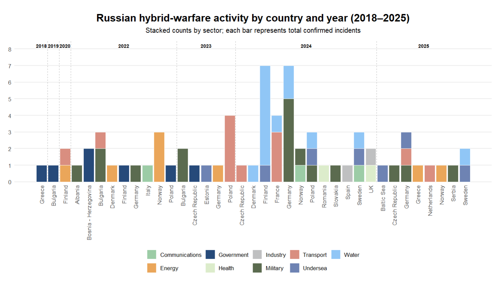

```{r setup, include=TRUE}
knitr::opts_chunk$set(out.width="100%", fig.align="center", fig.height = 8, fig.width = 15)
```

## Original Graph Chosen


## Replication

```{r}
library(tidyverse)
library(scales)

df_recon1 <- tribble(
  ~year, ~country, ~sector, ~count,
  # 2018
  2018, "Greece", "Government", 1,
  # 2019
  2019, "Bulgaria", "Government", 1,
  #2020
  2020, "Finland", "Energy", 1,
  2020, "Finland", "Transport", 1,
  # 2022
  2022, "Albania", "Military", 1,
  2022, "Bosnia - Herzegovina", "Government", 2,
  2022, "Bulgaria", "Military", 2,
  2022, "Bulgaria", "Transport", 1,
  2022, "Denmark", "Energy", 1,
  2022, "Finland", "Government", 1,
  2022, "Germany", "Military", 1,
  2022, "Italy", "Communications", 1,
  2022, "Norway", "Energy", 3,
  2022, "Poland", "Government", 1,
  # 2023
  2023, "Bulgaria", "Military", 2,
  2023, "Estonia", "Undersea", 1,
  2023, "Czech Republic", "Government", 1,
  2023, "Germany", "Energy", 1,
  2023, "Poland", "Transport", 4,
  # 2024
  2024, "Czech Republic", "Transport", 1,
  2024, "Denmark", "Water", 1,
  2024, "Finland", "Undersea", 1,
  2024, "Finland", "Water", 6,
  2024, "France", "Transport", 3,
  2024, "France", "Water", 1,
  2024, "Germany", "Military", 5,
  2024, "Germany", "Water", 2,
  2024, "Norway", "Communications", 1,
  2024, "Norway", "Military", 1,
  2024, "Poland", "Military", 1,
  2024, "Poland", "Undersea", 1,
  2024, "Poland", "Water", 1,
  2024, "Romania", "Health", 1,
  2024, "Slovakia", "Military", 1,
  2024, "Spain", "Industry", 1,
  2024, "Sweden", "Communications", 1,
  2024, "Sweden", "Undersea", 1,
  2024, "Sweden", "Water", 1,
  2024, "UK", "Health", 1,
  2024, "UK", "Industry", 1,
  # 2025
  2025, "Baltic Sea", "Undersea", 1,
  2025, "Czech Republic", "Military", 1,
  2025, "Germany", "Military", 1,
  2025, "Germany", "Transport", 1,
  2025, "Germany", "Undersea", 1,
  2025, "Greece", "Energy", 1,
  2025, "Netherlands", "Transport", 1,
  2025, "Norway", "Energy", 1,
  2025, "Serbia", "Military", 1,
  2025, "Sweden", "Undersea", 1,
  2025, "Sweden", "Water", 1
)

df <- df_recon1 |>
  arrange(year, country, row_number()) |>
  group_by(year, country) |>
  mutate(
    ymin = c(0, cumsum(count)[-n()]),
    ymax = cumsum(count)
  ) |>
  ungroup() |>
  mutate(xlabel = paste0(country, "\n", year))

desired_order <- df |>
  distinct(xlabel, year, country) |>
  arrange(year, country) |>
  pull(xlabel)

df$xlabel <- factor(df$xlabel, levels = desired_order)

sector_colors <- c(
  "Communications" = "#9CCCA6",
  "Energy" = "#EAA65A",
  "Government" = "#264A7A",
  "Health" = "#DCECCB",
  "Industry" = "#BFC0C1",
  "Military" = "#5B6B4F",
  "Transport" = "#D98E80",
  "Undersea" = "#6E83B3",
  "Water" = "#90C6F6"
)

df$sector <- factor(
  df$sector,
  levels = c(
    "Communications",
    "Energy",
    "Government",
    "Health",
    "Industry",
    "Military",
    "Transport",
    "Undersea",
    "Water"))

df$sector <- factor(df$sector, levels = names(sector_colors))

year_positions <- df |>
  distinct(country, year, xlabel) |>
  arrange(year, xlabel) |>
  group_by(year) |>
  summarize(
    x = mean(as.numeric(factor(xlabel, levels = levels(df$xlabel))))
  )

year_boundaries <- df |>
  distinct(year, xlabel) |>
  mutate(x = as.numeric(factor(xlabel, levels = levels(df$xlabel)))) |>
  group_by(year) |>
  summarize(
    min_x = min(x),
    max_x = max(x)
  ) |>
  arrange(year) |>
  mutate(
    boundary_x = lag(max_x) + 0.5
  ) |>
  filter(!is.na(boundary_x))

ggplot(df) +
  geom_text(
    data = year_positions,
    aes(x = x, y = 0, label = year),
    vjust = 1,
    hjust = 5,
    angle = 90,
    size = 3,
    fontface = "bold"
  ) +
  geom_text(
    data = year_boundaries,
    aes(
      x = boundary_x - 0.5,
      y = 0,
      label = "___________"
    ),
    angle = 90,
    vjust = .5,
    hjust = 1,
    size = 6,
    color = "#A9A9A9"
  ) +
  geom_rect(
    aes(
      xmin = as.numeric(xlabel) - 0.4,
      xmax = as.numeric(xlabel) + 0.4,
      ymin = ymin,
      ymax = ymax,
      fill = sector
    ),
    color = NA
  ) +
  scale_x_continuous(
    breaks = seq_along(levels(df$xlabel)),
    labels = df |> distinct(xlabel, country) |> pull(country)
  ) +
  scale_fill_manual(values = sector_colors) +
  guides(fill = guide_legend(nrow = 2, byrow = TRUE)) +
  scale_y_continuous(expand = c(0,0), breaks = seq(0,8,1), limits = c(0,8)) +
  coord_cartesian(expand = FALSE) +
  labs(
    title = "Russian hybrid-warfare activity by\ncountry and year, January 2018–June 2025",
    x = NULL, y = NULL, fill = NULL
  ) +
  theme_minimal(base_size = 13) +
  theme(
    plot.title = element_text(face = "bold", size = 20, hjust = 0.5, margin = margin(b = 8)),
    axis.text.x = element_text(
      color = "black",
      size = 9,
      angle = 90,
      hjust = 1,
      vjust = 0.5
    ),
    plot.margin = margin(30, 20, 40, 20),
    axis.text.y = element_text(size = 10, color = "grey30"),
    panel.grid.major.x = element_blank(),
    panel.grid.minor = element_blank(),
    panel.grid.major.y = element_line(color = "grey90"),
    legend.position = "bottom",
    legend.box = "horizontal",
    legend.text = element_text(size = 10),
    legend.spacing.x = unit(0.50, "cm"),
    legend.margin = margin(t = 10),
    panel.spacing = unit(2, "lines")
  ) +
  coord_cartesian(clip = "off")

```


## Improvement Version One

```{}
```

```{r}
library(tidyverse)
library(scales)

df <- tribble(
  ~year, ~country, ~sector, ~count,
  2018, "Greece", "Government", 1,
  2019, "Bulgaria", "Government", 1,
  2020, "Finland", "Energy", 1,
  2020, "Finland", "Transport", 1,

  2022, "Albania", "Military", 1,
  2022, "Bosnia - Herzegovina", "Government", 2,
  2022, "Bulgaria", "Military", 2,
  2022, "Bulgaria", "Transport", 1,
  2022, "Denmark", "Energy", 1,
  2022, "Finland", "Government", 1,
  2022, "Germany", "Military", 1,
  2022, "Italy", "Communications", 1,
  2022, "Norway", "Energy", 3,
  2022, "Poland", "Government", 1,

  2023, "Bulgaria", "Military", 2,
  2023, "Estonia", "Undersea", 1,
  2023, "Czech Republic", "Government", 1,
  2023, "Germany", "Energy", 1,
  2023, "Poland", "Transport", 4,

  2024, "Czech Republic", "Transport", 1,
  2024, "Denmark", "Water", 1,
  2024, "Finland", "Undersea", 1,
  2024, "Finland", "Water", 6,
  2024, "France", "Transport", 3,
  2024, "France", "Water", 1,
  2024, "Germany", "Military", 5,
  2024, "Germany", "Water", 2,
  2024, "Norway", "Communications", 1,
  2024, "Norway", "Military", 1,
  2024, "Poland", "Military", 1,
  2024, "Poland", "Undersea", 1,
  2024, "Poland", "Water", 1,
  2024, "Romania", "Health", 1,
  2024, "Slovakia", "Military", 1,
  2024, "Spain", "Industry", 1,
  2024, "Sweden", "Communications", 1,
  2024, "Sweden", "Undersea", 1,
  2024, "Sweden", "Water", 1,
  2024, "UK", "Health", 1,
  2024, "UK", "Industry", 1,

  2025, "Baltic Sea", "Undersea", 1,
  2025, "Czech Republic", "Military", 1,
  2025, "Germany", "Military", 1,
  2025, "Germany", "Transport", 1,
  2025, "Germany", "Undersea", 1,
  2025, "Greece", "Energy", 1,
  2025, "Netherlands", "Transport", 1,
  2025, "Norway", "Energy", 1,
  2025, "Serbia", "Military", 1,
  2025, "Sweden", "Undersea", 1,
  2025, "Sweden", "Water", 1
)

df <- df |>
  mutate(
    xlabel = paste0(country, "\n", year)
  )

desired_order <- df |>
  distinct(year, country, xlabel) |>
  arrange(year, country) |>
  pull(xlabel)

df$xlabel <- factor(df$xlabel, levels = desired_order)

sector_colors <- c(
  "Communications" = "#9CCCA6",
  "Energy" = "#EAA65A",
  "Government" = "#264A7A",
  "Health" = "#DCECCB",
  "Industry" = "#BFC0C1",
  "Military" = "#5B6B4F",
  "Transport" = "#D98E80",
  "Undersea" = "#6E83B3",
  "Water" = "#90C6F6"
)

df$sector <- factor(df$sector, levels = names(sector_colors))

df <- df |>
  group_by(year, country) |>
  arrange(sector, .by_group = TRUE) |>
  mutate(
    ymin = c(0, cumsum(count)[-n()]),
    ymax = cumsum(count)
  ) |>
  ungroup()

year_positions <- df |>
  distinct(year, xlabel) |>
  mutate(x = as.numeric(xlabel)) |>
  group_by(year) |>
  summarise(x = mean(x))

year_boundaries <- df |>
  distinct(year, xlabel) |>
  mutate(x = as.numeric(xlabel)) |>
  group_by(year) |>
  summarise(min_x = min(x), max_x = max(x)) |>
  mutate(boundary_x = lag(max_x) + 0.5) |>
  filter(!is.na(boundary_x))

ggplot(df) +
  geom_text(
    data = year_positions,
    aes(x = x, y = 8.1, label = year),
    vjust = 0, fontface = "bold", size = 3
  ) +
  geom_vline(
    data = year_boundaries,
    aes(xintercept = boundary_x),
    linetype = "dashed",
    color = "grey70",
    linewidth = 0.4
  ) +
  geom_rect(
    aes(
      xmin = as.numeric(xlabel) - 0.45,
      xmax = as.numeric(xlabel) + 0.45,
      ymin = ymin,
      ymax = ymax,
      fill = sector
    ),
    color = "white", linewidth = 0.3
  ) +
  scale_x_continuous(
    breaks = seq_along(levels(df$xlabel)),
    labels = df |> distinct(xlabel, country) |> pull(country)
  ) +
  scale_fill_manual(values = sector_colors) +
  scale_y_continuous(expand = c(0,0), limits = c(0,8.5), breaks = 0:8) +
  labs(
    title = "Russian hybrid-warfare activity by country and year (2018–2025)",
    subtitle = "Stacked counts by sector; each bar represents total confirmed incidents",
    x = NULL, y = NULL, fill = NULL
  ) +
  theme_minimal(base_size = 13) +
  theme(
    plot.title = element_text(face = "bold", size = 18, hjust = 0.5),
    plot.subtitle = element_text(size = 12, hjust = 0.5, margin = margin(b = 12)),
    axis.text.x = element_text(angle = 90, vjust = 0.5, hjust = 1),
    panel.grid.major.x = element_blank(),
    panel.grid.minor = element_blank(),
    legend.position = "bottom",
    plot.margin = margin(30, 20, 40, 20)
  )
```



## Improvement Version Two

```{r}
library(tidyverse)
library(scales)

df <- tribble(
  ~year, ~country, ~sector, ~count,
  2018, "Greece", "Government", 1,
  2019, "Bulgaria", "Government", 1,
  2020, "Finland", "Energy", 1,
  2020, "Finland", "Transport", 1,

  2022, "Albania", "Military", 1,
  2022, "Bosnia - Herzegovina", "Government", 2,
  2022, "Bulgaria", "Military", 2,
  2022, "Bulgaria", "Transport", 1,
  2022, "Denmark", "Energy", 1,
  2022, "Finland", "Government", 1,
  2022, "Germany", "Military", 1,
  2022, "Italy", "Communications", 1,
  2022, "Norway", "Energy", 3,
  2022, "Poland", "Government", 1,

  2023, "Bulgaria", "Military", 2,
  2023, "Estonia", "Undersea", 1,
  2023, "Czech Republic", "Government", 1,
  2023, "Germany", "Energy", 1,
  2023, "Poland", "Transport", 4,

  2024, "Czech Republic", "Transport", 1,
  2024, "Denmark", "Water", 1,
  2024, "Finland", "Undersea", 1,
  2024, "Finland", "Water", 6,
  2024, "France", "Transport", 3,
  2024, "France", "Water", 1,
  2024, "Germany", "Military", 5,
  2024, "Germany", "Water", 2,
  2024, "Norway", "Communications", 1,
  2024, "Norway", "Military", 1,
  2024, "Poland", "Military", 1,
  2024, "Poland", "Undersea", 1,
  2024, "Poland", "Water", 1,
  2024, "Romania", "Health", 1,
  2024, "Slovakia", "Military", 1,
  2024, "Spain", "Industry", 1,
  2024, "Sweden", "Communications", 1,
  2024, "Sweden", "Undersea", 1,
  2024, "Sweden", "Water", 1,
  2024, "UK", "Health", 1,
  2024, "UK", "Industry", 1,

  2025, "Baltic Sea", "Undersea", 1,
  2025, "Czech Republic", "Military", 1,
  2025, "Germany", "Military", 1,
  2025, "Germany", "Transport", 1,
  2025, "Germany", "Undersea", 1,
  2025, "Greece", "Energy", 1,
  2025, "Netherlands", "Transport", 1,
  2025, "Norway", "Energy", 1,
  2025, "Serbia", "Military", 1,
  2025, "Sweden", "Undersea", 1,
  2025, "Sweden", "Water", 1
)

df <- df |>
  mutate(
    xlabel = paste0(country, "\n", year)
  )

desired_order <- df |>
  distinct(year, country, xlabel) |>
  arrange(year, country) |>
  pull(xlabel)

df$xlabel <- factor(df$xlabel, levels = desired_order)

sector_colors <- c(
  "Communications" = "#9CCCA6",
  "Energy" = "#EAA65A",
  "Government" = "#264A7A",
  "Health" = "#DCECCB",
  "Industry" = "#BFC0C1",
  "Military" = "#5B6B4F",
  "Transport" = "#D98E80",
  "Undersea" = "#6E83B3",
  "Water" = "#90C6F6"
)

df$sector <- factor(df$sector, levels = names(sector_colors))

df <- df |>
  group_by(year, country) |>
  arrange(sector, .by_group = TRUE) |>
  mutate(
    ymin = c(0, cumsum(count)[-n()]),
    ymax = cumsum(count)
  ) |>
  ungroup()

year_positions <- df |>
  distinct(year, xlabel) |>
  mutate(x = as.numeric(xlabel)) |>
  group_by(year) |>
  summarise(x = mean(x))

year_boundaries <- df |>
  distinct(year, xlabel) |>
  mutate(x = as.numeric(xlabel)) |>
  group_by(year) |>
  summarise(min_x = min(x), max_x = max(x)) |>
  mutate(boundary_x = lag(max_x) + 0.5) |>
  filter(!is.na(boundary_x))

# horiztonal one

df <- df |>
  mutate(
    xlabel2 = paste0(country, " (", year, ")"),
    xlabel2 = factor(xlabel2, levels = unique(xlabel2[order(year, country)]))
  )

ggplot(df) +
  geom_rect(
    aes(
      xmin = ymin,
      xmax = ymax,
      ymin = as.numeric(xlabel2) - 0.45,
      ymax = as.numeric(xlabel2) + 0.45,
      fill = sector
    ),
    color = "white", linewidth = 0.3
  ) +
  scale_y_continuous(
    breaks = seq_along(levels(df$xlabel2)),
    labels = levels(df$xlabel2)
  ) +
  scale_x_continuous(expand = c(0,0), limits = c(0,8)) +
  scale_fill_manual(values = sector_colors) +
  labs(
    title = "Russian hybrid-warfare activity by country and year (2018–2025)",
    subtitle = "Horizontal layout improves readability of country–year labels",
    x = "Total incidents", y = NULL, fill = NULL
  ) +
  theme_minimal(base_size = 13) +
  theme(
    axis.text.y = element_text(size = 9),
    panel.grid.major.y = element_blank(),
    legend.position = "bottom",
    plot.margin = margin(20, 30, 20, 30)
  ) +
  coord_cartesian(clip = "off")
```


