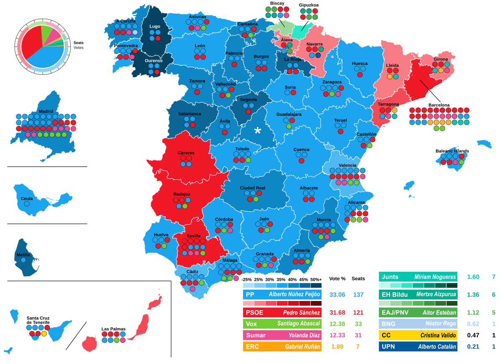
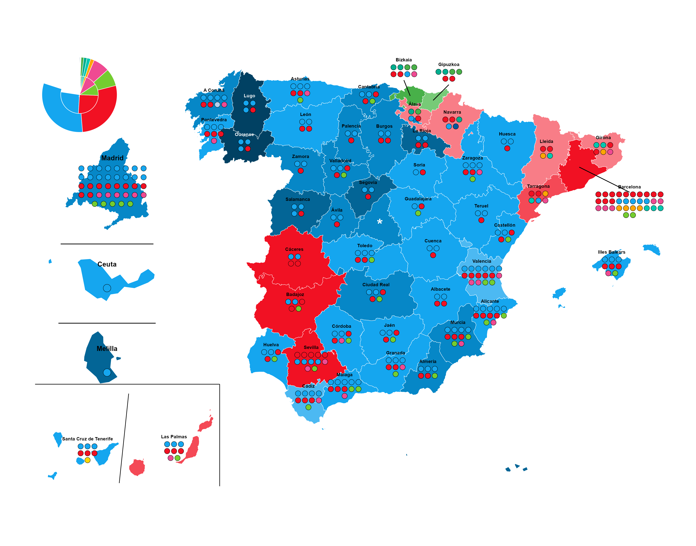

```{r setup, include=FALSE}
knitr::opts_chunk$set(out.width = "100%", fig.align = "center")
```




```{r}
library(tidyverse)
library(sf)
library(mapSpain)
library(readxl)
library(zoo)
library(patchwork)
library(colorspace)
library(grid)
```


```{r}
# ==============================================================================
# 1. CONSTANTES Y FUNCIONES
# ==============================================================================
HEX_PP_OSCURO <- "#014163" 
file_path <- "PROV_02_202307_1.xlsx"

clean_text <- function(x) {
  x <- tolower(x)
  x <- iconv(x, from = "UTF-8", to = "ASCII//TRANSLIT")
  x <- str_trim(x)
  x <- str_replace_all(x, "\\s+", "_")
  x <- str_replace_all(x, "[^a-z0-9_]", "")
  return(x)
}

# ==============================================================================
# 2. CARGA Y PROCESAMIENTO DE DATOS
# ==============================================================================
raw_headers <- read_excel(file_path, skip = 4, n_max = 2, col_names = FALSE)
parties_raw <- as.character(raw_headers[1, ])
metrics_raw <- as.character(raw_headers[2, ])

parties_filled <- zoo::na.locf(parties_raw, na.rm = FALSE)
parties_clean <- clean_text(parties_filled)
metrics_clean <- clean_text(metrics_raw)

clean_names <- ifelse(metrics_clean %in% c("votos", "diputados"), 
                      paste(metrics_clean, parties_clean, sep = "_"), 
                      metrics_clean)
results_cleaned <- read_excel(file_path, skip = 6, col_names = clean_names)

cols_metadata <- c("nombre_de_comunidad", "codigo_de_provincia", 
                   "nombre_de_provincia", "poblacion", "numero_de_mesas", 
                   "censo_electoral_sin_cera", "censo_cera", 
                   "total_censo_electoral", "total_votantes_cer", 
                   "total_votantes_cera", "total_votantes", "votos_validos", 
                   "votos_a_candidaturas", "votos_en_blanco", "votos_nulos")

results_long <- results_cleaned |>
  pivot_longer(cols = !all_of(cols_metadata), names_to = c(".value", "partido"), 
               names_pattern = "(votos|diputados)_(.*)") |>
  mutate(votos = replace_na(votos, 0), diputados = replace_na(diputados, 0))

results_calculated <- results_long |>
  group_by(across(all_of(cols_metadata))) |>
  mutate(p_votos = if_else(votos_validos == 0, 0, (votos / votos_validos) * 100)) |>
  ungroup()

results_wide <- results_calculated |>
  pivot_wider(names_from = partido, values_from = c(votos, p_votos, diputados), 
              names_glue = "{.value}_{partido}")

cols_todas <- names(results_wide)
cols_partidos <- setdiff(cols_todas, cols_metadata)
partidos_unicos <- unique(gsub("^(votos|p_votos|diputados)_", "", cols_partidos))
orden_final <- cols_metadata
for (p in partidos_unicos) { orden_final <- c(orden_final, paste0("votos_", p), 
                                              paste0("p_votos_", p), 
                                              paste0("diputados_", p)) }
results_enriched <- results_wide |> select(any_of(orden_final))

# ==============================================================================
# 3. COLORES Y MAPEO
# ==============================================================================
party_base <- tribble(
  ~party,     ~base_hex,
  "PP",       "#15a6ef", "PSOE",     "#f11123", "Vox",      "#74cd30", 
  "Sumar",    "#ef4a92", "ERC",      "#ffa503", "Junts",    "#00c8b0", 
  "EH Bildu", "#00ae8f", "PNV",      "#48b049",
  "BNG",      "#aed0ef", "CC",       "#ffd800", "UPN",      "#00589c"
)

party_colours <- tribble(
  ~party,   ~bin,      ~hex,
  "PP", "0-25", "#b1e0f9", "PP", "25-30", "#7fcdf5", "PP", "30-35", "#4cb9f2", 
  "PP", "35-40", "#15a6ef", "PP", "40-45", "#0687c7", "PP", "45-50", "#036596", 
  "PP", "50plus", "#014163","PSOE", "0-25", "#fbb0b5", 
  "PSOE", "25-30", "#f87d87", "PSOE", "30-35", 
  "#f44956", "PSOE", "35-40", "#f11123", "PSOE", "40-45", "#ca0413", 
  "PSOE", "45-50", "#98020b", "PSOE", "50plus", "#640106",
  "Junts", "0-25", "#c0f8ef", "Junts", "25-30", "#76f0db", 
  "Junts", "30-35", "#22e8c7", "Junts", "35-40", "#00b999", 
  "Junts", "40-45", "#009076", "Junts", "45-50", "#006653", 
  "Junts", "50plus", "#003a2d",
  "EH Bildu", "0-25", "#c3e8c3", "EH Bildu", "25-30", "#9dd99d", 
  "EH Bildu", "30-35", "#77ca77", "EH Bildu", "35-40", "#4fbb4f", 
  "EH Bildu", "40-45", "#399a39", "EH Bildu", "45-50", "#297429", 
  "EH Bildu", "50plus","#184c18"
)

results_final_mapa <- results_enriched |>
  bind_cols(
    results_enriched |> select(starts_with("p_votos_")) |> mutate(id_row = row_number()) |> 
      pivot_longer(cols = -id_row, names_to = "partido_temp", values_to = "pct_temp") |>
      group_by(id_row) |> slice_max(pct_temp, n = 1, with_ties = FALSE) |> ungroup() |>
      transmute(ganador_raw = gsub("p_votos_", "", partido_temp), ganador_pct = pct_temp)
  ) |>
  mutate(
    ganador = case_when(
      ganador_raw == "pp" ~ "PP", ganador_raw == "psoe" ~ "PSOE", 
      ganador_raw == "vox" ~ "Vox",
      ganador_raw == "sumar" ~ "Sumar", ganador_raw == "jxcat__junts" ~ "Junts",
      ganador_raw == "eh_bildu" ~ "EH Bildu", ganador_raw == "eajpnv" ~ "PNV",
      ganador_raw == "erc" ~ "ERC", ganador_raw == "bng" ~ "BNG", 
      ganador_raw == "cca" ~ "CC",
      ganador_raw == "upn" ~ "UPN", TRUE ~ toupper(ganador_raw)
    ),
    ganador_bin = cut(ganador_pct, breaks = c(0, 25, 30, 35, 40, 45, 50, 101),
                      labels = c("0-25", "25-30", "30-35", "35-40", "40-45",
                                 "45-50", "50plus"),
                      include.lowest = TRUE, right = FALSE)
  ) |>
  left_join(party_colours, by = c("ganador" = "party", "ganador_bin" = "bin")) |>
  left_join(party_base, by = c("ganador" = "party")) |>
  mutate(final_hex = coalesce(hex, base_hex, "#d3d3d3")) |>
  select(-ganador_raw, -hex, -base_hex)

# ==============================================================================
# 4. GEOMETRÍA, DESPLAZAMIENTOS Y GRID DE PUNTOS (MODIFICADO)
# ==============================================================================
mapa_provincias <- esp_get_prov(year = "2021", epsg = 3857)
data_mapa <- results_final_mapa |> mutate(cpro = str_pad(
  as.character(codigo_de_provincia), width = 2, pad = "0"))
mapa_completo <- mapa_provincias |> left_join(data_mapa, by = "cpro")

# --- OFFSETS: BARCELONA Y VASCAS (LÍNEAS DE LLAMADA) ---
manual_offsets <- tibble(
  cpro = c("08", "48", "20"), 
  move_x = c(160000, -20000, 50000), # BCN derecha, Bizkaia izq, Gipuzkoa derecha
  move_y = c(-120000, 80000, 80000)  # BCN abajo, Vascas arriba
)

# Centroides base
centroids_base <- mapa_provincias |> st_centroid() |> 
  select(cpro, ine.prov.name) |> 
  mutate(real_x = st_coordinates(geometry)[,1], real_y = st_coordinates(geometry)[,2]) |> 
  st_drop_geometry()

# Centroides desplazados
centroids <- centroids_base |>
  left_join(manual_offsets, by = "cpro") |>
  mutate(
    cx = if_else(!is.na(move_x), real_x + move_x, real_x),
    cy = if_else(!is.na(move_y), real_y + move_y, real_y),
    is_displaced = !is.na(move_x)
  )

# --- PREPARACIÓN DE ESCAÑOS ---
seats_data <- results_enriched |>
  distinct(codigo_de_provincia, .keep_all = TRUE) |>
  select(codigo_de_provincia, matches("diputados_")) |>
  pivot_longer(cols = starts_with("diputados_"), names_to = "party_raw", 
               values_to = "seats") |>
  filter(seats > 0) |>
  mutate(
    party_clean = str_remove(party_raw, "diputados_"),
    party = case_when(
      party_clean == "pp" ~ "PP", party_clean == "psoe" ~ "PSOE", 
      party_clean == "vox" ~ "Vox",
      party_clean == "sumar" ~ "Sumar", party_clean == "erc" ~ "ERC",
      party_clean %in% c("jxcat__junts", "junts") ~ "Junts", party_clean %in% 
        c("eh_bildu", "bildu") ~ "EH Bildu",
      party_clean %in% c("eajpnv", "pnv") ~ "PNV", party_clean == "bng" ~ "BNG",
      party_clean %in% c("cca", "cc") ~ "CC", party_clean == "upn" ~ "UPN", 
      TRUE ~ "Otros"
    ),
    cpro = str_pad(as.character(codigo_de_provincia), width = 2, pad = "0")
  ) |>
  left_join(party_base |> select(party, base_hex), by = "party")

# --- LÓGICA DE COLUMNAS ---
province_stats <- seats_data |>
  group_by(cpro) |>
  summarise(total_seats = sum(seats)) |>
  mutate(
    cols_grid = case_when(
      cpro == "08" ~ 10, # Barcelona
      cpro %in% c("48", "20") ~ 4, # Vascas
      cpro == "28" ~ 8, # Madrid
      cpro == "46" ~ 6, # Valencia
      cpro == "41" ~ 5, # Sevilla
      cpro == "03" ~ 5, # Alicante
      cpro == "29" ~ 5, # Málaga
      cpro == "11" ~ 4, # Cádiz
      cpro == "15" ~ 4, # Coruña
      total_seats == 1 ~ 1,
      total_seats == 2 ~ 2,
      total_seats <= 4 ~ 2,
      total_seats <= 6 ~ 3,
      total_seats <= 9 ~ 3,
      TRUE ~ 4
    )
  )

# --- EXPANDIR Y ORDENAR ---
seats_expanded <- seats_data |>
  left_join(province_stats, by = "cpro") |>
  arrange(cpro, desc(seats), party) |> 
  uncount(seats) |>
  group_by(cpro) |>
  mutate(seat_id = row_number()) |>
  ungroup()

SPACING <- 22000 

# Datos para las líneas de unión (Callouts) - LÓGICA CORREGIDA AQUÍ
lines_data <- centroids |>
  filter(is_displaced) |>
  left_join(province_stats, by = "cpro") |> # Necesitamos info de seats para calcular altura
  mutate(
    total_rows = ceiling(total_seats / cols_grid),
    # Altura aproximada donde estará el texto: cy + (mitad del bloque) + margen
    approx_text_y = cy + ((total_rows - 1) * SPACING / 2) + 24000,
    
    end_y = case_when(
      cpro == "08" ~ approx_text_y + 5000, # BCN: Apuntar un poco encima del texto
      move_y > 0 ~ cy - 30000,             # Vascas: Apuntar debajo de los puntos
      TRUE ~ cy + 40000
    )
  )

seats_coords <- seats_expanded |>
  left_join(centroids, by = "cpro") |>
  mutate(
    row_idx = floor((seat_id - 1) / cols_grid),
    col_idx_internal = (seat_id - 1) %% cols_grid
  ) |>
  group_by(cpro, row_idx) |>
  mutate(dots_in_this_row = n()) |>
  ungroup() |>
  mutate(
    total_rows = ceiling(total_seats / cols_grid),
    x_pos = cx + (col_idx_internal * SPACING) - ((dots_in_this_row - 1) * SPACING / 2),
    y_pos = cy - (row_idx * SPACING) + ((total_rows - 1) * SPACING / 2)
  )

# Etiquetas
label_data <- province_stats |>
  left_join(centroids, by = "cpro") |>
  left_join(mapa_completo |> st_drop_geometry() |> select(cpro, final_hex), by = "cpro") |>
  mutate(
    total_rows = ceiling(total_seats / cols_grid),
    y_label = cy + ((total_rows - 1) * SPACING / 2) + 24000,
    provincia_limpia = case_when(
      ine.prov.name == "Rioja, La" ~ "La Rioja", ine.prov.name == "Coruña, A" ~ "A Coruña",
      ine.prov.name == "Palmas, Las" ~ "Las Palmas", ine.prov.name == 
        "Balears, Illes" ~ "Illes Balears",
      str_detect(ine.prov.name, "Alicante") ~ "Alicante", 
      str_detect(ine.prov.name, "Valencia") ~ "Valencia",
      str_detect(ine.prov.name, "Castellón") ~ "Castellón", 
      str_detect(ine.prov.name, "Araba") ~ "Álava",
      str_detect(ine.prov.name, "Bizkaia") ~ "Bizkaia",
      str_detect(ine.prov.name, "Gipuzkoa") ~ "Gipuzkoa",
      TRUE ~ ine.prov.name
    )
  )


# ==============================================================================
# 5. FUNCIÓN DE ZOOM (AJUSTADA Y ROBUSTA)
# ==============================================================================
codigos_zoom <- c("28", "51", "52") 

crear_zoom <- function(codigo_prov, nombre_prov, n_cols_grid, spacing_custom, 
                       size_dots, 
                       radio_vista = NULL, draw_line_below = FALSE) {
  
  prov_sf    <- mapa_completo  |> filter(cpro == codigo_prov)
  prov_seats <- seats_expanded |> filter(cpro == codigo_prov)
  
  bbox <- st_bbox(prov_sf)
  alto_prov <- bbox$ymax - bbox$ymin
  centro <- st_centroid(prov_sf) |> st_coordinates()
  cx_local <- centro[1]
  cy_local <- centro[2]
  
  # Offset vertical para escaños en ciudades autónomas (Si es manual)
  offset_y_val <- 0
  if (!is.null(radio_vista) && codigo_prov %in% c("51", "52")) {
    offset_y_val <- -radio_vista * 0.15
  }
  
  coords_calc <- prov_seats |> 
    mutate(
      seat_id_local = row_number(),
      row_idx = floor((seat_id_local - 1) / n_cols_grid),
      col_idx = (seat_id_local - 1) %% n_cols_grid
    ) |> 
    group_by(row_idx) |> 
    mutate(dots_in_row = n()) |> 
    ungroup() |> 
    mutate(
      total_rows = ceiling(n() / n_cols_grid),
      x_pos = cx_local + (col_idx * spacing_custom) - ((dots_in_row - 1) * 
                                                         spacing_custom / 2),
      y_pos = cy_local - (row_idx * spacing_custom) + 
        ((total_rows - 1) * spacing_custom / 2) + offset_y_val
    )
  
  # Calcular límites de la línea según contenido real
  min_x_content <- min(bbox$xmin, min(coords_calc$x_pos))
  max_x_content <- max(bbox$xmax, max(coords_calc$x_pos))
  
  if (!is.null(radio_vista)) {
    # MANUAL (CEUTA/MELILLA)
    x_line_start <- cx_local - (radio_vista * 0.9)
    x_line_end   <- cx_local + (radio_vista * 0.9)
    y_linea      <- cy_local - (radio_vista * 0.8)
    y_texto      <- cy_local + (radio_vista * 0.25)
  } else {
    # AUTO (MADRID)
    margen_x      <- spacing_custom * 0.5
    x_line_start <- min_x_content - margen_x
    x_line_end   <- max_x_content + margen_x
    y_linea      <- bbox$ymin - (alto_prov * 0.15)
    y_texto      <- max(coords_calc$y_pos) + (spacing_custom * 0.9)
  }
  
  p <- ggplot() +
    geom_sf(data = prov_sf, aes(fill = final_hex), color = "white", size = 0.2) +
    geom_point(data = coords_calc, aes(x = x_pos, y = y_pos, fill = base_hex),
               shape = 21, color = "black", size = size_dots, stroke = 0.3) +
    geom_text(aes(x = cx_local, y = y_texto, label = nombre_prov), 
              fontface = "bold", size = 3.5, vjust = 0) +
    scale_fill_identity() + theme_void() + theme(plot.background = element_blank())
  
  if (is.null(radio_vista)) {
    p <- p + expand_limits(y = c(y_linea - 500, y_texto + 500), x = 
                             c(x_line_start, x_line_end)) + coord_sf(clip = "off")
  } else {
    p <- p + coord_sf(xlim = c(cx_local - radio_vista, cx_local + radio_vista),
                      ylim = c(cy_local - radio_vista, cy_local + radio_vista),
                      expand = FALSE, clip = "off")
  }
  
  if (draw_line_below) {
    p <- p + geom_segment(aes(x = x_line_start, xend = x_line_end, y = y_linea, 
                              yend = y_linea), color = "black", linewidth = 0.5)
  }
  return(p)
}

# ==============================================================================
# 6. GENERACIÓN DE ZOOMS
# ==============================================================================
plot_madrid <- crear_zoom("28", "Madrid", n_cols_grid = 8, spacing_custom = 18000, 
                          size_dots = 3.5, radio_vista = NULL, draw_line_below = TRUE)
plot_ceuta  <- crear_zoom("51", "Ceuta", n_cols_grid = 1, spacing_custom = 5000, 
                          size_dots = 5, radio_vista = 8000, draw_line_below = TRUE)
plot_melilla <- crear_zoom("52", "Melilla", n_cols_grid = 1, spacing_custom = 3000, 
                           size_dots = 5, radio_vista = 7500, draw_line_below = FALSE)

# 7. GRÁFICO POLAR NACIONAL — PIE (SEATS) + DONUT (VOTES), SIN COSTURAS

df_espana <- results_final_mapa |>
  filter(nombre_de_provincia == "España")

partidos_interes <- c(
  "pp", "psoe", "vox", "sumar", "erc", "jxcat__junts",
  "eh_bildu", "eajpnv", "bng", "cca", "upn"
)

# ------------------------------------------------------------
# ESCAÑOS (PIE INTERIOR)
# ------------------------------------------------------------
df_seats_nac <- df_espana |>
  select(starts_with("diputados_")) |>
  pivot_longer(everything(), names_to = "partido", values_to = "seats") |>
  mutate(partido = str_remove(partido, "^diputados_")) |>
  filter(partido %in% partidos_interes, seats > 0) |>
  arrange(desc(seats)) |>
  mutate(
    pct_seats = seats / sum(seats),
    x = 1,
    partido = factor(partido, levels = partido)
  )

orden_partidos <- levels(df_seats_nac$partido)

# ------------------------------------------------------------
# VOTOS (DONUT EXTERIOR, MISMO UNIVERSO)
# ------------------------------------------------------------
df_votes_nac <- df_espana |>
  select(starts_with("p_votos_")) |>
  pivot_longer(everything(), names_to = "partido", values_to = "pct_votes") |>
  mutate(
    partido = str_remove(partido, "^p_votos_"),
    pct_votes = pct_votes / 100
  ) |>
  filter(partido %in% orden_partidos) |>
  mutate(
    pct_votes = pct_votes / sum(pct_votes),
    x = 2,
    partido = factor(partido, levels = orden_partidos)
  )

# ------------------------------------------------------------
# EPSILON: solapamiento microscópico para eliminar la costura
# ------------------------------------------------------------
eps <- 1e-6
df_seats_nac$pct_seats[1] <- df_seats_nac$pct_seats[1] + eps
df_votes_nac$pct_votes[1] <- df_votes_nac$pct_votes[1] + eps

# ------------------------------------------------------------
# COLORES
# ------------------------------------------------------------
colores_nacional <- c(
  pp = "#15a6ef", psoe = "#f11123", vox = "#74cd30", sumar = "#ef4a92",
  erc = "#ffa503", jxcat__junts = "#00c8b0", eh_bildu = "#00ae8f",
  eajpnv = "#48b049", bng = "#aed0ef", cca = "#ffd800", upn = "#00589c"
)

# ------------------------------------------------------------
# GRÁFICO POLAR FINAL
# ------------------------------------------------------------
plot_resumen_nacional <- ggplot() +
  geom_col(
    data = df_seats_nac,
    aes(x = x, y = pct_seats, fill = partido),
    width = 1,
    linewidth = 0,
    color = NA
  ) +
  geom_col(
    data = df_votes_nac,
    aes(x = x, y = pct_votes, fill = partido),
    width = 1,
    linewidth = 0,
    color = NA
  ) +
  # separador circular entre pie y donut
  geom_hline(
    yintercept = 1,
    color = "white",
    linewidth = 0
  ) +
  scale_fill_manual(values = colores_nacional) +
  scale_x_continuous(limits = c(0.5, 2.5)) +
  coord_polar(theta = "y") +
  theme_void() +
  theme(
    legend.position = "none",
    plot.background = element_blank()
  )

# ==============================================================================
# 8. MAPA BASE Y COMPOSICIÓN FINAL (AJUSTE DE TEXTO)
# ==============================================================================
sf_canarias <- mapa_completo |> filter(cpro %in% c("35", "38"))
bbox_can <- st_bbox(sf_canarias)
rect_canarias <- tibble(xmin = bbox_can$xmin - 40000, xmax = bbox_can$xmax + 20000, 
                        ymin = bbox_can$ymin - 20000, ymax = bbox_can$ymax + 80000)
bbox_38 <- st_bbox(mapa_completo |> filter(cpro == "38"))
bbox_35 <- st_bbox(mapa_completo |> filter(cpro == "35"))
mid_x_can <- (bbox_38$xmax + bbox_35$xmin) / 2
linea_diagonal <- tibble(x = mid_x_can - 15000, xend = mid_x_can + 15000, 
                         y = bbox_can$ymin - 10000, yend = bbox_can$ymax + 50000)

# FILTROS FINALES
seats_coords_main <- seats_coords |> filter(!cpro %in% codigos_zoom)
centroids_zoom <- mapa_provincias |> filter(cpro %in% codigos_zoom) |> 
  st_centroid() |> mutate(cx = st_coordinates(geometry)[,1], 
                          cy = st_coordinates(geometry)[,2])

mapa_base <- ggplot() +
  geom_sf(data = mapa_completo, aes(fill = final_hex), color = "white", size = 0.2) +
  # Canarias y recuadros
  geom_segment(data = rect_canarias, aes(x = xmin, xend = xmax, y = ymax, 
                                         yend = ymax), color = "black", linewidth = 0.4) +
  geom_segment(data = rect_canarias, aes(x = xmax, xend = xmax, y = ymin, 
                                         yend = ymax), color = "black", linewidth = 0.4) +
  geom_segment(data = linea_diagonal, aes(x = x, y = y, xend = xend, 
                                          yend = yend), color = "black", linewidth = 0.4) +
  # Líneas de llamada
  geom_segment(data = lines_data, aes(x = real_x, y = real_y, xend = cx, yend = end_y), 
               color = "black", linewidth = 0.5) +
  # Asteriscos para zooms
  geom_text(data = centroids_zoom, aes(x = cx, y = cy), label = "*", color = "white", 
            size = 8, fontface = "bold") +
  # Puntos de escaños
  geom_point(data = seats_coords_main, aes(x = x_pos, y = y_pos, fill = base_hex), 
             shape = 21, color = "black", size = 3.5, stroke = 0.3) +
  # Etiquetas (TAMAÑO 3.4)
  geom_text(data = label_data |> filter(!cpro %in% codigos_zoom),
            aes(x = cx, y = y_label, label = provincia_limpia,
                color = if_else(final_hex == HEX_PP_OSCURO, "white", "black", 
                                missing = "black")),
            size = 3.4, # <--- AUMENTO MODERADO (+1 punto vs original)
            fontface = "bold", check_overlap = FALSE) +
  scale_fill_identity() + scale_color_identity() + theme_void() +
  theme(plot.background = element_rect(fill = "transparent", color = NA))

# Composición Final
mapa_final <- mapa_base +
  inset_element(plot_madrid, left = 0.02, right = 0.28, bottom = 0.55, top = 0.80) +
  inset_element(plot_ceuta, left = 0.02, right = 0.28, bottom = 0.37, top = 0.60) +
  inset_element(plot_melilla, left = 0.02, right = 0.28, bottom = 0.19, top = 0.42) +
  inset_element(plot_resumen_nacional, left = 0.02, right = 0.20, bottom = 0.78, top = 0.98)

print(mapa_final)
ggsave("DataViz_Final_Map_Spain_Full.png", plot = mapa_final, bg = "transparent", 
       width = 14, height = 11, dpi = 300)

```

```{r, fig.width=6, fig.align='center'}

```

