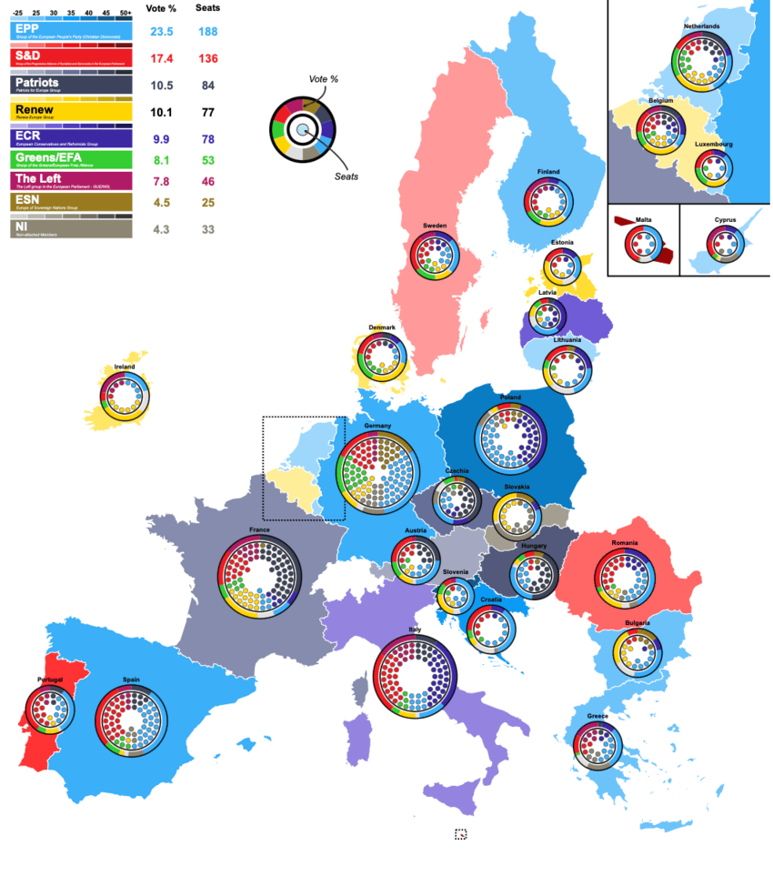

```{r setup, include=FALSE}
knitr::opts_chunk$set(out.width="100%", fig.align="center", fig.showtext=TRUE)
```

## Introduction

The 10th European Parliament elections (and the first since the UK's departure from the EU) took place in June 2024, spanning all 27 EU member states. In this period over 182 million eligible voters chose the next set of 720 Members of the European Parliament (MEPs).

The outcome of the elections marked significant shifts in the European political landscape. Traditional, centrist political groups experienced losses whereas right-wing and far-right parties made notable gains in many countries. The overall results also reflected growing fragmentation and the strengthening of Eurosceptic voices in several member states.

The composition of the European Parliament is complex - it involves over 200 national political parties from 27 countries that organise into 8 European Parliament groups, represented by 720 MEPs that fill the seats of the parliament, and reflect positions from the whole political spectrum across diverse national backdrops. The results of the election mirror this complexity - a large amount of data is produced which is then analysed, reported, and published in many languages, formats, and medias. Clear and accurate communication of this data is vital as the outcome of the vote has important implications for EU policy-making on key issues such as migration, defense, climate change, and economic governance in the following parliamentary term and an impact on every one of the EU's 450 million citizens.

### Visualizing democratic choice

Since election results are inherently complex and data-heavy, visualisations are commonly used to transform the data into accessible insights that allow the changing political landscape and its implications on governance and policy to be quickly understood.

Traditionally, approaches like semicircular parliament seat diagrams are used to mirror the physical parliamentary chamber, making coalition dynamics and political balance immediately visible. Geographic breakdowns reveal how political sentiment varies across regions, and comparative visualizations are used to highlight shifts from previous elections. The goal of these election data visualizations is not simply to report the raw numbers, but to illuminate patterns, facilitate comparison, and make democratic outcomes easier to understand. In our era of information overload, clear and honest visual representation of electoral data also serves a vital civic function by helping people understand the institutions that govern them and the choices their fellow citizens have made.

When it comes to the abundant data resulting from the European Parliament elections, using visualisation to present the results comes with unique challenges. The fact that the data comes from and can be interpreted on numerous levels (for example country, party, coalition, seat, and political leaning) means that careful choices have to be made about what to emphasise and how to maintain clarity. It can be tempting to delve head-first into all aspects of the data, however trying to do too much at once can muddy understanding and key insights can be lost.

## The original plot

The visualisation chosen as the basis of this project was sourced from the Wikipedia page "2024 European Parliament election" (<https://en.wikipedia.org/wiki/2024_European_Parliament_election>) and (from researching the author's other work) appears to have been originally made using the Inkscape platform.

This plot aims to communicate the results of the elections to a general audience by providing a unified visual overview at both a national and EU level. It does this by including geographic, seat-based, and vote-proportion representations that come together to create what is undeniably an eye-catching visualisation.\
\
A choropleth map (a statistical map that uses colours/ shades to represent data values across predefined geographical areas) employing a combination of colour coding and color graduation is used to represent both which European Parliament group won the largest proportion of the vote in each EU country, and what percentage range of the total vote this winning proportion represents.

Circular parliament plots (also known as hemicycle diagrams) are used to represent the seat distribution in legislative bodies. Traditionally, dots are arranged in a semicircle or horseshoe shape where each dot represents one seat ot representative and the colour of the dot represents the political party that the representative is affiliated with. In this case, the original plot uses 27 distinct, circular parliament plots to visualise the seat breakdown by European Parliament group in each of the EU member states.

Donut plots represent proportions of a whole, and are essentially nothing more than pie charts with the middle cut out. In the case of this original plot, 27 individual donut plots encircle the parliament plots and are used to detail the percentage of the total vote that each European Parliament group recieved in each country.

{.external width="100%"}

The decision to explore this graph was made largely due to the variety of visualisation techniques that is employs, which combine into an overall striking and very unique plot. Further to this visual interest created by the merging of techniques, I hoped that trying to recreate a plot that uses many different methods to convey election data would allow exploration of a wide range of data visualisation tools in R.

## Data sources

Obtaining the election data needed for the recreation of this plot posed some challenges and the final data used came from two different sources.

The data used to recreate the parliament seat plots came directly from 27 individual country-specific election result datasets published online by the European Parliament (<https://results.elections.europa.eu/en/tools/download-datasheets/>). These datasets primarily consisted of the number of seats won by each European Perliament group in their respective countries which is all the information that was required for this component of the plot.

The data that was used to recreate the donut plots, which represent the proportion of the total vote in each country won per European Parliament group, could not be found in a pre-existing dataset and nor were these figures published explicitly online. This lack of accessible and verifiable data meant that considerable effort was required to approximate and reconstruct the data needed to create this part of the plot accurately. To this end, the percentage of votes won by individual national political parties was sourced and then aggregated in to European Parliament group percentages manually by researching the affiliation of each individual party at the time of the election. This was a timely process that utilised many sources such as wikipedia, the European Parliament website, and the webpages of the individual national parties themselves.\
\
Finally, the data required to achieve the colouring of the main choropleth map also had to be recreated manually. This process was less involved than the data recreation of the donut plots as the figures required could be extracted directly from the original plot and verified using official figures published online.\
\
Once the required data was gathered, the processing and visualisation process in R could begin.

## Installing packages

This project uses numerous packages in R that are required to facilitate effective data manipulation and visulisation in a variety of forms.

```{r libraries}
library(tidyverse)
library(sf)
library(rnaturalearth)
library(rnaturalearthdata)
library(ggparliament)
library(ggforce)
library(grid)
library(cowplot)
library(ggimage)
library(patchwork)
library(png)
library(magick)
library(scales)
```

## Defining globals

At the beginning of the replication process, some global specifications were defined in order to streamline the visualisation process and ensure consistency across the multiple components of the plot.

The order in which the European Parliament groups were represented in the original parliament and donut plots was assigned to a vector:

```{r global-party-order}
party_order <- c("ESN", "Patriots", "ECR", "EPP",  
                 "NI", "Independent", "Renew",
                 "GREENSEFA", "SD", "Theleft")
```

A further vector was used to define a standard colour palette reflective of the colours used to represent each European Parliament group in the original plot. To do this, the reference image was uploaded to the website <https://imagecolorpicker.com/> which allowed the exact hex codes of each colour to be identified and used in this project:

```{r global-custom-cols}
custom_cols <- c(
  "ECR" = "#3d29a3",
  "EPP" = "#3aaff7",
  "NI" = "#8c8673",
  "Patriots" = "#3e435b",
  "Renew" = "#ffd500",
  "SD" = "#ed1c25",
  "ESN" = "#997a1f",
  "GREENSEFA" = "#33cd32",
  "Theleft" = "#b01b66",
  "Independent" = "#e0e0e0")
```

## Making the choropleth map

The first component of the original plot to be recreated was the main choropleth map. A dataset for the data displayed in the map was constructed:

```{r background-map-data}
eu_parl_map <- data.frame(
  country = c("Austria", "Belgium", "Bulgaria", "Croatia", 
              "Cyprus", "Czechia", "Denmark", "Estonia", 
              "Finland", "France", "Germany", "Greece", 
              "Hungary", "Ireland", "Italy", "Latvia", 
              "Lithuania", "Luxembourg", "Malta", "Netherlands", 
              "Poland", "Portugal", "Romania", "Slovakia", 
              "Slovenia", "Spain", "Sweden"),
  
  country_code = c("AUT", "BEL", "BGR", "HRV", 
                   "CYP", "CZE", "DNK", "EST", 
                   "FIN", "FRA", "DEU", "GRC", 
                   "HUN", "IRL", "ITA", "LVA",
                   "LTU", "LUX", "MLT", "NLD", 
                   "POL", "PRT", "ROU", "SVK", 
                   "SVN", "ESP", "SWE"),
  
  top_party = c("Patriots", "Renew", "EPP", "EPP", 
                "EPP", "Patriots", "Renew", "Renew", 
                "EPP", "Patriots", "EPP", "EPP", 
                "Patriots", "Renew", "ECR", "ECR", 
                "EPP", "EPP", "SD", "Renew", 
                "EPP", "SD", "SD", "NI", 
                "EPP", "EPP", "SD"),
  
  top_seats = c(6, 5, 6, 6, 
                2, 9, 4, 2, 
                4, 30, 31, 7, 
                11, 6, 24, 3, 
                3, 2, 3, 7, 
                23, 8, 11, 7, 
                5, 22, 5),
  
  total_seats = c(20, 22, 17, 12, 
                  6, 21, 15, 7, 
                  15, 81, 96, 21, 
                  21, 14, 76, 9, 
                  11, 6, 6, 31, 
                  53, 21, 33, 15, 
                  9, 61, 21)
)

# create a variable containing the percentage of seats held by top group
eu_parl_map <-
  eu_parl_map |> 
  mutate(top_percentage = (top_seats / total_seats) * 100)
```

Secondly, the map data that we need for the project was obtained. In R there are several packages that can be used for making map-based visualisations, these include "maps", "rnaturalearth", and "giscoR". After researching map creation in R I chose to use the "rnaturalearth" package for this project as it seemed to be an up-to-date, general-purpose mapping package that had a lot of readily-available supporting documentation, online resources, and existing discussion on R programming forums.

Firstly all the geographic boundary data included in the "naturalearth" package was called. It was decided that for this project a "medium" scale with moderate detail would provide a good balance of reasonable detail without excessive file size or rendering time. Returning the data as a "sf" (simple features) object provides a tidyverse-friendly data structure and makes the data compatible with visualisation packages such as ggplot2 which will be relied on heavily throughout this project.

```{r background-map-get-countries}
countries <- ne_countries(scale = "medium", returnclass = "sf")
```

Next this full set of countries was reduced to what is needed for the project - the continental european territories of the 27 European union member states. This was done using a combination of centroids and latitudes/longitudes.

The complex, multi-part geometries retrieved from "rnaturalearth" were decomposed into individual polygons, and the geographic centroid for each of these polygons was then calculated. After this, a filter was used to only keep those polygons with a centroid falling within a boundary box spanning -25° to 40° longitude and 34° to 72° latitude (this longitude and latitude data was estimated manually using google maps as a reference). This approach captured the European continental region required whilst excluding overseas territories of the EU27 countries that are not represented on the original map.

```{r background-map-reduction, message=FALSE, warning=FALSE}
# decomposition of multipolygons into individual polygons
countries <- countries |>
  st_cast("MULTIPOLYGON") |>
  st_cast("POLYGON")

# calculating centroids 
cent <- st_coordinates(st_centroid(countries))

# adding centroid longitude and latitude to the data frame to make filtering easier
countries <- countries |>
  mutate(
    lon = cent[, 1],
    lat = cent[, 2]
  )

# filtering for polygons withing longitude and latitude boundaries
countries <- countries |>
  filter(
    lon > -25, lon < 40,  
    lat > 34,  lat < 72   
  )
```

Now that both the election data represented in the map and the geometries of the map area have been defined, the next job was to join the two together.\
To do this, an inner join was used merging the two datasets and only keeping the rows where there is a match in both. Effectively, this means that as the data is joined the map polygons are simultaneously further filtered down to include those only belonging to EU27 countries.

```{r join-background-map-and-election-data}
# join map and election datasets
final_map <- countries |>
  inner_join(eu_parl_map, 
             by = c("adm0_a3" = "country_code"), keep = TRUE)            
```

After inspecting the resulting, joined dataset it was decided to clean it up by minimising the number of variables. A lot of variables provided by the {rnaturalearth} package were not relevant to this project so were removed to make the final working dataset more easily readable and R's processing job lighter.

```{r join-map-data-clean}
final_map <- final_map |> 
  select(
    all_of(names(eu_parl_map)),   
    geometry)
```

Next, the banding for the colour graduation in the choropleth map was set. The variable "top_percentage" held the vote percentage data for the colour graduation, and in its original form was a continuous variable. A new, categorical variable "pct_band" was created. Here, to match the original plot, (left closed) intervals of 5% were created from 25% to 50%, with catch-all groups for vote percentages below 25 and above 50 percent.\
\
The "top_party" variable that holds the identity of the winning European Parliament group for each country was also converted to a factor type variable for categorical analysis.

```{r create-factor-variable-top-party}
# create categorical vote percentage variable
final_map <- final_map |>
  mutate(
    top_percentage = as.numeric(top_percentage),
    pct_band = cut(
      top_percentage,
      breaks = c(-Inf, 25, seq(30, 50, 5), Inf),
      right = FALSE,
      labels = c(
        "< 25", "25–30", "30–35", "35–40", 
        "40–45", "45–50", "50+")),
    top_party = as.factor(top_party)
  )
```

Following this, it was time to approach the actual shades of colours used for the percentage categories of each European Parliament group in the plot - this meant generating gradient shades for each party based on the colours assigned earlier in the plot globals and the new percentage bands. A unique colour was needed for each combination of EP group (top_party) and percentage category (pct_band) that can exist.

This was a somewhat tricky task, and after a lot of research and trial-and-error two custom functions were designed in order to manipulate the map colours programatically.

```{r functions-colour-mixing}
# defining a function: create a new colour from input colour proportions
mix_colors <- function(col1, col2, p = 0.5) {
  
  c1 <- col2rgb(col1) / 255
  c2 <- col2rgb(col2) / 255
  
  mix <- (1 - p) * c1 + p * c2
  
  grDevices::rgb(mix[1, ], mix[2, ], mix[3, ])
}


# defining a function: making a colour darker by a specified amount
darken_color <- function(col, p = 0.25) {

  col_rgb <- col2rgb(col) / 255
  dark_rgb <- col_rgb * (1 - p)

  grDevices::rgb(dark_rgb[1, ], dark_rgb[2, ], dark_rgb[3, ])
}
```

Now a set of gradiated colours for each EP group that exists in the data could be created. A colour range was generated by blending the party's assigned colour (the base colour defined in the global colour palette) with white to create lighter tones and the darken_color() function was used to make darker tones. The function colorRampPallette() was then used to create gradient palettes with individual shades assigned to each of the previously created percentage bands. This process also took some trial-and-error to get gradients of colours that were visually suitable for the map and the data it was aiming to convey.

```{r creating-colour-gradients}
# defining all possible percentage bands
all_bands <- c(
  "< 25", "25–30", "30–35", "35–40", 
  "40–45", "45–50", "50+")

# getting all parties that appear in the data
all_parties <- unique(final_map$top_party[!is.na(final_map$top_party)])

# creating a complete grid of all possible combinations
combos <- expand.grid(
  top_party = all_parties,
# making it an ordered factor
  pct_band = factor(all_bands, levels = all_bands),  
  stringsAsFactors = FALSE
) |>
  arrange(top_party, pct_band) |>  
  group_by(top_party) |>
  mutate(
    idx = row_number(),
    color = {
      base_col <- custom_cols[as.character(first(top_party))]
      
# creating a light version
      light_col <- mix_colors("#FFFFFF", base_col, p = 0.5)
      
# creating a dark version
      dark_col <- darken_color(base_col, p = 0.1)
      
# creating a gradient
      pal <- grDevices::colorRampPalette(c(light_col, dark_col))
      pal(n())[idx]
    }
  ) |>
  ungroup()
```

Next, the map data and the generated colours need to be linked together in the dataset. This was done using the interaction( ) function to combine the top_party and pct_band variables into a single identifier and a named colour vector was also created.

```{r joining-map-and-colour-gradients}
# creating combined factors for EP groups and vote percentage bands
final_map <- final_map |>
  mutate(
    party_band = interaction(top_party, pct_band, drop = TRUE)
  )

# creating a named colour vector
colours <- combos |>
  mutate(party_band = interaction(top_party, pct_band, drop = TRUE)) |>
  distinct(party_band, color)

# creating a look up table for combined factors and their colours
fill_values <- setNames(colours$color, colours$party_band)
```

Finally, it was time to put it all together and plot the choropleth map using ggplot.

```{r background-map-final-build}
# create a "bounding box"
# remove cyprus from the visualisation to match original plot
euparl_sf <- final_map |> dplyr::filter(country != "Cyprus")
bb <- st_bbox(euparl_sf)

# adding extra space for annotations
extra_width <- (bb["xmax"] - bb["xmin"]) * 0.50

# creating the final map with ggplot
EUROMAP <-
  ggplot(euparl_sf) +
  geom_sf(aes(fill = party_band), color = "white", linewidth = 0.2) +
  scale_fill_manual(values = fill_values) +
  coord_sf(
    xlim   = c(bb["xmin"], bb["xmax"] + extra_width),
    ylim   = c(bb["ymin"], bb["ymax"]),
    expand = FALSE
  ) +
  theme_void() +
  theme(legend.position = "none")

EUROMAP
```

## Adding the dotted boxes

Continuing with the main map, two dotted boxes were required around the BENELUX region and Malta to indicate that these areas are represented in a "zoom" annotation.

The BENELUX dotted box was created by extracting the required countries from the map dataset, calculating their bounding box (i.e. the minimum rectangular coordinates that contain the required countries), defining the padding wanted around the boundaries of these countries for visual effect, and defining the final coordinates of the box.

```{r dotted-box-benelux}
# extracting required countries
benelux <- final_map |>
  dplyr::filter(country %in% c("Belgium", "Netherlands", "Luxembourg"))

# defining the bounding box
bb <- sf::st_bbox(benelux)

# defining padding through trial-and-error
x_pad <- (bb["xmax"] - bb["xmin"]) * 0.07
y_pad <- (bb["ymax"] - bb["ymin"]) * 0.04

# defining the final coordinates of the box and storing as a data frame
benelux_box <- data.frame(
  xmin = bb["xmin"] - x_pad,
  xmax = bb["xmax"] + x_pad,
  ymin = bb["ymin"] - y_pad,
  ymax = bb["ymax"] + y_pad
)
```

The same process was used to create the dotted outline for Malta.

```{r dotted-box-malta}
# extracting required country
malta <- final_map |>
  dplyr::filter(country == "Malta")

# defining the bounding box
mb <- sf::st_bbox(malta)

# defininf padding through trial and error
mx_pad <- (mb["xmax"] - mb["xmin"]) * 0.6
my_pad <- (mb["ymax"] - mb["ymin"]) * 0.4

# defining the final coordinates of the box and storing as a data frame
malta_box <- data.frame(
  xmin = mb["xmin"] - mx_pad,
  xmax = mb["xmax"] + mx_pad,
  ymin = mb["ymin"] - my_pad,
  ymax = mb["ymax"] + my_pad
)
```

Following this, the background map was redrawn with the two dotted boxes applied using the geom_rect( ) function and defining the aesthetics of the rectangle (e.g. line style, colour, and weight). The aesthetics were adjusted manually until the boxes were visually as similar as possible to those on the original plot.

```{r background-map-add-boxes}
# redrawing the main map
EUROMAP <-
  ggplot(final_map) +
  geom_sf(aes(fill = party_band), color = "white", linewidth = 0.2) +
  scale_fill_manual(values = fill_values, na.value = "grey90") +
  theme_void() +
  theme(legend.position = "none") +
  
# adding the BENELUX box and defining aesthstics
  geom_rect(
    data = benelux_box,
    aes(xmin = xmin, xmax = xmax, ymin = ymin, ymax = ymax),
    inherit.aes = FALSE,
    colour = "black",
    fill = NA,
    linewidth = 0.4,
    linetype = "11"
  ) +
  
# adding the Malta box and defining aesthetics
  geom_rect(
    data = malta_box,
    aes(xmin = xmin, xmax = xmax, ymin = ymin, ymax = ymax),
    inherit.aes = FALSE,
    colour = "black",
    fill = NA,
    linewidth = 0.4,
    linetype = "11"
  )

EUROMAP
```

## Making the parliament plots

As the next stage of the project I decided to tackle the circular plots that are overlaid on the main map. These circular plots are a combination of two main elements - an inner circular parliament plot and an outer donut plot. These had to be made seperately and combined in a later stage of the project which was overall the most time consuming part of this recreation. The first part that was recreated were the parliament plots.\
\
In order to make parliament plots in R there only really two options for packages, "ggpol" and "ggparliament". "ggpol" is limited to semicircular parliament plots, whereas "ggparliament" has specific functionality to create the circular parliament plots needed for this project, therefore the "ggparliament" package was the obvious choice.

### Debugging

Before talking about how the parliament plots were made, it is important to discuss an alteration that was made to the package code to debug an issue that was found in the plot recreation process. Whilst making the final parliament plots, it was clear from looking at the ones that contained only a handful of seats that there were seats missing from the plots. After inspecting each outputted plot manually it became clear that this was consistent across all of the plots with the number of missing seats always being the same as the number of rows of seats in the plot.\
\
After some substantial effort to find the issue, it was clear that the problem did not lie in the data or in the use of the package but rather in the code of the package itself. Inside the calc_coordinates( ) helper function, the position for the first and last row of seats in the plot were being defined as 0 and 360 degrees in the circle meaning that the first and last points of each row were being overlayed in the plot.

In order to remedy this, a small portion of the calc_coordinates() code was altered to add "ghost points" to each row that would absorb the overlap, allowing the points that contained the actual data of the plot to remain visible. The final "debugging" code used to modify and overwrite the ggparliament package code was the following. (Please note, at the time of writing, this issue has been flagged to the ggparliament maintenance team but has not yet been remedied centrally so this fix still needs to be used).

```{r ggparliament-debugging}
fix_calc_coordinates <- function(N, M, limits, segment = 0.5) {  
  radii  <- seq(limits[1], limits[2], length.out = M) 
  counts <- numeric(M) 
  pts <- do.call(rbind, lapply(seq_len(M), function(i) {   
    counts[i] <<- round(N * radii[i] / sum(radii[i:M]))
    
# FIX: generate one extra point then drop last when full circle
    thetas <- seq(0, segment * 2 * pi, length.out = counts[i] + (segment == 1))  
    if (segment == 1) thetas <- head(thetas, -1) 
    
    N <<- N - counts[i]
    
    data.frame(      
      x     = radii[i] * cos(thetas),
      y     = radii[i] * sin(thetas),
      row   = i,
      theta = thetas
    )
  }))
  pts[order(-pts$theta, -pts$row), ]   
}

# overwriting the internal function in the namespace:
assignInNamespace("calc_coordinates", 
                  fix_calc_coordinates, 
                  ns = "ggparliament")
```

### Defining the parliament plot function

Now that the package was working as it should, the correctly-formatted parliament plots could be created. The original plot contains 27 different circular plots on top of the main map, however making 27 parliament plots manually would take an extremely long time and require a lot of code. Further to this, one thing that became an important guiding principle throughout this project was remembering that the more code comes hand-in-hand with more scope for error and mistakes. Bearing this in mind, a function was defined to make the process quicker, more streamlined, and the output as identical as possible across all parliament plots. The function had to encompass several features including the function parameters, circle layout, boundary circle, seat point specification, order of parties, and colour specification and these parameters were all adjusted, tested, and redesigned numerous times until the function 'behaved' as was desired.

The parliament plot making function was defined as follows:

```{r function-parliament-plots}
# creating a parliament plot function
# defining the function parameters
make_parl_plot <- function(election_data,
                           parl_rows,
                           custom_cols,
                           circle_expand = 1.10,
                           point_size    = 10) {
  
# creating the circle layout 
  circle_df <- ggparliament::parliament_data(
    election_data = election_data,
    type        = "circle",
    parl_rows   = parl_rows,
    party_seats = election_data$SEATS_TOTAL,
    plot_order  = election_data$plot_order
  )
  
# calculating boundary circle size from the distance from outer seat position
  r      <- max(sqrt(circle_df$x^2 + circle_df$y^2))
  r_out  <- r * circle_expand
  
# building the plot and defining the aesthetics
# defining the circular "seat" points
  p <- ggplot(circle_df, aes(x = y, y = x)) +
    geom_point(
      aes(fill = GROUP_ID),
      shape  = 21,
      size   = point_size,
      colour = "black",
      stroke = 0.4
    ) +
    
# defining the outer boundary circle
    geom_circle(
      data = data.frame(x0 = 0, y0 = 0, r = r_out),
      aes(x0 = x0, y0 = y0, r = r),
      inherit.aes = FALSE,
      colour = "black",
      linewidth = 0.8,
      fill = NA
    ) +
    
# applying the global party colour scheme
    scale_fill_manual(values = custom_cols) +
    theme_ggparliament() +
    coord_fixed(
      ratio = 1,
      xlim  = c(-r_out, r_out),
      ylim  = c(-r_out, r_out)
    ) +
    theme(legend.position = "none")
  
  p
}
```

### Plotting

After the function was defined and tested, the 27 different parliament plots could be made relatively easily. The data for the parliament plots was taken directly from the 27 individual .csv files downloaded from the European Parliament website. In order to not overload this post with repetitive images, only the plot components for the "Austria" circle will be shown for the following stages of building the circular combination plots.

```{r plot-parliament-austria}
# AUSTRIA
# importing data
at <- read.csv(file = "100561659_files/Data/at.csv", sep = ";")

# changing names in the dataset to match names in the plot
at$GROUP_ID[at$GROUP_ID == "PfE"] <- "Patriots"

# making factors and adding plotting order
at <- at |>
  mutate(
    GROUP_ID   = factor(GROUP_ID, levels = party_order),
    plot_order = as.numeric(GROUP_ID))

# plotting using the function
ATPARL <- make_parl_plot(
  election_data = at,
  parl_rows     = 2,
  custom_cols = custom_cols)

ATPARL
```

```{r plot-parliament-plots, fig.show="hide"}
# BELGIUM 
be <- read.csv(file = "100561659_files/Data/be.csv", sep = ";")

be$GROUP_ID[be$GROUP_ID == "PfE"] <- "Patriots"

be <- be |>
  mutate(
    GROUP_ID   = factor(GROUP_ID, levels = party_order),
    plot_order = as.numeric(GROUP_ID))

BEPARL <- make_parl_plot(
  election_data = be,
  parl_rows     = 2,
  custom_cols = custom_cols
)


# BULGARIA
bg <- read.csv(file = "100561659_files/Data/bg.csv", sep = ";")

bg$GROUP_ID[bg$GROUP_ID == "PfE"] <- "Patriots"

bg <- bg |>
  mutate(
    GROUP_ID   = factor(GROUP_ID, levels = party_order),
    plot_order = as.numeric(GROUP_ID))

BGPARL <- make_parl_plot(
  election_data = bg,
  parl_rows     = 1,
  custom_cols = custom_cols
)


# CROATIA
hr <- read.csv(file = "100561659_files/Data/hr.csv", sep = ";")

hr <- hr |>
  mutate(
    GROUP_ID   = factor(GROUP_ID, levels = party_order),
    plot_order = as.numeric(GROUP_ID))

HRPARL <- make_parl_plot(
  election_data = hr,
  parl_rows     = 1,
  custom_col = custom_cols
)


# CYPRUS
cy <- read.csv(file = "100561659_files/Data/cy.csv", sep = ";")

cy <- cy |>
  mutate(
    GROUP_ID   = factor(GROUP_ID, levels = party_order),
    plot_order = as.numeric(GROUP_ID))

CYPARL <- make_parl_plot(
  election_data = cy,
  parl_rows     = 1,
  custom_cols = custom_cols
)


# CZECHIA
cz <- read.csv(file = "100561659_files/Data/cz.csv", sep = ";")

cz$GROUP_ID[cz$GROUP_ID == "PfE"] <- "Patriots"

cz <- cz |>
  mutate(
    GROUP_ID   = factor(GROUP_ID, levels = party_order),
    plot_order = as.numeric(GROUP_ID))

CZPARL <- make_parl_plot(
  election_data = cz,
  parl_rows     = 2,
  custom_cols = custom_cols
)


# DENMARK
dk <- read.csv(file = "100561659_files/Data/dk.csv", sep = ";")

dk$GROUP_ID[dk$GROUP_ID == "PfE"] <- "Patriots"

dk <- dk |>
  mutate(
    GROUP_ID   = factor(GROUP_ID, levels = party_order),
    plot_order = as.numeric(GROUP_ID))

DKPARL <- make_parl_plot(
  election_data = dk,
  parl_rows     = 1,
  custom_cols = custom_cols
)


# ESTONIA
ee <- read.csv(file = "100561659_files/Data/ee.csv", sep = ";")

ee <- ee |>
  mutate(
    GROUP_ID   = factor(GROUP_ID, levels = party_order),
    plot_order = as.numeric(GROUP_ID))

EEPARL <- make_parl_plot(
  election_data = ee,
  parl_rows     = 1,
  custom_cols = custom_cols
)


# FINLAND
fi <- read.csv(file = "100561659_files/Data/fi.csv", sep = ";")

fi <- fi |>
  mutate(
    GROUP_ID   = factor(GROUP_ID, levels = party_order),
    plot_order = as.numeric(GROUP_ID))

FIPARL <- make_parl_plot(
  election_data = fi,
  parl_rows     = 1,
  custom_cols = custom_cols
)


# FRANCE
fr <- read.csv(file = "100561659_files/Data/fr.csv", sep = ";")

fr$GROUP_ID[fr$GROUP_ID == "PfE"] <- "Patriots"

fr <- fr |>
  mutate(
    GROUP_ID   = factor(GROUP_ID, levels = party_order),
    plot_order = as.numeric(GROUP_ID))

FRPARL <- make_parl_plot(
  election_data = fr,
  parl_rows     = 3,
  custom_cols = custom_cols
)


# GERMANY
de <- read.csv(file = "100561659_files/Data/de.csv", sep = ";")

de <- de |>
  mutate(
    GROUP_ID   = factor(GROUP_ID, levels = party_order),
    plot_order = as.numeric(GROUP_ID))

DEPARL <- make_parl_plot(
  election_data = de,
  parl_rows     = 4,
  custom_cols = custom_cols
)


# GREECE
el <- read.csv(file = "100561659_files/Data/el.csv", sep = ";")

el$GROUP_ID[el$GROUP_ID == "PfE"] <- "Patriots"

el <- el |>
  mutate(
    GROUP_ID   = factor(GROUP_ID, levels = party_order),
    plot_order = as.numeric(GROUP_ID))

ELPARL <- make_parl_plot(
  election_data = el,
  parl_rows     = 2,
  custom_cols = custom_cols
)


# HUNGARY
hu <- read.csv(file = "100561659_files/Data/hu.csv", sep = ";")

hu$GROUP_ID[hu$GROUP_ID == "PfE"] <- "Patriots"

hu <- hu |>
  mutate(
    GROUP_ID   = factor(GROUP_ID, levels = party_order),
    plot_order = as.numeric(GROUP_ID))

HUPARL <- make_parl_plot(
  election_data = hu,
  parl_rows     = 2,
  custom_cols = custom_cols
)


# IRELAND
ie <- read.csv(file = "100561659_files/Data/ie.csv", sep = ";")

ie <- ie |>
  mutate(
    GROUP_ID   = factor(GROUP_ID, levels = party_order),
    plot_order = as.numeric(GROUP_ID))

IEPARL <- make_parl_plot(
  election_data = ie,
  parl_rows     = 1,
  custom_cols = custom_cols
)


# ITALY
it <- read.csv(file = "100561659_files/Data/it.csv", sep = ";")

it$GROUP_ID[it$GROUP_ID == "PfE"] <- "Patriots"

it <- it |>
  mutate(
    GROUP_ID   = factor(GROUP_ID, levels = party_order),
    plot_order = as.numeric(GROUP_ID))

ITPARL <- make_parl_plot(
  election_data = it,
  parl_rows     = 3,
  custom_cols = custom_cols
)


# LATVIA
lv <- read.csv(file = "100561659_files/Data/lv.csv", sep = ";")

lv$GROUP_ID[lv$GROUP_ID == "PfE"] <- "Patriots"

lv <- lv |>
  mutate(
    GROUP_ID   = factor(GROUP_ID, levels = party_order),
    plot_order = as.numeric(GROUP_ID))

LVPARL <- make_parl_plot(
  election_data = lv,
  parl_rows     = 1,
  custom_cols = custom_cols
)


# LITHUANIA
lt <- read.csv(file = "100561659_files/Data/lt.csv", sep = ";")

lt <- lt |>
  mutate(
    GROUP_ID   = factor(GROUP_ID, levels = party_order),
    plot_order = as.numeric(GROUP_ID))

LTPARL <- make_parl_plot(
  election_data = lt,
  parl_rows     = 1,
  custom_cols = custom_cols
)


# LUXEMBOURG
lu <- read.csv(file = "100561659_files/Data/lu.csv", sep = ";")

lu <- lu |>
  mutate(
    GROUP_ID   = factor(GROUP_ID, levels = party_order),
    plot_order = as.numeric(GROUP_ID))

LUPARL <- make_parl_plot(
  election_data = lu,
  parl_rows     = 1,
  custom_cols = custom_cols
)


# MALTA
mt <- read.csv(file = "100561659_files/Data/mt.csv", sep = ";")

mt <- mt |>
  mutate(
    GROUP_ID   = factor(GROUP_ID, levels = party_order),
    plot_order = as.numeric(GROUP_ID))

MTPARL <- make_parl_plot(
  election_data = mt,
  parl_rows     = 1,
  custom_cols = custom_cols
)


# NETHERLANDS
nl <- read.csv(file = "100561659_files/Data/nl.csv", sep = ";")

nl$GROUP_ID[nl$GROUP_ID == "PfE"] <- "Patriots"

nl <- nl |>
  mutate(
    GROUP_ID   = factor(GROUP_ID, levels = party_order),
    plot_order = as.numeric(GROUP_ID))

NLPARL <- make_parl_plot(
  election_data = nl,
  parl_rows     = 2,
  custom_cols = custom_cols
)


# POLAND
pl <- read.csv(file = "100561659_files/Data/pl.csv", sep = ";")

pl <- pl |>
  mutate(
    GROUP_ID   = factor(GROUP_ID, levels = party_order),
    plot_order = as.numeric(GROUP_ID))

PLPARL <- make_parl_plot(
  election_data = pl,
  parl_rows     = 3,
  custom_cols = custom_cols
)


# PORTUGAL
pt <- read.csv(file = "100561659_files/Data/pt.csv", sep = ";")

pt$GROUP_ID[pt$GROUP_ID == "PfE"] <- "Patriots"

pt <- pt |>
  mutate(
    GROUP_ID   = factor(GROUP_ID, levels = party_order),
    plot_order = as.numeric(GROUP_ID))

PTPARL <- make_parl_plot(
  election_data = pt,
  parl_rows     = 2,
  custom_cols = custom_cols
)


# ROMANIA
ro <- read.csv(file = "100561659_files/Data/ro.csv", sep = ";")

ro <- ro |>
  mutate(
    GROUP_ID   = factor(GROUP_ID, levels = party_order),
    plot_order = as.numeric(GROUP_ID))

ROPARL <- make_parl_plot(
  election_data = ro,
  parl_rows     = 2,
  custom_cols = custom_cols
)


# SLOVAKIA
sk <- read.csv(file = "100561659_files/Data/sk.csv", sep = ";")

sk <- sk |>
  mutate(
    GROUP_ID   = factor(GROUP_ID, levels = party_order),
    plot_order = as.numeric(GROUP_ID))

SKPARL <- make_parl_plot(
  election_data = sk,
  parl_rows     = 1,
  custom_cols = custom_cols
)


# SLOVENIA
si <- read.csv(file = "100561659_files/Data/si.csv", sep = ";")

si <- si |>
  mutate(
    GROUP_ID   = factor(GROUP_ID, levels = party_order),
    plot_order = as.numeric(GROUP_ID))

SIPARL <- make_parl_plot(
  election_data = si,
  parl_rows     = 1,
  custom_cols = custom_cols
)


# SPAIN
es <- read.csv(file = "100561659_files/Data/es.csv", sep = ";")

es$GROUP_ID[es$GROUP_ID == "PfE"] <- "Patriots"

es <- es |>
  mutate(
    GROUP_ID   = factor(GROUP_ID, levels = party_order),
    plot_order = as.numeric(GROUP_ID))

ESPARL <- make_parl_plot(
  election_data = es,
  parl_rows     = 3,
  custom_cols = custom_cols
)


# SWEDEN
se <- read.csv(file = "100561659_files/Data/se.csv", sep = ";")

se <- se |>
  mutate(
    GROUP_ID   = factor(GROUP_ID, levels = party_order),
    plot_order = as.numeric(GROUP_ID))

SEPARL <- make_parl_plot(
  election_data = se,
  parl_rows     = 2,
  custom_cols = custom_cols
)
```

## Making the donut plots

After successfully making the parliament plots for each country, the next stage was to make the donut plots that surround the parliament plots in the original plot. There is no function to explicitly make donut plots in ggplot, however using a single stacked bar chart bent into a circle (as is used to make a pie chart) using polar coordinates appears to be the agreed-upon solution in the R community. There are some specialised packages like "donutsk" that have been developed to make donut plots, however after experimenting with this package and ggplot it was decided that for the basic, non-annotated donuts required for this project that the bent-bar-plot approach using ggplot was best suited.

### Data recreation

As discussed earlier, the data required to create the donut plots had to be manually calculated and the datasets constructed in R.

```{r donut-plots-data-reconstruction, results="hide"}
# AUSTRIA
don_at <- data.frame(
  party = c("EPP", "SD", "Patriots", "ECR", "Renew", 
            "GREENSEFA", "Theleft", "ESN", "NI", "Independent"),
  vote_proportion = c(24.52, 23.22, 25.36, 0.00, 10.14, 
                      11.08, 2.96, 0.00, 0.00, 2.72))

# check that total proportion = 100
sum(don_at$vote_proportion)


# BELGIUM
don_be <- data.frame(
  party = c("EPP", "SD", "Patriots", "ECR", "Renew", 
            "GREENSEFA", "Theleft", "ESN", "NI", "Independent"),
  vote_proportion = c(16.04, 14.99, 7.65, 7.36, 28.3, 
                      10.39, 7.8, 0.00, 0.00, 7.47))
sum(don_be$vote_proportion)


# BULGARIA
don_bg <- data.frame(
  party = c("EPP", "SD", "Patriots", "ECR", "Renew", 
            "GREENSEFA", "Theleft", "ESN", "NI", "Independent"),
  vote_proportion = c(24.79, 7.01, 0.00, 8.13, 29.11, 
                      1.26, 1.23, 13.98, 0.00, 14.49))
sum(don_bg$vote_proportion)


# CROATIA
don_hr <- data.frame(
  party = c("EPP", "SD", "Patriots", "ECR", "Renew", 
            "GREENSEFA", "Theleft", "ESN", "NI", "Independent"),
  vote_proportion = c(35.83, 25.62, 0.00, 12.85, 5.69, 
                      6.15, 0.63, 0.00, 2.98, 10.25))
sum(don_hr$vote_proportion)


# CYPRUS
don_cy <- data.frame(
  party = c("EPP", "SD", "Patriots", "ECR", "Renew", 
            "GREENSEFA", "Theleft", "ESN", "NI", "Independent"),
  vote_proportion = c(24.78, 14.79, 0.00, 2.17, 11.19, 
                      4.21, 21.49, 0.00, 19.36, 2.01))
sum(don_cy$vote_proportion)


# CZECHIA
don_cz <- data.frame(
  party = c("EPP", "SD", "Patriots", "ECR", "Renew", 
            "GREENSEFA", "Theleft", "ESN", "NI", "Independent"),
  vote_proportion = c(19.84, 1.86, 36.9, 11.13, 0.21, 
                      8.09, 0.00, 7.88, 9.56, 4.53))
sum(don_cz$vote_proportion)


# DENMARK
don_dk <- data.frame(
  party = c("EPP", "SD", "Patriots", "ECR", "Renew", 
            "GREENSEFA", "Theleft", "ESN", "NI", "Independent"),
  vote_proportion = c(15.79, 15.57, 6.37, 27.75, 7.39, 
                      20.08, 7.05, 0.00, 0.00, 0.00))
sum(don_dk$vote_proportion)


# ESTONIA
don_ee <- data.frame(
  party = c("EPP", "SD", "Patriots", "ECR", "Renew", 
            "GREENSEFA", "Theleft", "ESN", "NI", "Independent"),
  vote_proportion = c(21.51, 19.33, 14.86, 6.22, 24.14, 
                      0.61, 0.00, 0.00, 0.00, 13.33))
sum(don_ee$vote_proportion)


# FINLAND
don_fi <- data.frame(
  party = c("EPP", "SD", "Patriots", "ECR", "Renew", 
            "GREENSEFA", "Theleft", "ESN", "NI", "Independent"),
  vote_proportion = c(28.92, 14.87, 0.00, 17.90, 7.61, 
                      11.28, 17.47, 0.00, 0.00, 1.95))
sum(don_fi$vote_proportion)


# FRANCE
don_fr <- data.frame(
  party = c("EPP", "SD", "Patriots", "ECR", "Renew", 
            "GREENSEFA", "Theleft", "ESN", "NI", "Independent"),
  vote_proportion = c(7.25, 13.88, 31.37, 0.00, 15.02, 
                      5.76, 14.40, 5.47, 0.00, 6.85))
sum(don_fr$vote_proportion)


# GERMANY
don_de <- data.frame(
  party = c("EPP", "SD", "Patriots", "ECR", "Renew", 
            "GREENSEFA", "Theleft", "ESN", "NI", "Independent"),
  vote_proportion = c(31.28, 13.94, 0.00, 0.41, 7.85, 
                      14.94, 4.17, 15.89, 8.12, 3.40 ))
sum(don_de$vote_proportion)


# GREECE
don_el <- data.frame(
  party = c("EPP", "SD", "Patriots", "ECR", "Renew", 
            "GREENSEFA", "Theleft", "ESN", "NI", "Independent"),
  vote_proportion = c(28.31, 12.79, 3.04, 9.30, 1.45, 
                      1.80, 17.46, 0.52, 17.02, 8.31))
sum(don_el$vote_proportion)


# HUNGARY
don_hu <- data.frame(
  party = c("EPP", "SD", "Patriots", "ECR", "Renew", 
            "GREENSEFA", "Theleft", "ESN", "NI", "Independent"),
  vote_proportion = c(30.59, 8.03, 44.82, 0.00, 4.34, 
                      4.46, 0.00, 6.71, 0.00, 1.05))
sum(don_hu$vote_proportion)


# IRELAND
don_ie <- data.frame(
  party = c("EPP", "SD", "Patriots", "ECR", "Renew", 
            "GREENSEFA", "Theleft", "ESN", "NI", "Independent"),
  vote_proportion = c(20.79, 6.33, 0.00, 0.00, 26.67, 
                      5.36, 19.46, 0.00, 0.00, 21.39))
sum(don_ie$vote_proportion)


# ITALY
don_it <- data.frame(
  party = c("EPP", "SD", "Patriots", "ECR", "Renew", 
            "GREENSEFA", "Theleft", "ESN", "NI", "Independent"),
  vote_proportion = c(10.50, 24.11, 8.97, 28.76, 7.13, 
                      6.78, 10.11, 0.00, 0.00, 3.64))
sum(don_it$vote_proportion)


# LATVIA
don_lv <- data.frame(
  party = c("EPP", "SD", "Patriots", "ECR", "Renew", 
            "GREENSEFA", "Theleft", "ESN", "NI", "Independent"),
  vote_proportion = c(25.37, 7.21, 6.23, 33.24, 9.46, 
                      7.53, 0.00, 0.00, 0.00, 10.96))
sum(don_lv$vote_proportion)


# LITHUANIA
don_lt <- data.frame(
  party = c("EPP", "SD", "Patriots", "ECR", "Renew", 
            "GREENSEFA", "Theleft", "ESN", "NI", "Independent"),
  vote_proportion = c(22.70, 17.98, 0.00, 18.40, 13.52, 
                      5.95, 0.00, 5.45, 0.00, 16.00))
sum(don_lt$vote_proportion)


# LUXEMBOURG
don_lu <- data.frame(
  party = c("EPP", "SD", "Patriots", "ECR", "Renew", 
            "GREENSEFA", "Theleft", "ESN", "NI", "Independent"),
  vote_proportion = c(22.91, 21.72, 0.00, 11.76, 18.29, 
                      17.72, 3.15, 0.00, 0.00, 4.45))
sum(don_lu$vote_proportion)


# MALTA
don_mt <- data.frame(
  party = c("EPP", "SD", "Patriots", "ECR", "Renew", 
            "GREENSEFA", "Theleft", "ESN", "NI", "Independent"),
  vote_proportion = c(42.22, 45.26, 0.00, 0.00, 0.00, 
                      1.3, 0.00, 0.00, 0.00, 11.22))
sum(don_mt$vote_proportion)


# NETHERLANDS
don_nl <- data.frame(
  party = c("EPP", "SD", "Patriots", "ECR", "Renew", 
            "GREENSEFA", "Theleft", "ESN", "NI", "Independent"),
  vote_proportion = c(18.61, 11.00, 16.97, 3.84, 20.87, 
                      16.39, 6.72, 2.49, 0.00, 3.11))
sum(don_nl$vote_proportion)


# POLAND
don_pl <- data.frame(
  party = c("EPP", "SD", "Patriots", "ECR", "Renew", 
            "GREENSEFA", "Theleft", "ESN", "NI", "Independent"),
  vote_proportion = c(40.18, 3.90, 2.79, 36.16, 2.60, 
                      0.00, 0.00, 3.19, 3.50, 7.68))
sum(don_pl$vote_proportion)


# PORTUGAL
don_pt <- data.frame(
  party = c("EPP", "SD", "Patriots", "ECR", "Renew", 
            "GREENSEFA", "Theleft", "ESN", "NI", "Independent"),
  vote_proportion = c(31.12, 32.11, 9.79, 0.00, 9.08, 
                      5.18, 10.56, 0.00, 0.00, 2.16))
sum(don_pt$vote_proportion)


# ROMANIA
don_ro <- data.frame(
  party = c("EPP", "SD", "Patriots", "ECR", "Renew", 
            "GREENSEFA", "Theleft", "ESN", "NI", "Independent"),
  vote_proportion = c(30.76, 25.75, 0.00, 15.38, 12.45, 
                      0.00, 0.42, 0.00, 5.03, 10.21))
sum(don_ro$vote_proportion)


# SLOVAKIA
don_sk <- data.frame(
  party = c("EPP", "SD", "Patriots", "ECR", "Renew", 
            "GREENSEFA", "Theleft", "ESN", "NI", "Independent"),
  vote_proportion = c(17.74, 0.00, 0.00, 5.55, 27.82, 
                      0.13, 0.00, 12.53, 32.43, 3.8))
sum(don_sk$vote_proportion)


# SLOVENIA
don_si <- data.frame(
  party = c("EPP", "SD", "Patriots", "ECR", "Renew", 
            "GREENSEFA", "Theleft", "ESN", "NI", "Independent"),
  vote_proportion = c(45.41, 7.77, 0.00, 0.00, 24.35, 
                      12.15, 4.81, 0.00, 0.00, 5.51))
sum(don_si$vote_proportion)


# SPAIN
don_es <- data.frame(
  party = c("EPP", "SD", "Patriots", "ECR", "Renew", 
            "GREENSEFA", "Theleft", "ESN", "NI", "Independent"),
  vote_proportion = c(34.21, 30.19, 9.63, 4.58, 3.1, 
                      5.86, 7.28, 0.00, 2.61, 2.54))
sum(don_es$vote_proportion)


# SWEDEN
don_se <- data.frame(
  party = c("EPP", "SD", "Patriots", "ECR", "Renew", 
            "GREENSEFA", "Theleft", "ESN", "NI", "Independent"),
  vote_proportion = c(23.86, 24.77, 0.00, 13.17, 11.67, 
                      14.22, 11.06, 0.00, 0.04, 1.21))
sum(don_se$vote_proportion)
```

### Defining the donut plot function

Following the same line of thinking as with the parliament plots, it was decided that individually coding 27 different donut plots would be unnecessarily time consuming and result in too large of a chunk of code to handle. Again, a function was defined to streamline and regulate the donut plot making process.

The function had to encompass several features including the function parameters, the construction of the bar chart, the applicatin of polar coordinates, the white background, and the creation of the "donut hole" in the centre of the polar plot and as with the parliament plot function went through many rounds of adjustment and redesign.

The donut plot making function was defined as follows:

```{r function-donut-plots}
# creating a donut plot function
# defining the function parameters
make_donut <- function(data,
                       party_col = party,
                       value_col = vote_proportion,
                       width_mm = 0.2) {
  
# converting party to a factor and correcting order
  data_prepped <- data |>
    mutate(
      party = factor({{ party_col }}, levels = party_order),
      party = forcats::fct_rev(party)
    ) |>
    arrange(party)

# calculating the outer edge of the donut
  donut_outer <- 2 + width_mm/2

# constructing the donut 
  p <- ggplot(data_prepped,
              aes(x = 2, y = {{ value_col }}, fill = party)) +
    
# defining aesthetics
    annotate("rect", 
             xmin = 0.5, xmax = donut_outer,   
             ymin = 0, ymax = 100,
             fill = "white", colour = NA) +
    geom_col(width = width_mm) +
    
# wrapping the bar into a circle
    coord_polar(theta = "y") +
    
# spplying globally specified colours
    scale_fill_manual(values = custom_cols, drop = FALSE) +
    
# defining the centre hole of the donut
    xlim(0.5, 2.5) +
    
# adjusting the theme
    theme_void() +
    theme(legend.position = "none")  
  
  p
}
```

### Plotting

Now that the donut plot making function had been defined and tester the 27 individual donut plots required to recreate the original plot could be created.

```{r plot-donut-austria, fig.width=8, fig.height=8}
# AUSTRIA
donut_at <- make_donut(don_at)
donut_at
```

```{r plotting-donut-plots, fig.show="hide"}
# BELGIUM
donut_be <- make_donut(don_be)

# BULGARIA
donut_bg <- make_donut(don_bg)

# CROATIA
donut_hr <- make_donut(don_hr)

# CYPRUS
donut_cy <- make_donut(don_cy)

# CZECHIA
donut_cz <- make_donut(don_cz)

# DENMARK
donut_dk <- make_donut(don_dk)

# ESTONIA
donut_ee <- make_donut(don_ee)

# FINLAND
donut_fi <- make_donut(don_fi)

# FRANCE
donut_fr <- make_donut(don_fr)

# GERMANY
donut_de <- make_donut(don_de)

# GREECE
donut_el <- make_donut(don_el)

# HUNGARY
donut_hu <- make_donut(don_hu)

# IRELAND
donut_ie <- make_donut(don_ie)

# ITALY
donut_it <- make_donut(don_it)

# LATVIA
donut_lv <- make_donut(don_lv)

# LITHUANIA
donut_lt <- make_donut(don_lt)

# LUXEMBOURG
donut_lu <- make_donut(don_lu)

# MALTA
donut_mt <- make_donut(don_mt)

# NETHERLANDS
donut_nl <- make_donut(don_nl)

# POLAND
donut_pl <- make_donut(don_pl)

# PORTUGAL
donut_pt <- make_donut(don_pt)

# ROMANIA
donut_ro <- make_donut(don_ro)

# SLOVAKIA
donut_sk <- make_donut(don_sk)

# SLOVENIA
donut_si <- make_donut(don_si)

# SPAIN
donut_es <- make_donut(don_es)

# SWEDEN
donut_se <- make_donut(don_se)
```

## Combining the parliament and donut plots

After both the parliament and donut plots were created, the next stage of the replication process was to combine them into a single, layered combination plot for each country.

### Defining the combination function

For a third time, and with as much trial and error and adjustment as previously, a function was defined to streamline and standardise the creation process for all 27 plots.

The final combination plot function was defined as follows:

```{r function-combination-plots}
# creating a combination plot function
# defining the function parameters
combine_donut_parliament <- function(
    donut_plot,
    parliament_plot,
    inner_width   = 0.72,
    donut_scale   = 1.20,
    start_angle   = 0,
    ring_divisor  = 1.89,
    ring_color    = "black",
    ring_lwd      = 3
) {
  
# defining the layering strategy using ggdraw 
  ggdraw() +
# positioning the outer donut including scale and rotation
  draw_plot(
    donut_plot + coord_polar(theta = "y", start = start_angle),
    x      = (1 - donut_scale) / 2,
    y      = (1 - donut_scale) / 2,
    width  = donut_scale,
    height = donut_scale
  ) +
    
# positioning the inner parliament plot
  draw_plot(
    parliament_plot,
    x      = (1 - inner_width) / 2,
    y      = (1 - inner_width) / 2,
    width  = inner_width,
    height = inner_width
  ) +
    
# defining the inner black ring
  draw_grob(
    circleGrob(
      x = 0.5, y = 0.5,
      r = inner_width / ring_divisor,
      gp = gpar(fill = NA, col = ring_color, lwd = ring_lwd)
    )
  )
}
```

### Plotting

The above function was then used to create the 27 combination circular plots to be used in the final product.

```{r plot-combination-austria, fig.height=8, fig.width=8, message=FALSE, warning=FALSE}
# AUSTRIA
at_final <- combine_donut_parliament(
  donut_plot      = donut_at,
  parliament_plot = ATPARL,
  inner_width     = 0.72,
  donut_scale     = 1.20,
  start_angle     = 0
)

at_final

```

```{r plotting-combination-plots, fig.show="hide"}
# BELGIUM
be_final <- combine_donut_parliament(
  donut_plot      = donut_be,
  parliament_plot = BEPARL,
  inner_width     = 0.72,
  donut_scale     = 1.20,
  start_angle     = 0
)

# BULGARIA
bg_final <- combine_donut_parliament(
  donut_plot      = donut_bg,
  parliament_plot = BGPARL,
  inner_width     = 0.72,
  donut_scale     = 1.20,
  start_angle     = 0
)

# CROATIA
hr_final <- combine_donut_parliament(
  donut_plot      = donut_hr,
  parliament_plot = HRPARL,
  inner_width     = 0.72,
  donut_scale     = 1.20,
  start_angle     = 0
)

# CYPRUS
cy_final <- combine_donut_parliament(
  donut_plot      = donut_cy,
  parliament_plot = CYPARL,
  inner_width     = 0.72,
  donut_scale     = 1.20,
  start_angle     = 0
)

# CZECH REPUBLIC
cz_final <- combine_donut_parliament(
  donut_plot      = donut_cz,
  parliament_plot = CZPARL,
  inner_width     = 0.72,
  donut_scale     = 1.20,
  start_angle     = 0
)

# DENMARK
dk_final <- combine_donut_parliament(
  donut_plot      = donut_dk,
  parliament_plot = DKPARL,
  inner_width     = 0.72,
  donut_scale     = 1.20,
  start_angle     = 0
)

# ESTONIA
ee_final <- combine_donut_parliament(
  donut_plot      = donut_ee,
  parliament_plot = EEPARL,
  inner_width     = 0.72,
  donut_scale     = 1.20,
  start_angle     = 0
)

# FINLAND
fi_final <- combine_donut_parliament(
  donut_plot      = donut_fi,
  parliament_plot = FIPARL,
  inner_width     = 0.72,
  donut_scale     = 1.20,
  start_angle     = 0
)

# FRANCE
fr_final <- combine_donut_parliament(
  donut_plot      = donut_fr,
  parliament_plot = FRPARL,
  inner_width     = 0.72,
  donut_scale     = 1.20,
  start_angle     = 0
)

# GERMANY
de_final <- combine_donut_parliament(
  donut_plot      = donut_de,
  parliament_plot = DEPARL,
  inner_width     = 0.72,
  donut_scale     = 1.20,
  start_angle     = 0
)

# GREECE
el_final <- combine_donut_parliament(
  donut_plot      = donut_el,
  parliament_plot = ELPARL,
  inner_width     = 0.72,
  donut_scale     = 1.20,
  start_angle     = 0
)

# HUNGARY
hu_final <- combine_donut_parliament(
  donut_plot      = donut_hu,
  parliament_plot = HUPARL,
  inner_width     = 0.72,
  donut_scale     = 1.20,
  start_angle     = 0
)

# IRELAND
ie_final <- combine_donut_parliament(
  donut_plot      = donut_ie,
  parliament_plot = IEPARL,
  inner_width     = 0.72,
  donut_scale     = 1.20,
  start_angle     = 0
)

# ITALY
it_final <- combine_donut_parliament(
  donut_plot      = donut_it,
  parliament_plot = ITPARL,
  inner_width     = 0.72,
  donut_scale     = 1.20,
  start_angle     = 0
)

# LATVIA
lv_final <- combine_donut_parliament(
  donut_plot      = donut_lv,
  parliament_plot = LVPARL,
  inner_width     = 0.72,
  donut_scale     = 1.20,
  start_angle     = 0
)

# LITHUANIA
lt_final <- combine_donut_parliament(
  donut_plot      = donut_lt,
  parliament_plot = LTPARL,
  inner_width     = 0.72,
  donut_scale     = 1.20,
  start_angle     = 0
)

# LUXEMBOURG
lu_final <- combine_donut_parliament(
  donut_plot      = donut_lu,
  parliament_plot = LUPARL,
  inner_width     = 0.72,
  donut_scale     = 1.20,
  start_angle     = 0
)

# MALTA
mt_final <- combine_donut_parliament(
  donut_plot      = donut_mt,
  parliament_plot = MTPARL,
  inner_width     = 0.72,
  donut_scale     = 1.20,
  start_angle     = 0
)

# NETHERLANDS
nl_final <- combine_donut_parliament(
  donut_plot      = donut_nl,
  parliament_plot = NLPARL,
  inner_width     = 0.72,
  donut_scale     = 1.20,
  start_angle     = 0
)

# POLAND
pl_final <- combine_donut_parliament(
  donut_plot      = donut_pl,
  parliament_plot = PLPARL,
  inner_width     = 0.72,
  donut_scale     = 1.20,
  start_angle     = 0
)

# PORTUGAL
pt_final <- combine_donut_parliament(
  donut_plot      = donut_pt,
  parliament_plot = PTPARL,
  inner_width     = 0.72,
  donut_scale     = 1.20,
  start_angle     = 0
)

# ROMANIA
ro_final <- combine_donut_parliament(
  donut_plot      = donut_ro,
  parliament_plot = ROPARL,
  inner_width     = 0.72,
  donut_scale     = 1.20,
  start_angle     = 0
)

# SLOVAKIA
sk_final <- combine_donut_parliament(
  donut_plot      = donut_sk,
  parliament_plot = SKPARL,
  inner_width     = 0.72,
  donut_scale     = 1.20,
  start_angle     = 0
)

# SLOVENIA
si_final <- combine_donut_parliament(
  donut_plot      = donut_si,
  parliament_plot = SIPARL,
  inner_width     = 0.72,
  donut_scale     = 1.20,
  start_angle     = 0
)

# SPAIN
es_final <- combine_donut_parliament(
  donut_plot      = donut_es,
  parliament_plot = ESPARL,
  inner_width     = 0.72,
  donut_scale     = 1.20,
  start_angle     = 0
)

# SWEDEN
se_final <- combine_donut_parliament(
  donut_plot      = donut_se,
  parliament_plot = SEPARL,
  inner_width     = 0.72,
  donut_scale     = 1.20,
  start_angle     = 0
)
```

## Positioning the combination plots on the map

At this stage of the project, the main choropleth map and the individual combination plots for each country have been created. The next logical step was to place each plot on its relevant position on the map.

Before writing any code, some practical decisions had to be made about sizing. The circular plots on the original visualisation vary in size quite dramatically however there is not indication as to what the sizing of the plots is based off (if it is based off any concrete value at all). Looking at the plot it was obvious that "bigger" countries in terms of size/ population had bigger plots and "smaller" countries had smaller ones. This is also true in terms of number of seats, those with a larger number of seats had bigger plots and those with less seats had smaller plots. Using some trial and error to test plot size as both a function of seat number and population, it was decided that scaling the plots using a log function based on the population for each country gave the closest representation to the original reference image.

### Data construction

First, a data frame containing the country names, codes, and population was created:

```{r population-data-construction}
eu_populations <- data.frame(
  country = c("Austria", "Bulgaria", "Croatia", "Czechia", 
              "Denmark", "Estonia", "Finland", "France", 
              "Germany", "Greece", "Hungary", "Ireland", 
              "Italy", "Latvia", "Lithuania", "Poland", 
              "Portugal", "Romania", "Slovakia", "Slovenia", 
              "Spain", "Sweden"),
  
  country_code = c("at", "bg", "hr", "cz", 
                   "dk", "ee", "fi", "fr", 
                   "de", "el", "hu", "ie", 
                   "it", "lv", "lt","pl", 
                   "pt", "ro", "sk", "si", 
                   "es", "se"),
  
  population = c(9100000, 6400000, 3900000, 10900000, 
                 5900000, 1400000, 5600000, 68200000, 
                 84400000, 10400000, 9600000, 5200000, 
                 59000000, 1800000, 2900000, 36800000, 
                 10500000, 19100000, 5400000, 2100000, 
                 48100000, 10600000)
)
```

### Scaling

Next, a plot size was assigned to each country's circular plot based on its population, using a logarithmic scale. Trial and error was used to adjust the function to the specification that produced the closest visual representation to the original plot - it was important that the smallest countries were not invisible and that the biggest countries did not overtake the entire plot:

```{r scaling-combination-plots}
# scaling the circular plots
country_sizes <- eu_populations |>
  mutate(
    log_pop  = log10(population),
    
# rescaling to plot sizes
    plot_size = rescale(
      log_pop,
      to   = c(0.5, 7.5),                  
      from = c(log10(540000), log10(84400000))
    )
  )
```

The position of the circular plots on the main map was determined using the centroids of the country areas included in the main map dataset, however this was not as straightforward as it first appeared. To begin, a dataset including the size of the plots and their final position was needed:

```{r positioning-combination-plots-data, warning=FALSE}
# combining the country geometries to make one row per country
country_centroids <- final_map |>
  group_by(country) |>
  summarise(
    geometry = st_union(geometry),
    .groups = "drop"
  ) |>
  st_as_sf()

# calculating the centroids
centroids       <- st_centroid(country_centroids)
centroid_coords <- st_coordinates(centroids)

# adding the centroid coordinates to the dataset
country_centroids <- country_centroids |>
  st_drop_geometry() |>
  mutate(
    centroid_x = centroid_coords[, "X"],
    centroid_y = centroid_coords[, "Y"]
  )

# combining with the plot sizes
country_data <- country_centroids |>
  inner_join(country_sizes, by = "country")
```

Next the existing combination plots were saved as .png images and a dataset including country names, centroid coordinates, plot sizes, and path to each saved image were created:

```{r saving-combination-plots-and-data}
# creating an output directory
output_dir <- "combined_plots"
dir.create(output_dir, showWarnings = FALSE)

country_data$image_path <- NA_character_

# processing each country in a loop and extracting country information
for (i in seq_len(nrow(country_data))) {
  country_name <- country_data$country[i]
  country_code <- country_data$country_code[i]
  plot_size    <- country_data$plot_size[i]
  
# retrieving the plot objects  
  plot_name <- paste0(country_code, "_final")
  existing_plot <- get(plot_name)

# crearing a file path where the images are saved
  img_file <- file.path(output_dir, paste0(country_name, ".png"))

# saving the plots 
  ggsave(
    filename = img_file,
    plot     = existing_plot,
    width    = plot_size,
    height   = plot_size,
    dpi      = 300,
    bg       = "transparent"
  )
  
  country_data$image_path[i] <- img_file
}

cd_plot <- country_data
```

Some plots in areas with many smaller countries were overlapping slightly when overlaid onto the main plot, but reducing the lower size of the plots even more was not possible due to readability and not aligning with the visuals of the original plot. Trying to adjust these positions manually was a painstakingly slow and most of the time useless process that was not making any meaningful progress at a fast enough rate and research showed that this process could be done using R itself. Deciding that working to understand and build the code could not possibly take longer than adjusting by hand, a repulsion algorithm was employed to take care of these overlaps:

```{r combination-plots-repulsion-algorithm}
# calculating the image sizes suitable for plotting onto the map
cd_plot <- cd_plot |>
  mutate(
    geom_size = plot_size * 0.015 #trial and error
  )

# converting to map units using the bounding box of the entire map area
bbox <- st_bbox(final_map)
y_range <- as.numeric(bbox["ymax"] - bbox["ymin"])

# approximating the circle radiuses in map units
cd_plot <- cd_plot |>
  mutate(
    img_height_data = geom_size * y_range,
    radius          = img_height_data / 2
  )

# setting up the repulsion algorithm
coords <- as.matrix(cd_plot[, c("centroid_x", "centroid_y")])
radii  <- cd_plot$radius

# defining the extra spacing between circles (in data units)
circle_padding <- 0.01 * y_range

# the repulsion algorithm
max_iter <- 100
for (iter in seq_len(max_iter)) {
  moved <- FALSE
# checking every pair of countries
  for (i in seq_len(nrow(coords))) {
    for (j in seq_len(nrow(coords))) {
      if (j <= i) next

# calculating the distance between circles     
      dx   <- coords[j, 1] - coords[i, 1]
      dy   <- coords[j, 2] - coords[i, 2]
      dist <- sqrt(dx^2 + dy^2)

# checking for overlap (using the sum of both radii plus padding)
      min_dist <- radii[i] + radii[j] + circle_padding
      
# pushing apart overlapping circles
      if (dist < min_dist) {
        overlap <- min_dist - dist
        
        shift_x <- (dx / dist) * (overlap / 2)
        shift_y <- (dy / dist) * (overlap / 2)
        
        coords[i, 1] <- coords[i, 1] - shift_x
        coords[i, 2] <- coords[i, 2] - shift_y
        coords[j, 1] <- coords[j, 1] + shift_x
        coords[j, 2] <- coords[j, 2] + shift_y
        
        moved <- TRUE
      }
    }
  }
# stopping if an entire iteration passes with no movements
  if (!moved) break
}

# storing the adjusted positions
cd_plot <- cd_plot |>
  mutate(
    adj_x          = coords[, 1],
    adj_y          = coords[, 2],
    padding_factor = 0.002,
    label_padding  = padding_factor * y_range,
    label_y        = adj_y + radius + label_padding
  )
```

To conclude this phase of the prjoect, it was time to recreate the heading of the country's names above the circular plots. This had to be included at this stage in order to check that no more fine-tuning of the positioning of the circular plots on the map was needed.\
Finally, the map with the combination plots in their adjusted positions and their country name labels above was drawn:

```{r combination-plots-headings, fig.width=14, fig.height=10}
final_EUROMAP <- EUROMAP +
  geom_image(
    data = cd_plot,
    aes(
      x     = adj_x,
      y     = adj_y,
      image = image_path,
      size  = I(geom_size)
    ),
    asp = 1
  ) +
  geom_text(
    data = cd_plot,
    aes(
      x     = adj_x,
      y     = label_y,
      label = country
    ),
    fontface = "bold",
    size     = 0.8
  )

final_EUROMAP
```

The final map with all of the correctly-placed circular plots was then saved in .png format.

```{r saving-background-map-with-combination-plots}
# saving the final map with circular plots 
ggsave(
  filename = "final_EUROMAP.png",
  plot = final_EUROMAP,
  width = 22.5,
  height = 30,
  units = "cm",
  dpi = 300,
  bg = "white"
)
```

All in all, this was a very involved and time-consuming stage of the replication process that required a lot of research, much more mathematics-based learning than was anticipated, hours of trial and error, and many failed attempts.

## Making the legend

Now that the main choropleth map was created it was time to start constructing the other elements of the original plot. First, the legend in the upper-left corner of the original visualisation was created. In order to create the colour scales that are shown in the legend, the colour mixing formulas from the map creation were used again here.

To begin, the data required to make the legend was reconstructed and manipulated, particularly in relation to preparing for creating the blocks of scaled colours seen in the original image:

```{r legend-data-construction}
parties <- data.frame(
  party = c("EPP", "S&D", "Patriots", "Renew", "ECR", 
            "Greens/EFA", "The Left", "ESN", "NI"),
  label = c("Group of the European People's Party (Christian Democrats)",
            "Group of the Progressive Alliance of Socialists and Democrats",
            "Patriots for Europe Group",
            "Renew Europe Group",
            "European Conservatives and Reformists Group",
            "Group of the Greens/European Free Alliance",
            "The Left group in the European Parliament - GUE/NGL",
            "Europe of Sovereign Nations Group",
            "Non-attached Members"),
  vote = c(23.5, 17.4, 10.5, 10.1, 9.9, 8.1, 7.8, 4.5, 4.3),
  seats = c(188, 136, 84, 77, 78, 53, 46, 25, 33),
  stringsAsFactors = FALSE
) |>
  mutate(
    row = rev(row_number()),
    
# creating the colour key
    col_key = dplyr::recode(
      party,
      "EPP"        = "EPP",
      "S&D"        = "SD",
      "Patriots"   = "Patriots",
      "Renew"      = "Renew",
      "ECR"        = "ECR",
      "Greens/EFA" = "GREENSEFA",
      "The Left"   = "Theleft",
      "ESN"        = "ESN",
      "NI"         = "NI"
    ),
    col = custom_cols[col_key]
  )

# creating percentages categories
percentages <- tibble(
  percentages_idx = 1:7,
  percentages_lab = c("-25","25","30","35","40","45","50+")
)

# combining all parties with percentages
percentages_blocks <- expand_grid(parties, percentages)

# sorting for scaled bars
parties_with_scale <- c("EPP","S&D","Patriots","Renew","ECR","NI")
parties_scale    <- parties |> filter(party %in% parties_with_scale)
parties_noscale  <- parties |> filter(!party %in% parties_with_scale)

# creating percentage blocks
scale_blocks <- expand_grid(parties_scale, percentages)
```

Following this, the colour gradients for the parties with scale bars were applied to the scale bar segments.

```{r legend-applying-colour-gradient}
# generating colour palettes for each party
legend_palettes <- parties_scale |>
  rowwise() |>
  mutate(
    base_col  = col,
    light_col = mix_colors("#FFFFFF", base_col, p = 0.5),
    dark_col  = darken_color(base_col, p = 0.1),
    pal = list(grDevices::colorRampPalette(c(light_col, dark_col))(7))
  ) |>
# keeping only the needed columns
  ungroup() |>
  select(party, pal) |>
  
# expanding palettes into individual colours (i.e. multiple rows from one row)
  tidyr::unnest_longer(pal, indices_to = "percentages_idx", values_to = "scale_col") |>
  
# converting to integer type for joining
  mutate(
    percentages_idx = as.integer(percentages_idx)
  )

# attaching the shaded colours to each scale-bar tile
scale_blocks_shaded <- scale_blocks |>
  left_join(legend_palettes, by = c("party", "percentages_idx"))
```

Finally, it was time to create the visual plot of the legend:

```{r legend-final, fig.width=8, fig.height=8}
legend_plot <- ggplot() +
  
# creating the main bar for parties with a scale bar 
  geom_rect(
    data = parties_scale,
    aes(xmin = 0.5, xmax = 7.5,
        ymin = row - 0.45, ymax = row + 0.25,
        fill = col)
  ) +
  
# creating the main bar for parties with no scale bar 
  geom_rect(
    data = parties_noscale,
    aes(xmin = 0.5, xmax = 7.5,
        ymin = row - 0.45, ymax = row + 0.25,
        fill = col)
  ) +
  
# creating the shaded scale bar
  geom_rect(
    data = scale_blocks_shaded,
    aes(xmin = percentages_idx - 0.5, xmax = percentages_idx + 0.5,
        ymin = row + 0.25, ymax = row + 0.45,
        fill = scale_col),
    colour = "white", linewidth = 0.35
  ) +
  
# creating the grid lines only in the scale bar area
  geom_rect(
    data = percentages_blocks |> filter(party %in% parties_with_scale),
    aes(xmin = percentages_idx - 0.5, xmax = percentages_idx + 0.5,
        ymin = row + 0.25, ymax = row + 0.45),
    fill = NA, colour = "white", linewidth = 0.35
  ) +
  
# adding the group names in the correct colours
  geom_text(
    data = parties,
    aes(x = 0.7, y = row - 0.02, label = party,
        colour = ifelse(party == "Renew", "black", "white")),
    fontface = "bold", hjust = 0, size = 5
  ) +
  
# adding the subtitles in the correct colours
  geom_text(
    data = parties,
    aes(x = 0.7, y = row - 0.28, label = label,
        colour = ifelse(party == "Renew", "black", "white")),
    hjust = 0, size = 2, fontface = "italic"
  ) +
  
# adding the percentage headers aligned over scale-bar chunks
  geom_text(
    data = percentages,
    aes(x = percentages_idx, y = max(parties$row) + 0.6, label = percentages_lab),
    fontface = "bold", size = 3.3
  ) +
  
# adding the headers for Vote % and Seats to the right hand side
  annotate("text", x = 8.8, y = max(parties$row) + 0.8,
           label = "Vote %", fontface = "bold", size = 4) +
  annotate("text", x = 11, y = max(parties$row) + 0.8,
           label = "Seats", fontface = "bold", size = 4) +
  
# adding the Vote % and Seats data
  geom_text(
    data = parties,
    aes(x = 8.8, y = row,
        label = sprintf("%.1f", vote),
        colour = ifelse(party == "Renew", "black", col)),
    fontface = "bold", size = 5, hjust = 0.5
  ) +
  geom_text(
    data = parties,
    aes(x = 11, y = row,
        label = seats,
        colour = ifelse(party == "Renew", "black", col)),
    fontface = "bold", size = 5, hjust = 0.5
  ) +
  
# applying the styling and coordinate settings to finalise the visualisation
  scale_fill_identity() +
  scale_colour_identity() +
  coord_cartesian(
    xlim = c(0, 11),
    ylim = c(0.5, max(parties$row) + 1.6),
    clip = "off"
  ) +
  theme_void() +
  theme(
    plot.margin = margin(5, 40, 5, 5)
  )

legend_plot
```

Overall making this legend was very much more time consuming and difficult than originally anticipated.

## Making the circular legend

Next, the donut legend was created. This tells the viewer that the donuts of the combined plots depict the percentage of the total vote recieved by each European Parliament Group, and that the parliament plot refers to the absolute number of seats won by each of these groups. This small piece of the project was perhaps one of the most unexpectedly dufficult to recreate - mainly owing to the fact that it required placing curved arrows on top of a plot with a polar coordinate system.

```{r circular-legend}
df <- data.frame(
  party = names(custom_cols),
  value = 1
)

# party order
party_order <- party_order[party_order %in% df$party]
df$party <- factor(df$party, levels = rev(party_order))

# circle path function
circle_path <- function(radius, total) {
  data.frame(
    x = radius,
    y = seq(0, total, length.out = 400)
  )
}

total_angle  <- sum(df$value)
outer_radius <- 2.5
inner_radius <- 1.2

outer_circle <- circle_path(outer_radius, total_angle)
inner_circle <- circle_path(inner_radius, total_angle)

# defining the central disk radius
center_radius <- 0.5
x_center      <- center_radius / 2
width_center  <- center_radius

# defining the inner-circle outline (for the central disk)
inner_circle_outline <- circle_path(center_radius, total_angle)

# making a quadratic Bezier helper function:
# allows a curved path in top of the polar coordinates
make_curve <- function(x0, y0, x1, y1, xc, yc, n = 100) {
  t  <- seq(0, 1, length.out = n)
  x  <- (1 - t)^2 * x0 + 2 * (1 - t) * t * xc + t^2 * x1
  y  <- (1 - t)^2 * y0 + 2 * (1 - t) * t * yc + t^2 * y1
  data.frame(x = x, y = y)
}

arrow_tail_radius <- 4.5  # outside donut (outer_radius = 2.5)

# making the first curved arrow (bottom of donut) 
arrow_df <- make_curve(
  x0 = arrow_tail_radius,           # start radius (outside donut)
  y0 = total_angle * 0.40,          # start angle
  x1 = x_center + 0.01,             # end radius (just at the centre disk)
  y1 = total_angle * 0.35,          # end angle
  xc = 2.5,                         # control radius (controls bend)
  yc = total_angle * 0.38           # control angle
)

# making the second curved arrow (pointing to top of donut) 
arrow_df_top <- make_curve(
  x0 = arrow_tail_radius,           # tail outside donut
  y0 = total_angle * 0.07,          # start angle near top
  x1 = outer_radius + -0.5,         # end just at outer edge of donut
  y1 = total_angle * 0,             # angle around top; tweak if needed
  xc = 2.2,                         # control radius (further out for a nice bend)
  yc = total_angle * 0.07           # control angle
)

# putting points at the arrow heads
tail1 <- arrow_df[1, ]
tail2 <- arrow_df_top[1, ]

# creating the visualisation
donut_key <-
  ggplot(df, aes(x = 2, y = value, fill = party)) +
  geom_col(width = 1, colour = NA) +
  geom_col(
    data  = df,
    aes(x = x_center, y = value),
    inherit.aes = FALSE,
    width  = width_center,
    fill   = "#b3e5e5",
    colour = NA
  ) +
  geom_path(data = outer_circle,
            aes(x = x, y = y),
            inherit.aes = FALSE,
            colour = "black",
            linewidth = 1.5) +
  geom_path(data = inner_circle,
            aes(x = x, y = y),
            inherit.aes = FALSE,
            colour = "black",
            linewidth = 1.5) +
  geom_path(data = inner_circle_outline,
            aes(x = x, y = y),
            inherit.aes = FALSE,
            colour = "black",
            linewidth = 0.8) +
  geom_path(
    data = arrow_df,
    aes(x = x, y = y),
    inherit.aes = FALSE,
    arrow = arrow(length = unit(1, "mm"), type = "closed"),
    linewidth = 1
  ) +
  geom_path(
    data = arrow_df_top,
    aes(x = x, y = y),
    inherit.aes = FALSE,
    arrow = arrow(length = unit(1, "mm"), type = "closed"),
    linewidth = 1
  ) +
  
# putting the labels on the arrows
geom_text(
  data = tail1,
  aes(x = x + 0.25, y = y + 0.35, label = "Seats"),
  inherit.aes = FALSE,
  size = 5,
  hjust = 0,
  fontface = "italic"
) +
  geom_text(
    data = tail2,
    aes(x = x + 0.4, y = y + -0.38, label = "Vote %"),
    inherit.aes = FALSE,
    size = 5,
    hjust = 0,
    fontface = "italic"
  ) +
  coord_polar(theta = "y") +
  scale_fill_manual(values = custom_cols) +
  xlim(0, arrow_tail_radius + 1) +
  theme_void() +
  theme(legend.position = "none")

donut_key
```

```{r save-donut-key}
# saving the donut key as a .png file
ggsave(
  "donut_key.png",
  donut_key,
  width  = 12,
  height = 12 ,
  units  = "cm",
  dpi    = 500,
  bg     = "transparent"
)
```

For transparency's sake, I want to note here that this part of the recreation was where I used a lot of outside help and where I do not fully understand the mathematic theory behind the code - however my understanding has improved greatly over the time working on this to allow me to be able to finalise the key independently.

## Making the zoom-in map section

Last but not least, the zoomed in map sections present in the upper-right corner of the original plot had to be recreated. Initially, the map portion of the three geographical areas represented in the zoom areas were individually created, then they were recreated with the appropriate circle plots overlaid on top. This was then reduced down into a single piece of code for each section for brevity.

### Data creation

Before the zoom maps were made, the population data for these regions had to be added to the environment.

```{r zoom-benelux-data}
benelux_populations <- data.frame(
  country = c("Belgium", "Netherlands", "Luxembourg"),
  
  country_code = c("be", "nl", "lu"),
  
  population = c(11800000, 18000000, 700000)
)
```

```{r zoom-malta-data}
malta_populations <- data.frame(
  country = c("Malta"),
  
  country_code = c("mt"),
  
  population = c(600000)
)
```

```{r zoom-cyprus-data}
cyprus_populations <- data.frame(
  country = c("Cyprus"),
  
  country_code = c("cy"),
  
  population = c(1400000)
)
```

### Benelux region

```{r zoom-benelux-final}
# calculating the plot sizes based on populaitons
benelux_sizes <- benelux_populations |>
  mutate(
    log_pop = log10(population),
    plot_size = rescale(
      log_pop,
      to   = c(3, 6),
      from = c(log10(min(population)), log10(max(population)))
    )
  )

# calculating the centroids for the Benelux countries
benelux_sf <- final_map |>
  filter(country %in% benelux_populations$country) |>
  group_by(country) |>
  summarise(
    geometry = st_union(geometry),
    .groups = "drop"
  ) |>
  st_as_sf()

centroids <- st_centroid(benelux_sf)
coords    <- st_coordinates(centroids)

benelux_centroids <- benelux_sf |>
  st_drop_geometry() |>
  mutate(
    centroid_x = coords[, "X"],
    centroid_y = coords[, "Y"]
  )

# combining the centroid positions with plot sizes
benelux_data <- benelux_centroids |>
  left_join(benelux_sizes, by = "country")

# saving the country plots as .png images 
output_dir <- "benelux_plots"
dir.create(output_dir, showWarnings = FALSE)

benelux_data$image_path <- NA_character_

for (i in seq_len(nrow(benelux_data))) {
  country_name <- benelux_data$country[i]
  country_code <- benelux_data$country_code[i]
  plot_size    <- benelux_data$plot_size[i]
  
  plot_name <- paste0(country_code, "_final")
  
  existing_plot <- get(plot_name)
  img_file      <- file.path(output_dir, paste0(country_name, ".png"))

# saving the sized plots 
  ggsave(
    filename = img_file,
    plot     = existing_plot,
    width    = plot_size,
    height   = plot_size,
    dpi      = 300,
    bg       = "transparent"
  )
  
  benelux_data$image_path[i] <- img_file
}

# using overall map height to convert relative sizes
bbox <- st_bbox(final_map)
y_range <- as.numeric(bbox["ymax"] - bbox["ymin"])

benelux_data <- benelux_data |>
  mutate(
    geom_size = plot_size * 0.05,
    img_height_data = geom_size * y_range,
    radius = img_height_data / 2,
    
    adj_x = centroid_x,
    adj_y = centroid_y,
    
# name labels
    label_y = adj_y + 0.14 * radius  
  )

# base map
benelux_poly <- final_map |>
  filter(country %in% c("Belgium", "Netherlands", "Luxembourg"))

bb_ben <- st_bbox(benelux)

xpad_ben <- (bb_ben["xmax"] - bb_ben["xmin"]) * 0.15
ypad_ben <- (bb_ben["ymax"] - bb_ben["ymin"]) * 0.15

zoom_benelux <-
  ggplot() +
  geom_sf(
    data   = final_map,
    aes(fill = party_band),
    colour = "white",
    linewidth = 0.2
  ) +
  scale_fill_manual(values = fill_values, na.value = "grey90", guide = "none") +
  coord_sf(
    xlim   = c(bb_ben["xmin"] - xpad_ben, bb_ben["xmax"] + xpad_ben),
    ylim   = c(bb_ben["ymin"] - ypad_ben, bb_ben["ymax"] + ypad_ben),
    expand = FALSE
  ) +
  theme_void()

# adding the  circular plots on top of the map
zoom_benelux_with_circles <-
  zoom_benelux +
  geom_image(
    data = benelux_data,
    aes(
      x     = adj_x,
      y     = adj_y,
      image = image_path,
      size  = I(geom_size)
    ),
    asp = 1
  ) +
  geom_text(
    data = benelux_data,
    aes(
      x     = adj_x,
      y     = label_y,
      label = country
    ),
    fontface = "bold",
    size     = 1.5
  )

zoom_benelux_with_circles
```

The same process was then recreated for the creation of the Malta and Cyprus zoomed map sections.

### Malta

```{r zoom-malta-final}
malta_sizes <- malta_populations |>
  mutate(
    log_pop = log10(population),
    plot_size = rescale(
      log_pop,
      to   = c(10),
      from = c(log10(min(population)), log10(max(population)))
    )
  )

#centroids
malta_sf <- final_map |>
  filter(country %in% malta_populations$country) |>
  group_by(country) |>
  summarise(
    geometry = st_union(geometry),
    .groups = "drop"
  ) |>
  st_as_sf()

centroids <- st_centroid(malta_sf)
coords    <- st_coordinates(centroids)

malta_centroids <- malta_sf |>
  st_drop_geometry() |>
  mutate(
    centroid_x = coords[, "X"],
    centroid_y = coords[, "Y"]
  )

# combining the centroid positions with plot sizes
malta_data <- malta_centroids |>
  left_join(malta_sizes, by = "country")

# saving the country plots as .png images 
output_dir <- "malta_plots"
dir.create(output_dir, showWarnings = FALSE)

malta_data$image_path <- NA_character_

for (i in seq_len(nrow(malta_data))) {
  country_name <- malta_data$country[i]
  country_code <- malta_data$country_code[i]
  plot_size    <- malta_data$plot_size[i]
  
  plot_name <- paste0(country_code, "_final")

  
  existing_plot <- get(plot_name)
  img_file      <- file.path(output_dir, paste0(country_name, ".png"))
  
# saving the sized plots 
  ggsave(
    filename = img_file,
    plot     = existing_plot,
    width    = plot_size,
    height   = plot_size,
    dpi      = 300,
    bg       = "transparent"
  )
  
  malta_data$image_path[i] <- img_file
}

# using overall map height to convert relative sizes
bbox    <- st_bbox(final_map)
y_range <- as.numeric(bbox["ymax"] - bbox["ymin"])

malta_data <- malta_data |>
  mutate(
    geom_size       = plot_size * 0.05,
    img_height_data = geom_size * y_range,
    radius          = img_height_data / 2,
    
    adj_x = centroid_x,
    adj_y = centroid_y,
    
# name label
    label_y = adj_y + 0.008 * radius   
  )

# base map
malta_poly <- final_map |>
  filter(country %in% c("Malta"))

bb_mt <- st_bbox(malta_poly)

xpad_mt <- (bb_mt["xmax"] - bb_mt["xmin"]) * 0.15
ypad_mt <- (bb_mt["ymax"] - bb_mt["ymin"]) * 0.15

zoom_malta <-
  ggplot() +
  geom_sf(
    data   = final_map,
    aes(fill = party_band),
    colour = "white",
    linewidth = 0.2
  ) +
  scale_fill_manual(values = fill_values, na.value = "grey90", guide = "none") +
  coord_sf(
    xlim   = c(bb_mt["xmin"] - xpad_mt, bb_mt["xmax"] + xpad_mt),
    ylim   = c(bb_mt["ymin"] - ypad_mt, bb_mt["ymax"] + ypad_mt),
    expand = FALSE
  ) +
  theme_void()

# adding the  circular plot on top of the map
zoom_malta_with_circles <-
  zoom_malta +
  geom_image(
    data = malta_data,
    aes(
      x     = adj_x,
      y     = adj_y,
      image = image_path,
      size  = I(geom_size)
    ),
    asp = 1
  ) +
  geom_text(
    data = malta_data,
    aes(
      x     = adj_x,
      y     = label_y,
      label = country
    ),
    fontface = "bold",
    size     = 1.5
  )

zoom_malta_with_circles
```

### Cyprus

```{r zoom-cyprus-final}
cyprus_sizes <- cyprus_populations |>
  mutate(
    log_pop = log10(population),
    plot_size = rescale(
      log_pop,
      to   = c(13),
      from = c(log10(min(population)), log10(max(population)))
    )
  )

# centroids
cyprus_sf <- final_map |>
  filter(country %in% cyprus_populations$country) |>
  group_by(country) |>
  summarise(
    geometry = st_union(geometry),
    .groups = "drop"
  ) |>
  st_as_sf()

centroids <- st_centroid(cyprus_sf)
coords <- st_coordinates(centroids)

cyprus_centroids <- cyprus_sf |>
  st_drop_geometry() |>
  mutate(
    centroid_x = coords[, "X"],
    centroid_y = coords[, "Y"]
  )

# combining the centroid positions with plot sizes
cyprus_data <- cyprus_centroids |>
  left_join(cyprus_sizes, by = "country")

# saving the country plots as .png images 
output_dir <- "cyprus_plots"
dir.create(output_dir, showWarnings = FALSE)

cyprus_data$image_path <- NA_character_

for (i in seq_len(nrow(cyprus_data))) {
  country_name <- cyprus_data$country[i]
  country_code <- cyprus_data$country_code[i]
  plot_size    <- cyprus_data$plot_size[i]
  
  # expects: be_final, nl_final, lu_final
  plot_name <- paste0(country_code, "_final")
  
  existing_plot <- get(plot_name)
  img_file      <- file.path(output_dir, paste0(country_name, ".png"))

  # saving the sized plots 
  ggsave(
    filename = img_file,
    plot     = existing_plot,
    width    = plot_size,
    height   = plot_size,
    dpi      = 300,
    bg       = "transparent"
  )
  
  cyprus_data$image_path[i] <- img_file
}

# using overall map height to convert relative sizes
bbox    <- st_bbox(final_map)
y_range <- as.numeric(bbox["ymax"] - bbox["ymin"])

cyprus_data <- cyprus_data |>
  mutate(
    geom_size       = plot_size * 0.05,
    img_height_data = geom_size * y_range,
    radius          = img_height_data / 2,
    
    adj_x = centroid_x,
    adj_y = centroid_y,
    
# name label
    label_y = adj_y + 0.023 * radius   
  )

# base map
cyprus_poly <- final_map |>
  filter(country %in% c("Cyprus"))

bb_cy <- st_bbox(cyprus_poly)

xpad_cy <- (bb_cy["xmax"] - bb_cy["xmin"]) * 0.15
ypad_cy <- (bb_cy["ymax"] - bb_cy["ymin"]) * 0.15

zoom_cyprus <-
  ggplot() +
  geom_sf(
    data   = final_map,
    aes(fill = party_band),
    colour = "white",
    linewidth = 0.2
  ) +
  scale_fill_manual(values = fill_values, na.value = "grey90", guide = "none") +
  coord_sf(
    xlim   = c(bb_cy["xmin"] - xpad_cy, bb_cy["xmax"] + xpad_cy),
    ylim   = c(bb_cy["ymin"] - ypad_cy, bb_cy["ymax"] + ypad_cy),
    expand = FALSE
  ) +
  theme_void()

# adding the  circular plot on top of the map
zoom_cyprus_with_circles <-
  zoom_cyprus +
  geom_image(
    data = cyprus_data,
    aes(
      x     = adj_x,
      y     = adj_y,
      image = image_path,
      size  = I(geom_size)
    ),
    asp = 1
  ) +
  geom_text(
    data = cyprus_data,
    aes(
      x     = adj_x,
      y     = label_y,
      label = country
    ),
    fontface = "bold",
    size     = 1.5
  )

zoom_cyprus_with_circles
```

## Putting it all together

At this stage all of the component parts of the original visualisation had been made so it was time to put them all together to create the final image. To combine multiple ggplot2 plots into a figure there are multiple different strategies - the two packages that were most seriously considered in this project were "cowplot" and "patchwork". Cowplot appeared to be more function based, whereas patchwork seemed to take a simpler approach to plot layouts. After some experimentation, it was decided that using the "patchwork" package gave the "easiest to follow" path from component parts to final plot, specifically by utilising its inset_element() function to overlay the insets on the main background map.

The first inset to be positioned on the main map was the legend. Following this, the donut key was added to the main plot - this was done by defining its position relative to the legend key that has already been positioned. The positions were adjusted manually by very small amounts until the output resembled the reference plot closely.

```{r position-circular-key-on-map}
leg_img  <- png::readPNG("legend_check.png")
leg_grob <- grid::rasterGrob(leg_img, interpolate = TRUE)

# wrapping the png in a ggplot so patchwork can inset it
legend_png_plot <- ggplot() +
  annotation_custom(leg_grob, xmin = -Inf, xmax = Inf, ymin = -Inf, ymax = Inf) +
  coord_cartesian(expand = FALSE) +
  theme_void() +
  theme(plot.margin = margin(0, 0, 0, 0))

# donut key image
don_img  <- png::readPNG("donut_key.png")
don_grob <- grid::rasterGrob(don_img, interpolate = TRUE)

# wrapping the png in a ggplot so patchwork can inset it
donut_png_plot <- ggplot() +
  annotation_custom(don_grob, xmin = -Inf, xmax = Inf, ymin = -Inf, ymax = Inf) +
  coord_cartesian(expand = FALSE) +
  theme_void() +
  theme(plot.margin = margin(0, 0, 0, 0))

# legend inset positioning
leg_left   <- 0.00
leg_right  <- 0.34
leg_top    <- 0.98
leg_bottom <- 0.66

# placing the donut key to the right of the legend
gap <- -0.05            
don_size <- 0.2      

don_left   <- leg_right + gap
don_right  <- don_left + don_size
don_top    <- leg_top - 0.06     
don_bottom <- don_top - don_size     #

# adding the legend and the key to the main map (full canvas)
final_plot <- final_EUROMAP +
# adding the legend
  inset_element(
    legend_png_plot,
    left   = leg_left,
    right  = leg_right,
    top    = leg_top,
    bottom = leg_bottom,
    align_to = "full"
  ) +
# adding the donut key
  inset_element(
    donut_png_plot,
    left   = don_left,
    right  = don_right,
    top    = don_top,
    bottom = don_bottom,
    align_to = "full"
  )

final_plot
```

### Combining the zoom-ins

To inset the three zoomed in map sections, they were first joined together so that only one inset on the main map had to be done. Patchwork was again used to do this, and custom styling was applied:

```{r combine-zooms}
# removing the spacing between panels, the border and the margin around the plot
panel_strip <- theme(
  panel.spacing = unit(0, "pt"),
  panel.border = element_blank(),
  plot.margin = margin(0, 0, 0, 0)
)

# adding the black border
panel_border <- theme(
  panel.border = element_rect(color = "black", fill = NA, linewidth = 0.8),
  plot.background = element_blank(),
  plot.margin = margin(0, 0, 0, 0)
)

# combining the zoomed map sections using patchwork operators
combo_zooms <-
  (zoom_benelux_with_circles + panel_strip + panel_border) /
  ((zoom_malta_with_circles + panel_strip + panel_border) |
   (zoom_cyprus_with_circles + panel_strip + panel_border)) +
  plot_layout(heights = c(5.1, 1))

combo_zooms

```

Now the combination plot is saved as a .png file and trimmed tightly to the boundaries of the plot using the magick package:

```{r saving-combined-zooms}
# saving the combination zoom plot in .png format
ggsave(
  "zooms.png",
  combo_zooms,
  width  = 10,
  height = 6,
  units  = "cm",
  dpi    = 300,
  bg     = "white"
)

# trimming excess white space
img <- image_read("zooms.png")

img_trim <- image_trim(img, fuzz = 10)

image_write(img_trim, "zooms_trimmed.png", format = "png")

```

At last, the trimmed zoom plots image is overlaid on the top-right-hand corner of the main map, with manual adjustments again used to finalise the end position:

```{r final-plot, fig.width=4, fig.height=4, preview = TRUE}
zooms_grob <- rasterGrob(readPNG("zooms_trimmed.png"), interpolate = TRUE)

# wrapping the image so it can be used by patchwork
zooms_panel <- wrap_elements(full = zooms_grob) +
  theme_void() 

# positioning the zooms plot on the main map
final_fig <-
  final_plot +
  inset_element(
    zooms_panel,
    left   = 0.78,
    bottom = 0.62,
    right  = 1.30,
    top    = 0.98,
    align_to = "plot"
  )

final_fig
```

## Conclusions

All in all the final replication is close to the original reference image but is not an exact copy. The most obvious difference is that of the parliament plots. When using the ggparliament package it is not possible to specify exactly how the dots are arranged within the circle beyond the number of rows they should be arranged in. This means that the uniformity and the tightly-packed nature of the dots in the original plot cannot be exactly recreated using this approach in R. Furthermore, it is clear to see there are some issues introduced into the parliament plots at the scaling stage. The dots of the parliament plot begin to encroach on its outer boundary (and even into the outer donut rings in the most extreme cases) when scaled to smaller sizes. A lot of time was spent trying to resolve this issue but so far no fix was found that also maintained the consistency of the dot sizes inside the parliament plot. Allowing the dot sizes to scale along with the circular plots to remain inside the outer boundary was explored (and theoretically could have proved a good option as the physical size of the dots does not have any encoded meaning), however for the majority of the plots on the final map the scaled dots were near enough unreadable. This inconsistency reveals a limitation of working in R when it comes to producing highly customised graphics - there are some things that can be done in image editing software that cannot be exactly replicated.

Another key difference between the original and replicated plots is the overall arrangement of components due to the projection of background map being different. It is unknown whether or not the map in the original plot has been altered digitally to be more aesthetically pleasing or if it's layout comes from some other source, however a limitation of working in R is that it is impossible to replicate any customised or non-standard map projection.

Overall, the recreation process was extremely long and much more difficult than anticipated. There are likely better approaches to take in some areas of the recreation and many ways to refine the code however I am pleased with how close the replication got to the original reference image in the end.

\

## Reimagining the visualisation

In this stage of the project, the goal is to reimagine and improve on the original plot.

### Issues with the original plot

The original plot is undeniably eye catching, however it has some issues relating mostly to readability. Firstly, the donut plots include small segments of vote that are entirely invisible at the scale the plots are drawn at. Secondly, the colours used in the plot in the manner that they are used make the plot sometimes very difficult to interpret. For example, a dark blue and a dark grey seat point next to each other on a smaller-sized circular plot are very hard to distinguish from one another quickly. Thirdly, the plot lacks any sort of heading or contextualisation and this, combined with the sheer number of different types of election data and plot formats that are combined in the final image, makes it very difficult to understand and interpret the plot quickly or quicker than the viewer could learn the same information from a textual source. Ease and speed of conveying information is one of the main reasons that visualisations are used, however any advantages of the graphic approach are lost in the overcomplexity of the original graph. All in all, these problems can be summed up as - the original plot is trying to do too many things at once.

In order to remedy this, it was decided to split the information being conveyed in the original plot into two separate plots, each using a technique specific to the type of information being conveyed.

### Stretching out the donut data

The data in the donuts of the original plot represents the percentage of the overall vote won by each European Parliament Group in the 2024 election. In other less specific words, this data represents parts of a whole, therefore stacked bar charts were chosen in order to reimagine this part of the visualisation.

The data in the original donut plots came from 27 individually defined data sets, one for each country in the plot. In order to be able to handle the data better for making a series of stacked bar plots, these datasets were all combined in to one larger dataframe.

```{r new-combining-country-data}
all_countries <- bind_rows(
  don_at |> mutate(country = "Austria"),
  don_be |> mutate(country = "Belgium"),
  don_bg |> mutate(country = "Bulgaria"),
  don_hr |> mutate(country = "Croatia"),
  don_cy |> mutate(country = "Cyprus"),
  don_cz |> mutate(country = "Czechia"),
  don_dk |> mutate(country = "Denmark"),
  don_ee |> mutate(country = "Estonia"),
  don_fi |> mutate(country = "Finland"),
  don_fr |> mutate(country = "France"),
  don_de |> mutate(country = "Germany"),
  don_el |> mutate(country = "Greece"),
  don_hu |> mutate(country = "Hungary"),
  don_ie |> mutate(country = "Ireland"),
  don_it |> mutate(country = "Italy"),
  don_lv |> mutate(country = "Latvia"),
  don_lt |> mutate(country = "Lithuania"),
  don_lu |> mutate(country = "Luxembourg"),
  don_mt |> mutate(country = "Malta"),
  don_nl |> mutate(country = "Netherlands"),
  don_pl |> mutate(country = "Poland"),
  don_pt |> mutate(country = "Portugal"),
  don_ro |> mutate(country = "Romania"),
  don_sk |> mutate(country = "Slovakia"),
  don_si |> mutate(country = "Slovenia"),
  don_es |> mutate(country = "Spain"),
  don_se |> mutate(country = "Sweden")
)
```

Then a new party order was created which places the parliament group with the overall largest proportion of the vote at the bottom, and that with the smallest at the top. This was done for both ease of reading and aesthetic reasons.

```{r new-party-order}
bars_party_order <- c("Independent", "NI", "ESN", "Theleft", "GREENSEFA", "Renew", "ECR", "Patriots", "SD", "EPP")
```

Party factor levels were set to match the corrected order:

```{r new-factor-levels}
all_countries$party <- factor(all_countries$party, levels = bars_party_order)
```

Then a new plot was created with heavy styling:

```{r new-stacked-bar-plot, layout="l-page-outset", fig.width=16, fig.height=16}
# getting the EPP vote proportions for each country for bar ordering
epp_order <- all_countries |>
  filter(party == "EPP") |>
  arrange(vote_proportion) |>
  pull(country)

# creating the plot
plot_bars <-
  ggplot(all_countries |> mutate(country = factor(country, levels = epp_order)), 
         aes(x = vote_proportion, y = country, fill = party)) +
    geom_bar(stat = "identity", width = 0.75) +
    scale_fill_manual(
      values = custom_cols, 
      labels = c(
        "Independent" = "Independent",
        "NI" = "Non-Inscrits",
        "ESN" = "Europe of Sovereign Nations",
        "Theleft" = "The Left",
        "GREENSEFA" = "Greens/EFA",
        "Renew" = "Renew Europe",
        "ECR" = "European Conservatives & Reformists",
        "Patriots" = "Patriots for Europe",
        "SD" = "Socialists & Democrats",
        "EPP" = "European People's Party"
    )) +
  scale_x_continuous(
    expand = c(0, 0), 
    breaks = seq(0, 100, 25),
    labels = function(x) paste0(x, "%")
  ) +
  labs(
    title = "2024 European Parliament Election Results by Country",
    subtitle = "Vote share by political group",
    x = "Vote Share", 
    y = NULL, 
    fill = "Political Group",
    caption = "Source: European Parliament Election Results 2024"
  ) +
  theme_minimal(base_size = 12) +
  theme(
    
# defining the plot background
    plot.background = element_rect(fill = "white", 
                                   color = NA),
    panel.background = element_rect(fill = "white", 
                                    color = NA),
    panel.grid.major.y = element_blank(),
    panel.grid.minor = element_blank(),
    panel.grid.major.x = element_line(color = "grey90", 
                                      linewidth = 0.5),
    
# styling the axes
    axis.text.y = element_text(size = 14, 
                               color = "grey20"),
    axis.text.x = element_text(size = 14, 
                               color = "grey20"),
    axis.title.x = element_text(size = 16, 
                                face = "bold", 
                                color = "grey20", 
                                margin = margin(t = 10)),
    
# styling the title
    plot.title = element_text(size = 22, 
                              face = "bold", 
                              color = "grey10", 
                              margin = margin(b = 5)),
    plot.subtitle = element_text(size = 16, 
                                 color = "grey30", 
                                 margin = margin(b = 15)),
    plot.caption = element_text(size = 9, 
                                color = "grey50", 
                                hjust = 0, 
                                margin = margin(t = 15)),
    
# styling the legend
    legend.position = "right",
    legend.title = element_text(size = 16, 
                                face = "bold", 
                                color = "grey20"),
    legend.text = element_text(size = 14, 
                               color = "grey20"),
    legend.key.size = unit(0.8, "cm"),
    legend.background = element_rect(fill = "white", 
                                     color = "grey80", 
                                     linewidth = 0.5),
    legend.margin = margin(10, 10, 10, 10),
    
# defining the margins
    plot.margin = margin(20, 20, 20, 20)
  )

plot_bars
```

This plot gives a representation of the data that was held in the donut plots of the original visualisation in a format that allows even the smallest proportions of the vote to be recognised by the viewer. The standardisation of the bar length means that, compared to the varying sizes of the donuts in the original plot, the vote breakdown across the countries can be more easily and accurately compared. Ordering the bars by proportion of the group that won the largest percentage of the vote overall adds another level of interpretability and some aesthetic cleaning to the final visuallisation.\
\
Conveying the raw data is only one facet of using data visualisation techniques in election and parlimentary contexts. Graphical representations can and are often used for "storytelling" with the data, meaning that they are used to give a representation that adds extra context or meaning to the viewer's understanding of the data. With some relatively small tweaks, the vote proportion stacked bar charts can be represented in more illustrative ways.

One way in which this could be done here is through the use of grouping and faceting in order to present the bars according to regional groupings:

```{r new-stacked-bar-regional, layout="l-page-outset", fig.width=20, fig.height=10}
# adding regional groupings 
all_countries <- all_countries |>
  mutate(region = case_when(
    country %in% c("Denmark", "Sweden", "Finland", 
                   "Estonia", "Latvia", "Lithuania") 
    ~ "Nordic & Baltic",
    country %in% c("Poland", "Czechia", "Slovakia", 
                   "Hungary", "Slovenia", "Croatia", "Romania", 
                   "Bulgaria") 
    ~ "Eastern Europe",
    country %in% c("Germany", "Austria", "Belgium", 
                   "Netherlands", "Luxembourg", "Ireland", 
                   "France") 
    ~ "Western Europe",
    country %in% c("Spain", "Portugal", "Italy", 
                   "Greece", "Malta", "Cyprus") 
    ~ "Southern Europe",
    TRUE ~ "Other"
  ))

# setting party factor levels
all_countries$party <- factor(all_countries$party, levels = bars_party_order)

# creating the faceted plot
plot_regional <-
  ggplot(all_countries, aes(x = country, 
                          y = vote_proportion, 
                          fill = party)) +
    geom_bar(stat = "identity", 
           width = 0.8) +
    scale_fill_manual(
      values = custom_cols,
      labels = c(
       "Independent" = "Independent",
        "NI" = "Non-Inscrits",
        "ESN" = "Europe of Sovereign Nations",
        "Theleft" = "The Left",
        "GREENSEFA" = "Greens/EFA",
        "Renew" = "Renew Europe",
        "ECR" = "European Conservatives & Reformists",
        "Patriots" = "Patriots for Europe",
        "SD" = "Socialists & Democrats",
        "EPP" = "European People's Party"
    )) +
  scale_y_continuous(
    expand = c(0, 0),
    breaks = seq(0, 100, 25),
    labels = function(x) paste0(x, "%")
  ) +
  facet_wrap(~ region, scales = "free_x", nrow = 2) +
  labs(
    title = "2024 European Parliament Election Results by Country",
    subtitle = "Vote share by political group and region",
    x = NULL,
    y = "Vote Share",
    fill = "Political Group",
    caption = "Source: European Parliament Election Results 2024"
  ) +
  theme_minimal(base_size = 12) +
  theme(
    
# defining the plot background
    plot.background = element_rect(fill = "white", 
                                   color = NA),
    panel.background = element_rect(fill = "white", 
                                    color = NA),
    panel.grid.major.x = element_blank(),
    panel.grid.minor = element_blank(),
    panel.grid.major.y = element_line(color = "grey90", 
                                      linewidth = 0.5),
    
# styling the axes
    axis.text.x = element_text(angle = 45, 
                               hjust = 1, 
                               vjust = 1, 
                               size = 14, 
                               color = "grey20"),
    axis.text.y = element_text(size = 14, 
                               color = "grey20"),
    axis.title.y = element_text(size = 16, 
                                face = "bold", 
                                color = "grey20", 
                                margin = margin(r = 10)),
    axis.line.x = element_line(color = "grey60", 
                               linewidth = 0.5),
    
# styling the title
    plot.title = element_text(size = 22, 
                              face = "bold", 
                              color = "grey10", 
                              margin = margin(b = 5)),
    plot.subtitle = element_text(size = 16, 
                                 color = "grey30", 
                                 margin = margin(b = 15)),
    plot.caption = element_text(size = 9, 
                                color = "grey50", 
                                hjust = 0, 
                                margin = margin(t = 15)),
    
# styling the facet strip
    strip.background = element_rect(fill = "grey95", 
                                    color = "grey60", 
                                    linewidth = 0.5),
    strip.text = element_text(size = 16, 
                              face = "bold", 
                              color = "grey20", 
                              margin = margin(5, 5, 5, 5)),
    
# styling the legend
    legend.position = "right",
    legend.title = element_text(size = 16, 
                                face = "bold", 
                                color = "grey20"),
    legend.text = element_text(size = 14, 
                               color = "grey20"),
    legend.key.size = unit(0.8, "cm"),
    legend.background = element_rect(fill = "white", 
                                     color = "grey80", 
                                     linewidth = 0.5),
    legend.margin = margin(10, 10, 10, 10),
    
# defining the margins
    plot.margin = margin(20, 20, 20, 20)
  )

plot_regional
```

Alternatively, instead of regional groupings, the bars could be arranged by 'old' vs 'new' EU member states to tell a different story using the same data:

```{r new-stacked-bar-old-new, layout="l-page-outset", fig.width=20, fig.height=10}
# grouping according to EU-15 vs post-2004 members
all_countries <- all_countries |>
  mutate(eu_group = case_when(
    country %in% c("Belgium", "France", "Germany", "Italy", "Luxembourg", "Netherlands",
                   "Denmark", "Ireland", "Greece", "Spain", "Portugal", 
                   "Austria", "Finland", "Sweden") ~ "EU-15 (pre-2004)",
    TRUE ~ "Post-2004 Members"
  ))

# setting party factor levels
all_countries$party <- factor(all_countries$party, levels = bars_party_order)

# creating the faceted plot
plot_old_new <-
  ggplot(all_countries, aes(x = country, y = vote_proportion, fill = party)) +
    geom_bar(stat = "identity", width = 0.8) +
    scale_fill_manual(
      values = custom_cols,
      labels = c(
        "Independent" = "Independent",
        "NI" = "Non-Inscrits",
        "ESN" = "Europe of Sovereign Nations",
        "Theleft" = "The Left",
        "GREENSEFA" = "Greens/EFA",
        "Renew" = "Renew Europe",
        "ECR" = "European Conservatives & Reformists",
        "Patriots" = "Patriots for Europe",
        "SD" = "Socialists & Democrats",
        "EPP" = "European People's Party"
    )
  ) +
  scale_y_continuous(
    expand = c(0, 0),
    breaks = seq(0, 100, 25),
    labels = function(x) paste0(x, "%")
  ) +
  facet_wrap(~ eu_group, scales = "free_x", nrow = 2) +
  labs(
    title = "2024 European Parliament Election Results by Country",
    subtitle = "Vote share by political group: Comparing old and new EU members",
    x = NULL,
    y = "Vote Share",
    fill = "Political Group",
    caption = "Source: European Parliament Election Results 2024"
  ) +
  theme_minimal(base_size = 12) +
  theme(
    
# plotting the background
    plot.background = element_rect(fill = "white", 
                                   color = NA),
    panel.background = element_rect(fill = "white", 
                                    color = NA),
    panel.grid.major.x = element_blank(),
    panel.grid.minor = element_blank(),
    panel.grid.major.y = element_line(color = "grey90", 
                                      linewidth = 0.5),
    
# styling the axes
    axis.text.x = element_text(angle = 45, 
                               hjust = 1, 
                               vjust = 1, 
                               size = 14, 
                               color = "grey20"),
    axis.text.y = element_text(size = 14, 
                               color = "grey20"),
    axis.title.y = element_text(size = 16, 
                                face = "bold", 
                                color = "grey20", 
                                margin = margin(r = 10)),
    axis.line.x = element_line(color = "grey60", 
                               linewidth = 0.5),
    
# styling the title
    plot.title = element_text(size = 22, 
                              face = "bold", 
                              color = "grey10", 
                              margin = margin(b = 5)),
    plot.subtitle = element_text(size = 16, 
                                 color = "grey30", 
                                 margin = margin(b = 15)),
    plot.caption = element_text(size = 9, 
                                color = "grey50", 
                                hjust = 0, 
                                margin = margin(t = 15)),
    
# styling the facet strip
    strip.background = element_rect(fill = "grey95", 
                                    color = "grey60", 
                                    linewidth = 0.5),
    strip.text = element_text(size = 16, 
                              face = "bold", 
                              color = "grey20", 
                              margin = margin(5, 5, 5, 5)),
    
# styling the legend
    legend.position = "right",
    legend.title = element_text(size = 16, 
                                face = "bold", 
                                color = "grey20"),
    legend.text = element_text(size = 14, 
                               color = "grey20"),
    legend.key.size = unit(0.8, "cm"),
    legend.background = element_rect(fill = "white", 
                                     color = "grey80", 
                                     linewidth = 0.5),
    legend.margin = margin(10, 10, 10, 10),
    
# defining the margins
    plot.margin = margin(20, 20, 20, 20)
  )

plot_old_new
```

### Multiple maps

The use of the choropleth map in the original visualisation does a relatively good job at simultaneously displaying both the dominant party in each country (through distinct party colours) and the magnitude of their lead (through colour intensity), creating an effective bivariate visualization. Nonetheless, the individual map on in isolation is somewhat limited in what it communicates as only the top European Parliament group in each country is represented. It would likely be beneficial to a viewer to understand the percentage of seats each European Parliament group received across the entire EU27 area in order to be able to make deeper comparisons and interpretations.

In order to do this, facets were once again employed in order to expand the original visualisation and turn one bivariate plot into a series of univariate facets.

```{r new-map-facets, layout="l-page-outset", fig.width=20, fig.height=15}
# getting the europe map data
europe <- ne_countries(scale = "medium", 
                       continent = "Europe", 
                       returnclass = "sf")

# filtering for the EU27 countries
eu_countries <- c("Austria", "Belgium", "Bulgaria", "Croatia", 
                  "Cyprus", "Czechia", "Denmark", "Estonia", 
                  "Finland", "France", "Germany", "Greece", 
                  "Hungary", "Ireland", "Italy", "Latvia", 
                  "Lithuania", "Luxembourg", "Malta", "Netherlands", 
                  "Poland", "Portugal", "Romania", "Slovakia", 
                  "Slovenia", "Spain", "Sweden")

europe_eu <- europe |>
  filter(name %in% eu_countries | 
         sovereignt %in% eu_countries |
         admin %in% eu_countries)

# preparing the data
all_countries_long <- all_countries |>
  select(country, party, vote_proportion)

# joining with the map data
europe_map_data <- europe_eu |>
  mutate(country = case_when(
    name == "Czech Republic" ~ "Czechia",
    TRUE ~ name
  )) |>
  left_join(all_countries_long, by = "country")

# adding "independent" to existing data
party_seats_df <- parties |>
  select(party, seats) |>
  bind_rows(data.frame(party = "Independent", seats = 0)) |>
  mutate(
    party = case_when(
      party == "S&D" ~ "SD",
      party == "Greens/EFA" ~ "GREENSEFA",
      party == "The Left" ~ "Theleft",
      TRUE ~ party
    ),
    seats = replace_na(seats, 0)
  ) |>
  arrange(desc(seats))

# party order
party_list <- party_seats_df$party

# named vector for lookup
party_seats_complete <- setNames(party_seats_df$seats, party_seats_df$party)

# creating a map for each party
create_party_map <- function(party_name, data, base_map, party_colors, party_seats) {
  
  party_data <- data |> filter(party == party_name)
  party_color <- party_colors[party_name]
  seat_count <- party_seats[party_name]

  ggplot() +
    geom_sf(data = base_map, 
            fill = "grey95", 
            color = "white", 
            size = 0.3) +
    geom_sf(data = party_data, aes(fill = vote_proportion), 
            color = "grey90", size = 0.3) +
    scale_fill_gradient(
      low = "white",
      high = party_color,
      name = "Vote %",
      limits = c(0, 50),
      breaks = seq(0, 50, 10)
    ) +
    coord_sf(xlim = c(-10, 30), ylim = c(35, 71)) +
    labs(title = party_name) +
    
# adding seat count annotation
    annotate("text", 
             x = 10, y = 72,
             label = paste0("Seats: ", seat_count),
             size = 4, 
             color = "grey20") +
    theme_minimal(base_size = 10) +
    theme(
      
# styling the plot
      plot.background = element_rect(fill = "white", 
                                     color = NA),
      panel.background = element_rect(fill = "white", 
                                      color = NA),
      panel.grid = element_blank(),
      plot.title = element_text(size = 13, 
                                face = "bold", 
                                color = "grey20", 
                                hjust = 0.5),
      
      legend.position = "right",
      legend.title = element_text(size = 9, 
                                  face = "bold"),
      legend.text = element_text(size = 8),
      legend.key.height = unit(0.8, "cm"),
      legend.key.width = unit(0.4, "cm"),
      
      axis.text = element_blank(),
      axis.ticks = element_blank(),
      
      plot.margin = margin(5, 5, 5, 5)
    )
}

# creating individual maps for each party in order
map_list <- lapply(party_list, function(p) {
  create_party_map(p, europe_map_data, europe_eu, custom_cols, party_seats_complete)
})

# combining using patchwork
combined_map <- wrap_plots(map_list, nrow = 2) +
  plot_annotation(
    title = "2024 European Parliament Election Results by Party",
    subtitle = "Vote share for each political group across EU member states",
    caption = "Source: European Parliament Election Results 2024",
    theme = theme(

# final styling
      plot.title = element_text(size = 20, 
                                face = "bold", 
                                color = "grey10", 
                                margin = margin(b = 5)),
      plot.subtitle = element_text(size = 14, 
                                   color = "grey30", 
                                   margin = margin(b = 10)),
      plot.caption = element_text(size = 9, 
                                  color = "grey50", 
                                  hjust = 0, 
                                  margin = margin(t = 10)),
      plot.background = element_rect(fill = "white", 
                                     color = NA)
    )
  )

combined_map
```

Here a different method was for obtaining the map shape of the EU27 countries than in the replication of the original plot. After using ggplot2, rnaturalearth, and other packages throughout the course of this project I have become more comfortable and hopefully more proficient in their use and would now make different choices for things like creating the background map than I did when I originally created it several weeks ago. Unfortunatley, changing the approach to the map in the reproduction to "match" the (better?) approach used in this re-imagination completely changes the basis upon which pretty much every other element of the reproduction is based. Long story short, this would mean having to go back and recreate everything else to match the new background map therefore is not a logistically possible option at this stage of the project.

It should also be noted that despite creating facets it was not possible to use the standard facet_wrap( ) function to do this because this didn't allow for a different colour gradient to be used per facet. Using the custom mixed colours for each party added too much complexity therefore a different approach had to be found.

## Conclusions

The final reimagined visualisations provide clearer and more accessible representations of the European Parliament election that utilise both more appropriate visualisation techniques and a more digestible amount of data per plot. These changes allow the reader to more efficiently understand the data that is being represented, extract meaningful insights, and engage deeper with the current dynamics of EU politics.

\

#### AI use statement

Throughout this project, AI tools were used as a learning and development aid. AI was used to aid in further understanding coding methodologies researched online, troubleshooting errors in code, and researching best practices for data visualisation with R.
