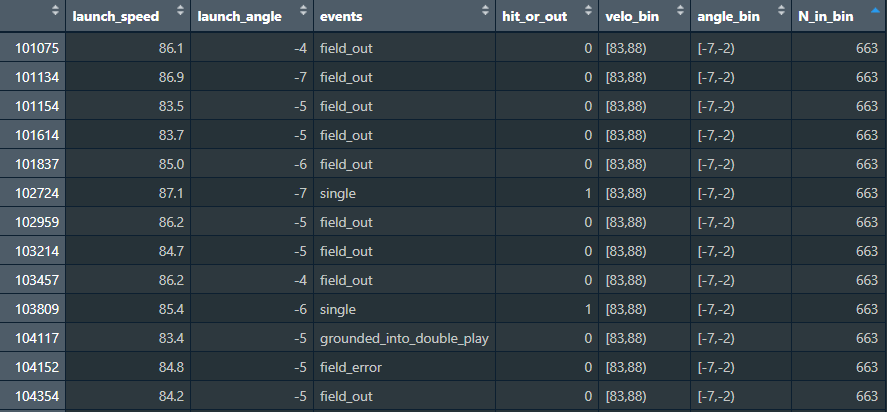

```{r setup, include=FALSE}
knitr::opts_chunk$set(out.width="100%", fig.align="center", fig.showtext=TRUE)
```

## Introduction

This project is part of a course in Data Visualization, from the Computational Social Sciences masters at UC3M. In the following lines, we will look at a data visualization, try to replicate it in RStudio and propose an alternative (ideally, improved) version of it. Our main toolbox will come from the ggplot2 package, aided by extensions like cowplot or gghexsize. Some data preparation will be necessary in both parts of the project, for which the tidyverse collection is always recommended.

```{r}
library(ggplot2)
library(tidyverse)
library(gghexsize)
library(cowplot)
library(magick)
```

## The Graph


This graph quickly caught my eye and, although it had gorgeous competitors, made it into my final choice. I liked how it gave an immediate and non-obvious answer to a critical question in baseball like "what is the ideal hit".

The resulting 'heatmap' explains what angle and speed combinations get more 'hits'. A 'hit' is any ball that is thrown into the game and results in the batter reaching at least first base. It is important to note that the plot refers to 'vertical' angle, that is, up and down from a horizontal line. The interesting shape drawn by the data makes sense, even against an absolute lack of baseball knowledge like mine: very fast balls tend to succeed, very slow balls tend to fail, and, in the middle, there is a 'sweet spot' where, if thrown straight enough, the ball is hard to catch. The reason why 'ground' balls have a low success rate may have to do with rules that are beyond my knowledge.

Another detail that deserves attention is how hexagon size variation doesn't seem to be random. Even if it doesn't say in the legend, it probably reflects a 'count' for each hexagon, that is, how many balls were thrown with that combination of angle and speed, independently of the result.

Not featuring a big amount of elements, the replication should be manageable. Thankfully, I found the right tool a few days into the task: the function 'geom_hextile', from the 'gghexsize' package gave me exactly what I needed, including control over the size of hexagons.

As for the improvement, it might be a challenge to find many flaws in such a neat graph. So let's get to it.

## The replication

The source for the data is mentioned in the graph: something called 'Statcast'. After a quick search, I discover it's part of a webpage called 'Baseball Savant', which allows anyone to get data from a huge database containing virtually every detail from every baseball game in the USA since 2011.

The first issue we find with this site is a restriction for downloads of 25,000 rows, so any query with an output larger than that would be incomplete. To dodge this, I had to break down the data into months and then merge them into a big dataset with 113,143 rows.

```{r, eval=FALSE}
# CREATING BIG DATASET
statcast_apr <- read.csv(file = "./savant_data mar apr.csv")
statcast_may <- read.csv(file = "./savant_data may.csv")
statcast_jun <- read.csv(file = "./savant_data jun.csv")
statcast_jul <- read.csv(file = "./savant_data jul.csv")
statcast_aug <- read.csv(file = "./savant_data aug.csv")
statcast_sep <- read.csv(file = "./savant_data sep oct.csv")

statcast_big <- rbind(statcast_apr, statcast_may, statcast_jun, statcast_jul, statcast_aug, statcast_sep)

```

Next, I created the hit/out variable by interpreting the 'events' column. I also filtered to keep only balls labeled as 'in play' (type = X), as they are the only ones that can qualify as 'hit' or 'out'.

```{r, eval=FALSE}
# CREATING THE HIT/OUT VARIABLE AGAIN. KEEPING ONLY RELEVANT COLUMNS
statcast_big_p <- statcast_big |> 
  filter(type == "X") |> 
  select(launch_speed, launch_angle, events) |> 
  mutate("hit_or_out" = if_else(events %in% c("single", 
                                              "double", 
                                              "triple", 
                                              "home_run"), 
                                1, 0))
```

```{r}
# GET PRE-FILTERED DATA
statcast_big_p <- read.csv(file = "./savant_data_filtered.csv.gz")
```

While testing out geom_hextile I found out there were some unusually red (hot) spots at the edges of the plot. I figured these were hexes with very low count that, by random chance, had a high prevalence of hits. Since this effect didn't show in the original, I figured that the authors had cropped the data, so I decided to do the same. This took some data processing: I binned angle and velocity into two new columns. I then grouped the data by these two bins and had a third column perform a count. This way, every ball was tagged with its two bins and the number of observations in that specific combination of bins.

```{r}
# 1. MAKING BINS AND COUNTING
statcast_final <- statcast_big_p |> 
  mutate(
    # Bin Launch Velocity (50 to 55, 55 to 60, etc.)
    velo_bin = cut(launch_speed, 
                   breaks = seq(floor(min(launch_speed, na.rm=TRUE)), 
                                ceiling(max(launch_speed, na.rm=TRUE)), 
                                by = 5), 
                   include.lowest = TRUE,
                   right = FALSE),
    
    # Bin Launch Angle (-10 to -5, -5 to 0, etc.)
    angle_bin = cut(launch_angle, 
                    breaks = seq(floor(min(launch_angle, na.rm=TRUE)), 
                                 ceiling(max(launch_angle, na.rm=TRUE)), 
                                 by = 5),
                    include.lowest = TRUE,
                    right = FALSE)
  ) |> group_by(velo_bin, angle_bin) |> 
  mutate(
    N_in_bin = n() # Total number of observations in this specific Velo/Angle bin
  ) |> 
  ungroup()

```



Finally, I set a threshold for nearly empty bins to be left out of the plot. A threshold of 80 proved to fix the problem without visible distortion of the data, as only 6% of observations were dropped.

```{r}
# 2. DROPPING BINS BELOW 80 OBSERVATIONS
statcast_filtered <- statcast_final |> 
  filter(N_in_bin > 80)

# Display the size reduction
message(paste("Original number of rows:", nrow(statcast_final)))
message(paste("Rows remaining after filtering:", nrow(statcast_filtered)))
message(paste("Number of rows removed:", nrow(statcast_final) - nrow(statcast_filtered)))

```

### Main plot

After some back and forth, I arrived to a result quite similar to the reference. As highlights, I will mention the fine-tuning of the five-point colour scale and the excruciating process of trial and error required to get the sizes and distances right.

```{r}
p <- ggplot(statcast_filtered, aes(launch_speed, launch_angle, z = hit_or_out)) +
  geom_hextile(fun = "mean", na.rm = TRUE, bins = 50) +
  
  scale_size_tile(limits = c(40, 100), max_size = 0.89) +  
  
  scale_fill_gradientn(
    colors = c(
      "#fffed4",
      "#f1ae64",
      "#d64639",
      "#b32d30",
      "#7a1b2a"
    ),
    values = scales::rescale(c(0, 50, 70, 85, 100))
  ) +
  lims(
    x = c(45, 120),
    y = c(-85, 75)) +
  
  theme_minimal() + 
  theme(
    plot.margin = margin(t = 1.5, r = 1, b = 1, l = 0.6, unit = "cm"),
    axis.title.y = element_text(angle = 0, vjust = 0.9, face = "bold", size = 10),
    axis.title.x = element_text(face = "bold", size = 10),
    axis.text = element_text(colour = "grey60"),
    legend.title = element_text(face = "bold"),
    legend.position = c(0.03, 1),
    legend.justification = "left",
    legend.margin = margin(b = 10, t = 10)
  ) +
  guides(
    size = "none",
    fill = guide_colorbar(
      title = "Hit probability",
      title.position = "top", 
      title.hjust = 0,           
      barwidth = unit(4.5, "cm"),   
      barheight = unit(0.2, "cm"), 
      label.position = "bottom",
      ticks = FALSE,
      label = FALSE,
      direction = "horizontal"
    )) +
  
  scale_x_continuous(name = "Hit speed", breaks=c(50, 80, 110),
                     labels = c("50", "80", "110 mph")) +
  scale_y_continuous(name = "Launch\n angle", breaks=c(-70, -35, 0, 35, 70),
                     labels = c("-70º", "-35º", "0º", "35º", "70º")) +
  coord_fixed(ratio = 0.75)

p
```

### Annotations

The rest of the annotations had to be done with a different method, since ggplot doesn't give much freedom around where to place objects. If an object is placed too close to the margins, the plot will rescale to keep it far from the edge. To go around this limitation, I used the 'cowplot' package, which lets you create a sort of 'canvas' where you can freely place plots, lines, text and images.

With this tool and an unreasonable amount of hours fixing the distances, I arrived at the final plot. To be completely honest, I decided to leave the text out, as it was the most quirky and unpredictable element, and keeping it both in its right place and properly wrapped proved to be well over my expertise.

```{r}
#| fig-width: 7
#| fig-height: 7
#| fig-align: center
#| preview: true

# BATTER ICON
batter_img <- image_read("batter.png")

# FINDING AVG ANGLE
angle_avg <- statcast_big_p |> 
  summarise("angle average" = mean(launch_angle))

p1 <- p +
  
  annotate("segment",       # Average line and text
           x = 45, xend = Inf,       
           y = 11.26, yend = 11.26,      
           color = "gray30") +
  annotate("text", 
           x = 55,             
           y = 8.5,      
           label = "2016 average 11.26º",   
           color = "gray50",   
           size = 3.1)

# --- BATTER ICON
ggdraw(p1) +
  draw_image(
    batter_img,
    x = -0.37,
    y = -0.05,
    scale = 0.09
  ) +
  # --- TOP ARROW (Fly balls) ---
  draw_line(
    x = c(0.165, 0.165),
    y = c(0.65, 0.69),
    color = "grey60",
    arrow = arrow(
      length = unit(0.13, "cm"),
      angle = 45
      )
  ) +
  draw_label(
    "Fly-\nballs",
    x = 0.18,     
    y = 0.6,   
    hjust = 1,      
    size = 10, color = "grey60", lineheight = 0.9
  ) +
  
  # --- BOTTOM ARROW (Ground balls) ---
  draw_line(
    x = c(0.165, 0.165),
    y = c(0.24, 0.2),  
    color = "grey60",
    arrow = arrow(
      length = unit(0.13, "cm"),
      angle = 45
      )
  ) +
  draw_label(
    "Ground-\nballs",
    x = 0.18, 
    y = 0.3, 
    hjust = 1,
    size = 10, color = "grey60", lineheight = 0.9
  ) +
  
  draw_label(    # legend subtext
    "More likely to result in a hit",
    x = 0.46, 
    y = 0.88, 
    hjust = 1,
    size = 9, color = "grey60", lineheight = 0.9
  ) +
  draw_line(     # subtext arrow
    x = c(0.475, 0.51),   
    y = c(0.88, 0.88),
    color = "grey60",
    arrow = arrow(
      length = unit(0.1, "cm"),
      type = "closed")
  )

```

## The improvement

The main improvement idea for the graph was to translate it into polar coordinates, to more accurately represent the 'Launch angle' variable. As I quickly learned, it's impossible to use geom_hextile with polar coordinates, and I couldn't get any tile count function to represent my data without losing important information, so I decided to try with a geom_point scatterplot that mapped one colour to 'hit' and another one to 'out'.

Since the point count is massive, a lot of information was being lost under the points that arbitrarily came out on top, so I figured out I should give points a very low opacity. This way, areas with high point density would show more intense colour, and areas with mixed scores (hits and outs) would have a mix of both colours. No data would be lost.

The first big issue to adress was the fact that coord_radial, the function I used for the polar coordinates, stretches the plot into a full circle even if the data doesn't cover 360 degrees. For my data to represent angles properly, I had to create fake points at -180º and 180º.

```{r}
statcast_aug <- statcast_big_p |> 
  add_row(launch_angle = 180) |>  
  add_row(launch_angle = -180) 

```

After that, I converted the hit_or_out variable from numerical to factor, so that it worked properly with geom_point. I also set the order I wanted to see in the legend and the proper labels.

```{r}

statcast_aug_factor <- statcast_aug |> 
  mutate(hit_or_out = factor(hit_or_out, 
                             levels = c(1, 0), 
                             labels = c("Hit", "Out")))

```

### Main plot

The key decisions for this plot, as commented below, were the following:

1.  Getting rid of default axes, labels and titles and creating my own using annotations. This allowed for more aesthetic freedom as well as freedom of placement.
2.  Playing with point size and transparency to reach the desired effect.
3.  Customizing the legend so that it showed full-opacity colours instead.

```{r}
#| fig-width: 7
#| fig-height: 7
#| fig-align: center
#| warning: false

p2 <- statcast_aug_factor |> 
  ggplot(aes(x = launch_speed, y = launch_angle, colour = hit_or_out)) +
  coord_radial(
    theta = "y", 
    start = 1.5707,
    direction = -1,
    clip = "off",
    expand = FALSE
  ) +
  geom_point(size = 1.2) +
  
  labs(
    x = "",                                                 # deleting axis labels
    y = ""                                                  # to add them manually
  ) +
  
  scale_color_manual(values = c("#00939b03", "#9b000003"),  # nearly transparent                                                               # colours to allow
                     labels = c("Hit", "Out"),              # overlap
                     na.translate = FALSE
  ) +
  
  guides(
    color = guide_legend(
      override.aes = list(alpha = 1, size = 2.7)            # altering how colours                                                             # are shown in the
    )) +                                                    # legend
  
  scale_y_continuous(
    expand = c(0, 0)
  ) +
  scale_x_continuous(
    limits = c(0, 125),
    expand = c(0, 0)
  ) +
  
  theme_void() +                                            # deleting everything 
  theme(                                                    # to add it back later
    legend.background = element_rect(fill = "transparent"),
    axis.text.y = element_blank(),
    axis.ticks.y = element_blank(),
    axis.text.x = element_blank(),
    axis.ticks.x = element_blank(),
    legend.title = element_blank(),
    legend.text = element_text(size = 15),
    legend.position = c(0.2, 0.8),
    plot.margin = margin(t = 0, r = 0, b = 0, l = 0, unit = "cm"),
    plot.background = element_rect(fill = "gray92"),
    panel.spacing = unit(0, "pt"),
    legend.margin = margin(t = 8, r = 8, b = 8, l = 8, unit = "pt")
  ) +
  
  annotate("segment", 
           x = c(40, 80, 120), xend = c(40, 80, 120),      # CIRCULAR AXES
           y = -90, yend = 90,
           color = "gray80", linetype = "dashed") +
  annotate("text",                                         # ANGLE LABELS
           x = 125,              
           y = c(-70, -35, 0, 35, 70),      
           label = c("-70º", "-35º", "0º", "35º", "70º"),  
           color = "gray50",  
           size = 3) +
  annotate("segment",                                      # RADIAL AXES
           x = 0, xend = 120,
           y = c(-70, -35, 0, 35, 70), yend = c(-70, -35, 0, 35, 70),   
           color = "gray30", linetype = "dotdash") +
  
  annotate("segment",                                      # AVERAGE LINE
           x = 20, xend = Inf,       
           y = 11.26, yend = 11.26,      
           color = "gray60",
           linetype = "dashed") +
  
  annotate("text",                                         # AVERAGE TEXT
           x = 41,             
           y = 18.5,      
           label = "2016 average",   
           color = "gray40",   
           size = 3.5,
           angle = 11.26) +
  
  annotate("text",                                         # CAPTION
           x = 105,             
           y = -135,      
           label = str_wrap("2016 US Baseball: 113k batted balls. 'Out' vs. 'Hit'.", width = 40),   
           color = "gray50",   
           size = 4.5,
           lineheight = 0.9)

p2
```

Finally, I added the remaining annotations on top of the plot with cowplot's 'ggdraw'. The first thing you can see is I had to create a whole different plot for a single arc, as apparently cowplot doesnt include a function for an arc, and the other alternative I found (ggforce) was even more cumbersome.

The rest is self-explanatory: labels and lines and a single image. This was by far the most lengthy step, as I had to wait about ten seconds for the plot to be drawn every time I made any minor adjustments. Since I adjusted sizes by trial and error, this took hours. There is a big takeaway here, which is to create a lightweight version of the dataset (only a few points covering the desired range) to minimize loading times. Another advance would be to figure out precisely how distances work through the different functions, with hopes that distances might be calculated once instead of guessed by trial and error.

```{r}
#| fig-width: 7
#| fig-height: 7
#| fig-align: center
#| warning: false

# Create radial frame for the arc
radial_df <- data.frame(
  point_id = 1:8,
  theta = seq(-180, 180, length.out = 9)[1:8],
  r = 120
)

# create a transparent plot for the arc
arc <- ggplot(radial_df) +
  geom_point(aes(r, theta), color = "#00000000") +
  coord_radial(
    theta = "y", 
    start = 1.5707,
    direction = -1,
    clip = "off",
    expand = FALSE
  ) +
  theme_void() +
  theme(
    panel.background = element_rect(fill = "transparent", colour = NA),
    plot.background = element_rect(fill = "transparent", colour = NA)
  ) +
  annotate("segment", 
           x = 160, xend = 160,      
           y = -80, yend = -45,      
           color = "gray10", linetype = "dotdash",
           arrow = arrow(
             length = unit(0.1, "cm"),
             type = "closed"))

ggdraw(p2) +
  
  draw_image(
    batter_img,
    x = -0.05,   
    y = 0.004,  
    scale = 0.09 
  ) +
  
  draw_plot(arc,
            hjust = -0.06,
            vjust = 0.03) +
  
  draw_text(
    "Launch Angle",
    x = 0.61,
    y = 0.09,
    color = "gray20"
  ) +
  draw_text(
    "Launch Speed",
    x = 0.4,
    y = 0.74,
    angle = 90,
    color = "gray20"
  ) +
  
  draw_line(
    x = c(0.435, 0.435),    # SPEED LABEL LINE
    y = c(0.6, 0.85), 
    color = "gray80",
    linetype = "dashed",
    arrow = arrow(
      length = unit(0.13, "cm"),
      type = "closed"
    )
  ) +
  
  draw_label(          # SPEED LABEL 1
    "40 -",
    x = 0.47, 
    y = 0.6365,
    size = 10, color = "grey60", lineheight = 0.9
  ) +
  
  draw_label(          # SPEED LABEL 2
    "80 -",
    x = 0.47, 
    y = 0.761,
    size = 10, color = "grey60", lineheight = 0.9
  ) +
  
  draw_label(          # SPEED LABEL 3
    "120 -",
    x = 0.47, 
    y = 0.887,
    size = 10, color = "grey60", lineheight = 0.9
  )

```

## Conclusions

Working on this project — and this course, at large — has made me develop a strong interest for data visualization, as a field that combines logical and mathematical skills with aesthetic sense, and that greatly fulfills an important communicative purpose if done right.

As with other computer-related fields, I am only learning how dauntingly complex it can get, and how fragmented information is, despite the community's best efforts to keep things up to date. It is possible to spend hours using the wrong tools, treading down a path that will prove useless later. It is certainly daunting to find out how many wrong ways there are to do anything, and one learns how important it is to know where to look and who to ask. The advent of AI has definitely helped with tasks like this, but, although it is more engaging than digging forums, its inaccuracy sometimes results in back and forth interactions that take even longer and, most importantly, don't provide us with real understanding unless we actively search for it.

I am grateful for this course and, at the same time, I wish it was longer and I could take more advantage of it, since having an expert to lay things down for you is a privilege that I might not have for a long time again. I am, however, very happy that I found this little world and I hope that, with time and tremendous efforts, I will get a good hang of it some day.
