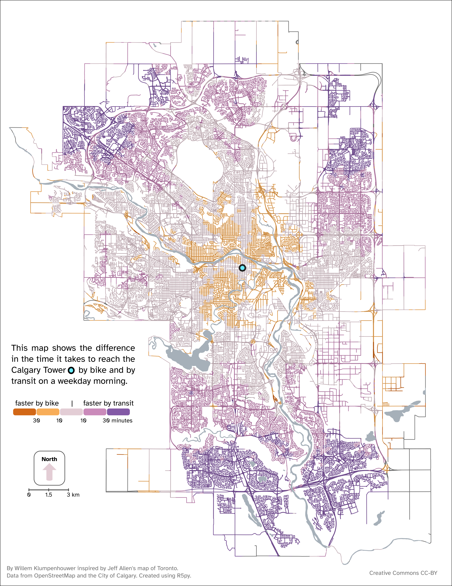

```{r setup, include = FALSE}
knitr::opts_chunk$set(out.width = "100%", fig.align = "center",
  fig.showtext = TRUE, fig.width = 5.143142, fig.height = 7)
```

## Introduction

How do we decide how we move around the city? For many commuters using sustainable transport modes the choice between cycling and public transit is influenced by a decisive factor: travel time.

Our project is structured around a data visualization created by Willem Klumpenhouwer, which compares travel times by bike and transit in the city of Calgary, the largest city in Alberta, Canada. The map shows the difference in the time it takes to get to Calgary Tower (one of the main landmarks in the city) by bike and by transit from any point of the city.

Beyond assisting individual commuters, this visualization serves as a diagnostic tool for policy makers. By mapping the relative competitiveness of sustainable transport modes across the entire city, it highlights spatial inequities in transit access and identifies neighborhoods where investments in infrastructure could be more needed or effective.

{.external width="100%"}

The data for the map was obtained from Open Street Maps. For bike travel times, the data is purely based on distance to Calgary Tower, and does not account for elevation. Transit travel time computes the entire duration of the trip (walking to the station or stop, waiting, riding, transferring, and walking to destination). To ensure consistency, the transit travel time for each point of the map was calculated every minute between 8:00 and 9:00 AM, using the median travel time for the map; this helps avoid outliers caused by specific schedule alignments, such as the significant time penalty of just missing a connection.

The goal of this project is, first, to replicate the original map as closely as possible, and second, to propose an alternative visualization of the same data.

## Set up libraries

We start by setting up the necessary libraries. Beyond `tidyverse` and `sf` for data manipulation and spatial operations, we rely on specific packages like `geojsonsf` to manipulate the data, `funkyheatmap`, `geosphere`, or `scales` to create the custom geometric elements required for the replication, and other libraries that aided us in building the alternative visualization. The chunk below includes a brief mention of what each library was used for:

```{r set_up_libraries}
library(tidyverse)
library(geojsonsf) # Used function geojson_sf to convert geojson into sf
library(sf) # Used function st_intersection to manipulate the data
library(funkyheatmap) # Used geom_rounded_rect to replicate rounded rectangles
library(geosphere) # To be able to calculate distances to plot the map scale
library(nngeo) # Used st_remove_holes to remove holes in the isochrones 
library(smoothr) # To smooth out the hexagonal borders of the isochrones
library(ggnewscale) # To reset scale colors
library(scales) # To define alpha in arguments where defaults don't allow it
library(ggtext) # To plot some text elements more easily, using less code
```

## Replica

### Loading the data

We reached Willem Klumpenhouwer, the author of the original plot, who kindly shared the data with which he built the original plot, helping us ensure an accurate replication. The data he provided consists of three .geojson files: 

- **`hexagons`** includes for variables: `geometry` (which contains polygons that form a hexagon grid of the map), `id` (an identification number for each hexagon), `b_travel_time` (travel time by bike from the centroid of each hexagon to Calgary Tower, in minutes), and `travel_time` (travel time by transit from the centroid of each hexagon to Calgary Tower, in minutes).

- **`all_roads_dissolved`**, a multilinestring feature that represents all roads in Calgary.

- **`water`** contains mulitpolygons with the geometry of some of the most relevant water bodies in the city of Calgary.

We converted the .geojson files into .csv to upload them following the project guidelines. The original .geojson files contained more columns than the .csv files below (like auxiliary ids used for calculations, or different kind of information about water bodies), but we kept only the necessary variables.


```{r load_data}
# Load the data:
hexagons <- read_csv("data/hexagons.csv")
roads <- read_csv("data/roads.csv")
water <- read_csv("data/water.csv")

# We restore the spatial geometry, specifying coordinate reference system: 
hexagons <- st_as_sf(hexagons, wkt = "WKT", crs = 4326) |> 
  rename(geometry = WKT) 
all_roads_dissolved <- st_as_sf(roads, wkt = "WKT", crs = 4326) |>
  rename(geometry = WKT)
water <- st_as_sf(water, wkt = "WKT", crs = 4326) |> 
  rename(geometry = WKT)
```

### Data transformation

The structure of the data allows for a relatively straightforward transformation process. The core task is to map the travel time data (stored in the hexagons) onto the road network (where it is visualized).

We achieve this by creating a spatial intersection between the hexagonal grid and the road network. This operation splits the road lines at the hexagon boundaries and assigns the corresponding hexagon attributes (ID and travel times) to each road segment.

```{r create_hexagons_roads_intersection}
hexroads_intersection <- st_intersection(all_roads_dissolved, hexagons)
```

Next, we compute the primary variable for the visualization: the difference in travel time. We bin these differences into five categorical levels to match the original map's legend.

```{r add_travel_time_difference}
# We are computing time_difference as time by bike minus time by transit. That means that:
# - negative numbers = faster by bike
# - positive numbers = faster by transit

hexroads_intersection <- hexroads_intersection |> 
  mutate(
    "time_difference" = b_travel_time - travel_time,
    "time_color" = case_when(
      time_difference <= -30 ~ "-2", # Bike 30 or more minutes faster
      time_difference <= -10 ~ "-1", # Bike 10 or more minutes faster (<30)
      time_difference < 10 ~ "0", # Between -10 and 10 (both not included)
      time_difference < 30 ~ "1", # Transit 10 or more minutes faster (<30)
      time_difference >= 30 ~ "2"), # Transit 30 or more minutes faster 
    "time_color" = fct( 
                   time_color, levels = c("-2", "-1", "0", "1", "2")))
```

With our data ready, we can start plotting.

### Plotting

#### Scaling ratio

Initially, we developed the replica using the exact pixel dimensions of the original map (25.2565 x 34.375 inches using default 96 dpi) in order to be able to replicate the sharpness in its elements and make it easier to compare overlapping the original and the replica using Gimp. However, after receiving feedback informing about storage constraints, we changed those values to comply with a significantly smaller file size. This meant that we needed to adjust many values (like line width, text size, etc.). 

Instead of manually recalculating everything, we introduced a scaling ratio (`sr`). This object captures the proportion between our new target height (7 inches) and the original height. By multiplying our aesthetic values by `sr`, we can dynamically scale the entire visualization while preserving the relative proportions of the original design. This method also allows for easier changes if we want to perform any size changes in the future.

```{r setup_scaling_ratio}
# Scaling ratio:
sr <- 7/34.375
```

#### Roads and water

We start by plotting the map with the road network adequately colored according to travel time differences. Notice that in the original map the water is plotted on top of the roads (we see there are no bridges over the rivers), we do the same in our replica.

```{r plot_roads_water}
calgary_replica <- ggplot() +
  
  # Roads
  geom_sf( 
    data = hexroads_intersection,
    aes(color = time_color),
    linewidth = 1.1 * sr, # We multiply by the scaling ratio, as explained above
    show.legend = FALSE
  ) +
  scale_color_manual(
    values = c(
      "-2" = "#aa5312", # bike >30 min faster
      "-1" = "#c88c47", # bike 10–30 min faster
      "0"  = "#b7a6ac", # similar travel time
      "1"  = "#a36f96", # transit 10–30 min faster
      "2"  = "#6a4886"  # transit >30 min faster
    )
  ) +
  
  # Water:
  geom_sf( 
    data = water,
    fill = "#a6b0b9",
    color = "#a6b0b9",
    linewidth = 1.1 * sr,
    ) +
  theme_void()

calgary_replica # To see it
```

#### Paragraph 

We will now add the introductory paragraph. This text block acts effectively as both a title and a descriptive legend, explaining the map's purpose and identifying the central blue point as the Calgary Tower.

To ensure a faithful replication, we used the online tool [*What the font?*](https://www.myfonts.com/pages/whatthefont) to identify the exact typography used in the original visualization: Atkinson Hyperlegible Next, which is available in [*Google Fonts*](https://fonts.google.com/specimen/Atkinson+Hyperlegible+Next).

```{r plot_paragraph}
# We add the font used in the original plot:
sysfonts::font_add_google(
  "Atkinson Hyperlegible Next",
  family = "atkinson",
  regular.wt = 400, 
  db_cache = FALSE) # Cache wasn't up to date, didn't include our typography,
                    # with FALSE we use the official, slower, but updated API.
showtext::showtext_auto()


# And then plot the paragraph:
calgary_replica <- calgary_replica + 
  
  # The text:
  annotate(
    "text",
    x = -114.3100, 
    y = 50.9790,
    label = paste("This map shows the difference",
                  "in the time it takes to reach the",
                  "Calgary Tower     by bike and by",
                  "transit on a weekday morning.",
                  sep="\n"),
    hjust = 0,
    family = "atkinson",
    size = 12.9 * sr,
    lineheight = 1.05,
    color = "#000000"
  ) + 
  
  # The blue point in the legend
   annotate(
    "point",
    x = -114.2400,
    y = 50.97495,  
    shape = 21,
    size = 8.25 * sr,
    color = "#000000",
    stroke = 4.1 * sr,
    fill = "#69eafe"
  ) +
  
  # The blue point in the map (Calgary Tower)
  annotate(  
    "point",
    x = -114.0631,
    y = 51.04465,
    shape = 21,
    size = 8.25 * sr,
    color = "#000000",
    stroke = 4.1 * sr,
    fill = "#69eafe"
  )
  
calgary_replica # To see it
```

#### Color legend

Now that we have the paragraph, we plot the color legend underneath it. It is a non-standard legend which isn't part of ggplot's defaults. So we need to create the geometries and text manually.

Since there is a lot of elements here, and we need to manually adjust everything to fit the original plot, decided to write the code in a way that makes it more convenient to use in the process of trial and error, by dividing it in three parts: a) *settings* where we define the needed values, b) *calculations* of coordinate values according to the values defined in settings (this allows us to avoid manually defining every single value needed), and c) the *plotting* according to the previous calculations.

```{r plot_color_legend}
# Settings:
# =========

# Rectangles:
rectangle_left <- -114.3080
rectangle_top <- 50.9490 
rectangle_width <- 0.0250
rectangle_height <- 0.0050
rectangle_space <- 0.0005
rectangle_fill <- c("#d26716", "#f8ad58", "#e3cdd5", "#ca8aba", "#8359a6")

# Faster by:
faster_separation <- 1 * sr # Relative to rectangle_height
faster_size <- (10 * sr) # For geom_text(size = faster_size)
faster_color <- "#000000"
faster_font <- "atkinson"

# Minutes:
minute_separation <- 1.5 # Relative to rectangle_height
minute_size <- (8 * sr) # For geom_text(size = minute_size)
minute_color <- "#000000"
minute_font <- "atkinson"


# Calculations:
#=============

# Tibble for legend rectangles:
legend_rectangles <- tibble(
  "xmin" = rectangle_left + (0:4) * (rectangle_width + rectangle_space),
  "xmax" = xmin + rectangle_width,
  "ymin" = rectangle_top - rectangle_height,
  "ymax" = rectangle_top
)

# Tibble for minutes (relative to rectangles):
legend_minutes <- tibble(
  "label" = c("30", "10", "10", "30", "   minutes"),
  "x" = c(
    rectangle_left + ((1:4)*rectangle_width) + ((0.5:3.5) * rectangle_space),
    rectangle_left + (4*rectangle_width) + (3.5*rectangle_space)),
  "y" = rectangle_top - rectangle_height * minute_separation,
  "hjust" = c(0.5, 0.5, 0.5, 0.5, 0) # All justified center, "minutes" left
)

# Tibble for "faster by" (relative to rectangles):
legend_faster <- tibble(
  "label" = c("faster by bike", "|", "faster by transit"),
  "x" = c(
    rectangle_left + (2*rectangle_width) + rectangle_space,
    rectangle_left + (2.5*rectangle_width) + (2.5*rectangle_space),
    rectangle_left + (3*rectangle_width) + (3*rectangle_space)),
  "y" = rectangle_top + rectangle_height * faster_separation,
  "hjust" = c(1, 0.5, 0) # Justified: right, center, left
)


# Plotting color legend:
# ======================
calgary_replica <- calgary_replica +

  # Rounded rectangles:
  geom_rounded_rect( # From package: funkyheatmap
    data = legend_rectangles,
    aes(xmin = xmin, xmax = xmax,
        ymin = ymin, ymax = ymax, 
        radius = 0.3),
    fill = rectangle_fill,
    color = NA,  # No border
    show.legend = FALSE
  ) +

  # Minutes:
  geom_text(
    data = legend_minutes,
    aes(x = x, y = y, hjust = hjust, label = label),
    size = minute_size,
    color = minute_color, 
    family = minute_font,
    vjust = 1
    ) +
  
  # Faster by:
  geom_text(
    data = legend_faster,
    aes(x = x, y = y, hjust = hjust, label = label),
    size = faster_size,
    color = faster_color,
    family = faster_font,
    vjust = 0
  )

calgary_replica # To see it
```

#### North arrow

Our map is only missing the spatial reference elements. We will start by plotting the arrow pointing North.

Once again, it is a non standard element. This means that default arrows do not work if we want a perfect replica. For example, the function `arrow()` inside `geom_segment(arrow = )` does not allow us to create an arrow that is at the same time as big as needed and as sharp (not rounded) as needed. There are packages like `ggspatial` that include functions to plot cardinal directions, but again, those do not fit our aesthetic needs. Thus, we need to create a custom arrow. An easy solution that will allow us to plot a big arrow with a sharp head and a rounded shaft is plotting a triangular polygon with a rounded rectangle on top.

To understand the code below, we must note that there is a weird behavior in `geom_rounded_rectangle()`: when line width increases, it plots undesired lines that do not follow the rounded rectangle shape. Which means that we cannot use a single `geom_rounded_rectangle()` without fill but with a contour line to to plot the box around the arrow. To overcome this, we plotted a black `geom_rounded_rectangle()` with a smaller white one on top to get the desired effect.

Again, since we're creating non-standard elements, we continue with our "Settings -> Calculations -> Plotting" workflow to facilitate the trial-and-error process. We also rely on relative values (defined in relation to existing shapes) rather than absolute coordinates, which makes the code significantly easier to read and modify compared to using absolute coordinates with many decimals.

```{r plot_north_arrow}
# Settings:
# =========

arrow_color <- "#e3cdd5"

# Arrow triangle:
triangle_mid_x <- -114.2680 # This will be the reference for the rest of xs
triangle_bottom_y <- 50.9067 # This will be the reference for the rest of ys

triangle_half_width <- 0.0076
triangle_height <- 0.0048

# Arrow rectangle:
arrow_rectangle_width <- 0.435 # Relative to triangle width
arrow_rectangle_height <- 1.495 # Relative to triangle height
arrow_rectangle_radius <- 0.24

# North text:
north_space <- 0.55 # Relative to triangle height, space 0 = arrow tip
north_size <- 9 * sr
north_color <- "black"

# Outer box:
box_width <- 2.22 # Relative to triangle width
box_height <- 2.45 # Relative to triangle height
box_radius <- 0.20
box_y_position <- 0.255 # Relative to triangle tip (measured in triangle height)
box_color <- "#575757"

# Border thickness (changes the size of the inner box, altering border size):
border_thickness <- 0.03 # Range 0-1 (0 = no border, 1 = full black box)
inner_box_color <- "white"


# Calculations:
# =============

# Tibble for arrow triangle (head):
triangle_polygon <- tibble(
  x = c(
    triangle_mid_x, # Tip x
    triangle_mid_x - triangle_half_width, # Left corner x
    triangle_mid_x + triangle_half_width # Right corner x
  ),
  y = c(
    triangle_bottom_y + triangle_height, # Tip y 
    triangle_bottom_y, # Left corner y
    triangle_bottom_y)) # Right corner y
  
# Tibble for arrow rectangle (shaft):
arrow_rectangle <- tibble(
  xmin = triangle_mid_x - (triangle_half_width*arrow_rectangle_width), # Left
  xmax = triangle_mid_x + (triangle_half_width*arrow_rectangle_width), # Right
  ymin = triangle_bottom_y - (triangle_height*arrow_rectangle_height), # Bottom
  ymax = triangle_bottom_y + (0.25*triangle_height)) # Top.   
                                                     # We add 0.25 of the
                                                     # triangle height to
                                                     # hide rounded edge on
                                                     # the rectangle top.

# Tibble for "north":
north <- tibble(
  label = "North",
  x = triangle_mid_x,
  y = triangle_bottom_y + triangle_height + north_space*triangle_height
)

# Tibble for outer box:
arrow_box <- tibble(
  "xmin" = triangle_mid_x - (triangle_half_width*box_width), # Left
  "xmax" = triangle_mid_x + (triangle_half_width*box_width), # Right
  "ymin" = triangle_bottom_y - (triangle_height*box_height) +
    (triangle_height*box_y_position), # Bottom
  "ymax" = triangle_bottom_y + (triangle_height*box_height) +
    (triangle_height*box_y_position)) # Top

# Tibble for inner box:
# We  first create an auxiliary object which we will add/substract to outer box:
box_vertical_border <- ((arrow_box$xmax - arrow_box$xmin)*border_thickness)/2 
box_horizontal_border <- ((arrow_box$ymax - arrow_box$ymin)*border_thickness)/2
# And then the tibble:
inner_box <- tibble(
  "xmin" = arrow_box$xmin + box_vertical_border,
  "xmax" = arrow_box$xmax - box_vertical_border,
  "ymin" = arrow_box$ymin + box_horizontal_border,
  "ymax" = arrow_box$ymax - box_horizontal_border
)


# Plotting north arrow:
# =====================

calgary_replica <- calgary_replica +
  
  # Outer box:
  geom_rounded_rect(
    data = arrow_box,
    aes(xmin = xmin, xmax = xmax,
        ymin = ymin, ymax = ymax),
    radius = box_radius,
    fill = box_color,
    color = NA
    ) +
  
  # Inner box:
  geom_rounded_rect(
    data = inner_box,
    aes(xmin = xmin, xmax = xmax,
        ymin = ymin, ymax = ymax),
    radius = box_radius,
    fill = inner_box_color,
    color = NA
    )+
  
  # Arrow head (triangle):
  geom_polygon( 
    data = triangle_polygon,
    aes(x = x, y = y),
    fill = arrow_color,
    color = NA
    ) + 
  
  # Arrow shaft (rectangle):
  geom_rounded_rect( 
    data = arrow_rectangle,
    aes(xmin = xmin, xmax = xmax,
        ymin = ymin, ymax = ymax),
    radius = arrow_rectangle_radius,
    fill = arrow_color,
    color= NA
    ) + 
  
  # "North" text:
  geom_text(
    data = north,
    aes(x = x, y = y, label = label),
    size = north_size,
    fontface = "bold",
    color = north_color, 
    family = "atkinson"
    )

calgary_replica # To see it
```

#### Scale  

As was the case with the North arrow, the scale bar is a non-standard element. Even specialized packages like `ggspatial` do not offer the specific design required for a faithful replica. Consequently, we build it manually using the same approach described above.

However, unlike the arbitrary positioning of the legend elements, the scale bar represents a physical reality: 3 kilometers. To make sure we get the proper length, we use `destPoint()` from package `geosphere`, which, as it documentation states: "given a start point, initial bearing (direction), and distance, this function computes the destination point travelling along a the shortest path on an ellipsoid (the geodesic)".

A distinct visual detail of the original map is that the vertical ticks are plotted over the horizontal line. We maintain this layering in our replica.

```{r plot_scale, layout="l-body-outset"}
# Settings:
# =========

# Horizontal line:
scale_length <- 3100 # In meters (we set it a bit longer so that the ends
                     # extend over the ticks as in the original)
scale_space <- 0.13 # Space between scale and box, proportion of box height
scale_thickness <- (2*sr) # For geom_segment(linewidth = )
scale_color <- "#676767"
  
# Ticks:
tick_distance <- 3000 # In meters, distance between the ticks at each end 
tick_length <- 0.08 # Proportion of the box height
tick_thickness <- (1.1*sr) # For geom_segment(linewidth = )
tick_color <- "#000000"

# Kilometers:
km_space <- 0.275 # Space between km and scale, proportion of box height
km_size <- (8 * sr) # For geom_text(size = )
km_font <- "atkinson"
km_color <- "#000000"


# Calculations:
# =============

# Auxiliary objects:
box_actual_width <- arrow_box$xmax - arrow_box$xmin
box_actual_height <- arrow_box$ymax - arrow_box$ymin
box_mid_x <- arrow_box$xmin + (box_actual_width/2)

# Calculate right end of the horizontal line:
scale_left <- as_tibble(destPoint(
  p = c( 
    box_mid_x, # Starting x
    arrow_box$ymin - box_actual_height*scale_space), # Starting y
  b = 90, # b = bearing in degrees
  d = -scale_length/2)) # d = distance in meters 

# Calculate left end of the horizontal line:
scale_right <- as_tibble(destPoint(
  p = c(box_mid_x, arrow_box$ymin - box_actual_height*scale_space), 
  b = 90,
  d = scale_length/2))

# Tibble for horizontal line:
scale_horizontal <- tibble(
  "x" = scale_left$lon, "xend" = scale_right$lon,
  "y" = scale_left$lat, "yend" = scale_left$lat)

# Calculate left tick:
tick_left <- as_tibble(destPoint(
  p = c(box_mid_x, arrow_box$ymin - box_actual_height*scale_space), 
  b = 90,
  d = -tick_distance/2))

# Calculate right tick:
tick_right <- as_tibble(destPoint(
  p = c(box_mid_x, arrow_box$ymin - box_actual_height*scale_space), 
  b = 90,
  d = tick_distance/2))

# Tibble for ticks:
tick <- tibble(
  "x" = c(tick_left$lon, box_mid_x, tick_right$lon),
  "xend" = c(tick_left$lon, box_mid_x, tick_right$lon),
  "y" = tick_left$lat - ((box_actual_height/2)*tick_length), 
  "yend" = tick_left$lat + ((box_actual_height/2)*tick_length))

# Tibble for kilometers:
km <- tibble(
  "label" = c("0", "1.5", "3", "  km"),
  "x" = c(scale_left$lon, box_mid_x, scale_right$lon, scale_right$lon),
  "y" = scale_left$lat - ((box_actual_height/2)*km_space),
  "hjust" = c(0.5, 0.5, 0.5, 0)) # All justified center, "kilometers" left


# Plotting scale:
# ===============

calgary_replica <- calgary_replica +
  
  # Ticks:
  geom_segment( 
    data = tick,
    aes(x = x, xend = xend, 
        y = y, yend = yend),
    linewidth = tick_thickness,
    color = tick_color
    ) +
  
  # Horizontal line:  
  geom_segment(
    data = scale_horizontal,
    aes(x = x, xend = xend, 
        y = y, yend = yend),
    linewidth = scale_thickness,
    color = scale_color
    ) +
  
  # Kilometers:
  geom_text(
    data = km,
    aes(x = x, y = y, hjust = hjust, label = label),
    size = km_size,
    color = km_color, 
    family = km_font
    )

calgary_replica # To see it
```

With the replica finished, we can move on to the alternative visualization.

## Alternative

While the original visualization effectively highlights the relative competitiveness of each mode, we identified two key opportunities for improvement:


  - First, the original map does not include information on absolute travel times. This is a critical piece of context for any potential user: for example, it is unlikely that someone chooses to travel by bike just because it is ten minutes faster; they probably want to know how long they will have to cycle to reach the destination. We will address this by adding isochrones that show the time it takes to get to Calgary Tower if the fastest travel mode is chosen.

  - Second, some of the people to whom we showed the original map struggled to read it quickly. This mainly has to do with the legend: although understandable, it is not very intuitive (requiring the user to read a long paragraph first). We will address this by simplifying the text and changing the legend's disposition. We believe that representing the colors vertically helps the user understand the data faster, since it mirrors the actual flow of the map (where the full scale of colors from orange to purple appears vertically from North to South). On top of that, we will add a small extra legend showing how to read an annotated example point.

In addition, we will carry out several specific refinements:
  
  - We will plot the roads on top of the water, to show where bridges are.
    
  - We will create a high-contrast dark version of the map.

  - To address data inconsistencies, we will plot only one color for roads where the bike is faster. The original map includes a dark orange category representing points where cycling is supposedly >30 minutes faster. However, many of these data points do not make sense—for example, when they appear immediately next to points from which transit is faster. This shouldn't be possible, especially over large areas; there should be a middle area where the bike is faster by 10–30 minutes, showing a progressive transition. We believe these inconsistencies are likely the result of flaws in r5py (which the author used to generate the data). Since we cannot discriminate between legitimate points and artifacts with the available data, we decided to merge all "bike is faster" areas under a single label. While not a perfect solution, it seems like a reasonable approach after visual inspection of the map.

### Data transformation:

The first step is to carry out some data transformation in order to compute the isochrones. For that, we add a new variable to hexagons containing binned data (in 20-minute intervals) representing the travel time if the fastest mode is chosen.

Why did we choose 20-minute bins? Why not 15 or 30? We found that this interval achieves a nice equilibrium between making the map informative and not overloading it with too many isochrone lines. We will create four areas: under 20', under 40', under 60', and 60' or more.

```{r calculate_isochrones}
hexagons2 <- hexagons |> 
  mutate(
    "fastest_travel_time" = case_when(
      b_travel_time > travel_time ~ travel_time,
      travel_time > b_travel_time ~ b_travel_time),
    "isochrones" = case_when(
      fastest_travel_time < 20 ~ 4,
      fastest_travel_time < 40 ~ 3,
      fastest_travel_time < 60 ~ 2,
      fastest_travel_time >= 60 ~ 1)) |> 
  filter(isochrones != 1)
```

We used the last filter in order not to get an area for the last "isochrone". Since it has an infinite maximum value, it would just represent the border of the map, which adds no information and would only create visual noise. 

The reason we gave the isochrones a decreasing order is because the lowest values are plotted first (at the bottom) and, given the transformations we perform in the next chunk, the larger areas include the areas inside them ---they are not doughnuts---. Since we want to color in a gradient from cyan to gray, we need the smaller areas to have the biggest number to be plotted last (on top), and appear more more vivid (which would not be the case if we plot a gray layer on top).

Having clarified this, we can can continue with the data transformation. We have the areas for the isochrones, but there are a few problems we need to solve. Firstly, because our areas are simply sets of individual hexagons, plotting them directly results in a "hexagon grid" effect:

```{r show_hexagon_grid_problem}
ggplot() +
  geom_sf(
    data = hexagons2, 
    aes(fill = isochrones),
    alpha = 0.5
    )
```

To resolve this, we need to dissolve the internal boundaries between adjacent hexagons of the same class. Using `group_by` followed by `summarise` is a simple solution to merge these features into single geometries.

```{r transform_isochrones_hexagon_grid_problem}
hexagons2 <- hexagons2 |>
  group_by(isochrones) |>
  summarise()
```

We now have isochrones that we can plot without the "hexagon grid" effect. However, there are two other problems: first, there are lots of holes in our isochrones. Second, the border of our isochrones follows straight lines with the shape of the hexagons, which would create visual noise if plotted on top of the roads. Let's remove the wholes and smooth out the isochrones:

```{r transform_isochrones_holes_and_smooth, warning=FALSE}
hexagons2 <- hexagons2 |>
  st_cast("POLYGON") |> # More on why we use st_cast() below 
  mutate("area" = st_area(geometry)) |>  # We calculate area of each polygon
  mutate("area" = as.numeric(area)) |> # Make numeric to be able to filter
  filter(area > 500000) |>  # We keep only the polygons with a big area (m2)
  st_remove_holes() |>  # Remove the holes
  smooth( # From package smoothr, to smooth the border of the isochrones
    method = "ksmooth",
    smoothness = 4)
```

Why did we use `st_cast`? Initially, we attempted `st_remove_holes()` from package `nngeo` directly. But it didn't work (the code did run, but we did not get the desired effect). The reason was that the geometry in our object `isochrones` is multipolygon, and `st_remove_holes()` removes the holes inside each of the "polygons" that form a multipolygon. 

Looking at an example from the function's documentation might help us convey what `st_remove_holes()` does:

```{r st_remove_holes_documentation_example, fig.width=10, fig.height=5}
opar = par(mfrow = c(1, 2))

# Example with 'sfg' - POLYGON
p1 = rbind(c(0,0), c(1,0), c(3,2), c(2,4), c(1,4), c(0,0))
p2 = rbind(c(1,1), c(1,2), c(2,2), c(1,1))
p3 = rbind(c(3,0), c(4,0), c(4,1), c(3,1), c(3,0))
p4 = rbind(c(3.3,0.3), c(3.8,0.3), c(3.8,0.8), c(3.3,0.8), c(3.3,0.3))[5:1,]
p5 = rbind(c(3,3), c(4,2), c(4,3), c(3,3))
mpol = st_multipolygon(list(list(p1,p2), list(p3,p4), list(p5)))
result = st_remove_holes(mpol)
plot(mpol, col = "#FF000033", main = "Before")
plot(result, col = "#FF000033", main = "After")
```
The issue is that `st_remove_holes()` alone does not solve our problem because many of the visual gaps in our isochrones are not technically "holes"—they are small, detached "islands" (separate polygons within a multipolygon). For example, small pockets of 60-minute travel time appearing inside a 40-minute zone look like holes, but strictly speaking, they are separate geometries.

That's why we use `st_cast()`: it divides the multipolygons into the polygons that form them. Once we have done that, we can filter by size ---removing the small polygons that look like holes---. This way we fix both the holes and the small "island" that look like holes. We are now ready to plot.

### Plotting

#### Roads, water, and isochrones

We begin plotting the roads, water, and isochrones. We will first plot the isochrones' areas, since they would alter the color of the roads if we plotted them on top of them. After that, the water, then the roads to make sure bridges are visible (unlike in the original map, where water was on top of roads), and finally the isochrones' border.

We have decided to plot water bodies using a light, contrasting color. We believe that rivers and lakes serve as critical visual landmarks, helping inhabitants of the city intuitively orient themselves and locate key places (like home or work) relative to these geographic features.

```{r plot_roads_water_isochrones}
alternative <- ggplot() +
  
# Isochrones' areas (no border yet)
  geom_sf(
    data = hexagons2, 
    aes(fill = isochrones),
    color = NA,
    alpha = 0.2,
    show.legend = FALSE
  ) + 
  scale_fill_gradient(low = "gray", # Outer isochrone
                      high = "cyan" # Inner isochrone
  ) +

# Water:
  geom_sf( #
    data = water,
    fill = "#b6b6b6",
    color = "#b6b6b6",
    linewidth = 1.1 * sr
  ) +

# Roads:
  geom_sf(
    data = hexroads_intersection,
    aes(color = time_color),
    linewidth = 0.6 * sr, # Thinner looks better with the isochrones
    show.legend = FALSE
  ) +
  scale_color_manual(values = c(
    "-2" = "#c88c47", # Color choice explained above
    "-1" = "#c88c47", # bike 10–30 min faster
    "0"  = "#b7a6ac", # similar travel time
    "1"  = "#a36f96", # transit 10–30 min faster
    "2"  = "#6a4886") # transit >30 min faster
  ) +

# Isochrones's borders:
  geom_sf(
    data = hexagons2, 
    color = alpha("#e5fcff", 0.7),
    fill = NA,
    alpha = 0,
    linewidth = 1 * sr
  ) +
  
  # Theming:
  theme_void() +
  theme( # To make the plot area and the whole image have black background
    plot.background = element_rect(fill = "black", color = NA),
    panel.background = element_rect(fill = "black", color = NA)
  )

alternative # To see it

```

#### A dissmissed legend option: lollipops

We spent quite some time trying various kind of legend for road colors. We will discuss only one of the dismissed alternatives: for a while, we considered using a "lollipop" style legend. We ultimately discarded it because the lollipop lines added unnecessary visual noise across the map, and the information they provided was redundant with the color of the dots themselves, as can be seen below:

```{r black_isochr_fastest_street_legend}
# Settings:
# =========

# Lines settings:
lines_width <- (1 * sr) # Lollipop lines width
lines_x_end <- -114.18  # Same outside x for all lines

yellow_line_y_end <- 50.980 # Yellow line line y end + text y + point y
gray_line_y_end <- 50.965
light_purple_line_y_end <- 50.950 # Light purple line y end + text y + point y
purple_line_y_end <- 50.935 # Purple line y end + text y + point y

dot_size <- (25 * sr) # Lollipop dot size
dot_stroke <- (2 * sr)
dot_stroke_color <- "white"

text_color <- "white" # Text color
text_family <- "atkinson" # Typography
text_size <- (10 * sr)
text_h_just <- 1 # 0 left, 0.5 center, 1 right
text_dot_space <- 0.0125 # Space between the text and the dots


# Plotting the legend:
#=====================

alternative + 
    
# Yellow streets
  annotate( # Yellow line
    "segment",
    x = -114.105,
    xend = lines_x_end,
    y = 51.03,
    yend = yellow_line_y_end,
    linewidth = lines_width,
    color = dot_stroke_color
  ) +
  annotate( # Yellow lollipop dot
    "point",
    x = lines_x_end,
    y = yellow_line_y_end,
    size = dot_size,
    shape = 21,
    fill = "#f8ad58",
    color = dot_stroke_color, # Border
    stroke = dot_stroke # Border stroke width
  ) +
  annotate( # Yellow text
    "text",
    label = "10-30' faster by bike",
    x = lines_x_end - text_dot_space,
    y = yellow_line_y_end,
    hjust = text_h_just,
    color = text_color,
    family = text_family,
    size = text_size
  ) +

# Gray streets
  annotate( # Gray line
    "segment",
    x = -114.125,
    xend = lines_x_end,
    y = 50.995,
    yend = gray_line_y_end,
    linewidth = lines_width,
    color = dot_stroke_color
  ) +
  annotate( # Gray lollipop dot
    "point",
    x = lines_x_end,
    y = gray_line_y_end,
    size = dot_size,
    shape = 21,
    fill = "#e3cdd5",
    color = dot_stroke_color, 
    stroke = dot_stroke 
  ) +
  annotate( # Gray area text
    "text",
    label = "similar travel time", # Standard label for gray
    x = lines_x_end - text_dot_space,
    y = gray_line_y_end,
    hjust = text_h_just,
    color = text_color,
    family = text_family,
    size = text_size
  ) +

# Light purple streets
  annotate( # Light purple  line
    "segment",
    x = -114.130,
    xend = lines_x_end,
    y = 50.94,
    yend = light_purple_line_y_end,
    linewidth = lines_width,
    color = dot_stroke_color
  ) +
  annotate( # Light purple lollipop dot
    "point",
    x = lines_x_end,
    y = light_purple_line_y_end,
    size = dot_size,
    shape = 21,
    fill = "#ca8aba",
    color = dot_stroke_color, 
    stroke = dot_stroke
  ) +
  annotate( # Light purple text
    "text",
    label = "10-30' faster by transit",
    x = lines_x_end - text_dot_space,
    y = light_purple_line_y_end,
    hjust = text_h_just,
    color = text_color,
    family = text_family,
    size = text_size
  ) +

# Purple streets
  annotate( # Purple line
    "segment",
    x = -114.110,
    xend = lines_x_end,
    y = 50.910,
    yend = purple_line_y_end,
    linewidth = lines_width,
    color = dot_stroke_color
  ) +
  annotate( # Purple lollipop dot
    "point",
    x = lines_x_end,
    y = purple_line_y_end,
    size = dot_size,
    shape = 21,
    fill = "#8359a6",
    color = dot_stroke_color, # Border
    stroke = dot_stroke # Border stroke width
  ) +
  annotate( # Purple text
    "text",
    label = "+30' faster by transit",
    x = lines_x_end - text_dot_space,
    y = purple_line_y_end,
    hjust = text_h_just,
    color = text_color,
    family = text_family,
    size = text_size
  )
```

#### Color legend

Instead of the lollipops, we decided to go with a legend that looks like the streets it represents.

As we discussed, one of the main issues with the original plot was that it was hard to understand the legend quickly. 

For our alternative proposal, we chose to plot thin vertical rectangles. The idea is that they visually resemble the roads they represent. Furthermore, the colors in the legend appear in the same direction and order as they do on the map itself (scanning from North to South reveals a gradient from Yellow to Purple). We believe this alignment allows for much faster cognitive processing of the map.

Since, once again, there's lots of manual work to do until we find pleasing values, we will use the same "Settings -> Calculations -> Plotting" approach we used above.

```{r plot_thin_vertical_squares}
# Settings:
# =========
v_rectangle_top_y <- 50.984
v_rectangle_mid_x <- -114.17
v_rectangle_width <- 0.002
v_rectangle_height <- 0.0145
v_rectangle_space <- 0.0005
v_rectangle_radius <- 0.3
v_rectangle_fill <- c("#c88c47", "#b7a6ac", "#a36f96", "#6a4886")


  
# Calculations:
# =============
v_rectangles <- tibble(
  "xmin" = v_rectangle_mid_x - (v_rectangle_width/2),
  "xmax" = v_rectangle_mid_x + (v_rectangle_width/2),
  "ymin" =
    v_rectangle_top_y - ((1:4)*v_rectangle_height) - ((0:3)*v_rectangle_space),
  "ymax" = v_rectangle_top_y - ((0:3)*(v_rectangle_height + v_rectangle_space))
  )


# Plotting the rectangles:
#=========================
alternative <- alternative +
  new_scale_fill() + # So that it doesn't affect the color of the isochrones
  geom_rounded_rect(
    data = v_rectangles,
    aes(xmin = xmin, xmax = xmax,
        ymin = ymin, ymax = ymax),
    fill = v_rectangle_fill,
    radius = v_rectangle_radius,
    show.legend = FALSE
  )

alternative # To see it
```

Next, we add a distinctive detail: "street arrows". These are pointers constructed from actual road geometries extracted from our map data. These arrows emerge from the thin rectangles (which act as "main streets") and point towards the descriptive text. This makes the legend more visible, reinforces the connection between the color and the road network, and adds a coherent aesthetic touch.

We used this code to find an adequate area of streets to use as arrow:

```{r find_streets_for_legend}
alternative + annotate(
    "polygon",
    x = c(c(-114.078, -114.078, -114.0631, -114.0631) # The sums allowed us to
          + (-0.054)),                                # quickly move around
    y = c(c(51.0445, 51.0455, 51.051, 51.039)         # the map looking for an
          + (-0.08385)),                              # area that we liked.
    color = "green",
    fill = NA,
    linewidth = 0.4)
```

Once we found the coordinates, we save them as a matrix, because that is the object later required by `st_polygon` 

```{r save_street_arrow_coordinates}
selected_coordinates <- as.matrix(
  tibble(
   "x" = c(c(-114.078, -114.078, -114.0631, -114.0631) + (-0.054)),
   "y" = c(c(51.0445, 51.0455, 51.051, 51.039) + (-0.08385))
   ) |> 
  slice(1:4, 1)) # We need to repeat the first row in fifth
                 # place to close the polygon
```

We can now create a polygon with those coordinates:

```{r create_polygon}
selected_polygon <- st_polygon(x = list(selected_coordinates))
```

Then select the corresponding area from 'hexagons by intersection':

```{r create_street_arrow_polygon}
# We need to specify that our object uses the same coordinate 
# reference system (crs), otherwise st_intersection doesn't work.
selected_polygon <- st_sfc(
  selected_polygon,
  crs = st_crs(all_roads_dissolved))

# We can now get the intersection:
selected_street <- st_intersection(all_roads_dissolved, selected_polygon)
```

Finally, we create a new object with this sf object substracting from its coordinates the coordinates of its centroid. This way, it will be easier to move (plot) repeatedly (we can put it wherever we want just by summing the coordinates that we want to make the centroid).

```{r create_street_arrow_polygon_template}
centroid <- st_centroid(st_union(selected_street))
street_arrow <- st_geometry(selected_street) - centroid
```

We now have our "street arrow" template, we are ready to plot it next to the vertical squares that act as "main roads":

```{r plot_street_arrows}
# Settings:
# =========
street_arrow_mid_x <- -0.0055 # From v_rectangle_mid_x
street_arrow_yellow_y <- 0 # From 1/2 height of the vertical rectangles
street_arrow_width <- 0.6 * sr


# Calculations:
# =============

# Yellow street arrow:
street_arrow_yellow <- street_arrow + c(
  v_rectangle_mid_x + street_arrow_mid_x,
  v_rectangle_top_y - (0.5*v_rectangle_height) + street_arrow_yellow_y)

# Gray street arrow:
street_arrow_gray <- street_arrow + c(
  v_rectangle_mid_x + street_arrow_mid_x,
  v_rectangle_top_y - ((1.5*v_rectangle_height) + v_rectangle_space) + street_arrow_yellow_y)

# Light purple street arrow:
street_arrow_light_purple <- street_arrow + c(
  v_rectangle_mid_x + street_arrow_mid_x,
  v_rectangle_top_y - ((2.5*v_rectangle_height) + (2*v_rectangle_space)) + street_arrow_yellow_y)

# Purple street arrow:
street_arrow_purple <- street_arrow + c(
  v_rectangle_mid_x + street_arrow_mid_x,
  v_rectangle_top_y - ((3.5*v_rectangle_height) + (3*v_rectangle_space)) + street_arrow_yellow_y)

# Assign crs to every arrow again:
street_arrow_yellow <- st_sfc(street_arrow_yellow,
                              crs = st_crs(all_roads_dissolved))

street_arrow_gray <- st_sfc(street_arrow_gray,
                            crs = st_crs(all_roads_dissolved))

street_arrow_light_purple <- st_sfc(street_arrow_light_purple,
                                    crs = st_crs(all_roads_dissolved))

street_arrow_purple <- st_sfc(street_arrow_purple,
                              crs = st_crs(all_roads_dissolved))


# Ploting street arrows:
#=======================

alternative <- alternative +
  geom_sf( 
    data = street_arrow_yellow,
    color = "#c88c47",
    linewidth = street_arrow_width
  ) +
  geom_sf(
    data = street_arrow_gray,
    color = "#b7a6ac",
    linewidth = street_arrow_width
  ) +
  geom_sf(
    data = street_arrow_light_purple,
    color = "#a36f96",
    linewidth = street_arrow_width
  ) +
  # 4. Purple Arrow
  geom_sf(
    data = street_arrow_purple,
    color = "#6a4886",
    linewidth = street_arrow_width
  )

alternative # To see it
```

We just need to add the text to finish the color legend. Even though we use more words than the original legend, we believe this format is faster to read (and allows us to simplify the main introductory paragraph into a concise question, which works better as a title for the plot).

```{r plot_color_legend_text}
# Settings:
# =========
v_rect_text_color <- "white"
v_rect_text_size <- 7.5 * sr
v_rect_text_family <- "atkinson"

v_rect_h_just <- 1 # Right
v_rect_text_h_space <- 0.020
v_rect_text_text <- c("10-30' faster by bike",
                      "similar travel time",
                      "10-30' faster by transit",
                      "+30' faster by transit")
  


# Calculations:
#==============
v_rect_text <- tibble(
  "x" = v_rectangle_mid_x - v_rect_text_h_space,
  "y" = v_rectangles$ymax - (v_rectangle_height/2),
  "label" = v_rect_text_text,
  "hjust" = v_rect_h_just
)


# Plot the text:
#===============
alternative <- alternative + 
  geom_text(
    data = v_rect_text,
    aes(x = x, y = y, hjust = hjust, label = label),
    size = v_rect_text_size,
    color = v_rect_text_color,
    family = v_rect_text_family)

alternative # To see it
```

Finally, we plot the short question that acts as a title explaining what the map represents, while also identifying central point as Calgary Tower.

```{r plot_question}
# Settings:
# =========

# Text:
question_text_x <- v_rectangle_mid_x + (v_rectangle_width/2)
question_text_y <- 50.9960
question_text_h_space <- 0 # Relative to vertical rectangles mid x

question_text_size <- 10 * sr
question_text_line_height <- 1.1
question_text_color <- "white" 
question_text_family <- "atkinson"
question_text_h_just <- 1 # Right alignment


# Blue point:
legend_blue_point_x <- -114.1875
legend_blue_point_y <- 50.9957

blue_point_size <- 4 * sr
blue_point_stroke <- 4.5 * sr
blue_point_fill <- "#61d7ea"
blue_point_color <- "white"


# Plotting the legend:
#=====================

alternative <- alternative + 
    
# The question text:
  annotate(
    "text",
    x = question_text_x,
    y = question_text_y,
    label = paste("What's the fastest way to get",
                  "to Calgary Tower     on a",
                  "weekday morning?",
                  sep = "\n"),
    hjust = question_text_h_just,
    family = question_text_family,
    size = question_text_size,
    color = question_text_color,
    lineheight = question_text_line_height
  ) +

# The blue point inside the question:
   annotate(  
    "point",
    x = legend_blue_point_x, 
    y = legend_blue_point_y,  
    shape = 21, 
    size = blue_point_size,
    fill = blue_point_fill,
    color = blue_point_color,
    stroke = blue_point_stroke
    ) +

# The blue point in the map (Calgary Tower):  
  annotate(
    "point",
    x = -114.0631, 
    y = 51.04465,
    shape = 21, 
    size = blue_point_size,
    fill = blue_point_fill,
    color = blue_point_color,
    stroke = blue_point_stroke
  )

alternative # To see it
```

#### Isochrones' legend

We still need a legend explaining what the transparent cyan areas are. Since isochrones are widely used, and most people already understand them without much explanation, we can be very concise, and use very few words. Our legend will include the minutes "within" the isochrone border. We achieve this effect by plotting a number inside a black point with a border of the same color as the isochrone border. We also include a small annotation explaining that these numbers represent minutes. While our informal testing suggested people guess the meaning of the numbers correctly without the text, we included it to remove any potential ambiguity.

```{r plot_isochrones_legend}
# Settings
# ========

# Point
iso_point_size <- 13.75 * sr
iso_point_fill <- "black"
iso_point_stroke_width <- 1.5 * sr
iso_point_stroke_color <- alpha("#e5fcff", 0.7)

# Text
iso_text_size <- 6.7 * sr
iso_text_color <- "white"

# Point and text position
x_20 <- -114.045
y_20 <- 51.0632

x_40 <- -114.0263
y_40 <- 51.082

x_60 <- -114.0096
y_60 <- 51.099


# Plot isochrones legend:
# =======================

alternative <- alternative + 
  
  # Small annotation:
  annotate( # The curve
    "curve",
    x = x_60 - 0.001, 
    y = y_60 + 0.001,
    xend = x_60 + 0.0020,
    yend = y_60 + 0.0065,
    curvature = 0.9,
    linewidth = 0.85 * sr,
    color = "white",
    arrow = arrow(angle = 30,
                  length = unit((0.1 * sr), "in"),
                  ends = "last",
                  type = "closed")
  ) +
  
  # Minutes by fastest mode text:
  annotate(
    "text",
    x = x_60 - 0.006,
    y = y_60 + 0.0092,
    label = "minutes\nby fastest\nmode",
    size = iso_text_size,
    lineheight = 0.85,
    vjust = 0.5,
    hjust = 0.5,
    color = iso_text_color,
    family = "atkinson"
  ) +
  
  # 20' point and text
  annotate(
   "point",
   x = x_20,
   y = y_20,
   size = iso_point_size,
   shape = 21,
   fill = iso_point_fill,
   #alpha = iso_point_alpha,
   stroke = iso_point_stroke_width,
   color = iso_point_stroke_color
 ) +
 annotate(
   "text",
   label = "20",
   x = x_20,
   y = y_20,
   size = iso_text_size,
   family = "atkinson",
   color = iso_text_color
 ) +

  # 40' point and text    
  annotate(
   "point",
   x = x_40,
   y = y_40,
   size = iso_point_size,
   shape = 21,
   fill = iso_point_fill,
   stroke = iso_point_stroke_width,
   color = iso_point_stroke_color
 ) +
 annotate(
   "text",
   label = "40",
   x = x_40,
   y = y_40,
   size = iso_text_size,
   family = "atkinson",
   color = iso_text_color
 ) +

 # 60' point and text
 annotate(
   "point",
   x = x_60,
   y = y_60,
   size = iso_point_size,
   shape = 21,
   fill = iso_point_fill,
   #alpha = iso_point_alpha,
   stroke = iso_point_stroke_width,
   color = iso_point_stroke_color
 ) +
 annotate(
   "text",
   label = "60",
   x = x_60,
   y = y_60,
   size = iso_text_size,
   family = "atkinson",
   color = iso_text_color
 )
  
alternative # To see it
```

#### Example point

As mentioned earlier, we will include a point with an example of how to read the map (street color and isochrone). We made use of the large empty space between the streets northwest of Calgary Tower to integrate this annotation organically.

```{r plot_example_point}
alternative <- alternative +
  
  # Text:
  annotate(
    "richtext",
    label = "Bike is faster and<br>travel takes under 40'",
    x = -114.109,
    y = 51.104,
    size = iso_text_size,
    vjust = 0,
    color = "white",
    family = "atkinson",
    fill = NA,
    label.color = NA
  ) +
  
  # Arrow:
  annotate(
    "curve",
    x = -114.107,
    y = 51.106,
    xend = -114.085,
    yend = 51.0935,
    curvature = 0.5,
    linewidth = 0.7 * sr,
    color = "white",
    arrow = arrow(angle = 30,
                  length = unit((0.1 * sr), "in"),
                  ends = "first",
                  type = "closed")
  ) +
  
  # Map dot:
  annotate( 
    "point",
    x = -114.085,
    y = 51.0935,
    shape = 21,
    size = 5 * sr,
    stroke = 2 * sr,
    fill = "#f8ad58",  
    color = "white" 
  ) 

alternative
```

#### Isochrone islands explanation

We also added an annotation to explain a phenomenon visible in the map, which may confuse some users: "islands" of faster travel time disconnected from the main isochrones. These are caused by the presence of transit stations.

```{r plot_isochrone_island_explanation}
alternative <- alternative +
  
  # Text:
  annotate(
    "richtext",
    label = "The presence of transit stations can<br>
            create islands of faster travel time",
    x = -114.085,
    y = 50.868,
    size = 7 * sr,
    vjust = 0.5,
    hjust = 1,
    color = "white",
    family = "atkinson",
    fill = NA,
    label.color = NA
  ) +
  
  # Arrow:
  annotate(
    "curve",
    x = -114.085,
    y = 50.8688,
    xend = -114.074,
    yend = 50.877,
    curvature = 0.3,
    linewidth = 0.7 * sr,
    color = "white",
    arrow = arrow(angle = 30,
                  length = unit((0.1 * sr), "in"),
                  ends = "first",
                  type = "closed")
  ) 

alternative # To see it
```

#### North arrow

We felt the North arrow had a too prominent role in the original map. Most local users can orient themselves via the river or major roads, and cardinal directions are rarely the primary mental model for navigating a city by bike or transit.

To give it a more appropriate secondary role, we reduced its size, moved it to the bottom right (following the natural "top-left to bottom-right" reading flow), and changed the color scheme to a subtle white-on-black to match the dark theme.

```{r plot_north_arrow_alternative}
# Settings:
# =========
# Arrow:
arrow_color <- "white"
# Arrow triangle 
triangle_mid_x <- -113.8825 
triangle_half_width <- 0.003325
triangle_bottom_y <- 50.8600 #Master
triangle_height <- 0.0021
# Arrow rectangle:
arrow_rectangle_width <- 0.455 # Relative to triangle width
arrow_rectangle_height <- 1.495 # Relative to triangle height
arrow_rectangle_radius <- 0.24 

# North text:
north_space <- 0.75 # Relative to triangle height
north_size <- 6 * sr
north_color <- "white"

# Outer box:
box_width <- 2.40 # Relative to triangle width
box_height <- 2.75 # Relative to triangle height
box_radius <- 0.20
box_y_position <- 0.255 # Relative to triangle tip (measured in triangle height)
box_color <- "white"

# Border thickness (i will use this to change size of inner box):
border_thickness <- (0.3 * sr) # Range 0-1 (no border, full black box).
inner_box_color <- "black"


# Calculations:
# =============

# Tibble for arrow triangle (head):
triangle_polygon <- tibble(
  x = c(
    triangle_mid_x, # Tip x
    triangle_mid_x - triangle_half_width, # Left corner x
    triangle_mid_x + triangle_half_width # Right corner x
  ),
  y = c(
    triangle_bottom_y + triangle_height, # Tip y 
    triangle_bottom_y, # Left corner y
    triangle_bottom_y)) # Right corner y
  
# Tibble for arrow rectangle (shaft):
arrow_rectangle <- tibble(
  xmin = triangle_mid_x - (triangle_half_width*arrow_rectangle_width), # Left
  xmax = triangle_mid_x + (triangle_half_width*arrow_rectangle_width), # Right
  ymin = triangle_bottom_y - (triangle_height*arrow_rectangle_height), # Bottom
  ymax = triangle_bottom_y + (0.25*triangle_height)) # Top.   
                                                     # We add 0.25 of the
                                                     # triangle height to
                                                     # hide rounded edge on
                                                     # the rectangle top.
  
# Tibble for "north":
north <- tibble(
  label = "North",
  x = triangle_mid_x,
  y = triangle_bottom_y + triangle_height + north_space*triangle_height
)

# Tibble for outer box:
arrow_box <- tibble(
  "xmin" = triangle_mid_x - (triangle_half_width*box_width), # Left
  "xmax" = triangle_mid_x + (triangle_half_width*box_width), # Right
  "ymin" = triangle_bottom_y - (triangle_height*box_height) +
    (triangle_height*box_y_position), # Bottom
  "ymax" = triangle_bottom_y + (triangle_height*box_height) +
    (triangle_height*box_y_position)) # Top

# Tibble for inner box:
# We  first create an auxiliary object which we will add/substract to outer box:
box_vertical_border <- ((arrow_box$xmax - arrow_box$xmin)*border_thickness)/2 
box_horizontal_border <- ((arrow_box$ymax - arrow_box$ymin)*border_thickness)/2
# And then the tibble:
inner_box <- tibble(
  "xmin" = arrow_box$xmin + box_vertical_border,
  "xmax" = arrow_box$xmax - box_vertical_border,
  "ymin" = arrow_box$ymin + box_horizontal_border,
  "ymax" = arrow_box$ymax - box_horizontal_border
)


# Plotting north arrow:
# =====================
alternative <- alternative +
  
  # Outer box (for border effect):
  geom_rounded_rect(
    data = arrow_box,
    aes(xmin = xmin, xmax = xmax,
        ymin = ymin, ymax = ymax),
    radius = box_radius,
    fill = box_color,
    color = NA
    ) +
  
  # Inner box (for border effect):
  geom_rounded_rect(
    data = inner_box,
    aes(xmin = xmin, xmax = xmax,
        ymin = ymin, ymax = ymax),
    radius = box_radius,
    fill = inner_box_color,
    color = NA
    )+
  
  # Arrow triangle:
  geom_polygon(
    data = triangle_polygon,
    aes(x = x, y = y),
    fill = arrow_color,
    color = NA 
    ) + 
  
  # Arrow body:
  geom_rounded_rect(
    data = arrow_rectangle,
    aes(xmin = xmin, xmax = xmax,
        ymin = ymin, ymax = ymax),
    radius = arrow_rectangle_radius,
    fill = arrow_color,
    color= NA # No border
    ) + 
  
  # "North" text:
  geom_text(
    data = north,
    aes(x = x, y = y, label = label),
    size = north_size,
    color = north_color, 
    family = "atkinson",
    fontface = "bold"
    )

alternative # To see it
```

#### Scale

Finally, we add the scale. Since the North arrow is now smaller, the scale must also be reduced to maintain visual balance. We adjusted the represented distance to 2km (from 3km) to fit these new dimensions.

```{r plot_alternative_final, layout="l-body-outset", preview=TRUE}
# Settings:
# =========
# Horizontal line:
scale_length <- 2000 # In meters
scale_space <- 0.25 # Space between line and box, proportion of box width
scale_color <- "white"
scale_thickness <- (1.3 * sr) # For geom_segment(linedwidth = )
  
# Ticks:
tick_length <- 0.15 # Proportion of the box height
tick_color <- "white"
tick_thickness <- (1.3 * sr) # For geom_segment(linewidth = )

# Kilometers:
km_space <- 0.6 # Space between km and scale, proportion of box height
km_size <- (7 * sr) # For geom_text(size =)
km_color <- "white"
km_font <- "atkinson"


# Calculations:
# =============

# Auxiliary objects:
box_actual_width <- arrow_box$xmax - arrow_box$xmin #
box_actual_height <- arrow_box$ymax - arrow_box$ymin
box_mid_x <- arrow_box$xmin + (box_actual_width/2)

# Scale left end:
scale_left <- as_tibble(destPoint(
  p = c(box_mid_x,  # Starting x 
        arrow_box$ymin - box_actual_height*scale_space), # Starting y 
  b = 90, # b = bearing in degrees
  d = -scale_length/2)) # d = distance in meters 

# Scale right end:
scale_right <- as_tibble(destPoint(
  p = c(box_mid_x,  # Starting x 
        arrow_box$ymin - box_actual_height*scale_space), # Starting y 
  b = 90, # b = bearing in degrees
  d = scale_length/2)) # d = distance in meters 

# Scale horizontal line:
scale_horizontal <- tibble(
  "x" = scale_left$lon, "xend" = scale_right$lon,
  "y" = scale_left$lat, "yend" = scale_left$lat)

# Tibble for ticks:
tick <- tibble(
  "x" = c(scale_left$lon, box_mid_x, scale_right$lon),
  "xend" = c(scale_left$lon, box_mid_x, scale_right$lon),
  "y" = scale_left$lat - ((box_actual_height/2)*tick_length), 
  "yend" = scale_left$lat + ((box_actual_height/2)*tick_length))

# Tibble for kms:
km <- tibble(
  "label" = c("0", "1", "2", "  km"),
  "x" = c(scale_left$lon, box_mid_x, scale_right$lon, scale_right$lon),
  "y" = scale_left$lat - ((box_actual_height/2)*km_space),
  "hjust" = c(0.5, 0.5, 0.5, 0)) # All justified center, "kilometers" left


# Plotting scale:
# ===============

alternative <- alternative +
  
  # Horizontal line
  geom_segment(
    data = scale_horizontal,
    aes(x = x, xend = xend, 
        y = y, yend = yend),
    linewidth = scale_thickness,
    color = scale_color
    ) +
  
  # Ticks:
  geom_segment(
    data = tick,
    aes(x = x, xend = xend, 
        y = y, yend = yend),
    linewidth = tick_thickness,
    color = tick_color
    ) +
  
  # Kilometers:
  geom_text(
    data = km,
    aes(x = x, y = y, hjust = hjust, label = label),
    size = km_size,
    color = km_color, 
    family = km_font)

alternative # To see it
```

This is our final alternative visualization. It combines the best parts of the original map ---the use of the road network to represent time differences, a strong color scheme, and water bodies as visual hints--- with absolute travel times via isochrones, giving users a complete picture of their commute. We also redesigned the legend to be more intuitive and faster to read, cleaned up the noise in the bike data, and added helpful annotations. Now, any user can quickly answer the question: "What's the fastest way to get to Calgary Tower?"
