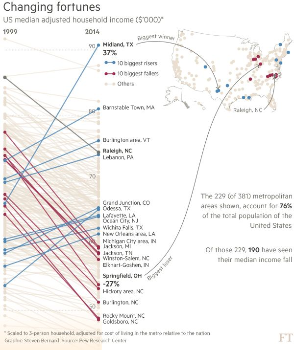

```{r original chunk, include=FALSE}
knitr::opts_chunk$set(out.width="100%", fig.align="center", fig.showtext=TRUE)
```

## Introduction

In this project, I will walk you through all the necessary steps to replicate and eventually improve a graph, trying to think of different ways to visualize data. 

This project is linked to our course on Data Visualization as part of our Computational Social Science master at Carlos III de Madrid. We were asked to choose a challenging graph to replicate. Therefore, I have chosen to replicate a graph from the Financial Times called "Changing Fortunes", while the data is from the Pew Research Center, a nonpartisan fact tank that informs the public about the issues, attitudes and trends shaping the world. 

The reason why I chose this graph is because in the recent years there has been more and more talk regarding a sharp increase in inequality, a decrease in affordability, and a shrinkage of the so-called "middle class" and this, however, is not a recent issue. The data and the graph give us information about a sharp decrease on average median household income in the Unites States of America from 1999 to 2014.

```{r echo=FALSE, out.width="100%", fig.align="center"}

```

<p style="font-size: 12px; color: gray; margin-top: -10px;">
Original graph. Figure from <a href="https://www.ft.com/content/a8e9f23c-1695-11e6-9d98-00386a18e39d#axzz48U6PcY6s" target="_blank">Financial Times</a>
</p>

## The Original Graph - Explained

The original graph showcases on the left hand side a classic Slope Chart where I have the difference in average median household income in thousands of US dollars for the main metropolitan areas in the USA. Highlighted I have in blue lines the biggest 10 risers (the metropolitan areas that saw their median income increase the most), in red lines the biggest 10 fallers (the metropolitan areas that saw their median income decrease the most), and in a grey line Raleigh, NC which is highlighted because it was named in the main article of the Financial Times, and it was the main protagonist of this story that they were trying to tell.

On the top right hand corner, I have a map of the USA where I have all the metropolitan areas and their geographical location and in the same colors of the slope I also have the biggest 10 risers, 10 biggest fallers, and Raleigh, NC. The biggest "Winner", biggest "Loser" and "Raleigh, NC" are also specified by an arrow that start from the slope chart and point at their location.

I also have an informative text box on the right side and a legend at the bottom left corner.

## Replication 

### Loading Libraries, Fonts and Data

The following libraries are used for the graph replication and the graph improvement.

```{r libraries, fig.showtext=TRUE}
library(tidyverse)
library(ggrepel)
library(maps)
library(sf)
library(usmap)
library(tidygeocoder)
library(ggtext)
library(cowplot)
library(geomtextpath)
library(sysfonts)
library(showtext)
library(readxl)
```

Here I have the font that I are going to use. One first limitation in our reproduction is that the Financial Times uses a font called "Financier" that is not open source.

```{r font, fig.showtext=TRUE}
# LOAD CUSTOM FONT
sysfonts::font_add_google(name = "Open Sans", family = "open-sans")
showtext::showtext_auto()
showtext::showtext_opts(dpi = 300)
```

Here is the data in the form of a .csv file that was kindly given to me by the people at the Pew Research Center.

```{r data, fig.showtext=TRUE}
# READ AND PREPARE THE DATA
data <- read.csv2("Clean_Median_Data.csv", sep = ";")
```

### Data Preparation

In this section, I prepared the data for visualization by converting income values to numeric format and calculating both absolute and percentage changes in median household income between 1999 and 2014.  

```{r data preparation, fig.showtext=TRUE}
data <- data |> 
  mutate(
    Median_1999 = as.numeric(Median_1999),
    Median_2014 = as.numeric(Median_2014),
    change = Median_2014 - Median_1999,
    pct_change = ((Median_2014 - Median_1999) / Median_1999) * 100
  )
```

Then, I identified the top 10 metropolitan areas with the highest increase and decrease in median income, as well as highlighted Raleigh, NC.

```{r top 10, fig.showtext=TRUE}
# Identify top 10 risers and fallers
top_risers <- data |> 
  arrange(desc(pct_change)) |> 
  head(10) |> 
  pull(X)

top_fallers <- data |> 
  arrange(desc(pct_change)) |> 
  tail(10) |> 
  pull(X)

raleigh <- data |> 
  filter(X == "Raleigh, NC")
```

Here, I categorized each metropolitan area according to their status of riser, faller, Raleigh, and other. Then I applied pivot_longer so that I could create the slope charts that show income trends over time without any potential issues.

```{r categories, fig.showtext=TRUE}
# Add category column
data <- data |> 
  mutate(category = case_when(
    X %in% top_risers ~ "riser",
    X %in% top_fallers ~ "faller",
    X %in% raleigh ~ "Raleigh",
    TRUE ~ "other"
  ))

# Prepare data for plotting (long format)
plot_data <- data |> 
  select(X, Median_1999, Median_2014, category, pct_change) |> 
  pivot_longer(cols = c(Median_1999, Median_2014),
               names_to = "year",
               values_to = "income") |> 
  mutate(year_num = ifelse(year == "Median_1999", 1999, 2014))
```

### Create The Main Slope Chart

Here is where I built the slope chart, which is the core visualization of this project. After some trial and error, I layered the the plot thinking about in which order to place the lines. First, the dotted lines that you can see in the original graph, signalling the various important median income whole numbers (50, 60, 70, 80, and 90). Then the actual slope lines. Firstly, the background lines for "other" metros, then overlaying highlighted lines and points for the biggest risers (blue), biggest fallers (red), and Raleigh (gray). Then, I had to manually position each label with the city names (21 in total), the axis annotations and the little legend in the top right corner of the slope chart, trying to somewhat replicate the Financial Times aesthetics.

```{r create slope chart, fig.width=6, fig.height=7.16, fig.showtext=TRUE}
main_plot <- ggplot(plot_data, aes(x = year_num, y = income, group = X)) +
  
  # Manual dotted grid lines
  annotate("segment", x = 1999, xend = 2014, y = 50, yend = 50,
           color = "gray85", linetype = "dotted", linewidth = 0.3) +
  annotate("segment", x = 1999, xend = 2014, y = 60, yend = 60,
           color = "gray85", linetype = "dotted", linewidth = 0.3) +
  annotate("segment", x = 1999, xend = 2014, y = 70, yend = 70,
           color = "gray85", linetype = "dotted", linewidth = 0.3) +
  annotate("segment", x = 1999, xend = 2014, y = 80, yend = 80,
           color = "gray85", linetype = "dotted", linewidth = 0.3) +
  annotate("segment", x = 1999, xend = 2014, y = 90, yend = 90,
           color = "gray85", linetype = "dotted", linewidth = 0.3) +
  
  # Background lines for "others"
  geom_line(data = plot_data |>  filter(category == "other"),
            color = "#F2DFCE", size = 0.6, alpha = 0.4) +
  
  # Lines for top fallers (red)
  geom_line(data = plot_data |>  filter(category == "faller"),
            color = "#9D2B4D", size = 0.6) +
  
  # Lines for top risers (blue)
  geom_line(data = plot_data |>  filter(category == "riser"),
            color = "#477FB0", size = 0.6) +
  
  # Line for Raleigh (gray)
  geom_line(data = plot_data |>  filter(category == "Raleigh"),
            color = "#757472", size = 0.6) +
  
  # POINTS "other" (bottom)
  geom_point(data = plot_data |>  filter(category == "other"),
             color = "#EAE3DD", size = 1.3, alpha = 0.6) +
  
  # POINTS fallers (on top of others)
  geom_point(data = plot_data |>  filter(category == "faller"),
             color = "#9D2B4D", size = 1.3) +
  
  # POINTS risers (on top of others)
  geom_point(data = plot_data |>  filter(category == "riser"),
             color = "#477FB0", size = 1.3) +
  
  # POINT Raleigh
  geom_point(data = plot_data %>% filter(category == "Raleigh"),
             color = "#757472", size = 1.5) +
  
  # Metropolitan cities Labels
  annotate("text", x = 2014.5, y = 90.743, label = "Midland, TX", 
           hjust = 0, size = 2.7, color = "#5d5d5c", fontface = "bold") +
  annotate("text", x = 2014.5, y = 89.5, label = "37%", 
           hjust = 0, size = 3.5, color = "#5d5d5c", fontface = "bold") +
  annotate("text", x = 2014.5, y = 80.966, label = "Barnstable Town, MA", 
           hjust = 0, size = 2.7, color = "#5d5d5c") +
  annotate("text", x = 2014.5, y = 76.074, label = "Burlington area, VT", 
           hjust = 0, size = 2.7, color = "#5d5d5c") +
  annotate("text", x = 2014.5, y = 74.5, label = "Raleigh, NC", 
           hjust = 0, size = 2.7, color = "#5d5d5c", fontface = "bold") +
  annotate("text", x = 2014.5, y = 73.5, label = "Lebanon, PA", 
           hjust = 0, size = 2.7, color = "#5d5d5c") +
  annotate("text", x = 2014.5, y = 66.6, label = "Grand Junction, CO", 
           hjust = 0, size = 2.7, color = "#5d5d5c") +
  annotate("text", x = 2014.5, y = 65.6, label = "Odessa, TX", 
           hjust = 0, size = 2.7, color = "#5d5d5c") +
  annotate("text", x = 2014.5, y = 64.6, label = "Lafayette, LA", 
           hjust = 0, size = 2.7, color = "#5d5d5c") +
  annotate("text", x = 2014.5, y = 63.6, label = "Ocean City, NJ", 
           hjust = 0, size = 2.7, color = "#5d5d5c") +
  annotate("text", x = 2014.5, y = 62.6, label = "Wichita Falls, TX", 
           hjust = 0, size = 2.7, color = "#5d5d5c") +
  annotate("text", x = 2014.5, y = 61.6, label = "New Orleans area, LA", 
           hjust = 0, size = 2.7, color = "#5d5d5c") +
  annotate("text", x = 2014.5, y = 60.2, label = "Michigan City Area, IN", 
           hjust = 0, size = 2.7, color = "#5d5d5c") +
  annotate("text", x = 2014.5, y = 59.35, label = "Jackson, MI", 
           hjust = 0, size = 2.7, color = "#5d5d5c") +
  annotate("text", x = 2014.5, y = 58.3, label = "Jackson, TN", 
           hjust = 0, size = 2.7, color = "#5d5d5c") +
  annotate("text", x = 2014.5, y = 57.38, label = "Winston-Salem, NC", 
           hjust = 0, size = 2.7, color = "#5d5d5c") +
  annotate("text", x = 2014.5, y = 56.45, label = "Elkhart-Goshen, IN", 
           hjust = 0, size = 2.7, color = "#5d5d5c") +
  annotate("text", x = 2014.5, y = 55.2, label = "Springfield, OH", 
           hjust = 0, size = 2.7, color = "#5d5d5c", fontface = "bold") +
  annotate("text", x = 2014.5, y = 53.957, label = "-27%", 
           hjust = 0, size = 3.5, color = "#5d5d5c", fontface = "bold") +
  annotate("text", x = 2014.5, y = 52.8, label = "Hickory area, NC", 
           hjust = 0, size = 2.7, color = "#5d5d5c") +
  annotate("text", x = 2014.5, y = 51.278, label = "Burlington, NC", 
           hjust = 0, size = 2.7, color = "#5d5d5c") +
  annotate("text", x = 2014.5, y = 49.2, label = "Rocky Mount, NC", 
           hjust = 0, size = 2.7, color = "#5d5d5c") +
  annotate("text", x = 2014.5, y = 48.2, label = "Goldsboro, NC", 
           hjust = 0, size = 2.7, color = "#5d5d5c") +
  
  # y-axis numbers
  annotate("text", x = 2013.7, y = 90.7, label = "90", 
           hjust = 1, size = 3.2, color = "#5d5d5c", alpha = 0.8) +
  annotate("text", x = 2013.7, y = 80.7, label = "80", 
           hjust = 1, size = 3.2, color = "#5d5d5c", alpha = 0.8) +
  annotate("text", x = 2013.7, y = 70.7, label = "70", 
           hjust = 1, size = 3.2, color = "#5d5d5c", alpha = 0.8) +
  annotate("text", x = 2013.7, y = 60.7, label = "60", 
           hjust = 1, size = 3.2, color = "#5d5d5c", alpha = 0.8) +
  annotate("text", x = 2013.7, y = 50.7, label = "50", 
           hjust = 1, size = 3.2, color = "#5d5d5c", alpha = 0.8) +
  
  # compact legend in upper-right corner
  annotate("segment", x = 2015, xend = 2016.2, y = 88, yend = 88, 
           color = "#477FB0", size = 0.5) +
  annotate("point", x = 2015, y = 88, color = "#477FB0", size = 1.3) +
  annotate("point", x = 2016.2, y = 88, color = "#477FB0", size = 1.3) +
  annotate("text", x = 2016.8, y = 88, label = "10 biggest risers", 
           hjust = 0, size = 2.5, color = "#5d5d5c") +
  
  annotate("segment", x = 2015, xend = 2016.2, y = 86.5, yend = 86.5, 
           color = "#8B0000", size = 0.5) +
  annotate("point", x = 2015, y = 86.5, color = "#8B0000", size = 1.3) +
  annotate("point", x = 2016.2, y = 86.5, color = "#8B0000", size = 1.3) +
  annotate("text", x = 2016.8, y = 86.5, label = "10 biggest fallers", 
           hjust = 0, size = 2.5, color = "#5d5d5c") +
  
  annotate("segment", x = 2015, xend = 2016.2, y = 85, yend = 85, 
           color = "#EAE3DD", size = 0.5) +
  annotate("point", x = 2015, y = 85, color = "#EAE3DD", size = 1.3) +
  annotate("point", x = 2016.2, y = 85, color = "#EAE3DD", size = 1.3) +
  annotate("text", x = 2016.8, y = 85, label = "Others", 
           hjust = 0, size = 2.5, color = "#5d5d5c") +
  
  # Scale and theme
  scale_x_continuous(breaks = c(1999, 2014), 
                     limits = c(1998.7, 2050),
                     expand = c(0, 0),
                     position = "top",
                     labels = NULL) + # To avoid labels being outside chart
  scale_y_continuous(breaks = seq(40, 100, by = 10),
                     limits = c(43, 92.8),
                     expand = c(0.023, 0.023)) +
  scale_color_manual(values = c("other" = "#EAE3DD", "riser" = "#477FB0",
                                "faller" = "#8B0000")) +
  
  # Titles
  labs(title = "Changing fortunes",
       subtitle = "US median adjusted household income ($'000)*",
       x = NULL,
       y = NULL) +
  
  # Theme customization
  theme_minimal() +
  theme(
    plot.title = element_text(size = 16, family = "open-sans"),
    plot.subtitle = element_text(size = 10, margin = margin(b = 5), family = "open-sans"),
    panel.grid.major.x = element_blank(),
    panel.grid.minor = element_blank(),
    panel.grid.major.y = element_blank(),
    axis.text.x.top = element_text(size = 10, face = "bold", family = "open-sans"),
    axis.text.y = element_blank(),
    axis.ticks.y = element_blank(),
    legend.position = "none",
    plot.margin = margin(10, 5, 5, 10)
  )  +
  theme(text = element_text(family = "open-sans"))

main_plot
```

### Load and Fix Geocoded Data For Map

Here there is a little section for you to understand how I obtained and wrote out in a .csv file the geocoded data for all the cities I had in our database. The code is all commented out because if you run it, it may take a few minutes to an hour for your computer to run this as it requires quite a bit of computational power. 

```{r load original geocoded data, fig.showtext=TRUE}
# PREPARE DATA FOR GEOCODING
# Create a clean address column for geocoding
# Extract main city name from metro area names
# data_for_geocoding <- data |>
#  mutate(
#    # Clean metro names for geocoding - extract main city
#    address = gsub("-.*", "", X),
#    address = gsub(" area", "", address),
#    address = trimws(address)
#  )
# GEOCODE METRO AREAS
# Geocode the metro areas using OpenStreetMap (osm) method
# This is free and doesn't require an API key
# Note: This may take several minutes for 229 metros
# geocoded_data <- data_for_geocoding |>
#  geocode(address, method = 'osm', lat = lat, long = lon)

# SAVE TO CSV
# write.csv(geocoded_data, "geocoded_data.csv", row.names = FALSE)
```

The `geocode()` function worked really well, however, it made some confusion regarding certain metropolitan areas that had a bit of a stranger nomenclature. For example, Burlington-South Burlington, VT was called Burlington area on the graph but not on the .csv file. This was not an issue for places that had a unique name, but for others such as "Naples-Immokalee-Marco Island, FL" the function automatically assigned it to Naples, Italy and therefore was messing up with our data a lot. Therefore, I had to manually correct all these metropolitan areas with their coordinates and then `left_join()` them to the original `geocoded_data.csv` file

```{r load and fix geocoded data csv, fig.showtext=TRUE}
geocoded_data <- read.csv("geocoded_data.csv")

# Fix incorrectly geocoded metros (matched wrong cities outside US)
corrections <- tribble(
  ~X, ~lat_fix, ~lon_fix,
  "Augusta-Richmond County, GA-SC", 33.4735, -82.0105,
  "Birmingham-Hoover, AL", 33.5207, -86.8025,
  "Canton-Massillon, OH", 40.7989, -81.3784,
  "Hickory-Lenoir-Morganton, NC", 35.7331, -81.3412,
  "Manchester-Nashua, NH", 42.9956, -71.4548,
  "Naples-Immokalee-Marco Island, FL", 26.1420, -81.7948,
  "Norwich-New London, CT", 41.3557, -72.0995,
  "Olympia-Tumwater, WA", 47.0379, -122.9007,
  "Santa Cruz-Watsonville, CA", 36.9741, -122.0308,
  "Santa Maria-Santa Barbara, CA", 34.9530, -120.4357,
  "Winston-Salem, NC", 36.0999, -80.2442,
  "York-Hanover, PA", 39.9626, -76.7277
)

# Apply corrections
geocoded_data <- geocoded_data |> 
  left_join(corrections, by = "X") |> 
  mutate(
    lat = ifelse(!is.na(lat_fix), lat_fix, lat),
    lon = ifelse(!is.na(lon_fix), lon_fix, lon)
  ) |> 
  select(-lat_fix, -lon_fix)
```

### US map

I filtered the geocoded data to only include the metropolitan areas with valid coordinates and select the essential variables for mapping. 

```{r prepare US map, fig.showtext=TRUE}
# prepare the map data
map_data <- geocoded_data |> 
  filter(!is.na(lat) & !is.na(lon)) |> 
  select(X, lon, lat, Median_1999, Median_2014, category, pct_change)
```

I used the `usmap`'s package transformation funxtioon to convert standard latitude/longitude into an actual representation of the United States.

```{r prepare US map 2, fig.showtext=TRUE}
# Transform coordinates to usmap projection
map_data_transformed <- usmap_transform(map_data)
```

Here, I retrieved the geographic US state borders as a  patial features (sf) object, excluding Puerto Rico as it was not present in the original graph. 

```{r prepare US map 3, fig.showtext=TRUE}
# usmap data as sf object, excluding Puerto Rico
us_states <- us_map(regions = "states", exclude = "PR")
```

The sf package helped me dissolving the state boundaries into a single polygon object and to just give me the outline of the USA without the inter-state borders.

```{r prepare US map 4, fig.showtext=TRUE}
# Convert to sf object
us_states_sf <- st_as_sf(us_states)

# Dissolve all states into one polygon (removes internal state boundaries)
us_outline <- us_states_sf |> 
  st_union() |> 
  st_sf()

# SEPARATE MAP DATA BY CATEGORY
map_other <- map_data_transformed |> filter(category == "other")
map_riser <- map_data_transformed |> filter(category == "riser")
map_faller <- map_data_transformed |> filter(category == "faller")
map_raleigh <- map_data_transformed |> filter(category == "Raleigh")
```

And here I used `ggplot()` to give us our finalized US map.

```{r US map, fig.showtext=TRUE}
# CREATE THE MAP
us_map_plot <- ggplot() +
  geom_sf(
    data = us_outline,
    fill = "white",
    color = "#5d5d5c",
    linewidth = 0.1
  ) +
  geom_sf(data = map_other, aes(geometry = geometry),
          color = "#F2DFCE", size = 1.2, alpha = 1) +
  geom_sf(data = map_riser, aes(geometry = geometry),
          color = "#477FB0", size = 1.2) +
  geom_sf(data = map_faller, aes(geometry = geometry),
          color = "#9D2B4D", size = 1.2) +
  geom_sf(data = map_raleigh, aes(geometry = geometry),
          color = "#757472", size = 1.2) +
  theme_void() +
  theme(
    plot.background = element_blank(),
    panel.background = element_blank()
  )

us_map_plot
```

### Text Box

Using ggplot's annotation capabilities with richtext formatting, I created two text boxes to give us crucial context.

```{r Text Box, fig.showtext=TRUE}
text_box <- ggplot() +
  annotate(
    "richtext",
    x = 0.98, y = 1,
    label = "The 229 (of 381) metropolitan<br>areas shown, account for <b>76%</b><br>of the total population of the<br>United States",
    hjust = 1, vjust = 1,
    size = 3.3,
    color = "#5d5d5c",
    lineheight = 1.2,
    label.color = NA,
    fill = NA
  ) +
  annotate(
    "richtext",
    x = 0.98, y = 0.66,
    label = "Of those 229, <b>190</b> have seen<br>their median income fall",
    hjust = 1, vjust = 1,
    size = 3.3,
    color = "#5d5d5c",
    lineheight = 1.2,
    label.color = NA,
    fill = NA
  ) +
  xlim(0, 1) +
  ylim(0, 1) +
  theme_void()

text_box
```

### Final Plot (and Arrows)

In this final part, I used `cowplot`'s layering features to combine all the different visualization into one final plot. In addition, I added the axis labels, the arrows pointing at the key metros (Midland TX, Springfield OH, and Raleigh NC), and a footer with data attribution. After a lot of trial and error, I positioned all the different plots into the spaces that they had in the original graph. This was done at the best of cowplot's capabilities and the result is quite compelling and very close to the original.

```{r plot, fig.width=6, fig.height=7.16, fig.showtext=TRUE}
# COMBINE EVERYTHING USING COWPLOT
final_plot <- ggdraw(main_plot) +
  
  # Add white background first
  theme(plot.background = element_rect(fill = "white", color = NA)) +
  
  # Axis labels (1999 and 2014)
  draw_label("1999", x = 0.05, y = 0.905, hjust = 0.5, size = 10, 
             fontface = "bold", color = "#5d5d5c") +
  draw_label("2014", x = 0.295, y = 0.905, hjust = 0.5, size = 10, 
             fontface = "bold", color = "#5d5d5c") +
  
  # map in top-right corner
  draw_plot(us_map_plot, x = 0.48, y = 0.52, width = 0.48, height = 0.52) +
  # text box below the map
  draw_plot(text_box, x = 0.55, y = 0.08, width = 0.42, height = 0.40) +
  
  # Arrow 1: Midland, TX (Biggest winner) - with curved text
  geom_textcurve(
    aes(x = 0.429, y = 0.87, xend = 0.707, yend = 0.747),
    label = "Biggest winner",
    curvature = -0.44,
    arrow = arrow(length = unit(0.15, "cm"), type = "open"),
    color = "#5d5d5c",
    linewidth = 0.3,
    size = 2.7,
    fontface = "italic",
    hjust = 0.05,
    vjust = -0.3
  ) +
  
  # Arrow 2: Springfield, OH (Biggest loser) - first segment with text
  geom_textcurve(
    aes(x = 0.458, y = 0.2435, xend = 0.65, yend = 0.53),
    label = "Biggest loser",
    curvature = 0.18,
    arrow = arrow(length = unit(0, "cm")),
    color = "#5d5d5c",
    linewidth = 0.3,
        size = 2.7,
    fontface = "italic",
    hjust = 0.02,
    vjust = 1.4
  ) +
  # Arrow 2: Second segment without text
  geom_curve(
    aes(x = 0.65, y = 0.53, xend = 0.837, yend = 0.8135),
    curvature = -0.18,  # Negative curvature
    arrow = arrow(length = unit(0.15, "cm"), type = "open"),  # Arrow only at end
    color = "#5d5d5c",
    linewidth = 0.3
  ) +
  
  # Arrow 3: Raleigh, NC
  geom_curve(
    aes(x = 0.865, y = 0.70, xend = 0.887, yend = 0.787),
    curvature = 0.3,
    arrow = arrow(length = unit(0.15, "cm"), type = "open"),
    color = "#5d5d5c",
    linewidth = 0.3
  ) +
  # Label for Raleigh
  draw_label("Raleigh, NC", x = 0.76, y = 0.70, hjust = 0, size = 8,
             color = "#5d5d5c") +
  
  # Semi-transparent rectangle behind footer text
draw_grob(
  grid::rectGrob(
    x = 0.025,
    y = 0.044,
    width = 0.285,
    height = 0.10,
    just = c("left", "bottom"),
    gp = grid::gpar(fill = "#F2DFCE", alpha = 0.15, col = NA)
  )
) +
  
  # Footer annotation (bottom left)
  draw_label(
    "* Scaled to 3-person household, adjusted for cost of living in the metro relative to the nation\nGraphic: Steven Bernard  Source: Pew Research Center",
    x = 0.03, 
    y = 0.067, 
    hjust = 0, 
    vjust = 0, 
    size = 7,
    color = "#888888",
    lineheight = 1.3
  )

final_plot
```

## Limitations

While my replication is very lose to the Financial Times original, there are some limitations that are worth noting.

**Font Availability**: The Financial Times uses an owned font called "Financier" in their graphics, which is not available to me. Therefore, I checked for various similar fonts and I got to the conclusion of using "Open Sans" from Google Fonts as an alternative. While it is close and professional, it certainly lacks the essence and elegance of Financier.

**Background Context**: In the original Financial Times article, the graphic is  above the Financial Times' classic salmon-pink background. This results in the optical effect that the semi-transparent beige rectangle behind the footer text perfectly blends with it, which is something I cannot achieve here in R and that is out of scope for this project. Therefore, that is why that box looks less integrated. I could have chosen to remove it but I decide to keep it as it still is part of the original graph.

Nevertheless, the replication still carries out the core visualization and it still tells the same story that the original Financial Times article did.

## Alternative Visualization

For the Alternative Visualization, I focused on the main shortcoming of the original graph in my opinion. That is that the graph is not immediate. What is the story that is telling us? That of 229 metropolitan areas, 190 have seen their median income fall. Thing is that we see that not by looking at the graph right away but only when we read the text box. While that is certainly informative, it is not the true reason on why you decide to do a visualization. You should be able to tell a story without needing writing.

Therefore, with this in mind, I decided that my Alternative Visualization would be focusing on this. In addition, I thought that only showing income decreasing tell one side of the story, but not the entirety of it. That is why I decided to ask the people at the Pew Research Center if they could provide me with additional data about that same time frame. 

They have offered me the whole database and from that I chose to focus on inequality change, because I wanted to see that if with the decrease of median income, inequality was also impacted. Specifically I used the matrix of the 90/10 ratio which is a measure of income inequality that compares the income of households in the 90th percentile (earning more than 90% of the population) to those at the 10th percentile (earns more than 10% of the population, and less than the remaining 90). The results were that inequality rose in 88% of metropolitan areas and that income fell in 83% of metropolitan areas.

### Load and Prepare the Data

Here I extracted the inequality change (measured by the 90/10 ratio) from the Excel sheet (sheet 5), selecting the appropriate rows and columns.

```{r data improvement 1, fig.width=10, fig.height=7, fig.showtext=TRUE}
# Load the data and select only important rows
inequality_raw <- read_excel(
  "middle_class_sheets.xlsx",
  sheet = "5. Income inequality, metro",
  skip = 9,
  col_names = FALSE
)

# Select relevant columns
inequality_data <- inequality_raw |> 
  select(Metro = 1, Ratio_1999 = 2, Ratio_2014 = 5) |> 
  filter(!is.na(Metro)) |> 
  mutate(
    Ratio_1999 = as.numeric(Ratio_1999),
    Ratio_2014 = as.numeric(Ratio_2014),
    change_inequality = Ratio_2014 - Ratio_1999
  )
```

While the income data comes from our previous cleaned dataset.

```{r data improvement 2, fig.width=10, fig.height=7, fig.showtext=TRUE}
income_data <- data |> 
  select(Metro = X, Median_1999, Median_2014, pct_change)
```

I applied `inner_join` to these two datasets by metropolitan area name and calculated the percentage change in income and absolute change in the 90/10 inequality ratio to create our final dataset that will help us carry out the improved visualization.

```{r data improvement 3, fig.width=10, fig.height=7, fig.showtext=TRUE}
plot_data <- income_data |> 
  inner_join(inequality_data, by = "Metro") |> 
  filter(!is.na(pct_change) & !is.na(change_inequality))
```

### Key Data Points

To showcase the most meaningful patterns in the data, I split metropolitan areas into four quadrants based on whether income and inequality increased or decreased. 

```{r key data points improvement 1, fig.width=10, fig.height=7, fig.showtext=TRUE}
# IDENTIFY KEY METROS - BASED ON QUADRANTS
# First, assign each metro to a quadrant
plot_data <- plot_data |> 
  mutate(quadrant = case_when(
    pct_change > 0 & change_inequality > 0 ~ "Richer but more unequal",
    pct_change > 0 & change_inequality <= 0 ~ "Richer and more equal",
    pct_change <= 0 & change_inequality > 0 ~ "Poorer and more unequal",
    pct_change <= 0 & change_inequality <= 0 ~ "Poorer but more equal"
  ))
```

I then identified the most extreme case in each quadrant.

```{r key data points improvement 2, fig.width=10, fig.height=7, fig.showtext=TRUE}
# Top "Richer and more equal" (best outcome - income up, inequality down)
top_richer_equal <- plot_data |> 
  filter(quadrant == "Richer and more equal") |> 
  arrange(desc(pct_change), change_inequality) |> 
  head(1) |> 
  pull(Metro)

# Top "Richer but more unequal" (income up, inequality up)
top_richer_unequal <- plot_data |> 
  filter(quadrant == "Richer but more unequal") |> 
  arrange(desc(pct_change)) |> 
  head(1) |> 
  pull(Metro)

# Worst "Poorer and more unequal" (worst outcome - income down, inequality up)
top_poorer_unequal <- plot_data |> 
  filter(quadrant == "Poorer and more unequal") |> 
  arrange(pct_change, desc(change_inequality)) |> 
  head(1) |> 
  pull(Metro)

# Worst "Poorer but more equal" (income down, but inequality down)
top_poorer_equal <- plot_data |> 
  filter(quadrant == "Poorer but more equal") |> 
  arrange(change_inequality) |> 
  head(1) |> 
  pull(Metro)
```

These four metros became the highlights of our data, representing a snapshot of the economic experiences across US metropolitan areas during this period.

```{r key data points improvement 3, fig.width=10, fig.height=7, fig.showtext=TRUE}
# Combine all top performers
top_performers <- c(top_richer_equal, top_richer_unequal, top_poorer_unequal, top_poorer_equal)

# Add highlight column
plot_data <- plot_data |> 
  mutate(is_top = Metro %in% top_performers)

# Data for labels
label_data <- plot_data |> 
  filter(is_top) |> 
  mutate(Metro = str_replace(Metro, "Hilton Head Island-Bluffton-Beaufort, SC", "Hilton Head Island, SC"),
         Metro = str_replace(Metro, "Burlington-South Burlington, VT", "Burlington Area, VT"))
```

I had R calculate the actual statistics for inequality and income percentage change.

```{r key data points improvement 4, fig.width=10, fig.height=7, fig.showtext=TRUE}
# CALCULATE STATS FOR ANNOTATION
n_total <- nrow(plot_data)
n_inequality_rose <- sum(plot_data$change_inequality > 0)
pct_inequality_rose <- round(100 * n_inequality_rose / n_total)

n_income_fell <- sum(plot_data$pct_change < 0)
pct_income_fell <- round(100 * n_income_fell / n_total)
```

I gave each quadrant a color to have people immediately understand that each quadrant and color mean something. The color scale is based on a color blind scale so that the graph is accessible to everyone.

```{r key data points improvement 5, fig.width=10, fig.height=7, fig.showtext=TRUE}
# DEFINE COLORS - ONE FOR EACH QUADRANT
# Based on a Color blind scale
color_richer_equal <- "#159E00"     # Green - best outcome
color_richer_unequal <- "#0072B2"   # Blue - mixed (richer but unequal)
color_poorer_unequal <- "#D55E00"   # Red - worst outcome
color_poorer_equal <- "#F0E442"     # Yellow - mixed (poorer but more equal)
color_text <- "black"

# Set up color mapping
quadrant_colors <- c(
  "Richer and more equal" = color_richer_equal,
  "Richer but more unequal" = color_richer_unequal,
  "Poorer and more unequal" = color_poorer_unequal,
  "Poorer but more equal" = color_poorer_equal
)

# Set factor levels for legend order
plot_data <- plot_data |> 
  mutate(quadrant = factor(quadrant, levels = c(
    "Poorer and more unequal",
    "Poorer but more equal",
    "Richer but more unequal",
    "Richer and more equal"
  )))

label_data <- label_data |> 
  mutate(quadrant = factor(quadrant, levels = c(
    "Richer and more equal",
    "Richer but more unequal",
    "Poorer but more equal",
    "Poorer and more unequal"
  )))
```

### The Plot

My Alternative Visualization changes the linear narrative of the slope chart into a different kind of narrative with an extra variable. Here it is possible to see the the relationship between income change and inequality change. Each metropolitan area is a point signaling the change that happened between the period 1999 and 2014. They all have a color linked to the change they went through and we have the top/worst performer per quadrant and the other points are slightly more opaque in the background. The centered axes at zero give us clear quadrants, while the annotation box in the top-right provides immediate context. I believe this plot allows the viewers to quickly identify the trends that american metropolitan society went through in the 15 years between 1999 and 2014.

```{r plot improvement, fig.width=10, fig.height=7, fig.showtext=TRUE}
# DEFINE AXIS LIMITS
x_max <- 38
y_max <- 10

x_limits <- c(-x_max, x_max)
y_limits <- c(-5, y_max)

# CREATE THE QUADRANT SCATTERPLOT
quadrant_plot <- ggplot(plot_data, aes(x = pct_change, y = change_inequality)) +
  
  # Quadrant lines at 0,0
  geom_hline(yintercept = 0, color = "gray60", linetype = "dashed", linewidth = 0.5) +
  geom_vline(xintercept = 0, color = "gray60", linetype = "dashed", linewidth = 0.5) +
  
  # Annotation: key insight (top-right corner) with box
  annotate(
    "label",
    x = x_max,
    y = y_max * 0.97,
    label = paste0("Inequality rose in ", pct_inequality_rose, "% of metropolitan areas\nIncome fell in ", pct_income_fell, "% of metropolitan areas"),
    hjust = 1,
    vjust = 1,
    size = 3.56,
    color = color_text,
    fontface = "bold",
    lineheight = 0.9,
    fill = "white",
    label.size = 0.3,
    label.padding = unit(0.4, "lines"),
    label.r = unit(0.15, "lines")
  ) +
  
  # Background points (low alpha)
  geom_point(
    data = plot_data |> filter(!is_top),
    aes(color = quadrant),
    size = 2.5,
    alpha = 0.4
  ) +
  
  # Highlighted top 3 per quadrant (full color)
  geom_point(
    data = plot_data |> filter(is_top),
    aes(color = quadrant),
    size = 3.5
  ) +
  
  # Labels for top 3 per quadrant
  geom_text_repel(
    data = label_data,
    aes(label = Metro),
    size = 2.8,
    color = color_text,
    fontface = "bold",
    max.overlaps = 20,
    segment.color = "gray50",
    segment.size = 0.4,
    box.padding = 0.4,
    point.padding = 0.5,
    force = 4,
    min.segment.length = 0.4
  ) +
  
  # Color scale
  scale_color_manual(
    values = quadrant_colors,
    name = NULL
  ) +
  
  # Scales
  scale_x_continuous(limits = x_limits, breaks = scales::pretty_breaks(n = 7)) +
  scale_y_continuous(limits = y_limits, breaks = scales::pretty_breaks(n = 7)) +
  
  # Titles and labels
  labs(
    title = "Inequality rose almost everywhere, but not equally",
    subtitle = "Change in median household income vs change in inequality (90/10 ratio), 1999-2014",
    x = "Change in median income (%)",
    y = "Change in 90/10 inequality ratio"
  ) +
  
  # Theme
  theme_minimal() +
  theme(
    plot.title = element_text(size = 16, face = "bold", hjust = 0.5),
    plot.subtitle = element_text(size = 10, color = color_text, margin = margin(b = 15), hjust = 0.5),
    axis.title = element_text(size = 10, color = color_text),
    axis.title.x = element_text(hjust = 0.5),
    axis.text = element_text(size = 9, color = color_text),
    panel.grid.minor = element_blank(),
    panel.grid.major = element_line(color = "gray90", linewidth = 0.3),
    plot.background = element_rect(fill = "white", color = NA),
    plot.margin = margin(15, 15, 15, 15),
    legend.position = "top",
    legend.text = element_text(size = 9),
    legend.key.size = unit(0.8, "lines")
  ) +
  guides(color = guide_legend(nrow = 1, override.aes = list(size = 4, alpha = 1)))

quadrant_plot
```

## Conclusions

This project showed me how meaningful data visualizations actually require just as much technical proficiency as thoughtful analytical choices about how to present information. The process of replicating the Financial Times "Changing Fortunes" graph really opened my eyes about how much craftsmanship there is behind these visualizations. Each element serves a purpose. There are things in graphs such as dotted gridlines, label placement, or arrows that I would have never looked at before this project and that now I cannot help but to notice when I see one on social media or on an article.

The journey of replicating this graph has been an invaluable learning experience. I had to deal with so many challenges that I did not even know they were challenges in the first place. These technical issues taught me a very important lesson: behind every (good) data visualization there are hours of data preparation, thinking, trial and error, and constant polishing.

However, the most important knowledge I gained was during the alternative visualization process. While the original Financial Times is clearly better looking and more elegant than my visualization, it requires people to read text to fully understand the graph. That is something that I cannot compromise with when we talk about informative graphs. This limitation motivated me to create a visualization that would make the story immediately visible. All this while adding a crucial second dimension: inequality change. By visualizing both variables at the same timie, it reveals that economic decline was frequently accompanied by rising inequality, with 88% of metros experiencing increased inequality during the same period. This changes our understanding from "most places got poorer" to "most places got poorer and more unequal" giving us a more nuanced understanding of American societal transformation in this time period.

Looking forward, there are a lot of implementations that could be done to my graph. First and foremost, include more recent data so we could have data spanning from 1999 to 2025. In addition, interactive visualizations using `plotly` or `Shiny` could allow users to look at specific metropolitan areas, filter by region or population size, and see how different economic sectors contributed to overall income changes. Another very interesting proposition could be to have temporal change to show how these patterns evolved year-by-year rather than simply comparing two endpoints. This would be specifically interesting to see if these changes were slow and gradual or drastic events such as the 2008 financial crisis were the driving factor. 

In conclusion, this project instilled in me the notion that effective data visualization is not merely about technical execution but about making concious choices that serve the story you want to tell. The original Financial Times graphic shows us the power of elegancy and multi-layered visualizations. The alternative visualization gives us a different approach: sometimes clarity is more important aesthetic refinement. Both approaches have their pros and cons, and ideally we should not have to compromise between them. 
